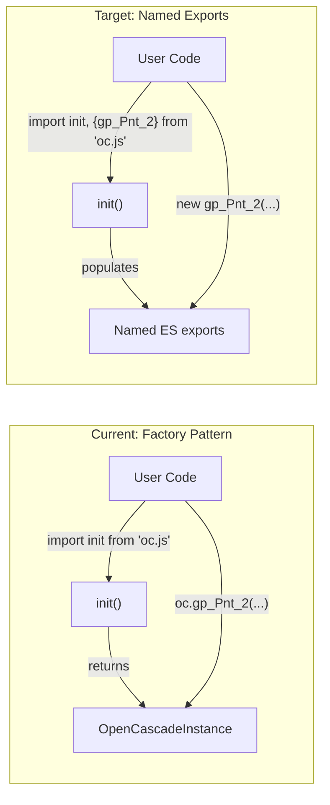

# Named Export Migration for opencascade.js

Migrate from `import oc from 'opencascade.js'; const box = new oc.BRepPrimAPI_MakeBox_2(...)` to `import init, { BRepPrimAPI_MakeBox_2 } from 'opencascade.js'; await init(); const box = new BRepPrimAPI_MakeBox_2(...)`.

## Architecture: Before vs. After




## Key Technical Decision: `MODULARIZE=instance`

Per [Emscripten docs](https://emscripten.org/docs/compiling/Modularized-Output.html), `-sMODULARIZE=instance` combined with `-sEMBIND_AOT` (PR [#23404](https://github.com/emscripten-core/emscripten/pull/23404), merged May 2025):

- Exports embind-bound classes/enums as named ES module exports
- Keeps `init()` as the **default export** (accepts options like `locateFile`, `instantiateWasm`)
- Named exports are ES live bindings -- undefined before `init()`, populated after
- Implicitly enables `-sEXPORT_ES6=1`

The current Emscripten version is **5.0.1** (from [Dockerfile](repos/opencascade.js/Dockerfile)). Since 5.0.1 postdates the May 2025 PR, it should include embind AOT named export support. This must be validated during the build.

### Limitation check

The docs warn: "Internal usage (e.g. within EM_JS / JS library code) of the `Module` global does not work." opencascade.js bindings use standard embind API (no EM_JS), but the `FS` runtime method uses Emscripten internals. We must validate `FS` works as a named export by running the data-exchange smoke tests post-build.

---

## Build Strategy

**This is a long-running migration.** The WASM build alone can take 30-60+ minutes even with fast settings. We take as long as we need -- correctness over speed.

**Build configuration for iteration:**

- Start from a **fresh build** (clean `build-configs/` output directory)
- Use the `**full-exceptions`** config to get exception handling support
- Use `**-O0` compile + `-O0` link** optimizations (`OCJS_OPT=-O0`) to minimize build time during iteration
- Once the named export pipeline is validated end-to-end, a production build with higher optimization can be done separately

---

## Phase 1: Emscripten Build Config (opencascade.js)

Update the YAML build configs and default schema to use `MODULARIZE=instance` + `EMBIND_AOT`.

**Files to change:**

- [repos/opencascade.js/build-configs/full.yml](repos/opencascade.js/build-configs/full.yml) -- update `emccFlags`
- [repos/opencascade.js/build-configs/full-exceptions.yml](repos/opencascade.js/build-configs/full-exceptions.yml) -- same
- [repos/opencascade.js/src/customBuildSchema.py](repos/opencascade.js/src/customBuildSchema.py) -- update default `emccFlags`

**Flag changes in each:**

- Replace `-sMODULARIZE` with `-sMODULARIZE=instance`
- Add `-sEMBIND_AOT`
- Remove `-sEXPORT_ES6=1` (implicitly enabled by `MODULARIZE=instance`)
- Keep all other flags unchanged

Then do a fresh build with minimal optimization for fast iteration:

```bash
cd repos/opencascade.js
nohup bash build-wasm.sh full-exceptions OCJS_OPT=-O0 OCJS_LTO=0 OCJS_SKIP_WASM_OPT=1 2>&1 > build.log &
```

Note: `OCJS_SKIP_WASM_OPT=1` avoids the wasm-opt pass which adds +1.4% size at `-O0` due to canonicalization (see G8).

This build can take a significant amount of time (30-60+ minutes). Monitor with `tail -f build.log`. Do not proceed to subsequent phases until the build completes successfully and the output JS file contains named ES module exports.

---

## Phase 2: TypeScript Declaration Generator (opencascade.js)

Minimal changes needed. Classes are already exported (`export declare class gp_Pnt { ... }`). The main change is to the `init` function, `FS` declaration, and exception helper typing.

**File:** [repos/opencascade.js/src/buildFromYaml.py](repos/opencascade.js/src/buildFromYaml.py) (lines 551-555)

Current:

```python
"declare function init(): Promise<OpenCascadeInstance>;\n\n" +
"export default init;\n"
```

Change to:

```python
"export default function init(options?: Record<string, unknown>): Promise<void>;\n"
```

Also update the `FS` namespace declaration (lines 381-525) to be `export declare namespace FS { ... }` instead of `declare namespace FS { ... }`, making it a proper named export.

Keep `OpenCascadeInstance` as a convenience aggregate type (useful for typing the full module shape in framework code).

### 2b. Emit `getExceptionMessage` binding for exceptions builds

Currently, `getExceptionMessage` is a runtime-only Emscripten helper with no TypeScript declaration. Consumers are forced to manually type it:

```typescript
// oc-tracing.ts (line 106-108) -- manual type workaround
type OcWithExceptionHelpers = OpenCascadeInstance & {
  getExceptionMessage?: ExceptionDecoder;
};

// oc-exceptions.ts (line 87-89) -- another manual workaround
type EmscriptenExceptionHelpers = {
  getExceptionMessage(ex: WebAssembly.Exception): [string, string];
};
```

**Fix:** In [repos/opencascade.js/src/buildFromYaml.py](repos/opencascade.js/src/buildFromYaml.py), conditionally emit the declaration when `USE_WASM_EXCEPTIONS` is true (already imported from `Common.py`, set by `OCJS_EXCEPTIONS=1`):

```python
if USE_WASM_EXCEPTIONS:
    typescriptDefinitionOutput += \
      "export declare function getExceptionMessage(ex: WebAssembly.Exception): [string, string];\n\n"
    typescriptExports.append({"export": "getExceptionMessage", "kind": "function"})
```

This adds `getExceptionMessage` as both a named export and an entry in `OpenCascadeInstance`.

**Build config:** Add `-sEXPORT_EXCEPTION_HANDLING_HELPERS=1` to [repos/opencascade.js/build-configs/full-exceptions.yml](repos/opencascade.js/build-configs/full-exceptions.yml) `emccFlags` to ensure Emscripten exports the helper at runtime. With `MODULARIZE=instance`, this becomes a proper named ES module export.

**Downstream benefit:** Once this is in place, the manual type workarounds in `oc-tracing.ts` (`OcWithExceptionHelpers`) and `oc-exceptions.ts` (`EmscriptenExceptionHelpers`) can be removed -- consumers import the properly typed function directly or rely on `OpenCascadeInstance` including it.

---

## Phase 3: Distribution Wrapper Files (opencascade.js)

**File:** [repos/opencascade.js/dist/index.js](repos/opencascade.js/dist/index.js)

```javascript
// Before:
export { default } from './opencascade_full.js';

// After:
export * from './opencascade_full.js';
export { default } from './opencascade_full.js';
```

**File:** [repos/opencascade.js/dist/index.d.ts](repos/opencascade.js/dist/index.d.ts) -- already has `export` *, no change needed.

**File:** [repos/opencascade.js/dist/node.js](repos/opencascade.js/dist/node.js) -- remove or replace with a thin re-export. The `init()` default export now accepts options natively, eliminating the need for the Node.js wrapper.

---

## Phase 4: Test Helper (opencascade.js)

**File:** [repos/opencascade.js/tests/smoke/helpers.ts](repos/opencascade.js/tests/smoke/helpers.ts)

Change from returning an `OpenCascadeInstance` to calling `init()`:

```typescript
import init from '../../build-configs/opencascade_full.js';

let initialized = false;

export async function initOC(): Promise<void> {
  if (!initialized) {
    await init({ locateFile: (f: string) => path.join(BUILD_DIR, f) });
    initialized = true;
  }
}
```

`getOC()` can be kept as an alias for backward compatibility or removed entirely. The key change: tests no longer receive an `oc` object -- they import classes directly from the module.

---

## Phase 5: Smoke Tests (opencascade.js -- ~31 files)

Every smoke test changes from the `oc.ClassName(...)` pattern to named imports:

**Before** ([repos/opencascade.js/tests/smoke/smoke-primitives.test.ts](repos/opencascade.js/tests/smoke/smoke-primitives.test.ts)):

```typescript
import { getOC, wasmExists } from './helpers.js';

describe.skipIf(!wasmExists)('Smoke: BRep primitives', () => {
  it('box', async () => {
    const oc = await getOC();
    const box = new oc.BRepPrimAPI_MakeBox_2(10, 20, 30);
    // ...
  });
});
```

**After:**

```typescript
import { initOC, wasmExists } from './helpers.js';
import { BRepPrimAPI_MakeBox_2 } from '../../build-configs/opencascade_full.js';

describe.skipIf(!wasmExists)('Smoke: BRep primitives', () => {
  beforeAll(() => initOC());

  it('box', () => {
    const box = new BRepPrimAPI_MakeBox_2(10, 20, 30);
    // ...
  });
});
```

- Each test imports only the classes/enums it uses (ES live bindings, populated after `initOC()`)
- `beforeAll(() => initOC())` replaces per-test `const oc = await getOC()`
- All `oc.ClassName` references become direct `ClassName` references
- Enum access: `oc.TopAbs_ShapeEnum.TopAbs_FACE` becomes `TopAbs_ShapeEnum.TopAbs_FACE`
- Static methods: `oc.BRepGProp.VolumeProperties_1(...)` becomes `BRepGProp.VolumeProperties_1(...)`
- FS access: `oc.FS.readFile(...)` becomes `FS.readFile(...)`

**Files:** All `tests/smoke/smoke-*.test.ts` (29 files) + `geometry-helpers.ts`

---

## Phase 6: Type Tests (opencascade.js)

**File:** [repos/opencascade.js/tests/namespaces.test-d.ts](repos/opencascade.js/tests/namespaces.test-d.ts)

- Remove `type OC = Awaited<ReturnType<typeof init>>` (init returns `void` now)
- Update the `OC['gp_Pnt']` compatibility checks to use `typeof gp_Pnt` instead
- Namespace type tests remain the same

**File:** [repos/opencascade.js/tests/types.test-d.ts](repos/opencascade.js/tests/types.test-d.ts)

- Update the `init` return type test: `init` now returns `Promise<void>`, not `Promise<OpenCascadeInstance>`
- Replace `typeof init` return assertions with direct import assertions

---

## Phase 7: Rebuild, Repackage, Integrate into Tau

1. Run full test suite in opencascade.js: `pnpm test`
2. Pack tarball: `npm pack`
3. Copy WASM + d.ts to `packages/kernels/src/kernels/opencascade/wasm/`
4. Install tarball: `pnpm install ./repos/opencascade.js/opencascade.js-*.tgz --force`
5. Validate integration with kernels tests

---

## Phase 8: Tau Kernel Files

### Replicad tracing/exceptions: zero changes required

The Proxy-based tracing ([packages/kernels/src/kernels/replicad/oc-tracing.ts](packages/kernels/src/kernels/replicad/oc-tracing.ts)) and exception handling ([packages/kernels/src/kernels/replicad/oc-exceptions.ts](packages/kernels/src/kernels/replicad/oc-exceptions.ts)) modules are fully compatible with the named export migration. Their contract depends solely on property access via `Reflect.get()` inside `Proxy` handlers, which works identically with ES Module Namespace Objects as with plain factory return objects. The tests (`oc-tracing.test.ts`, `oc-exceptions.test.ts`) use plain mock objects and test Proxy mechanics -- they require no changes.

When the `getExceptionMessage` binding is emitted in the d.ts (Phase 2b), the manual type workarounds (`OcWithExceptionHelpers`, `EmscriptenExceptionHelpers`) can be removed and replaced with direct type usage from the package. This is tracked separately as it also applies to `replicad-opencascadejs`.

### 8a. Init helper

**File:** [packages/kernels/src/kernels/opencascade/init-opencascade.ts](packages/kernels/src/kernels/opencascade/init-opencascade.ts)

The `initOpenCascade` function changes from calling a factory to calling the module's `init()` default export:

```typescript
export async function initOpenCascade(
  wasmUrl: string,
  moduleExports: typeof import('#kernels/opencascade/wasm/opencascade_full.js'),
  options?: InitOpenCascadeOptions,
): Promise<void> {
  const compiledModule = await compileWasmStreaming(wasmUrl, options?.tracer);
  await moduleExports.default({
    instantiateWasm(imports, successCallback) { /* same pattern */ },
    print: options?.print ?? noop,
    printErr: options?.printErr ?? noop,
  });
}
```

No longer returns `OpenCascadeInstance` -- the module namespace object IS the instance.

### 8b. Kernel main file

**File:** [packages/kernels/src/kernels/opencascade/opencascade.kernel.ts](packages/kernels/src/kernels/opencascade/opencascade.kernel.ts)

- `resolveWasm()` returns the module namespace instead of a factory
- `initialize()` stores the module namespace as `oc` in context (same shape as before)
- Internal `oc.ClassName(...)` calls remain unchanged -- the module namespace has the same property access pattern
- `registerOcModule()` receives the module namespace (works with `Object.keys()`)
- Virtual module code: remove `export default __mod;`, keep only named exports + add `export default function init() {}` as a no-op

### 8c. Mesh helper

**File:** [packages/kernels/src/kernels/opencascade/opencascade-mesh.ts](packages/kernels/src/kernels/opencascade/opencascade-mesh.ts)

- Parameter type changes from `OpenCascadeInstance` to the module type or a compatible interface
- Runtime code (`oc.ClassName(...)`) stays the same

### 8d. Type re-exports

**File:** [packages/kernels/src/kernels/opencascade/opencascade.types.ts](packages/kernels/src/kernels/opencascade/opencascade.types.ts)

- Keep `OpenCascadeInstance` re-export (useful as a convenience type)

---

## Phase 9: Tau User-Facing Code

### 9a. Kernel tests

**File:** [packages/kernels/src/kernels/opencascade/opencascade.kernel.test.ts](packages/kernels/src/kernels/opencascade/opencascade.kernel.test.ts)

Update all ~14 inline code strings from:

```typescript
`import oc from 'opencascade';\nexport default function main() { return new oc.BRepPrimAPI_MakeBox_2(10, 10, 10).Shape(); }`
```

to:

```typescript
`import { BRepPrimAPI_MakeBox_2 } from 'opencascade';\nexport default function main() { return new BRepPrimAPI_MakeBox_2(10, 10, 10).Shape(); }`
```

Also update the `require('opencascade')` CJS test case.

### 9b. Prompt example

**File:** [apps/api/app/api/chat/prompts/kernel-prompt-configs/opencascadejs.prompt.example.ts](apps/api/app/api/chat/prompts/kernel-prompt-configs/opencascadejs.prompt.example.ts)

Change from:

```typescript
// @ts-expect-error -- opencascade.js types not available
import oc from 'opencascade.js';
const body = new oc.BRepPrimAPI_MakeBox_3(...);
```

to:

```typescript
import { BRepPrimAPI_MakeBox_3, gp_Pnt_3, gp_Ax2_3, gp_Dir_4, BRepPrimAPI_MakeCylinder_3, BRepAlgoAPI_Cut_3, Message_ProgressRange_1 } from 'opencascade.js';
const body = new BRepPrimAPI_MakeBox_3(...);
```

This eliminates the `@ts-expect-error` since named imports resolve against the d.ts where the classes are declared as exports.

### 9c. Prompt config

**File:** [apps/api/app/api/chat/prompts/kernel-prompt-configs/opencascadejs.prompt.config.ts](apps/api/app/api/chat/prompts/kernel-prompt-configs/opencascadejs.prompt.config.ts)

Update `codeStandards` string from `import oc from 'opencascade.js'` to `import { ClassName } from 'opencascade.js'`.

### 9d. Kernel constants (empty code template)

**File:** [libs/types/src/constants/kernel.constants.ts](libs/types/src/constants/kernel.constants.ts) (line 138)

Update `emptyCode` from:

```typescript
`import oc from 'opencascade.js';
export default function main(p = defaultParams) {
  const box = new oc.BRepPrimAPI_MakeBox_2(p.width, p.height, p.depth);`
```

to:

```typescript
`import { BRepPrimAPI_MakeBox_2 } from 'opencascade.js';
export default function main(p = defaultParams) {
  const box = new BRepPrimAPI_MakeBox_2(p.width, p.height, p.depth);`
```

### 9e. Detection regex

**File:** [packages/kernels/src/plugins/kernel-factories.ts](packages/kernels/src/plugins/kernel-factories.ts) (line 47)

The current regex `/import.*from\s+["']opencascade(\.js)?["']/s` already matches named imports (`import { X } from 'opencascade.js'`). No change needed.

---

## Phase 10: Validation

Run all affected projects:

- `pnpm nx test kernels --watch=false`
- `pnpm nx typecheck kernels`
- `pnpm nx lint kernels`
- `pnpm nx typecheck ui` (for kernel.constants.ts)
- `pnpm nx typecheck api` (for prompt example)
- `pnpm nx lint api`

---

## Known Gotchas & Insights

Collected from our full build/test/integration history. Review before each phase.

### G1. `getExceptionMessage` d.ts is manually patched -- will be lost on rebuild

The current `opencascade_full.d.ts` in the repo already declares `getExceptionMessage`, `incrementExceptionRefcount`, and `decrementExceptionRefcount` (lines 184258-184265). However, `buildFromYaml.py` has **no code** that generates these declarations -- they were manually added to the built artifact. When we rebuild, this patch will be silently lost. Phase 2b must emit all three helpers (`getExceptionMessage`, `incrementExceptionRefcount`, `decrementExceptionRefcount`), not just `getExceptionMessage`.

### G2. `-sEXPORT_EXCEPTION_HANDLING_HELPERS` not in exceptions YAML

`full-exceptions.yml` does not include `-sEXPORT_EXCEPTION_HANDLING_HELPERS=1`. Without this flag, Emscripten will not export `getExceptionMessage` as a named ES module export with `MODULARIZE=instance`. The function may exist internally but is not guaranteed to be accessible. Phase 1 must add this flag.

### G3. Embind cross-instance type registry conflict (single-instance rule)

Each WASM initialization creates its own embind type registry. Passing objects between instances causes `"Expected null or instance of X, got an instance of X"` errors. With `MODULARIZE=instance`, the module is designed for single-instance use. This means:

- Tests must share a single `init()` call (the `let initialized = false` singleton in `helpers.ts` is mandatory)
- Never call `init()` more than once per process/worker
- The kernel test suite already documents this: `packages/kernels/src/kernels/opencascade/opencascade.kernel.test.ts` lines 15-16

### G4. `resolveCjsDefault` workaround becomes unnecessary

`init-opencascade.ts` uses `resolveCjsDefault()` to handle double-wrapped default exports from dynamic `import()` of CJS modules. With `MODULARIZE=instance` + `EXPORT_ES6`, the output is always ESM, so this workaround can be removed. However, if custom WASM configs (the `{ wasmUrl, wasmBindingsUrl }` path) might still import CJS modules, keep it as a fallback or gate it behind a check.

### G5. `--closure 1` breaks embind exports

The optimization research doc (`docs/research/occt-wasm-optimization.md`) documents known issues with closure compiler + embind: public class fields get mangled, `assert` externs are missing, and some export combinations cause missing function exports. **Do not enable `--closure 1` with `MODULARIZE=instance` + `EMBIND_AOT`** until it has been validated in isolation.

### G6. `-sMINIMAL_RUNTIME` and `-sSTANDALONE_WASM` are incompatible

Both are incompatible with embind and FS. The Emscripten docs for `MODULARIZE=instance` also list `MINIMAL_RUNTIME` as unsupported. Do not experiment with these flags.

### G7. Constructor/method numbering is build-specific

OCCT V8 changed overload sets, causing constructor suffixes to shift (e.g., `gp_Ax2_3` in v7.6 might be `gp_Ax2_4` in v8). With named exports, these suffixed names ARE the export names. The d.ts must exactly match the built module:

- Never mix a v7.6 d.ts with a v8 WASM build
- The tarball must always contain matched d.ts + WASM + JS glue
- Full vs. replicad builds have different numbering for the same class (different symbol sets)

### G8. `wasm-opt -O0` increases file size -- skip for dev builds

`wasm-opt -O0` adds +1.4% to WASM size due to canonicalization passes that expand certain patterns. For `-O0` iteration builds, consider adding `OCJS_SKIP_WASM_OPT=1` to the build command to skip wasm-opt entirely. This saves ~5 seconds and avoids the unnecessary size increase.

### G9. `FS` uses Emscripten JS library internals -- validate with `MODULARIZE=instance`

The `MODULARIZE=instance` docs warn that internal `Module` global usage in EM_JS/JS library code does not work. The `FS` API is implemented as Emscripten JS library code and may reference `Module` internally. The data-exchange smoke tests (`smoke-data-exchange.test.ts`, `smoke-gltf.test.ts`) exercise `FS.readFile` / `FS.writeFile` / `FS.unlink` and must pass to confirm `FS` works correctly as a named export. If they fail, `FS` may need special handling.

### G10. PCH must match exception mode -- stale cache causes compilation failures

When switching between exception/non-exception builds, the precompiled header (PCH) from a previous build causes binding compilation failures. For our fresh `-O0` build from clean state, this is not an issue. But when iterating between configs, always clean `build/` first or start from a fresh build directory.

### G11. `-fno-exceptions` is blocked for OCCT

OCCT headers use `throw` in inline macros (`Standard_ConstructionError_Raise_if`, etc.). Clang errors with `-fno-exceptions`. This does not affect the named export migration directly, but it means every OCCT build inherently supports exceptions at some level -- the choice is between JS trampolines (`-sDISABLE_EXCEPTION_CATCHING=0`) and native WASM exceptions (`-fwasm-exceptions`).

### G12. `libclang` version mismatch can degrade binding types

`repos/opencascade.js/src/Common.py` (lines 95-98) documents that pip `libclang` (v18) cannot parse emsdk Clang 23 headers. Template types like `occ::handle<T>` can silently degrade to `int` in the binding generator output. The build uses system libc++ and Clang built-in headers to work around this. After any Emscripten upgrade, verify that generated bindings are correct.

### G13. 1,216 TypeScript type generation warnings are expected

The d.ts generator produces `could not generate proper types for type name '...'` warnings for template types, nested types, and unbound Handle types. These result in `any` types in the d.ts but don't affect runtime behavior. Don't treat these warnings as build failures.

---

## Risk Mitigation

- `**EMBIND_AOT` compatibility**: If `EMBIND_AOT` has issues with opencascade.js binding patterns (subclass constructors, `optional_override`, smart pointers), fall back to `MODULARIZE=instance` without AOT. In this case, named exports won't work and we use a wrapper module approach instead.
- `**FS` with `MODULARIZE=instance`**: If the `FS` API doesn't work as a named export (see G9), keep `FS` on the instance and access it separately.
- **Emscripten version**: If 5.0.1 lacks embind named export support, upgrade Emscripten in the Dockerfile.
- **Stale PCH**: When switching between build configs, always clean `build/` first (see G10).
- **Closure compiler**: Do not enable `--closure 1` during this migration (see G5).

