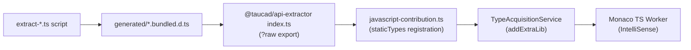

# Add OpenCASCADE.js Types to Monaco IntelliSense

## Architecture

The existing type pipeline flows through four layers:




OpenCASCADE is the only kernel missing from this pipeline. The Manifold extractor ([extract-manifold-types.ts](libs/api-extractor/src/extract-manifold-types.ts)) is the closest template since it also reads pre-existing `.d.ts` files and wraps them (vs Replicad/JSCAD which use the TS Compiler API for deep extraction).

## Size consideration

The `opencascade_full.d.ts` is **8.5 MB / 198K lines** (vs ~~90-104 KB for other kernels). This is inherent to OCCT's thousands of classes. The extractor will strip the **~~7K lines of namespace convenience aliases** (e.g. `export namespace BRep { export type Builder = BRep_Builder; }`) — these add no functional value since users access `oc.BRepPrimAPI_MakeBox` directly. All class declarations, `OpenCascadeInstance`, `FS`, `TopoDS`, `OCJS`, `init()`, and `Standard_`* aliases must remain for IntelliSense to work.

The stripped result is still ~7.5 MB but Monaco's TS worker runs in a Web Worker and routinely handles large definition sets (`@types/node` etc.). No main-thread impact.

## Implementation

### 1. Create extraction script

**File:** [libs/api-extractor/src/extract-opencascade-types.ts](libs/api-extractor/src/extract-opencascade-types.ts) (new)

Follow the Manifold extractor pattern:

- Read `packages/runtime/src/kernels/opencascade/wasm/opencascade_full.d.ts`
- Strip `export declare` to `export` (inside `declare module`, `declare` is implicit)
- Strip namespace alias blocks (`export namespace Foo { ... }`) — these are ~268 blocks of shorthand aliases that duplicate full-qualified names
- Wrap in two `declare module` blocks: `'opencascade.js'` and `'opencascade'` (both are registered as `builtinModuleNames` in [kernel-factories.ts](packages/runtime/src/plugins/kernel-factories.ts#L75))
- Export a `buildBundledTypes()` function (for testability) and a `main()` CLI entry
- Output to `libs/api-extractor/src/generated/opencascade/opencascade.bundled.d.ts`

### 2. Add Nx target

**File:** [libs/api-extractor/project.json](libs/api-extractor/project.json)

Add alongside the existing extract targets:

```json
"extract-opencascade": {
  "executor": "nx:run-commands",
  "options": {
    "command": "tsx src/extract-opencascade-types.ts",
    "cwd": "libs/api-extractor"
  }
}
```

### 3. Run extraction

Execute `pnpm nx extract-opencascade api-extractor` to generate the bundled `.d.ts`.

### 4. Export from `@taucad/api-extractor`

**File:** [libs/api-extractor/src/index.ts](libs/api-extractor/src/index.ts)

Add:

```typescript
export { default as opencascadeTypes } from '#generated/opencascade/opencascade.bundled.d.ts?raw';
```

### 5. Register in Monaco static types

**File:** [apps/ui/app/lib/javascript-contribution.ts](apps/ui/app/lib/javascript-contribution.ts)

Import and add to the `staticTypes` array:

```typescript
import { replicadTypesOriginal, jscadModelingTypes, manifoldTypes, opencascadeTypes } from '@taucad/api-extractor';
// ...
staticTypes: [
  // ... existing entries ...
  {
    packageName: 'opencascade.js',
    content: opencascadeTypes,
    prewrapped: true,
  },
],
```

The `prewrapped: true` flag tells `TypeAcquisitionService` the content already contains `declare module` blocks, so it won't double-wrap. The `builtinTypePackages` set prevents ATA from trying to fetch `opencascade.js` from esm.sh.

Note: We only need `packageName: 'opencascade.js'` (not a separate entry for `'opencascade'`) because the bundled `.d.ts` itself contains both `declare module 'opencascade.js'` and `declare module 'opencascade'` blocks. The `packageName` is used for ATA dedup tracking, and users primarily `import oc from 'opencascade.js'`. We should also add `'opencascade'` to `builtinTypePackages` — check if `TypeAcquisitionService` needs a second `staticTypes` entry with `packageName: 'opencascade'` pointing to the same content, or if the dual `declare module` blocks handle resolution on their own. If Monaco resolves `import ... from 'opencascade'` just from the `declare module 'opencascade'` block inside the registered file, a single entry suffices. Otherwise, register both package names.

### 6. Update new-kernel skill

**File:** [.cursor/skills/new-kernel/SKILL.md](.cursor/skills/new-kernel/SKILL.md)

Add a new step **3.9 Monaco IntelliSense types** in the "Wire Into System" section (after 3.8 Catalog metadata):

- Create an extraction script at `libs/api-extractor/src/extract-<id>-types.ts` that reads the kernel's `.d.ts` and wraps in `declare module '<package>'` blocks
- Add `extract-<id>` Nx target in `libs/api-extractor/project.json`
- Export from `libs/api-extractor/src/index.ts` via `?raw`
- Register in `apps/ui/app/lib/javascript-contribution.ts` as a `staticTypes` entry
- Reference existing extractors as templates: Manifold (simple file wrapping), Replicad/JSCAD (TS Compiler API extraction)

Also add the corresponding file to the **File Checklist** and mention it in the **Common Failure Modes** section (forgot Monaco types -> no editor IntelliSense for the kernel).

### 7. Verify

```bash
pnpm nx extract-opencascade api-extractor   # generates bundled .d.ts
pnpm nx typecheck api-extractor             # ensure extractor types are valid
pnpm nx lint api-extractor                  # lint the new script
pnpm nx typecheck ui                        # ensure import resolves
pnpm nx lint ui                             # lint the registration
```

