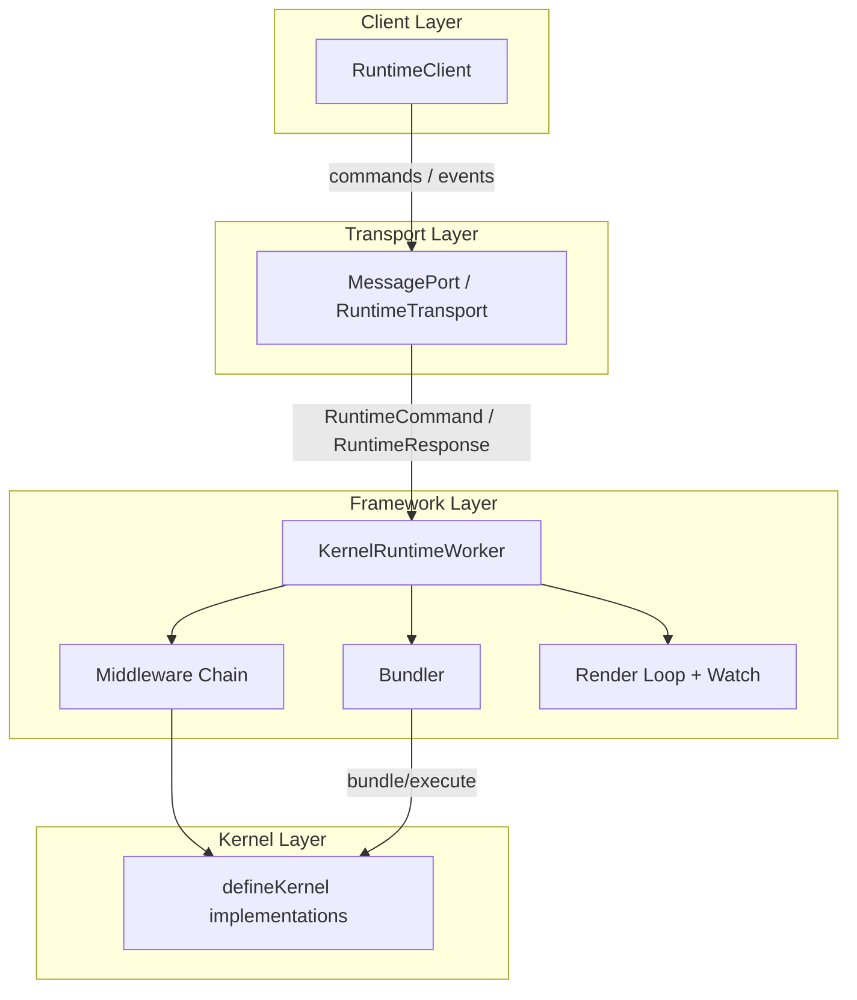
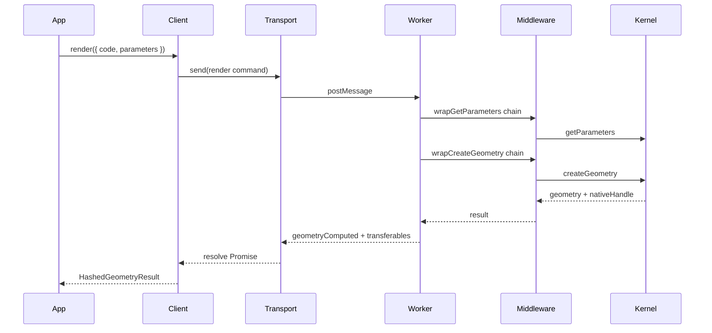
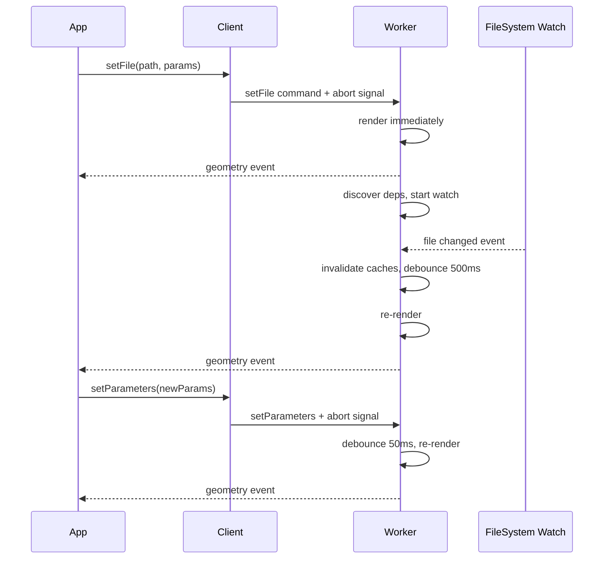

# Architecture

The @taucad/runtime is built as a layered architecture. Each layer has a single responsibility, and data flows from the consumer-facing API down to the CAD engine. The runtime supports two interaction modes: request/response rendering via `client.render()` and autonomous reactive rendering via `client.setFile()` and `client.setParameters()`.

## Context and Motivation

CAD kernels (Replicad, OpenCASCADE, Manifold, OpenSCAD, JSCAD, Zoo) have different execution models: some run in WASM, some call external processes, some connect to remote APIs. A unified API must abstract these differences while preserving isolation (heavy computation must not block the main thread) and extensibility (new kernels and features must plug in without modifying core code). The layered design achieves both.

## How It Works

The runtime has four layers stacked vertically. Each layer depends only on the one below it.

### Client Layer (RuntimeClient)

The [RuntimeClient](../api/client) is the primary consumer API. It supports two modes:

**Request/response mode** -- Promise-based `render()` and `export()` methods for one-shot operations. The client sends a command, waits for the result, and resolves the Promise.

**Autonomous mode** -- `setFile()` and `setParameters()` trigger autonomous rendering inside the worker. The worker watches file dependencies, debounces changes, and pushes results back via events. Subscribe with `client.on('geometry', ...)`, `client.on('state', ...)`, and `client.on('parametersResolved', ...)`.

The client lazily initializes the worker and transport on first `connect()`, `render()`, or `setFile()`.

### Transport Layer (MessagePort)

The [RuntimeTransport](../api/transport) is a low-level interface: `send(message, transferables?)` and `onMessage(handler)`. The default implementation uses a Web Worker and `postMessage`. The protocol is defined by `RuntimeCommand` and `RuntimeResponse` types. For testing or Node.js environments, `createInProcessTransport()` provides an in-process alternative.

### Framework Layer (KernelRuntimeWorker)

The framework runs inside the worker. [`KernelRuntimeWorker`](./worker-model) (exported from `@taucad/runtime/worker`) is the multi-kernel host that orchestrates:

- **Kernel selection** -- Selects the active kernel per file using extension, regex, and bundler-assisted detection. See [Kernel Selection](./kernel-selection).
- **Middleware chain** -- Onion-model wrappers around `createGeometry`, `getParameters`, and `exportGeometry`. Middleware runs in registration order (first registered = outermost).
- **Bundler** -- Lazy-loaded for JS/TS kernels. Bundles entry files and dependencies, executes code, and supports `detectImports` for kernel selection.
- **Autonomous render loop** -- Manages the internal render lifecycle: `setFile` triggers immediate rendering, dependency discovery, and filesystem watch subscription. File changes are debounced (500ms) and parameter changes are debounced (50ms) before re-rendering.
- **Abort infrastructure** -- SharedArrayBuffer-based abort channel for cancelling in-progress renders without waiting for completion.

### Kernel Layer (defineKernel implementations)

Kernels are plain objects returned by [defineKernel](../api/kernels). They implement `getDependencies`, `getParameters`, `createGeometry`, and `exportGeometry`. No inheritance; state lives in a context returned by `initialize()`. The framework invokes these methods through the middleware chain.

## Protocol

The runtime uses an asymmetric protocol: few commands in, many event types out.

**Main thread -> Worker (commands):**

| Command         | Trigger                   | Worker Behavior                                   |
| --------------- | ------------------------- | ------------------------------------------------- |
| `setFile`       | User opens file           | Render immediately, discover deps, start watching |
| `setParameters` | User adjusts slider/input | Store params, debounce 50ms, re-render            |
| `render`        | `client.render()` call    | One-shot render, return result                    |
| `export`        | `client.export()` call    | Export from last native handle                    |

**Worker -> Main thread (events):**

| Event                | Trigger              | Main Thread Behavior              |
| -------------------- | -------------------- | --------------------------------- |
| `geometryComputed`   | Render completes     | Update 3D scene / resolve Promise |
| `parametersResolved` | Parameters extracted | Update parameter UI controls      |
| `stateChanged`       | Worker state changes | Update progress indicator         |
| `progress`           | During render        | Progress bar                      |
| `error`              | Render fails         | Diagnostics panel                 |
| `log`                | Ongoing              | Console output                    |

## Data Flow: render() vs setFile()

### render() -- Request/Response

### setFile() -- Autonomous Reactive

In autonomous mode, the worker is a self-contained render service. The main thread sends `setFile` and `setParameters`; the worker handles scheduling, dependency watching, cache invalidation, and abort. Results are pushed back as events.

## Key Relationships

- **Client and Transport**: The client creates or receives a transport and passes it to `RuntimeWorkerClient`. Custom transports enable testing (mock transport) or non-browser environments (Node.js worker threads, HTTP).
- **Framework and Kernel**: The framework loads kernel modules by URL, initializes them, and invokes their methods. Kernels receive `KernelRuntime` (filesystem, logger, bundler, execute, tracer) and their own context.
- **Middleware and Kernel**: Middleware sits between the framework entry points and the kernel. It has no direct reference to the kernel; it receives a `handler` that continues the chain.
- **Worker and FileSystem**: The filesystem is bridged to the worker via MessagePort. In autonomous mode, the worker watches the filesystem for changes and re-renders automatically.

## Implications

- **Testability**: Each layer can be tested in isolation. Mock transports, in-process workers, and kernel stubs are straightforward.
- **Extensibility**: New kernels, middleware, and bundlers plug in via factory functions. No core code changes.
- **Performance**: Transferables avoid copying large geometry buffers. Lazy bundler initialization means non-JS kernels pay no bundling cost. SharedArrayBuffer abort avoids wasting CPU on superseded renders.
- **Single worker**: One `KernelRuntimeWorker` hosts all registered kernels. Selection happens per file; only the matching kernel runs.

## Further Reading

- [Plugin System](./plugin-system) -- How `defineKernel`, `defineMiddleware`, and `defineBundler` compose
- [Worker Model](./worker-model) -- Web Workers, SharedArrayBuffer abort channel, and the autonomous render service
- [Render Lifecycle](./render-lifecycle) -- Detailed render loop, cancellation strategies, and signal channel
- [API: Client](../api/client) -- `createRuntimeClient` and `RuntimeClient` types
- [API: Transport](../api/transport) -- `RuntimeTransport` and `createWorkerTransport`
- [Quick Start](../getting-started/quick-start) -- End-to-end setup
