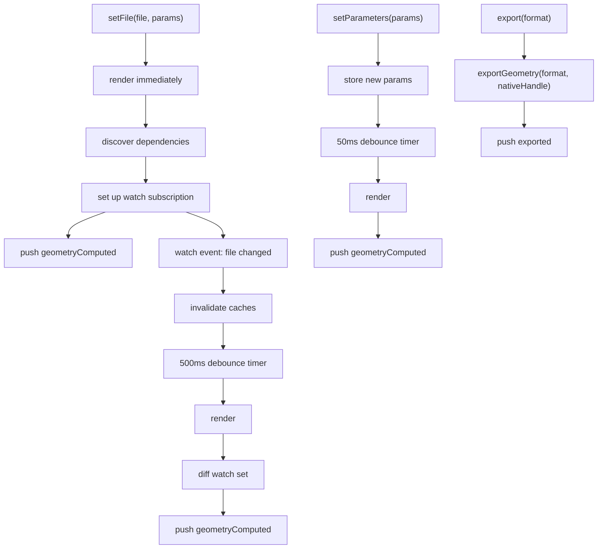

# Render Lifecycle

The runtime worker manages its own render lifecycle autonomously. After receiving `setFile`, it renders immediately, discovers dependencies, watches for changes, and re-renders on file or parameter updates. Three cancellation strategies ensure that superseded renders are aborted as quickly as possible while guaranteeing correctness.

## Context and Motivation

In a traditional command-driven model, the main thread decides when to render. But the main thread lacks critical information: it does not know the dependency graph, cache state, or whether a render is stale. The autonomous model pushes scheduling to the worker, which has all this context. The result is lower latency (no main-thread round-trips) and simpler client code (subscribe to events instead of orchestrating renders).

## How It Works

### The Render Loop



**setFile(file, params):** Store the file and params. Render immediately (aborting any in-progress render). After rendering, discover the file's dependencies. Set up a filesystem watch subscription scoped to the dependency set. Push `geometryComputed` to the main thread.

**Watch event (file in dependency graph changed):** Invalidate the relevant caches (sync `Map.delete()`, atomic). Start or reset a 500ms debounce timer. When the timer fires, render again (aborting any in-progress render). After rendering, discover new dependencies and diff the watch set (add new paths, remove stale ones). Push `geometryComputed`.

**setParameters(params):** Store the new parameters. Start or reset a 50ms debounce timer (shorter than the file debounce because parameter changes are typically user-driven and latency-sensitive). When the timer fires, render again. Push `geometryComputed`.

**export(format):** Export from the last native handle produced by `createGeometry`. Push the export result.

### Why Two Debounce Timers

File changes use a 500ms debounce because multiple files may change in quick succession (e.g., a save-all operation or filesystem sync). The longer window allows batching.

Parameter changes use a 50ms debounce because they are user-driven (slider drags, input typing). A shorter window provides more responsive feedback.

If both a file change and parameter change arrive during the same window, the shorter timer wins and the render uses the latest state for both.

## Render Cancellation

Two goals must be satisfied simultaneously:

1. **Start the latest render as soon as possible** -- do not block behind an in-progress render.
2. **Abort the superseded render as quickly as possible** -- do not waste CPU on geometry the user will never see.

Three strategies work together:

### Strategy 1: Proxy-Based Cooperative Abort (OC-Based Kernels)

The OC tracing Proxy intercepts every OpenCASCADE API call -- constructors, methods, and property access. A typical user `main()` makes 500-5000 individual OC calls. Adding an abort check gives sub-millisecond abort granularity during the heaviest synchronous phase:

```typescript @ts-nocheck
if (Atomics.load(abortFlag, 0) !== currentGeneration) {
  throw new RenderAbortedError();
}
```

Overhead: one `Atomics.load()` per OC call (~1ns). Given that OC calls take microseconds to milliseconds, this is unmeasurable noise. This strategy covers Replicad and OpenCASCADE kernels.

### Strategy 2: Async Boundary Abort (All Kernels)

Between `await` points in the render pipeline (bundle -> execute -> main -> tessellate -> GLTF), check the generation counter:

```typescript @ts-nocheck
const bundleResult = await this.bundle(this.currentFile);
if (generation !== this.renderGeneration) return; // abort checkpoint

const executeResult = await this.execute(bundleResult.code);
if (generation !== this.renderGeneration) return; // abort checkpoint

const geometry = await this.computeGeometry(executeResult);
if (generation !== this.renderGeneration) return; // abort checkpoint
```

For JSCAD, Manifold, and other kernels without a WASM Proxy, these async boundary checks provide the abort mechanism.

### Strategy 3: Generation Counter (Universal Correctness Guarantee)

Even if neither strategy 1 nor 2 aborts the render in time (e.g., a single long WASM invocation that cannot be interrupted), the generation counter guarantees correctness. A completed render whose generation does not match `this.renderGeneration` is silently discarded. No stale geometry ever reaches the UI.

## Concurrency Model

In a single-threaded Web Worker, two renders cannot execute in parallel. But there is a critical window between "abort signal set" and "old render actually stops" where both coexist:

```
t=0.000  Render A starts (generation=1), enters user main()
t=0.200  Slider tick -> setParameters arrives
           Main thread: Atomics.store(abortFlag, 0, 2)   <- instant
           Main thread: postMessage(setParameters)        <- queues
t=0.200  Render A: next OC Proxy call
           Atomics.load(abortFlag, 0) -> 2 != 1           <- mismatch
           throw RenderAbortedError                        <- abort
t=0.201  Event loop processes queued setParameters
t=0.251  Render B starts (generation=2, after 50ms debounce)
t=0.450  Render B completes -> push geometry
```

Total time from slider tick to geometry: **250ms** (50ms debounce + 200ms render). Without abort, render A would run to completion (say 3 seconds) before render B starts. Total: **3250ms**.

### Overlap is Bounded and Safe

The overlap window is the time between `Atomics.store` and the next OC Proxy check -- typically **< 1ms**. During this overlap:

- Render A is still executing synchronously on the worker thread.
- Render B is "intended" (generation counter incremented, message queued) but not yet executing.
- No data races: the worker is single-threaded. Cache mutations are sequential.

### Cache Invalidation During Overlap

Cache invalidation (`Map.delete()`) is synchronous and monotonically correct:

1. If render A already consumed old data before invalidation -- result is stale, but discarded by generation counter.
2. If render A hits the invalidated cache after a watch event -- it re-reads fresh data -- correct.
3. Invalidation never produces partial or corrupt state.

## Key Relationships

- **Render Loop and Worker**: The render loop is internal to the worker. The main thread never orchestrates render scheduling.
- **Abort and Transport**: The SharedArrayBuffer abort signal crosses the thread boundary without MessagePort. The main thread writes before posting the command; the worker reads mid-WASM.
- **Dependencies and Watch**: `getDependencies` returns file paths that the worker subscribes to via the filesystem watch API. Changes to watched files trigger re-renders.
- **Debounce and Parameters**: Parameter debounce (50ms) is independent of file debounce (500ms). The shorter timer wins when both change.

## Implications

- **Latency** -- Proxy-based abort provides sub-millisecond cancellation for OC-based kernels. Users see responsive updates when dragging sliders.
- **Correctness** -- The generation counter is the universal safety net. Even if a render cannot be interrupted, stale results are never displayed.
- **Memory** -- Only one render's geometry is ever live at a time. Superseded geometry is discarded before transfer.
- **OpenSCAD limitation** -- OpenSCAD runs as a single synchronous `callMain()` WASM invocation with no JS/WASM boundary to intercept. The generation counter handles correctness, but the full render must complete before a new one starts.

## Further Reading

- [Worker Model](./worker-model) -- Web Worker isolation, SharedArrayBuffer channel, and per-kernel abort table
- [Architecture](./architecture) -- How the render loop fits in the layered design
- [Handle Errors](../guides/error-handling) -- Handling `RenderAbortedError` and `RenderSupersededError`
- [API: Client](../api/client) -- `setFile`, `setParameters`, and event subscription
