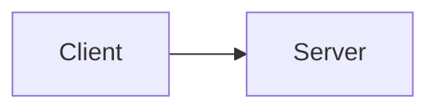
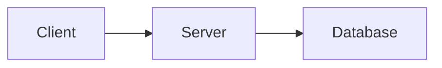

# Diagram Policy

Internal reference for styling and authoring Mermaid diagrams in Tau documentation.

## Rationale

Diagrams are the primary communication tool for architecture documentation. Undersized text, thin lines, and inconsistent styling undermine comprehension and fail WCAG non-text contrast requirements. Consistent styling across all diagrams builds visual coherence and reduces cognitive load. Research shows readability degrades sharply above 15-20 nodes per diagram, and thin lines (<3px) require elevated contrast ratios.

## 1. Font Sizing

All diagram text uses absolute `px` values — not relative `em` units — because SVG coordinate systems make `em` unreliable across tools.

| Element                    | Size | Weight | Rationale                                   |
| -------------------------- | ---- | ------ | ------------------------------------------- |
| Node labels (`.nodeLabel`) | 14px | 500    | Minimum comfortable SVG reading size        |
| Cluster/subgraph titles    | 14px | 600    | Bold weight distinguishes from node labels  |
| Edge labels (`.edgeLabel`) | 13px | 500    | 93% of node label size; maintains hierarchy |
| Sequence message text      | 14px | 500    | Matches node labels for readability         |
| Loop/alt labels            | 13px | 400    | Secondary information, slightly smaller     |
| Actor labels               | 14px | 500    | Matches node styling                        |

**Minimum**: 12px absolute for any diagram text. Below this, SVG anti-aliasing causes significant blurring, especially on non-retina displays.

## 2. Stroke Weights

WCAG 1.4.11 requires 3:1 contrast for non-text graphical elements. Lines below 3px width are subject to anti-aliasing that reduces perceived contrast, so thinner lines need higher contrast ratios.

| Element                        | Weight                                    | Contrast Target            |
| ------------------------------ | ----------------------------------------- | -------------------------- |
| Edge paths (`.edgePath .path`) | 2px                                       | 4.5:1 against container bg |
| Node borders                   | Inherited from `--diagram-node-border`    | 3:1 against container bg   |
| Actor box borders              | 1.5px                                     | 3:1 against container bg   |
| Cluster borders                | Inherited from `--diagram-cluster-border` | 3:1 against container bg   |

The 2px edge path weight is above Mermaid's 1px default and matches professional diagramming tools (draw.io, Lucidchart).

## 3. Color Tokens

All diagram colors use `--diagram-*` CSS variables defined in `global.css`. Never use inline `style`, `classDef`, or hardcoded colors in Mermaid chart definitions.

| Token                      | Light Mode                      | Dark Mode        | Purpose             |
| -------------------------- | ------------------------------- | ---------------- | ------------------- |
| `--diagram-node`           | Muted chrome (C 0.01-0.04)      | Low-L equivalent | Node fill           |
| `--diagram-node-border`    | Interactive range (C 0.05-0.10) | Low-L equivalent | Node borders        |
| `--diagram-node-text`      | `var(--foreground)`             | Auto-inverts     | Text inside nodes   |
| `--diagram-cluster`        | Near-surface (C 0.005-0.015)    | Low-L equivalent | Subgraph background |
| `--diagram-cluster-border` | Border range (C 0.02-0.04)      | Low-L equivalent | Subgraph borders    |
| `--diagram-line`           | Interactive range (C 0.03-0.06) | Low-L equivalent | Edge lines          |
| `--diagram-text`           | `var(--muted-foreground)`       | Auto-inverts     | General text        |
| `--diagram-note`           | Offset hue (primary + 60deg)    | Low-L equivalent | Note backgrounds    |
| `--diagram-note-border`    | Offset hue, interactive C       | Low-L equivalent | Note borders        |
| `--diagram-accent`         | `var(--muted-foreground)`       | Auto-inverts     | Activation borders  |

Chroma values follow the ranges defined in [Color Policy Section 4](color-policy.md). Node fills are in the "muted UI chrome" range; borders are in the "interactive" range.

## 4. Container Styling

The Mermaid component wraps rendered SVG in a consistent container:

```
rounded-xl border border-border/50 bg-muted/30 px-4 py-6
```

| Property      | Value                           | Rationale                                              |
| ------------- | ------------------------------- | ------------------------------------------------------ |
| Border radius | `rounded-xl`                    | Matches the `--radius-*` scale                         |
| Border        | `border-border/50`              | Subtle, does not compete with diagram content          |
| Background    | `bg-muted/30`                   | Slight tint distinguishes diagram from page background |
| Padding       | `px-4 py-6`                     | Breathing room around SVG content                      |
| Prose escape  | `not-prose`                     | Prevents Fumadocs typography overrides                 |
| SVG centering | `[&>svg]:mx-auto [&>svg]:block` | Centers diagram within container                       |
| Overflow      | `overflow-x-auto`               | Allows horizontal scroll for wide diagrams             |

## 5. Node and Cluster Shapes

Rounded rectangles create approachable, scannable diagrams. Research shows rounded corners reduce cognitive effort and increase dwell time.

| Element                                | Border Radius        | Notes                                    |
| -------------------------------------- | -------------------- | ---------------------------------------- |
| Nodes (rect, circle, ellipse, polygon) | `rx: 12px; ry: 12px` | Matches UI component radius              |
| Cluster/subgraph rectangles            | `rx: 16px; ry: 16px` | Slightly larger to distinguish hierarchy |
| Sequence actor boxes                   | `rx: 12px; ry: 12px` | Matches node styling                     |

## 6. Dark Mode

Diagram tokens auto-switch via `:root` / `.dark` CSS variable overrides. The Mermaid component re-renders on theme change via the `isDark` effect dependency.

Dark mode diagram tokens are explicitly defined (not derived from lightness inversion) because the Mermaid theming API requires hex colors resolved at render time.

## 7. Authoring Conventions

### Syntax

Use fenced ` ```mermaid ` code blocks in MDX files. The `remarkMdxMermaid` plugin (from `fumadocs-core/mdx-plugins`) transforms these into `<Mermaid chart={...} />` components.

### Diagram Types

| Type              | Direction               | Use For                                   |
| ----------------- | ----------------------- | ----------------------------------------- |
| `flowchart TB`    | Top-to-bottom           | Hierarchy, decomposition, thread topology |
| `flowchart LR`    | Left-to-right           | Process flow, data pipelines              |
| `flowchart TD`    | Top-down (alias for TB) | Same as TB                                |
| `sequenceDiagram` | Time flows down         | Protocol exchanges, async interactions    |

### Edge Labels

Quote edge labels containing special characters (parentheses, brackets, colons):

CORRECT:

```
A -->|"O(1) lookup"| B
C -->|"step 1: init"| D
```

INCORRECT:

```
A -->|O(1) lookup| B
```

### Node Labels

Use double quotes for labels with special characters:

```
A["Process (main)"]
B["Step 1: Init"]
```

### Subgraphs

Use explicit IDs with labels in brackets:

```
subgraph mainThread [Main Thread]
```

### Theme Delegation

Never use `classDef`, `style`, or `class` directives in chart definitions. The Mermaid component handles all colors via CSS variables and `themeVariables`.

CORRECT:



INCORRECT:


## 8. Complexity Limits

Cognitive load research (Ghoniem 2004, Miller 1956) establishes clear thresholds for diagram readability.

| Parameter              | Limit                | Action When Exceeded                   |
| ---------------------- | -------------------- | -------------------------------------- |
| Nodes per diagram      | 15 (soft), 20 (hard) | Split into multiple focused diagrams   |
| Edge crossings         | 2 maximum            | Restructure layout, use subgraphs      |
| Subgraph nesting depth | 2 levels             | Use diagram decomposition instead      |
| Label length           | ~30 characters       | Abbreviate or use shorter descriptions |

### Decomposition Strategy

When a diagram exceeds limits, apply C4-style decomposition:

1. **Context diagram** — system boundaries and external actors (3-8 nodes)
2. **Container diagram** — major runtime components (5-15 nodes)
3. **Component diagram** — internals of a single container (5-15 nodes)

Each documentation concept page must include at least one diagram (per [Documentation Policy](documentation-policy.md)).

## 9. Accessibility

### SVG ARIA

The Mermaid component wraps rendered SVG in a container with `dangerouslySetInnerHTML`. Screen readers treat the SVG as presentational. The surrounding prose context provides the accessible description.

### Diagram Descriptions

Every Mermaid diagram in documentation must be followed by a prose paragraph that conveys the same information textually. This satisfies WCAG 1.1.1 (Non-text Content) and ensures the content is accessible to screen reader users.

CORRECT:

````mdx

````

The client sends requests to the server, which queries the database
and returns results.

```

## Anti-Patterns

- Inline `style` or `classDef` in Mermaid chart definitions — theme handles all colors
- Font sizes below 13px in any diagram element
- Stroke widths below 2px for edge paths
- Hardcoded hex colors in chart definitions
- Diagrams exceeding 20 nodes without decomposition
- Missing prose description after a diagram
- Relative `em` units for font sizes in `themeCSS` — use absolute `px`

## Summary Checklist

- [ ] All diagram colors use `--diagram-*` CSS variables
- [ ] Node labels >= 14px, edge labels >= 13px
- [ ] Edge stroke width >= 2px
- [ ] Node count <= 15 (soft limit), <= 20 (hard limit)
- [ ] Edge crossings <= 2
- [ ] No inline `classDef`, `style`, or hardcoded colors
- [ ] Prose description follows every diagram
- [ ] Dark mode renders correctly (check by toggling theme)

## References

- [UI Policy](ui-policy.md) — parent design system entry point
- [Color Policy](color-policy.md) — OKLCH chroma ranges and contrast requirements
- [Accessibility Policy](accessibility-policy.md) — ARIA and semantic HTML
- [Documentation Policy](documentation-policy.md) — content type templates, diagram requirements
- [WCAG 1.4.11 Non-text Contrast](https://www.w3.org/WAI/WCAG22/Understanding/non-text-contrast.html)
- [Mermaid Theming](https://mermaid.js.org/config/theming.html)
```
