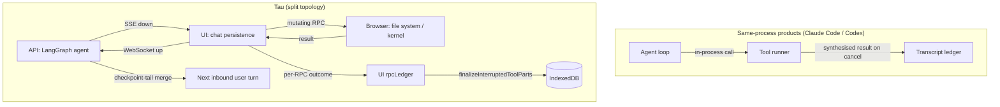
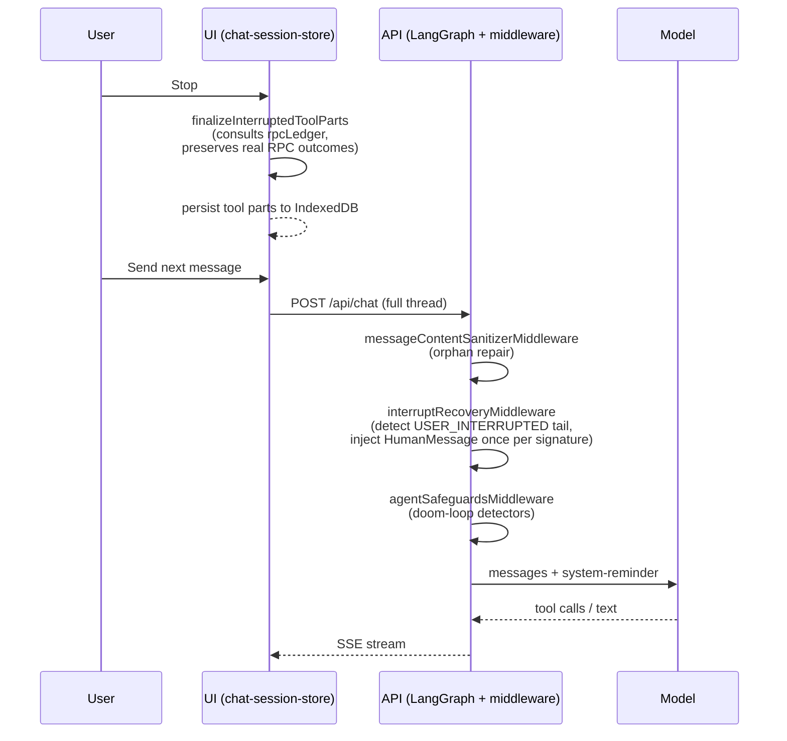

# Agent Interrupt Durability: Tau vs Claude Code vs Codex

Compares how three production agentic-coding products (Claude Code, OpenAI Codex, Tau) survive a user interrupt that arrives between tool execution and the next LLM turn — and why Tau's split client/server topology demands a two-layer reconciliation that the same-process products do not need.

## Executive Summary

Both Claude Code and Codex collapse the agent loop and the tool runner into the same process, then rely on **transcript-as-ledger** durability: synthesise a `tool_result` (or `function_call_output`) for every aborted tool the moment the cancellation token fires, and persist the synthetic result alongside the real ones. Tau cannot use this pattern verbatim — its agent loop runs on the API while mutating tools execute in the browser via Socket.IO RPC, so a stream interrupt can land after the RPC settled on the client but before the matching `tool-output-available` SSE chunk crosses the wire. Tau's two-layer fix (UI-side `rpcLedger` + API-side checkpoint-tail merge) covers this transport gap correctly, but until this PR landed Tau was missing the **turn-level reminder** that Claude Code (`INTERRUPT_MESSAGE_FOR_TOOL_USE`) and Codex (`<turn_aborted>...verify current state before retrying</turn_aborted>`) both inject so the next LLM turn explicitly verifies state before retrying. Workstream W1 in this change closes that gap.

## Problem Statement

The user hits Stop while the model has multiple parallel tool calls in flight. The system must subsequently:

1. Render a faithful UI history of which tools settled vs which were cancelled.
2. Send a model-history-compatible payload to the next LLM turn (every `tool_use` paired with a `tool_result`, no orphaned blocks).
3. Steer the LLM away from naive retries — when a `create_file` was cancelled mid-write, the file may or may not exist, and the next turn must verify before assuming.

Tau additionally has a transport invariant the closed-loop products do not: a mutating RPC may have already mutated the user's filesystem before the SSE chunk announcing the result reaches the UI. Marking it `USER_INTERRUPTED` in the persisted history would let the LLM "redo" work that already happened (typical failure mode: duplicate file content, doubled `appendFile`).

## Methodology

- Source archaeology in `repos/claude-code/src/` (`query.ts`, `services/tools/StreamingToolExecutor.ts`, `utils/messages.ts`).
- Source archaeology in `repos/codex/codex-rs/core/src/` (`tools/parallel.rs`, `tasks/mod.rs`, `tests/suite/abort_tasks.rs`).
- Diff against the Tau implementation that landed during the parallel-tool-call durability work (`apps/api/app/api/chat/middleware/`, `apps/ui/app/services/rpc-ledger.ts`, `apps/ui/app/utils/chat.utils.ts`).
- The companion research doc `docs/research/parallel-tool-call-incremental-persistence.md` captures the original investigation that triggered this comparison.

## Findings

### Finding 1: Architectural setup determines the durability strategy

The single biggest difference between the three products is _where the tool runs_:

| Product     | Agent loop      | Tool runner                    | Transport between them    |
| ----------- | --------------- | ------------------------------ | ------------------------- |
| Claude Code | Node.js process | Node.js process (same)         | In-process function calls |
| Codex       | Tokio runtime   | Tokio runtime (same)           | In-process spawned tasks  |
| Tau         | Node.js (API)   | Browser (UI) via Socket.IO RPC | SSE down + WebSocket up   |

Closed-loop products can synthesise a tool result the moment cancellation fires, and the synthetic result is _the_ source of truth for the model and the UI. Tau's tool runner is a separate process across an unreliable transport, so a settled RPC outcome can outrun the SSE chunk that announces it — a class of bug that simply cannot exist in Claude Code or Codex.

### Finding 2: Claude Code synthesises orphaned tool results before yielding

`yieldMissingToolResultBlocks` (`repos/claude-code/src/query.ts:123`) walks the in-flight assistant messages, finds every `tool_use` block whose paired `tool_result` is missing, and yields a synthetic user-message tool_result before returning control. The streaming-mode counterpart `StreamingToolExecutor.getRemainingResults()` (`repos/claude-code/src/services/tools/StreamingToolExecutor.ts:453`) drains queued + in-progress tools on abort and emits one synthetic result per affected tool. Both paths funnel into the same `INTERRUPT_MESSAGE_FOR_TOOL_USE` constant for the synthetic body:

```12:14:repos/claude-code/src/utils/messages.ts
export const INTERRUPT_MESSAGE = '[Request interrupted by user]'
export const INTERRUPT_MESSAGE_FOR_TOOL_USE =
  '[Request interrupted by user for tool use]'
```

Because the synthesis runs in the same process that owns the transcript, the persisted message history is already consistent before the user sees a "Stopped" UI state — there is no second reconciliation pass.

### Finding 3: Codex injects a `<turn_aborted>` marker on the next turn

`repos/codex/codex-rs/core/src/tools/parallel.rs` builds `aborted_response()` for every in-flight `ToolCallRuntime` whose `cancellation_token.cancelled()` future fired. The aborted response is persisted as the tool's `function_call_output` so the next request to the model is structurally well-formed.

The interesting bit is what Codex does on the _next_ turn. `repos/codex/codex-rs/core/src/tasks/mod.rs:49` defines a single canonical reminder:

```text
The user interrupted the previous turn on purpose. Any running unified exec
processes were terminated. If any tools/commands were aborted, they may have
partially executed; verify current state before retrying.
```

Wrapped in `<turn_aborted>...</turn_aborted>` and prepended to the next user input. The integration test `interrupt_persists_turn_aborted_marker_in_next_request` (`repos/codex/codex-rs/core/tests/suite/abort_tasks.rs:170`) asserts the marker survives across the request boundary — it is not a UI affordance, it is part of the prompt the next LLM turn sees.

### Finding 4: Tau's two-layer reconciliation is justified, not redundant

Tau cannot synthesise a tool result the instant cancellation fires because the API does not own the tool runner. The two layers added by the parallel-tool-call durability work cover the transport gap:

| Layer                       | Where                                                       | Purpose                                                                                                                                               |
| --------------------------- | ----------------------------------------------------------- | ----------------------------------------------------------------------------------------------------------------------------------------------------- |
| `rpcLedger` (UI)            | `apps/ui/app/services/rpc-ledger.ts`                        | Records every mutating-RPC outcome (success/error) so `finalizeInterruptedToolParts` can preserve a real settlement when the SSE chunk lost the race. |
| Checkpoint-tail merge (API) | `apps/api/app/api/chat/middleware/merge-checkpoint-tail.ts` | Merges any settled tool outputs that LangGraph already checkpointed into the next inbound user-turn message set.                                      |

Both are required. Removing the UI ledger leaves the user looking at "Failed: Interrupted" cards for tools that actually wrote to disk; removing the API merge re-sends stale tool inputs to the LLM next turn.

### Finding 5: Tau lacked the turn-level guidance reminder until this change

Until W1 of this change, Tau emitted only per-tool `errorText: '{"errorCode":"USER_INTERRUPTED",...}'` (via `finalizeInterruptedToolParts` in `apps/ui/app/utils/chat.utils.ts`). The next LLM turn had to infer "the user interrupted me" from the shape of mixed `output-available` / `output-error` parts. Both Claude Code and Codex inject an explicit signal:

| Product     | Signal                                                                                                                                                                              | Where it appears                      |
| ----------- | ----------------------------------------------------------------------------------------------------------------------------------------------------------------------------------- | ------------------------------------- |
| Claude Code | `INTERRUPT_MESSAGE_FOR_TOOL_USE = '[Request interrupted by user for tool use]'`                                                                                                     | Synthetic user message body           |
| Codex       | `<turn_aborted>The user interrupted the previous turn on purpose ... verify current state before retrying.</turn_aborted>`                                                          | Prepended to the next user input      |
| Tau (W1)    | `<system-reminder>The previous turn was interrupted by the user. {N} tool call(s) completed successfully and {M} were cancelled ... verify the current state ...</system-reminder>` | `HumanMessage` injected by middleware |

Workstream W1 in this change ports the pattern via `apps/api/app/api/chat/middleware/interrupt-recovery.middleware.ts`, runs in `beforeModel` so the reminder joins the cacheable prompt prefix, and dedupes by parent AIMessage id so a multi-superstep recovery does not spam the model.

## Comparison Matrix

| Dimension                            | Claude Code                                                      | Codex                                                                                               | Tau                                                                                              |
| ------------------------------------ | ---------------------------------------------------------------- | --------------------------------------------------------------------------------------------------- | ------------------------------------------------------------------------------------------------ |
| Cancel propagation                   | Node `AbortController.abort()`                                   | Tokio `CancellationToken.cancel()`                                                                  | UI Stop button → API SSE close + LangGraph node abort                                            |
| Source of truth for tool outcome     | Synthetic in-process result; transcript-as-ledger                | Synthetic `function_call_output` in transcript; transcript-as-ledger                                | LangGraph checkpoint + UI `rpcLedger` (transport gap)                                            |
| Synthesis location                   | `query.ts` `yieldMissingToolResultBlocks`; `getRemainingResults` | `parallel.rs` `aborted_response`                                                                    | UI `finalizeInterruptedToolParts` + API checkpoint-tail merge                                    |
| Persistence cadence                  | After each tool result yielded by the agent                      | After each `function_call_output` is appended                                                       | Per `tool-output-available` chunk + per UI ledger settlement                                     |
| Turn-level guidance to next LLM turn | `[Request interrupted by user for tool use]` synthetic user msg  | `<turn_aborted>...verify current state before retrying</turn_aborted>` prepended to next user input | `<system-reminder>` HumanMessage injected by `interrupt-recovery.middleware.ts` (W1)             |
| Dedup key for re-emission            | One synthetic per orphan; no dedup needed                        | One marker per aborted turn; no dedup needed                                                        | SHA-256 of parent AIMessage id, kept in `_interruptReminderFiredFor`                             |
| Cache-prefix safety                  | N/A (no API-level prompt cache anchoring)                        | N/A (Codex API is not Anthropic-cached)                                                             | Reminder body is byte-deterministic for byte-identical inputs (no timestamps / UUIDs / counters) |

## Diagrams

### Topology contrast



### Tau interrupt-recovery flow (post-W1)



## Code Examples

### Claude Code synthetic tool result

```120:140:repos/claude-code/src/query.ts
function* yieldMissingToolResultBlocks(
  assistantMessages: AssistantMessage[],
  errorMessage: string,
): Generator<UserMessage, void> {
  // ...walks each assistant message, finds tool_use blocks whose paired
  //    tool_result is missing, yields one synthetic UserMessage per orphan.
}
```

### Claude Code streaming abort drains in-flight tools

```1010:1024:repos/claude-code/src/query.ts
    // We need to handle a streaming abort before anything else.
    // When using streamingToolExecutor, we must consume getRemainingResults() so the
    // executor can generate synthetic tool_result blocks for queued/in-progress tools.
    // Without this, tool_use blocks would lack matching tool_result blocks.
    if (streamingToolExecutor) {
        // Consume remaining results - executor generates synthetic tool_results for
        // aborted tools since it checks the abort signal in executeTool()
        for await (const update of streamingToolExecutor.getRemainingResults()) {
          if (update.message) {
            yield update.message
          }
        }
      } else {
        yield* yieldMissingToolResultBlocks(
          assistantMessages,
          'Interrupted by user',
        )
      }
```

### Codex aborted-response builder

```115:130:repos/codex/codex-rs/core/src/tools/parallel.rs
impl ToolCallRuntime {
    fn aborted_response(call: &ToolCall, secs: f32) -> ResponseInputItem {
        match &call.payload {
            ToolPayload::Custom { .. } => ResponseInputItem::CustomToolCallOutput {
                call_id: call.call_id.clone(),
                // ...
            },
            // ...
        }
    }
}
```

### Codex `<turn_aborted>` reminder constant

```49:50:repos/codex/codex-rs/core/src/tasks/mod.rs
const TURN_ABORTED_INTERRUPTED_GUIDANCE: &str = "The user interrupted the previous turn on purpose. Any running unified exec processes were terminated. If any tools/commands were aborted, they may have partially executed; verify current state before retrying.";
```

### Tau `interruptRecoveryReminder` (this change, W1)

```typescript
export function interruptRecoveryReminder(input: { completedCount: number; interruptedCount: number }): string {
  const { completedCount, interruptedCount } = input;
  return `The previous turn was interrupted by the user. ${completedCount} tool call(s)
completed successfully and ${interruptedCount} were cancelled before they
finished. Tools that mutate state (file writes, edits, deletes) may have
partially executed.

Before retrying, verify the current state of any file or resource you were
operating on (read_file / list_directory / get_kernel_result) and only then
decide whether to repeat, adjust, or skip the cancelled work. Do NOT assume
the cancelled tools left the system unchanged.`;
}
```

## Recommendations

| #   | Recommendation                                                                                                                                                                                                                                                                                                                 | Status           | Effort | Impact |
| --- | ------------------------------------------------------------------------------------------------------------------------------------------------------------------------------------------------------------------------------------------------------------------------------------------------------------------------------ | ---------------- | ------ | ------ |
| R1  | Inject a turn-level `<system-reminder>` after detecting a contiguous tail of `USER_INTERRUPTED` ToolMessages (parallels Codex `<turn_aborted>` and Claude Code `INTERRUPT_MESSAGE_FOR_TOOL_USE`). State-deduped per parent AIMessage id; cache-prefix safe.                                                                    | IMPLEMENTED (W1) | Low    | High   |
| R2  | Move `mutatingRpcNames` from a local Set in `apps/ui/app/hooks/rpc-handlers.ts` into `libs/chat/src/constants/rpc.constants.ts` paired with `readOnlyRpcNames`, plus a partition invariant test so new RPCs cannot silently bypass the ledger. Tighten `RpcOutcome.errorCode` to `RpcClientErrorCode` for compile-time safety. | IMPLEMENTED (W2) | Low    | Medium |
| R3  | Telemetry counter for ledger upgrades — when `finalizeInterruptedToolParts` flips a part from `USER_INTERRUPTED` to `output-available` because the ledger had a real success — would let us prove the ledger is doing real work in production. Currently relies on indirect signals (no duplicate-write reports).              | DEFERRED         | Low    | Low    |
| R4  | Opportunistic ledger eviction on terminal stream events. Today entries age out via the 10s TTL after `clearLedger` on session disposal; an explicit `evict(toolCallId)` once the corresponding `tool-output-available` chunk arrives would shrink memory churn for very long chats.                                            | DEFERRED         | Low    | Low    |
| R5  | Server-side fallback synthesis (analogous to Claude Code's `getRemainingResults`) only becomes possible if mutating RPCs ever move to the API. As long as the browser owns the file system, R1+W2 close the gap; this is a topology-change recommendation, not a same-day implementation.                                      | DEFERRED         | High   | Low    |

## References

- `docs/policy/interrupted-tool-call-contract.md` — the API-side schema contract that the UI's `finalizeInterruptedToolParts` honours.
- `docs/research/parallel-tool-call-incremental-persistence.md` — the original investigation that introduced the `rpcLedger` and milestone-driven persistence.
- `docs/research/agent-loop-safeguards.md` — the cache-safety contract that `interrupt-recovery.middleware.ts` follows for byte-stable reminder bodies.
- Implementation: `apps/api/app/api/chat/middleware/interrupt-recovery.middleware.ts`, `apps/api/app/api/chat/middleware/interrupt-recovery.middleware.test.ts`.
- Upstream: `repos/claude-code/src/query.ts`, `repos/claude-code/src/services/tools/StreamingToolExecutor.ts`, `repos/codex/codex-rs/core/src/tools/parallel.rs`, `repos/codex/codex-rs/core/src/tasks/mod.rs`.
