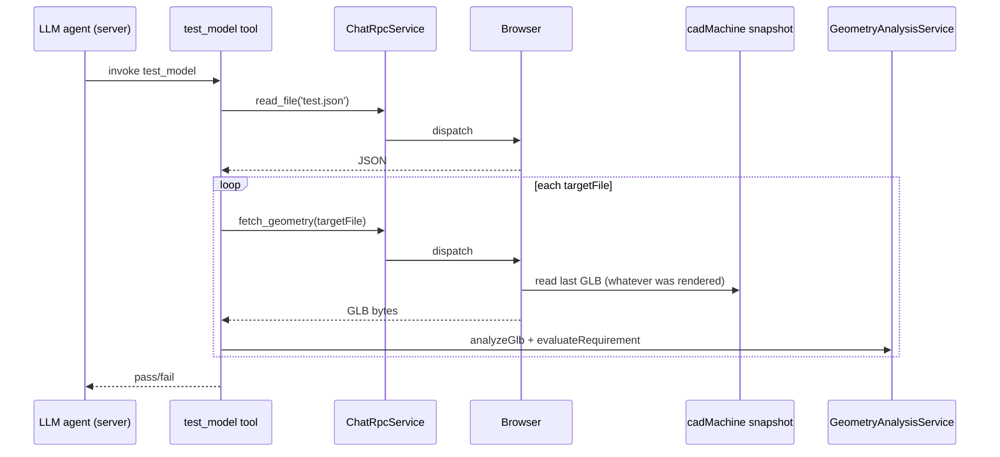
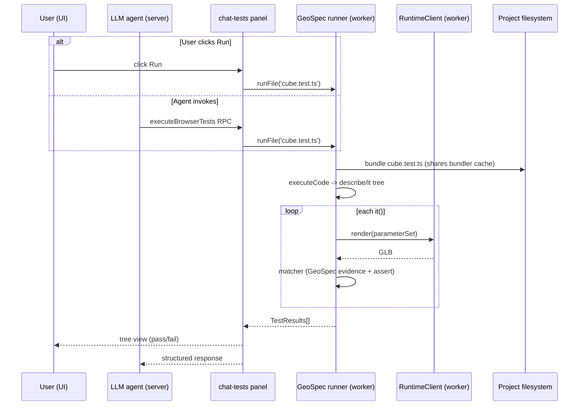

# Browser-First Parameter-Aware Geometry Testing

How to evolve Tau's geometry test surface from a server-side, parameter-blind JSON DSL into an in-browser, parameter-aware test runner that piggybacks on the existing `executeCode` pipeline and custom Vitest-style matchers.

## Executive Summary

Geometry tests today are a server-only flow: `tool-test-model` reads `test.json`, asks the browser for whatever GLB the editor most recently rendered, ships it to the API, and runs assertions in `GeometryAnalysisService`. The schema deliberately omits parameters, so the moment a user nudges a slider the bounding-box assertion captured at design time goes red even though the model is still correct. Tests are also agent-only — there is no "Run tests" button anywhere in the UI, and no way to run them offline. The fix has two halves that fit naturally together: (1) replace the JSON DSL with native `*.test.ts` files that import the same module the kernel already evaluates, so parameters are first-class JavaScript bindings; (2) host a small in-browser test runner inside the existing kernel worker (or a sibling worker) using a Vitest-compatible `expect` and a few custom matchers (`toBeWatertight`, `toHaveBoundingBox`, `toHaveConnectedComponents`). All required infrastructure already exists: `executeCode` already bundles + dynamically imports user code via blob URLs, `@taucad/testing` is mostly browser-ready (one `NodeIO` → `WebIO` swap), and the parameter system already exposes named groups per geometry unit. The recommended path is a custom mini-runner built on `@vitest/expect` (≈190 KB unpacked, fully tree-shakeable) rather than embedding Vitest itself — Vitest's "browser mode" requires Playwright/WebdriverIO and is unsuitable for offline embedding.

## 2026-06-01 Target-State Alignment

This investigation remains the source of the parameter-aware and browser-execution insight, but its package shape is superseded by the GeoSpec target architecture:

- `geospec` owns the standalone Node/browser runner, matchers, mesh/BRep/STEP evidence loaders, and native C++/WASM analyzers.
- `@taucad/testing` owns Tau-specific render helpers, parameter imports, `test.json` migration, and chat-tool compatibility.
- Browser-first is no longer the whole goal. The same `*.test.ts` module must run in the Tau UI, in Node CI through `geospec/runner`, and inside ordinary Vitest with the root `geospec` authoring API.
- `test.json` is a compatibility and migration input, not the target authoring surface.
- The current `NodeIO` to `WebIO` note becomes broader: mesh loading should move behind GeoSpec's environment-neutral mesh evidence loader, with `@taucad/testing` delegating to it.
- STEP loading should use the brepjs-inspired `geospec/step` native stream import path inside the worker where possible, then report fallback to Emscripten FS through artifact provenance.

## Table of Contents

- [Problem Statement](#problem-statement)
- [Scope and Non-Goals](#scope-and-non-goals)
- [Methodology](#methodology)
- [Findings](#findings)
- [Trade-offs](#trade-offs)
- [Target Architecture](#target-architecture)
- [Parameter-Bound Test Schema](#parameter-bound-test-schema)
- [Migration Roadmap](#migration-roadmap)
- [Recommendations](#recommendations)
- [Diagrams](#diagrams)
- [References](#references)
- [Appendix](#appendix)

## Problem Statement

A user creates a 2 mm cube with `length_x`, `length_y`, `length_z` parameters and the agent writes a `test.json` containing `boundingBox: { size: { x: 2, y: 2, z: 2 } }` plus a `watertight` check (the screenshot accompanying this investigation shows exactly this scenario). The user later changes `length_x` from 2 to 8 in the parameter panel; the geometry re-renders correctly, but the next `test_model` invocation fails because the bounding-box assertion still expects `x: 2`. Three independent problems converge:

1. **Tests are parameter-blind.** Neither the `test.json` schema nor the `test_model` tool nor the `fetchGeometry` RPC carries parameter values, parameter-group names, or any indication of _which_ configuration the assertions were authored for (`packages/testing/src/schemas.ts:7-79`; `apps/api/app/api/tools/tools/tool-test-model.ts:79-200`; `libs/chat/src/schemas/rpc.schema.ts:205-209`).
2. **Tests cannot run offline.** Test execution requires the API server (NestJS `GeometryAnalysisService` is the only caller of `analyzeGlb`) and the chat WebSocket (the agent invokes the tool). A user editing a model in the browser cannot click "Run tests" to verify watertightness before exporting for 3D print — there is no such button, and no path that does not round-trip through the chat agent.
3. **`test.json` is a brittle JSON DSL.** It cannot reference parameter values, derive expected dimensions arithmetically (`expected.size.x: length_x * 2`), share fixtures across tests, or matrix-test multiple parameter groups. Every consolidation in `mesh-continuity-test-semantics.md` (3 checks, tolerances, suggestions) fights against the fundamental mismatch between an inert JSON document and the live, parametric nature of CAD models.

## Scope and Non-Goals

**In scope**

- Audit of the current server-side test execution path and parameter system.
- Comparison of in-browser test runners (Vitest browser mode, `@vitest/runner`/`@vitest/expect`, uvu, Mocha, Jasmine, custom mini-runner).
- Architecture for a browser-resident test runner sharing infrastructure with the kernel worker.
- Schema design for parameter-bound tests (snapshot, group-binding, matrix).
- Migration roadmap from `test.json` to native `*.test.ts` files.
- Custom matcher surface for geometry assertions.

**Out of scope**

- Visual regression testing (image diffs of rendered scenes) — separate investigation.
- Snapshot testing of source code — covered by Vitest's existing snapshot subsystem if the runner is reused later.
- E2E tests of the Tau application itself — that is the API/UI test suite, not user-authored geometry tests.
- StackBlitz WebContainers as a host environment — the browser-native worker model is closer to what Tau already runs.

## Methodology

Three parallel readonly explorations of the codebase mapped (a) the current `test_model` server flow, (b) the parameter system end to end, and (c) the `executeCode` bundler/runtime pipeline. Five web searches covered Vitest browser mode (stable in 4.0), the `@vitest/runner` and `@vitest/expect` packages, alternative in-browser runners (uvu, Mocha, Jasmine, jest-lite), off-main-thread test isolation patterns (`@vitest/web-worker`, real Web Workers, WebContainers), and prior art for property-based / parameter-aware CAD validation (CADSmith, CADMorph, BRepCheck-style validators). Two academic CAD papers (CADSmith arXiv 2603.26512, CADMorph arXiv 2512.11480) and one CadQuery validation walkthrough informed the parameter-bound assertion design. All audit cites are to specific files and line ranges; web evidence is cited inline with URLs.

## Findings

### Finding 1: The current test surface is server-only and structurally cannot run offline

`test_model` lives in `apps/api/app/api/tools/tools/tool-test-model.ts` as a LangChain tool consumed by the chat agent. Its dependencies (`@nestjs/common`, `chatRpcService`, `geometryAnalysisService`, `Logger`) are all server-only. Even the analysis itself runs server-side: the browser ships GLB bytes via the `fetch_geometry` RPC, the API parses them with `NodeIO`, and ships back a `TestModelOutput`.

| Layer                                                                      | Where it runs                 | Browser-portable?                 | Blocker                                                             |
| -------------------------------------------------------------------------- | ----------------------------- | --------------------------------- | ------------------------------------------------------------------- |
| `test_model` tool definition                                               | API (Nest)                    | No                                | Nest DI, RPC service, kernel-aware tool factory                     |
| `GeometryAnalysisService`                                                  | API (Nest)                    | Almost — pure logic + Logger      | `Logger` and DI; trivial to unwind                                  |
| `analyzeGlb` (`packages/testing/src/geometry/analyze-glb.ts:19-20`)        | Library — used from API today | Yes after `NodeIO` → `WebIO` swap | Single import                                                       |
| `evaluateRequirement`, `connected-components`, `watertight`                | Pure TS                       | Yes already                       | None                                                                |
| `testFileSchema` (Zod)                                                     | Pure TS                       | Yes already                       | None                                                                |
| `fetch_geometry` RPC handler (`apps/ui/app/hooks/rpc-handlers.ts:276-314`) | Browser                       | Yes (already runs there)          | Currently triggered only by the agent                               |
| UI surface                                                                 | None                          | n/a                               | No "Run tests" button exists; tool results are read-only chat cards |

Re-homing `analyzeGlb` requires a single `NodeIO` → `WebIO` swap. `@gltf-transform/core` ships both with the same `Document` API, so `connected-components.ts` and `watertight.ts` need no changes (they take `Document`, not bytes).

### Finding 2: Tests have zero parameter coupling — by design, but fragile in practice

Three independent layers confirm the gap:

- The Zod schema in `packages/testing/src/schemas.ts:67-79` is `{ requirements: TestRequirement[] }` per file; there is no `parameterGroup`, no `parameters`, no snapshot field.
- The tool input is `z.object({})` (`libs/chat/src/schemas/tools/test-model.tool.schema.ts:39-41`).
- The RPC is `{ artifactId?: string; targetFile: string }` (`libs/chat/src/schemas/rpc.schema.ts:205-209`); the browser handler returns `cadSnapshot.context.geometries.find(g => g.format === 'gltf')` — i.e. _whatever the editor last rendered_, with no guarantee that the parameter group matches what the test was authored for.

The result is the bug in the screenshot: `boundingBox` becomes a function of `length_x`/`length_y`/`length_z` _implicitly_, but the assertion records absolute numbers. Bench code already shows this is a real maintenance burden — `apps/api/app/benchmarks/model-benchmark-suite.ts` collapsed every per-shape `meshCount` requirement into `connectedComponents: 1` rather than try to reason about counts that change with parameters.

### Finding 3: The `executeCode` pipeline is structurally a perfect fit for running test modules

`executeCode(code: string)` (`packages/runtime/src/bundler/esbuild-core.ts:1095-1133`) takes a bundled ESM string, wraps it in a `Blob`, calls `URL.createObjectURL` + dynamic `import()`, and returns the module namespace. It already runs _inside the kernel worker_ (`packages/runtime/src/framework/kernel-worker.ts:2516-2527`), already shares the bundler cache and CDN cache with normal renders, and already supports relative imports, bare-specifier resolution to builtins (`replicad`, `@jscad/modeling`), and CDN-cached npm packages. A user `cube.test.ts` that does `import { defaultParams, main } from './cube.ts'` would resolve through _exactly the same VFS plugin_ as the production module.

The two missing pieces are small:

- **Test globals.** `describe`, `it`/`test`, `expect`, `beforeAll` are not injected. Either inject them as globals via the `executeCode` banner, or have the test file import them from a known module ID that the bundler resolves to a built-in (mirroring how `replicad` is resolved today).
- **Result aggregation.** `executeCode` returns `{ value: moduleNamespace }`; a runner needs to drive collection and reporting. The runner itself can live alongside the kernel — see Finding 5.

### Finding 4: Vitest "browser mode" is not embeddable, but `@vitest/expect` is

Vitest 4 stabilised browser mode (`vitest.dev/guide/browser`) but it is fundamentally an automation harness: it spins up a Vite dev server on port 63315, requires a `@vitest/browser-playwright` or `@vitest/browser-webdriverio` provider, and drives a real Chromium/Firefox/WebKit instance from the host process. There is no embedded mode and no "load Vitest UMD into your iframe" surface — the entire architecture assumes Vitest _owns_ the page lifecycle.

| Aspect         | Vitest browser mode                    | What Tau needs                         |
| -------------- | -------------------------------------- | -------------------------------------- |
| Process model  | Node host + Playwright + browser       | Pure browser, offline-capable          |
| Test discovery | Vite dev server file glob              | User clicks Run; we know the file path |
| Reporter / UI  | Vitest CLI / UI iframe                 | Tau's own panel inside the editor      |
| Parallelism    | Multiple browser instances             | Single worker per test file            |
| Provider auth  | `@vitest/browser-playwright` mandatory | None                                   |

The reusable subset is **`@vitest/expect`** (Chai-derived `expect` with `expect.extend`, asymmetric matchers, snapshot matchers), the **`expect.extend` typing pattern** (`vitest.dev/guide/extending-matchers`), and the **`createTaskCollector` / `VitestRunner` interface** if we ever want to share a runner with Vitest later. `@vitest/runner` is 188.8 KB unpacked with two dependencies (`pathe`, `@vitest/utils`) and is published independently — usable as a building block but more than required.

### Finding 5: A 5-15 KB custom runner outperforms full-runner embedding

Benchmark data from `oekazuma/test-runner-compare` and `lukeed/uvu`:

| Runner                               | Cold-run time (small suite) | Browser-ready out of the box | Approx. shipped size | Notes                                                                |
| ------------------------------------ | --------------------------- | ---------------------------- | -------------------- | -------------------------------------------------------------------- |
| **uvu**                              | 47 ms (M1) / 86 ms (Intel)  | Yes — native ESM             | ~5 KB                | No `describe`/`it` nesting; flat `test()` API; assertions optional   |
| **Jasmine (core)**                   | 45 ms / 81 ms               | Yes (browser bundle)         | ~120 KB              | Full BDD; older API style                                            |
| **Mocha (browser)**                  | 209 ms                      | Yes (browser bundle)         | ~220 KB              | BDD + custom reporters                                               |
| **Vitest (full)**                    | 58 ms / 109 ms              | Browser mode = Playwright    | ~1+ MB transitive    | Not embeddable                                                       |
| **Custom runner + `@vitest/expect`** | <50 ms (estimated)          | Yes (we author it)           | 15-30 KB             | Full control over parameter binding, custom matchers, reporter       |
| **`@vitest/runner` standalone**      | n/a                         | Yes if shimmed               | 188.8 KB unpacked    | Runner contract well documented; ModuleRunner injection assumes Vite |

A custom runner built around `@vitest/expect` plus a 200-line `describe`/`it`/`hook` collector buys us:

- Full Vitest matcher surface (`toEqual`, `toMatchObject`, `expect.extend`, asymmetric matchers).
- Familiar TS author DX (`expect.extend` typing via `interface CustomMatchers` extending `Assertion` and `AsymmetricMatchersContaining`).
- Direct integration with the kernel worker — no extra Vite dev server, no extra HTTP origin.
- Future portability: the same `*.test.ts` files can run under headless Vitest in CI by loading our matchers as a `setupFiles` entry.

### Finding 6: The kernel worker is the right execution host — sometimes

Two viable isolation strategies:

| Strategy                | Pros                                                                                                                          | Cons                                                                                                                             | Verdict                                                                   |
| ----------------------- | ----------------------------------------------------------------------------------------------------------------------------- | -------------------------------------------------------------------------------------------------------------------------------- | ------------------------------------------------------------------------- |
| **Reuse kernel worker** | WASM (OCCT, OpenSCAD, Manifold) already loaded; bundler + execute caches warm; zero RPC overhead between render and assertion | Long tests block render; test module mutates `globalThis`; cache key collisions if a test bundle hashes equal to a render bundle | Best for _fast_ tests (<1 s) on the same kernel as the editor             |
| **Sibling test worker** | Isolated globals, isolated bundler cache, can run in parallel with editor renders                                             | WASM duplication (10-30+ MB extra heap per kernel); cold-start cost; needs a second `RuntimeClient` to render geometry           | Best for _slow_ tests, matrix tests, or kernels other than the active one |

The Vitest core team has explicitly stated `@vitest/web-worker` "is not trying to run web workers in the same thread, it's a side effect of trying to bring Web Worker API to Node.js. Since web workers are already supported in the browser, this package is not needed there" (vitest-dev/vitest#4899). That confirms there is no upstream blocker to running our own runner inside a real Web Worker — we just need to design the message protocol.

The architecture below allows _both_ and chooses per-run based on a heuristic (single file → kernel worker, full project → sibling worker).

### Finding 7: Parameter binding has three credible designs; favour the JS-native one

Three candidate designs, evaluated against the screenshot regression and against the mesh-continuity research:

| Design                     | Schema sketch                                                                                                                                                                                                                                               | Pros                                                                                                                             | Cons                                                                                                 |
| -------------------------- | ----------------------------------------------------------------------------------------------------------------------------------------------------------------------------------------------------------------------------------------------------------- | -------------------------------------------------------------------------------------------------------------------------------- | ---------------------------------------------------------------------------------------------------- |
| **A. Snapshot in JSON**    | `{ requirements: [{ ..., parameters: { length_x: 2 } }] }`                                                                                                                                                                                                  | Backward-compatible with `test.json`; simple to author                                                                           | Duplicates parameter values across requirements; no derived expectations; brittle when groups rename |
| **B. Bind to named group** | `{ parameterGroup: 'small', requirements: [...] }`                                                                                                                                                                                                          | Single source of truth (the `.tau/parameters/*.json` file); matches existing UI                                                  | Couples tests to group names; group rename breaks tests; cannot test arithmetic-derived expectations |
| **C. Native `*.test.ts`**  | `import { defaultParams } from './cube'; describe.each([{ length_x: 2 }, { length_x: 8 }])('cube %j', (p) => { it('is watertight', async () => { const result = await renderTauModel({ parameters: p }); await expectGeo(result).toBeWatertight(); }); });` | Parameters are first-class JS; arithmetic derivations work; matrix testing is `describe.each`; future TDD authoring is real code | Migration from `test.json`; new authoring story for the agent (covered below)                        |

Design C wins on every dimension that matters once the kernel-worker test host exists. Designs A and B are stepping stones — useful only if migration cannot land in one shot.

### Finding 8: Prior art validates the parameter-bound + programmatic-validation pattern

CADSmith (arXiv 2603.26512) defines an explicit "Validator" agent that runs OpenCASCADE BRepCheck-style measurements (bounding box, volume, face/edge/vertex counts, solid validity) against parametric outputs and feeds counterexamples back into a generation loop. Their Chamfer Distance dropped from 28.37 to 0.74 once programmatic validation closed the loop. CADMorph (arXiv 2512.11480) uses a plan-generate-verify cycle on parametric edits where verification is geometric, not visual. Tim Derzhavets's CadQuery walkthrough demonstrates the same pattern at the IDE layer (BRepCheck_Analyzer + volume + manifold checks before export). The common thread is: **assertions live alongside the parametric source, are JS/Python expressions over the parameters, and run on every regenerate.** Tau's `test.json` is the outlier — every CAD ecosystem with serious validation uses code-as-tests.

## Trade-offs

### Runner choice

| Dimension                 | Custom + `@vitest/expect` (recommended)                 | Embed `@vitest/runner`                                          | Use uvu                       | Build no runner (extend `test.json`)    |
| ------------------------- | ------------------------------------------------------- | --------------------------------------------------------------- | ----------------------------- | --------------------------------------- |
| Initial author effort     | ~1 week (collector + reporter + matchers + worker glue) | ~1.5 weeks (shim ModuleRunner + reporter; node-isms still leak) | ~3 days                       | ~2 days                                 |
| Ongoing maintenance       | Low — tiny surface we own                               | Medium — Vitest internal API churn                              | Low — uvu rarely changes      | High — every new check grows the schema |
| Bundle size (incremental) | ~30 KB                                                  | ~190 KB + deps                                                  | ~5 KB                         | 0 KB                                    |
| Author DX                 | Vitest-identical                                        | Vitest-identical                                                | Flat, no `describe` nesting   | JSON only                               |
| Custom matcher typing     | Vitest pattern (well documented)                        | Same                                                            | Pure TS                       | n/a                                     |
| Future CI portability     | Straight Vitest run with our matchers as `setupFiles`   | Same                                                            | Re-author tests for Vitest CI | n/a                                     |
| Parameter binding         | Native JS                                               | Native JS                                                       | Native JS                     | Schema-only                             |

### Where the runner runs

| Dimension                 | Kernel worker (reuse)       | Sibling test worker              | Main thread                                    |
| ------------------------- | --------------------------- | -------------------------------- | ---------------------------------------------- |
| WASM cost                 | Already paid                | Pay again per kernel             | Already paid (UI loads WASM eagerly elsewhere) |
| Blocks editor renders     | Yes                         | No                               | Yes (worse — blocks UI)                        |
| Cache reuse               | Full                        | None                             | Full but shared with UI work                   |
| Isolation                 | Globals shared with renders | Strong                           | None                                           |
| First "Run tests" latency | <100 ms                     | 1-3 s cold                       | <100 ms                                        |
| Recommended for           | Fast feedback, single file  | Watch-mode, project-wide, matrix | Never — blocks input                           |

### Authoring format

| Dimension             | `*.test.ts` (recommended)                                                  | Extend `test.json`          |
| --------------------- | -------------------------------------------------------------------------- | --------------------------- |
| Parameter expressions | `expect(box.size.x).toBeCloseTo(p.length_x)`                               | None — duplicate literals   |
| Shared fixtures       | `const cube = await renderTauModel({ parameters: p })` once per `describe` | Repeat per requirement      |
| Matrix testing        | `describe.each(parameterGroups)`                                           | Hand-write N entries        |
| Agent authoring       | LLMs already author `.test.ts` files everywhere                            | Bespoke schema instructions |
| Migration             | One-shot `test.json` → `*.test.ts` codemod                                 | None                        |
| LSP / Monaco support  | Full TS IntelliSense                                                       | JSON schema only            |

## Target Architecture

GeoSpec hosts the standalone runner, custom matchers, mesh/BRep/STEP evidence loaders, and native analyzer boundary. `@taucad/testing` hosts the Tau bridge to the existing `RuntimeClient`, parameter system, and chat tools. Tests are `*.test.ts` files alongside source, evaluated through the shared `@taucad/vm` substrate extracted from the runtime esbuild path. The first package cut exposes `geospec` root `runGeoSpecModule` as a POC; richer `geospec/runner` Node/browser drivers can layer config, reporters, and isolation on top of the same VM contract.

| Layer                         | Module                                                                   | Runs in                    | Responsibility                                                           |
| ----------------------------- | ------------------------------------------------------------------------ | -------------------------- | ------------------------------------------------------------------------ |
| **Standalone author surface** | `import { describe, expectGeo, it } from 'geospec'`                      | User code                  | Vitest-compatible globals and GeoSpec matchers                           |
| **Tau author surface**        | `@taucad/testing/tau`                                                    | User code                  | `renderTauModel`, parameter helpers                                      |
| **Custom matchers**           | `geospec`                                                                | User code                  | `toBeWatertight`, `toHaveBoundingBox`, `toHaveConnectedComponents`, etc. |
| **Render helper**             | `@taucad/testing/tau`                                                    | User code                  | `renderTauModel({ parameters })` — internally calls `RuntimeClient`      |
| **Collector**                 | `geospec/runner`                                                         | Worker (kernel or sibling) | Builds task tree from `describe`/`it` calls                              |
| **Runner driver**             | `geospec/runner`                                                         | Worker                     | Executes tasks, captures results, reports back to UI                     |
| **Worker host**               | New `test-worker.ts` _or_ extension to `kernel-runtime-worker.ts`        | Browser worker             | Bundles + executes test modules; shares bundler cache with renders       |
| **UI panel**                  | New `chat-tests.tsx` (sibling of `chat-parameters.tsx`)                  | Main thread                | "Run tests" button, results tree, watch mode toggle                      |
| **Persistence**               | `.tau/tests/<entry>/results.json` (cache only, not committed)            | Browser FS                 | Last-run snapshot for fast re-display                                    |
| **Server tool**               | `tool-test-model` becomes a _thin proxy_ over the browser runner via RPC | API                        | Agent-facing surface; no analysis on the server                          |

Key invariants:

- **No analysis runs on the server.** `tool-test-model` becomes an `executeBrowserTests` RPC dispatch with the file path; the browser executes and returns structured results. `GeometryAnalysisService` and the server-side `analyzeGlb` import collapse.
- **Tests share the bundler cache with renders.** A test file's import of `./cube.ts` reuses the same compiled bundle the editor already cached.
- **Custom matchers are the only assertion surface for geometry.** Authors do not hand-call `analyzeGlb`; they call `expectGeo(result).toBeWatertight()`. The matcher internally calls GeoSpec's evidence analyzers.
- **Parameters flow through `renderTauModel({ parameters })` calls.** No magic — the test file controls exactly which parameter set each assertion runs against.

## Parameter-Bound Test Schema

The `.test.ts` file becomes the single source of truth. Three patterns cover every case the screenshot example and the parameter system support:

### Pattern 1: Static — assert against authored defaults

```typescript
import { describe, expectGeo, it } from 'geospec';
import { renderTauModel } from '@taucad/testing/tau';
import { defaultParams } from './cube';

describe('cube (defaults)', () => {
  it('is 2 mm wide', async () => {
    const r = await renderTauModel({ parameters: defaultParams });
    await expectGeo(r).toHaveBoundingBox({ size: { x: 2, y: 2, z: 2 } });
    await expectGeo(r).toBeWatertight();
  });
});
```

### Pattern 2: Derived — express the dependency on parameters

```typescript
describe.each([
  { length_x: 2, length_y: 2, length_z: 2 },
  { length_x: 8, length_y: 4, length_z: 2 },
])('cube (length_x=$length_x)', (p) => {
  it('matches its parameters', async () => {
    const r = await renderTauModel({ parameters: p });
    await expectGeo(r).toHaveBoundingBox({ size: { x: p.length_x, y: p.length_y, z: p.length_z } });
    await expectGeo(r).toBeWatertight();
    await expectGeo(r).toHaveConnectedComponents({ count: 1 });
  });
});
```

This is the case the screenshot example fails: changing `length_x` from 2 to 8 keeps both assertions green because the expectation is derived, not literal.

### Pattern 3: Group-bound — validate every named parameter group

```typescript
import { describe, expectGeo, it } from 'geospec';
import { parameterGroups, renderTauModel } from '@taucad/testing/tau';

describe.each(parameterGroups('./cube'))('cube ($name)', ({ values: p }) => {
  it('is watertight', async () => {
    const r = await renderTauModel({ parameters: p });
    await expectGeo(r).toBeWatertight();
  });
});
```

`parameterGroups()` is a runtime helper that reads `.tau/parameters/cube.ts.json`, returns `[{ name, values }]` for every group, and emits one `it()` per group. This becomes a smoke test that _every_ configuration the user has saved still produces a watertight result.

### Custom matcher surface (initial)

| Matcher                                             | Inverse OK? | Async                                         | Internal call                                           |
| --------------------------------------------------- | ----------- | --------------------------------------------- | ------------------------------------------------------- |
| `toBeWatertight()`                                  | Yes         | No (analysis is sync once evidence is loaded) | `analyzeMesh(r.mesh).watertight`                        |
| `toHaveBoundingBox({ size?, center?, tolerance? })` | Yes         | No                                            | `analyzeMesh(r.mesh).boundingBox` + per-axis comparator |
| `toHaveConnectedComponents(n, { tolerance? })`      | Yes         | No                                            | `analyzeMesh(r.mesh).connectedComponents(tol)`          |
| `toMatchGeometrySnapshot()` (later)                 | n/a         | No                                            | Stable hash of bbox + tri count + watertight + cc(0.1)  |

The first three exhaust the agent-facing surface from `mesh-continuity-test-semantics.md`; the snapshot matcher is a follow-on once the runtime is stable. All four implement the Vitest `ExpectationResult` shape (`{ pass, message }`) so they compose with `.not`, `.resolves`, and `expect.extend` typings.

## Migration Roadmap

Five phases. Each phase is independently shippable; phases 3-5 build on phase 2.

| Phase                                  | Deliverable                                                                                                                  | Surface impact                           | Backwards compat                                                                |
| -------------------------------------- | ---------------------------------------------------------------------------------------------------------------------------- | ---------------------------------------- | ------------------------------------------------------------------------------- |
| **P1. GeoSpec mesh core**              | Move mesh loading/analysis behind `geospec/mesh`; keep `@taucad/testing` compatibility exports                               | None visible                             | None needed — server still works                                                |
| **P2. GeoSpec runner + Tau adapter**   | Add root `geospec`, `geospec/runner`, `geospec/step` native stream import, and `@taucad/testing/tau` worker host integration | Agent can call new RPC; UI can run tests | `test.json` continues to work via the old path                                  |
| **P3. UI Run-Tests panel**             | Per-file Run button, results panel, watch-on-save                                                                            | "Run tests" button next to "Export"      | None                                                                            |
| **P4. Migration tool + agent updates** | `test.json` → `*.test.ts` codemod; system prompt + `edit_tests` updated to author `.test.ts`                                 | Agent stops emitting `test.json`         | Old `test.json` remains valid until P5                                          |
| **P5. Retire `test.json`**             | Delete `tool-test-model` server logic + `GeometryAnalysisService` + `testFileSchema`                                         | Agent surface becomes the new RPC        | Per workspace policy: "no backwards compatibility for unreleased/internal APIs" |

Migration tool sketch: the codemod walks every `test.json`, generates one `*.test.ts` per source file, emits one `describe` per file with one `it` per requirement. `boundingBox` requirements are written using _literal_ expected values (Pattern 1) — humans/the agent then upgrade to Pattern 2/3 as parameter coupling becomes useful. No requirement is silently dropped.

## Recommendations

| #   | Action                                                                                                                                                                                          | Priority | Effort | Impact                                                                    |
| --- | ----------------------------------------------------------------------------------------------------------------------------------------------------------------------------------------------- | -------- | ------ | ------------------------------------------------------------------------- |
| R1  | Move mesh loading/analysis behind `geospec/mesh` and keep `@taucad/testing` compatibility exports so analysis runs in either environment                                                        | P0       | M      | Unblocks all of P1-P5                                                     |
| R2  | Decide between custom mini-runner (R2a) and `@vitest/runner` embedding (R2b) before writing any runner code                                                                                     | P0       | S      | Choosing custom keeps surface area to ~1 week of work                     |
| R3  | Spike `geospec` and `geospec/runner` with `describe`/`it`/`expectGeo`, prove a `cube.test.ts` runs in Node and inside the existing kernel worker                                                | P0       | M      | Validates the architecture before any UI/migration work                   |
| R4  | Author the four custom matchers (`toBeWatertight`, `toHaveBoundingBox`, `toHaveConnectedComponents`, snapshot stub) and ship typings via the documented `interface Assertion` extension pattern | P1       | S      | Closes the agent-facing surface from `mesh-continuity-test-semantics.md`  |
| R5  | Add `parameterGroups(filePath)` helper and document Patterns 1-3 in `docs/policy/testing-policy.md` (§12 Geometry-Test Surface)                                                                 | P1       | S      | Solves the screenshot regression by making derived expectations idiomatic |
| R6  | Build `chat-tests.tsx` panel (Run, watch, results tree) sibling to `chat-parameters.tsx`; reuse the dockview pane pattern                                                                       | P1       | M      | First user-visible offline-capable test surface                           |
| R7  | Replace `tool-test-model` server-side analysis with an `executeBrowserTests` RPC; the tool becomes a thin LangChain wrapper that asks the browser to run                                        | P2       | M      | Aligns agent + user paths on a single execution model                     |
| R8  | Write the `test.json` → `*.test.ts` codemod and run it against existing benchmark fixtures (`apps/api/app/benchmarks/model-benchmark-suite.ts`)                                                 | P2       | M      | Enables P5 retirement                                                     |
| R9  | Delete `test.json` schema, `GeometryAnalysisService`, server-side `analyzeGlb` calls, and the `meshCount`/`vertexCount` stragglers (already gone from agent surface)                            | P3       | S      | Removes dead code; no backwards-compat per workspace policy               |
| R10 | Update `docs/policy/testing-policy.md` §12 to reflect parameter-aware tests + add a `react-testing-policy`-style "do not assert literal values that depend on parameters" rule                  | P3       | XS     | Locks in the lesson once the architecture lands                           |

## Diagrams

### Today: server-side, parameter-blind



### Target: browser-resident, parameter-aware



### Module dependency diagram

```mermaid
graph TD
  VM["@taucad/vm ModuleVm"] --> TR[GeoSpec runner]
  TR --> EXP[GeoSpec expect]
  TR --> TST[@taucad/testing/tau]
  TR --> RUN[@taucad/runtime/client]
  USER["user/cube.test.ts"] --> TR
  USER --> SRC["./cube.ts"]
  PANEL[chat-tests.tsx] --> TR
  TOOL[tool-test-model API] -->|RPC| PANEL
  TST --> GSM[geospec/mesh]
  TST --> CC[connected-components.ts]
  TST --> WT[watertight.ts]
```

## References

External:

- [Vitest Browser Mode docs](https://vitest.dev/guide/browser/) — confirms Playwright/WebdriverIO requirement; not embeddable
- [Vitest Extending Matchers](https://vitest.dev/guide/extending-matchers) — `expect.extend` + TypeScript typing pattern
- [Vitest Runner API (advanced)](https://vitest.dev/api/advanced/runner) — `VitestRunner` interface, `createTaskCollector`
- [`@vitest/runner` on npm](https://www.npmjs.com/package/@vitest/runner) — 188.8 KB unpacked, 2 deps, 4.1.4 (Apr 2026)
- [uvu (lukeed/uvu)](https://github.com/lukeed/uvu) — 5 KB browser-compatible test runner; benchmark data
- [test-runner-compare benchmarks](https://github.com/oekazuma/test-runner-compare) — uvu 47 ms, jasmine 45 ms, vitest 58 ms (M1)
- [vitest-dev/vitest#4899](https://github.com/vitest-dev/vitest/issues/4899) — `@vitest/web-worker` is for Node, not the browser
- [CADSmith arXiv 2603.26512](https://arxiv.org/html/2603.26512v1) — programmatic geometric validation in a generation loop
- [CADMorph arXiv 2512.11480](https://arxiv.org/html/2512.11480v2) — plan-generate-verify on parametric edits
- [Geometry Validation in Parametric CAD (Derzhavets)](https://timderzhavets.com/blog/geometry-validation-parametric-cad/) — BRepCheck, volume, manifold checks at IDE layer

Internal:

- Predecessor: `docs/research/mesh-continuity-test-semantics.md` (the 3-check consolidation this builds on)
- History: `docs/research/multi-file-test-json-migration.md`, `docs/research/runtime-test-suite-quality-audit.md`
- Parameter system: `docs/research/parameter-architecture-v2.md`, `docs/research/parameter-storage-architecture.md`, `docs/research/shared-pool-stale-parameter-reads.md`
- Policy: `docs/policy/testing-policy.md` §12 (Geometry-Test Surface)

## Appendix

### A. File inventory — what changes

| File                                                      | Change                                                                                            | Phase |
| --------------------------------------------------------- | ------------------------------------------------------------------------------------------------- | ----- |
| `packages/geospec/`                                       | Create standalone package with mesh evidence loader, expect API, and runner                       | P1    |
| `packages/testing/src/geometry/analyze-glb.ts`            | Delegate through GeoSpec compatibility path once mesh core exists                                 | P1    |
| `packages/testing/src/geometry/connected-components.ts`   | None (already takes `Document`)                                                                   | —     |
| `packages/testing/src/geometry/watertight.ts`             | None                                                                                              | —     |
| `packages/testing/src/schemas.ts`                         | Eventually delete `testFileSchema` (P5)                                                           | P5    |
| `packages/geospec/src/runner/`                            | Create collector, runner, VM adapters, and matchers                                               | P2    |
| `packages/runtime/src/bundler/esbuild-core.ts`            | Optionally inject test globals via banner; or expose a `taucad:test` builtin module               | P2    |
| `packages/runtime/src/framework/kernel-runtime-worker.ts` | Add `executeTests(filePath)` method that bundles + runs through GeoSpec runner via Tau adapter    | P2    |
| `apps/ui/app/routes/projects_.$id/chat-tests.tsx` (new)   | UI panel with Run button + watch toggle + results tree                                            | P3    |
| `apps/ui/app/hooks/rpc-handlers.ts`                       | Add `execute_browser_tests` RPC handler                                                           | P3    |
| `libs/chat/src/schemas/rpc.schema.ts`                     | Add `executeBrowserTestsInputSchema` / output schema                                              | P3    |
| `apps/api/app/api/tools/tools/tool-test-model.ts`         | Replace analysis loop with `chatRpcService.sendRpcRequest('execute_browser_tests', { filePath })` | P3    |
| `apps/api/app/api/analysis/geometry-analysis.service.ts`  | Delete (P5)                                                                                       | P5    |
| `apps/api/app/api/chat/prompts/cad-agent.prompt.ts`       | Update prompt to author `.test.ts` files instead of `test.json`                                   | P4    |
| `apps/api/app/api/tools/tools/tool-edit-tests.ts`         | Edit `.test.ts` files, not JSON                                                                   | P4    |
| `apps/api/app/benchmarks/model-benchmark-suite.ts`        | Migrate fixtures via codemod                                                                      | P4    |

### B. Custom matcher implementation sketch

```typescript
import { expect } from '@vitest/expect';
import type { MeshAnalysis, MeshEvidence } from 'geospec/mesh';
import { analyzeMesh } from 'geospec/mesh';

interface RenderResult {
  mesh: MeshEvidence;
}

const statsCache = new WeakMap<MeshEvidence, MeshAnalysis>();
const statsFor = (r: RenderResult) => {
  let s = statsCache.get(r.mesh);
  if (!s) {
    s = analyzeMesh({ mesh: r.mesh });
    statsCache.set(r.mesh, s);
  }
  return s;
};

expect.extend({
  toBeWatertight(received: RenderResult) {
    const { isNot } = this;
    const stats = statsFor(received);
    return {
      pass: stats.watertight,
      message: () =>
        `expected geometry${isNot ? ' not' : ''} to be watertight ` +
        `(got watertight=${stats.watertight}, ${stats.boundary?.openEdges ?? 0} open edges)`,
    };
  },
  toHaveConnectedComponents(received: RenderResult, expected: number, options?: { tolerance?: number }) {
    const stats = statsFor(received);
    const tol = options?.tolerance ?? 0.1;
    const actual = stats.connectedComponents(tol);
    return {
      pass: actual === expected,
      message: () =>
        `expected ${expected} connected components @ tolerance=${tol} mm; got ${actual}. ` +
        `If parts should fuse, increase tolerance or boolean-fuse them.`,
    };
  },
  // toHaveBoundingBox: per-axis size + center comparator with tolerance, mirrors evaluate-requirement.ts
});

declare module '@vitest/expect' {
  interface Assertion<T> {
    toBeWatertight(): T;
    toHaveConnectedComponents(n: number, options?: { tolerance?: number }): T;
    toHaveBoundingBox(expected: {
      size?: Partial<{ x: number; y: number; z: number }>;
      center?: Partial<{ x: number; y: number; z: number }>;
      tolerance?: number;
    }): T;
  }
  interface AsymmetricMatchersContaining {
    toBeWatertight(): unknown;
  }
}
```

### C. Worker message protocol sketch

```typescript
// Main → Worker
type RunTestsMessage = {
  kind: 'runTests';
  testFilePath: string; // e.g. '/projects/123/cube.test.ts'
  watch?: boolean; // re-run on dependency change
  parameterGroup?: string; // optional override; tests usually own this
};

// Worker → Main (streamed)
type TestEvent =
  | { kind: 'collected'; tasks: TaskTree }
  | { kind: 'taskStart'; id: string }
  | { kind: 'taskEnd'; id: string; state: 'pass' | 'fail' | 'skip'; duration: number; error?: SerializedError }
  | { kind: 'runComplete'; passed: number; failed: number; skipped: number; duration: number };
```

The protocol is intentionally Vitest-shaped so that swapping in `@vitest/runner` later (if we ever choose to) is mechanical.

### D. Open questions (defer to implementation)

1. Should test files use `*.test.ts` or `*.spec.ts` or a Tau-specific extension? (Recommend `*.test.ts` for muscle memory; lint can disambiguate from app-side Vitest tests.)
2. Should `renderTauModel({ parameters })` accept inline code, or always operate on the imported source file? (Recommend the latter — matches the editor's mental model.)
3. Should the runner expose `beforeAll(async () => { const r = await renderTauModel({ parameters: p }); })` for shared fixture state across many `it()` calls? (Yes — avoids re-rendering the same parameter set 5 times.)
4. How does watch mode interact with the existing kernel watch path? (Likely subscribes to the same FS event stream the kernel worker uses for re-render.)
5. Snapshot serialization format for `toMatchGeometrySnapshot()` — JSON of `GeometryStats` is the obvious choice and survives diff review; bigger serializations (mesh hashes) deferred.
