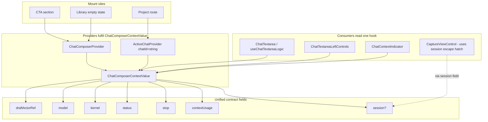

# Chat Composer Context Unification

Re-evaluate the chat-provider split shipped during the project-route crash-loop fix and decide whether the resulting hook fan-out + "optional" branching in `ChatTextarea` is the right architectural endpoint, or whether the providers should fully own the runtime branching and expose a single unified composer contract.

## Executive Summary

The recent `<ChatComposerProvider>` / `<ActiveChatProvider>` split turned a runtime gate (provider tolerates `chatId=undefined`, consumer throws on missing chat) into a compile-time contract (provider requires `chatId: string`). That was the right move for the crash-loop class of bugs. But the **shape of the consumer surface** drifted in the wrong direction: `ChatTextarea` now binds to four chat-scoped hooks (`useChatComposer` + `useDraftActions` + `useActiveChatModel` + `useActiveChatKernel`), two `useOptional*` helpers, and the model/kernel hooks each carry an `Optional` branch because they have to tolerate the composer-only provider. The "Optional" notion is the smell: it pushes the dual-mode branch from one place (the providers) to N places (every consumer).

The eigenquestion is mis-framed. The current frame is "how does each composer consumer detect whether a session is in scope?" The correct frame is "what contract does the composer need from its host environment?" Answering the second yields **one** hook (`useChatComposer`) backed by two providers that each fully implement the contract — `ChatComposerProvider` with cookie-only model/kernel + no-op stop + fixed `'ready'` status, `ActiveChatProvider` with chat-scoped model/kernel + live stop + live status. No `Optional` branches, no fan-out, no per-consumer composition.

Recommendation: **adopt the unified composer contract (Approach B)**. The "Active*" hooks (`useActiveChatModel`, `useActiveChatKernel`) become provider-internal implementation detail; the cookie-only `useModels()` / `useKernel()` stay as-is for non-chat consumers (NavFooter, settings dialogs). Net delta: −4 hooks at chat-textarea call sites, −2 `useOptional*`helpers, −1 conceptual axis ("optionality") from the chat surface. Migration is a single refactor pass in`chat-textarea-types.ts`+ a thin`useChatComposer` rewrite; no machine, wire-format, or persistence changes.

## Problem Statement

After two consecutive architectural rounds — (1) split providers to fix the route crash-loop, (2) hoist `<ActiveChatProvider>` above the viewer to fix the second crash-loop — the consumer surface accumulated four code smells that the user explicitly flagged:

1. **`chat-context-indicator.tsx`** — split usage across two hooks (`useActiveChatSessionOptional` for session presence + `useChatSessionSnapshot` for state). The component carries a `session?.activeChatId ?? ''` defensive branch and a `null` return for the missing-session case.
2. **`chat-textarea-desktop.tsx`** — three chat-scoped hooks: `useChatComposer`, `useDraftActions`, `useActiveChatKernel`. The desktop component is meant to be a memoised pure view; binding it to three chat contexts couples its render to three independent subscriptions and forces every test to mock all three.
3. **`chat-textarea-types.ts`** — four hooks (`useDraftActions`, `useDraftSelector`, `useOptionalChatStatus`, `useOptionalStop`) plus `useActiveChatModel`. The "Optional" prefix is a contract leak: the consumer is told "this hook _might_ not have what you need" and is expected to silently degrade.
4. **`use-active-chat-kernel.ts` / `use-active-chat-model.ts`** — both hooks internally call `useActiveChatSessionOptional()` and branch on whether a session exists. When no session: fall back to cookie. When session present: dual-write to chat row + cookie. This is _provider-decision_ logic living inside _resolver hooks_.

Symptom shape: every chat consumer now carries a "is a session in scope?" code path. The dual-mode complexity sprawled across the consumer layer instead of being absorbed by the providers.

## Methodology

- Grepped every chat-scoped hook (`useChatComposer`, `useDraftActions`/`Selector`, `useChatContext`, `useChatSelector`, `useChatActions`, `useChatById`, `useChatRetrySnapshot`, `useOptionalChatStatus`, `useOptionalStop`, `useActiveChat*`) across `apps/ui/app` to inventory consumers and group them by required contract.
- Read [`apps/ui/app/hooks/active-chat-provider.tsx`](apps/ui/app/hooks/active-chat-provider.tsx), [`apps/ui/app/hooks/use-chat.tsx`](apps/ui/app/hooks/use-chat.tsx), [`apps/ui/app/hooks/use-active-chat-model.ts`](apps/ui/app/hooks/use-active-chat-model.ts), [`apps/ui/app/hooks/use-active-chat-kernel.ts`](apps/ui/app/hooks/use-active-chat-kernel.ts) to map the current contract surface.
- Read both composer mount sites — [`apps/ui/app/routes/_index/cta-section.tsx`](apps/ui/app/routes/_index/cta-section.tsx), [`apps/ui/app/routes/projects_.library/route.tsx`](apps/ui/app/routes/projects_.library/route.tsx), [`apps/ui/app/routes/_index/route.tsx`](apps/ui/app/routes/_index/route.tsx) — to confirm the marketing-route invariants and verify the session-backed mount site in [`apps/ui/app/routes/projects_.$id/focused-chat-gate.tsx`](apps/ui/app/routes/projects_.$id/focused-chat-gate.tsx).
- Cross-referenced [`docs/research/chat-active-model-kernel-persistence.md`](docs/research/chat-active-model-kernel-persistence.md) to confirm the historical reason the "Active\*" hooks branch on session presence (it pre-dates the provider split; back then the branch couldn't move anywhere else).
- Verified that non-chat surfaces (`apps/ui/app/components/nav/nav-footer.tsx`, settings dialogs) consume `useModels()` / `useKernel()` directly and do NOT need a chat provider in scope.

## Findings

### Finding 1: The composer needs a single contract; the providers split it across four hooks

`ChatTextarea` is a single product surface: a textarea + a model selector + a kernel selector + a status/stop button + a draft state machine. From the component's perspective, this is **one** logical context: "the composer state for the user's current chat surface". The contract has six fields:

| Field        | Semantic                                                   | Composer-only provider value | Session-backed provider value                          |
| ------------ | ---------------------------------------------------------- | ---------------------------- | ------------------------------------------------------ |
| `draftActor` | Text/images/mode/tool selection state machine              | Throwaway in-memory actor    | Persisted actor wired to chat row                      |
| `model`      | `{ modelId, model, setActiveModel }`                       | Cookie-backed                | Chat-row-preferred, cookie fallback, dual-write on set |
| `kernel`     | `{ kernelId, kernel, setActiveKernel }`                    | Cookie-backed                | Chat-row-preferred, cookie fallback, dual-write on set |
| `status`     | Chat instance status (`'ready' \| 'streaming' \| 'error'`) | Constant `'ready'`           | Live AI SDK Chat instance status                       |
| `stop`       | Cancel-in-flight callback                                  | No-op                        | Dispatch `stopRequest` to persistence actor            |
| `session`    | `{ activeChatId, chat, persistenceActorRef }` or undefined | `undefined`                  | Live session triple                                    |

Today the provider returns ONLY `{ draftActorRef }` and consumers chase the other five fields through four hooks. The provider has all the information needed to populate the full contract — it just doesn't.

### Finding 2: "Optional" is a contract leak, not a feature

The `useOptionalChatStatus` and `useOptionalStop` helpers exist because `ChatTextarea` runs under both providers and needs to silently degrade on the composer-only side. Each helper internally calls `useActiveChatSessionOptional()` and branches:

```ts
// apps/ui/app/hooks/use-chat.tsx:683-686
export function useOptionalChatStatus(): ChatInstance['status'] {
  const session = useActiveChatSessionOptional();
  return useChatSessionSnapshot(session?.activeChatId ?? '', (s) => s?.chat.status ?? 'ready');
}
```

The composer is the only consumer of these helpers. Their existence advertises "the surrounding context might be incomplete, you have to handle that" — a precondition the textarea propagates to every reader and every test. The semantic the composer actually wants is "give me the status; treat composer-only as 'ready' permanently" — a decision that belongs in `ChatComposerProvider`, not in the consumer.

The same pattern repeats inside `useActiveChatModel` / `useActiveChatKernel`:

```ts
// apps/ui/app/hooks/use-active-chat-kernel.ts:55-69
export function useActiveChatKernel(): ActiveChatKernel {
  const session = useActiveChatSessionOptional(); // <— dual-mode branch
  const chatActiveKernel = useSelector(session?.persistenceActorRef, (state) => state?.context.activeKernel);
  const { kernel: cookieKernel, setKernel: setCookieKernel } = useKernel();
  const kernelId: KernelId = chatActiveKernel ?? cookieKernel;
  // ...
  const setActiveKernel = useCallback(
    (next: KernelId) => {
      setCookieKernel(next);
      session?.persistenceActorRef.send({ type: 'setActiveKernel', kernel: next }); // <— dual-mode branch
    },
    [session, setCookieKernel],
  );
  // ...
}
```

The hook is doing the provider's job: it inspects which provider is upstream, then implements the appropriate strategy. This is provider-decision logic with the wrong owner.

### Finding 3: Provider-internal branching is centralised; consumer branching is sprawled

The current contract puts the runtime branch in _six_ places (the four chat-scoped hooks the textarea binds to, plus the two `useOptional*` helpers, plus `ChatContextIndicator`). Each branch is correct in isolation; together they are an N-place violation of the "decide once, propagate the answer" rule.

Inverting it: if `ChatComposerProvider` and `ActiveChatProvider` each populate a full `ChatComposerContextValue` with all six fields, the branch lives in _exactly two_ places — the two provider constructors. Consumers receive a fully-resolved context and never reason about provider identity.

### Finding 4: Cookie-only consumers don't share the composer's needs

Not every model/kernel consumer is a composer. `apps/ui/app/components/nav/nav-footer.tsx` and the settings dialogs read `useModels()` / `useKernel()` directly — they have no chat session in scope and don't need one. The cookie hooks remain the right primitive for the _user preference_ surface.

This rules out a naive merge (e.g. deleting `useModels` / `useKernel`). The unification must apply to the _composer_ layer only; the cookie layer below it stays intact.

### Finding 5: The `''` chatId sentinel in `ChatContextIndicator` is a smell of the same shape

```tsx
// apps/ui/app/components/chat/chat-context-indicator.tsx:98-99
const session = useActiveChatSessionOptional();
const usage = useChatSessionSnapshot(session?.activeChatId ?? '', (state) => { ... });
```

The empty-string sentinel is a way to keep `useSyncExternalStore`'s subscription stable when no session exists. It exists because the consumer is forced to compose two hooks (presence + snapshot) and pass the chatId from one to the other across a possibly-undefined boundary. If the provider exposes `usage` directly as a derived field of the composer contract, the consumer simply renders `if (!usage) return null` — no sentinel, no two-hook composition.

## Eigenquestion Re-framing

The four findings collapse into one mis-framing. The implicit eigenquestion driving the current shape:

> "How does each composer consumer detect whether a session is in scope, and what should it do when there isn't one?"

This question forces every consumer to learn the provider hierarchy and implement a branch. The N-place branching follows mechanically.

The architecturally correct eigenquestion:

> "What contract does the composer need from its host environment, and how does each host fulfil it?"

This question forces the providers to fully populate the contract and frees the consumer to be a pure function of context. Branching collapses to the two provider constructors, which already know their identity by construction.

## Options Compared

### A — Status quo (4 hooks per component, "Optional" everywhere)

`ChatTextarea` keeps binding to `useChatComposer` + `useDraftActions`/`Selector` + `useActiveChatModel` + `useActiveChatKernel` + `useOptionalChatStatus` + `useOptionalStop`. `ChatContextIndicator` keeps its two-hook composition + `''` sentinel.

### B — Unified composer contract (provider-resolved)

`ChatComposerProvider` and `ActiveChatProvider` both populate a full `ChatComposerContextValue` with `draftActor`, `model`, `kernel`, `status`, `stop`, `session?`. A single `useChatComposer()` hook returns the lot. The "Active\*" hooks become provider-internal helpers (no longer exported); `useOptionalChatStatus` / `useOptionalStop` are deleted. `ChatContextIndicator` reads `usage` directly off the composer context (the provider derives it once per session change).

### C — Hybrid (composer-only for draft + model + kernel; keep `useOptional*` for niche)

Same as B but leave `useOptionalChatStatus` / `useOptionalStop` because "only the cancel button needs them". Trades a smaller refactor for keeping the leaky abstraction alive.

### D — Compound props (lift the resolution out of the textarea entirely)

A new `ChatComposerHost` wrapper consumes both providers and threads the unified contract down via props. The textarea becomes a fully view-only component with N props. This is the "extreme" interpretation of the user's framing — view-only with deep prop threading.

### Comparison

| Dimension                            | A (status quo) | B (unified context) | C (hybrid) | D (compound props) |
| ------------------------------------ | -------------- | ------------------- | ---------- | ------------------ |
| Hooks at composer call sites         | 6              | 1                   | 3          | 0                  |
| Places "optional" branch lives       | N (~6)         | 2 (providers only)  | 4          | 1 (wrapper)        |
| Test mocks per textarea unit test    | 6              | 1                   | 3          | 1                  |
| Touches non-composer surfaces        | none           | none                | none       | N component sigs   |
| Lift required at mount sites         | none           | none                | none       | new wrapper        |
| Composer-only / session symmetry     | accidental     | by construction     | partial    | by construction    |
| Aligns with "providers do their job" | weak           | strong              | medium     | strong             |
| View-only textarea                   | no             | no (uses 1 hook)    | no         | yes                |
| Compile-time discoverability         | medium         | high                | medium     | high               |

B wins on every axis except "view-only textarea" — which is a non-goal in React (a single `useContext` call is the canonical way to read a single context; threading 6 props through is a worse cognitive load than reading 1 hook). D's view-only purity costs a new wrapper layer and prop-drilling through `ChatTextarea` → `ChatTextareaDesktop` / `Mobile` → `ChatTextareaLeftControls` etc.

## Recommendation

Adopt **Approach B** (unified composer contract). The contract lives on the provider; the consumer reads one hook.

### Target shape

```ts
// apps/ui/app/hooks/active-chat-provider.tsx (new shape)
export type ChatComposerContextValue = {
  // Draft + composer
  draftActorRef: ActorRefFrom<typeof draftMachine>;

  // Resolved chat-scoped settings (composer provider: cookie-only; session provider: chat-row + cookie dual-write)
  model: ActiveChatModel;
  kernel: ActiveChatKernel;

  // Live chat lifecycle (composer provider: { status: 'ready', stop: noop }; session provider: live)
  status: ChatInstance['status'];
  stop: () => void;

  // Context usage indicator data (composer provider: undefined; session provider: derived from latest message)
  contextUsage: ContextUsageData | undefined;

  // Optional escape hatch for the rare consumer that genuinely needs the session triple
  // (e.g. CaptureViewControl). Most consumers should not touch this.
  session: ActiveChatSessionContextValue | undefined;
};

export function useChatComposer(): ChatComposerContextValue;
```

`ActiveChatSessionContextValue` stays as the session triple but is no longer the entry point for the composer surface — it's a `.session` field on the composer value, accessed only by genuine session-consumers (`CaptureViewControl`).

### Provider changes

`ChatComposerProvider` synthesises:

```ts
const value: ChatComposerContextValue = {
  draftActorRef,
  model: useCookieModel(), // cookie-only resolver
  kernel: useCookieKernel(), // cookie-only resolver
  status: 'ready',
  stop: noop,
  contextUsage: undefined,
  session: undefined,
};
```

`ActiveChatProvider` synthesises:

```ts
const session = useChatSession(chatId);
const value: ChatComposerContextValue = {
  draftActorRef: session.draftActorRef,
  model: useSessionModel(session), // chat-row + cookie dual-write
  kernel: useSessionKernel(session), // chat-row + cookie dual-write
  status: useChatStatusSnapshot(session),
  stop: useStopCallback(session),
  contextUsage: useContextUsageSnapshot(session),
  session: {
    activeChatId: chatId,
    chat: session.chat,
    persistenceActorRef: session.persistenceActorRef,
    draftActorRef: session.draftActorRef,
  },
};
```

The cookie / session strategy implementations are extracted into provider-internal helpers (`useCookieModel`, `useSessionModel`, etc.) — they encapsulate the same logic that's in `useActiveChatModel` / `useActiveChatKernel` today, just bound to one strategy each.

### Consumer changes

| Before                                                                                                                                         | After                                    |
| ---------------------------------------------------------------------------------------------------------------------------------------------- | ---------------------------------------- |
| `useChatComposer()` + `useDraftActions()` + `useOptionalChatStatus()` + `useOptionalStop()` + `useActiveChatModel()` + `useActiveChatKernel()` | `useChatComposer()` (returns everything) |
| `useActiveChatSessionOptional()` + `useChatSessionSnapshot('', selector)` for `ChatContextIndicator`                                           | `useChatComposer().contextUsage`         |

### Hooks deleted

- `useActiveChatModel`, `useActiveChatKernel` (replaced by provider-internal helpers)
- `useOptionalChatStatus`, `useOptionalStop` (collapsed into `useChatComposer`)
- `useActiveChatSessionOptional` — kept ONLY for `CaptureViewControl` and similar genuine session consumers; renamed to `useChatComposer().session` access pattern to keep the entry point unified.

### Hooks unchanged

- `useModels()`, `useKernel()` (cookie-only, used by NavFooter / settings — outside composer surface)
- `useChatContext`, `useChatActions`, `useChatSelector`, `useChatById`, `useChatRetrySnapshot` (session-required, consumed by ChatHistory / chat-message / chat-error — already require `<ActiveChatProvider>`, no dual-mode concern)
- `useActiveChatSession` (strict variant, still throws — backs `useChatComposer().session!` access for components that have already gated)

## Migration Sequence

1. **Add provider-internal strategy helpers** in [`apps/ui/app/hooks/active-chat-provider.tsx`](apps/ui/app/hooks/active-chat-provider.tsx): `useCookieModel`, `useCookieKernel`, `useSessionModel`, `useSessionKernel`, `useChatStatusSnapshot`, `useStopCallback`, `useContextUsageSnapshot`. Tests cover each strategy in isolation.
2. **Expand `ChatComposerContextValue`** with the six new fields; both providers populate them. Existing consumers keep compiling because they read individual properties through the legacy hooks.
3. **Migrate consumers** one at a time:
   - `chat-textarea-types.ts` → single `useChatComposer()` call; drop `useDraftActions`/`Selector`/`useOptional*`/`useActiveChatModel`.
   - `chat-textarea-desktop.tsx` → drop `useActiveChatKernel`, read from `useChatComposer().kernel`.
   - `chat-context-indicator.tsx` → drop `useActiveChatSessionOptional` + `useChatSessionSnapshot('', ...)`, read `useChatComposer().contextUsage`.
   - `cta-section.tsx`, `_index/route.tsx`, `projects_.library/route.tsx` → drop `useActiveChatModel`, read `useChatComposer().model`.
4. **Delete unused exports**: `useActiveChatModel`, `useActiveChatKernel`, `useOptionalChatStatus`, `useOptionalStop`. Delete their test files.
5. **Update test fixtures**: every chat-textarea / context-indicator test moves from N hook mocks to one composer-context mock. Net test surface area shrinks.
6. **Rerun affected tests**: `pnpm nx test ui` scoped to `chat-textarea*`, `chat-context-indicator*`, `chat-history*`, `_index/route*`, `projects_.library/route*`, `active-chat-provider*`.

No machine, persistence, or wire-format changes. No edit to `editor.machine`, `chat-persistence.machine`, or the API.

## Trade-offs

### Wins

- **Cognitive surface area**: one hook to learn, not six. New contributors don't need to know which `useOptional*` is needed for which field.
- **Test surface area**: one mock per textarea test instead of six. The mock shape matches the production contract exactly.
- **Provider responsibility**: providers fully own the dual-mode decision, satisfying the SRP they were created for.
- **Discoverability**: every composer field is on one type. Auto-complete on `useChatComposer()` shows the full surface.
- **Eliminates the `''` chatId sentinel**: `ChatContextIndicator` reads pre-derived `contextUsage`.

### Losses / risks

- **Bigger provider files**: `active-chat-provider.tsx` grows from ~210 lines to ~300 lines as it absorbs the strategy helpers. Mitigated by extracting the strategy helpers to two sibling files (`composer-strategy.ts`, `session-strategy.ts`) if the file becomes unwieldy.
- **Provider does more work**: `ActiveChatProvider` now always computes `model`/`kernel`/`status`/`contextUsage` even if no descendant reads them. Cost is one `useSelector` + one `useCallback` per field — negligible vs the render cost of the textarea tree.
- **One-time consumer churn**: 8-10 files migrate. Single, mechanical pass. Lockstep with the deletion of the now-unused hooks keeps the diff coherent.
- **Loses the cookie-only fast-path inside `useActiveChatModel`/`Kernel`** for non-textarea consumers. There are none today (the existing `useActiveChat*` callers are all inside the composer surface), so this is theoretical.

### Why not approach D (compound props / view-only textarea)

D maximises view-only purity but moves the leaky abstraction one layer up (the wrapper). React's idiomatic answer to "many context values from one source" is a single context hook, not prop-drilling. The cost of D is a new component layer and prop-drilling through `ChatTextarea` → `ChatTextareaDesktop` → `ChatTextareaLeftControls` (and the mobile mirror), with each layer needing to re-declare prop shape. B keeps the indirection minimal and respects React's context idiom.

## Code Examples

### Before — `chat-textarea-types.ts` consumer surface

```ts
const { model: selectedModel } = useActiveChatModel();
const status = useOptionalChatStatus();
const stop = useOptionalStop();
const inputText = useDraftSelector((state) => (mode === 'main' ? state.draftText : state.editDraftText));
const images = useDraftSelector((state) => (mode === 'main' ? state.draftImages : state.editDraftImages));
const selectedToolChoice = useDraftSelector((state) => /* ... */);
const { setDraftText, addDraftImage, removeDraftImage, setDraftToolChoice, /* edit-variants */ } = useDraftActions();
```

### After — same call site

```ts
const composer = useChatComposer();
const { model: selectedModel, status, stop, draftActorRef } = composer;
const inputText = useSelector(draftActorRef, (state) =>
  mode === 'main' ? state.context.draftText : state.context.editDraftText,
);
// ... or keep useDraftSelector as a sugar wrapper over draftActorRef + useSelector
```

### Before — `chat-textarea-desktop.tsx` left controls

```ts
const { kernel: selectedKernel } = useActiveChatKernel();
```

### After

```ts
const { kernel: selectedKernel } = useChatComposer().kernel;
```

### Before — `chat-context-indicator.tsx`

```ts
const session = useActiveChatSessionOptional();
const usage = useChatSessionSnapshot(session?.activeChatId ?? '', (state) => {
  if (!state) return undefined;
  // ...iterate parts for 'data-context-usage'...
});
if (!usage) return undefined;
return <ChatContextIndicatorDisplay data={usage} />;
```

### After

```ts
const { contextUsage } = useChatComposer();
if (!contextUsage) return undefined;
return <ChatContextIndicatorDisplay data={contextUsage} />;
```

## Provider Contract Diagram



## References

- Related: [`docs/research/chat-active-model-kernel-persistence.md`](docs/research/chat-active-model-kernel-persistence.md) — origin of the chat-scoped model/kernel hooks; pre-dates the provider split.
- Provider split rationale (inline JSDoc): [`apps/ui/app/hooks/active-chat-provider.tsx`](apps/ui/app/hooks/active-chat-provider.tsx) lines 1-29.
- Session-required vs composer-required hook families (inline JSDoc): [`apps/ui/app/hooks/use-chat.tsx`](apps/ui/app/hooks/use-chat.tsx) lines 13-38.
- Composer mount sites: [`apps/ui/app/routes/_index/cta-section.tsx`](apps/ui/app/routes/_index/cta-section.tsx), [`apps/ui/app/routes/projects_.library/route.tsx`](apps/ui/app/routes/projects_.library/route.tsx).
- Session-backed mount site: [`apps/ui/app/routes/projects_.$id/focused-chat-gate.tsx`](apps/ui/app/routes/projects_.$id/focused-chat-gate.tsx).
- Genuine session-consumer outside the composer surface: [`apps/ui/app/components/geometry/cad/capture-view-control.tsx`](apps/ui/app/components/geometry/cad/capture-view-control.tsx).
