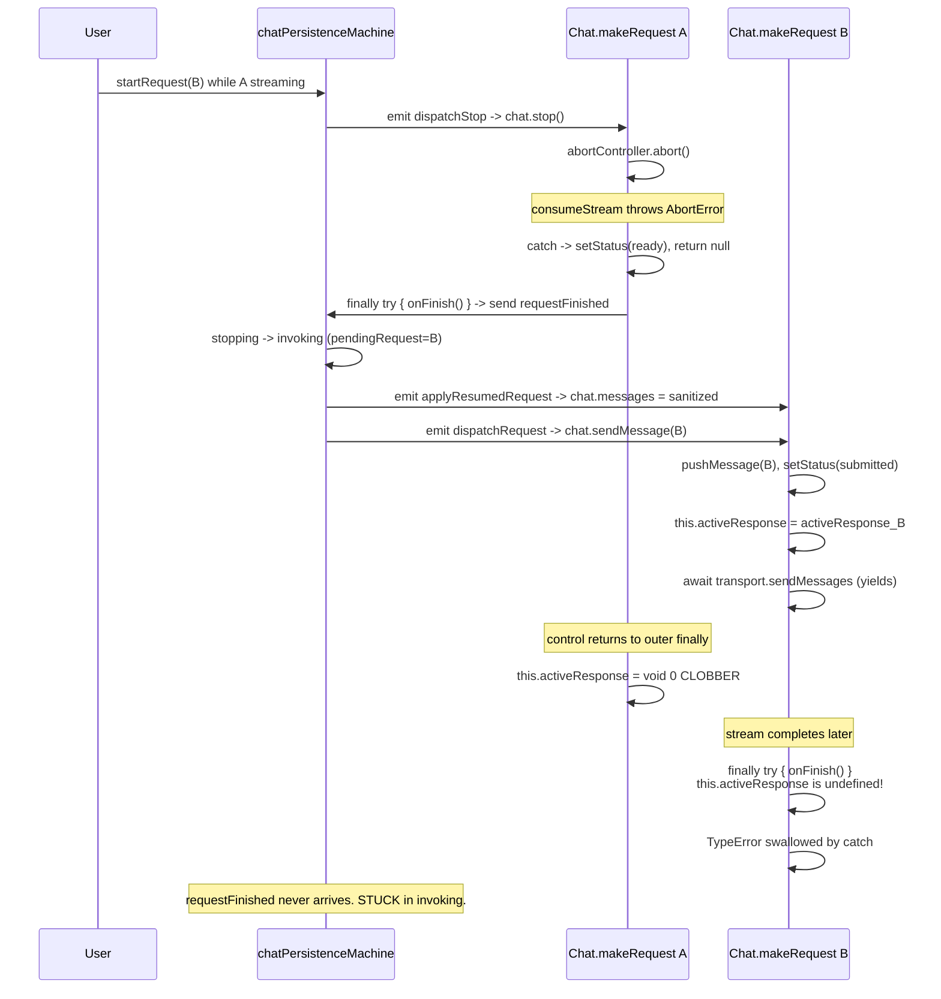
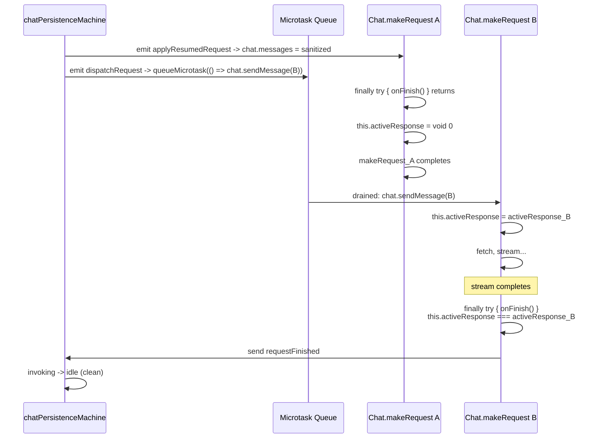

# Chat Follow-Up Message Swallowing

Why a user-submitted follow-up message in `apps/ui/app/routes/projects_.$id/chat-history.tsx` occasionally disappears with no network request, no streaming, and no console output — and the minimal fix.

## Executive Summary

The intermittent "swallowed follow-up" bug is caused by a synchronous re-entrance into AI SDK's `Chat.makeRequest` from inside another `Chat.makeRequest`'s `finally` block. AI SDK v6's `makeRequest` accesses `this.activeResponse.state.message` without optional chaining and then unconditionally clobbers `this.activeResponse = void 0` _after_ `onFinish` returns. The clobber wipes the nested makeRequest's freshly-assigned `activeResponse`; when the nested makeRequest's own `finally` runs, `this.activeResponse.state.message` throws a `TypeError` that the outer `try/catch (err) { console.error(err); }` swallows. `onFinish` is never invoked, the persistence machine never receives `requestFinished`, and subsequent follow-up messages route through `stopping` where `chat.stop()` is a no-op — leaving the machine and the user-visible composer permanently stuck.

The fix is a single-microtask deferral of the `dispatchRequest` listener in [`apps/ui/app/services/chat-session-store.ts`](apps/ui/app/services/chat-session-store.ts) so that the new `makeRequest` call always starts after the outer `makeRequest`'s `finally` has fully completed.

## Problem Statement

Reported symptoms (R0):

- User finishes a multi-turn conversation; assistant response visibly completes (with cost printed)
- User types a follow-up and presses Enter
- The submit button visually accepts the input, but:
  - No network request is issued (DevTools Network panel shows only unrelated analytics traffic)
  - No console error, warn, or log entry
  - No new user message renders in chat history
  - No "Planning next moves..." or any streaming activity
- Workaround discovered by the user: refresh the page; the persisted draft reloads in the textarea; resubmit and the message goes through normally

The bug is intermittent. It only fires when the user has previously preempted an in-flight stream (the AI SDK term: started a new request while another was streaming or submitted).

## Methodology

1. Static trace of [`apps/ui/app/routes/projects_.$id/chat-history.tsx`](apps/ui/app/routes/projects_.$id/chat-history.tsx) `onSubmit` → [`useChatActions`](apps/ui/app/hooks/use-chat.tsx) → [`ChatSessionStore`](apps/ui/app/services/chat-session-store.ts) → [`chatPersistenceMachine`](apps/ui/app/hooks/chat-persistence.machine.ts).
2. Read the bundled AI SDK source at [`node_modules/.pnpm/ai@6.0.175_zod@4.4.3/node_modules/ai/dist/index.js`](node_modules/.pnpm/ai@6.0.175_zod@4.4.3/node_modules/ai/dist/index.js) to validate observed runtime behavior against compiled output.
3. Reasoned about JavaScript microtask ordering across synchronous emit chains (XState 5 `emit` action → React listener → AI SDK private method → AI SDK `finally`).
4. Cross-checked against existing tests in [`apps/ui/app/hooks/chat-persistence.machine.test.ts`](apps/ui/app/hooks/chat-persistence.machine.test.ts) covering the preempt path (`stopping → invoking on requestFinished + pendingRequest`).

## Findings

### Finding 1: AI SDK's `makeRequest` clobbers `this.activeResponse` after `onFinish`

`ai@6.0.175` Chat class, [line 13327-13341](node_modules/.pnpm/ai@6.0.175_zod@4.4.3/node_modules/ai/dist/index.js):

```js
} finally {
  try {
    this.onFinish?.call(this, {
      message: this.activeResponse.state.message,   // NOT optional-chained
      messages: this.state.messages,
      isAbort,
      isDisconnect,
      isError,
      finishReason: this.activeResponse?.state.finishReason
    });
  } catch (err) {
    console.error(err);
  }
  this.activeResponse = void 0;
}
```

Two failure modes coexist in this finally block:

1. **Field access without optional chaining**: `this.activeResponse.state.message` (no `?.`) throws when `this.activeResponse` is undefined.
2. **Late nulling**: `this.activeResponse = void 0` runs _after_ `onFinish`, so if `onFinish` synchronously triggers a new `makeRequest` that assigns `this.activeResponse = activeResponse_new`, the outer finally overwrites the new assignment.

The two combine to make the bug unobservable: the TypeError is silently caught and `console.error`'d (typically not visible in production with strict log filters), and execution continues.

### Finding 2: The persistence machine's preempt path is the synchronous re-entry vector

The `stopping → invoking` "preempt" branch in [`chat-persistence.machine.ts`](apps/ui/app/hooks/chat-persistence.machine.ts) emits two events back-to-back:

```ts
requestFinished: [
  {
    guard: ({ context }) => context.pendingRequest !== undefined,
    target: 'invoking',
    actions: [
      emit({ type: 'applyResumedRequest', messages, pendingRequest, cause: 'preempt' }),
      emit({ type: 'dispatchRequest', request: pendingRequest }),
      assign({ pendingRequest: undefined }),
    ],
  },
  // ...
];
```

The `dispatchRequest` listener in `chat-session-store.ts` calls `chat.sendMessage` / `chat.regenerate` / `chatShim.makeRequest` synchronously. Because XState 5 fires emits synchronously inside the originating transition, and `chat.onFinish` synchronously sends `requestFinished` from inside `makeRequest`'s `finally` try-block, the entire chain executes in one synchronous stack:

```text
makeRequest_A.finally.try
  -> onFinish()
    -> actor.send(requestFinished)
      -> stopping -> invoking transition
        -> emit applyResumedRequest -> chat.messages = sanitized
        -> emit dispatchRequest -> chat.sendMessage(B)
          -> pushMessage(B), setStatus('submitted')
          -> this.activeResponse = activeResponse_B
          -> await transport.sendMessages (yields)
  -> // onFinish returns
this.activeResponse = void 0  <-- clobbers activeResponse_B
```

### Finding 3: The clobber cascades into a permanently-stuck persistence machine

When `makeRequest_B` resolves later (fetch returns, stream consumed, status set to `ready`), its own `finally` block runs. At that point `this.activeResponse === undefined` (clobbered by the outer finally). The `this.activeResponse.state.message` access throws a TypeError. The catch swallows it. **`onFinish` for `makeRequest_B` is never called.** The persistence machine never receives `requestFinished` for B. The machine stays in `requestLifecycle.invoking` indefinitely.

The user notices nothing: B's response was rendered correctly through `runUpdateMessageJob` (which captures `activeResponse` in a closure local variable, not `this.activeResponse`), and `chat.status` correctly transitioned `submitted → streaming → ready`.

### Finding 4: Once stuck in `invoking`, subsequent follow-ups silently route through a dead `stopping`

User submits message C:

- Machine `invoking + startRequest` transitions to `stopping`, sets `pendingRequest = C`, emits `dispatchStop`.
- `dispatchStop` listener calls `chat.stop()`.
- AI SDK `stop` ([line 13151-13158](node_modules/.pnpm/ai@6.0.175_zod@4.4.3/node_modules/ai/dist/index.js)):

  ```js
  this.stop = async () => {
    if (this.status !== 'streaming' && this.status !== 'submitted') return;
    if (this.activeResponse?.abortController) {
      this.activeResponse.abortController.abort();
    }
  };
  ```

- `chat.status === 'ready'` from B's normal completion -> early return, NO abort.
- No `onFinish` fires -> no `requestFinished` -> machine stays in `stopping` forever.
- The `clearDraft` event that `useChatActions.sendMessage` dispatches _before_ `startRequest` still fires (so the textarea clears).
- Subsequent submits hit `stopping.on.startRequest` which just replaces `pendingRequest` without re-emitting anything.

Result: every follow-up after the clobber is silently swallowed. Only a page reload (which constructs a fresh `Chat` + persistence actor pair via `ChatSessionStore.acquire`) recovers.

### Finding 5: Why the user can recover by refreshing and resubmitting

After refresh, the `loadChatActor` rehydrates `chat.messages` from IndexedDB. If the user's pending follow-up was persisted (i.e. the draft IndexedDB write completed before the user got nervous and refreshed), it shows up in the textarea, and a single submit through the freshly-constructed (idle) persistence machine succeeds normally. This matches the user's observation: "it can be worked around by refreshing the page then resubmitting the persisted draft".

## Recommendations

| #   | Action                                                                                                                                                                                                             | Priority | Effort | Impact |
| --- | ------------------------------------------------------------------------------------------------------------------------------------------------------------------------------------------------------------------ | -------- | ------ | ------ |
| R1  | Defer the `dispatchRequest` listener body in [`chat-session-store.ts`](apps/ui/app/services/chat-session-store.ts) onto a microtask (`queueMicrotask`) so the new `makeRequest` never nests inside the outer       | P0       | Low    | High   |
| R2  | Add a reproduction test in [`chat-session-store.test.ts`](apps/ui/app/services/chat-session-store.test.ts) that mimics AI SDK's late `activeResponse = void 0` ordering and asserts the machine returns to `idle`  | P0       | Low    | High   |
| R3  | Extend [`chat-session-store.contract.test.ts`](apps/ui/app/services/chat-session-store.contract.test.ts) with a source-shape probe so an upstream fix (adding optional chaining) flags the workaround as removable | P1       | Low    | Medium |
| R4  | File an upstream PR on `vercel/ai` adding optional chaining (`this.activeResponse?.state.message`) and shifting the `this.activeResponse = void 0` reset to _before_ `onFinish` so the SDK becomes self-healing    | P2       | Low    | Medium |

## The Fix

Wrap the `dispatchRequest` listener body in `queueMicrotask`:

```ts
const dispatchSubscription = persistenceActorRef.on('dispatchRequest', ({ request }) => {
  // Defer onto a microtask so we never call `chat.sendMessage` /
  // `chat.regenerate` / `chatShim.makeRequest` from inside another
  // `Chat.makeRequest`'s `finally` block. AI SDK v6's makeRequest clobbers
  // `this.activeResponse = void 0` AFTER its `onFinish` callback returns,
  // which would null out a nested makeRequest's freshly-set activeResponse
  // and cause the nested finally to throw `Cannot read properties of
  // undefined (reading 'state')`, swallowing its onFinish.
  queueMicrotask(() => {
    switch (request.kind) {
      case 'send':
        void chat.sendMessage(request.message);
        return;
      // ...
    }
  });
});
```

Why this is sufficient:

- After deferral, `makeRequest_A.finally` completes (including `this.activeResponse = void 0`) before any new microtask runs.
- The deferred microtask then creates `activeResponse_B` and assigns `this.activeResponse = activeResponse_B`. Nothing else clobbers it.
- When `makeRequest_B.finally` runs later, `this.activeResponse === activeResponse_B`, the `.state.message` access succeeds, `onFinish` fires, `requestFinished` reaches the machine, and the machine returns to `idle`.

Why other listeners do _not_ need deferring:

- `dispatchStop` calls `chat.stop()`, which only flips an `AbortController` — no nested `makeRequest`.
- `applyFinishedRequest` / `applyStoppedRequest` / `applyResumedRequest` mutate `chat.messages` via the public setter — no `makeRequest` call.
- `applyResumedRequest` specifically _must_ stay synchronous: it sets `chat.messages = sanitized` and the subsequent `dispatchRequest` listener must observe that mutation before issuing `chat.sendMessage(B)`. Deferring only `dispatchRequest` (and not `applyResumedRequest`) preserves this ordering.

## Diagrams

### Synchronous re-entry chain (broken)



### Deferred chain (fixed)



## References

- AI SDK source: [`node_modules/.pnpm/ai@6.0.175_zod@4.4.3/node_modules/ai/dist/index.js`](node_modules/.pnpm/ai@6.0.175_zod@4.4.3/node_modules/ai/dist/index.js) (lines 13151-13158 for `stop`, 13214-13351 for `makeRequest`)
- Persistence machine: [`apps/ui/app/hooks/chat-persistence.machine.ts`](apps/ui/app/hooks/chat-persistence.machine.ts) (`requestLifecycle.stopping.on.requestFinished`)
- React-side listeners: [`apps/ui/app/services/chat-session-store.ts`](apps/ui/app/services/chat-session-store.ts) (`dispatchSubscription` and related emits)
- Related: [`docs/research/resumable-chat-streams.md`](docs/research/resumable-chat-streams.md) (R1 `continue`-dispatch path goes through the same listener)
