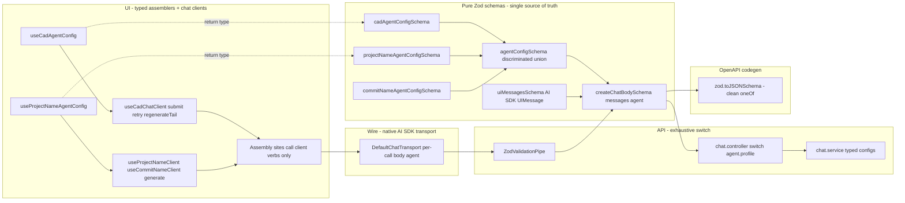

# Chat Metadata as a First-Class Capability — Architecture Blueprint

> **Implementation note (2026-05-18):** Blueprint shipped as designed. Two post-implementation refinements applied during the rename pass: (1) the wrapper schema named `createChatBodySchema` throughout this document was renamed to `chatTurnRequestSchema` (file `libs/chat/src/schemas/chat-turn-request.schema.ts`) so the domain library stops speaking HTTP — the API DTO class `CreateChatDto` keeps the HTTP-layer name; (2) `snapshot` / `contextPayload` use `.optional()` rather than `.default({})` since the empty default was a sentinel for "absent" and required a controller-side collapse. The normative rules now live in [`docs/policy/chat-request-config-policy.md`](../policy/chat-request-config-policy.md). The blueprint text below preserves the original symbol names for the historical record.

Blueprint for reworking chat-request configuration so that adding a flag, limit, or context field is a single Zod-schema edit; per-request settings live at the body root (following the placement convention OpenAI / Anthropic / Gemini all share); and `zod.toJSONSchema()` produces a clean OpenAPI document.

## Executive Summary

Per-request configuration (`kernel`, `mode`, `toolChoice`, `testingEnabled`, `snapshot`, `contextPayload`) currently lives inside the last user message's `metadata` field. This is the root cause of every bug in this class:

- Two recent production regressions ([`chat-edit-message-metadata-stripping.md`](chat-edit-message-metadata-stripping.md) and the homepage `testingEnabled` 400) plus three latent variants (Fix-with-AI, both name-generator callsites).
- The wire schema can only express "the last user message has this required metadata" via `.superRefine()`, which is invisible to `zod.toJSONSchema()` and breaks OpenAPI / codegen output.
- Configuration travels with every persisted historical message even though the API only ever reads it from the last one.
- Edit / retry / regenerate semantics have to negotiate "sticky vs fresh" per field because config is stuck in the message.

The fix is to move per-request configuration to the **top level of the request body**, following the _placement convention_ OpenAI / Anthropic / Gemini all share (see [Appendix B](#appendix-b--industry-standard-request-shapes-openai--anthropic--gemini)). The configuration block is named `agent` — describing the concept it carries (configuration for this agent execution), in line with the OpenAI Agents SDK / LangGraph convention and the [library-api-policy](../policy/library-api-policy.md) ("describe the concept, not the container"). The endpoint stays `/v1/chat` and messages keep their existing AI SDK `UIMessage` shape on the wire; only the body envelope changes. The new wire shape is:

```json
{
  "messages": [ /* AI SDK UIMessage shape, unchanged */ ],
  "agent": {
    "profile": "cad",
    "model": "anthropic/claude-sonnet-4-5",
    "kernel": "replicad",
    "mode": "agent",
    "toolChoice": "auto",
    "testingEnabled": true,
    "snapshot": {...},
    "contextPayload": {...}
  }
}
```

`model` lives _inside_ `agent.cad` because it is part of the CAD agent's per-execution config; auxiliary profiles (`project_name`, `commit_name`) carry no `model` field because their model is server-controlled (a profile-internal cost decision, not a caller knob). Full OpenAI wire-envelope compatibility (renaming the endpoint to `/v1/chat/completions`, hoisting `model` / `tools` / `tool_choice` / `stream` to the body root, mapping `UIMessage` to OpenAI `{role, content}`) is **deferred** — see [Deferred Decisions](#deferred-decisions) for why.

Four pure-Zod / TS primitives compose cleanly on top:

1. **`agentConfigSchema = z.discriminatedUnion('profile', [cad, projectName, commitName])`** — each variant lists its own required fields. Pure Zod, serialises to clean `oneOf` JSON Schema, gives exhaustive TypeScript `switch` discrimination. Auxiliary profiles (`project_name`, `commit_name`) stop needing dummy fields.

2. **Top-level body schema with `agent` block** — `createChatBodySchema = z.object({ messages: nonempty, agent: agentConfigSchema })` on the existing `/v1/chat` endpoint. Messages stay in their current AI SDK `UIMessage` shape — no message-shape transform on the wire, no `openAiMessageSchema`, no `toOpenAiMessage` mapper. No refinements anywhere; the only structural constraint left is `messages.nonempty()`, which Zod expresses purely.

3. **TS-enforced typed assembler hooks** — `useCadAgentConfig(): z.input<typeof cadAgentConfigSchema>` composes the existing producer hooks and returns a typed object. The schema's inferred input type makes TypeScript the registry: adding a field to the schema breaks compilation at every assembler that fails to supply it. No custom registry abstraction, no lint-rule-as-load-bearing-enforcer.

4. **Profile-scoped chat clients** — `useCadChatClient()`, `useProjectNameClient()`, `useCommitNameClient()` are the single indirection layer between application code and the AI SDK / transport / agent config. They expose only profile-aware verbs (`submit`, `retry`, `regenerateTail`, `stop`, `generate`); the raw `Chat.sendMessage` is module-private to the client layer. Application code never constructs `body` or `agent` — so adding a new agent-config field requires touching exactly one file (the assembler hook), never the seven assembly sites.

Bonus benefits that fall out automatically:

- **OpenAPI publishable.** `zod.toJSONSchema(createChatBodySchema)` produces a clean spec for any future codegen consumers.
- **Configuration ships once per request, not once per historical message.**
- **Edit / retry / regenerate always re-derive config from current state** — matches user intuition ("the settings I have right now are the settings I submit with"), eliminates the sticky-vs-fresh policy debate.
- **No persistence-repair helper needed.** Historical message metadata becomes wire-irrelevant; the assembler is the only source of `agent` on every submit.
- **No transport-level message transform.** The AI SDK `DefaultChatTransport` continues to serialise `UIMessage` as it does today; the only change at the wire boundary is "include `body: { agent }` per call."

This document supersedes two earlier sketches: v1 introduced a custom field-registry abstraction; v2 kept `.superRefine()` and proposed a structural `{ history, pendingMessage }` body split; v3 bundled full OpenAI wire-envelope compatibility (endpoint rename + message-shape mapper) with the structural fix. All three are now identified as solving (or over-solving) sub-problems of the deeper structural mistake — config living in the wrong place.

## Table of Contents

1. Problem Statement
2. Methodology
3. Findings — Current State
4. Target Architecture
5. Recommendations
6. Implementation Roadmap
7. Trade-offs and Alternatives
8. Open Questions
9. Deferred Decisions
10. Non-Goals
11. References
12. Appendix A — Current State Inventory
13. Appendix B — Industry-Standard Request Shapes (OpenAI / Anthropic / Gemini)

## Problem Statement

Immediate symptom (the trigger):

> `Validation failed: messages.0.metadata.testingEnabled: Invalid input: expected nonoptional, received undefined`
>
> Reproduced on the homepage "New Project" flow as soon as the strict `lastUserMessageMetadataSchema` landed. The initial-message metadata reaches `use-project-manager.createProject` carrying only `{ toolChoice, mode }` from `ChatTextarea`, gets `kernel`, `model`, `status` added inside `createProject`, persists to IndexedDB, and then auto-`regenerate()`s with the missing field after navigation.

Structural symptom (the class of bug this enables):

- Three already-shipped or latent variants of the same shape: [`buildEditedMessage` stripping metadata](chat-edit-message-metadata-stripping.md); `chat-examples.tsx` quick-start omitting kernel; `chat-stack-trace.tsx` Fix-with-AI silently omitting `mode` / `toolChoice` / `testingEnabled`; both name-generator callsites overwriting `metadata` to `{ model: 'name-generator' }` and surviving only because the controller short-circuits on the model id before the strict schema fires.
- The wire `messageMetadataSchema` declares two fields (`manufacturingMethod`, `engineeringDiscipline`) with no producer and no consumer anywhere in the codebase.
- The strict last-user contract lives as a Zod `.superRefine()` in `apps/api/app/api/chat/chat.dto.ts`. Refinements do not serialise to JSON Schema: any future OpenAPI generation, codegen client, or static documentation tool sees a contract strictly weaker than what the server actually enforces.
- Tau's wire pattern (per-request config inside the last message's metadata) is the **structural outlier** versus OpenAI / Anthropic / Gemini, which all place per-request settings at the body root.

Forward-looking requirement (the durability test):

> Adding a new field — `contextLimit: number`, `safetyMode: 'strict' | 'permissive'`, `costCapUsd: number` — should be a single schema edit. TypeScript should make missing wiring impossible. The wire contract should be pure Zod so OpenAPI consumers see the same truth as the server. Per-request settings should sit at the body root (the placement lesson from OpenAI / Anthropic / Gemini), even though full OpenAI wire-envelope compatibility is not a goal of this blueprint.

## Methodology

End-to-end trace across six layers (sources → assemblers → wire → validation → consumption → persistence). Findings cite file path + line range. See [Appendix A](#appendix-a--current-state-inventory) for the full inventory; the body summarises. The wire-shape design is cross-checked against the OpenAI Chat Completions, Anthropic Messages, and Google Gemini `generateContent` request contracts — see [Appendix B](#appendix-b--industry-standard-request-shapes-openai--anthropic--gemini).

## Findings — Current State

### Finding 1: Per-request config lives in the wrong place

The structural root cause. Tau embeds per-turn agent configuration (`kernel`, `mode`, `toolChoice`, `testingEnabled`, `snapshot`, `contextPayload`) inside the last user message's `metadata` field. OpenAI, Anthropic, and Gemini all place per-request settings at the top level of the request body (siblings of `messages`). Messages stay pure `{role, content}`.

Direct consequences:

- "Last message must be user with strict metadata" becomes a refinement (`.superRefine()`) instead of a structural fact.
- Every historical message ships a full configuration blob, even though only the last is consulted server-side.
- The seven assembly sites (see Finding 2) all have to remember to stamp the same fields on every outgoing message.
- Edit / retry / regenerate semantics have to choose whether to preserve the original message's config or refresh it.
- The wire is incompatible with off-the-shelf OpenAI-compatible tooling.

### Finding 2: Seven independent assembly sites with no shared composition

Every site below builds a `{ role: 'user', metadata: {...} }` literal and dispatches it. None share assembly logic; each picks a subset of available fields:

| #   | Assembly site                                                                                                                              | Strict-5 stamped                                           | Status                                          |
| --- | ------------------------------------------------------------------------------------------------------------------------------------------ | ---------------------------------------------------------- | ----------------------------------------------- |
| 1   | [`apps/ui/app/components/chat/chat-textarea-types.ts`](../../apps/ui/app/components/chat/chat-textarea-types.ts) `handleSubmit` (312-326)  | 2/5 (`mode`, `toolChoice`)                                 | Source of textarea metadata                     |
| 2   | [`apps/ui/app/routes/projects_.$id/chat-history.tsx`](../../apps/ui/app/routes/projects_.$id/chat-history.tsx) `onSubmit` (181-197)        | 5/5, but `snapshot`/`contextPayload` commented out         | Diverges from examples                          |
| 3   | [`apps/ui/app/routes/projects_.$id/chat-examples.tsx`](../../apps/ui/app/routes/projects_.$id/chat-examples.tsx) (36-50)                   | 5/5 + snapshot                                             | Recently fixed                                  |
| 4   | [`apps/ui/app/routes/projects_.$id/chat-stack-trace.tsx`](../../apps/ui/app/routes/projects_.$id/chat-stack-trace.tsx) (496-505)           | 3/5 — missing `mode`, `toolChoice`, `testingEnabled`       | Currently broken                                |
| 5   | [`apps/ui/app/hooks/use-project-manager.tsx`](../../apps/ui/app/hooks/use-project-manager.tsx) `createProject` (196-210)                   | depends on spread; never adds `testingEnabled`             | Currently broken                                |
| 6   | [`apps/ui/app/routes/projects_.$id/project-name-editor.tsx`](../../apps/ui/app/routes/projects_.$id/project-name-editor.tsx) (64-72)       | 1/5 — overwrites metadata to `{ model: 'name-generator' }` | Survives only because controller short-circuits |
| 7   | [`apps/ui/app/routes/projects_.$id/chat-history-selector.tsx`](../../apps/ui/app/routes/projects_.$id/chat-history-selector.tsx) (108-114) | 1/5 — same as #6                                           | Same                                            |

Plus three implicit assemblers in [`apps/ui/app/services/chat-session-store.ts`](../../apps/ui/app/services/chat-session-store.ts): `buildEditedMessage` (111-135), `buildRetryMessages` (138-160), auto-`regenerate()` on pending tail (346-354). None re-derive metadata; they inherit whatever was persisted — perpetuating any past omission.

### Finding 3: Six producer hooks, no orchestrator

Each field has one canonical producer; none is composed by a higher-level "assemble all config for me" primitive. See [Appendix A.1](#a1-producer-hook-inventory).

### Finding 4: The strict contract is expressed as a Zod refinement

`createChatSchema` in [`chat.dto.ts`](../../apps/api/app/api/chat/chat.dto.ts) uses `.superRefine()` to enforce "last message is user, metadata satisfies strict shape." This works at runtime but:

- **Does not serialise to JSON Schema.** Any OpenAPI generator, codegen client, or third-party consumer sees a contract strictly weaker than what the server enforces.
- **Splits the contract between schema and code.** Reviewers must read both the schema and the refine body.
- **Violates a workspace-wide convention.** Other public-API schemas (`rpc.schema.ts`, `telemetry/ingest.ts`, `testing/schemas.ts`) deliberately stay refine-free.
- **Forces a permissive→strict re-parse.** The controller re-parses the same metadata against `lastUserMessageMetadataSchema` after the refine has already run, because the refine cannot narrow the TS type.

### Finding 5: Schema-only fields with no producer or consumer

`manufacturingMethod` and `engineeringDiscipline` exist in `messageMetadataSchema` (lines 56-57) but no UI hook produces them and no API service reads them. Dead schema entries to be dropped.

### Finding 6: Two transport patterns, same endpoint, distinct contracts

[`chat-session-store.ts`](../../apps/ui/app/services/chat-session-store.ts) `sharedChatTransport` (94-97) and [`chat.utils.ts`](../../apps/ui/app/utils/chat.utils.ts) `useChatConstants` (23-27) are two separate `DefaultChatTransport` instances hitting `/v1/chat`. The agent path needs the strict-5 fields; the name-generator path needs only `model`. The controller distinguishes them by inspecting `metadata.model === 'name-generator'` — a magic-string discriminator with no schema-level expression.

### Finding 7: Persistence asymmetry; rehydration is unvalidated

UI IndexedDB stores `messages: MyUIMessage[]` per chat row. On rehydration in `chat-session-store.acquire`, the array is trusted — no Zod parse. The first server-side validation a persisted message sees is the API DTO on the very next submit. This is why the `testingEnabled` 400 surfaces on `regenerate()` rather than on the original `createProject` call.

## Target Architecture

The design rests on four primitives: three pure-Zod schemas plus a single chat-client indirection layer. Per-request configuration lives under a top-level `agent` block on the existing `/v1/chat` endpoint; messages keep their existing AI SDK `UIMessage` shape on the wire. Refinements are not used anywhere in the chat wire contract.

### Mental model



### Profile vocabulary

Each profile value describes what the request is **for**, not which agent flavor handles it. All three flavors are LLM-driven agents; the discriminator picks the task:

| Profile value  | Replaces (old)          | What it is                                                                    |
| -------------- | ----------------------- | ----------------------------------------------------------------------------- |
| `cad`          | `agent`                 | The main CAD assistant (kernel-aware, tool-using, streaming reasoning)        |
| `project_name` | `name-generator`        | Compact prompt that returns a short project title from the first user message |
| `commit_name`  | `commit-name-generator` | Compact prompt that returns a commit-style title for a chat checkpoint        |

This eliminates the old magic-string `'agent'` value that overloaded the noun "agent" both as a profile (the CAD chat) and as the agent system as a whole. With the rename, `body.agent.profile === 'cad'` reads cleanly.

### Primitive 1: Pure discriminated agent config

`libs/chat/src/schemas/agent-config.schema.ts`:

```ts
import z from 'zod';
import { kernelProviders, chatModes, toolModes, toolNames } from '@taucad/chat/constants';
import { snapshotSchema } from '#schemas/metadata.schema.js';
import { contextPayloadSchema } from '#schemas/context-payload.schema.js';

const toolChoiceSchema = z.union([z.enum(toolModes), z.array(z.enum(toolNames))]);

export const cadAgentConfigSchema = z
  .object({
    profile: z.literal('cad'),
    model: z.string(),
    kernel: z.enum(kernelProviders),
    mode: z.enum(chatModes),
    toolChoice: toolChoiceSchema,
    testingEnabled: z.boolean(),
    snapshot: snapshotSchema.default({}),
    contextPayload: contextPayloadSchema.default({}),
  })
  .meta({ id: 'CadAgentConfig' });

export const projectNameAgentConfigSchema = z
  .object({
    profile: z.literal('project_name'),
  })
  .meta({ id: 'ProjectNameAgentConfig' });

export const commitNameAgentConfigSchema = z
  .object({
    profile: z.literal('commit_name'),
  })
  .meta({ id: 'CommitNameAgentConfig' });

export const agentConfigSchema = z
  .discriminatedUnion('profile', [cadAgentConfigSchema, projectNameAgentConfigSchema, commitNameAgentConfigSchema])
  .meta({ id: 'AgentConfig' });

// Server-side: defaults applied. snapshot and contextPayload are always present.
export type CadAgentConfig = z.infer<typeof cadAgentConfigSchema>;
export type AgentConfig = z.infer<typeof agentConfigSchema>;

// UI-side: callers may omit defaulted fields; the wire serialiser drops undefined.
export type CadAgentConfigInput = z.input<typeof cadAgentConfigSchema>;
export type AgentConfigInput = z.input<typeof agentConfigSchema>;
```

Properties:

- **Pure.** No `.refine()`, no `.superRefine()`, no `.transform()`. `zod.toJSONSchema(agentConfigSchema)` emits a clean `oneOf` keyed on `profile`.
- **Self-discriminating.** `agent.profile` is the union tag. The controller `switch`es on it; TypeScript proves exhaustiveness via `never` in the default branch.
- **Per-variant required fields.** `cadAgentConfigSchema` requires `model`, `kernel`, `mode`, `toolChoice`, `testingEnabled` by being non-optional. `projectNameAgentConfigSchema` requires only the `profile` literal — no dummy fields. Each variant carries exactly its own contract.
- **Defaults encoded in the schema, not in consumer code.** `snapshot` and `contextPayload` use `.default({})` rather than `.optional()`. Callers may omit them on the wire; `createChatBodySchema.parse()` substitutes `{}`, so server-side consumers always see a defined object and the OpenAPI JSON Schema carries an authoritative `default` keyword. The default is the single source of truth — no scattered `?? {}` fallbacks in consumer code.
- **TypeScript is the registry.** Adding `contextLimit: z.number()` to `cadAgentConfigSchema` produces compile errors at every site whose return type is `CadAgentConfig` and that fails to provide the field. The Zod schema + `z.infer` is the registry; no custom abstraction.
- **`model` belongs inside `agent.cad`, not at the body root.** The CAD agent's model is caller-selected (the user picks from the chat UI's model picker) and varies per-execution alongside `kernel`, `mode`, etc. — it is part of the CAD agent's run config. Auxiliary profiles deliberately carry no `model` field: their model id is a profile-internal cost decision (server hardcodes `gpt-4o-mini`), not a caller knob. Hoisting `model` to the body root — the full OpenAI-compatible shape — would either expose those auxiliary models to caller override (breaking the cost model) or require silently ignoring the field for non-CAD profiles. Both are confusing; keeping `model` inside the variant where it actually belongs is structurally cleaner and is the natural shape until full OpenAI wire-envelope compatibility is taken on as a separate initiative.

### Primitive 2: Top-level body schema with `agent` block

`apps/api/app/api/chat/chat.dto.ts`:

```ts
import { uiMessagesSchema } from '@taucad/chat';
import { agentConfigSchema } from '@taucad/chat/schemas';

export const createChatBodySchema = z
  .object({
    messages: uiMessagesSchema, // AI SDK UIMessage shape, already nonempty
    agent: agentConfigSchema,
  })
  .meta({ id: 'CreateChat' });

export class CreateChatDto extends createZodDto(createChatBodySchema) {}
```

`uiMessagesSchema` is the existing `@taucad/chat` validator for AI SDK's `UIMessage[]` — unchanged. No new `openAiMessageSchema`, no `toOpenAiMessage` mapper, no wire-level transformation of messages. The server reads `body.messages` exactly as today; only the top-level envelope changes.

The two facts that were refinements become structural in a different way:

- "Messages array is non-empty" — `uiMessagesSchema` already enforces `.nonempty()`. Pure Zod.
- "Per-request configuration satisfies the strict contract" — `agent: agentConfigSchema`. Pure Zod, top-level required field.
- "The last message is the new user submission" — no longer a contract the schema needs to express. The API processes `messages` as a standard chat history; there is no "pending" element to single out because there is no per-message config that needs to come from a specific element.

`createChatBodySchema` is therefore a refinement-free product of standard parts. `zod.toJSONSchema(createChatBodySchema)` emits a publishable OpenAPI body.

**Endpoint:** keep `POST /v1/chat`. Renaming to `/v1/chat/completions` (and adopting the full OpenAI envelope around it — `model` / `tools` / `tool_choice` / `stream` at body root, OpenAI `{role, content}` message shape) is **deferred** — see [Deferred Decisions](#deferred-decisions). Request-shape compatibility without matching response-shape compatibility (the latter explicitly out of scope) does not let real OpenAI SDK clients complete a round-trip, so the rename buys no concrete external-integration capability today.

**AI SDK transport plumbing — minimal.** `DefaultChatTransport` already serialises `UIMessage` natively and merges per-call `body` options into the request envelope. The blueprint's only wire-boundary change is to thread `body: { agent }` through the per-call `body` option — no `prepareSendMessagesRequest` mapper needed at all:

```ts
const sharedChatTransport = new DefaultChatTransport({
  api: `${ENV.TAU_API_URL}/v1/chat`,
  credentials: 'include',
});

// In the chat client (Primitive 4):
chat.sendMessage(userMessage, { body: { agent } });
// → transport posts { messages: <AI SDK UIMessage shape>, agent } to /v1/chat
```

The UI continues to manage `MyUIMessage` (with client-side `MyMetadata`) locally in AI SDK's `Chat` instance — no refactor of UI state needed. `MyMetadata` rides along on the wire (AI SDK serialises it) but `createChatBodySchema.parse()` accepts it via the existing permissive `uiMessagesSchema`; the controller simply ignores per-message metadata and reads config from `body.agent`. Stripping `MyMetadata` at the wire boundary is unnecessary (and deferred to the OpenAI-envelope work if/when that lands).

**Controller dispatch becomes a typed exhaustive switch:**

```ts
public async createChat(@Body() body: CreateChatDto, @Res() response: FastifyReply) {
  switch (body.agent.profile) {
    case 'cad':
      return this.handleCad(body, body.agent, response);
    case 'project_name':
      return this.handleProjectName(body, response);
    case 'commit_name':
      return this.handleCommitName(body, response);
    default: {
      const _exhaustive: never = body.agent;
      return _exhaustive;
    }
  }
}
```

`extractRequestConfig`'s permissive→strict re-parse disappears — `body.agent` is already statically typed as `AgentConfig` and narrowed by the switch. Magic-string model discrimination (`model === 'name-generator'`) is replaced by the explicit `profile` tag.

### Primitive 3: TS-enforced typed assembler hooks

One hook per profile, with the schema's inferred **input** type as the explicit return annotation. Using `z.input` (not `z.infer` / `z.output`) lets callers pass through `undefined` for defaulted fields like `snapshot` and `contextPayload`; the wire serialiser drops them, the server's `parse()` substitutes the schema's `{}` default.

```ts
export function useCadAgentConfig(): CadAgentConfigInput {
  const { modelId } = useActiveChatModel();
  const { kernelId } = useActiveChatKernel();
  const { mode, toolChoice } = useChatDraftSelections();
  const [testingEnabled] = useCookie(cookieName.chatTestingEnabled, true);
  const snapshot = useChatSnapshot(); // ChatSnapshot | undefined
  const contextPayload = useContextPayload(); // ContextPayload | undefined

  return {
    profile: 'cad',
    model: modelId,
    kernel: kernelId,
    mode,
    toolChoice,
    testingEnabled,
    snapshot, // omitted on the wire when undefined; server defaults to {}
    contextPayload, // omitted on the wire when undefined; server defaults to {}
  };
}

export function useProjectNameAgentConfig(): z.input<typeof projectNameAgentConfigSchema> {
  return { profile: 'project_name' };
}

export function useCommitNameAgentConfig(): z.input<typeof commitNameAgentConfigSchema> {
  return { profile: 'commit_name' };
}
```

Assembly sites never invoke these hooks directly — they invoke a profile-scoped chat client (Primitive 4) that composes the assembler hook internally. This is deliberate: if every call site re-composed the agent config and threaded `body: { agent }` into `sendMessage`, adding a field would still require touching every site (just one layer up). The chat-client indirection is what makes the assembler hook a true single-source-of-truth.

### Primitive 4: Profile-scoped chat clients (single indirection layer)

One client hook per profile, sitting on top of the AI SDK `Chat` instance and composing the matching assembler hook internally. Call sites see a stable, profile-aware API and never touch `body`, `agent`, `model`, or transport-level concerns.

```ts
// libs/chat/src/clients/use-cad-chat-client.ts
export function useCadChatClient() {
  const chat = useChat(); // shared AI SDK Chat instance
  const agent = useCadAgentConfig(); // composed agent config (includes model)

  const body = useMemo(() => ({ agent }), [agent]);

  const submit = useEvent((input: { text: string; attachments?: Attachment[] }) =>
    chat.sendMessage({ role: 'user', content: input.text, attachments: input.attachments }, { body }),
  );

  const retry = useEvent((messageId: string) => chat.regenerate({ messageId, body }));
  const regenerateTail = useEvent(() => chat.regenerate({ body }));
  const stop = useEvent(() => chat.stop());

  return {
    submit,
    retry,
    regenerateTail,
    stop,
    messages: chat.messages,
    status: chat.status,
    error: chat.error,
  };
}

// libs/chat/src/clients/use-project-name-client.ts
export function useProjectNameClient() {
  const generate = useCallback(async (prompt: string): Promise<string> => {
    const response = await fetch('/v1/chat', {
      method: 'POST',
      headers: { 'content-type': 'application/json' },
      body: JSON.stringify({
        messages: [{ id: nanoid(), role: 'user', parts: [{ type: 'text', text: prompt }] }],
        agent: { profile: 'project_name' },
      } satisfies z.input<typeof createChatBodySchema>),
    });
    return readNameFromStream(response);
  }, []);

  return { generate };
}

// useCommitNameClient is identical structure with profile: 'commit_name'.
```

Call sites become trivially small and contain no per-request configuration:

```ts
// Before — every site re-derived the agent config and threaded it through sendMessage
const agent = useCadAgentConfig(); // (composed inline; same smell as today's metadata stamping)
chat.sendMessage({ role: 'user', content: prompt }, { body: { agent } });

// After — the call site asks the client to submit; the client knows the rest
const { submit } = useCadChatClient();
submit({ text: prompt });
```

And the pre-blueprint shape collapses similarly:

```ts
// Pre-blueprint — config crammed into the user message
const userMessage = createMessage({
  content: prompt,
  role: 'user',
  metadata: { model, kernel, mode, toolChoice, testingEnabled, status: 'pending', snapshot, contextPayload },
});
chat.sendMessage(userMessage);
```

When `contextLimit: z.number()` is added to `cadAgentConfigSchema`:

1. `CadAgentConfig` gains the field.
2. `useCadAgentConfig` fails to compile (return value missing `contextLimit`).
3. The author adds `const contextLimit = useChatContextLimit()` (or wherever the source lives) and includes it in the return.
4. **Every assembly site is automatically correct without modification** because the assembly sites only call `submit({ text })` — they have no view into `agent`.

This is the Zod-native answer to the v1 sketch's "field registry": the schema _is_ the registry, `z.input` _is_ the type, TypeScript _is_ the enforcer, and the chat client _is_ the single integration point. No assembly site ever constructs an agent config or a request body.

**Enforcement:** the AI SDK's `Chat` instance and `sendMessage` / `regenerate` methods become non-exported from `chat-session-store.ts` outside of the three client modules. Application code imports only the client hooks (`useCadChatClient`, `useProjectNameClient`, `useCommitNameClient`); reaching for the raw `chat.sendMessage` is a TypeScript-level error, not a convention.

**Future-proofing for OpenAI envelope compatibility.** If full OpenAI wire-envelope compatibility is later taken on, the chat-client layer absorbs the entire migration: the assembler hooks stay unchanged, the call sites stay unchanged, and only the three client modules update their internal `body` shape (e.g. hoisting `model` from `agent.cad.model` to a body-root `model` field and adding the message-shape mapper). The indirection layer's payoff compounds with every future wire-envelope change.

### Edit / retry / regenerate — always re-derive

With config off the message and the chat-client layer owning every submit path, the three rebuild helpers in `chat-session-store.ts` (`buildEditedMessage`, `buildRetryMessages`, auto-`regenerate()` on pending tail) are absorbed into the client's `retry` / `regenerateTail` methods. They touch only the message body (`content`, `parts`, `role`), never config. The client re-resolves `body.agent` from the active `useCadAgentConfig()` on every call — including regenerates — because the client is itself a React hook composing the assembler hook.

This matches the user's mental model: "the settings I have right now are the settings I submit with." It also eliminates the entire Q3 debate in earlier sketches about sticky-vs-fresh per field; the answer is always "fresh, because nothing else is possible."

### Persistence — historical metadata becomes wire-irrelevant

UI IndexedDB still stores `messages: MyUIMessage[]` with their client-side `MyMetadata` (status, createdAt, model used at the time, snapshot at the time — for _UI display purposes only_). These fields ride along on the wire untouched (AI SDK serialises them), but the server reads config from `body.agent` and ignores per-message metadata entirely — so persisted legacy values cannot leak into the agent's behaviour. On rehydration, a permissive `historicalMetadataSchema` validates the persisted shape (catching truly corrupt rows) without imposing the strict-5 contract on legacy data.

The `messageMetadataSchema` of today, with the dead `manufacturingMethod` / `engineeringDiscipline` fields dropped, becomes `historicalMetadataSchema` — its only consumer is the UI rendering layer.

### Contract tests — load-bearing

No custom lint rule. TypeScript already catches the load-bearing case (every assembler hook is typed against the schema's input type, so a missing field fails to compile). Two contract tests carry the rest of the weight:

- A `zod.toJSONSchema(createChatBodySchema)` snapshot, locking the OpenAPI shape for downstream consumers.
- A wire-shape integration test asserting that every assembly site, when exercised, produces a body that `createChatBodySchema.parse()` accepts.

## Recommendations

Prioritised actions distilled from the target architecture. P0 items are required for the migration to succeed; P1 items are validation and polish that should land in the same release cycle; P2 items are follow-ups that strengthen the contract without blocking the cutover.

| #   | Action                                                                                                                                                                                                                                                                                               | Priority | Effort | Impact |
| --- | ---------------------------------------------------------------------------------------------------------------------------------------------------------------------------------------------------------------------------------------------------------------------------------------------------- | -------- | ------ | ------ |
| R1  | Move per-request configuration off message metadata into a top-level `agent` body field on the existing `/v1/chat` endpoint (no endpoint rename, no message-shape transform)                                                                                                                         | P0       | M      | High   |
| R2  | Express `agent` as a pure `z.discriminatedUnion('profile', [cad, projectName, commitName])` with no `.refine()` / `.superRefine()` so `zod.toJSONSchema` emits a clean `oneOf`                                                                                                                       | P0       | S      | High   |
| R3  | Place `model` inside `cadAgentConfigSchema` (caller-selected, per-execution); auxiliary profiles deliberately carry no `model` field (server-controlled cost decision)                                                                                                                               | P0       | XS     | Med    |
| R4  | Delete `lastUserMessageMetadataSchema` and the per-message `.superRefine()` in `chat.dto.ts` — replaced by the structural top-level field                                                                                                                                                            | P0       | S      | High   |
| R5  | Encode field defaults in the schema (`snapshot.default({})`, `contextPayload.default({})`) so callers cannot accidentally omit them and consumer code carries no `?? {}` fallbacks                                                                                                                   | P0       | XS     | Med    |
| R6  | Implement typed per-profile assembler hooks (`useCadAgentConfig`, `useProjectNameAgentConfig`, `useCommitNameAgentConfig`) returning `z.input<typeof …>` of the matching variant                                                                                                                     | P0       | M      | High   |
| R7  | Thread `body: { agent }` through the existing AI SDK `DefaultChatTransport` via the per-call `body` option — no `prepareSendMessagesRequest` mapper, no message-shape transform                                                                                                                      | P0       | XS     | High   |
| R8  | Author profile-scoped chat-client hooks (`useCadChatClient`, `useProjectNameClient`, `useCommitNameClient`) as the single indirection layer — they compose the assembler hook + transport internally and expose only profile-aware verbs (`submit`, `retry`, `regenerateTail`, `stop`, `generate`)   | P0       | M      | High   |
| R9  | Restrict the raw AI SDK `Chat` instance and `sendMessage` / `regenerate` exports to the chat-client modules; application code may import only the client hooks                                                                                                                                       | P0       | S      | High   |
| R10 | Migrate all seven assembly sites (chat-textarea, chat-history, chat-examples, chat-stack-trace, use-project-manager, both name-generator callsites) and the three `chat-session-store.ts` rebuild helpers to call the appropriate chat-client method — no site constructs `body` or `agent` directly | P0       | L      | High   |
| R11 | Replace `extractRequestConfig` with an exhaustive `switch (body.agent.profile)` in `chat.controller.ts`, eliminating the permissive→strict re-parse                                                                                                                                                  | P1       | S      | Med    |
| R12 | Drop dead `manufacturingMethod` / `engineeringDiscipline` fields from the historical metadata schema; rename `messageMetadataSchema` → `historicalMetadataSchema`                                                                                                                                    | P1       | XS     | Low    |
| R13 | Add a `zod.toJSONSchema(createChatBodySchema)` snapshot test as the contract lock for OpenAPI consumers; assert no `not`/`if`/`then` artefacts                                                                                                                                                       | P1       | S      | High   |
| R14 | Add a wire-shape integration test per chat client asserting the produced body satisfies `createChatBodySchema.parse()`                                                                                                                                                                               | P1       | S      | High   |
| R15 | Publish the generated OpenAPI spec at a stable URL (e.g. `/v1/openapi.json`) so external integrations can codegen clients                                                                                                                                                                            | P2       | M      | Med    |
| R16 | Promote stabilised rules to `docs/policy/chat-request-config-policy.md`; cross-link this blueprint and refresh the `AGENTS.md` project map                                                                                                                                                           | P2       | S      | Low    |

Recommendations explicitly **not** taken (in this blueprint):

- **No endpoint rename.** `/v1/chat` stays. Renaming to `/v1/chat/completions` is deferred to the OpenAI envelope-compatibility initiative (see [Deferred Decisions](#deferred-decisions)).
- **No wire-level message-shape transform.** No `openAiMessageSchema`, no `toOpenAiMessage()` mapper. AI SDK's native `UIMessage` shape rides on the wire unchanged.
- **No `tools` / `tool_choice` / `stream` at the body root.** They are OpenAI-envelope concerns: `tool_choice` already lives inside `agent.toolChoice` (server-controlled per profile), `tools` is server-determined per profile, `stream` is always true. Surfacing them would either be misleading (caller can set fields we ignore) or require implementing semantics we don't have.
- **No `model` at the body root.** Hoisting `model` from `agent.cad.model` to the body root is also part of the OpenAI envelope and is deferred for the same reason.
- **No custom lint rule** (`tau-lint/no-inline-agent-config`). TypeScript already catches the load-bearing case — every assembler hook is typed against the schema's input type, so a missing or extra field fails to compile. A lint rule would be structural-purity polish at best, dead weight at worst.
- **No custom field-registry abstraction.** The Zod schema + `z.infer` / `z.input` is the registry. Adding a field to `cadAgentConfigSchema` produces compile errors at every call site that fails to supply it.
- **No `.refine()` / `.superRefine()` anywhere on request schemas.** They invalidate clean `zod.toJSONSchema` output and hide validation behind the body type.

## Implementation Roadmap

Four phases, each independently shippable and revertible.

### Phase A — Pure Zod schemas + top-level `agent` body field

1. Author `agent-config.schema.ts` with the three variants (`cadAgentConfigSchema`, `projectNameAgentConfigSchema`, `commitNameAgentConfigSchema`) and the discriminated union (`agentConfigSchema`). `cadAgentConfigSchema` includes `model: z.string()`. Drop the dead `manufacturingMethod` / `engineeringDiscipline` fields from `metadata.schema.ts`; rename it conceptually to `historicalMetadataSchema` (the export name can change in a follow-up to avoid a churning rename in the same PR).
2. Replace `createChatSchema` in `chat.dto.ts` with `createChatBodySchema = z.object({ messages: uiMessagesSchema, agent: agentConfigSchema })`. Delete the `.superRefine()` and `lastUserMessageMetadataSchema`. The existing `uiMessagesSchema` (AI SDK `UIMessage[]`) is reused unchanged.
3. Keep the controller route at `/v1/chat`. Endpoint rename is deferred (see [Deferred Decisions](#deferred-decisions)).
4. Add a `zod.toJSONSchema(createChatBodySchema)` snapshot test asserting clean output (no `not`/`if`/`then` artefacts that would indicate hidden refinements).
5. **Verification:** existing `chat.dto.test.ts` cases adapt to the new body shape; the JSON Schema snapshot is the new contract test.

### Phase B — UI assembler hooks + chat-client layer

1. Implement `useCadAgentConfig` (composes `useActiveChatModel`, `useActiveChatKernel`, `useChatDraftSelections`, `useCookie`, `useChatSnapshot`, `useContextPayload`), `useProjectNameAgentConfig`, `useCommitNameAgentConfig` with explicit `z.input<typeof …>` return-type annotations.
2. **No wire-level message transform.** The existing `DefaultChatTransport` instances (`chat-session-store.ts` `sharedChatTransport`, `chat.utils.ts` `useChatConstants`) are kept; the only change is that callers pass `body: { agent }` via `sendMessage`'s per-call body option. AI SDK's default serialisation merges that into the request envelope alongside `messages`.
3. Author the three profile-scoped chat clients in `libs/chat/src/clients/`:
   - `useCadChatClient` — composes `useCadAgentConfig` + the shared AI SDK `Chat` instance; exposes `{ submit, retry, regenerateTail, stop, messages, status, error }`.
   - `useProjectNameClient` — exposes `{ generate(prompt: string): Promise<string> }`. Hits `/v1/chat` directly via `fetch` with `{ messages: [singleUserMessage], agent: { profile: 'project_name' } }`.
   - `useCommitNameClient` — exposes `{ generate(prompt: string): Promise<string> }`. Same shape with `profile: 'commit_name'`.
     Each client is the only module that constructs `body: { agent }` and the only module that imports the raw `Chat.sendMessage` / `Chat.regenerate` methods.
4. Restrict exports from `chat-session-store.ts` so the raw `Chat` instance is no longer reachable from application code. Add an ESLint `no-restricted-imports` rule (one rule, scoped to a single export path — distinct from the rejected `tau-lint/no-inline-agent-config`) only if TypeScript visibility alone is insufficient.
5. Migrate every assembly site (chat-textarea, chat-history, chat-examples, chat-stack-trace, use-project-manager.createProject, both name-generator callsites) to call the appropriate chat-client verb (`submit`, `retry`, `generate`). No site references `body`, `agent`, or `useCadAgentConfig` directly.
6. Simplify `buildEditedMessage` / `buildRetryMessages` — they no longer touch config and are absorbed into the chat-client's `retry` / `regenerateTail` implementations.
7. **Verification:** existing UI tests pass; new tests assert the three "currently broken" sites (Fix-with-AI, homepage, name-generators) invoke `chatClient.submit` / `generate` and produce wire bodies that satisfy `createChatBodySchema.parse()`; a snapshot test on the wire shape produced by each _chat client_ (not each site) locks in the body envelope.

### Phase C — Controller exhaustive switch

1. Replace `extractRequestConfig` with `switch (body.agent.profile)` and per-profile handlers (`handleCad`, `handleProjectName`, `handleCommitName`).
2. Each handler receives a statically-typed `agent` variant; no re-parse needed.
3. Stop reading `metadata.model === 'name-generator'`; the profile tag is the discriminator now.
4. `mergeCheckpointTail` continues to operate on `body.messages` exactly as before (its logic was always "find the most recent assistant message," not "look at metadata").
5. **Verification:** all `chat.controller.spec.ts` cases adapt; per-profile happy-path tests for `cad`, `project_name`, `commit_name`.

### Phase D — Regression coverage + policy

1. Auto-`regenerate()` no longer needs metadata repair — `useCadChatClient().regenerateTail()` submits the persisted message content with a freshly-derived `body.agent` (the client's internal call to `useCadAgentConfig()` happens at submit time). Add an integration test confirming a chat persisted before Phase B can still regenerate. No IndexedDB-shape change or rehydration-validation work is needed: `MyMetadata` is permissive client-state, the controller ignores per-message metadata for config, and the persistence schema is untouched by this blueprint.
2. Promote stable rules to `docs/policy/chat-request-config-policy.md`. Cross-link [`chat-edit-message-metadata-stripping.md`](chat-edit-message-metadata-stripping.md) → this blueprint → the policy. Refresh `AGENTS.md` project map to call out `libs/chat/src/schemas/agent-config.schema.ts` as the contract entry point.

## Trade-offs and Alternatives

### Top-level `agent` block vs separate endpoints

| Approach                                                                        | Wire purity                                  | UI plumbing                                   | OpenAPI clarity                                  |
| ------------------------------------------------------------------------------- | -------------------------------------------- | --------------------------------------------- | ------------------------------------------------ |
| **Single endpoint, top-level `agent` discriminated union (chosen)**             | Pure Zod, no refines, `oneOf` in JSON Schema | One transport, one `body: { agent }` per call | One body schema with `oneOf` on `agent`          |
| Two endpoints (`/v1/chat` + `/v1/chat/name`)                                    | Pure Zod, no `oneOf` needed                  | Two transports, two `useChat` configs         | Two body schemas, simplest possible per endpoint |
| Status quo (single endpoint, config in last-message metadata, `.superRefine()`) | Impure; refine invisible to OpenAPI          | One transport                                 | Outer permissive shape only                      |

Two endpoints is marginally cleaner in OpenAPI (no `oneOf`) but doubles transport plumbing and forces UI-side routing before submit. The discriminated union scales better as new profiles arrive (a fourth profile is a new union arm, not a new endpoint). Both options strictly improve on the status quo.

### Why the field is named `agent` rather than `tau`

Per [library-api-policy](../policy/library-api-policy.md) § 5 ("Describe the concept, not the container"), a wire field carrying per-execution configuration should be named for what it configures, not for the vendor namespace it belongs to. `agent` describes the concept (this is the agent's execution config) and matches the dominant industry term (OpenAI Agents SDK `RunConfig`, LangGraph thread-scoped run configuration, LangChain agent executors). `tau` would name only the container — the same anti-pattern the policy already forbids for type names like `KernelWorkerEntry`.

The convention is widely used at the wire level: OpenRouter uses `provider` / `transforms` / `plugins` (each describing a concept), Google Gemini uses `generationConfig` / `toolConfig` / `safetySettings`. OpenAI's SDK delivers unknown top-level fields via `extra_body`, so `client.chat.completions.create(..., extra_body={"agent": {...}})` works identically against Tau as against OpenRouter's `extra_body={"provider": {...}}` — both are concept-named top-level objects.

### Why TypeScript instead of a custom registry

The v1 sketch proposed a `metadataFieldRegistry` describing each field's scope, producer, consumer, and per-profile requiredness. Two problems:

- **Reinvents Zod.** A Zod schema already describes shape and validation; `z.infer` already produces TS types.
- **Loses TS enforcement.** A registry-driven assembler has to be checked at runtime; the chosen design's typed return annotation checks at compile time, which is strictly stronger.

The Zod schema is the registry. TypeScript is the enforcer. Adding a field is exactly one schema edit.

### Why config at the body root instead of inside `pendingMessage`

The v2 sketch kept config on the message via a structural `{ id, history, pendingMessage }` body split. This solved the "last message must be user with strict metadata" problem structurally — but the problem only existed because config was in the wrong place. Moving config to the body root removes the problem entirely:

- No structural split needed; `messages` becomes a flat array again.
- No `prepareSendMessagesRequest` mapper needed.
- Settings sit where settings go (the placement lesson OpenAI / Anthropic / Gemini all share).

The body-root design has strictly fewer moving parts than the structural-split design, while solving the same root problem.

### Why keep client-side `MyMetadata` on `MyUIMessage` and not strip it on the wire

AI SDK's `UIMessage<TMetadata>` is built around per-message metadata for client-side concerns (display status, timestamps, model used). Removing it would fight the SDK. The blueprint keeps `MyMetadata` and lets it ride along on the wire untouched — the server's `createChatBodySchema` validates it via the existing permissive `uiMessagesSchema`, and the controller simply ignores per-message metadata (config now lives in `body.agent`). No transport-level message-shape transform is needed.

Stripping `MyMetadata` at the wire boundary is the OpenAI-envelope's concern (it requires pure `{role, content}` messages). Until that envelope is adopted, the simpler "let metadata pass through, server ignores it" stance is structurally cleaner — one less transform, one less schema to maintain, no risk of a mapper losing fidelity.

### Why not full OpenAI wire-envelope compatibility

The blueprint deliberately separates the **placement lesson** (settings at body root — the structural fix this document is about) from the **wire envelope** (renaming the endpoint to `/v1/chat/completions`, hoisting `model` / `tools` / `tool_choice` / `stream` to body root, mapping `UIMessage` to OpenAI `{role, content}`, snake_casing field names). The first is necessary and load-bearing; the second is a deployment posture that needs a concrete external-integration use case to justify, and we don't have one today:

- **Half compatibility is worse than none.** Response-shape compatibility (emitting OpenAI SSE `{ choices: [{ delta }] }` chunks instead of AI SDK's data-stream protocol) is explicitly a Non-Goal. An OpenAI SDK client posting to `/v1/chat/completions` sends a valid request, then **cannot parse the response stream**. The rename buys no real external-integration capability while introducing endpoint-rename churn for every existing test fixture, curl script, and documented URL.
- **Semantic ambiguity at the root.** OpenAI's `tools` parameter is the _catalogue the model may call_, set by the caller. Tau's tool catalogue is server-determined per profile. Surfacing `body.tools` we ignore is misleading; rejecting it diverges from OpenAI. Same problem for `body.tool_choice` overlapping with `agent.toolChoice`, and `body.model` overlapping with `agent.cad.model` (caller-controllable for CAD but server-controlled for auxiliary profiles).
- **Naming inconsistency on the wire.** OpenAI uses `snake_case` (`tool_choice`, `top_p`); Tau is `camelCase` everywhere. Adopting the full envelope means mixed snake/camel at the body root forever (or a churn-the-whole-codebase migration we do not need today).
- **Fights the AI SDK.** AI SDK's `DefaultChatTransport` serialises `UIMessage` natively. The OpenAI-envelope path introduces a `toOpenAiMessage()` mapper, a new `openAiMessageSchema`, and a custom `prepareSendMessagesRequest` — and the server still has to convert OpenAI shape back to LangGraph's internal format. Two transforms where zero are needed.
- **The chat-client layer makes future migration cheap.** Because every assembly site goes through `useCadChatClient` / `useProjectNameClient` / `useCommitNameClient`, taking on the OpenAI envelope later becomes a localised change to the three client modules — call sites and assembler hooks stay unchanged.

The decision is captured in [Deferred Decisions](#deferred-decisions) with the conditions under which it should be revisited.

## Open Questions

### Q1: Single endpoint with `agent.profile` vs separate endpoints

Already discussed in Trade-offs. Recommendation lean: **single endpoint with `agent.profile`** for lower transport plumbing and uniform OpenAPI surface. Open whether to split if/when `project_name` / `commit_name` evolve a fundamentally different contract.

### Q2: Should `snapshot` and `contextPayload` be required on every CAD agent submission?

Today `chat-history.tsx` has both commented out. `chat-examples.tsx` includes `snapshot`. The API treats absence as "no context injection."

**Decision:** keep them optional on the wire, encode the empty-object default in the schema (`snapshotSchema.default({})`, `contextPayloadSchema.default({})`). The schema is the single source of truth for the default — no `?? {}` fallbacks in consumer code, no scattered defensive coding. Callers may pass `undefined` (the wire serialiser drops it), and `createChatBodySchema.parse()` substitutes `{}` so server-side handlers always read a defined object. The OpenAPI JSON Schema carries an authoritative `default` keyword for downstream codegen.

### Q3: Cookie-backed preferences vs a server-side preference resource

`testingEnabled` is a cookie. Future flags (`safetyMode`, `defaultContextLimit`) might want cross-device sync via Postgres. Should the blueprint introduce a `ChatPreferences` resource now?

Recommendation lean: **defer**. Cookie reads remain inside the assembler hook; if a future preference needs sync, swap the cookie call for a fetched resource at exactly one place. No schema impact.

### Q4: How aggressive should the wire validation be on inbound message metadata?

AI SDK's `MyUIMessage` carries `MyMetadata` (client-state — `status`, `createdAt`, `model`, etc.) that rides along on the wire. The server's `uiMessagesSchema` accepts it permissively. Should the transport (or the server) strip it explicitly, or just trust the controller to ignore it?

Recommendation lean: **let Zod do the work, controller ignores**. The server's `createChatBodySchema.parse()` is the contract; per-message metadata is not part of the agent-config contract, so it has no consumers server-side. No transport-level transform is needed. Explicit stripping becomes load-bearing only if/when the OpenAI envelope is adopted (which requires pure `{role, content}` messages).

### Q5: Backward compatibility for in-flight chats after Phase A lands

**Decision:** no persistence-layer change is needed and no rehydration-validation pass is needed. The blueprint is a server-side API change plus a UI submission-path refactor; IndexedDB shape is untouched. Existing rows already match `MyUIMessage` because `MyMetadata` is permissive client-state; the new controller reads config from `body.agent` and ignores per-message metadata entirely, so a legacy `metadata.kernel = 'manifold'` (or any other stale value) cannot leak into agent behaviour. The only blueprint-level verification needed is an integration test confirming a pre-blueprint chat regenerates correctly — captured in Phase D step 1.

### Q6: Does AI SDK's `Chat.sendMessage(msg, { body: { ... } })` thread custom body fields correctly?

The chat clients pass `body: { agent }` via the per-call `body` option. AI SDK's `DefaultChatTransport` merges that into the request envelope at serialisation time. Verify in Phase B with an integration test; if AI SDK ergonomics differ, fall back to a `prepareSendMessagesRequest` that explicitly lifts `agent` from the per-call body — but the default path should suffice.

### Q7: Should we publish the OpenAPI spec at a stable URL?

Generated via `zod.toJSONSchema(createChatBodySchema)`. Publishing it at `/v1/openapi.json` (or similar) lets external integrations codegen clients. Out of scope for this blueprint but a natural follow-up.

### Q8: Per-message client-state `MyMetadata` — what stays?

After config moves off the wire, `MyMetadata` shrinks to client-state concerns: `createdAt`, `status`, the `model` that was used for _this assistant turn_ (for display in the UI), `snapshot` for display purposes if we want to show "at the time, the file tree looked like this." Some of these (especially per-message `snapshot`) may be dead code after the move; an audit during Phase B should decide what to retain.

### Q9: Assistant-message metadata as a future extension

This blueprint is strictly about per-request configuration. If we ever want assistant-message metadata visible to subsequent turns (e.g. "this turn was produced under safety policy X"), we'll need a parallel concept on assistant messages — likely a top-level response field that the UI surfaces. Out of scope; flag as a future extension.

## Deferred Decisions

These are decisions explicitly punted out of this blueprint, with the conditions under which they should be revisited.

### D1: Full OpenAI wire-envelope compatibility

**What is deferred:** renaming the endpoint to `/v1/chat/completions`, hoisting `model` / `tools` / `tool_choice` / `stream` from inside `agent` to the body root, adopting OpenAI's pure `{role, content}` message shape on the wire, and snake_casing root-level field names.

**Why deferred:**

- Response-shape compatibility (emitting OpenAI SSE `{ choices: [{ delta }] }` chunks) is a Non-Goal here and is a much larger refactor on its own. Without it, request-shape compatibility is half-baked — real OpenAI SDK clients can send a valid request but cannot parse the response stream, so the rename buys no concrete external-integration capability today.
- We have no current customer, proxy (LiteLLM-style), or third-party agent framework that needs to call Tau as if it were OpenAI.
- Adopting the envelope without a concrete use case introduces semantic ambiguity (`body.tools` we ignore, `body.model` overlapping with `agent.cad.model`) and naming inconsistency (mixed snake/camel on the wire forever).
- The chat-client indirection layer (Primitive 4) makes the future migration cheap and local: only the three client modules change their internal body assembly; assembler hooks, call sites, schema, controller, and tests stay unchanged.

**When to revisit:**

- A concrete external integration arrives that needs Tau to look like an OpenAI endpoint (e.g. a customer's existing tooling, a billing/observability proxy, a LangChain `ChatOpenAI` wrapper pointed at Tau).
- We commit to also delivering response-shape compatibility (OpenAI SSE chunks) in the same initiative — request-only compatibility is not a worthwhile destination.

**Scope when taken on (sketch):**

- Rename endpoint `/v1/chat` → `/v1/chat/completions`.
- Author `openAiMessageSchema` and a `toOpenAiMessage(msg: MyUIMessage)` mapper.
- Update `createChatBodySchema` to hoist `model` / `tools` / `tool_choice` / `stream` to root; remove `model` from `cadAgentConfigSchema`.
- Add a `prepareSendMessagesRequest` mapper to each `DefaultChatTransport`; update the three chat-client modules to consume the new envelope.
- Implement OpenAI SSE response shape in the controller alongside (or replacing) AI SDK's data-stream protocol.

## Non-Goals

- Do not change LangGraph checkpoint storage or schema.
- Do not migrate persisted IndexedDB chats — `historicalMetadataSchema` continues to accept legacy shapes; per-message metadata is wire-irrelevant on submit because the controller reads config from `body.agent`.
- Do not introduce server-side persistence of user-facing chat history.
- Do not refactor tool result / usage metadata or `MyMessagePart` typing.
- Do not introduce a custom validation framework or registry abstraction; Zod schemas + TypeScript are sufficient.
- Do not adopt the full OpenAI request envelope (`/v1/chat/completions` rename, body-root `model` / `tools` / `tool_choice` / `stream`, OpenAI `{role, content}` message shape, snake_case naming). The placement lesson (settings at body root) is adopted; the wire envelope is not. See [Deferred Decisions](#deferred-decisions).
- Do not adopt the OpenAI streaming response shape. This is a Non-Goal even if the request envelope is later taken on as a separate initiative — both halves must land together (see D1).

## References

- [`docs/research/chat-edit-message-metadata-stripping.md`](chat-edit-message-metadata-stripping.md) — root-cause investigation of the first symptom in this class.
- [`docs/policy/library-api-policy.md`](../policy/library-api-policy.md) — naming convention (§ 5: "Describe the concept, not the container") that drives the `agent` field name.
- [`apps/api/app/api/chat/chat.dto.ts`](../../apps/api/app/api/chat/chat.dto.ts) — current `lastUserMessageMetadataSchema` and `createChatSchema` (to be replaced).
- [`libs/chat/src/schemas/metadata.schema.ts`](../../libs/chat/src/schemas/metadata.schema.ts) — current permissive `messageMetadataSchema` (becomes client-state-only `historicalMetadataSchema`).
- [`libs/chat/src/schemas/rpc.schema.ts`](../../libs/chat/src/schemas/rpc.schema.ts) — existing example of refine-free `z.discriminatedUnion` usage in the codebase.
- [`apps/ui/app/services/chat-session-store.ts`](../../apps/ui/app/services/chat-session-store.ts) — `sharedChatTransport` and rebuild helpers.
- [`apps/ui/app/utils/chat.utils.ts`](../../apps/ui/app/utils/chat.utils.ts) — `useChatConstants` (second `DefaultChatTransport`).
- AI SDK v6 `DefaultChatTransport.prepareSendMessagesRequest` — `node_modules/ai/src/ui/default-chat-transport.ts`.
- OpenAI Chat Completions API reference — developers.openai.com/api/docs/api-reference/chat/
- OpenAI Agents SDK `RunConfig` — github.com/openai/openai-agents-python (`docs/models/index.md`)
- Anthropic Messages API reference — docs.anthropic.com/en/api/messages
- Google Gemini `generateContent` reference — ai.google.dev/api/generate-content

## Appendix A — Current State Inventory

### A.1 Producer-hook inventory

| Field                | File                                                                             | Lines   | Returns                                    | Re-renders on                  |
| -------------------- | -------------------------------------------------------------------------------- | ------- | ------------------------------------------ | ------------------------------ |
| `kernel`             | [`use-active-chat-kernel.ts`](../../apps/ui/app/hooks/use-active-chat-kernel.ts) | 52-71   | `{ kernelId, kernel }`                     | chat row change, cookie change |
| `model`              | [`use-active-chat-model.ts`](../../apps/ui/app/hooks/use-active-chat-model.ts)   | 44-69   | `{ modelId, model, setActiveModel }`       | chat row change, cookie change |
| `mode`, `toolChoice` | [`use-chat.tsx`](../../apps/ui/app/hooks/use-chat.tsx) (via `draft.machine.ts`)  | 286-306 | `state.draftMode`, `state.draftToolChoice` | XState draft transition        |
| `testingEnabled`     | `useCookie(cookieName.chatTestingEnabled, true)` (read inline)                   | n/a     | boolean                                    | cookie change                  |
| `snapshot`           | [`use-chat-snapshot.ts`](../../apps/ui/app/hooks/use-chat-snapshot.ts)           | 23-108  | `ChatSnapshot \| undefined`                | editor state, FS tree, cookies |
| `contextPayload`     | [`use-context-payload.ts`](../../apps/ui/app/hooks/use-context-payload.ts)       | 17-125  | `ContextPayload \| undefined`              | `.tau/` FS contents            |

### A.2 Assembler inventory

See [Finding 2](#finding-2-seven-independent-assembly-sites-with-no-shared-composition).

### A.3 API consumer inventory

| Field                                          | Read by                                     | File                                                                                                                                           | Use                                     |
| ---------------------------------------------- | ------------------------------------------- | ---------------------------------------------------------------------------------------------------------------------------------------------- | --------------------------------------- |
| `kernel`                                       | `tool.service.getTools`                     | [`apps/api/app/api/tools/tool.service.ts`](../../apps/api/app/api/tools/tool.service.ts) 46-107                                                | Kernel-scoped tool registration         |
| `kernel`                                       | `getCadSystemPrompt` / `getKernelConfig`    | [`apps/api/app/api/chat/prompts/cad-agent.prompt.ts`](../../apps/api/app/api/chat/prompts/cad-agent.prompt.ts)                                 | Per-kernel prompt sectioning            |
| `mode`                                         | `getCadSystemPrompt`                        | same                                                                                                                                           | Injects `<plan_mode>`                   |
| `toolChoice`                                   | `getTools`                                  | `tool.service.ts`                                                                                                                              | Tool subset selection                   |
| `testingEnabled`                               | `getCadSystemPrompt`, `createAgent`         | `cad-agent.prompt.ts`, `chat.service.ts`                                                                                                       | TDD workflow text + test tool inclusion |
| `snapshot`                                     | `injectSnapshotContext`                     | [`apps/api/app/api/chat/utils/inject-snapshot-context.ts`](../../apps/api/app/api/chat/utils/inject-snapshot-context.ts)                       | Pre-pends `<system-reminder>`           |
| `contextPayload`                               | `clientContextMiddleware`                   | [`apps/api/app/api/chat/middleware/client-context.middleware.ts`](../../apps/api/app/api/chat/middleware/client-context.middleware.ts) 143-193 | Skills/AGENTS injection                 |
| `model`                                        | `ModelService.buildModel` / `getProviderId` | [`apps/api/app/api/models/model.service.ts`](../../apps/api/app/api/models/model.service.ts)                                                   | Provider routing                        |
| `manufacturingMethod`, `engineeringDiscipline` | (unused — to be dropped)                    | —                                                                                                                                              | —                                       |

## Appendix B — Industry-Standard Request Shapes (OpenAI / Anthropic / Gemini)

The evidence base for placing per-request configuration at the body root and naming the block `agent`.

**Scope of adoption in this blueprint:** Tau adopts the **placement convention** from this appendix (settings at body root, not in messages) and the **naming convention** (`agent` block, concept-named per [library-api-policy](../policy/library-api-policy.md)). Tau does **not** adopt the OpenAI wire envelope (`/v1/chat/completions` path, body-root `model` / `tools` / `tool_choice` / `stream`, snake_case naming, pure `{role, content}` message shape) — that is a separate deployment posture that needs a concrete external-integration use case to justify, and is captured under [Deferred Decisions](#deferred-decisions). The findings below remain the evidence base for the placement lesson regardless of whether the full envelope is ever taken on.

### B.1 The universal pattern

All three major LLM APIs put per-request settings at the **top level of the request body**, NOT embedded in messages. Messages stay pure `{ role, content }` conversation. This is so consistent across vendors that it functions as a standard.

| API                     | Endpoint                           | Conversation field | Per-request settings location                                                                      |
| ----------------------- | ---------------------------------- | ------------------ | -------------------------------------------------------------------------------------------------- |
| OpenAI Chat Completions | `POST /v1/chat/completions`        | `messages: [...]`  | Top-level siblings of `messages`                                                                   |
| OpenAI Responses        | `POST /v1/responses`               | `input: ...`       | Top-level siblings of `input`                                                                      |
| Anthropic Messages      | `POST /v1/messages`                | `messages: [...]`  | Top-level siblings of `messages`                                                                   |
| Google Gemini           | `POST /v1/{model}:generateContent` | `contents: [...]`  | Top-level, grouped into `generationConfig` / `toolConfig` / `safetySettings` / `systemInstruction` |

Per the OpenAI Chat Completions reference (developers.openai.com/api/docs/api-reference/chat/), per-request top-level fields include `model`, `messages`, `temperature`, `top_p`, `frequency_penalty`, `presence_penalty`, `max_completion_tokens`, `n`, `stop`, `seed`, `tools`, `tool_choice`, `parallel_tool_calls`, `response_format`, `stream`, `stream_options`, `store`, `reasoning_effort`, `service_tier`, `prompt_cache_key`, `safety_identifier`, `modalities`, `audio`, `prediction`, `web_search_options`, and `metadata` (16 key-value pairs of strings, **for filtering / tracking only — not for config**).

### B.2 Canonical request shapes

**OpenAI Chat Completions:**

```json
{
  "model": "gpt-4o-mini",
  "messages": [
    { "role": "system", "content": "You are a helpful assistant." },
    { "role": "user", "content": "Hello" }
  ],
  "temperature": 0.7,
  "max_completion_tokens": 1024,
  "tools": [...],
  "tool_choice": "auto",
  "response_format": { "type": "json_object" },
  "reasoning_effort": "medium",
  "stream": true,
  "store": true,
  "metadata": { "session_id": "abc123" }
}
```

**Anthropic Messages:**

```json
{
  "model": "claude-sonnet-4-5",
  "system": "You are a helpful assistant.",
  "messages": [
    { "role": "user", "content": "Hello" }
  ],
  "max_tokens": 1024,
  "temperature": 0.7,
  "tools": [...],
  "tool_choice": { "type": "auto" },
  "stream": true,
  "metadata": { "user_id": "u_123" }
}
```

**Google Gemini `generateContent`:**

```json
{
  "systemInstruction": { "parts": [{ "text": "You are a helpful assistant." }] },
  "contents": [
    { "role": "user", "parts": [{ "text": "Hello" }] }
  ],
  "generationConfig": {
    "temperature": 0.7,
    "maxOutputTokens": 1024,
    "thinkingConfig": { "thinkingBudget": 8192 }
  },
  "tools": [...],
  "toolConfig": { "functionCallingConfig": { "mode": "AUTO" } },
  "safetySettings": [...]
}
```

**Structural observations across all three:**

1. Conversation history (`messages` / `contents`) carries only `role` + `content` / `parts`. No per-turn configuration is embedded in the history.
2. Per-request settings live at the body root, sometimes grouped into named sub-objects (Gemini's `generationConfig` / `toolConfig`).
3. The system prompt is either top-level (`system`, `systemInstruction`) or a special message role — never per-turn metadata.
4. The vendor `metadata` field, where it exists, is strictly for tracking and analytics — opaque key-value pairs for the customer, not config the API itself interprets.
5. There is no "per-message override" pattern. The whole request runs under one set of settings.

### B.3 OpenAI-compatible vendor extensions

OpenAI-compatible providers (vLLM, LM Studio, OpenRouter, Together, Fireworks, Anyscale, etc.) extend the standard contract for vendor-specific features. The conventions:

| Convention                                                   | Where it lives                                                                                                                                              | How clients use it                                                                                                                                     |
| ------------------------------------------------------------ | ----------------------------------------------------------------------------------------------------------------------------------------------------------- | ------------------------------------------------------------------------------------------------------------------------------------------------------ |
| **Top-level extra fields**                                   | Sibling of `model`, `messages`                                                                                                                              | OpenAI SDKs pass unknown fields through by default; some servers reject them, some accept them                                                         |
| **`extra_body` parameter** (OpenAI Python/JS SDK convention) | Merged into the JSON body at the top level by the client SDK                                                                                                | `client.chat.completions.create(model=..., messages=..., extra_body={"guided_choice": [...]})` — recommended by the OpenAI SDK for non-standard params |
| **Grouped concept-named namespace**                          | A single top-level object like `provider: { ... }` (OpenRouter), `transforms: [...]` (OpenRouter), `generationConfig: {...}` (Gemini), `agent: {...}` (Tau) | Self-contained, evolvable, non-conflicting with future OpenAI fields, and named for the concept it carries                                             |
| **Field-name prefix**                                        | `vllm_<name>`, `tau_<name>`, etc. at top level                                                                                                              | Visually marks vendor ownership; avoids namespace collisions                                                                                           |

vLLM accepts extras like `guided_choice`, `use_beam_search`, `top_k`, `min_p` at the top level via `extra_body`. LM Studio accepts `ttl` at the top level. OpenRouter exposes its routing controls under a `provider` and `transforms` top-level object. The OpenAI Agents SDK uses `RunConfig` (per-execution overrides applied via `extra_body`). No vendor surveyed embeds per-request configuration inside messages.

Tau's chosen pattern is the **grouped concept-named namespace** (`"agent": {...}` at the body root). `agent` is named for the concept it carries (configuration for this agent execution), in line with the [library-api-policy](../policy/library-api-policy.md) § 5 rule ("describe the concept, not the container"). It is compatible with OpenAI SDKs via `extra_body={"agent": {...}}` — the same delivery channel OpenRouter consumers use for `extra_body={"provider": {...}}`.

### B.4 References

- OpenAI Chat Completions API reference — developers.openai.com/api/docs/api-reference/chat/
- OpenAI Agents SDK `RunConfig` — github.com/openai/openai-agents-python (`docs/models/index.md`)
- Anthropic Messages API reference — docs.anthropic.com/en/api/messages
- Google Gemini `generateContent` reference — ai.google.dev/api/generate-content
- OpenAI Python SDK `extra_body` — reference.langchain.com/python/langchain-openai/chat_models/base/BaseChatOpenAI/extra_body
- vLLM OpenAI-compatible server extras — github.com/vllm-project/vllm (PR #10463, PR #15240)
- OpenRouter API reference — openrouter.ai/docs/api/reference/overview.mdx
