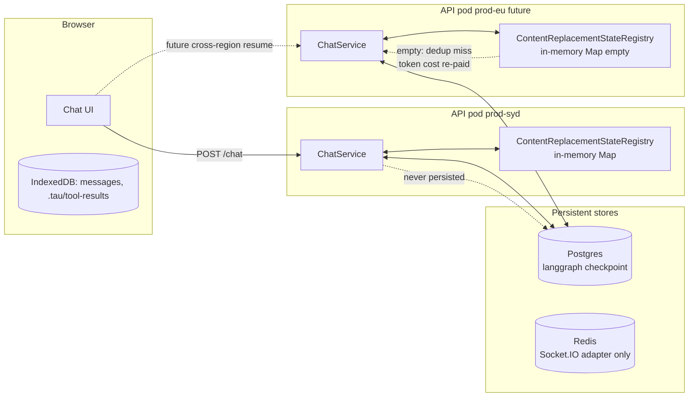

# Content Replacement State Durability Audit

Reviews `apps/api/app/api/chat/state/content-replacement-state.ts` against the durability requirements implicit in its own JSDoc ("byte-identical envelope so prompt caches hit", "evict on chat termination") and the multi-instance / multi-region future the Tau API is already configured for.

## Executive Summary

`ContentReplacementStateRegistry` is a NestJS singleton holding a process-local `Map<chatId, ContentReplacementState>`. It is **never persisted**, **never replicated across pods**, **never released in production**, and trivially evicted on every API restart, deploy, or Fly.io machine auto-stop. The class JSDoc claims its purpose is "keeping the message prefix byte-identical so Anthropic / OpenAI prompt caches hit" — but the analysis below shows that for two of its three fields (`replacements`, `seenIds`) the LangGraph PostgresSaver checkpoint already provides byte-identical restoration without any registry help, and for the third (`recentReads`) the registry is the **sole** source of truth and silently downgrades on every cold pod, cross-instance route, or 1-week revisit. The fix is to delete the two redundant fields, move `recentReads` into the LangGraph checkpoint metadata so it travels with the conversation it describes, and either wire `release(chatId)` to a real lifecycle hook or accept process-bounded eviction explicitly.

## Problem Statement

User-visible question: "Is `ContentReplacementStateRegistry` compatible across API sessions/instances/regions? Will a user returning after 1 week still get byte-for-byte cache restoration? Should this hook into native LangChain state instead?"

Concrete observations driving the audit:

1. The registry is a plain `Map` in process memory ([content-replacement-state.ts:58](apps/api/app/api/chat/state/content-replacement-state.ts)).
2. `release(chatId)` is called only in tests — `Grep` across the API surface returns zero production callers.
3. `apps/api/fly.prod.toml` declares `auto_stop_machines = 'stop'` and `min_machines_running = 1`. Fly auto-suspends idle machines and restarts on demand, so the registry is wiped between idle periods even on a single-machine deployment.
4. AGENTS.md ("Learned Workspace Facts") explicitly anticipates `prod-eu` regional deployments (`prod-us` suffix already in use), and Socket.IO is already configured for `RedisIoAdapter` horizontal scaling.

## Methodology

- Read the registry source ([content-replacement-state.ts](apps/api/app/api/chat/state/content-replacement-state.ts)) and its three consumer middlewares.
- Traced wiring through [chat.module.ts](apps/api/app/api/chat/chat.module.ts), [chat.controller.ts](apps/api/app/api/chat/chat.controller.ts), [chat.service.ts](apps/api/app/api/chat/chat.service.ts).
- Confirmed checkpointer shape via [checkpointer.service.ts](apps/api/app/api/chat/checkpointer.service.ts) (`PostgresSaver` + `langgraph` schema).
- Reviewed deployment topology: [apps/api/fly.prod.toml](apps/api/fly.prod.toml) (`primary_region = 'syd'`, `auto_stop_machines = 'stop'`, `min_machines_running = 1`).
- Cross-referenced with the existing offload doc [docs/research/tool-result-offloading-and-context-prevention.md](docs/research/tool-result-offloading-and-context-prevention.md) and the related parallel-tool-call durability doc [docs/research/parallel-tool-call-incremental-persistence.md](docs/research/parallel-tool-call-incremental-persistence.md).
- Audited every callsite of every public method on the registry: `for(chatId)`, `release(chatId)`, `size()`, `seenIds.add/has`, `replacements.get/set`, `recentReads.get/set`.

## Findings

### Finding 1: The registry is process-local and survives nothing

The implementation is a single `Map`:

```56:80:apps/api/app/api/chat/state/content-replacement-state.ts
@Injectable()
export class ContentReplacementStateRegistry {
  private readonly states = new Map<string, ContentReplacementState>();

  public for(chatId: string): ContentReplacementState {
    let state = this.states.get(chatId);
    if (!state) {
      state = {
        seenIds: new Set<string>(),
        replacements: new Map<string, string>(),
        recentReads: new Map<ReadFingerprint, { priorToolCallId: string; modifiedAt: string }>(),
      };
      this.states.set(chatId, state);
    }
    return state;
  }
```

There is no Redis adapter, no Postgres write, no on-disk spill. This is the entire persistence surface.

| Failure mode                                                                       | What happens                         | Impact                                               |
| ---------------------------------------------------------------------------------- | ------------------------------------ | ---------------------------------------------------- |
| API pod redeploy (Fly health-check rolling deploy)                                 | Map dropped                          | Every active chat loses cache state                  |
| Fly `auto_stop_machines = 'stop'` (idle eviction, prod)                            | Map dropped                          | Every chat loses cache state after ~5min idle        |
| Horizontal scale to N>1 (prod ready: `RedisIoAdapter` already wired for Socket.IO) | Each instance has its own Map        | Same chatId on a different instance starts from zero |
| Future `prod-eu` region (anticipated by AGENTS.md learned facts)                   | EU instance has no SYD state         | Cross-region resume = empty Map                      |
| User returns after 1 week                                                          | Postgres checkpoint exists, Map gone | Read-dedup misses, see Finding 4                     |

### Finding 2: `release(chatId)` is dead code in production

```bash
$ rg 'stateRegistry\.release|contentReplacementStateRegistry\.release|registry\.release' apps/api
apps/api/app/api/chat/state/content-replacement-state.test.ts:52    registry.release('chat-1');
```

The class JSDoc explicitly promises:

> Eviction is explicit via `release` — callers are expected to invoke it on chat termination / disconnect (same hook the checkpointer uses).

No such caller exists. Inside a long-lived API process every `chatId` that has ever requested a turn accumulates state forever. In practice Fly's auto-stop hides the leak (idle machines die after ~5 minutes), but the leak is real on any deployment that keeps machines warm (e.g., the moment `min_machines_running` is bumped to 2+ for HA). The chat termination / disconnect hook the JSDoc references is the SSE `response.raw.on('close', ...)` callback in [chat.controller.ts:127](apps/api/app/api/chat/chat.controller.ts) — `release` is never wired to it.

### Finding 3: `replacements` and `seenIds` are mostly redundant with the LangGraph checkpoint

[checkpointer.service.ts](apps/api/app/api/chat/checkpointer.service.ts) wires the LangGraph `PostgresSaver` to the `langgraph` schema in the same Postgres database. Every assistant turn's `ToolMessage` (including the **already-replaced** `<persisted-output>` envelope content) is persisted by the checkpointer at the end of the superstep that wrote it. On the next request, [chat.controller.ts:294](apps/api/app/api/chat/chat.controller.ts) calls `checkpointer.getTuple(...)` and the agent restores from the persisted message tail.

Trace of what `replacements` and `seenIds` actually buy you:

| Field                                | Use site                                                                                                                                                                                                                 | What runs                                                                                                                           | What happens without the cache                                                                                                                                                                                                                                               |
| ------------------------------------ | ------------------------------------------------------------------------------------------------------------------------------------------------------------------------------------------------------------------------ | ----------------------------------------------------------------------------------------------------------------------------------- | ---------------------------------------------------------------------------------------------------------------------------------------------------------------------------------------------------------------------------------------------------------------------------- |
| `state.replacements.get(toolCallId)` | [tool-result-budget.middleware.ts:139](apps/api/app/api/chat/middleware/tool-result-budget.middleware.ts) — substitutes a previously-cached envelope when the trailing-tail content differs                              | Replaces a `ToolMessage.content` that has been "un-replaced" by some upstream middleware between calls                              | The Postgres-restored content is **already the envelope** (the offload middleware wrote it that way before the previous superstep checkpoint). The substitution is a no-op except inside the same agent run when the same model call iterates twice (e.g., post-compaction). |
| `state.seenIds.add/has`              | [tool-result-budget.middleware.ts:159](apps/api/app/api/chat/middleware/tool-result-budget.middleware.ts) — partitions trailing-tail entries into "fresh" vs "already replaced" so only fresh results compete for budget | Sorts fresh results by size desc, persists the largest until budget satisfied                                                       | "Fresh" can be defined structurally without state — a `ToolMessage` whose `content` does not start with `<persisted-output>` and is not in `replacements` cache is fresh. The cache is the only signal because the structural check was never written.                       |
| `state.recentReads.get/set`          | [tool-read-file.ts:80-88](apps/api/app/api/tools/tools/tool-read-file.ts) — collapses identical re-reads of unchanged files into a `fileUnchangedMarker` substitution                                                    | Saves a full re-read worth of tokens when the LLM repeats `read_file foo offset=1 limit=2000` and `foo`'s `modifiedAt` is unchanged | **Real, unique value.** Postgres has no equivalent — see Finding 4.                                                                                                                                                                                                          |

So the architecture quietly carries two cache fields that mirror what Postgres already stores, and one cache field that is the sole source of truth and silently downgrades on every cold start.

### Finding 4: `recentReads` is genuinely lossy on cold start

This is the smoking gun for cross-instance / cross-region / 1-week-revisit failures. The `read_file` tool dedup branch is:

```73:89:apps/api/app/api/tools/tools/tool-read-file.ts
if (result.modifiedAt) {
  const state = contentReplacementStateRegistry.for(chatId);
  const fingerprint = buildReadFingerprint({
    targetFile: args.targetFile,
    offset: args.offset,
    limit: args.limit,
  });
  const prior = state.recentReads.get(fingerprint);
  if (prior && prior.modifiedAt === result.modifiedAt) {
    return {
      content: fileUnchangedMarker.build(prior.priorToolCallId),
      totalLines: result.totalLines,
      modifiedAt: result.modifiedAt,
    };
  }
  state.recentReads.set(fingerprint, { priorToolCallId: toolCallId, modifiedAt: result.modifiedAt });
}
```

This is the only place `recentReads` is ever populated or queried. The `priorToolCallId` it returns must point at a `ToolMessage` that lives in the LangGraph checkpoint — otherwise `fileUnchangedMarker` is a dangling reference. The fingerprint → `(toolCallId, modifiedAt)` mapping is what ties them together, and that mapping is held nowhere except in this in-memory `Map`.

Concrete failure scenarios:

1. **User returns after 1 week.** Postgres has the prior turn's `read_file` ToolMessage with the full content. `state.recentReads` is gone. The LLM re-issues `read_file foo` → tool calls the RPC, gets full bytes back, returns full bytes (no dedup). The user pays full token cost on every cold-start re-read. Worst case for dense `.d.ts` reads: ~10–20K tokens per missed dedup.
2. **Pod redeploy mid-session.** Identical to above but on a 30-second timescale. Any active chat that survives the deploy via SSE reconnect loses its dedup cache.
3. **Cross-instance hop (future `min_machines_running = 2+`).** The HTTP `POST /chat` endpoint (the SSE entry — not Socket.IO) has no sticky-routing guarantee on Fly's HTTP service. A retry can land on a different machine. New machine = empty `recentReads`.
4. **Cross-region resume (future `prod-eu`).** A user travelling EU→US reaches the closest API per Fly Anycast. New region = empty `recentReads`.

Even within a single warm pod, the dedup window only spans the lifetime of the chat agent's process residency — Fly auto-stops idle machines, so the practical dedup window in production today is **whatever Fly considers idle**. There is no TTL on the in-memory entries either; they live as long as the pod does.

### Finding 5: The "byte-identical prompt cache prefix" claim conflates two caches

The class JSDoc says:

> Re-using the cached bytes on subsequent turns keeps the message prefix byte-identical so Anthropic / OpenAI prompt caches hit.

This conflates Tau's local `state.replacements` cache with the upstream provider prompt cache. They are not equivalent:

- **Anthropic prompt cache TTL**: 5 minutes by default, 1 hour with the `extended-cache-ttl-2025-04-11` beta. After that, the upstream cache is evicted regardless of what Tau remembers locally.
- **OpenAI prompt cache TTL**: ~5–10 minutes (undocumented but observed).
- **What actually keeps the prefix byte-identical across turns**: The LangGraph PostgresSaver storing the post-replacement `ToolMessage.content` verbatim. Next turn's prompt is built from the restored messages, not from `state.replacements`.

Within a single turn (one HTTP request → one agent run → multiple model calls if the agent loops), the budget middleware may run more than once for the same trailing tail. Here `state.replacements` keeps the substitution byte-identical across model calls within one run. But this is a same-process, same-second concern — not a multi-turn or multi-instance one.

So the claim is half-true (within one agent run on one process) and half-wrong (across turns or instances, the Postgres checkpoint is doing the work). Once Findings 1–4 are addressed, this paragraph in the JSDoc should be rewritten or removed.

### Finding 6: The closest Tau prior art is the eager-dispatch / parallel-tool durability work

[parallel-tool-call-incremental-persistence.md](docs/research/parallel-tool-call-incremental-persistence.md) (May 2026) reached the same architectural conclusion for a different state — that any per-chat state needed to survive an interrupt or instance hop must travel with the LangGraph checkpoint, not in process memory. The recommended pattern there was a "tool-call-id-keyed ledger" stored in IndexedDB on the client and consulted by `finalizeInterruptedToolParts`. The server-side equivalent for `recentReads` is the LangGraph checkpoint metadata (`config.metadata` is opaque JSON persisted by every saver implementation including PostgresSaver).

[resumable-chat-streams.md](docs/research/resumable-chat-streams.md) reached the same conclusion at the SSE-stream layer.

The pattern Tau is converging on is: **per-chat auxiliary state lives in the same store as the conversation it annotates**. The registry violates this pattern.

## Recommendations

| #   | Action                                                                                                                                                                                                                                                                                                                                                                                          | Priority | Effort | Impact                                                                      |
| --- | ----------------------------------------------------------------------------------------------------------------------------------------------------------------------------------------------------------------------------------------------------------------------------------------------------------------------------------------------------------------------------------------------- | -------- | ------ | --------------------------------------------------------------------------- |
| R1  | Delete `state.replacements` and `state.seenIds` from `ContentReplacementState`. Replace `seenIds` with a structural check (`!message.content.startsWith('<persisted-output>') && !replacementsCache.has(id)`). The structural check is sufficient because the offload middleware writes the envelope content before checkpoint.                                                                 | P1       | S      | Removes a redundant cache, simplifies the registry to a single-field shape. |
| R2  | Move `recentReads` into the LangGraph checkpoint metadata so it travels with the chat. PostgresSaver persists `config.metadata` per-checkpoint; serialise the fingerprint map there and reload via `getTuple` in `prepareMessages`.                                                                                                                                                             | P0       | M      | Restores cross-instance / cross-region / 1-week-revisit dedup correctness.  |
| R3  | Wire `release(chatId)` to the SSE `response.raw.on('close', ...)` callback in [chat.controller.ts:127](apps/api/app/api/chat/chat.controller.ts) and to `ChatRpcService.unregisterChat` (already exists). Even after R1 the registry holds in-flight per-turn caches; the lifecycle hook is the right shape. If R1 + R2 ship and the registry collapses to nothing, delete it entirely instead. | P1       | S      | Closes the chatId-keyed memory leak in long-lived pods.                     |
| R4  | Update the `ContentReplacementStateRegistry` JSDoc — strike the "byte-identical prompt cache prefix" wording (Finding 5) and replace with the correct two-layer model: "Postgres-checkpointed envelope content keeps the prefix byte-identical across turns; this in-memory cache only deduplicates within a single agent run."                                                                 | P2       | XS     | Prevents the next reader from over-trusting the cache's reach.              |
| R5  | Add an explicit non-goal section to the offload research doc: "Cross-instance prompt cache continuity is provided by the LangGraph checkpointer, not by `ContentReplacementStateRegistry`." Cross-link to this doc.                                                                                                                                                                             | P2       | XS     | Locks the architectural decision in writing.                                |

### Why move to LangGraph checkpoint metadata vs Redis vs Postgres standalone

| Option                        | Pros                                                                                                                              | Cons                                                                                                                                                             | Verdict                                                                           |
| ----------------------------- | --------------------------------------------------------------------------------------------------------------------------------- | ---------------------------------------------------------------------------------------------------------------------------------------------------------------- | --------------------------------------------------------------------------------- |
| LangGraph checkpoint metadata | Zero new infra, atomic with conversation, transparent on resume, already replicated wherever the chat is, survives 1-week return. | Metadata is per-checkpoint (one snapshot per superstep) — must merge across snapshots when reading.                                                              | **Recommended.** Smallest delta, highest correctness ceiling.                     |
| Standalone Postgres table     | Independent of LangGraph, queryable                                                                                               | Two stores to keep coherent, custom migration, custom eviction.                                                                                                  | Reject.                                                                           |
| Redis with TTL                | Fast, distributed, easy eviction                                                                                                  | Net-new dependency in API critical path; would need new health-check, new failure mode. The recentReads dedup is cold-path enough that Postgres latency is fine. | Reject for `recentReads`. (Already in use for Socket.IO adapter — fine for that.) |
| Status quo (in-memory)        | Simplest                                                                                                                          | Everything in Findings 1–5.                                                                                                                                      | Reject.                                                                           |

The data shape for the LangGraph metadata extension is small — one `Map<fingerprint, {priorToolCallId, modifiedAt}>` per chat. Serialised JSON is well under 1 KB even after hundreds of reads. The PostgresSaver `metadata` JSONB column handles this without schema changes.

## Trade-offs

### Drop `replacements` cache → trust the checkpointer alone

**Pro**: Eliminates a class of bugs where the registry and the checkpointer disagree on which envelope a `tool_call_id` should carry. Eliminates same-process race when two parallel agent runs touch the same chat (currently they share the same `state.replacements` Map without locking).

**Con**: Within a single agent run, a same-turn re-evaluation of the budget middleware now recomputes the envelope each time instead of reusing a cached string. Cost: O(envelope-size) ≈ 4 KB per recomputation; happens at most a few times per turn. Negligible vs the I/O the agent already does.

**Verdict**: Take the trade. The same-run optimisation is a micro-optimisation; the architectural simplification is the win.

### Move `recentReads` to checkpoint metadata vs keep in-memory + accept losses

**Pro of moving**: Correctness on cold start. User-facing token savings on every dense re-read after a pod restart or 1-week return.

**Con of moving**: One more JSONB field to serialise on every checkpoint write. PostgresSaver serialisation is already JSON-based, so the cost is bounded. Adds one read on `prepareMessages`.

**Verdict**: Take the trade. The checkpoint write is already happening; appending a small map costs nothing measurable.

## Code Examples

### Today: `recentReads` is a Map that dies with the process

```30:33:apps/api/app/api/chat/state/content-replacement-state.ts
export type ContentReplacementState = {
  seenIds: Set<string>;
  replacements: Map<string, string>;
  recentReads: Map<ReadFingerprint, { priorToolCallId: string; modifiedAt: string }>;
};
```

### After R1+R2: `recentReads` lives in the checkpoint, the rest is gone

Sketch — the registry collapses to a thin lookup that hydrates from the LangGraph checkpoint metadata once per chat and writes back through it:

```typescript
type ChatReadDedupState = {
  recentReads: Record<ReadFingerprint, { priorToolCallId: string; modifiedAt: string }>;
};

const recentReadsKey = 'tau.recentReads';

export class ChatReadDedupService {
  public constructor(private readonly checkpointer: CheckpointerService) {}

  public async load(chatId: string): Promise<ChatReadDedupState> {
    const tuple = await this.checkpointer.getCheckpointer().getTuple({
      configurable: { thread_id: chatId },
    });
    const stored = tuple?.metadata?.[recentReadsKey];
    return {
      recentReads: typeof stored === 'object' && stored !== null ? (stored as ChatReadDedupState['recentReads']) : {},
    };
  }

  public async record(
    chatId: string,
    fingerprint: ReadFingerprint,
    value: { priorToolCallId: string; modifiedAt: string },
  ): Promise<void> {
    // PostgresSaver atomic put on metadata via writes channel — pseudocode
    await this.checkpointer.putMetadata(chatId, (prior) => ({
      ...prior,
      [recentReadsKey]: { ...(prior[recentReadsKey] ?? {}), [fingerprint]: value },
    }));
  }
}
```

The exact LangGraph API for incremental metadata updates is `BaseCheckpointSaver.put` with a merged `metadata` argument, called from a `wrapToolCall` middleware that intercepts `read_file`. Implementation detail to nail down during execution; the architectural shape is clear.

## Diagrams



## References

- Source: [apps/api/app/api/chat/state/content-replacement-state.ts](apps/api/app/api/chat/state/content-replacement-state.ts)
- Consumers: [tool-offloading.middleware.ts](apps/api/app/api/chat/middleware/tool-offloading.middleware.ts), [tool-result-budget.middleware.ts](apps/api/app/api/chat/middleware/tool-result-budget.middleware.ts), [tool-read-file.ts](apps/api/app/api/tools/tools/tool-read-file.ts)
- Wiring: [chat.module.ts](apps/api/app/api/chat/chat.module.ts), [chat.controller.ts](apps/api/app/api/chat/chat.controller.ts), [chat.service.ts](apps/api/app/api/chat/chat.service.ts)
- Checkpoint: [checkpointer.service.ts](apps/api/app/api/chat/checkpointer.service.ts)
- Deployment: [apps/api/fly.prod.toml](apps/api/fly.prod.toml)
- Prior research:
  - [docs/research/tool-result-offloading-and-context-prevention.md](docs/research/tool-result-offloading-and-context-prevention.md) — original blueprint that introduced the registry
  - [docs/research/parallel-tool-call-incremental-persistence.md](docs/research/parallel-tool-call-incremental-persistence.md) — same architectural pattern (per-chat state must live with the chat, not the process) for tool durability
  - [docs/research/resumable-chat-streams.md](docs/research/resumable-chat-streams.md) — same pattern at the SSE layer
- LangGraph PostgresSaver: `@langchain/langgraph-checkpoint-postgres` — `BaseCheckpointSaver.put({ ... }, checkpoint, metadata, newVersions)` writes JSONB metadata atomically per superstep.

## Appendix: Dead-code audit of `release(chatId)` callers

```bash
$ rg "release\(['\"]" apps/api/app/api/chat/state apps/api/app/api/chat
apps/api/app/api/chat/state/content-replacement-state.test.ts:52    registry.release('chat-1');
$ rg "stateRegistry\.release|contentReplacementStateRegistry\.release" apps/api
(empty)
```

Zero production callers. The JSDoc contract that `release` is invoked on chat termination is aspirational, not implemented.
