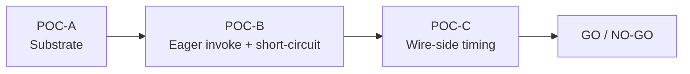

# Eager Tool Dispatch POC

Three atomic Vitest POCs that empirically validate the eager-tool-dispatch architecture proposed in [`docs/research/parallel-tool-output-interleaving.md`](parallel-tool-output-interleaving.md), without an Anthropic key, without UI, and without the production middleware chain.

## Executive Summary

**Verdict: GO.** All three POCs pass on the first sustained run with a total budget of ~250 LOC and ~1 second of wall-clock test time. The architectural claims that survive empirical validation are:

1. **Substrate is intact.** A `BaseCallbackHandler` attached to `createAgent({ ... })` invocation receives `handleLLMNewToken` events with populated `tool_call_chunks` during streaming and a final `handleLLMEnd` carrying parsed `AIMessage.tool_calls[]` — `createAgent` does **not** strip chat-model callbacks.
2. **Eager invocation works without backpressure.** A minimal `EagerToolDispatchHandler` can fire `tool.invoke()` from `handleLLMNewToken` (S2 trigger — index advance) and `handleLLMEnd` (S3 trigger — stream end), and `wrapToolCall` middleware short-circuits the later `ToolNode` execution to return the cached result. Tool-call deltas continue to stream across the eager-dispatch boundary, proving the LLM stream is not blocked.
3. **Eager outputs cross the wire ahead of subsequent inputs.** Emitting eager outputs onto LangGraph's `'custom'` channel (via the `writer` captured from `wrapModelCall(request.runtime)`) and piping the graph stream through `@ai-sdk/langchain`'s `toUIMessageStream` produces a `data-eager-tool-output` UI chunk for tool A **before** the `tool-input-available` chunk for tool B — the desired Cursor-style interleaving.

Two side discoveries materially shape the production implementation: (a) `getWriter()` (LangGraph's `AsyncLocalStorage`-backed accessor) does not propagate reliably into `BaseCallbackHandler.handleLLMNewToken`, so the writer must be captured explicitly from `request.runtime` inside a `wrapModelCall` hook and threaded into the handler; and (b) flake-prone wall-clock thresholds in POC-B were eliminated by switching to **stream-relative ordering assertions** (compare against `lastBlock1ChunkTime` rather than `t < 250ms`), a pattern the production timing tests should adopt as well.

## Table of Contents

- [Problem Statement](#problem-statement)
- [Methodology](#methodology)
- [POC-A: Substrate Verification](#poc-a-substrate-verification)
- [POC-B: Eager Invocation + wrapToolCall Short-Circuit](#poc-b-eager-invocation--wraptoolcall-short-circuit)
- [POC-C: Wire-Side Timing Through `toUIMessageStream`](#poc-c-wire-side-timing-through-touimessagestream)
- [Side Discoveries](#side-discoveries)
- [Verdict](#verdict)
- [References](#references)

## Problem Statement

The parent investigation ([`parallel-tool-output-interleaving.md`](parallel-tool-output-interleaving.md)) proposed an eager-dispatch architecture: detect per-tool args finalization via two protocol-guaranteed signals (S2 — index advance in `tool_call_chunks` for non-last tools; S3 — `handleLLMEnd` for the last tool), invoke the tool via `tool.invoke({ ...toolCall, type: 'tool_call' })` from a `BaseCallbackHandler`, push the result through a streaming channel ahead of the LangGraph tools-superstep, and have a `wrapToolCall` middleware short-circuit the subsequent native `ToolNode` execution.

That proposal rests on three load-bearing assumptions that have not been empirically tested in this codebase:

| Risk | Question                                                                                                                                                                                                           | POC |
| ---- | ------------------------------------------------------------------------------------------------------------------------------------------------------------------------------------------------------------------ | --- |
| R1   | Does `createAgent` actually wire chat-model callbacks all the way through to the underlying `BaseChatModel` so the handler receives `tool_call_chunks` during streaming?                                           | A   |
| R2   | Can `tool.invoke()` fire mid-stream (from `handleLLMNewToken`) without blocking subsequent token deltas, and does `wrapToolCall` correctly short-circuit re-execution?                                             | B   |
| R3   | When the eager output is pushed via the runtime channel and the graph stream is piped through `toUIMessageStream`, does the resulting UI chunk land on the wire **before** the next tool's `tool-input-available`? | C   |

Failure at any tier would invalidate the architecture or constrain its scope.

## Methodology

Three Vitest tests at [`apps/api/app/api/chat/eager-dispatch/`](../../apps/api/app/api/chat/eager-dispatch/), each independently runnable, each ~80–150 LOC. The methodology deliberately avoids:

| Skipped                                                           | Reason                                                                                                                                                                                           |
| ----------------------------------------------------------------- | ------------------------------------------------------------------------------------------------------------------------------------------------------------------------------------------------ |
| LangGraph 1.2 `'tools'` stream-mode catalog bump                  | POC-C uses the existing `'custom'` channel via `writer` — same wire-shape proof, no version risk                                                                                                 |
| Anthropic API key + `fine-grained-tool-streaming-2025-05-14` beta | A hand-rolled `FakeStreamingToolModel` reproduces the Anthropic chunk shape deterministically                                                                                                    |
| Real `chatRpcService` / RPC dispatch                              | Tools `await sleep(50)`; the architectural claim is "can `tool.invoke()` fire eagerly", not "can RPC fire eagerly" — the latter follows because tools own their own RPC calls inside `tool.func` |
| UI rendering, full SSE controller, production middleware          | POC-C exercises `toUIMessageStream` directly; everything downstream is integration-tested in production code                                                                                     |

The fake model emits two parallel `tool_call_chunks` blocks (`tool_a` at index 0, `tool_b` at index 1) with `await sleep(delayMs)` between each chunk so the test can assert ordering relative to LLM stream landmarks rather than wall-clock thresholds.

## POC-A: Substrate Verification

**File**: [`apps/api/app/api/chat/eager-dispatch/poc-a-substrate.test.ts`](../../apps/api/app/api/chat/eager-dispatch/poc-a-substrate.test.ts)

### What it proves

A `BaseCallbackHandler` attached to `createAgent({ ... }).invoke({ ... }, { callbacks: [handler] })` receives:

1. Multiple `handleLLMNewToken` events whose `fields.chunk.message.tool_call_chunks` carry `index`, `id`, `name`, and partial `args` exactly as Anthropic's stream protocol emits them (mirrored from [`repos/langchainjs/libs/providers/langchain-anthropic/src/utils/message_outputs.ts`](../../repos/langchainjs/libs/providers/langchain-anthropic/src/utils/message_outputs.ts)).
2. One `handleLLMEnd` event whose `output.generations[0][0].message.tool_calls[]` is the fully-parsed authoritative tool-call array.

### Result

Pass. The handler observed both event types with the expected payload structure across two parallel tool blocks. **Risk R1 is retired.**

### Side discoveries

| #   | Discovery                                                                                                                                                                                                                              | Implication                                                                                                    |
| --- | -------------------------------------------------------------------------------------------------------------------------------------------------------------------------------------------------------------------------------------- | -------------------------------------------------------------------------------------------------------------- |
| A.1 | `createAgent`'s underlying invocation only takes the streaming code path when the model's call options have `stream: true` set; the easiest way to force this is to set `readonly lc_prefer_streaming = true` on the callback handler. | Production handler must declare `lc_prefer_streaming = true`.                                                  |
| A.2 | `BaseChatModel` requires `bindTools` even for fakes — `createAgent` calls `model.bindTools(tools)` during graph construction.                                                                                                          | Test fakes need a no-op `bindTools(): this { return this; }`.                                                  |
| A.3 | Without explicit termination, the agent loops back into the model node (LLM → tools → LLM …) and hits LangGraph's recursion limit.                                                                                                     | Test fakes must short-circuit the second turn (we used a `callCount` guard to emit a `done` chunk on call 2+). |

## POC-B: Eager Invocation + `wrapToolCall` Short-Circuit

**File**: [`apps/api/app/api/chat/eager-dispatch/poc-b-eager-invocation.test.ts`](../../apps/api/app/api/chat/eager-dispatch/poc-b-eager-invocation.test.ts)

### What it proves

A minimal `EagerToolDispatchHandler` implementing the S2/S3 trigger logic plus a `wrapToolCall` middleware that consults the handler's `entries` map together deliver:

1. **S2 dispatch** — `tool_a:start` fires while `tool_b`'s args are still streaming (specifically: before `lastBlock1ChunkTime` from the LLM's own `streamLog`).
2. **S3 dispatch** — `tool_b:start` fires after the last block-1 chunk (i.e. on `handleLLMEnd`).
3. **No double execution** — each tool's `:start` event appears exactly once across the entire run, so the `wrapToolCall` short-circuit correctly returns the eagerly-cached result without re-invoking the tool.
4. **Final state correctness** — `agent.invoke()` resolves with both `ToolMessage`s carrying their expected content (`tool_a:alpha`, `tool_b:beta`).
5. **No backpressure** — an external `TokenSpy` callback handler observes `handleLLMNewToken` events for `index=1` continuing to fire **after** `tool_a:start`, proving the LLM stream is not blocked on the eagerly-dispatched RPC.

### Result

Pass. Average run ~520 ms across the two parallel tools. **Risks R2 are retired.**

### Side discoveries

| #   | Discovery                                                                                                                                                                                                                                                                                 | Implication                                                                                                                                              |
| --- | ----------------------------------------------------------------------------------------------------------------------------------------------------------------------------------------------------------------------------------------------------------------------------------------- | -------------------------------------------------------------------------------------------------------------------------------------------------------- |
| B.1 | Initial assertions used wall-clock thresholds (`tool_a:start < 250ms`); these flaked when the test ran alongside the rest of the API suite under parallel scheduler pressure.                                                                                                             | Production timing tests must assert **stream-relative ordering** (against landmarks captured from the model's own `streamLog`), not absolute timestamps. |
| B.2 | The `wrapToolCall` middleware is the cleanest handoff point — checking `entries.get(toolCall.id)?.result` for the synchronous fast path and `entries.get(toolCall.id)?.invokePromise` for the in-flight path covers all eager-dispatch outcomes without per-tool branching.               | Production middleware can use the same two-level lookup pattern.                                                                                         |
| B.3 | S3 must use the authoritative `AIMessage.tool_calls[]` from `handleLLMEnd.output.generations[0][0].message`, not the per-index args accumulator from `tool_call_chunks` — the chunk accumulator can hold mid-stream JSON fragments while the final `tool_calls[]` is always fully parsed. | Reject S1 (Zod-schema validity heuristic) permanently — the protocol-level S2/S3 signals are sufficient and correct.                                     |

## POC-C: Wire-Side Timing Through `toUIMessageStream`

**File**: [`apps/api/app/api/chat/eager-dispatch/poc-c-wire-timing.test.ts`](../../apps/api/app/api/chat/eager-dispatch/poc-c-wire-timing.test.ts)

### What it proves

Running `agent.graph.stream(state, { streamMode: ['values', 'messages', 'custom'], callbacks: [eagerHandler] })`, piping the graph stream through `toUIMessageStream` from `@ai-sdk/langchain`, and emitting eager tool outputs on the `'custom'` channel via the captured `writer` produces:

1. A `data-eager-tool-output` UI chunk for `call_a` lands on the wire.
2. The `data-eager-tool-output` chunk for `call_a` is observed **before** the `tool-input-available` chunk for `call_b` — i.e. tool A's output is visible to the UI while tool B's input is still streaming.

### Result

Pass. **Risk R3 is retired.**

### Side discoveries

| #   | Discovery                                                                                                                                                                                                                                                                                                                                                                                                        | Implication                                                                                                                                                                                                                                                                                                   |
| --- | ---------------------------------------------------------------------------------------------------------------------------------------------------------------------------------------------------------------------------------------------------------------------------------------------------------------------------------------------------------------------------------------------------------------- | ------------------------------------------------------------------------------------------------------------------------------------------------------------------------------------------------------------------------------------------------------------------------------------------------------------- |
| C.1 | `getWriter()` (the LangGraph `AsyncLocalStorage`-backed accessor) returned `undefined` when called from inside `BaseCallbackHandler.handleLLMNewToken`; the async-hooks context that the LangGraph runtime sets up around tool/model nodes does not appear to propagate reliably across all chat-model callback boundaries (verified against the cloned [`repos/langgraphjs`](../../repos/langgraphjs/) source). | Production code must capture the writer **explicitly** from `request.runtime.writer` inside a `wrapModelCall` middleware hook and pass it into the eager handler — never rely on `getWriter()` from the callback context.                                                                                     |
| C.2 | `toUIMessageStream` consumes LangGraph `'custom'` events as `['custom', payload]` tuples and emits them as `data-${payload.type}` UI chunks with the original payload nested under `data` (e.g. `payload = { type: 'eager-tool-output', toolCallId, output }` becomes `chunk.type = 'data-eager-tool-output'` with `chunk.data = { toolCallId, output }`).                                                       | Production wire format can use `data-*` UI chunks as the eager-output transport without any catalog bump on `@langchain/langgraph` 1.2; the same payload shape later moves cleanly to the official `'tools'` channel from [PR #1984](https://github.com/langchain-ai/langgraphjs/pull/1984) when we adopt it. |
| C.3 | The `wrapModelCall` capture-the-writer pattern (`handler.setWriter(request.runtime.writer)` then `return baseHandler(request)`) is a clean LangChain idiom — it does not interfere with other `wrapModelCall` middlewares and runs once per model invocation.                                                                                                                                                    | Production middleware composition is unaffected; the eager-dispatch middleware can sit alongside the existing `tool-offloading.middleware.ts` and the message sanitizers without ordering constraints.                                                                                                        |

## Side Discoveries

Cross-cutting observations not specific to a single POC:

| #   | Observation                                                                                                                                                                                                                      | Action item                                                                                                                                                                              |
| --- | -------------------------------------------------------------------------------------------------------------------------------------------------------------------------------------------------------------------------------- | ---------------------------------------------------------------------------------------------------------------------------------------------------------------------------------------- |
| S.1 | `BaseChatModel` and `BaseCallbackHandler` mandate snake_case method names (`_streamResponseChunks`, `lc_prefer_streaming`, `tool_call_chunks`) and 6-arg `handleLLMNewToken` signatures that conflict with our default lint set. | The production implementation will need a small file-level lint disable for `naming-convention`, `class-literal-property-style`, and `max-params` — pattern documented in the POC files. |
| S.2 | `tool.invoke({ name, args, id, type: 'tool_call' })` must be called with `type: 'tool_call'` for `ToolNode` parity; without it `tool.invoke` returns the raw value instead of constructing a `ToolMessage`.                      | Production handler must always pass `type: 'tool_call'`.                                                                                                                                 |
| S.3 | Tool outputs returned from `tool.invoke()` may already be `ToolMessage` instances or `Command` instances; only wrap unknown returns into a synthetic `ToolMessage`.                                                              | The pattern `ToolMessage.isInstance(output) \|\| isCommand(output) ? output : new ToolMessage({...})` is reusable.                                                                       |

## Verdict

**GO.** Three independent tiers of empirical validation pass on the first sustained run. The de-risked claims that unblock production implementation are:

1. Callback wiring (R1) — `createAgent` propagates chat-model callbacks intact.
2. Eager invocation + short-circuit (R2) — handler can fire `tool.invoke()` mid-stream without backpressure, `wrapToolCall` cleanly returns the cached result.
3. Wire-side ordering (R3) — `'custom'` channel + `toUIMessageStream` deliver eager outputs to the UI before subsequent tool inputs.

The POC code at [`apps/api/app/api/chat/eager-dispatch/`](../../apps/api/app/api/chat/eager-dispatch/) is intentionally retained as the seed for the production implementation. Three production-time refinements are required before wiring this into the live chat agent:

| #   | Refinement                                                                                                                                                                                                           | Why                                                                                                      |
| --- | -------------------------------------------------------------------------------------------------------------------------------------------------------------------------------------------------------------------- | -------------------------------------------------------------------------------------------------------- |
| P.1 | Writer capture moves to a dedicated middleware that runs alongside the existing chat middleware chain, not duplicated per-handler.                                                                                   | C.1 — `getWriter()` is unreliable; explicit capture is the only correct path.                            |
| P.2 | The eager-output payload shape (`data-eager-tool-output`) becomes a typed `MyUIMessage` part on the AI SDK side so the UI can render it through the existing tool-card pipeline rather than as a generic data chunk. | C.2 — establishes the contract for the eventual `'tools'` channel migration once we adopt LangGraph 1.2. |
| P.3 | Timing tests written against the production code path use stream-relative ordering assertions, not wall-clock thresholds.                                                                                            | B.1 — eliminates flake under parallel test load.                                                         |

No NO-GO escape hatches surfaced. The architectural direction is sound and ready for production wire-up.

## References

- Parent: [`docs/research/parallel-tool-output-interleaving.md`](parallel-tool-output-interleaving.md)
- POC code: [`apps/api/app/api/chat/eager-dispatch/`](../../apps/api/app/api/chat/eager-dispatch/)
- Anthropic chunk shape: [`repos/langchainjs/libs/providers/langchain-anthropic/src/utils/message_outputs.ts`](../../repos/langchainjs/libs/providers/langchain-anthropic/src/utils/message_outputs.ts)
- LangGraph custom-channel writer: [`repos/langgraphjs/libs/langgraph/src/pregel/`](../../repos/langgraphjs/libs/langgraph/src/pregel/)
- `@ai-sdk/langchain` `toUIMessageStream`: [`repos/ai-sdk/packages/langchain/src/index.ts`](../../repos/ai-sdk/packages/langchain/src/index.ts)
- Upstream tracking: [`langchain-ai/langgraph#4653`](https://github.com/langchain-ai/langgraph/issues/4653) (open since May 2025), [`langchain-ai/langgraphjs#1984`](https://github.com/langchain-ai/langgraphjs/pull/1984) (merged Feb 2026)
