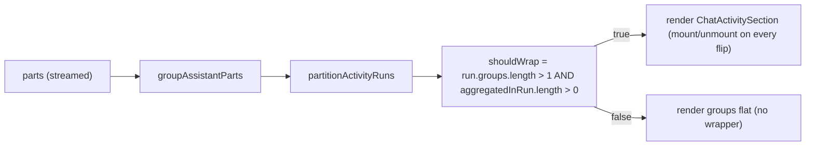
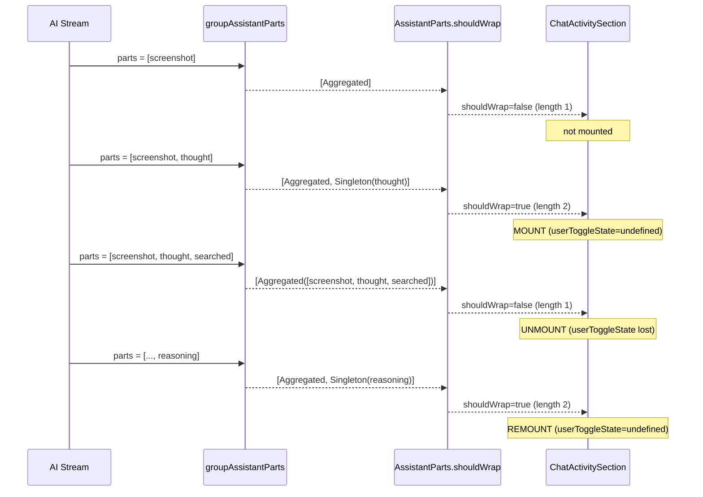

# Exploring Activity Wrapper Flip-Flop

Root-cause investigation of the bug where the outer `ChatActivitySection` "Exploring..." wrapper around an in-flight research run mounts, unmounts, and remounts as new parts arrive — losing its `userToggleState` and producing a visible flicker between "wrapped + indented" and "flat + un-wrapped" layouts mid-stream.

## Executive Summary

The outer wrapper visibility is computed every render as a pure function of the latest `parts` snapshot via `shouldWrap = run.groups.length > 1 && aggregatedInRun.length > 0` in [`apps/ui/app/routes/projects_.$id/chat-message.tsx`](apps/ui/app/routes/projects_.$id/chat-message.tsx) lines 358-359. As parts stream in, both factors of that conjunction can flip — most commonly when the only foldable run in the message contains exactly one aggregated research group plus a transient trailing reasoning singleton that gets absorbed (or peeled) on the next part. Each flip mounts or unmounts the `ChatActivitySection`, which is a stateful component (`userToggleState`, `Collapsible.open`), so its open/closed preference and mount-time animations are reset on every flip. There is no hysteresis, no "sticky once opened" latch, and no test coverage for incremental streaming wrapper stability.

The fix is architectural, not cosmetic: the wrapper must be a function of the **stable identity** of the run (its first aggregatable group), not of the **current group count**. Recommended primary remediation is to drop the `run.groups.length > 1` clause and wrap any foldable run that contains at least one aggregated group, so the wrapper mounts when the first research tool lands and stays mounted until a non-foldable category breaks the run.

## Problem Statement

User-visible symptom (per attached screenshots):

- **State A (wrapped):** "Exploring..." section header is shown with chevron, and the inner research tool rows (`Captured 6 screenshots…`, `Searched /cape/…`, `Read lib/base.scad`, etc.) plus a trailing live `Thinking for 2s` reasoning block are nested inside an indented `CollapsibleContent`.
- **State B (un-wrapped):** Same research tool rows are shown flat at the message's top level — no "Exploring..." header, no chevron, no indentation. `ChatMessagePlanning` ("Planning next moves...") renders at the bottom in place of the trailing reasoning.

The transition A → B happens **mid-stream**, while the chat is still actively producing parts. From the user's perspective the wrapper "disappears". A subsequent part (the next research tool, or another reasoning block) frequently re-introduces the wrapper, producing a visible flicker.

The bug class is broader than the visual flicker: any architecture where the wrapper's existence depends on a count that changes per-part is structurally fragile. We need an invariant that, once the wrapper is visible for a research run, it remains visible until the run ends.

## Methodology

1. Read the full grouping/partitioning algorithm in [`apps/ui/app/utils/assistant-message-activity.ts`](apps/ui/app/utils/assistant-message-activity.ts).
2. Read the renderer's `shouldWrap` decision in [`apps/ui/app/routes/projects_.$id/chat-message.tsx`](apps/ui/app/routes/projects_.$id/chat-message.tsx) (`AssistantParts`, lines 320-389).
3. Read [`apps/ui/app/components/chat/chat-activity-section.tsx`](apps/ui/app/components/chat/chat-activity-section.tsx) to understand the wrapper's local state.
4. Surveyed [`apps/ui/app/utils/assistant-message-activity.test.ts`](apps/ui/app/utils/assistant-message-activity.test.ts) and [`apps/ui/app/components/chat/chat-activity-section.test.tsx`](apps/ui/app/components/chat/chat-activity-section.test.tsx) for streaming-stability coverage.
5. Traced two concrete part-arrival sequences against the grouping algorithm to reproduce the screenshot states deterministically.

## Findings

### Finding 1: `shouldWrap` is an emergent count, not a stable identity

In `AssistantParts`:

```354:367:apps/ui/app/routes/projects_.$id/chat-message.tsx
        if (run.kind === 'standalone') {
          return renderActivityGroup(run.group, run.groupIndex, renderContextForGroup(run.groupIndex));
        }

        const aggregatedInRun = run.groups.filter((group): group is AggregatedGroup => group.kind === 'aggregated');
        const shouldWrap = run.groups.length > 1 && aggregatedInRun.length > 0;

        if (!shouldWrap) {
          return run.groups.map((group, j) => {
            const absoluteIndex = run.startIndex + j;
            return renderActivityGroup(group, absoluteIndex, renderContextForGroup(absoluteIndex));
          });
        }
```

`shouldWrap` is the AND of two derived counts:

| Factor                   | Source                                                      | Per-part volatility                                                                                                                                          |
| ------------------------ | ----------------------------------------------------------- | ------------------------------------------------------------------------------------------------------------------------------------------------------------ |
| `run.groups.length > 1`  | Length of the foldable run after `partitionActivityRuns`    | Changes whenever a new top-level group is added/peeled. Trailing-reasoning peeling (see Finding 2) flips this between 1 and 2 every time a new part arrives. |
| `aggregatedInRun.length` | Count of `AggregatedGroup` children inside the foldable run | Changes from 0 → 1 the moment the first research tool lands. Stays 1 for runs that never see a second non-research-aggregatable category.                    |

The wrapper is therefore a **derived view of two counts that both fluctuate per-part**, with no hysteresis. There is no concept of "this run has crossed the wrap threshold once, so stay wrapped" — every render is a fresh decision.

When `shouldWrap` flips false → true, `ChatActivitySection` mounts for the first time. When it flips true → false, the section unmounts. The section's `useState<'expanded' | 'collapsed' | undefined>` (`userToggleState`, [`chat-activity-section.tsx`](apps/ui/app/components/chat/chat-activity-section.tsx) line 64) does not survive unmount, so any user toggle the user made is forgotten on every flip. The CSS `data-state` transition on the chevron and `CollapsibleContent` also restarts on every remount, producing a visible animation on what should be a continuous activity stream.

### Finding 2: Trailing-reasoning peeling makes `run.groups.length` flip between 1 and 2 per part

`groupAssistantParts` ([`assistant-message-activity.ts`](apps/ui/app/utils/assistant-message-activity.ts) lines 395-489) treats `reasoning` as a **bridging** category. While a research run is pending, reasoning parts are appended optimistically to the pending aggregate. At flush time, **any trailing bridging parts are peeled off and re-emitted as singletons** (lines 410-415):

```410:415:apps/ui/app/utils/assistant-message-activity.ts
    const tail: Array<{ part: MyMessagePart; index: number }> = [];
    while (pendingParts.length > 0 && isBridging(classifyActivityPart(pendingParts.at(-1)!))) {
      const part = pendingParts.pop()!;
      const index = pendingIndices.pop()!;
      tail.unshift({ part, index });
    }
```

This produces a deterministic flicker pattern any time the model alternates between research tools and short trailing reasoning chunks during streaming. Concrete trace:

| Step | Newest part         | `groups` after `groupAssistantParts`             | Foldable `run.groups.length` | `aggregatedInRun.length` | `shouldWrap` |
| ---- | ------------------- | ------------------------------------------------ | ---------------------------- | ------------------------ | ------------ |
| 1    | screenshot          | `[Aggregated([screenshot])]`                     | 1                            | 1                        | **false**    |
| 2    | thought (streaming) | `[Aggregated([screenshot]), Singleton(thought)]` | 2                            | 1                        | **true**     |
| 3    | searched            | `[Aggregated([screenshot, thought, searched])]`  | 1                            | 1                        | **false**    |
| 4    | thought2            | `[Aggregated([…3]), Singleton(thought2)]`        | 2                            | 1                        | **true**     |
| 5    | read                | `[Aggregated([…5])]`                             | 1                            | 1                        | **false**    |
| 6    | thinking            | `[Aggregated([…5]), Singleton(thinking)]`        | 2                            | 1                        | **true**     |

Every time the model emits a tool **after** a trailing reasoning, the previously-trailing reasoning is re-absorbed (sandwich rule) and `run.groups.length` drops back to 1. Every time the model emits a reasoning **after** a tool, the count rises to 2. The wrapper appears, disappears, appears, disappears — exactly the user's report.

This matches the screenshot transition:

- **State A (img1, wrapped):** Step 6 of the trace above. Run is `[Aggregated, Singleton(thinking)]`, `shouldWrap=true`, "Exploring..." section visible with the trailing `Thinking for 2s` reasoning rendered as the last child inside `CollapsibleContent`.
- **State B (img2, un-wrapped):** Step 5 (or any odd-indexed step). The trailing reasoning has been re-absorbed by a follow-up tool, run is `[Aggregated]`, `shouldWrap=false`, every research tool renders flat at the top level.

`ChatMessagePlanning` renders unconditionally below the `AssistantParts` output (`chat-message.tsx` line 567) and is independent of the wrap decision — it's not part of the parts array, so its appearance/disappearance is governed by its own logic and is **not** the cause of the wrapper flip.

### Finding 3: The wrapper's `key` is stable, but mount/unmount still loses state

The renderer's `sectionKey` is derived from the first group in the run:

```368:368:apps/ui/app/routes/projects_.$id/chat-message.tsx
        const sectionKey = `${messageId}-section-${getGroupKeyPartIndex(run.groups[0]!)}`;
```

In the trace above, the first group is always the same `Aggregated` (its `partIndices[0]` is the screenshot's index, which never moves). So the key is stable. But React identity preservation requires the component to be **continuously mounted**; a `false → true → false` `shouldWrap` cycle still produces three mount transitions even with the same key, because the conditional `if (!shouldWrap) return run.groups.map(...)` removes the wrapper entirely from the rendered tree. Stable key alone cannot rescue a component that is conditionally absent.

### Finding 4: The "wrapper-only-when-multi-group" rationale is no longer load-bearing

The `run.groups.length > 1` clause exists to suppress the wrapper when a foldable run contains exactly one group. Two motivating cases:

- **Reasoning-only run** (multiple reasoning singletons, no aggregate). The existing test ([`assistant-message-activity.test.ts`](apps/ui/app/utils/assistant-message-activity.test.ts) lines 965-973) asserts the renderer "decides not to wrap" here. This is correctly handled by the **`aggregatedInRun.length > 0`** clause alone — reasoning singletons never make `aggregatedInRun` non-empty, so dropping `run.groups.length > 1` does not affect this case.
- **Single aggregated research group with no surrounding reasoning.** The current behavior renders the inner `ChatActivityGroup` flat at the top level. The wrapper rationale here is "don't put a one-row block inside a one-row collapsible, the user already has the inner group's collapsible to interact with." But this is the exact case that flickers most: as soon as one trailing reasoning lands, the wrapper appears; as soon as the next tool lands, it vanishes.

The single-aggregate case is the design tension: the current code optimizes against "redundant wrapping" but trades that for "wrapper instability". The user's bug report unambiguously rates stability as more important than avoiding a one-group wrap.

### Finding 5: `useMemo` on `groups`/`runs` does not stabilize visibility

[`chat-message.tsx`](apps/ui/app/routes/projects_.$id/chat-message.tsx) lines 327-329:

```327:329:apps/ui/app/routes/projects_.$id/chat-message.tsx
  const groups = useMemo(() => groupAssistantParts(parts), [parts]);
  const runs = useMemo(() => partitionActivityRuns(groups), [groups]);
  const lastMeaningfulIndex = useMemo(() => findLastMeaningfulPartIndex(parts), [parts]);
```

These memos only avoid recomputing on equal `parts` references. During streaming, `parts` is a new array on every chunk (the AI SDK reducer returns a new array on every part update), so `groups` and `runs` are recomputed on every render. Memoization here is correct for what it does, but cannot smooth out the structural flip.

### Finding 6: No regression test exists for streaming wrapper stability

`assistant-message-activity.test.ts` covers grouping/partitioning with **terminal** part arrays — every test asserts the final shape of `groups`/`runs`. There is no test that simulates `parts` growing one element at a time and asserts:

- The wrapper does not appear and disappear within the same logical research run.
- `ChatActivitySection`'s `userToggleState` survives the natural progression of part arrivals.
- A trailing reasoning that becomes sandwiched does not change the wrap decision.

`chat-activity-section.test.tsx` tests the component in isolation. It does not exercise the renderer's `shouldWrap` branching at all.

This gap is itself a smoking gun: the flip-flop bug is not a regression caught by tests because no test in the suite asserts the invariant "once wrapped during a run, stay wrapped."

## Recommendations

| #   | Recommendation                                                                                                                       | Priority | Effort | Impact |
| --- | ------------------------------------------------------------------------------------------------------------------------------------ | -------- | ------ | ------ |
| R1  | Drop the `run.groups.length > 1` clause; wrap whenever `aggregatedInRun.length > 0`                                                  | P0       | Low    | High   |
| R2  | Add streaming-stability test cases that drive `parts` array growth one-element-at-a-time and assert wrapper presence is monotonic    | P0       | Low    | High   |
| R3  | Promote `shouldWrap` from `chat-message.tsx` into a named exported helper in `assistant-message-activity.ts`, e.g. `shouldWrapRun()` | P1       | Low    | Med    |
| R4  | Move the `userToggleState` ownership above the conditional wrap so toggle preference survives a flip even if R1 is rejected          | P2       | Med    | Med    |
| R5  | Document the "single foldable run, single aggregate" rendering contract in `assistant-message-activity.ts` JSDoc                     | P2       | Low    | Med    |

### R1 (primary fix): wrap whenever the run contains an aggregate

Change the wrap decision from:

```tsx
const shouldWrap = run.groups.length > 1 && aggregatedInRun.length > 0;
```

to:

```tsx
const shouldWrap = aggregatedInRun.length > 0;
```

This makes wrapper visibility a function of "is there a research aggregate in this run?" — a property that **only ever transitions from false to true** within a run's lifetime (an `AggregatedGroup` cannot become a non-aggregate without the entire run being broken by a `text`/`write`/`data`/`transfer` part, which is exactly when the wrapper _should_ unmount).

| Run shape after R1                                          | Wrapped? | Justification                                                                         |
| ----------------------------------------------------------- | -------- | ------------------------------------------------------------------------------------- |
| `[Aggregated]` (one tool group, no reasoning)               | **Yes**  | Stable wrapper for the entire research phase; no flicker when reasoning arrives later |
| `[Aggregated, Singleton(reasoning)]`                        | **Yes**  | Same as today, but stable                                                             |
| `[Singleton(reasoning), Aggregated]`                        | **Yes**  | Same as today                                                                         |
| `[Singleton(reasoning), Aggregated, Singleton(reasoning)]`  | **Yes**  | Same as today                                                                         |
| `[Singleton(reasoning)]` (reasoning-only run, no tools yet) | **No**   | Unchanged — `aggregatedInRun.length === 0`                                            |
| `[Singleton(reasoning), Singleton(reasoning)]`              | **No**   | Unchanged — `aggregatedInRun.length === 0` (preserves existing test on line 965-973)  |

The only behavioral change is row 1 of the table: a research aggregate with no surrounding reasoning is now wrapped in a single-row "Exploring..." section. This is the intentional UX trade-off: a one-row outer fold with the same summary is acceptable because it is **stable** — the moment a reasoning singleton joins (and it nearly always does during real streams), the wrapper is already present and does not need to mount.

The first-render mount of the wrapper still happens (it has to — there is nothing to mount before the first research tool exists), but it is monotonic: mount once at the first aggregate, persist until the run is broken by a non-foldable part. No more remounts, no more lost `userToggleState`.

### R2: streaming-stability test

Add to `assistant-message-activity.test.ts` (or a new `chat-message.streaming.test.tsx`) a test that walks the trace from Finding 2 step-by-step and asserts `shouldWrap` (or whatever helper R3 produces) is monotonically true once it first becomes true within a run:

```ts
it('should stay wrapped once an aggregated group exists in the foldable run, regardless of trailing reasoning peeling', () => {
  const sequence: MyMessagePart[][] = [
    [screenshotPart()],
    [screenshotPart(), reasoningPart('thought')],
    [screenshotPart(), reasoningPart('thought'), grepPart()],
    [screenshotPart(), reasoningPart('thought'), grepPart(), reasoningPart('thought2')],
    [screenshotPart(), reasoningPart('thought'), grepPart(), reasoningPart('thought2'), readFilePart()],
    [
      screenshotPart(),
      reasoningPart('thought'),
      grepPart(),
      reasoningPart('thought2'),
      readFilePart(),
      reasoningPart('thinking'),
    ],
  ];

  let firstWrap = -1;
  for (const [i, parts] of sequence.entries()) {
    const runs = partitionActivityRuns(groupAssistantParts(parts));
    const foldable = runs.find((r): r is FoldableRun => r.kind === 'foldable-run')!;
    const wrapped = shouldWrapRun(foldable); // helper extracted in R3
    if (wrapped && firstWrap === -1) {
      firstWrap = i;
    }
    if (firstWrap !== -1) {
      expect(wrapped, `step ${i} should still wrap (first wrap at ${firstWrap})`).toBe(true);
    }
  }
});
```

This codifies the invariant and prevents regressions if the grouping logic is touched again.

### R3: extract `shouldWrapRun` into the activity utility

The decision currently lives inline in `chat-message.tsx` (lines 358-359). Moving it to `assistant-message-activity.ts` as `shouldWrapRun(run: FoldableRun): boolean` colocates the rule with its data, makes it directly testable, and removes the need for the renderer to know the implementation detail of "what makes a run worth wrapping":

```ts
// assistant-message-activity.ts
export const shouldWrapRun = (run: FoldableRun): boolean => run.groups.some((group) => group.kind === 'aggregated');
```

The renderer becomes:

```tsx
const shouldWrap = shouldWrapRun(run);
```

### R4: lift `userToggleState` above the wrap conditional (fallback if R1 is rejected)

If for some reason the count-based wrap decision must stay, the `userToggleState` must be hoisted out of `ChatActivitySection` so it persists across the wrap toggle. The natural owner is `AssistantParts`, keyed by `sectionKey`. This is more code and more state-management surface than R1; R1 is preferred.

### R5: JSDoc the invariant

The JSDoc on `partitionActivityRuns` already explains the section-foldable contract, but says nothing about the wrap decision. Add a short paragraph after the existing comment that says "the renderer wraps any foldable run containing at least one aggregated group in a `ChatActivitySection`; once wrapped, the wrapper persists for the lifetime of the run" — so future contributors don't reintroduce the count clause.

## Trade-offs

| Approach                                               | Pros                                                | Cons                                                                                               |
| ------------------------------------------------------ | --------------------------------------------------- | -------------------------------------------------------------------------------------------------- |
| **R1: wrap on any aggregate**                          | Simple, monotonic, stable, one-line diff            | Single-aggregate runs gain a one-row outer fold (cosmetic; arguably an improvement)                |
| **Hysteresis flag (sticky-wrap-once)**                 | Preserves current "no wrap for single aggregate" UX | Adds runtime state to a pure render path; harder to test; non-orthogonal with `userToggleState`    |
| **Lift `userToggleState` above wrap conditional (R4)** | Preserves `userToggleState` across flips            | Wrapper still flickers visually (mount/unmount + chevron animation reset); only fixes user toggles |
| **Always render the section, vary content density**    | One DOM node, no mount/unmount                      | Larger refactor; wrapper currently can't render "no children" without the inner indented chrome    |

R1 dominates: lowest effort, highest impact, no downside other than a single-row outer fold for a rare run shape that is visually fine.

## Code Examples

### Current `shouldWrap` (the smoking gun)

```354:367:apps/ui/app/routes/projects_.$id/chat-message.tsx
        if (run.kind === 'standalone') {
          return renderActivityGroup(run.group, run.groupIndex, renderContextForGroup(run.groupIndex));
        }

        const aggregatedInRun = run.groups.filter((group): group is AggregatedGroup => group.kind === 'aggregated');
        const shouldWrap = run.groups.length > 1 && aggregatedInRun.length > 0;

        if (!shouldWrap) {
          return run.groups.map((group, j) => {
            const absoluteIndex = run.startIndex + j;
            return renderActivityGroup(group, absoluteIndex, renderContextForGroup(absoluteIndex));
          });
        }
```

### Trailing-reasoning peel (the volatility source)

```410:415:apps/ui/app/utils/assistant-message-activity.ts
    const tail: Array<{ part: MyMessagePart; index: number }> = [];
    while (pendingParts.length > 0 && isBridging(classifyActivityPart(pendingParts.at(-1)!))) {
      const part = pendingParts.pop()!;
      const index = pendingIndices.pop()!;
      tail.unshift({ part, index });
    }
```

### Wrapper local state that gets reset on every flip

```64:74:apps/ui/app/components/chat/chat-activity-section.tsx
  const [userToggleState, setUserToggleState] = useState<'expanded' | 'collapsed' | undefined>(undefined);

  const isOpen =
    userToggleState === 'expanded' ? true : userToggleState === 'collapsed' ? false : isLast || !hasDownstreamText;

  return (
    <Collapsible
      open={isOpen}
      onOpenChange={(nextOpen) => {
        setUserToggleState(nextOpen ? 'expanded' : 'collapsed');
      }}
```

## Diagrams





## References

- [`apps/ui/app/utils/assistant-message-activity.ts`](apps/ui/app/utils/assistant-message-activity.ts) — grouping + partitioning algorithm
- [`apps/ui/app/routes/projects_.$id/chat-message.tsx`](apps/ui/app/routes/projects_.$id/chat-message.tsx) lines 320-389 — `AssistantParts` and `shouldWrap`
- [`apps/ui/app/components/chat/chat-activity-section.tsx`](apps/ui/app/components/chat/chat-activity-section.tsx) — wrapper component and local state
- [`apps/ui/app/utils/assistant-message-activity.test.ts`](apps/ui/app/utils/assistant-message-activity.test.ts) — existing grouping/partitioning tests (no streaming-stability coverage)
- [`apps/ui/app/components/chat/chat-activity-section.test.tsx`](apps/ui/app/components/chat/chat-activity-section.test.tsx) — wrapper component tests (no `shouldWrap` integration)
- Related: [`docs/research/chat-rendering-audit.md`](docs/research/chat-rendering-audit.md)
