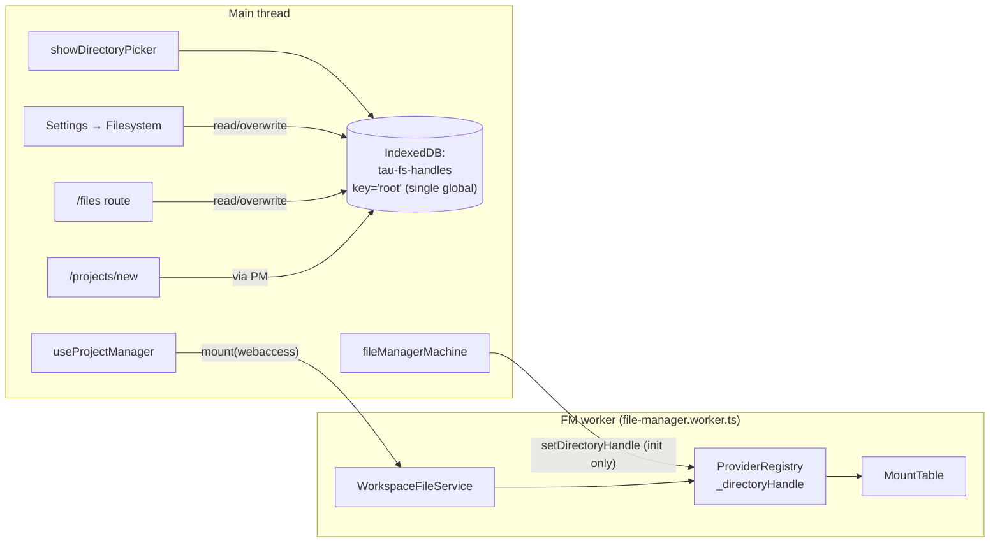
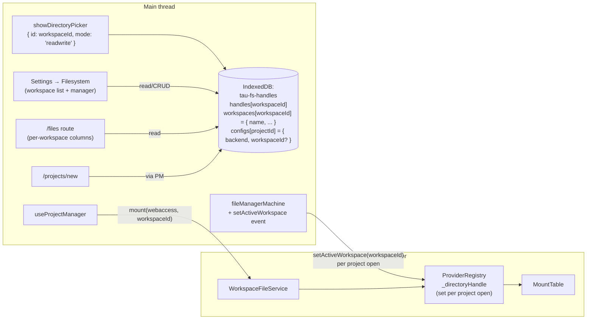

# File System Access API Cohesion Audit

End-to-end audit of the `webaccess` (Chromium File System Access API) backend in `apps/ui`. Traces the directory-handle lifecycle from the picker through IndexedDB persistence, the file-manager XState machine, the FM worker, the project-creation flow, and back to the UI, and inventories every gap that breaks cohesion or silently degrades the user experience.

## Executive Summary

Creating a new project on `/projects/new` with the "File System" backend selected throws

```
Error: No directory handle set. Call setDirectoryHandle() before using webaccess backend.
  at ProviderRegistry._createProvider (file-manager.worker.ts → packages/filesystem/src/provider-registry.ts:135)
```

even when the user has previously connected and granted a workspace directory through Settings → Filesystem. The smoking gun: **`setDirectoryHandle` is only ever pushed to the FM worker inside `initializeServicesActor` at machine boot**. None of the user-facing flows that legitimately change the workspace handle after boot — Settings "Connect Directory", Settings "Grant Access", `/files` "Connect / Grant Access", or `useProjectManager.createProject({ backend: 'webaccess' })` — re-emit the handle, so the worker keeps its boot-time view and rejects subsequent `webaccess` mounts.

A second symptom from the same disease: a user who creates Project A under workspace `tau-workspace`, then changes the workspace directory in Settings to `inner`, then re-opens Project A, sees an empty file tree and "File not found" errors. The project's bytes are intact on disk under `tau-workspace/`; the app reads `inner/` because the single global `'root'` handle key was overwritten and no per-project workspace binding exists.

These are facets of one architectural disease: **the worker mounts whatever ambient state happens to be present at mount time, with no validation that what is mounted matches what the project was created on**. The audit surfaces fifteen findings. Together they show that the `webaccess` backend is built on the assumption of "one global workspace at a time", which is incompatible with multiple projects, multiple sessions, revoked permissions, and any user intent to swap folders.

Recommendations are organised into a foundational tier (R1–R5, P0) that promotes the **workspace** to a first-class entity with a stable `workspaceId`, per-project binding, eager handle propagation to the FM worker, and a unified workspace switcher rendered in both Settings → Filesystem and `/files`. Subsequent tiers (R6–R20) tidy worker propagation, actionable error UX, dead state, dropdown preconditions, storage-usage clarity, testing, and policy docs. The architectural principle that ties them together: **a project's `webaccess` mount must be bound by content identity (its workspaceId), not by ambient state. Identity is captured at project creation and validated at every open. A mismatch surfaces a structured error, never a silent best-effort mount.**

## Table of Contents

- [Problem Statement](#problem-statement)
- [Methodology](#methodology)
- [Architecture Recap](#architecture-recap)
- [Findings](#findings)
- [Recommendations](#recommendations)
- [Code Examples](#code-examples)
- [References](#references)

## Problem Statement

Three user-reported behaviours, all symptoms of the same architectural disease:

1. **Worker not primed for new projects.** Selecting "File System" as the storage backend in Settings, granting access to a workspace folder named `tau-workspace`, then navigating to `/projects/new`, entering a project name, selecting "File System", and clicking "Create Project" throws

   ```
   Failed to create project: Error: No directory handle set. Call setDirectoryHandle() before using webaccess backend.
     at Ee._createProvider (file-manager.worker-…js)
     at Ee.createMountProvider
     at ye.mount
   ```

   The user-facing toast reports `Failed to create project. Please try again.` and the project is not created.

2. **No inline connect/grant affordance on `/projects/new`.** A user landing on the page in an incognito session (no prior workspace handle in IndexedDB) can select "File System" but has no path forward without first navigating away to Settings — and even that does not fix (1).

3. **Workspace swap silently breaks existing projects.** A user creates Project A while the connected workspace is `tau-workspace`. They later go to Settings → Filesystem and `[Change Directory]` to a new folder `inner`. Re-opening Project A shows an empty file tree, "File not found" for `main.scad`, and "No parameters available" — even though Project A's bytes are intact on disk under `tau-workspace/`. The handle store keeps a single global key (`'root'`) and the project's persisted config records `backend: 'webaccess'` with no record of which workspace the project's files actually live in. Changing the global handle silently re-points the project at the wrong folder.

All three symptoms point at the same gap: the `webaccess` backend has no concept of **workspace identity**. The single global directory handle is treated as ambient state shared by every project, the FM worker is primed for it only at boot, and any drift between the worker's view and a project's true location goes undetected. The audit broadens from these reported symptoms into the surrounding architecture.

## Methodology

1. Traced every reference to `setDirectoryHandle`, `webaccess`, `getStoredDirectoryHandle`, `storeDirectoryHandle`, `handleKey`, and `ProjectFileSystemConfig` across `apps/ui`, `packages/filesystem`, `packages/fs-client`, and `@taucad/runtime` (`rg`).
2. Inspected `libs/utils/src/id.utils.ts` and `libs/types/src/constants/id.constants.ts` for the canonical ID generator (`generatePrefixedId(idPrefix.*)`, nanoid-21, typed prefix registry) so the recommendations align with the existing ID policy ("never `crypto.randomUUID()`").
3. Read the canonical lifecycle files end-to-end:
   - `apps/ui/app/filesystem/handle-store.ts` (IndexedDB-backed handle and per-project config store; single `'root'` key)
   - `apps/ui/app/machines/file-manager.machine.ts` (`connectWorkerActor` + `initializeServicesActor`)
   - `apps/ui/app/machines/file-manager.worker.ts` (worker bootstrap)
   - `apps/ui/app/hooks/use-file-manager.tsx` (`FileManagerProvider`, `mount`, `readShallowDirectory`)
   - `apps/ui/app/hooks/use-project-manager.tsx` (`createProject`)
   - `apps/ui/app/components/settings/filesystem-settings.tsx` (Settings → Filesystem pane)
   - `apps/ui/app/routes/files/route.tsx` (per-backend tree view)
   - `apps/ui/app/routes/projects_.new/route.tsx` (project-creation form)
   - `apps/ui/app/routes/projects_.$id/chat-details.tsx` (per-project storage info pane)
   - `packages/filesystem/src/provider-registry.ts` and `packages/filesystem/src/workspace-file-service.ts`
4. Reproduced the workspace-swap symptom (Problem Statement 3) against the live app to confirm the failure mode is observable (empty file tree, `File not found` errors) and not just theoretical.
5. Cross-referenced against `docs/policy/filesystem-policy.md` Rule 13 ("WebAccess handle lifecycle") and `docs/research/sharing-architecture.md` SG8 (per-project backend selection).
6. Walked the existing test mocks (`apps/ui/app/hooks/use-project-manager.test.ts`, `apps/ui/app/hooks/use-file-manager.test.tsx`) to identify untested paths and confirm the bug class is not regression-guarded.

## Architecture Recap

### Current (status quo)

The webaccess pipeline today involves five distinct components on two threads, and one global handle slot:



Key contracts as built today:

- `FileSystemDirectoryHandle` is **structured-clonable but not transferable**. It survives IndexedDB persistence and `postMessage`, but each thread that needs it must receive its own clone (per Rule 13).
- The `handles` store in `tau-fs-handles` uses the single fixed key `'root'`. `storeDirectoryHandle(handle)` is destructive — it overwrites whatever the previous workspace was. No history, no per-project association, no metadata.
- The `configs` store in the same database holds `{ projectId, backend }` per project. It does **not** record which workspace a `webaccess` project was created under.
- `ProviderRegistry._createProvider('webaccess', handle?)` accepts an explicit handle as an optional override. When omitted it falls back to `this._directoryHandle`, which is only set via `ProviderRegistry.setDirectoryHandle(handle)`. If neither path is satisfied, it throws the error in the user's stack trace.
- `WorkspaceFileService.mount(prefix, backend)` calls `createMountProvider(backend)` with **no handle**, so a `webaccess` mount can only succeed when `setDirectoryHandle` has previously been pushed to the worker.
- `WorkspaceFileService.readShallowDirectory(path, backend, handle?)` is the **only** worker API that accepts a per-call handle; this is how `/files` reads `webaccess` standalone without setting the global handle.
- The root `FileManagerProvider` is mounted in `apps/ui/app/root.tsx` with `rootDirectory='/'` and `projectId=undefined`. Per-project `FileManagerProvider` instances are mounted inside `/projects/$id` with the project id and reuse the parent's worker via `SharedWorkerContext`.

### Target (workspaces foundation, R1–R5)

Promote the **workspace** to a first-class entity, identified by an opaque `workspaceId`, with per-project binding and a multi-workspace store:



Target contracts:

- The handle store is keyed by `workspaceId`, a prefixed id of shape `wsp_<nanoid21>` minted via `generatePrefixedId(idPrefix.workspace)` from `@taucad/utils/id` (per the workspace-wide ID policy — never `crypto.randomUUID()`). The matching `workspace: 'wsp'` entry is added to `idPrefix` in `libs/types/src/constants/id.constants.ts`.
- The legacy `'root'` key migrates to a freshly-minted `wsp_*` id on first access (see R14). After migration, every workspace identity is uniformly `wsp_*`.
- A new `workspaces` object store holds `{ workspaceId, name, lastConnectedAt, isDefault }` so the UI can list, label, and re-pick workspaces by stable id (`showDirectoryPicker({ id: workspaceId, ... })` — Chromium remembers the last-picked path per id, and the `wsp_*` string is a valid HTML-id-shaped value for that API).
- `ProjectFileSystemConfig` carries `workspaceId?: string` (a plain `string` whose runtime value is shaped `wsp_<nanoid21>`) when `backend === 'webaccess'`. The `wsp_` shape is a runtime invariant maintained by routing every mint through `generatePrefixedId(idPrefix.workspace)` in `handle-store.ts`, not a compile-time invariant — there is no branded/template-literal `WorkspaceId` type, just a single mint site. Project creation records it; project open validates it.
- The FM machine gains a `setActiveWorkspace(workspaceId)` event that resolves the handle, re-checks permission, dispatches `proxy.setDirectoryHandle(handle)`, and updates `context.activeWorkspaceId`.
- Open-time validation in `initializeServicesActor` refuses to silently downgrade — it transitions to a `webAccessUnavailable` state carrying a structured `reason` (`workspace-missing` / `workspace-permission-required` / `workspace-handle-stale`) plus the workspace name, which the project shell surfaces through a new `ProjectUnavailableOverlay` indirection (R8) — the same full-shell overlay convention as the existing `ProjectNotFound` — so the broken editor never leaks through.

## Findings

Findings are numbered for cross-reference. Each lists the smoking-gun symptom, the root cause, and the relevant source pointers.

### Finding 1 — `createProject('webaccess')` never propagates the directory handle to the worker (the reported smoking gun)

**Symptom:** `Failed to create project: Error: No directory handle set. Call setDirectoryHandle() before using webaccess backend.`

**Root cause:** `apps/ui/app/hooks/use-project-manager.tsx:247-270` validates that the handle exists and has `granted` permission on the main thread, then calls

```ts
await setProjectFileSystemConfig(project.id, resolvedBackend);
const projectPrefix = `/projects/${project.id}`;
await fileManager.mount(projectPrefix, resolvedBackend, { preservePath: true });
```

`fileManager.mount` proxies straight into `WorkspaceFileService.mount`, which calls `ProviderRegistry.createMountProvider('webaccess')` with no handle. The worker has `_directoryHandle === undefined` because `setDirectoryHandle` was only ever called inside `initializeServicesActor` at boot, when the cookie default was still `'indexeddb'`. Result: the worker throws.

**Triggering paths (any one is sufficient):**

| Path                                                                                                             | Boot cookie           | Picker time    | Outcome                                                                  |
| ---------------------------------------------------------------------------------------------------------------- | --------------------- | -------------- | ------------------------------------------------------------------------ |
| Fresh user, Settings → set default to "File System" → connect dir → /projects/new with File System               | `indexeddb` (default) | after FM boot  | **throws**                                                               |
| User had cookie `webaccess` but permission was `prompt` at boot, clicks "Grant Access" in Settings, then creates | `webaccess`           | after FM boot  | **throws** (init flipped backend to `indexeddb` and never re-set handle) |
| User cookie `webaccess`, permission `granted` at boot, /projects/new with File System                            | `webaccess`           | before FM boot | works (the only happy path)                                              |

**Pointers:**

- `apps/ui/app/hooks/use-project-manager.tsx:247-270`
- `apps/ui/app/machines/file-manager.machine.ts:201-221` (only `setDirectoryHandle` call site)
- `packages/filesystem/src/provider-registry.ts:117-146`
- `packages/filesystem/src/workspace-file-service.ts:822-829` (`mount` ignores any handle)

### Finding 2 — Settings "Connect Directory" / "Grant Access" do not push the handle to the FM worker

`apps/ui/app/components/settings/filesystem-settings.tsx:59-95` does two things when the user (re)connects a directory:

1. `await storeDirectoryHandle(handle)` — writes to the main-thread IndexedDB store
2. `setWorkspaceDirectoryName(handle.name)` — updates local component state

Nothing flows the new handle through the `FileManagerProvider` to `proxy.setDirectoryHandle()`. The worker keeps whatever handle it had at boot (often `undefined`).

This is the same gap as Finding 1 reached from a different entry point.

**Pointers:**

- `apps/ui/app/components/settings/filesystem-settings.tsx:59-95`
- `apps/ui/app/routes/files/route.tsx:705-748` (the `/files` page has the same gap)

### Finding 3 — `/projects/new` has no inline affordance to connect or re-grant a workspace directory

When the user selects "File System" in the backend selector, the form gives no indication that:

- A workspace folder is required for this backend
- One can be connected without leaving the page
- Permission may need to be re-granted

`apps/ui/app/routes/projects_.new/route.tsx:216-228` renders the `BackendSelector` and a static caption only. Contrast with `/files` (`apps/ui/app/routes/files/route.tsx:467-536`) which embeds a `WebAccessDirectoryPanel` with `Connect Directory` and `Grant Access` buttons inline.

**Effect:** Img 4 in the bug report shows an incognito session where the user has no path to grant access from `/projects/new`. The only way out is to navigate to Settings, perform the directory picker dance, and come back — and even that does not fix Finding 1.

**Pointers:**

- `apps/ui/app/routes/projects_.new/route.tsx:216-228`
- `apps/ui/app/routes/files/route.tsx:467-536` (reference pattern)
- `apps/ui/app/components/settings/filesystem-settings.tsx:135-177` (Settings pattern)

### Finding 4 — Silent backend downgrade in `createProject` masks failure as success

`apps/ui/app/hooks/use-project-manager.tsx:247-265` falls back from `webaccess` to `indexeddb` whenever the handle is missing or permission is non-granted:

```ts
if (resolvedBackend === 'webaccess') {
  try {
    const workspaceHandle = await getStoredDirectoryHandle();
    if (workspaceHandle) {
      const permission = await checkHandlePermission(workspaceHandle);
      if (permission !== 'granted') {
        resolvedBackend = 'indexeddb';
      }
    } else {
      resolvedBackend = 'indexeddb';
    }
  } catch {
    resolvedBackend = 'indexeddb';
  }
}
```

The user selects "File System", the project is created on `indexeddb`, no toast is raised, the project page renders normally, and the user has no idea their backend choice was overridden. Future writes go to a different backend than they expect; subsequent reads from any other tab that did honour `webaccess` will see different files.

**Pointers:**

- `apps/ui/app/hooks/use-project-manager.tsx:247-265`

### Finding 5 — `file-manager.machine` silently downgrades `webaccess` projects to `indexeddb` when the handle is missing or unprivileged

`apps/ui/app/machines/file-manager.machine.ts:201-221` mirrors Finding 4's silent-fallback policy at project-open time:

```ts
if (backend === 'webaccess') {
  const workspaceHandle = await getStoredDirectoryHandle();
  if (workspaceHandle) {
    const permission = await checkHandlePermission(workspaceHandle);
    if (permission === 'granted') {
      proxy.setDirectoryHandle(workspaceHandle);
      if (context.projectId) {
        await proxy.mount(projectPrefix, 'webaccess', { preservePath: true });
      }
    } else {
      webAccessNeedsPermission = true;
      backend = 'indexeddb';
    }
  } else {
    webAccessNeedsPermission = true;
    backend = 'indexeddb';
  }
}
```

A user opens `/projects/<id>` for a project whose persisted backend is `webaccess`. If permission was revoked (browser session restart, OS sleep, manual revoke), the machine mounts `/projects/<id>` on `indexeddb` instead. The project's real files live on disk under the workspace folder; the `indexeddb` mount has no files for this project, so the file tree renders empty and the editor shows missing-file errors. The user's data is intact on disk but the app behaves as if it were lost.

**Pointers:**

- `apps/ui/app/machines/file-manager.machine.ts:201-221`

### Finding 6 — `webAccessNeedsPermission` is dead state

The machine context carries `webAccessNeedsPermission: boolean`, the init actor sets it, the assign action propagates it (`updateBackendFromInit` at line 425-428), but **no UI consumer reads it**.

```
$ rg webAccessNeedsPermission apps/ui
apps/ui/app/machines/file-manager.machine.ts:46,64,201,214,218,303,425,427,486
```

There is no banner, no toast, no chat-details affordance, no `/projects/$id` permission-required overlay. The signal is captured and discarded. (R8 fixes this by replacing `webAccessNeedsPermission` with the structured `webAccessUnavailable` state and surfacing it through the new `ProjectUnavailableOverlay` indirection alongside `ProjectNotFound` and `FileManagerError`.)

**Pointers:**

- `apps/ui/app/machines/file-manager.machine.ts:46, 64, 201, 214, 218, 303, 425, 427, 486`

### Finding 7 — `Storage Usage` card in Settings is misleading for `webaccess`

`apps/ui/app/components/settings/filesystem-settings.tsx:97-113, 179-205` displays `navigator.storage.estimate()` as the storage-usage card. The Storage Standard's `estimate()` covers same-origin storage (IndexedDB, OPFS, Cache Storage, Service Worker registrations). It does **not** include files persisted to a user-selected directory via the File System Access API, because those live outside the origin's storage box.

A user who created a 12 GB CAD project on `webaccess` sees "5.3 GB used / 15.3 GB available" — which describes the IndexedDB+OPFS box only. The card implies the whole picture and silently undercounts (or overcounts, depending on the user's mental model).

**Pointers:**

- `apps/ui/app/components/settings/filesystem-settings.tsx:97-113, 179-205`

### Finding 8 — `BackendSelector` does not signal that `webaccess` requires a workspace directory

`apps/ui/app/components/filesystem/backend-selector.tsx:107` disables `webaccess` only when `isFileSystemAccessSupported === false` (Firefox/Safari). On Chromium, "File System" is fully selectable even when the user has never picked a workspace, has no granted handle, or has had permission revoked. The label and description make no mention of the directory requirement.

A reasonable user, looking at the dropdown, has no way to know that this option carries a precondition.

**Pointers:**

- `apps/ui/app/components/filesystem/backend-selector.tsx:107`

### Finding 9 — Per-project backend cannot be changed after creation

`apps/ui/app/routes/projects_.$id/chat-details.tsx:37-63` shows storage info for a project as read-only text. There is no UI to migrate an existing `indexeddb` project to `webaccess` (or vice-versa), and no documented manual path either.

This is also out-of-policy with `docs/research/sharing-architecture.md` SG8 ("Per-project filesystem backend selection") which assumes users can move a project between backends.

**Pointers:**

- `apps/ui/app/routes/projects_.$id/chat-details.tsx:37-63`

### Finding 10 — Cookie-driven default has no runtime path to the worker

`useCookie(cookieName.filesystemBackend, …)` updates the cookie, but the FM machine consumes it once via the `useActorRef` `input` argument (`apps/ui/app/hooks/use-file-manager.tsx:138-147`). XState inputs are evaluated at actor creation only.

A user changing the default in Settings updates the cookie correctly, but:

- The root FM machine sees no event and the worker is not reconfigured
- No `setDirectoryHandle` is dispatched on the worker (Finding 2)
- The cookie's only effect is to seed the next page navigation that hits a fresh `useActorRef`

Whether this is acceptable depends on the desired semantics ("cookie is a default for new actor instances only" vs. "cookie reactively reconfigures the worker"). Today the behaviour is the former but the UI presents it as the latter (the dropdown change appears instant and total).

**Pointers:**

- `apps/ui/app/hooks/use-file-manager.tsx:134-147`
- `apps/ui/app/machines/file-manager.machine.ts:443-448` (the `setBackendType` action mutates context only)

### Finding 11 — No event surface for "directory handle changed"

There is no `setDirectoryHandle` event on `fileManagerMachine`. The only entry to the worker for the handle is via the init actor. Any later code that wants to push a fresh handle has no idiomatic surface and must either restart the machine (heavy) or call `fileManagerRef.getSnapshot().context.proxy?.setDirectoryHandle(handle)` directly (brittle, leaks worker internals into UI code).

This is the architectural root that makes Finding 1, Finding 2, Finding 5 all unfixable with localised patches.

**Pointers:**

- `apps/ui/app/machines/file-manager.machine.ts:319-322` (no relevant event)

### Finding 12 — Tests do not cover the happy path that fails in production

`apps/ui/app/hooks/use-project-manager.test.ts:271-286` covers the fall-back case ("no stored handle → indexeddb") but has **no test** for the documented happy path: "stored handle present, permission granted, mount succeeds". Because the test suite mocks `fileManager.mount` to a `vi.fn()` resolved-promise, the worker-throws scenario is invisible to CI. Adding the happy-path assertion (`fileManager.mount` called with `'webaccess'` **after** `proxy.setDirectoryHandle(handle)`) would regression-guard Finding 1.

**Pointers:**

- `apps/ui/app/hooks/use-project-manager.test.ts:271-286`
- `apps/ui/app/hooks/use-file-manager.test.tsx:55-78` (`setDirectoryHandle: vi.fn()` — never asserted)

### Finding 13 — Settings page can advertise "File System" as the default even when no handle is connected

`apps/ui/app/components/settings/filesystem-settings.tsx:130` lets the user set "File System" as the default backend regardless of whether a workspace directory is connected. A user can leave Settings with `cookie = 'webaccess'` and `workspaceDirectoryName === undefined`. The next project they create then hits the silent-fallback path in `createProject` (Finding 4).

**Pointers:**

- `apps/ui/app/components/settings/filesystem-settings.tsx:130, 147-174`

### Finding 14 — `connectedDirectoryName` from `useFileManager` is sourced from IndexedDB, not from the worker

`apps/ui/app/hooks/use-file-manager.tsx:303-331` reads the directory name from the main-thread `getStoredDirectoryHandle()` on mount. It is not derived from the FM machine's active backend or the worker's actual mounted handle. So `chat-details.tsx` can render `Storage: File System – tau-workspace` even when the FM machine has silently fallen back to `indexeddb` (Finding 5). The displayed name is whichever directory was last picked, not the one in use.

**Pointers:**

- `apps/ui/app/hooks/use-file-manager.tsx:303-331`
- `apps/ui/app/routes/projects_.$id/chat-details.tsx:44-60`

### Finding 15 — Workspace swap silently re-points existing projects at the wrong directory (the most damaging bug)

**Symptom (reproduced live):** User creates Project A under workspace `tau-workspace`. The project's bytes are written to `tau-workspace/…`. The user later goes to Settings → Filesystem → `[Change Directory]` and picks a different folder `inner`. They re-open Project A. The file tree is empty. `main.scad` opens as "File not found". The parameters pane reports "No parameters available". The CAD viewer is blank. None of the user's data is lost — it is intact on disk at `tau-workspace/` — but the app behaves as if it were.

**Root cause:** The handle store in `apps/ui/app/filesystem/handle-store.ts:29` uses a single fixed key:

```ts
const handleKey = 'root';
```

`storeDirectoryHandle(handle)` writes to that key destructively. Meanwhile, the per-project config recorded at creation time is:

```ts
type ProjectFileSystemConfig = {
  projectId: string;
  backend: FileSystemBackend; // 'webaccess'
  // Future: mounts?: ...
};
```

— with **no record of which workspace** the project was created under. When the global handle is overwritten, every existing `webaccess` project's mount silently re-points at the new folder. `initializeServicesActor` happily reads the (now wrong) global handle, calls `proxy.setDirectoryHandle(inner)`, and mounts `/projects/A` on top of a folder that has none of A's bytes. The app reports zero errors and renders an empty workspace.

**Why this is the worst bug in the audit:** Findings 1, 5 and the workspace-swap bug all share the same architectural property — _the worker mounts whatever ambient state happens to be present, with no validation that what is mounted matches the project's content identity_ — but only this one happens during normal, intentional user actions. A user who legitimately maintains projects in two folders (a personal workspace and a shared Git checkout) cannot use the app without overwriting their projects' apparent locations on every switch.

**Triggering paths:**

| Path                      | Setup                                                                           | Action                                          | Outcome                                                                                            |
| ------------------------- | ------------------------------------------------------------------------------- | ----------------------------------------------- | -------------------------------------------------------------------------------------------------- |
| One workspace, switch     | Project A on `tau-workspace`                                                    | Change Directory → `inner` → open A             | A appears empty / corrupted                                                                        |
| Two workspaces, alternate | Project A on `tau-workspace`, Project B on `inner`                              | Switch back and forth                           | Whichever workspace is NOT currently global → that project breaks                                  |
| Re-pick same folder       | Project A on `tau-workspace`                                                    | Re-pick `tau-workspace` after permission revoke | Works (same folder by name) — but no guarantee, since the user could have moved/renamed the folder |
| Two browsers / machines   | Project A's metadata is on the server, on a new machine the user picks a folder | Open A                                          | A appears empty unless the user happens to pick the same folder layout                             |

**Pointers:**

- `apps/ui/app/filesystem/handle-store.ts:29` — `const handleKey = 'root'` (single global key)
- `apps/ui/app/filesystem/handle-store.ts:36-40` — `ProjectFileSystemConfig` has no `workspaceId`
- `apps/ui/app/filesystem/handle-store.ts:122-137` — `storeDirectoryHandle` is destructive
- `apps/ui/app/components/settings/filesystem-settings.tsx:59-80` — `[Change Directory]` overwrites without warning
- `apps/ui/app/routes/files/route.tsx:705-728` — `/files` `[Change Directory]` does the same
- `apps/ui/app/machines/file-manager.machine.ts:201-221` — open-time path reads whatever is in the global slot

**Unifying class:** This finding is the most visible expression of the same root that produces Findings 1, 2, 5, 14: **the directory handle is treated as ambient state shared by every project, with no per-project identity binding**. The fix is not "warn the user before overwrite" or "remember the last name" — those are band-aids. The fix is to introduce workspace identity as a first-class concept (R1–R5).

## Recommendations

Recommendations are ordered P0 → P3 by priority. Effort and impact are estimated relative to the existing FM machine architecture. R1–R5 form the **workspaces foundation** — they collectively eliminate the entire bug class behind Findings 1, 2, 5, 14, 15 by introducing workspace identity as a first-class concept. R6–R20 are refinements that depend on the foundation but are independently shippable.

| #                                                                                    | Recommendation                                                                                                                                                                                                                                                                                       | Priority | Effort | Impact |
| ------------------------------------------------------------------------------------ | ---------------------------------------------------------------------------------------------------------------------------------------------------------------------------------------------------------------------------------------------------------------------------------------------------- | -------- | ------ | ------ |
| **Foundation: workspaces as first-class entities (closes Findings 1, 2, 5, 14, 15)** |                                                                                                                                                                                                                                                                                                      |          |        |        |
| R1                                                                                   | Add `workspace: 'wsp'` to `idPrefix`; replace single-key handle store with `workspaceId`-keyed `handles` + `workspaces` IDB stores (db v2 → v3); record `workspaceId` in `ProjectFileSystemConfig`. `workspaceId` is a plain `string` (runtime `wsp_*`), not a branded type                          | P0       | M      | High   |
| R2                                                                                   | Add `setActiveWorkspace(workspaceId)` event to `fileManagerMachine`; open-time validation resolves project's workspace, refuses silent downgrade                                                                                                                                                     | P0       | M      | High   |
| R3                                                                                   | `createProject('webaccess')` binds the project to the active workspace at creation; throws `WorkspaceDirectoryRequiredError` (discriminated reason) and the route renders an actionable `toast.error` with inline `[Connect / Grant]` recovery                                                       | P0       | M      | High   |
| R4                                                                                   | Multi-workspace switcher in **Settings → Filesystem**: list all known workspaces, per-row `[Re-grant]` / `[Disconnect]` / `[Set as default]` actions, `[Add Workspace]` button. The single global `[Change Directory]` button is removed.                                                            | P0       | M      | High   |
| R5                                                                                   | Multi-workspace surface in **`/files`**: one column per connected workspace under the File System category, plus an "Add Workspace" column-end card. Single-handle code paths in `/files` retired.                                                                                                   | P0       | M      | High   |
| **Worker-propagation & actionable UX refinements**                                   |                                                                                                                                                                                                                                                                                                      |          |        |        |
| R6                                                                                   | Extract a shared `WorkspaceDirectoryPanel` component used by Settings, `/files`, `/projects/new`, and the project-shell recovery overlay; centralise copy in `apps/ui/app/constants/workspace-directory-copy.constants.ts`                                                                           | P0       | S      | High   |
| R7                                                                                   | Render the shared panel inline on `/projects/new` when "File System" is selected (replaces the silent fallback path)                                                                                                                                                                                 | P0       | S      | High   |
| R8                                                                                   | Surface `webAccessUnavailable` on `/projects/$id` open via a new `ProjectUnavailableOverlay` indirection that subsumes the existing `ProjectNotFound` overlay and also covers `fileManagerMachine.error`; no silent downgrade, no empty file tree, single indirection point for future fatal signals | P1       | M      | High   |
| R9                                                                                   | Make `BackendSelector` aware of workspace preconditions: render a "Setup required" badge for `webaccess` when no workspace is connected; surface the multi-workspace picker when multiple workspaces exist                                                                                           | P1       | S      | Med    |
| R10                                                                                  | Add a per-project backend / workspace switcher in `chat-details.tsx` (covers SG8 + workspace migration)                                                                                                                                                                                              | P1       | M      | Med    |
| R11                                                                                  | Derive `connectedDirectoryName` (and a new `activeWorkspaceName`) from the FM machine context, not from IndexedDB                                                                                                                                                                                    | P1       | XS     | Low    |
| **Polish, observability, regression-guard, policy**                                  |                                                                                                                                                                                                                                                                                                      |          |        |        |
| R12                                                                                  | Disable / warn when setting "File System" as default in Settings with no connected workspace                                                                                                                                                                                                         | P2       | XS     | Low    |
| R13                                                                                  | Clarify Storage Usage card: scope it to browser storage (IndexedDB+OPFS) and add a separate per-workspace disk-usage view (opt-in, gated by a button — traversal can be slow)                                                                                                                        | P2       | S      | Low    |
| R14                                                                                  | Migration: db v2 → v3 mints a fresh `wsp_*` id via `generatePrefixedId(idPrefix.workspace)` for the legacy `'root'` handle; legacy projects without `workspaceId` are bound to that id on next open                                                                                                  | P0       | S      | High   |
| R15                                                                                  | Happy-path + workspace-swap regression tests for `createProject('webaccess')`, FM open-time validation, and Settings/`/files` workspace CRUD                                                                                                                                                         | P1       | S      | High   |
| R16                                                                                  | Worker push semantics: `setActiveWorkspace` is the only path that touches `ProviderRegistry._directoryHandle`; Settings and `/files` no longer call it directly (workspace metadata is main-thread only)                                                                                             | P0       | S      | High   |
| R17                                                                                  | Standalone `readShallowDirectory(path, 'webaccess', handle)` accepts an explicit handle per workspace (already supported); `/files` columns plumb the right handle per column                                                                                                                        | P1       | S      | Med    |
| R18                                                                                  | Document the workspace lifecycle in `filesystem-policy.md` (Rule 13 expansion + a new Rule 13a for workspace identity)                                                                                                                                                                               | P3       | XS     | Low    |
| R19                                                                                  | Cookie-default reactivity: clarify in code + docs that the cookie names the _default workspace for new projects_, not the active mount; remove any UI affordance that implies it reconfigures the worker live                                                                                        | P2       | XS     | Low    |
| R20                                                                                  | Telemetry: emit `workspace.connected`, `workspace.permission_revoked`, `workspace.swap`, `workspace.open_failed` events so the team can observe whether the foundation actually eliminates the bug class in production                                                                               | P3       | S      | Med    |

### R1 — Workspaces as first-class entities in the handle store

Replace the single global handle slot with a workspace registry. Two changes ship together:

**(a) New ID prefix** — extend the shared prefix registry so every workspace id passes the existing `validatePrefixedId` / `extractPrefix` helpers:

```ts
// libs/types/src/constants/id.constants.ts (add to `idPrefix`)
/**
 * A File System Access API workspace ID. Identifies a connected directory
 * handle in the `apps/ui` handle-store. Stable across renames of the
 * underlying folder; immutable for the lifetime of a project bound to it.
 */
workspace: 'wsp',
```

This automatically widens the `IdPrefix` union and lets `extractPrefix` / `validatePrefixedId` from `@taucad/utils/id` accept `wsp_*` strings without a separate code path.

No branded TypeScript type ships — `workspaceId` is a plain `string` in every signature. The `wsp_<nanoid21>` shape is a **runtime** invariant maintained by routing all mints through a single helper:

```ts
// apps/ui/app/filesystem/handle-store.ts
import { generatePrefixedId } from '@taucad/utils/id';
import { idPrefix } from '@taucad/types/constants';

const newWorkspaceId = (): string => generatePrefixedId(idPrefix.workspace);
// nanoid-21 under the hood; never crypto.randomUUID() (per the workspace ID policy)
```

**(b) Multi-workspace IDB schema** — bump the existing `tau-fs-handles` schema (currently `dbVersion = 2`) to `dbVersion = 3`, add a `workspaces` object store, and rekey `handles` by `workspaceId`:

```ts
// apps/ui/app/filesystem/handle-store.ts (target schema)
const dbVersion = 3;

type Workspace = {
  workspaceId: string; // wsp_<nanoid21> — stable, opaque, never user-edited
  name: string; // human label, defaults to handle.name at creation
  isDefault: boolean; // exactly one workspace is the default for new projects
  lastConnectedAt: number; // for sort + UI freshness
};

type ProjectFileSystemConfig =
  | { projectId: string; backend: 'indexeddb' | 'opfs' | 'memory' }
  | { projectId: string; backend: 'webaccess'; workspaceId: string };

// Object stores in tau-fs-handles (db v3):
//   handles[workspaceId]    → FileSystemDirectoryHandle
//   workspaces[workspaceId] → Workspace
//   configs[projectId]      → ProjectFileSystemConfig
```

The `db v2 → v3` upgrade handler runs the migration described in R14.

New main-thread API on `handle-store` — `workspaceId` is a plain `string` throughout:

```ts
export async function createWorkspace(
  handle: FileSystemDirectoryHandle,
  options?: { name?: string; setDefault?: boolean },
): Promise<Workspace>; // mints workspaceId via generatePrefixedId(idPrefix.workspace)
export async function listWorkspaces(): Promise<Workspace[]>;
export async function getWorkspace(
  workspaceId: string,
): Promise<{ workspace: Workspace; handle: FileSystemDirectoryHandle } | undefined>;
export async function renameWorkspace(workspaceId: string, name: string): Promise<void>;
export async function disconnectWorkspace(workspaceId: string): Promise<void>;
export async function setDefaultWorkspace(workspaceId: string): Promise<void>;
export async function getDefaultWorkspace(): Promise<
  { workspace: Workspace; handle: FileSystemDirectoryHandle } | undefined
>;
```

`createWorkspace` calls `showDirectoryPicker({ id: workspaceId, mode: 'readwrite' })` — Chromium remembers the last-picked directory per `id`, so re-grant flows pop the picker pre-pointed at the right folder. The `wsp_*` shape is a valid HTML-id-shaped value for the picker's `id` option.

This recommendation alone is what makes Findings 1, 5, and 15 fixable. Without `workspaceId` binding, every other recommendation in this section is a band-aid.

### R2 — `setActiveWorkspace` event + open-time validation in `fileManagerMachine`

Add a first-class event to the FM machine:

```ts
type FileManagerEventLifecycle =
  | { type: 'initialize' }
  | { type: 'setRoot'; path: string; projectId?: string }
  | { type: 'setBackendType'; backendType: FileSystemBackend }
  | { type: 'setActiveWorkspace'; workspaceId: string }; // NEW — runtime-shaped wsp_*
```

The `setActiveWorkspace` handler:

1. Looks up `(workspace, handle) = await getWorkspace(workspaceId)`.
2. Re-checks permission via `checkHandlePermission(handle)`; if `prompt`, transitions to `webAccessAwaitingPermission`; if `denied`, to `webAccessUnavailable` with `reason: 'workspace-permission-denied'`.
3. On `granted`, dispatches `proxy.setDirectoryHandle(handle)` and assigns `context.activeWorkspaceId = workspaceId`, `context.activeWorkspaceName = workspace.name`.

`initializeServicesActor` is rewritten to resolve the project's workspace, **not** read the global handle:

```ts
const config = await getProjectFileSystemConfig(context.projectId);
if (config?.backend === 'webaccess') {
  // R14: legacy projects without an explicit workspaceId fall back to the
  // migrated legacy workspace id (minted via generatePrefixedId(idPrefix.workspace)
  // during the db v2→v3 upgrade and cached in module scope).
  const workspaceId = config.workspaceId ?? migratedLegacyWorkspaceId;
  if (!workspaceId) {
    return failWithReason('workspace-missing', { workspaceId: undefined });
  }
  const entry = await getWorkspace(workspaceId);
  if (!entry) {
    return failWithReason('workspace-missing', { workspaceId });
  }
  const permission = await checkHandlePermission(entry.handle);
  if (permission !== 'granted') {
    return failWithReason('workspace-permission-required', { workspaceId, name: entry.workspace.name });
  }
  proxy.setDirectoryHandle(entry.handle);
  context.activeWorkspaceId = workspaceId;
  await proxy.mount(projectPrefix, 'webaccess', { preservePath: true });
  return;
}
```

The failure cases never silently downgrade to `indexeddb`. The machine transitions to `webAccessUnavailable` carrying the structured reason; the project shell's `ProjectUnavailableOverlay` (R8) renders the recovery leaf.

This closes Finding 5 (silent permission downgrade), Finding 15 (workspace swap silently re-points existing projects), and Finding 11 (no event surface for handle changes).

### R3 — `createProject('webaccess')` binds the new project to a workspace

`createProject` now:

1. Resolves the active workspace via `getDefaultWorkspace()` (or an explicit `workspaceId` passed by the route).
2. If no workspace exists or permission is not `granted`, throws `WorkspaceDirectoryRequiredError` with a discriminated `reason`.
3. On success, persists `setProjectFileSystemConfig(id, { backend: 'webaccess', workspaceId })`, dispatches `setActiveWorkspace(workspaceId)` on the FM machine, then mounts.

```ts
// apps/ui/app/hooks/use-project-manager.tsx (createProject)
if (resolvedBackend === 'webaccess') {
  const entry = options.workspaceId ? await getWorkspace(options.workspaceId) : await getDefaultWorkspace();

  if (!entry) {
    throw new WorkspaceDirectoryRequiredError('not-connected');
  }
  const permission = await checkHandlePermission(entry.handle);
  if (permission !== 'granted') {
    throw new WorkspaceDirectoryRequiredError('permission-required', { directoryName: entry.workspace.name });
  }

  await setProjectFileSystemConfig(project.id, { backend: 'webaccess', workspaceId: entry.workspace.workspaceId });
  await fileManager.setActiveWorkspace(entry.workspace.workspaceId);
}
await fileManager.mount(projectPrefix, resolvedBackend, { preservePath: true });
```

The error class:

```ts
// apps/ui/app/filesystem/workspace-directory-required-error.ts
export type WorkspaceDirectoryReason = 'not-connected' | 'permission-required' | 'unsupported-browser';

export class WorkspaceDirectoryRequiredError extends Error {
  readonly reason: WorkspaceDirectoryReason;
  readonly directoryName: string | undefined;
  constructor(reason: WorkspaceDirectoryReason, options?: { directoryName?: string }) {
    super(`Workspace directory required: ${reason}`);
    this.name = 'WorkspaceDirectoryRequiredError';
    this.reason = reason;
    this.directoryName = options?.directoryName;
  }
}
```

The `/projects/new` route catches the error and renders an actionable `toast.error` with `description` + `action` (the action runs `showDirectoryPicker` / `requestPermission` inside the toast click handler — a valid user gesture for the File System Access API — and re-runs `createProject` on success):

```ts
// apps/ui/app/routes/projects_.new/route.tsx (handleCreateProject)
try {
  await createProject({ name, description, kernel, backend });
} catch (error) {
  if (error instanceof WorkspaceDirectoryRequiredError) {
    if (error.reason === 'not-connected') {
      toast.error('Connect a workspace directory to use File System storage.', {
        description: 'Pick a folder on your computer where project files will be saved.',
        action: { label: 'Connect Directory', onClick: () => void connectAndRetry() },
      });
    } else if (error.reason === 'permission-required') {
      toast.error(`Grant access to ${error.directoryName ?? 'the workspace directory'} to continue.`, {
        description: 'The browser revoked permission for this folder. Re-grant access to use File System storage.',
        action: { label: 'Grant Access', onClick: () => void grantAndRetry() },
      });
    } else {
      toast.error('File System storage is not supported in this browser.', {
        description: 'Use Chrome, Edge, or another Chromium-based browser, or pick a different storage backend.',
      });
    }
    return;
  }
  toast.error('Failed to create project. Please try again.');
}
```

Copy strings live in `apps/ui/app/constants/workspace-directory-copy.constants.ts` so Settings, `/files`, and `/projects/new` use identical wording (R6).

This closes Finding 1 (worker not primed) and Finding 4 (silent backend downgrade).

### R4 — Multi-workspace switcher in Settings → Filesystem

Replace the single-workspace card in `apps/ui/app/components/settings/filesystem-settings.tsx` with a multi-workspace manager. The `[Change Directory]` button (the trigger of Finding 15) is **removed** — there is no longer a single global "current workspace" that can be silently overwritten.

New layout:

```
Default Storage          [ File System ▾ ]    (backend selector unchanged)

Workspaces               [+ Add Workspace ]
  ┌────────────────────────────────────────────────────────┐
  │ ★ tau-workspace                                        │
  │   Connected · 3 projects                               │
  │                      [ Re-grant ] [ Disconnect ]       │
  ├────────────────────────────────────────────────────────┤
  │   inner                                                │
  │   Permission required · 1 project                      │
  │                      [ Grant Access ]   [ Set default ]│
  │                                       [ Disconnect ]   │
  ├────────────────────────────────────────────────────────┤
  │   shared-cad-repo                                      │
  │   Disconnected · 0 projects                            │
  │                      [ Connect ]      [ Forget ]       │
  └────────────────────────────────────────────────────────┘

Storage Usage  (scope: browser storage — IndexedDB + OPFS only)   (R13)
```

Each row exposes:

- Workspace name (editable inline; renames `Workspace.name` only — `workspaceId` is immutable)
- Status badge: `Connected` (permission granted) / `Permission required` (handle exists, permission not granted) / `Disconnected` (handle missing from the store)
- Project count (derived from `configs` store: `workspaceId === w.workspaceId`)
- Per-row actions: `Re-grant` / `Grant Access` / `Connect` / `Disconnect` (keep the row, drop the handle) / `Forget` (remove the row; only allowed when project count is 0) / `Set default`

`[+ Add Workspace]` opens `showDirectoryPicker({ id: <new uuid>, mode: 'readwrite' })`, then writes the new workspace via `createWorkspace`. On first add when no workspaces exist, the new entry is auto-marked default.

This single change makes Finding 15 architecturally impossible: there is no destructive "swap" affordance.

### R5 — Multi-workspace surface in `/files`

`/files` today renders three columns (IndexedDB, OPFS, File System). Replace the single "File System" column with **one column per connected workspace** under a "File System" group header, plus a column-end card to add another:

```
File System
┌─────────────────┬─────────────────┬─────────────────┐
│ tau-workspace ★ │ inner           │  + Add          │
│ Connected       │ Permission req. │    Workspace    │
│                 │ [Grant Access]  │                 │
│ /lib/main.scad  │                 │                 │
│ /lib/params/…   │                 │                 │
│ /node_modules   │                 │                 │
└─────────────────┴─────────────────┴─────────────────┘
```

Each workspace column reads via the existing standalone `readShallowDirectory(path, 'webaccess', handle)` API (`packages/filesystem/src/workspace-file-service.ts:723-777`), passing **that workspace's handle**. The existing per-call handle plumbing in `apps/ui/app/hooks/use-file-manager.tsx:305-316` already supports this — it just needs the workspace dimension added to the call sites.

The single-handle code paths in `apps/ui/app/routes/files/route.tsx:705-748` (`handleConnectDirectory` / `handleGrantAccess` / `handleChangeDirectory`) are retired; their replacements are per-workspace and call `createWorkspace` / `requestHandlePermission` / nothing-needed-because-Forget-is-explicit respectively.

### R6 — Shared `WorkspaceDirectoryPanel` component + copy constants

Extract `apps/ui/app/components/filesystem/workspace-directory-panel.tsx`. Props:

```ts
type WorkspaceDirectoryPanelProps = {
  readonly workspaceId?: string; // omit to render the "no workspace yet" state
  readonly variant: 'inline' | 'banner' | 'row'; // styling hook
  readonly onChange?: (workspaceId: string) => void;
};
```

Three rendering modes:

- **Inline** (`/projects/new`, Settings dropdown footer): "Connect a workspace directory" with action button
- **Banner** (project-shell recovery, R8): renders as the body of the `WorkspaceUnavailableRecovery` leaf inside `ProjectUnavailableOverlay` (full-shell `absolute inset-0 z-20` + `FloatingPanel`, matching the existing `ProjectNotFound` convention), with reason copy and `[Reconnect <name>]`
- **Row** (Settings / `/files`): the per-workspace row from R4

All three pull text from `apps/ui/app/constants/workspace-directory-copy.constants.ts`:

```ts
export const workspaceDirectoryCopy = {
  notConnected: {
    title: 'Connect a workspace directory to use File System storage.',
    description: 'Pick a folder on your computer where project files will be saved.',
    cta: 'Connect Directory',
  },
  permissionRequired: (name: string) => ({
    title: `Grant access to ${name} to continue.`,
    description: 'The browser revoked permission for this folder. Re-grant access to use File System storage.',
    cta: 'Grant Access',
  }),
  unsupportedBrowser: {
    title: 'File System storage is not supported in this browser.',
    description: 'Use Chrome, Edge, or another Chromium-based browser, or pick a different storage backend.',
    cta: undefined,
  },
  workspaceMissing: (name: string | undefined) => ({
    title: name ? `Workspace ${name} is no longer connected.` : "This project's workspace is no longer connected.",
    description: 'Reconnect the workspace folder to load your project files.',
    cta: 'Reconnect Workspace',
  }),
};
```

Reuse the panel across Settings (R4), `/files` (R5), `/projects/new` (R7), and the `WorkspaceUnavailableRecovery` leaf under `ProjectUnavailableOverlay` (R8). Per the cross-cutting preference "reuse existing UI patterns rather than reinventing".

### R7 — Render the shared panel inline on `/projects/new`

When the user selects "File System" in the backend selector on `/projects/new`, render `<WorkspaceDirectoryPanel variant='inline' workspaceId={defaultWorkspaceId} />` directly below it. The panel handles all three states (`not-connected` / `permission-required` / `granted`) and lets the user fix the precondition without leaving the form. Optionally surfaces a "Workspace: tau-workspace ▾" pulldown when multiple workspaces are connected, so the user can target a non-default workspace at creation time.

### R8 — `ProjectUnavailableOverlay` indirection (subsumes `ProjectNotFound`, adds workspace + FM-error recovery)

The existing `apps/ui/app/routes/projects_.$id/project-not-found.tsx` is the _de facto_ "the editor cannot run right now" overlay: full-shell `absolute inset-0 z-20` wrapped in a `FloatingPanel`, currently gated by `useSelector(projectRef, s => s.matches('error'))` in symmetric call sites inside `chat-interface-desktop.tsx` and `chat-interface-mobile.tsx`. Phase 3 adds a second fatal signal — `fileManagerMachine` `webAccessUnavailable` — and the pre-existing `fileManagerMachine` `error` state already has no UI surface (the user-reported symptom: empty file tree, "File not found", "No parameters available" all rendering on top of a broken FM).

Rather than pinning a separate banner above the dockview (which would leave the broken editor visible underneath — the smoking gun in the bug report), unify all three signals behind one indirection:

```tsx
// apps/ui/app/routes/projects_.$id/project-unavailable.tsx
export function ProjectUnavailableOverlay(): React.JSX.Element | null {
  const { projectRef } = useProject();
  const { fileManagerRef } = useFileManager();
  const isProjectError = useSelector(projectRef, (s) => s.matches('error'));
  const isWorkspaceUnavailable = useSelector(fileManagerRef, (s) => s.matches('webAccessUnavailable'));
  const isFmError = useSelector(fileManagerRef, (s) => s.matches('error'));

  if (isProjectError) return <ProjectNotFound />;
  if (isWorkspaceUnavailable) return <WorkspaceUnavailableRecovery />;
  if (isFmError) return <FileManagerError />;
  return null;
}
```

Selector ordering is deliberate: project-level errors win (e.g. project deleted from another tab), then workspace-unavailable, then any other FM error. Each branch is a leaf component that owns its own `FloatingPanel` body.

`WorkspaceUnavailableRecovery` matches the `ProjectNotFound` visual (`absolute inset-0 z-20` + `FloatingPanel`) — its body is `<WorkspaceDirectoryPanel variant='banner' workspaceId={activeWorkspaceId} />` so copy and state-machine reads are shared with Settings/`/files`/`/projects/new`. The `[Reconnect Workspace]` button runs `showDirectoryPicker({ id: activeWorkspaceId, mode: 'readwrite' })` (so the picker pops pre-pointed at the original folder), validates the handle has the expected layout (optional integrity heuristic described in R14), writes it via `updateWorkspaceHandle(activeWorkspaceId, newHandle)`, then dispatches `setActiveWorkspace(activeWorkspaceId)`. The overlay unmounts as soon as the machine leaves `webAccessUnavailable`.

`FileManagerError` matches the same visual, body reads `fileManagerRef.context.error?.message` with a `[Reload]` action that re-sends `initialize`. Closes the gap where today an FM `error` state silently leaves the editor in a half-rendered state.

Both `chat-interface-desktop.tsx` (~lines 369-370) and `chat-interface-mobile.tsx` (~lines 45-46) swap their bare `{isProjectError && <ProjectNotFound />}` for `<ProjectUnavailableOverlay />` and delete the now-orphaned local `isProjectError` selector. The existing `ProjectNotFound` leaf is untouched.

Why a single overlay rather than a banner above the shell:

1. **Matches the existing convention.** The codebase already decided that fatal "can't use the editor" states are full-shell overlays, not banners. Honouring that is consistent.
2. **Prevents the broken-editor exposure in the bug report.** A banner above the shell would still let the user see the empty file tree + "File not found" + "No parameters available". An overlay covers it.
3. **One place to add future error states.** When the next fatal signal arrives (RPC stuck, storage quota exceeded, kernel-load failure), it slots into the same indirection without touching `chat-interface-desktop.tsx` / `chat-interface-mobile.tsx`.

No silent downgrade. No empty file tree. No phantom data loss.

### R9 — `BackendSelector` workspace awareness

Promote dropdown items to a richer state. When `webaccess` is selectable but no workspace exists, surface a "Setup required" badge; when multiple workspaces exist, the option opens a sub-picker. The simpler path is to fold this into R6's `WorkspaceDirectoryPanel` rendering immediately below the selector (R7), which sidesteps the more invasive dropdown sub-menu.

| State                                        | Visual                           | Behaviour                             |
| -------------------------------------------- | -------------------------------- | ------------------------------------- |
| Supported, ≥1 workspace ready                | regular                          | enabled, default workspace used       |
| Supported, workspaces exist but none granted | regular + "Setup required" badge | enabled, R7 panel prompts             |
| Supported, no workspace                      | regular + "Setup required" badge | enabled, R7 panel prompts `[Connect]` |
| Unsupported (Firefox/Safari)                 | greyed                           | disabled                              |

### R10 — Per-project workspace / backend switcher in `chat-details.tsx`

`FileSystemInfo` becomes interactive:

- For `indexeddb` / `opfs` / `memory` projects: a "Move to…" action (covers SG8).
- For `webaccess` projects: a "Workspace: tau-workspace ▾" pulldown listing all connected workspaces. Switching workspaces calls `copyDirectory(oldPrefix, newPrefix)` followed by `setProjectFileSystemConfig(id, { backend: 'webaccess', workspaceId: newId })` and an FM remount. The old project bytes remain in the old workspace until the user explicitly deletes them (safe default).

### R11 — Derive directory names from machine context

Replace `useFileManager.connectedDirectoryName` (IndexedDB-sourced) with `useFileManager.activeWorkspaceName` (machine-sourced). `chat-details.tsx` reads the latter so the displayed name always matches what the worker is actually using.

### R12 — Settings cookie-default guard

Disable the "File System" option in the Settings default-backend dropdown when `listWorkspaces()` is empty. Once at least one workspace exists, enable it and let the user pick which workspace is the default in the workspace list (R4).

### R13 — Storage Usage clarity

Scope the existing card explicitly to "Browser storage (IndexedDB + OPFS)". For File System workspaces, add an optional collapsed "Disk usage" panel per workspace row in R4 that, on click, runs a recursive `getFileHandle().getFile().size` traversal and reports the result. Make the traversal cancellable and surface a progress indicator — it's slow for large workspaces.

### R14 — Migration: legacy single-handle → `workspaceId`

On first run after R1 ships, `handle-store` runs a one-shot migration that mints a fresh `wsp_*` id for the legacy directory (no `'legacy-root'` sentinel — every workspace identity is uniformly `wsp_<nanoid21>`):

```ts
import { generatePrefixedId } from '@taucad/utils/id';
import { idPrefix } from '@taucad/types/constants';

async function migrateLegacyHandle(db: IDBDatabase): Promise<string | undefined> {
  const legacyHandle = await readLegacyRootKey(db);
  if (!legacyHandle) return undefined;
  const workspaceId = generatePrefixedId(idPrefix.workspace);
  const legacyWorkspace: Workspace = {
    workspaceId,
    name: legacyHandle.name,
    isDefault: true,
    lastConnectedAt: Date.now(),
  };
  await writeWorkspace(db, legacyWorkspace);
  await writeHandle(db, workspaceId, legacyHandle);
  await deleteLegacyRootKey(db);
  return workspaceId;
}
```

The migration runs inside the `db v2 → v3` upgrade transaction so it is atomic with the schema bump. The returned `workspaceId` is cached for the remainder of the session as `migratedLegacyWorkspaceId`.

Then, in `initializeServicesActor` (R2), legacy projects whose `ProjectFileSystemConfig.workspaceId` is undefined are read as `workspaceId = migratedLegacyWorkspaceId` and rewritten with the explicit `wsp_*` value on next save. After ~one session the field stabilises. Any project opened before the migration ran (no legacy handle present, no `workspaceId`) transitions to `webAccessUnavailable` with `reason: 'workspace-missing'` and prompts the user to pick a workspace, which is the correct behaviour — there is no handle to silently bind to.

Optional defensive layer: when re-picking a workspace via `[Reconnect <name>]`, validate that the new handle's root contains at least one `proj_*` directory the user expects. Surface a "This folder doesn't look like your tau-workspace — open anyway?" confirm if not. (Pure UX heuristic; not a security gate.)

### R15 — Regression tests for the workspaces foundation

Add to `apps/ui/app/hooks/use-project-manager.test.ts`:

```ts
it('binds new webaccess project to the active workspace and primes the worker before mount', async () => {
  mockGetDefaultWorkspace.mockResolvedValue({ workspace: fakeWorkspace, handle: fakeHandle });
  mockCheckHandlePermission.mockResolvedValue('granted');

  await result.current.createProject({ project, files, backend: 'webaccess' });

  expect(mockSetProjectFileSystemConfig).toHaveBeenCalledWith(fakeProject.id, {
    backend: 'webaccess',
    workspaceId: fakeWorkspace.workspaceId,
  });
  expect(mockSetActiveWorkspace).toHaveBeenCalledWith(fakeWorkspace.workspaceId);
  expect(mockSetActiveWorkspace.mock.invocationCallOrder[0]).toBeLessThan(mockMount.mock.invocationCallOrder[0]);
  expect(mockMount).toHaveBeenCalledWith(`/projects/${fakeProject.id}`, 'webaccess', { preservePath: true });
});

it('throws WorkspaceDirectoryRequiredError when no default workspace exists', async () => {
  mockGetDefaultWorkspace.mockResolvedValue(undefined);
  await expect(result.current.createProject({ project, files, backend: 'webaccess' })).rejects.toMatchObject({
    name: 'WorkspaceDirectoryRequiredError',
    reason: 'not-connected',
  });
});
```

Add to `apps/ui/app/machines/file-manager.machine.test.ts`:

```ts
// Test fixtures mint real-shaped ids via the same generator the prod code uses,
// so prefix-validation logic exercises the prod path.
const tauWorkspaceId = generatePrefixedId(idPrefix.workspace); // e.g. wsp_aB3...
const innerWorkspaceId = generatePrefixedId(idPrefix.workspace);
const goneWorkspaceId = generatePrefixedId(idPrefix.workspace);

it("refuses to silently downgrade when the project's workspace is missing", async () => {
  mockGetProjectFileSystemConfig.mockResolvedValue({ backend: 'webaccess', workspaceId: goneWorkspaceId });
  mockGetWorkspace.mockResolvedValue(undefined);
  // ...drive machine...
  expect(actor.getSnapshot().value).toBe('webAccessUnavailable');
  expect(actor.getSnapshot().context.unavailableReason).toBe('workspace-missing');
});

it('mounts on the correct workspace handle when the global default differs', async () => {
  mockGetProjectFileSystemConfig.mockResolvedValue({ backend: 'webaccess', workspaceId: tauWorkspaceId });
  mockGetWorkspace.mockImplementation(async (id) =>
    id === tauWorkspaceId
      ? { workspace: tauWorkspace, handle: tauHandle }
      : id === innerWorkspaceId
        ? { workspace: innerWorkspace, handle: innerHandle }
        : undefined,
  );
  mockGetDefaultWorkspace.mockResolvedValue({ workspace: innerWorkspace, handle: innerHandle });
  // ...drive machine...
  expect(mockProxySetDirectoryHandle).toHaveBeenCalledWith(tauHandle); // not innerHandle
});
```

The second test is the explicit guard against Finding 15.

### R16 — Worker-push semantics: one path only

After R1–R5 ship, `proxy.setDirectoryHandle()` is called from exactly **one** place: the FM machine's `setActiveWorkspace` handler. Settings and `/files` never call it directly — they CRUD workspace metadata and the FM machine pulls the right handle when a project that uses that workspace is opened. This guards against future regressions where some new UI surface forgets to push the handle to the worker.

### R17 — `/files` per-workspace standalone reads

`workspaceFileService.readShallowDirectory(path, 'webaccess', handle)` already accepts an explicit handle; the `/files` columns plumb the per-workspace handle through `useFileManager.readShallowDirectory(path, 'webaccess', { workspaceId })`. The signature becomes:

```ts
readShallowDirectory(path: string, backend: FileSystemBackend, options?: { workspaceId?: string }): Promise<FileTreeNode[]>;
```

When `workspaceId` is supplied, the hook resolves it via `getWorkspace(workspaceId)` and passes the handle to the proxy call. No global-handle dependency.

### R18 — Policy update: Rule 13 expansion + Rule 13a (workspace identity)

Rewrite `docs/policy/filesystem-policy.md` Rule 13 and add Rule 13a:

> **Rule 13: WebAccess handle lifecycle.** Permission must be re-requested from a user gesture after page reload. Handles are stored per workspace, keyed by `workspaceId`, not by a single global slot.
>
> **Rule 13a: Workspace identity.** Every `webaccess` project is bound to exactly one `workspaceId` at creation time. The binding is immutable except via an explicit user-driven migration (R10). Opening a project validates the bound workspace exists and is permissioned; a mismatch surfaces a structured `webAccessUnavailable` state, never a silent downgrade to another backend. `proxy.setDirectoryHandle()` is called from one place only: the FM machine's `setActiveWorkspace` handler.
>
> **Rule 13b: Workspace ID generation.** `workspaceId` values are minted exclusively via `generatePrefixedId(idPrefix.workspace)` from `@taucad/utils/id`, yielding the runtime-shaped value `wsp_<nanoid21>`. Never call `crypto.randomUUID()` or any bespoke generator. No branded TypeScript type ships — every signature uses plain `string`. The `wsp_` shape is a **runtime** invariant enforced by routing all mints through `handle-store.ts`, not a compile-time invariant; callers must not synthesise `wsp_*` strings inline.

### R19 — Cookie semantics clarification

The `cookieName.filesystemBackend` cookie names the **default backend for new projects** and indirectly resolves to the default workspace via `getDefaultWorkspace()`. It does not reconfigure the worker live. Document this in the cookie constant's JSDoc and remove any UI affordance (today's Settings dropdown copy) that implies the change is instant and global.

### R20 — Telemetry

Emit structured events into the existing analytics pipeline:

- `workspace.created` (`{ workspaceId, name }`)
- `workspace.connected` (`{ workspaceId }`)
- `workspace.permission_revoked` (`{ workspaceId }`, detected at open)
- `workspace.swap` (`{ fromWorkspaceId, toWorkspaceId }`)
- `workspace.open_failed` (`{ workspaceId, reason }`)
- `project.create.webaccess_blocked` (`{ reason }`)

These are the signals that confirm the foundation is doing its job in production. If `project.create.webaccess_blocked` doesn't drop to ~zero post-rollout, something is still ambient-resolving.

## Trade-offs

### Workspace model

Option A — **Workspace-as-folder, projects-as-subdirectories (chosen).** One named workspace contains N project subdirectories. The Settings copy already commits to this ("projects are stored as subdirectories within a workspace folder on your computer"). Multi-workspace adds: identity per workspace via `workspaceId`, multiple workspaces simultaneously known to the app, per-project binding to a specific workspace.

Option B — **Project-as-folder (VS Code style).** Each project IS a user-picked folder; no "workspace" concept. Maximum flexibility, every project is independent.

Option C — **Single global workspace (status quo).** Causes Finding 15.

**Verdict:** Option A. Preserves the existing mental model and Settings copy, supports multiple workspaces, allows future Option-B-like flows (a project-bound `workspaceId` is functionally equivalent to a per-project handle once one project lives in a workspace), but does not require us to ship a per-project picker for the default flow.

### Hard error vs. inline picker on missing precondition

Option A — `createProject('webaccess')` throws a structured `WorkspaceDirectoryRequiredError`; the route renders an actionable `toast.error` whose action button opens the picker and re-runs `createProject`: simple, deterministic, mirrors how filesystem APIs behave, keeps the picker inside a real user gesture (the toast button click).

Option B — `createProject` opens the picker itself: more "magic", but routing through React state crossings between the form click and the picker call can lose the gesture and break `showDirectoryPicker`. Best avoided.

Option C — silent fallback (status quo): violates "never band-aid"; produces phantom projects on the wrong backend.

**Verdict:** Option A (see R3 for the full mechanism). The toast carries the diagnosis ("Connect a workspace directory…" / "Grant access to `tau-workspace`…") and the action, so the user never has to leave `/projects/new` to recover.

### Eager vs. lazy handle propagation

Lazy — store the handle in IndexedDB; the worker resolves it from IDB on first webaccess mount. Removes the propagation chore but requires IndexedDB access inside the worker (it has that already, but the layering is murkier).

Eager — main thread is the source of truth, every mutation `postMessage`s the handle to the worker.

**Verdict:** Eager. The handle is also needed in `setDirectoryHandle` for `ProviderRegistry.invalidateStandaloneProvider('webaccess')` to flush stale standalone providers, which is awkward to express in a lazy model. Eager is the existing intent of Rule 13, and the new Rule 13a (R18) keeps it that way.

### Disconnect vs. Forget workspace

Option A — single "Remove" action: drops the handle AND the workspace metadata. Loses the human-readable name and `lastConnectedAt` for past workspaces. Re-picking the same folder later requires the user to remember it was the one.

Option B — split into **Disconnect** (drop handle, keep metadata so it can be reconnected with one click and the name persists) and **Forget** (drop everything; only allowed when no projects reference the workspace). The user sees a row that says `tau-workspace · Disconnected · 3 projects` with `[Connect]` and (greyed) `[Forget]` until they migrate or delete the 3 projects.

**Verdict:** Option B (R4). The split makes "I unplugged my external drive" a benign state and prevents accidental data orphaning (`Forget` would otherwise sever the path from project metadata to disk bytes).

### Workspace identity: prefixed nanoid vs. raw UUID vs. content hash

Option A — `workspaceId` is a **prefixed nanoid** (`wsp_<nanoid21>`) minted via `generatePrefixedId(idPrefix.workspace)`, stored and passed as a plain `string`. Aligns with the workspace-wide ID policy ("Use `generatePrefixedId(idPrefix.*)` from `@taucad/utils/id` for all ID generation — not `crypto.randomUUID()`"), survives folder move/rename, makes runtime logs / IDB inspector views immediately legible, and `extractPrefix` / `validatePrefixedId` accept it without a separate code path. The 21-char nanoid is 7 chars shorter than a UUIDv4 hex (`32` vs. `21`). The prefix is also a valid id-shape for `showDirectoryPicker({ id: workspaceId })`, so it doubles as the picker memory key. We deliberately do **not** ship a branded/template-literal `WorkspaceId` type: the `wsp_` shape is a runtime invariant maintained by routing every mint through a single helper, not a compile-time invariant — keeping the type signal absent avoids forcing every consumer to import a brand for what's structurally a string.

Option B — plain `crypto.randomUUID()`. Forbidden by the project-wide ID convention; no log legibility; no shared validator path.

Option C — store a content fingerprint (hash of `proj_*` subdirectory names, modified-times, etc.) alongside the workspace and refuse to bind a re-picked handle if the fingerprint disagrees.

**Verdict:** Option A for v1; consider C later for high-trust contexts (it's additive — `Workspace.contentHash?: string` alongside the existing `workspaceId`). The R14 confirm dialog ("This folder doesn't look like your tau-workspace — open anyway?") is a sufficient UX gate for now. A real fingerprint adds non-trivial cost (initial scan, ongoing maintenance) and isn't load-bearing for the bug class this audit targets.

## Code Examples

### Reproducer (from the FM machine init path)

```ts
// apps/ui/app/machines/file-manager.machine.ts:201-221
if (backend === 'webaccess') {
  const workspaceHandle = await getStoredDirectoryHandle();
  if (workspaceHandle) {
    const permission = await checkHandlePermission(workspaceHandle);
    if (permission === 'granted') {
      proxy.setDirectoryHandle(workspaceHandle);
      if (context.projectId) {
        const projectPrefix = `/projects/${context.projectId}`;
        await proxy.mount(projectPrefix, 'webaccess', { preservePath: true });
      }
    } else {
      webAccessNeedsPermission = true;
      backend = 'indexeddb';
    }
  } else {
    webAccessNeedsPermission = true;
    backend = 'indexeddb';
  }
}
```

This block runs **exactly once** at machine boot. It is the only place `proxy.setDirectoryHandle` is called.

### Where the throw originates

```ts
// packages/filesystem/src/provider-registry.ts:117-146
case 'webaccess': {
  const webHandle = handle ?? this._directoryHandle;
  if (!webHandle) {
    throw new Error('No directory handle set. Call setDirectoryHandle() before using webaccess backend.');
  }
  return new FileSystemAccessProvider(webHandle);
}
```

Triggered from `WorkspaceFileService.mount` when called as `mount(prefix, 'webaccess')` without a prior `setDirectoryHandle`.

### Workspace-swap reproducer (Finding 15)

```ts
// In a fresh browser session:
// 1) Connect workspace A (call it 'tau-workspace')
const handleA = await window.showDirectoryPicker({ id: 'tau-workspace', mode: 'readwrite' });
await storeDirectoryHandle(handleA);                           // handle-store: 'root' → A

// 2) Create Project P1; today this writes its config as { projectId: P1, backend: 'webaccess' }
//    with no workspace binding, and writes its bytes to A/projects/P1/...
await createProject({ name: 'P1', backend: 'webaccess', ... });

// 3) User changes workspace to B (call it 'inner') — destructive overwrite
const handleB = await window.showDirectoryPicker({ id: 'tau-workspace', mode: 'readwrite' });
await storeDirectoryHandle(handleB);                           // handle-store: 'root' → B (A is gone)

// 4) User re-opens P1
// initializeServicesActor reads:
//   getProjectFileSystemConfig(P1)        → { backend: 'webaccess' }     (no workspaceId)
//   getStoredDirectoryHandle()            → handleB                       (was A at creation!)
//   checkHandlePermission(handleB)        → 'granted'
//   proxy.setDirectoryHandle(handleB)
//   proxy.mount('/projects/P1', 'webaccess', { preservePath: true })
// The mount succeeds, but it's pointed at B's filesystem. P1's bytes are still at A/projects/P1/...
// The file tree shows whatever happens to be at B/projects/P1/ — usually nothing.
```

The whole class disappears once `ProjectFileSystemConfig.workspaceId` is recorded at step (2) and validated at step (4): step (4) would refuse to silently bind to handleB, instead transitioning to `webAccessUnavailable` with `reason: 'workspace-missing'` and prompting the user to reconnect workspace A.

### Suggested machine event addition (R2)

```ts
// apps/ui/app/machines/file-manager.machine.ts
type FileManagerEventLifecycle =
  | { type: 'initialize' }
  | { type: 'setRoot'; path: string; projectId?: string }
  | { type: 'setBackendType'; backendType: FileSystemBackend }
  | { type: 'setActiveWorkspace'; workspaceId: string };  // NEW — runtime-shaped wsp_*

// In `states.ready.on`:
setActiveWorkspace: {
  target: 'activatingWorkspace',
  actions: ['clearWorkspaceError'],
},

// New state:
activatingWorkspace: {
  invoke: {
    src: 'activateWorkspaceActor',
    input: ({ event }) => ({ workspaceId: event.workspaceId }),
    onDone: {
      target: 'ready',
      actions: ['assignActiveWorkspace'],
    },
    onError: {
      target: 'webAccessUnavailable',
      actions: ['assignWorkspaceError'],
    },
  },
},
webAccessUnavailable: {
  // exposes context.unavailableReason: 'workspace-missing' | 'workspace-permission-required' | …
  on: {
    setActiveWorkspace: { target: 'activatingWorkspace' },
  },
},
```

### Suggested `useFileManager` workspace API (R2)

```ts
const setActiveWorkspace = useCallback(
  async (workspaceId: string): Promise<void> => {
    // runtime invariant: minted via generatePrefixedId(idPrefix.workspace)
    await getReadiedProxy();
    fileManagerRef.send({ type: 'setActiveWorkspace', workspaceId });
    // Wait for the machine to leave `activatingWorkspace`.
    await waitFor(fileManagerRef, (s) => !s.matches('activatingWorkspace'));
    const snapshot = fileManagerRef.getSnapshot();
    if (snapshot.matches('webAccessUnavailable')) {
      throw new WorkspaceDirectoryRequiredError(reasonToCode(snapshot.context.unavailableReason));
    }
  },
  [fileManagerRef, getReadiedProxy],
);
```

## References

- `docs/policy/filesystem-policy.md` — Rule 13 ("WebAccess handle lifecycle")
- `docs/research/filesystem-architecture.md`
- `docs/research/filesystem-mount-only-architecture.md` — `FileService.mount(prefix, backend)` contract
- `docs/research/sharing-architecture.md` — SG8 (per-project backend selection)
- `docs/research/filesystem-runtime-strategy.md`
- [MDN: `FileSystemDirectoryHandle`](https://developer.mozilla.org/en-US/docs/Web/API/FileSystemDirectoryHandle)
- [MDN: `Window.showDirectoryPicker`](https://developer.mozilla.org/en-US/docs/Web/API/Window/showDirectoryPicker)
- [MDN: `FileSystemHandle.queryPermission` / `requestPermission`](https://developer.mozilla.org/en-US/docs/Web/API/FileSystemHandle/queryPermission)
- [Storage Standard — `StorageManager.estimate()`](https://storage.spec.whatwg.org/#dom-storagemanager-estimate) (does not include File System Access targets)

## Appendix — File-by-file inventory of `webaccess` references in `apps/ui`

| File                                              | Concern                                                                                                                      | Status                       |
| ------------------------------------------------- | ---------------------------------------------------------------------------------------------------------------------------- | ---------------------------- |
| `app/filesystem/handle-store.ts`                  | Single-key `'root'` handle store; no workspace identity; no per-project binding                                              | **Finding 15** (root cause)  |
| `app/machines/file-manager.machine.ts`            | Boot-time `setDirectoryHandle`; reads global handle at open; silent downgrade on missing/denied permission; no runtime event | **Findings 1, 5, 6, 11, 15** |
| `app/machines/file-manager.worker.ts`             | Worker bootstrap, mounts `/` on `indexeddb`                                                                                  | OK                           |
| `app/hooks/use-file-manager.tsx`                  | `connectedDirectoryName` sourced from IDB; no `setActiveWorkspace` admin API                                                 | **Findings 11, 14**          |
| `app/hooks/use-project-manager.tsx`               | `createProject('webaccess')` skips `setDirectoryHandle`; silent fallback; no workspace binding                               | **Findings 1, 4, 15**        |
| `app/components/settings/filesystem-settings.tsx` | Single-workspace card with destructive `[Change Directory]`; no multi-workspace surface; misleading storage card             | **Findings 2, 7, 13, 15**    |
| `app/components/filesystem/backend-selector.tsx`  | No precondition awareness                                                                                                    | **Finding 8**                |
| `app/routes/files/route.tsx`                      | Inline single-handle panel; destructive `[Change Directory]`; no per-workspace columns                                       | **Findings 2, 15**           |
| `app/routes/projects_.new/route.tsx`              | No inline workspace UI                                                                                                       | **Finding 3**                |
| `app/routes/projects_.$id/chat-details.tsx`       | Read-only backend info; no recovery affordance; no workspace switcher                                                        | **Findings 6, 9**            |
| `app/hooks/use-project-manager.test.ts`           | Tests only the fall-back path; no workspace-swap regression test                                                             | **Findings 12, 15**          |
| `app/hooks/use-file-manager.test.tsx`             | `setDirectoryHandle: vi.fn()` not asserted                                                                                   | **Finding 12**               |
