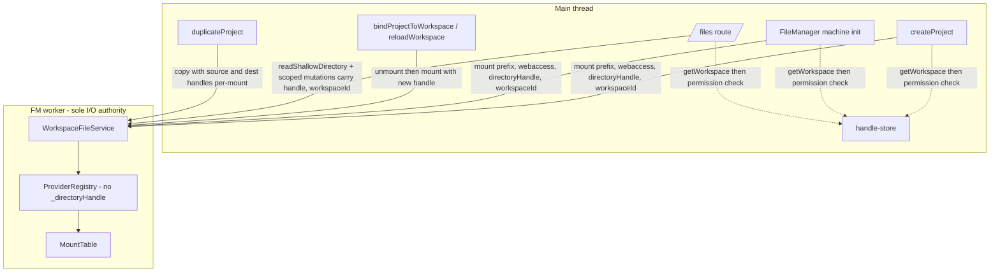

# Filesystem explicit workspace boundaries: stateless FM worker blueprint

Blueprint for finishing the filesystem workspaces refactor by removing ambient workspace state from the FM worker and making every webaccess operation (mount, read, mutate, duplicate, create) carry explicit workspace identity at its API boundary.

## Executive Summary

The new-project webaccess hang is the most visible symptom of a deeper architectural mismatch: `ProviderRegistry` carries an ambient `_directoryHandle`, while the UI manages a multi-workspace world (one `ProjectFileSystemConfig.workspaceId` per project, many handles in `handle-store`). Every previous fix has been a local patch over this mismatch — the most recent `fm-workspace-binding-scope` refactor removed ambient state from the FM machine but left the worker registry stateful, and the proposed `createInitialFileWriter` would have created a second main-thread I/O path. The architecturally correct direction is to make the FM worker **stateless with respect to workspaces** and require every webaccess operation to carry an explicit `{ workspaceId, directoryHandle }` pair through its API, expressed as `MountConfig` / `WorkspaceScope` discriminated unions so the compiler rejects ambient-state shapes outright. This blueprint specifies the target shape, the residual gaps an adversarial review surfaced (`/files` mutations, `duplicateProject`, standalone cache identity, memory backend semantics), the migration sequence, and the resolved decisions captured under [Open Questions](#open-questions) (with two follow-ups explicitly deferred).

## Table of Contents

- [Eigenquestion](#eigenquestion)
- [Problem Statement](#problem-statement)
- [Why Previous Proposals Fall Short](#why-previous-proposals-fall-short)
- [Methodology](#methodology)
- [Current State Inventory](#current-state-inventory)
- [Target Architecture](#target-architecture)
- [Findings](#findings)
- [Recommendations](#recommendations)
- [Trade-offs](#trade-offs)
- [Migration Sequence](#migration-sequence)
- [Test Strategy](#test-strategy)
- [Open Questions](#open-questions)
- [Scope and Non-Goals](#scope-and-non-goals)
- [References](#references)
- [Appendix: Call Site Inventories](#appendix-call-site-inventories)

## Eigenquestion

> **How do we make workspace identity explicit at every filesystem API boundary while preserving one canonical FM worker + `WorkspaceFileService` as the sole I/O authority?**

Equivalent reframings:

- "What does it take to delete `ProviderRegistry._directoryHandle` without breaking project open, project create, `/files` browse, `/files` mutate, duplicate, and recovery?"
- "Should webaccess identity live in the worker (ambient global), on the FM machine (per-route), in `ProjectFileSystemConfig` (per-project), or **on the call** (per-operation)?"

The answer this blueprint commits to: **on the call**. Workspace identity flows as data through every API boundary; the worker becomes a pure stateless executor of `(prefix, backend, handle, workspaceId)` mounts and `(backend, handle, workspaceId)` standalone reads/mutations.

## Problem Statement

Three concrete failures motivate this blueprint, all caused by the same architectural defect:

1. **Creation hang** (current critical bug, [docs/research/new-project-webaccess-creation-coupling.md](docs/research/new-project-webaccess-creation-coupling.md)) — root FM enters `webAccessUnavailable` when the cookie is `webaccess`, `createProject` awaits `ready` forever, project folder exists on disk with no `main.scad`.
2. **Project context leakage** (resolved by `fm-workspace-binding-scope` but the worker side remains) — opening project A (webaccess) then project B (idb) then A again would carry stale workspace state across navigations. The FM machine no longer leaks, but `ProviderRegistry._directoryHandle` still does at the worker level.
3. **Multi-workspace identity collisions** — `ProviderRegistry.getStandaloneProvider` caches webaccess providers by `` `${backend}:${handle.name}` `` ([packages/filesystem/src/provider-registry.ts](packages/filesystem/src/provider-registry.ts) line 52). Two workspaces with the same folder name (e.g. two checkouts of `tau-workspace`) share one cached provider, silently routing reads to the wrong directory.

Adversarial review surfaced four further latent gaps that any plan must address to be production-ready:

4. **`/files` mutation split-brain** — browse is workspace-scoped via `readShallowDirectory(path, backend, handle)` but `deleteFile`, `getZippedDirectory`, `readFile`, and the route-local `deleteDirectory` use the root `contentService`/`proxy` and silently target the wrong storage for webaccess columns.
5. **`duplicateProject` ignores webaccess** — `fileManager.copyDirectory` runs on the root FM (pinned to indexeddb), so duplicating a webaccess project would copy from idb (empty) and produce a broken clone.
6. **Memory backend in create flows** — `MemoryProvider` is per-instance; the worker creates a fresh one on every mount. Memory-backed project creation writes are unreachable on next navigation.
7. **Cookie role overload** — the filesystem-backend cookie serves both as "default-for-next-project hint" and "root FM `initialBackend`", conflating UX preference with runtime state.

## Why Previous Proposals Fall Short

| Proposal                                               | Status                                 | Why insufficient                                                                                                                                 |
| ------------------------------------------------------ | -------------------------------------- | ------------------------------------------------------------------------------------------------------------------------------------------------ |
| Per-project FM machine reads `ProjectFileSystemConfig` | Shipped (`fm-workspace-binding-scope`) | Project-scoped only; doesn't cover creation, `/files`, duplicate, or worker-side ambient state.                                                  |
| `createInitialFileWriter` main-thread leaf provider    | Proposed, rejected                     | Adds a parallel I/O stack; violates "FM worker is the single I/O authority"; doubles maintenance.                                                |
| Pin root FM to `indexeddb` only                        | Necessary                              | Fixes root readiness but leaves ambient `_directoryHandle` and all downstream gaps.                                                              |
| Pass handle to mount only                              | Necessary                              | Fixes project open and create, but does not address `/files` mutations, duplicate, standalone cache key bug, or `readShallowDirectory` symmetry. |
| Delete `setDirectoryHandle` outright                   | Required end-state                     | Breaks project open today; must land as part of a vertical slice with explicit handle plumbing everywhere first.                                 |

The right framing treats this as one **explicit-workspace-boundary refactor**, not a sequence of local fixes.

## Methodology

- Read every webaccess code path end-to-end: `ProviderRegistry`, `WorkspaceFileService`, `MountTable`, `FileSystemClient`, `file-manager.worker.ts`, `file-manager.machine.ts`, `use-file-manager.tsx`, `use-project-manager.tsx`, `/files` route, `handle-store.ts`, `workspace-unavailable-recovery.tsx`.
- Two parallel adversarial audits of the proposal: one focused on the worker/package layer (`provider-registry`, `WorkspaceFileService.mount`, structured-clone serialisation across the bridge proxy), one on UI consumers (`/files`, `createProject`, `duplicateProject`, recovery, root-FM pinning).
- Cross-checked findings against prior research (`new-project-webaccess-creation-coupling`, `fm-workspace-binding-scope`, `filesystem-access-api-cohesion-audit`) and against the live policy ([docs/policy/filesystem-policy.md](docs/policy/filesystem-policy.md)).
- Confirmed `FileSystemDirectoryHandle` is structured-cloneable across same-origin workers (not transferable; rides as ordinary clone payload through the runtime bridge, no transfer-list optimisation needed).

## Current State Inventory

### Ambient workspace state today

| Location                                                                                                    | Field / API                                                | Role                                        | Plan                                                                                                               |
| ----------------------------------------------------------------------------------------------------------- | ---------------------------------------------------------- | ------------------------------------------- | ------------------------------------------------------------------------------------------------------------------ |
| [packages/filesystem/src/provider-registry.ts](packages/filesystem/src/provider-registry.ts) L29            | `_directoryHandle: FileSystemDirectoryHandle \| undefined` | Default handle for webaccess providers      | **Delete.**                                                                                                        |
| [packages/filesystem/src/provider-registry.ts](packages/filesystem/src/provider-registry.ts) L104           | `setDirectoryHandle(handle)`                               | Mutate ambient handle + invalidate cache    | **Delete.**                                                                                                        |
| [packages/filesystem/src/provider-registry.ts](packages/filesystem/src/provider-registry.ts) L52            | Standalone cache key `webaccess:${handle.name}`            | Cache identity by folder name               | **Replace** with workspaceId-keyed (or drop caching).                                                              |
| [packages/filesystem/src/workspace-file-service.ts](packages/filesystem/src/workspace-file-service.ts) L851 | `setDirectoryHandle(handle)` passthrough                   | Forward to registry                         | **Delete.**                                                                                                        |
| [packages/filesystem/src/workspace-file-service.ts](packages/filesystem/src/workspace-file-service.ts) L822 | `mount(prefix, backend, options)` drops handle             | Cannot mount webaccess with explicit handle | **Replace signature** with `mount(prefix, config: MountConfig)`; forward webaccess scope to `createMountProvider`. |
| [packages/fs-client/src/file-system-client.ts](packages/fs-client/src/file-system-client.ts) L41            | `setDirectoryHandle(handle)` RPC method                    | Worker bridge surface                       | **Delete.**                                                                                                        |
| [apps/ui/app/machines/file-manager.machine.ts](apps/ui/app/machines/file-manager.machine.ts) L300           | `proxy.setDirectoryHandle(entry.handle)` before mount      | Project-open handle binding                 | **Replace** with explicit handle in mount options.                                                                 |
| [apps/ui/app/hooks/use-file-manager.tsx](apps/ui/app/hooks/use-file-manager.tsx) L163, L173                 | Root `FileManagerProvider` reads filesystem-backend cookie | Cookie -> machine `initialBackend`          | **Replace** with explicit `initialBackend` prop, default `indexeddb`.                                              |

### Already-explicit boundaries (correct shape, keep)

| Location                                                                                                    | API                                                   |
| ----------------------------------------------------------------------------------------------------------- | ----------------------------------------------------- |
| [packages/filesystem/src/provider-registry.ts](packages/filesystem/src/provider-registry.ts) L92            | `createMountProvider(backend, handle?)`               |
| [packages/filesystem/src/provider-registry.ts](packages/filesystem/src/provider-registry.ts) L48            | `getStandaloneProvider(backend, handle?)`             |
| [packages/filesystem/src/workspace-file-service.ts](packages/filesystem/src/workspace-file-service.ts) L723 | `readShallowDirectory(path, backend, handle?)`        |
| [apps/ui/app/hooks/use-file-manager.tsx](apps/ui/app/hooks/use-file-manager.tsx) L362–381                   | UI `readShallowDirectory` resolves handle main-thread |

The wiring is half-built; the blueprint finishes it.

### Webaccess-coupled operations missing explicit identity

| Operation                           | Where                                                          | Today                                                  | Gap                                                                |
| ----------------------------------- | -------------------------------------------------------------- | ------------------------------------------------------ | ------------------------------------------------------------------ |
| Project open mount                  | `file-manager.machine.ts:300-303`                              | `setDirectoryHandle` then `mount`                      | One call carrying handle.                                          |
| Project create mount + write        | `use-project-manager.tsx:303-314`                              | `mount` with no handle                                 | Mount carries handle; root FM pinned to indexeddb.                 |
| Project create initial write target | Same                                                           | Goes through root FM                                   | Same, no parallel writer.                                          |
| `/files` browse                     | `use-file-manager.tsx:362-381`, `files/route.tsx:523`          | Already passes handle                                  | OK.                                                                |
| `/files` delete file                | `files/route.tsx:805-811`                                      | Uses root `deleteFile`                                 | Needs `(backend, workspaceId)`-scoped delete.                      |
| `/files` download file              | `files/route.tsx:813-821`                                      | Uses root `readFile`                                   | Needs scoped read.                                                 |
| `/files` zip folder                 | `files/route.tsx:831-838`                                      | Uses root `getZippedDirectory`                         | Needs scoped zip.                                                  |
| `/files` delete directory           | `files/route.tsx:763-787`                                      | Uses `proxy.readdir/stat/unlink/rmdir` on active mount | Needs scoped recursive delete.                                     |
| Recovery rebind                     | `workspace-unavailable-recovery.tsx`, `bindProjectToWorkspace` | Persist config + `reloadWorkspace`                     | `reloadWorkspace` must remount with new explicit handle.           |
| Duplicate project                   | `use-project-manager.tsx:343-351`                              | Root `copyDirectory`                                   | Needs source + destination handles when crossing backends.         |
| Workspace folder change             | `files/route.tsx:668-700`                                      | `updateWorkspaceHandle` + UI reload                    | Must invalidate scoped standalone cache + remount active projects. |

## Target Architecture

### Single-authority worker, stateless w.r.t. workspaces



Properties:

- The worker has no workspace identity state of any kind. Every operation receives the handles it needs as data.
- `setDirectoryHandle` is removed from `ProviderRegistry`, `WorkspaceFileService`, and the `FileSystemClient` protocol.
- Multiple concurrent webaccess mounts at different prefixes with different handles are correct by construction.
- Multiple project tabs sharing the runtime worker (`SharedWorker`) coexist without stepping on each other's workspace identity.

### Mount API target shape (discriminated union)

For maximum type safety the mount API folds the backend tag together with its backend-specific options into a single `MountConfig` discriminated union. The compiler statically enforces that webaccess mounts pass a `directoryHandle` and `workspaceId`, and forbids them on other backends. Same approach for standalone reads/mutations.

```ts
export type MountConfig =
  | {
      readonly backend: 'webaccess';
      readonly directoryHandle: FileSystemDirectoryHandle;
      readonly workspaceId: string;
      readonly preservePath?: boolean;
    }
  | {
      readonly backend: 'indexeddb' | 'opfs' | 'memory';
      readonly preservePath?: boolean;
    };

export type WorkspaceScope =
  | { readonly backend: 'webaccess'; readonly directoryHandle: FileSystemDirectoryHandle; readonly workspaceId: string }
  | { readonly backend: 'indexeddb' | 'opfs' | 'memory' };

interface FileSystemClient {
  mount(prefix: string, config: MountConfig): Promise<void>;
  unmount(prefix: string): void;
  readShallowDirectory(path: string, scope: WorkspaceScope): Promise<FileTreeNode[]>;
  // Scoped mutations for /files multi-column work (R7):
  readFileScoped(path: string, scope: WorkspaceScope): Promise<Uint8Array<ArrayBuffer>>;
  deleteFileScoped(path: string, scope: WorkspaceScope): Promise<void>;
  deleteDirectoryScoped(path: string, scope: WorkspaceScope): Promise<void>;
  getZippedDirectoryScoped(path: string, scope: WorkspaceScope): Promise<Blob>;
  // setDirectoryHandle removed
}
```

`ProviderRegistry.createMountProvider(backend, handle?)` becomes `createMountProvider(scope: WorkspaceScope)` (or an equivalent overload set) and throws a structured `MissingWorkspaceHandleError` on a `webaccess` scope without a handle — no more "Call setDirectoryHandle()" string.

`MountConfig` is the canonical shape for both the bridge RPC and the UI `useFileManager().mount` facade, so the discriminant flows end-to-end with no places where `webaccess` can be expressed without its required identity.

### Standalone cache target shape

Webaccess standalone providers are cached by `workspaceId` (stable, persistent identity), not by `handle.name` (collides across same-named workspaces). The registry exposes a targeted invalidator `invalidateStandaloneProvider(backend, workspaceId?)` that:

- "Change Folder" UI in `/files` calls with the specific `workspaceId` to drop a stale handle.
- Recovery `bindProjectToWorkspace` calls with the previous `workspaceId` after re-binding.
- `disposeAll()` continues to clear everything.

No more invalidation-on-`setDirectoryHandle` (which deleted itself with the rest of the ambient surface).

### Root FM contract

- Root `<FileManagerProvider rootDirectory='/'>` is pinned to `indexeddb` (workspace-independent).
- `FileManagerProvider` accepts an explicit `initialBackend` prop; root passes `indexeddb`. Project-scoped providers still resolve via `ProjectFileSystemConfig`.
- Filesystem-backend cookie is read **only** by `useProjectManager.createProject` (default-for-next-project) and by Settings/`/files`/`/projects/new` UI (preference display).

## Findings

### Finding 1: The mount path drops the handle the registry already accepts

`createMountProvider(backend, handle?)` was designed for explicit handles; `WorkspaceFileService.mount(...)` never forwards them. This is the single highest-leverage wiring gap — extending `MountOptions` with `directoryHandle` and forwarding to `createMountProvider` unlocks deletion of the ambient `_directoryHandle` from the registry.

### Finding 2: Deleting `setDirectoryHandle` without explicit mount plumbing breaks project open

The only production caller is `file-manager.machine.ts:300`. It precedes the project-open mount. Deletion is safe only as part of the vertical slice in Finding 1.

### Finding 3: Standalone cache identity is broken for multi-workspace

`webaccess:${handle.name}` collides on two workspaces with the same folder name. `/files` would silently route the second workspace's reads through the first workspace's cached provider. This is a pre-existing latent bug; multi-workspace UI ships it from latent to live.

### Finding 4: `/files` browse and mutations are split-brain

Browse is workspace-scoped via per-call handles; mutations (`deleteFile`, `readFile`, `getZippedDirectory`, recursive directory delete) use the active root `contentService` / `proxy`. For webaccess columns, these mutations target the wrong storage. Production workspaces UI requires per-column scoped mutations.

### Finding 5: `duplicateProject` predates workspaces

`fileManager.copyDirectory` operates on the root FM. After pinning root to `indexeddb`, duplicating a webaccess project (or any cross-backend copy) is structurally wrong. Either scope copy with explicit per-side mounts/handles, or reject cross-backend / webaccess duplicate explicitly with a structured error.

### Finding 6: Memory backend creates unrecoverable projects

`MemoryProvider` is per-instance; create writes through the root FM's MemoryProvider, but `initializeServicesActor` on `/projects/$id` mounts a fresh MemoryProvider with no shared state. Memory-backed project creation is broken end-to-end and not addressable without redesigning memory backend semantics.

### Finding 7: Cookie overload

The filesystem-backend cookie drives both root FM `initialBackend` and "default-for-next-project". The former is the hang vector; the latter is legitimate UX preference. Decoupling them is necessary for the root pin to take effect cleanly.

### Finding 8: Lifecycle gaps without timeouts

`getReadiedProxy` / `whenServicesReady` in [apps/ui/app/hooks/use-file-manager.tsx](apps/ui/app/hooks/use-file-manager.tsx) have no timeout. Any future regression where the FM machine cannot reach `ready` manifests as an indefinite spinner. Structured timeouts are defence-in-depth.

### Finding 9: `reloadWorkspace` must remount, not rebind

Today `reloadWorkspace` re-runs init, which re-issues `setDirectoryHandle` and `mount`. After the refactor, it must `unmount` the existing webaccess prefix and `mount` with the new explicit handle. In-flight reads/writes mid-swap need a defined error mode.

### Finding 10: Telemetry must carry `workspaceId` not handle identity

Once handles are per-call, telemetry events (`workspace.connected`, `workspace.open_failed`) should carry `workspaceId` (stable identity) and never the handle (non-serialisable, non-comparable).

## Recommendations

| #   | Action                                                                                                                                                                                                                                                                                                                              | Priority | Effort | Impact |
| --- | ----------------------------------------------------------------------------------------------------------------------------------------------------------------------------------------------------------------------------------------------------------------------------------------------------------------------------------- | -------- | ------ | ------ |
| R1  | Replace `MountOptions` with the `MountConfig` discriminated union; `mount(prefix, config)` is the only shape. Plumb through `WorkspaceFileService.mount` -> `createMountProvider(scope)`. Worker RPC inherits via the existing bridge.                                                                                              | P0       | S      | High   |
| R2  | Update `file-manager.machine.ts` project-open path to single `mount(projectPrefix, { backend: 'webaccess', directoryHandle, workspaceId, preservePath: true })`. Remove `proxy.setDirectoryHandle(...)` call.                                                                                                                       | P0       | S      | High   |
| R3  | Update `use-project-manager.createProject` to call `mount(projectPrefix, { backend: 'webaccess', directoryHandle: entry.handle, workspaceId, preservePath: true })` on the root FM, then `writeFiles`, then `unmount`. No new helper.                                                                                               | P0       | S      | High   |
| R4  | Pin root `FileManagerProvider` to `indexeddb`. Add explicit `initialBackend` prop; stop reading the cookie inside `FileManagerProvider`.                                                                                                                                                                                            | P0       | S      | High   |
| R5  | Delete `setDirectoryHandle` from `ProviderRegistry`, `WorkspaceFileService`, `FileSystemClient`, worker bridge surface, and all mocks/tests.                                                                                                                                                                                        | P0       | S      | High   |
| R6  | Replace `webaccess:${handle.name}` cache key with `workspaceId`-keyed standalone cache; expose `invalidateStandaloneProvider(backend, workspaceId?)` and call it from `/files` "Change Folder" and recovery `bindProjectToWorkspace`.                                                                                               | P0       | S      | High   |
| R7  | Scope `/files` mutations per column with new worker RPCs: `readFileScoped`, `deleteFileScoped`, `deleteDirectoryScoped`, `getZippedDirectoryScoped`, each taking a `WorkspaceScope`. Browse already passes scope via `readShallowDirectory`.                                                                                        | P0       | M      | High   |
| R8  | Restrict `duplicateProject` to same-`workspaceId`, same-backend duplicates initially. Reject cross-workspace / cross-backend / webaccess-with-different-source with `WorkspaceDirectoryRequiredError('unsupported')`. Full cross-backend copy is a follow-up.                                                                       | P1       | M      | Med    |
| R9  | Reject `backend: 'memory'` from `createProject` with `WorkspaceDirectoryRequiredError('unsupported')`. Hide `memory` from `BackendSelector` default-backend UI and from `/files` default-backend star. Drop `memory` from `cookieName.filesystemBackend` allowed values; coerce stale `memory` cookies to `indexeddb` at read time. | P1       | S      | Med    |
| R10 | Add timeout to `getReadiedProxy` / `whenServicesReady`. Surface `FileManagerNotReadyError` with structured `code` to toasts on root usage; project-route gates already render the overlay.                                                                                                                                          | P1       | S      | Med    |
| R11 | Update `reloadWorkspace` semantics: explicit `unmount` then `mount` with new handle. In-flight reads/writes against the old prefix reject with `WorkspaceUnmountedError`; UI gates the editor during the swap and surfaces the structured error if the gate is bypassed.                                                            | P1       | S      | Med    |
| R12 | Update [docs/policy/filesystem-policy.md](docs/policy/filesystem-policy.md): Rule 13b/c spell out the per-mount/per-call `MountConfig`/`WorkspaceScope` contract; new Rule 14 pins root FM to indexeddb; Rule 15 codifies the `workspaceId`-keyed cache contract.                                                                   | P1       | S      | Med    |
| R13 | Surface `MissingWorkspaceHandleError` from `createMountProvider` (no more string-matching the `Error('No directory handle set...')`). Map to `WorkspaceDirectoryRequiredError` at the UI boundary.                                                                                                                                  | P1       | S      | Med    |
| R14 | Add regression and integration tests (see [Test Strategy](#test-strategy)).                                                                                                                                                                                                                                                         | P0       | M      | High   |
| R15 | Add a compile-time guard in `FileManagerProvider`: if `projectId === undefined` and `initialBackend === 'webaccess'`, throw immediately. Prevents future cookie-as-input regression.                                                                                                                                                | P2       | S      | Low    |

## Trade-offs

### Where workspace identity lives

| Option                                 | Coupling                           | Multi-workspace safe         | Verdict        |
| -------------------------------------- | ---------------------------------- | ---------------------------- | -------------- |
| Ambient in `ProviderRegistry` (today)  | One workspace global per worker    | No                           | Today's bug.   |
| On the FM machine context              | One workspace per FM provider tree | No (root + project conflict) | Tried, leaked. |
| On `ProjectFileSystemConfig` only      | One per project                    | Yes for open, no for create  | Half.          |
| **Per-operation, on the call** (R1-R7) | Zero ambient state                 | **Yes**                      | **Chosen.**    |

### Mount API shape: open object vs discriminated union

| Option                                                     | Pros                                                                                                     | Cons                                                                                                         |
| ---------------------------------------------------------- | -------------------------------------------------------------------------------------------------------- | ------------------------------------------------------------------------------------------------------------ |
| `{ directoryHandle?; workspaceId?; preservePath? }` (open) | Smallest API change; one path through the bridge.                                                        | Webaccess-without-handle is a runtime error, not a compile error.                                            |
| **`MountConfig` discriminated union** (chosen)             | Compile-time enforcement; impossible to mount webaccess wrong; `WorkspaceScope` aligns standalone reads. | More invasive at every call site; bridge proxy carries the union (structured-cloneable, no transfer issues). |

Resolved in favour of the discriminated union (OQ-2). Type-safety dominates one-time migration cost on an unreleased API.

### Standalone cache identity

| Option                            | Pros                                                         | Cons                                                                      |
| --------------------------------- | ------------------------------------------------------------ | ------------------------------------------------------------------------- |
| Drop webaccess standalone caching | Simplest; no identity question.                              | Construct on every browse expand; potentially extra IDB/OPFS handle work. |
| **Key by `workspaceId`** (chosen) | Stable, explicit, easy to invalidate; aligns with telemetry. | Adds a parameter; call site already passes `workspaceId` everywhere.      |
| `WeakMap<handle, provider>`       | GCs naturally; no key collisions.                            | Lifetime tied to handle GC; behaviour surprising for stale handles.       |

Resolved in favour of `workspaceId`-keyed cache plus targeted invalidator (OQ-1). Folder-name keying is removed unconditionally.

## Migration Sequence

A future plan will translate this blueprint into ordered tasks. The sequence the blueprint commits to is:

1. **Worker/package vertical slice**: introduce `MountConfig` and `WorkspaceScope` discriminated unions; plumb through `WorkspaceFileService.mount(prefix, config)` and `createMountProvider(scope)`; add `MissingWorkspaceHandleError`. Drop the positional `(backend, handle?)` shape. Land with package tests.
2. **Standalone cache identity** (R6): replace `webaccess:${handle.name}` key with `workspaceId`-keyed cache; expose `invalidateStandaloneProvider(backend, workspaceId?)`.
3. **FM machine project-open**: replace `setDirectoryHandle` + mount with a single `mount(prefix, { backend: 'webaccess', directoryHandle, workspaceId, preservePath: true })`. Update machine tests.
4. **Root FM pinning + cookie decoupling** (R4): explicit `initialBackend` prop on `FileManagerProvider`, root passes `indexeddb`, drop `useCookie` from the provider itself, keep cookie reads in `useProjectManager.createProject` + Settings + `/files` + `/projects/new`.
5. **createProject mount-with-handle** (R3): keep existing worker path, add `MountConfig` for webaccess, no new helper. Update create call sites.
6. **`/files` scoped mutations** (R7): extend `FileSystemClient` and `WorkspaceFileService` with `readFileScoped`, `deleteFileScoped`, `deleteDirectoryScoped`, `getZippedDirectoryScoped`. Route `/files` action handlers through scoped methods.
7. **`duplicateProject` same-workspace path** (R8): resolve source `ProjectFileSystemConfig`, persist destination config with matching `(backend, workspaceId)`, copy within the same `WorkspaceScope`. Reject any cross-workspace / cross-backend combination with `WorkspaceDirectoryRequiredError('unsupported')`.
8. **Memory backend gating** (R9): reject from `createProject`; hide from `BackendSelector` and `/files` default star; drop `memory` from `cookieName.filesystemBackend` allowed values with read-time coercion.
9. **Delete `setDirectoryHandle`** (R5) from `ProviderRegistry`, `WorkspaceFileService`, `FileSystemClient`, the worker bridge surface, all mocks, tests, and policy text.
10. **Timeouts + structured errors** (R10): wrap `getReadiedProxy` / `whenServicesReady` with timeout + `FileManagerNotReadyError`; map `MissingWorkspaceHandleError` to `WorkspaceDirectoryRequiredError` at the UI boundary (R13).
11. **`reloadWorkspace` remount semantics** (R11): explicit unmount + remount; in-flight rejects with `WorkspaceUnmountedError`.
12. **Policy + tests + telemetry** (R12, R14, R15, Finding 10): policy rules 13c / 14 / 15; regression suite per [Test Strategy](#test-strategy); compile-time `FileManagerProvider` guard against `initialBackend: 'webaccess'` without `projectId`; telemetry sweep replaces handle references with `workspaceId`.

Steps 1-5 are independently testable inside the worker/package without UI changes shipping. Steps 6-7 are user-visible (`/files`, duplicate). Step 9 closes the surface; nothing can compile against `setDirectoryHandle` thereafter.

## Test Strategy

### Package-level (`packages/filesystem`, `packages/fs-client`)

- `provider-registry.test.ts`: `createMountProvider({ backend: 'webaccess' } as MountConfig)` is a compile error (verified via `expect-type` / `.test-d.ts`); runtime equivalent throws `MissingWorkspaceHandleError`. Two workspaces with the same folder name but different `workspaceId` produce distinct standalone instances and invalidate independently (Finding 3 regression).
- `workspace-file-service.test.ts`: `mount('/projects/a', { backend: 'webaccess', directoryHandle: handleA, workspaceId: 'wsp_A', preservePath: true })` + read/write; two concurrent webaccess mounts with different handles at different prefixes operate without cross-interference; explicit `unmount` + `mount` with a new handle (R11) rejects in-flight reads with `WorkspaceUnmountedError`; scoped `readFileScoped` / `deleteFileScoped` / `deleteDirectoryScoped` / `getZippedDirectoryScoped` route through the right workspace.
- `file-system-client.test-d.ts`: confirms `mount(prefix, config)` where `config.backend === 'webaccess'` requires `directoryHandle` and `workspaceId` (compile error otherwise); confirms `setDirectoryHandle` is no longer exported.
- Bridge round-trip test (browser vitest if available): `FileSystemDirectoryHandle` survives `exposeFileSystem` + `createBridgeProxy` structured clone through `mount`.

### UI-level (`apps/ui`)

- `file-manager.machine.test.ts`: assertion is `mount(projectPrefix, { backend: 'webaccess', directoryHandle, workspaceId, preservePath: true })`; `setDirectoryHandle` mock removed; new test for `reloadWorkspace` performing unmount + remount with a fresh handle.
- `use-file-manager.test.tsx`: root `initialBackend='indexeddb'` invariant; provider rejects `initialBackend='webaccess'` when `projectId === undefined` (R15); timeout test for `getReadiedProxy` / `whenServicesReady` surfaces `FileManagerNotReadyError`.
- `use-project-manager.test.ts`: `mount` mock assertion includes the webaccess `MountConfig` variant; `createProject({ backend: 'memory' })` rejects with `WorkspaceDirectoryRequiredError('unsupported')`; same rejection when `defaultBackend` cookie coerces from `memory`.
- New `use-project-manager.create-webaccess.test.tsx` (R14): cookie set to webaccess, `<FileManagerProvider rootDirectory='/'>` mounts as `indexeddb`, `createProject({ backend: 'webaccess', workspaceId })` resolves within bounded time and writes `main.scad` to a fake `FileSystemDirectoryHandle`.
- New `/files` mutation tests: webaccess column delete/download/zip target the column's workspace via the scoped client methods, not the root mount; "Change Folder" invalidates only that column's standalone cache.
- `use-project-manager.duplicate.test.ts`: same-workspace duplicate succeeds; cross-workspace / cross-backend / webaccess-with-different-source rejects with `WorkspaceDirectoryRequiredError('unsupported')`.
- `workspace-unavailable-recovery.test.tsx`: `bindProjectToWorkspace` -> `reloadWorkspace` causes `unmount` + `mount(..., webaccess MountConfig)`; in-flight reads error with `WorkspaceUnmountedError`.

### Policy validation

`pnpm docs:validate` after [docs/policy/filesystem-policy.md](docs/policy/filesystem-policy.md) update.

## Open Questions

All open questions are resolved. Tracked here as decision records for the plan that follows.

### OQ-1: Standalone provider cache mechanism

**RESOLVED — key by `workspaceId`.**

The webaccess standalone cache is keyed by `workspaceId` and exposed via `invalidateStandaloneProvider(backend, workspaceId?)`. Folder-name keying is removed unconditionally. Call sites already carry `workspaceId` everywhere we need invalidation (`/files` "Change Folder" and recovery `bindProjectToWorkspace`).

### OQ-2: Mount API shape

**RESOLVED — `MountConfig` discriminated union.**

`mount(prefix, config)` accepts a single `MountConfig` whose discriminant is `backend`. Webaccess variants require `directoryHandle` and `workspaceId` at the type level; the compiler rejects webaccess mounts without them. Same shape for `WorkspaceScope` on standalone reads/mutations. The bridge proxy carries the union via structured clone (no transfer issues for `FileSystemDirectoryHandle`). One-time call-site migration cost is accepted in exchange for compile-time enforcement; the API is unreleased so there is no deprecation phase.

### OQ-3: `/files` mutation surface

**RESOLVED — Option A scoped methods.**

`FileSystemClient` grows `readFileScoped(path, scope)`, `deleteFileScoped(path, scope)`, `deleteDirectoryScoped(path, scope)`, and `getZippedDirectoryScoped(path, scope)`. Each accepts a `WorkspaceScope`. `/files` route routes column actions through these methods so browse and mutate share one workspace-identity model. Ephemeral mounts (Option B) and editor-only mutations (Option C) are rejected.

### OQ-4: `duplicateProject` scope

**RESOLVED — Option B: same-workspace, same-backend only for the first cut.**

`duplicateProject(projectId)` reads `ProjectFileSystemConfig` for the source, generates a new project ID with the same backend/`workspaceId`, persists the destination config, then performs a same-scope copy. Any combination that would cross workspaces or backends rejects with `WorkspaceDirectoryRequiredError('unsupported')`. Full cross-backend copy is a follow-up research/plan when users ask.

### OQ-5: Memory backend role

**RESOLVED — reject from create, hide from selectors, drop from cookie.**

- `createProject` rejects `backend: 'memory'` with `WorkspaceDirectoryRequiredError('unsupported')`.
- `BackendSelector` and `/files` default-backend star hide `memory`.
- `cookieName.filesystemBackend` drops `memory` from its allowed values; stale `memory` cookies coerce to `indexeddb` at read time.
- The `FileSystemBackend` enum value stays for tests and internal scratch use.

### OQ-6: Permission revocation mid-mount

**RESOLVED — lazy detection.**

The worker does not poll or validate permission per-operation. On any operation that throws `NotAllowedError`, the FM machine surfaces `webAccessUnavailable` and the existing recovery overlay handles re-grant or workspace swap.

### OQ-7: `reloadWorkspace` mid-swap behaviour

**RESOLVED — Option A: `WorkspaceUnmountedError`.**

`reloadWorkspace` performs an explicit `unmount(prefix)` followed by `mount(prefix, newConfig)`. In-flight reads/writes against the old prefix reject with `WorkspaceUnmountedError`. The UI gates editor surfaces during the swap (matching today's behaviour), so any escaping rejection is best-effort and surfaces as a structured error toast rather than a silent hang.

### OQ-8: Cookie value set

**RESOLVED — drop `memory` from the cookie.**

`cookieName.filesystemBackend` accepts `{ indexeddb, webaccess, opfs }`. `useCookie` reads coerce any stale `memory` value to `indexeddb`. Settings, `/projects/new`, and `/files` consume only the three live values.

### OQ-9: Concurrent project tabs (`SharedWorker`)

**DEFERRED.**

Auditing residual ambient state in `WorkspaceFileService`, `MountTable`, watch registry, and `_directoryStatRoot` across tabs is tracked as a follow-up research. The current refactor lands the worker-side stateless workspace model; cross-tab `SharedWorker` correctness will be audited in a dedicated investigation before multi-workspace is declared production-ready end-to-end.

### OQ-10: Worker timeout vs UI timeout

**DEFERRED.**

R10 adds UI-side timeouts; per-operation worker timeouts (for hung `mount` / `writeFile` calls on flaky drives) are deferred to a separate plan once telemetry shows whether real hangs occur. Today's UI-side defence-in-depth is judged sufficient for the production cut.

## Scope and Non-Goals

**In scope**:

- Removing ambient workspace state from the worker, registry, and machine.
- Making every webaccess operation (mount, read, mutate, duplicate, create, recover) carry explicit `(workspaceId, handle)` identity.
- Pinning root FM to indexeddb and decoupling the cookie from FM runtime.
- Fixing standalone cache identity.
- `/files` mutation scope.
- `duplicateProject` webaccess handling (at minimum, structured rejection).
- Memory backend gating.
- Timeouts and structured errors.

**Out of scope** (separate research):

- Worker offload of standalone reads at `/files` (today the worker already handles it; performance tuning is separate).
- Multi-region workspace sync / cloud workspaces.
- `FileSystemDirectoryHandle` persistence APIs across origin partitioning (browser-side concern).
- Replacing the runtime bridge with Comlink.
- Re-architecting `ProjectActivityTracker` to listen to creation events (Finding in `new-project-webaccess-creation-coupling`; persistent `createdAt` is sufficient).

## References

- Related: [docs/research/new-project-webaccess-creation-coupling.md](docs/research/new-project-webaccess-creation-coupling.md) — original root-cause of the creation hang.
- Related: [docs/research/fm-workspace-binding-scope.md](docs/research/fm-workspace-binding-scope.md) — previous refactor that removed ambient state from the FM machine (this blueprint finishes the worker side).
- Related: [docs/research/filesystem-access-api-cohesion-audit.md](docs/research/filesystem-access-api-cohesion-audit.md) — original audit that introduced multi-workspace.
- Policy: [docs/policy/filesystem-policy.md](docs/policy/filesystem-policy.md) — Rules 13a/13b will gain Rule 13c (creation transaction) and Rule 14 (root FM = indexeddb).
- Code anchors: [packages/filesystem/src/provider-registry.ts](packages/filesystem/src/provider-registry.ts), [packages/filesystem/src/workspace-file-service.ts](packages/filesystem/src/workspace-file-service.ts), [packages/filesystem/src/mount-table.ts](packages/filesystem/src/mount-table.ts), [packages/fs-client/src/file-system-client.ts](packages/fs-client/src/file-system-client.ts), [apps/ui/app/machines/file-manager.machine.ts](apps/ui/app/machines/file-manager.machine.ts), [apps/ui/app/hooks/use-file-manager.tsx](apps/ui/app/hooks/use-file-manager.tsx), [apps/ui/app/hooks/use-project-manager.tsx](apps/ui/app/hooks/use-project-manager.tsx), [apps/ui/app/routes/files/route.tsx](apps/ui/app/routes/files/route.tsx).

## Appendix: Call Site Inventories

### `setDirectoryHandle` production callers

| File                                                                                                   | Line | Action                                            |
| ------------------------------------------------------------------------------------------------------ | ---- | ------------------------------------------------- |
| [apps/ui/app/machines/file-manager.machine.ts](apps/ui/app/machines/file-manager.machine.ts)           | 300  | Replace with explicit mount-with-handle (R2).     |
| [packages/filesystem/src/workspace-file-service.ts](packages/filesystem/src/workspace-file-service.ts) | 851  | Delete passthrough (R5).                          |
| [packages/filesystem/src/provider-registry.ts](packages/filesystem/src/provider-registry.ts)           | 104  | Delete; `_directoryHandle` field removed.         |
| [packages/fs-client/src/file-system-client.ts](packages/fs-client/src/file-system-client.ts)           | 41   | Remove from protocol surface.                     |
| `apps/ui/app/hooks/use-file-manager.test.tsx`                                                          | 66   | Remove mock.                                      |
| `apps/ui/app/machines/file-manager.machine.test.ts`                                                    | 62   | Remove mock; assert mount carries handle instead. |

### `createProject` call sites and required behaviour

| File                                                                                                                               | Backend pass-through? | Workspace pass-through?   | Notes                      |
| ---------------------------------------------------------------------------------------------------------------------------------- | --------------------- | ------------------------- | -------------------------- |
| [apps/ui/app/routes/projects\_.new/route.tsx](apps/ui/app/routes/projects_.new/route.tsx) L110                                     | Explicit              | Explicit (when webaccess) | Picker-driven.             |
| [apps/ui/app/routes/\_index/route.tsx](apps/ui/app/routes/_index/route.tsx) L188                                                   | Cookie default        | `getDefaultWorkspace`     | Homepage chat.             |
| [apps/ui/app/routes/\_index/cta-section.tsx](apps/ui/app/routes/_index/cta-section.tsx) L27                                        | Cookie default        | `getDefaultWorkspace`     | CTA.                       |
| [apps/ui/app/routes/\_index/hero-viewer.tsx](apps/ui/app/routes/_index/hero-viewer.tsx) L122                                       | Cookie default        | `getDefaultWorkspace`     | Hero "Continue in editor". |
| [apps/ui/app/components/project-grid.tsx](apps/ui/app/components/project-grid.tsx) L83                                             | Cookie default        | `getDefaultWorkspace`     | Remix/Fork.                |
| [apps/ui/app/routes/projects\_.library/route.tsx](apps/ui/app/routes/projects_.library/route.tsx) L176                             | Cookie default        | `getDefaultWorkspace`     | Library chat.              |
| [apps/ui/app/routes/v.$id/fork-action.tsx](apps/ui/app/routes/v.$id/fork-action.tsx) L46                                           | Cookie default        | `getDefaultWorkspace`     | Publication fork.          |
| [apps/ui/app/routes/import.$/route.tsx](apps/ui/app/routes/import.$/route.tsx) L104, L149                                          | Cookie default        | `getDefaultWorkspace`     | GitHub + disk import.      |
| [apps/ui/app/routes/projects*.$id*.preview/preview-desktop.tsx](apps/ui/app/routes/projects_.$id_.preview/preview-desktop.tsx) L72 | Cookie default        | `getDefaultWorkspace`     | Preview remix.             |
| [apps/ui/app/routes/projects*.$id*.preview/preview-mobile.tsx](apps/ui/app/routes/projects_.$id_.preview/preview-mobile.tsx) L48   | Cookie default        | `getDefaultWorkspace`     | Preview remix mobile.      |

### `/files` route mutation entry points (R7 targets)

| File                                                                     | Line(s) | Operation                                                         |
| ------------------------------------------------------------------------ | ------- | ----------------------------------------------------------------- |
| [apps/ui/app/routes/files/route.tsx](apps/ui/app/routes/files/route.tsx) | 763-787 | Recursive directory delete via `proxy.readdir/stat/unlink/rmdir`. |
| [apps/ui/app/routes/files/route.tsx](apps/ui/app/routes/files/route.tsx) | 805-811 | `deleteFile` via root `contentService`.                           |
| [apps/ui/app/routes/files/route.tsx](apps/ui/app/routes/files/route.tsx) | 813-821 | `readFile` for download.                                          |
| [apps/ui/app/routes/files/route.tsx](apps/ui/app/routes/files/route.tsx) | 831-838 | `getZippedDirectory` for zip download.                            |
