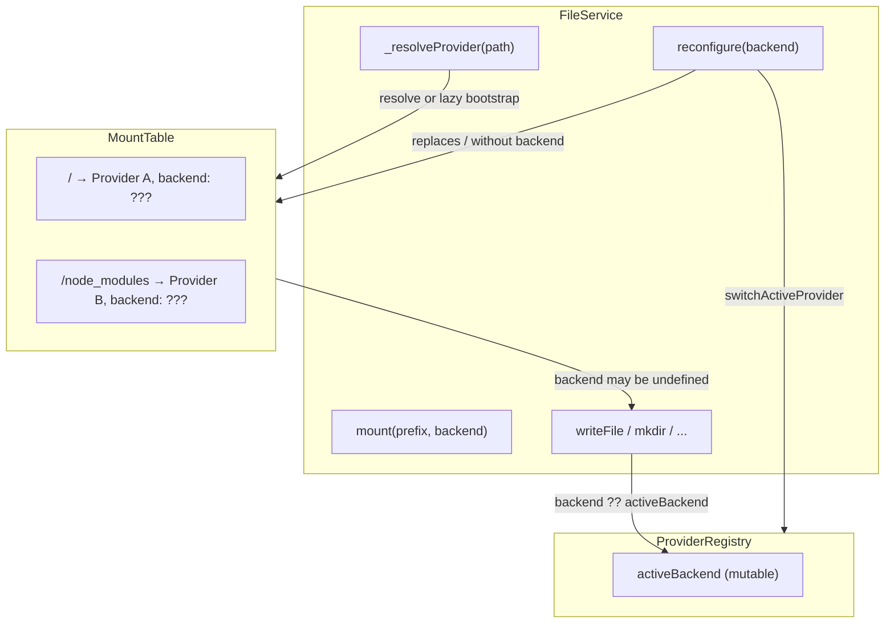
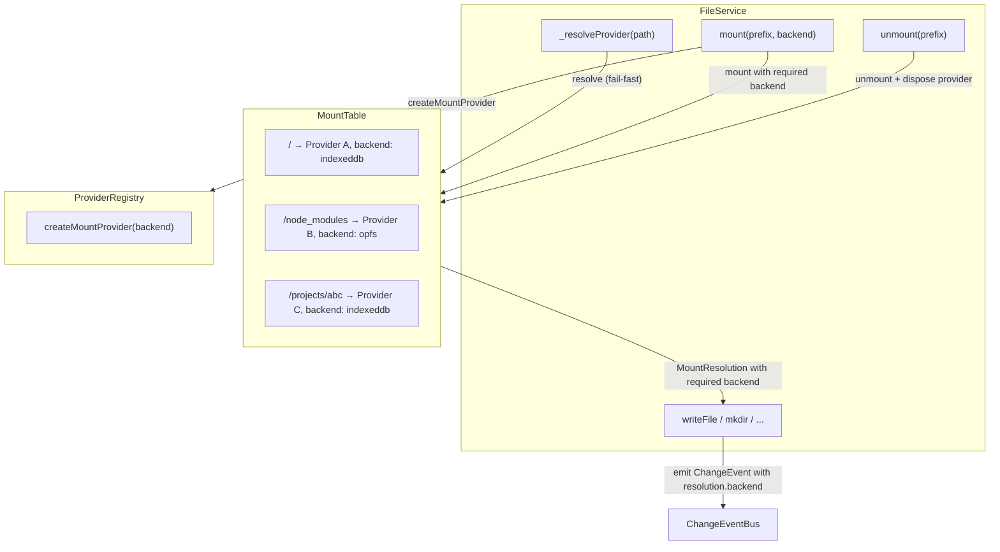
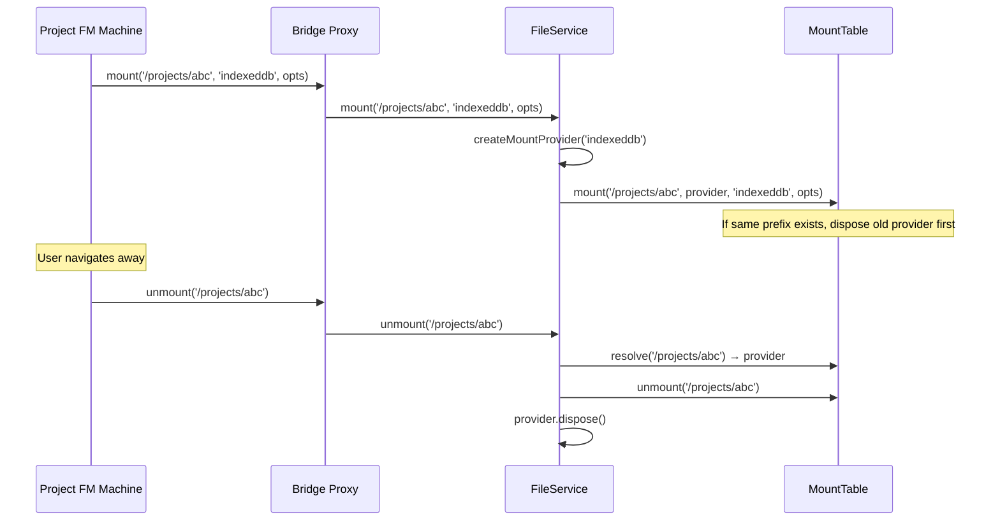

# Filesystem Mount-Only Architecture

Investigation into eliminating implicit backend resolution, the `reconfigure` API, and provider ownership ambiguity in `@taucad/filesystem` and its UI consumers.

## Executive Summary

The filesystem package uses `MountTable` for path-to-provider routing but retains a parallel `reconfigure` mutation path and 8 fallback sites where `resolvedBackend ?? this._registry.activeBackend` guesses the backend when mount metadata is missing. Product analysis reveals that all editing flows already use explicit `mount()` operations, `reconfigure` has zero active callers in the UI, and project mount lifecycles leak providers on navigation. This document catalogs every issue found during investigation, proposes a mount-only architecture that eliminates all guessing, and defines a concrete definition of done.

## Table of Contents

- [Problem Statement](#problem-statement)
- [Methodology](#methodology)
- [Findings](#findings)
- [Target Architecture](#target-architecture)
- [Recommendations](#recommendations)
- [Diagrams](#diagrams)
- [Appendix](#appendix)

## Problem Statement

Three classes of issue were identified during source analysis of `packages/filesystem/` and `apps/ui/`:

1. **Backend guessing via fallback chains** -- every mutation in `FileService` falls back to `ProviderRegistry.activeBackend` when the mount table resolution does not carry backend metadata, creating an implicit dependency on separate mutable state.

2. **Parallel mutation paths** -- `reconfigure()` replaces the root mount and clears caches, while `mount()`/`unmount()` manage prefix-scoped overlays. The two paths have different semantics but both modify the same `MountTable`, with `reconfigure` not passing backend metadata to the mount it creates.

3. **Provider lifecycle gaps** -- project mounts are created on machine init but never unmounted on teardown, and `MountTable.mount()` silently drops replaced providers without disposing them.

## Methodology

Source analysis of the working tree on branch `observability-v1` (4 commits ahead of origin). Files examined:

- `packages/filesystem/src/file-service.ts` -- all 8 `??` fallback sites, `reconfigure`, `mount`, `unmount`, `_resolveProvider`
- `packages/filesystem/src/mount-table.ts` -- `MountEntry`, `MountResolution`, `MountOptions`, `mount()`, `unmount()`
- `packages/filesystem/src/provider-registry.ts` -- `activeBackend`, `switchActiveProvider`, `createMountProvider`
- `apps/ui/app/machines/file-manager.machine.ts` -- `initializeWorkerActor`, `destroyWorkerAndServices`
- `apps/ui/app/machines/file-manager.machine.types.ts` -- `FileManagerProtocol`
- `apps/ui/app/hooks/use-file-manager.tsx` -- `reconfigureBackend`, `selectDirectory`, `reconnectDirectory`
- `apps/ui/app/hooks/use-project-manager.tsx` -- `createProject`, `duplicateProject`
- `apps/ui/app/machines/file-manager.worker.ts` -- worker mount setup
- `apps/ui/app/routes/files/route.tsx` -- `/files` multi-backend inspector
- `apps/ui/app/routes/projects_.$id/chat-details.tsx` -- `FileSystemInfo` display
- `libs/types/src/types/filesystem.types.ts` -- `ChangeEvent` type

Caller analysis used repo-wide grep for `reconfigure`, `reconfigureBackend`, `selectDirectory`, `reconnectDirectory`, `activeBackend`, `replaceRootMount`, and `.mount(` to trace every call chain from UI trigger to worker execution.

## Findings

### Finding 1: Backend fallback pattern is repeated 8 times with no consumer

Every mutation method in `FileService` uses the pattern:

```typescript
backend: resolvedBackend ?? this._registry.activeBackend;
```

At these sites: `writeFile` (L271), `writeFiles` (L308), `mkdir` (L335), `rename` (L371), `unlink` (L393), `rmdir` (L415), `duplicateFile` (L457), `copyDirectory` (L491).

The fallback fires when `MountResolution.backend` is `undefined`, which occurs when:

- The lazy bootstrap in `_resolveProvider` mounts `/` without passing backend metadata
- `reconfigure()` remounts `/` without backend metadata
- Worker mounts `/node_modules` without backend metadata

No downstream consumer of `ChangeEvent` reads the `backend` field on file events. `FileTreeService.extractPathFromEvent` reads only `event.type` and `event.path`. `WatchRegistry` reads only `event.type === 'backendChanged'`. The `backend` field on file events is currently dead data, but it should still be accurate for diagnostics and future use.

### Finding 2: `reconfigure` is vestigial with zero active callers in the UI

`FileService.reconfigure()` is exposed through `FileManagerProtocol.reconfigure` and called from:

| Call site                                  | File                           | Fires in production?                                                   |
| ------------------------------------------ | ------------------------------ | ---------------------------------------------------------------------- |
| Machine init, root FM, non-default backend | `file-manager.machine.ts` L117 | Only when cookie is not `indexeddb` and no `projectId`                 |
| Machine init, root FM, webaccess           | `file-manager.machine.ts` L100 | Only when cookie is `webaccess`, handle has permission, no `projectId` |
| `reconfigureBackend` callback              | `use-file-manager.tsx` L285    | Zero callers in app                                                    |
| `selectDirectory` callback                 | `use-file-manager.tsx` L345    | Zero callers in app                                                    |
| `reconnectDirectory` callback              | `use-file-manager.tsx` L367    | Zero callers in app                                                    |

The root FM (no `projectId`) exists solely to host the shared worker and provide `useFileManager()` for project creation and `/files` browsing. It does not do file editing. The machine init `reconfigure` branches align the worker's root backend with a cookie preference, but:

- Project creation uses `mount/unmount` (not root backend): `use-project-manager.tsx` L221-232
- `/files` browsing uses `readShallowDirectory(path, backend)`, bypassing mounts entirely: `routes/files/route.tsx` L610
- Project editing uses project-scoped `mount()`: `file-manager.machine.ts` L98, L115
- Settings backend change only sets a cookie, no live reconfigure: `filesystem-settings.tsx` L52-57

### Finding 3: Project mount lifecycle leaks providers

When a project FM machine starts, `initializeWorkerActor` calls `proxy.mount('/projects/:id', backend, ...)`. When the user navigates away from a project:

1. `destroyWorkerAndServices` runs (`file-manager.machine.ts` L228-245)
2. It calls `proxy.dispose()` (closes MessagePort), `contentService.dispose()`, `treeService.dispose()`
3. It does **not** call `proxy.unmount('/projects/:id')`

Since nested project FMs share the worker via `sharedWorker`, the `FileService` instance survives. The stale mount entry remains in `MountTable` with its provider still alive. If the user navigates between projects A and B, both `/projects/A` and `/projects/B` remain mounted with leaked providers.

### Finding 4: Same-prefix mount replacement does not dispose old provider

`MountTable.mount()` calls `this.unmount(normalized)` to remove an existing entry at the same prefix, then pushes the new entry. `MountTable.unmount()` only filters the `_mounts` array -- it does not call `provider.dispose()`.

`FileService.unmount()` does dispose the provider, but `MountTable.mount()`'s internal `this.unmount()` bypasses `FileService`, going directly to `MountTable.unmount()`.

This means re-mounting the same prefix (re-entering a project, replacing root via `reconfigure`) leaks the old provider.

### Finding 5: `_resolveProvider` lazy bootstrap creates implicit mounts

When no mount matches a path, `_resolveProvider` auto-creates a `/` mount from `registry.getActiveProvider()`:

```typescript
private async _resolveProvider(path: string): Promise<MountResolution> {
  if (this._mountTable) {
    try {
      return this._mountTable.resolve(path);
    } catch {
      const provider = await this._registry.getActiveProvider();
      this._mountTable.mount('/', provider);
      return this._mountTable.resolve(path);
    }
  }
  const provider = await this._registry.getActiveProvider();
  return { provider, path };
}
```

This implicit mount has no backend metadata (triggering Finding 1's fallback) and creates hidden state that is difficult to debug -- the mount table silently gains an entry that was never explicitly requested by any caller.

### Finding 6: `MountOptions.backend` optional creates type-level ambiguity

`MountOptions.backend` is optional, `MountEntry.backend` is optional, `MountResolution.backend` is optional. This means the type system permits "a mount that doesn't know its own backend" at every layer, forcing runtime fallbacks throughout.

However, `FileService.mount(prefix, backend, options?)` takes `backend` as a separate required positional parameter and internally assembles `{ ...options, backend }` for the mount table. The external API already requires backend -- only the internal mount-table types permit the ambiguity.

### Finding 7: `/files` route mutation operations are backend-ambiguous

The `/files` route uses `readShallowDirectory(path, backend)` for per-column listing (backend-explicit). But destructive operations (`deleteFile`, `readFile`, `getZippedDirectory`, `deleteDirectory`) go through generic proxy methods that route via the mount table:

```typescript
const handleDeleteFile = useCallback(
  async (path: string) => {
    await deleteFile(path, { source: 'user' });
    // Invalidates parent directory in ALL backends
    for (const column of backendColumns) {
      if (column.isSupported) {
        void loadDirectory(column.key, parentPath);
      }
    }
  },
  [deleteFile, loadDirectory],
);
```

`deleteFile(path)` resolves via whichever mount currently owns that path in the shared worker's `MountTable`. For paths like `/projects/abc/main.ts`, this is deterministic because a project mount exists. But the operation itself has no explicit backend parameter -- correctness depends on the mount table's current state.

### Finding 8: `duplicateProject` backend resolution is fragile

`use-project-manager.tsx` line 259:

```typescript
await fileManager.copyDirectory(`/projects/${projectId}`, `/projects/${project.id}`);
```

`FileService.copyDirectory` resolves source and destination via `_resolveProvider`, which routes through whichever mounts currently exist. If the source project used webaccess and no mount for `/projects/${projectId}` is active (it was unmounted after creation), `copyDirectory` falls through to the root mount (indexeddb), which may not have the files.

### Finding 9: `writeFiles` has multiple correctness issues

`FileService.writeFiles` uses a `let lastResolvedBackend` variable that is assigned inside parallel `Promise.all` callbacks. The value is whichever write happens to complete last -- a race condition. The emitted `directoryChanged` event carries a non-deterministic backend label. Additionally, an empty `files` map still emits a `directoryChanged` event with `lastResolvedBackend` as `undefined`, falling back to `activeBackend`.

Two further concerns exist:

1. **No cross-tab locking**: `writeFile` (singular) uses `_crossTabCoordinator.withWriteLock(path, ...)` but `writeFiles` does not. Cross-tab consistency differs between the two write paths.
2. **JSDoc vs implementation mismatch**: The method is documented as writing files "atomically within a single serialized operation" (L277-281) but uses `Promise.all` with per-path queues -- cross-path writes are parallel, not serialized.

### Finding 10: Worker mounts use two-argument `mount()` without backend

In `file-manager.worker.ts` L39:

```typescript
mountTable.mount('/node_modules', nodeModulesProvider);
```

This bypasses `FileService.mount()` (which requires a backend argument) and calls `MountTable.mount()` directly with only two arguments. The resulting `MountEntry` has `backend: undefined`, which triggers fallback chains in any operation under `/node_modules`.

The root mount follows the same pattern -- `_resolveProvider` auto-creates it via `this._mountTable.mount('/', provider)` (Finding 5) -- so the two most important mounts both lack backend metadata.

### Finding 11: `_syncCaseSensitivity` in constructor runs against empty mount table

The constructor calls `void this._syncCaseSensitivity()` which reads `registry.getActiveProvider()`. At construction time, no mount exists yet, so this reads the registry's default provider capabilities rather than the provider that will actually serve the root mount. The case sensitivity setting may be wrong until `reconfigure` or the first `_resolveProvider` lazy bootstrap runs.

### Finding 12: `ProviderRegistry.activeBackend` becomes obsolete in mount-only world

`ProviderRegistry` serves two roles: (1) factory for `FileSystemProvider` instances via `createMountProvider(backend)`, and (2) global default backend state via `activeBackend`/`getActiveProvider()`/`switchActiveProvider()`. In a mount-only architecture where every mount carries its own backend identity, the factory role remains essential but the global default role becomes dead code. Specifically:

- `_activeBackend` (L25), `activeBackend` getter (L162), `getActiveProvider()` (L60) -- used only by fallback chains and lazy bootstrap
- `switchActiveProvider()` (L95) -- used only by `reconfigure()`
- `getProvider()` (L43) -- a caching factory, still useful for `createMountProvider`

Once fallbacks and `reconfigure` are removed, `activeBackend`, `getActiveProvider`, and `switchActiveProvider` can be removed from `ProviderRegistry`, simplifying it to a pure provider factory.

## Target Architecture

### Design principles

1. Every mount carries explicit backend identity -- no optional backend on mount types
2. Every resolution yields a definitive backend -- no fallback chains
3. No implicit mount creation -- root mount is installed explicitly at worker startup
4. Provider ownership is deterministic -- mounting disposes replaced providers, unmounting disposes the removed provider
5. No public root-replacement API -- root is stable; project and module mounts are the only runtime changes

### Mount-table type changes

| Type              | Field     | Current              | Target                                                    |
| ----------------- | --------- | -------------------- | --------------------------------------------------------- |
| `MountEntry`      | `backend` | `FileSystemBackend?` | `FileSystemBackend`                                       |
| `MountResolution` | `backend` | `FileSystemBackend?` | `FileSystemBackend`                                       |
| `MountOptions`    | `backend` | `FileSystemBackend?` | Removed (caller-facing type contains only `preservePath`) |

`MountTable.mount()` signature changes to `mount(prefix, provider, backend, options?)` where `backend` is a required positional parameter and `options` is `{ preservePath?: boolean }`.

### `FileService` changes

| Current                                                 | Target                                                               |
| ------------------------------------------------------- | -------------------------------------------------------------------- |
| `mountTable?: MountTable` (optional)                    | `mountTable: MountTable` (required)                                  |
| `_resolveProvider` with lazy bootstrap                  | Fail-fast when no mount matches; root mount required at construction |
| `reconfigure(backend)`                                  | Removed from public API                                              |
| `backend: resolved ?? registry.activeBackend` (8 sites) | `backend: resolved.backend` (always defined)                         |
| `_syncCaseSensitivity()` in constructor                 | Removed; case sensitivity set when root mount is installed           |

### Protocol and UI changes

| Current                                         | Target                                                       |
| ----------------------------------------------- | ------------------------------------------------------------ |
| `FileManagerProtocol.reconfigure`               | Removed                                                      |
| `reconfigureBackend` on hook context            | Removed (zero callers)                                       |
| Machine init calls `proxy.reconfigure(backend)` | Removed; root is always indexeddb, project FM uses `mount()` |
| `destroyWorkerAndServices` does not unmount     | Calls `proxy.unmount(projectPrefix)` when `projectId` is set |

## Recommendations

| #   | Action                                                                                                                                  | Priority | Effort | Impact                                                    |
| --- | --------------------------------------------------------------------------------------------------------------------------------------- | -------- | ------ | --------------------------------------------------------- |
| R1  | Make `backend` required on `MountEntry`, `MountResolution`; change `MountTable.mount()` to take `backend` as positional parameter       | P0       | Low    | High -- eliminates type-level ambiguity                   |
| R2  | Make `MountTable` required in `FileService` constructor                                                                                 | P0       | Low    | High -- removes `_mountTable?` guards and no-mount branch |
| R3  | Remove all 8 `?? this._registry.activeBackend` fallbacks                                                                                | P0       | Low    | High -- enforced by R1 type changes                       |
| R4  | Remove lazy bootstrap from `_resolveProvider`; require explicit root mount before first I/O                                             | P0       | Medium | High -- eliminates implicit state                         |
| R5  | Dispose replaced provider in `MountTable.mount()` when same-prefix entry exists                                                         | P0       | Low    | High -- fixes provider leak on re-mount                   |
| R6  | Add project mount cleanup to machine `destroyWorkerAndServices`                                                                         | P0       | Medium | High -- fixes provider leak on navigation                 |
| R7  | Remove `reconfigure` from `FileService`, `FileManagerProtocol`, and all UI call sites                                                   | P1       | Medium | High -- eliminates parallel mutation path                 |
| R8  | Remove `reconfigureBackend`, `selectDirectory`, `reconnectDirectory` from hook context (zero callers)                                   | P1       | Low    | Medium -- removes dead code                               |
| R9  | Explicitly mount `/` on indexeddb and `/node_modules` on opfs at worker startup                                                         | P1       | Low    | Medium -- replaces lazy bootstrap                         |
| R10 | Remove machine init `reconfigure` branches; root FM always uses default indexeddb root                                                  | P1       | Low    | Medium -- simplifies init logic                           |
| R11 | Fix worker `/node_modules` mount to call `FileService.mount('/node_modules', 'opfs')` with explicit backend                             | P1       | Low    | Medium -- backend metadata on all mounts                  |
| R12 | Remove `_syncCaseSensitivity` method; set case sensitivity when root mount is installed                                                 | P1       | Low    | Low -- correctness fix                                    |
| R13 | Split `MountOptions` into internal (with backend) and caller-facing (without backend) types                                             | P1       | Low    | Medium -- clean API boundary                              |
| R14 | Remove `activeBackend`, `getActiveProvider`, `switchActiveProvider` from `ProviderRegistry`; reduce to factory-only                     | P1       | Medium | Medium -- eliminates global mutable default               |
| R15 | Fix `writeFiles` to use deterministic backend (first-resolved or root-mount), early-return on empty input, add cross-tab locking parity | P2       | Medium | Medium -- correctness and observability                   |
| R16 | Add behavioral tests for mount replacement disposal, project mount cleanup, and root stability                                          | P2       | Medium | Medium -- regression coverage                             |

## Diagrams

### Current architecture -- implicit fallback chains



### Target architecture -- explicit mount-only



### Provider lifecycle -- mount/unmount ownership



## References

- `docs/research/filesystem-mount-overlay-architecture.md` -- original mount overlay design
- `docs/research/filesystem-architecture.md` -- filesystem package architecture
- `docs/policy/filesystem-policy.md` -- filesystem conventions

## Appendix

### A1: Full `reconfigure` call chain inventory

| Layer      | Symbol                                                   | File                                                                | Line(s)  |
| ---------- | -------------------------------------------------------- | ------------------------------------------------------------------- | -------- |
| Definition | `FileService.reconfigure()`                              | `packages/filesystem/src/file-service.ts`                           | 777-792  |
| Protocol   | `FileManagerProtocol.reconfigure`                        | `apps/ui/app/machines/file-manager.machine.types.ts`                | 69       |
| Machine    | `proxy.reconfigure('webaccess')`                         | `apps/ui/app/machines/file-manager.machine.ts`                      | 100      |
| Machine    | `proxy.reconfigure(backend)`                             | `apps/ui/app/machines/file-manager.machine.ts`                      | 117      |
| Hook       | `proxy.reconfigure(backend)` in `reconfigureBackend`     | `apps/ui/app/hooks/use-file-manager.tsx`                            | 285      |
| Hook       | `proxy.reconfigure('webaccess')` in `selectDirectory`    | `apps/ui/app/hooks/use-file-manager.tsx`                            | 345      |
| Hook       | `proxy.reconfigure('webaccess')` in `reconnectDirectory` | `apps/ui/app/hooks/use-file-manager.tsx`                            | 367      |
| Context    | `reconfigureBackend` on `FileManagerContextType`         | `apps/ui/app/hooks/use-file-manager.tsx`                            | 69       |
| Test       | `reconfigure: mockReconfigure`                           | `apps/ui/app/machines/file-manager.machine.test.ts`                 | 26       |
| Test       | `reconfigure: vi.fn()`                                   | `apps/ui/app/machines/git.machine.test.ts`                          | 47       |
| Test       | `service.reconfigure('memory')`                          | `packages/filesystem/src/file-service.test.ts`                      | 965      |
| Docs       | References in watch-registry.ts comments                 | `packages/filesystem/src/watch-registry.ts`                         | 202, 301 |
| Docs       | References in research/policy docs                       | `docs/research/filesystem-*.md`, `docs/policy/filesystem-policy.md` | Various  |

### A2: Backend fallback site inventory

| Method          | File              | Line | Fallback pattern                                                |
| --------------- | ----------------- | ---- | --------------------------------------------------------------- |
| `writeFile`     | `file-service.ts` | 271  | `resolvedBackend ?? this._registry.activeBackend`               |
| `writeFiles`    | `file-service.ts` | 308  | `lastResolvedBackend ?? this._registry.activeBackend`           |
| `mkdir`         | `file-service.ts` | 335  | `resolvedBackend ?? this._registry.activeBackend`               |
| `rename`        | `file-service.ts` | 371  | `source.backend ?? this._registry.activeBackend`                |
| `unlink`        | `file-service.ts` | 393  | `resolvedBackend ?? this._registry.activeBackend`               |
| `rmdir`         | `file-service.ts` | 415  | `resolvedBackend ?? this._registry.activeBackend`               |
| `duplicateFile` | `file-service.ts` | 457  | `destination.backend ?? this._registry.activeBackend`           |
| `copyDirectory` | `file-service.ts` | 491  | `destinationResolution.backend ?? this._registry.activeBackend` |

### A3: Product flow analysis -- which flows use `reconfigure` vs `mount`

| Product flow                | Backend selection      | Mechanism                             | Uses `reconfigure`?        |
| --------------------------- | ---------------------- | ------------------------------------- | -------------------------- |
| Project creation            | Cookie or explicit     | `mount/writeFiles/unmount` on root FM | No                         |
| Project editing (indexeddb) | Per-project config     | `mount` on project FM                 | No                         |
| Project editing (webaccess) | Per-project config     | `mount` on project FM                 | No                         |
| `/files` browsing           | Per-column explicit    | `readShallowDirectory`                | No                         |
| `/files` mutations          | Implicit (mount table) | Generic proxy methods                 | No (but backend-ambiguous) |
| Settings backend change     | Cookie only            | No live FS operation                  | No                         |
| Root FM init (indexeddb)    | Cookie                 | No-op (default)                       | No                         |
| Root FM init (opfs)         | Cookie                 | `reconfigure('opfs')`                 | Yes (no editing occurs)    |
| Root FM init (webaccess)    | Cookie + handle        | `reconfigure('webaccess')`            | Yes (no editing occurs)    |
| `selectDirectory`           | User action            | `reconfigure('webaccess')`            | Zero callers               |
| `reconnectDirectory`        | User action            | `reconfigure('webaccess')`            | Zero callers               |
| `reconfigureBackend`        | Programmatic           | `reconfigure(backend)`                | Zero callers               |
| Project duplicate           | Source project         | `copyDirectory`                       | No (but backend-fragile)   |

### A4: Files requiring changes

| File                                                      | Changes required                                                                                                  |
| --------------------------------------------------------- | ----------------------------------------------------------------------------------------------------------------- |
| `packages/filesystem/src/mount-table.ts`                  | `backend` required on types; `mount()` signature; dispose on replace                                              |
| `packages/filesystem/src/file-service.ts`                 | MountTable required; remove `reconfigure`; remove fallbacks; remove lazy bootstrap; remove `_syncCaseSensitivity` |
| `packages/filesystem/src/provider-registry.ts`            | Remove `activeBackend`, `getActiveProvider`, `switchActiveProvider`; retain factory role                          |
| `packages/filesystem/src/provider-registry.test.ts`       | Remove tests for deleted methods; add factory-only tests                                                          |
| `packages/filesystem/src/index.ts`                        | Update `MountOptions` export                                                                                      |
| `packages/filesystem/src/mount-table.test.ts`             | Update all `mount()` calls                                                                                        |
| `packages/filesystem/src/mount-table.integration.test.ts` | Update all `mount()` calls; add disposal tests                                                                    |
| `packages/filesystem/src/file-service.test.ts`            | Add MountTable to all setups; remove `reconfigure` tests; add lifecycle tests                                     |
| `apps/ui/app/machines/file-manager.worker.ts`             | Explicit `/` and `/node_modules` mounts with backend                                                              |
| `apps/ui/app/machines/file-manager.machine.types.ts`      | Remove `reconfigure` from protocol                                                                                |
| `apps/ui/app/machines/file-manager.machine.ts`            | Remove `reconfigure` branches; add unmount to cleanup                                                             |
| `apps/ui/app/hooks/use-file-manager.tsx`                  | Remove `reconfigureBackend`, `selectDirectory`, `reconnectDirectory`; remove from context type                    |
| `apps/ui/app/machines/file-manager.machine.test.ts`       | Remove `reconfigure` mock and assertions; add unmount assertions                                                  |
| `apps/ui/app/machines/git.machine.test.ts`                | Remove `reconfigure` from mock proxy                                                                              |
| `apps/ui/app/hooks/use-project-manager.test.ts`           | Update test name referencing `reconfigureBackend`                                                                 |
| `docs/policy/filesystem-policy.md`                        | Update references to `reconfigure`                                                                                |
