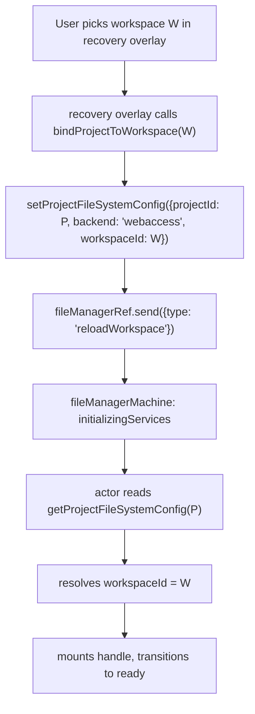

# FM Workspace Binding Scope

Diagnose a critical workspace cross-contamination bug exposed by the FM machine's recently-introduced self-persist branch, re-frame the eigenquestion, and propose an architectural fix that eliminates the class of "workspace leaks across project navigations" bugs by removing ambient `activeWorkspaceId` from the FM machine and making project↔workspace bindings live in exactly one persistent place.

## Executive Summary

A user-reported reproduction corrupts an IndexedDB project's `ProjectFileSystemConfig` whenever the user navigates "indexeddb project → webaccess project → back to indexeddb project". Root cause: the `fileManagerMachine.context.activeWorkspaceId` field is ambient (lives on the long-lived FM actor) and is **not** reset when `setRoot` changes the project. The self-persist branch in `initializeServicesActor` reads that stale field and writes the previous project's webaccess `workspaceId` onto the current (indexeddb) project — corrupting its persistent config, breaking its file mount, and showing the wrong backend in the details pane.

The architectural defect is dual ownership of "which workspace does this project belong to": the persistent answer lives in `ProjectFileSystemConfig.workspaceId`; an ambient mirror lives in `fileManagerMachine.context.activeWorkspaceId`. The two sources drift because the FM actor outlives the project route, and the self-persist branch promotes the drift to a persisted write.

The eigenquestion driving the current shape is mis-framed as "how does the FM machine remember which workspace the user picked?" — which forces ambient state in the machine and selective resets at every transition (and we missed one). The correct frame is "who owns the project↔workspace binding, and what is the protocol for changing it?" — which puts the binding in `ProjectFileSystemConfig` only, makes the machine a pure projection, and turns "switch workspace" into a _binding transaction_ (write config, then reload) instead of an ambient state mutation.

Recommendation: **adopt Approach D (binding transaction)**. Delete `activeWorkspaceId`/`activeWorkspaceName` as long-lived FM context fields; resolve them purely from the freshly-read `ProjectFileSystemConfig` per init. Replace the `setActiveWorkspace(workspaceId)` event with a `bindProjectToWorkspace({ projectId, workspaceId })` _caller-side helper_ that writes `setProjectFileSystemConfig` then sends a `reloadWorkspace` event. The actor becomes a pure projection: `(projectId) → (config) → (handle) → mounted services`. No ambient state, no self-persist branch, no cross-project leakage by construction. Mirrors the unified-contract pattern from `chat-composer-context-unification`.

## Problem Statement

### Reproduction

1. Open Settings → Filesystem and set **IndexedDB** as the default backend.
2. From the homepage, remix a community project. The editor loads at `/projects/A`; the details pane shows backend = `IndexedDB`. **Correct.**
3. Without closing the tab, open a project that uses a **File System (webaccess)** backend at `/projects/B`. The details pane shows backend = `File System` and the workspace name. **Correct.**
4. Use the browser back button (or nav history) to return to `/projects/A`.

**Expected:** Project A loads, the OpenSCAD model renders, the file tree shows `main.scad`, the details pane shows backend = `IndexedDB`.

**Actual (see images 1–3):**

- The viewer is blank (nothing renders).
- The file tree shows the webaccess workspace's directory contents (e.g. `Tau`, `node_modules`, the wrong `main.scad`) — not project A's IndexedDB files.
- The details pane shows backend = `File System` with the _other_ project's workspace name.
- Inspecting IDB confirms `configs[A]` has been rewritten to `{ backend: 'webaccess', workspaceId: 'wsp_B' }`. Project A's original `{ backend: 'indexeddb' }` config is destroyed.

The corruption persists across refreshes — `configs[A]` is the persistent record, so subsequent loads of project A continue to mount the wrong workspace.

### Recent surface area in scope

The FM machine grew an actor-level self-persist branch (`persistActiveWorkspaceBinding`) in [`apps/ui/app/machines/file-manager.machine.ts`](apps/ui/app/machines/file-manager.machine.ts) as part of the filesystem-workspaces foundation work. That branch is the proximate trigger; the underlying defect is older (the ambient `activeWorkspaceId` field has been on the FM context since the multi-workspace refactor). The bug only surfaces when the two interact: ambient state outlives a project, then the self-persist branch turns the leak into a persistent write.

## Methodology

- Traced the `RouteProvider` mount lifecycle via [`apps/ui/app/components/layout/page.tsx`](apps/ui/app/components/layout/page.tsx) (`Compose` + `useTypedMatches` resolving `handle.providers` from the route match stack) and the project route's `handle.providers` entry in [`apps/ui/app/routes/projects_.$id/route.tsx`](apps/ui/app/routes/projects_.$id/route.tsx).
- Read the FM actor lifecycle in [`apps/ui/app/machines/file-manager.machine.ts`](apps/ui/app/machines/file-manager.machine.ts) — the `setRoot` event, `updateRootAndReset` action, `initializeServicesActor`, and the `persistActiveWorkspaceBinding` helper.
- Inventoried every call site of `setActiveWorkspace` and every reader of `activeWorkspaceId` / `activeWorkspaceName` from `useFileManager()` to determine what the consumer surface actually needs.
- Cross-referenced with [`docs/research/chat-composer-context-unification.md`](docs/research/chat-composer-context-unification.md) — the parallel of "ambient host state that should have been a per-event contract" is identical in shape.
- Verified with a step-trace of the user's reproduction that `context.activeWorkspaceId` retains the previous project's value through the `setRoot → connectingWorker → initializingServices` transition.

## Findings

### Finding 1: A single FM actor instance is reused across project navigations

The project route's `RouteProvider` is module-scoped:

```31:42:apps/ui/app/routes/projects_.$id/route.tsx
function RouteProvider({ children }: { readonly children?: React.ReactNode }): React.JSX.Element {
  const { id } = useParams();
  return (
    <SharedWorkerGate>
      <FileManagerProvider projectId={id} rootDirectory={`/projects/${id}`}>
        ...
```

`Compose` in [`apps/ui/app/components/layout/page.tsx`](apps/ui/app/components/layout/page.tsx) mounts `RouteProvider` once for the project-route match. When the user navigates from `/projects/A` to `/projects/B`, React keeps the same component instance — only `projectId` and `rootDirectory` change as props. The `useActorRef(fileManagerMachine, ...)` inside `FileManagerProvider` is therefore the **same actor instance** across both routes. The actor is told about the navigation via the `setRoot` event:

```179:181:apps/ui/app/hooks/use-file-manager.tsx
useEffect(() => {
  fileManagerRef.send({ type: 'setRoot', path: rootDirectory, projectId });
}, [fileManagerRef, rootDirectory, projectId]);
```

This is intentional (sharing the worker, the SAB filepool, and the bridge is expensive to tear down per navigation). It is also the _enabling condition_ for the bug: the actor's context survives the project transition.

### Finding 2: `setRoot`/`updateRootAndReset` resets the project scope but not the workspace scope

The action that processes `setRoot`:

```516:526:apps/ui/app/machines/file-manager.machine.ts
updateRootAndReset: assign({
  rootDirectory({ event }) {
    assertEvent(event, 'setRoot');
    return event.path;
  },
  projectId({ event }) {
    assertEvent(event, 'setRoot');
    return event.projectId;
  },
  error: undefined,
}),
```

`rootDirectory`, `projectId`, and `error` are reset. `activeWorkspaceId`, `activeWorkspaceName`, `unavailableReason`, and `backendType` are NOT. They carry the **previous project's** values into the next `initializingServices` run. The shape is consistent across the other `setRoot` handlers in the machine — none of them touch workspace fields.

### Finding 3: The self-persist branch reads stale ambient state and writes it to the new project

The smoking gun is in `persistActiveWorkspaceBinding`:

```245:269:apps/ui/app/machines/file-manager.machine.ts
const persistActiveWorkspaceBinding = async (options: {
  context: FileManagerContext;
  projectConfig: ProjectConfigLookup;
  backend: FileSystemBackend;
  signal: AbortSignal;
}): Promise<{ projectConfig: ProjectConfigLookup; backend: FileSystemBackend }> => {
  const { context, projectConfig, backend, signal } = options;
  if (
    !context.projectId ||
    !context.activeWorkspaceId ||
    (projectConfig?.backend === 'webaccess' && projectConfig.workspaceId === context.activeWorkspaceId)
  ) {
    return { projectConfig, backend };
  }

  signal.throwIfAborted();
  const persisted: ProjectFileSystemConfig = {
    projectId: context.projectId,
    backend: 'webaccess',
    workspaceId: context.activeWorkspaceId,
  };
  await setProjectFileSystemConfig(persisted);
  return { projectConfig: persisted, backend: 'webaccess' };
};
```

The guard checks for "non-empty `activeWorkspaceId` that differs from the project's persisted binding". After a `setRoot` to project A (indexeddb), `context.activeWorkspaceId` is `wsp_B` (leaked from project B) and `projectConfig?.backend === 'indexeddb'` (so the third clause of the guard short-circuits to "guard is FALSE — write"). The block executes: it writes `{ projectId: A, backend: 'webaccess', workspaceId: wsp_B }` to IDB and reassigns local `projectConfig`/`backend` so the rest of the actor proceeds as if project A were webaccess. **Project A's persistent binding is now corrupted.**

The branch was designed for one use case: the recovery overlay dispatches `setActiveWorkspace(workspaceId)` while the same project is in scope; the actor re-inits and writes the new binding to that project's config row. The branch can't tell the difference between "user just picked a workspace for _this_ project" and "the previous project's workspace is still in my context".

### Finding 4: `setActiveWorkspace` is a project-scoped intent but a workspace-only event

The event signature carries the _workspace_ identity but not the _project_ identity it applies to:

```445:445:apps/ui/app/machines/file-manager.machine.ts
| { type: 'setActiveWorkspace'; workspaceId: string };
```

There is no way for the actor — or the action that applies the event to context — to verify that the event came from a caller who was looking at the same project that the machine is currently bound to. The recovery overlay does call `setActiveWorkspace` from inside the project route (so when it's dispatched, the actor's `projectId` matches the caller's intent), but the _effect_ of the dispatch — setting `context.activeWorkspaceId` — outlives the dispatch site. Any subsequent project navigation reuses that effect.

In other words: the event has the wrong scope label. It says "set the active workspace" (process-scoped) when the user meant "bind _this project I'm looking at_ to _this workspace_" (project-scoped, transactional).

### Finding 5: Dual ownership of "which workspace does this project belong to"

There are two persistent stores that purport to know which workspace a project is bound to:

| Source                                                  | Lifecycle      | Authority                                                 |
| ------------------------------------------------------- | -------------- | --------------------------------------------------------- |
| `configs[projectId].workspaceId` (IDB)                  | Persistent     | The persistent answer — survives reloads, tabs, etc.      |
| `fileManagerMachine.context.activeWorkspaceId` (XState) | FM-actor scope | An ambient mirror that should equal the above per project |

When they agree, all is well. When they disagree — which they do, by construction, the moment the actor outlives a project — the actor's self-persist branch makes the IDB row "catch up" to the ambient mirror. This is exactly the wrong direction of authority: the **persistent record** should be the source of truth, with the ambient field (if it exists at all) being derived per project init.

### Finding 6: The ambient `activeWorkspaceName` field has the same scope flaw, but the consumer surface is narrow

Only two consumers read `activeWorkspaceName` / `activeWorkspaceId` from `useFileManager()`:

| File                                                                                                                                   | What it reads                                                 |
| -------------------------------------------------------------------------------------------------------------------------------------- | ------------------------------------------------------------- |
| [`apps/ui/app/routes/projects_.$id/chat-details.tsx`](apps/ui/app/routes/projects_.$id/chat-details.tsx)                               | `activeWorkspaceName` (label only)                            |
| [`apps/ui/app/routes/projects_.$id/project-unavailable-overlay.tsx`](apps/ui/app/routes/projects_.$id/project-unavailable-overlay.tsx) | `activeWorkspaceId` + `activeWorkspaceName` for recovery copy |

Both consumers are inside the project route. Both are happy with values _derived per project init_ — they don't need a long-lived "the most recent workspace anyone touched" mirror. This makes Finding 5's fix cheap: the ambient field can be downgraded to a per-init output (a context value set only by `updateBackendFromInit`, and explicitly cleared on `setRoot`) without any consumer rewrites.

## Eigenquestion Re-framing

The current shape's implicit eigenquestion:

> "How does the FM machine remember which workspace the user picked?"

This question forces ambient state. To answer it, every transition that _might_ change which workspace is relevant has to know to reset the ambient mirror — and we forgot to reset on `setRoot`. The reset list grows monotonically with every new event type, every new state, every new actor branch. The bug class is "we forgot to reset X on transition Y".

The architecturally correct eigenquestion:

> "Who owns the project↔workspace binding, and what is the protocol for changing it?"

This question forces a single source of truth (the persisted `ProjectFileSystemConfig.workspaceId`) and a single protocol (write the config, then reload). The FM machine becomes a _projection_ of (project → config → handle); ambient state is unnecessary. Cross-project leakage is impossible by construction because no machine context field outlives the per-init read.

This is the same shape as the `chat-composer-context-unification` re-framing: dual-mode complexity that was sprawled across consumers got absorbed by the providers when the contract was re-defined.

## Options Compared

### A — Status quo (ambient state + self-persist + selective resets)

Keep `activeWorkspaceId`/`activeWorkspaceName` on the FM context. Keep the self-persist branch. Patch every event/state that might leak across projects to reset workspace fields. Today this means `updateRootAndReset` (the immediate fix) plus any new transition that's added later.

### B — Band-aid: reset workspace fields in `updateRootAndReset`

Add `activeWorkspaceId: undefined`, `activeWorkspaceName: undefined`, `unavailableReason: undefined`, `backendType: <reset>` to `updateRootAndReset`. The leak is patched for the navigation path. The self-persist branch stays.

### C — Scope `setActiveWorkspace` events explicitly

Change the event signature to `{ type: 'setActiveWorkspace'; projectId: string; workspaceId: string }`. `applyActiveWorkspace` ignores the event when `event.projectId !== context.projectId` (the user dispatched it from a project that's no longer active). The self-persist branch additionally guards on `context.projectId === event.projectId`. Keeps ambient state but makes events self-validating.

### D — Binding transaction (no ambient workspace state)

Delete `activeWorkspaceId` and `activeWorkspaceName` as long-lived context fields. The machine still surfaces them in selectors, but they're populated only by `updateBackendFromInit` (per-init output of the actor) and cleared by `updateRootAndReset`. The self-persist branch is deleted. Replace the `setActiveWorkspace` event with a caller-side helper:

```ts
// New surface on useFileManager() — replaces setActiveWorkspace
bindProjectToWorkspace: (workspaceId: string) => Promise<void>;
```

```ts
// Implementation inside useFileManager
const bindProjectToWorkspace = useCallback(
  async (workspaceId: string) => {
    if (!projectId) {
      throw new Error('bindProjectToWorkspace called outside a project route');
    }
    await setProjectFileSystemConfig({ projectId, backend: 'webaccess', workspaceId });
    fileManagerRef.send({ type: 'reloadWorkspace' });
  },
  [projectId, fileManagerRef],
);
```

The recovery overlay calls `bindProjectToWorkspace(picked)` instead of `setActiveWorkspace(picked)`. The machine event becomes `{ type: 'reloadWorkspace' }` (no payload — the actor re-reads `projectConfig` from IDB on every init, which is the new single source of truth). `initializeServicesActor` collapses to:

```ts
const projectConfig = context.projectId ? await getProjectFileSystemConfig(context.projectId) : undefined;
const backend = projectConfig?.backend ?? context.backendType;
if (backend === 'webaccess') {
  const workspaceId = projectConfig?.backend === 'webaccess' ? projectConfig.workspaceId : undefined;
  const entry = workspaceId ? await getWorkspace(workspaceId) : undefined;
  if (!entry) return { type: 'webAccessUnavailable', reason: 'missing' /* ... */ };
  /* ... */
}
```

No `context.activeWorkspaceId` reference, no second-clause fallback, no self-persist mutation. The recovery overlay's "pick" persists _before_ the machine re-runs, so the next read sees the right binding by construction.

### Comparison

| Dimension                                                  | A (status quo)                   | B (reset in `setRoot`)           | C (scoped events)                | D (binding transaction)   |
| ---------------------------------------------------------- | -------------------------------- | -------------------------------- | -------------------------------- | ------------------------- |
| Fixes the reported repro                                   | no                               | yes                              | yes                              | yes                       |
| Sources of truth for "project's workspace"                 | 2                                | 2                                | 2                                | 1                         |
| Branches in `initializeServicesActor`                      | self-persist + 2-clause fallback | self-persist + 2-clause fallback | self-persist + 2-clause fallback | none                      |
| Number of context fields that must be reset on transitions | 4                                | 4                                | 4                                | 0                         |
| Future-proof against new events/states leaking workspace   | weak                             | medium                           | medium                           | strong (by construction)  |
| Implementation surface (LOC delta)                         | +0                               | +4                               | +12                              | −40                       |
| Consumer rewrites                                          | none                             | none                             | recovery overlay (1 line)        | recovery overlay (1 line) |
| Conceptual axes ("workspace identity")                     | 2 (persistent + ambient)         | 2                                | 2                                | 1 (persistent only)       |
| Aligns with "binding is persistent state, not actor state" | weak                             | weak                             | weak                             | strong                    |

D wins on every axis except status-quo conservatism. B is the minimal patch; C is the half-step (events know their scope); D is the architectural endpoint that closes the class.

## Recommendation

Adopt **Approach D (binding transaction)**.

The persistent `ProjectFileSystemConfig.workspaceId` is the only correct authority for "which workspace does this project belong to". The FM machine is a downstream projection of that authority. Mirroring the workspace identity into machine context (a) creates a second authority that drifts, (b) requires selective resets at every transition to stay consistent, and (c) gave the self-persist branch the wrong target. Removing the mirror eliminates all three issues by construction.

### Target shape



The flow has one direction: caller writes the persistent record, then asks the machine to re-read. The machine cannot disagree with the record because it has nothing of its own to disagree with.

### Concrete changes

**1. Machine context** ([`apps/ui/app/machines/file-manager.machine.ts`](apps/ui/app/machines/file-manager.machine.ts)).

Keep `activeWorkspaceId` and `activeWorkspaceName` as context fields (consumers still need to read them for labels/recovery copy), but make them strictly _outputs_ of `initializeServicesActor`. Reset both to `undefined` in `updateRootAndReset` so they cannot survive a project navigation. Delete `persistActiveWorkspaceBinding` entirely. The actor's resolution chain collapses to one clause:

```ts
const requestedWorkspaceId = projectConfig?.backend === 'webaccess' ? projectConfig.workspaceId : undefined;
```

The `context.activeWorkspaceId` fallback is removed.

**2. Event surface** ([`apps/ui/app/machines/file-manager.machine.ts`](apps/ui/app/machines/file-manager.machine.ts)).

Replace `{ type: 'setActiveWorkspace'; workspaceId: string }` with `{ type: 'reloadWorkspace' }`. The new event has no payload — its only job is to drive the machine back into `initializingServices` so the actor re-reads `projectConfig`. `applyActiveWorkspace` is deleted; the transition uses a noop action (or just `clearError`) and the same `stopPolling` step.

The state transitions stay the same — `ready / webAccessUnavailable / error` all accept `reloadWorkspace` and target `initializingServices`. `setRoot` still wins guard-wise because root/projectId changes route through `connectingWorker` first.

**3. Provider surface** ([`apps/ui/app/hooks/use-file-manager.tsx`](apps/ui/app/hooks/use-file-manager.tsx)).

Replace `setActiveWorkspace(workspaceId: string): void` with:

```ts
bindProjectToWorkspace: (workspaceId: string) => Promise<void>;
```

The implementation reads `projectId` from the provider's scope (it's already known — `useParams().id` flows in as a prop). It writes `setProjectFileSystemConfig` and dispatches `reloadWorkspace` only after the write resolves, so the actor's next read sees the new binding. Telemetry stays at the provider edge (same `workspaceSwap` emission, with the now-validated scope).

**4. Recovery overlay** ([`apps/ui/app/routes/projects_.$id/workspace-unavailable-recovery.tsx`](apps/ui/app/routes/projects_.$id/workspace-unavailable-recovery.tsx)).

Three callers update one line each:

| Before                                       | After                                                  |
| -------------------------------------------- | ------------------------------------------------------ |
| `setActiveWorkspace(workspaceId);`           | `await bindProjectToWorkspace(workspaceId);`           |
| `setActiveWorkspace(workspace.workspaceId);` | `await bindProjectToWorkspace(workspace.workspaceId);` |
| `setActiveWorkspace(pickedWorkspaceId);`     | `await bindProjectToWorkspace(pickedWorkspaceId);`     |

The overlay already manages `isBusy` around the picks, so the new `await` fits naturally inside the existing try/finally.

**5. Tests** ([`apps/ui/app/machines/file-manager.machine.test.ts`](apps/ui/app/machines/file-manager.machine.test.ts)).

- Delete the "persists a new workspaceId and recovers when setActiveWorkspace is dispatched" case — the contract no longer exists at the machine level.
- Delete the "does not re-persist when project config already matches" case — same reason.
- Add: "cross-project navigation — actor reads fresh `projectConfig` per init, does not reference prior workspace fields". Repro the user's scenario (indexeddb → webaccess → indexeddb) via three `setRoot` events with three `getProjectFileSystemConfig` mocks; assert `setProjectFileSystemConfig` is **never** called from the machine and that `configs[A]` (the mock) remains `{ backend: 'indexeddb' }` after the round-trip.
- Add: "`reloadWorkspace` re-reads config and transitions to ready when the persistent record changes". Mock `getProjectFileSystemConfig` to return different values across the two calls; dispatch `reloadWorkspace` between them.

**6. Policy update** ([`docs/policy/filesystem-policy.md`](docs/policy/filesystem-policy.md)).

Rule 13b tightens to:

> The FM machine MUST NOT carry "the active workspace" as ambient context. `activeWorkspaceId` and `activeWorkspaceName` may exist as per-init outputs of `initializeServicesActor` but MUST be cleared by `updateRootAndReset` (or any equivalent project-transition action). Workspace binding changes are _binding transactions_ — callers persist `ProjectFileSystemConfig` first, then dispatch `reloadWorkspace`. The machine MUST NOT mutate `ProjectFileSystemConfig` directly.

## Trade-offs

### Wins

- **Eliminates the bug class by construction.** No transition can leak workspace identity across projects because the machine doesn't _have_ lasting workspace identity.
- **One source of truth.** Persistent record is the only authority; the actor is a pure projection.
- **Simpler actor.** Self-persist branch (~25 LOC + helper) deleted; resolution chain collapses to one clause.
- **Safer event surface.** `reloadWorkspace` (no payload) can't be misused — there's nothing to get wrong.
- **Easier reasoning.** "What is project P's workspace?" has exactly one answer: read `configs[P]`.

### Losses / risks

- **Caller must `await` the write.** The recovery overlay's three call sites gain an `await` (they already manage `isBusy`, so this fits naturally).
- **One IDB write per workspace pick.** No change in cost from today — the self-persist branch was already doing the write; we're just moving it from the actor to the caller, before the dispatch.
- **No more "swap workspaces without committing" path.** This was never a real product feature — the old `setActiveWorkspace` always intended to persist; the self-persist branch was the (broken) implementation. Approach D makes the intent explicit.
- **Loses the "machine knows the user's preferred workspace" abstraction.** There was no consumer that relied on this — `activeWorkspaceName` is always per-project and resolves from the per-init read.

### Why not Approach B (the band-aid)

B fixes the immediate repro but leaves the dual-ownership defect in place. The next event or state that touches workspace identity (planned Phase 10 per-project switcher; future cross-tab sync) will hit the same class of bug. Every new contributor adding a state has to remember to reset four context fields. The cost of D over B is one provider rewrite and three call-site changes — cheap for the architectural payoff.

### Why not Approach C (scoped events)

C makes `setActiveWorkspace` self-validating but keeps the ambient mirror. The mirror still needs selective resets at every transition; the actor still has a self-persist branch keyed on the mirror. C is strictly worse than D: more code, same number of authorities, same number of resets to remember.

## Parallel to Chat Composer

The chat composer doc identified that runtime branching was sprawled across N consumers because the providers split their contract. The fix was to make each provider fully populate a unified contract, so consumers read one hook and don't branch on provider identity.

The FM workspace bug has the same shape, with the roles inverted:

| Dimension                  | Chat composer (recent doc)                      | FM workspace (this doc)                                            |
| -------------------------- | ----------------------------------------------- | ------------------------------------------------------------------ |
| Where the branch lived     | In each consumer (`useOptional*`, `useActive*`) | In the actor (`persistActiveWorkspaceBinding` + 2-clause fallback) |
| Number of authorities      | N consumer-side branches                        | 2 (persistent config + ambient context)                            |
| Architectural endpoint     | One unified contract; providers fulfil it       | One persistent source of truth; the machine projects it            |
| What gets deleted          | `useOptional*` helpers + per-consumer branches  | `activeWorkspaceId` ambient state + self-persist branch            |
| Caller-side responsibility | None — providers carry the dual-mode decision   | Bind transactionally — caller writes config, then reloads          |

Same lesson: when a piece of state is conceptually owned by one place (the provider; the persistent record), forcing it through intermediaries (the consumers; the actor's ambient context) creates the bug class.

## Migration Sequence

1. **Add `bindProjectToWorkspace` to `useFileManager`.** Implementation writes `setProjectFileSystemConfig` then dispatches a new `reloadWorkspace` event. Leave `setActiveWorkspace` in place for the moment.
2. **Add `reloadWorkspace` to the machine.** Transitions out of `ready` / `webAccessUnavailable` / `error` to `initializingServices`. Action is just `clearError` + `stopPolling`. Tests cover the transition.
3. **Migrate the recovery overlay** to call `bindProjectToWorkspace` instead of `setActiveWorkspace`. One line per call site, three sites.
4. **Delete `setActiveWorkspace`** from the machine event union, the provider surface, and `applyActiveWorkspace` action. Delete the corresponding state transitions.
5. **Delete `persistActiveWorkspaceBinding`** helper and remove its call from `initializeServicesActor`. Collapse the resolution chain to a single clause.
6. **Add `activeWorkspaceId`/`activeWorkspaceName` resets** to `updateRootAndReset` (defence in depth — even though no ambient mutation path exists post-D, the fields are now per-init outputs and should not survive a project change).
7. **Update tests.** Delete the two self-persist tests; add the cross-project navigation test and the `reloadWorkspace` re-read test.
8. **Update policy doc.** Rule 13b text per the recommendation.
9. **Run `pnpm nx typecheck ui`, `pnpm nx lint ui`, and the targeted vitest suites.** Manual smoke per the validation checklist below.

### Validation checklist

- [ ] Reproduction (indexeddb → webaccess → back to indexeddb) leaves `configs[A]` unchanged.
- [ ] DevTools → IndexedDB → `configs` table inspection after the round-trip confirms `{ backend: 'indexeddb' }` for project A.
- [ ] Project A's viewer renders correctly, file tree shows `main.scad`, details pane shows `IndexedDB`.
- [ ] Recovery overlay flow still works (pick another workspace → editor re-mounts → refresh → silent reload because the persistent record is updated).
- [ ] `setActiveWorkspace` is no longer exported from `useFileManager()` (typecheck enforced).
- [ ] `pnpm nx test ui app/machines/file-manager.machine.test.ts --watch=false` passes.
- [ ] `pnpm docs:validate` passes.

## Out of Scope

- The Phase 10 per-project workspace switcher (still deferred). When it lands, it will use `bindProjectToWorkspace` like the recovery overlay — same single binding-transaction path.
- IDB schema bump. The fix is purely at the machine + provider level; the persistent record format doesn't change.
- Cross-tab sync (a second tab changing the default workspace shouldn't affect an already-bound project — that's already enforced by the persistent record being per-project).

## References

- Bug introduced by: filesystem-workspaces foundation work, specifically the `persistActiveWorkspaceBinding` helper in [`apps/ui/app/machines/file-manager.machine.ts`](apps/ui/app/machines/file-manager.machine.ts) (lines 243–293).
- Parallel re-framing: [`docs/research/chat-composer-context-unification.md`](docs/research/chat-composer-context-unification.md).
- Policy: [`docs/policy/filesystem-policy.md`](docs/policy/filesystem-policy.md) Rule 13b — needs tightening per the recommendation.
- Original audit that introduced multi-workspace: [`docs/research/filesystem-access-api-cohesion-audit.md`](docs/research/filesystem-access-api-cohesion-audit.md) (now superseded).
