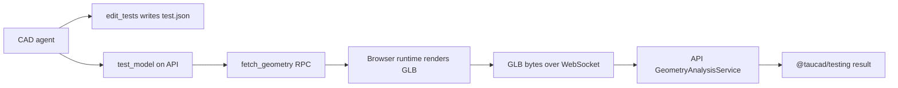
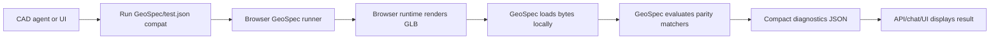
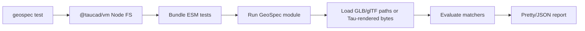

# GeoSpec Activation Parity Roadmap

Point-in-time activation plan for moving GeoSpec from a working package and runner proof-of-concept into the live Tau testing path, with strict parity to the current `test.json` feature set and no new geometry check vocabulary in this slice.

## Executive Summary

GeoSpec is present in `packages/geospec`, `@taucad/testing` delegates core mesh loading/analyzer ownership in that direction, and the CAD agent now teaches `*.geospec.{ts,js}` as the primary test authoring path. The first activation slice also adds VM package-import resolution for `#params/*.json`, Tau parameter helpers in `@taucad/testing/tau`, a generic `geospec` Node CLI entry, and a GeoSpec-first `test_model` API path that falls back to legacy `test.json` when no GeoSpec files exist.

The remaining work is not to add more geometry checks. The right activation target is exact parity with today's `test.json` behavior: per-file requirements, `boundingBox`, `connectedComponents`, `watertight`, spatial diagnostics, parameter provenance, and deterministic execution in both Node and the browser. Browser-local execution is still the highest-leverage remaining change for large files: the browser already owns the rendered GLB bytes, so the API should receive compact test results, not geometry payloads. Until the browser-local RPC lands, the API-side GeoSpec path is an activation bridge and still uses `fetch_geometry` for rendered GLB bytes.

The Fumadocs `.source` and `tsconfig.app.json` pattern is useful as a warning, not as the target. TypeScript path aliases are editor-only, and generated parameter wrapper modules are unnecessary because Tau already stores the canonical source of truth in real JSON files. The better target is a standard project `package.json#imports` mapping from `#params/*.json` to `.tau/parameters/*.json`, with `@taucad/vm` implementing the same `#` package-import resolution for Node and browser VM execution.

Recommended parameter DX: import the real parameter file as a JSON default export and resolve it with `@taucad/testing/tau` helpers. Do not teach `import { values } from '#params/...'`: Tau parameter files do not top-level export `values`, and native JSON modules only expose a default export. The project runtime truth is `package.json#imports`, not `tsconfig.paths`.

## Scope And Non-Goals

In scope:

- Identify the remaining steps to activate GeoSpec in Tau.
- Preserve current `test.json` semantic parity.
- Recommend a Node CLI path for running tests outside the Tau UI.
- Recommend a browser-local runner path that avoids sending GLB/geometry bytes to the API.
- Evaluate whether project `package.json#imports` can expose existing parameter files to tests without generated parameter modules.

Out of scope for this activation slice:

- Adding new public geometry check types beyond `boundingBox`, `connectedComponents`, and `watertight`.
- STEP/AP242, B-rep, mate, volumetric, wall-thickness, chamfer-distance, and topology-sidecar work.
- Introducing a Tau runtime `GeometryArtifact` contract. The runtime should continue producing geometry bytes/files such as GLB/glTF and later STEP; GeoSpec loads those bytes/files.
- Replacing all `test.json` compatibility affordances immediately.

## Methodology

Source files audited:

| Area                                | Files                                                                                                                                              |
| ----------------------------------- | -------------------------------------------------------------------------------------------------------------------------------------------------- |
| CAD agent prompt                    | `apps/api/app/api/chat/prompts/cad-agent.prompt.ts`, `packages/testing/src/prompt-examples.ts`                                                     |
| Current test execution              | `apps/api/app/api/tools/tools/tool-test-model.ts`, `apps/api/app/api/analysis/geometry-analysis.service.ts`, `packages/testing/src/schemas.ts`     |
| Geometry RPC                        | `libs/chat/src/rpc/handlers/handle-fetch-geometry.ts`, `libs/chat/src/schemas/rpc.schema.ts`, `apps/ui/app/hooks/rpc-handlers.ts`                  |
| GeoSpec package                     | `packages/geospec/package.json`, `packages/geospec/src/index.ts`, `packages/geospec/src/runner/*`, `packages/geospec/src/mesh/*`                   |
| VM substrate                        | `packages/vm/src/index.ts`, `packages/vm/src/types.ts`, `packages/runtime/src/bundler/esbuild.bundler.ts`                                          |
| Parameter storage/runtime           | `apps/ui/app/utils/parameter-config.utils.ts`, `apps/ui/app/middleware/parameter-file-resolver.middleware.ts`, `apps/ui/app/hooks/use-project.tsx` |
| Fumadocs generated-module precedent | `apps/ui/tsconfig.app.json`, `apps/ui/.source/server.ts`, `apps/ui/vite.config.ts`                                                                 |
| CLI precedent                       | `packages/cli/package.json`, `packages/cli/src/bin.ts`, `packages/cli/src/commands/export.ts`                                                      |

Related research reviewed:

- `docs/research/geospec-standalone-cad-testing-blueprint.md`
- `docs/research/vitest-style-parameter-geometry-testing-blueprint.md`
- `docs/research/browser-first-parameter-aware-testing.md`
- `docs/research/multi-file-test-json-migration.md`
- `docs/research/mesh-continuity-test-semantics.md`

## Findings

### Finding 1: The live CAD agent still writes `test.json`, not GeoSpec files

The workflow in `apps/api/app/api/chat/prompts/cad-agent.prompt.ts` still says:

- use `edit_tests` to define measurement requirements in `test.json`
- use `test_model` to validate all requirements
- list each source file as a top-level key in `test.json`

`packages/testing/src/prompt-examples.ts` includes GeoSpec parameter-testing copy, but it is currently advisory text inside the same `<test_requirements>` block. It does not change the active tool flow. The real active tools are still:

- `edit_tests`, which only edits `test.json`
- `test_model`, which only reads `test.json`

Implication: before the prompt can make GeoSpec the primary authoring surface, the runtime/tool path needs to run GeoSpec files or a GeoSpec-backed `test.json` compatibility mode. Prompt copy alone would teach a workflow the tools cannot execute.

### Finding 2: GeoSpec exists but the runner is collection-only

`packages/geospec` currently exposes the intended top-level DX:

```ts
import { describe, expectGeo, it, test } from 'geospec';
```

It also exposes the intended subpaths:

- `geospec/config`
- `geospec/mesh`
- `geospec/runner`

The runner proof-of-concept registers `geospec` as a VM builtin and executes an ESM test module through `@taucad/vm`. It supports `describe`, `it`, `test`, `skip`, async failures, repeated execution, and bundle dependency reporting.

The missing activation piece is matcher evaluation. Today `expectGeo(subject).toHaveBoundingBox(min, max)` records a `GeoSpecAssertion`; it does not evaluate the loaded `GeometrySubject`, mark the assertion failed, or produce the same structured diagnostic payload as `test.json`.

For parity, GeoSpec needs the current three checks as real matchers:

```ts
expectGeo(subject).toHaveBoundingBox({
  size: { x: 100 },
  center: { y: 0 },
  tolerance: 1,
});

expectGeo(subject).toHaveConnectedComponents({ count: 1, tolerance: 0.1 });

expectGeo(subject).toBeWatertight();
```

The existing min/max form can remain as a convenience, but parity with `test.json` requires `size` and `center` semantics because those are the agent-facing fields.

### Finding 3: Current `test_model` sends GLB bytes to the API

The live path is:

1. `test_model` reads `test.json` through browser filesystem RPC.
2. For each target file, the API calls `fetch_geometry`.
3. The browser renders or resolves the requested geometry unit and returns `{ glb: Uint8Array }`.
4. The API optionally writes a GLB artifact.
5. The API calls `GeometryAnalysisService.runMeasurementTests`.
6. `GeometryAnalysisService` calls `@taucad/testing/geometry` functions.

This is correct for the current API-centered tool architecture, but it is the wrong direction for large files. The browser already has the project filesystem, the active runtime, and the rendered GLB bytes. Sending geometry bytes over the WebSocket to the API only to parse and test them there adds latency, memory pressure, transfer limits, and unnecessary artifact churn.

The current code even encodes the size pressure: `apps/api/app/api/websocket/redis-io.adapter.ts` raises Socket.IO payload limits to accommodate binary GLB geometry.

Activation target: `test_model` should ask the browser to run tests locally and return compact results. It should not ask the browser to send GLB bytes to the API for normal interactive sessions.

### Finding 4: Browser-local GeoSpec is feasible with the current substrate

The reusable pieces already exist:

- `@taucad/vm` provides an environment-neutral esbuild-backed module VM.
- The Tau UI already has runtime clients that render geometry in the browser.
- `apps/ui/app/hooks/rpc-handlers.ts` can resolve a `targetFile` to a geometry unit and read the GLB geometry from the CAD snapshot.
- `geospec/mesh` can load GLB bytes, browser `Blob`/`File`, and in-memory mesh buffers.
- GeoSpec runner modules execute ESM through a virtual filesystem and registered builtins.

The browser runner should live in a worker or runtime-adjacent execution context, not the API. It should transfer bytes within the browser process when needed, then discard them after producing GeoSpec diagnostics.

For chat tooling, the API can still own the LangGraph tool call, but the heavy operation should move behind a new browser-side RPC:

```ts
run_geospec_tests({
  mode: 'test-json-compat' | 'geospec',
  entryFiles?: string[],
  testFiles?: string[],
})
```

The result should be compact JSON:

```ts
{
  success: true,
  passed: 4,
  total: 5,
  failures: [...],
  passes: [...],
  diagnostics: [...],
  testedFiles: ['main.ts'],
}
```

No GLB payload crosses the API boundary in the common browser-connected case.

### Finding 5: Node CLI requires two layers, not one

There are two different CLI needs:

| Need                        | Owner                                                                     | Reason                                                                                                                        |
| --------------------------- | ------------------------------------------------------------------------- | ----------------------------------------------------------------------------------------------------------------------------- |
| Generic GeoSpec test runner | `geospec` bin                                                             | Standalone package should run ESM GeoSpec tests over direct GLB/glTF files and in-memory fixtures without Tau.                |
| Tau project test runner     | `taucad test` or `@taucad/testing` adapter invoked by `geospec.config.ts` | Rendering `main.ts` into GLB requires Tau runtime and Tau parameter files, which should not become GeoSpec core dependencies. |

Recommended command split:

```bash
geospec test
geospec test "tests/**/*.geospec.ts" --reporter=pretty
geospec test --reporter=json
```

For Tau projects:

```bash
taucad test
taucad test main.geospec.ts --parameters=all
```

or equivalently a GeoSpec config that registers the Tau adapter:

```ts
import { defineGeoSpecConfig } from 'geospec/config';
import { tauProject } from '@taucad/testing/geospec';

export default defineGeoSpecConfig({
  adapters: [tauProject()],
});
```

The important boundary is that `geospec` owns the runner and reporters, while `@taucad/testing` owns Tau rendering, `.tau/parameters` interpretation, and legacy `test.json` compatibility.

That boundary also answers how parameter imports work outside the browser. The Node process has access to the project filesystem, and `@taucad/vm` resolves `#params/*.json` through the project's real `package.json#imports` mapping. There is no browser-only dependency and no generated parameter module.

```ts
const vm = await createEsbuildModuleVm({ filesystem, projectPath });

vm.registerModule('geospec', {
  version: geospecVersion,
  code: geospecBuiltinCode,
});

const bundle = await vm.bundle('/project/main.geospec.ts');
const executed = await vm.execute(bundle.code);
```

In a generic GeoSpec CLI run, `#params/*.json` works only when the project has a matching package import map and parameter files. That is the desired behavior: standalone GeoSpec tests should run over direct geometry files, while Tau project tests opt into Tau-specific parameter interpretation by importing `@taucad/testing/tau`.

### Finding 6: Package imports are a better parameter DX than generated virtual modules

`apps/ui/tsconfig.app.json` includes:

```json
{
  "include": [".source/**/*"],
  "compilerOptions": {
    "paths": {
      "fumadocs-mdx:collections/*": ["./.source/*"]
    }
  }
}
```

Fumadocs then generates files under `apps/ui/.source/`, and the Vite plugin knows how to produce/update those files. TypeScript and the bundler are both taught the same module story.

That pattern proves the important rule: TypeScript `paths` cannot be the runtime mechanism. It does not prove Tau should generate parameter wrapper modules. Tau already has real, inspectable parameter files under `.tau/parameters`, so the simpler runtime truth is a standard package import map:

```json
{
  "type": "module",
  "imports": {
    "#params/*.json": "./.tau/parameters/*.json"
  }
}
```

`@taucad/vm` should resolve `#...` specifiers through the nearest project `package.json#imports` before bare/CDN resolution. This keeps the same source file working in Node and browser VM runners.

### Finding 7: Parameter imports should resolve to real Tau parameter files

Tau stores per-geometry-unit parameters in:

```text
.tau/parameters/<entry-file>.json
```

The active group shape is:

```ts
type ParameterFileEntry = {
  activeGroup: string;
  groups: Record<string, { values: Record<string, unknown> }>;
  order?: string[];
};
```

Runtime rendering applies active-group values through `parameter-file-resolver.middleware.ts`. That is a Tau project convention, not a GeoSpec core convention.

Recommendation: expose Tau project parameter data by importing the existing JSON files through `#params/*.json`, then resolve active groups and merged cases with `@taucad/testing/tau`.

Example authoring DX:

```ts
import { describe, expectGeo, it } from 'geospec';
import { params, renderTauModel } from '@taucad/testing/tau';
import mainParams from '#params/main.ts.json' with { type: 'json' };

const main = params(mainParams, { defaults: defaultParams });

describe('tray parameter groups', () => {
  for (const group of main.groups) {
    it(`renders ${group.name}`, async () => {
      const subject = await renderTauModel({
        file: 'main.ts',
        parameters: group.values,
        parameterSource: group,
      });

      expectGeo(subject).toHaveBoundingBox({
        size: { x: group.values.base.width },
        tolerance: 1,
      });
    });
  }
});
```

The Tau helper surface should provide:

```ts
params(entry, options);
activeParams(entry, options);
parameterGroups(entry, options);
renderTauModel(options);
analyzeTauModel(options);
```

Runtime mapping:

- Plain `geospec test` can resolve `#params/*.json` if the project has the package import map and the files exist.
- Tau-aware Node and browser runners use the same VM package-import resolution.
- Monaco/TypeScript needs `resolveJsonModule: true` plus awareness of project `package.json#imports`; `paths` should not be treated as runtime truth.
- Tests that import `#params/...` without a package import map fail at bundle time with a targeted package-import diagnostic.

This preserves GeoSpec as standalone while avoiding generated parameter code and keeping `.tau/parameters` as the single source of truth.

### Finding 8: `test.json` parity should be implemented as a compatibility adapter

The easiest parity route is not to force the agent to switch authoring formats first. Instead:

1. Move/keep the existing requirement evaluator semantics behind GeoSpec matchers.
2. Add a compatibility adapter that reads `test.json`.
3. For each file entry, render/load geometry bytes into a `GeometrySubject`.
4. Evaluate the requirements through GeoSpec's matcher/evaluator layer.
5. Return the exact current `TestModelOutput` shape.

This makes `test_model` GeoSpec-backed without changing the agent's authoring behavior yet. Once the browser-local and CLI runner paths are proven, the prompt can move from "write `test.json`" to "write `*.geospec.ts`" without a semantic migration happening at the same time.

Recommended first-class GeoSpec test file discovery:

```text
**/*.geospec.ts
**/*.geo.test.ts
**/*.geospec.js
```

Preferred default for Tau-generated tests: `main.geospec.ts`. It is explicit and avoids colliding with app/unit test conventions while still being readable.

## Remaining Steps To Fully Activate GeoSpec

### Phase 1: Finish P0 matcher evaluation

Goal: make GeoSpec assertions real, not only collected.

Tasks:

- Add `toHaveBoundingBox({ size, center, min, max, tolerance })`.
- Add `toHaveConnectedComponents({ count, tolerance })`.
- Add `toBeWatertight()`.
- Reuse current `evaluateRequirement` semantics and structured failure payloads.
- Mark assertions pass/fail inside `GeoSpecRunResult`.
- Preserve spatial diagnostics: axis extrema, component clusters/gaps, watertight boundary centroids.

Parity criterion: a GLB that passes/fails a current `test.json` requirement must pass/fail the equivalent GeoSpec matcher with equivalent diagnostics.

### Phase 2: Make `test.json` GeoSpec-backed

Goal: keep the live tool behavior stable while moving ownership to GeoSpec.

Tasks:

- Add an adapter in `@taucad/testing` that maps `MeasurementTestRequirement` to GeoSpec matcher/evaluator calls.
- Keep `testFileSchema`, `TestModelOutput`, `TestFailure`, and `TestPass` in `@taucad/testing`.
- Replace direct API-side analysis ownership with a GeoSpec-backed adapter.
- Preserve existing tool result fields, including per-file `targetFile` and optional artifact paths while they remain useful.

Parity criterion: `test_model` outputs the same shape and same user-facing failure guidance as today.

### Phase 3: Add the Node CLI path

Goal: run GeoSpec outside the Tau UI.

Tasks:

- Add `bin: { "geospec": "./dist/bin/geospec.js" }` to `packages/geospec`.
- Add `geospec test` command using `runGeoSpecModule`.
- Add a Node `VmFileSystem` adapter.
- Add test discovery and config loading.
- Add `pretty` and `json` reporters.
- Support direct geometry inputs through `loadMesh({ source: './model.glb' })`.
- Add a Tau adapter path through `@taucad/testing` or `taucad test` for rendering source files with `@taucad/runtime/node`.

Parity criterion: a developer can run current-equivalent geometry checks in Node without a browser session.

### Phase 4: Add browser-local execution

Goal: stop sending geometry files to the API for normal interactive testing.

Tasks:

- Add a browser runner service that can execute GeoSpec modules through `@taucad/vm`.
- Use the existing browser runtime client to render target files.
- Pass GLB bytes directly to GeoSpec inside the browser worker/context.
- Return only compact pass/fail diagnostics to API/chat.
- Add a UI "Run tests" path that does not require chat.
- Keep API-side/headless fallback for cases with no mounted browser runtime.

Parity criterion: `test_model` can run in a browser-connected session without `fetch_geometry` returning GLB bytes to the API.

### Phase 5: Add Tau parameter-file import DX

Goal: make existing `.tau/parameters` files importable and testable without generated wrapper modules.

Tasks:

- Ensure Tau projects have a `package.json#imports` mapping from `#params/*.json` to `./.tau/parameters/*.json`.
- Add `@taucad/vm` support for `#` package-import resolution in both production bundling and import detection.
- Add `@taucad/testing/tau` helpers for active group, all groups, merged cases, rendering, and mesh analysis.
- Preserve source defaults, active group, group name, and parameter file path as GeoSpec provenance.
- Attach parameter group/name/hash to GeoSpec provenance for every rendered subject.

Parity criterion: tests can iterate saved parameter groups and report which group failed, while still matching current active-group rendering behavior.

### Phase 6: Switch the CAD agent prompt after execution support exists

Goal: teach the agent the new surface only when it is runnable.

Tasks:

- Keep `test.json` guidance until GeoSpec-backed execution is available.
- Then update the prompt to prefer `main.geospec.ts`/GeoSpec syntax.
- Keep `test.json` as a compatibility fallback, not the primary authoring story.
- Include examples that derive expected values from `defaultParams` and `#params/*.json`.
- Update `edit_tests`/`test_model` tool copy or introduce a GeoSpec-aware edit/run tool pair.

Parity criterion: the model can author parameter-aware tests that the toolchain can actually run.

## Recommended Target Data Flow

### Current Flow



### Activation Flow



### Node CLI Flow



## API Recommendations

### Root GeoSpec API

Keep the root import minimal and lazy:

```ts
import { describe, expectGeo, it, test } from 'geospec';
```

Do not import GLB parsers, OCCT WASM, or Tau runtime from the root import.

### GeoSpec Mesh API

Keep file/bytes loaders in `geospec/mesh`:

```ts
import { loadMesh } from 'geospec/mesh';

const result = await loadMesh({
  source: await file.arrayBuffer(),
  format: 'glb',
  parameters: { width: 100 },
});
```

### GeoSpec Runner API

Keep execution under `geospec/runner`:

```ts
import { runGeoSpecModule } from 'geospec/runner';

const result = await runGeoSpecModule({
  filesystem,
  projectPath,
  entryPath,
});
```

The VM must implement package-import resolution so `#params/main.ts.json` and `#params/lib/part.ts.json` resolve exactly like project-local package imports, not like CDN/bare package specifiers.

### Tau Adapter API

Keep Tau-specific helpers out of GeoSpec:

```ts
import { activeParams, analyzeTauModel, parameterGroups, params, renderTauModel } from '@taucad/testing/tau';
```

### Parameter File Imports

Recommended import:

```ts
import mainParams from '#params/main.ts.json' with { type: 'json' };
import partParams from '#params/lib/part.ts.json' with { type: 'json' };
```

Rejected for P0:

- `tau:parameters`: avoid generated virtual modules when real files and package imports are enough.
- `geospec:parameters`: misleading because GeoSpec is standalone and should not imply knowledge of Tau project parameter files.
- `@tau/parameters`: looks like a real package and may collide with npm/package-resolution expectations.
- named JSON imports such as `import { values }`: native JSON modules expose a default export, and Tau parameter files do not have top-level `values`.

## Migration Strategy

### Stage 1: Invisible GeoSpec backing

Keep the agent writing `test.json`, but route evaluation through GeoSpec matchers/evidence. This reduces migration risk and gives parity confidence.

### Stage 2: Dual-run support

Allow both:

```bash
geospec test main.geospec.ts
```

and:

```bash
taucad test --from-test-json test.json
```

The browser runner should support both modes as well.

### Stage 3: Prompt switch

After the runner is proven in both Node and browser, update the CAD agent prompt to create/edit GeoSpec files. Keep `test.json` compatibility docs and migration utilities for older projects.

### Stage 4: UI activation

Add a visible Run Tests action in the editor. This should invoke the browser-local runner and show GeoSpec diagnostics without the chat tool loop.

## Open Decisions

| Decision                 | Recommendation                                            | Rationale                                                                                                                 |
| ------------------------ | --------------------------------------------------------- | ------------------------------------------------------------------------------------------------------------------------- |
| Test filename            | `*.geospec.ts` for Tau-generated tests                    | Explicit, avoids collision with app test suites, easy for the agent to discover.                                          |
| Parameter import mapping | `#params/*.json` → `./.tau/parameters/*.json`             | Standard package import maps point at real files, work in Node/browser VM runners, and avoid generated parameter modules. |
| Browser runner location  | sibling worker first, runtime-adjacent optimization later | Avoid blocking render globals; optimize reuse after parity works.                                                         |
| Node Tau command         | `taucad test` as thin adapter over GeoSpec                | Users testing Tau source files need Tau runtime rendering, which GeoSpec core should not own.                             |
| API fallback             | Keep for headless/no-browser sessions                     | Useful for automation and sessions where no UI runtime is mounted.                                                        |

## Risks

| Risk                                                               | Impact                                           | Mitigation                                                                                                         |
| ------------------------------------------------------------------ | ------------------------------------------------ | ------------------------------------------------------------------------------------------------------------------ |
| GeoSpec matcher semantics drift from `test.json`                   | Agent gets different failures from same geometry | Implement parity adapter first and compare outputs before prompt migration.                                        |
| Package import map is missing                                      | `#params/...` fails to bundle                    | Create/repair project `package.json` when GeoSpec tests are enabled; emit a targeted VM diagnostic if missing.     |
| Standalone GeoSpec run imports `#params/...` outside a Tau project | Bundle failure                                   | Fail with a targeted package-import diagnostic explaining that the project needs a `package.json#imports` mapping. |
| Browser runner duplicates large WASM/runtime memory                | Slow or memory-heavy test runs                   | P0 can run in a sibling worker for isolation; later optimize by sharing active runtime where safe.                 |
| TypeScript `paths` gives false confidence                          | Imports typecheck but fail in VM                 | Use package `imports` as runtime truth; keep `resolveJsonModule`/editor config aligned with it.                    |
| Prompt migrates before tools                                       | Agent writes un-runnable tests                   | Do not switch primary prompt until Node/browser GeoSpec execution is live.                                         |

## Recommendation Summary

| #   | Recommendation                                                                                                   | Priority | Effort | Impact    |
| --- | ---------------------------------------------------------------------------------------------------------------- | -------- | ------ | --------- |
| R1  | Finish GeoSpec matcher evaluation for `boundingBox`, `connectedComponents`, and `watertight`.                    | P0       | Medium | High      |
| R2  | Route legacy `test.json` evaluation through GeoSpec while preserving `TestModelOutput`.                          | P0       | Medium | High      |
| R3  | Add `geospec test` CLI for standalone ESM tests and direct geometry files.                                       | P0       | Medium | High      |
| R4  | Add a Tau Node adapter through `taucad test` or GeoSpec config to render Tau source files outside the browser.   | P0       | Medium | High      |
| R5  | Add browser-local GeoSpec execution and make chat tooling return compact results instead of GLB bytes.           | P0       | High   | Very high |
| R6  | Implement `#params/*.json` package-import resolution plus `@taucad/testing/tau` parameter helpers.               | P0       | Medium | High      |
| R7  | Delay CAD-agent prompt migration to GeoSpec files until R1-R6 exist.                                             | P0       | Low    | High      |
| R8  | Keep new geometry APIs out of this activation slice; defer STEP/B-rep/mates/volumetrics to later GeoSpec phases. | P0       | Low    | High      |

## Final Answer To The Tsconfig Question

We should not copy the Fumadocs generated-module pattern for parameters. Fumadocs needs generated modules because MDX collections are generated source. Tau parameters already exist as real JSON files.

The correct design is:

1. Keep `.tau/parameters/<entry>.json` as the source of truth.
2. Add/repair project `package.json#imports` with `"#params/*.json": "./.tau/parameters/*.json"`.
3. Teach `@taucad/vm` to resolve `#` package imports before bare/CDN imports, including nested paths such as `#params/lib/part.ts.json`.
4. Import parameter files as JSON default exports with `with { type: 'json' }`.
5. Resolve active/all groups through `@taucad/testing/tau` helpers that merge source `defaultParams` with stored group overrides and preserve provenance.

This gives the DX benefit of a short import path without generated parameter wrappers and without pretending TypeScript `paths` are an execution mechanism.

## References

- `apps/ui/tsconfig.app.json`
- `apps/ui/.source/server.ts`
- `apps/ui/vite.config.ts`
- `apps/api/app/api/tools/tools/tool-test-model.ts`
- `apps/api/app/api/analysis/geometry-analysis.service.ts`
- `apps/ui/app/hooks/rpc-handlers.ts`
- `apps/ui/app/middleware/parameter-file-resolver.middleware.ts`
- `packages/geospec/src/runner/run-geospec-module.ts`
- `packages/geospec/src/runner/collector.ts`
- `packages/geospec/src/mesh/load-mesh.ts`
- `packages/testing/src/schemas.ts`
- `packages/testing/src/parameters.ts`
- `packages/vm/src/index.ts`
- `packages/runtime/src/bundler/esbuild.bundler.ts`
