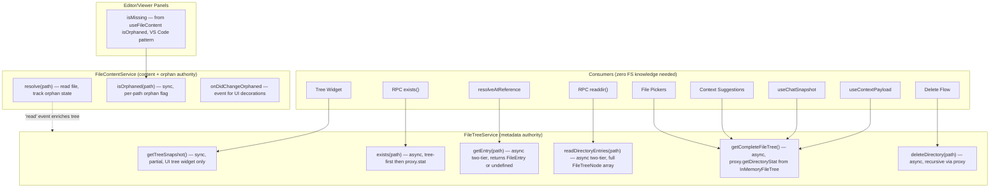

# Lazy Tree Migration Audit

Systematic audit of all `fileTreeMap` consumers and filesystem-layer changes in the working copy after the P0-3 lazy tree loading migration and multi-provider refactor. Identifies stale assumptions, functional regressions, and dead code.

## Executive Summary

The P0-3 lazy tree loading migration changed `fileTreeMap` from a complete recursive inventory of every file to a partial, lazily-expanded snapshot. Seventeen consumer sites across the UI still treat it as authoritative for file existence, directory listing, and enumeration. Additionally, the filesystem provider refactor introduced inconsistencies in the `InMemoryFileTree`, test mocks, and dead code paths. This audit identifies 5 critical bugs, 4 significant feature gaps, 4 moderate UX degradations, and 4 low-severity maintenance issues.

**Post-implementation update (2026-03-29):** Initial implementation of R1-R24 introduced a `useCompleteFileTree()` hook as a blanket replacement for all consumers needing full tree data. Post-implementation review identified this as an anti-pattern that re-introduces the eager full-tree scan P0-3 eliminated. See [Finding 18](#finding-18-usecompletefiletree-re-introduces-eager-full-tree-scan) and [Post-Implementation Review](#post-implementation-review-usecompletefiletree-anti-pattern) for the revised per-consumer approach.

## Methodology

1. Searched all imports of `useFileTreeMap` and `useFileTree` across `apps/ui/app/`, tracing every downstream consumer.
2. Identified every `fileTree.has()`, `fileTree.get()`, `[...fileTree.values()]`, `fileTree.size`, and `.find((f) => f.path ===` pattern.
3. Classified each consumer by whether it assumes the map contains all project files (complete tree) vs. only loaded entries.
4. Reviewed `git diff` of the working copy for the filesystem package (`packages/filesystem/`) and UI app (`apps/ui/app/`) to find inconsistencies introduced by the provider refactor.
5. Cross-referenced test mocks against current production APIs.

## Findings

### Finding 1: `isMissing` in Editor Panels Uses `fileTree.has()` on Partial Data

**Severity**: P0 — User-visible "File not found" for existing files

**Files**:

- `apps/ui/app/routes/projects_.$id/chat-editor-dockview.tsx` (lines 122-128)
- `apps/ui/app/routes/projects_.$id/chat-viewer.tsx` (lines 84-103)

Both components determine `isMissing` via `!fileTree.has(filePath)` (with a `size === 0` loading guard). Before P0-3, `fileTreeMap` contained every file from a recursive `getDirectoryStat`. After P0-3, only root-level entries are loaded initially; children appear only when parent directories are expanded.

Any file opened programmatically (by the kernel, AI agent, or panel restore from serialized layout) that lives in an unexpanded directory is shown as "File not found." The viewer compensates partially with a `key.startsWith(directoryPrefix)` scan for directory detection, but this also fails when directory children are absent.

### Finding 2: RPC `exists()` Returns False for Files on Disk

**Severity**: P0 — Breaks AI agent filesystem operations

**File**: `apps/ui/app/hooks/rpc-handlers.ts` (lines 115-117)

```typescript
async exists(path: string): Promise<boolean> {
  const fileTree = treeService?.getTreeSnapshot() ?? new Map<string, FileEntry>();
  return fileTree.has(path);
}
```

The `exists()` RPC is consumed by the LangGraph AI agent to check file existence before reading or overwriting. With a lazy tree, `exists('src/utils/helper.ts')` returns `false` if the `src/` directory hasn't been expanded in the UI — the agent then believes the file doesn't exist and may create duplicates or skip reading it.

### Finding 3: RPC `readdir()` Returns Incomplete Directory Listings

**Severity**: P0 — Breaks AI agent directory exploration

**File**: `apps/ui/app/hooks/rpc-handlers.ts` (lines 82-113)

The `readdir()` handler iterates `fileTree.entries()` and filters by parent path. If the user hasn't expanded a directory in the tree sidebar, its children are absent from the snapshot, so `readdir()` returns an empty array even though the directory contains files. This directly breaks the AI agent's ability to explore the project.

### Finding 4: Delete Flow Uses Inverted Virtual-Folder Heuristic

**Severity**: P0 — Potential data loss: directory deletion only deletes the directory entry, not nested files

**File**: `apps/ui/app/routes/projects_.$id/chat-editor-file-tree.tsx` (lines 812-831)

```typescript
const isFolder = !fileTree.some((f) => f.path === path);

if (isFolder) {
  const nested = fileTree.filter((f) => f.path.startsWith(`${path}/`));
  for (const file of nested) {
    void deleteFile(file.path, { source: 'user' });
  }
}
```

This uses the pre-migration assumption: "if a path is NOT in `fileTree`, it must be a virtual folder." With explicit directory entries (`type: 'dir'`), directories are now found by `.some()`, so `isFolder` becomes `false` — the directory is treated as a single file. Its nested contents are not recursively deleted.

Additionally, the `nested` filter only finds files already in the lazy tree snapshot. Files in unexpanded subdirectories would be missed even if the folder detection were correct.

### Finding 5: `hasChildrenLoaded('')` False Positive for Root

**Severity**: P0 — Causes skipped root directory refresh

**File**: `apps/ui/app/lib/file-tree-service.ts` (lines 369-380)

```typescript
public hasChildrenLoaded(path: string): boolean {
  const prefix = path === '' ? '' : path.endsWith('/') ? path : `${path}/`;
  for (const key of this._tree.keys()) {
    if (prefix === '') {
      return true;
    }
    // ...
  }
  return false;
}
```

When `path === ''` (root), `prefix` is `''`, and the first iteration immediately returns `true` — regardless of whether the key is a direct child of root or a deeply nested path. Any single entry in the tree (even a deep path like `src/utils/helpers/math.ts` from a previous partial load) makes `hasChildrenLoaded('')` return `true`, potentially causing the root directory refresh to be skipped when it shouldn't be.

### Finding 6: Context Suggestions Only Show Loaded Files

**Severity**: P1 — Users cannot `@`-reference files in unexpanded directories

**File**: `apps/ui/app/components/chat/tiptap/context-suggestion.utils.ts` (lines 32-69)

`buildContextItems` iterates `[...fileTree.entries()]` to build the `@`-mention suggestion list. With lazy loading, only files from expanded directories appear. Users cannot reference files deep in the project without first expanding their parent directories in the tree sidebar.

### Finding 7: `@`-Reference Resolution Fails for Unloaded Paths

**Severity**: P1 — Pasted or received `@path` references render as invalid

**File**: `apps/ui/app/utils/at-reference.utils.ts` (lines 92-95)

`resolveAtReference` calls `fileTree.get(path)` and returns `undefined` when the path is absent. If the AI agent or a pasted message contains `@src/deep/nested/file.ts` and that directory hasn't been expanded, the `@`-reference chip renders as unresolved.

### Finding 8: Skill and AGENTS.md Discovery Misses `.tau/` Contents

**Severity**: P1 — AI agent loses project-level context

**File**: `apps/ui/app/hooks/use-context-payload.ts` (lines 23-33)

Scans `fileTree` for `.tau/skills/*/SKILL.md` and `.tau/AGENTS.md`. If the `.tau/` directory hasn't been expanded in the sidebar, these entries are absent from the snapshot, and the context payload sent to the AI agent omits project skills and memory.

### Finding 9: Chat Snapshot Sends Incomplete File Tree to AI

**Severity**: P1 — AI receives partial project structure

**File**: `apps/ui/app/hooks/use-chat-snapshot.ts` (lines 56-62)

The `ChatSnapshot.fileTree` sent to the LangGraph agent contains only the lazily-loaded portion of the file tree. The AI cannot reason about files it cannot see in the snapshot, reducing the quality of generated code and file operations.

### Finding 10: File Pickers Show Only Loaded Files

**Severity**: P2 — Degraded UX across 7 components

**Files**:

- `apps/ui/app/routes/projects_.$id/chat-details.tsx` (line 106)
- `apps/ui/app/routes/projects_.$id/chat-editor-dockview.tsx` (lines 130-135, 255-257)
- `apps/ui/app/routes/projects_.$id/chat-viewer.tsx` (lines 50-56)
- `apps/ui/app/routes/projects_.$id/chat-editor-breadcrumbs.tsx` (lines 36-40)
- `apps/ui/app/routes/projects_.$id/chat-viewer-dockview.tsx` (lines 64-67)
- `apps/ui/app/components/panes/dockview-open-file-action.tsx` (lines 41-48)
- `apps/ui/app/routes/projects_.$id_.preview/use-preview-file-list.ts` (lines 14-26)

All file picker UIs iterate `fileTree.values()` and present the results as "all available files." Before lazy loading, this was the full project. Now it shows only files from expanded directories.

### Finding 11: `copyDirectory` Does Not Update `InMemoryFileTree`

**Severity**: P2 — In-memory tree becomes stale after directory copy

**File**: `packages/filesystem/src/file-service.ts` (lines 364-385)

`copyDirectory` writes files to the provider and invalidates the tree cache, but does not call `_inMemoryTreeAddFile` for each written file. Other mutation methods (`writeFile`, `writeFiles`, `duplicateFile`) correctly update the in-memory tree. `getDirectoryStat` results from the in-memory tree will not include the copied files until a full rescan.

### Finding 12: `ensureDirectoryExists` Does Not Update `InMemoryFileTree`

**Severity**: P2 — Directories created via `ensureDirectoryExists` are invisible to in-memory tree

**File**: `packages/filesystem/src/file-service.ts` (lines 325-330)

`ensureDirectoryExists` creates directories on the provider but does not call `_inMemoryTreeAddDirectory`. The public `mkdir` method correctly updates the tree (line 239), but `ensureDirectoryExists` — which is used by `_ensureParentDir` for implicit directory creation during writes — does not.

### Finding 13: `file-manager.machine.test.ts` Mock Missing `readDirectory`

**Severity**: P2 — Tests may fail or produce false passes

**File**: `apps/ui/app/machines/file-manager.machine.test.ts` (lines 19-26)

The `createBridgeProxy` mock provides `getDirectoryStat` and `readShallowDirectory` but not `readDirectory`. The actual machine calls `proxy.readDirectory(absolutePath)` during initialization (line 115 of `file-manager.machine.ts`). Tests that wait for the `'ready'` state (lines 134-171) may either fail with a TypeError or silently pass if the error is caught by `fromSafeAsync` and the test doesn't assert on the error state.

### Finding 14: Dead Code in `import-github.machine.ts`

**Severity**: P3 — Maintenance burden and confusion

**File**: `apps/ui/app/machines/import-github.machine.ts`

Three actor definitions are declared and exported but never invoked:

| Symbol              | Lines | Status                                                       |
| ------------------- | ----- | ------------------------------------------------------------ |
| `downloadZipActor`  | 276   | Defined, listed in `importGitHubActors`, never invoked       |
| `writeWorkerActor`  | 435   | Defined, listed in `importGitHubActors`, never invoked       |
| `spawnUnzipMachine` | 715   | Defined as an action, never called from any state transition |

The `extracting` state (line 1300) is marked `@deprecated` but still present. No transition targets it. This is ~200 lines of unreachable code.

### Finding 15: Stale Comments Referencing Old Architecture

**Severity**: P3 — Misleading for future readers

| File                                                         | Line(s) | Stale Reference                                                      |
| ------------------------------------------------------------ | ------- | -------------------------------------------------------------------- |
| `apps/ui/app/hooks/use-cad-preview.tsx`                      | 158-161 | "Always write the full snapshot to ZenFS" — no longer ZenFS          |
| `apps/ui/app/routes/projects_.$id/chat-editor-file-tree.tsx` | 812     | "folders are virtual" — directories are now explicit entries         |
| `apps/ui/app/hooks/use-context-payload.ts`                   | 12      | "Reads from ZenFS" — generic FS now                                  |
| `apps/ui/app/machines/file-manager.worker.ts`                | comment | "ZenFS's commitNew"                                                  |
| `packages/filesystem/src/write-coordinator.ts`               | 1-8     | JSDoc updated, but class itself is dead code for new `ResourceQueue` |

### Finding 16: `filesystem-settings.tsx` Division by Zero Edge Case

**Severity**: P3 — Minor UI glitch

**File**: `apps/ui/app/components/settings/filesystem-settings.tsx` (line 199)

```typescript
width: `${Math.min((storageUsage.used / storageUsage.quota) * 100, 100).toFixed(1)}%`,
```

If `storageUsage.quota === 0`, this produces `NaN%` or `Infinity%` for the progress bar width. Should guard with `quota > 0 ? ... : 0`.

### Finding 17: `MemoryProvider.rmdir` Does Not Enforce Non-Empty Check

**Severity**: P3 — Behavioral difference from POSIX semantics

**File**: `packages/filesystem/src/providers/memory-provider.ts` (lines 95-100)

`rmdir` only checks that the path is a registered directory and not `/`. It does not ensure the directory is empty or remove contained files, so `rmdir` on a non-empty directory leaves orphan file paths in `_files`. POSIX `rmdir` returns `ENOTEMPTY` for non-empty directories.

### Finding 18: `useCompleteFileTree` Re-Introduces Eager Full-Tree Scan

**Severity**: P1 — Architectural regression: defeats the lazy loading that P0-3 introduced

**File**: `apps/ui/app/hooks/use-complete-file-tree.ts`

**Identified during**: Post-implementation review of R4, R13-R17

The initial implementation of R4 (`FileTreeService.getCompleteFileTree()`) and its consumer wiring (R13-R17) introduced a shared `useCompleteFileTree()` React hook that calls `treeService.getCompleteFileTree()` on mount. Nine consumer sites import this hook:

| Consumer                                  | Actual Data Need                                     |
| ----------------------------------------- | ---------------------------------------------------- |
| `chat-textarea.tsx` (context suggestions) | Complete tree, but only when `@`-mention popup opens |
| `chat-history.tsx`                        | Complete tree for file list display                  |
| `chat-details.tsx`                        | Complete tree for file picker                        |
| `dockview-open-file-action.tsx`           | Complete tree for file picker dialog                 |
| `use-preview-file-list.ts`                | Complete tree for preview file selector              |
| `chat-editor-breadcrumbs.tsx`             | Complete tree for breadcrumb file picker             |
| `chat-viewer-dockview.tsx`                | Complete tree for viewer file selector               |
| `chat-editor-dockview.tsx`                | Complete tree for editor file selector               |
| `chat-viewer.tsx`                         | Complete tree for viewer file list                   |

The hook eagerly fetches the complete file tree on component mount via `FileTreeService.getCompleteFileTree()`, which delegates to `FileService.getDirectoryStat('')`. On first call, `getDirectoryStat` performs a full recursive scan of the IndexedDB-backed filesystem to build the `InMemoryFileTree`. Subsequent calls return from the in-memory cache (O(1)).

**Why this is problematic:**

1. **Defeats P0-3 lazy loading.** The filesystem gap analysis (Finding 4, resolved) eliminated full recursive `getDirectoryStat` on every tree refresh. `useCompleteFileTree` re-introduces it — the first consumer to mount triggers the exact same full scan.

2. **Eager on mount, not on demand.** Every component that imports `useCompleteFileTree` triggers the scan on mount, even if the user never opens a file picker or types `@`. Most consumers only need the complete tree when an interaction begins (popup opens, dialog shown).

3. **Wrong granularity for most consumers.** The `FileSelector` component already implements lazy drill-down navigation via `buildTree`/`getItemsAtPath`/`searchFilesRecursively`. It does not inherently require a pre-fetched flat file list — it can request directory contents on demand. Similarly, `resolveAtReference` needs a single `getEntry()` call, not the entire tree.

4. **Multiplied mount calls.** With 9 import sites, the hook is instantiated in multiple components. While `getDirectoryStat` caches after the first call, each mount site creates its own React state copy of the full tree and its own `useEffect` lifecycle, adding unnecessary memory pressure and re-render surface.

**Relationship to original findings:** The original F6, F8, F9, F10 correctly identified that consumers needed complete filesystem knowledge. The error was in the solution: a single eagerly-mounted hook that fetches the complete tree is the wrong abstraction. Each consumer has a distinct access pattern that should be served by the most targeted method available.

## Architectural Root Cause

The core issue underlying Findings 1-10 is that `fileTreeMap` serves two distinct roles that were conflated when the tree was always complete:

1. **UI rendering source** — drives the tree widget, file pickers, and breadcrumbs. Correctly lazy: only expanded directories need to be loaded.
2. **Filesystem existence oracle** — used by panels (`isMissing`), RPC handlers (`exists`, `readdir`), AI context (`ChatSnapshot`, `ContextPayload`), and reference resolution (`resolveAtReference`). Requires complete filesystem knowledge that a lazy UI tree cannot provide.

### Centralized Fix: Two Canonical Authorities

The architecture designates two canonical service authorities on the main thread:

- **`FileTreeService`** (`apps/ui/app/lib/file-tree-service.ts`): "Single tree/metadata authority on the main thread." All tree reads, directory listings, existence checks, and stat operations go through this service.
- **`FileContentService`** (`apps/ui/app/lib/file-content-service.ts`): "Single content authority on the main thread." All content operations (read, write, rename, delete, duplicate) go through this service.

The fix distributes responsibility across both services based on the question being asked:

- "Does this path exist in the project?" → **`FileTreeService`** (metadata question — async two-tier: tree-first O(1), then `proxy.stat` fallback)
- "Can I display content for this file?" → **`FileContentService`** (content question — orphan state derived from the `readFile` already happening, VS Code pattern)
- "What files does this directory contain?" → **`FileTreeService`** (metadata question — async two-tier: tree-first, then `proxy.readDirectory` fallback)
- "What is the complete project structure?" → **`FileTreeService`** (metadata question — delegates to worker `InMemoryFileTree`)
- "Delete this directory and everything in it" → **`FileTreeService`** (metadata + mutation — worker has complete knowledge)

Every `FileTreeService` method must "just work" regardless of whether the data is in the lazy tree or needs to be fetched from the worker. Consumers call service methods and never need to know about lazy loading.

`FileTreeService.readdir()` already implements the two-tier pattern correctly: it checks the lazy tree first (O(1)), then falls back to the worker proxy if empty. The inconsistency is that `exists()` is sync and tree-only, and `isMissing` is computed by UI components rather than the content service. The fix is to apply the same centralized pattern to all methods that require complete filesystem knowledge.



### Service-Layer Changes (6 items across 2 services resolve all 17 findings)

#### `FileContentService` — orphan tracking (VS Code pattern)

**1. Per-path orphan state in `FileContentService`.** VS Code's `TextFileEditorModel` maintains an `inOrphanMode` flag per file, driven by both filesystem events and read outcomes (see [VS Code Orphan Pattern Reference](#vs-code-orphan-pattern-reference) below). Tau's equivalent is `FileContentService` — the "single content authority on the main thread." It must track per-path orphan state and expose it via hook and event.

Detection (dual-path, matching VS Code):

- `resolve()` succeeds → clear orphan for path
- `resolve()` fails with `FILE_NOT_FOUND` → set orphan for path
- `write()` succeeds → clear orphan for path
- `delete()` called → set orphan for path
- Future: external filesystem change events → 100ms + `exists()` validation (VS Code's defense against flaky events)

Exposure:

- `isOrphaned(path): boolean` — sync check of cached orphan flag
- `onDidChangeOrphaned: Event<{ path: string }>` — event for UI decoration updates
- `useFileContent(path)` hook returns `{ content, isOrphaned }` — editors derive `isMissing` from `isOrphaned`

```typescript
private readonly orphanedPaths = new Set<string>();

private setOrphaned(path: string, orphaned: boolean): void {
  const changed = orphaned ? !this.orphanedPaths.has(path) : this.orphanedPaths.has(path);
  if (!changed) return;
  if (orphaned) {
    this.orphanedPaths.add(path);
  } else {
    this.orphanedPaths.delete(path);
  }
  this.notifyOrphanedSubscribers(path);
}

public isOrphaned(path: string): boolean {
  return this.orphanedPaths.has(path);
}
```

Integration with `resolve()`:

```typescript
private async resolveFromWorker(path: string): Promise<Uint8Array<ArrayBuffer>> {
  const absolutePath = joinPath(this.rootDirectory, path);
  try {
    const data = await this.proxy.readFile(absolutePath);
    this.cache.set(path, data);
    this.setOrphaned(path, false);
    this.notifyPathSubscribers(path);
    this.notifyGlobalSubscribers({ type: 'read', path, data });
    return data;
  } catch (error: unknown) {
    if (isFileNotFoundError(error)) {
      this.setOrphaned(path, true);
    }
    throw error;
  }
}
```

#### `FileTreeService` — metadata methods

**2. `exists(path)` — from sync tree-only to async two-tier.** Currently sync `_tree.has(path)`. Must become async with the same two-tier pattern as `readdir`: tree hit returns O(1); tree miss costs one RPC round-trip to the worker, where `FileService.exists()` checks the `InMemoryFileTree` (O(1) in-memory) before hitting the provider.

```typescript
public async exists(path: string): Promise<boolean> {
  if (this._tree.has(path)) {
    return true;
  }
  try {
    const absolutePath = joinPath(this.rootDirectory, path);
    await this.proxy.stat(absolutePath);
    return true;
  } catch {
    return false;
  }
}
```

**3. `getEntry(path)` — new async two-tier method returning full `FileEntry`.** Consumers like `resolveAtReference` need the entry metadata (type, size), not just a boolean. A single centralized method replaces the broken `fileTree.get(path)` pattern and the previous recommendation of `exists() + stat` (which was two calls at the consumer level).

```typescript
public async getEntry(path: string): Promise<FileEntry | undefined> {
  const cached = this._tree.get(path);
  if (cached) {
    return cached;
  }
  try {
    const absolutePath = joinPath(this.rootDirectory, path);
    const stat = await this.proxy.stat(absolutePath);
    return { path, name: path.split('/').pop() ?? path, type: stat.type, size: stat.size, mtimeMs: stat.mtimeMs, isLoaded: false };
  } catch {
    return undefined;
  }
}
```

**4. `getCompleteFileTree()` — new method for consumers that need the full project structure.** Delegates to `getDirectoryStat('')`, which returns from the worker's `InMemoryFileTree` with zero IDB hits when the tree is already built. One RPC call returns the complete file list. This is the single entry point for AI context, file pickers, context suggestions, and `@`-reference suggestions.

```typescript
public async getCompleteFileTree(): Promise<FileStatEntry[]> {
  return this.getDirectoryStat('');
}
```

**5. `deleteDirectory(path)` — new method for recursive directory deletion via worker.** The current delete flow iterates the lazy UI tree to find nested files — broken when subdirectories are not expanded. The worker has complete filesystem knowledge; delegate to it.

```typescript
public async deleteDirectory(path: string): Promise<void> {
  const absolutePath = joinPath(this.rootDirectory, path);
  const contents = await this.proxy.getDirectoryContents(absolutePath);
  for (const filePath of Object.keys(contents)) {
    await this.proxy.unlink(filePath);
  }
  await this.proxy.rmdir(absolutePath);
}
```

**6. `readDirectoryEntries(path)` — new async two-tier method returning full `FileTreeNode[]`.** RPC `readdir()` currently bypasses `FileTreeService` with a direct `proxy.readDirectory()` call. This method centralizes directory listing with the same tree-first, worker-fallback pattern used by all other methods.

```typescript
public async readDirectoryEntries(path: string): Promise<FileTreeNode[]> {
  const absolutePath = path === '' ? normalizePath(this.rootDirectory) : joinPath(this.rootDirectory, path);
  return this.proxy.readDirectory(absolutePath);
}
```

### Consumer Changes (mechanical one-line substitutions)

| Consumer                  | Current (broken)                          | Fixed                                                 | Service              |
| ------------------------- | ----------------------------------------- | ----------------------------------------------------- | -------------------- |
| Editor/viewer `isMissing` | `!fileTree.has(filePath)`                 | `useFileContent(path).isOrphaned`                     | `FileContentService` |
| RPC `exists()`            | `fileTree.has(path)`                      | `await treeService.exists(path)`                      | `FileTreeService`    |
| RPC `readdir()`           | Iterates `fileTree.entries()` + N+1 stats | `await treeService.readDirectoryEntries(path)`        | `FileTreeService`    |
| `resolveAtReference`      | `fileTree.get(path)`                      | `await treeService.getEntry(path)`                    | `FileTreeService`    |
| `useContextPayload`       | `fileTree?.filter(...)`                   | `await treeService.getCompleteFileTree()` then filter | `FileTreeService`    |
| `useChatSnapshot`         | `useFileTree()` (lazy snapshot)           | `await treeService.getCompleteFileTree()`             | `FileTreeService`    |
| Context suggestions       | `[...fileTree.entries()]`                 | `await treeService.getCompleteFileTree()`             | `FileTreeService`    |
| Delete flow               | `!fileTree.some()` + `fileTree.filter()`  | `await treeService.deleteDirectory(path)`             | `FileTreeService`    |
| File pickers (7 sites)    | `[...fileTree.values()]`                  | `await treeService.getCompleteFileTree()` when opened | `FileTreeService`    |

Every consumer change is a single method call substitution to a canonical service. No consumer needs to understand lazy loading, two-tier resolution, or worker communication. Future consumers that use `treeService.exists()`, `treeService.getEntry()`, or `contentService.isOrphaned()` automatically get correct behavior.

### `isMissing` — VS Code Orphan Pattern in `FileContentService`

The `isMissing` pattern in `chat-editor-dockview.tsx` and `chat-viewer.tsx` is the highest-impact fix. VS Code's architecture provides the definitive solution: **orphan state lives in the content model, not in UI components.**

VS Code's `TextFileEditorModel` maintains a private `inOrphanMode` flag, exposed via `hasState(TextFileEditorModelState.ORPHAN)` and an `onDidChangeOrphaned` event. Editors never compute "missing" themselves — they read model state. The UI applies visual treatment (strikethrough, "Deleted" tooltip) via a decorations provider that reacts to the model event (see [VS Code Orphan Pattern Reference](#vs-code-orphan-pattern-reference)).

Tau's equivalent of `TextFileEditorModel` is `FileContentService` — the "single content authority on the main thread." The orphan state must live there, not in each React component.

Current (broken — consumer-local existence check on partial tree):

```typescript
const isMissing = useMemo(() => {
  if (fileTree.size === 0) return false;
  return !fileTree.has(filePath);
}, [filePath, fileTree]);

useEffect(() => {
  if (!isMissing) void fileManager.readFile(filePath);
}, [fileManager, filePath, isMissing]);
```

Fixed (centralized in `FileContentService`, zero extra RPC):

```typescript
const { content, isOrphaned } = useFileContent(filePath);
const isMissing = isOrphaned;
```

The `readFile` that `useFileContent` already triggers is the same call that drives the orphan state in `FileContentService.resolveFromWorker()`. Success clears orphan; `FILE_NOT_FOUND` sets orphan. No additional RPC. No consumer-local `useState + catch`. No `useFileTreeMap()` import. The hook returns the model's canonical state.

This also naturally handles files created by the kernel or AI after the tree loads: `readFile` succeeds, orphan clears, even though the lazy tree does not yet contain the entry. When `FileContentService` emits a `'read'` event on success, `FileTreeService.handleContentChange` enriches the tree (see below), ensuring all tree consumers also see the file.

### Tree Enrichment from Content Reads

`FileTreeService.handleContentChange` currently ignores `'read'` events:

```typescript
case 'read': {
  break;
}
```

When `FileContentService` successfully reads a file, it already emits `{ type: 'read', path, data }`. `FileTreeService` should handle this by ensuring the file appears in the tree via `optimisticAdd(path, data.byteLength)`. This keeps `fileTree.has()` consistent for all other tree consumers (context suggestions, file pickers, RPC handlers) as a side-effect of content operations that already happen — zero additional RPCs.

### `hasChildrenLoaded('')` — Pure Logic Fix

When `prefix === ''`, check for a direct root child (`!key.includes('/')`), not just any key:

```typescript
public hasChildrenLoaded(path: string): boolean {
  const prefix = path === '' ? '' : path.endsWith('/') ? path : `${path}/`;
  for (const key of this._tree.keys()) {
    if (prefix === '') {
      if (!key.includes('/')) return true;
    } else if (key.startsWith(prefix) && !key.slice(prefix.length).includes('/')) {
      return true;
    }
  }
  return false;
}
```

### RPC `readdir` — Eliminate N+1 Stats

The current RPC `readdir` iterates the tree snapshot then does individual `stat` calls per entry for `modifiedAt`. The worker's `readDirectory` returns full `FileTreeNode[]` (name, type, size) in a single cached call via `DirectoryTreeCache`. Use it directly to eliminate the N+1 problem.

## Recommendations

### Centralized service fixes (resolve F1-F10)

| #   | Action                                                                                                                                                                                                                                                              | Priority | Effort | Impact | Findings   |
| --- | ------------------------------------------------------------------------------------------------------------------------------------------------------------------------------------------------------------------------------------------------------------------- | -------- | ------ | ------ | ---------- |
| R1  | Add per-path orphan tracking to `FileContentService` (VS Code `inOrphanMode` pattern) — `resolve()` success clears orphan, `FILE_NOT_FOUND` sets orphan, `delete()` sets orphan, `write()` clears orphan. Expose `isOrphaned(path)` and `onDidChangeOrphaned` event | P0       | Medium | High   | F1         |
| R2  | Fix `FileTreeService.exists()` — async two-tier: tree-first O(1), then `proxy.stat` fallback                                                                                                                                                                        | P0       | Low    | High   | F2         |
| R3  | Add `FileTreeService.getEntry(path)` — async two-tier returning `FileEntry` or `undefined`, replaces broken `fileTree.get(path)` pattern                                                                                                                            | P0       | Low    | High   | F7         |
| R4  | Add `FileTreeService.getCompleteFileTree()` — delegates to `getDirectoryStat('')` for full project structure from worker `InMemoryFileTree`                                                                                                                         | P0       | Low    | High   | F6, F8, F9 |
| R5  | Add `FileTreeService.deleteDirectory(path)` — recursive delete via worker proxy where complete filesystem knowledge exists                                                                                                                                          | P0       | Low    | High   | F4         |
| R6  | Add `FileTreeService.readDirectoryEntries(path)` — async two-tier returning full `FileTreeNode[]`, centralizes RPC `readdir()`                                                                                                                                      | P0       | Low    | High   | F3         |
| R7  | Fix `hasChildrenLoaded('')` to check for direct children of root, not any key existence                                                                                                                                                                             | P0       | Low    | Medium | F5         |
| R8  | Handle `'read'` events in `FileTreeService.handleContentChange` — call `optimisticAdd()` to enrich the tree from successful content reads                                                                                                                           | P0       | Low    | Medium | F1, F6, F7 |

### Consumer wiring (mechanical substitutions after R1-R8)

| #   | Action                                                                                                              | Priority | Effort | Impact | Findings |
| --- | ------------------------------------------------------------------------------------------------------------------- | -------- | ------ | ------ | -------- |
| R9  | Editor/viewer `isMissing`: replace `!fileTree.has(filePath)` with `useFileContent(path).isOrphaned`                 | P0       | Low    | High   | F1       |
| R10 | RPC `exists()`: replace `fileTree.has(path)` with `await treeService.exists(path)`                                  | P0       | Low    | High   | F2       |
| R11 | RPC `readdir()`: replace tree snapshot iteration with `await treeService.readDirectoryEntries(path)`                | P0       | Low    | High   | F3       |
| R12 | Delete flow in `chat-editor-file-tree.tsx`: replace inline iteration with `await treeService.deleteDirectory(path)` | P0       | Low    | High   | F4       |
| R13 | `resolveAtReference`: replace `fileTree.get(path)` with `await treeService.getEntry(path)`                          | P1       | Low    | Medium | F7       |
| R14 | `useContextPayload`: replace `fileTree?.filter(...)` with `await treeService.getCompleteFileTree()` then filter     | P1       | Low    | High   | F8       |
| R15 | `useChatSnapshot`: replace `useFileTree()` with `await treeService.getCompleteFileTree()`                           | P1       | Low    | High   | F9       |
| R16 | `buildContextItems`: replace `[...fileTree.entries()]` with `await treeService.getCompleteFileTree()`               | P1       | Low    | Medium | F6       |
| R17 | File pickers (7 sites): replace `[...fileTree.values()]` with `await treeService.getCompleteFileTree()` when opened | P2       | Low    | Medium | F10      |

### Worker-side consistency (FileService)

| #   | Action                                                          | Priority | Effort | Impact | Findings |
| --- | --------------------------------------------------------------- | -------- | ------ | ------ | -------- |
| R18 | Add `_inMemoryTreeAddFile` calls to `copyDirectory` loop        | P2       | Low    | Low    | F11      |
| R19 | Add `_inMemoryTreeAddDirectory` call to `ensureDirectoryExists` | P2       | Low    | Low    | F12      |

### Test and maintenance

| #   | Action                                                                                                 | Priority | Effort | Impact | Findings |
| --- | ------------------------------------------------------------------------------------------------------ | -------- | ------ | ------ | -------- |
| R20 | Add `readDirectory` to `file-manager.machine.test.ts` mock                                             | P2       | Low    | Low    | F13      |
| R21 | Remove dead `downloadZipActor`, `writeWorkerActor`, `spawnUnzipMachine`, deprecated `extracting` state | P3       | Low    | Low    | F14      |
| R22 | Update stale ZenFS and "virtual folder" comments to reflect current architecture                       | P3       | Low    | Low    | F15      |
| R23 | Guard `storageUsage.quota === 0` in filesystem settings progress bar                                   | P3       | Low    | Low    | F16      |
| R24 | Add non-empty directory check to `MemoryProvider.rmdir`                                                | P3       | Low    | Low    | F17      |

### Change summary by layer

| Layer                  | Changes                                                                                                                                                                                                    |    Count     |
| ---------------------- | ---------------------------------------------------------------------------------------------------------------------------------------------------------------------------------------------------------- | :----------: |
| `FileContentService`   | Add per-path orphan tracking (`isOrphaned`, `setOrphaned`, `onDidChangeOrphaned`), update `resolveFromWorker` to set/clear orphan                                                                          |  1 service   |
| `useFileContent` hook  | Expose `isOrphaned` alongside `content`                                                                                                                                                                    |    1 hook    |
| `FileTreeService`      | Fix `exists()` (async), add `getEntry()`, add `getCompleteFileTree()`, add `deleteDirectory()`, add `readDirectoryEntries()`, fix `hasChildrenLoaded('')`, handle `'read'` events in `handleContentChange` |  7 changes   |
| `useFileManager` hook  | Update `exists` pass-through (already async in the type)                                                                                                                                                   |      1       |
| RPC handler            | Replace tree snapshot usage with `treeService` calls                                                                                                                                                       |  2 methods   |
| Editor/viewer panels   | Derive `isMissing` from `useFileContent().isOrphaned`, drop `useFileTreeMap`                                                                                                                               | 2 components |
| AI context hooks       | Call `treeService.getCompleteFileTree()`                                                                                                                                                                   |   3 hooks    |
| Delete flow            | Call `treeService.deleteDirectory()`                                                                                                                                                                       |    1 site    |
| File pickers           | Call `treeService.getCompleteFileTree()` when opened                                                                                                                                                       | 7 sites (P2) |
| `FileService` (worker) | `_inMemoryTreeAddFile` in `copyDirectory`, `_inMemoryTreeAddDirectory` in `ensureDirectoryExists`                                                                                                          |  2 methods   |
| Test mock              | Add `readDirectory`                                                                                                                                                                                        |    1 file    |

All 17 findings resolved through changes in 3 centralized services (`FileContentService` + `FileTreeService` + `FileService`) plus mechanical consumer substitutions. No consumer needs to understand lazy loading or orphan tracking. Future consumers automatically get correct behavior.

### Alignment with architecture and vision

- **Architecture doc Section 3.1**: "Single tree/metadata authority on the main thread" — metadata fixes centralized in `FileTreeService`
- **Architecture doc Section 3.1 (content)**: "Single content authority on the main thread" — orphan state centralized in `FileContentService`, matching VS Code's model-layer pattern
- **Architecture doc Section 2.2**: "Promise-based RPC for one-shot operations" — `exists()`, `getEntry()`, `getCompleteFileTree()`, `deleteDirectory()`, `readDirectoryEntries()` are all one-shot
- **Architecture doc Appendix B Phase 5**: "`getFileTree()` returns cached tree without hitting storage" — `getCompleteFileTree()` implements this via `getDirectoryStat('')` which reads from the worker's `InMemoryFileTree`
- **VS Code reference**: `TextFileEditorModel.inOrphanMode` pattern — orphan state in the content model, driven by dual-path detection (events + read outcomes), exposed via event for UI decorations. Editors never check the explorer tree for existence.
- **Vision policy**: "Files are the interface" — the FS must be reliable; `exists` must return the truth. "AI agents are collaborators" — RPC `exists/readdir` must return complete data for the agent to operate correctly

## Post-Implementation Review: `useCompleteFileTree` Anti-Pattern

### Problem Statement

The initial implementation of R4 and R13-R17 used `useCompleteFileTree()` as a one-size-fits-all replacement for every consumer that previously read from `fileTreeMap`. While this fixed the correctness bugs (consumers now get complete data), it violated the core architectural principle that motivated the P0-3 migration: **lazy loading — O(1) initial load vs O(n) full traversal** (filesystem-architecture.md Decision Log).

The filesystem gap analysis (Finding 4, P0, marked RESOLVED) specifically eliminated full recursive `getDirectoryStat` on every tree refresh, and Policy Rule 1 mandates "shallow reads by default." The `useCompleteFileTree` hook undoes this by eagerly fetching the complete tree on mount.

### Consumer Access Pattern Analysis

Each consumer that currently imports `useCompleteFileTree` has a distinct data need. The correct fix is to match each consumer to the most targeted `FileTreeService` method:

#### Category 1: File Pickers — Lazy Drill-Down

**Consumers**: `chat-editor-dockview.tsx`, `chat-viewer-dockview.tsx`, `chat-viewer.tsx`, `chat-details.tsx`, `dockview-open-file-action.tsx`, `chat-editor-breadcrumbs.tsx`, `use-preview-file-list.ts`

**Current approach**: `useCompleteFileTree()` on mount → passes flat list to `FileSelector`

**Problem**: `FileSelector` already implements lazy drill-down via `buildTree`/`getItemsAtPath`. It constructs a virtual tree from a flat list, then navigates one level at a time. The flat list is an unnecessary intermediary — the component could request directory contents directly from `FileTreeService` as the user navigates.

**Revised approach**: Two viable strategies:

1. **Deferred complete tree** (simpler, recommended short-term): Keep `treeService.getCompleteFileTree()` but call it only when the file picker dialog opens, not on component mount. This avoids the mount-time scan while preserving the existing `FileSelector` contract. The complete tree data stays in a local callback scope or lazy ref, not in React state.

2. **True lazy navigation** (ideal, higher effort): Refactor `FileSelector` to accept a `loadDirectory: (path: string) => Promise<FileEntry[]>` callback, calling `treeService.readDirectoryEntries(path)` on each drill-down. Search would use `treeService.getCompleteFileTree()` only when the user types a query, not preemptively. This is the architecturally correct long-term solution but requires `FileSelector` API changes.

#### Category 2: Context Suggestions — On-Demand Complete Tree

**Consumer**: `chat-textarea.tsx` → `buildContextItems`

**Current approach**: `useCompleteFileTree()` on mount → builds suggestion list

**Problem**: The complete tree is loaded when the chat textarea mounts, even if the user never types `@`. The suggestion list is only needed when the context suggestion popup opens.

**Revised approach**: Load complete tree on-demand when the `@`-mention popup triggers. `buildContextItems` should accept a `Promise<FileStatEntry[]>` or be called with the result of `treeService.getCompleteFileTree()` at popup-open time. This defers the scan until the user actually needs suggestions.

#### Category 3: AI Context — Deferred to Submission

**Consumers**: `useContextPayload`, `useChatSnapshot`

**Current approach**: `useCompleteFileTree()` on mount → included in AI context payload / chat snapshot

**Problem**: The complete tree is loaded when the chat view mounts. It's only needed when a message is submitted to the AI agent.

**Revised approach**: Call `treeService.getCompleteFileTree()` at message submission time, inside the submit handler or snapshot builder. For `useContextPayload`, the `.tau/` directory scan can use targeted `treeService.readDirectoryEntries('.tau')` + `treeService.getEntry()` calls instead of fetching the entire tree.

#### Category 4: `@`-Reference Resolution — Individual Lookup

**Consumer**: `resolveAtReference` in `AtReferenceProvider`

**Current approach**: `useCompleteFileTree()` on mount → `fileTree.get(path)` per reference

**Problem**: Fetches the entire tree to do individual path lookups. Each `@`-reference resolution needs exactly one `getEntry()` call.

**Revised approach**: Call `treeService.getEntry(path)` per reference. This is an O(1) in-memory lookup with a single-RPC fallback — far more efficient than loading the entire tree for a handful of lookups.

### Revised Recommendations

The original R4 (`getCompleteFileTree()`) remains correct as a service-layer method — some consumers genuinely need the complete tree. The issue is **when** and **where** it's called. The `useCompleteFileTree()` React hook is the anti-pattern: it eagerly loads on mount and creates redundant React state copies.

#### Revised R13: `resolveAtReference` → `treeService.getEntry(path)`

Replace `useCompleteFileTree()` import with individual `treeService.getEntry(path)` calls per `@`-reference. O(1) in-memory with single-RPC fallback. No complete tree needed.

#### Revised R14: `useContextPayload` → Targeted `.tau/` reads

Replace `useCompleteFileTree()` with:

- `treeService.readDirectoryEntries('.tau')` for directory listing
- `treeService.getEntry('.tau/AGENTS.md')` for specific file checks
- `treeService.readDirectoryEntries('.tau/skills')` for skill discovery

Called at payload-build time (message submission), not on mount.

#### Revised R15: `useChatSnapshot` → Deferred `getCompleteFileTree()`

Remove `useCompleteFileTree()` hook usage. Call `treeService.getCompleteFileTree()` directly inside the snapshot builder function, at message submission time. The result flows into the snapshot without being stored in React state.

#### Revised R16: Context Suggestions → On-demand `getCompleteFileTree()`

Remove `useCompleteFileTree()` hook usage. Call `treeService.getCompleteFileTree()` when the `@`-mention popup opens, pass result to `buildContextItems`. Consider caching with a short TTL or invalidation on tree change events.

#### Revised R17: File Pickers → Deferred `getCompleteFileTree()` on dialog open

Remove `useCompleteFileTree()` hook usage from all 7 file picker sites. Call `treeService.getCompleteFileTree()` when the picker dialog opens (in the open handler or a lazy initializer), not on component mount. Pass the result directly to `FileSelector` without storing in React state.

### Revised Consumer Wiring Summary

| Consumer                                     | Original R# | Current (anti-pattern)           | Revised Approach                           | Method                              |
| -------------------------------------------- | ----------- | -------------------------------- | ------------------------------------------ | ----------------------------------- |
| `resolveAtReference` / `AtReferenceProvider` | R13         | `useCompleteFileTree()` on mount | `treeService.getEntry(path)` per reference | Individual lookup                   |
| `useContextPayload`                          | R14         | `useCompleteFileTree()` on mount | Targeted `.tau/` reads at submission time  | `readDirectoryEntries` + `getEntry` |
| `useChatSnapshot`                            | R15         | `useCompleteFileTree()` on mount | `getCompleteFileTree()` at submission time | Deferred complete                   |
| Context suggestions (`chat-textarea`)        | R16         | `useCompleteFileTree()` on mount | `getCompleteFileTree()` when popup opens   | On-demand complete                  |
| File pickers (7 sites)                       | R17         | `useCompleteFileTree()` on mount | `getCompleteFileTree()` when dialog opens  | Deferred complete                   |

### Revised Architecture Diagram

```mermaid
flowchart TB
  subgraph contentService ["FileContentService (content + orphan authority)"]
    resolve["resolve(path) — read file, track orphan state"]
    isOrphaned["isOrphaned(path) — sync, per-path orphan flag"]
    onOrphan["onDidChangeOrphaned — event for UI decorations"]
  end

  subgraph treeService ["FileTreeService (metadata authority)"]
    getSnapshot["getTreeSnapshot() — sync, partial, UI tree widget only"]
    existsMethod["exists(path) — async, tree-first then proxy.stat"]
    getEntry["getEntry(path) — async two-tier, returns FileEntry or undefined"]
    readdirEntries["readDirectoryEntries(path) — async two-tier, full FileTreeNode array"]
    getComplete["getCompleteFileTree() — async, from worker InMemoryFileTree"]
    deleteDir["deleteDirectory(path) — async, recursive via proxy"]
  end

  subgraph consumers ["Consumers (lazy by default)"]
    rpcExists["RPC exists()"] --> existsMethod
    rpcReaddir["RPC readdir()"] --> readdirEntries
    atReference["resolveAtReference"] -->|"per-path lookup"| getEntry
    contextPayload["useContextPayload"] -->|"targeted .tau/ reads"| readdirEntries
    contextPayload -->|"specific file check"| getEntry
    deleteFlow["Delete Flow"] --> deleteDir
    treeWidget["Tree Widget"] --> getSnapshot
  end

  subgraph deferredConsumers ["Consumers (deferred complete tree)"]
    chatSnapshot["useChatSnapshot"] -->|"at submission time"| getComplete
    contextSuggestions["Context Suggestions"] -->|"when popup opens"| getComplete
    filePickers["File Pickers (7 sites)"] -->|"when dialog opens"| getComplete
  end

  subgraph editorViewer ["Editor/Viewer Panels"]
    isMissing["isMissing — from useFileContent isOrphaned"]
    isMissing --> isOrphaned
  end

  resolve -.->|"'read' event enriches tree"| treeService
```



The key change from the original diagram: consumers are split into **lazy** (individual lookups and targeted reads) and **deferred** (complete tree loaded on interaction, not on mount). No consumer eagerly loads the complete tree on mount.

### Impact on `useCompleteFileTree` Hook

The `useCompleteFileTree()` hook in `apps/ui/app/hooks/use-complete-file-tree.ts` should be **removed entirely**. It has no valid use case:

- Consumers needing the complete tree should call `treeService.getCompleteFileTree()` directly at interaction time (popup open, dialog open, message submit)
- Consumers needing individual lookups should use `treeService.getEntry(path)`
- Consumers needing directory listings should use `treeService.readDirectoryEntries(path)`

The hook's pattern of "fetch complete tree on mount → store in React state" is inherently eager and creates redundant copies. Direct service calls at the point of need are both lazier and simpler.

## VS Code Orphan Pattern Reference

Deep analysis of VS Code's `TextFileEditorModel` orphan lifecycle, conducted via source audit of `repos/vscode/`. This pattern is the architectural foundation for R1 (orphan tracking in `FileContentService`).

### Architecture

VS Code's approach to "file not found" detection in editors is built on three pillars:

1. **Orphan state lives in the model layer** (`TextFileEditorModel`), never in UI components.
2. **Detection is dual-path**: filesystem change events AND read/resolve outcomes both drive orphan transitions.
3. **Editors never consult the explorer tree** for file existence. The explorer tree and editors are completely independent consumers of the same filesystem event bus (`IFileService.onDidFilesChange`).

### Orphan Lifecycle

#### Detection (`setOrphaned(true)`)

| Path             | Trigger                                                                       | Validation                                                                                  | Source                                 |
| ---------------- | ----------------------------------------------------------------------------- | ------------------------------------------------------------------------------------------- | -------------------------------------- |
| Filesystem event | `FileChangeType.DELETED` in `onDidFilesChange`                                | 100ms delay + `fileService.exists()` re-check (defense against flaky events, GitHub #13665) | `textFileEditorModel.ts` lines 149-191 |
| Read failure     | `readStream` throws `FileOperationResult.FILE_NOT_FOUND` in `resolveFromFile` | None (read failure is definitive)                                                           | `textFileEditorModel.ts` lines 472-476 |
| Stat failure     | `fileService.stat` throws `FILE_NOT_FOUND` in `resolveFromBuffer`             | None                                                                                        | `textFileEditorModel.ts` lines 347-358 |

#### Recovery (`setOrphaned(false)`)

| Path             | Trigger                                                           | Source                                 |
| ---------------- | ----------------------------------------------------------------- | -------------------------------------- |
| Filesystem event | `FileChangeType.ADDED` while orphaned (no re-verification needed) | `textFileEditorModel.ts` lines 153-159 |
| Read success     | `readStream` succeeds in `resolveFromFile`                        | `textFileEditorModel.ts` lines 460-461 |
| Save success     | `handleSaveSuccess` after successful write                        | `textFileEditorModel.ts` lines 966-967 |

#### UI Representation

`AbstractTextFileService` (browser) registers an `IDecorationsProvider` that reads model state and applies visual treatment. The provider reacts to `onDidChangeOrphaned` events from `TextFileEditorModelManager`:

- **Orphaned**: `listErrorForeground` color, strikethrough, tooltip "Deleted"
- **Orphaned + Readonly**: `listErrorForeground` color, lock icon, strikethrough, tooltip "Deleted, Read-only"

Source: `textFileService.ts` lines 124-161.

#### Key Design Decisions

1. **`setOrphaned` is private** — only the model's own event handlers and resolve paths can change orphan state. No external consumer can set it.
2. **Delete events are distrusted** — the 100ms + `exists()` pattern prevents false orphans from transient filesystem events. This is critical for network shares and flaky storage.
3. **Already-resolved models survive deletion** — when `resolveFromFile` catches `FILE_NOT_FOUND` and the model is already resolved, it returns without throwing (lines 489-494). The in-memory buffer stays; the model is simply marked orphaned.
4. **Browser (IndexedDB) uses the same pattern** — `IndexedDBFileSystemProvider` fires `triggerChanges` after mutations; `watch()` is a no-op. The same `onDidFilesChange` event bus serves both explorer and editors. No special-casing for browser vs. native.
5. **Explorer is NOT the existence oracle** — `ExplorerService` is a separate subscriber that debounces events (500ms) and refreshes the tree model. Editors use `IFileService.exists()` directly, never the explorer model.

### Mapping to Tau

| VS Code Component                            | Tau Equivalent                                            | Orphan Role                                    |
| -------------------------------------------- | --------------------------------------------------------- | ---------------------------------------------- |
| `TextFileEditorModel`                        | `FileContentService`                                      | Owns per-path orphan state                     |
| `TextFileEditorModelManager`                 | Hook layer / service container                            | Forwards `onDidChangeOrphaned`                 |
| `IFileService.onDidFilesChange`              | `ContentChangeEvent` (`written`, `deleted`, `read`)       | Event source for orphan transitions            |
| `resolveFromFile` → `readStream`             | `FileContentService.resolveFromWorker` → `proxy.readFile` | Read outcome drives orphan                     |
| `TextFileEditorModelState.ORPHAN`            | `FileContentService.isOrphaned(path)`                     | Public API for consumers                       |
| `onDidChangeOrphaned`                        | `FileContentService.onDidChangeOrphaned`                  | Event for UI updates                           |
| `AbstractTextFileService.provideDecorations` | `useFileContent(path).isOrphaned`                         | UI derives from model state                    |
| Explorer tree (`ExplorerService`)            | `FileTreeService` (lazy tree)                             | Independent consumer — not an existence oracle |

### Event Flow (VS Code)

```
Mutation (OS watcher / IDB triggerChanges)
  → IFileSystemProvider.onDidChangeFile
  → FileService → FileChangesEvent → onDidFilesChange
    ├── TextFileEditorModel.onDidFilesChange
    │     → if DELETE: timeout(100ms) → fileService.exists()
    │       → if gone: setOrphaned(true) → onDidChangeOrphaned
    │     → if ADDED while orphaned: setOrphaned(false)
    ├── ExplorerService (500ms debounce → refresh tree)
    └── EditorService.handleDeletedFile (close non-dirty editors)
```

### Sources

- `repos/vscode/src/vs/workbench/services/textfile/common/textFileEditorModel.ts` — orphan state, detection, recovery
- `repos/vscode/src/vs/workbench/services/textfile/common/textFileEditorModelManager.ts` — event forwarding
- `repos/vscode/src/vs/workbench/services/textfile/browser/textFileService.ts` — decorations provider
- `repos/vscode/src/vs/workbench/contrib/files/browser/editors/textFileEditor.ts` — view state cleanup (NOT orphan)
- `repos/vscode/src/vs/workbench/contrib/files/browser/explorerService.ts` — independent tree refresh
- `repos/vscode/src/vs/platform/files/common/fileService.ts` — event bus, `exists()`
- `repos/vscode/src/vs/platform/files/browser/indexedDBFileSystemProvider.ts` — `triggerChanges`, no-op `watch()`
- `repos/vscode/src/vs/platform/files/common/files.ts` — `FileChangesEvent`, `FileOperationResult.FILE_NOT_FOUND`

## References

- Research: `docs/research/filesystem-gap-analysis.md`
- Research: `docs/research/filesystem-architecture.md`
- Research: `docs/research/vscode-fs-performance.md`
- Policy: `docs/policy/filesystem-policy.md`
- Policy: `docs/policy/vision-policy.md`
- External: VS Code `TextFileEditorModel` orphan pattern (`repos/vscode/src/vs/workbench/services/textfile/common/textFileEditorModel.ts`)
