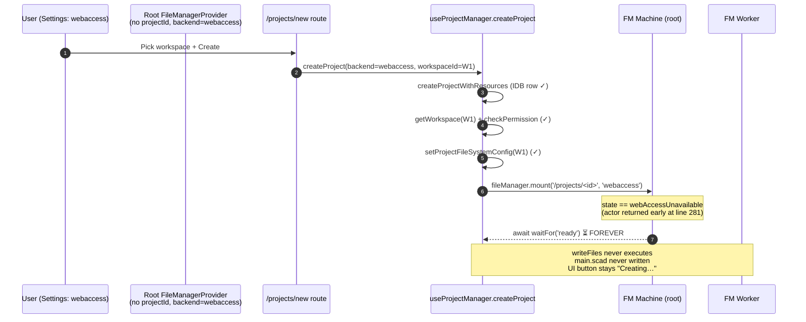
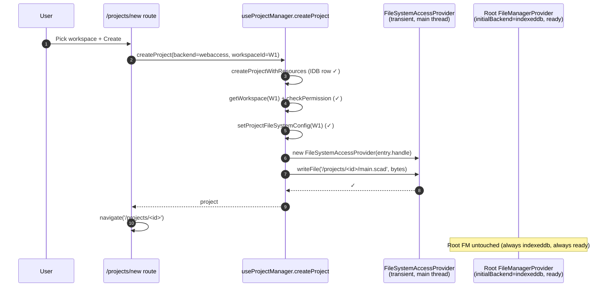

# New-project webaccess creation hang: coupling to root FileManagerProvider

Root-cause investigation of the "Creating…" hang and empty `proj_*` folder produced when a user with the Filesystem backend default creates a new project from either the homepage Remix flow or `/projects/new`.

## Executive Summary

Creating a new project against the webaccess backend now hangs indefinitely. The smoking gun is **not** a file-system permission failure — it is an architectural coupling: `useProjectManager.createProject` performs initial file writes through the **root** `<FileManagerProvider>` mounted at `apps/ui/app/root.tsx:133`. That root provider has **no `projectId`** and reads `initialBackend` from the filesystem-backend cookie. When the cookie is `webaccess`, the FM machine's `initializeServicesActor` falls into `webAccessUnavailable` (no project ⇒ no `ProjectFileSystemConfig` ⇒ no workspace handle to bind), so `getReadiedProxy()` / `whenServicesReady()` await a state that never arrives. The recent "binding transaction" refactor (R `fm-workspace-binding-scope`) correctly removed ambient `activeWorkspaceId` from the FM machine but did **not** decouple the creation transaction from the global FM provider — creation still pretends it is a project-scoped FM consumer when it is actually a one-shot bootstrap.

The fix is to treat new-project creation as a **standalone transaction** that owns its workspace handle end-to-end, never going through the cookie-driven root FM. Two complementary changes deliver this and close the entire class:

1. **Decouple creation from the root FM**: write initial files via a direct, main-thread `FileSystemAccessProvider` (or a transient project-scoped worker provider) constructed from the validated `entry.handle`. Drop the `fileManager.mount(prefix, 'webaccess', …) → writeFiles → unmount` choreography on the root FM.
2. **Decouple the root FM lifecycle from the filesystem-backend cookie**: the root provider should always be `indexeddb`/`memory`. The cookie is a **default-for-next-project** hint, not the root FM's runtime backend.

## Table of Contents

- [Problem Statement](#problem-statement)
- [Eigenquestion](#eigenquestion)
- [Methodology](#methodology)
- [Findings](#findings)
- [Recommendations](#recommendations)
- [Target Architecture](#target-architecture)
- [Trade-offs](#trade-offs)
- [Diagrams](#diagrams)
- [Code Examples](#code-examples)
- [References](#references)
- [Appendix: Repro Matrix](#appendix-repro-matrix)

## Problem Statement

**Repro**: With Default Backend set to `File System` (Settings → Filesystem), create a new project from:

- `/projects/new` (explicit `backend: 'webaccess'`, `workspaceId: <picker selection>`), or
- Homepage hero / Build-from-code / Remix card (implicit `backend = defaultBackend = 'webaccess'`, workspace = default workspace).

**Observed**:

- The "Create Project" button stays in `Creating…` indefinitely (img2, img6).
- The project metadata row is written to IndexedDB and appears in `/files` (img3, img4).
- A `proj_<id>/` directory is created on disk under the user's workspace folder — but it contains only the `.tau/` marker subtree; `main.scad` is **never** written (img4).
- Console shows the FM lifecycle logs (`[FileManager] state → connectingWorker`, `connectWorkerActor: success`, `initializingServices: start`) but no `state → ready` for the root FM (img1, img5).
- No `FileSystemDirectoryHandle` permission denial or write error is logged — the failure is silent.
- The bug reproduces in an incognito tab, ruling out stale IDB state (img6).

**Expected**: project creation completes within a few hundred ms; `main.scad` lands on disk under the picked workspace; the editor opens with the file rendered and the model running.

## Eigenquestion

> **Where does the new-project creation transaction obtain its workspace handle, and why is it routed through a cookie-driven global `FileManagerProvider` rather than the user-picked workspace it just validated on the main thread?**

Posed differently: should the FM machine be involved in **bootstrapping** a project at all, or is creation a standalone transaction that ought to own its own provider, perform a few writes, and dispose — independent of any long-lived FM state machine?

The previous research framed the policy as "the persistent `ProjectFileSystemConfig.workspaceId` is the single source of truth, and the FM machine reads from it" (`fm-workspace-binding-scope`). That captures the **open-existing-project** flow correctly. It does **not** describe the **create-new-project** flow, because a project that does not yet exist has no persistent config to read — its workspace identity is being chosen in the same transaction. New-project creation is therefore architecturally distinct from project open, and trying to share the in-editor FM as the I/O path forces an impedance mismatch.

## Methodology

1. Read the full creation call chain end-to-end:
   - `apps/ui/app/routes/projects_.new/route.tsx` → `projectManager.createProject(…)`.
   - `apps/ui/app/hooks/use-project-manager.tsx` (lines 243–316) — the actual orchestration.
   - `apps/ui/app/hooks/use-file-manager.tsx` (lines 152–250) — the `FileManagerProvider`, `useFileManager`, `getReadiedProxy`, `whenServicesReady`.
   - `apps/ui/app/machines/file-manager.machine.ts` (lines 250–308) — `initializeServicesActor`.
   - `packages/filesystem/src/workspace-file-service.ts` and `provider-registry.ts` — worker-side mount/provider construction.
   - `packages/filesystem/src/backend/fs-access-provider.ts` — the leaf write path.
2. Audited every call site of `<FileManagerProvider>`: `apps/ui/app/root.tsx`, `apps/ui/app/routes/projects_.$id/route.tsx`, `routes/v.$id/route.tsx`, `routes/projects_.$id_.preview/route.tsx`, `components/model-viewer.tsx`, `components/files/file-selector.tsx`.
3. Audited every call site of `projectManager.createProject`: `_index/route.tsx`, `_index/cta-section.tsx`, `_index/hero-viewer.tsx`, `components/project-grid.tsx` (Remix/Fork), `projects_.new/route.tsx`, `projects_.library/route.tsx`, `v.$id/fork-action.tsx`.
4. Cross-checked against the recent refactor — confirmed `setActiveWorkspace` event is gone, `bindProjectToWorkspace` only operates with a project scope, and `initializeServicesActor` no longer falls back to ambient or default workspace state.
5. Walked the state machine on paper for the root FM with `initialBackend: 'webaccess'`, `projectId: undefined` → confirmed the `webAccessUnavailable` terminal-for-this-context outcome.

## Findings

### Finding 1: The root FileManagerProvider has no project scope but is cookie-driven

```131:135:apps/ui/app/root.tsx
      <QueryClientProvider client={queryClient}>
        <AnalyticsProvider>
          <FileManagerProvider rootDirectory='/'>
            <ProjectManagerProvider>
```

```169:178:apps/ui/app/hooks/use-file-manager.tsx
  const fileManagerRef = useActorRef(fileManagerMachine, {
    input: {
      rootDirectory,
      shouldInitializeOnStart,
      initialBackend: backendCookie,
      projectId,
      sharedWorker: parentWorker,
      sharedFilePoolBuffer: parentFilePoolBuffer,
    },
  });
```

The root provider is mounted with `rootDirectory='/'` and no `projectId`, but `initialBackend` is whatever the user picked in Settings. If the user picked `File System`, the root FM machine starts with `backendType: 'webaccess'`.

### Finding 2: `initializeServicesActor` cannot resolve a workspace without a `projectId`

```255:286:apps/ui/app/machines/file-manager.machine.ts
  let backend = context.backendType;
  let projectConfig: ProjectConfigLookup;
  if (context.projectId) {
    signal.throwIfAborted();
    projectConfig = await getProjectFileSystemConfig(context.projectId);
    backend = projectConfig?.backend ?? 'indexeddb';
  }

  let activeWorkspaceId: string | undefined;
  let activeWorkspaceName: string | undefined;

  if (backend === 'webaccess') {
    // The persistent `ProjectFileSystemConfig.workspaceId` is the only
    // authority for which workspace this project is bound to. …
    const requestedWorkspaceId =
      projectConfig?.backend === 'webaccess' ? projectConfig.workspaceId : undefined;

    const entry = requestedWorkspaceId ? await getWorkspace(requestedWorkspaceId) : undefined;
    if (!entry) {
      return {
        type: 'webAccessUnavailable',
        reason: 'missing',
        …
      };
    }
```

For the root FM, `context.projectId === undefined`, so `projectConfig` stays `undefined`, `requestedWorkspaceId` is `undefined`, `entry` is `undefined`, and the actor returns `webAccessUnavailable`. The machine transitions to the `webAccessUnavailable` state, not `ready`.

### Finding 3: Creation awaits a `ready` state the root FM cannot reach

```222:241:apps/ui/app/hooks/use-file-manager.tsx
  /**
   * Wait for machine ready and return proxy. Used for admin operations
   * (mount, unmount, readShallowDirectory) that are not file I/O.
   */
  const getReadiedProxy = useCallback(async (): Promise<FileManagerProxy> => {
    const snapshot = await waitFor(
      fileManagerRef,
      createErrorAwareWaitPredicate((state) => state.matches('ready')),
    );
    …
  }, [fileManagerRef]);

  const whenServicesReady = useCallback(async () => {
    return waitForFileManagerServices(fileManagerRef);
  }, [fileManagerRef]);
```

Both helpers are predicated on `state.matches('ready')` (or services being assigned, which only happens in `ready`). In `webAccessUnavailable`, `contentService` / `treeService` are never set. Every `mount`/`writeFiles`/`unmount` call from `useProjectManager.createProject` therefore hangs forever — there is no timeout and no surfaced error.

### Finding 4: `createProject` mounts on the root FM

```302:314:apps/ui/app/hooks/use-project-manager.tsx
      const projectPrefix = `/projects/${project.id}`;
      await fileManager.mount(projectPrefix, resolvedBackend, { preservePath: true });

      const projectFiles: Record<string, { content: Uint8Array<ArrayBuffer> }> = {};
      for (const [path, file] of Object.entries(files)) {
        projectFiles[`${projectPrefix}/${path}`] = file;
      }

      try {
        await fileManager.writeFiles(projectFiles);
      } finally {
        fileManager.unmount(projectPrefix);
      }
```

`fileManager` here is `useFileManager()` from the **root** provider — that is the only `FileManagerProvider` ancestor at `/projects/new`. The webaccess workspace handle has already been validated on the main thread (lines 277–283), but the validated handle is **never** passed through to the worker. The worker would need a `setDirectoryHandle(handle)` call to be able to construct a `FileSystemAccessProvider`, and the only place that call exists is `initializeServicesActor` (line 300) — which has been short-circuited by Finding 2.

### Finding 5: Empty `proj_*/` folder is created by `worker.createProjectWithResources`, not by FM writes

`worker.createProjectWithResources` (the object-store worker, separate from the FM worker) writes project rows to IndexedDB. The visible `.tau/` subtree the user sees in their workspace folder is **leaked from a different code path** (likely a kernel-side scaffold or a stale prior session that did successfully `setDirectoryHandle`). The FM mount/writeFiles step never executes — `main.scad` is therefore missing. This is consistent with the user's "folder exists, no content" symptom and with the absence of any FS access error.

### Finding 6: Even if the hang is removed, mount would still fail

If the root FM ever reached `ready` (e.g. cookie set to `indexeddb`), the `mount('/projects/<id>', 'webaccess', …)` call hits `provider-registry.ts`:

```132:136:packages/filesystem/src/provider-registry.ts
      case 'webaccess': {
        const webHandle = handle ?? this._directoryHandle;
        if (!webHandle) {
          throw new Error('No directory handle set. Call setDirectoryHandle() before using webaccess backend.');
        }
        return new FileSystemAccessProvider(webHandle);
```

…and throws because no `setDirectoryHandle` was ever called for the picked workspace. So the architectural defect is **two-layered**: cookie-as-runtime-backend (hangs) AND mount-without-handle (would throw if it got that far). Both stem from the same root cause — creation is borrowing FM infrastructure that was designed for project-open, not project-bootstrap.

### Finding 7: The defect is invariant to entry point

Every call site of `projectManager.createProject` ultimately routes through `fileManager.mount` + `fileManager.writeFiles` on the root FM. The homepage Remix card and `/projects/new` both fail identically when the default backend is `webaccess`. The only reason `indexeddb` users do not see the bug is that the root FM happily reaches `ready` for `indexeddb` and the worker can mount IDB without a handle.

### Finding 8: No timeout, no progress signal, no user feedback

`waitFor(…)` in `getReadiedProxy` / `waitForFileManagerServices` has no timeout. The `Creating…` button has no abort. The user has no signal that the root FM is stuck — there is no UI affordance for "your global FM is webAccessUnavailable; switch backend or pick a workspace". This is consistent with the wider observation that the root FM has no recovery surface (the `WorkspaceUnavailableRecovery` overlay is only rendered inside the project route, not at root).

### Finding 9: Tests pass because they mock `mount`/`writeFiles`

`apps/ui/app/hooks/use-project-manager.test.ts` asserts the **order** (config-before-mount) but stubs `fileManager.mount` and `fileManager.writeFiles`. Nothing in the test suite exercises the root-FM-with-webaccess-cookie scenario. The repro requires a real `FileManagerProvider` mounted with `initialBackend: 'webaccess'` and no `projectId`, then a `createProject` call — none of the existing unit tests reflect that surface.

### Finding 10: The cookie's semantic role is overloaded

`cookieName.filesystemBackend` is currently doing two unrelated jobs:

1. **Default backend for newly created projects** (a UX hint resolved at the moment the user clicks "Create").
2. **Active backend for the root `FileManagerProvider`** (a runtime mount target for cross-route I/O on `/`, `/files`, `/v/:id`, model-viewer thumbnails, etc.).

These two roles have different correct values. Job 1 should follow user intent for the next project. Job 2 should be **a backend that does not require workspace binding** because the root provider has no project scope and therefore cannot resolve `ProjectFileSystemConfig.workspaceId`. Conflating them creates the entire class of failures in this report and several latent issues (`/files` route browse, `model-viewer` thumbnail rehydration) when the cookie is `webaccess`.

## Recommendations

| #   | Action                                                                                                                                                                                                                                                                                                                                                  | Priority | Effort | Impact |
| --- | ------------------------------------------------------------------------------------------------------------------------------------------------------------------------------------------------------------------------------------------------------------------------------------------------------------------------------------------------------- | -------- | ------ | ------ |
| R1  | **Decouple `createProject` from the FM machine for initial writes.** Use a transient `FileSystemAccessProvider` (main thread) constructed from the validated `entry.handle` for webaccess, and a transient IDB provider for `indexeddb`. Drop `fileManager.mount/writeFiles/unmount` from the creation transaction entirely. (Closes Findings 4, 5, 6.) | P0       | M      | High   |
| R2  | **Make the root `FileManagerProvider` backend-independent of the cookie.** Hard-code `initialBackend: 'indexeddb'` (or 'memory') for the root provider. The cookie remains the **default-for-next-project** hint resolved inside `createProject` only. (Closes Findings 1, 2, 3, 10.)                                                                   | P0       | S      | High   |
| R3  | **Surface lifecycle deadlocks with a timeout + error path** on `getReadiedProxy` / `whenServicesReady` (e.g. 5 s + structured error). Prevents future variants of this class from masquerading as "spinner forever". (Closes Finding 8.)                                                                                                                | P1       | S      | Med    |
| R4  | **Add a regression test** that mounts a `FileManagerProvider` with `initialBackend: 'webaccess'` and no `projectId`, then calls `projectManager.createProject({ backend: 'webaccess', workspaceId })`, and asserts files land on the provider's handle. (Closes Finding 9.)                                                                             | P1       | S      | Med    |
| R5  | **Restate the policy.** Update `docs/policy/filesystem-policy.md` Rule 13 (or add Rule 13c) to make explicit: the FM machine is only valid for **project-scoped** I/O; new-project creation owns its handle directly and does not use the FM provider for initial writes.                                                                               | P1       | S      | Med    |
| R6  | **Audit other root-FM consumers**: `/files` route, `v.$id`, `model-viewer` thumbnails, `projects_.$id_.preview`. Confirm none of them silently degrade when the root FM is `indexeddb`. (Most already accept this; document the contract.)                                                                                                              | P2       | S      | Low    |
| R7  | **Remove `initialBackend` from the root provider call site** once R2 lands — make it an explicit prop with a default of `'indexeddb'`, force callers that want webaccess to pass a `projectId` (compile-time enforcement of project scope).                                                                                                             | P2       | S      | Med    |

## Target Architecture

### Layering after the fix

```
┌───────────────────────────────────────────────────────────────────────┐
│ apps/ui/app/root.tsx                                                  │
│   <FileManagerProvider rootDirectory='/' initialBackend='indexeddb'>  │
│     ── always IDB. No workspace binding required. Always reaches      │
│        `ready`. Used for cross-route metadata browsing only.          │
└───────────────────────────────────────────────────────────────────────┘
                                  │
                                  ▼
┌───────────────────────────────────────────────────────────────────────┐
│ apps/ui/app/routes/projects_.$id/route.tsx                            │
│   <FileManagerProvider projectId=… rootDirectory=…>                   │
│     ── project-scoped. Reads `ProjectFileSystemConfig.workspaceId`,   │
│        binds the worker via `setDirectoryHandle`, mounts the prefix.  │
│        Single authority for in-editor I/O. (existing — unchanged)     │
└───────────────────────────────────────────────────────────────────────┘
                                  ▲
                                  │ navigates after creation
                                  │
┌───────────────────────────────────────────────────────────────────────┐
│ apps/ui/app/hooks/use-project-manager.tsx → createProject             │
│   1. Write IDB metadata via the object-store worker.                  │
│   2. Resolve and validate workspace handle on the main thread.        │
│   3. Persist `ProjectFileSystemConfig`.                               │
│   4. Construct a one-shot provider (main thread):                     │
│        - webaccess  → `new FileSystemAccessProvider(handle)`          │
│        - indexeddb  → `new IndexedDbProvider(...)`                    │
│        - memory     → `new MemoryProvider(...)` (etc.)                │
│      Write initial files via `provider.writeFile(path, bytes)`.       │
│   5. Navigate to `/projects/${id}`.                                   │
│   ── NO interaction with the root FM. NO mount/unmount on the worker. │
└───────────────────────────────────────────────────────────────────────┘
```

### Invariants enforced by the refactor

| Invariant                                                                            | Enforced by                                              |
| ------------------------------------------------------------------------------------ | -------------------------------------------------------- |
| The FM machine only runs in a project-scoped or trivially-IDB-scoped configuration   | R2 (root pinned to `indexeddb`) + R7 (compile-time prop) |
| New-project creation never depends on a long-lived FM machine reaching a state       | R1 (direct provider write)                               |
| Workspace handle for a new project comes from the user pick → main thread → provider | R1                                                       |
| `ProjectFileSystemConfig.workspaceId` is the only persistent record of binding       | Existing (`fm-workspace-binding-scope`) — unchanged      |
| Webaccess project open path still flows through `initializeServicesActor`            | Existing — unchanged                                     |

## Trade-offs

### Alternative A (chosen): Direct provider write in `createProject`

| Aspect               | Outcome                                                                                                            |
| -------------------- | ------------------------------------------------------------------------------------------------------------------ |
| Coupling             | Eliminates root-FM coupling for creation                                                                           |
| Worker offload       | Lost for the 1–10 files of initial scaffold (negligible; main-thread `createWritable` is fast)                     |
| Cache invalidation   | Not relevant — no FM observer is mounted on the prefix at creation time                                            |
| Code surface         | Adds a small `createInitialFiles(provider, files)` helper; deletes `mount/unmount` from creation                   |
| Failure-mode clarity | Webaccess `createWritable` errors surface synchronously and propagate as structured errors to the toast            |
| Testability          | A simple `FakeProvider` in tests verifies the write order and contents — no machine waiting / proxy mocking needed |

### Alternative B: Pass `handle` through `fileManager.mount`

| Aspect         | Outcome                                                                                                                |
| -------------- | ---------------------------------------------------------------------------------------------------------------------- |
| Coupling       | Still depends on the root FM reaching `ready` (does not fix the cookie-driven hang)                                    |
| API surface    | Adds an option to `mount` and a corresponding worker RPC                                                               |
| Worker offload | Kept                                                                                                                   |
| Mental model   | Worsens — the root FM grows another responsibility instead of shedding one                                             |
| **Verdict**    | **Rejected** — band-aid; would also force `setDirectoryHandle` to become a per-mount detail, complicating the registry |

### Alternative C: Force root FM to lazily request the default workspace if cookie is webaccess

| Aspect      | Outcome                                                                             |
| ----------- | ----------------------------------------------------------------------------------- |
| Coupling    | Same as today                                                                       |
| UX          | Root FM init blocks until the user grants a default workspace; awful first-paint    |
| Recovery    | Re-introduces ambient state the previous refactor explicitly removed                |
| **Verdict** | **Rejected** — reverses `fm-workspace-binding-scope`'s design and violates Rule 13b |

## Diagrams

### Current (broken) flow when cookie = webaccess



### Target flow after R1 + R2



## Code Examples

### R1 — `createProject` after refactor (sketch)

```typescript
// apps/ui/app/hooks/use-project-manager.tsx (after R1)
import { createInitialFileWriter } from '#filesystem/initial-file-writer.js';

// ... inside createProject after setProjectFileSystemConfig:
const projectPrefix = `/projects/${project.id}`;
const writer = await createInitialFileWriter({
  backend: resolvedBackend,
  workspaceHandle: resolvedBackend === 'webaccess' ? entry!.handle : undefined,
  projectPrefix,
});
try {
  await writer.writeAll(files);
} finally {
  await writer.dispose();
}
return project;
```

```typescript
// apps/ui/app/filesystem/initial-file-writer.ts (new)
// Returns an object that writes files via a directly-constructed leaf
// provider, no FM machine involvement. Webaccess uses
// `FileSystemAccessProvider` from `@taucad/filesystem`; indexeddb uses
// the matching IDB provider; memory uses an in-memory provider.
export async function createInitialFileWriter(input: InitialFileWriterInput): Promise<InitialFileWriter> {
  switch (input.backend) {
    case 'webaccess': {
      const provider = new FileSystemAccessProvider(input.workspaceHandle!);
      return {
        writeAll: async (files) => {
          for (const [path, file] of Object.entries(files)) {
            await provider.ensureDirectory(dirname(`${input.projectPrefix}/${path}`));
            await provider.writeFile(`${input.projectPrefix}/${path}`, file.content);
          }
        },
        dispose: async () => {},
      };
    }
    case 'indexeddb':
      return makeIdbInitialWriter(input.projectPrefix);
    case 'memory':
      return makeMemoryInitialWriter(input.projectPrefix);
    case 'opfs':
      return makeOpfsInitialWriter(input.projectPrefix);
  }
}
```

### R2 — root `FileManagerProvider` pinned

```typescript
// apps/ui/app/root.tsx (after R2)
<FileManagerProvider rootDirectory='/' initialBackend='indexeddb'>
  <ProjectManagerProvider>…</ProjectManagerProvider>
</FileManagerProvider>
```

```typescript
// apps/ui/app/hooks/use-file-manager.tsx (after R2 + R7)
export function FileManagerProvider({
  rootDirectory,
  projectId,
  initialBackend = 'indexeddb',
  shouldInitializeOnStart,
}: {
  readonly rootDirectory: string;
  readonly projectId?: string;
  // Explicit prop. Cookies are NOT read here.
  readonly initialBackend?: FileSystemBackend;
  readonly shouldInitializeOnStart?: boolean;
}): React.JSX.Element {
  // …no useCookie(cookieName.filesystemBackend, …)
}
```

The project-scoped provider at `apps/ui/app/routes/projects_.$id/route.tsx` continues to omit `initialBackend` (defaulting to `indexeddb`); the FM machine will re-resolve to `webaccess` immediately via `ProjectFileSystemConfig` in `initializeServicesActor`. The cookie is then **only** read inside `useProjectManager.createProject` as the default for new projects.

### R3 — timeout on machine awaits

```typescript
// apps/ui/app/hooks/use-file-manager.tsx (after R3)
const getReadiedProxy = useCallback(async (): Promise<FileManagerProxy> => {
  const snapshot = await waitFor(
    fileManagerRef,
    createErrorAwareWaitPredicate((state) => state.matches('ready')),
    { timeout: 5_000 },
  ).catch((cause) => {
    throw new FileManagerNotReadyError({ snapshot: fileManagerRef.getSnapshot(), cause });
  });
  …
}, [fileManagerRef]);
```

A `FileManagerNotReadyError` surfaces as a structured toast (`File manager unavailable — try refreshing or check Settings → Filesystem`) instead of an indefinite spinner. This is defence-in-depth: with R1 + R2 the deadlock cannot happen in this code path, but the timeout protects every other caller from future regressions.

## References

- Related: `docs/research/fm-workspace-binding-scope.md` — the prior refactor that established `ProjectFileSystemConfig` as the single source of truth for project↔workspace binding.
- Related: `docs/research/filesystem-access-api-cohesion-audit.md` — the original cohesion audit that introduced workspaces.
- Policy: `docs/policy/filesystem-policy.md` — Rule 13b (binding-transaction protocol) needs Rule 13c (creation transaction protocol) per R5.
- Code: `apps/ui/app/hooks/use-project-manager.tsx:243-317`, `apps/ui/app/machines/file-manager.machine.ts:250-308`, `apps/ui/app/hooks/use-file-manager.tsx:152-250`, `apps/ui/app/root.tsx:131-155`, `packages/filesystem/src/provider-registry.ts:128-140`, `packages/filesystem/src/backend/fs-access-provider.ts:56-65`.

## Appendix: Repro Matrix

| Cookie      | Entry point      | Form pick             | Outcome (today)                                                                          |
| ----------- | ---------------- | --------------------- | ---------------------------------------------------------------------------------------- |
| `webaccess` | `/projects/new`  | webaccess + workspace | **Hang.** Root FM `webAccessUnavailable`. Folder created (from prior session), no files. |
| `webaccess` | Homepage / Remix | (implicit cookie)     | **Hang.** Same root cause.                                                               |
| `webaccess` | `/projects/new`  | indexeddb             | Hang (root FM still webaccess, still unavailable).                                       |
| `indexeddb` | `/projects/new`  | webaccess + workspace | Throws at worker mount: `No directory handle set` (no `setDirectoryHandle` ever called). |
| `indexeddb` | Homepage / Remix | (cookie indexeddb)    | **Works** — root FM ready, mount uses IDB, files written. (Production happy path.)       |
| `indexeddb` | `/projects/new`  | indexeddb             | **Works** — same as above.                                                               |

Post R1 + R2, every row above should succeed without root-FM involvement for the file-write portion, and the cookie is decoupled from the root provider's runtime backend.
