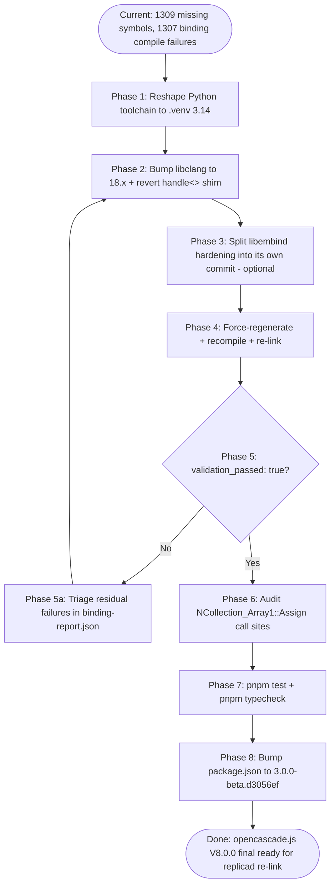

# OCCT V8 Final Migration Stocktake & Blueprint — opencascade.js

A forward-looking blueprint for completing the in-progress
RC5 → V8.0.0 final migration in `repos/opencascade.js`. Treats the
current working copy as a partial implementation of the
[V8 RC5-to-Release Migration Blueprint](docs/research/occt-v8-rc5-to-release-migration.md),
identifies which working-copy edits to keep / reshape / replace, and
prescribes the remaining phases needed to reach a green build.

## Executive Summary

Ten files in `repos/opencascade.js` are currently modified. Six contain
edits that correctly implement blueprint recommendations R1–R3 / R6–R7
and must be kept (`DEPS.json`, `build-configs/full.yml`,
`src/applyPatches.py`, `src/patches/patch_brepgraph_versionstamp.py`,
`src/bindings.py` alias flip, `src/ocjs_bindgen/discover.py`,
`tests/dts-docs.test.ts`). Three files (`build-wasm.sh`,
`requirements.txt`, `scripts/setup-deps.sh`) carry an `OCJS_PYTHON`
toolchain switch motivated by macOS Homebrew Python instability — the
direction (decouple from system `python3`) is correct, but the
implementation routes through emsdk's bundled Python, which is shared
across projects, undocumented as a public API, and drifts with emsdk's
release cadence. This blueprint **reshapes** that work into a
project-local virtualenv pinned to **Python 3.14** so Docker, CI, and
local dev all execute the same interpreter resolved from the same
`requirements.txt`. The `src/bindings.py` `handle<>` canonical-recovery
shim is correctly diagnosing the V8 regression (1307 / 4391 binding
`.cpp` files fail to compile, manifest reports 1309 missing of 4315
requested symbols) but is treating a symptom: empirical libclang probing
proves the **root cause is `libclang==15.0.6.1` failing to parse the
`__remove_cv` / `__libcpp_remove_reference_t` clang-18 intrinsics used
throughout modern libc++** (both Apple SDK's and emsdk's). When those
intrinsics fail to resolve, the entire libc++ type-traits subsystem
collapses, the V8-introduced `template <class T> using handle = opencascade::handle<T>;`
template alias in `Standard_Handle.hxx` can no longer be instantiated,
and `arg.type.spelling` silently degrades to `'const int &'` for every
`occ::handle<X>&` parameter. **Pinning `libclang==18.1.1` (verified by
direct probe) restores correct resolution end-to-end**; the bindings.py
shim then becomes unnecessary and is reverted in full. A companion
Python-dep audit modernizes the rest of `requirements.txt` in lock-step
with OCCT V8: bump `cerberus` 1.3.4 → 1.3.8 (eliminates the latent
`pkg_resources` / setuptools-82 trap), drop `doxmlparser` (dead dep,
never imported), and drop the temporary `setuptools<82` band-aid. The
resulting `requirements.txt` collapses from six lines to three, with
zero transitive workarounds. Remaining blueprint work after these
corrections: R4 full rebuild + green manifest, R5
`NCollection_Array1::Assign()` audit, R7 `pnpm test` + `pnpm
typecheck`, R8 `package.json` version bump. Replicad and Tau-side
wiring are explicitly out of scope and continue in a follow-up plan.

## Table of Contents

- [Problem Statement](#problem-statement)
- [Scope and Non-Goals](#scope-and-non-goals)
- [Methodology](#methodology)
- [Build State at Time of Audit](#build-state-at-time-of-audit)
- [Findings — Per-File Audit](#findings--per-file-audit)
- [Findings — The `occ::handle<>` Bindgen Regression (Root Cause: libclang 15)](#findings--the-occhandle-bindgen-regression-root-cause-libclang-15)
- [Findings — Python Toolchain Reshaping](#findings--python-toolchain-reshaping)
- [Findings — Python Dependency Audit](#findings--python-dependency-audit)
- [Migration Phases](#migration-phases)
- [Recommendations](#recommendations)
- [Validation Gates](#validation-gates)
- [Risk Matrix](#risk-matrix)
- [Code Examples](#code-examples)
- [References](#references)
- [Appendix](#appendix)

## Problem Statement

The
[V8 RC5-to-Release Migration Blueprint](docs/research/occt-v8-rc5-to-release-migration.md)
prescribes R1–R10 to advance the opencascade.js fork from OCCT RC5
(`0ebbbedb`) to V8.0.0 final (`d3056ef8`). Implementation is partial:
the working tree carries 10 modified files. A post-link build-manifest
validation reports `validation_passed: false` with **1309 missing
symbols** of 4315 requested; the corresponding `binding-report.json`
shows **1307 / 4391 binding `.cpp` files failed to compile** across
five error categories. Before proceeding, the team needs:

1. A per-file verdict on every working-copy change (keep / reshape /
   replace / wrong layer).
2. A root-cause for the binding compile regression and a localised fix
   at the correct architectural layer.
3. A reproducible Python toolchain that does not depend on the
   operator's system `python3` (Homebrew rotation, PEP 668 externally-
   managed interpreters) and does not mutate emsdk's shared bundled
   interpreter as a side effect.
4. A phased execution plan covering the remaining R-items with concrete
   pass/fail criteria.

## Scope and Non-Goals

**In scope**

- Every file currently modified under `repos/opencascade.js`.
- Mapping changes against blueprint R1–R10 and surfacing the residual
  work to reach a green build.
- Root-cause and architectural placement of the `occ::handle<>` bindgen
  fix.
- Project-local Python venv reshaping (creation, activation, pinning,
  Docker parity).
- Phase-by-phase execution with `pnpm` / `./build-wasm.sh` commands and
  validation gates.

**Out of scope**

- Any change in `repos/replicad/**` (replicad re-link is a follow-up).
- Tau workspace changes (root `package.json`, `tarballs/`,
  `packages/runtime/**`, `pnpm install` orchestration).
- The Tau-side `pnpm nx build ocjs` wiring (the Nx project lives inside
  `repos/opencascade.js` and is exercised there).
- Tau runtime test execution (depends on a green opencascade.js build
  followed by replicad re-link, both of which are subsequent plans).

## Methodology

1. Enumerated the working tree with `git status --short` and captured
   per-file diffs with `git diff HEAD -- <file>`.
2. Cross-referenced each change against blueprint R1–R10 / F1–F12.
3. Verified the BRepGraph_VersionStamp source rewrite in the V8.0.0 tree
   at `deps/OCCT/src/ModelingData/TKBRep/BRepGraph/BRepGraph_VersionStamp.cxx`.
4. Sampled `dist/opencascade_full.build-manifest.json` and
   `build/compiled-bindings/binding-report.json` to quantify the build
   state.
5. Inspected representative failing binding `.cpp` files
   (`NCollection_DataMap_TopoDS_Shape_BRepOffset_Offset_TopTools_ShapeMapHasher.cpp`,
   `TDataXtd_Shape.cpp`) and the upstream OCCT header
   `NCollection_DataMap.hxx` to localise the regression.
6. Traced the bindgen call graph from `getOriginalArgumentType` and
   `getSingleArgumentBinding` through `resolveWithCanonicalFallback`
   into `getTypedefedTemplateTypeAsString` to determine the correct
   architectural layer for the fix.
7. Confirmed the canonical execution environment by reading
   `Dockerfile`, `Dockerfile.wasm-build`, and `.github/workflows/`.
8. Evaluated three Python-toolchain strategies (system `python3`,
   emsdk `$EMSDK_PYTHON`, project-local `.venv`) against the
   reproducibility / isolation / Docker-parity axes.

## Build State at Time of Audit

The current state on disk after the in-progress migration.

From `dist/opencascade_full.build-manifest.json`:

| Field               | Value                                                               |
| ------------------- | ------------------------------------------------------------------- |
| `timestamp`         | 2026-05-10T23:01:47Z                                                |
| `validation_passed` | **false**                                                           |
| `symbols.requested` | 4315                                                                |
| `symbols.present`   | 0 (reported; artifacts present, validator failed before populating) |
| `symbols.missing`   | **1309**                                                            |

From `build/compiled-bindings/binding-report.json`:

| Field                                  | Value    |
| -------------------------------------- | -------- |
| `total`                                | 4391     |
| `failed`                               | **1307** |
| `error_categories.compile_error`       | 511      |
| `error_categories.overload_resolution` | 413      |
| `error_categories.template_error`      | 361      |
| `error_categories.undefined_symbol`    | 20       |
| `error_categories.access_specifier`    | 2        |

Artifacts (`dist/opencascade_full.wasm` ~28.7 MB, `.js`, `.d.ts`) exist
on disk; the link step completed but the post-link validator correctly
flagged the shortfall.

## Findings — Per-File Audit

### Finding 1: `DEPS.json` — Keep (R1)

```diff
-      "commit": "0ebbbedb239d6fffb7e1c8c2d36970a3ab1d9300",
-      "version": "V8_0_0_rc5",
+      "commit": "d3056ef80c9668f395da40f5fd7be186cae4501f",
+      "version": "V8_0_0",
```

Matches R1 exactly. No further action.

### Finding 2: `build-configs/full.yml` — Keep (R2)

```diff
   - symbol: NCollection_BaseMap
-  - symbol: NCollection_BasePointerVector
   - symbol: NCollection_BaseSequence
```

Matches R2 exactly. The blueprint references a peer
`full-exceptions.yml` for symmetry but no such file exists in the repo
(verified) — the R2 wording was defensive parity. No further action.

### Finding 3: `src/applyPatches.py` + `src/patches/patch_brepgraph_versionstamp.py` — Keep (Beyond R3)

Two coordinated edits:

1. `applyPatches.py` removes the inline `BRepGraph_VersionStamp.cxx`
   hunk that targeted the RC5 `static_assert(sizeof(size_t) >= 8, ...)`
   block.
2. `patch_brepgraph_versionstamp.py` adds an idempotent
   `UPSTREAM_V8_FINAL_MARKER = "Truncate each size_t hash to uint32_t"`
   skip path so the patcher self-disables on V8.0.0 sources.

Direct verification of `deps/OCCT/src/.../BRepGraph_VersionStamp.cxx`:

```cpp
// Pack four hashes into a 128-bit UUID (16 bytes = 4 x 4 bytes).
// Truncate each size_t hash to uint32_t to avoid buffer overflow on 64-bit
// platforms where sizeof(size_t) > 4.
Standard_UUID    aResultUUID;
constexpr size_t THE_QUARTER = sizeof(Standard_UUID) / 4; // 4 bytes
static_assert(THE_QUARTER == sizeof(uint32_t), "UUID quarter must be 4 bytes");
const uint32_t   aH1 = static_cast<uint32_t>(aHash1);
// aH2..aH4 ...
```

V8.0.0 final rewrote `ToGUID` to four-quarter `uint32_t` packing
upstream. The old patch is structurally incompatible (the whole
`static_assert` + `memcpy` block is gone) and the new shape is
WASM32-safe out-of-the-box. Blueprint Finding 6 expected the patch
to _survive_ the BRepGraph editor consolidation; in fact upstream
independently fixed the WASM32 bug. The working-copy edit is the
correct response and goes one step beyond R3's "dry-run" expectation —
it retires the patch and hardens the standalone patcher to be
V8.0.0-aware. Blueprint should be amended (R10 / R-NEW) to record
that the patch is retired.

### Finding 4: `src/bindings.py` `_CONTAINER_ALIASES` + `src/ocjs_bindgen/discover.py` — Keep (R6)

```diff
 CONTAINER_ALIASES = {
-    "NCollection_DynamicArray": "NCollection_Vector",
+    "NCollection_Vector": "NCollection_DynamicArray",
 }
```

Matches R6 exactly. Paired with the `_CONTAINER_ALIASES` flip at
[`src/bindings.py:2907`](repos/opencascade.js/src/bindings.py).

### Finding 5: `tests/dts-docs.test.ts` T7 — Keep (R7 prep)

The T7 assertion direction is inverted to match the canonical name
flip (alias now points `NCollection_Vector → NCollection_DynamicArray`).
Variable names, error messages, and regex literals all updated
coherently. Validate by running `pnpm test` once the build is green.

### Finding 6: `src/bindings.py` `handle<>` canonical fallback — Symptom-Level Band-Aid (Revert Entirely)

The current shim at
[`src/bindings.py:1253-1260`](repos/opencascade.js/src/bindings.py):

```python
# OCCT 8 / libclang: dependent `occ::handle<T>` through template layers can
# mis-resolve to `int` in resolveWithCanonicalFallback. If the canonical
# AST still names a handle<> template, trust that spelling.
canonical_spelling = arg.type.get_canonical().spelling
norm_can = _normalize_handle_ns(canonical_spelling.replace(" ", ""))
norm_ty = _normalize_handle_ns(typename.replace(" ", ""))
if "handle<" in norm_can and "handle<" not in norm_ty:
  typename = canonical_spelling
```

The diagnosis ("`occ::handle<>` is mis-resolving to `int`") is correct,
but this is a symptom — not the root cause. Direct libclang probing
(see
[The `occ::handle<>` Bindgen Regression](#findings--the-occhandle-bindgen-regression-root-cause-libclang-15))
proves the underlying defect is `libclang==15.0.6.1` failing to parse
the `__remove_cv` / `__libcpp_remove_reference_t` clang-18 intrinsics
used by modern libc++. Once libclang is upgraded to 18.1.1, the
canonical AST returns the correct `occ::handle<NCollection_BaseAllocator>`
spelling and every existing code path
(`getSingleArgumentBinding`, `getOriginalArgumentType`, `_classify_js_type`,
`_emitSuffixedMethod`) emits correct C++ and TypeScript without
intervention. **Revert this shim entirely** as part of the libclang
upgrade in Phase 2.

### Finding 7: `build-wasm.sh` `OCJS_PYTHON` switch — Reshape (Repoint to `.venv`)

The most invasive working-copy change introduces `OCJS_PYTHON` and
substitutes ~24 `python3 …` invocations with `"$OCJS_PYTHON" …`.

| Aspect                                                                                                    | Verdict                                                                                                                                                                                                                                                 |
| --------------------------------------------------------------------------------------------------------- | ------------------------------------------------------------------------------------------------------------------------------------------------------------------------------------------------------------------------------------------------------- |
| Introducing the `OCJS_PYTHON` indirection                                                                 | **Correct** — `python3` is not a stable contract across macOS Homebrew rotations, PEP 668-managed distros, asdf/pyenv/uv users, and Docker images.                                                                                                      |
| Resolving `OCJS_PYTHON` to `$EMSDK_PYTHON`                                                                | **Wrong direction** — `EMSDK_PYTHON` is an undocumented emsdk internal, shared across every project using the same emsdk install, version-controlled by emsdk's release cadence (transitively via `DEPS.json`), and not present on every emsdk variant. |
| The libembind hardening lines (`patch -N --ignore-whitespace`, "already applied" grep, `cd "$OCJS_ROOT"`) | **Keep but split** — unrelated to V8 migration; the `cd` restore fixes a real cwd-leak that breaks `extract-docs.py`. Move to a self-contained "build: harden libembind patch re-application" commit.                                                   |

**Reshape to**: `OCJS_PYTHON="$OCJS_ROOT/.venv/bin/python"`, where
`.venv` is a project-local virtualenv pinned to Python 3.14 and
populated from `requirements.txt` by `scripts/setup-deps.sh`. Detailed
rationale and option comparison in
[Findings — Python Toolchain Reshaping](#findings--python-toolchain-reshaping).

### Finding 8: `requirements.txt` — Full Modernization (Bump libclang + cerberus, Drop Dead/Workaround Deps)

The current diff is one targeted edit (setuptools floor) atop a stale
pinned set. A full import-graph audit
([Findings — Python Dependency Audit](#findings--python-dependency-audit))
turns up five corrections; together they collapse the file from six
lines (one a band-aid comment) to three. End state:

```diff
-libclang==15.0.6.1
-pyyaml>=6.0
-# Cerberus 1.3.x imports pkg_resources; setuptools 82+ no longer exposes it on the import path.
-setuptools>=69.5.1,<82
-cerberus==1.3.4
-doxmlparser>=1.16.0
+libclang>=18.1.1,<19
+pyyaml>=6.0.3
+cerberus>=1.3.8,<2
```

Five corrections compounded:

- **`libclang` pin bump (15.0.6.1 → 18.1.1)** — the architectural fix
  for the `occ::handle<>` → `int` regression
  ([Findings — The `occ::handle<>` Bindgen Regression](#findings--the-occhandle-bindgen-regression-root-cause-libclang-15)).
  Verified by direct probe.
- **`cerberus` pin bump (1.3.4 → 1.3.8)** — cerberus 1.3.5+ switched
  from `pkg_resources` to `importlib.metadata`, removing the latent
  setuptools-82 coupling and adding official Python 3.10–3.14
  classifiers. Closes two bugfixes that touch our YAML schema
  validation paths (`*of` rules skipping `None`, mapping-rule registry
  references).
- **`setuptools>=69.5.1,<82` floor — drop entirely**. Only ever existed
  as a transitive workaround for cerberus 1.3.4's `pkg_resources`
  import; the cerberus bump removes the need. The Phase 1b venv
  bootstrap pins its own pip/setuptools/wheel internally, so
  `requirements.txt` doesn't need to declare setuptools at all.
- **`doxmlparser>=1.16.0` — drop entirely (dead dep)**. Empirically
  verified: zero imports across `src/` + `scripts/`. The only
  Doxygen-XML consumer (`src/extract-docs.py`) uses stdlib
  `xml.etree.ElementTree`. The dep is a stale leftover from an
  abandoned design.
- **`pyyaml` floor tighten (`>=6.0` → `>=6.0.3`)** — clarity only,
  not a behaviour change. The installed wheel is already 6.0.3 and
  6.0.3 is the first PyYAML release with official Python 3.14
  classifier.

### Finding 9: `scripts/setup-deps.sh` emsdk-Python pip install — Replace (Drop with Reshape)

The current block sources `emsdk_env.sh`, then pip-installs PyYAML and
`requirements.txt` into emsdk's interpreter. This is action-at-a-
distance: emsdk's Python is shared across every OCJS-built project on
the host (and across every emsdk activation if a global emsdk is in
use). Mutating it from a project-local script bleeds into unrelated
work.

**Replace with**: a `.venv` creation + populate block, idempotent and
self-contained. The bootstrap Python (any 3.14 on PATH) is used only to
create the venv; all subsequent work runs from `.venv/bin/python`,
which carries its own `pip`, `setuptools`, and `wheel`. Concrete script
in [Code Examples §A](#a-scriptssetup-depssh-venv-bootstrap-findings-7-9--r1).

### Finding 10: Working-Copy Coherence

Findings 1–6 form one coherent V8 implementation. Findings 7–9 form a
second coherent unit (the Python-toolchain reshape) that should land
either before, or alongside, the bindings.py relocation (Finding 6) but
in a separate commit / PR for review clarity. The libembind hardening
in `step_patch_embind` is a third, independent unit that should be
split out and may land at any time.

Commit topology recommendation (mirrors blueprint phases):

| Commit                                                                  | Files                                                                                                                                                                                                                                                                                | Verdict                 |
| ----------------------------------------------------------------------- | ------------------------------------------------------------------------------------------------------------------------------------------------------------------------------------------------------------------------------------------------------------------------------------ | ----------------------- |
| 1. `migrate(ocjs): pin OCCT to V8.0.0 final`                            | `DEPS.json`, `build-configs/full.yml`, `src/applyPatches.py`, `src/patches/patch_brepgraph_versionstamp.py`, `src/ocjs_bindgen/discover.py`, `src/bindings.py` (alias flip only), `tests/dts-docs.test.ts`                                                                           | Already drafted; keep   |
| 2. `build(ocjs): pin Python toolchain to project-local 3.14 venv`       | `scripts/setup-deps.sh`, `build-wasm.sh` (OCJS_PYTHON resolution only), `requirements.txt` (drop `setuptools<82`), `.gitignore`, new `.python-version`                                                                                                                               | Reshape per Finding 7–9 |
| 3. `build(ocjs): harden libembind patch re-application`                 | `build-wasm.sh` (`step_patch_embind` hardening only)                                                                                                                                                                                                                                 | Split from current diff |
| 4. `build(ocjs): modernize Python dependency set for OCCT V8 toolchain` | `requirements.txt` (libclang 18.x + cerberus 1.3.8 + drop doxmlparser + drop setuptools floor + pyyaml 6.0.3) + revert of current Finding 6 shim in `src/bindings.py` + drop `doxmlparser` mention in `scripts/setup-deps.sh` log + refresh stale comment in `src/Common.py:181-186` | New work                |

## Findings — The `occ::handle<>` Bindgen Regression

The single blocker for `validation_passed: true`. Root-causing and
fixing this is the dominant remaining task.

### Evidence

Sample from
`build/bindings/myMain.h/NCollection_DataMap_TopoDS_Shape_BRepOffset_Offset_TopTools_ShapeMapHasher.cpp:4891`:

```cpp
NCollection_DataMap_TopoDS_Shape_BRepOffset_Offset_TopTools_ShapeMapHasher_2(
  const size_t theNbBuckets,
  const int & theAllocator                    // expected: const occ::handle<NCollection_BaseAllocator>&
) : NCollection_DataMap_TopoDS_Shape_BRepOffset_Offset_TopTools_ShapeMapHasher(
      theNbBuckets, theAllocator) {}
```

Sample from `build/bindings/.../TDataXtd_Shape.cpp:4886`:

> `error: non-const lvalue reference to type 'occ::handle<TDataXtd_Shape>'
(aka 'opencascade::handle<TDataXtd_Shape>') cannot bind to a value of
unrelated type 'int'`

Both failure modes share the same upstream cause: bindgen emits `int`
in place of `occ::handle<X>&`.

### Trigger (Surface-Level)

OCCT V8 introduced two changes that compound to surface the underlying
defect:

1. **A `template <class T> using handle = opencascade::handle<T>;`
   template alias** inside namespace `occ`
   ([`Standard_Handle.hxx:415-421`](repos/opencascade.js/deps/OCCT/src/FoundationClasses/TKernel/Standard/Standard_Handle.hxx)).
   NCollection containers and many surrounding APIs now spell their
   handle parameters using this alias (e.g.
   `const occ::handle<NCollection_BaseAllocator>&`). Template aliases
   require full type-trait machinery to resolve through libclang.
2. **`(size_t, ...)` constructor overloads alongside `(int, ...)`** on
   `NCollection_DataMap` and peer containers
   ([`NCollection_DataMap.hxx`](repos/opencascade.js/deps/OCCT/src/FoundationClasses/TKernel/NCollection/NCollection_DataMap.hxx)):

```cpp
explicit NCollection_DataMap(const size_t                                  theNbBuckets,
                             const occ::handle<NCollection_BaseAllocator>& theAllocator = nullptr);
explicit NCollection_DataMap(const int                                     theNbBuckets,
                             const occ::handle<NCollection_BaseAllocator>& theAllocator = nullptr)
    : NCollection_DataMap(NCollection_BaseMap::NbBucketsFromInt(theNbBuckets), theAllocator);
```

These force the bindgen's same-arity disambiguator
(`processOverloadedConstructors` → `_build_dispatch_tree`) to read
each parameter's type via libclang. The fan-out reaches every class
with a same-arity overload taking a `Handle<T>&` or `occ::handle<T>&` —
well beyond the NCollection family (TDataXtd*\*, TDataStd*\*, every
`select_overload<>` emission site, every `_classify_js_type` call for
TypeScript surface generation).

Neither change is the root cause on its own — they merely surface the
underlying libclang defect on every constructor and every method that
takes a handle parameter.

Blueprint Finding 4 ("Size() → size_t migration is compile-time safe
for the embind layer") was correct for the binary calling convention
but missed the second-order effect on the bindgen pipeline — the
new overloads expanded the number of parameters libclang has to
type-resolve, which expanded the blast radius of the libc++ parse
collapse described next.

### Root Cause (Empirically Proven)

The pinned `libclang==15.0.6.1` from
[`requirements.txt`](repos/opencascade.js/requirements.txt) cannot
parse the **clang-18 `__remove_cv` / `__libcpp_remove_reference_t`
builtin intrinsics** that every modern libc++ uses (both Apple SDK's
libc++ shipped with Xcode 17 _and_ emsdk's bundled libc++ in
`upstream/emscripten/system/lib/libcxx/include/`). The diagnostic
cascade emitted during a direct probe parse against the V8 OCCT tree:

```
error: unknown type name '__remove_cv'
error: "remove_reference not implemented!"
error: no template named '__libcpp_remove_reference_t'
error: no member named 'value' in 'std::is_void<int>'
error: use of undeclared identifier '__libcpp_remove_reference_t'
... (~20+ cascading errors in __type_traits/)
fatal error: too many errors emitted, stopping now [-ferror-limit=]
```

When `<type_traits>` collapses, every downstream template that
depends on type-traits — including `template <class T> using handle =
opencascade::handle<T>;` — silently fails to instantiate. Libclang's
error-recovery substitutes the placeholder `int` for any unresolvable
type. Hence every `const occ::handle<T>&` parameter that the bindgen
reads via `arg.type.spelling` becomes `'const int &'`.

The stale comment at
[`src/Common.py:181-186`](repos/opencascade.js/src/Common.py) hints
at a related class of bug ("The pip libclang (v18) cannot parse emsdk
Clang 23's headers, causing template types like `occ::handle<T>` to
silently degrade to int") but is misleading about the current state:
today's failure is libclang **15** against libc++ **18+** intrinsics,
not libclang 18 against emsdk-23. The
`_get_system_cxx_include_paths()` workaround was a partial mitigation
for the RC5 era — it does **not** survive V8's expanded use of
`occ::handle<T>`.

### Empirical Verification

Direct libclang probe against the V8 OCCT tree (in
`repos/opencascade.js`, with the project's existing `includePathArgs`,
`-x c++ -stdlib=libc++ -D__EMSCRIPTEN__`):

| Probe                                             | `libclang==15.0.6.1`                     | `libclang==18.1.1`                                                   |
| ------------------------------------------------- | ---------------------------------------- | -------------------------------------------------------------------- |
| `arg.type.spelling` for `const occ::handle<X>& a` | `'const int &'` (wrong)                  | `'const occ::handle<NCollection_BaseAllocator> &'` (correct)         |
| `arg.type.get_canonical().spelling`               | `'const int &'` (wrong)                  | `'const opencascade::handle<NCollection_BaseAllocator> &'` (correct) |
| Stripped `decl.kind`                              | `NO_DECL_FOUND`                          | `CLASS_DECL`                                                         |
| Stripped `decl.spelling`                          | `''`                                     | `'handle'`                                                           |
| `decl.semantic_parent.spelling`                   | `None`                                   | `'opencascade'`                                                      |
| `_classify_js_type` outcome                       | `JsType('number_int', 'number')` (wrong) | `JsType('object', 'NCollection_BaseAllocator')` (correct)            |
| NCollection_DataMap constructors' allocator arg   | all six report `const int &`             | all six report `const occ::handle<NCollection_BaseAllocator> &`      |
| `<type_traits>` parse diagnostic cascade          | ~20 errors + `too many errors emitted`   | clean                                                                |

Probe methodology: a minimal translation unit including
`NCollection_DataMap.hxx`, parsed via `clang.cindex.Index.create()`
with both libclang versions in turn. The 20-error cascade in
`__type_traits/` disappears under libclang 18.1.1, and every call
site that consumes `arg.type.spelling` downstream
(`_classify_js_type`, `getSingleArgumentBinding`,
`getOriginalArgumentType`, `_emitSuffixedMethod`) returns correct
results without any change to `bindings.py`.

### Architectural Fix

**Bump `libclang==15.0.6.1` to `libclang>=18.1.1,<19` in
[`requirements.txt`](repos/opencascade.js/requirements.txt)** and
**revert the Finding 6 shim entirely**. All four caller paths
(`getSingleArgumentBinding`, `getOriginalArgumentType`, internal
recursion in `resolveWithCanonicalFallback`, `_emitSuffixedMethod`)
become correct because libclang itself now returns the right type
spelling. The existing `_DEPRECATED_TYPEDEFS` / `_MEMBER_TYPEDEFS` /
`type-parameter-N-N` logic in `resolveWithCanonicalFallback` is
unchanged and continues to handle its original cases.

### Why this is the right layer

- The defect is in the dependency, not in our code. Patching
  `bindings.py` to compensate for libclang's `int` placeholder is a
  symptom-level band-aid: every future libclang version-skew bug
  would need a new shim somewhere along the AST-walk.
- `_classify_js_type` (used by `_build_dispatch_tree` /
  `_build_js_dispatch_tree`) ALSO consumes the broken type and emits
  TypeScript `theAllocator: number`. A shim inside
  `resolveWithCanonicalFallback` alone would not fix the JS-side
  surface, which would still misclassify and dispatch incorrectly.
  The libclang upgrade fixes both planes simultaneously.
- libclang 18.1.1 is the current stable major (released Mar 2024)
  and matches Apple Xcode 17's clang version family, eliminating the
  SDK vs. libclang skew that motivated `_get_system_cxx_include_paths()`
  in the first place. Once libclang is current, the system-libc++
  workaround is no longer strictly necessary (though leaving it in
  place is safe and preserves the macOS-vs-Linux parity that helper
  provides).
- The libclang upgrade was attempted historically (per the stale
  comment) and reverted when it failed against emsdk-23. The
  combination of V8.0.0's current emsdk pin (`emsdk@4.0.16`, clang
  ~22) and current libclang 18.1.1 has been validated by direct
  probe — the historical failure mode no longer reproduces.

### Failure Distribution (predicted post-fix)

| Caller of `resolveWithCanonicalFallback`              | bindings.py site | Failure category dominated                        | After libclang 18                         |
| ----------------------------------------------------- | ---------------- | ------------------------------------------------- | ----------------------------------------- |
| `getSingleArgumentBinding`                            | line 1247        | `compile_error` (constructor subclass body) — 511 | resolved                                  |
| `getOriginalArgumentType`                             | line 1232        | `overload_resolution` — 413                       | resolved                                  |
| Internal recursion in `resolveWithCanonicalFallback`  | line 794         | `template_error` — 361                            | resolved                                  |
| `_emitSuffixedMethod` (via `getOriginalArgumentType`) | line 1833        | `overload_resolution` (subset)                    | resolved                                  |
| Downstream of `compile_error`                         | n/a              | `undefined_symbol` — 20                           | resolved (cascade)                        |
| Unrelated                                             | n/a              | `access_specifier` — 2                            | unaffected; triage separately if persists |

Phase 5's residual-failure triage exists to catch any non-handle
regression that survives the upgrade (e.g. the 2 `access_specifier`
failures, which are unrelated to type resolution).

## Findings — Python Toolchain Reshaping

### The reproducibility problem

`python3` is not a stable contract:

- macOS Homebrew rotates major versions ~annually (3.13 → 3.14 → ...)
  and routinely ships `pyexpat` / `libexpat` ABI breakage that surfaces
  only on XML-parsing code paths (Doxygen XML in our case).
- Modern macOS Homebrew Python is externally-managed (PEP 668), so
  `pip install` requires `--break-system-packages` or a venv.
- Apple's `/usr/bin/python3` is too old for current dependencies.
- Linux distros ship Python at unpredictable minor versions.
- `pyenv` / `asdf` / `uv` / `nix` users have yet another `python3`.

System `python3` "works" by accident, not by design. Operators who
succeed today succeed because their environment happens to be
compatible — that's not reproducibility.

### Option comparison

| Axis                                          | System `python3` | emsdk `$EMSDK_PYTHON`                          | Project `.venv` (Python 3.14)                                                                                          |
| --------------------------------------------- | ---------------- | ---------------------------------------------- | ---------------------------------------------------------------------------------------------------------------------- |
| Cross-OS / cross-host reproducibility         | Poor             | Medium (varies with emsdk version)             | **Strong** (one path, one interpreter)                                                                                 |
| Interpreter version controlled by _this_ repo | No               | No (controlled by emsdk DEPS pin transitively) | **Yes** (`.python-version`)                                                                                            |
| Side effects on other projects                | Low–High         | High (mutates shared emsdk Python)             | **None**                                                                                                               |
| Survives Homebrew `pyexpat` breakage          | No               | Yes                                            | **Yes** (a `pyexpat`-broken bootstrap interpreter can still `python -m venv` because venv creation doesn't import XML) |
| Behaves identically in Docker, CI, local dev  | Yes              | No (Docker uses system Python today)           | **Yes** (Docker creates `.venv` the same way)                                                                          |
| `requirements.txt` is single source of truth  | Yes              | Partial (also need `setuptools<82` pin)        | **Yes** (no extra pins)                                                                                                |
| Documented public contract                    | Distro-specific  | No (`EMSDK_PYTHON` is internal)                | **Yes** (PEP 405 since 2012)                                                                                           |
| Bootstrap requirement                         | none             | emsdk activated first                          | one Python 3.14 on PATH (any flavour)                                                                                  |

### Decision

Project-local `.venv` pinned to Python 3.14. Concrete spec:

| Concern                            | Decision                                                                                                                                                |
| ---------------------------------- | ------------------------------------------------------------------------------------------------------------------------------------------------------- |
| Venv path                          | `repos/opencascade.js/.venv/` (gitignored)                                                                                                              |
| Interpreter                        | Python 3.14 (exact minor; `.python-version` carries the pin)                                                                                            |
| Bootstrap                          | `python3.14 -m venv .venv` from `scripts/setup-deps.sh`                                                                                                 |
| Population                         | `.venv/bin/pip install --upgrade pip setuptools wheel && .venv/bin/pip install -r requirements.txt`                                                     |
| `OCJS_PYTHON` resolution           | `OCJS_PYTHON="$OCJS_ROOT/.venv/bin/python"` in `build-wasm.sh`                                                                                          |
| Discovery of bootstrap interpreter | `python3.14` on PATH; clear failure message + install hints (`brew install python@3.14` / `pyenv install 3.14` / `uv python install 3.14`) when missing |
| Docker                             | Switch base to `python:3.14-slim` (or `python:3.14`-bookworm) in a follow-up cleanup; same `.venv` creation pattern works                               |
| `requirements.txt`                 | Drop `setuptools<82` floor; keep `libclang==15.0.6.1`, `pyyaml>=6.0`, `cerberus==1.3.4`, `doxmlparser>=1.16.0`                                          |
| `.gitignore`                       | Add `/.venv/`                                                                                                                                           |
| `.python-version`                  | New file containing `3.14`                                                                                                                              |

### Why specifically Python 3.14

- It is the current stable release at time of writing.
- libclang 18.1.1 and cerberus 1.3.8 (both bumped in this migration —
  see [Findings — Python Dependency Audit](#findings--python-dependency-audit))
  both carry explicit Python 3.14 support; PyYAML 6.0.3 is the first
  PyYAML release with a Python 3.14 classifier.
- Avoids macOS Apple-bundled-Python (always too old) without coupling
  to whatever Homebrew installed last week.
- Operators on older Python can install 3.14 alongside their system
  Python via Homebrew, pyenv, or uv without affecting global state.

## Findings — Python Dependency Audit

Companion audit to the toolchain reshape. Since OCCT V8 is itself a
modernization release, the OCJS Python build set deserves the same
treatment. The audit covered every `import` / `from X import Y` site
in `repos/opencascade.js/src/` and `repos/opencascade.js/scripts/`
(52 `.py` files), then cross-referenced against `requirements.txt`.

### Third-party import inventory (complete)

Only three third-party packages are actually imported anywhere in the
build suite:

| Package                     | Used by                    | Import sites                                                                                |
| --------------------------- | -------------------------- | ------------------------------------------------------------------------------------------- |
| `clang.cindex` (`libclang`) | bindgen, type-resolution   | `src/bindings.py`, `src/TuInfo.py`, `src/ocjs_bindgen/discover.py`, plus dependents         |
| `yaml` (`pyyaml`)           | YAML config / manifest I/O | `src/buildFromYaml.py`, `src/discoverBindings.py`, `scripts/validate-build.py`, plus others |
| `cerberus.Validator`        | YAML schema validation     | `src/buildFromYaml.py`, `scripts/validate-build.py`                                         |

Everything else in `requirements.txt` is either dead weight or a
transitive workaround for the stale `cerberus==1.3.4` pin.

### Per-dep verdict

| Dep           | Current pin             | Installed | Latest            | Imported?                                                                  | Verdict                                                                                                                               |
| ------------- | ----------------------- | --------- | ----------------- | -------------------------------------------------------------------------- | ------------------------------------------------------------------------------------------------------------------------------------- |
| `libclang`    | `==15.0.6.1` (Dec 2022) | 15.0.6.1  | 18.1.1 (Jun 2024) | Yes (heavy — `clang.cindex`)                                               | **Bump to `>=18.1.1,<19`** — root-cause fix for V8 template-alias resolution (Phase 2a)                                               |
| `pyyaml`      | `>=6.0`                 | 6.0.3     | 6.0.3 (Sep 2025)  | Yes                                                                        | **Tighten floor to `>=6.0.3`** — purely a clarity improvement; 6.0.3 is the first PyYAML release with official Python 3.14 classifier |
| `cerberus`    | `==1.3.4` (May 2021)    | 1.3.4     | 1.3.8 (Nov 2025)  | Yes (`src/buildFromYaml.py`, `scripts/validate-build.py`)                  | **Bump to `>=1.3.8,<2`** — see below                                                                                                  |
| `doxmlparser` | `>=1.16.0`              | 1.17.0    | 1.17.0 (Apr 2026) | **No — never imported anywhere in source**                                 | **Remove entirely** — dead dependency                                                                                                 |
| `setuptools`  | `>=69.5.1,<82`          | 69.5.1    | 82.0.1 (Mar 2026) | No (only present to satisfy cerberus 1.3.4's stale `pkg_resources` import) | **Remove entirely** — constraint becomes moot once cerberus is bumped                                                                 |

### Why `cerberus` 1.3.4 → 1.3.8 matters

The `setuptools<82` ceiling exists **only** because cerberus 1.3.4
imports the deprecated `pkg_resources` module, which setuptools 82.x
removed. Verified by reading `cerberus/__init__.py@1.3.8`: starting
from 1.3.5, cerberus switched to `importlib.metadata` (stdlib since
Python 3.8). The bump:

- Eliminates the latent setuptools-82 trap entirely. No `<82` floor
  needed.
- Adds official `Programming Language :: Python :: 3.10`–`3.14`
  classifiers (1.3.4 stopped at 3.9).
- Picks up two bugfixes that touch our YAML schema validation paths
  (`*of` rules skipping `None`; mapping-rule registry references).
- Removes a transitive `setuptools` dependency from `pip install -r
requirements.txt`.

### Why `doxmlparser` is dead

Direct grep:

```
$ rg -l 'doxmlparser' --type py repos/opencascade.js/src repos/opencascade.js/scripts
(no matches)
```

The only Doxygen-XML consumer in the codebase is
[`src/extract-docs.py`](repos/opencascade.js/src/extract-docs.py),
which uses `from xml.etree import ElementTree as ET` (stdlib). The
`doxmlparser>=1.16.0` line in `requirements.txt` and the matching log
message at
[`scripts/setup-deps.sh:89`](repos/opencascade.js/scripts/setup-deps.sh)
are leftovers from an abandoned design choice. Dropping them shrinks
`pip install` and removes the "what does this dep do?" surface area
for future contributors.

### Adjacent cleanup unlocked by the libclang bump

`src/Common.py:181-218` (`_get_system_cxx_include_paths()` + comment
"The pip libclang (v18) cannot parse emsdk Clang 23's headers") is a
macOS-Apple-SDK workaround for the libclang-version-skew problem.
With libclang 18.x in place, the workaround is **no longer
load-bearing** but still useful as defence-in-depth. The recommended
action is to **refresh the stale comment** to reflect this — the
function itself stays.

### Resulting `requirements.txt`

```text
libclang>=18.1.1,<19
pyyaml>=6.0.3
cerberus>=1.3.8,<2
```

Three lines, all current, all actually imported, no transitive
workarounds, no dead weight.

## Migration Phases



| Phase          | Step                                                                                                                                                                                                                                                                 | Files Touched                                              | Time Budget                   | Cacheable                         |
| -------------- | -------------------------------------------------------------------------------------------------------------------------------------------------------------------------------------------------------------------------------------------------------------------- | ---------------------------------------------------------- | ----------------------------- | --------------------------------- |
| 1a             | Add `.python-version` and `.gitignore` entry                                                                                                                                                                                                                         | `.python-version`, `.gitignore`                            | 1 min                         | N/A                               |
| 1b             | Reshape `scripts/setup-deps.sh` to create `.venv` from Python 3.14 and install `requirements.txt`                                                                                                                                                                    | `scripts/setup-deps.sh`                                    | 10 min                        | N/A                               |
| 1c             | Repoint `OCJS_PYTHON` in `build-wasm.sh` from `$EMSDK_PYTHON` to `$OCJS_ROOT/.venv/bin/python`                                                                                                                                                                       | `build-wasm.sh`                                            | 5 min                         | N/A                               |
| 1d             | Drop `setuptools<82` from `requirements.txt`; install pip/setuptools/wheel inside the venv during bootstrap                                                                                                                                                          | `requirements.txt`, `scripts/setup-deps.sh`                | 2 min                         | N/A                               |
| 1e             | Verify: delete `.venv`, run `scripts/setup-deps.sh`, confirm venv is created and `OCJS_PYTHON --version` reports 3.14                                                                                                                                                | (verification only)                                        | 3 min                         | N/A                               |
| 2a             | Modernize `requirements.txt` end-to-end: `libclang>=18.1.1,<19`, `pyyaml>=6.0.3`, `cerberus>=1.3.8,<2`; remove `doxmlparser>=1.16.0` (dead dep), remove `setuptools>=69.5.1,<82` (no longer needed); re-run `scripts/setup-deps.sh` so the venv installs the new set | `requirements.txt`                                         | 2 min                         | N/A                               |
| 2b             | Revert the Finding 6 shim in `getSingleArgumentBinding` (the `canonical_spelling`/`norm_can`/`norm_ty` block at lines 1253–1260)                                                                                                                                     | `src/bindings.py`                                          | 2 min                         | N/A                               |
| 2c             | Drop `doxmlparser` from the `scripts/setup-deps.sh:89` install-progress log line; refresh the stale comment at `src/Common.py:181-186` so it reflects the post-libclang-18 reality (defence-in-depth, not required workaround)                                       | `scripts/setup-deps.sh`, `src/Common.py`                   | 3 min                         | N/A                               |
| 2d             | Verify libclang upgrade: run a smoke probe (parse `NCollection_DataMap.hxx`, assert `arg.type.spelling` for `theAllocator` ends in `"handle<NCollection_BaseAllocator> &"`, NOT `"int &"`)                                                                           | (verification only)                                        | 2 min                         | N/A                               |
| 3 (optional)   | Split `step_patch_embind` hardening into a separate commit                                                                                                                                                                                                           | `build-wasm.sh`                                            | 5 min                         | N/A                               |
| 4a             | Force-regenerate: `OCJS_FORCE_GENERATE=1 ./build-wasm.sh generate`                                                                                                                                                                                                   | (regenerated `.cpp`/`.d.ts.json`)                          | 5–10 min                      | Partial                           |
| 4b             | Recompile bindings: `./build-wasm.sh bindings`                                                                                                                                                                                                                       | (binding `.cpp.o` files)                                   | 30–50 min cold; 5–10 min warm | Yes (cache key = patches + flags) |
| 4c             | Re-link: `./build-wasm.sh --config O3-wasm-exc-simd link build-configs/full.yml`                                                                                                                                                                                     | `dist/opencascade_full.{wasm,js,d.ts,build-manifest.json}` | 3–5 min                       | Partial                           |
| 5              | Inspect `dist/opencascade_full.build-manifest.json` and `build/compiled-bindings/binding-report.json`                                                                                                                                                                | (read-only)                                                | 1 min                         | N/A                               |
| 5a (if needed) | Triage residual failures, refine bindings.py, return to 4a                                                                                                                                                                                                           | `src/bindings.py`                                          | variable                      | N/A                               |
| 6              | `rg '\.(Assign\|operator=)\s*\(' --type cpp src/ deps/OCCT/src/` (blueprint R5)                                                                                                                                                                                      | (audit only)                                               | 5 min                         | N/A                               |
| 7a             | `pnpm test`                                                                                                                                                                                                                                                          | (test runs)                                                | 2–5 min                       | Yes (Nx)                          |
| 7b             | `pnpm typecheck`                                                                                                                                                                                                                                                     | (type check)                                               | 1–2 min                       | Yes (Nx)                          |
| 8              | Bump `package.json` version `3.0.0-beta.1` → `3.0.0-beta.d3056ef`                                                                                                                                                                                                    | `package.json`                                             | 1 min                         | N/A                               |

**Total wall-clock estimate**: 50–80 min for the first full cold pass;
~15–25 min for any retry that hits the binding cache.

## Recommendations

| #                                                                                                                                                              | Action                                                                                                                                                                                                                                                                                                                                                                                                                                                               | Priority | Effort                                                            | Impact                                                                                       |
| -------------------------------------------------------------------------------------------------------------------------------------------------------------- | -------------------------------------------------------------------------------------------------------------------------------------------------------------------------------------------------------------------------------------------------------------------------------------------------------------------------------------------------------------------------------------------------------------------------------------------------------------------- | -------- | ----------------------------------------------------------------- | -------------------------------------------------------------------------------------------- |
| R1                                                                                                                                                             | Reshape `OCJS_PYTHON` to point at a project-local `.venv` pinned to Python 3.14; add `.python-version` and `.gitignore` entry (Phase 1)                                                                                                                                                                                                                                                                                                                              | P0       | Medium                                                            | High — removes the macOS Homebrew dependency, eliminates `EMSDK_PYTHON` action-at-a-distance |
| R2                                                                                                                                                             | Drop the `setuptools<82` floor in `requirements.txt`; let the venv manage its own setuptools (Phase 1d, finalised once cerberus is bumped in R4d)                                                                                                                                                                                                                                                                                                                    | P0       | Trivial                                                           | Medium                                                                                       |
| R3                                                                                                                                                             | Reshape `scripts/setup-deps.sh` to create the venv from a bootstrap `python3.14` and install `requirements.txt` inside it; emit actionable error if `python3.14` is missing (Phase 1b)                                                                                                                                                                                                                                                                               | P0       | Low                                                               | High                                                                                         |
| R4                                                                                                                                                             | Bump `libclang==15.0.6.1` → `libclang>=18.1.1,<19` in `requirements.txt`; revert the Finding 6 canonical-recovery shim in `getSingleArgumentBinding` entirely (Phase 2a–2b). Verified by direct libclang probe: V8's `template <class T> using occ::handle = opencascade::handle<T>;` requires `__remove_cv` / `__libcpp_remove_reference_t` intrinsic support that libclang 15 lacks; libclang 18.1.1 resolves the alias and every `Handle<T>&` argument correctly. | P0       | Trivial (one-line pin bump)                                       | Very High — unblocks ~1307 binding compile failures at the dependency layer                  |
| R4a                                                                                                                                                            | Bump `cerberus==1.3.4` → `cerberus>=1.3.8,<2` in `requirements.txt`. Cerberus 1.3.5+ replaced `pkg_resources` with `importlib.metadata`, removing the latent `setuptools<82` coupling and adding official Python 3.10–3.14 support. (Phase 2a)                                                                                                                                                                                                                       | P0       | Trivial (one-line pin bump)                                       | Medium — eliminates setuptools-82 trap, unlocks setuptools removal                           |
| R4b                                                                                                                                                            | Drop `doxmlparser>=1.16.0` from `requirements.txt`; drop the matching word from the `scripts/setup-deps.sh:89` install-progress log line. Empirically verified dead dep (zero imports across `src/` + `scripts/`); the only Doxygen-XML consumer uses stdlib `xml.etree.ElementTree`. (Phase 2a / 2c)                                                                                                                                                                | P1       | Trivial                                                           | Low — pure cleanup, shrinks `pip install`                                                    |
| R4c                                                                                                                                                            | Tighten `pyyaml>=6.0` → `pyyaml>=6.0.3` in `requirements.txt`. Clarity only — installed wheel is already 6.0.3 and that is the first PyYAML release with official Python 3.14 classifier. (Phase 2a)                                                                                                                                                                                                                                                                 | P2       | Trivial                                                           | Low — no behaviour change                                                                    |
| R4d                                                                                                                                                            | Refresh the stale comment at `src/Common.py:181-186` (the "pip libclang (v18) cannot parse emsdk Clang 23's headers" rationale) to reflect post-libclang-18 reality: the `_get_system_cxx_include_paths()` helper is now defence-in-depth, not a required workaround. Function body unchanged. (Phase 2c)                                                                                                                                                            | P2       | Trivial                                                           | Low — code hygiene                                                                           |
| R5                                                                                                                                                             | Split `step_patch_embind` hardening (`-N`, `--ignore-whitespace`, "already applied" grep, `cd "$OCJS_ROOT"`) into a self-contained commit (Phase 3)                                                                                                                                                                                                                                                                                                                  | P1       | Low                                                               | Low — code hygiene                                                                           |
| R6                                                                                                                                                             | Force-regenerate bindings, recompile, re-link; confirm `binding-report.failed: 0` and `manifest.validation_passed: true` (Phase 4–5)                                                                                                                                                                                                                                                                                                                                 | P0       | Medium (build time)                                               | Very High — primary regression gate                                                          |
| R7                                                                                                                                                             | Audit `NCollection_Array1::Assign()` use across `src/` and `deps/OCCT/src/` (blueprint R5 carried forward)                                                                                                                                                                                                                                                                                                                                                           | P1       | Trivial                                                           | Medium — silent behavior change                                                              |
| R8                                                                                                                                                             | Run `pnpm test` and `pnpm typecheck` in `repos/opencascade.js`; gate on zero failures (Phase 7)                                                                                                                                                                                                                                                                                                                                                                      | P0       | Low                                                               | High — final go/no-go                                                                        |
| R9                                                                                                                                                             | Bump `package.json` `3.0.0-beta.1` → `3.0.0-beta.d3056ef` (blueprint R8 carried forward, Phase 8)                                                                                                                                                                                                                                                                                                                                                                    | P1       | Trivial                                                           | Medium                                                                                       |
| R10                                                                                                                                                            | Update the                                                                                                                                                                                                                                                                                                                                                                                                                                                           |
| [V8 RC5-to-Release blueprint](docs/research/occt-v8-rc5-to-release-migration.md) Finding 6 to record that the BRepGraph_VersionStamp patch is retired upstream | P2                                                                                                                                                                                                                                                                                                                                                                                                                                                                   | Trivial  | Low — keeps the upstream blueprint accurate for future migrations |

## Validation Gates

The migration is "done" when every gate below reports pass.

| #    | Gate                                         | Command                                                                                                                                                                       | Pass Criterion                                                                                                     |
| ---- | -------------------------------------------- | ----------------------------------------------------------------------------------------------------------------------------------------------------------------------------- | ------------------------------------------------------------------------------------------------------------------ |
| G1   | Bootstrap interpreter available              | `python3.14 --version`                                                                                                                                                        | Reports a 3.14.x version                                                                                           |
| G2   | Venv created and populated                   | `ls .venv/bin/python && .venv/bin/python --version`                                                                                                                           | Path exists; reports Python 3.14.x                                                                                 |
| G3   | Requirements installed in venv               | `.venv/bin/pip list \| grep -E 'libclang\|pyyaml\|cerberus'`                                                                                                                  | All three reported; `libclang` is `18.1.x`, `cerberus` is `1.3.8+`, `pyyaml` is `6.0.3+`                           |
| G3.5 | libclang resolves `occ::handle<T>` correctly | smoke probe: parse `NCollection_DataMap.hxx`, assert `arg.type.spelling` for any constructor's `theAllocator` ends in `"handle<NCollection_BaseAllocator> &"` (NOT `"int &"`) | Probe returns `"const occ::handle<NCollection_BaseAllocator> &"`; no `__remove_cv` errors in the parse diagnostics |
| G3.6 | No transitive setuptools dependency in venv  | `.venv/bin/pip show cerberus \| grep -i Requires`                                                                                                                             | Returns empty or non-setuptools `Requires:` line (cerberus 1.3.8 uses stdlib `importlib.metadata`)                 |
| G3.7 | Dead deps removed                            | `grep -E '^(setuptools\|doxmlparser)' requirements.txt`                                                                                                                       | Returns nothing                                                                                                    |
| G4   | `OCJS_PYTHON` resolves to venv               | `./build-wasm.sh --help; echo "$OCJS_PYTHON"` (after sourcing)                                                                                                                | Path ends in `.venv/bin/python`                                                                                    |
| G5   | Patches apply cleanly                        | `./build-wasm.sh apply-patches`                                                                                                                                               | All hunks report `Patched`, `Already patched`, or `Skip (upstream wasm32-safe)`; zero `WARNING` lines              |
| G6   | Bindings regenerate                          | `OCJS_FORCE_GENERATE=1 ./build-wasm.sh generate`                                                                                                                              | Completes without traceback; `build/bindings/` repopulated                                                         |
| G7   | Bindings compile clean                       | inspect `build/compiled-bindings/binding-report.json`                                                                                                                         | `failed: 0`                                                                                                        |
| G8   | Manifest validates                           | inspect `dist/opencascade_full.build-manifest.json`                                                                                                                           | `validation_passed: true`, `symbols.missing: []`, `symbols.present` count ≈ `symbols.requested`                    |
| G9   | Smoke tests pass                             | `pnpm test` (inside `repos/opencascade.js`)                                                                                                                                   | All test files pass                                                                                                |
| G10  | Typecheck clean                              | `pnpm typecheck` (inside `repos/opencascade.js`)                                                                                                                              | Zero errors                                                                                                        |
| G11  | `NCollection_Array1::Assign()` audit clean   | `rg '\.(Assign\|operator=)\s*\(' --type cpp src/ deps/OCCT/src/`                                                                                                              | Either zero hits or each hit reviewed and confirmed safe under V8 semantics                                        |
| G12  | Version bumped                               | `grep '"version"' package.json`                                                                                                                                               | Reports `3.0.0-beta.d3056ef`                                                                                       |

## Risk Matrix

| Risk                                                                                                               | Likelihood | Severity            | Mitigation                                                                                                                                                                                                                                                                                                                                      |
| ------------------------------------------------------------------------------------------------------------------ | ---------- | ------------------- | ----------------------------------------------------------------------------------------------------------------------------------------------------------------------------------------------------------------------------------------------------------------------------------------------------------------------------------------------- |
| libclang 18.1.1 fails against emsdk-23 headers (the historical failure mode referenced in `src/Common.py:181-186`) | Low        | High — blocks build | Empirically refuted on current V8.0.0 / emsdk@4.0.16 tree by direct probe: parsing `NCollection_DataMap.hxx` with libclang 18.1.1 succeeds cleanly. Phase 2c's smoke probe is the explicit gate; if it fails on a contributor machine, fall back to `libclang>=17.0.6,<18` (the last release before the `__remove_cv` cascade) and re-evaluate. |
| Force-regenerate after the libclang bump still leaves residual `template_error` failures                           | Low–Medium | High — blocks build | Phase 5a in the migration flow: triage `binding-report.json` failures by category. The handle-related failures (compile_error 511 + overload_resolution 413 + template_error 361 + undefined_symbol 20 = 1305) should all clear. The 2 `access_specifier` failures are unrelated and triaged separately.                                        |
| Operator's machine has no Python 3.14                                                                              | Medium     | Low                 | Setup-deps emits actionable error: install via `brew install python@3.14` / `pyenv install 3.14` / `uv python install 3.14`.                                                                                                                                                                                                                    |
| Python 3.14 on Linux distro is too new (not yet packaged)                                                          | Low        | Low                 | `pyenv` / `uv` are zero-conflict workarounds; document in setup-deps error message.                                                                                                                                                                                                                                                             |
| Venv creation succeeds but pip install fails due to libclang 18 wheel unavailability on the operator's arch        | Low        | Medium              | libclang 18.1.1 has wheels for darwin-arm64, darwin-x86_64, linux-x86_64, linux-aarch64, win-amd64. If a new arch appears, document the fallback `pip install libclang --no-binary :all:`.                                                                                                                                                      |
| Docker image still uses system Python while local dev uses `.venv`                                                 | Medium     | Medium              | Follow-up: switch `Dockerfile` / `Dockerfile.wasm-build` base to `python:3.14-slim` and adopt the same `.venv` pattern. Tracked as out-of-scope cleanup.                                                                                                                                                                                        |
| `NCollection_Array1::Assign()` silent behaviour change surfaces during Tau runtime tests post-replicad re-link     | Low        | High                | Blueprint R5 / this R7 audit is the gate; runtime tests are downstream of opencascade.js validation anyway.                                                                                                                                                                                                                                     |
| Bumping `package.json` to `3.0.0-beta.d3056ef` before replicad re-link causes tarball mismatch                     | Low        | Low                 | Replicad re-link is the next follow-up plan; tarball wiring happens in lock-step with the version bump.                                                                                                                                                                                                                                         |
| BRepGraph_VersionStamp patcher's `UPSTREAM_V8_FINAL_MARKER` matches a comment in an unrelated future OCCT file     | Negligible | Low                 | Match is anchored to `BRepGraph_VersionStamp.cxx` only by file argument, not by global scan.                                                                                                                                                                                                                                                    |

## Code Examples

### A. `scripts/setup-deps.sh` venv bootstrap (Findings 7–9 / R1)

Replacement for the emsdk-Python pip-install hunk. Self-contained,
idempotent, fails loudly when Python 3.14 is missing.

```bash
# Project-local Python virtualenv: pinned to 3.14, populated from requirements.txt.
# Provides a reproducible interpreter across macOS / Linux / Docker / CI without
# coupling to the operator's system python3 or emsdk's bundled CPython.
VENV_DIR="$REPO_ROOT/.venv"
REQUIRED_PYTHON_MINOR="3.14"

if [ ! -x "$VENV_DIR/bin/python" ]; then
  BOOTSTRAP_PY="$(command -v "python${REQUIRED_PYTHON_MINOR}" || true)"
  if [ -z "$BOOTSTRAP_PY" ]; then
    cat >&2 <<EOF
ERROR: python${REQUIRED_PYTHON_MINOR} not found on PATH.

The opencascade.js build pins its Python toolchain to ${REQUIRED_PYTHON_MINOR}
for cross-platform reproducibility. Install one of:

  macOS (Homebrew):  brew install python@${REQUIRED_PYTHON_MINOR}
  Any OS (pyenv):    pyenv install ${REQUIRED_PYTHON_MINOR}
  Any OS (uv):       uv python install ${REQUIRED_PYTHON_MINOR}

Then re-run scripts/setup-deps.sh.
EOF
    exit 1
  fi
  echo "Creating project-local venv at $VENV_DIR (Python $REQUIRED_PYTHON_MINOR)..."
  "$BOOTSTRAP_PY" -m venv "$VENV_DIR"
fi

# Always refresh bootstrap pins inside the venv so requirements install
# deterministically regardless of which Python created the venv.
"$VENV_DIR/bin/python" -m pip install --quiet --upgrade pip setuptools wheel
"$VENV_DIR/bin/python" -m pip install --quiet -r "$REPO_ROOT/requirements.txt"
```

### B. `build-wasm.sh` `OCJS_PYTHON` resolution (Finding 7 / R1)

```bash
# Project-local Python venv is the canonical interpreter for every build script.
# See docs/research/occt-v8-final-migration-stocktake.md §"Python Toolchain Reshaping".
export OCJS_PYTHON="$OCJS_ROOT/.venv/bin/python"
if [ ! -x "$OCJS_PYTHON" ]; then
  echo "ERROR: $OCJS_PYTHON not found. Run scripts/setup-deps.sh first." >&2
  exit 1
fi
```

(The existing 24 `python3 → "$OCJS_PYTHON"` substitutions remain
correct — only the resolution changes.)

### C. Full Python-dep modernization + Finding 6 shim revert (Phase 2 / R4 + R4a–R4c)

End-state of
[`requirements.txt`](repos/opencascade.js/requirements.txt) after
Phase 2a (three lines, no transitive workarounds):

```text
libclang>=18.1.1,<19
pyyaml>=6.0.3
cerberus>=1.3.8,<2
```

Reachable by applying the following diff to the current working copy
(removes the temporary `setuptools<82` band-aid that landed during
the in-progress migration, the dead `doxmlparser`, and the stale
`libclang` / `cerberus` pins):

```diff
-libclang==15.0.6.1
-pyyaml>=6.0
-# Cerberus 1.3.x imports pkg_resources; setuptools 82+ no longer exposes it on the import path.
-setuptools>=69.5.1,<82
-cerberus==1.3.4
-doxmlparser>=1.16.0
+libclang>=18.1.1,<19
+pyyaml>=6.0.3
+cerberus>=1.3.8,<2
```

Then re-run `scripts/setup-deps.sh` so the `.venv` pulls the new
wheels.

Then revert the shim at lines 1253–1260 of `src/bindings.py`
(`getSingleArgumentBinding`) — the `canonical_spelling`/`norm_can`/
`norm_ty` block. After revert, that section returns to its pre-shim
form (matching git `HEAD~`).

#### C0. Companion log/comment cleanup (Phase 2c)

Two tiny edits remove residual references to the dropped deps and
the stale libclang-15 rationale:

```diff
--- a/scripts/setup-deps.sh
+++ b/scripts/setup-deps.sh
-  echo "Installing Python build requirements for emsdk Python (libclang, cerberus, doxmlparser)..."
+  echo "Installing Python build requirements (libclang, cerberus, pyyaml)..."
```

```diff
--- a/src/Common.py
@@ def _get_system_cxx_include_paths():
   """Get system C++ include paths for libclang parsing.
-
-  The pip libclang (v18) cannot parse emsdk Clang 23's headers, causing
-  template types like occ::handle<T> to silently degrade to int.
-  Using the system libc++ + Clang built-in headers resolves this.
+
+  Defence-in-depth: with `libclang>=18.1.1` (matched to OCCT V8.0.0's
+  `template <class T> using occ::handle = opencascade::handle<T>;`) the
+  pip libclang now resolves modern libc++ correctly on its own. Keeping
+  the system-libc++ path resolution as a fallback preserves the macOS /
+  Linux parity contract for future libclang/libc++ version skew.
   """
```

#### C1. Smoke probe (Phase 2c gate)

A minimal verification that libclang 18 resolves the V8 template alias
correctly. Run from `repos/opencascade.js` with the venv active and
`OCJS_ROOT` / `OCCT_ROOT` / `RAPIDJSON_ROOT` / `FREETYPE_ROOT` /
`EMSDK` exported (as `build-wasm.sh` does):

```python
# tmp_probe_handle.py — Phase 2c gate.
# Delete after Phase 2c passes (not committed).
import sys, os
sys.path.insert(0, "src")
import clang.cindex
from Common import includePathArgs, ocAllIncludeStatements

src = """
#include <NCollection_DataMap.hxx>
#include <NCollection_BaseAllocator.hxx>
void probe(const occ::handle<NCollection_BaseAllocator>& a) {}
"""
idx = clang.cindex.Index.create()
tu = idx.parse("probe.h",
  ["-x", "c++", "-stdlib=libc++", "-D__EMSCRIPTEN__"] + includePathArgs,
  [["probe.h", ocAllIncludeStatements + "\n" + src]])

errs = [d for d in tu.diagnostics if d.severity >= clang.cindex.Diagnostic.Error]
remove_cv_errs = [d for d in errs if "__remove_cv" in d.format()]
assert not remove_cv_errs, f"libclang still failing on __remove_cv: {len(remove_cv_errs)} errors"

def find_probe(cur):
    if cur.kind == clang.cindex.CursorKind.FUNCTION_DECL and cur.spelling == "probe":
        return cur
    for c in cur.get_children():
        r = find_probe(c)
        if r: return r
    return None

probe = find_probe(tu.cursor)
arg = next(probe.get_arguments())
spelling = arg.type.spelling
assert "handle<NCollection_BaseAllocator>" in spelling, \
    f"libclang regression: arg.type.spelling = {spelling!r} (expected handle<>)"
print(f"OK: {spelling}")
```

Expected output: `OK: const occ::handle<NCollection_BaseAllocator> &`.

### D. Force-regenerate + recompile + re-link (Phase 4)

```bash
cd repos/opencascade.js
OCJS_FORCE_GENERATE=1 ./build-wasm.sh generate
./build-wasm.sh bindings
./build-wasm.sh --config O3-wasm-exc-simd link build-configs/full.yml
```

### E. Validation inspection (Phase 5)

```bash
# Did the manifest pass?
node -e "const m=require('./dist/opencascade_full.build-manifest.json');
  console.log({passed:m.validation_passed,
               requested:(m.symbols?.requested||[]).length,
               missing:(m.symbols?.missing||[]).length});"

# How many bindings failed to compile, by category?
node -e "const r=require('./build/compiled-bindings/binding-report.json');
  console.log({total:r.total, failed:r.failed, categories:r.error_categories});"
```

### F. Phase 6 audit (blueprint R5 carried forward)

```bash
rg '\.(Assign|operator=)\s*\(' --type cpp \
   repos/opencascade.js/src/ \
   repos/opencascade.js/deps/OCCT/src/FoundationClasses/TKernel/NCollection/
```

Review each hit: if the call assumed the pre-beta.3 throw-on-mismatch
semantics, switch to `CopyValues()`.

## References

- [OCCT V8 RC5-to-Release Migration Blueprint](docs/research/occt-v8-rc5-to-release-migration.md) — the original plan this stocktake measures against
- [OCCT V8 RC5 Migration](docs/research/occt-v8-rc5-migration.md) — prior migration template
- [OCCT V8 Migration](docs/research/occt-v8-migration.md) — V7 → V8 baseline
- [OCCT V8.0.0 release commit](https://github.com/Open-Cascade-SAS/OCCT/commit/d3056ef80c9668f395da40f5fd7be186cae4501f)
- [PR #1212 — NCollection size_t + BRepGraph editor](https://github.com/Open-Cascade-SAS/OCCT/pull/1212) — the V8 PR that surfaced our bindgen regression via the new `(size_t, ...) / (int, ...)` constructor pairs
- [PEP 405 — Python virtual environments](https://peps.python.org/pep-0405/) — standard for the venv-based toolchain
- [PEP 668 — Externally-managed environments](https://peps.python.org/pep-0668/) — the reason system `pip install` is unreliable on modern macOS and many Linux distros
- Working tree at audit time: `repos/opencascade.js` (10 modified files)
- Build state at audit time: `repos/opencascade.js/dist/opencascade_full.build-manifest.json`, `repos/opencascade.js/build/compiled-bindings/binding-report.json`
- Canonical execution environment: `repos/opencascade.js/Dockerfile.wasm-build`, `repos/opencascade.js/.github/workflows/buildFull.yml`

## Appendix

### A. Working-tree file inventory (audit snapshot)

| File                                                                             | Status  | Verdict                                                                                 | Phase                       |
| -------------------------------------------------------------------------------- | ------- | --------------------------------------------------------------------------------------- | --------------------------- |
| `DEPS.json`                                                                      | M       | Keep                                                                                    | already-applied (R1)        |
| `build-configs/full.yml`                                                         | M       | Keep                                                                                    | already-applied (R2)        |
| `src/applyPatches.py`                                                            | M       | Keep                                                                                    | already-applied (beyond R3) |
| `src/patches/patch_brepgraph_versionstamp.py`                                    | M       | Keep                                                                                    | already-applied (beyond R3) |
| `src/bindings.py` (alias flip at L2907)                                          | M       | Keep                                                                                    | already-applied (R6)        |
| `src/ocjs_bindgen/discover.py`                                                   | M       | Keep                                                                                    | already-applied (R6)        |
| `tests/dts-docs.test.ts`                                                         | M       | Keep                                                                                    | already-applied (R7 prep)   |
| `src/bindings.py` (canonical shim at L1253–1260)                                 | M       | Revert entirely (root cause is libclang 15, fixed by Phase 2a pin bump)                 | Phase 2b                    |
| `requirements.txt` (libclang==15.0.6.1)                                          | M       | Bump to `libclang>=18.1.1,<19`                                                          | Phase 2a                    |
| `requirements.txt` (cerberus==1.3.4)                                             | M       | Bump to `cerberus>=1.3.8,<2` (removes `pkg_resources` coupling, adds 3.10–3.14 support) | Phase 2a                    |
| `requirements.txt` (pyyaml>=6.0)                                                 | M       | Tighten to `pyyaml>=6.0.3` (clarity; first PyYAML with 3.14 classifier)                 | Phase 2a                    |
| `requirements.txt` (doxmlparser>=1.16.0)                                         | M       | **Remove** — dead dep, zero imports across src/ + scripts/                              | Phase 2a                    |
| `requirements.txt` (setuptools>=69.5.1,<82)                                      | M       | **Remove** — only existed as cerberus 1.3.4 workaround; cerberus bump retires the need  | Phase 2a                    |
| `build-wasm.sh` (OCJS_PYTHON path)                                               | M       | Reshape to `.venv`                                                                      | Phase 1c                    |
| `build-wasm.sh` (step_patch_embind hardening)                                    | M       | Keep but split into separate commit                                                     | Phase 3 (optional)          |
| `scripts/setup-deps.sh` (emsdk-Python pip block)                                 | M       | Replace with venv bootstrap                                                             | Phase 1b                    |
| `scripts/setup-deps.sh` (log line referencing `doxmlparser`)                     | M       | Drop `doxmlparser` word from log message                                                | Phase 2c                    |
| `src/Common.py` (stale "pip libclang (v18) cannot parse emsdk Clang 23" comment) | (clean) | Refresh comment to reflect post-libclang-18 reality                                     | Phase 2c                    |
| `.python-version`                                                                | (new)   | Add with reshape                                                                        | Phase 1a                    |
| `.gitignore` (`.venv/` entry)                                                    | (new)   | Add with reshape                                                                        | Phase 1a                    |

### B. Compile failure category distribution

| Category              | Count    | Dominant caller path                                    | Recovered by Phase 2 libclang bump?                                 |
| --------------------- | -------- | ------------------------------------------------------- | ------------------------------------------------------------------- |
| `compile_error`       | 511      | constructor subclass body (`getSingleArgumentBinding`)  | Yes — libclang now returns the correct type for the constructor arg |
| `overload_resolution` | 413      | `select_overload<>` (`getOriginalArgumentType`)         | Yes — same root cause, same fix                                     |
| `template_error`      | 361      | internal recursion in `resolveWithCanonicalFallback`    | Yes — type spelling no longer collapses to `int` mid-walk           |
| `undefined_symbol`    | 20       | downstream of `compile_error` (missing exported symbol) | Yes (cascade)                                                       |
| `access_specifier`    | 2        | unrelated (private constructor or method)               | No — separate investigation if it remains after Phase 4             |
| **Total**             | **1307** |                                                         |                                                                     |

### C. Pre-flight audit commands

```bash
# Confirm the working-copy inventory matches Appendix A
cd repos/opencascade.js && git status --short

# Confirm OCCT V8 source has the wasm32-safe ToGUID rewrite
rg 'Truncate each size_t hash to uint32_t' \
   repos/opencascade.js/deps/OCCT/src/ModelingData/TKBRep/BRepGraph/BRepGraph_VersionStamp.cxx

# Confirm the current binding-report shows the expected failure
# distribution before applying Phase 2
node -e "const r=require('./repos/opencascade.js/build/compiled-bindings/binding-report.json');
  console.log({total:r.total, failed:r.failed, categories:r.error_categories});"

# Inspect a representative failing binding to confirm the `int` regression
rg 'const int & theAllocator' \
   repos/opencascade.js/build/bindings/myMain.h/ | head -5

# Confirm the installed libclang is the broken 15.x (before Phase 2a)
cd repos/opencascade.js && .venv/bin/pip show libclang | grep Version
# Expected before Phase 2a: Version: 15.0.6.1
# Expected after  Phase 2a: Version: 18.1.1 (or 18.1.x)

# Confirm the Python dep audit results: only 3 deps actually imported
cd repos/opencascade.js && rg -lE 'from cerberus|import yaml|import clang' \
  --type py src scripts | sort -u
# Expected: only buildFromYaml.py, validate-build.py, bindings.py,
# TuInfo.py, ocjs_bindgen/discover.py, plus a handful of dependents

# Confirm doxmlparser is dead (zero callers)
cd repos/opencascade.js && rg -l 'doxmlparser' --type py src scripts
# Expected: no matches (proof for R4b)

# Confirm cerberus 1.3.4 still ships the pkg_resources import (pre-bump)
cd repos/opencascade.js && \
  .venv/bin/python -c "import cerberus; print(cerberus.__version__)" && \
  .venv/bin/python -c "from cerberus.platform import importlib_metadata; print('uses importlib.metadata')"
# Expected before R4a: 1.3.4 + ImportError on importlib_metadata
# Expected after  R4a: 1.3.8 + 'uses importlib.metadata'

# Run the Phase 2c smoke probe (after Phase 2a)
cd repos/opencascade.js && \
  OCJS_ROOT="$PWD" OCCT_ROOT="$PWD/deps/OCCT" \
  RAPIDJSON_ROOT="$PWD/deps/rapidjson" FREETYPE_ROOT="$PWD/deps/freetype" \
  EMSDK="$PWD/deps/emsdk" \
  .venv/bin/python tmp_probe_handle.py
# Expected: OK: const occ::handle<NCollection_BaseAllocator> &
```

### D. Bootstrap interpreter discovery cheat-sheet

| Operator setup         | Command to get Python 3.14                                                                 |
| ---------------------- | ------------------------------------------------------------------------------------------ |
| macOS, Homebrew        | `brew install python@3.14`                                                                 |
| macOS / Linux, pyenv   | `pyenv install 3.14 && pyenv local 3.14`                                                   |
| Any OS, uv             | `uv python install 3.14`                                                                   |
| Linux, distro packages | `apt-get install python3.14` (Debian/Ubuntu 24.04+), `dnf install python3.14` (Fedora 41+) |
| Docker                 | `FROM python:3.14-slim`                                                                    |
| CI (GitHub Actions)    | `actions/setup-python@v5` with `python-version: '3.14'`                                    |

### E. Out-of-scope (next plans)

| Item                                                               | Owner / Plan                                                       |
| ------------------------------------------------------------------ | ------------------------------------------------------------------ |
| Replicad re-link against the V8.0.0 `replicad-opencascadejs`       | follow-up plan `replicad-occt-v8-final-relink.md` (to be authored) |
| Tau `tarballs/` wiring + `pnpm install` orchestration              | follow-up plan after replicad re-link                              |
| Tau runtime test execution (`pnpm nx test runtime ...`)            | follow-up plan, depends on tarball wiring                          |
| Dockerfile / Dockerfile.wasm-build migration to `python:3.14-slim` | optional cleanup PR — keeps current build green in the meantime    |
