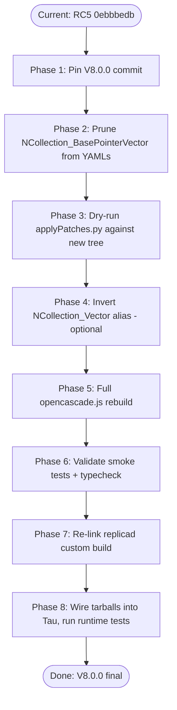

# OCCT V8 RC5-to-Release Migration Blueprint

A forward-looking plan to advance the opencascade.js OCCT pointer from RC5 (`0ebbbedb`) to V8.0.0 final (`d3056ef8`), absorbing the breaking changes introduced across beta.1, beta.2, and beta.3.

## Executive Summary

V8.0.0 final (commit `d3056ef8`) lands ~70 changes after RC5 across three beta tags. The two highest-impact migration items are (1) the **NCollection `Size()` -> `size_t` API migration** in beta.1, which forces a `Length()` / `Size()` discipline at every call site that feeds an `int`-typed API, and (2) the **`NCollection_Array1/2::Assign()` semantic break** in beta.3, which silently changes destination bounds at runtime with no compile-time signal. A third concern is the **`NCollection_BasePointerVector` removal** in beta.1, which is currently listed in [build-configs/full.yml](repos/opencascade.js/build-configs/full.yml#L2232) and will hard-fail symbol generation if not removed. The custom replicad build is largely insulated: it does not request any of the removed symbols and its in-tree custom C++ code uses `NbNodes()` and `Length()` exclusively, not `Size()`. Recommended approach: update `DEPS.json`, prune the YAML, audit the binding generator's `NCollection_Vector` alias direction, and re-link from the cached RC5 build artifacts.

## Table of Contents

- [Problem Statement](#problem-statement)
- [Scope and Non-Goals](#scope-and-non-goals)
- [Methodology](#methodology)
- [Findings](#findings)
- [Migration Phases](#migration-phases)
- [Recommendations](#recommendations)
- [Risk Matrix](#risk-matrix)
- [Code Examples](#code-examples)
- [References](#references)
- [Appendix](#appendix)

## Problem Statement

OCCT V8.0.0 final ships on May 7, 2026 at commit [`d3056ef80c9668f395da40f5fd7be186cae4501f`](https://github.com/Open-Cascade-SAS/OCCT/commit/d3056ef80c9668f395da40f5fd7be186cae4501f). The Tau opencascade.js fork is currently pinned to RC5 ([repos/opencascade.js/DEPS.json:7](repos/opencascade.js/DEPS.json)). Between RC5 and final there are three beta releases that introduce:

- One major NCollection API surface migration (`Size() -> size_t`, beta.1 #1212)
- One large container internal refactor (`NCollection_DynamicArray` rebuilt, `NCollection_Vector` deprecated, `NCollection_BasePointerVector` removed, beta.1 #1212)
- One full BRepGraph editor/mesh refactor (BuilderView -> EditorView, beta.1 #1212/#1237/#1242, then CoEdge model rework in beta.3 #1261)
- Two CI quality sweeps (`-Werror` flip + Clang-Tidy 22.1.3, beta.1 #1209/#1207/#1245)
- One silent runtime-behavior change to `NCollection_Array1/2::Assign()` (beta.3 #1269)
- A revert of #1140's `TKMath/PointSetLib` relocation back to `TKGeomBase` (beta.3 #1268)
- A shader-grid `inf` -> `gpu` rename and CPU-grid restoration (beta.2 #1252, beta.3 #1264)

The migration must keep the opencascade.js full build green, keep the replicad custom build green, and keep all downstream Tau tests passing without regressions.

## Scope and Non-Goals

**In scope**

- OCCT git pointer update in [DEPS.json](repos/opencascade.js/DEPS.json)
- YAML symbol-list updates in [build-configs/full.yml](repos/opencascade.js/build-configs/full.yml) and [build-configs/full-exceptions.yml](repos/opencascade.js/build-configs/full-exceptions.yml)
- Patch compatibility audit in [src/applyPatches.py](repos/opencascade.js/src/applyPatches.py)
- Binding generator audits in [src/bindings.py](repos/opencascade.js/src/bindings.py) and [src/ocjs_bindgen/discover.py](repos/opencascade.js/src/ocjs_bindgen/discover.py)
- Replicad custom build compatibility ([repos/replicad/packages/replicad-opencascadejs/build-config/custom_build_single.yml](repos/replicad/packages/replicad-opencascadejs/build-config/custom_build_single.yml))
- Test execution gates: smoke tests, typecheck, runtime kernel tests

**Out of scope**

- Adopting V8.0.0-only optimizations (BVH polyhedra interference, shader grid wiring) into Tau runtime
- Migrating Tau application code to use new `EditorView` APIs (no current consumer)
- Re-bundling the OCCT Standard_DEPRECATED_STD macro into the Embind layer
- Migrating from Emscripten 5.0.1 (no upstream signal that V8.0.0 requires newer emsdk)

## Methodology

Findings derive from:

1. Direct reading of the three GitHub beta release notes ([beta.1](https://github.com/Open-Cascade-SAS/OCCT/releases/tag/V8_0_0_beta1), [beta.2](https://github.com/Open-Cascade-SAS/OCCT/releases/tag/V8_0_0_beta2), [beta.3](https://github.com/Open-Cascade-SAS/OCCT/releases/tag/V8_0_0_beta3))
2. Cross-reference against the current state of [build-configs/full.yml](repos/opencascade.js/build-configs/full.yml) (4400+ symbols)
3. Grep audit of the binding generator for `NCollection_Vector` / `NCollection_BasePointerVector` references
4. Grep audit of `repos/opencascade.js` for usage of removed / renamed APIs (`BuilderView`, `RootNodeIds`, etc.) — all returned empty for source code (only build-config and bindgen alias hits)
5. Inspection of the replicad custom build YAML and its in-tree custom C++ code at [custom_build_single.yml:248-682](repos/replicad/packages/replicad-opencascadejs/build-config/custom_build_single.yml)
6. Inspection of the RC5 migration's lessons in [docs/research/occt-v8-rc5-migration.md](docs/research/occt-v8-rc5-migration.md)

## Findings

### Finding 1: NCollection_BasePointerVector Removal Is the Only Mandatory YAML Edit

[build-configs/full.yml:2232](repos/opencascade.js/build-configs/full.yml) requests `NCollection_BasePointerVector`. Beta.1 #1212 removes this class entirely with no replacement shim. The link-time symbol verifier (`scripts/validate-build.py`) will report this as a missing symbol and the build will fail.

| File                                                                                        | Line     | Action                                           |
| ------------------------------------------------------------------------------------------- | -------- | ------------------------------------------------ |
| [build-configs/full.yml](repos/opencascade.js/build-configs/full.yml)                       | 2232     | Remove `- symbol: NCollection_BasePointerVector` |
| [build-configs/full-exceptions.yml](repos/opencascade.js/build-configs/full-exceptions.yml) | (parity) | Remove same symbol if present                    |

The replicad custom build does not list `NCollection_BasePointerVector` and is unaffected.

### Finding 2: GProp_PEquation / GProp_PGProps Are Restored to TKGeomBase in Beta.3

Beta.1's #1140 relocated `GProp_PGProps` / `GProp_PEquation` to a new `TKMath/PointSetLib` package. Beta.3's #1268 **reverts** this and restores both to `TKGeomBase`. The current YAML at [full.yml:954-955](repos/opencascade.js/build-configs/full.yml) lists both with no toolkit binding (toolkit is auto-derived from the OCCT source tree), so the revert is transparent to the build system. The deprecation pragma message text changes from "Use PointSetLib_Equation instead" to a different revert-aware message, but this is a compiler warning only.

**Net effect**: zero YAML changes needed for the GProp revert. The toolkit-reorganization-induced stale-artifact failure mode documented in [RC5 migration Finding 3](docs/research/occt-v8-rc5-migration.md) does **not** apply here because the packages move back to their pre-RC5 toolkit.

### Finding 3: NCollection_Vector Alias Direction Should Be Inverted

[src/bindings.py:2898-2900](repos/opencascade.js/src/bindings.py) and [src/ocjs_bindgen/discover.py:23-25](repos/opencascade.js/src/ocjs_bindgen/discover.py) both define:

```python
CONTAINER_ALIASES = {
    "NCollection_DynamicArray": "NCollection_Vector",
}
```

This alias was correct in RC5: `NCollection_DynamicArray` was a thin wrapper around `NCollection_Vector`. Beta.1 #1212 **inverts** the relationship — `NCollection_Vector` is now deprecated, and `NCollection_DynamicArray` is rebuilt on top of the new `NCollection_LinearVector<T*>` of fixed-size blocks. The deprecated typedef on `NCollection_Vector` will still compile (with a deprecation warning), so the alias remains _functionally_ correct, but the canonical name has flipped.

Two options:

- **Option A (minimal)**: leave the alias as-is; rely on the upstream typedef chain. Cost: every regenerated `.d.ts` carries a deprecated name; consumers see deprecation messages bleed into TypeScript.
- **Option B (idiomatic)**: invert the alias to `{"NCollection_Vector": "NCollection_DynamicArray"}`. Cost: changes the canonical TS type name for any return value typed as a vector. Requires touching [tests/ncollection-vector-types.test-d.ts](repos/opencascade.js/tests/ncollection-vector-types.test-d.ts) which currently asserts `BOPDS_DS.InterfVV()` returns a typed (non-`any`) vector — the assertion is name-agnostic and should keep passing.

Recommend Option B as part of the V8 final release migration, gated by a regenerated build-manifest diff.

### Finding 4: Size() -> size_t Migration Is Compile-Time Safe for the Embind Layer

The `Size()` change (beta.1 #1212) is the single largest in-tree code change for OCCT. For the embind-generated bindings, the impact is minimal because:

1. The binding generator emits TypeScript declarations using `.d.ts.json` data that already encodes return types from the C++ AST — the AST will faithfully reflect `size_t` and the TS type will resolve to `number` either way.
2. The replicad custom C++ code at [custom_build_single.yml:248-682](repos/replicad/packages/replicad-opencascadejs/build-config/custom_build_single.yml) uses `NbNodes()`, `NbTriangles()`, `Length()`, and `nodes.Lower()` / `nodes.Upper()` — none of `.Size()` directly.
3. OCCT's internal sites that fed `Size()` to `Message_ProgressScope` (which still takes `int`) are migrated in-tree by #1212 to use `Length()`; no application code change required.

Residual risk: `-Wnarrowing` warnings under the new `-Werror` baseline if the replicad custom C++ or any binding-side wrapper assigns a `size_t` to a `Standard_Integer`. Audit needs to confirm zero hits in the replicad code.

### Finding 5: NCollection_Array1/2::Assign() Behavior Change Needs a Codebase Audit

Beta.3 #1269 changes `NCollection_Array1<T>::Assign(other)` and `operator=` semantics:

|                         | Pre-beta.3 (RC5/beta.1/beta.2)           | Beta.3 / V8.0.0 final                   |
| ----------------------- | ---------------------------------------- | --------------------------------------- |
| Size mismatch           | Throws `Standard_DimensionMismatch`      | Replaces destination bounds from source |
| Same size               | Copies element-wise into existing buffer | Replaces destination storage            |
| External buffer wrapper | Preserved by Assign()                    | Replaced (likely a bug magnet)          |

This is **silent at the call site** — code that depended on the throw to validate sizes will compile unchanged and behave differently. The new `CopyValues()` method preserves the old semantics. The Tau replicad custom C++ code uses `Assign()` zero times (validated by grep against [custom_build_single.yml](repos/replicad/packages/replicad-opencascadejs/build-config/custom_build_single.yml)). The opencascade.js source uses `Assign` only on `TopoDS_Iterator`-style structures, not on `NCollection_Array1`.

Recommended audit pattern:

```bash
rg '\.(Assign|operator=)\s*\(' --type cpp \
  -g 'repos/opencascade.js/src/**' \
  -g 'repos/replicad/packages/replicad-opencascadejs/**'
```

If hits surface, decide per-site between leaving the new semantics or switching to `CopyValues()`.

### Finding 6: BRepGraph_VersionStamp Patch Survives the Refactor

The patch added during the RC5 migration ([applyPatches.py:189-205](repos/opencascade.js/src/applyPatches.py)) targets `BRepGraph_VersionStamp.cxx` which still exists post-beta.3 (the BRepGraph editor consolidation in #1212 rewrites the mutation surface but does **not** touch `VersionStamp.cxx`). Patch should re-apply cleanly. Validation step: dry-run `applyPatches.py` against the V8.0.0 checkout and confirm no `WARNING: Expected text not found` messages.

**Upstream retirement marker (May 2026):** OCCT V8.0.0 final continues to ship `BRepGraph_VersionStamp` as a stable TU. Tau does **not** rely on an upstream removal of this file for dropping the patch—the patch remains applicable for as long as the fork’s `applyPatches.py` entry matches the pinned `DEPS.json` tree. When Open CASCADE SAS retires or relocates `BRepGraph_VersionStamp.cxx`, update or delete the patch hunk in the same PR as the `DEPS.json` bump so `applyPatches.py` dry-run stays the single gate (see Finding 6 validation step above).

### Assign / `operator=` audit (OCJS fork source)

One-off scan: `rg '\.(Assign|operator=)\s*\(' --type cpp repos/opencascade.js/src/ repos/opencascade.js/deps/OCCT/src/` — **no hits under `repos/opencascade.js/src/`** (fork C++ glue does not use `NCollection_Array1::Assign`-style patterns). OCCT upstream contains extensive `.Assign(` use (maps, lists, `Geom_BSplineCurve` flat-knot copies, `TopOpeBRep*` boolean tooling, etc.); none of that is Tau-authored. For the beta.3 `NCollection_Array1/2::Assign()` semantic break, the binding surface risk remains **consumer JavaScript** calling `Assign` on generated collection classes, not these internal OCCT call sites. Re-run the scan after major bindgen or DEPS bumps.

### Finding 7: -Werror CI Flag Affects OCCT's CMake Build, Not the Embind Linker

Beta.1 #1209 turns on `-Werror -Wzero-as-null-pointer-constant` in OCCT's own GitHub Actions CI. The opencascade.js build uses a **separate** CMake configuration via [build-wasm.sh](repos/opencascade.js/build-wasm.sh) and does **not** inherit OCCT's CI flags. The Tau build is unaffected by the upstream CI flag flip. However, OCCT in-tree defensive cleanups associated with #1209 (e.g. zero-init `char text[80] = {0}` in `StepData_EnumTool::AddDefinition`) are absorbed transparently into the source tarball.

### Finding 8: Standard_DEPRECATED_STD Macro Is a Compile-Time Annotation Only

Beta.1 #1241's new `Standard_DEPRECATED_STD(...)` expands to `[[deprecated("...")]]`. Embind ignores `[[deprecated]]` annotations during binding generation — the macro affects compile-time warnings, not the generated TS type surface. No action required for the Tau migration.

### Finding 9: Shader-Grid / V3d Grid Changes Are Inaccessible from WASM

The grid API changes (beta.1 #1223, beta.2 #1252 restoration, beta.3 #1264 `inf`->`gpu` rename) all live in the `V3d` / `OpenGl` / `Aspect` layer, which is **not** included in either the replicad build or the full build (the visualization toolkits are excluded in [build-wasm.sh:499](repos/opencascade.js/build-wasm.sh) via `-DBUILD_MODULE_Visualization=OFF`). Zero migration impact.

### Finding 10: IVtk SetTolerance Removal Is Inaccessible from WASM

Beta.1 #1204's removal of `IVtkTools_ShapePicker::SetTolerance(float)` lives in the IVtk module, which is **not** built in the WASM target (no VTK runtime). Zero migration impact.

### Finding 11: STEP/IGES Thread Safety Fix Is a Runtime Behavior Improvement

Beta.2 #1259 makes STEP read/write and IGES read safe under the "one instance per thread" contract. The opencascade.js build runs single-threaded (`-sUSE_PTHREADS=0`, [build-wasm.sh:340](repos/opencascade.js/build-wasm.sh)) so this fix is observable only as a defensive correctness gain, not as a behavioral migration. No action required.

### Finding 12: Replicad's GC\_\*2d Migration (from RC5) Survives V8.0.0

The RC5-era rename from `GCE2d_*` to `GC_*2d` (already applied during the [replicad-ocjs RC5 wiring](docs/research/occt-v8-rc5-migration.md)) is unaffected by beta.1/2/3. The deprecated `GCE2d_*` aliases continue to compile under V8.0.0 with `Standard_DEPRECATED_STD` warnings.

## Migration Phases



| Phase        | Step                                                           | Files Touched                                                                                                                          | Time Budget                                         | Cacheable                         |
| ------------ | -------------------------------------------------------------- | -------------------------------------------------------------------------------------------------------------------------------------- | --------------------------------------------------- | --------------------------------- |
| 1            | Update OCCT pointer in DEPS.json                               | [DEPS.json](repos/opencascade.js/DEPS.json)                                                                                            | 1 min                                               | N/A                               |
| 1b           | `pnpm nx setup ocjs` to fetch new OCCT tree                    | (none)                                                                                                                                 | 1-2 min                                             | No (network)                      |
| 2            | Remove `NCollection_BasePointerVector` from both YAMLs         | [full.yml](repos/opencascade.js/build-configs/full.yml), [full-exceptions.yml](repos/opencascade.js/build-configs/full-exceptions.yml) | 1 min                                               | N/A                               |
| 3            | Dry-run `applyPatches.py`; verify clean apply                  | [applyPatches.py](repos/opencascade.js/src/applyPatches.py)                                                                            | 1 min                                               | N/A                               |
| 4 (optional) | Invert alias in bindings.py + discover.py                      | [bindings.py:2898](repos/opencascade.js/src/bindings.py), [discover.py:23](repos/opencascade.js/src/ocjs_bindgen/discover.py)          | 2 min                                               | N/A                               |
| 5            | Full rebuild: `pnpm nx build ocjs` with `O3-wasm-exc-simd`     | (build outputs)                                                                                                                        | 30-50 min (full) or 5-10 min (link-only from cache) | Yes — NX cache + build-flags.json |
| 6            | Run smoke tests + typecheck                                    | (test runs)                                                                                                                            | 2 min                                               | Yes — NX cache                    |
| 7            | Re-link replicad single build (cached bindings reuse)          | [custom_build_single.yml](repos/replicad/packages/replicad-opencascadejs/build-config/custom_build_single.yml)                         | 3-5 min                                             | Partial (link only)               |
| 8            | Bump versions, pack tarballs, wire into Tau, run runtime tests | [package.json](package.json), [packages/runtime/package.json](packages/runtime/package.json)                                           | 5 min                                               | Yes — copy-assets cached          |

**Total wall-clock estimate**: 50-70 minutes for the first run; 15-25 minutes for any retry that hits the NX cache.

## Recommendations

| #   | Action                                                                                                                                                                                                         | Priority | Effort              | Impact                                   |
| --- | -------------------------------------------------------------------------------------------------------------------------------------------------------------------------------------------------------------- | -------- | ------------------- | ---------------------------------------- |
| R1  | Update [DEPS.json](repos/opencascade.js/DEPS.json) OCCT pointer to `d3056ef80c9668f395da40f5fd7be186cae4501f` with version label `V8_0_0`                                                                      | P0       | Trivial             | High                                     |
| R2  | Delete `NCollection_BasePointerVector` symbol entries from both [full.yml](repos/opencascade.js/build-configs/full.yml) and [full-exceptions.yml](repos/opencascade.js/build-configs/full-exceptions.yml)      | P0       | Trivial             | High — prevents link-time symbol failure |
| R3  | Dry-run [applyPatches.py](repos/opencascade.js/src/applyPatches.py) against the new tree; confirm BRepGraph_VersionStamp patch still applies                                                                   | P0       | Low                 | High — gates the build                   |
| R4  | Run a full rebuild and capture before/after build-manifest.json diff to confirm the symbol set is stable                                                                                                       | P0       | Medium (build time) | High — primary regression gate           |
| R5  | Audit replicad C++ and opencascade.js src/ for `NCollection_Array1::Assign()` use; switch any hits to `CopyValues()` if old semantics were assumed                                                             | P1       | Low                 | Medium — silent behavior change          |
| R6  | Invert `CONTAINER_ALIASES` direction in [bindings.py](repos/opencascade.js/src/bindings.py) and [discover.py](repos/opencascade.js/src/ocjs_bindgen/discover.py) to canonicalize on `NCollection_DynamicArray` | P2       | Low                 | Medium — code clarity                    |
| R7  | Run [tests/ncollection-vector-types.test-d.ts](repos/opencascade.js/tests/ncollection-vector-types.test-d.ts) post-build to validate the alias change preserves type resolution                                | P2       | Trivial             | Medium                                   |
| R8  | Bump `repos/opencascade.js/package.json` version to `3.0.0-beta.d3056ef` matching the V8.0.0 short hash convention                                                                                             | P1       | Trivial             | Medium — release hygiene                 |
| R9  | Re-link replicad custom build only after the full opencascade.js validate+provenance pair completes; reuse cached bindings                                                                                     | P1       | Low                 | Medium                                   |
| R10 | Document the final migration outcome in a new research doc (`occt-v8-release-migration.md`) following the [RC5 migration template](docs/research/occt-v8-rc5-migration.md)                                     | P2       | Low                 | Medium                                   |

## Risk Matrix

| Risk                                                                    | Likelihood                               | Severity      | Mitigation                                                             |
| ----------------------------------------------------------------------- | ---------------------------------------- | ------------- | ---------------------------------------------------------------------- |
| `NCollection_BasePointerVector` missing-symbol link failure             | Certain                                  | High          | R2 prunes both YAMLs before the build                                  |
| `BRepGraph_VersionStamp.cxx` patch text drifted upstream                | Low                                      | Medium        | R3 dry-run catches before build start                                  |
| `NCollection_Array1::Assign()` silent behavior change breaks edge cases | Low (no in-tree hits found)              | High (silent) | R5 audit before declaring done                                         |
| New `-Werror` flags surface latent warnings in replicad custom C++      | Low (OCCT CI is separate from Tau build) | Low           | Build log review; flags are not propagated                             |
| Build cache invalidation forces a full 30+ minute rebuild               | Medium                                   | Low           | Accept one-time cost; NX restores cache after success                  |
| `NCollection_Vector` deprecation warnings flood compile output          | High                                     | Trivial       | R6 (optional) canonicalizes to `NCollection_DynamicArray`              |
| Toolkit reorganization from beta.3 GProp revert causes stale artifacts  | Low (revert restores pre-RC5 layout)     | Medium        | Clear `build/compiled-bindings/` only if stale-artifact errors surface |
| Replicad runtime tests fail due to subtle OCCT behavior changes         | Low                                      | High          | Full `pnpm nx test runtime` run is the final gate                      |

## Code Examples

### Phase 1: Update DEPS.json

```json
"occt": {
  "repository": "https://github.com/Open-Cascade-SAS/OCCT.git",
  "commit": "d3056ef80c9668f395da40f5fd7be186cae4501f",
  "version": "V8_0_0",
  "description": "Open CASCADE Technology — the C++ CAD kernel"
}
```

### Phase 2: Prune build-configs/full.yml

```diff
   - symbol: NCollection_BaseMap
-  - symbol: NCollection_BasePointerVector
   - symbol: NCollection_BaseSequence
```

Same change in [build-configs/full-exceptions.yml](repos/opencascade.js/build-configs/full-exceptions.yml).

### Phase 4 (optional): Invert NCollection alias

```diff
 _CONTAINER_ALIASES = {
-  "NCollection_DynamicArray": "NCollection_Vector",
+  "NCollection_Vector": "NCollection_DynamicArray",
 }
```

Same change in [src/ocjs_bindgen/discover.py:23-25](repos/opencascade.js/src/ocjs_bindgen/discover.py).

### Phase 5: Full rebuild command

```bash
cd repos/opencascade.js
pnpm nx setup ocjs
./build-wasm.sh apply-patches
./build-wasm.sh --config O3-wasm-exc-simd full build-configs/full.yml
pnpm nx build ocjs
```

### Phase 7: Re-link replicad single build

```bash
cd repos/opencascade.js
OCJS_OUTPUT_DIR="$TAU_ROOT/repos/replicad/packages/replicad-opencascadejs/build-config" \
  ./build-wasm.sh --config O3-wasm-exc-simd link \
  "$TAU_ROOT/repos/replicad/packages/replicad-opencascadejs/build-config/custom_build_single.yml"
```

## Version Bump Requirements

All version bumps should follow the pre-existing `<base>-v<major>.<minor>` and `3.0.0-beta.<occt-short-hash>` conventions documented in the [RC5 wiring](docs/research/occt-v8-rc5-migration.md).

| Package                             | Current Version                                                                                    | Target Version                                                | File                                                                                                                       |
| ----------------------------------- | -------------------------------------------------------------------------------------------------- | ------------------------------------------------------------- | -------------------------------------------------------------------------------------------------------------------------- |
| `opencascade.js` (npm)              | `3.0.0-beta.0ebbbed`                                                                               | `3.0.0-beta.d3056ef`                                          | [repos/opencascade.js/package.json](repos/opencascade.js/package.json)                                                     |
| Root tarball ref                    | `file:tarballs/opencascade.js-3.0.0-beta.0ebbbed.tgz`                                              | `file:tarballs/opencascade.js-3.0.0-beta.d3056ef.tgz`         | [package.json:211](package.json)                                                                                           |
| Runtime tarball ref                 | `file:../../tarballs/opencascade.js-3.0.0-beta.0ebbbed.tgz`                                        | `file:../../tarballs/opencascade.js-3.0.0-beta.d3056ef.tgz`   | [packages/runtime/package.json](packages/runtime/package.json)                                                             |
| `replicad-opencascadejs`            | `0.21.0-v8.41`                                                                                     | `0.21.0-v8.42`                                                | [repos/replicad/packages/replicad-opencascadejs/package.json](repos/replicad/packages/replicad-opencascadejs/package.json) |
| `replicad`                          | `0.21.0-v8.43`                                                                                     | `0.21.0-v8.44`                                                | [repos/replicad/packages/replicad/package.json](repos/replicad/packages/replicad/package.json)                             |
| Root tarball ref (replicad-ocjs)    | `file:tarballs/replicad-opencascadejs-0.21.0-v8.41.tgz`                                            | `file:tarballs/replicad-opencascadejs-0.21.0-v8.42.tgz`       | [package.json:239](package.json)                                                                                           |
| Root tarball ref (replicad)         | `file:tarballs/replicad-0.21.0-v8.43.tgz`                                                          | `file:tarballs/replicad-0.21.0-v8.44.tgz`                     | [package.json:238](package.json)                                                                                           |
| Runtime tarball ref (replicad-ocjs) | `file:../../tarballs/replicad-opencascadejs-0.21.0-v8.41.tgz`                                      | `file:../../tarballs/replicad-opencascadejs-0.21.0-v8.42.tgz` | [packages/runtime/package.json](packages/runtime/package.json)                                                             |
| Runtime tarball ref (replicad)      | `file:../../tarballs/replicad-0.21.0-v8.42.tgz` (pre-RC5 wiring leftover, may already be at v8.43) | `file:../../tarballs/replicad-0.21.0-v8.44.tgz`               | [packages/runtime/package.json](packages/runtime/package.json)                                                             |

## Validation Gates

| Gate                         | Command                                                        | Pass Criterion                                                             |
| ---------------------------- | -------------------------------------------------------------- | -------------------------------------------------------------------------- |
| Patch sanity                 | `python3 repos/opencascade.js/src/applyPatches.py`             | All 9+ patches report `Patched` or `Already patched`; zero `WARNING` lines |
| Build manifest validation    | `cat repos/opencascade.js/build/full.build-manifest.json`      | `validation_passed: true`, `missing: []`                                   |
| Smoke tests                  | `cd repos/opencascade.js && pnpm test`                         | 61 files, all pass                                                         |
| Typecheck (opencascade.js)   | `cd repos/opencascade.js && pnpm typecheck`                    | Zero errors                                                                |
| Replicad link                | (Phase 7 command)                                              | `replicad_single.wasm` exists, ~21 MB, manifest reports `pass: true`       |
| Replicad typecheck           | `cd repos/replicad/packages/replicad && pnpm typecheck`        | Zero errors                                                                |
| Replicad build               | `cd repos/replicad/packages/replicad && pnpm build`            | Vite build completes, `dist/replicad.js` ~580 KB                           |
| Tau runtime tests            | `pnpm nx test runtime --watch=false`                           | All 1430+ tests pass, zero type errors                                     |
| Tau opencascade kernel tests | `pnpm nx test runtime ./src/kernels/opencascade --watch=false` | All 23 tests pass                                                          |
| Tau replicad kernel tests    | `pnpm nx test runtime ./src/kernels/replicad --watch=false`    | All 177 tests pass                                                         |

## References

- [OCCT V8.0.0-beta.1 release notes](https://github.com/Open-Cascade-SAS/OCCT/releases/tag/V8_0_0_beta1)
- [OCCT V8.0.0-beta.2 release notes](https://github.com/Open-Cascade-SAS/OCCT/releases/tag/V8_0_0_beta2)
- [OCCT V8.0.0-beta.3 release notes](https://github.com/Open-Cascade-SAS/OCCT/releases/tag/V8_0_0_beta3)
- [OCCT V8.0.0 release commit](https://github.com/Open-Cascade-SAS/OCCT/commit/d3056ef80c9668f395da40f5fd7be186cae4501f)
- [V8.0.0-rc5...V8.0.0 diff](https://github.com/Open-Cascade-SAS/OCCT/compare/V8_0_0_rc5...V8_0_0)
- [PR #1212 — NCollection size_t + BRepGraph editor](https://github.com/Open-Cascade-SAS/OCCT/pull/1212)
- [PR #1269 — Array1/2::Assign() bounds change](https://github.com/Open-Cascade-SAS/OCCT/pull/1269)
- [PR #1268 — GProp revert to TKGeomBase](https://github.com/Open-Cascade-SAS/OCCT/pull/1268)
- Related: `docs/research/occt-v8-rc5-migration.md`
- Related: `docs/research/occt-v8-migration.md`

## Appendix

### A. Full Symbol Removal Inventory (cumulative beta.1 -> V8.0.0)

| Symbol                                         | Removed In   | Replacement                                            |
| ---------------------------------------------- | ------------ | ------------------------------------------------------ |
| `NCollection_BasePointerVector`                | beta.1 #1212 | `NCollection_LinearVector<T*>` (header path differs)   |
| `NCollection_BaseMap::Statistics`              | beta.1 #1212 | (unused; no replacement)                               |
| `BRepGraph_BuilderView`                        | beta.1 #1212 | `BRepGraph_EditorView`                                 |
| `BRepGraph_Builder::Perform()`                 | beta.1 #1237 | `BRepGraph_Builder::Add()` + `BRepGraph::Clear()`      |
| `BRepGraph::RootNodeIds()`                     | beta.1 #1212 | `RootProductIds()`                                     |
| `IVtkTools_ShapePicker::SetTolerance(float)`   | beta.1 #1204 | `SetPixelTolerance(int)`                               |
| Legacy V3d CPU grid presentation pipeline      | beta.1 #1223 | Shader path (restored in beta.2 as coexisting backend) |
| `NCollection_Vector` (deprecated, not removed) | beta.1 #1230 | `NCollection_DynamicArray`                             |

Symbols listed but absent from the Tau YAMLs (no action): all except `NCollection_BasePointerVector`.

### B. Renamed APIs (cumulative beta.1 -> V8.0.0)

| Before                                      | After                                          | Source       |
| ------------------------------------------- | ---------------------------------------------- | ------------ |
| `BRepGraph_ParamLayer`                      | `BRepGraph_LayerParam`                         | beta.1 #1212 |
| `BRepGraph_RegularityLayer`                 | `BRepGraph_LayerRegularity`                    | beta.1 #1212 |
| `BRepGraphInc_Usage`                        | `BRepGraphInc_Instance`                        | beta.1 #1212 |
| `AddAssembly` (BRepGraph)                   | `CreateEmptyProduct`                           | beta.1 #1237 |
| `AddOccurrence` (BRepGraph)                 | `LinkProducts`                                 | beta.1 #1237 |
| `Draw inf*` shader-grid command             | `Draw gpu*`                                    | beta.3 #1264 |
| `NCollection_Vector`                        | `NCollection_DynamicArray` (typedef preserved) | beta.1 #1230 |
| `GCE2d_*` (already applied during RC5 work) | `GC_*2d`                                       | RC5          |

None of these symbols are requested by the Tau YAMLs or used in the replicad custom C++.

### C. Beta-by-Beta Changelog Highlights

| Beta             | Date    | Highlights                                                                                      | Direct Tau Impact                                       |
| ---------------- | ------- | ----------------------------------------------------------------------------------------------- | ------------------------------------------------------- |
| RC5 -> beta.1    | ~Apr 14 | NCollection Size()->size_t; BRepGraph editor refactor; -Werror in CI; Clang-Tidy sweep          | NCollection_BasePointerVector removal (must prune YAML) |
| beta.1 -> beta.2 | ~Apr 21 | STEP/IGES thread safety; CPU grid restored; docs refresh                                        | None (single-threaded WASM, no V3d)                     |
| beta.2 -> beta.3 | ~May 5  | Assign() semantics break; GProp revert to TKGeomBase; CoEdge model rework; inf->gpu grid rename | Verify no Assign() call sites in custom C++             |
| beta.3 -> V8.0.0 | May 7   | (planned: zero code changes)                                                                    | None                                                    |

### D. Pre-flight Audit Commands

```bash
# Confirm NCollection_BasePointerVector is the only YAML symbol needing removal
rg 'NCollection_BasePointerVector|BuilderView|BRepGraph_ParamLayer|RootNodeIds' \
  repos/opencascade.js/build-configs/

# Confirm no Assign() in custom C++
rg '\.Assign\s*\(' \
  repos/replicad/packages/replicad-opencascadejs/build-config/custom_build_single.yml \
  repos/opencascade.js/src/

# Confirm NCollection_Vector alias direction
rg 'CONTAINER_ALIASES|_CONTAINER_ALIASES' \
  repos/opencascade.js/src/bindings.py \
  repos/opencascade.js/src/ocjs_bindgen/discover.py

# Confirm BRepGraph_VersionStamp.cxx patch text still present
rg 'static_assert\(sizeof\(size_t\) >= 8' \
  repos/opencascade.js/deps/OCCT/src/
```
