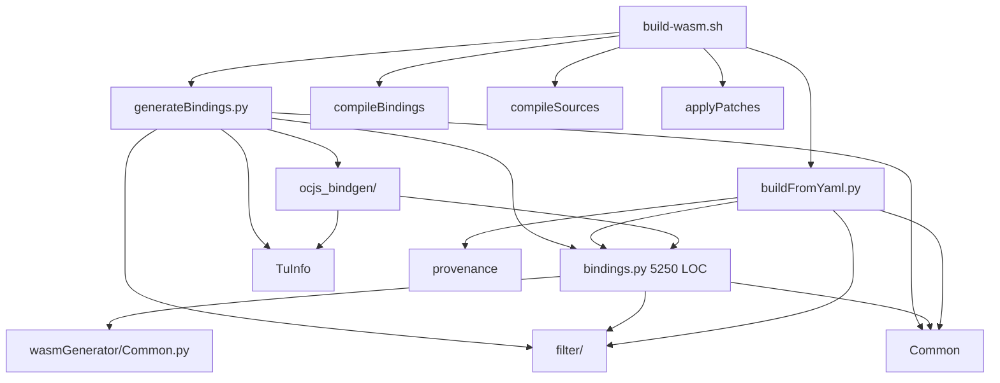
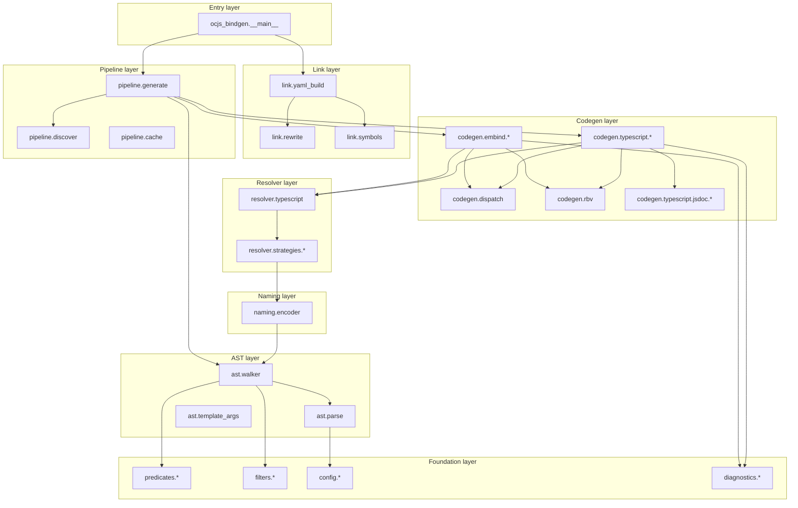
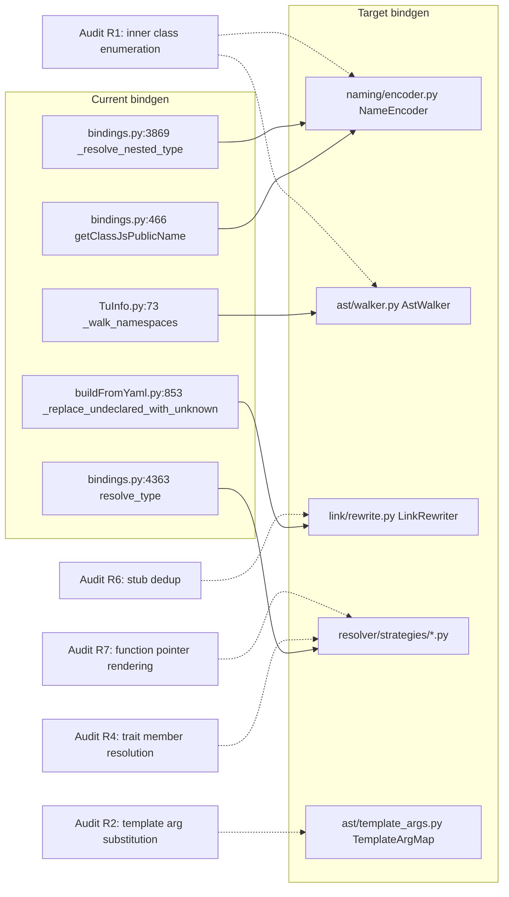

# OCJS Bindgen Modular Refactor Blueprint

Target-state architecture for the `repos/opencascade.js/src/` Python bindgen, decomposed from a 5 250-line god file into a coherent `ocjs_bindgen/` package whose interfaces are designed to absorb the seven AST/bindgen fixes from `docs/research/ocjs-bindgen-unknown-coverage-audit.md` without further restructuring.

## Executive Summary

The OCJS Python bindgen has accumulated 11 024 LOC across 30 files, with `src/bindings.py` alone at 5 250 lines hosting three classes, ~85 methods, and at least four cross-cutting subsystems (type resolution, dispatch trees, RBV envelopes, JSDoc emission). Cross-fragment class-level mutable state, three independent `processClass` definitions, duplicate `shouldProcessClass` implementations across two files, two parallel filter conventions (`src/filter/` vs. `src/ocjs_bindgen/filters.py`), and unrooted top-level scripts on `sys.path` make the bindgen actively hostile to PR review and structural change. The proposed blueprint migrates everything into a single `src/ocjs_bindgen/` package organized by capability layer (config / ast / predicates / filters / naming / resolver / codegen / pipeline / link / patches / docs / diagnostics / testing), with formal protocols for the resolver and walker so the seven audit fixes (R1-R7) become localized edits inside one or two modules each. The migration is sequenced in three shippable phases that each preserve build + smoke-test parity.

## Table of Contents

- [Problem Statement](#problem-statement)
- [Scope and Non-Goals](#scope-and-non-goals)
- [Methodology](#methodology)
- [Findings](#findings)
- [Target State Architecture](#target-state-architecture)
- [Recommendations](#recommendations)
- [Migration Roadmap](#migration-roadmap)
- [Trade-offs](#trade-offs)
- [Diagrams](#diagrams)
- [References](#references)
- [Appendix](#appendix)

## Problem Statement

Two pressures converge on the bindgen:

1. **Implementation pressure** — the audit at `docs/research/ocjs-bindgen-unknown-coverage-audit.md` identifies seven AST-driven fixes (R1-R7) that resolve 4 984 `unknown` types in `dist/opencascade_full.d.ts`. Each fix touches multiple cross-cutting modules. R1 alone needs coordinated edits in `TuInfo.allChildrenGenerator`, `bindings.getClassJsPublicName`, and `bindings._resolve_nested_type` — three separate functions in two files, each a one-level walker that has to mirror the others. Without abstraction, R2-R7 will accumulate similar coordination debt.

2. **Maintenance pressure** — `bindings.py` is 5 250 lines. Three classes (`Bindings` base, `EmbindBindings`, `TypescriptBindings`) share class-level mutable state (`_namespace_scoped_interfaces`, `_emitted_stub_names`, `_known_export_names`, `_docs_cache`, `_any_reasons`). Cross-fragment state leakage is the documented root cause of the duplicate `BRepGraphInc_*` aliases in finding E of the audit. PR reviewers cannot reason about a single change without holding the entire 5 250-line file in their head.

The ethos of OCJS — "automatic binding, no manual lists unless strictly necessary" — must be preserved. The blueprint maintains that constraint by keeping every dispatch decision AST-driven; restructuring is purely about _where_ the AST decisions live, not _whether_ they are AST-driven.

## Scope and Non-Goals

**In scope**:

- Reorganization of every Python file under `repos/opencascade.js/src/` into a single `ocjs_bindgen/` package.
- Formal protocols (Python `Protocol` types) for the resolver, walker, name encoder, and link-time rewriter.
- Pytest unit-test scaffolding with mocked libclang cursors.
- Migration sequencing that preserves bindgen output bit-for-bit at every phase boundary.

**Out of scope**:

- Implementing R1-R7 (covered in `docs/research/ocjs-bindgen-unknown-coverage-audit.md`; the blueprint _prepares_ for them).
- Behavioral changes to bindgen output. The refactor is verifiable by zero-diff against the current `dist/opencascade_full.{d.ts,js,wasm}`.
- Refactoring of the OCCT C++ patches in `src/patches/` beyond relocating them.
- Changes to the YAML build config schema (`build-configs/full.yml`, `customBuildSchema.py`).
- Changes to `pnpm`/`Nx` task wiring beyond updating script invocation paths.

## Methodology

1. **LOC and symbol inventory** — counted `wc -l` per file and listed every top-level class/function in `src/bindings.py`, `src/buildFromYaml.py`, `src/generateBindings.py`, `src/TuInfo.py`, `src/wasmGenerator/Common.py`.
2. **Subsystem clustering** — grouped methods inside `bindings.py` by name pattern (`_resolve_*`, `_classify_*`, `_emit*`, `_jsdoc*`, `_*Rbv*`, `_*Dispatch*`) to discover cohesive code units.
3. **Cross-cutting state survey** — searched for `TypescriptBindings._` and `EmbindBindings._` to enumerate class-level mutable state.
4. **Import graph trace** — mapped how `src/` modules reference each other to identify implicit `sys.path` dependencies.
5. **Duplicate-symbol search** — surfaced cases where two files define semantically equivalent functions (e.g. `shouldProcessClass`).
6. **Audit-fix touchpoint mapping** — for each R1-R7 from the unknown-coverage audit, listed which existing functions need editing and identified the underlying shared abstraction.

## Findings

### Inventory: file size and symbol density

| File                                        |        LOC | Top-level symbols           | Internal complexity                 |
| ------------------------------------------- | ---------: | --------------------------- | ----------------------------------- |
| `src/bindings.py`                           |      5 250 | 3 classes + 22 module funcs | ~85 methods, 4 subsystems entangled |
| `src/buildFromYaml.py`                      |        865 | 11 funcs                    | Link orchestrator + rewrite pass    |
| `src/extract-docs.py`                       |        735 | Doxygen extractor           | Single-purpose script               |
| `src/generateBindings.py`                   |        532 | 22 funcs + 1 class          | Pipeline driver                     |
| `src/provenance.py`                         |        482 | Metadata recorder           | Single-purpose                      |
| `src/Common.py`                             |        353 | Paths + flag helpers        | Mixed concerns                      |
| `src/patches/patch_noexcept_destructors.py` |        290 | OCCT source patcher         | Single-purpose                      |
| `src/ocjs_bindgen/discover.py`              |        246 | NCollection auto-discovery  | Cohesive module (good template)     |
| `src/wasmGenerator/Common.py`               |        245 | Class predicates            | Dup of `src/bindings.py` predicates |
| `src/applyPatches.py`                       |        233 | Patch driver                |                                     |
| `src/TuInfo.py`                             |        213 | TU walker                   | Has the R1 walker comment           |
| `src/compileBindings.py`                    |        197 | Compile driver              |                                     |
| `src/ocjs_bindgen/__main__.py`              |        156 | CLI entry                   |                                     |
| `src/customBuildSchema.py`                  |        135 | YAML schema                 |                                     |
| `src/compileSources.py`                     |        132 | Compile driver              |                                     |
| `src/ocjs_bindgen/test_discover.py`         |        131 | Single test file            | Only test in repo                   |
| `src/ocjs_bindgen/config.py`                |        125 | bindgen-filters loader      |                                     |
| `src/ocjs_bindgen/filters.py`               |         92 | Filter functions            | Newer convention                    |
| `src/filter/filterMethodOrProperties.py`    |         96 | One filter function         | Older convention                    |
| `src/filter/filterTypedefs.py`              |         61 | One filter function         | Older convention                    |
| `src/filter/filterPackages.py`              |         34 | One filter function         | Older convention                    |
| `src/filter/filterSourceFiles.py`           |         12 | One filter function         | Older convention                    |
| `src/filter/filterIncludeFiles.py`          |         11 | One filter function         | Older convention                    |
| `src/filter/filterEnums.py`                 |          4 | One filter function         | Older convention                    |
| `src/filter/filterClasses.py`               |          4 | Stub returning True         | Vestigial                           |
| **Total**                                   | **11 024** |                             |                                     |

### Subsystems hidden inside `bindings.py`

The 5 250 lines partition into eight orthogonal subsystems that are currently interleaved:

| Subsystem                 | Representative methods                                                                                                                                                                                                                                            | LOC est. | Cohesion                                       |
| ------------------------- | ----------------------------------------------------------------------------------------------------------------------------------------------------------------------------------------------------------------------------------------------------------------- | -------: | ---------------------------------------------- |
| Type predicates           | `isHandle`, `isOutputParam`, `isCString`, `isCopyConstructible`, `isClassOutputParam`, `shouldStripParam`                                                                                                                                                         |     ~250 | High — pure functions on cursor types          |
| Public-name encoding      | `getClassJsPublicName`, `getClassQualifiedName`, `getClassCppName`, `getClassTypeName`, `getEnumJsPublicName`, `getEnumQualifiedName`                                                                                                                             |     ~150 | High — name-mangling logic                     |
| Type resolver             | `resolve_type`, `_resolve_handle_recursive`, `_resolve_template_type`, `_resolve_nested_type`, `_resolve_qualified_member_type`, `_resolve_stl_type`, `_resolve_template_arg`, `_resolve_template_typedef`, `resolveWithCanonicalFallback`, `convertBuiltinTypes` |     ~600 | High — single decision tree                    |
| Template arg substitution | `_substitute_canonical_template_names`, `_qualify_nested_type`, `replaceTemplateArgs`, `getTypedefedTemplateTypeAsString`                                                                                                                                         |     ~200 | Medium — used by resolver and codegen          |
| Dispatch tree codegen     | `_classify_js_dispatch_type`, `_build_dispatch_tree`, `_codegen_dispatch_tree`, `_emitValDispatchConstructor`, `_emitValDispatchMethod`, `DispatchLeaf/Branch/Ambiguous`, `_collect_ambiguous_overloads`, `_dispatch_primitive_sort_key`, `_tree_has_only_leaves` |     ~700 | High — closed system                           |
| RBV envelope codegen      | `_canDoRbv`, `_envelope_richness`, `_ensureResultStruct`, `_emitRbvCollisionDispatch`, `_emitOutputParamBinding`, `_outputArgIsEmbindManaged`, `_returnIsEmbindManaged`, `_returnTypeRequiresValueWrapper`                                                        |     ~600 | High — RBV pipeline                            |
| JSDoc renderer            | `_jsdoc`, `_emit_jsdoc_text`, `_classify_link_target`, `_normalize_link_tokens`, `_soft_wrap_long_line`, `_split_long_lines`, `_load_docs`, `_escape_jsdoc`, `_param_description`, `_resolve_overload`, `_enum_member_jsdoc`, `_emit_simplesect_tags`             |     ~500 | High — TS-only, doc-format-specific            |
| Class/method/enum codegen | `processClass`×3, `processMethodGroup`, `processMethodOrProperty`, `processSimpleConstructor`, `processOverloadedConstructors`, `processEnum`, `processFinalizeClass`, `_emitConstructor`, `_emitTsConstructor`, `_emitSuffixedMethod`                            |   ~1 200 | Mixed — embind C++ and TS bindings interleaved |
| Inheritance walker        | `_computeAncestorChain`, `_findBoundAncestor`, `_baseJsPublicName`, `_find_base_override_target`, `_missing_base_overloads`, `_render_synthesized_base_signature`                                                                                                 |     ~200 | High — closed system                           |
| Overload de-duplication   | `_dedupe_float_double`, `_dedupe_string_encodings`, `_filter_overloads`, `_is_float_only_variant`, `_is_wider_string_ctor`, `_is_move_constructor`, `_is_deleted_method`, `_constructorsHaveUniqueArities`                                                        |     ~200 | High — pure functions on overload sets         |
| **Sub-total**             |                                                                                                                                                                                                                                                                   |   ~4 600 |                                                |
| Module-level helpers      | `merge`, `pick`, `pickWrap`, `indent`, etc.                                                                                                                                                                                                                       |     ~150 | Low                                            |
| Cross-class state         | `_namespace_scoped_interfaces`, `_emitted_stub_names`, `_known_export_names`, `_docs_cache`, `_any_reasons`, `_known_typedef_names`, `_emitted_jsdoc_targets`, `_reverse_typedef_cache`                                                                           |     ~500 | None — accidental shared mutable state         |

### Finding 1: The single 5 250-line file is the dominant maintainability constraint

A reviewer reading a PR that touches `_resolve_nested_type` (line 3869) cannot trivially see that `getClassJsPublicName` (line 466) needs a mirror edit unless they hold both functions in their head simultaneously. The audit recommends multi-level walks in **both** functions for R1, but the encoder lives 3 400 lines from the resolver. There is no module boundary signaling that the two are coupled.

### Finding 2: Cross-class mutable state is structurally a cross-fragment leak

`TypescriptBindings._namespace_scoped_interfaces` (line 3863) is a `set()` that accumulates across **every fragment** processed in one `python generateBindings.py` invocation. Per-fragment `processFinalizeClass` (line 3699) emits `export type X = unknown;` for each name in the set that is not in the _current_ fragment's `self.exports`. The audit traces this to root cause E, producing 27 of the 57 `export type X = unknown` aliases that shadow real class declarations. The state should be either (a) per-instance and merged at link time, or (b) deferred entirely to the link rewriter. Today it is neither — it is class-level mutable state with per-instance writes and unstructured accumulation.

Other class-level state that exhibits the same pattern:

| State                          | Type              | Risk                                                                                                   |
| ------------------------------ | ----------------- | ------------------------------------------------------------------------------------------------------ | ------------------------------------------------------------------------------- |
| `_namespace_scoped_interfaces` | `set[str]`        | Cross-fragment stub leakage (root cause E)                                                             |
| `_emitted_stub_names`          | `set[str]`        | Stub dedup bypassed across fragments                                                                   |
| `_known_export_names`          | `set[str]`        | Initialized once via `prepare_known_exports`, then mutated by `processClass` writing to `self.exports` |
| `_docs_cache`                  | `dict             | None`                                                                                                  | Doxygen JSON read once, shared across fragments — benign but conceptually wrong |
| `_any_reasons`                 | `dict[str, dict]` | Diagnostic accumulator — benign but should be a Diagnostics service                                    |
| `_known_typedef_names`         | `set[str]`        | Same as `_known_export_names`                                                                          |
| `_reverse_typedef_cache`       | `dict             | None`                                                                                                  | Memoization — should be per-instance                                            |

### Finding 3: Three `processClass` definitions in one file

`src/bindings.py` defines `processClass` at lines **1322**, **1390**, and **3622**. Two of those are on `EmbindBindings` (the second monkey-patches the first), one is on `TypescriptBindings`. The dual definition on `EmbindBindings` is a legacy scaffolding pattern from a partial refactor that was never completed. It is brittle — Python takes the second definition, but a reviewer reading the file in order encounters the obsolete first version.

### Finding 4: `shouldProcessClass` exists in two files with different signatures

| Location                         | Signature                                             |
| -------------------------------- | ----------------------------------------------------- |
| `src/bindings.py:44`             | `shouldProcessClass(child, occtBasePath)`             |
| `src/wasmGenerator/Common.py:52` | `shouldProcessClass(child, headerFiles, filterClass)` |

These appear to be two evolutions of the same predicate. Only one is currently on the live code path. The other is reachable only via stale imports.

### Finding 5: Two parallel filter conventions

| Convention | Location                                                                                                                                                                  | Style                                                  |
| ---------- | ------------------------------------------------------------------------------------------------------------------------------------------------------------------------- | ------------------------------------------------------ |
| Old        | `src/filter/filterClasses.py`, `filterEnums.py`, `filterIncludeFiles.py`, `filterMethodOrProperties.py`, `filterPackages.py`, `filterSourceFiles.py`, `filterTypedefs.py` | One function per file, single-namespace import         |
| New        | `src/ocjs_bindgen/filters.py` (consolidated module)                                                                                                                       | All filter functions in one module, package-namespaced |

The old `src/filter/filterClasses.py` is a 4-line stub returning `True` unconditionally — vestigial from a refactor that pushed name-based filtering into `bindgen-filters.yaml`. The newer `ocjs_bindgen/filters.py` is the destination convention.

### Finding 6: Top-level scripts depend on `sys.path` injection

`generateBindings.py` does `from bindings import EmbindBindings, TypescriptBindings, …` and `from TuInfo import TuInfo`. These work only because `src/` is implicitly on `sys.path` (added by `build-wasm.sh` via `PYTHONPATH` or by virtue of being CWD). The pattern is fragile:

- `python -m generateBindings` from any other directory fails.
- `python -c "from bindings import …"` requires `cd src/`.
- IDE go-to-definition often fails.
- pytest discovery requires manual `sys.path` munging in `conftest.py`.

The newer `src/ocjs_bindgen/` subpackage uses proper package imports (`from ocjs_bindgen.discover import …`) and is the architecturally correct pattern.

### Finding 7: R1-R7 audit fixes touch the same set of poorly-bounded modules

Mapping each audit recommendation to current touchpoints:

| Audit fix                                                       | Current touchpoints                                                                                                                                                                                             | Coordination cost                                                          |
| --------------------------------------------------------------- | --------------------------------------------------------------------------------------------------------------------------------------------------------------------------------------------------------------- | -------------------------------------------------------------------------- |
| R1 (recursive class enumeration + multi-level public names)     | `TuInfo.py:73` (`_walk_namespaces`), `bindings.py:466` (`getClassJsPublicName`), `bindings.py:3869` (`_resolve_nested_type`)                                                                                    | 3 functions in 2 files, each is a one-level walker that mirrors the others |
| R2 (template-arg canonical-key augmentation)                    | `bindings.py:1226` (`_substitute_canonical_template_names`), `bindings.py:4088` (`_resolve_template_type`), `bindings.py:4219` (`_resolve_template_arg`), `bindings.py:3886` (`_resolve_qualified_member_type`) | 4 functions, all in one file but spread across 3 000 lines                 |
| R3 (method-level signature filter via excluded-class detection) | `bindings.py:processMethodGroup`, new resolver consultation                                                                                                                                                     | 1 function plus a new predicate                                            |
| R4 (Trait-pattern member typedef substitution)                  | `bindings.py:3886` (`_resolve_qualified_member_type`)                                                                                                                                                           | 1 function                                                                 |
| R5 (recursive NCollection discovery)                            | `ocjs_bindgen/discover.py`                                                                                                                                                                                      | 1 module (already well-bounded)                                            |
| R6 (cross-fragment stub elimination)                            | `buildFromYaml.py:853` (`_replace_undeclared_with_unknown`)                                                                                                                                                     | 1 function                                                                 |
| R7 (function-pointer typedef rendering)                         | `bindings.py:4363` (`resolve_type`)                                                                                                                                                                             | 1 function                                                                 |

R1, R2, R4 touch the entangled middle of `bindings.py`. R5 and R7 are localized. R3 spans the resolver and the filter layer. R6 is fully localized. The blueprint reorganizes the touchpoints so each fix becomes a single-file edit (or two-file at worst), with shared abstractions extracted upstream.

### Finding 8: No test scaffolding inside the bindgen

The only Python test in the bindgen tree is `src/ocjs_bindgen/test_discover.py` (131 lines) covering the NCollection auto-discovery walker. The 5 250-line `bindings.py` has zero tests. R1-R7 have no regression net other than the multi-minute full WASM build + smoke tests in `tests/smoke/`.

## Target State Architecture

A single `src/ocjs_bindgen/` package, organized by capability layer. Each layer has a stable public interface; cross-layer coupling flows in one direction (downward in the diagram below). All package-internal helpers live alongside their consumers; nothing is on the implicit `sys.path`.

```
src/ocjs_bindgen/
    __init__.py                  # Package version + public re-exports
    __main__.py                  # CLI entry — replaces src/generateBindings.py main
    py.typed                     # PEP 561 marker

    config/
        __init__.py
        paths.py                 # OCJS_ROOT, OCCT_ROOT, BUILD_DIR (from src/Common.py)
        flags.py                 # WASM_EXCEPTION_FLAGS, SIMD_FLAGS (from src/Common.py)
        schema.py                # YAML build schema (from src/customBuildSchema.py)
        loader.py                # bindgen-filters.yaml + build YAML loader

    ast/
        __init__.py
        parse.py                 # libclang TU parsing (from src/TuInfo.py)
        walker.py                # AST walker — recursive class + namespace traversal
        cursors.py               # Cursor utilities — qualified-name extraction, semantic_parent walks
        template_args.py         # TemplateArgMap — typed substitution map with canonical-key augmentation

    predicates/
        __init__.py
        types.py                 # isHandle, isCString, isPrimitive, isOutputParam
        classes.py               # isAbstract, isCopyConstructible, isTransientDerived (one canonical version)
        args.py                  # isClassOutputParam, isHandleOutputParam, shouldStripParam

    filters/
        __init__.py
        config.py                # bindgen-filters.yaml loader (from src/ocjs_bindgen/config.py + filters.py)
        classes.py               # filterClass
        methods.py               # filterMethodOrProperty
        typedefs.py              # filterTypedef
        packages.py              # filterPackages
        enums.py                 # filterEnum
        sources.py               # filterSourceFiles, filterIncludeFiles

    naming/
        __init__.py
        encoder.py               # NameEncoder — single source of truth for JS public name + C++ qualified name
        cpp.py                   # getClassCppName, getEnumQualifiedName (delegates to encoder)
        ts.py                    # getClassJsPublicName, getEnumJsPublicName (delegates to encoder)

    resolver/
        __init__.py
        protocol.py              # ResolverProtocol — abstract typing for plug-in strategies
        typescript.py            # TypeScriptResolver — composes strategies below
        strategies/
            __init__.py
            handle.py            # Handle<T> unwrapping
            nested.py            # Nested type resolution (uses naming.encoder)
            template.py          # Template instantiation resolution
            stl.py               # std:: type mapping
            function_proto.py    # Function pointer typedef rendering (R7 lands here)
            fallback.py          # Canonical fallback + diagnostics emission

    codegen/
        __init__.py
        common.py                # Shared overload dedup, arg naming
        dispatch.py              # DispatchTree, build/codegen for val::array dispatch
        rbv.py                   # RBV envelope — _canDoRbv, _ensureResultStruct, _emitOutputParamBinding
        embind/
            __init__.py
            class_.py            # processClass + processFinalizeClass (single canonical version)
            constructor.py       # processSimpleConstructor, _emitConstructor
            method.py            # processMethodOrProperty, _emitValDispatchMethod
            enum.py              # processEnum
            preamble.py          # OCJS_RBV_PREAMBLE + EMSCRIPTEN_BINDINGS boilerplate
        typescript/
            __init__.py
            class_.py            # processClass + processFinalizeClass (single canonical version)
            constructor.py       # processSimpleConstructor, _emitTsConstructor
            method.py            # processMethodOrProperty for TS
            enum.py              # processEnum for TS
            jsdoc/
                __init__.py
                loader.py        # _load_docs (Doxygen JSON cache)
                renderer.py      # _jsdoc, _emit_jsdoc_text
                wrapping.py      # _soft_wrap_long_line, _split_long_lines
                links.py         # _classify_link_target, _normalize_link_tokens
                params.py        # _param_description, _resolve_overload

    pipeline/
        __init__.py
        discover.py              # NCollection auto-discovery (R5 lands here)
        generate.py              # Pipeline orchestrator — replaces src/generateBindings.py
        cache.py                 # Generator-hash invalidation
        output_paths.py          # _output_basename + per-fragment path computation

    link/
        __init__.py
        yaml_build.py            # YAML build runner (from src/buildFromYaml.py)
        fragments.py             # _collect_dts_fragments — per-fragment merge
        declared_names.py        # Extracts declared exports from merged source
        rewrite.py               # _replace_undeclared_with_unknown + dedup pass (R6 lands here)
        symbols.py               # _collect_compiled_symbols, verifyBindings, shouldProcessSymbol
        instance_aggregate.py    # OpenCascadeInstance type assembly

    patches/
        __init__.py
        apply.py                 # Patch driver (from src/applyPatches.py)
        brepgraph_versionstamp.py
        standard_dump.py
        stepcaf_noexcept.py
        stepcaf_dyntype.py
        noexcept_destructors.py

    docs/
        __init__.py
        extract.py               # Doxygen XML to JSON extractor (from src/extract-docs.py)

    provenance/
        __init__.py
        record.py                # Provenance metadata (from src/provenance.py)

    build_drivers/
        __init__.py
        compile_bindings.py      # Per-class bindgen-output compile driver
        compile_sources.py       # OCCT source compile driver

    diagnostics/
        __init__.py
        debug_log.py             # Diagnostics service — replaces _collect_any class-level state
        health_check.py          # validate-build.py logic
        any_type_report.py       # any-type-report.json writer

    testing/
        __init__.py
        fixtures.py              # Mock libclang cursor builders
        snapshot.py              # Per-fragment golden snapshot helper
        protocols.py             # Stub Protocol implementations for tests

tests/
    __init__.py
    conftest.py                  # Shared pytest fixtures
    unit/
        test_naming_encoder.py
        test_resolver_typescript.py
        test_resolver_template.py
        test_resolver_handle.py
        test_template_args.py
        test_walker.py
        test_dispatch_tree.py
        test_link_rewrite.py
        test_filters.py
        test_predicates.py
    integration/
        test_per_fragment_snapshot.py
        test_full_build_smoke.py
```

### Core abstractions extracted

The blueprint extracts six new abstractions whose absence is the proximate cause of the audit's coordination cost.

| Abstraction        | File                       | Purpose                                                                                                                                                                                     | Replaces                                                                                                                                                                                  |
| ------------------ | -------------------------- | ------------------------------------------------------------------------------------------------------------------------------------------------------------------------------------------- | ----------------------------------------------------------------------------------------------------------------------------------------------------------------------------------------- | ---------------------------------------------------------------------------------------------- |
| `NameEncoder`      | `naming/encoder.py`        | Single AST walker that produces both JS public name (`A_B_C`) and C++ qualified name (`A::B::C`) from any cursor. Walks `semantic_parent` to the namespace boundary.                        | `getClassJsPublicName` (1-level) and `_resolve_nested_type` (1-level) — eliminates the mirror-edit coupling identified in audit R1                                                        |
| `TemplateArgMap`   | `ast/template_args.py`     | Typed wrapper around `dict[str, Type                                                                                                                                                        | NonTypeTemplateArg]`. Indexes by both source name (`TheItemType`) and canonical key (`type-parameter-0-0`). Exposes `.augment_with_canonical_keys(template_class)` for inherited methods. | Ad-hoc `dict` passed through `templateArgs=` parameter — eliminates audit R2 substitution miss |
| `ResolverProtocol` | `resolver/protocol.py`     | Python `Protocol` defining `resolve(clang_type, *, template_args, template_decl) -> str`. Composable from strategies (`handle`, `nested`, `template`, `stl`, `function_proto`, `fallback`). | Monolithic `resolve_type` with hard-coded waterfall — opens R7 (function pointer) as a strategy plug-in                                                                                   |
| `AstWalker`        | `ast/walker.py`            | Recursive cursor walker with `Iterator[Cursor]` interface. Public-only filter via `CXX_ACCESS_SPEC_DECL` cursor inspection. Configurable depth (default unbounded).                         | `allChildrenGenerator` + `_walk_namespaces` — opens R1 inner-class enumeration                                                                                                            |
| `LinkRewriter`     | `link/rewrite.py`          | Composable list of sub-rewriters (`UndeclaredToUnknownRewriter`, `RedundantUnknownAliasDropper` for R6, `HeritageRelinkRewriter`). Each consumes the merged source + `declared_names` set.  | Monolithic `_replace_undeclared_with_unknown` — opens R6 dedup as a new sub-rewriter                                                                                                      |
| `Diagnostics`      | `diagnostics/debug_log.py` | Service that accumulates per-bindgen-run reasons and writes `any-type-report.json`. Per-instance, threaded through codegen via dependency injection.                                        | `TypescriptBindings._any_reasons` class-level state                                                                                                                                       |

### How R1-R7 plug into the target architecture

| Fix       | Module(s) edited                                                                                                                | Type of change                                                                                                                                                             | LOC est. |
| --------- | ------------------------------------------------------------------------------------------------------------------------------- | -------------------------------------------------------------------------------------------------------------------------------------------------------------------------- | -------: |
| R1        | `ast/walker.py` (new `_walk_classes` recursion) + `naming/encoder.py` (full chain walk, used by both JS and C++ name producers) | Single shared walker change in encoder, plus walker recursion. Resolver picks up the new names automatically because `naming/encoder.py` is the resolver's name authority. |      ~50 |
| R2        | `ast/template_args.py` (`augment_with_canonical_keys` method) + resolver consumes the typed map                                 | Add method to `TemplateArgMap`; threaded automatically through the typed map. Resolver code does not change.                                                               |      ~30 |
| R3        | `filters/methods.py` (new predicate) + `pipeline/generate.py` invokes the predicate                                             | Predicate consults the resolver; method is dropped if any signature type resolves to `unknown` because of an exclusion.                                                    |      ~40 |
| R4        | `resolver/strategies/nested.py` (consult `TemplateArgMap` first)                                                                | Localized to one strategy file.                                                                                                                                            |      ~25 |
| R5        | `pipeline/discover.py` (second pass over template typedefs)                                                                     | Already a well-bounded module today.                                                                                                                                       |      ~80 |
| R6        | `link/rewrite.py` (new `RedundantUnknownAliasDropper` sub-rewriter)                                                             | New file, added to the rewriter chain.                                                                                                                                     |      ~25 |
| R7        | `resolver/strategies/function_proto.py` (new strategy) + `resolver/typescript.py` registers it                                  | New strategy plug-in. No existing strategy changes.                                                                                                                        |      ~50 |
| **Total** |                                                                                                                                 |                                                                                                                                                                            | **~300** |

The same fixes against the _current_ codebase would touch ~6-8 functions across 3-4 files for R1, R2, R4 individually — and each would have to coordinate with the others. Post-refactor, each fix is a single-PR, single-reviewer change.

## Recommendations

The refactor is sequenced into three phases. Each phase is independently shippable, preserves bindgen output bit-for-bit at its boundary, and unblocks downstream work.

| #   | Action                                                                                                                                                                                                 | Phase | Priority | Effort | Impact                                          |
| --- | ------------------------------------------------------------------------------------------------------------------------------------------------------------------------------------------------------ | ----- | -------- | ------ | ----------------------------------------------- |
| R1  | Phase 1: Extract resolver, naming encoder, AST walker, predicates into `ocjs_bindgen` sub-modules. Delete duplicate `shouldProcessClass`. Single canonical `processClass` per binder.                  | 1     | P0       | M      | Unblocks audit R1-R7                            |
| R2  | Phase 1: Move `TuInfo`, `generateBindings`, `buildFromYaml`, `Common`, `customBuildSchema` into `ocjs_bindgen` package. Update shell-script invocation paths to `python -m ocjs_bindgen`.              | 1     | P0       | S      | Removes `sys.path` fragility                    |
| R3  | Phase 1: Extract `Diagnostics` service; thread through codegen via constructor; remove class-level `_any_reasons`, `_namespace_scoped_interfaces`, `_emitted_stub_names`, `_known_export_names` state. | 1     | P0       | M      | Resolves audit cause E without behavior change  |
| R4  | Phase 2: Decompose `EmbindBindings` and `TypescriptBindings` into `codegen/embind/{class_,constructor,method,enum}.py` and `codegen/typescript/{class_,constructor,method,enum,jsdoc/}`.               | 2     | P1       | L      | Bindings.py drops below 500 LOC per file        |
| R5  | Phase 2: Extract dispatch-tree codegen into `codegen/dispatch.py`. Extract RBV envelope into `codegen/rbv.py`. Extract JSDoc renderer into `codegen/typescript/jsdoc/`.                                | 2     | P1       | M      | Each subsystem becomes independently reviewable |
| R6  | Phase 2: Migrate old `src/filter/*.py` modules into `filters/` package, deleting vestigial `filterClasses.py`.                                                                                         | 2     | P2       | XS     | Single filter convention                        |
| R7  | Phase 2: Extract `LinkRewriter` chain in `link/rewrite.py`; refactor `buildFromYaml._replace_undeclared_with_unknown` into composable sub-rewriters.                                                   | 2     | P1       | S      | Opens audit R6 as a sub-rewriter add            |
| R8  | Phase 3: Add `tests/unit/` with mocked libclang cursor fixtures. Cover `naming.encoder`, `ast.walker`, `ast.template_args`, `resolver.typescript`, `link.rewrite`.                                     | 3     | P1       | M      | Regression net for audit R1-R7                  |
| R9  | Phase 3: Add `tests/integration/test_per_fragment_snapshot.py` — frozen-input bindgen run with byte-for-byte diff against checked-in snapshots.                                                        | 3     | P1       | M      | Catches per-fragment regressions in <30s        |
| R10 | Phase 3: Migrate scripts (`extract-docs.py`, `applyPatches.py`, `compileBindings.py`, `compileSources.py`, `provenance.py`) into `ocjs_bindgen/{docs,patches,build_drivers,provenance}/`.              | 3     | P2       | M      | Single package boundary                         |

## Migration Roadmap

### Phase 1 — Structural decomposition (~1 week, 6-8 PRs)

Goal: every bindgen file is inside `ocjs_bindgen/`, no class-level mutable state, three audit fixes (R1, R2, R4) become single-file edits.

1. **PR 1.1 — Move `Common.py` to `ocjs_bindgen/config/{paths,flags}.py`.** Simple file moves with import-path fix-ups. CI green = pass criterion.
2. **PR 1.2 — Move `TuInfo.py` to `ocjs_bindgen/ast/{parse,walker,cursors}.py`.** Split `allChildrenGenerator` (parse + walk concerns), preserve current behavior. Add `_walk_namespaces` annotation comment about R1 deferral.
3. **PR 1.3 — Move `bindings.py` predicates and naming functions to `ocjs_bindgen/{predicates,naming}/`.** Extract module-level `is*` and `get*` functions. Resolve duplicate `shouldProcessClass` against `wasmGenerator/Common.py:52`.
4. **PR 1.4 — Extract `NameEncoder` in `naming/encoder.py`.** Single source of truth for JS public name + C++ qualified name. Both `getClassJsPublicName` and `_resolve_nested_type` delegate to it. Behavior preserved — encoder still walks one level only at this stage.
5. **PR 1.5 — Extract `TypeScriptResolver` strategies into `resolver/strategies/`.** Move `_resolve_handle_recursive`, `_resolve_template_type`, `_resolve_nested_type`, `_resolve_qualified_member_type`, `_resolve_stl_type` into separate strategy files. The orchestrator `TypeScriptResolver.resolve()` composes them. Behavior preserved.
6. **PR 1.6 — Extract `Diagnostics` service.** Thread through `TypescriptBindings.__init__`. Remove `_any_reasons` class variable. `any-type-report.json` content unchanged.
7. **PR 1.7 — Extract `TemplateArgMap`.** Wrap the existing `dict[str, ...]` substitution map in a typed class. Existing methods still receive the map. No behavior change.
8. **PR 1.8 — Move `generateBindings.py` and `buildFromYaml.py` to `pipeline/generate.py` and `link/yaml_build.py`. Update shell scripts to use `python -m ocjs_bindgen`.** Delete `src/` top-level scripts. CI green = pass criterion.

**Phase 1 exit criteria**:

- `dist/opencascade_full.{d.ts,js,wasm}` byte-identical to pre-refactor.
- `pnpm test:smoke` passes with zero diff.
- `bindings.py` deleted; no module exceeds 500 LOC.
- Three independent `processClass` definitions reduced to two (one per binder).

### Phase 2 — Behavioral refactor (~2 weeks, 5-6 PRs)

Goal: `EmbindBindings` and `TypescriptBindings` become coordinator classes; their codegen is delegated to per-concern modules.

1. **PR 2.1 — Extract dispatch-tree codegen.** Move `_build_dispatch_tree`, `_codegen_dispatch_tree`, `_emitValDispatchConstructor`, `_emitValDispatchMethod`, `DispatchLeaf/Branch/Ambiguous` into `codegen/dispatch.py`. Both binders consume it.
2. **PR 2.2 — Extract RBV envelope codegen.** Move `_canDoRbv`, `_envelope_richness`, `_ensureResultStruct`, `_emitRbvCollisionDispatch`, `_emitOutputParamBinding` into `codegen/rbv.py`.
3. **PR 2.3 — Decompose `EmbindBindings` into `codegen/embind/{class_,constructor,method,enum,preamble}.py`.** Each file holds one `processX` family. Eliminate the dual `processClass` legacy scaffolding (line 1322 vs. 1390).
4. **PR 2.4 — Decompose `TypescriptBindings` into `codegen/typescript/{class_,constructor,method,enum}.py` and `codegen/typescript/jsdoc/{loader,renderer,wrapping,links,params}.py`.** Clean separation of TS class codegen from JSDoc emission.
5. **PR 2.5 — Migrate `src/filter/*.py` into `filters/`.** Delete vestigial `filterClasses.py`. Consolidate `src/ocjs_bindgen/{config,filters}.py` into `filters/config.py`.
6. **PR 2.6 — Compose `LinkRewriter` chain.** Refactor `_replace_undeclared_with_unknown` into a list of sub-rewriters that the orchestrator runs in order. Opens audit R6 as the next sub-rewriter add.

**Phase 2 exit criteria**:

- All bindgen files <500 LOC.
- Both binders are <300 LOC orchestrators that delegate to per-concern modules.
- Single filter convention (`filters/`).
- `LinkRewriter` accepts arbitrary sub-rewriter plug-ins.

### Phase 3 — Test scaffolding + ergonomics (~1 week, 3-4 PRs)

Goal: regression net for audit fixes, and final cleanup.

1. **PR 3.1 — Add `tests/conftest.py` with mocked libclang cursor fixtures.** Define `cursor_mock(kind=..., spelling=..., parent=..., children=[...])` factories.
2. **PR 3.2 — Cover the new shared modules with unit tests.** `test_naming_encoder.py`, `test_walker.py`, `test_template_args.py`, `test_resolver_typescript.py`, `test_link_rewrite.py`, `test_filters.py`. Target 90%+ line coverage on these modules; the codegen modules ship with snapshot coverage instead.
3. **PR 3.3 — Add `tests/integration/test_per_fragment_snapshot.py`.** Frozen tiny OCCT input (e.g. `Standard_Transient.hxx` + `gp_Pnt.hxx`). Expected `.cpp` and `.d.ts.json` outputs checked in. Runs in <30 s. Drops a regression that the multi-minute full build would catch hours later.
4. **PR 3.4 — Migrate orphan scripts (`extract-docs.py`, `applyPatches.py`, `compileBindings.py`, `compileSources.py`, `provenance.py`) into the package.** Update shell scripts.

**Phase 3 exit criteria**:

- `pytest tests/` runs in <60 s and exercises every shared module.
- Snapshot test catches per-fragment regressions for any change to walker, encoder, resolver, or link rewriter.
- Zero Python files outside `ocjs_bindgen/` (except `tests/`).

### Audit-fix landing sequence (post-Phase 3)

Each audit fix becomes a single-PR change against the new architecture:

| Audit fix | PR title                                                                                   | Files touched                                                     | Tests added                                |
| --------- | ------------------------------------------------------------------------------------------ | ----------------------------------------------------------------- | ------------------------------------------ |
| R6        | `link: dedup redundant unknown aliases at link time`                                       | `link/rewrite.py`                                                 | `test_link_rewrite.py`                     |
| R1        | `naming+ast: enumerate inner classes recursively, encode multi-level public names`         | `ast/walker.py`, `naming/encoder.py`                              | `test_naming_encoder.py`, `test_walker.py` |
| R2        | `template_args: augment substitution map with canonical-key aliases for inherited methods` | `ast/template_args.py`                                            | `test_template_args.py`                    |
| R4        | `resolver/nested: substitute Trait template args before resolving member typedefs`         | `resolver/strategies/nested.py`                                   | `test_resolver_typescript.py`              |
| R5        | `discover: second-pass NCollection discovery through template typedefs`                    | `pipeline/discover.py`                                            | `test_discover.py` (existing)              |
| R3        | `filters/methods: drop methods whose signatures resolve to excluded types`                 | `filters/methods.py`, `pipeline/generate.py`                      | `test_filters.py`                          |
| R7        | `resolver: function-pointer typedef rendering strategy`                                    | `resolver/strategies/function_proto.py`, `resolver/typescript.py` | `test_resolver_typescript.py`              |

## Trade-offs

| Concern                                                 |                             Phase 1 cost |                                    Phase 2 cost | Phase 3 cost | Mitigation                                                                                                                                                                                                                                                          |
| ------------------------------------------------------- | ---------------------------------------: | ----------------------------------------------: | -----------: | ------------------------------------------------------------------------------------------------------------------------------------------------------------------------------------------------------------------------------------------------------------------- |
| **Reviewer churn** — many small PRs                     |                                     High |                                            High |       Medium | Each PR is ≤500 LOC moved; reviewer reviews structure not behavior. CI green = approved.                                                                                                                                                                            |
| **Merge conflicts during in-flight feature work**       |                                   Medium |                                            High |          Low | Phase 1 done first as a "freeze window"; downstream feature branches rebase once. Phase 2 can be sequenced PR-by-PR alongside feature work.                                                                                                                         |
| **Hidden behavior changes**                             | Low (bindings.py output is the contract) | Medium (codegen split risks subtle reorderings) |          Low | Snapshot tests in Phase 3 are the safety net; every Phase 1+2 PR runs a full bindgen + smoke-test suite. The `_check_generator_hash_and_clean` mechanism already invalidates per-fragment caches when generator code changes, so partial re-runs cannot mask diffs. |
| **`sys.path` migration breaks ad-hoc scripts**          |                                   Medium |                                             Low |          Low | One-time grep + replace across `*.sh`, `*.yml`, `nx.json`, `Dockerfile`. Affected files: `build-wasm.sh`, `enumerate-symbols.py`, `validate-build.py`, ~3 Nx target definitions.                                                                                    |
| **Test scaffolding maintenance overhead**               |                                      n/a |                                             n/a |          Low | Mocked-cursor fixtures are <100 LOC. Snapshot inputs are <500 LOC of frozen C++. Both stable across OCCT versions.                                                                                                                                                  |
| **Regression risk for the dual `processClass` cleanup** |                                   Medium |                                             n/a |          n/a | Confirm via `git blame` which definition is live; the obsolete one shadows nothing in practice but verify by running both before deletion.                                                                                                                          |

### Alternatives considered

| Alternative                                                              | Why rejected                                                                                                                                                                                                                                  |
| ------------------------------------------------------------------------ | --------------------------------------------------------------------------------------------------------------------------------------------------------------------------------------------------------------------------------------------- |
| **Keep current layout, just add R1-R7 in place**                         | Each audit fix would re-create the mirror-edit coupling and add 200+ LOC to `bindings.py`. The file would cross 6 000 LOC. PR review burden compounds.                                                                                        |
| **Big-bang restructure (one PR)**                                        | Unreviewable. A single 11 000-LOC PR cannot be diffed meaningfully. Merge conflicts with any in-flight feature branch are catastrophic.                                                                                                       |
| **Strangler-fig with both old and new modules co-existing for months**   | Maintenance debt — every bug fix has to land twice. The `bindings.py` file is small enough (5 250 lines) that Phase 1 can be done cleanly in one focused week without strangler overhead.                                                     |
| **Move to a different bindgen framework (cppyy, pybind11-gen, autocxx)** | Out of scope. The OCJS bindgen is OCCT-specialized — RBV envelope semantics, smart-ptr handling, inheritance synthesis, and Embind-specific dispatch trees are baked into the codegen. A framework swap is a separate research investigation. |

## Diagrams

### Current import graph (simplified)



The current layout has bidirectional dependencies between the older top-level scripts (`bindings.py`, `TuInfo.py`, `Common.py`) and the newer subpackage (`ocjs_bindgen/`). The newer subpackage imports from the older scripts, but the older scripts also import from the newer subpackage's filter sibling (`src/filter/`).

### Target import graph (capability layered)



Dependencies flow strictly downward: pipeline → link/codegen → resolver → naming → ast → foundation. No cycle is possible. Adding a new strategy (R7), a new sub-rewriter (R6), or a new walker mode (R1) is a single-layer change.

### Audit-fix landing surface



## Code Examples

### Before — the R1 mirror-edit pain

Today, R1 requires editing three functions in two files, each of which has to know that the others exist:

```python
# src/TuInfo.py:73 — non-recursive walker (the audit fix needs recursion)
def _walk_namespaces(cursor, predicate, results):
    """This is intentionally NON-recursive. Doubly-nested namespaces are out of scope..."""
    for child in cursor.get_children():
        if child.kind == clang.cindex.CursorKind.NAMESPACE:
            continue
        predicate(child, results)

# src/bindings.py:466 — single-level public-name encoder (the audit fix needs full chain)
def getClassJsPublicName(theClass, templateDecl=None):
    if templateDecl is not None:
        return templateDecl.spelling
    parent = theClass.semantic_parent
    if parent and parent.kind == clang.cindex.CursorKind.NAMESPACE \
       and parent.spelling and parent.spelling not in _STDLIB_NAMESPACES:
        return parent.spelling + "_" + theClass.spelling
    return theClass.spelling

# src/bindings.py:3869 — single-level nested-type resolver (the audit fix needs full chain)
def _resolve_nested_type(self, decl):
    if not decl or decl.spelling == "":
        return None
    parent = decl.semantic_parent
    if not parent:
        return None
    if parent.kind in (clang.cindex.CursorKind.CLASS_DECL, clang.cindex.CursorKind.STRUCT_DECL):
        return parent.spelling + "_" + decl.spelling
    if parent.kind == clang.cindex.CursorKind.NAMESPACE:
        resolved = parent.spelling + "_" + decl.spelling
        TypescriptBindings._namespace_scoped_interfaces.add(resolved)
        return resolved
    return None
```

The encoder and resolver each implement parent-walking independently. Any reviewer must verify that all three stay aligned. The `TypescriptBindings._namespace_scoped_interfaces.add(...)` call in the resolver is also the audit's root cause E (cross-fragment leakage).

### After — single source of truth

```python
# ocjs_bindgen/naming/encoder.py
class NameEncoder:
    """Single source of truth for both JS public names and C++ qualified names.

    Walks the semantic_parent chain to the namespace boundary. R1 lives here as
    a single change; both `getClassJsPublicName` and `_resolve_nested_type` consume
    this encoder.
    """
    _STDLIB_NAMESPACES = frozenset({"std", "emscripten", "__gnu_cxx", "__cxxabiv1", "__1"})

    def js_public_name(self, cursor: clang.cindex.Cursor) -> str:
        return "_".join(self._chain(cursor, separator="_"))

    def cpp_qualified_name(self, cursor: clang.cindex.Cursor) -> str:
        return "::".join(self._chain(cursor, separator="::"))

    def _chain(self, cursor: clang.cindex.Cursor, *, separator: str) -> list[str]:
        parts = [cursor.spelling]
        cur = cursor.semantic_parent
        # R1: walk the FULL chain (not just one level)
        while cur and cur.kind in self._CLASS_KINDS:
            parts.insert(0, cur.spelling)
            cur = cur.semantic_parent
        if cur and cur.kind == clang.cindex.CursorKind.NAMESPACE \
           and cur.spelling and cur.spelling not in self._STDLIB_NAMESPACES:
            parts.insert(0, cur.spelling)
        return [p for p in parts if p]

# ocjs_bindgen/ast/walker.py
class AstWalker:
    """Recursive cursor walker. R1 inner-class enumeration lives here."""

    def walk_classes(self, root: clang.cindex.Cursor) -> Iterator[clang.cindex.Cursor]:
        """Yield every CLASS_DECL/STRUCT_DECL transitively reachable from root via PUBLIC sections."""
        access = clang.cindex.AccessSpecifier.PUBLIC
        for child in root.get_children():
            if child.kind == clang.cindex.CursorKind.CXX_ACCESS_SPEC_DECL:
                access = child.access_specifier
                continue
            if access != clang.cindex.AccessSpecifier.PUBLIC:
                continue
            if child.kind in self._CLASS_KINDS:
                yield child
                yield from self.walk_classes(child)  # R1: unbounded recursion
```

The encoder is the single authority. The walker is the single recursion point. R1 is a 30-LOC change in two files; both have unit tests; reviewers approve them in isolation.

## References

- `repos/opencascade.js/src/bindings.py` — current monolithic bindgen (5 250 LOC)
- `repos/opencascade.js/src/buildFromYaml.py` — current link-time orchestrator
- `repos/opencascade.js/src/generateBindings.py` — current pipeline driver
- `repos/opencascade.js/src/TuInfo.py` — current TU walker
- `repos/opencascade.js/src/wasmGenerator/Common.py` — orphan helpers (duplicate `shouldProcessClass`)
- `repos/opencascade.js/src/ocjs_bindgen/` — newer modular subpackage (target convention)
- Related: `docs/research/ocjs-bindgen-unknown-coverage-audit.md` — R1-R7 fix definitions
- Related: `docs/research/ocjs-rbv-blueprint-p0-p1-stocktake.md` — RBV pipeline that lives in `codegen/rbv.py`
- Related: `docs/research/ocjs-rbv-return-shape-revisit.md` — envelope semantics
- PEP 484 — Python typing
- PEP 544 — Protocols (used for `ResolverProtocol`)
- PEP 561 — Distributing typed packages

## Appendix

### Appendix A — Symbol-by-symbol migration map for `bindings.py`

| Current location in `bindings.py`                                                                                                                                                                                                                                        | Target location                                                         |
| ------------------------------------------------------------------------------------------------------------------------------------------------------------------------------------------------------------------------------------------------------------------------ | ----------------------------------------------------------------------- |
| Module-level `merge`, `pick`, `pickWrap`, `indent`                                                                                                                                                                                                                       | `codegen/common.py`                                                     |
| `_normalize_handle_ns`                                                                                                                                                                                                                                                   | `naming/cpp.py`                                                         |
| `DispatchLeaf`, `DispatchBranch`, `DispatchAmbiguous`                                                                                                                                                                                                                    | `codegen/dispatch.py`                                                   |
| `shouldProcessClass`                                                                                                                                                                                                                                                     | `predicates/classes.py` (deduplicate with `wasmGenerator/Common.py:52`) |
| `isCString`, `_isHandleType`, `isPrimitiveOutputParam`, `isRawPointerParam`, `cStringTypes`, `unbindablePointerTypes`, `builtInTypes`                                                                                                                                    | `predicates/types.py`                                                   |
| `_isCopyConstructibleClass`, `_ctor_is_copy`, `_findClassTemplateByName`, `_isDefaultConstructibleClass`, `_COPY_CTOR_CACHE`, `_CLASS_TEMPLATE_INDEX`                                                                                                                    | `predicates/classes.py`                                                 |
| `isOutputParam`, `isClassOutputParam`, `isHandleOutputParam`, `shouldStripParam`                                                                                                                                                                                         | `predicates/args.py`                                                    |
| `getClassTypeName`, `getClassJsPublicName`, `getClassQualifiedName`, `getEnumJsPublicName`, `getEnumQualifiedName`                                                                                                                                                       | `naming/{encoder,cpp,ts}.py`                                            |
| `Bindings.__init__`, `_effective*`, `_filter_overloads`, `_dedupe_*`, `_is_*_variant`, `_constructorsHaveUniqueArities`, `_countTrailingDefaults`                                                                                                                        | `codegen/common.py`                                                     |
| `Bindings._classify_js_*`, `_build_*_dispatch_tree`, `_codegen_dispatch_tree`, `_collect_ambiguous_*`, `_dispatch_primitive_sort_key`, `_tree_has_only_leaves`                                                                                                           | `codegen/dispatch.py`                                                   |
| `Bindings._qualify_nested_type`, `_substitute_canonical_template_names`, `replaceTemplateArgs`, `getTypedefedTemplateTypeAsString`                                                                                                                                       | `ast/template_args.py`                                                  |
| `Bindings.resolveWithCanonicalFallback`, `_resolve_template_typedef`                                                                                                                                                                                                     | `resolver/strategies/template.py`                                       |
| `EmbindBindings.processClass`×2 (lines 1322, 1390)                                                                                                                                                                                                                       | `codegen/embind/class_.py` (single canonical)                           |
| `EmbindBindings.processSimpleConstructor`, `_emitConstructor`, `_emitValDispatchConstructor`, `_codegen_dispatch_tree`                                                                                                                                                   | `codegen/embind/constructor.py` + `codegen/dispatch.py`                 |
| `EmbindBindings.processMethodOrProperty`, `_emitValDispatchMethod`, `_emitSuffixedMethod`, `_emitOutputParamBinding`, `_canDoRbv`, `_envelope_richness`, `_ensureResultStruct`, `_emitRbvCollisionDispatch`                                                              | `codegen/embind/method.py` + `codegen/rbv.py`                           |
| `EmbindBindings.processEnum`, `processFinalizeClass`                                                                                                                                                                                                                     | `codegen/embind/{enum,class_}.py`                                       |
| `TypescriptBindings.processClass` (line 3622), `processSimpleConstructor`, `processMethodOrProperty`, `processEnum`, `processFinalizeClass`                                                                                                                              | `codegen/typescript/{class_,constructor,method,enum}.py`                |
| `TypescriptBindings._jsdoc`, `_emit_jsdoc_text`, `_classify_link_target`, `_normalize_link_tokens`, `_soft_wrap_long_line`, `_split_long_lines`, `_load_docs`, `_escape_jsdoc`, `_param_description`, `_resolve_overload`, `_enum_member_jsdoc`, `_emit_simplesect_tags` | `codegen/typescript/jsdoc/{loader,renderer,wrapping,links,params}.py`   |
| `TypescriptBindings.resolve_type`, `_resolve_*` family, `convertBuiltinTypes`, `_strip_qualifiers`, `_strip_type_qualifiers_str`, `_is_known_export_name`, `_find_typedef_for_container`, `_is_std_decl`                                                                 | `resolver/typescript.py` + `resolver/strategies/*`                      |
| `TypescriptBindings._computeAncestorChain`, `_findBoundAncestor`, `_baseJsPublicName`, `_find_base_override_target`, `_missing_base_overloads`, `_render_synthesized_base_signature`                                                                                     | `codegen/typescript/inheritance.py`                                     |
| `TypescriptBindings._collect_any`, `_any_reasons`                                                                                                                                                                                                                        | `diagnostics/debug_log.py`                                              |
| `TypescriptBindings._namespace_scoped_interfaces`, `_emitted_stub_names`                                                                                                                                                                                                 | `link/rewrite.py` (deferred to link-time per cause E fix)               |
| `TypescriptBindings._known_export_names`, `_known_typedef_names`, `prepare_known_exports`                                                                                                                                                                                | `pipeline/generate.py` (passed via dependency injection)                |
| `TypescriptBindings._docs_cache`                                                                                                                                                                                                                                         | `codegen/typescript/jsdoc/loader.py` (per-instance)                     |

### Appendix B — Verification commands per phase

```bash
# Phase 1 exit
diff -r dist/opencascade_full.d.ts dist-baseline/opencascade_full.d.ts && echo "byte-identical"
diff dist/opencascade_full.wasm dist-baseline/opencascade_full.wasm && echo "byte-identical"
pnpm nx test ocjs:smoke --watch=false
find src -name "*.py" -path "src/ocjs_bindgen/*" | wc -l   # all bindgen files in package
find src -name "*.py" -not -path "src/ocjs_bindgen/*" -not -path "src/patches/*" | wc -l   # zero
test $(wc -l < src/ocjs_bindgen/codegen/typescript/class_.py) -lt 500   # no file >500 LOC

# Phase 2 exit
test ! -f src/bindings.py && echo "monolith deleted"
test ! -d src/filter && echo "old filter dir deleted"
pytest tests/integration/test_per_fragment_snapshot.py -q   # snapshot baseline locked

# Phase 3 exit
pytest tests/ -q   # all green in <60s
pytest tests/ --cov=src/ocjs_bindgen --cov-report=term-missing | grep "TOTAL.*9[0-9]%"

# Audit-fix landing
pytest tests/unit/test_naming_encoder.py::test_inner_class_full_chain   # R1 lands
pytest tests/unit/test_template_args.py::test_canonical_key_augmentation   # R2 lands
rg -c '\bunknown\b' dist/opencascade_full.d.ts   # baseline 4984 → final <500
```

### Appendix C — Files that move out of `src/` top-level

| Current path                           | Target path                                                                                 |
| -------------------------------------- | ------------------------------------------------------------------------------------------- |
| `src/bindings.py`                      | Decomposed across `predicates/`, `naming/`, `resolver/`, `codegen/`, `ast/`, `diagnostics/` |
| `src/TuInfo.py`                        | `ocjs_bindgen/ast/{parse,walker,cursors}.py`                                                |
| `src/generateBindings.py`              | `ocjs_bindgen/pipeline/generate.py` + `ocjs_bindgen/__main__.py`                            |
| `src/buildFromYaml.py`                 | `ocjs_bindgen/link/{yaml_build,rewrite,symbols,fragments,instance_aggregate}.py`            |
| `src/Common.py`                        | `ocjs_bindgen/config/{paths,flags}.py`                                                      |
| `src/customBuildSchema.py`             | `ocjs_bindgen/config/schema.py`                                                             |
| `src/wasmGenerator/Common.py`          | Predicates merged into `predicates/classes.py`; duplicates resolved                         |
| `src/filter/*.py`                      | `ocjs_bindgen/filters/*.py`                                                                 |
| `src/ocjs_bindgen/discover.py`         | `ocjs_bindgen/pipeline/discover.py`                                                         |
| `src/ocjs_bindgen/{config,filters}.py` | `ocjs_bindgen/filters/config.py`                                                            |
| `src/ocjs_bindgen/__main__.py`         | `ocjs_bindgen/__main__.py` (kept)                                                           |
| `src/applyPatches.py`                  | `ocjs_bindgen/patches/apply.py`                                                             |
| `src/patches/*.py`                     | `ocjs_bindgen/patches/*.py`                                                                 |
| `src/extract-docs.py`                  | `ocjs_bindgen/docs/extract.py`                                                              |
| `src/provenance.py`                    | `ocjs_bindgen/provenance/record.py`                                                         |
| `src/compileBindings.py`               | `ocjs_bindgen/build_drivers/compile_bindings.py`                                            |
| `src/compileSources.py`                | `ocjs_bindgen/build_drivers/compile_sources.py`                                             |

### Appendix D — Public-API surface for downstream consumers

The package exposes a stable public API via `ocjs_bindgen/__init__.py`:

```python
# ocjs_bindgen/__init__.py
"""OCJS bindgen — automatic Embind + TypeScript binding generator for OCCT WASM."""

from ocjs_bindgen.pipeline.generate import generate_bindings, generate_custom_code_bindings
from ocjs_bindgen.link.yaml_build import run_build, run_main
from ocjs_bindgen.naming.encoder import NameEncoder
from ocjs_bindgen.resolver.typescript import TypeScriptResolver
from ocjs_bindgen.diagnostics.debug_log import Diagnostics

__all__ = [
    "generate_bindings",
    "generate_custom_code_bindings",
    "run_build",
    "run_main",
    "NameEncoder",
    "TypeScriptResolver",
    "Diagnostics",
]

__version__ = "1.0.0"
```

External callers (Nx tasks, shell scripts, downstream tools) only depend on this surface. Internal restructuring is invisible.
