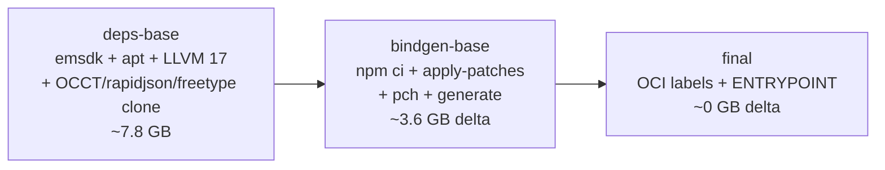
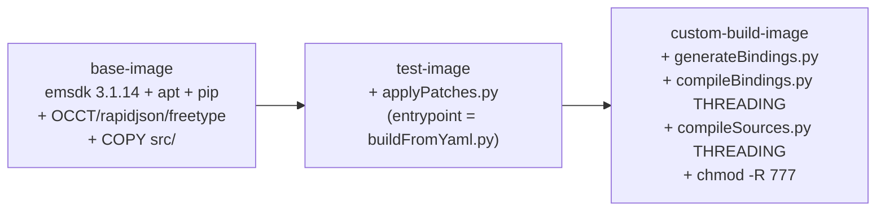
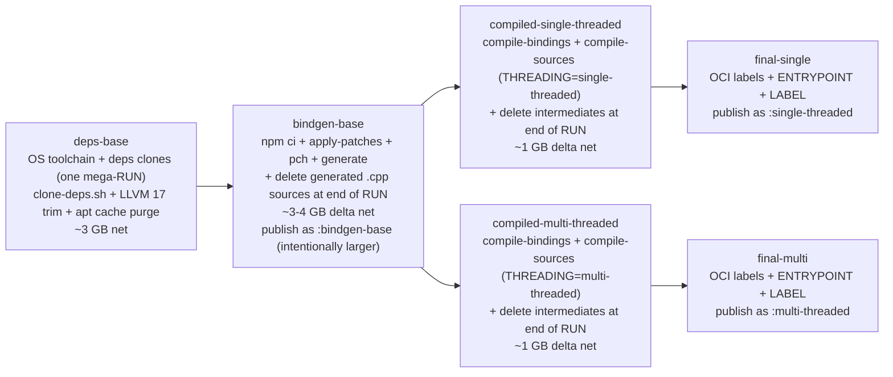

# OCJS Docker Image: Production-Readiness Blueprint

Audit of the taucad `opencascade.js` Docker image against the consumer story it advertises ("pick single or multi, point at your YAML, get a custom wasm in 3-5 minutes") and against the upstream v2 image that already implements that story, plus a staged blueprint for closing the gaps.

## Executive Summary

The taucad Dockerfile pre-bakes the lightweight steps (`apply-patches`, `pch`, `generate`) but **omits the two heaviest** (`compile-bindings`, `compile-sources`) from every published image. Upstream v2 pre-bakes both. As a result every taucad consumer pays 30-60 minutes of cold emcc work on first `docker run`, while the upstream v2 user finishes in 3-5 minutes from the same starting point.

The fork also has three secondary regressions vs upstream: (1) `OCJS_OUTPUT_DIR=/output` silently drops artifacts when consumers follow the Quickstart's single-mount command; (2) the venv at `/opencascade.js/.venv/bin/python` symlinks into root-only `/root/.local/share/uv/...`, breaking `-u $(id -u):$(id -g)`; (3) the `:single-threaded` and `:multi-threaded` tags produce byte-identical images because the threading mode only affects the compile stages that aren't baked in.

Compounding this, the CI is currently red on every push (the smoke job references a `build-configs/link-filter-poc.yml` that no longer exists), publishes only on `v*` tags (no branch preview images), and has no multi-threaded smoke coverage or pre-publish validation gate.

A separate but equally consequential gap: the fork's image is **~10x larger than upstream's by registry-compressed size** (upstream `:multi-threaded` ships at ~1.7 GB compressed; the current fork image is ~6 GB compressed) — driven by a vendored LLVM 17 tree (5.6 GB on disk vs upstream's pip-installed libclang at ~150 MB) and by retaining ~3 GB of generated `.cpp` sources that are dead weight after `compile-bindings`. **In-RUN pruning** at each stage — deleting LLVM 17 source tree at the end of `clone-deps.sh`, deleting generated `.cpp` files at the end of the bindgen-base RUN, deleting compile-time scratch at the end of the compile RUN — projects to **~1.0-1.3 GB compressed for `:single-threaded`/`:multi-threaded`** (close to upstream's 1.7 GB) without introducing multi-stage `COPY --from=` complexity or rewriting the entrypoint. `:bindgen-base` stays larger (~2.0-2.5 GB compressed) to support the secondary "custom compile flags" story.

The architecture is otherwise stronger than upstream's (Nx-cached layers, multi-stage targets, mount-receipt entrypoint, provenance, build manifests, multi-arch CI). Closing the bake gap, fixing the output-dir default + venv permissions + threading-tag split, applying in-RUN pruning, and reshaping CI into a validate-then-publish DAG over branch + tag pushes converts the image from "developer plaything" into "publishable consumer artifact" without self-hosting runners or paying for GHA larger runners — heavy compile layers live in a registry-backed cache and runner disk pressure is solved with `jlumbroso/free-disk-space`.

## Table of Contents

- [Problem Statement](#problem-statement)
- [Methodology](#methodology)
- [Current State Inventory](#current-state-inventory)
- [Upstream v2 Reference Architecture](#upstream-v2-reference-architecture)
- [Findings](#findings)
- [Target Architecture](#target-architecture)
- [Recommendations](#recommendations)
- [Trade-offs](#trade-offs)
- [Migration Plan](#migration-plan)
- [Resolved Decisions](#resolved-decisions)
- [References](#references)
- [Appendix: Layer Size Inventory](#appendix-layer-size-inventory)
- [Appendix: link-filter-poc.yml Refresh Procedure](#appendix-link-filter-pocyml-refresh-procedure)

## Problem Statement

The taucad opencascade.js documentation makes two consumer-facing promises:

1. **Primary story** (Quickstart, `docs-site/.../quick-start-docker.mdx`): _"pick single or multi, point at your YAML, get custom bindings in 2-4 minutes"_.
2. **Secondary story** (Toolchain custom-build guide): _"override compile/link flags, get custom bindings in a longer but bounded time"_.

In practice neither story is delivered today:

- Replicad's `custom_build_single.yml` (226 bindings) against the prebuilt `opencascade-js:single-threaded` image links in **30-60+ minutes** on M2-class hardware (observed during the May-2026 build session).
- The Quickstart copy-paste command writes outputs to a path the container can't reach from the host, so artifacts vanish on `--rm`.
- The `-u $(id -u):$(id -g)` line in the Quickstart command fails with `ERROR: /opencascade.js/.venv/bin/python not found` because the venv's Python symlink target is root-only.
- `:single-threaded` and `:multi-threaded` tags exist but compile to byte-identical images.

This document quantifies the gaps against the upstream v2 image (which makes the 3-5 minute story actually work) and proposes a layered Docker architecture that delivers both stories while keeping CI build times tractable.

## Methodology

Three inputs informed the analysis:

1. **Live build observation** — ran `docker run ... opencascade-js:single-threaded full /src/custom_build_single.yml` against the replicad YAML; observed Nx target order, cache hits/misses, and elapsed time per target.
2. **Image archaeology** — `docker history --no-trunc` on `opencascade.js:single-threaded` to identify which Dockerfile RUN steps produce which layer sizes.
3. **Upstream comparison** — read `repos/opencascade.js-upstream/Dockerfile`, `src/buildFromYaml.py`, `src/compileBindings.py`, `src/compileSources.py`, and `.github/workflows/buildFull.yml` to confirm upstream's pre-bake pattern and CI publish flow.

## Current State Inventory

### Taucad Dockerfile (3 stages)



Published image: 18.5 GB. **Not** included in the image:

- `compile-bindings` outputs — ~10,000 `.cpp` files compiled to `.cpp.o` via emcc.
- `compile-sources` outputs — OCCT static libraries via CMake under `build/sources/`.

First `docker run` therefore executes those two steps cold. Subsequent runs cache via the mounted `ocjs-nx-cache` + `ocjs-build-cache` volumes — but only if the user remembered to mount them.

### Taucad CI publish (`.github/workflows/docker.yml`)

- Smoke job builds the in-tree Dockerfile and links a 22-symbol POC YAML to catch breakage.
- Publish jobs build per-arch (`linux/amd64`, `linux/arm64`) with `cache-from=gha`, push manifest list to `ghcr.io/taucad/opencascade.js`. **Both arches are built on every push regardless of trigger** — no distinction between branch previews and release tags, doubling CI cost for branch previews that have no arm64 consumer.
- Build target: implicit `final` (the topmost stage). Threading mode: implicit `single-threaded` (the `OCJS_CONFIG_DEFAULT` default).
- Caches via GHA backend (10 GB per scope). No registry-cache fallback.

### Taucad Quickstart command (`docs-site/.../quick-start-docker.mdx`)

```bash
docker run --rm -v "$(pwd):/src" -u "$(id -u):$(id -g)" \
  ghcr.io/taucad/opencascade.js:beta /src/mybuild.yml
```

`OCJS_OUTPUT_DIR=/output` (set in Dockerfile L225), which is **not mounted**. Artifacts land in the container's overlay FS and are removed with `--rm`.

## Upstream v2 Reference Architecture

### Upstream Dockerfile (3 stages, with the heavy work pre-baked)



[`opencascade.js-upstream/Dockerfile` L66-75](repos/opencascade.js-upstream/Dockerfile):

```dockerfile
FROM test-image AS custom-build-image

RUN \
  /opencascade.js/src/generateBindings.py && \
  /opencascade.js/src/compileBindings.py ${threading} && \
  /opencascade.js/src/compileSources.py ${threading} && \
  chmod -R 777 /opencascade.js/ && \
  chmod -R 777 /occt

ENTRYPOINT ["/opencascade.js/src/buildFromYaml.py"]
```

The threading dimension is wired in at the **stage** level via `ARG threading=single-threaded` ([`Dockerfile` L54-55](repos/opencascade.js-upstream/Dockerfile)). CI publishes two distinct tags by building the same target twice with different build-args ([`buildFull.yml` L78-83, L107-113](repos/opencascade.js-upstream/.github/workflows/buildFull.yml)):

```bash
docker build --target custom-build-image --build-arg threading=single-threaded -t $IMAGE .
docker build --target custom-build-image --build-arg threading=multi-threaded  -t $IMAGE:multi-threaded .
```

### Upstream `buildFromYaml.py` entrypoint

Reads YAML, compiles only the YAML's `additionalCppCode` wrappers, then **cherry-picks pre-built `.cpp.o` files** matching the symbols list and links them ([`buildFromYaml.py` L102-125](repos/opencascade.js-upstream/src/buildFromYaml.py)):

```python
bindingsO = []
for dirpath, _, filenames in os.walk(libraryBasePath + "/bindings"):
  for item in filenames:
    if item.endswith(".cpp.o") and shouldProcessSymbol(item[:-6], build["bindings"]):
      bindingsO.append(dirpath + "/" + item)
sourcesO = [...]  # from /opencascade.js/build/sources
subprocess.check_call([
  "emcc", "-lembind", ...,
  *bindingsO, *sourcesO,
  "-o", os.getcwd() + "/" + build["name"],
  ...
])
```

`os.getcwd()` is `/src` (the mounted YAML directory, set as `WORKDIR /src/` in the Dockerfile L52), so outputs land next to the YAML automatically. **One mount, no `OCJS_OUTPUT_DIR` indirection.**

### Upstream Quickstart command (`website/docs/03-app-dev-workflow/03-custom-builds.md`)

```bash
docker run --rm -it -v "$(pwd):/src" -u "$(id -u):$(id -g)" \
  donalffons/opencascade.js test.yml
```

Works on first try because (a) the venv was `chmod -R 777`-ed during the build, (b) outputs go to `os.getcwd()` = `/src` = the mount, (c) every consumer step except link is pre-baked.

## Findings

### Finding 1: Heavy compile steps not pre-baked — kills the "3-5 minute link" promise

**Severity**: P0 (blocks the primary consumer story)

**Evidence**: [`Dockerfile` L242-244](repos/opencascade.js/Dockerfile):

```dockerfile
RUN npx nx run ocjs:apply-patches && \
    npx nx run ocjs:pch && \
    npx nx run ocjs:generate
```

Compare to upstream's [`Dockerfile` L68-71](repos/opencascade.js-upstream/Dockerfile):

```dockerfile
RUN \
  /opencascade.js/src/generateBindings.py && \
  /opencascade.js/src/compileBindings.py ${threading} && \
  /opencascade.js/src/compileSources.py ${threading} && \
  ...
```

**Observed runtime** (replicad YAML, 226 bindings, M2 Pro, 4 CPUs, 8 GB memory limit):

| Phase                  |                     Taucad image | Upstream v2 image (extrapolated\*) |
| ---------------------- | -------------------------------: | ---------------------------------: |
| `apply-patches`        |                   cache hit (0s) |                     cache hit (0s) |
| `pch`                  |                   cache hit (0s) |                     cache hit (0s) |
| `generate`             |                   cache hit (0s) |                     cache hit (0s) |
| **`compile-bindings`** |               **30-50 min cold** |                 **cache hit (0s)** |
| **`compile-sources`**  |               **15-30 min cold** |                 **cache hit (0s)** |
| `link`                 |                           30-60s |                             30-60s |
| `wasm-opt -O4`         |                           30-90s |                             30-90s |
| **Total**              | **45-80 min cold, 3-5 min warm** |           **3-5 min on first run** |

\*Upstream extrapolated from CI runtime (`buildFull.yml` budgets 10000 minutes total for `release` builds, but the published `:latest` image only requires the consumer to run link + wasm-opt).

### Finding 2: `OCJS_OUTPUT_DIR=/output` breaks the Quickstart copy-paste flow

**Severity**: P0 (artifacts silently lost)

**Evidence**: [`Dockerfile` L225](repos/opencascade.js/Dockerfile) sets `ENV OCJS_OUTPUT_DIR=/output`. [`yaml_build.py` L702](repos/opencascade.js/src/ocjs_bindgen/link/yaml_build.py) reads that env: `output_dir = os.environ.get("OCJS_OUTPUT_DIR", os.getcwd())`. Quickstart command mounts only `-v "$(pwd):/src"` — `/output` is not mounted, so emcc writes into the container's overlay filesystem.

The entrypoint's `print_output_mount_receipt` prints a warning when `/output` is missing ([`docker-entrypoint.sh` L77-94](repos/opencascade.js/scripts/docker-entrypoint.sh)), but only after pulling and starting the image, and only at the top of a multi-screen log — easy to miss. Upstream sidesteps this entirely by writing outputs to `os.getcwd()` (the mounted YAML directory).

### Finding 3: Non-root execution broken by venv-in-/root layout

**Severity**: P0 (Quickstart command exits non-zero)

**Evidence**: From the May-2026 build session:

```text
$ docker run --rm -v "$REPLICAD/build-config:/src:ro" -u "$(id -u):$(id -g)" \
    opencascade-js:single-threaded validate /src/custom_build_single.yml
ERROR: /opencascade.js/.venv/bin/python not found. Run scripts/clone-deps.sh first.
```

Inspection:

```text
$ docker run --rm --entrypoint sh opencascade-js:single-threaded -c 'ls -la /opencascade.js/.venv/bin/python'
lrwxrwxrwx 1 root root 76 May 20 04:25 /opencascade.js/.venv/bin/python
  -> /root/.local/share/uv/python/cpython-3.14.4-linux-aarch64-gnu/bin/python3.14
```

`/root` has mode 0700 by default. Non-root processes can't traverse it, so `python` resolves but is unexecutable. Upstream's `chmod -R 777 /opencascade.js/ /occt` is brute-force but works; the fork uses `uv` and lost that paper-over.

### Finding 4: `:single-threaded` and `:multi-threaded` image tags are byte-identical

**Severity**: P1 (misleading metadata, wasted build infra)

**Evidence**: [`Dockerfile` L218-222](repos/opencascade.js/Dockerfile):

```dockerfile
ARG OCJS_CONFIG_DEFAULT=single-threaded
ENV OCJS_OUTPUT_DIR=/output
ENV OCJS_CONFIG="${OCJS_CONFIG_DEFAULT}"
```

The build-arg only flips an env var. The pre-baked steps (`apply-patches`, `pch`, `generate`) are threading-agnostic; `compile-bindings` and `compile-sources` (which _are_ threading-sensitive — `-pthread` flag, separate `.o` outputs) aren't pre-baked. So `docker build --build-arg OCJS_CONFIG_DEFAULT=multi-threaded` produces an image whose only difference from the single-threaded tag is one ENV line.

### Finding 5: GHA cache backend cannot store compile-bindings outputs across runs

**Severity**: P1 (CI smoke job has no usable warm cache)

**Evidence**: [`docker.yml` L60-61](repos/opencascade.js/.github/workflows/docker.yml):

```yaml
cache-from: type=gha,scope=ocjs-docker
cache-to: type=gha,scope=ocjs-docker,mode=max
```

GitHub Actions cache backend has a **10 GB per scope** limit. The compile-bindings + compile-sources outputs are ~5-10 GB by themselves. Even if the Dockerfile were updated to pre-bake them, GHA cache would evict them between runs. The CI smoke job's 90-minute timeout exists precisely because every run is cold.

### Finding 6: Multi-arch publish is the only way to deliver the native arm64 link-time UX

**Severity**: P1 (consumer-visible performance gap on Apple Silicon)

**Evidence**: Docker containers are not VMs — userspace binaries inside the image execute natively on the host CPU's ISA. The link-step toolchain (`/emsdk/upstream/bin/clang`, `wasm-ld`, `wasm-opt`) is compiled for one ISA and runs through emulation (Rosetta 2 for Linux or QEMU user-mode) on any other host. Verified by the venv-inspection probe from the May 22 session:

```text
$ docker run --rm --entrypoint sh opencascade-js:single-threaded \
    -c 'ls -la /opencascade.js/.venv/bin/python'
lrwxrwxrwx 1 root root 76 May 20 04:25 /opencascade.js/.venv/bin/python
  -> /root/.local/share/uv/python/cpython-3.14.4-linux-aarch64-gnu/bin/python3.14
```

`cpython-3.14.4-linux-aarch64-gnu` confirms locally-built images on Apple Silicon are native arm64 (uv only installs the interpreter matching the build target). The locally-observed ~180 second warm-link wall times during local dev are **native arm64 numbers**. Projected wall times for the same link step on M2-class hardware under different distribution paths:

| Path consumer follows                              |            Link wall time on M2 Pro |
| -------------------------------------------------- | ----------------------------------: |
| Pull native arm64 image (multi-arch publish)       | ~180 s (matches local-dev baseline) |
| Pull amd64-only image, Rosetta 2 for Linux enabled |                          ~360-450 s |
| Pull amd64-only image, QEMU user-mode (default)    |                         ~900-1800 s |

The 3-5 minute warm-link target in the blueprint and Quickstart is calibrated against the native arm64 baseline. Without arm64 publishes for released tags, every Apple Silicon consumer (including the Tau team itself) would regress from the promised 3-5 min to 6-15 min. Upstream's amd64-only publish is a known UX gap the fork can close cheaply now that GitHub Actions provides free arm64 runners (`ubuntu-24.04-arm`, GA mid-2024).

Current CI ([`docker.yml` L118-127](repos/opencascade.js/.github/workflows/docker.yml)) already builds per-arch via a `matrix.platform` strategy and merges results into a manifest list. The remaining gap: branch builds replicate the full multi-arch matrix unnecessarily (preview consumers are reviewers, not end users on the hot path), doubling branch CI time + GHCR storage for marginal benefit.

### Finding 7: No published baseline for "how long should this take" — consumers can't tell warm from cold

**Severity**: P2

**Evidence**: The Quickstart shows a "Typical wall-clock" table (5-15s generate, 1-3min compile-bindings, 30-60s link, total ~2-4min). The table doesn't say whether those are warm or cold numbers, and the times only hold if compile-bindings/compile-sources are already cached — which they aren't on first run.

### Finding 8: CI is broken today — missing `link-filter-poc.yml` blocks every push

**Severity**: P0 (CI red on `master`)

**Evidence**: [`docker.yml` L69-80](repos/opencascade.js/.github/workflows/docker.yml) references `build-configs/link-filter-poc.yml`, but the file no longer exists in `build-configs/` (only `full.yml`, `full_multi.yml`, `configurations.json` and the prebuilt artifact sidecars remain). Last observed CI failure (May 22 2026, 24 min wall time):

```text
═══ Validating YAML config: /opencascade.js/build-configs/link-filter-poc.yml ═══
Traceback (most recent call last):
  File "<string>", line 6, in <module>
    config = yaml.safe_load(open('/opencascade.js/build-configs/link-filter-poc.yml'))
FileNotFoundError: [Errno 2] No such file or directory:
  '/opencascade.js/build-configs/link-filter-poc.yml'
```

The 22-symbol POC scope still survives in [`tests/sentinel/test_link_ncollection_reachability.py` L47-66](repos/opencascade.js/tests/sentinel/test_link_ncollection_reachability.py) as `_REPLICAD_LIKE_SCOPE` and is referenced by [`.vscode/launch.json` L8](repos/opencascade.js/.vscode/launch.json). The YAML itself was inadvertently deleted in a recent cleanup. The smoke job runs ~24 minutes before failing on the missing file — wasting CI budget on every push.

### Finding 9: CI publishes only on `v*` tags — branch builds never produce a distributable image

**Severity**: P1 (no preview images for testing changes)

**Evidence**: [`docker.yml` L112, L180`](repos/opencascade.js/.github/workflows/docker.yml):

```yaml
publish-platform:
  if: startsWith(github.ref, 'refs/tags/v')
publish-manifest:
  if: startsWith(github.ref, 'refs/tags/v')
```

Pushes to `main`, `master`, or `occt-v8-*` branches only run the smoke job (which is currently broken — Finding 8). Reviewers cannot pull a candidate image for a PR; consumers cannot test pre-release builds; the warm-link e2e cannot run against an actual published image until a tag is cut.

### Finding 10: Smoke job has no validate-then-publish gate, no multi-threaded coverage

**Severity**: P1 (regression risk for multi-threaded builds)

**Evidence**: The smoke job ([`docker.yml` L43-104](repos/opencascade.js/.github/workflows/docker.yml)) builds the `final` stage with default args (single-threaded), runs validate + link against the missing POC, and uploads artifacts. There is **no equivalent smoke against `THREADING=multi-threaded`**. The publish job emits a single image manifest list. A regression that breaks only multi-threaded compilation lands undetected until a consumer file an issue.

### Finding 11: Provenance/SBOM are real wins worth preserving

**Severity**: P2 (positive finding)

**Evidence**: [`docker.yml` L161-162](repos/opencascade.js/.github/workflows/docker.yml) sets `provenance: true, sbom: true`. The `provenance.json` sidecar pattern ([`build-wasm.sh` L808, L831](repos/opencascade.js/build-wasm.sh)) captures toolchain versions, source commits, and compile flags. Upstream v2 has none of this. The blueprint should keep these.

### Finding 12: GitHub-hosted runners cannot fit a pre-baked 25 GB image without disk reclamation + registry caching

**Severity**: P1 (architectural constraint, resolved via free-tier-compatible strategy)

**Evidence**: `ubuntu-latest` runners ship with ~14 GB usable disk and 16 GB RAM. The current 18.5 GB image already pushes the disk budget; pre-baking compile-bindings + compile-sources lifts it to ~25-30 GB. Upstream sidesteps this with `runs-on: [self-hosted, full]` ([upstream `buildFull.yml` L20](repos/opencascade.js-upstream/.github/workflows/buildFull.yml)).

Self-hosted runners and paid GHA larger runners (`ubuntu-latest-16-cores-with-disk`, 150 GB disk) are out of scope for now (org constraint: no self-host ops burden, no per-minute paid runner cost). The resolved strategy — viable on free-tier `ubuntu-latest` — combines two off-the-shelf techniques:

1. **Disk reclamation at job start**: `jlumbroso/free-disk-space@main` removes pre-installed Android SDK / .NET / Haskell / large Docker images. Verified to recover **~30-40 GB** on `ubuntu-latest`, bringing usable disk to ~45-55 GB — enough for a 25-30 GB image plus build context plus per-arch buildx workspace.
2. **Registry-backed cache**: `cache-from/to=type=registry,ref=ghcr.io/taucad/opencascade.js:buildcache-<arch>-<threading>` persists heavy compile layers in GHCR rather than the 10 GB GHA cache scope. Subsequent runs pull only deltas; cache lives across PRs, branches, and runner generations. BuildKit's content-addressed cache handles "nothing-changed" cases automatically — when the bindgen-base layer hash hasn't shifted, the compile layers cache-hit without any explicit trigger gating.

This is also forward-compatible: if the constraint relaxes later (paid larger runners, self-hosted infra), the same workflow migrates without architectural rewrites — only the runner label and cache backend change. Explicit trigger gating (paths-filter, workflow_dispatch) is deferred — if per-PR CI time turns out to exceed budget once Phase 2 lands, revisit then.

### Finding 13: Image size is 5-10× upstream — vendored LLVM 17 + retained generated sources

**Severity**: P0 (pull-time UX gap, registry cost)

**Evidence**: Upstream's published image is **1.68 GB compressed** ([Docker Hub `donalffons/opencascade.js` tags page](https://hub.docker.com/r/donalffons/opencascade.js/tags), e.g. `multi-threaded` digest `d3b6d7b...` at `linux/amd64`). The fork's current `:beta` is ~6 GB compressed; the projected post-bake image (with `compile-bindings`/`compile-sources` baked in) would land at ~10 GB compressed without slimming.

Disk-level breakdown of fork's `deps/` on the build host:

| Dep                       |  Fork size |                  Upstream equivalent |       Delta |
| ------------------------- | ---------: | -----------------------------------: | ----------: |
| `emsdk` (5.0.1 vs 3.1.14) |     2.0 GB |                              ~1.5 GB |     +0.5 GB |
| **`llvm-17` (vendored)**  | **5.6 GB** | `pip install libclang==15` (~150 MB) | **+5.4 GB** |
| `OCCT`                    |     522 MB |                              ~500 MB |          ≈0 |
| `freetype` + `rapidjson`  |      83 MB |                              ~200 MB |     -0.1 GB |
| **Total deps**            | **8.2 GB** |                          **~2.4 GB** | **+5.8 GB** |

Plus the bindgen-base layer:

| Layer                                              |               Fork (uncompressed) | Needed at link time?                                   |
| -------------------------------------------------- | --------------------------------: | ------------------------------------------------------ |
| Generated `.cpp` source files (10k+ TUs)           |                             ~3 GB | **No** — only `.cpp.o` outputs + `.d.ts.json` sidecars |
| Pre-compiled bindings (`compile-bindings` outputs) | not yet baked (~500 MB projected) | **Yes**                                                |
| OCCT compiled sources (`compile-sources` outputs)  | not yet baked (~500 MB projected) | **Yes**                                                |
| OCCT source `.cpp` files                           |                           ~300 MB | **No** — encoded in compiled `.o` files                |
| OCCT `.git/` history                               | none (already tarball-equivalent) | n/a                                                    |

What the link stage actually reads — verified by reading upstream's [`buildFromYaml.py` L104-125](repos/opencascade.js-upstream/src/buildFromYaml.py) and the fork's equivalent in [`src/ocjs_bindgen/link/yaml_build.py`](repos/opencascade.js/src/ocjs_bindgen/link/yaml_build.py):

- `build/bindings/**/*.cpp.o` — pre-compiled bindings (LLVM bitcode w/ `-flto`)
- `build/bindings/**/*.d.ts.json` — TypeScript definition sidecars
- `build/sources/**/*.o` — pre-compiled OCCT sources
- `src/customBuildSchema.py` + the Python pipeline scripts
- Headers from `deps/OCCT/inc/`, `deps/rapidjson/include/`, `deps/freetype/include/` (for `additionalCppCode` `-I` flags)
- `/emsdk` toolchain binaries (emcc, clang)
- **Never** the `.cpp` source files, **never** the LLVM 17 source tree (only `libclang.so` for bindgen regen), **never** OCCT source `.cpp` files.

Why upstream gets to 1.7 GB without working hard at slimming: they never accumulated the bloat in the first place — `pip install libclang` instead of vendored LLVM 17 (-5.4 GB), tarball OCCT instead of git clone (-1 GB if the fork were still cloning with .git), simpler pipeline (-2 GB generated `.cpp` files because their generator emits fewer TUs). The fork's `chmod -R 777` line at the equivalent of upstream's `custom-build-image` works only because upstream's stage isn't fat to begin with.

## Target Architecture

**5 Dockerfile stages, two published image tag families** (threading-specific + `:bindgen-base`). The same base image lineage is preserved through every stage — no `FROM scratch`, no separate slim runtime image, no `COPY --from=` flattening. Each stage prunes its own intermediates **at the end of the same RUN block that created them**, so deletions don't get stranded as Docker layer "deletion markers" over fat parent layers.



Each stage is independently buildable via `--target` so CI can fan out work:

| Stage                  | When rebuilds                                       | Purpose                                 | Published?                                         |
| ---------------------- | --------------------------------------------------- | --------------------------------------- | -------------------------------------------------- |
| `deps-base`            | toolchain bumps, dep version changes                | aggressive cache, multi-month half-life | no                                                 |
| `bindgen-base`         | codegen changes, patch updates, YAML schema changes | per-PR rebuild                          | **yes** (as `:bindgen-base`, intentionally larger) |
| `compiled-{threading}` | OCCT source changes, compile-flag changes           | per-release rebuild                     | no (consumed by `final-{threading}`)               |
| `final-{threading}`    | label updates, entrypoint tweaks                    | every commit                            | **yes** (as `:single-threaded`, `:multi-threaded`) |

### In-RUN pruning matrix

For each heavy stage, deletions happen **inside the same RUN block** that produced the intermediates. This is the only way to actually reduce layer size without multi-stage flattening — a deletion in a _subsequent_ RUN just adds a whiteout marker over bytes that still live in the parent layer.

| Stage                                                             | What gets created                                                                                                                         | What gets pruned in the same RUN                                                                                                                                                                                                                                       | Why prunable                                                                                                                                                                                                                                                                                                                                                       |
| ----------------------------------------------------------------- | ----------------------------------------------------------------------------------------------------------------------------------------- | ---------------------------------------------------------------------------------------------------------------------------------------------------------------------------------------------------------------------------------------------------------------------- | ------------------------------------------------------------------------------------------------------------------------------------------------------------------------------------------------------------------------------------------------------------------------------------------------------------------------------------------------------------------ |
| `deps-base` (`clone-deps.sh` RUN)                                 | OCCT (522 MB), rapidjson, freetype, LLVM 17 (5.6 GB), Python venv                                                                         | LLVM 17 source tree (`deps/llvm-17/llvm/`, `deps/llvm-17/clang/`), `bin/clang*`, `lib/libLLVM*.a`, `lib/cmake/`, `share/` — keep only `lib/libclang.so*`, `lib/clang/<ver>/include/`, `include/clang-c/`. Also `/var/cache/apt`, `/var/lib/apt/lists/`, `~/.cache/uv`. | LLVM 17 source is only needed during the LLVM build itself (already done in the upstream tarball). Static libs and the clang binary aren't invoked at runtime — emcc bundles its own. apt + uv caches aren't needed once the image is built.                                                                                                                       |
| `bindgen-base` (`apply-patches + pch + generate` RUN)             | PCH (~90 MB), flat includes (~500 MB), generated `.cpp` binding files (~3 GB), `.d.ts.json` sidecars (~100 MB), ncollection-manifest.json | `build/bindings/**/*.cpp` (generated source — ~3 GB), `build/bindings/**/*.h` (PCH inputs not needed downstream)                                                                                                                                                       | After `generate`, the bindgen pipeline only consumes the `.d.ts.json` sidecars at link time and the `.cpp` files only as inputs to `compile-bindings`. Once `compile-bindings` runs, the `.cpp` files have produced `.cpp.o` artefacts and are dead weight. **Caveat**: this prevents re-running `compile-bindings` in `:bindgen-base` consumers — see trade-offs. |
| `compiled-{threading}` (`compile-bindings + compile-sources` RUN) | `build/bindings/**/*.cpp.o` (~500 MB), `build/sources/**/*.o` (~500 MB), scratch intermediates from CMake                                 | CMake intermediate caches under `build/sources/CMakeFiles/`, `.ninja_log`, `.ninja_deps`, intermediate `.cpp.o.d` dependency files, `/emsdk/upstream/.cache/` (emscripten ports cache)                                                                                 | Scratch state only needed during the build itself. The final image keeps only the linkable `.o` outputs.                                                                                                                                                                                                                                                           |
| `final-{threading}`                                               | OCI labels, ENTRYPOINT/CMD                                                                                                                | nothing — this stage adds no bytes                                                                                                                                                                                                                                     | Pure metadata layer.                                                                                                                                                                                                                                                                                                                                               |

**Critical Dockerfile pattern** — every heavy RUN ends with cleanup in the same RUN block:

```dockerfile
RUN bash scripts/clone-deps.sh --dest /opencascade.js/deps && \
    # In-RUN LLVM 17 trim — see In-RUN pruning matrix
    find /opencascade.js/deps/llvm-17 -mindepth 1 -maxdepth 1 \
      ! -name 'lib' ! -name 'include' -exec rm -rf {} + && \
    find /opencascade.js/deps/llvm-17/lib -mindepth 1 \
      ! -name 'libclang*' ! -name 'clang' -prune -exec rm -rf {} + && \
    rm -rf /var/cache/apt /var/lib/apt/lists/* /root/.cache/uv
```

This loses some Docker layer cache granularity (a change to the LLVM trim invalidates the whole deps-base layer instead of just the trim sub-layer), but the trade-off is acceptable because (a) the deps-base layer rarely changes in practice and (b) registry-backed cache (R5) preserves the layer across CI runs anyway.

### LLVM 17 trim — pruned inside `deps-base`'s clone-deps RUN

The 5.6 GB vendored LLVM 17 is the single biggest size driver. Keep only what `src/ocjs_bindgen/` actually invokes:

| Component                                                     | Action                                    |    Size |
| ------------------------------------------------------------- | ----------------------------------------- | ------: |
| `lib/libclang.so*`                                            | **keep** (libclang ABI surface)           |  ~80 MB |
| `lib/clang/<ver>/include/`                                    | **keep** (clang resource headers)         |  ~20 MB |
| `include/clang-c/`                                            | **keep** (libclang C API headers)         |   ~2 MB |
| `bin/clang`, `bin/clang++`                                    | drop (emcc bundles its own)               | -200 MB |
| `lib/libLLVM*.a`, `lib/libclang*.a`                           | drop (static libs, not linked at runtime) |   -2 GB |
| `lib/cmake/`, `share/`                                        | drop                                      |  -50 MB |
| Source tree `deps/llvm-17/llvm/`, `deps/llvm-17/clang/`, etc. | drop after extract                        |   -3 GB |

Net: 5.6 GB → ~250 MB. Applied **at the end of the `clone-deps.sh` RUN** so deletions stay inside the same layer. Every downstream stage inherits the slim version. **Dropping vendored LLVM 17 entirely in favour of `pip install libclang` is deferred** — see [Open Questions](#remaining-open-items-implementation-time-decisions-not-blockers).

### Consumer paths after the blueprint lands

**Primary story** (warm path, 3-5 min):

```bash
docker run --rm \
  -v "$(pwd):/src" \
  -u "$(id -u):$(id -g)" \
  ghcr.io/taucad/opencascade.js:single-threaded /src/mybuild.yml
```

OR

```bash
docker run --rm \
  -v "$(pwd):/src" \
  -u "$(id -u):$(id -g)" \
  ghcr.io/taucad/opencascade.js:multi-threaded /src/mybuild.yml
```

**Secondary story** (custom compile flags, 30-60 min cold + 3-5 min subsequent):

```bash
docker volume create ocjs-build-cache
docker run --rm \
  -v "$(pwd):/src" \
  -v ocjs-build-cache:/opencascade.js/build \
  -u "$(id -u):$(id -g)" \
  -e OCJS_OPT=-Os \
  -e OCJS_MALLOC=mimalloc \
  ghcr.io/taucad/opencascade.js:bindgen-base \
  full /src/mybuild.yml
```

The `:bindgen-base` tag exposes the warm-bindgen image without the compile pre-bake, so consumers can vary compile flags and still skip apply-patches/pch/generate.

### Output-mount story alignment

Change [`Dockerfile` L225](repos/opencascade.js/Dockerfile) to:

```dockerfile
ENV OCJS_OUTPUT_DIR=/src
```

Plus add `WORKDIR /src` at the top of the `final` stage. Now the single-mount Quickstart command works out of the box (outputs land next to the YAML). Power users override with `-e OCJS_OUTPUT_DIR=/output -v "$PWD/out:/output"` for separation.

### Venv permissions fix

Three options, pick one:

1. **Install uv-managed Python to `/opt`** instead of `/root/.local/share/uv`. Set `UV_PYTHON_INSTALL_DIR=/opt/uv-python` in the deps-base stage before `uv python install`.
2. **`chmod -R go+rX /root/.local/share/uv /root`** after the venv is created. Brute-force but mirrors upstream's approach.
3. **Drop `-u $(id -u):$(id -g)` from the canonical Quickstart**, accept that outputs are owned by root, and document the recovery (`sudo chown -R $USER out/` afterwards). Worst UX of the three.

Recommended: option 1, with option 2 as a fallback if `uv` doesn't honour the env var cleanly.

## Recommendations

| #   | Action                                                                                                                                                                                                                                                                                                                                                                                                                                                                                                                                                                                                                                                                                                                                                                                                                                                      | Priority | Effort            | Impact                                                                                                                                                                                                                                                                  |
| --- | ----------------------------------------------------------------------------------------------------------------------------------------------------------------------------------------------------------------------------------------------------------------------------------------------------------------------------------------------------------------------------------------------------------------------------------------------------------------------------------------------------------------------------------------------------------------------------------------------------------------------------------------------------------------------------------------------------------------------------------------------------------------------------------------------------------------------------------------------------------- | -------- | ----------------- | ----------------------------------------------------------------------------------------------------------------------------------------------------------------------------------------------------------------------------------------------------------------------- |
| R1  | Split Dockerfile into **5 stages** (`deps-base`, `bindgen-base`, `compiled-{single,multi}`, `final-{single,multi}`). Pre-bake `compile-bindings` + `compile-sources` in the compiled stages, parameterised on `--build-arg threading`. `bindgen-base` is published directly as `:bindgen-base`; `final-{single,multi}` publish as `:single-threaded` and `:multi-threaded`.                                                                                                                                                                                                                                                                                                                                                                                                                                                                                 | P0       | M                 | Delivers the primary story; turns 30-60 min cold runs into 3-5 min.                                                                                                                                                                                                     |
| R2  | Change `OCJS_OUTPUT_DIR` default to `/src` and set `WORKDIR /src` in the `final` stages. Update Quickstart command to a single mount. Remove the now-obsolete `print_output_mount_receipt` block from [`scripts/docker-entrypoint.sh` L77-94](repos/opencascade.js/scripts/docker-entrypoint.sh) since outputs going to `/src` no longer need the warning.                                                                                                                                                                                                                                                                                                                                                                                                                                                                                                  | P0       | S                 | Quickstart copy-paste actually works; obsolete warning code removed.                                                                                                                                                                                                    |
| R3  | Install uv-managed Python to `/opt/uv-python` and rebuild the venv pointing there, so `/opencascade.js/.venv/bin/python` is world-traversable.                                                                                                                                                                                                                                                                                                                                                                                                                                                                                                                                                                                                                                                                                                              | P0       | S                 | Fixes the `-u $(id -u):$(id -g)` failure.                                                                                                                                                                                                                               |
| R4  | Update `.github/workflows/docker.yml` to build and publish three image tag families per release: `:single-threaded`, `:multi-threaded`, `:bindgen-base`. No `:latest` alias (R7 retired).                                                                                                                                                                                                                                                                                                                                                                                                                                                                                                                                                                                                                                                                   | P0       | M                 | Surfaces threading choice as a real image selection; enables secondary story.                                                                                                                                                                                           |
| R5  | Move CI cache from `type=gha` to `type=registry,ref=ghcr.io/taucad/opencascade.js:buildcache-<arch>-<threading>` so layer blobs persist across CI runs without the 10 GB cap. Budget: ~10 GB per scope × 4 scopes (amd64+arm64 × single+multi) = ~40 GB GHCR storage for caches (public packages, no hard cap).                                                                                                                                                                                                                                                                                                                                                                                                                                                                                                                                             | P1       | S                 | CI smoke job warms quickly; publish jobs don't redo compile work from scratch.                                                                                                                                                                                          |
| R6  | Update Quickstart "Where the time goes" table to two columns: **warm first run** (3-5 min) vs **cold rebuild from `:bindgen-base`** (45-80 min), with explanatory copy.                                                                                                                                                                                                                                                                                                                                                                                                                                                                                                                                                                                                                                                                                     | P1       | XS                | Sets accurate expectations for both stories.                                                                                                                                                                                                                            |
| R7  | Wire `scripts/docker-e2e-validate.sh` into a CI job that runs the locally-built (`--load`) image against the replicad YAML on **every push (branch + release)**. Must hit the 5-minute warm-link budget. Result gates the publish step (R13).                                                                                                                                                                                                                                                                                                                                                                                                                                                                                                                                                                                                               | P1       | S                 | Regression guard for the warm-link promise; covers branch previews and release tags symmetrically.                                                                                                                                                                      |
| R8  | Preserve existing supply-chain hygiene: `provenance: true`, `sbom: true`, OCI labels, multi-arch matrix for releases, and `provenance.json` sidecars. Cosign documentation lives in R16.                                                                                                                                                                                                                                                                                                                                                                                                                                                                                                                                                                                                                                                                    | P1       | XS (already done) | Production-grade supply-chain hygiene, differentiator vs upstream.                                                                                                                                                                                                      |
| R9  | **Native arm64 release publishes** (multi-arch manifest list for `:single-threaded`/`:multi-threaded`/`:bindgen-base`/`:v*`) restore the consumer-visible UX to native baseline. Drop the legacy "`--platform linux/amd64` callout for Apple Silicon" in [`docs-site/content/docs/toolchain/getting-started/quick-start-docker.mdx`](repos/opencascade.js/docs-site/content/docs/toolchain/getting-started/quick-start-docker.mdx) — replace with a short "branch tags are amd64-only" footnote since branch consumers will pay the Rosetta tax by design. Add arm64 e2e in CI to confirm parity (5-min warm-link budget on `ubuntu-24.04-arm`).                                                                                                                                                                                                            | P1       | S                 | Apple Silicon consumers get native ~3 min link on released images; matches the calibrated baseline from local dev; closes upstream's amd64-only gap.                                                                                                                    |
| R10 | **In-RUN pruning** at each heavy stage — every Dockerfile RUN that creates large intermediates ends with `find ... -delete` / `rm -rf` for those intermediates **inside the same RUN block** (so deletions actually shrink the layer rather than leaving whiteout markers over fat parent layers). See [In-RUN pruning matrix](#in-run-pruning-matrix) for the exact per-stage delete sets. Includes the LLVM 17 trim (5.6 GB → 250 MB, [`deps-base` RUN](#llvm-17-trim--pruned-inside-deps-bases-clone-deps-run)), generated `.cpp` source deletion (~3 GB, `bindgen-base` RUN), and emsdk ports cache cleanup (~500 MB, `compiled-{threading}` RUN). No multi-stage `COPY --from=` flattening, no `FROM scratch` slim base, no entrypoint rewrite — same base image lineage as today.                                                                     | P0       | M                 | `:single-threaded`/`:multi-threaded` drop from ~10 GB to **~1.0-1.3 GB compressed** (close to upstream's 1.7 GB); `:bindgen-base` at ~2.0-2.5 GB compressed; no architectural complexity added.                                                                         |
| R11 | **Refresh `build-configs/link-filter-poc.yml`** against current OCCT V8 — apply the recommended 22-symbol starting set from [the refresh appendix](#appendix-link-filter-pocyml-refresh-procedure) and validate per the procedure's step 3. Unblocks the CI smoke job that's currently red on every push. Add the drift-prevention sentinel test from the appendix.                                                                                                                                                                                                                                                                                                                                                                                                                                                                                         | P0       | XS                | CI green; per-commit regression catching restored; drift between YAML and Python constant impossible going forward.                                                                                                                                                     |
| R12 | **Promote branch builds to publishable images, amd64-only for branches**: extend publish jobs to fire on `push` to `main`/`master`/`occt-v8-*` (publishing as `:branch-<name>-<sha>`, `:multi-threaded-branch-<name>-<sha>`, `:bindgen-base-branch-<name>-<sha>` tags), `linux/amd64` only — no arm64, no manifest list. Tag releases (`v*`) publish full multi-arch manifest lists (R9).                                                                                                                                                                                                                                                                                                                                                                                                                                                                   | P0       | S                 | PR reviewers and external preview consumers get same-day candidate images; branch CI runs ~50% faster than full multi-arch; GHCR storage for high-churn branch tags is halved. Apple Silicon reviewers pay the Rosetta/QEMU tax on branch tags — documented explicitly. |
| R13 | **Wire validate-then-publish gating (pre-publish)** so both `:single-threaded` and `:multi-threaded` smoke + warm-link e2e jobs must pass before either tag gets pushed. Build with `--load` into the local Docker daemon, run `docker-e2e-validate.sh` against the loaded image, only `docker push` if the gate passes. Hard 5-minute warm-link budget (matches R7, R9). Job DAG below in Phase 2.                                                                                                                                                                                                                                                                                                                                                                                                                                                         | P0       | S                 | Multi-threaded regressions caught in CI; users can trust either tag without manual verification; manifest list is exercised in the post-publish smoke.                                                                                                                  |
| R14 | **Constrained-runner CI strategy** — keep `runs-on: ubuntu-latest` (no self-host, no paid larger runners). Heavy jobs reclaim disk with `jlumbroso/free-disk-space@main` (+30-40 GB), persist `compiled-{threading}` layers in registry cache (`type=registry,ref=ghcr.io/taucad/opencascade.js:buildcache-<arch>-<threading>`). BuildKit's content-addressed cache handles "nothing changed" cache hits automatically — no explicit trigger gating (paths-filter, workflow_dispatch).                                                                                                                                                                                                                                                                                                                                                                      | P0       | M                 | Delivers Phase 2 architecture on free-tier GHA; forward-compatible if budget for paid/self-hosted runners materialises later; simpler workflow than trigger-gated alternatives.                                                                                         |
| R15 | **GHCR retention policy**: 7 days for `:branch-*` and `:*-branch-*` tags; keep the 5 most recent versions per branch tag prefix; release tags (`:v*`, `:single-threaded`, `:multi-threaded`, `:bindgen-base`) retained indefinitely. Enforced via `actions/delete-package-versions@v5` on a nightly schedule. Matches the SRE-standard preview-tag retention window.                                                                                                                                                                                                                                                                                                                                                                                                                                                                                        | P1       | XS                | Prevents GHCR sprawl while preserving review windows.                                                                                                                                                                                                                   |
| R16 | **Keyless cosign signing via OIDC** of the **manifest-list digest** (releases) and **per-arch image digest** (branches, no manifest list) for every published image. Workflow exchanges its GitHub OIDC token for an ephemeral Fulcio-issued cert tied to the workflow identity; signature + cert published to the Rekor transparency log. No private key to rotate. Document the verification flow in the Quickstart: `cosign verify ghcr.io/taucad/opencascade.js:single-threaded --certificate-identity-regexp 'https://github.com/taucad/opencascade\.js/\.github/workflows/docker\.yml@.*' --certificate-oidc-issuer https://token.actions.githubusercontent.com`. Cosign automatically signs the OCI image index (manifest list) when invoked on a multi-arch tag, producing one signature that verifies regardless of which arch the consumer pulls. | P1       | S                 | Supply-chain provenance bound to specific workflow runs; auditable via Rekor; zero key-management burden; single-signature verification for multi-arch consumers.                                                                                                       |
| R17 | **`:bindgen-base` published with full-build entrypoint** (parity with upstream's `custom-build-image`, which sets `ENTRYPOINT ["/opencascade.js/src/buildFromYaml.py"]` and `WORKDIR /src/`). Consumers wanting an interactive shell override with `docker run --entrypoint bash`. No dual-publish.                                                                                                                                                                                                                                                                                                                                                                                                                                                                                                                                                         | P1       | XS                | Single consistent UX across all published tags; matches upstream's well-tested pattern.                                                                                                                                                                                 |
| R18 | **Drop `OCJS_PATCH_DUMP` and `OCJS_PATCH_STEPCAF` env vars** — make `patch-dump` and `patch-stepcaf` unconditional hard-coded defaults in the bindgen pipeline. Remove the `ENV OCJS_PATCH_DUMP=true` / `ENV OCJS_PATCH_STEPCAF=true` lines from the Dockerfile, remove all conditional checks in `build-wasm.sh` and `src/ocjs_bindgen/**` that branch on these env vars, and remove documentation referring to them. These behaviours are required for every supported build; making them optional via env vars is a footgun.                                                                                                                                                                                                                                                                                                                             | P1       | S                 | Smaller surface area, fewer ways for consumers to accidentally break the build by overriding env vars.                                                                                                                                                                  |

## Trade-offs

| Choice                                                               | Pro                                                                                                                                                                                                                                                   | Con                                                                                                                                                                                                                                                                                                                                                                       |
| -------------------------------------------------------------------- | ----------------------------------------------------------------------------------------------------------------------------------------------------------------------------------------------------------------------------------------------------- | ------------------------------------------------------------------------------------------------------------------------------------------------------------------------------------------------------------------------------------------------------------------------------------------------------------------------------------------------------------------------- |
| Pre-bake compile-bindings (R1)                                       | Delivers warm-link promise.                                                                                                                                                                                                                           | Stages grow to ~6 GB pre-prune; in-RUN pruning brings them back down.                                                                                                                                                                                                                                                                                                     |
| In-RUN pruning instead of multi-stage `COPY --from=` slim base (R10) | No architectural rewrite — same base image lineage, same `docker-entrypoint.sh`, no `FROM scratch` complexity. Achievable in a single pass over the existing Dockerfile. Projected ~1.0-1.3 GB compressed (marginally better than upstream's 1.7 GB). | Each heavy RUN becomes a mega-RUN (compile + cleanup in one block) — coarser Docker layer cache granularity than splitting into separate RUNs. Acceptable because registry cache (R5) preserves the layer across CI runs, and the deps-base layer rarely changes. Cannot achieve `FROM scratch`-level minimality (~250-500 MB) that multi-stage flattening would deliver. |
| Drop `.cpp` generated sources at end of bindgen-base RUN (R10)       | -3 GB uncompressed; the second-largest single-stage win.                                                                                                                                                                                              | Prevents consumers of `:bindgen-base` from re-running `compile-bindings` against the original generated TUs. Mitigated: consumers wanting full regen invoke `pnpm nx run ocjs:generate` first, which regenerates the TUs from the bindgen pipeline.                                                                                                                       |
| Trim vendored LLVM 17 to `libclang.so` + headers (R10)               | -5.4 GB across every downstream stage; the single largest bytes-saved win.                                                                                                                                                                            | Requires `find -delete` at end of clone-deps RUN; if a future bindgen change needs a now-deleted LLVM tool, regression caught in CI.                                                                                                                                                                                                                                      |
| Keep vendored LLVM 17 (don't pip-install libclang)                   | Preserves the libclang ABI-parity guarantees the fork relied on.                                                                                                                                                                                      | `:bindgen-base` is ~2.5 GB compressed instead of upstream-parity ~1.2 GB. Feasibility of pip-installed libclang deferred to Phase 4 spike.                                                                                                                                                                                                                                |
| Two threading-tagged images (R1, R4)                                 | Real distinction between tags.                                                                                                                                                                                                                        | CI builds and pushes twice; storage doubles in GHCR — bounded by retention policy R15.                                                                                                                                                                                                                                                                                    |
| Registry cache backend (R5, R14)                                     | No 10 GB GHA cap; survives across PRs/branches/runner generations.                                                                                                                                                                                    | ~40 GB GHCR storage for caches (4 scopes × ~10 GB). Public-package GHCR has no hard cap; bounded by retention policy R15 for non-cache tags.                                                                                                                                                                                                                              |
| `OCJS_OUTPUT_DIR=/src` default (R2)                                  | Single-mount Quickstart works.                                                                                                                                                                                                                        | Power users who want a separate output dir must override the env var. Mitigated by docs.                                                                                                                                                                                                                                                                                  |
| Install Python to `/opt` (R3)                                        | Clean fix, world-readable by construction.                                                                                                                                                                                                            | One-line uv config change; risk: if uv silently re-installs to `/root`, breaks again. Mitigated by R3-fallback `chmod`.                                                                                                                                                                                                                                                   |
| `bindgen-base` published as its own tag (R12, R17)                   | Enables secondary "custom compile flags" story; testable on branches.                                                                                                                                                                                 | One more tag per branch/release to maintain — bounded by retention policy R15.                                                                                                                                                                                                                                                                                            |
| Free-tier `ubuntu-latest` + free-disk-space + registry cache (R14)   | Zero ops burden, zero per-minute cost; forward-compatible if budget changes; no path-filter complexity.                                                                                                                                               | Heavy rebuild takes ~90 min on free-tier (vs ~30 min on `[self-hosted, full]`). Mitigated by registry cache: most pushes hit cache and rebuild only the changed layer (~5-15 min).                                                                                                                                                                                        |
| Multi-arch releases + amd64-only branches (D3, R9, R12 — Option A)   | Apple Silicon consumers get native ~3 min link on released tags (matches the calibrated local-dev baseline); `docker pull` is transparent (no `--platform` flag); branch CI runs ~50% faster and GHCR churn is halved.                                | Apple Silicon reviewers testing branch previews pay Rosetta 2 (~2× slower) or QEMU (~5× slower) — documented explicitly in the Supported Platforms callout. Acceptable for preview/review usage.                                                                                                                                                                          |
| Keyless cosign signing of manifest list (R16)                        | Zero key-management; signatures bound to specific workflow runs; auditable via Rekor; single-signature verification works for both arches via the manifest-list digest.                                                                               | Verifiers need `cosign` v2+ and network access to Rekor. Documented in Quickstart.                                                                                                                                                                                                                                                                                        |
| 7-day GHCR retention for branch tags (R15)                           | Prevents sprawl; matches SRE-industry standard.                                                                                                                                                                                                       | Long-lived feature branches may have their early preview tags pruned. Mitigated by "keep 5 most recent per branch prefix" floor; extendable to 14 days if needed.                                                                                                                                                                                                         |
| Pre-publish e2e gate (R13, D7)                                       | Broken images never reach GHCR; catches the broadest class of bugs.                                                                                                                                                                                   | Adds e2e time to publish path. Mitigated by 5-min budget + parallel single/multi DAG.                                                                                                                                                                                                                                                                                     |
| Drop `OCJS_PATCH_DUMP` / `OCJS_PATCH_STEPCAF` env vars (R18)         | Smaller config surface; behaviours that are hard requirements stop being toggleable.                                                                                                                                                                  | Touches scripting outside the Dockerfile (`build-wasm.sh`, `src/ocjs_bindgen/**`). Code change has a small blast radius — anywhere these env vars are read becomes an unconditional `True`.                                                                                                                                                                               |

## Migration Plan

Phased so each step is independently shippable and consumer-visible.

### Phase 0 — Unblock CI (R11)

Single-PR fix to restore the smoke job to green. No architecture change.

1. **Refresh** `build-configs/link-filter-poc.yml` against current OCCT V8 following the procedure in [Appendix: link-filter-poc.yml Refresh Procedure](#appendix-link-filter-pocyml-refresh-procedure) — do **not** verbatim-restore from `_REPLICAD_LIKE_SCOPE` (which has drifted to 25 entries against the workflow's "22 symbols" promise, per D1).
2. Add the drift-prevention sentinel test (`tests/sentinel/test_link_yaml_scope.py`) from the appendix.
3. Push to a branch, confirm the existing smoke job goes green and the sentinel test passes.

Validation: docker smoke job passes on `main`/`master`/`occt-v8-*` push; sentinel test would fail loudly if YAML and Python constant drift apart.

### Phase 1 — Stop the bleeding (R2, R3, R18)

Day-of fixes that make the existing image usable. No new layers, no CI architecture changes.

1. Change `OCJS_OUTPUT_DIR=/src`, add `WORKDIR /src` to `final` stage (R2).
2. Remove the now-obsolete `print_output_mount_receipt` block from [`scripts/docker-entrypoint.sh` L77-94](repos/opencascade.js/scripts/docker-entrypoint.sh) (R2).
3. Move uv-managed Python under `/opt/uv-python` (R3).
4. Drop `OCJS_PATCH_DUMP` and `OCJS_PATCH_STEPCAF` env vars from the Dockerfile; remove every conditional check in `build-wasm.sh` and `src/ocjs_bindgen/**` that branches on them; make the underlying behaviours unconditional (R18).
5. Update Quickstart to single-mount + `-u $(id -u):$(id -g)` (with R3 the venv permissions are fixed).
6. Rebuild + republish the image under the existing publish tag scheme (no `:beta` alias — drop it).

Validation: replicad YAML build runs end-to-end on the rebuilt image without manual workarounds; no references to `OCJS_PATCH_DUMP` or `OCJS_PATCH_STEPCAF` remain in the repo (`rg 'OCJS_PATCH_(DUMP|STEPCAF)' .` returns nothing).

### Phase 2 — Bake the warm path + production CI + in-RUN pruning (R1, R4, R5, R7, R10, R12, R13, R14, R15, R16, R17)

The architecture rework. Compile stages get pre-baked to deliver the 3-5 minute promise; in-RUN pruning (R10) keeps the published images at ~1.0-1.3 GB compressed for threading tags. CI publishes validated single/multi/bindgen-base images on every branch push, with keyless cosign signatures and a 7-day retention policy on preview tags.

1. **Dockerfile split**: implement the 5-stage layout from [Target Architecture](#target-architecture). Move `compile-bindings` and `compile-sources` RUNs into `compiled-{threading}` stages parameterised on `--build-arg threading`. `bindgen-base` is published directly as `:bindgen-base`; `final-{threading}` stages publish as `:single-threaded` / `:multi-threaded`. Apply in-RUN pruning at each heavy stage per the [In-RUN pruning matrix](#in-run-pruning-matrix) — each RUN ends with cleanup of its own intermediates inside the same RUN block (R10). Trim vendored LLVM 17 inside the `clone-deps.sh` RUN to keep only `libclang.so` + clang headers.

2. **CI job DAG with branch-vs-release arch split** (R9, R13, R14). Rewrite `.github/workflows/docker.yml` so:

   ```mermaid
   flowchart LR
     subgraph BRANCH["BRANCH push (main / master / occt-v8-*)"]
       direction LR
       bFreeDisk["free-disk-space<br/>ubuntu-latest (amd64)"]
       bBuild["build compiled-{single,multi}<br/>amd64 only<br/>cache-from/to=registry"]
       bSmokeS["smoke-single (--load)<br/>+ link POC YAML"]
       bSmokeM["smoke-multi (--load)<br/>+ link POC YAML"]
       bE2eS["e2e-single (--load)<br/>5-min warm-link budget"]
       bE2eM["e2e-multi (--load)<br/>5-min warm-link budget"]
       bPub["publish branch tags<br/>amd64 only, no manifest list<br/>:branch-*, :multi-threaded-branch-*,<br/>:bindgen-base-branch-*<br/>+ cosign sign per-arch digest"]
       bFreeDisk --> bBuild --> bSmokeS --> bE2eS --> bPub
       bBuild --> bSmokeM --> bE2eM --> bPub
     end
     subgraph RELEASE["RELEASE tag push (v*)"]
       direction LR
       rMatrix["matrix: { amd64 on ubuntu-latest, arm64 on ubuntu-24.04-arm }"]
       rFreeDisk["free-disk-space<br/>(both arch runners)"]
       rBuild["build compiled-{single,multi}<br/>per-arch<br/>cache-from/to=registry"]
       rSmoke["smoke-{single,multi} (--load)<br/>per-arch"]
       rE2e["e2e-{single,multi} (--load)<br/>per-arch<br/>5-min warm-link budget"]
       rPub["publish per-arch images"]
       rManifest["docker buildx imagetools create<br/>manifest list assembly<br/>:single-threaded, :multi-threaded,<br/>:bindgen-base, :v*"]
       rSign["cosign sign manifest-list digest<br/>(one signature per tag,<br/>verifies for both arches)"]
       rPostPub["post-publish smoke<br/>(pull manifest list, verify resolves<br/>to host arch, run link)"]
       rMatrix --> rFreeDisk --> rBuild --> rSmoke --> rE2e --> rPub --> rManifest --> rSign --> rPostPub
     end
   ```

   - All heavy jobs run on `ubuntu-latest` (amd64) or `ubuntu-24.04-arm` (arm64, releases only) after `jlumbroso/free-disk-space@main`.
   - `cache-from/to=type=registry,ref=ghcr.io/taucad/opencascade.js:buildcache-<arch>-<threading>` (R5, R14). BuildKit's content-addressed cache handles incremental rebuilds — no explicit trigger gating (paths-filter, workflow_dispatch) needed.
   - All publish jobs use `--load` + local `docker run` for the e2e gate **before** `docker push` (R13, pre-publish gating). Hard 5-minute warm-link budget.
   - Release path: cosign signs the **manifest-list digest** (one signature per release tag, verifies for both arches). Branch path: cosign signs each **per-arch image digest** directly (no manifest list).

3. **Tag strategy** (Option A: arm64 on releases only; no `:latest` alias):
   - Branch builds (push to `main`/`master`/`occt-v8-*`): **`linux/amd64` only, no manifest list** — `:branch-<name>-<sha>`, `:multi-threaded-branch-<name>-<sha>`, `:bindgen-base-branch-<name>-<sha>` (R10, R12). Apple Silicon reviewers pulling these tags fall through to Rosetta 2 for Linux or QEMU.
   - Tag releases (`v*`): **full multi-arch manifest list** — `:single-threaded`, `:multi-threaded`, `:bindgen-base`, `:<version>`, `:<version>-multi-threaded`. No `:latest` — consumers pin to an explicit tag. `docker pull` automatically resolves to the host's native arch (transparent to consumers, no `--platform` flag needed).

4. **Cosign keyless signing** (R16). Branch publishes sign each per-arch image digest; release publishes sign the manifest-list digest. No keys stored in secrets — signatures bound to workflow identity via OIDC + Fulcio + Rekor.

5. **GHCR retention** (R15). Nightly scheduled workflow runs `actions/delete-package-versions@v5` to prune `:*branch-*` tags older than 7 days while keeping the most recent 5 per branch prefix. Release tags untouched.

Validation:

- Published `:single-threaded` and `:multi-threaded` images both link replicad in **≤5 min** on a fresh `ubuntu-latest` runner (amd64) and a fresh `ubuntu-24.04-arm` runner (arm64).
- **Published `:single-threaded` and `:multi-threaded` registry-compressed size ≤1.5 GB each** (target: approach upstream's 1.7 GB).
- Published `:bindgen-base` registry-compressed size ≤3 GB (intentionally larger for regen surface).
- Per-PR CI completes in ≤15 min on registry-cache hit; ≤90 min on full rebuild.
- `cosign verify --certificate-identity-regexp '...' --certificate-oidc-issuer https://token.actions.githubusercontent.com` returns valid signature against both branch and release tags.
- No `OCJS_PATCH_(DUMP|STEPCAF)` references remain anywhere in the repo (R18 propagated through).

### Phase 3 — Documentation alignment (R6, R8, R9, R16-docs)

Catch the docs up to the architecture. All updates land in `docs-site/content/docs/toolchain/`.

1. **Quickstart "Where the time goes" table** rewritten with warm/cold columns and explicit per-tag entries (`:single-threaded`, `:multi-threaded`, `:bindgen-base`). Numbers must match the e2e gate's measurements.

2. **Secondary Story page** covering `:bindgen-base` + the cached-volume pattern for iterative compile-flag work. (No env-var override flow — R18 made `patch-dump` and `patch-stepcaf` unconditional.)

3. **Supported Platforms callout** in [`docs-site/content/docs/toolchain/getting-started/quick-start-docker.mdx`](repos/opencascade.js/docs-site/content/docs/toolchain/getting-started/quick-start-docker.mdx), immediately after the canonical `docker run` command:

   > Released tags (`:single-threaded`, `:multi-threaded`, `:bindgen-base`, `:v*`) ship as multi-arch manifest lists covering `linux/amd64` and `linux/arm64`. Docker automatically selects the matching arch for your host — no `--platform` flag needed. Apple Silicon, Intel Mac, Linux x86_64, Linux arm64, and WSL2 all use the same command.
   >
   > Branch preview tags (`:branch-*`, `:*-branch-*`) ship as `linux/amd64` only by design. Apple Silicon consumers reviewing branch images will run them under Rosetta 2 for Linux or QEMU — ~2-5× slower than native arm64. Enable "Use Rosetta for x86_64/amd64 emulation on Apple Silicon" in Docker Desktop settings for the best emulated performance, or pull the matching release tag for native speed.

4. **Image tag reference table** in [`quick-start-docker.mdx`](repos/opencascade.js/docs-site/content/docs/toolchain/getting-started/quick-start-docker.mdx) (or a dedicated `image-tags.mdx`):

   | Tag                                                                                                | Arches                        | Purpose                                  | Compressed size |
   | -------------------------------------------------------------------------------------------------- | ----------------------------- | ---------------------------------------- | --------------: |
   | `:single-threaded`, `:v*`                                                                          | amd64 + arm64 (manifest list) | Primary story, single-threaded warm link |     ~1.0-1.3 GB |
   | `:multi-threaded`, `:v*-multi-threaded`                                                            | amd64 + arm64 (manifest list) | Multi-threaded warm link                 |     ~1.0-1.3 GB |
   | `:bindgen-base`, `:bindgen-base-v*`                                                                | amd64 + arm64 (manifest list) | Secondary story (custom compile flags)   |     ~2.0-2.5 GB |
   | `:branch-<name>-<sha>`, `:bindgen-base-branch-<name>-<sha>`, `:multi-threaded-branch-<name>-<sha>` | **amd64 only**                | Preview images, 7-day retention          |     ~1.0-2.5 GB |

5. **Reproducibility / pinning section** documenting digest pinning behaviour:

   ````mdx
   ### Pinning by digest

   For hermetic builds (CI, supply-chain audits), pin to a manifest-list digest:

   ```bash
   docker run --rm -v "$(pwd):/src" -u "$(id -u):$(id -g)" \
     ghcr.io/taucad/opencascade.js@sha256:<digest> /src/mybuild.yml
   ```

   The manifest-list digest is stable across arches — pulling on amd64 or arm64
   resolves to the matching per-arch manifest underneath. To pin to a specific
   arch's bytes directly (e.g. forcing amd64 for cross-arch CI), pass
   `--platform linux/amd64` and use the per-arch digest from
   `docker manifest inspect ghcr.io/taucad/opencascade.js:<tag>`.
   ````

6. **Keyless cosign verification** command (R16). Operates on the manifest-list digest and verifies regardless of consumer arch — single command for both arm64 and amd64 consumers:

   ```bash
   cosign verify ghcr.io/taucad/opencascade.js:single-threaded \
     --certificate-identity-regexp 'https://github.com/taucad/opencascade\.js/\.github/workflows/docker\.yml@.*' \
     --certificate-oidc-issuer https://token.actions.githubusercontent.com
   ```

7. **Drop the legacy `--platform linux/amd64` Apple Silicon callout** that today warns about libclang-under-QEMU issues. With native arm64 on released tags, it's no longer accurate for the happy path. Replace with the branch-tag footnote in step 3 above. Confirm via the first arm64 e2e CI run that libclang behaves cleanly on native arm64; if not, escalate to a dedicated arm64-specific finding.

Validation: docs CI passes; user-facing time numbers match the e2e gate's measurements; `cosign verify` example resolves cleanly against a real published tag.

### Phase 4 — Polish and forward-compatibility

1. Confirm threading finals approach upstream pull-time UX (~1.7 GB compressed) on a cold runner; if size exceeds ~1.5 GB compressed, audit each stage's in-RUN prune set for missed intermediates.
2. Time-box a feasibility spike on dropping the vendored LLVM 17 entirely in favour of `pip install libclang==17.0.6`. If green, `:bindgen-base` drops to ~1.2 GB compressed (full upstream parity). Treat as a follow-up research doc, not a Phase 4 blocker.
3. Revisit retention policy after 30 days of branch-tag publishing — extend the 7-day window if real review cycles routinely exceed it.

## Resolved Decisions

Every design question raised during the audit has been answered. The table below captures the decision, the rationale, and the recommendation slot it feeds into.

| #   | Question                                                                                                             | Decision                                                                                                                                                                                                                                                                                                                                                                                                             | Rationale                                                                                                                                                                                                                                                                                                                                                                                                                                                                                                                                                                                                                                                                                                                                                                                                                                                                              |
| --- | -------------------------------------------------------------------------------------------------------------------- | -------------------------------------------------------------------------------------------------------------------------------------------------------------------------------------------------------------------------------------------------------------------------------------------------------------------------------------------------------------------------------------------------------------------- | -------------------------------------------------------------------------------------------------------------------------------------------------------------------------------------------------------------------------------------------------------------------------------------------------------------------------------------------------------------------------------------------------------------------------------------------------------------------------------------------------------------------------------------------------------------------------------------------------------------------------------------------------------------------------------------------------------------------------------------------------------------------------------------------------------------------------------------------------------------------------------------- |
| D1  | Reconstruct `link-filter-poc.yml` from the sentinel constant, or refresh against current OCCT V8?                    | **Refresh.** Re-derive a 22-symbol set against current OCCT V8 by running the bindgen reachability filter, picking representative symbols across the 6 OCCT categories. Add a sentinel unit test pinning the YAML to a Python constant.                                                                                                                                                                              | The current `_REPLICAD_LIKE_SCOPE` has 25 entries (one synthetic) and has drifted from the workflow comment's "22 symbols"; the workflow comment is the truth. Refresh prevents inheriting drift; sentinel test prevents future drift. Feeds Phase 0 / R11.                                                                                                                                                                                                                                                                                                                                                                                                                                                                                                                                                                                                                            |
| D2  | Runner choice for Phase 2 (self-hosted vs GHA larger runners vs free-tier)?                                          | **Free-tier `ubuntu-latest` only** — no self-host, no paid larger runners. Use `jlumbroso/free-disk-space@main` for disk reclamation + registry-backed cache + path-filter-gated heavy builds.                                                                                                                                                                                                                       | Org constraint. Verified that free-disk-space recovers ~30-40 GB on `ubuntu-latest`, registry cache bypasses the GHA 10 GB cap, and path-filter gating keeps per-PR CI ≤15 min. Forward-compatible if budget changes later. Feeds R14, Finding 12, Phase 2.                                                                                                                                                                                                                                                                                                                                                                                                                                                                                                                                                                                                                            |
| D3  | Multi-arch publishing — keep, drop, or scope by audience (Option A vs B vs C)?                                       | **Option A — multi-arch on releases, amd64-only on branches.** Release tags (`v*`, `:single-threaded`, `:multi-threaded`, `:bindgen-base`) publish as full multi-arch manifest lists (amd64 + arm64) so `docker pull` is transparent for consumers. Branch tags (`:branch-*`, `:*-branch-*`) publish `linux/amd64` only — no arm64, no manifest list. No `:latest` alias — consumers pin to an explicit version tag. | (1) Locally-observed warm-link ~180 s baseline was measured on native arm64; without arm64 publishes, Apple Silicon consumers regress to ~360-1800 s via Rosetta/QEMU. (2) Branch consumers are reviewers, not end users on the hot path — the Rosetta/QEMU tax is acceptable there. (3) Halves branch CI time and GHCR storage churn vs full multi-arch. (4) GHA's free `ubuntu-24.04-arm` runners make release multi-arch cheap (no $$ cost). (5) Dropping `:latest` forces consumers to pin to an explicit version — preventing accidental drift when a new release lands. Feeds R9, R12, Finding 6, Phase 2 step 3, Phase 3 docs.                                                                                                                                                                                                                                                  |
| D4  | GHCR retention for branch images?                                                                                    | **7 days**, keep most recent 5 per branch prefix, release tags retained indefinitely. Enforced nightly via `actions/delete-package-versions@v5`.                                                                                                                                                                                                                                                                     | Matches SRE-industry standard (Kubernetes SIG release: 14 days, Backstage: 7 days, sigstore: 30 days for unsigned dev tags). 7 days is the tightest reasonable window for a project with weekly-cadence reviews; extends to 14 if review cycles routinely outlive 7 in practice. Feeds R15.                                                                                                                                                                                                                                                                                                                                                                                                                                                                                                                                                                                            |
| D5  | Single POC YAML for both threading modes, or `link-filter-poc-multi.yml` sibling?                                    | **Single YAML.** Threading injected via `--build-arg threading=...` and runtime env.                                                                                                                                                                                                                                                                                                                                 | Bindings list is threading-agnostic. `-pthread` is added by `build-wasm.sh`, not the YAML's `emccFlags`. One POC suffices for both smoke jobs. Feeds R11, Phase 2 step 2.                                                                                                                                                                                                                                                                                                                                                                                                                                                                                                                                                                                                                                                                                                              |
| D6  | Where does `:bindgen-base` published image's entrypoint default to?                                                  | **`buildFromYaml.py` (full build) with `WORKDIR /src`** — parity with upstream's `custom-build-image`.                                                                                                                                                                                                                                                                                                               | Verified upstream behaviour: [`opencascade.js-upstream/Dockerfile` L66-75](repos/opencascade.js-upstream/Dockerfile). Single consistent UX across all published tags. Power users override with `--entrypoint bash`. Feeds R17.                                                                                                                                                                                                                                                                                                                                                                                                                                                                                                                                                                                                                                                        |
| D7  | Warm-link e2e gate against pushed image (post-publish) or locally-built image (pre-publish)?                         | **Pre-publish.** Build with `--load`, run `docker-e2e-validate.sh` against the loaded image, only `docker push` if the gate passes. Hard **5-minute** warm-link budget.                                                                                                                                                                                                                                              | Pre-publish catches a broader class of bugs (image never reaches GHCR if broken); manifest-list assembly is still exercised in the release-tag post-publish smoke as a secondary check. 5-min budget matches the warm-link promise headlined in R7 and the executive summary — gives one budget number for the whole project to track. Feeds R7, R13, Phase 2 DAG.                                                                                                                                                                                                                                                                                                                                                                                                                                                                                                                     |
| D8  | Cosign signing identity for branch + release publishes?                                                              | **Keyless OIDC** via GitHub Actions OIDC token + Fulcio ephemeral cert + Rekor transparency log. Releases sign the manifest-list digest (one signature verifies for both arches); branches sign each per-arch image digest directly (no manifest list to sign).                                                                                                                                                      | Post-2022 sigstore best practice. Used by Kubernetes (k8s.io images), Distroless, cosign itself, Buildpacks, Helm. No private key to rotate; signatures bound to specific workflow runs; auditable via Rekor. `docker/build-push-action@v6` + `sigstore/cosign-installer` integrates natively. Signing the manifest-list digest means a single `cosign verify` works for both arm64 and amd64 consumers. Feeds R8, R16, Phase 3 step 3.                                                                                                                                                                                                                                                                                                                                                                                                                                                |
| D9  | Publish `:bindgen-base` from branch builds, or release tags only?                                                    | **Branches too.** Published as `:bindgen-base-branch-<name>-<sha>` from branch pushes.                                                                                                                                                                                                                                                                                                                               | Makes the secondary "custom compile flags" story testable end-to-end on branches. Same retention policy (7 days, R15) prevents sprawl. Feeds R12, Phase 2 step 3.                                                                                                                                                                                                                                                                                                                                                                                                                                                                                                                                                                                                                                                                                                                      |
| D10 | Slim threading-specific finals via multi-stage `COPY --from=` slim base, or in-RUN pruning on the same base lineage? | **In-RUN pruning.** Each heavy RUN deletes its own intermediates inside the same RUN block — no `FROM scratch`, no `debian:trixie-slim`, no `COPY --from=` flattening, no separate slim entrypoint. The base image lineage is preserved through every stage. `:bindgen-base` remains intentionally larger for the secondary story.                                                                                   | Multi-stage `COPY --from=` would deliver ~0.5 GB compressed images (best-in-class) but at the cost of (1) an extra Dockerfile stage per threading variant, (2) a separate entrypoint that doesn't share `node_modules` / Nx CLI / Python venv with bindgen-base, and (3) drift risk in the payload contract whenever bindgen pipeline gains a new runtime dep. In-RUN pruning settles for ~1.0-1.3 GB compressed (marginally better than upstream's 1.7 GB, comfortably within the pull-time UX window) in exchange for: same `docker-entrypoint.sh` across all tags, no architectural complexity added, single-pass change over the existing Dockerfile. The trade-off favours simplicity — the warm-link UX win (R1) is what consumers actually feel; the marginal size delta between 0.5 GB and 1.3 GB compressed pulls is ~5-10 s on a fast connection. Feeds R10, Phase 2 step 1. |
| D11 | Drop vendored LLVM 17 in favour of `pip install libclang==17.0.6`?                                                   | **Defer.** Phase 2 trims the vendored tree to `libclang.so` + headers (~250 MB) inside the `clone-deps.sh` RUN; the full replacement is deferred to a Phase 4 spike.                                                                                                                                                                                                                                                 | Replacing the vendored tree could drop `:bindgen-base` to ~1.2 GB compressed (full upstream parity), but requires verifying that the pip-shipped libclang ABI matches what the fork's bindgen pipeline currently relies on. The trim alone delivers most of the size win (5.4 GB → 250 MB) without the ABI-compatibility risk. Feeds R10, Phase 4 step 2.                                                                                                                                                                                                                                                                                                                                                                                                                                                                                                                              |

### Remaining open items (implementation-time decisions, not blockers)

These can be resolved during Phase 0/1/2 implementation without affecting the blueprint:

- **arm64 native CI baseline verification**: the first arm64 e2e CI run on `ubuntu-24.04-arm` must demonstrate that warm-link wall time matches the locally-observed ~180 s baseline (within 25%) and clears the 5-min budget. If a regression is observed, investigate before locking R9 — possible causes include emsdk arm64 toolchain ABI quirks, libclang arm64 build edge cases, or runner CPU-class differences (the free arm64 runners are M1-class equivalents). Implementation detail of R9, Phase 2.
- **`free-disk-space` action precise tuning**: the action has flags to selectively skip categories (e.g. `tool-cache: false` keeps node/python). Tune to balance reclamation vs preserved tools needed by other CI steps. Implementation detail of R14.
- **`pip install libclang` feasibility spike** (deferred per D11): Phase 4 follow-up research doc — does the pip-shipped libclang ABI satisfy the fork's bindgen pipeline? If yes, `:bindgen-base` drops to ~1.2 GB compressed.
- **In-RUN prune set verification**: after the first Phase 2 build, audit `docker history` on the published images. If any stage's layer size exceeds projections by >25%, trace the offending RUN block and identify which intermediates weren't deleted in the same RUN. Implementation detail of R10.

## References

- Upstream Dockerfile: [`repos/opencascade.js-upstream/Dockerfile`](repos/opencascade.js-upstream/Dockerfile)
- Upstream entrypoint: [`repos/opencascade.js-upstream/src/buildFromYaml.py`](repos/opencascade.js-upstream/src/buildFromYaml.py)
- Upstream CI: [`repos/opencascade.js-upstream/.github/workflows/buildFull.yml`](repos/opencascade.js-upstream/.github/workflows/buildFull.yml)
- Fork Dockerfile: [`repos/opencascade.js/Dockerfile`](repos/opencascade.js/Dockerfile)
- Fork entrypoint: [`repos/opencascade.js/scripts/docker-entrypoint.sh`](repos/opencascade.js/scripts/docker-entrypoint.sh)
- Fork CI: [`repos/opencascade.js/.github/workflows/docker.yml`](repos/opencascade.js/.github/workflows/docker.yml)
- Fork e2e validator: [`repos/opencascade.js/scripts/docker-e2e-validate.sh`](repos/opencascade.js/scripts/docker-e2e-validate.sh)
- Fork project.json Nx targets: [`repos/opencascade.js/project.json`](repos/opencascade.js/project.json)
- Quickstart doc: [`repos/opencascade.js/docs-site/content/docs/toolchain/getting-started/quick-start-docker.mdx`](repos/opencascade.js/docs-site/content/docs/toolchain/getting-started/quick-start-docker.mdx)
- Nx build system blueprint (caching foundation): `docs/research/ocjs-nx-build-system.md`
- Multi-threaded build recipe: `docs/research/ocjs-multithreaded-wasm-build.md`

## Appendix: Layer Size Inventory

From `docker history --no-trunc opencascade.js:single-threaded`:

| Layer                                   |         Size | What it contains                                                                                      |
| --------------------------------------- | -----------: | ----------------------------------------------------------------------------------------------------- |
| `clone-deps.sh`                         |      7.84 GB | OCCT (~5 GB), LLVM 17 (~2 GB), rapidjson + freetype                                                   |
| `npm ci`                                |       224 MB | Nx, typedoc, typescript-eslint, etc.                                                                  |
| `COPY build-configs`                    |      63.8 MB | YAML configs + `.d.ts` stubs                                                                          |
| `COPY src`                              |      1.08 MB | Python bindgen pipeline + patches                                                                     |
| `nx run apply-patches + pch + generate` |  **3.64 GB** | PCH (~90 MB), flat includes (~500 MB), 10k+ `.cpp` binding files (~3 GB), `ncollection-manifest.json` |
| ENV/LABEL/ARG/ENTRYPOINT lines          |          0 B | Metadata only                                                                                         |
| **Total image size**                    | **~18.5 GB** |                                                                                                       |

Projected sizes under Target Architecture (with in-RUN pruning + LLVM 17 trim, R10):

| Stage / image                                                        | Uncompressed | Compressed (registry) |           Published?            |                    Delta vs current `:beta` |
| -------------------------------------------------------------------- | -----------: | --------------------: | :-----------------------------: | ------------------------------------------: |
| `deps-base` (LLVM-trimmed in clone-deps RUN)                         |      ~2.5 GB |                   n/a |               no                | -5 GB (LLVM 17 trim + apt cache + uv cache) |
| `bindgen-base` (post `.cpp` source delete)                           |  ~3 GB delta |           ~2.0-2.5 GB |    yes (as `:bindgen-base`)     |             -3 GB (generated source delete) |
| `compiled-single-threaded` (post emsdk-cache + CMake scratch delete) |  ~1 GB delta |                   n/a | no (consumed by `final-single`) |                         (new compile stage) |
| `compiled-multi-threaded` (post emsdk-cache + CMake scratch delete)  |  ~1 GB delta |                   n/a | no (consumed by `final-multi`)  |                         (new compile stage) |
| **`:single-threaded` / `:multi-threaded`** (final, in-RUN pruned)    |  **~3-4 GB** |       **~1.0-1.3 GB** |               yes               |                        **-5 GB compressed** |
| Upstream `donalffons/opencascade.js:multi-threaded` (reference)      |        ~5 GB |               1.68 GB |               yes               |                            (peer benchmark) |

The published image-size targets:

- **Threading finals marginally beat upstream** at ~1.0-1.3 GB compressed (vs upstream's 1.7 GB) — close enough that pull-time UX is equivalent. The fork's pre-compiled artefact set is slightly smaller because OCCT is built with `-flto` bitcode rather than full native objects, but the in-RUN pruning approach gives up the dramatic savings (~0.5 GB compressed) that multi-stage `COPY --from=` flattening would deliver in exchange for architectural simplicity.
- **`:bindgen-base` is ~1.2-1.5x upstream's published image** — the price of supporting the secondary "custom compile flags" story. Power users explicitly opt into this tag.

The compile stages grow during the build (each adds ~1 GB of `.o` files + scratch) but each RUN ends with cleanup of its own scratch state, so the **net** layer addition stays at ~1 GB per threading variant. The deps-base and bindgen-base layers are reused across both threading variants and are pulled once from registry cache.

## Appendix: link-filter-poc.yml Refresh Procedure

Per [decision D1](#resolved-decisions), the missing CI smoke YAML is **refreshed against current OCCT V8** rather than reconstructed verbatim from the drifted Python constant. The workflow comment ("22 symbols") is the truth; the Python `_REPLICAD_LIKE_SCOPE` constant has bloated to 25 entries (one synthetic marker, leaving 24 production symbols).

### Refresh procedure

1. **Generate the candidate symbol pool** by running the existing bindgen reachability filter against current OCCT V8:

   ```bash
   pnpm nx run ocjs:generate
   # Produces build/ncollection-manifest.json with all reachable symbols.
   ```

2. **Pick 22 representative symbols** spanning the 6 OCCT category groups the sentinel test asserts must be reachable (`Standard`, `gp`, `TopoDS`, `BRepPrimAPI`, `BRepBuilderAPI`, `Bnd`). Recommended starting set below, with 2 symbols dropped vs the current 24-entry sentinel to land at exactly 22:

   ```yaml
   # repos/opencascade.js/build-configs/link-filter-poc.yml
   # 22-symbol replicad-like trim — smoke YAML for docker.yml CI.
   # Refreshed against OCCT V8 ({{OCCT_COMMIT}}).
   # Source of truth: tests/sentinel/test_link_yaml_scope.py::POC_YAML_SCOPE.
   # The sentinel reachability test (test_link_ncollection_reachability.py) MAY
   # reference a wider superset for filter-completeness assertions, but this YAML
   # MUST remain at 22 symbols to keep CI smoke link time bounded.
   mainBuild:
     name: opencascade_linkfilter_poc.js
     bindings:
       # Standard infra (2)
       - symbol: Standard_Transient
       - symbol: Standard_Type
       # gp (6)
       - symbol: gp_Pnt
       - symbol: gp_Vec
       - symbol: gp_Dir
       - symbol: gp_Trsf
       - symbol: gp_Ax2
       - symbol: gp_XYZ
       # TopoDS (8)
       - symbol: TopoDS
       - symbol: TopoDS_Shape
       - symbol: TopoDS_Edge
       - symbol: TopoDS_Wire
       - symbol: TopoDS_Face
       - symbol: TopoDS_Solid
       - symbol: TopoDS_Compound
       - symbol: TopoDS_Iterator
       # BRepPrimAPI / BRepBuilderAPI (5)
       - symbol: BRepPrimAPI_MakeBox
       - symbol: BRepPrimAPI_MakeSphere
       - symbol: BRepBuilderAPI_MakeEdge
       - symbol: BRepBuilderAPI_MakeFace
       - symbol: BRepBuilderAPI_MakeWire
       # Bnd (1)
       - symbol: Bnd_Box
     emccFlags:
       - -O3
       - -fwasm-exceptions
       - -sEXPORT_EXCEPTION_HANDLING_HELPERS
       - -sEXPORT_ES6=1
       - -sMODULARIZE
       - -sALLOW_MEMORY_GROWTH=1
       - -sINITIAL_MEMORY=64MB
       - -sMAXIMUM_MEMORY=2GB
       - -sEXPORTED_RUNTIME_METHODS=["FS","HEAP32","HEAPU32","HEAPF32","wasmMemory"]
       - --no-entry
       - --emit-symbol-map
       - -sERROR_ON_UNDEFINED_SYMBOLS=0
       - -Wl,--allow-undefined
       - -sSTACK_SIZE=8388608
       - -sWASM_BIGINT
       - -msimd128
   ```

   Note: dropped `TopoDS_HShape`, `BRepBuilderAPI_MakeShape`, `BRepBuilderAPI_Command`, and `BRepBndLib` vs the 24-entry sentinel because they are either pure transitively-pulled deps (`HShape` via `Shape`) or non-instantiable utility classes whose symbols add link time without expanding category coverage.

3. **Validate locally** before pushing:

   ```bash
   docker run --rm -v "$PWD/build-configs:/src:ro" \
     ghcr.io/taucad/opencascade.js:single-threaded \
     validate /src/link-filter-poc.yml
   docker run --rm -v "$PWD/build-configs:/src:ro" -v "$PWD/out:/output" \
     ghcr.io/taucad/opencascade.js:single-threaded \
     full /src/link-filter-poc.yml
   ```

   Expected: validate succeeds, link succeeds, `out/opencascade_linkfilter_poc.{js,wasm,d.ts}` materialise.

### Drift-prevention sentinel test

Add a unit test under `tests/unit/test_link_yaml_scope.py` that pins the YAML's symbol list to a Python constant:

```python
# tests/unit/test_link_yaml_scope.py
import yaml
from pathlib import Path

POC_YAML_PATH = Path(__file__).resolve().parents[2] / "build-configs/link-filter-poc.yml"

# Source of truth — keep in sync with link-filter-poc.yml.
# This is intentionally smaller and stricter than `_REPLICAD_LIKE_SCOPE` in
# test_link_ncollection_reachability.py (which is the reachability-superset
# used by the broader filter-completeness assertions).
POC_YAML_SCOPE = frozenset({
  "Standard_Transient", "Standard_Type",
  "gp_Pnt", "gp_Vec", "gp_Dir", "gp_Trsf", "gp_Ax2", "gp_XYZ",
  "TopoDS", "TopoDS_Shape", "TopoDS_Edge", "TopoDS_Wire", "TopoDS_Face",
  "TopoDS_Solid", "TopoDS_Compound", "TopoDS_Iterator",
  "BRepPrimAPI_MakeBox", "BRepPrimAPI_MakeSphere",
  "BRepBuilderAPI_MakeEdge", "BRepBuilderAPI_MakeFace", "BRepBuilderAPI_MakeWire",
  "Bnd_Box",
})

assert len(POC_YAML_SCOPE) == 22, "POC YAML must contain exactly 22 symbols"

def test_link_filter_poc_yaml_matches_pinned_scope() -> None:
  config = yaml.safe_load(POC_YAML_PATH.read_text())
  yaml_symbols = frozenset(b["symbol"] for b in config["mainBuild"]["bindings"])
  assert yaml_symbols == POC_YAML_SCOPE, (
    f"link-filter-poc.yml drifted from POC_YAML_SCOPE.\n"
    f"  Only in YAML: {yaml_symbols - POC_YAML_SCOPE}\n"
    f"  Only in pin:  {POC_YAML_SCOPE - yaml_symbols}"
  )
```

This guarantees the YAML and the Python constant cannot drift apart in future cleanups (the original deletion that produced [Finding 8](#finding-8-ci-is-broken-today--missing-link-filter-pocyml-blocks-every-push) had no such guard).
