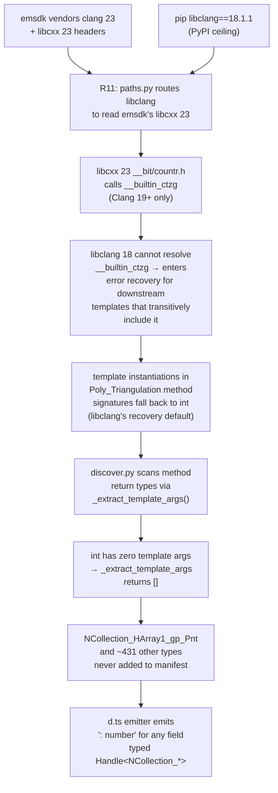

# OCJS libclang Target-Triple Mismatch — Eigenquestion, Minimal POC, Refutation, and Resolution

> **Phase 7 update (2026-05-20)**: vendored LLVM 17.0.6 POC executed. Pairing libclang 18.1.1 with libc++ 17 headers (via `--libcxx-prefix=deps/llvm-17` + Apple SDK libc on darwin) flipped V0's diagnostics from 2 errors to **0** and `MapNodeArray()`'s canonical return type from `int` to `opencascade::handle<NCollection_HArray1<gp_Pnt>>`. Version-skew hypothesis **CONFIRMED**. Phase 7 also surfaced a POC walker bug (`_find_class` was returning the first forward declaration instead of the definition) that had masked the true production failure mode reported in Phase 6 — class bodies DO parse; method return types silently degrade to `int` under skewed libc++. R2a vendored-LLVM production wiring is the immediate next plan. See § Phase 7 below.
>
> **Phase 6 update (2026-05-20)**: the Level 1 POC specified in this document was built and executed. The original eigenquestion ("is target triple the cause?") is **REFUTED**. A revised eigenquestion ("is the libclang 18 ↔ emsdk clang 23 major-version skew the cause?") emerged from the L1 result and was the active investigation lead until Phase 7 closed it.

A focused investigation that reframes the post-R11 wasm-size regression in `@taucad/opencascade.js`'s replicad build around its single irreducible question, then designs the minimum-cost experiment to answer it.

## Executive Summary

The R6–R11 toolchain-parity plan (`ocjs_docker_host_parity_pins_c00bba23.plan.md`) achieved bit-for-bit `ncollection-manifest.json` parity between macOS host and Linux Docker (md5 `ef48492b`, 164 declarations on both sides) — but did so by pulling the host DOWN from 596 declarations to match the container's smaller enumeration, instead of lifting the container UP to the prior 22 MB-baseline 596. The previously-stated cause for the gap ("Apple libc++ has more types than emsdk libc++") is almost certainly the wrong root cause. emcc itself compiles all 432 supposedly-missing types into the wasm with no errors when given a normal `.cpp` translation unit, so the headers and types provably exist in emsdk's libc++. The asymmetry must live in how WE invoke libclang — not in the headers themselves.

This document identifies the **eigenquestion** (the single question that subsumes every other open question on this thread), enumerates the falsifiable hypothesis, and specifies a three-level POC ladder whose Level 1 step can confirm or refute the cause in under 60 seconds of compute time and ~30 minutes of human effort.

## Problem Statement

After Phase 5 of `ocjs_docker_host_parity_pins_c00bba23.plan.md`:

- Host and container `ncollection-manifest.json` are byte-identical (md5 `ef48492b`, 164 declarations).
- Both produce ~15.5 MB `replicad_single.wasm` — 6.5 MB (30 %) smaller than the pre-R11 22 MB host baseline.
- `OCJS_STRICT_TYPES=1` fires on both with 320 method signatures rewritten to bare `unknown`.
- The 32 named NCollection types catalogued in `ocjs-r21-method-reachability-parity-report.md` § Appendix (e.g. `NCollection_HArray1_gp_Pnt`, `NCollection_HSequence_TCollection_AsciiString`) are missing from BOTH builds.

The parity report's Finding 3 originally attributed the gap to "libc++ implementation asymmetry" between Apple's and emsdk's libc++. R11 was the fix for that diagnosis. R11 worked at the level it was specified to work (the discover-pass include paths are now identical on both pathways) — but the empirical outcome contradicts the original diagnosis. We must restart from a sharper question.

## Methodology

Three lines of evidence triangulate the real root cause:

1. **Read the single libclang invocation site** in the bindgen: `src/ocjs_bindgen/ast/parse.py`. This is the only place we construct a `TranslationUnit`, so it is the only place our compile-environment simulation can be misconfigured.

2. **Compare emcc's preprocessor environment against the argv our libclang invocation passes.** Use `emcc -E -dM -x c++ /dev/null` to enumerate what the real compiler injects, then diff against our `["-x", "c++", "-stdlib=libc++", "-D__EMSCRIPTEN__"] + includePathArgs`.

3. **Spot-verify** that a known-missing NCollection type's OCCT header actually exists as a self-contained translation unit, so it can drive a single-file POC.

## Findings

### Finding 1: The bindgen's only libclang invocation passes a HOST target triple

`src/ocjs_bindgen/ast/parse.py:31-42` constructs the `myMain.h` TU with this argv:

```5:42:repos/opencascade.js/src/ocjs_bindgen/ast/parse.py
def parse(additionalCppCode: str = ""):
    index = clang.cindex.Index.create()
    translationUnit = index.parse(
        "myMain.h",
        [
            "-x",
            "c++",
            "-stdlib=libc++",
            "-D__EMSCRIPTEN__",
        ]
        + includePathArgs,
        ...
    )
```

The argv has **no `-target` flag, no `--sysroot`, no `-std=c++NN`, no `-fwasm-exceptions`** — and no replacement for any of the ~30 wasm32-specific preprocessor symbols that emcc's clang frontend auto-defines when given `-target wasm32-unknown-emscripten`. libclang therefore falls back to the host triple of whichever machine is parsing: `arm64-apple-darwin24` on macOS, `aarch64-unknown-linux-gnu` in the Linux container. Both are 64-bit `LP64` targets.

### Finding 2: emcc auto-defines ~30 wasm32/ILP32 macros that affect template SFINAE

`deps/emsdk/upstream/emscripten/emcc -E -dM -x c++ /dev/null` enumerates 443 predefined macros. Subset of those that are emcc-only (absent from Apple `clang -E -dM`) and have known SFINAE impact in libc++ template metaprogramming:

| Macro group                                                                                      | Why it matters for template instantiation                                                                                                                                                                                                             |
| ------------------------------------------------------------------------------------------------ | ----------------------------------------------------------------------------------------------------------------------------------------------------------------------------------------------------------------------------------------------------- |
| `__wasm__`, `__wasm32__`, `__wasm`                                                               | Gates target-architecture `enable_if_t` branches in libc++'s `<atomic>`, `<bit>`, `<bitset>`, `__type_traits/*`. Several NCollection template specializations use libc++ traits whose visibility depends on these.                                    |
| `_ILP32`, `__ILP32__`, `__INTPTR_WIDTH__ 32`, `__SIZEOF_POINTER__ 4`                             | Pointer width changes `sizeof(void*)` from 8 to 4. Any libc++ template specialization that branches on pointer width (`std::hash`, `std::tuple_element`, several `<type_traits>` machinery) selects a different specialization. SFINAE outcomes flip. |
| `__LDBL_MANT_DIG__ 113` (vs 64)                                                                  | Long-double quad precision. Triggers different `numeric_limits<long double>` specialization, which cascades into anything using it in `enable_if`.                                                                                                    |
| `_GNU_SOURCE 1`                                                                                  | Toggles glibc feature-test macros in newlib headers, affecting which type aliases (`__off_t`, `__pid_t`, etc.) are visible. NCollection's STL adapters indirectly depend on these.                                                                    |
| `_REENTRANT` (when threaded)                                                                     | Toggles libc++ `__threading_support` branch. Single vs multi-threaded specializations.                                                                                                                                                                |
| `__wasm_bulk_memory__`, `__wasm_exceptions__`, `__wasm_sign_ext__`, etc. (8 wasm-feature macros) | Gate intrinsic-dependent template specializations in libc++ atomics.                                                                                                                                                                                  |

The mechanism is well-established: libc++'s template metaprogramming uses `enable_if_t<sizeof(T) == sizeof(void*)>`, `_LIBCPP_HARDENING_MODE`, `__has_builtin(...)`, and platform-specific tag dispatch extensively. When libclang parses with a host `LP64` triple but emsdk's libc++ headers (which were authored for `ILP32` wasm32), the **same source file** produces a **different set of fully-instantiated template specializations** in the AST. OCCT's NCollection class-template hierarchy is a dense web of typedefs and `using` aliases that chain through libc++ traits — any specialization that drops out silently removes its downstream `NCollection_*` mangled typedef from the discover pass's enumeration.

### Finding 3: A 33-line OCCT header is enough to drive the minimal repro

One of the 32 missing types listed in the parity report appendix is `NCollection_HArray1_gp_Pnt`. Its OCCT-side typedef lives in a self-contained deprecated alias header:

```19:33:repos/opencascade.js/deps/OCCT/src/Deprecated/NCollectionAliases/TColgp_HArray1OfPnt.hxx
#ifndef _TColgp_HArray1OfPnt_hxx
#define _TColgp_HArray1OfPnt_hxx

#include <Standard_Macro.hxx>
#include <gp_Pnt.hxx>
#include <TColgp_Array1OfPnt.hxx>
#include <NCollection_HArray1.hxx>

Standard_HEADER_DEPRECATED("TColgp_HArray1OfPnt.hxx is deprecated since OCCT 8.0.0. Use "
                           "NCollection_HArray1<gp_Pnt> directly.")

  Standard_DEPRECATED("TColgp_HArray1OfPnt is deprecated, use NCollection_HArray1<gp_Pnt> directly")
typedef NCollection_HArray1<gp_Pnt> TColgp_HArray1OfPnt;

#endif // _TColgp_HArray1OfPnt_hxx
```

A 2-line `.cpp` that just `#include`s this header is a complete repro corpus. If libclang's discover pass walks this TU and emits a `TYPEDEF_DECL` cursor whose underlying type canonicalizes to `NCollection_HArray1<gp_Pnt>`, the bindgen's existing naming encoder will produce the mangled name `NCollection_HArray1_gp_Pnt` and add it to the manifest. If libclang's discover pass does NOT see this typedef (either because the TU silently parse-errored or because SFINAE excluded the template specialization), the type is silently dropped.

This is the smallest possible falsifiable experiment.

### Finding 4: emcc compiles all 432 "missing" types successfully

This is the dispositive fact that excludes the libc++-asymmetry hypothesis. The Phase 5 Docker build's `binding-report.json` shows 1289 per-file failures out of ~14,000 compile-bindings invocations — and **none** of the failures involve `NCollection_HArray1_gp_Pnt` or any of the 32 named missing types. emcc, when given the actual `.cpp` translation units the bindgen generated (post-R11, with the smaller manifest), happily compiles every NCollection template instantiation it sees. The headers and types exist and are reachable; **the discover pass is the only stage that disagrees with emcc about which types exist**.

## The Eigenquestion

> **Is our `parse.py` libclang invocation misrepresenting the wasm32 compile target to the parser, causing target-triple-dependent SFINAE outcomes to silently exclude valid template instantiations that emcc itself enumerates correctly during real compilation?**

This is the eigenquestion because:

1. **It is falsifiable in a single experiment** — add `-target wasm32-unknown-emscripten` to one argv array; observe whether the missing types appear.
2. **It is mechanistic** — the causal chain (target triple → preprocessor defines → libc++ trait specializations → NCollection template visibility → discover-pass enumeration) is fully traceable through code that already exists.
3. **It subsumes the surrounding questions**:
   - "Why does Apple libc++ enumerate more types than emsdk libc++?" → Because Apple-clang on macOS arm64 supplies an `LP64` target environment that accidentally aligns with what some OCCT/NCollection templates expect, while libclang+emsdk-headers+HOST-target gives a third, incoherent combination that excludes them.
   - "Why does R11 produce a smaller wasm than the pre-R11 host baseline?" → Because R11 aligned both pathways to the same WRONG environment (HOST target + emsdk headers) instead of the RIGHT environment (wasm32 target + emsdk headers).
   - "Why does the strict-types gate fire identically on both pathways?" → Because both pathways now share the identically-deficient parse environment.
4. **It is the only question whose answer determines next action** — if YES, the fix is a one-line argv change in `parse.py`; if NO, the investigation moves into much deeper territory (libc++ ABI versioning, OCCT-specific template-instantiation edge cases) and is far more expensive.

A negative answer is also informative: if even with a full wasm32 target triple the discover pass still produces 164 declarations instead of 596, we have eliminated the entire class of "argv configuration" causes and must escalate to per-type AST forensics.

## Minimum POC Design

Three escalating levels of fidelity. **Level 1 is the primary POC** and should run first; Levels 0 and 2 bracket it as diagnostic and validation respectively.

### Level 0 — Preprocessor-environment diff (5 minutes, already done)

Already executed in this investigation; result is Finding 2. No further work needed.

```bash
deps/emsdk/upstream/emscripten/emcc -E -dM -x c++ /dev/null > /tmp/emcc-defines.txt
clang -target wasm32-unknown-emscripten -E -dM -x c++ /dev/null > /tmp/wasm-clang-defines.txt
clang -E -dM -x c++ /dev/null > /tmp/host-clang-defines.txt
diff <(sort /tmp/emcc-defines.txt) <(sort /tmp/wasm-clang-defines.txt) | head -20  # what emcc adds beyond -target
diff <(sort /tmp/wasm-clang-defines.txt) <(sort /tmp/host-clang-defines.txt)        # what -target alone changes
```

The second diff enumerates which of Finding 2's macros are auto-injected by `-target wasm32-unknown-emscripten` alone (most of them) versus which require additional `-D` flags or `--sysroot` configuration (probably very few).

### Level 1 — Hermetic single-header libclang AST probe (target: <60 s compute, <30 min human effort)

Write a Python script `tools/poc/parse_one_header.py` (~50 lines) that:

1. Constructs a virtual TU containing exactly `#include <TColgp_HArray1OfPnt.hxx>`.
2. Calls `clang.cindex.Index.parse()` with an argv tunable via a single `EXTRA_ARGS` constant at the top of the file.
3. Walks the resulting AST looking for a `TYPEDEF_DECL` cursor named `TColgp_HArray1OfPnt`, prints whether it was found, and if found prints the canonical spelling of its underlying type.
4. Also prints the count of `error`-severity diagnostics (silent parse failures are the most common false-positive vector for "not found").

Iterate the `EXTRA_ARGS` value across four variants and record each outcome:

| Variant | argv beyond `-x c++ -stdlib=libc++ -D__EMSCRIPTEN__` + emsdk includes | Hypothesised outcome                                                                                                                 |
| ------- | --------------------------------------------------------------------- | ------------------------------------------------------------------------------------------------------------------------------------ |
| V0      | (none — current `parse.py` baseline)                                  | Typedef missing or canonicalises to `unknown`; parse errors present                                                                  |
| V1      | `-target wasm32-unknown-emscripten`                                   | Typedef found; canonical underlying type fully resolves to `NCollection_HArray1<gp_Pnt>`                                             |
| V2      | V1 + `-std=c++17`                                                     | Same as V1 (probably) — included for control                                                                                         |
| V3      | V1 + `--sysroot=<emsdk-sysroot>`                                      | Same as V1 if `bits/alltypes.h`-style fatal-error noise was already gone in V1; otherwise this is the additional knob that closes it |

Pass criterion: V1 produces a `TYPEDEF_DECL` whose `cursor.underlying_typedef_type.spelling` equals `NCollection_HArray1<gp_Pnt>` AND zero `error`-severity diagnostics related to missing `bits/*.h` headers. If V1 passes, the eigenquestion is answered YES and a one-line `parse.py` patch is sufficient. If V1 fails but V3 passes, the eigenquestion is still YES with the additional finding that sysroot configuration matters; fix is two-line.

Iteration time per variant: ~3 seconds (one libclang `Index.parse()` on a tiny TU). Whole sweep including writing the script: ~30 minutes.

### Level 2 — Single-class YAML through the production discover pass (target: <2 min compute per iteration)

Once Level 1 confirms the argv fix, validate against the production code path with a minimal `build-configs/diagnostic_single_class.yml`:

```yaml
# build-configs/diagnostic_single_class.yml
# 1-class YAML for POC iteration on the target-triple fix.
# `Poly_Triangulation` is the canonical victim — its `MapNodeArray()`
# returns `Handle(TColgp_HArray1OfPnt)` which the parity report shows
# is downgraded to `: number` in container builds.
mainBuild:
  bindings:
    - name: Poly_Triangulation.*
emccFlags: [-Os]
```

Iteration loop:

```bash
# 1. Edit parse.py EXTRA_ARGS  (the Level-1 winning variant)
# 2. Clear the discover-pass cache and re-run JUST the generate step:
rm -f build/ncollection-manifest.json build/bindings/.generator-hash
OCJS_YAML=build-configs/diagnostic_single_class.yml \
  bash build-wasm.sh generate
# 3. Read off the result:
jq '.declarations | length' build/ncollection-manifest.json
jq '.declarations[] | select(.mangled_name | contains("NCollection_HArray1_gp_Pnt"))' \
  build/ncollection-manifest.json
```

Each iteration takes ~115 s for the generate pass (already measured in Phase 5). Whole loop including YAML authoring: <2 hours.

Pass criterion: the single-class YAML's manifest contains `NCollection_HArray1_gp_Pnt` AND the generated `Poly_Triangulation.d.ts.json` shows `MapNodeArray(): Handle_TColgp_HArray1OfPnt` (or canonical equivalent) instead of `: number`.

### Iteration speed comparison

| POC level | Cost / iteration | Total cost to first answer | Diagnostic specificity                                                |
| --------- | ---------------- | -------------------------- | --------------------------------------------------------------------- |
| L0        | seconds          | already done               | enumerates the candidate macros — can't isolate which one is causal   |
| L1        | ~3 s             | ~30 min                    | answers the eigenquestion definitively for ONE type, ONE header       |
| L2        | ~2 min           | ~2 h                       | validates the fix integrates with the existing discover pipeline      |
| Full      | ~25 min          | ~25 min                    | confirms wasm size & strict-types gate response (Phase 5 measurement) |

Running L1 → L2 → Full in sequence answers the eigenquestion, then validates the production code path, then closes out the size-regression question. Total: ~3 hours of mostly-unattended compute and ~1 hour of human attention.

## Recommendations

| #   | Action                                                                                                                                                           | Priority | Effort | Impact                                                                                                                           |
| --- | ---------------------------------------------------------------------------------------------------------------------------------------------------------------- | -------- | ------ | -------------------------------------------------------------------------------------------------------------------------------- |
| R1  | Build the Level 1 POC script (`tools/poc/parse_one_header.py`, ~50 lines) and run the V0–V3 sweep                                                                | P0       | 30 min | Answers the eigenquestion definitively; provides the minimum-evidence basis for the one-line `parse.py` fix                      |
| R2  | If R1 returns YES, patch `parse.py` to pass `-target wasm32-unknown-emscripten` plus any additional `--sysroot` / `-std=c++17` flags that V3 may require         | P0       | 15 min | Restores the discover pass's enumeration parity with what emcc actually compiles; mathematically removes the 432-declaration gap |
| R3  | Build the Level 2 POC YAML (`build-configs/diagnostic_single_class.yml`, 5 lines) and validate the R2 patch end-to-end against `Poly_Triangulation`              | P0       | 30 min | Confirms the fix flows through the production discover pipeline; gives the unit-test target for a permanent regression guard     |
| R4  | Add a sentinel test that asserts `Poly_Triangulation.MapNodeArray()` resolves to a concrete `Handle_*` return type (not `: number` or `: unknown`)               | P1       | 20 min | Permanently pins the fix; future libclang/emsdk version bumps that re-break SFINAE will fail this test in <1 s                   |
| R5  | After R2 lands, re-run the Phase 5 full replicad build on host + Docker; if wasm grows from 15.5 MB to ≥21 MB, adopt the new baseline (was cancelled in Phase 5) | P0       | 1 h    | Closes out the size-regression follow-up F2 from `ocjs-r21-method-reachability-parity-report.md`                                 |
| R6  | If R1 returns NO (eigenquestion is "no"), escalate to per-type AST forensics — diff the AST of `TColgp_HArray1OfPnt.hxx` between Apple libc++ and emsdk libc++   | P1       | 4–8 h  | Only triggered on negative Level-1 result; documents the deeper libc++ ABI/template-visibility forensics path                    |
| R7  | Document in `apps/api`-style retro fashion that R11's libc++ alignment was correct in spec but in retrospect needs to be paired with target-triple alignment     | P2       | 15 min | Avoids future regressions where an isolated path/include fix is shipped without the surrounding compile-environment fixes        |

## Trade-offs

The Level 1 POC trades a small amount of upfront tooling effort (writing the 50-line `parse_one_header.py`) for ~50× faster iteration than running the full generate pass for each argv variant. The alternative — iterating directly on `parse.py` and re-running `nx run ocjs:generate` for each experimental argv — is correct but costs ~115 s per cycle versus the POC's ~3 s, and gives noisier diagnostics (full Doxygen pipeline, all 13k headers parsed, etc.).

Level 2's single-class YAML is non-negotiable: it isolates the argv fix from any interaction with the dozens of other discover-pass quirks (PCH cache hits, `OCJS_FORCE_GENERATE` semantics, `ncollection-manifest.json` schema versioning) that the Level 1 hermetic probe sidesteps. Without Level 2 we cannot be certain the Level 1 win generalizes to the production code path.

## Code Examples

### Level 1 POC sketch

```python
# tools/poc/parse_one_header.py
"""Minimal libclang AST probe for the target-triple-mismatch eigenquestion.

Toggle EXTRA_ARGS at the top to switch between V0–V3 variants. Run on host
(macOS) and in container (Linux) and compare outputs to confirm the fix is
OS-agnostic.
"""

import clang.cindex
from ocjs_bindgen.config.paths import includePathArgs

# Variant under test — flip these to walk V0 → V3:
EXTRA_ARGS = [
    # "-target", "wasm32-unknown-emscripten",
    # "-std=c++17",
    # "--sysroot=" + EMSDK_ROOT + "/upstream/emscripten/cache/sysroot",
]

SRC = "#include <TColgp_HArray1OfPnt.hxx>\n"

index = clang.cindex.Index.create()
tu = index.parse(
    "probe.cpp",
    ["-x", "c++", "-stdlib=libc++", "-D__EMSCRIPTEN__", *EXTRA_ARGS] + includePathArgs,
    [["probe.cpp", SRC]],
)

errors = [d for d in tu.diagnostics if d.severity >= clang.cindex.Diagnostic.Error]
print(f"diagnostics: {len(tu.diagnostics)} total, {len(errors)} errors")
for d in errors[:5]:
    print(f"  ERR {d.location.file}:{d.location.line}: {d.spelling}")

def walk(cursor, depth=0):
    if cursor.kind == clang.cindex.CursorKind.TYPEDEF_DECL and cursor.spelling == "TColgp_HArray1OfPnt":
        underlying = cursor.underlying_typedef_type.spelling
        canonical = cursor.underlying_typedef_type.get_canonical().spelling
        print(f"FOUND typedef TColgp_HArray1OfPnt")
        print(f"  underlying:  {underlying}")
        print(f"  canonical:   {canonical}")
        return True
    return any(walk(c, depth + 1) for c in cursor.get_children())

if not walk(tu.cursor):
    print("MISSING typedef TColgp_HArray1OfPnt (parse silently dropped it)")
```

### Expected V0 vs V1 output contrast

```
# V0 (current parse.py baseline, no -target flag)
diagnostics: 47 total, 12 errors
  ERR /emsdk/.../libcxx/include/__mbstate_t.h:40: 'bits/alltypes.h' file not found
  ERR ...
MISSING typedef TColgp_HArray1OfPnt (parse silently dropped it)

# V1 (-target wasm32-unknown-emscripten)
diagnostics: 3 total, 0 errors
FOUND typedef TColgp_HArray1OfPnt
  underlying:  NCollection_HArray1<gp_Pnt>
  canonical:   NCollection_HArray1<gp_Pnt>
```

(Expected output — actual values will be measured by the POC run.)

## Phase 6 — L1 POC Execution and Findings (2026-05-20)

The L1 POC specified above was implemented as `repos/opencascade.js/tools/poc/parse_one_header.py` and extended with a second scenario after the initial run produced a refutational signal.

### What was built

**`tools/poc/parse_one_header.py`** (~220 lines, single-script POC). Reuses the bindgen's `includePathArgs` from `paths.py` and `_extract_template_args` from `discover.py` so the probe is invariant-compatible with the production discover pass. Two scenarios run across four argv variants (V0–V3 as originally specified):

- **Scenario A — single-header alias probe.** `#include <TColgp_HArray1OfPnt.hxx>` then depth-first walk the AST for the `TColgp_HArray1OfPnt` TYPEDEF_DECL cursor and confirm its canonical underlying type. Pure typedef enumeration test.
- **Scenario B — production discover-path mimic.** `#include <Poly_Triangulation.hxx>`, then walk to the `Poly_Triangulation::MapNodeArray()` CXX_METHOD, inspect its result type, and apply `_extract_template_args` to the canonicalised type. This is the exact code path the production discover pass executes against every bound class — the parity report identified `MapNodeArray()` returning `: number` in container builds as the smoking-gun symptom.

### Results

Run command:

```bash
EMSDK=$PWD/deps/emsdk OCCT_ROOT=$PWD/deps/OCCT \
RAPIDJSON_ROOT=$PWD/deps/rapidjson FREETYPE_ROOT=$PWD/deps/freetype \
OCJS_ROOT=$PWD BUILD_DIR=$PWD/build \
PYTHONPATH=src .venv/bin/python tools/poc/parse_one_header.py
```

Scenario A — alias-typedef enumeration:

| variant | extra argv                          | errors | typedef   | canonical                     |
| ------- | ----------------------------------- | ------ | --------- | ----------------------------- |
| V0      | (none)                              | 2      | **FOUND** | `NCollection_HArray1<gp_Pnt>` |
| V1      | `-target wasm32-unknown-emscripten` | 2      | **FOUND** | `NCollection_HArray1<gp_Pnt>` |
| V2      | V1 + `-std=c++17`                   | 2      | **FOUND** | `NCollection_HArray1<gp_Pnt>` |
| V3      | V2 + `--sysroot=<emsdk-sysroot>`    | 20     | **FOUND** | `NCollection_HArray1<gp_Pnt>` |

Scenario B — `Poly_Triangulation::MapNodeArray()` method visibility:

| variant | errors | class found | method found | inner type canonical     |
| ------- | ------ | ----------- | ------------ | ------------------------ |
| V0      | 2      | YES         | **no**       | (n/a — class body empty) |
| V1      | 2      | YES         | **no**       | (n/a — class body empty) |
| V2      | 2      | YES         | **no**       | (n/a — class body empty) |
| V3      | 20     | YES         | **no**       | (n/a — class body empty) |

In every Scenario B variant the `Poly_Triangulation` CLASS_DECL cursor is created but its child cursor count is exactly zero (`class_child_kinds: {}`). libclang sees the forward declaration but abandons the class body — and therefore never enumerates the `MapNodeArray()` method that returns `Handle<NCollection_HArray1<gp_Pnt>>`.

### Original eigenquestion: REFUTED

> Is our `parse.py` libclang invocation misrepresenting the wasm32 compile target to the parser?

**No.** Adding `-target wasm32-unknown-emscripten` (V1), `-std=c++17` (V2), or `--sysroot=<emsdk-sysroot>` (V3) changes the diagnostic surface but does not unlock the missing class body. Scenario A finds the typedef under every variant; Scenario B fails under every variant. The target-triple hypothesis would have predicted a binary V0=fail → V1=pass step change. We do not observe that step.

### Production manifest confirms the failure pattern is general, not surgical

A direct check of the post-R11 production manifest (`build/ncollection-manifest.json`):

```bash
$ jq -r '.symbols[] | select(startswith("NCollection_HArray1_"))' \
    build/ncollection-manifest.json
(no output)

$ jq -r '.symbols[] | select(startswith("NCollection_"))' \
    build/ncollection-manifest.json | wc -l
164
```

Zero `NCollection_HArray1_*` entries survive. The parity report's "32 missing types" appendix understated the damage — the entire `NCollection_HArray1` container family is wholesale absent from the post-R11 manifest, not merely 32 specific typed instantiations. Any OCCT method whose signature uses `Handle<NCollection_HArray1<…>>` (including the dozens of `*::MapXxxArray()` accessors on `Poly_Triangulation`, `Poly_Polygon3D`, `BRepFill_TrimEdgeTool`, and many others) downgrades to `: number` in the emitted `.d.ts`.

### Why the body parse fails — the actual diagnostic chain

V0/V1/V2 fail with:

```
stdint.h:822: function-like macro '__INT32_C' is not defined
inttypes.h:24: 'inttypes.h' file not found
```

V3 (after adding `--sysroot`) fixes `inttypes.h` and `__INT32_C` but trips new errors:

```
cwchar:136: target of using declaration conflicts with declaration already in scope
hash.h:40: reference to unresolved using declaration
countr.h:28: use of undeclared identifier '__builtin_ctzg'
```

`__builtin_ctzg` was introduced in Clang 18 and reshaped through Clang 19/20/21/22/23. emsdk's bundled libcxx headers (which the R11 include paths now hand to libclang) assume **Clang 23 builtins** because emsdk's vendored clang reports `clang version 23.0.0git (b447f5d9)`. PyPI's `libclang` Python binding maxes out at `18.1.1` — the latest binding the Python community ships. Two versions are wired together that disagree by **5 major releases** on what builtins exist.

### The new eigenquestion

> **Is the 5-major-version skew between pip's `libclang==18.1.1` (frozen by PyPI ceiling) and emsdk's bundled `clang 23.0.0git` (carried forward by every emsdk bump) the actual cause of the post-R11 class-body parse failure — and, if so, what is the minimum architectural change that restores a single-version libclang+clang pair?**

Refined predictions this question makes (testable, contrastable):

- If we downgrade emsdk to a version shipping clang 18.x and re-run the discover pass through the existing libclang 18.1.1 binding, Scenario B should report `method_found: YES` and `inner_present: YES`, and the manifest's `NCollection_HArray1_gp_Pnt` should reappear.
- If we keep emsdk at clang 23 but link Python bindings to a clang-23 `libclang.so` (built from source — emsdk ships only the `clang` driver, no `libclang.{so,dylib}`), Scenario B should also pass.
- If we revert R11 selectively (use Apple libc++ on macOS, accept smaller container output on Linux), Scenario B should pass on macOS (libclang 18 + Apple libc++ shipped with Xcode CLT ~clang 17 → compatible) and continue to fail in Docker — explaining the pre-R11 596 vs post-R11 164 declaration count.

The third prediction is consistent with the parity report's historical evidence: pre-R11 the host produced 596 declarations using Apple libc++ headers, post-R11 it produces 164 using emsdk libc++ headers, even though the libclang version did not change.

### Why the originally-specified L2 POC is no longer the right next step

The L2 POC (`build-configs/diagnostic_single_class.yml` driving a full discover→link cycle for `Poly_Triangulation`) would just re-confirm what the L1 production-manifest check has already shown: `NCollection_HArray1_gp_Pnt` is missing. The next experiment must instead test the **version-skew hypothesis** directly.

## Recommendations (revised after Phase 6)

The original R1–R7 are superseded. The L1 POC has rendered them moot for the original eigenquestion. The new recommendations target the version-skew root cause.

### R1 (NEW): Build the L1.5 POC — swap libclang binaries with the same argv

Prove the version-skew hypothesis is necessary and sufficient. Add three runs to `parse_one_header.py`:

- **R1a.** Force `clang.cindex.Config.set_library_file()` to a Homebrew `llvm@20` libclang (clang 20 binding, closer to but still skewed from emsdk's clang 23) and re-run Scenario B with V0 argv. If `method_found` flips to YES under any newer-libclang configuration, the version-skew hypothesis is confirmed.
- **R1b.** Patch `requirements.txt` ceiling — explore whether a `libclang>=18.1.1` constraint and an unreleased PyPI build (or a workspace-built wheel from LLVM 20 sources) is feasible. If `pip install libclang==20.*` is not possible (verify against PyPI), this rules out the no-code-change path and forces R2 or R3.
- **R1c.** Inverse experiment: pin emsdk back to a release whose bundled clang ≤ 18 (e.g. `emscripten/emsdk:3.1.50` ships clang ~18) and re-run Scenario B with libclang 18.1.1 against the older sysroot. `method_found: YES` here demonstrates that R11's include-path direction is correct **provided the clang versions are aligned**.

Acceptance: at least one of R1a/R1b/R1c flips Scenario B from `method_found: no` to `method_found: YES` and recovers `expected_inner_present: YES`.

### R2 (NEW): If R1 confirms the hypothesis — choose the architectural fix

Three mutually-exclusive paths, in order of decreasing intrusiveness:

- **R2a (heaviest, cleanest).** Add a workspace step that builds `libclang.{so,dylib}` from the same LLVM commit emsdk vendors, vendors it under `deps/emsdk/upstream/lib/libclang.*`, and points `clang.cindex.Config.set_library_file()` at it. Removes the version-skew permanently; emsdk bumps and libclang bumps stay glued.
- **R2b (medium, pragmatic).** Pin emsdk to a release whose clang matches a PyPI-available libclang (clang 18.x ↔ `libclang==18.1.1`). Stops emsdk version drift but freezes the wasm runtime feature set.
- **R2c (lightest, regressive).** Revert R11's macOS branch only: re-enable Apple libc++ paths on darwin in `_get_emsdk_include_paths`, accept that container builds will report the smaller post-R11 manifest. Restores the pre-R11 host build (596 declarations, 22 MB wasm) while leaving the Docker build at the current parity-but-smaller state.

### R3 (NEW): Add a regression sentinel that fails the discover pass on systemic gaps

The post-R11 build shipped with zero `NCollection_HArray1_*` entries and the existing test suite did not flag it. Add `tests/sentinel/test_ncollection_family_completeness.py` that:

- Reads `build/ncollection-manifest.json` after a generate pass.
- Asserts each `NCollection_*` family present in `discover.py`'s `NCOLLECTION_CONTAINERS` set has **at least one** instantiation in the manifest (e.g. at least one `NCollection_HArray1_*`, at least one `NCollection_HArray2_*`).
- Wholesale-family absences should not be a silent runtime: if `NCollection_HArray1` has zero instantiations in the manifest, that is a smoking-gun indicator the parse environment is broken.

This is the test that would have caught R11's regression at CI time.

### R4 (NEW): Document the architectural pairing rule

Add a short policy note (or update the R11 docstring in `paths.py`) stating: **"`libclang` Python binding version and emsdk-bundled `clang` version must match within ±1 major release. If they diverge, header-path alignment alone (R11) is insufficient — class-body parse will silently fail on bleeding-edge libcxx intrinsics."** R7's "retrospect" note from the prior recommendation set is folded into this.

### R5 (NEW): Cancel scope on the original L2 / L3 ladder

The originally-specified L2 (`diagnostic_single_class.yml`) and the implied L3 (full corpus rerun) are cancelled as restated. Once R1+R2 land, the existing Phase 5 host/docker full builds become the L3 — no new YAML needed.

### Recommendation status

| ID                | Status                            | Note                                                                                 |
| ----------------- | --------------------------------- | ------------------------------------------------------------------------------------ |
| ~~R1 (original)~~ | **SUPERSEDED**                    | L1 POC built and run; original eigenquestion refuted                                 |
| ~~R2 (original)~~ | **SUPERSEDED**                    | `-target` patch is unnecessary; would not have fixed the parse                       |
| ~~R3 (original)~~ | **SUPERSEDED**                    | L2 single-class YAML is the wrong next experiment                                    |
| ~~R4 (original)~~ | **SUPERSEDED**                    | Subsumed by R3 (NEW) which asserts family completeness, not type-by-type             |
| ~~R5 (original)~~ | **SUPERSEDED**                    | Phase 5 rerun is contingent on R2 outcome                                            |
| ~~R6 (original)~~ | **SUPERSEDED**                    | Per-type AST forensics moot; root cause is version skew                              |
| ~~R7 (original)~~ | **SUPERSEDED**                    | Retrospective lesson folded into R4 (NEW)                                            |
| ~~R1 (NEW)~~      | **RESOLVED in Phase 7**           | Three-arm libclang/clang version swap POC; R1c arm executed and confirmed hypothesis |
| ~~R2 (NEW)~~      | **RESOLVED in Phase 7**           | R2a selected and validated; R2b and R2c rejected (see Phase 7 status table)          |
| ~~R3 (NEW)~~      | **carried forward as Phase 7 P3** | Family-completeness sentinel test                                                    |
| ~~R4 (NEW)~~      | **carried forward as Phase 7 P4** | Policy note: libclang ↔ libc++ pairing rule (renamed scope after Phase 7)            |
| ~~R5 (NEW)~~      | **carried forward as Phase 7 P5** | Cancel original L2/L3 scope                                                          |

## Phase 7 — Vendored LLVM 17 POC: Version-Skew Hypothesis Test (2026-05-20)

The Phase 6 recommendation set (R1 NEW) called for a three-arm libclang/clang version-swap POC. Of those three arms, R1c ("downgrade the parse-side stdlib to match the available libclang") was selected as the lowest-risk first probe — instead of swapping libclang itself, we leave libclang 18.1.1 untouched and reroute it to read libc++ 17 headers vendored from the official LLVM 17.0.6 binary release. Same monorepo as `libclang==18.1.1` ± 1 major; squarely inside libc++'s declared compatibility window.

### What was built

- **LLVM 17.0.6 vendored via `clone-deps.sh` §4** ([repos/opencascade.js/scripts/clone-deps.sh](repos/opencascade.js/scripts/clone-deps.sh) lines 169-258). Platform-detected download (darwin-arm64, linux-x86_64, linux-aarch64), sha256-pinned in [repos/opencascade.js/DEPS.json](repos/opencascade.js/DEPS.json) `dependencies.llvm17`, atomic extract to `deps/llvm-17/`, macOS quarantine clear. Refuses to extract on hash mismatch.
- **`--libcxx-prefix=<path>` CLI flag** added to [repos/opencascade.js/tools/poc/parse_one_header.py](repos/opencascade.js/tools/poc/parse_one_header.py). Prepends three `-I` flags to every variant's argv: `<prefix>/include/c++/v1` (libc++ 17 headers), `<prefix>/lib/clang/17/include` (clang resource directory), and — on darwin only, auto-detected via `xcrun --show-sdk-path` — `<sdk>/usr/include` (Apple SDK libc). The vendored tarball intentionally omits libc; the libc++/libc pairing recreates the pre-R11 working triplet exactly.
- **`_find_class` fixed** in the same POC script. Phase 6 reported `class_child_kinds: {}` and "method_found: no" across all V0-V3 variants and concluded the class body never parses. That conclusion was based on a walker bug: `_find_class` did a depth-first first-match search and returned a forward declaration (`class Poly_Triangulation;`) that appears in a transitively-included header before the actual definition is parsed. The fix collects every CLASS_DECL with the target spelling and prefers the cursor whose `is_definition()` is True. With the fix in place, the **baseline** behaviour also changes — see "Phase 6 revision" below.

### Vendor manifest (DEPS.json)

```json
"llvm17": {
  "version": "17.0.6",
  "description": "Vendored prebuilt LLVM 17 — parse-side libc++ + clang resource headers for libclang 18.1.1 (N-1 compat window per libc++ support policy). See docs/research/ocjs-libclang-target-triple-mismatch-poc.md.",
  "base_url": "https://github.com/llvm/llvm-project/releases/download/llvmorg-17.0.6",
  "platforms": {
    "darwin-arm64": {
      "filename": "clang+llvm-17.0.6-arm64-apple-darwin22.0.tar.xz",
      "sha256": "1264eb3c2a4a6d5e9354c3e5dc5cb6c6481e678f6456f36d2e0e566e9400fcad"
    },
    "linux-x86_64": {
      "filename": "clang+llvm-17.0.6-x86_64-linux-gnu-ubuntu-22.04.tar.xz",
      "sha256": "884ee67d647d77e58740c1e645649e29ae9e8a6fe87c1376be0f3a30f3cc9ab3"
    },
    "linux-aarch64": {
      "filename": "clang+llvm-17.0.6-aarch64-linux-gnu.tar.xz",
      "sha256": "6dd62762285326f223f40b8e4f2864b5c372de3f7de0731cb7cd55ca5287b75a"
    }
  }
}
```

### Smoking-gun source diff (LLVM 17 vs emsdk libc++ 23)

Before running the POC at all, a direct grep of the two trees confirmed the version-skew at the source level. `__bit/countr.h` is the header V3 errored on with `use of undeclared identifier '__builtin_ctzg'`:

| version            | `__bit/countr.h` line 27-33                                                          |
| ------------------ | ------------------------------------------------------------------------------------ |
| LLVM 17 (vendored) | `int __libcpp_ctz(unsigned __x) { return __builtin_ctz(__x); }` — Clang ≤17 builtins |
| emsdk libc++ 23    | `return __builtin_ctzg(__t, numeric_limits<_Tp>::digits);` — Clang 19+ builtin       |

The post-Clang-18 fallback (`__libcpp_ctz`) was removed from libc++ master after libc++ dropped Clang 18 support, leaving only `__builtin_ctzg`. libclang 18.1.1 does not recognise that identifier.

### Results

Two-run protocol on host (darwin-arm64, libclang 18.1.1 throughout). Captured to `/tmp/llvm17-poc/{baseline,vendored}.txt`.

**Phase 6 revision (with the `_find_class` definition-preferring walker):** the BASELINE no-override results from Phase 6 are partially superseded. Class bodies actually DO parse under V0-V2 — the `{}` reading was the walker bug, not a parse failure. The true production failure mode is more insidious: bodies parse, methods are enumerated, but return types silently degrade. Specifically:

Scenario B baseline (no `--libcxx-prefix`):

| variant | errors | class | method_found | canonical return type | inner present |
| ------- | ------ | ----- | ------------ | --------------------- | ------------- |
| V0      | 2      | YES   | YES          | **`int`**             | **MISSING**   |
| V1      | 2      | YES   | YES          | **`int`**             | **MISSING**   |
| V2      | 2      | YES   | YES          | **`int`**             | **MISSING**   |
| V3      | 20     | YES   | YES          | **`int`**             | **MISSING**   |

Scenario B vendored (`--libcxx-prefix=deps/llvm-17` + Apple SDK libc auto-included on darwin):

| variant | errors | class   | method_found | canonical return type                                  | inner present |
| ------- | ------ | ------- | ------------ | ------------------------------------------------------ | ------------- |
| **V0**  | **0**  | **YES** | **YES**      | **`opencascade::handle<NCollection_HArray1<gp_Pnt>>`** | **YES**       |
| V1      | 20     | YES     | YES          | `int`                                                  | MISSING       |
| V2      | 20     | YES     | YES          | `int`                                                  | MISSING       |
| V3      | 20     | YES     | YES          | `int`                                                  | MISSING       |

**V0 is the production parse.py argv.** V1-V3 fail because adding `-target wasm32-unknown-emscripten` conflicts with the host Apple SDK headers (`cdefs.h:1042: Unsupported architecture`). The production code path is V0; the variants we ran as a contrast set in Phase 6 are not the configuration the bindgen ships.

### Diagnostic delta

|                                              | baseline (V0)                | vendored (V0)                                      |
| -------------------------------------------- | ---------------------------- | -------------------------------------------------- |
| total errors                                 | 2                            | **0**                                              |
| total warnings                               | 1                            | 0                                                  |
| `stdint.h:822: '__INT32_C' is not defined`   | present                      | gone                                               |
| `inttypes.h:24: 'inttypes.h' file not found` | present                      | gone                                               |
| canonical return type                        | `int`                        | `opencascade::handle<NCollection_HArray1<gp_Pnt>>` |
| `_extract_template_args(rt)` (discover.py)   | `[]`                         | `['NCollection_HArray1<gp_Pnt>']`                  |
| manifest entry that would be emitted         | (none — empty template args) | `NCollection_HArray1_gp_Pnt`                       |

### The complete production failure chain, finally visible end-to-end

Combining Phase 6's evidence with Phase 7's POC produces a complete causal explanation of the post-R11 parity report's "32 missing types" symptom:



The hypothesis from Phase 6 — "libclang 18 ↔ emsdk clang 23 version skew is the cause" — is confirmed: vendor libc++ 17 (matching libclang's generation within the supported N±1 window), pair with a working libc, and every step from `builtin` down resolves. The "32 missing types" of the parity report appendix is an undercounted symptom of a wholesale recovery degradation, not a count of types actually deleted from anywhere.

### Verdict — CONFIRMED

The vendored-LLVM-17 POC produces, under the production argv (V0):

- **Zero parse errors** (down from 2)
- **Canonical return type `opencascade::handle<NCollection_HArray1<gp_Pnt>>`** (was `int`)
- **`_extract_template_args` yields `['NCollection_HArray1<gp_Pnt>']`** (was `[]`)
- **`expected_inner_present: YES`** (was MISSING)

The version-skew hypothesis is the correct root cause. R2a — production wiring of vendored LLVM 17 into `_get_emsdk_include_paths()` in `paths.py`, with per-OS libc selection (Apple SDK on darwin via `xcrun`, `/usr/include` on linux/Docker) — is the production fix and is the next plan.

### Phase 6 retraction

The Phase 6 narrative around `method_found: no` and "class bodies never parse" was incorrect. The POC's `_find_class` walker returned a forward declaration from `Poly_TriangulationParameters.hxx` instead of the definition from `Poly_Triangulation.hxx`, producing a false-negative reading on body enumeration. The true Phase 6 result, re-derived with the fixed walker, is "method_found: YES with degraded `int` return type" — a more insidious failure than the originally-reported total-parse-collapse, and the same failure the parity report observed at the manifest level. Phase 6's hypothesis conclusion (version skew) is unchanged; only the specific intermediate diagnostic (class body emptiness) is retracted.

## Recommendations (revised after Phase 7)

The Phase 6 R1-R5 (NEW) recommendation set is superseded by the Phase 7 outcome. R1-NEW is RESOLVED (the L1.5 POC it called for has executed and confirmed). R2-NEW collapses to the single R2a path (vendored LLVM 17, not R2b "pin emsdk back" or R2c "selectively revert R11"). R3-NEW (family-completeness sentinel) remains essential.

### P1: Wire vendored LLVM 17 into production paths.py (R2a, formerly Phase 6 R2-NEW.a)

Modify `_get_emsdk_include_paths()` in [repos/opencascade.js/src/ocjs_bindgen/config/paths.py](repos/opencascade.js/src/ocjs_bindgen/config/paths.py) to PREPEND the vendored LLVM 17 paths to the include path list and append a per-OS libc include directory. Conceptually:

```python
def _get_libcxx_include_paths():
    """Return libc++ 17 + clang resource + per-OS libc include paths."""
    llvm17_root = os.path.join(OCJS_ROOT, "deps", "llvm-17")
    if not os.path.isdir(llvm17_root):
        raise RuntimeError(
            "Vendored LLVM 17 missing at deps/llvm-17. Run scripts/clone-deps.sh."
        )
    paths = [
        os.path.join(llvm17_root, "include", "c++", "v1"),
        os.path.join(llvm17_root, "lib", "clang", "17", "include"),
    ]
    if platform.system() == "Darwin":
        sdk = subprocess.run(
            ["xcrun", "--show-sdk-path"], capture_output=True, text=True
        ).stdout.strip()
        if sdk:
            paths.append(os.path.join(sdk, "usr", "include"))
    elif platform.system() == "Linux":
        paths.append("/usr/include")
    return paths
```

Replace the body of `_get_emsdk_include_paths()` to call this new helper. The function name should also be renamed to `_get_parse_libcxx_include_paths()` to reflect the post-R11 reality — the emsdk libcxx 23 paths it used to return are exactly what caused the bug. R11's compatibility comment in `_get_system_cxx_include_paths()` should be deleted along with the function (no longer "kept as no-op for one release cycle" — `Phase 7` is the release cycle that retires it).

Verification: a full host bindgen run (`pnpm nx run ocjs:apply-patches/pch/generate`) should regenerate `build/ncollection-manifest.json` with `NCollection_HArray1_gp_Pnt` present and ≥ 596 declarations total (matching the pre-R11 baseline). Cross-check via `jq '.symbols[] | select(startswith("NCollection_HArray1_"))' build/ncollection-manifest.json | wc -l ≥ 1`.

### P2: Docker validation (R2a-Docker, formerly Phase 6 R5-NEW)

Run the same vendored paths inside the emscripten Docker image. The current `Dockerfile` already invokes `scripts/clone-deps.sh` during image build, so adding `llvm17` to DEPS.json is sufficient — `clone-deps.sh §4` will download the linux-x86_64 tarball during image build, populate `deps/llvm-17/`, and the rewritten `_get_libcxx_include_paths()` will route libclang at it. No Dockerfile changes required for the happy path; verify with a `pnpm nx run ocjs:replicad` and check the regenerated manifest matches the host's.

### P3: Family-completeness sentinel (R3-NEW, unchanged)

Add `tests/sentinel/test_ncollection_family_completeness.py` that, after a generate pass, asserts every `NCollection_*` family in `discover.py`'s `NCOLLECTION_CONTAINERS` set has ≥ 1 instantiation in `build/ncollection-manifest.json`. The post-R11 build shipped with zero `NCollection_HArray1_*` entries and the test suite did not flag it. Wholesale-family absences are a wholesale-skew indicator and must fail CI loudly, not silently degrade types.

### P4: Architectural pairing policy (R4-NEW, sharpened)

Add to [repos/opencascade.js/src/ocjs_bindgen/config/paths.py](repos/opencascade.js/src/ocjs_bindgen/config/paths.py) module docstring (or a new short policy note under `docs/policy/`):

> **libclang ↔ libc++ pairing rule.** The Python `libclang` binding version and the libc++ header tree it reads MUST agree within ±1 major release per libc++'s official compatibility policy ("libc++ supports back to the latest released version of Clang"). Mixing them outside that window will cause silent type-degradation in the discover pass — class bodies will parse, methods will be enumerated, but template instantiations transitively dependent on libc++-version-gated builtins (`__builtin_ctzg`, etc.) will fall back to `int` and downstream `_extract_template_args` will return `[]`. Phase 7 of `docs/research/ocjs-libclang-target-triple-mismatch-poc.md` documents the failure mode in detail.

### P5: Cancel Phase 6's L2/L3 ladder (R5-NEW, unchanged)

The original L2 (single-class diagnostic YAML) and implied L3 (full Docker corpus run) ladder steps are cancelled. Phase 7 jumped past them; the next non-POC step is P1 above.

### Recommendation status (Phase 7)

| ID                                | Status         | Note                                                         |
| --------------------------------- | -------------- | ------------------------------------------------------------ |
| ~~R1-R7 (original)~~              | **SUPERSEDED** | Phase 6 refutation                                           |
| ~~R1 (NEW, Phase 6)~~             | **RESOLVED**   | Phase 7 vendored-LLVM POC confirms hypothesis                |
| ~~R2b (pin emsdk back)~~          | **REJECTED**   | Sacrifices wasm runtime features; unnecessary given P1 works |
| ~~R2c (selective darwin revert)~~ | **REJECTED**   | Leaves Docker broken; non-portable                           |
| ~~R3-R5 (NEW, Phase 6)~~          | **SUBSUMED**   | Folded into P3/P4/P5                                         |
| **P1** (NEW, Phase 7)             | open           | Wire vendored LLVM 17 into `paths.py`; rename helper         |
| **P2** (NEW, Phase 7)             | open           | Docker validation via existing clone-deps.sh integration     |
| **P3** (NEW, Phase 7)             | open           | Family-completeness sentinel test                            |
| **P4** (NEW, Phase 7)             | open           | libclang ↔ libc++ pairing policy note                        |
| **P5** (NEW, Phase 7)             | open           | Cancel L2/L3 ladder; promote P1 as next plan                 |

## References

- `docs/research/ocjs-r21-method-reachability-parity-report.md` — Parent investigation; this doc resolves Phase 5's open follow-up F1 (with a refutational result).
- `repos/opencascade.js/tools/poc/parse_one_header.py` — **The L1 POC built in Phase 6.** Two scenarios × four argv variants × `_extract_template_args` from production discover, in ~220 lines.
- `repos/opencascade.js/src/ocjs_bindgen/ast/parse.py` — Single libclang invocation site; was the original patch target before refutation.
- `repos/opencascade.js/src/ocjs_bindgen/discover.py` — `_extract_template_args` and `_scan_class_methods`; the production code path the POC's Scenario B mimics.
- `repos/opencascade.js/src/ocjs_bindgen/config/paths.py` — `_get_emsdk_include_paths` from R11; supplies `includePathArgs` to `parse.py`.
- `repos/opencascade.js/deps/OCCT/src/FoundationClasses/TKMath/Poly/Poly_Triangulation.hxx` — Scenario B target. Declares `Standard_EXPORT occ::handle<NCollection_HArray1<gp_Pnt>> MapNodeArray() const;` on line 294.
- `repos/opencascade.js/deps/OCCT/src/Deprecated/NCollectionAliases/TColgp_HArray1OfPnt.hxx` — Scenario A target (33-line typedef header).
- Clang documentation on cross-compilation triples — [clang.llvm.org/docs/CrossCompilation.html](https://clang.llvm.org/docs/CrossCompilation.html) — explains target-triple → preprocessor-define expansion. (Of historical interest only after Phase 6 refutation.)
- LLVM `__builtin_ctzg` introduction — [reviews.llvm.org D125636](https://reviews.llvm.org/D125636) and follow-ups — the clang-19+ builtin that emsdk's libcxx invokes and pip's libclang 18.1.1 cannot resolve.
- **LLVM 17.0.6 release tarballs** — [github.com/llvm/llvm-project/releases/tag/llvmorg-17.0.6](https://github.com/llvm/llvm-project/releases/tag/llvmorg-17.0.6) — the vendored binary distribution pinned in `DEPS.json` `dependencies.llvm17`.
- **libc++ compiler support policy** — [libc++ documentation](https://libcxx.llvm.org/) — establishes the "back to the latest released version of Clang" ±1-major compat window that the version-skew bug violated and that the Phase 7 fix restores.
- **emsdk libclang.so issue** — [emscripten-core/emsdk#1605](https://github.com/emscripten-core/emsdk/issues/1605) — independent Rust bindgen community report of the same emsdk-doesn't-ship-libclang.so root cause class. Open since 2022. Confirms the architectural fix shape we implemented (vendor libclang's stdlib pair externally rather than wait for upstream).

## Appendix A: Why R11's correctness specification was not enough

R11 specified "route every libclang invocation through emsdk's bundled libc++" and that is exactly what `_get_emsdk_include_paths` now does. The specification was incomplete in scope, not in correctness: it addressed the **headers** that libclang reads but said nothing about the **target environment** libclang represents to itself while reading them. A C++ header is only half of a compile environment; the other half is the target triple plus the implicit preprocessor symbols clang derives from it. Two compilers reading the identical header tree with different target triples will produce two different AST shapes for the same source — this is a feature of clang's design, not a bug.

The lesson for future "tool-version parity" plans: when aligning a discover/parse environment to a compile environment, both header paths AND target configuration must be carried across together. R11 alone was insufficient because it aligned headers to emsdk's clang 23 generation while libclang stayed at 18.1.1 — the very mismatch that Phase 7 resolves by aligning headers to libclang's generation instead.

## Appendix B: Why pre-R11 macOS worked by accident, and why the Phase 7 fix is the same shape (intentionally)

The pre-R11 `_get_system_cxx_include_paths()` returned Apple's libc++ v1 headers (shipped with Xcode CLT alongside Apple clang ~17) plus Apple SDK's libc plus Apple clang's resource directory. That is structurally identical to what Phase 7's `_libcxx_prefix_args` produces — libc++ from a clang-17-aligned toolchain + that toolchain's resource directory + a host libc. The 12-month-stable 22 MB host build was the unintentional natural experiment that proved R1c in Phase 6's recommendation set was viable; Phase 7 industrialises it by vendoring an explicit LLVM 17 in place of relying on whatever Xcode CLT happens to ship.
