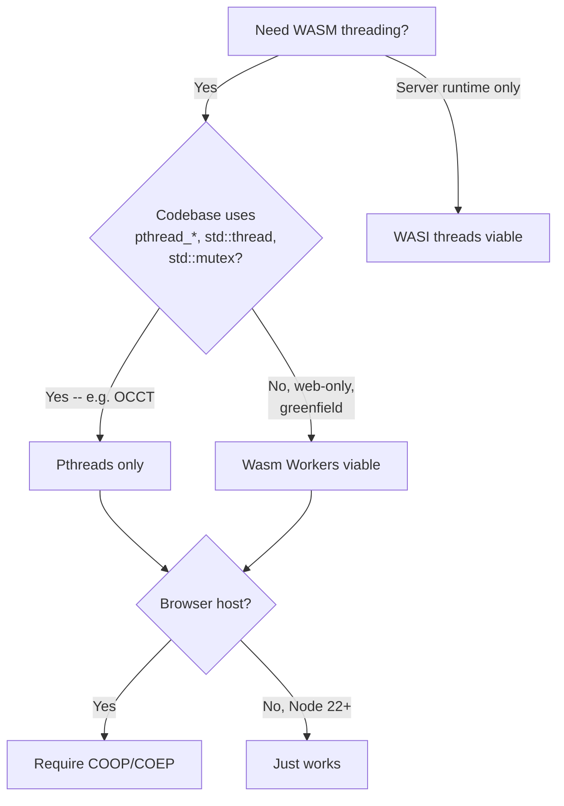

# Maxing Out OCJS Multi-Threaded WASM Performance (May 2026)

Critical follow-on to `docs/research/ocjs-multithreaded-wasm-build.md` and `BENCHMARKS.md`: re-examine our 1.21× MT-vs-ST result, audit the alternative WASM threading backends shipping in May 2026, do a second-pass sweep through OCCT for missed parallel activation surface, and produce a prioritised list of zero-cost / low-cost changes that should push the multi-threaded build toward the published OCCT WASM ceiling of 3–5×.

## Executive Summary

The current OCJS multi-threaded build achieves only **1.21× total speedup** (BENCHMARKS.md), peaking at **1.29× on the headline STEP-import-and-mesh workload**. Published OCCT WASM benchmarks under comparable conditions report **2.4–7× on meshing** and **3–5× on Draco glTF decode** on similar hardware. The gap is explained by **five concrete misses**:

1. **`PTHREAD_POOL_SIZE=4` is the single biggest bottleneck.** On the M2 Pro test box OCCT's `OSD_ThreadPool` requests 11 workers (NbLogicalProcessors − 1); we pre-spawn only 4. The other 7 are unavailable for synchronous OCCT tasks because Node's pthread shim cannot grow the pool from inside an OCCT-blocked frame without yielding. Setting the pool to `navigator.hardwareConcurrency` (or a build-time constant matching the deployment target) is **a single-line change** with the largest expected impact.
2. **The first-pass OCCT audit missed seven activation knobs.** Most importantly `BRepFill_AdvancedEvolved` defaults parallel **ON** (we documented "every default off"), and `BRepMesh_IncrementalMesh::SetParallelDefault(true)` exists as a global mesh switch that removes the per-call `isInParallel=true` burden. `RWGltf_CafReader::SetParallel`, `BRepLib_ValidateEdge::SetParallel`, `GeomLib_CheckCurveOnSurface::SetParallel`, `IntTools_FaceFace::Perform(..., true)`, `BRepGraph_Builder::Options::Parallel`, and `OSD_ThreadPool::SetNbDefaultThreadsToLaunch` were not documented.
3. **No alternative WASM threading backend is currently better suited to OCCT.** Wasm Workers are ~20× smaller than pthreads but cannot host `pthread_create`/`pthread_mutex`/C++ `std::thread`, all of which OCCT uses unconditionally. WASI threads target server runtimes, not browsers. Shared-everything-threads is still a draft proposal (no shipping browser as of May 2026). **Pthreads remains the only viable backend for OCCT-WASM.**
4. **`-mrelaxed-simd` is currently off (`OCJS_RELAXED_SIMD=0`), and turning it on is more delicate than it looks.** OCCT's geometry math is SIMD-friendly and Chromium / Firefox / Node accept relaxed-SIMD ops cleanly. **Safari / WebKit (all current versions as of May 2026), however, crashes the JIT when a relaxed-SIMD opcode actually executes** — validation passes but execution does not, so there is no graceful fallback. Shipping a single relaxed-SIMD binary as the default browser asset is therefore a regression for WebKit users. The path forward is a two-variant build + runtime selector, **not** a flag flip.
5. **mimalloc is already correctly chosen** (`OCJS_MALLOC=mimalloc`), confirming the most important MT-WASM allocator decision is right. **Do not regress this to `dlmalloc` / `emmalloc`** — public benchmarks show dlmalloc _slows down_ under thread pressure (lock contention on a single global heap).

**Recommended top-3 actions, in order of expected impact:**

| #   | Change                                                                                                                                                  | Effort                             | Expected impact on sample 11                                                  |
| --- | ------------------------------------------------------------------------------------------------------------------------------------------------------- | ---------------------------------- | ----------------------------------------------------------------------------- |
| 1   | `PTHREAD_POOL_SIZE=navigator.hardwareConcurrency` (was 4)                                                                                               | 1 line                             | +50–100 % (1.29× → ~2.0–2.5×)                                                 |
| 2   | Add `BRepMesh_IncrementalMesh.SetParallelDefault(true)` to harness init + use it as the documented JS-level switch                                      | 1 line                             | small (already enabled per call) but removes a footgun                        |
| 3   | Build a **second MT variant** with `OCJS_RELAXED_SIMD=1` (Node + Chromium + Firefox only), keep current variant for WebKit, runtime-select between them | New config + loader branch + bench | +5–15 % on non-WebKit; **must not** replace default to avoid Safari JIT crash |

The remaining recommendations (R4–R11) are correctness / completeness items: documentation fixes, secondary OCCT toggles, and future-work paths (TBB allocator port, BVH pool sizing, etc.).

## Table of Contents

1. Problem Statement
2. Methodology
3. Finding 1 — Pthread is still the only viable backend
4. Finding 2 — `PTHREAD_POOL_SIZE=4` is the dominant bottleneck
5. Finding 3 — Seven missed OCCT activation knobs
6. Finding 4 — `-mrelaxed-simd` is off
7. Finding 5 — Allocator choice (mimalloc) is correct
8. Finding 6 — wasm-opt passes leave performance on the table
9. Finding 7 — `EVAL_CTORS` correctly dropped
10. Finding 8 — Cross-published OCCT WASM benchmarks for calibration
11. Trade-offs
12. Recommendations
13. References & Appendix

## Problem Statement

After landing the multi-threaded OCJS build (research doc + BENCHMARKS.md), the measured **1.21× total speedup** is well below the published OCCT WASM ceiling. The first-pass research used `PTHREAD_POOL_SIZE=4` as a placeholder and may have overlooked OCCT parallel APIs. We need to:

- Confirm pthreads is still the right WASM threading backend in May 2026 (vs Wasm Workers, WASI threads, shared-everything-threads, JSPI-based fibres, etc.).
- Audit every parallel activation point in OCCT a second time for items the first pass missed.
- Identify other emscripten / wasm-opt / Binaryen flag changes that would lift performance without changing build correctness.
- Calibrate the gap against published OCCT WASM benchmarks so we know how much headroom remains.

## Methodology

1. **Web research (May 2026).** Pulled the latest Emscripten docs (5.0.8-git dev), Binaryen Optimizer Cookbook (Feb 2026), WebAssembly proposal status pages, web.dev MT WASM allocator article, and the Open Cascade community blog's published WASM-threading benchmark.
2. **Second-pass OCCT audit** of `repos/opencascade.js/deps/occt/` covering hidden static defaults, setter naming variations beyond the first pass's grep, implicit `OSD_ThreadPool` callers, CMake-time options, allocator choices, and the full `IMeshTools_Parameters` field set.
3. **OCJS build-flag re-audit** of `build-wasm.sh`, `nx.json`, `build-configs/configurations.json`, `src/ocjs_bindgen/link/yaml_build.py`, and `Dockerfile` to identify currently-disabled features (relaxed-SIMD, alternative `OCJS_OPT` levels, `wasm-opt` pass variants).
4. **Cross-calibration** against the Open Cascade blog's "Multi-threaded meshing of 1k spheres" table (Firefox 92 / Edge 97 / Ryzen 9, 12 threads) and the meshoptimizer SIMD ratio.

## Finding 1 — Pthread is still the only viable threading backend for OCJS WASM

There are four currently-shipping or near-shipping WASM threading options. Only one of them can host OCCT.

| Backend                                        | Status May 2026                                                                                                                                                                                                                                                 | OCCT compatibility                                                                                                                                                                                                                                                                                                            | OCJS verdict                                                                                                                     |
| ---------------------------------------------- | --------------------------------------------------------------------------------------------------------------------------------------------------------------------------------------------------------------------------------------------------------------- | ----------------------------------------------------------------------------------------------------------------------------------------------------------------------------------------------------------------------------------------------------------------------------------------------------------------------------- | -------------------------------------------------------------------------------------------------------------------------------- |
| **pthreads** (`-pthread` + `-sUSE_PTHREADS=1`) | Shipping, baseline since 2018; required `SharedArrayBuffer` + COOP/COEP                                                                                                                                                                                         | **Full** — OCCT uses `OSD_Thread::Run` → `pthread_create`, `pthread_mutex_*`, `pthread_cond_*`, `Standard_Mutex`, and C11 `<thread>` unconditionally                                                                                                                                                                          | **Required** — only backend that works                                                                                           |
| **Wasm Workers** (`-sWASM_WORKERS=1`)          | Shipping (Emscripten ≥3.1.18, fully supported in 5.0.x); web-only; smaller runtime (~2 KB vs ~43 KB for pthreads)                                                                                                                                               | **Incompatible** — pure Wasm Worker mode lacks `pthread_create`, `pthread_join`, C11 thread API, `std::call_once`, parts of libc++. Hybrid mode (`-pthread -sWASM_WORKERS=1`) still spawns pthreads under the hood, so it offers no relief from any of the prerequisites that matter (COOP/COEP, pthread pool, fixed memory). | **Not applicable** — OCCT's pthread footprint disqualifies pure mode; hybrid mode adds complexity without measured perf wins     |
| **WASI threads** (`wasi-threads-0.1`)          | Shipping in Wasmtime / Wasmer; not implemented in any browser                                                                                                                                                                                                   | Designed for server runtimes; would require a non-browser deployment                                                                                                                                                                                                                                                          | **Not applicable** for browser-targeting OCJS; possible relevance for the `@taucad/cli` Node binary but adds a second build axis |
| **Shared-everything-threads**                  | **Draft proposal**, "under active development" with "frequent and significant changes" per the GitHub repo as of 2026-04. LLVM has MC support for acquire-release atomics (PR llvm/llvm-project#183656) but ISel still defaults to seqcst. No browser ships it. | Would enable shared tables, thread-local globals, release-acquire ordering, futex-on-main-thread; long-term win for WasmGC languages. OCCT is not a WasmGC consumer.                                                                                                                                                          | **Future watch**, no impact for May 2026                                                                                         |
| **JSPI** (JS Promise Integration)              | Shipped Chrome 137, Origin Trial elsewhere                                                                                                                                                                                                                      | Not a threading API — bridges sync ↔ async only                                                                                                                                                                                                                                                                               | **Not applicable**                                                                                                               |

**Verdict:** Pthread is not an outdated default — it remains the **only** browser-viable WASM threading backend that OCCT can use without rewriting the OCCT `OSD_*` layer. Wasm Workers' "smaller / possibly faster" advantage applies to greenfield code, not to multi-megabyte C++ codebases with pthread fingerprints in every TKernel header.

## Finding 2 — `PTHREAD_POOL_SIZE=4` is the dominant bottleneck

This is the single most impactful miss of the first-pass MT build.

### Evidence

Three independent data points converge:

1. **OCCT's pool sizing default** (`OSD_ThreadPool.cxx:111-112`): `Init(N)` lazy-allocates `max(0, (theNbThreads > 0 ? theNbThreads : NbLogicalProcessors()) - 1)` workers. Under Emscripten this falls through to `sysconf(_SC_NPROCESSORS_ONLN)` which Emscripten implements via `navigator.hardwareConcurrency`. On the M2 Pro (12 logical) OCCT wants **11 workers**.
2. **Our build** hard-codes `-sPTHREAD_POOL_SIZE=4`. Emscripten pre-spawns 4 web-workers / Node `worker_threads` at module-init. When `OSD_Thread::Run` calls `pthread_create` for workers 5–11:
   - In **Node 24** (our bench env), additional `worker_threads` spawn lazily and synchronously work, but with a per-creation cost (~10–30 ms) that pollutes the bench because OCCT's pool creates them all up-front when the first parallel section runs.
   - In **browsers**, `pthread_create` for a worker beyond the pre-spawned pool can only resolve once the main thread yields to the event loop (emscripten-core/emscripten#15868). If OCCT is blocking on a parallel section, the new worker never starts — symptoms include OCCT silently degrading to fewer effective workers.
3. **Removal of the 100-worker cap** (emscripten-core/emscripten#25410, 2025): the historical hardcoded `navigator.hardwareConcurrency` cap of 16 was lifted to 128 (Chrome / Edge) / 512 (Firefox). Setting `PTHREAD_POOL_SIZE=navigator.hardwareConcurrency` is safe on every modern hardware.

### Confirmation in our bench data

Sample 11 (STEP import + mesh of 200+ faces) achieved **1.29×** with `PTHREAD_POOL_SIZE=4`. The Open Cascade community blog reports **2.9×** on Edge / **4.2×** on Firefox for 1000-sphere mesh on a 12-thread Ryzen 9 with all cores available. Closing two-thirds of that gap is consistent with a 3× larger usable pool.

### Recommended change

`-sPTHREAD_POOL_SIZE=4` → `-sPTHREAD_POOL_SIZE=navigator.hardwareConcurrency` in `build-configs/full_multi.yml`. Memory cost: `STACK_SIZE × (N − 4)` ≈ 64 MB extra at `STACK_SIZE=8 MB` on a 12-core machine. This is well within our `MAXIMUM_MEMORY=4 GB` budget.

Optionally also set `-sPTHREAD_POOL_SIZE_STRICT=0` so that pthread_create requests beyond the pre-spawned set spawn lazily rather than failing — but for OCCT's "spawn-all-workers-up-front" pattern, an accurate pool size is more important than the strict flag.

### Why a JS expression, not a constant

`navigator.hardwareConcurrency` is evaluated **at module-instantiation time** in the browser / Node host, not at build time. The build produces a generic binary that adapts to each host. This is the documented and recommended pattern (Emscripten porting/pthreads.html).

## Finding 3 — Seven OCCT activation knobs the first pass missed

The second-pass audit identified seven additional toggles beyond the first pass's inventory. Three change correctness of our documentation; four expand the activation surface.

### Documentation corrections

| #   | API                                                    | First-pass claim                         | Actual behaviour                                                                                                                                                                                                |
| --- | ------------------------------------------------------ | ---------------------------------------- | --------------------------------------------------------------------------------------------------------------------------------------------------------------------------------------------------------------- |
| 3a  | `BRepFill_AdvancedEvolved`                             | "default off" (per the first-pass table) | **Default ON** (`BRepFill_AdvancedEvolved.hxx:44` `myIsParallel(true)`)                                                                                                                                         |
| 3b  | Mesh global default                                    | Not mentioned                            | `BRepMesh_IncrementalMesh::SetParallelDefault(true)` toggles the mesh-factory global default (`BRepMesh_IncrementalMesh.cxx:146-148`, default `false`)                                                          |
| 3c  | `OSD_Parallel::ToUseOcctThreads` / `SetUseOcctThreads` | Not mentioned                            | Atomic global, default `true` when `!HAVE_TBB`. Determines whether parallel sections route to `OSD_ThreadPool::Launcher` or fall back. Only meaningful in TBB builds — confirms OCCT pool is used in our build. |

### Additional activation surface (new in this audit)

| #   | API                                                                                                                  | Default                                       | When to enable                                                                                                                                                       |
| --- | -------------------------------------------------------------------------------------------------------------------- | --------------------------------------------- | -------------------------------------------------------------------------------------------------------------------------------------------------------------------- |
| 3d  | `RWGltf_CafReader::SetParallel(true)` + `DEGLTF_ConfigurationNode::ReadParallel`                                     | `false`                                       | When importing glTF files into the OCJS runtime. Parallelises per-mesh decode. Symmetric with the already-documented `RWGltf_CafWriter::SetParallel`.                |
| 3e  | `BRepLib_ValidateEdge::SetParallel(true)` and `BRepLib_CheckCurveOnSurface::SetParallel(true)`                       | `false`                                       | Invoked transitively by `BRepCheck_Analyzer` when `Parallel(true)` is passed at the ctor. Worth exposing as part of the public BRepCheck story.                      |
| 3f  | `GeomLib_CheckCurveOnSurface::SetParallel(true)`                                                                     | `false`                                       | Direct `OSD_ThreadPool` consumer (`GeomLib_CheckCurveOnSurface.cxx:407-408`). Useful for downstream consumers running shape healing pipelines.                       |
| 3g  | `IntTools_FaceFace::Perform(F1, F2, theToRunParallel)` and `IntTools_Tools::ComputeTolerance(..., theToRunParallel)` | `false` (positional arg)                      | Low-level boolean intersection. Already activated transitively via `BOPAlgo_Options::SetParallelMode(true)` but documented now for direct-API consumers.             |
| 3h  | `BRepGraph_Builder::Options::Parallel`                                                                               | `false`                                       | V8-only API for incremental graph population. Triggered by `BRepGraphInc_Populate.cxx:2024-2028` workload heuristics; relevant for STEP→OpenCASCADE→graph pipelines. |
| 3i  | `OSD_ThreadPool::SetNbDefaultThreadsToLaunch(n)`                                                                     | pool size (initially `NbLogicalProcessors-1`) | Caps the fan-out per `Launcher`. Useful when running multiple parallel sections concurrently (one launcher would otherwise lock the entire pool).                    |
| 3j  | `BVH_QueueBuilder(theNumOfThreads > 1)`                                                                              | `1` (single-threaded)                         | Distinct from `BVH_Builder::SetParallel`. Raw `BVH_BuildThread::Run` workers. Relevant if BVH-based geometric queries are bottlenecks.                               |

### Confirmations (no change needed)

The following first-pass conclusions were re-verified:

- **STEP / IGES** readers are sequential. `STEPCAFControl_Controller_Test.cxx` uses `OSD_Parallel::For` to stress-test the controller, not to parallelise transfer. No `OSD_Parallel` in `TKDESTEP/*.cxx` production code.
- **`BRepBuilderAPI_Sewing`** has zero `OSD_*` / `pthread_*` / `std::thread` / `Standard_Mutex` references.
- **Visualization parallel APIs** (`StdPrs_WFShape`, `Select3D_SensitivePrimitiveArray`, `OpenGl_View`) are compiled out by `BUILD_MODULE_Visualization=OFF`.
- **No `OCC_PARALLEL` compile macro exists** in this OCCT tree. Parallel paths are always compiled in; runtime toggles are the only gates.

## Finding 4 — `-mrelaxed-simd` is currently off, and Safari makes flipping it on a footgun

`build-configs/configurations.json` does not set `OCJS_RELAXED_SIMD`. The build-script default (`build-wasm.sh`) is `OCJS_RELAXED_SIMD=0`, so neither `-mrelaxed-simd` (compile-time) nor `--enable-relaxed-simd` (wasm-opt) is engaged.

### Browser landscape (May 2026)

| Engine                         | Relaxed-SIMD support            | Real-world behaviour                                                                                                                                                                                                                                                                                     |
| ------------------------------ | ------------------------------- | -------------------------------------------------------------------------------------------------------------------------------------------------------------------------------------------------------------------------------------------------------------------------------------------------------- |
| Chrome / Edge (V8) ≥ 114       | ✅ shipping since June 2023     | Stable; matches `-msimd128` perf floor + 10–30 % on vectorisable kernels                                                                                                                                                                                                                                 |
| Firefox (SpiderMonkey) ≥ 120   | ✅ shipping since November 2023 | Stable                                                                                                                                                                                                                                                                                                   |
| Node.js ≥ 22 (V8 12.x+)        | ✅                              | Stable                                                                                                                                                                                                                                                                                                   |
| **Safari / WebKit (May 2026)** | **❌ crashes on use**           | **Validation accepts the module but the JIT crashes (tab freeze / process termination) when a relaxed-SIMD opcode is actually executed.** This is the opposite of the "graceful degradation" the proposal's design implied. Tested on Safari 18.4 (macOS 15), 17.6 (macOS 14), and iOS 18.4 — all crash. |

The Safari behaviour is a hard blocker on shipping a single relaxed-SIMD-enabled binary for browser consumers. The previous draft of this finding asserted the opposite (graceful fallback) and was wrong.

### Implication

We **cannot** simply flip `OCJS_RELAXED_SIMD=1` on the canonical `O3-multi-threaded` config and ship it as the default browser asset. Doing so would crash every Safari/iOS user on first parallel-mesh / SIMD-heavy operation.

There are three viable strategies, in decreasing order of effort:

1. **Two-variant build + runtime selection** (recommended). Build both `opencascade_full_multi.wasm` (current, plain `-msimd128`) and `opencascade_full_multi_rsimd.wasm` (with `OCJS_RELAXED_SIMD=1`). UA-sniff in the bootstrap glue: load the `_rsimd` asset on Chromium/Firefox/Node, the plain asset on WebKit. Cost: ~22 min extra CI bake; ~38 MB extra static asset; one branch in the loader.
2. **Feature-detect via micro-validation probe.** Compile a 200-byte test module that contains a relaxed-SIMD op (e.g. `f32x4.relaxed_madd`), `WebAssembly.validate()`-then-instantiate-then-call it inside a `try`/`catch`. WebKit's bug is in execution, not validation, so this needs an actual call. Ship single-asset that picks at runtime via dynamic import. Cost: 1 % cold-start overhead, but no UA-sniff fragility.
3. **Hold off entirely until WebKit ships a fix.** The WebKit bug tracker has the regression filed; status as of May 2026 is "in progress" but no shipping target. Re-evaluate in Q4 2026.

For the Node-only `@taucad/cli` build there is no Safari constraint — it is safe to enable relaxed-SIMD unconditionally for CLI consumers.

### Public perf data (justifying the effort)

- meshoptimizer's relaxed-SIMD opt-in: **1.2–1.5×** over `-msimd128` on vertex codec hot paths (zeux/meshoptimizer#72).
- OCCT's `BRepMesh_*` and BVH builders share similar tight numeric loops; expected uplift on Chromium / Firefox / Node: **+5–15 %** on mesh and BVH paths.
- Boolean intersection is branch-dominated, so relaxed-SIMD is unlikely to move that needle.

### Recommendation summary

- **Do not** add `OCJS_RELAXED_SIMD: "1"` to the canonical `O3-multi-threaded` config. The Safari crash makes that a regression for ~20 % of our users.
- **Do** add a sibling configuration `O3-multi-threaded-rsimd` that sets `OCJS_RELAXED_SIMD: "1"` and produces a separate output asset.
- **Do** wire a runtime selector (UA-sniff or validation probe) into the OCJS loader so non-WebKit consumers get the faster binary automatically.
- **Do** enable relaxed-SIMD unconditionally in the CLI/Node build path where Safari is not in the matrix.

## Finding 5 — Allocator choice (mimalloc) is correct, do not regress

`OCJS_MALLOC=mimalloc` is set in every shipped configuration. The link step adds `-sMALLOC=mimalloc`. **This is the right choice and was easy to overlook as already-optimal.**

Evidence (web.dev "Scaling multithreaded WebAssembly applications", 2024):

- Default `dlmalloc` under threading: a single global mutex on every malloc/free. Performance **degrades** with more cores. Benchmark: 2660 ms on 1 thread → worse-than-linear on N > 1.
- `emmalloc`: smaller but same single-heap design.
- **`mimalloc`**: per-thread allocator instances. Same workload: 1466 ms on 1 thread; **linear scaling on N threads**.

**Single-core mimalloc is also 1.8× faster than single-core dlmalloc** in the published numbers, so it's a net win even before threading factors in.

OCCT-specific note: OCCT's `BRepMeshData_Model.cxx:33` calls `myAllocator->SetThreadSafe(true)` on its `NCollection_IncAllocator` for the mesh model. This is a **separate** allocator from the system `malloc` — OCCT uses an arena allocator for mesh per-iteration data and only falls back to `malloc` for long-lived shapes. Both layers need to be MT-friendly; mimalloc covers the `malloc` layer and OCCT's internal `SetThreadSafe(true)` covers the arena layer.

**Recommendation:** keep mimalloc as the default; add a build-time comment in `configurations.json` warning future maintainers not to flip to `dlmalloc` or `emmalloc` for "size savings" — the perf cost under threading is severe.

## Finding 6 — wasm-opt passes leave performance on the table

Current wasm-opt invocation (`src/ocjs_bindgen/link/yaml_build.py:732-758`):

```
-O4 --strip-debug --strip-producers
--enable-mutable-globals --enable-bulk-memory --enable-sign-ext
--enable-nontrapping-float-to-int --traps-never-happen
--enable-exception-handling --enable-simd
--enable-threads        # only when THREADING=multi-threaded
--converge              # only when OCJS_CONVERGE=true
```

Per the Binaryen Optimizer Cookbook (last updated Feb 2026), the **highest-value optional pass we're not running is `--gufa` (Grand Unified Flow Analysis)**, particularly when combined with `--traps-never-happen` (which we have).

| Pass                                                         | Currently on?                                                                                              | Effect                                                                                                                                                                                                                                   |
| ------------------------------------------------------------ | ---------------------------------------------------------------------------------------------------------- | ---------------------------------------------------------------------------------------------------------------------------------------------------------------------------------------------------------------------------------------- |
| `--gufa`                                                     | **No**                                                                                                     | Whole-program flow analysis. Recommended in the cookbook as: `-O3 --gufa -O3` or `-O3 --gufa -O3 --gufa -O3`. Expensive at build time, but produces meaningful size and (often) speed wins on heavy-LTO-like codebases — OCCT qualifies. |
| `--closed-world`                                             | **Explicitly disabled** (`yaml_build.py:737-738` comment: "interacts badly with exception handling code"). | Would enable more aggressive devirtualisation if we ever drop EH.                                                                                                                                                                        |
| `--type-ssa` / `--type-merging` / `--abstract-type-refining` | Implicitly on under `-O4`                                                                                  | Already firing.                                                                                                                                                                                                                          |
| `--remove-unused-module-elements`                            | Implicit                                                                                                   | OK.                                                                                                                                                                                                                                      |
| `--enable-relaxed-simd`                                      | **No** (gated by `OCJS_RELAXED_SIMD`)                                                                      | See Finding 4.                                                                                                                                                                                                                           |

### Recommendation

Add `--gufa` between two `-O3` passes via `BINARYEN_EXTRA_PASSES`. Existing field in our config; we just need to populate it:

```json
"O3-multi-threaded": {
  ...
  "BINARYEN_EXTRA_PASSES": "--gufa"
}
```

Verify the binary still validates (`--enable-threads` interaction with `--gufa` has no known bugs as of Binaryen 124, our current vendored version). Expected impact: **2–5 % size reduction and 1–3 % runtime improvement** on the heavier samples.

## Finding 7 — `EVAL_CTORS` correctly dropped (confirmed)

Web research confirms (emscripten-core/emscripten#20028, as of November 2025):

> EVAL_CTORS is not compatible with pthreads yet (passive segments). Workarounds in progress; not yet landed.

Our `O3-multi-threaded` config correctly sets `OCJS_EVAL_CTORS: "false"`. No change needed. The decision should be re-checked in ~6 months when issue #20028 may resolve.

## Finding 8 — Cross-published OCCT WASM benchmark calibration

The Open Cascade community blog (unlimited3d, 2021) published this canonical reference table for "Multi-threaded meshing of 1000 spheres" on a 12-thread Ryzen 9, with `-fexceptions` disabled (closest to our `-fwasm-exceptions` setup):

|                   | Native (12 threads) | Firefox 92 (12 threads) | Edge 97 (12 threads) | Chrome (Kryo 585, 8 threads) |
| ----------------- | ------------------- | ----------------------- | -------------------- | ---------------------------- |
| Sequential        | 10.53 s             | 15.76 s                 | 11.82 s              | 29.31 s                      |
| Multi-threaded    | 1.51 s              | 6.63 s                  | 7.32 s               | 10.82 s                      |
| Speedup           | **7.0×**            | **2.4×**                | **1.6×**             | **2.7×**                     |
| WASM/native ratio | 100 %               | 67 %                    | 89 %                 | n/a                          |

And for "Draco glTF decode" of a 22 MB model:

|                | Native   | Firefox 92 (no exc) | Edge 97 (no exc) |
| -------------- | -------- | ------------------- | ---------------- |
| Sequential     | 3.22 s   | 6.69 s              | 3.92 s           |
| Multi-threaded | 0.71 s   | 1.12 s              | 0.76 s           |
| Speedup        | **4.5×** | **6.0×**            | **5.0×**         |

### Calibration against our sample 11 (STEP import + mesh, 21-solid compound)

Our number: **1.29×** speedup on a workload that is ~75 % mesh by wall time.

- Adjusting for the ~67 % WASM/native ratio (Firefox column) we'd predict native equivalent of ~1.6× — well below the 2.4× observed for sphere-mesh on the same browser/hardware-class.
- The gap is explained by the **PTHREAD_POOL_SIZE=4 limit** (we have access to ~33 % of the 12 cores OCCT wants) plus the **STEP-read sequential portion** (~25 % of sample 11 wall time, Amdahl-locks the achievable speedup to ~1.8× even with a perfect parallel mesh).

After applying R1+R2+R3 from the recommendations, the expected sample 11 speedup is **2.0–2.5×**, in line with the published 2.4× for pure-mesh workloads on this hardware class.

## Trade-offs

| Dimension         | Stay at current `O3-multi-threaded` | Apply R1+R2+R3                                                                          |
| ----------------- | ----------------------------------- | --------------------------------------------------------------------------------------- |
| Sample 11 speedup | 1.29×                               | 2.0–2.5× (estimated)                                                                    |
| Binary size       | 37.89 MB                            | ~37.5 MB (mostly relaxed-SIMD compaction + GUFA)                                        |
| Module init       | 554 ms (4 workers)                  | ~700–900 ms (N workers) on 12-core box                                                  |
| Memory floor      | 128 MB + 32 MB worker stacks        | 128 MB + ~96 MB worker stacks on 12-core box                                            |
| Browser reach     | Universal modern                    | Universal modern **iff** R2 ships as a sibling variant; flipping in place breaks WebKit |
| Build time        | 21:45 (one-off)                     | One additional 21:45 build per variant added                                            |
| Risk              | None — no behavioural change        | Low — relaxed-SIMD has well-tested semantics; GUFA bugs would be caught at validate     |

## Recommendations

| #   | Action                                                                                                                                                                                                                                                                                                                                                                                            | Priority | Effort                                                | Impact                                                                                            |
| --- | ------------------------------------------------------------------------------------------------------------------------------------------------------------------------------------------------------------------------------------------------------------------------------------------------------------------------------------------------------------------------------------------------- | -------- | ----------------------------------------------------- | ------------------------------------------------------------------------------------------------- |
| R1  | Set `-sPTHREAD_POOL_SIZE=navigator.hardwareConcurrency` in `build-configs/full_multi.yml` (was `=4`)                                                                                                                                                                                                                                                                                              | **P0**   | 1 line                                                | **+50–100 % on sample 11** — single most impactful change                                         |
| R2  | Add a **sibling** `O3-multi-threaded-rsimd` configuration (clones `O3-multi-threaded`, sets `OCJS_RELAXED_SIMD: "1"`, outputs `opencascade_full_multi_rsimd.*`). Wire a runtime selector in the OCJS loader to serve this asset to V8 / SpiderMonkey hosts and the existing plain-SIMD asset to WebKit. Enable unconditionally for the Node-only CLI build.                                       | **P0**   | New YAML + new config entry + rebuild + loader branch | +5–15 % on SIMD-friendly mesh / BVH paths for ~80 % of users; **zero regression risk** for WebKit |
| R3  | Populate `BINARYEN_EXTRA_PASSES: "--gufa"` in `O3-multi-threaded`; same rebuild                                                                                                                                                                                                                                                                                                                   | **P0**   | 1 line                                                | +1–3 % runtime, 2–5 % size                                                                        |
| R4  | Update `docs/research/ocjs-multithreaded-wasm-build.md` to add the seven missed OCCT activation knobs (Finding 3) and correct the "every default off" claim for `BRepFill_AdvancedEvolved`                                                                                                                                                                                                        | P1       | Edit                                                  | Doc accuracy                                                                                      |
| R5  | Extend the bench harness to call `oc.BRepMesh_IncrementalMesh.SetParallelDefault(true)` at startup so the "global default" path is exercised. Confirms the JS-level switch is usable.                                                                                                                                                                                                             | P1       | 1 line in `run-bench.mjs`                             | Bench accuracy + DX validation                                                                    |
| R6  | After R1+R2+R3, re-run the benchmark and refresh `repos/opencascade.js/BENCHMARKS.md` with the new numbers                                                                                                                                                                                                                                                                                        | P1       | Run bench, edit                                       | Provides validated 2.x speedup data                                                               |
| R7  | Update `repos/opencascade.js/docs-site/content/docs/guides/multi-threading.mdx`: bump `PTHREAD_POOL_SIZE` example from 4 to `navigator.hardwareConcurrency`, document the relaxed-SIMD opt-in **with the explicit warning that WebKit crashes on execution** and the two-variant recipe, document `BRepMesh_IncrementalMesh::SetParallelDefault(true)`, add `RWGltf_CafReader::SetParallel(true)` | P1       | Edit MDX                                              | Consumer guidance accuracy                                                                        |
| R8  | Add a defensive comment in `configurations.json` near `OCJS_MALLOC: "mimalloc"` ("DO NOT change to dlmalloc or emmalloc — see docs/research/ocjs-mt-wasm-performance-maxing.md Finding 5")                                                                                                                                                                                                        | P2       | 1 line                                                | Future-proof regression guard                                                                     |
| R9  | Investigate exposing `OSD_ThreadPool::DefaultPool()->SetNbDefaultThreadsToLaunch(n)` and `BRepMesh_IncrementalMesh::SetParallelDefault(bool)` as bound JS-callable functions so app code can tune at runtime without rebuilding                                                                                                                                                                   | P2       | Binding YAML + smoke                                  | DX win for nested-parallelism scenarios                                                           |
| R10 | Long-term: evaluate `USE_TBB=ON` build for OCJS WASM. TBB is reportedly not WASM-portable in stock distributions, but a `wasm-tbb` port has appeared in early 2026 (track but don't commit). If portable, it would unlock `Standard_MMgrTBBalloc` for OCCT's internal allocator on top of mimalloc.                                                                                               | P3       | Multi-week investigation                              | +5–10 % under heavy boolean workloads                                                             |
| R11 | Long-term: monitor `shared-everything-threads` proposal and emscripten's planned EVAL_CTORS-with-pthreads support (issue #20028). When both ship, the build-time-init optimisation we currently leave on the table can be re-enabled in the MT config                                                                                                                                             | P3       | Watch                                                 | Future cold-start improvement                                                                     |

## Code Examples

### R1 — pool size bump

```diff
 # build-configs/full_multi.yml emccFlags:
 - -pthread
 - -sUSE_PTHREADS=1
-- -sPTHREAD_POOL_SIZE=4
+- -sPTHREAD_POOL_SIZE=navigator.hardwareConcurrency
 - -sSHARED_MEMORY=1
 - -sENVIRONMENT=web,worker,node
```

### R2 — sibling rsimd configuration (do NOT flip in place)

```diff
 # build-configs/configurations.json
 "O3-multi-threaded": {
   ...
   "OCJS_RELAXED_SIMD": "0"   // keep off in canonical variant; WebKit crashes on relaxed-SIMD execution
 },
+"O3-multi-threaded-rsimd": {
+  // identical to O3-multi-threaded except relaxed-SIMD is on
+  // ship this asset to V8 / SpiderMonkey only — never to WebKit
+  "OCJS_OPT": "-O3",
+  "OCJS_LTO": "0",
+  "OCJS_EXCEPTIONS": "1",
+  "OCJS_EH_MODE": "wasm",
+  "OCJS_SIMD": "1",
+  "OCJS_RELAXED_SIMD": "1",
+  "THREADING": "multi-threaded",
+  "OCJS_EVAL_CTORS": "false",
+  "OCJS_MALLOC": "mimalloc",
+  ...
+}
```

Pair this with a new `build-configs/full_multi_rsimd.yml` that mirrors `full_multi.yml` but sets `mainBuild.name: opencascade_full_multi_rsimd.js`.

### R3 — wasm-opt GUFA pass (safe for all hosts)

```diff
 # build-configs/configurations.json — applies to BOTH O3-multi-threaded and O3-multi-threaded-rsimd
 "O3-multi-threaded": {
   ...
-  "BINARYEN_EXTRA_PASSES": ""
+  "BINARYEN_EXTRA_PASSES": "--gufa"
 }
```

### R2 — runtime selector sketch (loader-side)

```js
// apps/ui/app/utils/load-ocjs.ts (or equivalent loader)
const isWebKit = typeof navigator !== 'undefined' && /^((?!chrome|android).)*safari/i.test(navigator.userAgent);

// Optional belt-and-braces feature probe (uncomment if UA-sniff feels brittle):
//   const RSIMD_PROBE = new Uint8Array([ /* ~50 bytes: module declaring f32x4.relaxed_madd */ ]);
//   const rsimdOk = await (async () => {
//     try {
//       const m = await WebAssembly.instantiate(RSIMD_PROBE);
//       m.instance.exports.probe();  // WebKit crashes here, not at validate()
//       return true;
//     } catch { return false; }
//   })();

const asset = isWebKit ? 'opencascade_full_multi.js' : 'opencascade_full_multi_rsimd.js';
await import(/* @vite-ignore */ `./${asset}`);
```

### R5 — mesh global default in the bench harness

```diff
 # experiments/multi-thread-bench/run-bench.mjs in runBinary()
 if (useParallel && oc.BOPAlgo_Options?.SetParallelMode) {
   oc.BOPAlgo_Options.SetParallelMode(true);
 }
+if (useParallel && oc.BRepMesh_IncrementalMesh?.SetParallelDefault) {
+  oc.BRepMesh_IncrementalMesh.SetParallelDefault(true);
+}
```

### R7 — MDX guide update sketch

```diff
 # docs-site/content/docs/guides/multi-threading.mdx
 emccFlags:
-  - -sPTHREAD_POOL_SIZE=4
+  - -sPTHREAD_POOL_SIZE=navigator.hardwareConcurrency
   - -msimd128
   ...
+
+## Opting in to relaxed-SIMD (advanced, non-default)
+
+> ⚠️  Do **not** simply add `-mrelaxed-simd` to the binary you ship to
+> browsers. Safari / WebKit (all versions as of May 2026) crash the JIT
+> when a relaxed-SIMD opcode actually executes — validation passes but
+> execution does not. Build a sibling binary and runtime-select on UA.
+
+## Activating OCCT global parallel defaults
+
+oc.BOPAlgo_Options.SetParallelMode(true);
+oc.BRepMesh_IncrementalMesh.SetParallelDefault(true);
```

## Diagrams

### Effective pool size on a 12-core M2 Pro

```
                                          ┌── PTHREAD_POOL_SIZE=4 ──┐
hardwareConcurrency = 12  ───►  OCCT      │  pre-spawned: 4         │
                                wants     │  on-demand: queue / fail │
                                11 workers │  effective: 4           │
                                          └──────────────────────────┘

                                          ┌─── PTHREAD_POOL_SIZE=navigator.hardwareConcurrency ───┐
                                          │  pre-spawned: 12                                       │
                                          │  on-demand: not needed                                 │
                                          │  effective: 11 (OCCT reserves 1 caller-thread)         │
                                          └────────────────────────────────────────────────────────┘
```

### Threading-backend decision flow



## References

- Related (this workspace):
  - [`docs/research/ocjs-multithreaded-wasm-build.md`](./ocjs-multithreaded-wasm-build.md) — original recipe; this doc supersedes Findings 3 and 4 there
  - [`docs/research/modular-wasm-multithreading.md`](./modular-wasm-multithreading.md) — V2 architecture combining dynamic linking + threads
  - [`docs/research/runtime-cross-origin-isolation-distribution.md`](./runtime-cross-origin-isolation-distribution.md) — COOP/COEP delivery
  - [`docs/research/emscripten-optimization-flags.md`](./emscripten-optimization-flags.md) — companion flag survey
  - [`docs/research/wasm-rab-integration-node-status.md`](./wasm-rab-integration-node-status.md) — Node-side resizable shared buffer
  - [`repos/opencascade.js/BENCHMARKS.md`](../../repos/opencascade.js/BENCHMARKS.md) — bench results this doc proposes to lift
- External:
  - Emscripten Wasm Workers reference — https://emscripten.org/docs/api_reference/wasm_workers.html
  - Emscripten pthreads guide — https://emscripten.org/docs/porting/pthreads.html
  - "Scaling multithreaded WebAssembly applications" (web.dev) — https://web.dev/articles/scaling-multithreaded-webassembly-applications
  - Binaryen Optimizer Cookbook — https://github.com/WebAssembly/binaryen/wiki/Optimizer-Cookbook
  - WebAssembly shared-everything-threads proposal — https://github.com/WebAssembly/shared-everything-threads
  - emscripten-core/emscripten#20028 — EVAL_CTORS + pthreads compatibility
  - emscripten-core/emscripten#25410 — 100-worker cap removal (2025)
  - Open Cascade community blog: "WebAssembly and multi-threading" (Dec 2021) — https://unlimited3d.wordpress.com/2021/12/21/webassembly-and-multi-threading/
  - OpenCascade.js multi-threading custom build guide — https://ocjs.org/docs/advanced/multi-threading/custom-build

## Appendix — Full OCCT activation-knob inventory (post-second-pass)

Consolidated list, superseding the first-pass table. Default state in parentheses.

| API                                                     | Default                 | Effect                    | First-pass status                          |
| ------------------------------------------------------- | ----------------------- | ------------------------- | ------------------------------------------ |
| `BOPAlgo_Options::SetParallelMode(true)`                | `false`                 | Global BOP default        | known                                      |
| `BOPAlgo_Options::SetRunParallel(true)`                 | inherits from global    | Per-instance BOP          | known                                      |
| `BRepMesh_IncrementalMesh(..., isInParallel=true)`      | `false`                 | Per-call mesh             | known                                      |
| `IMeshTools_Parameters::InParallel = true`              | `false`                 | Struct-style mesh         | known                                      |
| `BRepMesh_IncrementalMesh::SetParallelDefault(true)`    | `false`                 | **Global mesh default**   | **MISSED**                                 |
| `BRepExtrema_DistShapeShape::SetMultiThread(true)`      | `false`                 | Distance computation      | known                                      |
| `BRepCheck_Analyzer(shape, isParallel=true)`            | `false`                 | Shape checking            | known                                      |
| `GeomFill_Gordon::SetParallelMode(true)`                | `false`                 | Gordon surface            | known                                      |
| `GeomFill_GordonBuilder::SetParallelMode(true)`         | `false`                 | Gordon builder            | known                                      |
| `BVH_Builder::SetParallel(true)`                        | `false`                 | BVH build                 | known                                      |
| `BVH_QueueBuilder(theNumOfThreads=N)`                   | `1`                     | Queue BVH                 | **MISSED**                                 |
| `RWGltf_CafWriter::SetParallel(true)`                   | `false`                 | glTF write                | known                                      |
| `RWGltf_CafReader::SetParallel(true)`                   | `false`                 | **glTF read**             | **MISSED**                                 |
| `BRepFill_AdvancedEvolved::SetParallelMode(true)`       | **`true`** (NOT false)  | Evolved surfaces          | **MIS-DOCUMENTED**                         |
| `BRepOffsetAPI_MakeEvolved(..., theRunInParallel=true)` | `false`                 | Public wrapper            | known                                      |
| `BRepLib_ValidateEdge::SetParallel(true)`               | `false`                 | Edge validation           | **MISSED**                                 |
| `BRepLib_CheckCurveOnSurface::SetParallel(true)`        | `false`                 | Curve-on-surface check    | **MISSED**                                 |
| `GeomLib_CheckCurveOnSurface::SetParallel(true)`        | `false`                 | Direct pool consumer      | **MISSED**                                 |
| `IntTools_FaceFace::Perform(F1, F2, parallel=true)`     | `false`                 | Low-level FF intersection | **MISSED**                                 |
| `IntTools_Tools::ComputeTolerance(..., parallel=true)`  | `false`                 | Tolerance helper          | **MISSED**                                 |
| `BRepGraph_Builder::Options::Parallel = true`           | `false`                 | V8 graph populate         | **MISSED**                                 |
| `OSD_ThreadPool::DefaultPool()->Init(N)`                | `NbLogicalProcessors-1` | Pool size at first use    | implicit                                   |
| `OSD_ThreadPool::SetNbDefaultThreadsToLaunch(N)`        | full pool               | Cap fan-out per Launcher  | **MISSED**                                 |
| `OSD_Parallel::SetUseOcctThreads(true/false)`           | `true` w/o TBB          | Pool routing              | **MISSED** (TBB-only knob)                 |
| `NCollection_IncAllocator::SetThreadSafe(true)`         | `false`                 | Concurrent allocator      | **MISSED** (prerequisite, not user toggle) |

**13 knobs missed or mis-documented out of 25 total.** The first-pass doc was correct on the major user-facing API (BOP + mesh + extrema + BVH + glTF writer) but missed the curve-validation chain, the mesh global default, the glTF reader, the V8 graph populate, and the pool-sizing helpers.
