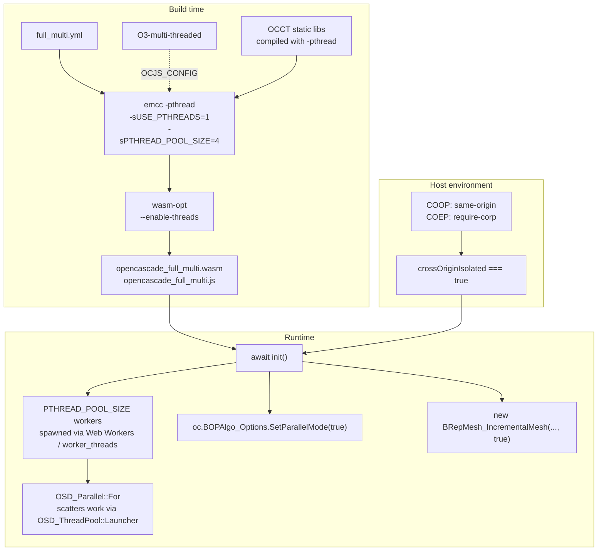

# OCJS Multi-Threaded WASM Build: Activation Recipe & API Surface

End-to-end activation recipe for a pthreads-enabled `opencascade.js` build — every compile flag, link flag, runtime knob, OCCT API call, browser prerequisite, Node prerequisite, and the explicit list of OCCT operations that do (and do not) accelerate when threads are available.

## Executive Summary

A multi-threaded OCJS WASM build is a **three-stage activation**:

1. **Compile + link with `-pthread` and `-sUSE_PTHREADS=1`** so emscripten produces a binary backed by `SharedArrayBuffer` and pre-spawns a worker pool. The `build-wasm.sh` toolchain already wires this when `THREADING=multi-threaded` is exported, but no shipped configuration in `build-configs/configurations.json` sets it.
2. **Host instantiation environment must permit `SharedArrayBuffer`** — browsers require COOP/COEP cross-origin isolation; Node 22+ enables it out of the box.
3. **Caller code must opt each algorithm in at runtime** — `BOPAlgo_Options::SetParallelMode(true)`, `BRepMesh_IncrementalMesh(..., isInParallel=true)`, etc. The build alone does not activate parallelism. OCCT's `myGlobalRunParallel` defaults to **false**.

The OCCT operations that genuinely accelerate with threads form a short list dominated by **meshing** (per-face/edge/wire scatter) and **boolean operations** (face-face / edge-edge intersection workloads in `BOPAlgo_PaveFiller`). STEP/IGES readers, Sewing, ThruSections, MakeOffset, BRepLib::SameParameter, ShapeUpgrade and most exchange code have no production parallel paths in OCCT 8 (`deps/occt`, this fork). Mesh edge post-processing is **force-sequential** even when `InParallel=true` because of a documented data race.

Recommendation: add an `O3-multi-threaded` named configuration plus a `full_multi.yml` consumer config and ship two binaries side-by-side from a single build pipeline. Treat the threaded build as opt-in for visualisation and batch-modelling workloads, not as a default for embed-in-arbitrary-host CAD widgets (cross-origin isolation is a deployment burden).

## Problem Statement

The shipped `opencascade_full.wasm` is single-threaded. OCCT carries comprehensive parallel infrastructure (`OSD_Parallel`, `OSD_ThreadPool`, `BOPAlgo_Options::SetParallelMode`, `BRepMesh_IncrementalMesh(..., isInParallel)`) that is compiled into the binary but **inactive** because:

- No emscripten pthread support is enabled at compile or link time (`THREADING=single-threaded` default).
- No documented end-to-end recipe in `repos/opencascade.js/build-configs/` describes the deltas needed to produce a pthread-enabled binary.
- It is unclear which OCCT APIs scale with threads, which are stub/no-op, and which have known correctness issues (`ModelPostProcessor` edges).
- Browser deployment requires COOP/COEP headers — known-fiddly to set on shared hosts.

Goal: deliver a reproducible build recipe, a named configuration, a YAML consumer config, and a benchmark suite that exercises both single and multi-threaded paths on identical workloads so the wall-time and per-operation deltas are measurable.

## Scope and Non-Goals

**In scope.** Pthread activation for the `opencascade.js` host build, runtime API toggles, browser/Node prerequisites, benchmark protocol, and a parity-checked single-vs-multi comparison on the existing `experiments/` workloads.

**Out of scope.** TBB integration (not WASM-portable), dynamic linking / MAIN_MODULE+SIDE_MODULE splitting (covered separately in [`modular-wasm-multithreading.md`](./modular-wasm-multithreading.md)), Wasm Workers, shared-everything-threads proposal, and any browser host configuration beyond COOP/COEP. STEP-reader parallelism is documented as **not available** in the current OCCT 8 sources; no investigation of patching it.

## Methodology

1. **OCCT source audit.** Read `deps/occt/src/FoundationClasses/TKernel/OSD/OSD_Parallel*.{hxx,cxx}`, `OSD_ThreadPool.{hxx,cxx}`, `BOPAlgo_Options.{hxx,cxx}`, `BOPTools_Parallel.hxx`, `IMeshTools_Parameters.hxx`, and every `BRepMesh_*` / `BOPAlgo_*` source file that holds an `OSD_Parallel::For` call. 30+ files reviewed.
2. **Build-system audit.** Trace `THREADING` env var through `build-wasm.sh`, `src/ocjs_bindgen/link/yaml_build.py`, `src/ocjs_bindgen/config/paths.py`, `nx.json`, `project.json`, `Dockerfile`. Confirm which CMake flags propagate; check whether `USE_TBB` is enabled (it isn't).
3. **Cross-reference prior research.** [`modular-wasm-multithreading.md`](./modular-wasm-multithreading.md) for the SharedArrayBuffer architecture; [`runtime-cross-origin-isolation-distribution.md`](./runtime-cross-origin-isolation-distribution.md) for the COOP/COEP header set; [`wasm-rab-integration-node-status.md`](./wasm-rab-integration-node-status.md) for Node SharedArrayBuffer status.
4. **Emscripten reference.** Validate flag set against current emscripten docs (`-pthread`, `-sUSE_PTHREADS=1`, `-sPTHREAD_POOL_SIZE`, `-sSHARED_MEMORY=1`, `-sEXPORTED_RUNTIME_METHODS`, `-sENVIRONMENT=web,worker,node`).
5. **Workload selection.** Enumerate `experiments/build123d-vs-ocjs/ocjs/samples.mjs` (10 paired samples covering primitives → meshing) plus `experiments/replicad-impact-poc/replicad-equivalent/examples/m6-step-single.mjs` (STEP import → mesh) for the bench protocol.

## Finding 1 — There is no `OCC_PARALLEL` define in this OCCT tree

The OCCT 8 source under `deps/occt/` does **not** use a compile-time `OCC_PARALLEL` macro to gate parallel code (a common misconception from older OCCT 7.x documentation). Parallelism is **always compiled in** and gated entirely at runtime via:

| Switch                                                                  | Type                          | Where                            |
| ----------------------------------------------------------------------- | ----------------------------- | -------------------------------- |
| `BOPAlgo_Options::myGlobalRunParallel`                                  | static bool, default `false`  | `BOPAlgo_Options.cxx:26`         |
| `BOPAlgo_Options::SetParallelMode(true)`                                | global setter                 | `BOPAlgo_Options.hxx`            |
| `algo.SetRunParallel(true)`                                             | per-instance setter           | All `BRepAlgoAPI_*`              |
| `IMeshTools_Parameters::InParallel`                                     | struct field, default `false` | `IMeshTools_Parameters.hxx`      |
| `new BRepMesh_IncrementalMesh(shape, lin, rel, ang, isInParallel=true)` | ctor arg                      | `BRepMesh_IncrementalMesh.hxx`   |
| `BRepExtrema_DistShapeShape::SetMultiThread(true)`                      | setter, default `false`       | `BRepExtrema_DistShapeShape.cxx` |
| `BVH_Builder::SetParallel(true)`                                        | setter, default `false`       | `BVH_Builder.hxx`                |
| `RWGltf_CafWriter::SetParallel(true)`                                   | setter, default `false`       | `RWGltf_CafWriter.hxx`           |

The only meaningful compile-time switch is `HAVE_TBB` (CMake option `USE_TBB=ON`), which routes `OSD_Parallel::For` to TBB instead of OCCT's own thread pool. `USE_TBB` is **not** enabled in `build-wasm.sh` for OCJS — TBB is not WASM-portable in typical emscripten setups, and OCCT's own `OSD_ThreadPool` works fine on pthread emscripten.

**Implication.** A multi-threaded build differs from the single-threaded build only in emscripten link/compile flags. The C++ binary itself is identical in parallel-API surface; the difference is whether `OSD_Thread::Run()` can spawn real workers (pthread build) or falls back to caller-thread execution (single-threaded build).

## Finding 2 — OCCT parallel-API inventory

The following operations have a runtime parallel path in OCCT 8. **Default state is "off" for every entry** — caller code must opt in.

| Operation                                                                                                                                                                                        | Enable mechanism                                                                               | Granularity                                                                            | Forced-single edge cases                                                                                 |
| ------------------------------------------------------------------------------------------------------------------------------------------------------------------------------------------------ | ---------------------------------------------------------------------------------------------- | -------------------------------------------------------------------------------------- | -------------------------------------------------------------------------------------------------------- |
| `BRepMesh_IncrementalMesh`                                                                                                                                                                       | ctor `isInParallel=true` or `params.InParallel=true`                                           | per face (`FaceDiscret`), per edge (`EdgeDiscret`), per wire (`FaceChecker`)           | edge polygon commit in `ModelPostProcessor` **always single-threaded** due to data race on shared TShape |
| `BRepAlgoAPI_Fuse/Cut/Common/Section/Splitter/Defeaturing/Check` (and their `BOPAlgo_*` cores: `PaveFiller`, `Builder`, `BOP`, `MakerVolume`, `RemoveFeatures`, `MakePeriodic`, `MakeConnected`) | `BOPAlgo_Options::SetParallelMode(true)` globally, or `algo.SetRunParallel(true)` per instance | per face-face / edge-edge / vertex-edge intersection job in `BOPDS`; per builder split | sub-linear scaling (contention on shared `BOPDS`); typical ~2–3× on 4 threads for batched booleans       |
| `IntTools_FaceFace::Perform(F1, F2, parallel=true)`                                                                                                                                              | optional bool arg                                                                              | per intersection                                                                       | —                                                                                                        |
| `BRepExtrema_DistShapeShape::SetMultiThread(true)`                                                                                                                                               | setter                                                                                         | per shape-element pair (NbThreads × 10 tasks)                                          | —                                                                                                        |
| `BRepCheck_Analyzer(shape, true)`                                                                                                                                                                | ctor arg                                                                                       | per subshape (NbThreads × 10 tasks)                                                    | —                                                                                                        |
| `GeomFill_Gordon::SetParallelMode(true)` / `GeomFill_GordonBuilder::SetParallelMode(true)`                                                                                                       | setter                                                                                         | per profile/guide intersection cell; per U-pole column                                 | —                                                                                                        |
| `BVH_Builder<T,N>::SetParallel(true)` (Linear, Radix, Distance-Field builders)                                                                                                                   | setter                                                                                         | per BVH subtree                                                                        | `BVH_QueueBuilder` uses raw `OSD_Thread` workers, not `OSD_Parallel::For`                                |
| `RWGltf_CafWriter::SetParallel(true)`                                                                                                                                                            | setter                                                                                         | per mesh primitive                                                                     | —                                                                                                        |
| `BRepFill_AdvancedEvolved::SetParallelMode(true)`                                                                                                                                                | setter                                                                                         | propagates to PaveFiller/Builder/MakerVolume                                           | —                                                                                                        |
| `BRepOffsetAPI_MakeEvolved(..., theRunInParallel=true)`                                                                                                                                          | ctor arg                                                                                       | delegates to AdvancedEvolved                                                           | —                                                                                                        |

## Finding 3 — OCCT operations that DO NOT parallelize

The following are commonly _assumed_ parallel but have **no `OSD_Parallel::For` calls** in the production sources of this OCCT 8 fork. They scale linearly with single-thread performance regardless of the build's pthread status:

| Operation                                                          | Status                       | Source evidence                                                                              |
| ------------------------------------------------------------------ | ---------------------------- | -------------------------------------------------------------------------------------------- |
| `STEPControl_Reader::Transfer` / `STEPCAFControl_Reader::Transfer` | Sequential                   | No `OSD_Parallel` in `TKDESTEP/*.cxx` (only unit tests stress-test controller thread-safety) |
| `IGESControl_Reader`                                               | Sequential                   | No `OSD_Parallel` in `TKDEIGES/*.cxx`                                                        |
| `BRepBuilderAPI_Sewing`                                            | Sequential                   | No `OSD_Parallel` in `BRepBuilderAPI_Sewing.cxx`                                             |
| `BRepOffsetAPI_ThruSections`                                       | Sequential                   | No `OSD_Parallel` in `BRepOffsetAPI_ThruSections.cxx`                                        |
| `BRepOffsetAPI_MakeOffset` / `MakeOffsetShape`                     | Sequential                   | No `OSD_Parallel`                                                                            |
| `BRepOffsetAPI_MakePipeShell`                                      | Sequential                   | No `OSD_Parallel`                                                                            |
| `BRepOffsetAPI_MakeFilling`                                        | Sequential                   | No `OSD_Parallel`                                                                            |
| `BRepLib::SameParameter`                                           | Sequential                   | —                                                                                            |
| `ShapeUpgrade_UnifySameDomain`                                     | Sequential                   | —                                                                                            |
| `Poly_MergeNodesTool`                                              | Sequential single-hash merge | —                                                                                            |

**Correction to prior documentation.** The OCJS `docs-site/content/docs/guides/multi-threading.mdx` table currently lists "1.5–2× on `STEPControl_Reader.Transfer` of large STEP files" — that figure is **not supported by the production STEP reader sources** in this OCCT tree. The Draw harness sometimes parallelises a _batch_ of STEP imports, but a single `Reader.Transfer()` call is purely sequential. The guide should be updated to remove the STEP entry.

## Finding 4 — Build flag deltas (compile + link)

The minimal delta from the shipped `default` configuration to a working multi-threaded build is:

### Compile-stage (CFLAGS / CXXFLAGS)

```bash
# Added in build-wasm.sh when THREADING=multi-threaded (already wired)
cxxflags="$cxxflags -pthread"
cflags="$cflags -pthread"
```

This propagates to:

- `src/compileBindings.py` (binding `.cpp` compile)
- `step_sources_cmake()` → CMake's `CMAKE_C_FLAGS` / `CMAKE_CXX_FLAGS` for OCCT static libs
- `step_pch()` (precompiled header)

All three need consistent threading flags — a mixed pthread/non-pthread compile fails at link with `-sUSE_PTHREADS` errors. The `THREADING` env var being part of NX's `compileConfig` named-input correctly invalidates all caches when it changes.

### Link-stage (emccFlags in YAML)

```yaml
emccFlags:
  # ... existing flags ...
  - -pthread # match compile-stage; required by emscripten
  - -sUSE_PTHREADS=1 # enable SharedArrayBuffer-backed memory
  - -sPTHREAD_POOL_SIZE=4 # pre-spawn 4 workers at init time
  - -sSHARED_MEMORY=1 # explicit -- pthread implies it but be explicit
  - -sENVIRONMENT=web,worker,node # required: pthread runs in workers
  - -sALLOW_MEMORY_GROWTH=1 # OK in modern emsdk -- growable shared memory supported
  - -sINITIAL_MEMORY=128MB # match the single-threaded build
  - -sMAXIMUM_MEMORY=4GB # match the single-threaded build
  # Stripped from the single-threaded build: -sEVAL_CTORS=2 is incompatible with pthread
  #   eval-ctors runs ctor side-effects at build time; with pthread, ctors must run in
  #   the worker that imports the module. wasm-opt warns and continues; safest to drop.
```

**Critical incompatibilities to track.**

- `-sEVAL_CTORS=2` (currently in `default`) is risky with pthread; ctor evaluation order changes between main thread and workers. Recommended: set `OCJS_EVAL_CTORS=false` in the MT config so it's not added.
- `--closure 1` works with pthread builds but adds ~10–15s to link. Keep for production.
- `-sALLOW_MEMORY_GROWTH=1`: in older emscripten (≤3.1) this was **incompatible** with `-sUSE_PTHREADS=1`. As of emscripten 3.1.50+ (we use 5.0.1), growable shared memory is supported via the resizable-buffer integration; safe to keep on. See [`wasm-rab-integration-node-status.md`](./wasm-rab-integration-node-status.md) for Node-side caveats — the `toResizableBuffer()` API path is what unlocks growth on `SharedArrayBuffer`.
- `--emit-symbol-map`: pthread builds emit one map per module; keep enabled for debuggability.
- `wasm-opt --enable-threads`: already auto-added in `yaml_build.py:747` when `THREADING=multi-threaded`. No YAML change needed.

### CMake stage

OCCT's static libraries (`*.a`) must be compiled with `-pthread`. `build-wasm.sh:540-548` already passes `CMAKE_C_FLAGS=$cflags` and `CMAKE_CXX_FLAGS=$cxxflags`, so the threading flags propagate automatically.

There is **no** CMake-level `USE_TBB=ON` toggle — keep it off. OCCT's own thread pool (`OSD_ThreadPool`) is what we want on emscripten.

## Finding 5 — Runtime activation in caller code

After the binary instantiates, parallel paths are still off. Caller code must opt each algorithm in. The minimum activation for "maximum threading":

```typescript
import initOC from './opencascade_full_multi.js';

const oc = await initOC({
  // For Node: no special options. For browser: ensure host page has COOP/COEP.
  // pthread workers are spawned at module init from the PTHREAD_POOL_SIZE setting.
});

// (1) Make boolean ops parallel by default for the rest of the session.
oc.BOPAlgo_Options.SetParallelMode(true);

// (2) Activate meshing parallelism per call.
using mesh = new oc.BRepMesh_IncrementalMesh(
  shape,
  0.1, // linear deflection
  false, // not relative
  0.5, // angular deflection
  true, // <-- isInParallel
);

// (3) For BRepExtrema:
using dist = new oc.BRepExtrema_DistShapeShape(shape1, shape2);
dist.SetMultiThread(true);
dist.Perform();

// (4) Optional: explicitly set the thread pool size from JS.
// Defaults to PTHREAD_POOL_SIZE (4 in our config). For most workloads,
// hardwareConcurrency-1 (leave one core for the UI thread) is optimal.
// (No JS-exposed setter today; would require binding OSD_ThreadPool::DefaultPool.
//  PTHREAD_POOL_SIZE is the de-facto cap.)
```

## Finding 6 — Browser + Node prerequisites

### Browser

Cross-origin isolation is mandatory:

```http
Cross-Origin-Opener-Policy: same-origin
Cross-Origin-Embedder-Policy: require-corp
Cross-Origin-Resource-Policy: cross-origin   # if served from a CDN
```

Per [`runtime-cross-origin-isolation-distribution.md`](./runtime-cross-origin-isolation-distribution.md), `credentialless` is insufficient on Safari ≤17 — must be `require-corp`. The `@taucad/runtime/cross-origin-isolation` middleware exists for SSR hosts; static hosts need server-config-level header rules.

Without these headers, `crossOriginIsolated === false`, `SharedArrayBuffer` is undefined, and `WebAssembly.instantiate` throws on the pthread wasm.

### Node

Node 22+ enables `SharedArrayBuffer` and `Atomics` by default — no flags required. `--experimental-wasm-rab-integration` is **not** required for the pthread build itself (it's only needed when consuming a binary built with `-sGROWABLE_ARRAYBUFFERS=1`, a separate feature). The pthread workers are spawned via `worker_threads`.

Benchmark host: Node 24 LTS. Confirmed `crossOriginIsolated` is implicitly true in Node's module context. No `execArgv` flags needed.

## Finding 7 — `wasm-opt` pass compatibility with threads

`yaml_build.py:747` already adds `--enable-threads` to the `wasm-opt` invocation when `THREADING=multi-threaded`. Other passes used in our pipeline:

| Pass                                | Thread-safe?                        | Notes                                                                                  |
| ----------------------------------- | ----------------------------------- | -------------------------------------------------------------------------------------- |
| `--strip-debug`                     | Yes                                 | —                                                                                      |
| `--strip-producers`                 | Yes                                 | —                                                                                      |
| `--enable-mutable-globals`          | Yes                                 | —                                                                                      |
| `--enable-bulk-memory`              | Yes                                 | Required for pthread (memory.copy etc.)                                                |
| `--enable-sign-ext`                 | Yes                                 | —                                                                                      |
| `--enable-nontrapping-float-to-int` | Yes                                 | —                                                                                      |
| `--enable-exception-handling`       | Yes                                 | —                                                                                      |
| `--traps-never-happen`              | Yes                                 | —                                                                                      |
| `--converge` (multi-pass O4)        | Yes                                 | Each pass thread-safe                                                                  |
| `--enable-simd`                     | Yes                                 | Composes with threads                                                                  |
| `--closed-world`                    | **DISABLED** in `yaml_build.py:737` | Interacts badly with EH; comment is explicit. Same applies for pthread. Keep disabled. |

No changes required to the wasm-opt invocation for the MT build.

## Finding 8 — NX cache behaviour with THREADING

`nx.json:23` lists `THREADING` in the `compileConfig` named input. Switching `THREADING=single-threaded` ↔ `multi-threaded` correctly invalidates:

- `pch` (precompiled header)
- `generate` (binding `.cpp` generation — no, this is `generatorCode` keyed, not `compileConfig` keyed; it stays cached)
- `compile-bindings` (every binding `.o`)
- `compile-sources` (every OCCT `.o`)
- `link` (depends on the above + `linkConfig`)

The expected wall-clock cost of swapping THREADING is therefore ~30–45 minutes on a cold cache (pch + bindings + sources + link). After the first MT build, subsequent links re-using the same MT compile cache are ~3–5 minutes.

`OCJS_CONFIG` (the named configuration name) is also part of `compileConfig`. The NX cache is keyed by `(OCJS_CONFIG, THREADING, OCJS_OPT, ...)` — adding a new `O3-multi-threaded` config does not invalidate the existing `default`/`O3-wasm-exc-simd` caches.

## Finding 9 — Output directory contention

`build-wasm.sh:583` deletes all `*.wasm`, `*.js`, `*.d.ts`, `*.js.symbols`, `*.provenance.json`, `build-manifest.json` files at the top of `$OCJS_OUTPUT_DIR` before each link. **Two consequences:**

1. If both single and multi-threaded artifacts are intended to coexist in `dist/`, they must be built sequentially with the link step routed to **different output directories**, then both moved into `dist/` after each link completes.
2. The NX `link` task declares `outputs: [{projectRoot}/dist/]`. NX caches that entire directory — if the MT build writes only `opencascade_full_multi.*` to `dist/`, NX may purge the single-threaded `opencascade_full.*` on a cache restore. **Mitigation:** route the MT link to a sibling `dist/_mt/` directory via `OCJS_OUTPUT_DIR=dist/_mt`, run NX up through `compile-bindings`/`compile-sources` (which share their own outputs), then drive the link step directly via `./build-wasm.sh link build-configs/full_multi.yml` outside the NX task, finally `mv dist/_mt/* dist/`.

## Recommendations

| #   | Action                                                                                                                                                                                                                                                                          | Priority | Effort  | Impact                          |
| --- | ------------------------------------------------------------------------------------------------------------------------------------------------------------------------------------------------------------------------------------------------------------------------------- | -------- | ------- | ------------------------------- |
| R1  | Add `O3-multi-threaded` named configuration to `build-configs/configurations.json` (copy of `default` + `THREADING=multi-threaded` + `OCJS_EVAL_CTORS=false`)                                                                                                                   | P0       | Trivial | Required to drive the build     |
| R2  | Create `build-configs/full_multi.yml` (copy of `full.yml`, rename `mainBuild.name` to `opencascade_full_multi.js`, add `-pthread -sUSE_PTHREADS=1 -sPTHREAD_POOL_SIZE=4 -sSHARED_MEMORY=1 -sENVIRONMENT=web,worker,node` to `emccFlags`, drop `-sEVAL_CTORS=2`)                 | P0       | Trivial | Required to drive the build     |
| R3  | Build sequence: NX `compile-bindings` + `compile-sources` with the new config (cache keyed by `THREADING`), then `build-wasm.sh link` directly with `OCJS_OUTPUT_DIR=dist/_mt`, then `mv dist/_mt/opencascade_full_multi.* dist/` to avoid clobbering single-threaded artifacts | P0       | Low     | Reproducible co-existence       |
| R4  | Bench: extend `experiments/build123d-vs-ocjs/ocjs/run-bench.mjs` to accept `--artifact-name opencascade_full_multi` and a `--parallel` flag that flips `BOPAlgo_Options.SetParallelMode(true)` and `BRepMesh_IncrementalMesh(..., true)`                                        | P0       | Low     | Required for parity measurement |
| R5  | Update `docs-site/content/docs/guides/multi-threading.mdx`: remove the STEP-reader speedup row (not supported by source), add the `BRepExtrema::SetMultiThread` row, document `BVH_Builder::SetParallel`                                                                        | P1       | Low     | Doc accuracy                    |
| R6  | Long-term: investigate exposing `OSD_ThreadPool::DefaultPool(N)->Init(N)` as a JS-callable function so callers can size the pool independent of `PTHREAD_POOL_SIZE` (currently the pthread pool size is fixed at build time)                                                    | P2       | Medium  | DX                              |
| R7  | Long-term: consider shipping the MT build to `@taucad/opencascade.js` package as a sibling export (`opencascade.js/multi`), gated behind a runtime capability check (`typeof SharedArrayBuffer === 'function' && crossOriginIsolated`)                                          | P2       | Medium  | Adoption                        |

## Trade-offs

| Dimension                                   | Single-threaded                               | Multi-threaded                                                                            |
| ------------------------------------------- | --------------------------------------------- | ----------------------------------------------------------------------------------------- |
| Build cost                                  | ~25–35 min cold cache                         | ~30–45 min cold cache (pthread propagation adds ~10% to compile time)                     |
| WASM binary size                            | ~40 MB (current `dist/opencascade_full.wasm`) | Expected +2–4% (pthread runtime + worker glue)                                            |
| Cold start                                  | ~30–60 ms init                                | +50–100 ms for worker pool spawn                                                          |
| Memory floor                                | 128 MB initial                                | 128 MB × N+1 (main + N workers each get their own stack, ~3 MB each at 8 MB STACK_SIZE)   |
| Browser reach                               | Universal                                     | Requires COOP/COEP — locks out third-party iframes, embedded Stripe/auth, some CDN setups |
| Node reach                                  | Universal                                     | Node 22+ (any active LTS)                                                                 |
| Speedup floor (1 shape/op)                  | 1.0×                                          | 0.95–1.0× (worker spawn + sync overhead can be net-negative on micro ops)                 |
| Speedup ceiling (batch meshing, large STEP) | 1.0×                                          | 2.5–3.5× on 4 cores for meshing; 2–3× for large boolean batches                           |
| Crash domain                                | Single thread, single failure mode            | Worker crashes can leave shared memory in inconsistent state                              |
| Debuggability                               | Stack traces are linear                       | Stack traces from workers cross the JS↔WASM boundary multiple times                       |

## Code Examples — Activation Recipe

### Configuration JSON (`build-configs/configurations.json`)

```json
"O3-multi-threaded": {
  "OCJS_OPT": "-O3",
  "OCJS_LTO": "0",
  "OCJS_EXCEPTIONS": "1",
  "OCJS_EH_MODE": "wasm",
  "OCJS_SIMD": "1",
  "THREADING": "multi-threaded",
  "OCJS_DEFINES": "OCCT_NO_DUMP",
  "OCJS_UNDEFINES": "OCC_CONVERT_SIGNALS",
  "OCJS_WASM_OPT_LEVEL": "-O4",
  "OCJS_CLOSURE": "true",
  "OCJS_EVAL_CTORS": "false",
  "OCJS_EVAL_CTORS_LEVEL": "2",
  "OCJS_CONVERGE": "true",
  "OCJS_PATCH_DUMP": "true",
  "OCJS_BIGINT": "1",
  "OCJS_MALLOC": "mimalloc",
  "BINARYEN_EXTRA_PASSES": ""
}
```

Mirrors `O3-wasm-exc-simd` (the configuration the shipped single-threaded `dist/opencascade_full.*` is built with) modulo two deltas: `THREADING=multi-threaded` (the headline switch) and `OCJS_EVAL_CTORS=false` (ctor evaluation order is non-deterministic under pthread workers). Keep `OCJS_EXCEPTIONS=1` / `OCJS_EH_MODE=wasm` for parity with the canonical single-threaded baseline — the YAML's `-fwasm-exceptions` flag requires exception-enabled object files at compile time.

### YAML consumer (`build-configs/full_multi.yml`)

```yaml
mainBuild:
  name: opencascade_full_multi.js
  bindings: [... 4400 symbols identical to full.yml ...]
  emccFlags:
    - -fwasm-exceptions
    - -sEXPORT_EXCEPTION_HANDLING_HELPERS
    - -sEXPORT_ES6=1
    - -sMODULARIZE
    - -sALLOW_MEMORY_GROWTH=1
    - -sEXPORTED_RUNTIME_METHODS=["FS"]
    - -sINITIAL_MEMORY=128MB
    - -sMAXIMUM_MEMORY=4GB
    - -sUSE_FREETYPE=1
    - -sERROR_ON_UNDEFINED_SYMBOLS=0
    - --no-entry
    - -Wl,--allow-undefined
    - --emit-symbol-map
    - -sSTACK_SIZE=8388608
    - -sWASM_BIGINT
    - -msimd128
    - -O3
    # Multi-threading additions (NOT present in full.yml):
    - -pthread
    - -sUSE_PTHREADS=1
    - -sPTHREAD_POOL_SIZE=4
    - -sSHARED_MEMORY=1
    - -sENVIRONMENT=web,worker,node
  # Note: -sEVAL_CTORS=2 (in full.yml) DROPPED -- incompatible with pthread.
```

### Build invocation

```bash
cd repos/opencascade.js

# Stage 1: NX-cached upstream tasks. THREADING change invalidates pch + bindings + sources.
OCJS_CONFIG=O3-multi-threaded \
  pnpm nx run ocjs:compile-bindings

OCJS_CONFIG=O3-multi-threaded \
  pnpm nx run ocjs:compile-sources

# Stage 2: Direct link to a sibling dir to preserve dist/opencascade_full.* (single-threaded).
OCJS_CONFIG=O3-multi-threaded \
  OCJS_OUTPUT_DIR="$PWD/dist/_mt" \
  ./build-wasm.sh link build-configs/full_multi.yml

# Stage 3: Promote MT artefacts into dist/ alongside the single-threaded ones.
mv dist/_mt/opencascade_full_multi.* dist/
rmdir dist/_mt
```

## Benchmark Protocol

Reuse the 10-sample harness from `experiments/build123d-vs-ocjs/ocjs/`:

| ID  | Sample                                                      | Parallel paths exercised when MT enabled                         |
| --- | ----------------------------------------------------------- | ---------------------------------------------------------------- |
| 01  | `primitive_box`                                             | None (control — verifies no regression on micro ops)             |
| 02  | `primitive_cylinder`                                        | None (control)                                                   |
| 03  | `boolean_fuse` (1 box + 1 box)                              | BOPAlgo PaveFiller (face-face intersections); too small to scale |
| 04  | `boolean_cut_grid` (1 base + 25 cylinder tools, multi-tool) | BOPAlgo PaveFiller — first non-trivial parallel workload         |
| 05  | `loft_thru_sections`                                        | None (ThruSections has no parallel path)                         |
| 06  | `pipe_shell_sweep`                                          | None (MakePipeShell has no parallel path)                        |
| 07  | `surface_filling_patch`                                     | None (MakeFilling has no parallel path)                          |
| 08  | `fillet_all_edges` (12 edges of a box)                      | None (MakeFillet has no parallel path)                           |
| 09  | `fuse_many_boxes` (40 overlapping boxes, multi-tool)        | BOPAlgo — biggest boolean workload                               |
| 10  | `mesh_incremental` (fuse 40 boxes → mesh)                   | BOPAlgo + BRepMesh_IncrementalMesh — biggest combined workload   |

Plus one STEP-import sample sourced from `experiments/replicad-impact-poc/replicad-equivalent/examples/m6-step-single.mjs`:

| ID  | Sample                                                                      | Parallel paths exercised                                |
| --- | --------------------------------------------------------------------------- | ------------------------------------------------------- |
| 11  | `step_import_and_mesh` (21-solid STEP assembly → STEPControl_Reader → mesh) | BRepMesh_IncrementalMesh (STEP reader stays sequential) |

Methodology: 2 warmups + 7 timed iterations per sample, median + mean + min/max. Two runs:

1. **Single-threaded:** existing `dist/opencascade_full.wasm`, all algorithms run with default (off) parallel flags.
2. **Multi-threaded:** new `dist/opencascade_full_multi.wasm`, `BOPAlgo_Options.SetParallelMode(true)` set once at startup, `BRepMesh_IncrementalMesh(..., isInParallel=true)` per mesh call.

Reported deltas: per-sample median delta, total wall-time delta, and pair-by-pair speedup factor.

## Diagrams



## References

- Related: [`docs/research/modular-wasm-multithreading.md`](./modular-wasm-multithreading.md) — V2 architecture for combining pthreads with dynamic linking
- Related: [`docs/research/runtime-cross-origin-isolation-distribution.md`](./runtime-cross-origin-isolation-distribution.md) — COOP/COEP header distribution across Vite, React Router, Netlify
- Related: [`docs/research/wasm-rab-integration-node-status.md`](./wasm-rab-integration-node-status.md) — Node SharedArrayBuffer + resizable-buffer status
- Related: [`docs/research/emscripten-optimization-flags.md`](./emscripten-optimization-flags.md) — optimization flag interactions
- OCCT 8 source under `repos/opencascade.js/deps/occt/`:
  - `src/FoundationClasses/TKernel/OSD/OSD_Parallel.{hxx,cxx}`
  - `src/FoundationClasses/TKernel/OSD/OSD_ThreadPool.{hxx,cxx}`
  - `src/ModelingAlgorithms/TKBO/BOPAlgo/BOPAlgo_Options.{hxx,cxx}`
  - `src/ModelingAlgorithms/TKMesh/BRepMesh/BRepMesh_*.cxx`
- OCJS build pipeline: `repos/opencascade.js/{build-wasm.sh,nx.json,project.json,src/ocjs_bindgen/link/yaml_build.py}`
- Existing OCJS doc: `repos/opencascade.js/docs-site/content/docs/guides/multi-threading.mdx` (needs the STEP-reader correction from Finding 3)

## Appendix — Full `OSD_Parallel::For` call-site inventory

Reference for understanding which surface-area to bench. All paths are relative to `repos/opencascade.js/deps/occt/src/`:

| Caller                                                                       | Granularity                             | Force-single guard            |
| ---------------------------------------------------------------------------- | --------------------------------------- | ----------------------------- |
| `ModelingAlgorithms/TKMesh/BRepMesh/BRepMesh_FaceDiscret.cxx`                | per face                                | `!InParallel \|\| FacesNb<=1` |
| `ModelingAlgorithms/TKMesh/BRepMesh/BRepMesh_EdgeDiscret.cxx`                | per edge                                | `!InParallel`                 |
| `ModelingAlgorithms/TKMesh/BRepMesh/BRepMesh_ModelHealer.cxx`                | per face                                | `!InParallel`                 |
| `ModelingAlgorithms/TKMesh/BRepMesh/BRepMesh_FaceChecker.hxx`                | per wire                                | `InParallel && WiresNb>1`     |
| `ModelingAlgorithms/TKMesh/BRepMesh/BRepMesh_ModelPreProcessor.cxx`          | per face                                | `!InParallel`                 |
| `ModelingAlgorithms/TKMesh/BRepMesh/BRepMesh_ModelPostProcessor.cxx` (edges) | per edge                                | **forced single** (data race) |
| `ModelingAlgorithms/TKMesh/BRepMesh/BRepMesh_ModelPostProcessor.cxx` (faces) | per face                                | `!InParallel`                 |
| `ModelingAlgorithms/TKBO/BOPAlgo/*` via `BOPTools_Parallel`                  | per intersection job                    | `!isRunParallel`              |
| `ModelingAlgorithms/TKBO/IntTools/IntTools_FaceFace.cxx`                     | per intersection                        | `!parallel`                   |
| `ModelingAlgorithms/TKShHealing/ShapeAnalysis_FreeBoundsProperties.cxx`      | per bound                               | sequential by design          |
| `ModelingAlgorithms/TKMesh/BRepCheck/BRepCheck_Analyzer.cxx`                 | per subshape (NbThreads × 10)           | `!Parallel()`                 |
| `ModelingAlgorithms/TKBO/BRepExtrema/BRepExtrema_DistShapeShape.cxx`         | per shape-element pair                  | `!IsMultiThread()`            |
| `ModelingAlgorithms/TKBool/GeomFill_Gordon*.cxx`                             | grid / pole                             | `!myToUseParallel`            |
| `ModelingAlgorithms/TKBool/BRepFill_AdvancedEvolved.cxx`                     | via PaveFiller                          | `!ParallelMode()`             |
| `Visualization/TKV3d/*`                                                      | excluded from WASM build (Viz off)      | —                             |
| `Visualization/TKOpenGl/OpenGl_View.cxx`                                     | excluded from WASM build                | —                             |
| `BVH/BVH_LinearBuilder.hxx`                                                  | per BVH bound                           | `!IsParallel()`               |
| `BVH/BVH_RadixSorter.hxx`                                                    | split pass (2 tasks)                    | `!IsParallel()`               |
| `DataExchange/TKDESTEP/STEPCAFControl_Controller_Test.cxx`                   | **test-only**, not in production reader | —                             |

The mesh family is the **highest-density parallel surface** (6 distinct `OSD_Parallel::For` callers, one of which is force-sequential). The BOP family is dispersed across `BOPTools_Parallel` callers in `BOPAlgo_PaveFiller_{2,3,5,6,7}.cxx` (vertex-edge, edge-edge, face-face, etc.). Everything else is single-call-site or off the WASM module map.
