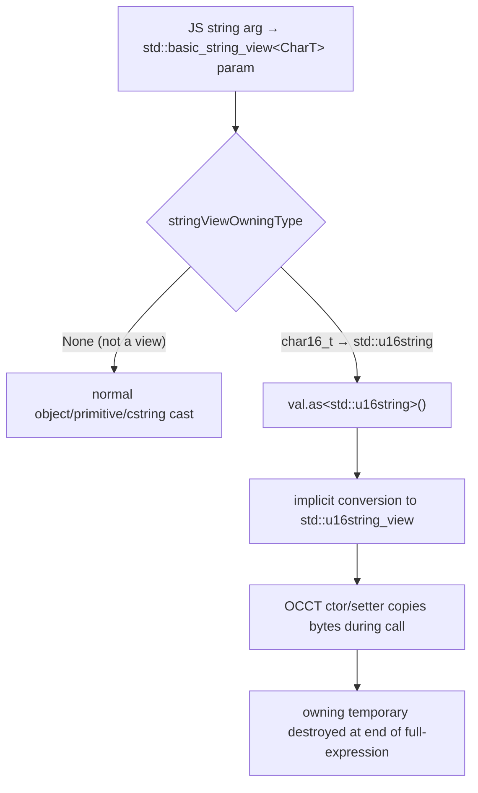

# OCJS PR #301 — Working-Copy Change Audit

A systematic inventory of the uncommitted working-copy changes in `repos/opencascade.js` produced during the PR #301 production-readiness session, with a root-cause deep-dive on the two bindgen changes (the `std::basic_string_view` regression fix and the multi-threaded constructor-registration fix).

## Executive Summary

The session left **3 bindgen source files**, **6 config/doc files**, and **the docs-site API reference** modified in the working tree (committed docs-site recolor/anchor IDs landed in `1576ec8`; the working copy carries the interactive anchor layer + human-readable anchor rename). The headline change is a **new bindgen heuristic** that resolves OCCT V8's `std::basic_string_view<CharT>` parameters: Embind has no binding for the non-owning view, so the generator now lifts the incoming JS string through the registered **owning** `std::*string` type (which implicitly converts to the view). A second, independent constructor-codegen change fixes a **duplicate same-arity `emscripten::val` registration** that only crashed in multi-threaded (pthread) builds. The remaining changes are version retagging (V8.0.0 RC5 → final), a Docker/qemu daemon fix, build-config symbol pruning, and repo hygiene (legacy test harness + CI workflow removal, new production-readiness skill, stray build logs).

## Problem Statement

The PR #301 wrap-up rebuilt OCJS single + multi and surfaced a binding regression:

```
BindingError: parameter 0 has unknown type N9emscripten3valE...
              ...std::__2::basic_string_view<char16_t, ...>...
```

`TCollection_ExtendedString` (and sibling string classes) gained `std::basic_string_view` constructor/setter overloads in OCCT V8. Embind registers the owning `std::string` / `std::wstring` / `std::u16string` / `std::u32string` converters but **not** `std::basic_string_view`, so any generated binding that tried to read such a parameter via `val::as<std::*string_view>()` hit an unbound type at module init / call time. The user asked: did we introduce a new heuristic, and what is the full working-copy delta?

## Methodology

`git -C repos/opencascade.js status --short` + `git diff` over the working tree (no commits were made this session beyond `1576ec8`). Bindgen diffs read in full; generated-output evidence cross-checked against the regenerated `TCollection_ExtendedString.cpp` (`arg0.as<std::u16string>()`).

## Findings

### Finding 1: New `std::basic_string_view` → owning-string cast heuristic (the headline)

**Yes — a new, self-contained heuristic was added.** It lives in `src/ocjs_bindgen/predicates/types.py` (+107 lines, all new) and is wired into two codegen sites.

**Predicate layer** (`predicates/types.py`) adds three functions plus a char→owning map:

| Helper                            | Role                                                                                                                                                                                                                       |
| --------------------------------- | -------------------------------------------------------------------------------------------------------------------------------------------------------------------------------------------------------------------------- |
| `isStringView(type)`              | True for any `std::basic_string_view<CharT>` — matches both the libc++ alias spelling (`u16string_view`) and the fully-resolved canonical spelling (`basic_string_view<char16_t>`), with/without ref/const qualifiers.     |
| `stringViewOwningType(type)`      | Returns the owning `std::*string` Embind can convert into the view (or `None`). Resolves the element type from the canonical template argument, falling back to a regex on the canonical spelling, then to the alias name. |
| `stringViewOwningCast(val, type)` | Returns the literal cast expression `"{val}.as<{owning}>()"`, or `None` when not a string-view.                                                                                                                            |

Char-type → owning string registered by Embind:

| `CharT`           | Owning `std::*string` |
| ----------------- | --------------------- |
| `char`, `char8_t` | `std::string`         |
| `wchar_t`         | `std::wstring`        |
| `char16_t`        | `std::u16string`      |
| `char32_t`        | `std::u32string`      |

**Why owning, and why it is memory-safe.** Embind has no `string_view` converter, but it round-trips the owning strings. Materialising the owning `std::*string` temporary and letting it **implicitly convert** to the expected `string_view` is correct because the temporary lives to the end of the enclosing full-expression (the call), so a callee that _copies_ the bytes during the call (every OCCT string ctor/setter does) observes valid contents. For the trailing-default lambda path the owning type is returned **by value** so the materialised temporary is bound for the call's duration.

**Wiring site A — shared dispatch tree** (`codegen/dispatch.py`, `_convert_args`): before the generic object/primitive cast, it checks `stringViewOwningCast` and emits the owning cast inline. This path is used by val-discriminated dispatch for both overloaded methods and constructors.

```python
string_view_cast = stringViewOwningCast(f'arg{i}', arg.type)
if string_view_cast is not None:
    conversions.append(string_view_cast)   # arg0.as<std::u16string>()
    continue
```

**Wiring site B — constructor val args** (`codegen/embind/constructor.py`, `_val_to_cpp_arg`): a `string_view_owning` branch precedes the `object`/`cstring` branches, and the trailing-default lambda's return type is forced to the owning string so the temporary outlives the call.

**Evidence:** regenerated `TCollection_ExtendedString.cpp` reads `arg0.as<std::u16string>()` (was an unbound `string_view` cast). Smoke + regression suites green on single and multi after regeneration.

**Scope note:** the heuristic is provider-agnostic and triggers on _any_ `string_view` parameter, so it also covers the modern `TCollection_AsciiString` (`std::string_view`) overloads, not just `TCollection_ExtendedString`.

### Finding 2: Multi-threaded duplicate same-arity ctor registration fix (`constructor.py`, +~260 lines)

Independent of the string-view fix, the bulk of the `constructor.py` diff fixes a **pthread-only** crash. When a sub-2a (cross-arity) or sub-2b (sibling-aliasing) conflict pair's _larger_ arity already hosts a multi-ctor per-arity group, the old code emitted **two** `(emscripten::val …)` lambda registrations at the same arity. Embind rejects duplicate same-arity registrations — but on the **main thread** the `EVAL_CTORS` pass elides the duplicate at build time, so the failure only manifested when **pthread workers re-register** the class.

The fix introduces a collision-avoidance precondition and a fold mechanism:

| New machinery                                                       | Purpose                                                                                                                                                                                                            |
| ------------------------------------------------------------------- | ------------------------------------------------------------------------------------------------------------------------------------------------------------------------------------------------------------------ |
| `forbidden_arities`                                                 | Arities with ≥2 full-arity ctors — cannot also host a standalone 2-way coordinator.                                                                                                                                |
| `_detect_and_emit_sub2a/2b(..., forbidden_arities)`                 | Now return `fold_pairs` `(smaller_ctor, larger_arity)` instead of emitting a colliding coordinator.                                                                                                                |
| `_merged_default_aware_tree`                                        | Renders a dispatch tree with rule-5 `isUndefined()/isNull()`-guarded leaves so a folded cross-arity ctor reached with missing trailing slots doesn't throw on a bare cast.                                         |
| `_primary_vs_fallback_guard`                                        | Computes the C++ predicate that selects the primary only at the position where it diverges from each folded fallback (not blindly `arg0`); pure prefix-shadow uses defined-ness of the first beyond-fallback slot. |
| `_emit_primary_chain_with_fallback` / `_emit_merged_arity_dispatch` | Emit one registration per arity: same-arity primaries as an `if/else if` chain terminated by the folded smaller ctor as the catch-all `else`.                                                                      |

Net effect: exactly **one** `(emscripten::val …)` registration per arity, keeping the multi-threaded build's worker re-registration valid.

### Finding 3: Build-config symbol pruning (`build-configs/full.yml`, `full_multi.yml`)

Removed 4 `- symbol:` entries — `BRepApprox_TheComputeLine{,Bezier}OfApprox` and `GeomInt_TheComputeLine{,Bezier}OfWLApprox` — from both configs. These are the internal `Approx_ComputeLine` instantiations blocked by the unbound `math_VectorBase<double>` (`math_Vector`) family; the entries are now aligned with the `bindgen-filters.yaml` exclusion (see `docs/research/ocjs-math-vector-exclusion.md`). `full_multi_browser.yml` shows the same stat delta.

### Finding 4: OCCT V8.0.0 RC5 → final retag

The OCCT pin moved from `V8.0.0 RC5` (commit `0ebbbedb`) to **`V8.0.0` final** (commit `d3056ef`). Reflected in `README.md`, `BREAKING_CHANGES.md`, and `docs/guides/reproducible-ci.md` (provenance `version_tag: V8_0_0_RC5` → `V8_0_0`, including the verification snippet).

### Finding 5: docs-site API reference polish (working copy)

The committed recolor + index-based anchor IDs landed in `1576ec8`; the working tree carries the follow-on interactive + rename work:

| File                                          | Change                                                                                                                                                                                                              |
| --------------------------------------------- | ------------------------------------------------------------------------------------------------------------------------------------------------------------------------------------------------------------------- |
| `components/api/api-anchor.tsx` (new)         | Hover-revealed copy-link button (Link2→Check tick), updates hash + copies absolute deep-link.                                                                                                                       |
| `components/api/api-hash-highlight.tsx` (new) | Client watcher: smooth-scroll + flash on load and `hashchange`.                                                                                                                                                     |
| `components/api/types.ts`                     | `memberAnchorId(...)` → `buildClassAnchorMap(cls)`: human-readable `<Class>-<MemberToken>` anchors with 0-indexed overload ordinals (`-Clear0`, `-Constructor0`); single source of truth for id + href + copy-link. |
| `components/api/api-class-card.tsx`           | Title/members are hash-updating `<a>`; anchor icon on hover.                                                                                                                                                        |
| `components/api/api-package-page.tsx`         | Mounts `<ApiHashHighlight/>`.                                                                                                                                                                                       |
| `app/global.css`                              | `.api-anchor-flash` keyframe + shadcn→Fumadocs token aliases for streamdown code blocks.                                                                                                                            |
| `tests/api/anchor-deep-link.test.ts`          | Rewritten to lock the new scheme (clean names, preserved underscores, overload ordinals, constructor token, cross-kind collision, ordinal stability).                                                               |

### Finding 6: Dockerfile qemu/NX daemon fix

Added `ENV NX_DAEMON=false` to both `compiled-single-threaded` and `compiled-multi-threaded` stages. The Nx daemon plugin worker fails under Docker + qemu (`linux/amd64` on arm64 hosts: "Failed to start plugin worker for plugin nx/core/package-json"); disabling it keeps `bindgen-content` cacheable while fixing the compiled stages + consumer link (+5 lines total).

### Finding 7: Repo hygiene — test harness, workflows, skill, logs

- **Deleted** the legacy upstream Jest/Babel test harness (`test/*`: `index.test.ts`, `multi-threaded.test.ts`, `patches.test.ts`, `progressIndicator.test.ts`, `customBuilds*`, fixtures, `package.json`/lockfile — ~10.5k lines) and 4 old GitHub workflows (`buildFull.yml`, `firebase-hosting-pull-request.yml`, `general.yml`, `tests.yml`).
- **Added** `.github/workflows/docs-site.yml` and `ghcr-retention.yml`.
- **Added** `.agent/skills/opencascade-js-production-readiness/` (`SKILL.md`, `reference.md`, `llms.txt`) — the agent+human production-readiness skill.
- **Untracked** `experiments/` PoC dirs and **~25 stray `*.log` files** (`build-phase-4-*.log`, `smoke-*.log`, `docker-*.log`, etc.) left in the repo root.

### Finding 8: TODO.md

Added the "Improve upstream OCCT Doxygen comments to enrich generated OCJS JSDoc" backlog item under Upstream Contributions; remaining diff is markdown emphasis normalization (`*…*` → `_…_`).

### Finding 9: Optional trailing primitive-output `.d.ts` emission (`bindings.py`, follow-on session)

A follow-on session (replicad publish-readiness) found that `BRepTools.UVBounds` and `GeomAPI_ProjectPointOnSurf.LowerDistanceParameters` raised `TS2554` in replicad's own `tsc`: the bindgen rendered the RBV input-passthrough primitive-output slots (`Standard_Real&`) as REQUIRED `.d.ts` args even though the libembind arity-pad dispatcher (hunk 1) lets a caller omit a trailing run of them. Root cause: `TypescriptBindings._buildKeptArgs` emitted every kept arg without a trailing-optional pass. Fix (`bindings.py`): `_buildKeptArgs` now marks the trailing contiguous run of primitive/enum outputs (`_trailingPrimitiveOutputRun`) optional, gated by `_outputArityIsUnambiguous` — which rejects (a) **virtual** methods (overridden across the OCCT hierarchy → multiple same-arity embind registrations; e.g. `Geom_Surface::Bounds` → `Geom_SphericalSurface::Bounds final`, verified to throw `invalid signature (undefined,…)` at runtime) and (b) non-virtual same-class kept-arity collisions. Codified as **Rule 11** in `ocjs-trailing-default-emission-policy.md`. Coverage: `tests/sentinel/test_trailing_primitive_output_optional.py` (22 cases), updated `tests/output-params.test-d.ts`, and `tests/smoke/smoke-output-params.test.ts` (reduced-arity success + `Bounds()` throw). Verified end-to-end: replicad `tsc --noEmit` → 0 errors (was `TS2554`). This is a `.d.ts`-only change — the C++/embind bindings are byte-identical, so the existing replicad WASM stays valid.

### Finding 10: `--dts-only` dropped the auto-discovered NCollection surface (`yaml_build.py`, follow-on session)

While regenerating the full `.d.ts` via `build-wasm.sh dts` (`yaml_build --dts-only`), the rolled-up output lost all ~590 auto-discovered `NCollection_*` template instantiations (`NCollection_Array1_gp_Pnt`, `NCollection_List_TopoDS_Shape`, …), breaking 90 type-checks in the OCJS smoke suite. Root cause: the `_auto_symbols` link-scope filter (`_filter_auto_symbols_by_scope`) was computed only inside `if not args.dts_only`, so in dts-only mode `_auto_symbols` stayed at its empty default and `shouldProcessSymbol` rejected every `NCollection_*` fragment. The full link path was the only producer of a complete `.d.ts`. Fix (`yaml_build.py`): an `else` branch reproduces the read-only scope filter (manifest + already-written fragments — no custom-code regen / compile) so `--dts-only` rolls up the identical class set as the full path (4768 classes, matching the prior full-link dist). This made the wasm-free replicad `.d.ts` relink possible (regenerate replicad custom-wrapper fragments via the host bindgen, then `--dts-only`).

### Finding 11: replicad api-extractor dts-rollup crash — `moduleResolution: node` ignored the `exports` types map (replicad-side, follow-on session)

`@taucad/replicad`'s `pnpm build` (vite-plugin-dts 3.5.2 → api-extractor 7.36.4 `rollupTypes`) crashed with `Internal Error: Unable to follow symbol for "gp_Ax2d"` (on `axis2d(): gp_Ax2d`, `src/lib2d/ocWrapper.ts:21`). Root cause (proven by revert-repro): `replicad-opencascadejs/package.json` exposes its `.d.ts` **only** through the `exports` map (`exports["."].types → ./dist/replicad_single.d.ts`) with **no** legacy top-level `types`/`typings` field. replicad's `tsconfig.json` used `moduleResolution: "node"` (classic), which does NOT read `exports`, so TS resolved the JS entry but found no declaration file — leaving every imported OCJS symbol (`gp_Ax2d`, `gp_Pln`, …) as an unresolvable alias. When api-extractor's `AstSymbolTable._analyzeChildTree` followed `gp_Ax2d` it hit a declaration-less symbol and threw. Fix (`packages/replicad/tsconfig.json`, 1 line): `moduleResolution: "node" → "bundler"` so TS honours the `exports` map (correct for a Vite-bundled library; `module: es2015` satisfies `bundler`'s "es2015-or-later" constraint). Verified: reverting to `"node"` deterministically reproduces `Unable to follow symbol for "gp_Ax2d"`; `"bundler"` produces a complete `replicad.d.ts` (`axis2d(): gp_Ax2d`, `makePln(): gp_Pln`, `draft()` all present, OCJS types kept as external `import … from 'replicad-opencascadejs'`). `tsc --noEmit` passes. **No `NO_TYPES=true` workaround** — the JS+`.d.ts` build is fully restored. This is independent of (and complementary to) Findings 9-10: it would have crashed identically on the HEAD `.d.ts`, because the trigger is type _resolution_, not `.d.ts` _content_.

### Finding 12: `@taucad/runtime` repeated-identical-export deadlock — geometry hash-dedupe conflated with render-settlement (relink-verification session)

The b4 relink surfaced a hard deadlock in `packages/runtime/src/node.test.ts > settles repeated identical exports`: the **first** `client.export('glb', input)` settles, the **second** identical export hangs forever. Proven NOT a replicad regression — reverting to the old `0.21.0` tarball reproduces the hang byte-identically; the test is a working-copy-only repro added in this workstream. Root cause (instrumented at `kernel-worker.executeRender`): the worker DOES re-render and emit geometry for the second identical export (`EMIT gen=8`), and no file-watcher abort fires — so the hang is downstream of the worker. The defect is in `transport/_internal/geometry-materialiser.ts::subscribeMaterialisedGeometry`: its hash-dedupe (`if (key === lastHashKey) return;`) suppresses the **entire** `onGeometry` callback when a render produces a per-shape hash list identical to the previous emission. In `client/runtime-client.ts` that single callback performs BOTH render-settlement (`resolvePendingRender`, which settles the awaited `openFile`/`export` Promise) AND UI emission (`emitGeometry`). A repeated identical render thus has its settlement signal swallowed → the awaiting `export()` never resolves. **Architectural fix (separation of concerns, no flake-suppression):** (a) `RuntimeWorkerClient.onGeometry` now passes `dedupeByHash: false` so the settlement-critical consumer receives EVERY completed render; (b) the hash-dedupe is relocated to `runtime-client.emitGeometry`, where it suppresses only redundant `geometry`-Topic emissions to UI subscribers (failures reset the key and always emit), running AFTER settlement. Verified: the settling test passes (222 ms, was hanging >2 s) and the full `runtime` suite is green (2137 passed / 11 skipped / 0 failed, type tests incl. `runtime.test-d.ts` green, `typecheck` clean). Settlement is now deterministic regardless of geometry byte-identity; UI dedupe behaviour for distinct hashes is unchanged.

### Finding 13: b2 optional-overload simplifications — applied the subset the **currently-emitted** bindings actually support; deferred the rest with emitted-signature evidence

`docs/research/ocjs-replicad-post-migration-simplifications.md` catalogues 28 replicad call-site simplifications, written _aspirationally_ against an assumed "Phase 4" emission that collapses same-name overloaded ctors into a single `emscripten::val`-discriminated ctor. Per the directive to reflect the **actually-emitted** state (not aspirational Phase 4), every finding was re-verified line-by-line against the relinked `replicad-opencascadejs/dist/replicad_single.d.ts` (byte-identical to the `node_modules` copy). A simplification was **applied only when the emitted signature marks the dropped slot optional (`?`) AND the short call dispatches unambiguously (single ctor at that arity, or class-typed arg0 discrimination) AND the dropped value equals the OCCT C++ default.** Verified end-to-end: `tsc --noEmit` clean; replicad's own suite shows **no new failures** (stable 4-fail baseline in `projection-arcs`/`booleans`, all pre-existing, identical with vs without the edits once snapshots are warmed); repacked `0.23.3-beta.0` → `--force` relink → `pnpm nx test runtime` **green (2137 passed / 11 skipped / 0 failed, type tests + typecheck clean)**.

**Applied (emitted signature = evidence):**

- **A.2** `BRepTools.Clean(shape, false)` → `Clean(shape)` — emitted `static Clean(theShape, theForce?: boolean)`.
- **A.9** `new BRepAdaptor_Surface(shape, false)` → `(shape)` — emitted `constructor(F: TopoDS_Face, R?: boolean)` (only non-empty arity-1 ctor).
- **A.10** `new BRepAdaptor_CompCurve(shape, false)` → `(shape)` — emitted `constructor(W: TopoDS_Wire, KnotByCurvilinearAbcissa?: boolean)`.
- **A.11** `new BRepOffsetAPI_MakeOffset(wire, kind, false)` → `(wire, kind)` — emitted `constructor(Spine: TopoDS_Wire, Join?, IsOpenResult?)`; arg0 `TopoDS_Wire` discriminates from the `TopoDS_Face` sibling.
- **A.12** `new BRepOffsetAPI_ThruSections(!returnShell, ruled, 1e-6)` → `(!returnShell, ruled)` — emitted single `constructor(isSolid?, ruled?, pres3d?)`; `pres3d` default `1e-6`.
- **A.14** `new BRepBuilderAPI_Sewing(1e-6, true, true, true, false)` → `(1e-6, true, true, true)` — emitted single `constructor(tolerance?, option1?…option4?)`; only the trailing `samesegment=false` (the OCCT default) dropped, the overriding `true`s kept.
- **A.15** `new GeomAPI_ProjectPointOnSurf(pnt, surface, Extrema_ExtAlgo_Grad)` → `(pnt, surface)` — emitted `constructor(P, Surface, Algo?)`; arity-2 is unambiguous (the `Tolerance`/bounds ctors need ≥3 args) and removes a _latent_ arity-3 enum-vs-number ambiguity; default Algo = `Extrema_ExtAlgo_Grad`.
- **D (progress ceremony)** — every emitted `Build(theRange?: Message_ProgressRange)`, `Perform(theProgress?)`, `TransferRoots(theProgress?)` and boolean-op `constructor(S1, S2, theRange?)` is trailing-optional, so the `Message_ProgressRange` allocation + `.delete()` were removed at: `assembleWire` (D.1a), `makeNonPlanarFace`/`guessFaceFromWires` Build (D.1b/D.5), `makeOffset.PerformByJoin` (D.1c), `_weld.Perform` (D.1d), pipe-shell + loft `Build` (D.2a/b), `fuse`/`cut`/`intersect` (`BRepAlgoAPI_Fuse|Cut|Common` ctor + `Build`, D.3a-c), `MakeThickSolidByJoin` (D.3d), `draft.Build` (extra site found in source), and STEP-reader `TransferRoots` (D.6) + `DistShapeShape.Perform` ×2 (D.7). With D.7 done, the now-orphaned `src/utils/ProgressRange.ts` wrapper was deleted (D.8). Post-edit the bundled `replicad.js` references `Message_ProgressRange` exactly **twice** — the two deferred required-arg sites below.
- **E.1 / E.2** `new BRepOffsetAPI_MakeFilling(3,15,2,false,1e-5,1e-4,1e-2,0.1,8,9)` → `new BRepOffsetAPI_MakeFilling()` (both `makeNonPlanarFace` and `guessFaceFromWires`) — emitted single all-optional `constructor(Degree?, …, MaxSegments?)`; all 10 literals equal the OCCT defaults.

**Deferred (current emission does NOT support — evidence):**

- **A.1** `BRepBndLib.Add(shape, bbox, true)` — emitted `Add(S, B, useTriangulation: boolean)`, **required** (no `?`).
- **A.3 / A.4 / A.5 / A.6 / A.7** `BRepGProp.LinearProperties` / `SurfaceProperties` / `VolumeProperties` — every emitted `SkipShared`/`UseTriangulation`/`OnlyClosed`/`Eps` arg is **required**, and the two `SurfaceProperties`/`VolumeProperties` overloads collide at the same arity.
- **A.8** `new BRepBuilderAPI_MakeFace(wire, false)` — `OnlyPlane?` is optional, but dropping to arity-1 collides with seven other arity-1 ctors including a `constructor(C: unknown)` catch-all; arity-2 `(wire, false)` is the only unambiguous form.
- **A.13 + D.3 (STEP write)** `STEPControl_Writer.Transfer(shape, mode, true, progress)` — emitted `Transfer(sh, mode, compgraph: boolean, theProgress: Message_ProgressRange)`, both **required**.
- **B.1** `new BRepGProp_Face(face, false)` — still TWO overloaded ctors `(IsUseSpan?: boolean)` and `(F: TopoDS_Face, IsUseSpan?: boolean)`; `(face)` is arity-1-ambiguous, the explicit `false` forces unambiguous arity-2 (this is the documented sub-2a bug-fix workaround).
- **C.1** `new BRepMesh_IncrementalMesh(shape, tol, false, angTol, false)` — three overloaded ctors; the trailing `isInParallel=false` is technically droppable to an unambiguous arity-4, but kept to preserve the deterministic 5-arg selection (marginal benefit, bug-fix-adjacent).
- **D.4** `STEPCAFControl_Writer.Perform(doc, filename, progress)` — emitted `theProgress: Message_ProgressRange`, **required**.
- **G.1** `new TCollection_ExtendedString(str, true)` — `theIsMultiByte?` optional, but arity-1 `(str)` is ambiguous between `(theStringView: string)` and `(theString: string, …?)`, and `true` ≠ the (false) default.
- **H.1** `new Quantity_ColorRGBA(r, g, b, alpha)` — **no 3-arg ctor exists** in the emission (`()`, `(Color)`, `(Color, alpha)`, `(r, g, b, alpha)`); `theAlpha` is **required**.
- **F.1** the doc's stale `// CHECK THIS: Surface_2` comment is **not present** in the current `Sketcher2d.ts`; nothing to clean.

## Recommendations

| #   | Action                                                                                                                                                                                                                                                                                                                                                                                                                                                                                                                                                                                                     | Priority | Effort | Impact                        |
| --- | ---------------------------------------------------------------------------------------------------------------------------------------------------------------------------------------------------------------------------------------------------------------------------------------------------------------------------------------------------------------------------------------------------------------------------------------------------------------------------------------------------------------------------------------------------------------------------------------------------------- | -------- | ------ | ----------------------------- |
| R1  | Delete or `.gitignore` the ~25 stray root `*.log` build/smoke artifacts before committing                                                                                                                                                                                                                                                                                                                                                                                                                                                                                                                  | P0       | Low    | Med (avoids committing noise) |
| R2  | Add a smoke pin that constructs a string-view-overloaded class (`TCollection_ExtendedString`/`AsciiString`) from a JS string, asserting the owning-cast path, so the regression cannot silently return                                                                                                                                                                                                                                                                                                                                                                                                     | P1       | Low    | High                          |
| R3  | Add a multi-threaded (pthread) ctor-registration smoke for a class hitting the fold path (`forbidden_arities`), since the duplicate-registration bug is invisible to the main thread                                                                                                                                                                                                                                                                                                                                                                                                                       | P1       | Med    | High                          |
| R4  | Confirm method (non-ctor) string-view params route through `dispatch.py:_convert_args` in all emit paths (RBV-wrapper / cstring branches) so no method path still emits a bare `string_view` cast                                                                                                                                                                                                                                                                                                                                                                                                          | P1       | Med    | Med                           |
| R5  | Promote the string-view heuristic + fold mechanism into the trailing-default-emission policy as named rules so future emit-path additions inherit them                                                                                                                                                                                                                                                                                                                                                                                                                                                     | P2       | Low    | Med                           |
| R6  | Stage the deletion of `test/*` + old workflows as its own commit (large, mechanical) separate from the bindgen fix for a reviewable PR #301 history                                                                                                                                                                                                                                                                                                                                                                                                                                                        | P2       | Low    | Med                           |
| R7  | Delete the one-shot `tmp-regen-replicad-custom.py` host-bindgen driver once the replicad relink is committed (it duplicates the custom-code half of `yaml_build.main()`; fold into a supported `--custom-dts-only` flag if recurring)                                                                                                                                                                                                                                                                                                                                                                      | P1       | Low    | Med                           |
| R8  | Add a `--dts-only` regression pin asserting the rolled-up class count matches the full-link path, so the NCollection scope-filter drop (Finding 10) cannot silently return                                                                                                                                                                                                                                                                                                                                                                                                                                 | P1       | Low    | High                          |
| R9  | b2 emission-supported subset **applied** (Finding 13): A.2/9/10/11/12/14/15, all Category-D progress sites + `ProgressRange.ts` deletion, E.1/E.2 — `tsc` clean, replicad suite no-new-failures, `nx test runtime` green. Revisit the **deferred** set (A.1/3-8/13, B.1, C.1, D.4, G.1, H.1) only once the emission actually lands the change (required→optional for `*Properties`/`Transfer`/`STEPCAFControl_Writer.Perform`; ctor-merge val-discrimination for `BRepGProp_Face`/`BRepMesh_IncrementalMesh`/`MakeFace`/`ColorRGBA`/`ExtendedString`) — do NOT force them against today's overloaded ctors | P2       | Low    | Low                           |

## Diagrams



## Appendix — Working-copy file inventory

| File                                                                                                                                 | Status | Lines   | Theme                     |
| ------------------------------------------------------------------------------------------------------------------------------------ | ------ | ------- | ------------------------- |
| `src/ocjs_bindgen/predicates/types.py`                                                                                               | M      | +107    | F1 string-view predicates |
| `src/ocjs_bindgen/codegen/dispatch.py`                                                                                               | M      | ±8      | F1 dispatch wiring        |
| `src/ocjs_bindgen/codegen/embind/constructor.py`                                                                                     | M      | ~+260   | F1 ctor cast + F2 fold    |
| `build-configs/full.yml`, `full_multi.yml`, `full_multi_browser.yml`                                                                 | M      | −4 each | F3 symbol pruning         |
| `README.md`, `BREAKING_CHANGES.md`, `docs/guides/reproducible-ci.md`                                                                 | M      | ±1–2    | F4 V8.0.0 retag           |
| `docs-site/components/api/{api-class-card,api-package-page}.tsx`, `types.ts`, `app/global.css`, `tests/api/anchor-deep-link.test.ts` | M      | +258    | F5 anchor polish          |
| `docs-site/components/api/{api-anchor,api-hash-highlight}.tsx`                                                                       | ??     | new     | F5 interactive layer      |
| `Dockerfile`                                                                                                                         | M      | +5      | F6 NX_DAEMON              |
| `TODO.md`                                                                                                                            | M      | +7      | F8 backlog                |
| `test/*` (14 files), `.github/workflows/{buildFull,firebase-hosting-pull-request,general,tests}.yml`                                 | D      | −10.6k  | F7 hygiene                |
| `.github/workflows/{docs-site,ghcr-retention}.yml`, `.agent/skills/opencascade-js-production-readiness/*`                            | ??     | new     | F7 skill + CI             |
| `*.log` (~25), `experiments/*`                                                                                                       | ??     | —       | F7 stray artifacts        |

## References

- Policy: `repos/opencascade.js/docs/policy/ocjs-trailing-default-emission-policy.md` (rules 2/5, libembind hunks)
- Related: `docs/research/ocjs-math-vector-exclusion.md` (Finding 3 symbol pruning)
- Related: `docs/research/ocjs-register-optional-enum-class-gap.md` (sibling unbound-type class)
- Build outcome: `repos/opencascade.js/docs/research/ocjs-phase-4-build-outcome.md`
- Upstream PR: [donalffons/opencascade.js#301](https://github.com/donalffons/opencascade.js/pull/301)
