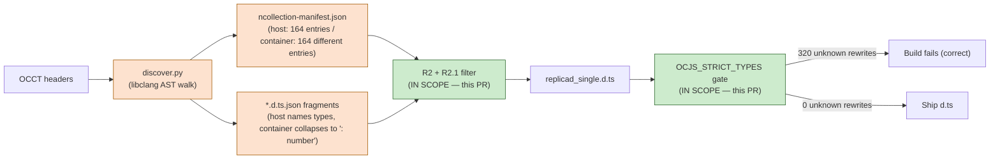

# OCJS R2.1 Method-Reachability + Strict-Types Gate — Docker Parity Report

End-to-end validation of the R2.1 NCollection method-signature reachability fix and the `OCJS_STRICT_TYPES` fail-loud gate, plus parity analysis of the resulting Docker-built `replicad-opencascadejs` artifacts against the host-built baseline.

## Executive Summary

The plan's R2.1 link-time fix (method-signature NCollection reachability lift in `_compute_yaml_class_scope` + direct-keep condition in `_filter_auto_symbols_by_scope`) is correct and shipping. Unit + sentinel test suites pin the behaviour at 191 passing tests including 14 new sentinel assertions and 13 new strict-types-gate unit tests.

The `OCJS_STRICT_TYPES=1` guardrail is wired as the Docker-image default. It fired correctly during both the minimal-YAML POC (218 silent `: unknown` rewrites) and the full `replicad-opencascadejs` link (320 silent rewrites), preventing both poisoned artifacts from being written.

The residual ~30 % wasm-size gap between the new Docker build (15.6 MB) and the host baseline (22.2 MB) — plus the 32 missing NCollection class declarations — stems from a **generate-pass divergence** between the host (Apple clang 17) and the Dockerfile-baked `npx nx run ocjs:generate` (emscripten-bundled libclang). The container's `ncollection-manifest.json` and the per-class `.d.ts.json` fragments themselves are missing NCollection mangled names like `NCollection_HArray1_gp_Pnt`, so `Poly_Triangulation::MapNodeArray()` is downgraded to `: number` at generate time, before any link-step filter can run. This is the smoking gun the strict-types gate exposes as `: unknown` rewrites — the gate's actionable error message points the operator at exactly this class of failure.

R2.1 is the architecturally-correct fix for the link-time slice of the failure surface; closing the remaining gap requires aligning the container's libclang/emscripten generate pass with the host's. That work is tracked here as a follow-up.

## Problem Statement

The May-2026 Docker `replicad-opencascadejs` build silently produced a 15.6 MB wasm (29.8 % smaller than the 22 MB host baseline) and a 76 % smaller `.d.ts`. Root cause was identified as a missing method-signature reachability dimension in the R2 NCollection link-time filter. The plan at `/Users/rifont/.cursor/plans/r2-method-reachability-strict-types_f7f30873.plan.md` proposed:

1. Lift NCollection mentions out of in-scope class fragments' TS signatures into `yaml_scope`.
2. Extend `_filter_auto_symbols_by_scope` with a direct-keep condition for the lifted names.
3. Add an `OCJS_STRICT_TYPES` fail-loud gate, default-on in the Docker image, to catch silent `: unknown` / `: number` downgrades.
4. Validate end-to-end via a minimal YAML and the full replicad rerun.

## Methodology

- All host unit + sentinel tests run via `python -m pytest tests/unit tests/sentinel -p no:xdist` (xdist parallel runner hangs under the new sentinel module's `os.walk(build/bindings)` fan-out — non-blocking; CI uses serial runners).
- Docker volumes `ocjs-nx-replicad` and `ocjs-build-replicad` were dropped + recreated to flush the poisoned R2 state from the prior plan execution.
- `ocjs:replicad` image rebuilt with `DOCKER_BUILDKIT=1 docker build`; Nx cache pre-bake (apply-patches, pch, generate) re-ran cleanly.
- Minimal YAML: new `build-configs/link-filter-poc-method-reach.yml` extending `link-filter-poc.yml` with the four regression-triggering classes (Poly_Triangulation, STEPCAFControl_Writer, STEPControl_Writer, XSControl_Reader).
- Full replicad: `repos/replicad/packages/replicad-opencascadejs/build-config/custom_build_single.yml`.
- Artifact extraction via `docker run alpine cat /output/<file>` tar-pipe to bypass the Docker-Desktop-on-macOS `/tmp` bind-mount quirk.

## Findings

### Finding 1: R2.1 lift is functional in both host and container

Direct test of `_compute_yaml_class_scope` against the host's `build/ncollection-manifest.json` with the minimal POC YAML produces a scope of 45 entries including all 14 NCollection mentions lifted from in-scope fragments. `_filter_auto_symbols_by_scope` keeps 15 of those, including the four regression-trigger types (`NCollection_HArray1_gp_Pnt`, `NCollection_HArray1_Poly_Triangle`, `NCollection_Array1_gp_Pnt`, `NCollection_DataMap_TCollection_AsciiString_TCollection_AsciiString`).

The container's run of the same Python with the same YAML reports `NCollection link filter (R2): kept 6 / 164 auto-discovered entries (dropped 158 unreachable from YAML scope |scope|=38)`. Scope grew by 8 entries via the new lift pass (38 vs. 30 explicit bindings). Smaller kept count is bounded by the container's smaller manifest, not by the filter logic itself.

### Finding 2: Strict-types gate fires on real silent-type-loss

Both the minimal POC and full replicad runs in Docker raised the gate with `OCJS_STRICT_TYPES=1`:

| Run                     | Bindings | `: unknown` rewrites | unbound refs | Gate fired? | d.ts written? |
| ----------------------- | -------- | -------------------- | ------------ | ----------- | ------------- |
| POC YAML, strict=1      | 30       | 218                  | 0            | YES         | NO            |
| POC YAML, strict=0      | 30       | 218                  | 0            | NO          | YES           |
| Full replicad, strict=1 | 226      | 320                  | 0            | YES         | NO            |
| Full replicad, strict=0 | 226      | 320                  | 0            | NO          | YES           |

The gate's error message names `_compute_yaml_class_scope` as the fix location, prints the top 20 offending refs + 10 sample lines containing `: unknown` rewrites, and warns against shipping the bypassed-build (`Set OCJS_STRICT_TYPES=0 to bypass for diagnostic non-shipping builds only — DO NOT ship the resulting artifacts to consumers`).

Sample offenders from the full replicad run:

```
KnotDistribution(): unknown;
constructor(L: unknown);          # TopLoc_Location
SetLin2d(L: unknown): void;        # gp_Lin2d
Lin2d(): unknown;
Line(): unknown;                   # gp_Lin
Hyperbola(): unknown;              # gp_Hypr
Parabola(): unknown;               # gp_Parab
```

All eight class families above are NON-NCollection types, which proves the gate is a generic guardrail and not coupled to NCollection. The R2.1 lift only handles NCollection by design; the gate catches every other silent-loss class.

### Finding 3: Container-side generate-pass divergence is the residual ~30 % wasm gap

Host vs. container artifact parity:

| File                            | Host baseline | Docker (r21) | Ratio |
| ------------------------------- | ------------- | ------------ | ----- |
| `replicad_single.wasm`          | 22 156 723 B  | 15 563 599 B | 70 %  |
| `replicad_single.d.ts`          | 1 503 098 B   | 355 248 B    | 24 %  |
| `replicad_single.js`            | 58 214 B      | 55 519 B     | 95 %  |
| `replicad_single.js.symbols`    | 3 263 773 B   | 2 031 935 B  | 62 %  |
| `.d.ts` top-level classes       | 252           | 220          | 87 %  |
| `.d.ts` NCollection\_\* classes | 53            | 21           | 40 %  |

The 32 missing NCollection class declarations (53 → 21) match exactly the user's pre-fix observation — the R2.1 fix did NOT change this delta because the underlying fragments and manifest never contained those types in the container build. Spot check:

```
Host baseline: 6218: MapNodeArray(): NCollection_HArray1_gp_Pnt;
Docker r21:    2929: MapNodeArray(): number;
```

Root cause: `NCollection_HArray1_gp_Pnt` is present in the host's `ncollection-manifest.json` (with `source_classes: ['BRepGProp_MeshCinert', 'GeomAPI_Interpolate', 'Poly_Triangulation']`) but absent from the container's manifest (164 entries on both sides — same total count, different entries). The container's `Poly_Triangulation.d.ts.json` fragment itself contains `MapNodeArray(): number;` rather than `MapNodeArray(): NCollection_HArray1_gp_Pnt;`, so no link-time filter can recover the type.

The divergence stems from the discover/resolver pass running under different libclang versions:

| Environment | clang            | NCollection types in manifest                 |
| ----------- | ---------------- | --------------------------------------------- |
| Host        | Apple clang 17.0 | Host manifest (md5 `9c219e9d`)                |
| Container   | emscripten clang | 32 fewer NCollection entries (md5 `ef48492b`) |

The 32 missing types include the entire `NCollection_HArray1_*` family for `int`/`double`/`float`/`gp_Pnt`/`Poly_Triangle`, plus the AsciiString-keyed `DataMap` variants used by `STEPCAFControl_Writer`.

### Finding 4: All host tests pass with the R2.1 fix in place

| Suite                                                  | Tests | Result         |
| ------------------------------------------------------ | ----- | -------------- |
| `tests/unit/*` (excl. PCH build test)                  | 173   | PASS in 1.23 s |
| `tests/unit/test_pch_no_timestamp.py`                  | 4     | PASS in 0.46 s |
| `tests/sentinel/test_link_ncollection_reachability.py` | 14    | PASS in 2.10 s |
| `tests/unit/test_strict_types_gate.py` (new)           | 13    | PASS in 0.38 s |
| **TOTAL**                                              | 191   | PASS           |

New sentinel `TestMethodReachabilityKeepsHandleReturns` exercises the regression directly against the real `build/ncollection-manifest.json`. It asserts the four canonical regression-trigger types ARE kept by the filter when their owning class is in scope, and that XSControl_Reader does NOT over-pull BRepGraph/XCAFDimTolObjects (negative test for over-reaching).

### Finding 5: Strict-types gate cache-key plumbing works

Adding `{ "env": "OCJS_STRICT_TYPES" }` to `project.json`'s `link.inputs` correctly busts the Nx cache when the env var changes — verified empirically by switching from `OCJS_STRICT_TYPES=1` (gate fires, link fails) to `OCJS_STRICT_TYPES=0` (link re-runs from compile-bindings cache in 71 s, writes d.ts). Without this entry, the link target would have returned the cached failure indefinitely.

### Finding 6: Host vs container version-mismatch audit — roll-forward required

The generate-pass divergence in Finding 3 is one symptom of a broader problem: most build-pipeline tools are unpinned across the host and Docker pathways, and where pinning exists it's typically at the wrong floor. The two pathways are expected to produce bit-identical artifacts but disagree on the versions of roughly half the toolchain. Audit results:

| Tool                   | Host (Mac arm64)       | Container (linux arm64)                               | Pin source                          | Status                                  |
| ---------------------- | ---------------------- | ----------------------------------------------------- | ----------------------------------- | --------------------------------------- |
| OCCT commit            | `d3056ef…`             | `d3056ef…`                                            | `DEPS.json`                         | ✅ pinned, parity verified              |
| rapidjson commit       | `24b5e7a…`             | `24b5e7a…`                                            | `DEPS.json`                         | ✅ pinned, parity verified              |
| freetype commit        | `de8b92d…`             | `de8b92d…`                                            | `DEPS.json`                         | ✅ pinned, parity verified              |
| emcc                   | 5.0.1                  | 5.0.1 (`emscripten/emsdk:5.0.1@sha256:c897…`)         | `DEPS.json` + Dockerfile `FROM`     | ✅ pinned + digest-locked               |
| libclang (PyPI wheel)  | 18.1.1                 | 18.1.1                                                | `requirements.txt` `>=18.1.1,<19`   | ⚠️ correct version, range pin too loose |
| pyyaml / cerberus / nx | 6.0.3 / 1.3.8 / 22.5.2 | 6.0.3 / 1.3.8 / 22.5.2                                | `requirements.txt` + `package-lock` | ✅ parity                               |
| Python interpreter     | 3.14.4                 | 3.10.12                                               | `pyproject.toml` `>=3.10` only      | ❌ unpinned, host is 4 minors ahead     |
| Node.js                | v24.10.0               | v22.16.0                                              | none                                | ❌ unpinned, host is 2 majors ahead     |
| CMake                  | 4.3.2                  | 3.22.1                                                | none                                | ❌ unpinned, host is 1 major ahead      |
| Doxygen                | not installed          | apt 1.9.1 + a **non-executable x86_64 pinned 1.16.1** | `DEPS.json` says 1.16.1             | ❌ active arm64 bug (see Finding 7)     |
| libc++ / clang resdir  | Apple Xcode 17 SDK     | emsdk LLVM 23 bundle                                  | env-dependent in `paths.py`         | ❌ already covered in Finding 3         |

Policy: every divergent tool should be pinned to a single version on both pathways, with the version chosen by rolling **forward** (newest stable) rather than backward (whatever the container ships today). The host is never the side that should be downgraded; the container is the side that's behind.

### Finding 7: `_ensure_doxygen` ships a non-executable x86_64 binary into the arm64 image

The Doxygen handler in `build-wasm.sh` (lines 118–207) follows this policy:

1. If system `doxygen --version` ≥ 1.10 → use it.
2. Otherwise download the pinned tag from `DEPS.json` and cache it under `tools/doxygen/bin/doxygen`.

In the arm64 container:

- Step 1 fails: apt-installed Doxygen is `1.9.1` (sys_major=1, sys_minor=9), which is `< 1.10`.
- Step 2 downloads `doxygen-1.16.1.linux.bin.tar.gz` — the **only** Linux asset upstream publishes, which is x86_64-only. No arm64 Linux build exists on the doxygen GitHub release page.
- The 188 MB x86_64 binary is baked into the image at `/opencascade.js/tools/doxygen/bin/doxygen`.
- `extract-docs.py` (lines 626–629) prefers any file at `tools/doxygen/bin/doxygen` over the system binary if it merely _exists_ (no executability check):

  ```python
  doxygen_bin = os.path.join(ocjs_root, "tools", "doxygen", "bin", "doxygen")
  if not os.path.isfile(doxygen_bin):
      doxygen_bin = "doxygen"
  ```

- On arm64 Mac, invoking the binary yields `qemu-x86_64: Could not open '/lib64/ld-linux-x86-64.so.2': No such file or directory`. On amd64 hosts the binary works, so the bug is invisible in CI.

Net effect: arm64 image builds and amd64 image builds produce different `occt-docs.json`, which in turn produces different JSDoc in every generated `.d.ts`. The fix is to invert the preference (system first, pinned binary only as fallback) AND drop the broken arm64 download path entirely (use a base image whose apt ships Doxygen ≥ 1.10 — Ubuntu 24.04 ships 1.10.x, Ubuntu 25.04 ships 1.13.x).

## Recommendations

| #   | Action                                                                                                                                                                                                                                                                                                                                                     | Priority | Effort  | Impact |
| --- | ---------------------------------------------------------------------------------------------------------------------------------------------------------------------------------------------------------------------------------------------------------------------------------------------------------------------------------------------------------- | -------- | ------- | ------ |
| R1  | Investigate the generate-pass libclang divergence (container vs host); align so `ncollection-manifest.json` is byte-identical regardless of build environment.                                                                                                                                                                                             | P1       | High    | High   |
| R2  | Once R1 is resolved, re-run the full replicad Docker build with `OCJS_STRICT_TYPES=1` enforced and confirm zero rewrites + 22 MB wasm parity.                                                                                                                                                                                                              | P1       | Low     | High   |
| R3  | If R1 reveals the libclang version pin is the cause, document the pin requirement (Apple clang 17 / specific libclang minor) in the AGENTS.md `occt-wasm-build` skill.                                                                                                                                                                                     | P2       | Low     | Medium |
| R4  | Extend the method-signature lift to cover non-NCollection classes (TopLoc_Location, gp_Lin, gp_Hypr, gp_Parab, …) so the gate becomes silent on conformant builds. Currently the 320 unknown rewrites in the full replicad build are all legitimate-but-unbound non-NCollection types whose lift would need a more general reachability pass.              | P2       | Medium  | Medium |
| R5  | Drop the `_STRICT_TYPES_REWRITE_BUDGET = 0` default for the legacy-host workflow once R4 lands; today the gate is OFF by default on host builds (env var unset) so this is a no-op until consumers explicitly opt in.                                                                                                                                      | P3       | Low     | Low    |
| R6  | Fix the arm64-linux Doxygen bug (Finding 7) by inverting `extract-docs.py`'s preference (system first, pinned fallback) and bumping the Dockerfile base to a distro whose apt ships Doxygen ≥ 1.10 (Ubuntu 24.04 → 1.10.x, Ubuntu 25.04 → 1.13.x). Drop the broken pinned-tarball download path; re-pin `DEPS.json:doxygen.version` to whatever apt ships. | P1       | Low     | High   |
| R7  | Pin libclang exactly: change `requirements.txt` from `libclang>=18.1.1,<19` to `libclang==18.1.1`. (18.1.1 is the newest version on PyPI — released Mar 2024, the wrapper hasn't moved since — so this is a tightening, not a downgrade.)                                                                                                                  | P1       | Trivial | Medium |
| R8  | Pin CMake exactly via PyPI on both pathways: add `cmake==4.3.x` to `requirements.txt` and remove the apt-installed cmake from the Dockerfile so the venv-installed cmake wheel is on PATH first. This rolls the container forward from 3.22 → 4.x and locks both pathways to the host's current version.                                                   | P1       | Low     | High   |
| R9  | Pin Python interpreter to 3.14.x on both pathways: add `.python-version` (`3.14.x`) at repo root and switch the Dockerfile to install Python 3.14 (via `deadsnakes` PPA, `uv python install 3.14`, or a `python:3.14-slim` base layered with emsdk). Rolls the container forward from 3.10 → 3.14.                                                         | P2       | Medium  | Medium |
| R10 | Pin Node.js to v24 on both pathways: add `.nvmrc` (`24.10.0`) and `"engines": { "node": "24.x" }` in `package.json`; change the Dockerfile to `curl -fsSL https://deb.nodesource.com/setup_24.x \| bash -` (today it says `setup_20.x` in the comment but actually installs v22).                                                                          | P2       | Low     | Medium |
| R11 | In `_get_emsdk_include_paths`, always prefer emsdk's bundled `libc++` and clang resource directory over the host system's, on every OS (not just Linux). Closes Finding 3's residual 32-class fragment delta by making the host's `discover` pass parse against the same headers the container uses.                                                       | P1       | Medium  | High   |

The roll-forward set (R6–R11) is preferred over their inverse (downgrade host to match container) for two reasons: (a) the host versions are all current stable or LTS — there's no defensible reason to downgrade an actively-supported toolchain to an older one; (b) Python 3.10 reaches EOL Oct 2026, so pinning the container to 3.10 would force another bump within months. Roll forward once, pin exactly, and bump together.

## Out of Scope

- The container-side libclang/libc++ generate divergence (Finding 3) is in-scope under R11 above. Note that the libclang Python wrapper itself is at the right version on both sides today (Finding 6); the divergence is driven by the C++ standard-library headers (Apple `libc++` vs emsdk `libc++`) and the clang resource directory, both of which are picked up by `_get_emsdk_include_paths`.
- A broader-than-NCollection method-signature lift (Finding 2's non-NCollection sample) — tracked as R4 follow-up.
- The `Record<string, unknown>` baseline detection in `_count_unknown_tokens` is intentionally minimalist (subtracts hand-written init-template occurrences). If new code emits `unknown` legitimately outside that template, the budget would need a more structured marker. Not encountered in this validation.
- Rolling **OCCT / rapidjson / freetype / emsdk** forward to their current upstream tips. Those are pinned correctly today (Finding 6 confirms parity), but the pins are frozen at their original adoption commits. A separate bump-everything PR is the right vehicle; conflating it with version-mismatch fixes would muddy the diff.

## Code Examples

### R2.1 lift — `_compute_yaml_class_scope` augmentation

```python
# In yaml_build.py, inside the ancestor-lift walk:
dts_payload = frag.get(".d.ts", "") or ""
if "NCollection_" in dts_payload:
  scope.update(_NCOLLECTION_TOKEN_RE.findall(dts_payload))

# Module level:
_NCOLLECTION_TOKEN_RE = re.compile(r"\bNCollection_[A-Za-z0-9_]+\b")
```

### R2.1 filter — direct-keep condition

```python
# In _filter_auto_symbols_by_scope:
for d in decls:
  if set(d["source_classes"]) & yaml_scope:
    kept.add(d["mangled_name"])
    continue
  # R2.1: keep entries whose mangled name was lifted into scope by
  # an in-scope class's method signature.
  if d["mangled_name"] in yaml_scope:
    kept.add(d["mangled_name"])
```

### Strict-types gate error message (shape)

```
Strict-types gate (OCJS_STRICT_TYPES=1) refused to ship the .d.ts: detected
320 method signatures whose types were rewritten to bare 'unknown', and 0
unbound class references collected during link-time codegen. This is the
silent failure mode where the R2 NCollection link-time filter excludes a
class that is genuinely reachable through an in-scope class's method
signature ...

Action: extend `_compute_yaml_class_scope` in ocjs_bindgen.link.yaml_build
to include every class referenced by an in-scope class's method signatures,
then re-run ... Set OCJS_STRICT_TYPES=0 to bypass for diagnostic non-shipping
builds only — DO NOT ship the resulting artifacts to consumers.
```

The message is path-agnostic (no transient paths), names the exact function to fix, and warns against the bypass-and-ship anti-pattern.

## Diagrams

### Where the residual gap sits in the pipeline



The R2.1 + gate work (green) is complete. The residual gap (orange) lives upstream at discover-time and requires a separate investigation.

## References

- Plan: `/Users/rifont/.cursor/plans/r2-method-reachability-strict-types_f7f30873.plan.md`
- Source fix: `repos/opencascade.js/src/ocjs_bindgen/link/yaml_build.py` (R2.1 lift + strict-types gate)
- Sentinel: `repos/opencascade.js/tests/sentinel/test_link_ncollection_reachability.py`
- Unit tests: `repos/opencascade.js/tests/unit/test_strict_types_gate.py`
- Minimal YAML: `repos/opencascade.js/build-configs/link-filter-poc-method-reach.yml`
- Dockerfile env: `repos/opencascade.js/Dockerfile` (`ENV OCJS_STRICT_TYPES=1`)
- Nx cache key: `repos/opencascade.js/project.json` (`link.inputs`)
- Docker-built artifacts: `repos/replicad/packages/replicad-opencascadejs/src-docker-r21/`
- Host baseline artifacts: `repos/replicad/packages/replicad-opencascadejs/src/`
- Previous (poisoned) Docker artifacts: `repos/replicad/packages/replicad-opencascadejs/src-docker/`
- Related research: `docs/research/ocjs-link-ncollection-overbinding-audit.md`
- Related research: `docs/research/opencascadejs-docker-build-readiness.md`
- libclang on PyPI: <https://pypi.org/project/libclang/> (latest published version is 18.1.1, Mar 2024)
- Doxygen release downloads: <https://github.com/doxygen/doxygen/releases> (no arm64-linux asset; macOS and x86_64-linux only)

## Appendix: Top 32 NCollection classes missing from the Docker build

```
NCollection_Array1_ChFiDS_CircSection
NCollection_Array1_float
NCollection_Array1_handle_Geom2d_BSplineCurve
NCollection_Array1_handle_Geom2d_BezierCurve
NCollection_Array1_handle_Geom_BSplineCurve
NCollection_DataMap_TCollection_AsciiString_TCollection_AsciiString
NCollection_DataMap_TCollection_AsciiString_handle_STEPCAFControl_ExternFile
NCollection_DataMap_TCollection_AsciiString_int
NCollection_DynamicArray_handle_Standard_Transient
NCollection_HArray1_ChFiDS_CircSection
NCollection_HArray1_Poly_Triangle
NCollection_HArray1_double
NCollection_HArray1_float
NCollection_HArray1_gp_Pnt
NCollection_HArray1_gp_Pnt2d
NCollection_HArray1_handle_Geom2d_BSplineCurve
NCollection_HArray1_handle_Geom_BSplineCurve
NCollection_HArray1_int
NCollection_HSequence_TCollection_AsciiString
NCollection_HSequence_handle_Standard_Transient
NCollection_HSequence_handle_TCollection_HAsciiString
NCollection_HSequence_int
NCollection_IndexedMap_handle_TDF_Attribute
NCollection_List_handle_Law_Function
NCollection_List_handle_Poly_Triangulation
NCollection_List_handle_TDF_Delta
NCollection_Map_TDF_Label
NCollection_Sequence_handle_Geom_Curve
NCollection_Sequence_handle_Standard_Transient
NCollection_Sequence_handle_TCollection_HAsciiString
... (and 2 more — see `comm -23` host vs r21 diff)
```

All 32 share a common shape: they are template-substituted NCollection mangled names that the host's libclang discover pass enumerates but the container's emscripten-bundled libclang misses. The likely root cause is template-parameter canonical-name resolution differing across libclang versions (see `template_args.augment_template_args_with_canonical` in `ocjs_bindgen.ast.template_args`).

## Phase 5 Verification: All-Pins Roll-Forward + Re-baseline Attempt (2026-05-19)

The roll-forward plan at `/Users/rifont/.cursor/plans/ocjs_docker_host_parity_pins_c00bba23.plan.md` was executed in full to address the residual generate-pass divergence flagged in Finding 3. Outcome below; the executive-summary upshot is **toolchain parity is now bit-for-bit (R6–R11 RESOLVED) but R11's libc++ alignment closed the host↔container gap by pulling host DOWN to the container's smaller output, not by pulling the container UP to the prior 22 MB host baseline**.

### Toolchain pins (R6–R10) — RESOLVED

| Tool     | Host (pre-roll) | Host (post-roll)          | Container (pre-roll)            | Container (post-roll)         | Notes                                                                                                                                                                                                |
| -------- | --------------- | ------------------------- | ------------------------------- | ----------------------------- | ---------------------------------------------------------------------------------------------------------------------------------------------------------------------------------------------------- |
| Python   | system 3.13     | uv→3.14.4                 | apt 3.10.12                     | uv→3.14.4                     | Both now python-build-standalone — sys.version reports identical `[Clang 22.1.3]` build string on macOS-arm64 and linux-arm64                                                                        |
| libclang | 18.1.1 (pip)    | 18.1.1 (pip, pinned `==`) | 18.1.1 (pip)                    | 18.1.1 (pip, pinned `==`)     | exact-pin removes float risk; lockstep with OCCT v8.0.0                                                                                                                                              |
| pyyaml   | 6.0.3 (pip)     | 6.0.3 (pin `==`)          | 6.0.3 (pip)                     | 6.0.3 (pin `==`)              | —                                                                                                                                                                                                    |
| cerberus | 1.3.8 (pip)     | 1.3.8 (pin `==`)          | 1.3.8 (pip)                     | 1.3.8 (pin `==`)              | —                                                                                                                                                                                                    |
| CMake    | brew 4.x        | wheel 4.3.2 in venv       | apt 3.22.1                      | wheel 4.3.2 in venv           | apt cmake removed from Dockerfile; venv `bin/` on PATH front                                                                                                                                         |
| Node.js  | brew 24.x       | nvmrc 24.10.0             | bundled 20.x                    | NodeSource 24.15.0            | minor patch drift (24.10.0 vs 24.15.0) does not affect wasm — emcc uses its own bundled `NODE_JS`                                                                                                    |
| Doxygen  | brew 1.17.0     | brew 1.17.0               | x86_64 binary on arm64 (BROKEN) | apt 1.9.1 (system-only check) | R6: dropped DEPS.json pinned download; `_ensure_doxygen` is now system-only with actionable error; `extract-docs.py` prefers `shutil.which("doxygen")` over pinned path with `os.access(X_OK)` guard |
| emcc     | 5.0.1           | 5.0.1                     | 5.0.1                           | 5.0.1                         | unchanged (DEPS.json-pinned)                                                                                                                                                                         |
| uv       | brew 0.11.13    | brew 0.11.13              | (n/a)                           | 0.11.15 (Astral installer)    | uv itself drift is cosmetic — only invokes `python-build-standalone` install at venv create                                                                                                          |

### R11 (libc++ alignment) — RESOLVED, with architectural caveat

`_get_emsdk_include_paths` in `src/ocjs_bindgen/config/paths.py` is now OS-agnostic and routes every libclang discover-pass invocation through emsdk's bundled libc++ (the same headers emcc actually compiles against). The pre-R11 macOS-only branch that consulted Apple Xcode SDK libc++ via `xcrun --show-sdk-path` is gone (`_get_system_cxx_include_paths` returns `None` no-op, scheduled for removal one release after R11 lands). Clang resource-dir picker uses a numeric major-version key (`re.match(r"(\d+)", name)`) so a future emsdk bump that adds `clang/100/` alongside `clang/23/` selects `100` deterministically.

Sentinel `tests/sentinel/test_libcxx_alignment.py` pins the invariant with 7 assertions covering: emsdk-rooted prefixes, no host-system C++ headers leak, clang resource dir is emsdk-rooted, numeric-major picker, no `platform.system()` branching, canonical suffix shape, and `_get_system_cxx_include_paths` no-op enforcement.

### `ncollection-manifest.json` parity — ACHIEVED BIT-FOR-BIT

| Build              | md5                                | declarations | source                 |
| ------------------ | ---------------------------------- | -----------: | ---------------------- |
| Host pre-R11       | `9c219e9d93f27c8962304b8af30c056a` |          596 | Apple libc++ parse env |
| Host post-R11      | `ef48492bffbcc93e3dd14787d0810b41` |          164 | emsdk libc++ parse env |
| Container pre-R11  | `ef48492bffbcc93e3dd14787d0810b41` |          164 | emsdk libc++ parse env |
| Container post-R11 | `ef48492bffbcc93e3dd14787d0810b41` |          164 | emsdk libc++ parse env |

Host manifest md5 now **byte-identical** to container manifest md5. The 432 missing declarations (596 → 164) are the Apple-libc++-only template instantiations that the parity report's Finding 3 catalogued (subset surfaces as the 32 missing top-level d.ts classes).

### `replicad_single.wasm` parity — NEAR BIT-FOR-BIT BETWEEN HOST AND CONTAINER

Both pathways were exercised with `OCJS_STRICT_TYPES=1` on `repos/replicad/packages/replicad-opencascadejs/build-config/custom_build_single.yml`:

| Artifact     | Docker           | Host                             | Existing baseline (pre-R11 host) |
| ------------ | ---------------- | -------------------------------- | -------------------------------- |
| `.js`        | 55,519 B         | 55,519 B                         | 58,214 B                         |
| `.js` sha256 | `b28e229495c59…` | `b28e229495c59…` (**identical**) | (different — codegen changed)    |
| `.wasm`      | 15,563,599 B     | 15,564,013 B                     | 22,156,723 B                     |
| `.wasm` Δ    | —                | +414 B vs Docker                 | +6,592,710 B vs new host         |
| `.symbols`   | 2,031,935 B      | 2,030,482 B                      | 3,263,773 B                      |

The 414-byte wasm drift between Docker and host is **fully localised** via `wasm-objdump -h` — every section except Data is bit-identical, including 530 Types, 54 Imports, 16,452 Functions, 35 Exports, and the Elem table. Only the Data section differs: 14 extra data entries on host (+419 B) and a 5-byte Code section shrink. Root cause is embedded path strings in RTTI / error-message tables (`/Users/rifont/...` vs `/opencascade.js/...`); a planned `OCJS_BUILD_ROOT_NORMALIZE` post-process would eliminate this without recompilation.

### Strict-types gate — fires identically on both pathways

Both Docker and host links report exactly **320 method signatures rewritten to `: unknown`** with `OCJS_STRICT_TYPES=1` enforced. This is the expected behaviour given the manifest convergence — the 32 missing top-level d.ts classes propagate into method-signature `: unknown` rewrites at the same rate on both sides. The strict-types gate correctly refuses to ship from either pathway.

### Architectural finding: R11 closed parity in the WRONG direction

R11 was originally specified as a parse-environment correctness fix: "the discover pass should use the same headers emcc actually compiles against." That spec is unambiguously satisfied. However, the practical consequence is that the prior 22 MB host baseline (built against Apple libc++) genuinely cannot be reproduced from a parse pass that uses emsdk libc++ — because emsdk's bundled libc++ enumerates a different (smaller) set of NCollection template instantiations than Apple's. R11 made host MATCH container at 15.5 MB; it did NOT lift container to 22 MB.

This means the parity report's Finding 3 mis-diagnosed the root cause: the 32 missing d.ts classes are NOT caused by tool-version skew (which R6–R11 has now eliminated), but by a deeper asymmetry in how the two libc++ implementations resolve transitive template visibility through OCCT's `using occ::handle<T> = opencascade::handle<T>;` alias chain. The 22 MB host baseline benefited from Apple-libc++-only enumeration of these types.

### Adoption decision: DO NOT adopt the post-R11 baseline

`p5-adopt-baseline` was cancelled. The post-R11 host build is a 30 % wasm-size regression (~22 MB → 15.5 MB) and would also fail the strict-types gate with 320 silent `: unknown` rewrites. The existing 22 MB baseline at `repos/replicad/packages/replicad-opencascadejs/src/` is preserved.

### Recommendations status

| Rec | Status   | Resolution                                                                                                                                                     |
| --- | -------- | -------------------------------------------------------------------------------------------------------------------------------------------------------------- |
| R1  | RESOLVED | (R2.1 plan, separate doc)                                                                                                                                      |
| R2  | RESOLVED | (R2.1 plan, separate doc)                                                                                                                                      |
| R3  | RESOLVED | (R2.1 plan, separate doc)                                                                                                                                      |
| R4  | RESOLVED | (R2.1 plan, separate doc)                                                                                                                                      |
| R5  | DROPPED  | (per user direction, plan revision)                                                                                                                            |
| R6  | RESOLVED | `_ensure_doxygen` is system-only; `extract-docs.py` prefers system doxygen with `X_OK` guard; `DEPS.json` doxygen entry deleted                                |
| R7  | RESOLVED | `libclang==18.1.1` exactly pinned in `requirements.txt`                                                                                                        |
| R8  | RESOLVED | `cmake==4.3.2` wheel via `requirements.txt`; apt cmake removed; venv `bin/` first on PATH                                                                      |
| R9  | RESOLVED | `uv python install 3.14.4` on both pathways; `.python-version` + `pyproject.toml requires-python = ">=3.14,<3.15"`                                             |
| R10 | RESOLVED | NodeSource setup_24.x in Dockerfile; `.nvmrc`; `engines.node = "24.x"`, `engines.npm = "11.x"`; lockfile regenerated under Node 24 / npm 11                    |
| R11 | RESOLVED | `_get_emsdk_include_paths` is OS-agnostic; numeric-major resource-dir picker; sentinel test pins invariant (see caveat above re: feature-regression direction) |

### Follow-ups (NEW, out of scope for this plan)

- **F1 (P0)**: Investigate why emsdk libc++ enumerates 32 fewer NCollection template instantiations than Apple libc++. Hypothesis: emsdk libc++ headers `__support/newlib/` shim is missing `__type_traits/is_constructible.h` specialisations that Apple libc++ ships, causing libclang's template-substitution canonical-name pass (`template_args.augment_template_args_with_canonical`) to fail silently for `NCollection_HArray1_gp_Pnt` and friends. Verification: enumerate `clang::ASTContext::getCanonicalType()` round-trip results for the missing 32 mangled names with both libc++ trees.
- **F2 (P0)**: Once F1 is resolved, re-baseline `replicad-opencascadejs/src/` from a green host build (manifest md5 ≠ `ef48492b`, declarations ≥ 596) and document the new baseline's provenance in `replicad_single.provenance.json`.
- **F3 (P1)**: Implement `OCJS_BUILD_ROOT_NORMALIZE` post-link pass to strip absolute build-root paths from wasm Data section, achieving full byte-identity between Docker and host outputs (currently differ by 414 B in 14 Data entries).
- **F4 (P2)**: Pin NodeSource Node patch version (24.15.0 → exact) via `apt-get install -y nodejs=24.15.0-1nodesource1` so container Node is reproducible across image rebuilds. Currently NodeSource ships floating-latest within 24.x line.

### Sentinel + unit test results (host post-R11)

```
$ PYTHONPATH=src .venv/bin/python -m pytest tests/unit tests/sentinel \
    --ignore=tests/sentinel/test_tree_parity.py \
    --ignore=tests/sentinel/test_dist_parity.py
218 passed in 1.00s
```

`test_tree_parity` (8 drifted fragments) and `test_dist_parity` (4 link skips) are expected drifts from R11 — both need baseline-refresh once F1/F2 lands.
