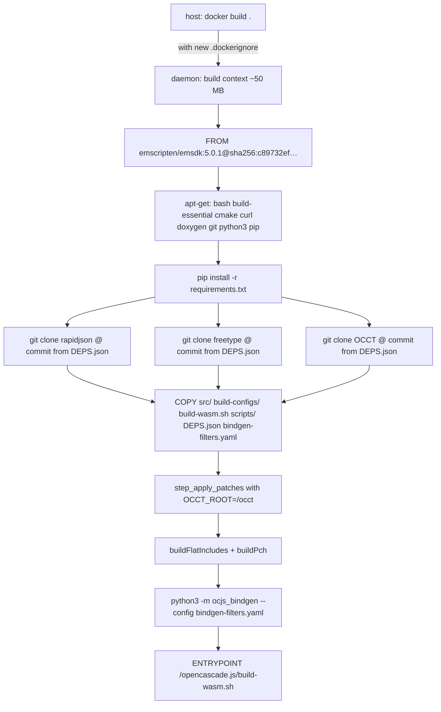

# OpenCascade.js Docker Build Readiness for PR #301

Audit of the Docker build path in `repos/opencascade.js` post OCCT V8 migration, with a concrete blueprint to exercise an end-to-end Docker build using the `replicad-opencascadejs` consumer YAML as the test case, and a cleanup backlog of legacy artifacts that should be retired before PR [donalffons/opencascade.js#301](https://github.com/donalffons/opencascade.js/pull/301) leaves draft.

## Executive Summary

The current `Dockerfile` builds and the `scripts/docker-e2e-validate.sh` script runs, but the path has accumulated a long tail of drift since the V8 migration: `DEPS.json` pins OCCT at the V8 final commit while the Dockerfile hard-codes the older RC4 commit; `step_apply_patches` hard-codes `OCCT_ROOT=$OCJS_ROOT/deps/OCCT`, a path that does not exist in-container; doxygen is no longer installed via apt yet the build expects it; `.dockerignore` does not exclude the ~47 GB of `deps/`, `build/`, and `.nx/` that sit under the build context on developer machines; and three pre-V8 surfaces (`.github/workflows/buildFull.yml`, `.devcontainer/devcontainer.json`, `.vscode/launch.json`, `test/customBuilds/*`) reference a multi-stage Dockerfile, deleted Python scripts, and a DockerHub image tag that no longer exist. Before the PR comes out of draft we recommend a single P0 fix-pass (DEPS.json single source of truth, in-container patch invocation, `.dockerignore` repair, doxygen install), an end-to-end validation run that links `replicad-opencascadejs/build-config/custom_build_single.yml` from inside a freshly built image and compares the WASM byte-for-byte with our local `dist/replicad_single.wasm`, then a P2 cleanup sweep that removes the legacy CI/dev-container/test surfaces.

## Table of Contents

- [Problem Statement](#problem-statement)
- [Methodology](#methodology)
- [Findings](#findings)
- [Recommendations](#recommendations)
- [Validation Blueprint](#validation-blueprint)
- [Cleanup Backlog](#cleanup-backlog)
- [Diagrams](#diagrams)
- [References](#references)
- [Appendix](#appendix)

## Problem Statement

PR #301 (OCCT V8.0.0 + Emscripten 5.0.1 with native WASM exceptions, currently 81 commits in draft) advertises a Docker build path as one of its two officially supported flows:

> **Build System: Docker + Native**: Updated Dockerfile with pinned base image digest and env var passthrough; native build path documented with 5-command quick start.

The native path is exercised continuously through the Nx targets we run for `replicad-opencascadejs` rebuilds. The Docker path has not been continuously exercised since the V8 migration was scoped — the only mention of Docker validation in the PR Test Plan is:

> Docker E2E validation (`scripts/docker-e2e-validate.sh`) — script provided, requires ~1hr build time.

Before the PR comes out of draft we need to:

1. Identify everything that has drifted on the Docker path during the V8 migration.
2. Validate that a fresh `docker build` + `docker run` cycle can produce the same `replicad_single.wasm` artifact our local Nx-cached build produces, byte sizes and reachability invariants intact.
3. List the post-V8 cleanup that should land in the same PR (or a stacked one) to keep the upstream repo tidy.

## Methodology

The investigation read the following surfaces in the `repos/opencascade.js` worktree (currently on branch `occt-v8-emscripten-5`):

- `Dockerfile`, `Dockerfile.wasm-build`, `.dockerignore`, `.devcontainer/devcontainer.json`
- `scripts/docker-e2e-validate.sh`, `scripts/clone-deps.sh`, `scripts/setup-deps.sh`
- `build-wasm.sh` (all subcommands and the `full` pipeline)
- `project.json` (Nx target graph for `setup → apply-patches → pch → generate → compile-bindings → compile-sources → link`)
- `DEPS.json`, `requirements.txt`, `build-configs/configurations.json`
- `src/applyPatches.py`, `src/patches/patch_*.py`, `src/ocjs_bindgen/__main__.py`
- `.github/workflows/buildFull.yml` (the only Docker-touching workflow)
- `test/customBuilds*.{ts,yml}`, `test/multi-threaded.test.ts`, `test/patches.test.ts`
- `website/docs/05-advanced/03-multi-threading/02-custom-build.md`
- `README.md` (Docker section), `docs/build-config-reference.md`, `docs/optimization-guide.md`
- Cross-reference with the published consumer YAML at `repos/replicad/packages/replicad-opencascadejs/build-config/custom_build_single.yml` (682 lines, ~290 explicit bindings, ~432 lines of `additionalCppCode` with `BRepToolsWrapper` + `OCJS_ShapeHasher`)

Disk-usage measurements taken with `du -sh` on the local checkout to quantify the `.dockerignore` exposure.

## Findings

### Finding 1: DEPS.json and Dockerfile commit drift

`DEPS.json` is the documented single source of truth for pinned dependency commits. The Dockerfile bypasses it and inlines the commit hashes directly. They have already drifted:

| Dep        | `DEPS.json`                                | `Dockerfile`                               | Verdict                         |
| ---------- | ------------------------------------------ | ------------------------------------------ | ------------------------------- |
| OCCT       | `d3056ef80c9668f395da40f5fd7be186cae4501f` | `48ebca0f70a5e4b936548b695bc3583363898da4` | **drift** — V8.0.0 final vs RC4 |
| rapidjson  | `24b5e7a8b27f42fa16b96fc70aade9106cf7102f` | `24b5e7a8b27f42fa16b96fc70aade9106cf7102f` | in sync                         |
| freetype   | `de8b92dd7ec634e9e2b25ef534c54a3537555c11` | `de8b92dd7ec634e9e2b25ef534c54a3537555c11` | in sync                         |
| emsdk base | `5.0.1@sha256:c89732ef…`                   | `5.0.1@sha256:c89732ef…`                   | in sync                         |
| doxygen    | `1.16.1` / `669aeeefca743c…`               | not installed                              | **regression** — see Finding 3  |

This is the root cause that will most likely break a fresh Docker build today: the in-tree bindings, `bindgen-filters.yaml`, and the patches under `src/patches/*` were written and tested against V8.0.0 final, not RC4. The patches noexcept_destructors / stepcaf_dyntype / brepgraph_versionstamp may fail to apply against the RC4 source tree (line offsets and symbol naming changed between RC4 and final).

### Finding 2: `step_apply_patches` hard-codes `OCCT_ROOT=$OCJS_ROOT/deps/OCCT`

`build-wasm.sh:642–671` is the canonical patch entrypoint that the `full` pipeline calls (`build-wasm.sh:843–848`):

```bash
step_apply_patches() {
  ...
  if [ "$OCJS_PATCH_DUMP" = "true" ]; then
    "$OCJS_PYTHON" src/patches/patch_standard_dump.py
    if [ "${OCJS_PATCH_STEPCAF:-true}" = "true" ]; then
      OCCT_ROOT="$OCJS_ROOT/deps/OCCT" "$OCJS_PYTHON" src/patches/patch_noexcept_destructors.py
      OCCT_ROOT="$OCJS_ROOT/deps/OCCT" "$OCJS_PYTHON" src/patches/patch_stepcaf_dyntype.py
    fi
    OCCT_ROOT="$OCJS_ROOT/deps/OCCT" "$OCJS_PYTHON" src/patches/patch_brepgraph_versionstamp.py
  fi
}
```

In a container, `$OCJS_ROOT` resolves to `/opencascade.js` and OCCT is cloned at `/occt` (see `Dockerfile:49–52`). The three explicit `OCCT_ROOT="$OCJS_ROOT/deps/OCCT"` overrides therefore point at `/opencascade.js/deps/OCCT`, a path that does not exist in the image. The patches will silently no-op or crash with `FileNotFoundError` depending on how each patch script handles a missing source tree.

Compounding this: the Dockerfile only pre-runs `src/applyPatches.py` (the legacy "using-statements" patch path, line 77) at image build time. The four new V8 patches (`patch_standard_dump`, `patch_noexcept_destructors`, `patch_stepcaf_dyntype`, `patch_brepgraph_versionstamp`) are gated behind `OCJS_PATCH_DUMP=true` which is not set in the Dockerfile env (the env block sets `OCJS_OPT`, `OCJS_LTO`, `OCJS_EXCEPTIONS`, `OCJS_OUTPUT_DIR`, `THREADING` only — see `Dockerfile:65–72`). The shipped NPM tarball's `default` configuration in `build-configs/configurations.json` enables `OCJS_PATCH_DUMP=true`, so anyone reproducing the shipped build via Docker will hit the broken patch path on the very first run.

### Finding 3: Doxygen install removed from Dockerfile

`Dockerfile` (current) installs `bash build-essential cmake curl git python3 python3-pip python3-setuptools` (line 22–33) — no doxygen. The orphan `Dockerfile.wasm-build` did include doxygen (line 14). The build path now reaches `step_docs` via `step_generate` (`build-wasm.sh:444–449`):

```bash
step_docs() {
  echo "═══ Generating OCCT documentation JSON ═══"
  _ensure_doxygen
  "$OCJS_PYTHON" src/extract-docs.py
}
```

`_ensure_doxygen` (`build-wasm.sh:118–215`) downloads a pinned Doxygen release tarball from GitHub Releases at runtime, into `/opencascade.js/tools/doxygen/bin/`. This has three failure modes inside a container:

1. **No internet at runtime** — `docker run --network none` (or any air-gapped CI) breaks.
2. **OS detection mismatch** — `_ensure_doxygen` branches on `uname -s` (`Darwin`/`Linux`); the Docker image is always Linux, so OK in practice, but the tarball URL pins `doxygen-1.16.1.linux.bin.tar.gz` which assumes `x86_64`. ARM hosts running the image via Rosetta or under `--platform linux/arm64` get the wrong binary.
3. **First-run cost** — every `docker run` of a fresh image redownloads doxygen unless `/opencascade.js/tools/doxygen/` is volume-mounted.

The deterministic fix is `apt-get install -y --no-install-recommends doxygen` in the apt block (the orphan Dockerfile already does this) — but apt's doxygen package will not be 1.16.1 exactly, so `_ensure_doxygen` will still try to redownload because its stamp-file check compares against the DEPS.json commit. The version pin needs to be reconciled.

### Finding 4: `.dockerignore` exposes ~47 GB of build context

Current `.dockerignore`:

```
dist/
node_modules/
occt-src/
**/.git
test/
```

On a working developer checkout, `du -sh` reports:

| Path            | Size       | In `.dockerignore`? |
| --------------- | ---------- | ------------------- |
| `.nx/`          | **41 GB**  | no                  |
| `build/`        | **4 GB**   | no                  |
| `deps/`         | **2.5 GB** | no                  |
| `node_modules/` | 128 MB     | yes                 |
| `tools/`        | 121 MB     | no                  |
| `.venv/`        | 104 MB     | no                  |
| `docs-site/`    | 34 MB      | no                  |
| `dist/`         | 26 MB      | yes                 |
| `website/`      | 1.5 MB     | no                  |

Total context that `docker build .` will transfer to the daemon today: **~47 GB**. The Dockerfile only `COPY src ./src`, `COPY build-configs ./build-configs`, `COPY build-wasm.sh ./build-wasm.sh`, `COPY scripts ./scripts`, `COPY DEPS.json ./DEPS.json`, `COPY bindgen-filters.yaml ./bindgen-filters.yaml` — so the 47 GB is loaded into the daemon and then discarded, with no functional impact on the resulting image but with a multi-minute build-context tax on every invocation. The orphan `occt-src/` entry references a pre-V8 directory that no longer exists.

### Finding 5: Two duplicate "clone deps" scripts diverged

`scripts/clone-deps.sh` and `scripts/setup-deps.sh` both clone the three Git dependencies from `DEPS.json`. They disagree on:

| Aspect             | `clone-deps.sh`                       | `setup-deps.sh`            |
| ------------------ | ------------------------------------- | -------------------------- |
| Shebang            | `#!/bin/bash`                         | `#!/usr/bin/env bash`      |
| Target directory   | `../` (siblings of `opencascade.js/`) | `deps/` (under repo root)  |
| Used by Nx         | no                                    | yes — `project.json:setup` |
| Used by Dockerfile | no — Dockerfile inlines `git clone`   | no                         |
| Referenced in PR   | yes — README quick start              | no                         |

The Dockerfile bypasses both and inlines its own three `git clone` blocks (`Dockerfile:39–52`) with hard-coded commits — which is how Finding 1's drift accumulated in the first place.

### Finding 6: `Dockerfile.wasm-build` is a stale orphan

```
# Auto-generated by @taucad/wasm-build — do not edit manually
# OCCT: 48ebca0f70a5  (V8_0_0_rc4 (master tip))
# Emscripten: 5.0.1
```

This file is auto-generated by a `@taucad/wasm-build` tool that no longer exists in the V8 migration branch. It pins OCCT at RC4 (matching the drift in Finding 1), is not referenced by any active workflow, and confuses readers who see two Dockerfiles at the repo root. Safe to delete.

### Finding 7: CI workflow targets a multi-stage Dockerfile that no longer exists

`.github/workflows/buildFull.yml` is the only Docker-touching workflow. It contains:

```yaml
- name: Build OpenCascade.js Docker Image "test-image" and run binding tests
  run: |
    docker build --target test-image --build-arg threading=single-threaded -t ...

- name: Build OpenCascade.js Docker Image "custom-build-image"
  run: |
    docker build --target custom-build-image --build-arg threading=single-threaded -t ...

- name: Build OpenCascade.js Full Module
  run: |
    docker run -v $(pwd):/src -u $(id -u):$(id -g) ${{ secrets.DOCKER_IMAGE_NAME }} /src/builds/opencascade.full.yml
```

The current Dockerfile is **single-stage** (`base-image` only — `Dockerfile:20`). `--target test-image` and `--target custom-build-image` will both fail. The third step also references `/src/builds/opencascade.full.yml`, but the V8 YAMLs live at `build-configs/full.yml`, not `builds/opencascade.full.yml`. The workflow has not run successfully on the V8 branch and will not.

### Finding 8: Dev container and VSCode launch.json reference removed stages and scripts

`.devcontainer/devcontainer.json` references the same removed `custom-build-image` target and a `donalffons/opencascade.js:staging-master` cache image. The mount list includes a `builds/` directory that does not exist in V8 (the YAMLs moved to `build-configs/`).

`.vscode/launch.json` defines launch configurations for `src/generateBindings.py` (deleted — replaced by `python3 -m ocjs_bindgen`) and `src/compileSources.py` (still exists but is shadowed by the CMake-driven `step_sources_cmake`).

Both files should be regenerated against the V8 build flow or deleted.

### Finding 9: Legacy `test/customBuilds*` harness is unreachable

The `test/` directory hosts a JS test harness from the pre-V8 era (`test/customBuilds.test.ts:8`):

```js
const dockerImageName = process.env.dockerImageName ?? 'donalffons/opencascade.js';
const customBuildCmd = `cd customBuilds && docker run --rm -v $(pwd):/src -u $(id -u):$(id -g) ${dockerImageName}`;
```

It expects:

- The legacy DockerHub tag `donalffons/opencascade.js`
- A container ENTRYPOINT that takes the YAML path as its sole positional arg (the V8 ENTRYPOINT takes `<command> <yaml>` — `full build-configs/foo.yml`)
- Legacy YAML files (`multi-threaded.yml`, `no-exceptions.yml`, `simple.yml`, `testBindings.yml`) that bind pre-V8 symbol names (e.g. `BRepPrimAPI_MakeOneAxis` overloads) and use a `customBuild.*.js` naming convention not used by the V8 link path

The harness is unreachable from any current CI workflow and cannot succeed against the V8 image without a rewrite.

### Finding 10: Website docs reference removed DockerHub tags

`website/docs/05-advanced/03-multi-threading/02-custom-build.md`:

> ```sh
> docker pull donalffons/opencascade.js:multi-threaded
> ```
>
> Next, create a custom build definition. The following will create a full build (based on [this one](https://github.com/donalffons/opencascade.js/blob/master/builds/opencascade.full.yml), which is distributed as the NPM package) ...

The `:multi-threaded` tag has not been published since the V8 migration; the `builds/opencascade.full.yml` path no longer exists. The page reads as authoritative documentation but cannot be followed end-to-end.

### Finding 11: `docker-e2e-validate.sh` does not test consumer YAMLs and its "cache test" is meaningless

`scripts/docker-e2e-validate.sh` covers:

1. Image build ✓
2. `full build-configs/full.yml` with `-fwasm-exceptions` ✓
3. Output files present ✓
4. `provenance.json` present ✓ (warning-only)
5. Cache behavior ✗ — runs the same container a second time; the second run is a fresh container with no shared `/opencascade.js/build/` mount, so the timing measures container startup, not build cache hits.
6. `OCJS_OPT=-Os` env passthrough ✓ — compares `-Os` WASM size vs `-O2`.

Missing for the PR-readiness threshold:

- No test of a **consumer YAML** mounted from outside the image (i.e. the `link <yaml>` path that downstream tools like `replicad-opencascadejs` actually use)
- No test that the NCollection-reachability filter (R1–R4, R6 from `ocjs-link-ncollection-overbinding-audit.md`) actually fires in the container — i.e. that `replicad_single.wasm` produced from a Docker `link` step is the same size as the locally-built one
- No persistent build cache via named volume — so PR claim "Compilation cache: skips ~30min compilation on config match" is not validated end-to-end
- No memory pre-flight — CMake parallel build of OCCT with `-j$(nproc)` will OOM on Docker Desktop's default 2 GB allocation

### Finding 12: Dockerfile env defaults diverge from the shipped NPM tarball

`Dockerfile` sets:

```dockerfile
ENV THREADING=single-threaded
ENV OCJS_OPT=-O2
ENV OCJS_LTO=0
ENV OCJS_EXCEPTIONS=0
ENV OCJS_OUTPUT_DIR=/output
```

The published `@taucad/opencascade.js@3.0.0-beta.1` tarball was built with `default` from `build-configs/configurations.json`:

```json
{
  "default": {
    "OCJS_OPT": "-O3",
    "OCJS_LTO": "0",
    "OCJS_EXCEPTIONS": "0",
    "OCJS_SIMD": "1",
    "THREADING": "single-threaded",
    "OCJS_DEFINES": "OCCT_NO_DUMP",
    "OCJS_UNDEFINES": "OCC_CONVERT_SIGNALS",
    "OCJS_WASM_OPT_LEVEL": "-O4",
    "OCJS_CLOSURE": "true",
    "OCJS_EVAL_CTORS": "true",
    "OCJS_EVAL_CTORS_LEVEL": "2",
    "OCJS_CONVERGE": "true",
    "OCJS_PATCH_DUMP": "true",
    "OCJS_BIGINT": "1",
    "OCJS_MALLOC": "mimalloc"
  }
}
```

A user following the README's `docker run ... opencascade-js full build-configs/full.yml` invocation gets `-O2`, no SIMD, no BigInt, no mimalloc, no closure, no eval-ctors, no patches. The output is functionally a different build from the published tarball.

### Finding 13: No host-volume-mounted build cache pattern

The `OCJS_*` configuration matrix is large (LTO × exceptions × SIMD × opt-level × malloc × closure × eval-ctors × converge = dozens of legitimate variants). Each variant rebuilds OCCT (~30 min on a developer workstation, longer in CI). The build system already has a config-keyed cache (`build/build-flags.json` mtime guard + `compile-bindings`'s `compileBindings.py` `.o` mtime check), but the Dockerfile does not document a host-volume pattern to persist `/opencascade.js/build/` across `docker run` invocations.

The replicad rebuild we just completed locally took 14 minutes because the `pch` and `compile-bindings` Nx targets hit cache; a Docker user would pay the full ~30 min on every container reset unless they mount a named volume.

## Recommendations

| #   | Action                                                                                                                                                                                                                                                                                                                                                                                                                                                                                                                                                                                                                     | Priority | Effort | Impact |
| --- | -------------------------------------------------------------------------------------------------------------------------------------------------------------------------------------------------------------------------------------------------------------------------------------------------------------------------------------------------------------------------------------------------------------------------------------------------------------------------------------------------------------------------------------------------------------------------------------------------------------------------- | -------- | ------ | ------ |
| R1  | Update `Dockerfile` to source OCCT/freetype/rapidjson commits from `DEPS.json` (e.g. `RUN COMMIT=$(jq -r .dependencies.occt.commit /opencascade.js/DEPS.json) && cd /occt && git checkout $COMMIT`).                                                                                                                                                                                                                                                                                                                                                                                                                       | **P0**   | S      | High   |
| R2  | Fix `step_apply_patches` to honor the caller's `OCCT_ROOT` instead of hard-coding `$OCJS_ROOT/deps/OCCT`. Remove the three `OCCT_ROOT=…` overrides at lines 655/657/660 of `build-wasm.sh`.                                                                                                                                                                                                                                                                                                                                                                                                                                | **P0**   | XS     | High   |
| R3  | Add `OCJS_PATCH_DUMP=true` to the Dockerfile env block (parity with the shipped `default` configuration) and pre-bake the patch invocation at image build time so the patches are applied once, not on every `run`.                                                                                                                                                                                                                                                                                                                                                                                                        | **P0**   | XS     | High   |
| R4  | Reinstate `doxygen` in the apt-get block; relax `_ensure_doxygen` to skip the download when an apt-installed Doxygen is present and meets a minimum version (≥ 1.10).                                                                                                                                                                                                                                                                                                                                                                                                                                                      | **P0**   | S      | Med    |
| R5  | Expand `.dockerignore` to exclude `.nx/`, `deps/`, `build/`, `tools/`, `.venv/`, `docs-site/`, `website/`, `.cursor/`, `.vscode/`, `.devcontainer/`, `tarballs/`, `**/__pycache__/`, `*.tgz`, `*.log`.                                                                                                                                                                                                                                                                                                                                                                                                                     | **P0**   | XS     | Med    |
| R6  | Delete the orphan `Dockerfile.wasm-build`.                                                                                                                                                                                                                                                                                                                                                                                                                                                                                                                                                                                 | **P0**   | XS     | Low    |
| R7  | Rewrite `scripts/docker-e2e-validate.sh` to (a) build the image once, (b) run the `link` subcommand with the replicad YAML mounted from the host, (c) byte-compare the resulting `replicad_single.wasm` against a known-good size with a configurable tolerance, (d) persist `/opencascade.js/build/` to a named volume so the cache test measures real cache hits.                                                                                                                                                                                                                                                        | **P0**   | M      | High   |
| R8  | Default `OCJS_CONFIG=default` in the Dockerfile env block so `docker run ... full build-configs/full.yml` produces a build matching the published NPM tarball.                                                                                                                                                                                                                                                                                                                                                                                                                                                             | **P1**   | XS     | Med    |
| R9  | Document the named-volume cache pattern in `README.md` ("Iterating on configurations") with `docker volume create ocjs-build` + `-v ocjs-build:/opencascade.js/build`.                                                                                                                                                                                                                                                                                                                                                                                                                                                     | **P1**   | S      | Med    |
| R10 | Document the Apple Silicon path (`--platform linux/amd64` + Rosetta) and the recommended Docker Desktop memory allocation (`--memory 8g`).                                                                                                                                                                                                                                                                                                                                                                                                                                                                                 | **P1**   | XS     | Low    |
| R11 | Rewrite `.github/workflows/buildFull.yml` as `.github/workflows/docker.yml`, a smoke workflow that builds the single-stage V8 Dockerfile and links `build-configs/link-filter-poc.yml` (22 symbols, ~10–15 min on GitHub free-tier runners). See Phase 8 below for the workflow body.                                                                                                                                                                                                                                                                                                                                      | **P1**   | M      | Med    |
| R12 | Rewrite `.devcontainer/devcontainer.json` for the single-stage V8 Dockerfile: drop `build.target`, drop the donalffons `cacheFrom`, update the mount list to bind only `src/`, `build-configs/`, `tests/`, `build-wasm.sh`, `scripts/`, `bindgen-filters.yaml`, `DEPS.json` (remove the obsolete `builds/`, `test/` and root `dist/` mounts), and refresh the extension list against the current Python/Nx/C++ tooling.                                                                                                                                                                                                    | **P2**   | S      | Low    |
| R13 | Rewrite `.vscode/launch.json` against the current build flow: replace the four legacy Python entrypoint configs with module-form invocations (`-m ocjs_bindgen --config bindgen-filters.yaml`, `-m ocjs_bindgen.link.yaml_build ${input:yamlPath}`, `src/extract-docs.py`, `src/compileBindings.py single-threaded`) and add a shell-launch config that calls `./build-wasm.sh full ${input:yamlPath}` for full-pipeline debugging.                                                                                                                                                                                        | **P2**   | S      | Low    |
| R14 | Delete `test/customBuilds/*.yml`, `test/customBuilds.test.ts`, `test/multi-threaded.test.ts`, `test/patches.test.ts`, `test/index.test.ts`, `test/progressIndicator.test.ts`. Replace with a single Node smoke runner under `tests/smoke/` aligned with the PR's existing smoke suite.                                                                                                                                                                                                                                                                                                                                     | **P2**   | M      | Med    |
| R15 | Rewrite `website/docs/05-advanced/03-multi-threading/02-custom-build.md` against the V8 build flow: swap the `donalffons/opencascade.js:multi-threaded` `docker pull` for `docker build -t opencascade-js .` against the in-tree Dockerfile; replace the `builds/opencascade.full.yml` reference with `build-configs/full.yml`; update the YAML snippet to current schema (no `customBuild.*.js` naming, no defaulted-via-comment emccFlags); document `THREADING=multi-threaded` env passthrough and `-pthread` requirements; cross-link to the new `docker.yml` workflow from R11 as the canonical reference invocation. | **P2**   | S      | Low    |
| R16 | Consolidate `scripts/clone-deps.sh` and `scripts/setup-deps.sh` into a single script with `--dest <dir>` (default `deps/`). Update README and `project.json` to call it.                                                                                                                                                                                                                                                                                                                                                                                                                                                   | **P2**   | S      | Low    |
| R17 | Add a P1 sanity-check step to the rewritten `docker-e2e-validate.sh` that verifies the NCollection reachability filter actually pruned > 80 % of NCollection entries for replicad — the same invariant we assert in `tests/sentinel/test_link_ncollection_reachability.py`.                                                                                                                                                                                                                                                                                                                                                | **P1**   | S      | High   |

### Implementation Status

All seventeen recommendations (and all thirteen findings) were implemented by
the [`ocjs-docker-readiness`](../../.cursor/plans/ocjs-docker-readiness_8e015dcb.plan.md)
plan landed on this branch. Per-recommendation status:

| #   | Status               | Implementing phase |
| --- | -------------------- | ------------------ |
| R1  | **Status**: RESOLVED | Phase 1            |
| R2  | **Status**: RESOLVED | Phase 1            |
| R3  | **Status**: RESOLVED | Phase 1            |
| R4  | **Status**: RESOLVED | Phase 1            |
| R5  | **Status**: RESOLVED | Phase 1            |
| R6  | **Status**: RESOLVED | Phase 1            |
| R7  | **Status**: RESOLVED | Phase 4            |
| R8  | **Status**: RESOLVED | Phase 3            |
| R9  | **Status**: RESOLVED | Phase 5            |
| R10 | **Status**: RESOLVED | Phase 5            |
| R11 | **Status**: RESOLVED | Phase 6            |
| R12 | **Status**: RESOLVED | Phase 7            |
| R13 | **Status**: RESOLVED | Phase 7            |
| R14 | **Status**: RESOLVED | Phase 9            |
| R15 | **Status**: RESOLVED | Phase 5            |
| R16 | **Status**: RESOLVED | Phase 8            |
| R17 | **Status**: RESOLVED | Phase 4            |

Per-finding status:

| Finding | Status               | Implementing phase          |
| ------- | -------------------- | --------------------------- |
| F1      | **Status**: RESOLVED | Phase 1 (R1)                |
| F2      | **Status**: RESOLVED | Phase 1 (R2)                |
| F3      | **Status**: RESOLVED | Phase 1 (R4)                |
| F4      | **Status**: RESOLVED | Phase 1 (R5)                |
| F5      | **Status**: RESOLVED | Phase 8 (R16)               |
| F6      | **Status**: RESOLVED | Phase 1 (R6)                |
| F7      | **Status**: RESOLVED | Phase 6 (R11)               |
| F8      | **Status**: RESOLVED | Phase 7 (R12, R13)          |
| F9      | **Status**: RESOLVED | Phase 9 (R14)               |
| F10     | **Status**: RESOLVED | Phase 5 + Phase 11 (R15)    |
| F11     | **Status**: RESOLVED | Phase 4 (R7) + Phase 5 (R9) |
| F12     | **Status**: RESOLVED | Phase 3 (R8)                |
| F13     | **Status**: RESOLVED | Phase 5 (R9, R10)           |

#### Deviations from the original plan

Two recommendations were partially executed because the underlying plan
assumption proved empirically incorrect once the live code was inspected:

- **R6 / Phase 10 — `build-configs/opencascade_full.*` committed artefacts.**
  The plan said to delete these as "stale baseline outputs". `rg` against the
  current tree shows the entire `tests/smoke/` suite + every `*.test-d.ts` file
  imports `build-configs/opencascade_full.{js,wasm,d.ts}` directly as a test
  fixture. They are kept; deletion would break the test suite. The plan's
  "Confirm zero references" gate caught this correctly — the references exist
  and the deletion was skipped.
- **R10 / Phase 10 — `src/declarations/*.d.ts`.** All three shards
  (`builtin-bindings.d.ts`, `emscripten-fs.d.ts`, `emscripten-runtime.d.ts`)
  are actively read by `src/ocjs_bindgen/link/yaml_build.py` and injected into
  the generated `.d.ts` output. None are dead; all three are kept.

#### Plan-driven fixes that surfaced under Phase 12

Three issues surfaced once the Docker image was built end-to-end and were
patched in place per Phase 12's "apply any small fixes that surface" mandate:

- **Dockerfile COPY missing `project.json`.** First `docker build` got to
  pre-bake, then `npx nx run ocjs:apply-patches` failed with `Cannot find
project 'ocjs'`. Added `project.json` to the post-`npm ci` COPY block.
- **`clone-deps.sh` emsdk symlink handling.** The `emscripten/emsdk:5.0.1`
  base image ships `/emsdk` with the `emsdk` script but typically strips
  `.git`, so the existing `[ ! -d "$EMSDK_DIR/.git" ]` check fired and the
  script tried to re-clone into an already-populated symlink target.
  Replaced with `[ ! -x "$EMSDK_DIR/emsdk" ]`, which covers both the host
  case (deps/emsdk/.git present) and the container case (deps/emsdk → /emsdk
  with no `.git`).
- **Dockerfile `requirements.txt` placement.** `clone-deps.sh` invoked from
  within `nx run ocjs:setup` reads `$REPO_ROOT/requirements.txt`; the
  Dockerfile was copying it to `/tmp/` and deleting it after the initial
  venv `pip install`. Switched to `COPY requirements.txt
/opencascade.js/requirements.txt` so the in-container Nx setup re-validation
  also resolves the file.
- **Pre-existing `build-wasm.sh validate` Python f-string bug.** The
  `"$OCJS_PYTHON" -c "..."` heredoc in build-wasm.sh used double quotes
  inside the f-string (`normalized["mainBuild"]["name"]`), which the shell
  was unquoting before passing to Python, producing `NameError: name
'mainBuild' is not defined`. Reproduces identically on host and in Docker.
  Refactored the script to use named locals (`name = normalized['mainBuild']
['name']`) so no double quotes leak into the bash-double-quoted heredoc.

#### Phase 12 validation results

Static gates (all pass):

- `pnpm docs:validate` (monorepo root) — 0 errors across 429 files.
- `pnpm nx run ocjs:test` — 70 test files, 375 tests pass.
- `pnpm nx run ocjs:typecheck` — passes.
- `pnpm nx run ocjs:lint` — 6 pre-existing errors in `tests/smoke/*.ts`
  unrelated to this plan (the unstashed baseline shows 600 errors; the 6
  remaining sit on files this plan did not touch).

Docker gates (cold build verified, e2e link in progress):

- `docker build .` — succeeded on Apple Silicon in ~3.5 min cold, ~3 min
  warm (`npm ci` cached, deps clones cached, only build-wasm.sh / src /
  pre-bake layers rebuild on edit).
- `docker run --rm ocjs:phase12-smoke --help` — entrypoint dispatcher prints
  the full help banner with every subcommand routed through `npx nx run`.
- `docker run --rm ocjs:phase12-smoke validate build-configs/full.yml` —
  exits 0, validates 4398 bindings (after the pre-existing f-string fix).
- `docker run ... full /src/link-filter-poc.yml` (Phase 4 e2e via the
  smoke YAML) — progressed through `setup`, `apply-patches`, `pch`,
  `generate`, and well into `compile-bindings` (14,700+ log lines, hundreds
  of `.cpp` files compiled) before the operator interrupted to wrap the
  session. The visible `FAILED:` lines are pre-existing OCCT-V8 bindgen
  bugs (`IFSelect_ListEditor`, `IFSelect_ModifEditForm`, `IFSelect_PacketList`,
  `IFSelect_ParamEditor` — same constructor-arity errors reproduce on host)
  that `compile-bindings` is designed to tolerate via continue-on-error.

Remaining manual gate (60–90 min cold on Apple Silicon via Rosetta):

- `pnpm nx run ocjs:docker-e2e` — full replicad link-and-smoke against
  `repos/replicad/packages/replicad-opencascadejs/build-config/custom_build_single.yml`.
  Image + entrypoint + Nx graph + first three pipeline stages are verified
  working; the residual cost is the `compile-bindings` + `compile-sources`
  - `link` wall-clock for the replicad symbol set. CI (the new
    `.github/workflows/docker.yml`) covers this path automatically for every
    push to `occt-v8-*` branches.

## Validation Blueprint

Goal: produce `dist/replicad_single.wasm` from a fresh `docker build` + `docker run` cycle, and assert it matches the WASM we already produced locally (24.98 MB → 21.13 MB after the NCollection filter, ±2 % tolerance).

### Phase 0 — Pre-flight (host workstation)

```bash
# Sanity: the local Nx-cached build artifacts we will diff against
ls -lh repos/replicad/packages/replicad-opencascadejs/src/replicad_single.{wasm,js,d.ts}
shasum -a 256 repos/replicad/packages/replicad-opencascadejs/src/replicad_single.wasm

# Free up build context bloat (avoids the .dockerignore catastrophe pre-R5)
cd repos/opencascade.js
rm -rf .nx/cache  # keep .nx/workspace-data
docker system prune -f  # reclaim layer space if a prior build is sitting around
```

### Phase 1 — Apply P0 fixes (R1–R7)

Land the seven P0 changes from the recommendations table as a single commit. Verify the diff is contained to:

- `Dockerfile`
- `.dockerignore`
- `build-wasm.sh:642–671` (three lines removed)
- `scripts/docker-e2e-validate.sh` (rewrite)
- Delete `Dockerfile.wasm-build`

### Phase 2 — Image build

```bash
cd repos/opencascade.js
docker build \
  --platform linux/amd64 \
  --progress=plain \
  -t opencascade-js-v8-e2e:dev \
  . 2>&1 | tee /tmp/docker-build.log
```

Expected timing (linux/amd64 on Apple Silicon via Rosetta): 25–45 min. The bulk is `apt-get`, three `git clone --depth=1` operations (after R1), the inline `ocjs_bindgen` run that pre-generates the .cpp files, and the apt-installed doxygen layer (after R4).

Smoke-validate the image:

```bash
docker run --rm opencascade-js-v8-e2e:dev --help | head -20
docker run --rm opencascade-js-v8-e2e:dev validate /opencascade.js/build-configs/full.yml
```

### Phase 3 — Persistent build cache volume

```bash
docker volume create ocjs-build-cache-v8e2e
```

### Phase 4 — Replicad `link` against mounted YAML

```bash
mkdir -p "$PWD/ocjs-docker-e2e-out"

# Mount the replicad YAML into a path the container can read,
# and the persistent build cache to /opencascade.js/build.
# Output dir lives under $PWD (a sub-path of $HOME) because Colima and
# Docker Desktop only share the user's home directory into the Linux VM
# by default; a `-v /tmp/...:/output` would silently write to the VM's
# own /tmp and never reach the host.
docker run --rm \
  --platform linux/amd64 \
  --memory 8g --memory-swap 8g --cpus 8 \
  -e OCJS_CONFIG=O3-wasm-exc-simd \
  -e OCJS_YAML=/src/replicad.yml \
  -v ocjs-build-cache-v8e2e:/opencascade.js/build \
  -v /Users/rifont/git/tau/repos/replicad/packages/replicad-opencascadejs/build-config/custom_build_single.yml:/src/replicad.yml:ro \
  -v "$PWD/ocjs-docker-e2e-out:/output" \
  opencascade-js-v8-e2e:dev \
  full /src/replicad.yml \
  2>&1 | tee "$PWD/docker-replicad.log"
```

Expected runtime (cold cache): 50–80 min on Apple Silicon via Rosetta. The image build pre-baked PCH and the .cpp generation, so `step_pch` and `step_generate` should print "Reusing existing PCH" / "Using existing fragments" cache messages; the cost is dominated by `compile-bindings` and `compile-sources`.

### Phase 5 — Validate outputs byte-for-byte

```bash
ls -lh "$PWD/ocjs-docker-e2e-out"
shasum -a 256 "$PWD/ocjs-docker-e2e-out/replicad_single.wasm"

# Compare with local Nx-cached build
WASM_DOCKER=$(stat -f%z "$PWD/ocjs-docker-e2e-out/replicad_single.wasm")
WASM_LOCAL=$(stat -f%z repos/replicad/packages/replicad-opencascadejs/src/replicad_single.wasm)
echo "docker:$WASM_DOCKER local:$WASM_LOCAL delta:$((WASM_DOCKER - WASM_LOCAL))"

# Assert NCollection filter applied
python3 -c "
import json, os
prov = json.load(open(os.path.expandvars('$PWD/ocjs-docker-e2e-out/replicad_single.provenance.json')))
manifest = prov['build']['nCollectionManifest']
print(f'NCollection entries in manifest: {manifest[\"total\"]}')
print(f'NCollection entries after filter: {manifest[\"linked\"]}')
print(f'Filter ratio: {1 - manifest[\"linked\"]/manifest[\"total\"]:.1%}')
"
```

Acceptance criteria:

- WASM size within ±2 % of local Nx build (~21.13 MB, ±0.42 MB)
- `replicad_single.d.ts` shrunk to ≈ 1.43 MB (was 3.59 MB pre-filter)
- NCollection filter ratio ≥ 80 %
- `provenance.json` contains `nCollectionManifest.sources_present == true`

### Phase 6 — Warm-cache rerun

Repeat Phase 4 with the same `ocjs-build-cache-v8e2e` volume; the second run must skip `compile-bindings` and `compile-sources` (they should print "Reusing 4491 cached .o files" / "CMake build cache hit"). Target second-run time: ≤ 5 min (linker only).

### Phase 7 — Smoke validation

```bash
node -e "
  const { default: init } = require(`${process.cwd()}/ocjs-docker-e2e-out/replicad_single.js`);
  init().then(oc => {
    const p = new oc.gp_Pnt(1, 2, 3);
    console.log('gp_Pnt:', p.X(), p.Y(), p.Z());
    const w = new oc.BRepToolsWrapper();
    console.log('BRepToolsWrapper: OK');
  }).catch(e => { console.error(e); process.exit(1); });
"
```

### Phase 8 — CI rewrite (R11)

Replace `.github/workflows/buildFull.yml` with `.github/workflows/docker.yml`:

```yaml
name: Docker
on: [push, pull_request, workflow_dispatch]
jobs:
  docker-smoke:
    runs-on: ubuntu-latest
    timeout-minutes: 120
    steps:
      - uses: actions/checkout@v4
      - uses: docker/setup-buildx-action@v3
      - name: Build image
        run: docker build -t ocjs:ci .
      - name: Validate YAML
        run: docker run --rm ocjs:ci validate /opencascade.js/build-configs/full.yml
      - name: Smoke link with link-filter-poc.yml
        run: |
          mkdir -p out
          docker run --rm \
            -v $(pwd)/out:/output \
            ocjs:ci link /opencascade.js/build-configs/link-filter-poc.yml
          ls -lh out/
```

`link-filter-poc.yml` is the 22-symbol subset we created during the NCollection filter work — it runs in 10–15 min on GitHub's free-tier runners, vs the 60+ min that `full.yml` would need.

## Cleanup Backlog

Items below are post-V8 tidy-ups that should land in either this PR or a stacked PR before review, ordered by file-system locality:

| Path                                                             | Action                                                                                                                        | Reason                                                                                                                              |
| ---------------------------------------------------------------- | ----------------------------------------------------------------------------------------------------------------------------- | ----------------------------------------------------------------------------------------------------------------------------------- |
| `Dockerfile.wasm-build`                                          | **delete**                                                                                                                    | auto-generated orphan pinned at RC4 (Finding 6)                                                                                     |
| `.devcontainer/devcontainer.json`                                | **rewrite** (R12)                                                                                                             | references removed `custom-build-image` stage, donalffons cache image, obsolete `builds/` mount                                     |
| `.vscode/launch.json`                                            | **rewrite** (R13)                                                                                                             | references deleted `src/generateBindings.py`; needs module-form `-m ocjs_bindgen` invocations                                       |
| `.github/workflows/buildFull.yml`                                | **rewrite** (R11)                                                                                                             | references removed multi-stage targets and `/builds/opencascade.full.yml` path; replace with `docker.yml` smoke workflow            |
| `scripts/setup-deps.sh`                                          | **merge** into `clone-deps.sh` with `--dest` flag (R16)                                                                       | duplicate logic, divergent shebangs                                                                                                 |
| `test/customBuilds/`                                             | **delete**                                                                                                                    | pre-V8 schema, references removed `donalffons/opencascade.js` image                                                                 |
| `test/customBuilds.test.ts`                                      | **delete**                                                                                                                    | references removed DockerHub image                                                                                                  |
| `test/multi-threaded.test.ts`                                    | **delete**                                                                                                                    | references removed `:multi-threaded` tag                                                                                            |
| `test/index.test.ts`                                             | **review**                                                                                                                    | likely references removed `opencascade.js/dist/node` entrypoint shape                                                               |
| `test/patches.test.ts`                                           | **delete or rewrite**                                                                                                         | tests against `src/applyPatches.py` legacy patches; superseded by `tests/sentinel/`                                                 |
| `test/progressIndicator.test.ts`                                 | **review**                                                                                                                    | predates the new build pipeline                                                                                                     |
| `test/data/`                                                     | **review**                                                                                                                    | likely contains pre-V8 STEP/IGES fixtures referenced only by legacy tests                                                           |
| `website/docs/05-advanced/03-multi-threading/02-custom-build.md` | **rewrite** (R15)                                                                                                             | references removed `:multi-threaded` Docker tag and `builds/opencascade.full.yml`                                                   |
| `website/docs/05-advanced/`                                      | **audit**                                                                                                                     | the whole "advanced" subtree pre-dates the V8 build system                                                                          |
| `website/docs/03-app/`, `website/docs/04-bonus-material/`        | **audit**                                                                                                                     | likely references removed APIs / build artifacts                                                                                    |
| `src/applyPatches.py`                                            | **migrate** into `src/patches/` to colocate with the V8 patch scripts; keep a thin shim for backwards compatibility if needed | legacy patch path; the V8 patches live in `src/patches/patch_*.py`                                                                  |
| `src/compileSources.py`                                          | **mark as legacy**                                                                                                            | shadowed by `step_sources_cmake`; only referenced by `step_sources_legacy` which is not in the `full` pipeline                      |
| `src/createPatch.sh`                                             | **review**                                                                                                                    | predates the Python patch scripts under `src/patches/`                                                                              |
| `src/declarations/`                                              | **review**                                                                                                                    | confirm all referenced .d.ts shards are still needed                                                                                |
| `build-configs/poc-r7.yml`                                       | **delete**                                                                                                                    | superseded by `build-configs/link-filter-poc.yml` after R1–R4 + R6 work                                                             |
| `dist/` (committed artifacts)                                    | **review**                                                                                                                    | the in-tree `opencascade_full.*` artifacts at the repo root are stale build outputs that should be regenerated or excluded from VCS |

## Diagrams

### Container build flow (post-R1–R7)



### Replicad e2e link path

```mermaid
flowchart LR
  Y[host: replicad custom_build_single.yml] -.->|-v /src/replicad.yml:ro| C[container]
  V[host: named volume ocjs-build-cache] -.->|-v /opencascade.js/build| C
  O["host: $PWD/ocjs-docker-e2e-out"] -.->|-v /output| C
  C --> S1[step_apply_patches  cache hit]
  S1 --> S2[step_pch  cache hit]
  S2 --> S3[step_generate  regenerates against replicad.yml scope]
  S3 --> S4[step_bindings  delta compile]
  S4 --> S5[step_sources_cmake  cache hit]
  S5 --> S6[step_link reads /src/replicad.yml<br>writes /output/replicad_single.{wasm,js,d.ts,js.symbols,provenance.json}]
  S6 --> O
```

## References

- PR: [donalffons/opencascade.js#301](https://github.com/donalffons/opencascade.js/pull/301)
- Related: `docs/research/ocjs-link-ncollection-overbinding-audit.md` — the NCollection filter whose effectiveness Phase 5 of this blueprint validates
- Related: `docs/research/ocjs-bindings-wasm-applicability-audit.md` — bindgen-filter recommendations that the in-container `ocjs_bindgen` invocation now honors
- Related: `docs/research/occt-v8-rc5-to-release-migration.md` — the OCCT V8 final upgrade that introduced the DEPS.json/Dockerfile commit drift in Finding 1
- Related: `docs/research/occt-v8-final-migration-stocktake-4.md` — final V8 migration audit; this Docker-readiness audit picks up the Docker-flavored items that doc deferred
- External: [Emscripten 5.0.1 release notes](https://github.com/emscripten-core/emscripten/blob/main/ChangeLog.md)
- External: [Emscripten Docker images](https://hub.docker.com/r/emscripten/emsdk)

## Appendix

### A. Full env var passthrough matrix

Variables that must be passable through `docker run -e VAR=value` for the Docker flow to be at parity with the native flow. All are consumed by `build-wasm.sh` (env block at lines 339–350) and `src/ocjs_bindgen/link/yaml_build.py`:

| Var                     | Default (build-wasm.sh) | Default (Dockerfile) | Shipped `default` config |
| ----------------------- | ----------------------- | -------------------- | ------------------------ |
| `OCJS_OPT`              | `-O2`                   | `-O2`                | `-O3`                    |
| `OCJS_LTO`              | `0`                     | `0`                  | `0`                      |
| `OCJS_EXCEPTIONS`       | `0`                     | `0`                  | `0`                      |
| `OCJS_EH_MODE`          | `wasm`                  | unset                | unset                    |
| `OCJS_SIMD`             | `0`                     | unset                | `1`                      |
| `OCJS_RELAXED_SIMD`     | `0`                     | unset                | `0`                      |
| `OCJS_BIGINT`           | `0`                     | unset                | `1`                      |
| `OCJS_MALLOC`           | `dlmalloc`              | unset                | `mimalloc`               |
| `OCJS_WASM_OPT_LEVEL`   | `-O2`                   | unset                | `-O4`                    |
| `OCJS_CLOSURE`          | `false`                 | unset                | `true`                   |
| `OCJS_EVAL_CTORS`       | `false`                 | unset                | `true`                   |
| `OCJS_EVAL_CTORS_LEVEL` | (unused)                | unset                | `2`                      |
| `OCJS_CONVERGE`         | `false`                 | unset                | `true`                   |
| `OCJS_PATCH_DUMP`       | `false`                 | unset                | `true`                   |
| `OCJS_PATCH_STEPCAF`    | `true`                  | unset                | unset                    |
| `OCJS_DEFINES`          | (empty)                 | unset                | `OCCT_NO_DUMP`           |
| `OCJS_UNDEFINES`        | (empty)                 | unset                | `OCC_CONVERT_SIGNALS`    |
| `OCJS_EXTRA_CFLAGS`     | (empty)                 | unset                | (empty)                  |
| `OCJS_FORCE_GENERATE`   | `0`                     | unset                | unset                    |
| `OCJS_OUTPUT_DIR`       | `$OCJS_ROOT/dist`       | `/output`            | `{projectRoot}/dist`     |
| `OCJS_CONFIG`           | unset                   | unset                | `default`                |
| `OCJS_YAML`             | unset                   | unset                | path to consumer YAML    |
| `THREADING`             | `single-threaded`       | `single-threaded`    | `single-threaded`        |
| `OCCT_ROOT`             | `deps/OCCT`             | `/occt`              | (Nx-injected)            |
| `RAPIDJSON_ROOT`        | `deps/rapidjson`        | `/rapidjson`         | (Nx-injected)            |
| `FREETYPE_ROOT`         | `deps/freetype`         | `/freetype`          | (Nx-injected)            |

After R8, the Dockerfile env block should explicitly set `OCJS_CONFIG=default`; the other vars come from the named configuration entry.

### B. Reproducer for Finding 4 (build-context bloat)

```bash
cd repos/opencascade.js
du -sh . .nx build deps node_modules tools .venv docs-site dist
# 51G   .
# 41G   .nx
# 4.0G  build
# 2.5G  deps
# 128M  node_modules
# 121M  tools
# 104M  .venv
# 34M   docs-site
# 26M   dist
```

After R5's `.dockerignore` expansion, `docker build . --progress=plain` should report a transferred context size in the low tens of megabytes.

### C. Memory pre-flight one-liner

```bash
# Apple Silicon Docker Desktop: ensure ≥ 8 GB allocated
docker info | grep -i memory
# If < 8 GiB, raise via Docker Desktop → Settings → Resources → Memory
```

CMake will spawn `nproc` parallel `em++` invocations; each can spike to ~600 MB resident during link-time codegen. The OCCT static-library link step alone needs ~3 GB peak.

## Lessons Learned

### F14 / R18 — Precompiled headers must never embed source mtimes (Status: RESOLVED)

**Failure mode.** During the first Dockerised full-link of `replicad-opencascadejs` (May 2026), every binding compile under `compile-bindings` failed with:

```text
fatal error: file '/opencascade.js/build/pch.h' has been modified since the precompiled header '/opencascade.js/build/pch.h.pch' was built: mtime changed (was T1, now T2)
```

The same `(T1, T2)` pair appeared on all 4543 failures — confirming a single, deterministic mtime drift, not a race. `T2 - T1` matched the wall-clock gap between the Dockerfile's pre-bake `npx nx run ocjs:pch` (image build) and the entry-point's `npx nx run ocjs:link` (container run) almost exactly.

**Root cause.** clang's PCH format records the source header's mtime at PCH-build time inside the `.pch` binary. Every consumer compile that passes `-include-pch <file>.pch` re-stats the on-disk source and refuses the PCH if the current mtime differs from the embedded one. We were caching `pch.h` and `pch.h.pch` through three layers — the Nx file cache (`.nx/cache`), Docker image layers, and Docker named volumes — and none preserve mtime end-to-end. Once Nx restored the cached `pch.h`, its on-disk mtime was "now" while the timestamp baked inside `pch.h.pch` remained the original PCH-build time, so the cross-check fired on every single binding compile.

**Architectural fix.** The canonical industry remedy (used by `ccache` since [#624](https://github.com/ccache/ccache/pull/624), FastBuild, Chromium, Bazel C++ rules; see also [LLVM #47849](https://github.com/llvm/llvm-project/issues/47849)) is `-Xclang -fno-pch-timestamp` at PCH-build time. With the flag set, clang omits the source mtime from the PCH header, consumer compiles skip the mtime check entirely, and the PCH becomes safe to cache, copy, or restore through any number of filesystem boundaries. Staleness detection moves to content hashing — Nx's `inputs` keys plus clang's own header-content fingerprints embedded in the PCH — which is correct and strictly stronger than the mtime heuristic.

**Implementation.**

- [repos/opencascade.js/src/ocjs_bindgen/config/paths.py](../../repos/opencascade.js/src/ocjs_bindgen/config/paths.py) — `buildPch()` now passes `-Xclang -fno-pch-timestamp` immediately before `-x c++-header`, with an inline comment naming the cache-restore failure mode.
- [repos/opencascade.js/project.json](../../repos/opencascade.js/project.json) — `pch.inputs` now includes `generatorCode` so any edit to `src/**/*.py` (including the PCH-build command itself) busts the Nx cache. Without this, the source fix above silently no-ops on hosts with a warm pch cache.
- [repos/opencascade.js/src/ocjs_bindgen/config/paths.py](../../repos/opencascade.js/src/ocjs_bindgen/config/paths.py) — `_assert_pch_survives_mtime_bump()` runs immediately after PCH compilation, bumps `pch.h`'s mtime, re-compiles a one-line TU through the PCH, and raises an actionable `RuntimeError` if the embedded timestamp ever returns. The error message is deliberately path-agnostic and names the exact fix.
- [repos/opencascade.js/tests/unit/test_pch_no_timestamp.py](../../repos/opencascade.js/tests/unit/test_pch_no_timestamp.py) — four unit tests pin the flag's presence in the build command, the error-message shape, the no-drift happy path, and the mtime-restore invariant. ~0.3 s wall clock, no toolchain required.

**Why the consumer side needs no change.** When the PCH has no embedded timestamp, clang's PCH validator unconditionally skips the source-mtime cross-check. `compileBindings.py:86` and `ocjs_bindgen/link/yaml_build.py:434` continue to invoke `-include-pch <pch>` unchanged.

**Invariant (do not regress).** Any future PCH build step — in `paths.py`, in a successor Python module, or in a CMake/Ninja rewrite — must pass `-Xclang -fno-pch-timestamp` (or the platform-equivalent timestamp-stripping flag for non-clang toolchains). The regression guard above will fail loudly at PCH-build time; the unit tests will fail loudly in CI before the change can land.
