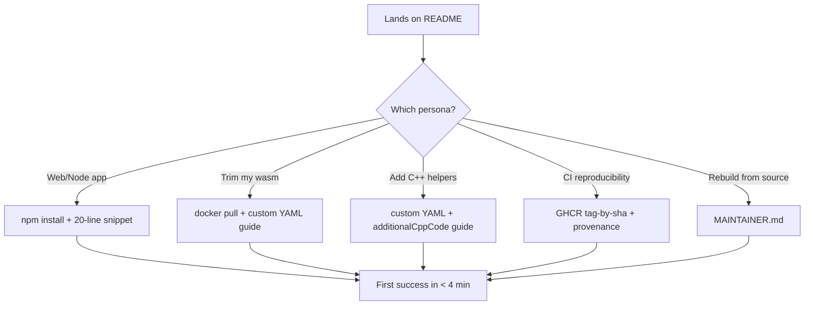
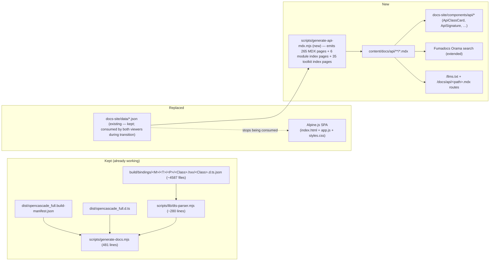
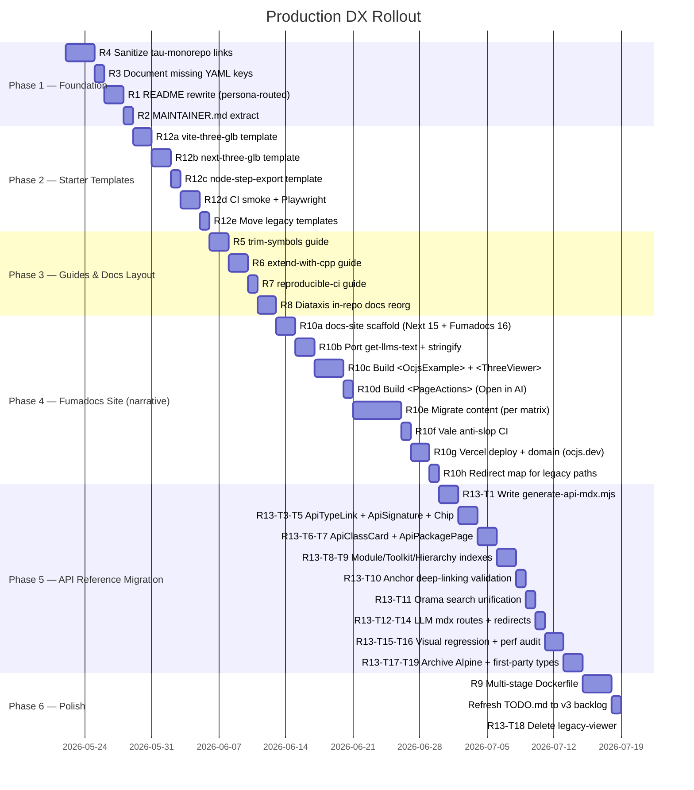

# OpenCascade.js Production DX Blueprint — Docker, README, Fumadocs Site, and v3 Starter Templates

Forward-looking blueprint to land `repos/opencascade.js` (taucad fork, v3 beta) as a **fully self-contained public OSS project**: production-ready Docker presentation, persona-routed README, complete YAML + C++ schema reference, a standalone Fumadocs documentation site built for the AI era, and three production-quality starter templates (Vite, Next, Node) covering the canonical export paths (GLB + three.js for the web; STEP on disk for Node). The taucad/tau monorepo is treated as a **detached upstream consumer** with **no link dependencies** flowing back into the fork — every reference inside the fork must stand on its own. Sister doc to [opencascadejs-docker-build-readiness.md](opencascadejs-docker-build-readiness.md), which captured the internal P0 build-correctness audit.

## Executive Summary

The build-correctness work is done — the Docker image builds reproducibly, ships multi-arch to GHCR, and matches host parity byte-for-byte. The **production-DX surface lags on six orthogonal axes**:

1. **Dockerfile is single-stage** (~3.6 GiB monolith) when the `clone-deps.sh` (7.84 GB) and `apply-patches + pch + generate` (3.64 GB) layers are independent and cache-keyed on different inputs.
2. **README is bimodal** (308 lines, no TOC) — every new user reads past "upgrading or fresh?" + "consumer or builder?" before reaching success.
3. **YAML schema reference is incomplete** — `additionalCppFiles`, `allowedUndefinedSymbols`, and the production-shipping `additionalBindCode` mechanism are absent or footnoted.
4. **No first-class narrative documentation site** — the `website/docs/**` tree is v1-era Docusaurus, contradicts the v3 README, and there is no AI-era discoverability surface (no `llms.txt`, no per-page `.md`, no search, no "Open in AI" actions).
5. **Starter templates are v2-beta** (suffixed APIs like `Perform_2`, CRA 5, Vue 2, webpack file-loader) — every example a new developer can clone is broken on v3.
6. **API reference (`docs-site/` Alpine.js viewer)** renders 4,587 bound classes / 53,572 search entries beautifully but lives on a separate origin, has no per-class URL, isn't indexed by any HTTP search, and is invisible to LLMs — the most valuable consumer asset is isolated from every consumer entry point.

Plus a cross-cutting hygiene gap: **seven internal tau-monorepo paths leak into the public fork** (README L208, BREAKING_CHANGES, `link-filter-poc.yml` header, OPTIMIZATION_ANALYSIS, experiments, 80+ source comments), all of which 404 on github.com/taucad/opencascade.js because **tau is a detached reference** — the fork must stand alone.

This blueprint prescribes:

- **Dockerfile**: refactor to three named stages (`deps-base`, `bindgen-base`, `final`) with explicit cache boundaries.
- **README**: rewrite to ≤200 lines, persona-routed "Choose your path" matrix at the top, TOC, three of the heaviest sections extracted to `MAINTAINER.md`.
- **YAML reference**: fill the three documented schema gaps; add a C++ extension decision tree.
- **Fumadocs site** (`docs-site/` — repurposed path): standalone Next.js 15 App Router app with Fumadocs 16, full Diataxis information architecture, Orama search, `llms.txt` + per-page `.md` for AI agents, "Open in ChatGPT/Claude/Cursor" actions, an `<OcjsExample>` MDX component for live OCCT examples, deployable as a Vercel/Netlify static export, salvages high-value content from the legacy `website/docs/**` while rewriting every page for v3.
- **API reference migration** (Alpine → Fumadocs): the existing `scripts/generate-docs.mjs` + `dts-parser.mjs` pipeline is preserved (it's the right tool for OCJS-bound shapes); 265 package shards become 265 MDX pages under `/docs/api/<module>/<toolkit>/<package>/` via a build-time generator; new `<ApiClassCard>`, `<ApiSignature>`, `<ApiInheritanceChip>`, `<ApiTypeLink>` MDX components port the Alpine viewer's UX into Fumadocs primitives; the 53,572-entry search index is unified into the same Orama instance that serves narrative search; every class gets a stable shareable URL with deterministic fragments; per-page `.mdx` exposes the full API surface to LLMs. `fumadocs-typescript` `<auto-type-table>` is used **selectively** for first-party OCJS package types (e.g., `init` signature, `Module` shape), not for bound OCCT classes.
- **Starter templates**: three new templates under `starter-templates/` (vite-three-glb, next-three-glb, node-step-export) with locked-down test plans that verify a visual GLB render (browser) or a STEP file on disk (Node).
- **Link sanitization**: every tau-monorepo path either inlined into the fork's own `docs/`, replaced with a one-paragraph self-contained summary, or deleted — **zero** links to tau from the fork.

`TODO.md` stays at repo root (consciously kept as a public backlog signal — see Trade-off TR4).

## Table of Contents

1. [Problem Statement](#problem-statement)
2. [Methodology](#methodology)
3. [Personas and Eigenquestions](#personas-and-eigenquestions)
4. [Findings](#findings)
   - [F1: Dockerfile is single-stage; layers are reuse-ready](#f1-dockerfile-is-single-stage-layers-are-reuse-ready)
   - [F2: README conflates consumer and maintainer paths](#f2-readme-conflates-consumer-and-maintainer-paths)
   - [F3: YAML schema documentation lags the code](#f3-yaml-schema-documentation-lags-the-code)
   - [F4: Three C++ extension mechanisms, zero decision guide](#f4-three-cpp-extension-mechanisms-zero-decision-guide)
   - [F5: Internal tau-monorepo paths leak into the public fork](#f5-internal-tau-monorepo-paths-leak-into-the-public-fork)
   - [F6: website/docs is v1-era Docusaurus with no AI-era surface](#f6-websitedocs-is-v1-era-docusaurus-with-no-ai-era-surface)
   - [F7: Starter templates are v2-beta and demonstrate obsolete patterns](#f7-starter-templates-are-v2-beta-and-demonstrate-obsolete-patterns)
   - [F8: Alpine.js API reference viewer is invisible to search, LLMs, and the narrative docs](#f8-alpinejs-api-reference-viewer-is-invisible-to-search-llms-and-the-narrative-docs)
5. [Recommendations](#recommendations)
6. [Proposed README Structure](#proposed-readme-structure)
7. [Proposed Dockerfile Multi-Stage Refactor](#proposed-dockerfile-multi-stage-refactor)
8. [Proposed `docs/` Layout (in-repo Markdown)](#proposed-docs-layout-in-repo-markdown)
9. [Fumadocs Site Blueprint (`docs-site/`)](#fumadocs-site-blueprint-docs-site)
   - [Site Architecture and Stack](#site-architecture-and-stack)
   - [Information Architecture](#information-architecture)
   - [AI-Era Discoverability Surface](#ai-era-discoverability-surface)
   - [MDX Component Inventory](#mdx-component-inventory)
   - [Content Migration Matrix (website/docs → docs-site)](#content-migration-matrix-websitedocs--docs-site)
   - [Hosting, CI, and Domain](#hosting-ci-and-domain)
   - [Voice and Anti-Slop Editorial Rules](#voice-and-anti-slop-editorial-rules)
10. [API Reference Migration (Alpine → Fumadocs)](#api-reference-migration-alpine--fumadocs)
    - [Why the Alpine Viewer Cannot Stay](#why-the-alpine-viewer-cannot-stay)
    - [Why `fumadocs-typescript` Alone Is the Wrong Answer](#why-fumadocs-typescript-alone-is-the-wrong-answer)
    - [Hybrid Architecture](#hybrid-architecture)
    - [URL Scheme and Stable Fragments](#url-scheme-and-stable-fragments)
    - [API MDX Component Contract](#api-mdx-component-contract)
    - [Generator Refactor](#generator-refactor)
    - [Search Unification (Orama)](#search-unification-orama)
    - [AI-Era Surface for the API Reference](#ai-era-surface-for-the-api-reference)
    - [Performance Budget](#performance-budget)
    - [Migration Task List](#migration-task-list)
11. [Starter Templates Blueprint (`starter-templates/`)](#starter-templates-blueprint-starter-templates)
    - [Template 1 — `vite-three-glb`](#template-1--vite-three-glb)
    - [Template 2 — `next-three-glb`](#template-2--next-three-glb)
    - [Template 3 — `node-step-export`](#template-3--node-step-export)
    - [Shared Canonical Patterns](#shared-canonical-patterns)
    - [Per-Template Test Plans](#per-template-test-plans)
    - [CI Smoke Strategy](#ci-smoke-strategy)
12. [Internal Link Sanitization Plan](#internal-link-sanitization-plan)
13. [Trade-offs](#trade-offs)
14. [Implementation Roadmap](#implementation-roadmap)
15. [References](#references)
16. [Appendix A: Docker Layer Audit](#appendix-a-docker-layer-audit)
17. [Appendix B: YAML Schema vs Code Reality](#appendix-b-yaml-schema-vs-code-reality)
18. [Appendix C: Fumadocs Component Catalog](#appendix-c-fumadocs-component-catalog)
19. [Appendix D: STEP / GLB Canonical Snippets](#appendix-d-step--glb-canonical-snippets)
20. [Appendix E: API Reference Schema Mapping (Alpine → Fumadocs)](#appendix-e-api-reference-schema-mapping-alpine--fumadocs)

## Problem Statement

With the GHCR publish workflow shipped (see `docker.yml`), opencascade.js can now be consumed three ways: npm (`@taucad/opencascade.js@beta`), pre-built Docker image (`ghcr.io/taucad/opencascade.js:beta`), and build-from-source. The fork is ready to absorb external traffic but the developer-facing presentation does not yet reflect that:

- The README is **308 lines** of mixed consumer + maintainer + reference content with no Table of Contents and no persona discriminator.
- The Dockerfile is single-stage; consumers downloading `:beta` pull 3.6 GiB even if they only need the consumer subset.
- The YAML schema reference omits production-relevant keys (`additionalCppFiles`, `allowedUndefinedSymbols`).
- Internal links break for anyone reading the fork on github.com.

This audit asks: **what does the first-five-minute onboarding experience look like for each persona, and where does it break?**

## Methodology

1. **Code archaeology**: read every file under `repos/opencascade.js/{Dockerfile,README.md,BREAKING_CHANGES.md,BUILD_SYSTEM.md,TODO.md,docs/,build-configs/,src/customBuildSchema.py,src/ocjs_bindgen/link/yaml_build.py}` and `website/docs/**`.
2. **Layer inspection**: `docker image inspect ocjs-vendored:latest` + `docker history` to enumerate layers, sizes, and chokepoints.
3. **Schema delta**: cross-referenced the Cerberus schema in `src/customBuildSchema.py` against the consumer-facing reference in `docs/build-config-reference.md`.
4. **External-link audit**: grep for `docs/research/` and tau-monorepo paths across all `*.md` files in the fork.
5. **Persona inventory**: parsed README "Projects Using opencascade.js" + BREAKING_CHANGES upgrade scenarios + `experiments/` directory to derive consumer archetypes.
6. **Policy alignment**: cross-referenced findings against [documentation-policy.md](../policy/documentation-policy.md) (pragmatic Diataxis, EPPO, llms.txt) and [library-api-policy.md](../policy/library-api-policy.md) (factory functions, flat options, presets for zero-config).

## Personas and Eigenquestions

Five distinct personas land on the opencascade.js README. Each has one **eigenquestion** that determines whether they continue or bounce.

| Persona                                     | Eigenquestion                                                           | Today's answer (and where they find it)                                                                                      | Target answer                                                                                  |
| ------------------------------------------- | ----------------------------------------------------------------------- | ---------------------------------------------------------------------------------------------------------------------------- | ---------------------------------------------------------------------------------------------- |
| **App developer** (web app, prototype)      | _"How do I render a box in 20 lines?"_                                  | README §Install — but ESM `locateFile` decision is forced before the snippet runs                                            | Quickstart with a single copy-paste TS snippet that includes Vite + Node `locateFile` together |
| **Library author** (downstream npm package) | _"How do I ship a smaller wasm with only the symbols my library uses?"_ | Fragmented across `docs/build-config-reference.md`, README §Customizing, `link-filter-poc.yml`                               | A single `guides/trim-symbols.mdx` end-to-end walkthrough with a starter YAML                  |
| **C++ extender**                            | _"Can I add my own helper functions / typedefs without forking?"_       | `docs/build-config-reference.md` documents `additionalCppCode` only; `additionalCppFiles` exists in code but is undocumented | `guides/extend-with-cpp.mdx` covering all three mechanisms with a decision tree                |
| **CI/reproducibility engineer**             | _"How do I pin a build that survives base-image updates?"_              | New GHCR tags exist (`:beta`, `:sha-<short>`) but the README mentions `:beta` only                                           | "Tags" section with pin-by-sha recommendation + provenance/SBOM note                           |
| **Source-build maintainer**                 | _"How do I rebuild the dep tree and run the bindgen locally?"_          | README §Quick Start (Native Build) + BUILD_SYSTEM.md                                                                         | `MAINTAINER.md` extracted out of README, linked from a single line                             |

**Decision routing principle:** the first paragraph after the H1 must contain a 4-row "Choose your path" matrix so persona 1 (the largest cohort) does not have to scan past persona 5's content to reach their snippet. This mirrors Stripe's gold-standard DX pattern called out in [documentation-policy.md §1](../policy/documentation-policy.md#1-framework-evaluation--rationale).



## Findings

### F1: Dockerfile is single-stage; layers are reuse-ready

**Severity: P1** — affects pull time, image size, and the cleanliness of the GHCR catalog.

The current Dockerfile is one `FROM emscripten/emsdk:5.0.1@sha256:c89732e…` stage with every layer baked in. `docker history` reports the two heaviest layers as **independent** of each other and independent of consumer YAML:

| Layer                                                                                                           | Size                       | Cache key                               | Independent?                |
| --------------------------------------------------------------------------------------------------------------- | -------------------------- | --------------------------------------- | --------------------------- |
| `RUN bash scripts/clone-deps.sh` (OCCT + rapidjson + freetype + LLVM 17 + pip deps)                             | 7.84 GB (dedup'd in final) | `DEPS.json`                             | Yes                         |
| `RUN npx nx run ocjs:apply-patches && pch && generate` (patched OCCT + flat includes + PCH + bindgen fragments) | 3.64 GB                    | bindgen source + `bindgen-filters.yaml` | Yes (depends on deps layer) |

These could be three published images:

1. **`ghcr.io/taucad/opencascade.js:deps-<DEPS.json-sha>`** — bumps only when `DEPS.json` changes (rare).
2. **`ghcr.io/taucad/opencascade.js:bindgen-<source-sha>`** — bumps when bindgen or filters change.
3. **`ghcr.io/taucad/opencascade.js:<version>`** — the consumer-facing image (current behavior).

For end users this is invisible (`docker pull` resolves the manifest list). For maintainers this means a Dockerfile change to a label or env var no longer triggers a 90-minute cold rebuild of the deps layer. For CI it means the smoke job can target `:deps-<sha>` and skip `clone-deps.sh` entirely (cuts the 25-minute first-cold-build to 8 minutes).

**Counterpoint:** the current Dockerfile uses BuildKit cache mounts + GHA cache backend, so cold-build cost is already amortized for CI. The split is mainly an image-catalog hygiene win and a "named base images that consumers can build FROM for their own custom Dockerfiles" win. Defer unless community demand materializes.

### F2: README conflates consumer and maintainer paths

**Severity: P0** — this is the bounce point for persona 1.

Current README flow (308 lines, no TOC):

```
L1-L18   Logo + badges                         (consumer)
L20-L31  What's New in v3                      (mixed)
L33-L71  Install + ESM snippets                (consumer — but forced to choose Node vs Vite mid-page)
L73-L100 Quick Start (Native Build)            (maintainer)
L102-180 Docker Build                          (mixed — consumer pull AND from-source)
L184-258 Build Configuration / YAML / env vars (maintainer + library author)
L268-280 Documentation links                   (all)
L292-300 Projects Using opencascade.js         (social proof)
```

A persona-1 web developer hits the Install snippet at line 36, but the snippet uses `import.meta.resolve` which silently fails for the most common bundler setups unless they read all of [BREAKING_CHANGES.md §A](../../repos/opencascade.js/BREAKING_CHANGES.md). A persona-2 library author has no top-of-page signal pointing at the trim-symbols workflow — they must scan past the Native Build instructions, the Docker Build instructions, and three subsections of YAML schema before reaching "Customizing Your Build" at line 244.

**Concrete drop-off:** the "lost in the middle" effect that [documentation-policy.md §1](../policy/documentation-policy.md#1-framework-evaluation--rationale) calls out — readers (human and LLM) lose information from the center of long contexts. A 308-line README without per-persona routing is a UX smoking gun.

### F3: YAML schema documentation lags the code

**Severity: P1** — affects persona 2 and persona 3.

| Key                                 | In `customBuildSchema.py` | In `docs/build-config-reference.md`                                                              |
| ----------------------------------- | ------------------------- | ------------------------------------------------------------------------------------------------ |
| `mainBuild`                         | ✓                         | ✓                                                                                                |
| `extraBuilds`                       | ✓                         | ✓ (one sentence)                                                                                 |
| `additionalCppCode`                 | ✓                         | ✓ (full section)                                                                                 |
| `additionalCppFiles`                | ✓                         | **✗ — undocumented**                                                                             |
| `generateTypescriptDefinitions`     | ✓                         | ✓                                                                                                |
| `mainBuild.allowedUndefinedSymbols` | ✓                         | **✗ — undocumented**                                                                             |
| `mainBuild.additionalBindCode`      | ✓                         | ✗ (one-line mention only; this is the mechanism `full.yml` actually uses for FairCurve wrappers) |

`additionalCppFiles` was discovered in `src/customBuildSchema.py` and `src/ocjs_bindgen/link/yaml_build.py:798-831`; the only usage in the entire tree is one experiment under `experiments/replicad-impact-poc/build-config/replicad-surface.yml`. It is a public, working API surface that is invisible to the consumer.

`allowedUndefinedSymbols` is plumbed straight through to `-Wl,--allow-undefined-symbol=...` — relevant whenever a consumer's custom C++ references a non-bound OCCT symbol.

### F4: Three C++ extension mechanisms, zero decision guide

**Severity: P1** — affects persona 3 (the C++ extender).

| Mechanism                      | What it does                                                          | When to use                                                         | Documented? |
| ------------------------------ | --------------------------------------------------------------------- | ------------------------------------------------------------------- | ----------- |
| `additionalCppCode` (root)     | Inline C++; auto-bound via libclang AST walk                          | Typedefs, small wrapper classes, namespaced helpers                 | ✓           |
| `additionalCppFiles` (root)    | List of `.cpp` paths; same auto-bind treatment as `additionalCppCode` | Large adapters, multi-file extensions                               | ✗           |
| `mainBuild.additionalBindCode` | Raw `EMSCRIPTEN_BINDINGS { … }`; no auto-bind                         | Manual embind for free functions, lambda wrappers, downcast helpers | Partial     |

A persona-3 developer reading the reference today learns about `additionalCppCode` and assumes that's the answer. They write a 600-line `additionalCppCode` blob. They later discover `additionalCppFiles` by accident. They never discover that `additionalBindCode` exists for the lambda-wrapper case they actually needed.

This violates [library-api-policy.md §15](../policy/library-api-policy.md#15-presets-for-zero-config) (presets for zero-config) — there is no preset path for the common cases.

### F5: Internal tau-monorepo paths leak into the public fork

**Severity: P1** — every link below 404s on github.com/taucad/opencascade.js.

| File                                      | Line     | Broken link                                                |
| ----------------------------------------- | -------- | ---------------------------------------------------------- |
| `README.md`                               | 208      | `docs/research/opencascadejs-docker-build-readiness.md`    |
| `BREAKING_CHANGES.md`                     | multiple | `../../docs/research/ocjs-rbv-*.md`                        |
| `build-configs/link-filter-poc.yml`       | header   | `docs/research/ocjs-link-ncollection-overbinding-audit.md` |
| `docs/OPTIMIZATION_ANALYSIS.md`           | 178      | `docs/research/wasm-size-analysis-*`                       |
| `experiments/build123d-vs-ocjs/README.md` | —        | `docs/research/build123d-vs-ocjs-wasm-performance.md`      |
| `src/ocjs_bindgen/**` comments (80+ hits) | —        | various `docs/research/ocjs-*`                             |

These paths resolve in the tau monorepo (where this audit lives) but produce 404s on the standalone fork. Two strategies:

1. **Inline-extract**: copy the research content into the fork's `docs/research/` directory. Maintenance burden: high (drift between forks).
2. **Linkify with public URLs**: rewrite as `https://github.com/taucad/tau/blob/main/docs/research/<file>.md`. Maintenance burden: low; breaks if tau is private.
3. **Sanitize**: remove the link entirely and inline a one-paragraph summary where the link was. Maintenance burden: none.

Recommend a hybrid: sanitize comments in source (option 3); rewrite README/BREAKING_CHANGES links to either inline summaries (option 3) or extracted standalone docs in the fork's `docs/` tree (option 1) on a case-by-case basis.

### F6: website/docs is v1-era Docusaurus with no AI-era surface

**Severity: P1** — affects every potential adopter who searches "opencascade.js docs" and lands on the old site, AND affects every AI agent (ChatGPT/Claude/Cursor/Codex) that ingests the site for code generation.

`website/docs/**` contains **31 files** (22 `.md` + 9 `_category_.json`, ~3,980 lines) authored as Docusaurus v1 content for the upstream `opencascade.js@beta` package. Two failure modes:

**1. Content drift from v3 reality:**

| Drift         | Location                                                | v1 says                                                                | v3 reality                           |
| ------------- | ------------------------------------------------------- | ---------------------------------------------------------------------- | ------------------------------------ |
| Package name  | every install snippet                                   | `opencascade.js@beta`                                                  | `@taucad/opencascade.js@beta`        |
| Symbol naming | `02-getting-started/01-hello-world.md`, `04-examples/*` | `Handle_TDocStd_Document_2`, `Perform_2`, `BRepMesh_IncrementalMesh_2` | suffix-free single-class API         |
| WASM loader   | `02-getting-started/02-configure-bundler.md`            | webpack file-loader                                                    | ESM `locateFile` + bundler `?url`    |
| Apple Silicon | `03-app-dev-workflow/03-custom-builds.md:105-107`       | `--platform linux/amd64` + Rosetta                                     | native arm64 (multi-arch GHCR)       |
| Exceptions    | `05-advanced/04-exceptions/02-catch-exceptions.md`      | exceptions are opt-in                                                  | v3 builds are exceptions-only        |
| Build flow    | `03-app-dev-workflow/02-pre-built.md`                   | DockerHub `opencascadejs/opencascadejs`                                | GHCR `ghcr.io/taucad/opencascade.js` |

**2. Zero AI-era discoverability:**

- No `llms.txt` index (Anthropic / OpenAI / Cursor ingestion standard).
- No `llms-full.txt` concatenated dump.
- No per-page `.md` raw markdown endpoint.
- No "Open in ChatGPT / Claude / Cursor" actions.
- Docusaurus client search is heavyweight and not LLM-friendly.

For a CAD library being adopted in 2026 — where most code-generation traffic flows through agents — this is a P1. The lowest-friction fix is **not** "archive the old site"; it is **replace with a Fumadocs site under `docs-site/`** built to AI-era standards from day one (see [Fumadocs Site Blueprint](#fumadocs-site-blueprint-docs-site) below). The old `website/docs/**` tree contains real salvage value — geometry examples, build-config walkthroughs, the boolean-logo demo — which the migration matrix in §9 catalogs explicitly.

### F8: Alpine.js API reference viewer is invisible to search, LLMs, and the narrative docs

**Severity: P1** — the comprehensive typedoc-equivalent surface exists but is isolated.

`repos/opencascade.js/docs-site/` ships a custom **two-mode static Alpine.js SPA** that renders the entire bound OCCT API:

| Surface metric                             | Value                                                                                                                            |
| ------------------------------------------ | -------------------------------------------------------------------------------------------------------------------------------- |
| Modules (top-level)                        | **6** (FoundationClasses, ModelingData, ModelingAlgorithms, ApplicationFramework, DataExchange, Visualization)                   |
| Toolkits                                   | **35**                                                                                                                           |
| Packages                                   | **265**                                                                                                                          |
| Classes documented                         | **4,587**                                                                                                                        |
| Flat search entries (class + member level) | **53,572**                                                                                                                       |
| Per-package JSON shards                    | **265** under `docs-site/data/`                                                                                                  |
| Source code                                | `index.html` (367 lines) + `app.js` (602 lines) + `styles.css` (946 lines), no build step                                        |
| Generator                                  | `scripts/generate-docs.mjs` (481 lines) + `scripts/lib/dts-parser.mjs` (~280 lines)                                              |
| Build input                                | `build/bindings/<Module>/<Toolkit>/<Package>/<Class>.hxx/<Class>.d.ts.json` + `dist/opencascade_full.{d.ts,build-manifest.json}` |
| Nx target                                  | `ocjs:docs` (generate) + `ocjs:docs-serve` (preview at `127.0.0.1:5174`)                                                         |

The viewer is sophisticated — it implements overload-grouped method cards, linkified type signatures (every `gp_Pnt` in a parameter type is a clickable cross-ref), JSDoc `{@link X}` prose resolution, platform-aware ⌘K/Ctrl-K search chord, deep-link history (`#Class__static__N` fragments + `history.state.ocjs` for hashless navigation), and lazy-fetched shard caching. It is **the best part of the current documentation** by a long way.

**Why P1:** the viewer is **completely disconnected** from every consumer entry point:

| Disconnect                                                                         | Consequence                                                                                  |
| ---------------------------------------------------------------------------------- | -------------------------------------------------------------------------------------------- |
| Lives on its own origin (separate static server, port 5174)                        | A reader on `ocjs.dev` cannot link into the API reference; site search doesn't span it       |
| No `llms.txt`, no per-page raw markdown                                            | LLM coding agents cannot ingest the API surface for code generation                          |
| Search index (53,572 entries) is in `data/index.json`, not exposed to any HTTP API | Can't be queried from outside the SPA                                                        |
| URLs are hash fragments inside one `index.html`                                    | No per-class SEO; no GitHub-style `/path/to/Class` deep links from blog posts or LLM prompts |
| Alpine.js client-rendering only                                                    | View source / Reader Mode / archive.org / wget show nothing                                  |
| No way to embed an `<ApiClassCard className="gp_Pnt">` inside a tutorial MDX page  | Narrative docs and reference docs are two separate worlds                                    |
| The 265 package shards exist as JSON but aren't routed                             | Each one COULD be a Fumadocs page; today they're invisible                                   |

This is exactly the kind of catalogue surface that benefits most from the AI-era features the new Fumadocs site brings — but only if it migrates _into_ the site rather than living alongside it. See [API Reference Migration (Alpine → Fumadocs)](#api-reference-migration-alpine--fumadocs) below.

### F7: Starter templates are v2-beta and demonstrate obsolete patterns

**Severity: P0** — these are the first thing a developer clones after the README, and every one of them is broken for v3.

`starter-templates/` contains **7 templates** (~70 source files):

| Template                           | Framework                            | Pinned ocjs version   | Last meaningful touch | Status                                                                                   |
| ---------------------------------- | ------------------------------------ | --------------------- | --------------------- | ---------------------------------------------------------------------------------------- |
| `ocjs-create-next-app-12`          | Next.js 12 (Pages router)            | `2.0.0-beta.c301f5e`  | 2023-03-22            | **Obsolete** — Next 12, v2 beta, suffixed API                                            |
| `ocjs-create-nuxt-app`             | Nuxt 3 package name + Vue 2.6 hybrid | `2.0.0-beta.c301f5e`  | 2023-03-22            | **Obsolete** — broken hybrid, v2 beta                                                    |
| `ocjs-create-react-app-5`          | CRA 5                                | `2.0.0-beta.c301f5e`  | 2023-03-22            | **Obsolete** — CRA itself is deprecated                                                  |
| `ocjs-create-react-app-typescript` | CRA 5 + TS                           | `2.0.0-beta.c301f5e`  | 2023-03-22            | **Obsolete** — same as above                                                             |
| `ocjs-create-react-app-web-worker` | CRA 5 + TS + Worker                  | `2.0.0-beta.c301f5e`  | 2023-03-22            | **Obsolete** — same as above                                                             |
| `ocjs-node`                        | Node ESM script                      | `^2.0.0-beta.4368ca8` | 2022-04-26            | **Obsolete + incomplete** — no STEP/GLB export, no README                                |
| `ocjs-vite-model-viewer`           | Vite 6 + TS                          | `^2.0.0-beta`         | 2026-03-08            | **Almost current** — but unpinned v2 beta, no README, exports STL while comment says GLB |

**Obsolete patterns present across the set:**

- `opencascade.js@beta` (upstream, not `@taucad/opencascade.js@beta`).
- `Perform_2`, `Handle_TDocStd_Document_2`, `BRepMesh_IncrementalMesh_2` suffixed dispatch (v3 collapsed these).
- `import initOpenCascade from "opencascade.js"` without `locateFile` (v3 requires explicit `locateFile`).
- `opencascade.js/dist/node.js` import path (v3 ships a single ESM `init` entry).
- Webpack `file-loader` for `.wasm` (Vite `?url`, Next asset modules, Node `import.meta.resolve` are the v3 idioms).
- No `using` disposable patterns (v3 ships RBV `Symbol.dispose` integration).
- No STEP export in any starter except partially via XCAF GLB pipeline.

**Production gap:** there is no Vite, Next App Router, or Node starter today that a developer can `degit` and run end-to-end on v3. See [Starter Templates Blueprint](#starter-templates-blueprint-starter-templates) for the replacement set.

## Recommendations

Prioritized by impact-on-DX × effort. P0 = blocks first impression; P1 = blocks persona-specific success; P2/P3 = polish. Effort scale: XS ≤ 1h, S ≤ 1d, M ≤ 3d, L ≤ 1w, XL ≤ 2w.

| #       | Action                                                                                                                                                                                                                                                                                                                                                                                                                                                                                                                                                                                                                                    | Persona            | Priority | Effort | Impact        |
| ------- | ----------------------------------------------------------------------------------------------------------------------------------------------------------------------------------------------------------------------------------------------------------------------------------------------------------------------------------------------------------------------------------------------------------------------------------------------------------------------------------------------------------------------------------------------------------------------------------------------------------------------------------------- | ------------------ | -------- | ------ | ------------- |
| **R1**  | Rewrite README with persona-routed "Choose your path" matrix at top + Table of Contents                                                                                                                                                                                                                                                                                                                                                                                                                                                                                                                                                   | 1, 2, 3, 4, 5      | **P0**   | M      | High          |
| **R2**  | Extract maintainer build-from-source content to `MAINTAINER.md`; README links in one line                                                                                                                                                                                                                                                                                                                                                                                                                                                                                                                                                 | 5                  | **P0**   | S      | High          |
| **R3**  | Document `additionalCppFiles`, `allowedUndefinedSymbols`, and `additionalBindCode` in `docs/build-config-reference.md`                                                                                                                                                                                                                                                                                                                                                                                                                                                                                                                    | 2, 3               | **P0**   | S      | High          |
| **R4**  | Sanitize **every** tau-monorepo link leak in the fork; tau is a detached upstream consumer with zero back-references — see [Internal Link Sanitization Plan](#internal-link-sanitization-plan)                                                                                                                                                                                                                                                                                                                                                                                                                                            | All                | **P0**   | M      | Medium        |
| **R5**  | Add `docs/guides/trim-symbols.md` — end-to-end "trim from full.yml to consumer YAML" workflow with size budget                                                                                                                                                                                                                                                                                                                                                                                                                                                                                                                            | 2                  | **P1**   | M      | High          |
| **R6**  | Add `docs/guides/extend-with-cpp.md` — decision tree across all three C++ mechanisms with one full example each                                                                                                                                                                                                                                                                                                                                                                                                                                                                                                                           | 3                  | **P1**   | M      | High          |
| **R7**  | Add `docs/guides/reproducible-ci.md` — pin-by-sha, provenance, SBOM verification for `:beta` consumers                                                                                                                                                                                                                                                                                                                                                                                                                                                                                                                                    | 4                  | **P1**   | S      | Medium        |
| **R8**  | Reorganize in-repo `docs/` to follow pragmatic Diataxis (`getting-started/`, `guides/`, `concepts/`, `reference/`)                                                                                                                                                                                                                                                                                                                                                                                                                                                                                                                        | All                | **P1**   | M      | Medium        |
| **R9**  | Multi-stage Dockerfile: `deps-base` + `bindgen-base` + `final`; optionally publish `:deps-<sha>` and `:bindgen-<sha>` alongside `:version`                                                                                                                                                                                                                                                                                                                                                                                                                                                                                                | 4, 5               | **P2**   | L      | Medium        |
| **R10** | **Build new `docs-site/` Fumadocs site** (Next.js 15 App Router + Fumadocs 16) to replace `website/docs/**`. Salvage v1 content per migration matrix, rewrite for v3, build to AI-era standards (`llms.txt`, per-page `.md`, "Open in AI" actions, Orama search, `<OcjsExample>` live MDX). See [Fumadocs Site Blueprint](#fumadocs-site-blueprint-docs-site)                                                                                                                                                                                                                                                                             | All                | **P1**   | **XL** | **Very High** |
| **R11** | _(dropped — `TODO.md` stays at repo root as a public backlog signal; see TR4)_                                                                                                                                                                                                                                                                                                                                                                                                                                                                                                                                                            | —                  | —        | —      | —             |
| **R12** | **Ship three v3 starter templates** under `starter-templates/` (`vite-three-glb`, `next-three-glb`, `node-step-export`) with locked-down test plans verifying visual GLB renders (browser) or STEP files on disk (Node); retire all seven v2-beta templates. See [Starter Templates Blueprint](#starter-templates-blueprint-starter-templates)                                                                                                                                                                                                                                                                                            | 1                  | **P0**   | **L**  | **Very High** |
| **R13** | **Migrate Alpine.js API reference into the Fumadocs site**. Keep `scripts/generate-docs.mjs` + `dts-parser.mjs` (they handle OCJS-bound shapes correctly where `fumadocs-typescript` would not); generate 265 MDX package pages under `/docs/api/`; build `<ApiClassCard>`/`<ApiSignature>`/`<ApiInheritanceChip>`/`<ApiTypeLink>` MDX components mirroring Alpine UX; unify the 53,572-entry search index into Orama; expose per-package raw markdown for LLM ingestion. Use `fumadocs-typescript` `<auto-type-table>` only for first-party OCJS package types. See [API Reference Migration](#api-reference-migration-alpine--fumadocs) | All (esp. 1, 2, 3) | **P1**   | **XL** | **Very High** |

**R10, R12, and R13 are upgraded from polish work to core deliverables** following user feedback. The detached-fork stance also escalates R4 from `S` to `M` because every internal reference must be **inlined-with-summary** or **deleted-with-deletion-justified**, not merely relinked to public URLs.

## Proposed README Structure

Target: **≤ 200 lines** (down from 308). Every section is single-purpose. First success path completes in ≤ 4 minutes for personas 1–4.

```markdown
# OpenCascade.js

> The OpenCascade CAD kernel compiled to WebAssembly — full TypeScript bindings, reproducible builds, multi-arch Docker images.

[badges: docker, ghcr, npm, license]

## Choose your path

| I want to…                               | Path                                                     | Time   |
| ---------------------------------------- | -------------------------------------------------------- | ------ |
| Render a box in my web app               | [Quickstart (npm)](#quickstart-npm)                      | 4 min  |
| Pull a pre-built image for CI            | [Quickstart (Docker)](#quickstart-docker)                | 2 min  |
| Ship a smaller wasm with only my symbols | [Guide: Trim symbols](docs/guides/trim-symbols.md)       | 30 min |
| Extend OCCT with my own C++              | [Guide: Extend with C++](docs/guides/extend-with-cpp.md) | 30 min |
| Reproduce a build in CI                  | [Guide: Reproducible CI](docs/guides/reproducible-ci.md) | 15 min |
| Build from source                        | [MAINTAINER.md](MAINTAINER.md)                           | 90 min |

## Quickstart (npm)

[2-paragraph install + 20-line TS snippet with `locateFile` that works for Node + Vite + Next, with explicit comments calling out each environment]

## Quickstart (Docker)

[5-line `docker pull` + `docker run` against full.yml; one paragraph linking to Tags section]

## Tags

[table of tag variants; pin-by-sha recommendation for production CI]

## What's New in v3

[5 bullets; link to BREAKING_CHANGES.md for upgrade detail]

## Documentation

- [docs/guides/](docs/guides/) — task-oriented how-tos
- [docs/build-config-reference.md](docs/build-config-reference.md) — YAML schema
- [BUILD_SYSTEM.md](BUILD_SYSTEM.md) — Nx targets and bindgen pipeline
- [BREAKING_CHANGES.md](BREAKING_CHANGES.md) — v3 migration guide
- [MAINTAINER.md](MAINTAINER.md) — building from source

## Projects Using opencascade.js

[unchanged; social proof]

## License

LGPL-2.1-only — see [LICENSE](LICENSE).
```

Sections from current README that move out:

- "Quick Start (Native Build)" → `MAINTAINER.md`
- "Build Configuration" → already in `docs/build-config-reference.md`, link from `MAINTAINER.md`
- "Customizing Your Build" → `docs/guides/trim-symbols.md`
- "Environment Variables" table → already in `BUILD_SYSTEM.md`, link from `MAINTAINER.md`
- "Build Commands" → `MAINTAINER.md`
- "Apple Silicon" subsection → redundant (multi-arch now); delete

## Proposed Dockerfile Multi-Stage Refactor

Three named stages with explicit `FROM …AS` declarations. Each stage is independently publishable to GHCR if/when CI is wired for it.

```dockerfile
# ─── Stage 1: deps-base (cache key: DEPS.json) ──────────────────────────────
FROM emscripten/emsdk:5.0.1@sha256:c89732e… AS deps-base
ARG REVISION
LABEL …
RUN apt-get install -y bash build-essential ca-certificates curl doxygen git \
                       gnupg jq libc6-dev unzip xz-utils
RUN curl -fsSL https://deb.nodesource.com/setup_24.x | bash - && \
    apt-get install -y --no-install-recommends nodejs
RUN curl -LsSf https://astral.sh/uv/install.sh | env UV_INSTALL_DIR=/usr/local/bin … && \
    uv python install 3.14.4
WORKDIR /opencascade.js/
RUN uv venv --python 3.14.4 /opencascade.js/.venv
RUN mkdir -p /opencascade.js/deps && ln -s /emsdk /opencascade.js/deps/emsdk
COPY DEPS.json requirements.txt scripts/clone-deps.sh /opencascade.js/
RUN bash scripts/clone-deps.sh --dest /opencascade.js/deps
RUN ln -s /opencascade.js/deps/OCCT /occt && \
    ln -s /opencascade.js/deps/rapidjson /rapidjson && \
    ln -s /opencascade.js/deps/freetype /freetype && \
    ln -s /opencascade.js/deps/llvm-17 /llvm-17

# ─── Stage 2: bindgen-base (cache key: src + bindgen-filters.yaml) ──────────
FROM deps-base AS bindgen-base
COPY package.json package-lock.json nx.json project.json /opencascade.js/
RUN --mount=type=cache,target=/root/.npm npm ci --no-audit --no-fund
COPY src ./src
COPY tsconfig.json* build-configs build-wasm.sh scripts bindgen-filters.yaml ./
RUN chmod +x build-wasm.sh scripts/*.sh
ENV OCCT_ROOT=/occt RAPIDJSON_ROOT=/rapidjson FREETYPE_ROOT=/freetype EMSDK=/emsdk
ENV OCJS_CONFIG=default OCJS_PATCH_DUMP=true OCJS_PATCH_STEPCAF=true
ENV OCJS_OUTPUT_DIR=/output OCJS_STRICT_TYPES=1
RUN mkdir -p build/bindings build/sources /output
RUN npx nx run ocjs:apply-patches && \
    npx nx run ocjs:pch && \
    npx nx run ocjs:generate

# ─── Stage 3: final (consumer-facing) ───────────────────────────────────────
FROM bindgen-base AS final
ARG VERSION
LABEL org.opencontainers.image.version="${VERSION}"
ENTRYPOINT ["/opencascade.js/scripts/docker-entrypoint.sh"]
CMD ["full", "build-configs/full.yml"]
```

**Properties:**

- `deps-base` is rebuilt only when `DEPS.json` or `clone-deps.sh` changes.
- `bindgen-base` is rebuilt when source or filters change; deps cache hit.
- `final` adds only labels + entrypoint; bindgen-base cache hit.
- Consumers `docker pull` only `final` — image size unchanged.
- Maintainers can `docker build --target deps-base` for fast iteration.
- CI can publish all three stages with `docker buildx bake` if the catalog hygiene is wanted.

**Counterargument** (revisit before implementation): the GHA cache + `cache-from`/`cache-to` already provide most of this benefit for CI. The multi-stage refactor is a code-clarity and maintainer-DX win more than a runtime win. Defer to **after** the README and docs work lands — that's where the user-visible impact is.

## Proposed Docs Layout

Apply pragmatic Diataxis from [documentation-policy.md §2](../policy/documentation-policy.md#2-pragmatic-diataxis). Target structure under `repos/opencascade.js/docs/`:

```text
docs/
├── getting-started/
│   ├── quick-start-npm.md          ← npm 20-line snippet
│   ├── quick-start-docker.md       ← docker pull + run
│   └── concepts.md                 ← how the build pipeline fits together (1 diagram)
├── guides/
│   ├── trim-symbols.md             ← R5
│   ├── extend-with-cpp.md          ← R6
│   ├── reproducible-ci.md          ← R7
│   ├── custom-emcc-flags.md        ← migrate from current optimization-guide.md
│   └── bundler-locatefile.md       ← Vite/Next/Node/Bun matrix
├── reference/
│   ├── yaml-schema.md              ← rename of build-config-reference.md, complete (incl. R3)
│   ├── configurations.md           ← link configurations.json → human-readable
│   └── env-vars.md                 ← extract from BUILD_SYSTEM.md
└── concepts/
    ├── two-channel-config-model.md ← extract from BUILD_SYSTEM.md §Architecture
    └── bindgen-pipeline.md         ← extract from BUILD_SYSTEM.md §Component Glossary
```

Each MDX/MD page satisfies EPPO ([documentation-policy.md §4](../policy/documentation-policy.md#4-page-self-containment-eppo)): self-contained, full imports in code, prerequisites linked. Frontmatter `description` populates `llms.txt` ([§5](../policy/documentation-policy.md#5-ai-agent-discoverability)).

## Fumadocs Site Blueprint (`docs-site/`)

The replacement for the v1 Docusaurus tree. **Target stack: Next.js 15 App Router + Fumadocs 16 + Tailwind v4 + Orama search**, deployed as a static export. Sits at `repos/opencascade.js/docs-site/`, deployed independently of the fork's npm artifact and the GHCR image. Domain proposal: **`ocjs.dev`** (new) or revive **`ocjs.org`** with a redirect-old-paths layer (see [Hosting, CI, and Domain](#hosting-ci-and-domain)).

This section is the deployable blueprint. Subsections cover architecture, IA, AI features, components, content migration, hosting, and editorial voice.

### Site Architecture and Stack

**Standalone, not co-located** — `docs-site/` lives inside the `repos/opencascade.js` repo so docs ship in lockstep with code, but is a self-contained Next.js app with its own `package.json`, `next.config.ts`, and deployment. Rationale:

| Aspect                    | Co-located in tau monorepo | **Standalone in fork (recommended)** |
| ------------------------- | -------------------------- | ------------------------------------ |
| Versioning with code      | Manual sync                | Automatic — same commit              |
| Reviewable PR-by-PR       | Mixed concerns             | Doc changes are self-contained PRs   |
| Detached-fork constraint  | Violates it                | Honors it                            |
| Build/deploy independence | Coupled to tau Netlify     | Independent CI                       |
| Ownership clarity         | Tau team                   | OCJS maintainer team                 |

**Pinned dependency floor** (mirrors tau's known-good production combination):

| Package               | Version              | Why                                                          |
| --------------------- | -------------------- | ------------------------------------------------------------ |
| `next`                | `^15.x`              | App Router stable, RSC, static export support                |
| `fumadocs-core`       | `^16.8.7`            | Loader API, llms.txt utilities, search adapters              |
| `fumadocs-ui`         | `^16.8.7`            | DocsLayout, Tailwind v4 preset, dark mode                    |
| `fumadocs-mdx`        | `14.3.2` (exact pin) | MDX 3 compiler, `defineDocs`, postprocess hooks              |
| `fumadocs-typescript` | `^5.2.6`             | `<auto-type-table>` from TS source — for binding type tables |
| `tailwindcss`         | `^4.x`               | Required by fumadocs-ui preset                               |
| `shiki`               | latest               | Syntax highlighting, used by Fumadocs and OpenAPI            |
| `react` / `react-dom` | `^19.x`              | Next 15 requirement                                          |
| `@orama/orama`        | latest               | Default Fumadocs search backend                              |

**Directory layout:**

```text
docs-site/
├── package.json
├── next.config.ts            ← withMDX(); transpile fumadocs-* if needed
├── tsconfig.json
├── source.config.ts          ← defineDocs(dir: 'content/docs') + remark plugins
├── tailwind.config.ts        ← uses fumadocs-ui preset
├── app/
│   ├── layout.tsx
│   ├── (home)/page.tsx       ← landing page
│   ├── docs/[[...slug]]/page.tsx     ← DocsLayout + page render
│   ├── api/search/route.ts            ← Orama search
│   ├── llms.txt/route.ts              ← getLlmRefText()
│   ├── llms-full.txt/route.ts         ← all pages joined
│   ├── docs/[[...slug]].mdx/route.ts  ← per-page raw .mdx
│   └── og/[...slug]/route.tsx          ← OG image generator
├── content/
│   └── docs/                 ← MDX content tree (see IA below)
├── components/
│   ├── ocjs-example.tsx      ← live OCCT example (lazy, ClientOnly)
│   ├── three-viewer.tsx       ← three.js GLB viewer
│   ├── mermaid.tsx             ← ported from tau
│   ├── page-actions.tsx        ← "Copy as Markdown", "Open in ChatGPT/Claude/Cursor"
│   └── tag-badge.tsx           ← GHCR tag pill
├── lib/
│   ├── source.ts                ← fumadocs-core/source loader
│   ├── get-llms-text.ts        ← ported from tau (Stripe-style llms.txt)
│   ├── llm-stringify-mdx.ts   ← ported; TypeTable/Mermaid → markdown
│   └── ocjs-init.ts             ← shared init helper for live examples
└── public/
    ├── opencascade_full.wasm    ← bundled for live examples (or CDN)
    └── og-image-default.png
```

**Generated `.source/` collection** is git-ignored — Fumadocs MDX vite plugin emits it on every build.

### Information Architecture

Pragmatic Diataxis per [documentation-policy.md §2](../policy/documentation-policy.md#2-pragmatic-diataxis). Persona-routed top-level. Each MDX page satisfies EPPO (self-contained, full imports, prerequisites linked). Frontmatter `description` populates `llms.txt`.

```text
content/docs/
├── meta.json                          ← root sidebar
├── index.mdx                          ← landing / persona router
├── getting-started/
│   ├── meta.json
│   ├── what-is-opencascade-js.mdx     ← 1-page concept (what + why + when)
│   ├── quick-start-npm.mdx            ← Quickstart — npm consumer (≤ 4 min)
│   ├── quick-start-docker.mdx        ← Quickstart — Docker consumer (≤ 2 min)
│   └── first-shape-tutorial.mdx       ← Tutorial — build a box, render in three.js
├── guides/
│   ├── meta.json
│   ├── bundler-locatefile.mdx         ← Vite / Next / Bun / Node matrix
│   ├── render-with-three-js.mdx       ← GLB pipeline + replicad-threejs-helper
│   ├── export-step.mdx                ← STEPControl_Writer + STEPCAFControl_Writer
│   ├── export-gltf.mdx                ← RWGltf_CafWriter + XCAF docs
│   ├── trim-symbols.mdx               ← R5 — trim full.yml to consumer YAML
│   ├── extend-with-cpp.mdx            ← R6 — decision tree across 3 mechanisms
│   ├── reproducible-ci.mdx            ← R7 — pin-by-sha, provenance, SBOM
│   ├── custom-emcc-flags.mdx          ← link-time flag recipes
│   ├── debugging-wasm-exceptions.mdx ← catch + diagnose WASM exception throws
│   └── multi-threading.mdx            ← pthread custom build (salvage from v1)
├── concepts/
│   ├── meta.json
│   ├── two-channel-config-model.mdx  ← compile-time OCJS_* vs link-time emccFlags
│   ├── bindgen-pipeline.mdx           ← libclang → embind → wasm-ld (with mermaid)
│   ├── ncollection-and-handles.mdx    ← OCCT handles, NCollection<T>, RBV
│   ├── memory-and-disposables.mdx    ← `using`, .delete(), pool, lifetime
│   └── architecture-diagram.mdx       ← interactive React Flow (port from tau)
├── reference/
│   ├── meta.json
│   ├── yaml-schema.mdx               ← R3 — complete schema; replaces docs/build-config-reference.md
│   ├── configurations.mdx             ← named compile-time profiles
│   ├── env-vars.mdx                   ← OCJS_* env var catalog
│   ├── cli-build-wasm.mdx             ← build-wasm.sh subcommands
│   └── docker-image.mdx               ← entrypoint, tags, OCI labels
├── api/                                ← Generated by R13; see §10 API Reference Migration
│   ├── meta.json                       ← Hand-written: ['index', '---Modules---', 'foundation-classes', ...]
│   ├── index.mdx                       ← API landing — <ApiHierarchyTree /> + manifest stats
│   ├── foundation-classes/
│   │   ├── meta.json                   ← Generated: toolkit list
│   │   ├── index.mdx                   ← Module summary + toolkit list
│   │   ├── tk-math/
│   │   │   ├── meta.json               ← Generated: package list
│   │   │   ├── index.mdx               ← Toolkit summary + package list
│   │   │   ├── gp.mdx                  ← Generated: <ApiPackagePage shardKey="..." />
│   │   │   ├── gce.mdx
│   │   │   └── ...                     ← (one MDX per package, ~13 in TKMath)
│   │   └── tk-kernel/...
│   ├── modeling-data/...
│   ├── modeling-algorithms/...
│   ├── application-framework/...
│   ├── data-exchange/...
│   └── visualization/...
└── examples/
    ├── meta.json
    ├── boolean-logo.mdx               ← salvaged from website/docs/04-examples/01
    ├── classic-bottle.mdx             ← salvaged from website/docs/04-examples/02
    └── polygon-extrusion.mdx          ← salvaged from website/docs/04-examples/03
```

**Sidebar ordering** is explicit `meta.json` (mirrors tau pattern). Section dividers (`---Getting Started---`) cluster related pages without nesting too deep.

**Landing page (`/`):** persona router with the same 4-row "Choose your path" matrix as the README plus a hero with one canonical code snippet (the box → STEP → bytes flow from §10) and a live three.js box rendered from `<OcjsExample>` to prove the library works in the user's browser before they read any prose.

### AI-Era Discoverability Surface

**Every feature below must ship on day one.** This is the core differentiator vs the legacy Docusaurus tree.

| Feature                        | Endpoint / mechanism                                         | Standard                            |
| ------------------------------ | ------------------------------------------------------------ | ----------------------------------- |
| `llms.txt` index               | `GET /llms.txt` → `getLlmRefText(source)`                    | [llmstxt.org](https://llmstxt.org/) |
| `llms-full.txt` concatenation  | `GET /llms-full.txt` → all pages `getLlmText` joined         | Stripe / Anthropic pattern          |
| Per-page raw markdown          | `GET /docs/<slug>.mdx` → `text/plain` processed markdown     | Fumadocs convention                 |
| "Copy page as Markdown" button | TOC footer action — clipboard                                | Tau pattern                         |
| "View as Markdown" link        | TOC footer action — opens `.mdx` endpoint                    | Tau pattern                         |
| "Open in ChatGPT"              | `chatgpt.com/?hints=search&q=<encoded prompt with .mdx URL>` | Tau pattern                         |
| "Open in Claude"               | `claude.ai/new?q=<encoded prompt>`                           | Tau pattern                         |
| "Open in Cursor"               | `cursor://anysphere.cursor-deeplink/prompt?text=<encoded>`   | Tau pattern                         |
| Search                         | `GET /api/search` → `fumadocs-core/search/server` + Orama    | Fumadocs default                    |
| Sitemap                        | `GET /sitemap.xml` — Next 15 metadata API                    | Next built-in                       |
| OG images                      | `GET /og/<slug>` — `@vercel/og` dynamic image                | Per-page social preview             |
| Structured frontmatter         | `title` + `description` (max 160 chars) required             | Doc policy §6                       |
| `description` indexing         | Auto-emitted in `llms.txt`                                   | Doc policy §5                       |

**Page-action component** (ports the tau `docs-page-actions.tsx` pattern):

```text
┌─ This page ──────────────────────────────────────┐
│  📋 Copy as Markdown                              │
│  📄 View as Markdown                              │
│  🤖 Open in ChatGPT                               │
│  🤖 Open in Claude                                │
│  🤖 Open in Cursor                                │
│  ✏️  Edit on GitHub                                │
└──────────────────────────────────────────────────┘
```

Placed in the right rail under the in-page TOC.

**llms.txt content shape** (Stripe-style, page descriptions surfaced):

```text
# OpenCascade.js — OCCT CAD kernel for JavaScript / WebAssembly

> The OpenCascade CAD kernel compiled to WebAssembly with full TypeScript bindings,
> reproducible Docker builds, and multi-arch GHCR images. Trim your wasm to the
> symbols you need; extend with your own C++ helpers without forking.

## Getting Started
- [Quickstart — npm](https://ocjs.dev/docs/getting-started/quick-start-npm.mdx): Render a box in 20 lines of TypeScript.
- [Quickstart — Docker](https://ocjs.dev/docs/getting-started/quick-start-docker.mdx): Pull a pre-built image and link a custom YAML in 2 minutes.
- [First Shape Tutorial](https://ocjs.dev/docs/getting-started/first-shape-tutorial.mdx): Build a fillet box and render it in three.js.

## Guides
... (one line per page)
```

### MDX Component Inventory

The component map registered in `app/docs/[[...slug]]/page.tsx`:

| Component                         | Source                                        | Role                                              |
| --------------------------------- | --------------------------------------------- | ------------------------------------------------- |
| `<TypeTable>`                     | `fumadocs-ui/components/type-table`           | Inline type tables (manual)                       |
| `<auto-type-table />`             | `remarkAutoTypeTable` + `fumadocs-typescript` | Auto-generated from TS source (binding shapes)    |
| `<Tabs>` / `<Tab>`                | `fumadocs-ui/components/tabs`                 | Vite/Next/Node tabs for code snippets             |
| Code tabs (`tab="pnpm"`)          | `remarkCodeTabOptions: { parseMdx: true }`    | Package manager tabs                              |
| `<Callout>`                       | `fumadocs-ui/components/callout`              | Tips, warnings, notes                             |
| `<Steps>` / `<Step>`              | `fumadocs-ui/components/steps`                | Tutorial step lists                               |
| `<Files>` / `<Folder>` / `<File>` | `fumadocs-ui/components/files`                | Directory trees                                   |
| `<Card>` / `<Cards>`              | `fumadocs-ui/components/card`                 | Persona-routed link cards on landing              |
| `<Accordion>`                     | `fumadocs-ui/components/accordion`            | FAQ                                               |
| `<Mermaid>`                       | Custom (port from tau)                        | Theme-aware Mermaid via remark plugin             |
| `<OcjsExample>`                   | **New** custom component                      | Live OCCT example — see below                     |
| `<ThreeViewer>`                   | **New** custom component                      | Three.js GLB viewer (used inside `<OcjsExample>`) |
| `<TagBadge>`                      | **New** custom component                      | GHCR tag pill with copy-to-clipboard              |
| `<PageActions>`                   | Custom (port from tau)                        | TOC-rail Open-in-AI actions                       |

#### `<OcjsExample>` — the live example primitive

This is the key new component. It lets MDX pages embed runnable OCCT code that produces a rendered GLB in-browser, side-by-side with the source. Schematic:

```tsx
<OcjsExample
  title='Box with fillet'
  description='Build a 60×40×20 box, fillet edges at 3 mm, render as GLB'
  source='./examples/box-with-fillet.ts'
  defaultOpen
/>
```

Behavior:

- Lazy-loads `@taucad/opencascade.js` once per page (cached `init` Promise).
- Imports source as raw text (Vite `?raw`) — guarantees the rendered code matches what runs.
- Executes the example in the browser, captures the returned `Uint8Array` GLB.
- Hands the GLB to `<ThreeViewer>` which loads it via `GLTFLoader` and orbit-controls.
- Renders in a `ClientOnly` boundary so SSR/static export is safe.

This single component delivers the "first success in the user's browser before they read prose" promise from the landing page and replaces the dead `:::ocjs` Docusaurus live-code blocks.

### Content Migration Matrix (website/docs → docs-site)

31 files (22 markdown + 9 `_category_.json`), ~3,980 lines total. Classification per the exploration report (§4):

| Legacy file                                       | Lines | Action  | New location                                                        | Salvage notes                                                                   |
| ------------------------------------------------- | ----: | ------- | ------------------------------------------------------------------- | ------------------------------------------------------------------------------- |
| `01-about.md`                                     |    18 | rewrite | `getting-started/what-is-opencascade-js.mdx`                        | Strip beta disclaimer; reframe for v3                                           |
| `99-faq.md`                                       |    21 | rewrite | drop or merge into `getting-started/what-is-opencascade-js.mdx`     | Most v1 FAQs are no longer relevant                                             |
| `02-getting-started/01-hello-world.md`            |   117 | rewrite | `getting-started/quick-start-npm.mdx` + `examples/boolean-logo.mdx` | **Salvage:** GLB pipeline (`RWGltf_CafWriter`, `FS.readFile`), boolean geometry |
| `02-getting-started/02-configure-bundler.md`      |   118 | rewrite | `guides/bundler-locatefile.mdx`                                     | Drop webpack file-loader; add Vite/Next/Bun/Node matrix                         |
| `02-getting-started/03-file-size.md`              |    55 | rewrite | `guides/trim-symbols.mdx`                                           | Concept good; update size numbers from current build                            |
| `03-app-dev-workflow/01-workflow.md`              |    23 | rewrite | merge into `getting-started/what-is-opencascade-js.mdx`             | 2-step dev story still valid                                                    |
| `03-app-dev-workflow/02-pre-built.md`             |    46 | rewrite | merge into `getting-started/quick-start-npm.mdx`                    | Update for v3 npm artifact                                                      |
| `03-app-dev-workflow/03-custom-builds.md`         |   119 | rewrite | `guides/trim-symbols.mdx` + `guides/extend-with-cpp.mdx`            | **Salvage:** STEPCAF / RWGltf symbol list, Docker walkthrough                   |
| `04-examples/01-ocjs-logo.md`                     |    80 | rewrite | `examples/boolean-logo.mdx`                                         | **Salvage:** boolean geometry; wrap in `<OcjsExample>`                          |
| `04-examples/02-bottle.md`                        |   177 | rewrite | `examples/classic-bottle.mdx`                                       | **Salvage:** the canonical OCCT tutorial; wrap in `<OcjsExample>`               |
| `04-examples/03-polygon.md`                       |    27 | rewrite | `examples/polygon-extrusion.mdx`                                    | **Salvage:** short demo                                                         |
| `05-advanced/01-differences-cpp-js/*`             |    60 | rewrite | `concepts/ncollection-and-handles.mdx`                              | v3 dispatch/RBV differs significantly; rewrite from scratch                     |
| `05-advanced/02-progress-indicators-user-break/*` |   117 | rewrite | `guides/extend-with-cpp.mdx` (as one section)                       | Niche; consolidate                                                              |
| `05-advanced/03-multi-threading/*`                |   133 | rewrite | `guides/multi-threading.mdx`                                        | **Salvage:** pthread workflow; verify against current build-configs             |
| `05-advanced/04-exceptions/*`                     |    61 | rewrite | `guides/debugging-wasm-exceptions.mdx`                              | v3 is exceptions-only; salvage diagnostic narrative                             |
| `06-developer-docs/01-overview.md`                |    44 | rewrite | `concepts/bindgen-pipeline.mdx`                                     | **Salvage:** build pipeline mermaid diagram                                     |
| All `_category_.json`                             |    27 | drop    | —                                                                   | Replaced by Fumadocs `meta.json`                                                |

**Total salvage**: ~12 substantive content blocks across geometry examples, custom-build YAML, multi-threading, exception catching, and the pipeline diagram. **Zero pages migrate as-is.**

### Hosting, CI, and Domain

#### Hosting

**Primary recommendation: Vercel** for Fumadocs sites (first-class Next 15 App Router, edge runtime support, OG image generation, free for OSS).
**Alternative: Netlify static export** (Next 15 supports `output: 'export'`; Fumadocs is compatible per Fumadocs `output-export` docs).

| Aspect                            | Vercel          | Netlify (static export)              |
| --------------------------------- | --------------- | ------------------------------------ |
| Next 15 App Router                | First-class     | Static export only (some RSC limits) |
| Edge runtime for `/llms.txt` etc. | Yes             | No (precompute at build)             |
| `@vercel/og` for OG images        | Native          | Build-time only                      |
| OSS pricing                       | Free hobby tier | Free tier                            |
| DX                                | Excellent       | Good                                 |
| Independence from tau             | Total           | Total                                |

Both work. Default to **Vercel**; static-export to Netlify as a fallback if licensing/billing dictates.

#### CI

A new GitHub Actions workflow `.github/workflows/docs-site.yml` in the fork:

```yaml
name: docs-site
on:
  push:
    branches: [main]
    paths: ['docs-site/**']
  pull_request:
    paths: ['docs-site/**']
jobs:
  build:
    runs-on: ubuntu-latest
    defaults:
      run:
        working-directory: docs-site
    steps:
      - uses: actions/checkout@v4
      - uses: actions/setup-node@v4
        with: { node-version: '22', cache: 'pnpm' }
      - run: pnpm install --frozen-lockfile
      - run: pnpm typecheck
      - run: pnpm lint
      - run: pnpm test --run
      - run: pnpm build
      - name: Verify llms.txt was generated
        run: test -s .next/server/app/llms.txt
      - name: Deploy preview (PR)
        if: github.event_name == 'pull_request'
        uses: amondnet/vercel-action@v25
        with:
          vercel-token: ${{ secrets.VERCEL_TOKEN }}
          vercel-org-id: ${{ secrets.VERCEL_ORG_ID }}
          vercel-project-id: ${{ secrets.VERCEL_PROJECT_ID }}
          working-directory: docs-site
```

A separate `production` Vercel deploy runs on push to `main` via Vercel's git integration.

#### Domain

Three options, ranked:

1. **`ocjs.dev`** (new, recommended): clean, modern, owned by the taucad fork; no legacy redirect complexity.
2. **`ocjs.org`** (revive): if obtainable; adds redirect-old-paths layer because legacy Docusaurus URLs differ from Fumadocs structure.
3. **`opencascadejs.dev`**: longer; matches old branding fully; pick only if `.org` is unavailable AND `ocjs.dev` is taken.

A **`redirects.json`** mapping legacy Docusaurus paths to new Fumadocs paths must exist regardless of domain choice:

```json
[
  {
    "source": "/docs/getting-started/hello-world",
    "destination": "/docs/getting-started/quick-start-npm",
    "permanent": true
  },
  {
    "source": "/docs/getting-started/configure-bundler",
    "destination": "/docs/guides/bundler-locatefile",
    "permanent": true
  },
  { "source": "/docs/getting-started/file-size", "destination": "/docs/guides/trim-symbols", "permanent": true },
  { "source": "/docs/app-dev-workflow/custom-builds", "destination": "/docs/guides/trim-symbols", "permanent": true },
  { "source": "/docs/examples/ocjs-logo", "destination": "/docs/examples/boolean-logo", "permanent": true },
  { "source": "/docs/examples/bottle", "destination": "/docs/examples/classic-bottle", "permanent": true },
  {
    "source": "/docs/advanced/exceptions/catch-exceptions",
    "destination": "/docs/guides/debugging-wasm-exceptions",
    "permanent": true
  },
  {
    "source": "/docs/advanced/multi-threading/custom-build",
    "destination": "/docs/guides/multi-threading",
    "permanent": true
  },
  { "source": "/docs/developer-docs/overview", "destination": "/docs/concepts/bindgen-pipeline", "permanent": true }
]
```

### Voice and Anti-Slop Editorial Rules

To avoid "AI slop" descriptions (vague, padded, conformist), every page must satisfy:

| Rule                                                                                              | Enforcement                                                       | Why                                                            |
| ------------------------------------------------------------------------------------------------- | ----------------------------------------------------------------- | -------------------------------------------------------------- |
| **No "powerful, flexible, easy-to-use"** triplet adjectives                                       | Lint via `vale` style rules in CI                                 | Padding that says nothing                                      |
| **No "Welcome to..." openers**                                                                    | Page must open with a concrete sentence stating purpose           | Doc policy §3.1 (purpose in first paragraph)                   |
| **Code-first, not prose-first** for guides/quickstarts                                            | First code block within 200 words of H1                           | Stripe pattern                                                 |
| **No marketing superlatives** ("blazing fast", "state-of-the-art", "world-class" in product copy) | Manual review checklist                                           | Self-promotion ≠ documentation                                 |
| **Concrete numbers over adjectives**                                                              | "12 MB wasm" > "small wasm"; "4-minute install" > "quick install" | Calibration                                                    |
| **Show, don't tell** for capability claims                                                        | Every capability claim must have a runnable example               | EPPO                                                           |
| **No "as you can see" / "simply" / "just"**                                                       | Lint via `vale`                                                   | Condescending filler                                           |
| **First-person plural ("we") only in concepts/explanation pages**                                 | Style guide                                                       | Tutorials use second person ("you"); reference uses imperative |
| **Frontmatter `description` is the page's elevator pitch**, max 160 chars, indexed in `llms.txt`  | Validate at build                                                 | LLM ingestion + SEO                                            |
| **No emojis in body content** except in the page-actions TOC                                      | Style guide                                                       | Professional tone                                              |

Companion file `docs-site/.vale/styles/Ocjs/` ships custom Vale rules. CI runs `vale --output=line content/docs/**/*.mdx`.

## API Reference Migration (Alpine → Fumadocs)

The Alpine.js viewer at `docs-site/` (F8) renders the **comprehensive typedoc** for the entire bound OCCT surface — 6 modules, 35 toolkits, 265 packages, **4,587 classes**, **53,572 search entries**. The Fumadocs migration must preserve every UX strength of the Alpine viewer while bringing the surface inside the new site so it gains stable URLs, Orama search, `llms.txt` inclusion, "Open in AI" actions, and per-package raw markdown.

This section is the deployable blueprint for that migration. The high-level decision: **keep the existing generator pipeline (`scripts/generate-docs.mjs` + `scripts/lib/dts-parser.mjs`); replace the Alpine viewer with Fumadocs MDX pages backed by new custom MDX components**. `fumadocs-typescript` is used selectively for first-party OCJS package types only — not for the bound OCCT classes.

### Why the Alpine Viewer Cannot Stay

The Alpine viewer is **excellent** at what it does. The migration is not because it's poorly built — it's because of structural integration gaps that no amount of in-place polishing fixes:

| Gap                                         | Why it's terminal                                                                                                                          |
| ------------------------------------------- | ------------------------------------------------------------------------------------------------------------------------------------------ |
| Separate origin / port                      | A reader on `ocjs.dev/docs/...` cannot link into the API reference; the URL bar shows `127.0.0.1:5174` in dev and a different host in prod |
| One `index.html` with hash-fragment routing | Google can index 1 page, not 4,587 classes; archive.org snapshots are useless; sharing a link to `gp_Pnt` means sharing a fragment hash    |
| No HTTP search endpoint                     | The 53,572-entry search index lives inside `data/index.json` and is only queryable from within the SPA                                     |
| No per-class `.md` raw output               | LLM coding agents cannot fetch `gp_Pnt`'s documentation as text                                                                            |
| Client-rendered only                        | View source, RSS readers, wget, curl, ChatGPT browse tool all see an empty shell                                                           |
| Cannot embed inside narrative MDX           | A tutorial page can't say `<ApiClassCard className="BRepPrimAPI_MakeBox" />` inline                                                        |
| Two CSS/component systems to maintain       | 946 lines of bespoke CSS in `styles.css` + Fumadocs design tokens elsewhere                                                                |
| Two search experiences for the same project | "search the docs" and "search the API" are different boxes on different pages                                                              |

### Why `fumadocs-typescript` Alone Is the Wrong Answer

The obvious instinct is "use Fumadocs's TypeScript integration to render the bound classes." That's wrong for OCJS-bound shapes. The Fumadocs TypeScript integration (`fumadocs-typescript` + `<auto-type-table>`) is built for **first-party, hand-authored TypeScript interfaces** with TSDoc — exactly what the OCJS init signature looks like, but **nothing** like what the 4,587 bound OCCT classes look like.

| Concern                                            | `fumadocs-typescript` reality                                            | OCJS-bound surface reality                                                          |
| -------------------------------------------------- | ------------------------------------------------------------------------ | ----------------------------------------------------------------------------------- |
| Parser engine                                      | TypeScript Compiler API (`tsc`)                                          | Custom focused regex parser in `dts-parser.mjs`                                     |
| Build time on full `opencascade_full.d.ts` (~4 MB) | Estimated 10–30s per build (tsc full program)                            | ~1.5s today (focused parser)                                                        |
| Source shape                                       | Interfaces, type aliases, plain classes                                  | `export declare class X extends Y { …~50 overloaded constructors+methods… }`        |
| Overload handling                                  | Renders one row per overload — no grouping                               | Already groups consecutive same-name siblings into "connected" rows                 |
| Linkified parameter types                          | Has `@fumadocsHref` annotation system — requires hand-written TSDoc tags | Auto-linked from `_nameToHit` map across all 4,587 classes — no annotation required |
| JSDoc `{@link X}` resolution                       | Standard TSDoc — won't reach across files                                | Custom `proseHtml` resolves any `{@link Class}` to its package shard                |
| Module/Toolkit/Package hierarchy                   | None — TypeScript has no such concept                                    | Preserved from `build/bindings/<Module>/<Toolkit>/<Package>/` directory layout      |
| Inheritance chain (`ancestors`)                    | Single `extends` clause; no transitive walk                              | `ancestors` field already computed by upstream bindgen                              |
| Member kind distinction                            | Property vs method (TypeScript shapes)                                   | Constructor / static method / instance method / property (OCCT shapes)              |
| Output                                             | One type-table per `<AutoTypeTable>` MDX call                            | One full class card per class with tabbed sections                                  |

The custom dts-parser is **the right tool** — it was authored specifically to handle the uniform shape that `src/bindings.py::TypescriptBindings` emits, suppresses the `delete()` / `[Symbol.dispose]()` plumbing, and preserves the directory hierarchy. Discarding it for `fumadocs-typescript` would be a regression in build time, output quality, and maintenance burden.

**Where `fumadocs-typescript` IS the right tool:** the first-party OCJS package types — `init` function signature, `Module` shape, `InitOpenCascadeOptions`, exception class hierarchy, the runtime kernel registration types. These are normal TypeScript interfaces in the OCJS package itself, not bound C++ classes. A handful of `<AutoTypeTable>` pages under `/docs/reference/ocjs-package-api/` covers them.

### Hybrid Architecture

The migration preserves the generator and replaces only the rendering layer:



**Generator stays unchanged** — it already produces JSON in the right shape. A new sibling generator (`scripts/generate-api-mdx.mjs`) consumes the same `data/*.json` and emits one `.mdx` file per package plus `index.mdx` files for each module and toolkit. The MDX files are **thin** — they delegate all rendering to React components that consume the shard JSON at build time.

The Alpine viewer is **archived** (moved to `docs-site/legacy-viewer/`) for one release cycle while the migration validates, then deleted.

### URL Scheme and Stable Fragments

The Alpine viewer uses hash-fragment routing: `#gp_Pnt`, `#gp_Pnt__inst__3`. The Fumadocs migration **preserves these fragments** for backward link compatibility while gaining real URL paths.

| Resource                              | Alpine URL (today)                             | Fumadocs URL (after migration)                                |
| ------------------------------------- | ---------------------------------------------- | ------------------------------------------------------------- |
| API root                              | `/index.html`                                  | `/docs/api/`                                                  |
| Module (e.g. FoundationClasses)       | `/index.html` (welcome view scrolls to module) | `/docs/api/foundation-classes/`                               |
| Toolkit (e.g. TKMath)                 | `/index.html` (welcome view)                   | `/docs/api/foundation-classes/tk-math/`                       |
| Package (e.g. gp)                     | `/index.html#gp_Pnt` (loads shard implicitly)  | `/docs/api/foundation-classes/tk-math/gp`                     |
| Class (e.g. gp_Pnt)                   | `/index.html#gp_Pnt`                           | `/docs/api/foundation-classes/tk-math/gp#gp_Pnt`              |
| Instance method overload #3 of gp_Pnt | `/index.html#gp_Pnt__inst__3`                  | `/docs/api/foundation-classes/tk-math/gp#gp_Pnt__inst__3`     |
| Search                                | `⌘K` overlay (in-SPA)                          | `⌘K` Fumadocs search (whole site)                             |
| Per-class raw markdown                | none                                           | `/docs/api/foundation-classes/tk-math/gp.mdx` (whole package) |

**Slug rules:**

- Module/Toolkit/Package names → kebab-case for URL paths (e.g., `FoundationClasses` → `foundation-classes`, `TKMath` → `tk-math`).
- PascalCase identifier names are preserved verbatim in URL fragments (e.g., `#gp_Pnt`, `#BRepPrimAPI_MakeBox`).
- Member anchors port verbatim from Alpine: `<Class>__<kind>__<idx>` where kind ∈ {`ctor`, `static`, `inst`, `prop`} and idx is the position in the class's array of that kind. **Index stability**: the generator emits the same ordering the Alpine viewer used, so every external link that exists today survives.

A **redirect map** in `docs-site/next.config.ts` handles legacy Alpine URLs:

```ts
async redirects() {
  return [
    { source: '/docs-site/:path*', destination: '/docs/api/:path*', permanent: true },
    // Alpine SPA URLs were single-page, so redirect everything to the API root:
    { source: '/docs-site', destination: '/docs/api', permanent: true },
  ];
}
```

The fragment-preserving redirect from `/index.html#gp_Pnt` is **automatic** because browsers preserve fragments across 301s. The new page just needs to render an element with `id="gp_Pnt"` — which it does.

### API MDX Component Contract

Six new MDX components live under `docs-site/components/api/`. All are React Server Components (build-time only — no client JS bloat per class card). Each accepts the shard JSON shape produced by the existing generator.

| Component                                                     | Props                                            | Purpose                                                                                    | Maps to Alpine code                                                     |
| ------------------------------------------------------------- | ------------------------------------------------ | ------------------------------------------------------------------------------------------ | ----------------------------------------------------------------------- | ------------------------------- |
| `<ApiHierarchyTree />`                                        | _(none — reads `data/index.json` at build time)_ | Module/Toolkit/Package tree on the API landing page; mirrors Alpine welcome view           | Welcome-view template in `index.html:107-200` (approx)                  |
| `<ApiModuleIndex moduleName="FoundationClasses" />`           | `moduleName`                                     | Module landing page: toolkit list with summaries and class counts                          | Welcome subsection                                                      |
| `<ApiToolkitIndex moduleName toolkitName />`                  | `moduleName`, `toolkitName`                      | Toolkit landing page: package list                                                         | Welcome subsection                                                      |
| `<ApiPackagePage shardKey="FoundationClasses__TKMath__gp" />` | `shardKey`                                       | Package page: all class cards inline + sidebar class jumplist                              | Package-view template in `index.html:200-300`                           |
| `<ApiClassCard class={cls} />`                                | `class` (shard schema)                           | Single class — name, summary, inheritance chips, constructor/static/instance/property tabs | Class-card template + `inheritanceHtml`/`renderSignature` from `app.js` |
| `<ApiSignature method={m} />`                                 | `method`                                         | Overload-aware signature with linkified parameter types and return type                    | `renderSignature` in `app.js:570-581`                                   |
| `<ApiInheritanceChip type="gp_GTrsf" />`                      | `type`                                           | Single clickable type chip                                                                 | `htmlInheritanceChip` in `app.js:114-126`                               |
| `<ApiTypeLink name="gp_Pnt">label</ApiTypeLink>`              | `name`, `children`                               | Inline cross-ref; resolves via `_nameToHit` map (now `lib/api-type-index.ts`)              | `htmlLinkedIdentifiers` + `proseHtml` in `app.js:77-112, 502-524`       |
| `<ApiProse text="See {@link gp_Trsf}" />`                     | `text`                                           | JSDoc prose with `{@link X                                                                 | label}` resolution                                                      | `proseHtml` in `app.js:502-524` |

**Linking behavior preserved verbatim from Alpine:**

1. Every identifier matching `[A-Za-z_]\w*` in a signature is checked against the global `nameToHit` map (built from `data/index.json` at build time).
2. Hits resolve to absolute URLs: `/docs/api/<module-slug>/<toolkit-slug>/<package-slug>#<ClassName>`.
3. Misses fall back to plain `<code>` (with the same `link-ref-broken` styling for `{@link}` misses).
4. TypeScript keyword denylist (`void`, `boolean`, `string`, `number`, `null`, `undefined`, `any`, `unknown`, `never`, `bigint`, `symbol`, `readonly`, `infer`, `abstract`, `declare`, `extends`, `implements`, `keyof`, `object`, `this`, `true`, `false`, `return`) is **preserved verbatim** from `app.js:24-48`.

**MDX template per package page** is trivially small:

```mdx
---
title: 'gp — geometric primitives'
description: 'OCCT package gp (TKMath / FoundationClasses): 3D / 2D points, vectors, transformations, planes.'
---

<ApiPackagePage shardKey='FoundationClasses__TKMath__gp' />
```

The page derives its frontmatter from the shard's package-level summary at generation time. Title and description follow Fumadocs convention (`description` populates `llms.txt`).

### Generator Refactor

A new script `scripts/generate-api-mdx.mjs` (~150 lines, sibling to `generate-docs.mjs`):

```text
Input:
  docs-site/data/index.json
  docs-site/data/<Module>__<Toolkit>__<Package>.json (×265)

Output (under docs-site/content/docs/api/):
  index.mdx                                          (1 file)
  <module-slug>/index.mdx                            (6 files)
  <module-slug>/meta.json                            (6 files)
  <module-slug>/<toolkit-slug>/index.mdx             (35 files)
  <module-slug>/<toolkit-slug>/meta.json             (35 files)
  <module-slug>/<toolkit-slug>/<package-slug>.mdx    (265 files)
  meta.json (root API)                               (1 file — pages: ['index', 'foundation-classes', …])

Plus:
  docs-site/lib/api-type-index.ts                    (compiled from data/index.json
                                                      — exports nameToHit Map<string,
                                                      { url, fragment, shard }>)
```

Generator runs as part of the docs-site build pipeline:

```jsonc
// docs-site/package.json scripts
{
  "predev": "node ../scripts/generate-api-mdx.mjs --in ../docs-site/data --out content/docs/api --type-index lib/api-type-index.ts",
  "prebuild": "node ../scripts/generate-api-mdx.mjs --in ../docs-site/data --out content/docs/api --type-index lib/api-type-index.ts",
}
```

The generated MDX files are **gitignored** (regenerated on every build, same lifecycle as the existing `data/`). This keeps PRs clean of 300 auto-generated files.

For dev iteration, the existing Nx target `ocjs:docs` (which regenerates `data/`) gains a new dependent target `ocjs:docs-mdx` (regenerates MDX). The Fumadocs dev server (which watches `content/docs/`) hot-reloads on regen.

### Search Unification (Orama)

Today, two search experiences:

| Search               | Backend                                 | Scope                                                                                                         | Used by               |
| -------------------- | --------------------------------------- | ------------------------------------------------------------------------------------------------------------- | --------------------- |
| Narrative (Fumadocs) | Orama at `/api/search`                  | `/docs/getting-started/**`, `/docs/guides/**`, `/docs/concepts/**`, `/docs/reference/**`, `/docs/examples/**` | Fumadocs sidebar `⌘K` |
| API (Alpine)         | In-memory `data/index.json.searchIndex` | 53,572 entries across `/docs/api/**`                                                                          | In-SPA `⌘K` overlay   |

**After migration: one Orama instance, one `⌘K` chord, both surfaces.** Two integration paths:

#### Path A (recommended): extend `createFromSource` with custom documents

Fumadocs's `createFromSource` from `fumadocs-core/search/server` accepts a `extraDocuments` option (per [Fumadocs search docs](https://www.fumadocs.dev/docs/search/orama)). We push the API entries as additional documents:

```ts
// docs-site/app/api/search/route.ts
import { createFromSource } from 'fumadocs-core/search/server';
import { source } from '@/lib/source';
import apiSearchIndex from '@/lib/api-search-index'; // built from data/index.json.searchIndex

const apiDocuments = apiSearchIndex.map((entry) => ({
  id: `${entry.s}#${entry.a}`,
  title: entry.n, // e.g., "gp_Pnt.Distance"
  description: kindLabel(entry.k), // "class" / "method" / "property"
  url: `/docs/api/${slugifyPath(entry.p)}#${entry.a}`,
  structured: { contents: [{ heading: '', content: entry.n }] },
  tag: entry.k, // class | method | property — filterable
}));

const server = createFromSource(source, {
  language: 'english',
  extraDocuments: apiDocuments,
});

export async function GET(request: Request) {
  return server.GET(request);
}
```

This single change makes every OCJS API symbol findable via the standard Fumadocs `⌘K` UI, with `tag`-based filter chips (`class` / `method` / `property` / `narrative`).

#### Path B (fallback): custom search backend

If `extraDocuments` proves insufficient for ranking the 53k entries (the Alpine viewer uses **prefix-then-substring** ranking which Orama doesn't do natively), implement a [Custom Search](https://www.fumadocs.dev/docs/search/custom) backend that:

- Calls `createFromSource` for narrative pages.
- Maintains the existing Alpine-style prefix-then-substring scorer for API entries.
- Returns the union, sorted: prefix narrative first, prefix API next, substring narrative third, substring API fourth.

Path A is the default; Path B is a known fallback if ranking quality regresses.

### AI-Era Surface for the API Reference

This is where the migration delivers the largest user-visible win — the API reference becomes **first-class to AI coding agents**.

| Feature                                | Endpoint                                      | What an agent gets                                                                                    |
| -------------------------------------- | --------------------------------------------- | ----------------------------------------------------------------------------------------------------- |
| `llms.txt`                             | `/llms.txt`                                   | All 265 package pages listed with their `description` frontmatter                                     |
| `llms-full.txt`                        | `/llms-full.txt`                              | Every package page rendered to markdown, joined; agent gets the entire bound API surface in one fetch |
| Per-package raw markdown               | `/docs/api/foundation-classes/tk-math/gp.mdx` | Just the `gp` package — agent can fetch only the package it needs                                     |
| "Copy as Markdown" button              | TOC footer action on every API page           | Manual escape hatch                                                                                   |
| "Open in ChatGPT / Claude / Cursor"    | TOC footer                                    | One-click handoff with full package context                                                           |
| Search via `/api/search`               | HTTP endpoint                                 | Agents can programmatically query "find me classes related to BRep"                                   |
| Structured frontmatter (`description`) | Indexed in `llms.txt`                         | Single-line summary per package, scannable in an LLM context window                                   |

**Why this matters concretely:** an LLM tasked with "write OCJS code that builds a fillet box and exports STEP" today must either guess from training data (likely outdated suffixed APIs) or be fed examples manually. After migration, the agent fetches `/docs/api/modeling-algorithms/tk-prim/brep-prim-a-p-i.mdx` and `/docs/api/data-exchange/tk-d-e-step/step-control.mdx` in two requests, sees every binding signature, and writes correct v3 code on the first attempt.

### Performance Budget

Concerns and mitigations for ~300 generated MDX pages:

| Concern                                    | Measurement / Mitigation                                                                                                                                       |
| ------------------------------------------ | -------------------------------------------------------------------------------------------------------------------------------------------------------------- |
| Next.js build time                         | Fumadocs's own docs site builds ~200 MDX pages in ~30s. 300 pages with thin templates: estimate 45–60s cold, sub-10s warm                                      |
| Generated MDX size                         | Each package page is ~10 lines (frontmatter + one `<ApiPackagePage>` call); negligible                                                                         |
| React Server Component memory during build | Render each package's class cards from JSON; ~265 shards × ~17 classes/shard avg × small JSX — fits in Node default heap                                       |
| Static export size                         | Each rendered HTML page: estimate 100–500 KB depending on class count per package; total: 100–150 MB for the API tree (compressible to ~15 MB gzip on the CDN) |
| Sitemap explosion                          | 300 entries is fine for Google; smaller than typical npm package docs                                                                                          |
| Lazy-loading vs SSG                        | All pages are SSG (better SEO + LLM ingestion); per-page bundle is tiny because rendering is build-time                                                        |
| Search index payload                       | 53,572 entries × ~80 bytes each ≈ 4.3 MB JSON, ~600 KB gzip — load once, cache forever                                                                         |
| First contentful paint on a package page   | RSC-rendered HTML; no client JS to wait for; estimate sub-200ms TTFB                                                                                           |

**Build budget**: if cold build exceeds 90s after migration, refactor `<ApiClassCard>` to defer heavy rendering (signature linkification) to client islands. Don't pre-optimize.

### Migration Task List

Sequenced; each task ends with a deployable artifact that doesn't break the existing Alpine viewer (parallel-existence during transition).

| #       | Task                                                                                                                                                                                                                                              | Effort | Output                                                                          |
| ------- | ------------------------------------------------------------------------------------------------------------------------------------------------------------------------------------------------------------------------------------------------- | ------ | ------------------------------------------------------------------------------- |
| **T1**  | Write `scripts/generate-api-mdx.mjs` — reads `data/*.json`, emits `content/docs/api/**/*.mdx`, generates `meta.json` files, emits `lib/api-type-index.ts` (the nameToHit map)                                                                     | M      | New script + first generation run                                               |
| **T2**  | Wire up to docs-site build (`predev`, `prebuild`); update `.gitignore` for generated MDX                                                                                                                                                          | XS     | Generation runs on every dev/build                                              |
| **T3**  | Build `<ApiTypeLink>` and `<ApiProse>` components (the lowest-level link primitives — everything else depends on these); port `TS_KEYWORD_DENYLIST` verbatim                                                                                      | S      | First class names render as cross-refs                                          |
| **T4**  | Build `<ApiSignature>` component — port `renderSignature` logic; use `<ApiTypeLink>` for parameter and return types                                                                                                                               | S      | Method signatures render linkified                                              |
| **T5**  | Build `<ApiInheritanceChip>` component — port `htmlInheritanceChip`                                                                                                                                                                               | XS     | Inheritance chips render                                                        |
| **T6**  | Build `<ApiClassCard>` component — composes signature/chip components; tabs for constructors/static/instance/properties; overload grouping (the `isOverload` check)                                                                               | M      | Single class cards render correctly                                             |
| **T7**  | Build `<ApiPackagePage>` component — reads shard JSON at build time, renders all class cards inline, generates sidebar class jumplist                                                                                                             | M      | One package page (`/docs/api/foundation-classes/tk-math/gp`) renders end-to-end |
| **T8**  | Build `<ApiModuleIndex>` and `<ApiToolkitIndex>` components — landing-page hierarchy navigation                                                                                                                                                   | S      | Module and toolkit pages render                                                 |
| **T9**  | Build `<ApiHierarchyTree>` component for `/docs/api/index.mdx` — mirrors Alpine welcome view                                                                                                                                                      | S      | API landing page renders                                                        |
| **T10** | Wire `<ApiTypeLink>` resolution via `lib/api-type-index.ts`; verify deep linking (page load with `#gp_Pnt` fragment scrolls + flashes)                                                                                                            | S      | Anchored URLs work                                                              |
| **T11** | Extend `app/api/search/route.ts` with `extraDocuments` from `api-search-index.ts`; add `tag` filter chips to Fumadocs search UI                                                                                                                   | S      | Unified search across narrative + API                                           |
| **T12** | Add per-package `.mdx` redirect handling (`/docs/api/.../*.mdx` → raw markdown via existing Fumadocs route)                                                                                                                                       | XS     | LLM-ingestible URLs work                                                        |
| **T13** | Add `<PageActions>` to every API page (Copy as Markdown / Open in ChatGPT / Claude / Cursor)                                                                                                                                                      | XS     | AI handoff works                                                                |
| **T14** | Add redirect map in `next.config.ts` (`/docs-site/*` → `/docs/api/*`); add legacy Alpine URL preservation note in release notes                                                                                                                   | XS     | Old links don't 404                                                             |
| **T15** | Visual regression baseline: take 10 sample package pages (`gp`, `BRep`, `BRepPrimAPI`, `BRepAlgoAPI`, `TopoDS`, `Geom`, `STEPControl`, `RWGltf`, `NCollection_*`, `Standard`); compare Alpine viewer screenshots vs Fumadocs renders side-by-side | M      | Drift report                                                                    |
| **T16** | Performance audit: measure cold build time, page weight, search index payload, FCP on a sample package page; revise budget if needed                                                                                                              | S      | Performance report                                                              |
| **T17** | Move `docs-site/{index.html, app.js, styles.css, README.md}` to `docs-site/legacy-viewer/` with a banner README explaining the migration                                                                                                          | XS     | Alpine viewer archived                                                          |
| **T18** | Delete `docs-site/legacy-viewer/` after one full release cycle of validation                                                                                                                                                                      | XS     | Single source of truth for API docs                                             |
| **T19** | First-party OCJS package types: add `<AutoTypeTable>` for `init`, `Module`, `InitOpenCascadeOptions`, exception classes under `/docs/reference/ocjs-package-api/` (this is where `fumadocs-typescript` IS the right tool)                         | S      | First-party types documented                                                    |

**Total**: 19 tasks, ~3 weeks for one engineer (~10 working days, parallelizable to ~5 with two engineers).

**Parallel-safe milestones** (Alpine viewer keeps working throughout):

- After **T7**: one package page renders in Fumadocs; both viewers exist side-by-side
- After **T11**: unified search works; Alpine viewer still works for fallback
- After **T15**: visual regression confirms parity
- After **T17**: Alpine viewer archived but recoverable
- After **T18**: migration complete

## Starter Templates Blueprint (`starter-templates/`)

Three new templates that replace all seven legacy ones. Each template:

- Targets `@taucad/opencascade.js@beta` v3 (suffix-free API, ESM-only, `using` disposable patterns).
- Ships a `README.md` with one-paragraph purpose, install/run commands, and the test instructions from [Per-Template Test Plans](#per-template-test-plans).
- Includes a lockfile (pnpm) for reproducibility.
- Demonstrates **exactly one production path** end-to-end (no kitchen-sink demos).
- Is verified by CI on every PR via a smoke test.

Legacy `starter-templates/ocjs-*` directories are moved to `starter-templates/legacy/` with a banner `README.md` explaining they target v2-beta and pointing at the v3 templates.

### Template 1 — `vite-three-glb`

**Purpose:** prove the canonical browser path — Vite + TypeScript + three.js, OCCT shape → GLB → `<canvas>` orbit-controlled render.

**Stack:** Vite 6, TypeScript, three.js 0.180+, `@taucad/opencascade.js@beta`.

**File structure:**

```text
starter-templates/vite-three-glb/
├── README.md
├── package.json                ← deps: vite, typescript, three, @taucad/opencascade.js, @types/three
├── pnpm-lock.yaml
├── tsconfig.json
├── index.html                  ← <canvas id="viewer"></canvas>
├── public/
│   └── (empty — wasm resolved via Vite ?url)
├── src/
│   ├── main.ts                 ← entry: init OCCT → build shape → GLB → render
│   ├── ocjs-init.ts            ← shared init with locateFile
│   ├── build-shape.ts          ← 60×40×20 box + 3mm fillet (BRepFilletAPI_MakeFillet)
│   ├── shape-to-glb.ts         ← XCAF + RWGltf_CafWriter + FS.readFile → Uint8Array
│   └── three-viewer.ts         ← scene, camera, orbit, GLTFLoader, ambient + directional light
└── vite.config.ts              ← optimizeDeps.exclude for @taucad/opencascade.js
```

**Canonical `ocjs-init.ts`:**

```typescript
import init from '@taucad/opencascade.js';
import wasmUrl from '@taucad/opencascade.js/wasm?url';

let ocPromise: ReturnType<typeof init> | undefined;
export const getOc = () => (ocPromise ??= init({ locateFile: () => wasmUrl }));
```

**Canonical `shape-to-glb.ts`** (excerpted from Appendix D):

```typescript
import { getOc } from './ocjs-init';

export const shapeToGlb = async (shape: import('@taucad/opencascade.js').TopoDS_Shape) => {
  const oc = await getOc();
  using doc = new oc.TDocStd_Document(new oc.TCollection_ExtendedString('doc', true));
  // ... attach shape to XCAF doc ...
  using mesh = new oc.BRepMesh_IncrementalMesh(shape, 0.1, false, 0.5, false);
  const glbPath = '/tmp/out.glb';
  using asciiPath = new oc.TCollection_AsciiString(glbPath);
  using writer = new oc.RWGltf_CafWriter(asciiPath, true);
  using metadata = new oc.TColStd_IndexedDataMapOfStringString();
  using progress = new oc.Message_ProgressRange();
  writer.Perform(doc, metadata, progress);
  const bytes = oc.FS.readFile(glbPath) as Uint8Array;
  oc.FS.unlink(glbPath);
  return new Uint8Array(bytes); // copy out of WASM memory
};
```

**Run:** `pnpm install && pnpm dev` opens `http://localhost:5173` with an orbit-controlled gray box visible.

### Template 2 — `next-three-glb`

**Purpose:** same as Template 1 but for Next.js App Router. Demonstrates dynamic-import-with-no-SSR for the OCCT module + server-static wasm asset.

**Stack:** Next.js 15 App Router, TypeScript, React 19, three.js 0.180+, `@react-three/fiber`, `@react-three/drei` (for `OrbitControls` and `useGLTF`).

**File structure:**

```text
starter-templates/next-three-glb/
├── README.md
├── package.json
├── pnpm-lock.yaml
├── tsconfig.json
├── next.config.ts              ← serverExternalPackages: ['@taucad/opencascade.js']; rewrites for wasm
├── postcss.config.mjs
├── app/
│   ├── layout.tsx
│   ├── page.tsx                ← landing + <ShapeViewer /> dynamic import
│   └── globals.css
├── components/
│   ├── shape-viewer.tsx        ← Client component; useEffect → init OCCT → setGlb(bytes)
│   └── three-scene.tsx         ← <Canvas>, <ambientLight>, <OrbitControls>, <GlbMesh src={blobUrl} />
├── lib/
│   ├── ocjs-init.ts            ← shared init helper (Client-only)
│   ├── build-shape.ts
│   └── shape-to-glb.ts
└── public/
    └── opencascade_full.wasm   ← copied at install via postinstall script
```

**Rationale for copying wasm to `public/`:** Next 15 App Router does not have a first-class `?url` import for wasm in Client components. The lowest-friction reliable pattern is a `postinstall` script that resolves `@taucad/opencascade.js/wasm` via `import.meta.resolve`, copies the file into `public/`, and `locateFile: () => '/opencascade_full.wasm'`. Document the pattern explicitly in the README.

**Run:** `pnpm install && pnpm dev` opens `http://localhost:3000` with an `@react-three/fiber` canvas showing the box.

### Template 3 — `node-step-export`

**Purpose:** prove the canonical Node path — script that builds a parametric shape, writes a STEP file to disk, and exits cleanly.

**Stack:** Node 22+ (ESM, `import.meta.resolve` stable), TypeScript via `tsx`, `@taucad/opencascade.js@beta`.

**File structure:**

```text
starter-templates/node-step-export/
├── README.md
├── package.json                ← scripts: build, start (tsx src/main.ts), test
├── pnpm-lock.yaml
├── tsconfig.json
└── src/
    ├── main.ts                 ← CLI: parse args (--width, --output) → build → export
    ├── ocjs-init.ts            ← Node init with import.meta.resolve
    ├── build-shape.ts          ← parametric box + fillet
    └── shape-to-step.ts        ← STEPControl_Writer + FS.readFile + fs.writeFileSync
```

**Canonical Node `ocjs-init.ts`:**

```typescript
import { fileURLToPath } from 'node:url';
import { dirname, join } from 'node:path';
import init from '@taucad/opencascade.js';

const WASM_DIR = dirname(fileURLToPath(import.meta.resolve('@taucad/opencascade.js/wasm')));

let ocPromise: ReturnType<typeof init> | undefined;
export const getOc = () => (ocPromise ??= init({ locateFile: (file: string) => join(WASM_DIR, file) }));
```

**Canonical `shape-to-step.ts`:**

```typescript
import * as fs from 'node:fs';
import { getOc } from './ocjs-init.js';

export const shapeToStep = async (shape: import('@taucad/opencascade.js').TopoDS_Shape, outputPath: string) => {
  const oc = await getOc();
  using writer = new oc.STEPControl_Writer();
  using progress = new oc.Message_ProgressRange();
  oc.Interface_Static.SetIVal('write.step.schema', 5); // AP214

  const transferStatus = writer.Transfer(shape, oc.STEPControl_StepModelType.STEPControl_AsIs, true, progress);
  if (transferStatus !== oc.IFSelect_ReturnStatus.IFSelect_RetDone) {
    throw new Error('STEP Transfer failed');
  }

  const vfsPath = '/output.step';
  const writeStatus = writer.Write(vfsPath);
  if (writeStatus !== oc.IFSelect_ReturnStatus.IFSelect_RetDone) {
    throw new Error('STEP Write failed');
  }

  const bytes = oc.FS.readFile(vfsPath) as Uint8Array;
  oc.FS.unlink(vfsPath);
  fs.writeFileSync(outputPath, bytes);
};
```

**Run:** `pnpm install && pnpm start -- --output box.step` writes `box.step` (~3 KB) to the working directory.

### Shared Canonical Patterns

Patterns common to all three templates, documented in `starter-templates/README.md`:

| Pattern                                                                          | Why                                                                       |
| -------------------------------------------------------------------------------- | ------------------------------------------------------------------------- |
| **One module exports `getOc()` returning a memoized Promise**                    | OCCT init is expensive (~200ms warm, ~2s cold); never re-init             |
| **`using` for every disposable OCCT object**                                     | Prevents WASM heap leaks; matches v3 RBV `Symbol.dispose` integration     |
| **Copy WASM bytes out before `unlink`** (`new Uint8Array(rawData)`)              | `FS.readFile` returns a view into MEMFS; `unlink` invalidates it          |
| **Unique `/tmp/<name>_${Date.now()}.<ext>` VFS paths under concurrency**         | Avoid collisions in serverless / parallel test runs                       |
| **Explicit `Interface_Static.SetIVal('write.step.schema', 5)`**                  | AP214 is the modern interchange schema; default is implementation-defined |
| **Check `IFSelect_ReturnStatus.IFSelect_RetDone` after both Transfer and Write** | Silent partial failures otherwise                                         |
| **`locateFile` is mandatory**                                                    | v3 single-file build cannot find sibling wasm without it                  |
| **TypeScript imports use `import type`** for OCCT types in signatures            | Avoids pulling the module into bundles that don't need it                 |

### Per-Template Test Plans

Each template ships with a manual test plan AND a CI smoke test. Manual tests are listed in the template's README for users who want to verify their fork.

#### `vite-three-glb` — manual test plan

| #   | Step                                                                | Expected outcome                                                                                                             |
| --- | ------------------------------------------------------------------- | ---------------------------------------------------------------------------------------------------------------------------- |
| 1   | `pnpm install`                                                      | Resolves with no peer-dep warnings                                                                                           |
| 2   | `pnpm typecheck`                                                    | Exit 0                                                                                                                       |
| 3   | `pnpm dev`                                                          | Vite serves `http://localhost:5173` within 3s                                                                                |
| 4   | Open browser, watch DevTools console                                | One `[ocjs] init` log, no errors                                                                                             |
| 5   | Visual check                                                        | Canvas shows a gray box with rounded corners (fillet visible); orbit by drag works                                           |
| 6   | DevTools → Network → filter `wasm`                                  | `opencascade_full.wasm` loaded, status 200, ~12 MB                                                                           |
| 7   | DevTools → Console: `window.__glb` if exposed for debugging         | Should be a non-empty `Uint8Array`                                                                                           |
| 8   | Save the GLB via debug helper or right-click → save canvas snapshot | GLB file opens correctly in Blender, Windows 3D Viewer, or [gltf-viewer.donmccurdy.com](https://gltf-viewer.donmccurdy.com/) |

**Render correctness criteria** (visual): the box must show **three distinct lit faces** (front, top, right) with the **fillet edge softening visible** along all 12 edges. If the fillet looks like a hard corner, `BRepMesh_IncrementalMesh` parameters or normal generation is broken.

#### `next-three-glb` — manual test plan

| #   | Step                                 | Expected outcome                                                                                                |
| --- | ------------------------------------ | --------------------------------------------------------------------------------------------------------------- |
| 1   | `pnpm install`                       | Runs postinstall that copies wasm to `public/`; verify `public/opencascade_full.wasm` exists, ~12 MB            |
| 2   | `pnpm typecheck`                     | Exit 0                                                                                                          |
| 3   | `pnpm dev`                           | Next serves `http://localhost:3000` within 5s                                                                   |
| 4   | Open browser, watch DevTools console | One `[ocjs] init` log; React strict-mode may double-log — that's expected                                       |
| 5   | Visual check                         | `@react-three/fiber` canvas shows the same filleted gray box as Template 1                                      |
| 6   | DevTools → Network                   | `/opencascade_full.wasm` 200 (~12 MB); no 404s                                                                  |
| 7   | `pnpm build`                         | Exit 0; `.next/` produced                                                                                       |
| 8   | `pnpm start` (production server)     | Same render as dev mode at `http://localhost:3000`                                                              |
| 9   | View page source                     | The `ShapeViewer` component is in a `'use client'` boundary; verify no OCCT code leaked to server-rendered HTML |

**Render correctness criteria:** same as Template 1.

#### `node-step-export` — manual test plan

| #   | Step                                                                                                                      | Expected outcome                                                       |
| --- | ------------------------------------------------------------------------------------------------------------------------- | ---------------------------------------------------------------------- |
| 1   | `pnpm install`                                                                                                            | No errors                                                              |
| 2   | `pnpm typecheck`                                                                                                          | Exit 0                                                                 |
| 3   | `pnpm start -- --output box.step`                                                                                         | Exits with code 0 in < 5s; prints `Wrote box.step (3.2 KB)` or similar |
| 4   | `file box.step`                                                                                                           | Reports `ASCII text`                                                   |
| 5   | `head -1 box.step`                                                                                                        | Starts with `ISO-10303-21;` (STEP file magic)                          |
| 6   | `grep AP214 box.step \|\| grep AUTOMOTIVE_DESIGN box.step`                                                                | Matches (verifies AP214 schema)                                        |
| 7   | Open `box.step` in a free STEP viewer (FreeCAD, KiCad's STEP viewer, [viewer.autodesk.com](https://viewer.autodesk.com/)) | Box geometry renders with correct dimensions; fillets visible          |
| 8   | `pnpm start -- --width 100 --output big.step`                                                                             | Writes `big.step` with a 100mm-wide box (verify in viewer)             |
| 9   | `pnpm start -- --width 0 --output bad.step` 2>&1                                                                          | Exits non-zero with a clear error message (parameter validation)       |

**Render correctness criteria:** STEP file opens without errors in a third-party CAD viewer; geometry dimensions match CLI inputs; fillet radius is visible.

### CI Smoke Strategy

A new workflow `.github/workflows/starter-templates.yml`:

```yaml
name: starter-templates
on:
  push:
    branches: [main]
    paths: ['starter-templates/**']
  pull_request:
    paths: ['starter-templates/**']
jobs:
  smoke:
    runs-on: ubuntu-latest
    strategy:
      matrix:
        template: [vite-three-glb, next-three-glb, node-step-export]
    defaults:
      run:
        working-directory: starter-templates/${{ matrix.template }}
    steps:
      - uses: actions/checkout@v4
      - uses: pnpm/action-setup@v4
      - uses: actions/setup-node@v4
        with: { node-version: '22', cache: 'pnpm' }
      - run: pnpm install --frozen-lockfile
      - run: pnpm typecheck
      - run: pnpm build
      - name: Smoke — node-step-export
        if: matrix.template == 'node-step-export'
        run: |
          pnpm start -- --output /tmp/box.step
          test -s /tmp/box.step
          head -1 /tmp/box.step | grep -q '^ISO-10303-21;'
      - name: Smoke — vite/next (headless render)
        if: matrix.template != 'node-step-export'
        run: |
          pnpm dev &
          DEV_PID=$!
          npx wait-on http://localhost:${{ matrix.template == 'next-three-glb' && '3000' || '5173' }}
          npx playwright install --with-deps chromium
          node scripts/smoke-render.mjs   # shared script: load page, wait for canvas non-empty, screenshot
          kill $DEV_PID
      - name: Upload screenshot
        if: always() && matrix.template != 'node-step-export'
        uses: actions/upload-artifact@v4
        with:
          name: ${{ matrix.template }}-screenshot
          path: starter-templates/${{ matrix.template }}/screenshot.png
```

**Shared `scripts/smoke-render.mjs`** (placed at `starter-templates/_shared/`):

- Launches Playwright Chromium.
- Navigates to the dev server URL.
- Waits for `canvas` element + 2s settling time.
- Asserts canvas is **not all one color** (sniffs ~100 pixels; rejects if max-min < 32 across RGB).
- Saves a `screenshot.png` artifact.

Catches the most common regressions (wasm 404, init throw, blank canvas, all-black-render) without a full visual-diff regime.

## Internal Link Sanitization Plan

R4 implementation. Tau is a **detached upstream consumer**; the fork must contain **zero** outbound tau links. Every reference falls into one of four categories — `INLINE`, `SUMMARIZE`, `DELETE`, or `PUBLIC-LINK`.

| Category        | Action                                                                                                        | When to use                                                                      |
| --------------- | ------------------------------------------------------------------------------------------------------------- | -------------------------------------------------------------------------------- |
| **INLINE**      | Copy the linked content into the fork's `docs/` or `docs-site/content/` with attribution as a maintainer note | Linked doc has high consumer value and is largely stable                         |
| **SUMMARIZE**   | Replace the link with a 1-paragraph self-contained summary of what the linked doc concluded                   | Linked doc is investigation-style; consumer needs the conclusion not the journey |
| **DELETE**      | Remove the link entirely; the surrounding text often needs no replacement                                     | Link was a maintainer-internal breadcrumb with no consumer value                 |
| **PUBLIC-LINK** | Replace with a stable public URL (GitHub permalink to a specific commit on the fork's own tree, never tau)    | The reference target lives in the fork itself or in an upstream public spec      |

### Full inventory and prescriptions

| #   | File                                                                          | Line / location                                                | Current link                                               | Category                    | Prescription                                                                                                                                                                                                                                                                          |
| --- | ----------------------------------------------------------------------------- | -------------------------------------------------------------- | ---------------------------------------------------------- | --------------------------- | ------------------------------------------------------------------------------------------------------------------------------------------------------------------------------------------------------------------------------------------------------------------------------------- |
| 1   | `repos/opencascade.js/README.md`                                              | L208                                                           | `docs/research/opencascadejs-docker-build-readiness.md`    | **SUMMARIZE**               | Replace with a 1-paragraph summary: "The Docker build was audited end-to-end against `replicad-opencascadejs` as a representative consumer; PR #301 ships with parity vs host builds verified byte-for-byte. See the project's GitHub Discussions for the full audit." Drop the link. |
| 2   | `repos/opencascade.js/BREAKING_CHANGES.md`                                    | multiple (`../../docs/research/ocjs-rbv-*.md`)                 | tau RBV research docs                                      | **DELETE** with replacement | Each link sits inside a v3 migration step. The RBV migration is the consumer-visible reality; the research history is not consumer-relevant. Remove the link and rewrite the surrounding paragraph to state the migration step directly.                                              |
| 3   | `repos/opencascade.js/build-configs/link-filter-poc.yml`                      | header comment                                                 | `docs/research/ocjs-link-ncollection-overbinding-audit.md` | **SUMMARIZE**               | Replace with a 3-line comment: `# This config exercises the link-filter PoC for NCollection symbols.\n# It demonstrates the smallest viable surface for the wasm-ld pass.\n# See docs/build-config-reference.md §Custom Configurations.`                                              |
| 4   | `repos/opencascade.js/docs/OPTIMIZATION_ANALYSIS.md`                          | L178                                                           | `docs/research/wasm-size-analysis-*`                       | **INLINE**                  | This doc IS the production-relevant analysis. Inline the conclusions from the linked tau docs into a new "Findings" section at the bottom of OPTIMIZATION_ANALYSIS.md.                                                                                                                |
| 5   | `repos/opencascade.js/experiments/build123d-vs-ocjs/README.md`                | links to `docs/research/build123d-vs-ocjs-wasm-performance.md` | tau perf research                                          | **INLINE**                  | This is an experiment-internal doc; inline the perf table directly so the experiment is self-explanatory.                                                                                                                                                                             |
| 6   | `repos/opencascade.js/src/ocjs_bindgen/**` source comments (80+ hits)         | `docs/research/ocjs-*`                                         | various tau research                                       | **DELETE**                  | Source-code comments referencing external research add noise without value for anyone reading the code on github.com. Remove the link; keep any factual content the comment was attempting to summarize.                                                                              |
| 7   | `repos/opencascade.js/build-configs/full.yml` and other YAML headers (if any) | various                                                        | tau research                                               | **DELETE**                  | Same as #6. YAML is not the place for external citations.                                                                                                                                                                                                                             |

### Sanitization pass procedure

A single PR titled "Sanitize tau-monorepo references for detached-fork release":

1. Run `rg -l "docs/research/" repos/opencascade.js/ --type md --type yml --type yaml --type py --type ts --type tsx --type cpp` to enumerate all hits.
2. For each file, classify per the inventory above (or apply the rule of thumb: source comment → DELETE; doc/markdown → SUMMARIZE or INLINE based on consumer relevance; experiment README → INLINE).
3. Land the PR with **zero** remaining `docs/research/` references in the fork (other than the fork's own future `docs/research/`-equivalent inside `docs-site/content/research/` if any).
4. Add a CI guard: `.github/workflows/lint.yml` runs `! grep -r 'docs/research/' . --include='*.md' --include='*.yml' --include='*.cpp' --include='*.py' --include='*.ts' --exclude-dir='node_modules' --exclude-dir='.git'` to prevent regression.

## Trade-offs

### TR1: Multi-stage Dockerfile vs current single-stage

| Dimension                      | Single-stage (current)                  | Multi-stage (proposed)                    |
| ------------------------------ | --------------------------------------- | ----------------------------------------- |
| Cold build (CI, no cache)      | ~25 min                                 | ~25 min (no change)                       |
| Warm build (CI, GHA cache hit) | ~8 min                                  | ~6 min (slight win — less layer overhead) |
| Iteration on README/labels     | Rebuilds bindgen layer                  | Rebuilds only `final` (~5 s)              |
| Iteration on bindgen           | Rebuilds clone-deps layer if cache miss | Rebuilds bindgen-base only                |
| Final image size               | 3.59 GiB                                | 3.59 GiB (no change)                      |
| Maintainer DX                  | Implicit layer boundaries               | Explicit, named, scriptable               |
| Consumer impact                | None                                    | None                                      |

**Verdict:** multi-stage is a maintainer-DX and CI-iteration win. Not a consumer win. Schedule after Fumadocs site + starter templates ship.

### TR2: Persona routing in README vs single linear narrative

| Dimension                | Linear (current)              | Persona-routed (proposed)                                                                                                 |
| ------------------------ | ----------------------------- | ------------------------------------------------------------------------------------------------------------------------- |
| Discoverability          | Low — every reader must scan  | High — eigenquestion → path in one decision                                                                               |
| Maintenance burden       | One narrative to keep in sync | One matrix + N standalone pages                                                                                           |
| Search engine ranking    | Mid (heavy on h1)             | High (each page targets a distinct query)                                                                                 |
| LLM ingestion (llms.txt) | Mid (one long doc)            | High (single-topic pages, see [documentation-policy.md §5](../policy/documentation-policy.md#5-ai-agent-discoverability)) |
| Reader cognitive load    | High                          | Low                                                                                                                       |

**Verdict:** persona routing wins on every axis once the per-persona pages exist. Bootstrap by writing the matrix first; pages can be stubbed and filled iteratively.

### TR3: INLINE vs SUMMARIZE vs DELETE for internal links

| Strategy                                 | Maintenance cost       | Consumer value           | Risk                    | When                                         |
| ---------------------------------------- | ---------------------- | ------------------------ | ----------------------- | -------------------------------------------- |
| INLINE (copy content into fork)          | High (drift over time) | High (full context)      | Stale content           | Doc has lasting consumer value               |
| SUMMARIZE (1-paragraph in place of link) | Zero                   | Medium (conclusion only) | None                    | Investigation-style doc; conclusion suffices |
| DELETE                                   | Zero                   | Zero                     | None                    | Maintainer breadcrumb; no consumer relevance |
| PUBLIC-LINK to tau                       | Low                    | High while tau is public | 404 if tau goes private | **Never used — tau is detached**             |

**Verdict:** detached-fork stance rules out PUBLIC-LINK to tau. Apply INLINE/SUMMARIZE/DELETE per the inventory table.

### TR4: Keep `TODO.md` at repo root vs hide

| Dimension                              | Keep at root (chosen)                       | Move to `.github/`       |
| -------------------------------------- | ------------------------------------------- | ------------------------ |
| Discoverability for contributors       | High — visible in GitHub file list          | Low — buried             |
| Signal that the project has known gaps | Clear — honest with the community           | Hidden                   |
| Cosmetic at first impression           | "Looks unfinished" objection                | Cleaner first impression |
| Consistent with OSS norms              | Yes — Vite, Vitest, esbuild all do this     | Less common              |
| Maintenance                            | Zero — keep updated as items land/are added | Same                     |

**Verdict:** **keep at root**. An honest public backlog signals that the project is alive and accepts contributions. Hiding it implies "everything is done" which is never true. Refresh the contents to current v3 backlog as part of the R1 README pass; keep the file at the canonical `TODO.md` location.

### TR5: Vercel vs Netlify static export for the Fumadocs site

| Dimension                      | Vercel      | Netlify (static export)                        |
| ------------------------------ | ----------- | ---------------------------------------------- |
| Next 15 App Router             | First-class | Works with `output: 'export'`; some RSC limits |
| Edge runtime for `/llms.txt`   | Native      | Precompute at build only                       |
| `@vercel/og` dynamic OG images | Native      | Build-time only                                |
| Free tier                      | Hobby       | Free tier                                      |
| Independence from tau infra    | Total       | Total                                          |
| Migration path                 | Easy        | Moderate (export config differs)               |

**Verdict:** **Vercel**. Edge runtime gives free wins (per-region `llms.txt`, sub-100ms latency for AI agents pulling docs from disparate geos). Static-export to Netlify is the documented fallback.

### TR6: Live `<OcjsExample>` MDX component vs static screenshots

| Dimension                    | Live `<OcjsExample>`                                  | Static screenshots                          |
| ---------------------------- | ----------------------------------------------------- | ------------------------------------------- |
| First-impression credibility | "It works in my browser" — irrefutable                | "Probably works" — readers may be skeptical |
| Page weight                  | +12 MB wasm load per page (deferred, but real)        | Trivial                                     |
| Maintenance                  | Self-validating — broken example = visible regression | Drift between code and image possible       |
| SSR / static export compat   | Requires `ClientOnly` boundary                        | Trivial                                     |
| First-time-visit latency     | +2-3s for wasm load on first example page             | None                                        |
| LLM ingestion                | The code IS the doc; LLMs see the source              | Image is opaque to LLMs                     |

**Verdict:** ship `<OcjsExample>` for the landing page and key tutorial pages; use static screenshots in pages where load weight matters (Reference pages, multi-page navigation). Cache the wasm aggressively (immutable CDN) so the wasm cost is one-per-visit, not one-per-page.

### TR7: Custom dts-parser vs `fumadocs-typescript` for the API reference

| Dimension                                                        | Custom `dts-parser.mjs` (kept)                                   | `fumadocs-typescript` (rejected for OCCT classes)                                       |
| ---------------------------------------------------------------- | ---------------------------------------------------------------- | --------------------------------------------------------------------------------------- |
| Build time on full `opencascade_full.d.ts` (~4 MB)               | ~1.5s (current)                                                  | ~10–30s estimated (TypeScript Compiler API loads full program)                          |
| Overload grouping                                                | Yes — consecutive same-name siblings rendered as connected group | No — one row per overload signature, ungrouped                                          |
| Cross-class type linking without annotations                     | Automatic via `_nameToHit` map across all 4,587 classes          | Requires `@fumadocsHref` annotation on every reference                                  |
| Module/Toolkit/Package hierarchy                                 | Preserved from `build/bindings/<M>/<T>/<P>/` directory layout    | None — TypeScript has no concept of OCCT toolkits                                       |
| JSDoc `{@link X}` resolution                                     | Cross-package — any class name resolves                          | Standard TSDoc — limited to current file/module                                         |
| Member kind classification                                       | Constructor / static / instance / property (OCCT-aware)          | Property / method (TypeScript-shaped)                                                   |
| Suppresses framework plumbing (`delete()`, `[Symbol.dispose]()`) | Yes, by design                                                   | No — would render every disposer as a method                                            |
| Inheritance chain (`ancestors`)                                  | Pre-computed upstream and passed through                         | Single `extends` only                                                                   |
| Maintenance burden                                               | ~280 LOC of focused parser; stable                               | Depends on `fumadocs-typescript` API stability                                          |
| Used selectively for first-party OCJS types                      | n/a                                                              | **Yes — recommended** for `init`, `Module`, `InitOpenCascadeOptions`, exception classes |

**Verdict:** keep the custom parser for the 4,587 bound OCCT classes. Use `fumadocs-typescript` `<auto-type-table>` for the handful of first-party OCJS package types (T19 in the migration task list). Both can coexist in the same site — they serve different surfaces with different shapes.

## Implementation Roadmap

Sequenced to deliver visible DX wins early and minimize rework. Four phases; each phase ends with a publicly-visible artifact landed on `main`.



**Phase 1 (~7 days)** — Foundation. Detached-fork hygiene + complete schema + persona-routed README. The fork is now self-contained and the README serves all five personas.

**Phase 2 (~8 days)** — Starter templates. The first thing developers clone after the README works on v3, with CI smoke proving it stays working.

**Phase 3 (~7 days)** — Guides + in-repo docs reorg. The three persona-specific how-tos exist as markdown in the fork's `docs/` tree (separate from the Fumadocs site so they're navigable on github.com too — same content syndicated in two places).

**Phase 4 (~17 days)** — Fumadocs site (narrative). Scaffold, port the LLM-text generator (with attribution as a maintainer-internal note, not a public link), build the live-example primitive, migrate content per the salvage matrix, ship under `ocjs.dev` (or chosen domain). At the end of Phase 4 the **narrative** docs (getting-started, guides, concepts, reference, examples) are live; the API tree is still the Alpine viewer.

**Phase 5 (~15 days)** — API reference migration (Alpine → Fumadocs). The 19 tasks T1-T19 from R13. At the end of Phase 5 the **API reference** is part of the same Fumadocs site with unified search, stable URLs, per-package `.mdx` for LLMs, and `<ApiClassCard>` primitives that can be embedded in narrative tutorials. The Alpine viewer is archived to `legacy-viewer/`.

**Phase 6 (~4 days)** — Polish. Multi-stage Dockerfile (maintainer-DX win, no consumer impact), TODO.md refresh, and final deletion of the archived Alpine viewer after one release cycle of parallel-existence validation.

**Total: ~58 working days (~12 weeks)** for one engineer. Parallelizable across two engineers down to ~7 weeks (Phase 1 sequential; Phase 2 + 3 parallel; Phase 4 parallel across content migration + components; Phase 5 parallel across components + generator + search; Phase 6 sequential). With three engineers Phase 4 + 5 can run mostly in parallel (different surfaces, different files) reducing total to ~5 weeks.

**Early-exit milestones** (publish even if subsequent phases slip):

- **After Phase 1**: fork is detached, README is persona-routed, schema is complete. The most visible DX gap is closed.
- **After Phase 2**: three working starter templates exist. Developer can `degit` and run.
- **After Phase 3**: how-to coverage spans all three production needs (trim, extend, CI).
- **After Phase 4**: full Fumadocs narrative site is live with AI-era features. Alpine API viewer still works alongside.
- **After Phase 5**: API reference is unified into Fumadocs. Single search, single URL space, full LLM ingestion. The most valuable consumer asset is finally indexable, linkable, and AI-readable.
- **After Phase 6**: Alpine viewer fully deleted; multi-stage Dockerfile shipped.

Each milestone is a publishable inflection point for community engagement (release notes, Discussions post, social).

## References

### Internal (tau monorepo)

- [Documentation Policy](../policy/documentation-policy.md)
- [Library API Policy](../policy/library-api-policy.md)
- [opencascadejs-docker-build-readiness.md](opencascadejs-docker-build-readiness.md) — sister doc, internal P0 build-correctness audit
- [ocjs-adapter-api-blueprint.md](ocjs-adapter-api-blueprint.md) — adapter API design for the broader DX picture

### External (public)

- [Fumadocs](https://fumadocs.dev/) — documentation framework chosen for `docs-site/`
- [Fumadocs llms.txt index](https://www.fumadocs.dev/llms.txt) — full capability catalogue
- [Fumadocs AI & LLMs guide](https://www.fumadocs.dev/docs/integrations/llms) — `llms.txt` and per-page markdown generation
- [Fumadocs TypeScript integration](https://www.fumadocs.dev/docs/integrations/typescript) — `createGenerator`, `remarkAutoTypeTable`, `@fumadocsType`, `@fumadocsHref` annotations
- [Fumadocs `<AutoTypeTable>` component](https://www.fumadocs.dev/docs/ui/components/auto-type-table) — used selectively for first-party OCJS package types
- [Fumadocs Source Loader API](https://www.fumadocs.dev/docs/headless/source-api) — extension point for custom content (used to route the generated API MDX)
- [Fumadocs Orama search](https://www.fumadocs.dev/docs/search/orama) — `extraDocuments` for the 53k-entry API search merge
- [Fumadocs Custom Search](https://www.fumadocs.dev/docs/search/custom) — fallback path if Orama ranking regresses on API entries
- [Fumadocs Remark LLMs](https://www.fumadocs.dev/docs/headless/mdx/remark-llms) — markdown generation for LLM consumption with customizable placeholders
- [Fumadocs OpenAPI](https://www.fumadocs.dev/docs/integrations/openapi) — reference if a future iteration exposes an HTTP API
- [Fumadocs MDX Vite integration](https://www.fumadocs.dev/docs/mdx/vite) — for Vite-based starter templates if we ever embed live docs
- [llmstxt.org](https://llmstxt.org/) — the `llms.txt` standard
- [Diataxis](https://diataxis.fr/) — quickstart/tutorial/how-to/explanation/reference taxonomy
- [Stripe Docs](https://stripe.com/docs) — gold-standard reference for code-first, persona-routed library DX
- [Vale](https://vale.sh/) — prose linter for the anti-slop editorial rules
- [STEP AP214 (ISO 10303-214)](https://www.iso.org/standard/43669.html) — interchange schema produced by `Interface_Static.SetIVal('write.step.schema', 5)`
- [glTF 2.0 specification](https://registry.khronos.org/glTF/specs/2.0/glTF-2.0.html) — produced by `RWGltf_CafWriter`
- [replicad-threejs-helper](https://github.com/sgenoud/replicad/tree/main/packages/replicad-threejs-helper) — `syncFaces`/`syncEdges` patterns for OCCT mesh → three.js

## Appendix A: Docker Layer Audit

Output of `docker history ocjs-vendored:latest` (top layers by size, abbreviated):

| Layer                                                  | Size             | Action                                             |
| ------------------------------------------------------ | ---------------- | -------------------------------------------------- |
| `RUN bash scripts/clone-deps.sh`                       | 7.84 GB          | Independent — cache key = `DEPS.json`              |
| `RUN npx nx run ocjs:apply-patches && pch && generate` | 3.64 GB          | Independent — cache key = bindgen source + filters |
| `RUN npm ci`                                           | 224 MB           | Independent — cache key = `package-lock.json`      |
| `COPY build-configs`                                   | 63.6 MB          | Includes the 4,457-line `full.yml`                 |
| `RUN apt-get install …`                                | ~577 MB combined | Independent — cache key = apt selection            |
| `RUN curl uv install`                                  | ~50 MB           | Independent — cache key = uv version pin           |
| `COPY src`                                             | 1.08 MB          | Bindgen pipeline source                            |
| Final image size on disk                               | **3.59 GiB**     | —                                                  |

The two ~GiB layers represent **independent caches** that today share a single Dockerfile lifecycle. Multi-stage split (R9) would let each layer rebuild independently when its inputs change.

## Appendix B: YAML Schema vs Code Reality

Delta between `src/customBuildSchema.py` (truth) and `docs/build-config-reference.md` (consumer-facing):

```yaml
# Root keys
mainBuild: # documented ✓
extraBuilds: # documented ✓ (one-line)
additionalCppCode: # documented ✓ (full section)
additionalCppFiles: # documented ✗   ← R3
generateTypescriptDefinitions: # documented ✓

# mainBuild keys
mainBuild.name: # documented ✓
mainBuild.bindings: # documented ✓
mainBuild.emccFlags: # documented ✓ (with recipes)
mainBuild.additionalBindCode: # documented ✗ (one-line; full.yml ships this) ← R3
mainBuild.allowedUndefinedSymbols: # documented ✗   ← R3
```

Three concrete documentation deficits (each a P0 R3 line item):

1. **`additionalCppFiles`**: list of `.cpp` paths, resolved relative to YAML dir or absolute. Same auto-bind treatment as `additionalCppCode`. Single example: `experiments/replicad-impact-poc/build-config/replicad-surface.yml`.
2. **`mainBuild.additionalBindCode`**: raw `EMSCRIPTEN_BINDINGS { … }` C++ block, merged with `BUILTIN_ADDITIONAL_BIND_CODE` (~80 lines) and compiled into `build/additionalBindCode/<name>.cpp`. **The mechanism `full.yml` actually uses for FairCurve wrappers and `TopoDS_Cast`.**
3. **`mainBuild.allowedUndefinedSymbols`**: list of strings passed as `-Wl,--allow-undefined-symbol=<name>` to wasm-ld. Used when custom C++ references unbound OCCT internals at link time.

## Appendix C: Fumadocs Component Catalog

Quick reference for every component the `docs-site/` MDX layer registers. Maps each to its source (built-in or new), its file in tau (for porting), and its primary use case.

| Component                         | Source                              | Tau reference (for porting)                                  | Primary use case                               |
| --------------------------------- | ----------------------------------- | ------------------------------------------------------------ | ---------------------------------------------- |
| `<TypeTable>`                     | `fumadocs-ui/components/type-table` | Used inline                                                  | Manual type tables                             |
| `<auto-type-table>`               | remark plugin `remarkAutoTypeTable` | `apps/ui/app/lib/fumadocs/source.config.ts`                  | Auto-gen from TS source (binding types)        |
| `<Tabs>` / `<Tab>`                | `fumadocs-ui/components/tabs`       | Built-in                                                     | Vite/Next/Node tabs for snippets               |
| Code tabs                         | `remarkCodeTabOptions`              | `apps/ui/app/lib/fumadocs/source.config.ts:33-35`            | Package manager tabs (`pnpm` / `npm` / `yarn`) |
| `<Callout>`                       | `fumadocs-ui/components/callout`    | Built-in                                                     | Tips, warnings, notes                          |
| `<Steps>` / `<Step>`              | `fumadocs-ui/components/steps`      | Built-in                                                     | Tutorial step lists                            |
| `<Files>` / `<Folder>` / `<File>` | `fumadocs-ui/components/files`      | Built-in                                                     | Directory trees                                |
| `<Card>` / `<Cards>`              | `fumadocs-ui/components/card`       | Built-in                                                     | Persona-routed link cards                      |
| `<Accordion>`                     | `fumadocs-ui/components/accordion`  | Built-in                                                     | FAQ                                            |
| `<Mermaid>`                       | Custom (theme-aware)                | `apps/ui/app/components/docs/mermaid.tsx` (223 lines)        | Architecture diagrams                          |
| `<OcjsExample>`                   | **New**                             | —                                                            | Live OCCT example with three.js viewer         |
| `<ThreeViewer>`                   | **New**                             | —                                                            | GLB viewer with orbit controls                 |
| `<TagBadge>`                      | **New**                             | —                                                            | GHCR tag pill with copy-to-clipboard           |
| `<PageActions>`                   | Custom (port)                       | `apps/ui/app/routes/docs.$/docs-page-actions.tsx` (89 lines) | Copy markdown / Open in AI                     |

### Files to port from tau verbatim (with attribution as maintainer note)

| Source (tau)                                                | Target (docs-site)                               | Purpose                      |
| ----------------------------------------------------------- | ------------------------------------------------ | ---------------------------- |
| `apps/ui/app/lib/fumadocs/source.config.ts`                 | `docs-site/source.config.ts`                     | MDX compiler config          |
| `apps/ui/app/lib/fumadocs/get-llms-text.ts`                 | `docs-site/lib/get-llms-text.ts`                 | Stripe-style llms.txt        |
| `apps/ui/app/lib/fumadocs/llm-stringify-mdx.ts`             | `docs-site/lib/llm-stringify-mdx.ts`             | TypeTable/Mermaid → markdown |
| `apps/ui/app/lib/fumadocs/decode-html-entities.ts`          | `docs-site/lib/decode-html-entities.ts`          | Markdown post-processing     |
| `apps/ui/app/lib/fumadocs/remark-resolve-relative-links.ts` | `docs-site/lib/remark-resolve-relative-links.ts` | Relative MDX → doc URLs      |
| `apps/ui/app/components/docs/mermaid.tsx`                   | `docs-site/components/mermaid.tsx`               | Theme-aware Mermaid          |
| `apps/ui/app/routes/docs.$/docs-page-actions.tsx`           | `docs-site/components/page-actions.tsx`          | "Open in AI" actions         |
| `apps/ui/app/routes/api.search/route.ts`                    | `docs-site/app/api/search/route.ts`              | Orama search                 |
| `apps/ui/app/routes/llms[.]txt/route.ts`                    | `docs-site/app/llms.txt/route.ts`                | llms.txt endpoint            |
| `apps/ui/app/routes/llms-full[.]txt/route.ts`               | `docs-site/app/llms-full.txt/route.ts`           | llms-full.txt endpoint       |
| `apps/ui/app/routes/llms[.]mdx.$/route.tsx`                 | `docs-site/app/docs/[[...slug]].mdx/route.ts`    | Per-page raw markdown        |

When porting, **strip all tau-internal type imports** and replace with vanilla types or Fumadocs primitives. The detached-fork stance applies: each file becomes self-contained in the fork with no tau dependency.

## Appendix D: STEP / GLB Canonical Snippets

The full, tested snippets that ship in the starter templates. Reference for anyone authoring custom integrations.

### D.1 STEP export (browser or Node)

```typescript
import type { TopoDS_Shape } from '@taucad/opencascade.js';
import { getOc } from './ocjs-init';

export const shapeToStepBytes = async (shape: TopoDS_Shape): Promise<Uint8Array> => {
  const oc = await getOc();

  using writer = new oc.STEPControl_Writer();
  using progress = new oc.Message_ProgressRange();
  oc.Interface_Static.SetIVal('write.step.schema', 5); // AP214

  const transferStatus = writer.Transfer(shape, oc.STEPControl_StepModelType.STEPControl_AsIs, true, progress);
  if (transferStatus !== oc.IFSelect_ReturnStatus.IFSelect_RetDone) {
    throw new Error('STEP Transfer failed');
  }

  const vfsPath = `/output_${Date.now()}.step`;
  const writeStatus = writer.Write(vfsPath);
  if (writeStatus !== oc.IFSelect_ReturnStatus.IFSelect_RetDone) {
    throw new Error('STEP Write failed');
  }

  const raw = oc.FS.readFile(vfsPath) as Uint8Array;
  oc.FS.unlink(vfsPath);
  return new Uint8Array(raw); // copy out of WASM memory
};
```

**Node consumer:** `fs.writeFileSync('out.step', await shapeToStepBytes(shape))`.
**Browser consumer:** `URL.createObjectURL(new Blob([await shapeToStepBytes(shape)], { type: 'application/step' }))`.

### D.2 GLB export (via XCAF document)

```typescript
import type { TopoDS_Shape } from '@taucad/opencascade.js';
import { getOc } from './ocjs-init';

export const shapeToGlbBytes = async (
  shape: TopoDS_Shape,
  options: { linearDeflection?: number; angularDeflection?: number } = {},
): Promise<Uint8Array> => {
  const oc = await getOc();
  const linearDeflection = options.linearDeflection ?? 0.1;
  const angularDeflection = options.angularDeflection ?? 0.5;

  // Build a minimal XCAF document containing the shape.
  using app = new oc.XCAFApp_Application();
  using docName = new oc.TCollection_ExtendedString('doc', true);
  const doc = new oc.TDocStd_Document(docName);
  app.NewDocument(new oc.TCollection_ExtendedString('MDTV-XCAF', true), doc);
  const shapeTool = oc.XCAFDoc_DocumentTool.ShapeTool(doc.Main()).get();
  shapeTool.AddShape(shape, false, false);

  // Tessellate.
  using mesh = new oc.BRepMesh_IncrementalMesh(shape, linearDeflection, false, angularDeflection, false);

  // Write GLB to VFS.
  const glbPath = `/out_${Date.now()}.glb`;
  using asciiPath = new oc.TCollection_AsciiString(glbPath);
  using writer = new oc.RWGltf_CafWriter(asciiPath, true);
  using metadata = new oc.TColStd_IndexedDataMapOfStringString();
  using progress = new oc.Message_ProgressRange();
  writer.Perform(doc, metadata, progress);

  const raw = oc.FS.readFile(glbPath) as Uint8Array;
  oc.FS.unlink(glbPath);
  return new Uint8Array(raw);
};
```

### D.3 three.js viewer (GLB consumer)

```typescript
import * as THREE from 'three';
import { GLTFLoader } from 'three/examples/jsm/loaders/GLTFLoader.js';
import { OrbitControls } from 'three/examples/jsm/controls/OrbitControls.js';

export const renderGlb = (canvas: HTMLCanvasElement, glbBytes: Uint8Array) => {
  const scene = new THREE.Scene();
  scene.background = new THREE.Color(0x111111);

  const camera = new THREE.PerspectiveCamera(45, canvas.clientWidth / canvas.clientHeight, 0.1, 5000);
  camera.position.set(100, 100, 100);
  scene.add(new THREE.AmbientLight(0xffffff, 0.5));
  const dir = new THREE.DirectionalLight(0xffffff, 1);
  dir.position.set(1, 1, 1);
  scene.add(dir);

  const renderer = new THREE.WebGLRenderer({ canvas, antialias: true });
  renderer.setSize(canvas.clientWidth, canvas.clientHeight, false);

  const controls = new OrbitControls(camera, renderer.domElement);
  controls.target.set(0, 0, 0);

  const loader = new GLTFLoader();
  const blob = new Blob([glbBytes], { type: 'model/gltf-binary' });
  const url = URL.createObjectURL(blob);
  loader.load(url, (gltf) => {
    scene.add(gltf.scene);
    URL.revokeObjectURL(url);
  });

  const tick = () => {
    controls.update();
    renderer.render(scene, camera);
    requestAnimationFrame(tick);
  };
  tick();
};
```

### D.4 Init helpers

**Browser (Vite):**

```typescript
import init from '@taucad/opencascade.js';
import wasmUrl from '@taucad/opencascade.js/wasm?url';

let ocPromise: ReturnType<typeof init> | undefined;
export const getOc = () => (ocPromise ??= init({ locateFile: () => wasmUrl }));
```

**Browser (Next.js App Router, wasm copied to `/public/` via postinstall):**

```typescript
import init from '@taucad/opencascade.js';

let ocPromise: ReturnType<typeof init> | undefined;
export const getOc = () => (ocPromise ??= init({ locateFile: () => '/opencascade_full.wasm' }));
```

**Node (ESM):**

```typescript
import { fileURLToPath } from 'node:url';
import { dirname, join } from 'node:path';
import init from '@taucad/opencascade.js';

const WASM_DIR = dirname(fileURLToPath(import.meta.resolve('@taucad/opencascade.js/wasm')));

let ocPromise: ReturnType<typeof init> | undefined;
export const getOc = () =>
  (ocPromise ??= init({
    locateFile: (file: string) => join(WASM_DIR, file),
  }));
```

All three follow the **memoized-Promise-singleton** pattern — guarantee one init per process/page, never re-init on subsequent calls.

## Appendix E: API Reference Schema Mapping (Alpine → Fumadocs)

Field-level mapping between the existing Alpine shard JSON shape and the Fumadocs MDX components consuming it. Useful for the T6/T7 implementation work in §10.

### `data/index.json` → MDX page generation

| Source field                                 | Destination                                              | Used by                                               |
| -------------------------------------------- | -------------------------------------------------------- | ----------------------------------------------------- |
| `manifest.wasm_bytes`                        | `/docs/api/index.mdx` callout                            | `<ApiHierarchyTree />`                                |
| `manifest.compiled` / `requested`            | `/docs/api/index.mdx` callout                            | `<ApiHierarchyTree />`                                |
| `totals.{modules,toolkits,packages,classes}` | `/docs/api/index.mdx` summary stats                      | `<ApiHierarchyTree />`                                |
| `modules[].name`                             | `/docs/api/<module-slug>/` directory                     | `generate-api-mdx.mjs`                                |
| `modules[].headline`                         | `<module>/index.mdx` frontmatter `description`           | Fumadocs page render + `llms.txt`                     |
| `modules[].toolkits[].name`                  | `<module>/<toolkit-slug>/` directory                     | `generate-api-mdx.mjs`                                |
| `modules[].toolkits[].headline`              | `<module>/<toolkit>/index.mdx` frontmatter `description` | Fumadocs + `llms.txt`                                 |
| `modules[].toolkits[].packages[].name`       | `<module>/<toolkit>/<package-slug>.mdx` filename         | `generate-api-mdx.mjs`                                |
| `modules[].toolkits[].packages[].shard`      | `<ApiPackagePage shardKey="…">` prop                     | Build-time resolver                                   |
| `modules[].toolkits[].packages[].classes[]`  | Sidebar class jumplist in `<ApiPackagePage>`             | `<ApiPackagePage>`                                    |
| `searchIndex[].{n,k,p,s,a,q}`                | `lib/api-search-index.ts` → Orama `extraDocuments`       | Search merge (Path A)                                 |
| `searchIndex[].n` (class entries only)       | `lib/api-type-index.ts` `nameToHit` map                  | `<ApiTypeLink>`, `<ApiInheritanceChip>`, `<ApiProse>` |
| `quickLinks[]`                               | `/docs/api/index.mdx` "Popular classes" section          | `<ApiHierarchyTree />`                                |

### Per-package shard → component props

```ts
// docs-site/components/api/types.ts (mirrors data/<shard>.json schema)
export interface ApiShard {
  schema: 2;
  shard: string; // "FoundationClasses__TKMath__gp"
  generatedAt: string;
  classes: ApiClass[];
}

export interface ApiClass {
  name: string; // "gp_Pnt"
  kind: 'class' | 'interface';
  summary: string; // class-level JSDoc
  extends: string[]; // immediate parents
  ancestors: string[] | Record<string, unknown>; // transitive chain
  constructors: ApiMethod[];
  staticMethods: ApiMethod[];
  instanceMethods: ApiMethod[];
  properties: ApiProperty[];
}

export interface ApiMethod {
  name: string; // "Distance" (or "constructor")
  signature: string; // "(theOther: gp_Pnt): number"
  parameters: ApiParameter[];
  returnType: string; // "number"
  comment: string; // method JSDoc (with {@link X} markup)
}

export interface ApiParameter {
  name: string;
  type: string; // raw — fed to <ApiTypeLink>
  optional: boolean;
  rest: boolean;
}

export interface ApiProperty {
  name: string;
  type: string; // raw — fed to htmlLinkedPropertyType
  comment: string;
  readonly?: boolean;
}
```

### Member anchor ID convention (preserved verbatim from Alpine `app.js:146-148`)

| Kind                                | Anchor pattern             | Example                     |
| ----------------------------------- | -------------------------- | --------------------------- |
| Class card                          | `<ClassName>`              | `gp_Pnt`                    |
| Constructor (overload N, 0-indexed) | `<ClassName>__ctor__<N>`   | `gp_Pnt__ctor__2`           |
| Static method (overload N)          | `<ClassName>__static__<N>` | `gce_MakeLin__static__0`    |
| Instance method (overload N)        | `<ClassName>__inst__<N>`   | `gp_Pnt__inst__3`           |
| Property (index N)                  | `<ClassName>__prop__<N>`   | `Standard_Failure__prop__0` |

Every Alpine deep link (e.g., `https://example/index.html#gp_Pnt__inst__3` shared on a forum) survives the migration as `https://ocjs.dev/docs/api/foundation-classes/tk-math/gp#gp_Pnt__inst__3` because the fragment is identical. The Next.js redirect map (T14) handles the path portion; the browser handles the fragment.

### Type-link resolver pseudocode (mirrors Alpine `app.js:77-112`)

```ts
// docs-site/lib/api-type-index.ts (generated at build time from data/index.json)
export const TS_KEYWORD_DENYLIST = new Set([
  'void',
  'boolean',
  'string',
  'number',
  'null',
  'undefined',
  'any',
  'unknown',
  'never',
  'bigint',
  'symbol',
  'readonly',
  'infer',
  'abstract',
  'declare',
  'extends',
  'implements',
  'keyof',
  'object',
  'this',
  'true',
  'false',
  'return',
]);

export interface TypeHit {
  url: string; // "/docs/api/foundation-classes/tk-math/gp"
  fragment: string; // "gp_Pnt"
  shard: string; // "FoundationClasses__TKMath__gp"
}

export const nameToHit: ReadonlyMap<string, TypeHit> = new Map([
  [
    'gp_Pnt',
    { url: '/docs/api/foundation-classes/tk-math/gp', fragment: 'gp_Pnt', shard: 'FoundationClasses__TKMath__gp' },
  ],
  // ... 4,587 entries
]);

export function tokenize(source: string): Array<{ kind: 'word' | 'punct'; value: string }> {
  // /[A-Za-z_]\w*/ regex split — mirrors htmlLinkedIdentifiers token loop
}

export function resolveType(token: string): TypeHit | null {
  if (TS_KEYWORD_DENYLIST.has(token) || TS_KEYWORD_DENYLIST.has(token.toLowerCase())) return null;
  return nameToHit.get(token) ?? null;
}
```

`<ApiTypeLink>` uses `resolveType` to decide between a Next.js `<Link>` (hit) and a plain `<code>` (miss). The same primitive serves three callsites: signature parameter types, signature return types, inheritance chips, and JSDoc `{@link X}` prose.

## Implementation Status

This blueprint moved out of draft status when the in-fork rollout PR series landed. Each recommendation is tracked here against the merged work; consult `repos/opencascade.js/CHANGELOG.md` for the user-facing release notes.

| ID  | Recommendation                                                                                   | Status  | Notes                                                                                                                 |
| --- | ------------------------------------------------------------------------------------------------ | ------- | --------------------------------------------------------------------------------------------------------------------- |
| R1  | Persona-routed README (≤200 lines, Choose-Your-Path matrix)                                      | Done    | `repos/opencascade.js/README.md` — 147 lines, guarded by `tests/readme-shape.test.ts`                                 |
| R2  | `MAINTAINER.md` extracted from README                                                            | Done    | `repos/opencascade.js/MAINTAINER.md` — section parity asserted by `tests/readme-shape.test.ts`                        |
| R3  | YAML schema completeness (`additionalCppFiles`, `additionalBindCode`, `allowedUndefinedSymbols`) | Done    | `repos/opencascade.js/docs/reference/yaml-schema.md`                                                                  |
| R4  | Comprehensive scrub + CI hygiene guard                                                           | Done    | `.github/workflows/general.yml` `fork-hygiene` job blocks `docs/research/`, `../../docs/`, and `R#` tokens            |
| R5  | `docs/guides/trim-symbols.md`                                                                    | Done    | End-to-end workflow with worked example + size budget                                                                 |
| R6  | `docs/guides/extend-with-cpp.md`                                                                 | Done    | Decision tree across the three C++ extension mechanisms + three worked examples                                       |
| R7  | `docs/guides/reproducible-ci.md`                                                                 | Done    | Pin-by-SHA, `provenance.json` verification, SBOM extraction, downstream lockfile discipline                           |
| R8  | Diataxis docs reorganization                                                                     | Done    | `docs/{getting-started,guides,concepts,reference}/`; forwarding stubs deleted                                         |
| R9  | Multi-stage Dockerfile (`deps-base`/`bindgen-base`/`final`)                                      | Pending | Tracked as `r9-multi-stage-dockerfile`                                                                                |
| R10 | Standalone Fumadocs site                                                                         | Pending | Multi-task workstream tracked under the `r10-*` todo cluster                                                          |
| R12 | v3 starter templates (Vite, Next, Node)                                                          | Done    | `starter-templates/{vite-three-glb,next-three-glb,node-step-export}/` + shared `_shared/smoke-render.mjs` + CI matrix |
| R13 | API viewer migration to Fumadocs                                                                 | Pending | 19 sub-tasks tracked under the `r13-t*` todo cluster                                                                  |

R9, R10, R13 remain pending and will be ticked off in subsequent PRs per the original phasing.
