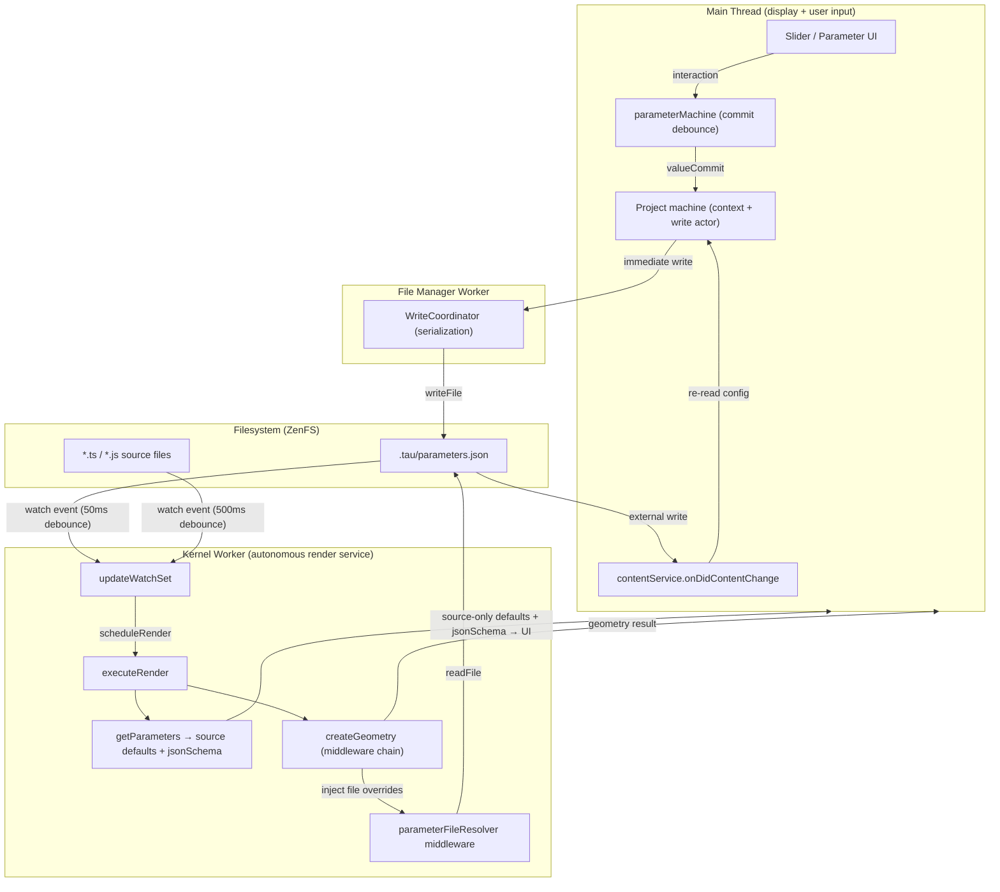

# Parameter Middleware Architecture

Investigation into the ideal architecture for fully file-driven parameter resolution, leveraging the existing middleware API to keep `@taucad/runtime` generic while eliminating `setParameters` from the kernel client hot path entirely.

## Executive Summary

The runtime middleware system enables a fully file-driven parameter architecture where the kernel worker autonomously reads `.tau/parameters.json` and the main thread never sends `setParameters` commands. Two distinct parameter concerns exist: source code extraction (`getParameters` → schema + defaults from TypeScript/SCAD/KCL) and user overlays (`.tau/parameters.json` → runtime overrides). Only `wrapCreateGeometry` is needed — it reads the parameter file and injects overlay values into the geometry computation, keeping `getParameters` untouched so the UI receives clean source-only defaults. Parameter writes follow the established Monaco pattern: the project machine flushes writes immediately to the file manager worker, which handles serialization via `WriteCoordinator`. The kernel watches the parameter file with a 50ms debounce tier (via `registerWatchPath`), producing ~55ms total latency from parameter commit to render start — identical to the current `setParameters` path.

## Table of Contents

- [Problem Statement](#problem-statement)
- [Methodology](#methodology)
- [Findings](#findings)
- [Target Architecture](#target-architecture)
- [Data Flow Analysis](#data-flow-analysis)
- [Recommendations](#recommendations)
- [Trade-offs](#trade-offs)
- [Code Examples](#code-examples)
- [References](#references)

## Problem Statement

Parameters for CAD models are moving from IndexedDB (`project.assets.mechanical.parameters`) to a filesystem-based `.tau/parameters.json` with named parameter sets. The original investigation proposed a 3-tier priority system (source defaults → file overrides → slider overrides via `setParameters`), which conflated two distinct parameter concerns and introduced unnecessary complexity:

1. **Competing sources**: `setParameters` commands and middleware file reads produce a dual-source design where the file has stale values during slider interaction. The merge "works" but the architecture is confusing and fragile.
2. **Framework purity**: The generic `@taucad/runtime` package should not contain Tau-specific file format logic — middleware solves this.
3. **Unnecessary coupling**: `initializeModel` bundles both a file path and parameters, forcing the project machine to pre-load `.tau/parameters.json` before CU creation. The kernel should read the file autonomously.
4. **Conflated concerns**: `getParameters` extracts source code schema and defaults — a code parsing concern. `.tau/parameters.json` provides user/agent overlays — a runtime override concern. These are separate concerns requiring separate mechanisms.

## Methodology

Source analysis of the following components:

- `parameterMachine` (`apps/ui/app/machines/parameter.machine.ts`): Slider/input debounce and commit behavior
- `ParametersNumber` (`apps/ui/app/components/geometry/parameters/parameters-number.tsx`): Slider integration
- `Parameters` (`apps/ui/app/components/geometry/parameters/parameters.tsx`): RJSF form, `extractModifiedProperties`
- Middleware API: `defineMiddleware`, `KernelMiddlewareRuntime`, `wrapGetParameters`, `wrapCreateGeometry`
- Existing middleware: `parameterCache`, `geometryCache` (filesystem I/O patterns)
- Kernel worker: `executeRender()`, `getParameters()`, `createGeometry()`, `updateWatchSet`, `scheduleRender`
- Runtime client: `setFile`, `setParameters` command signatures
- CAD machine: `initializeModel`, `forwardInitializeModel`, `kernelConnected` handler
- Project machine: `storing` parallel state, `storeDebounce`, `writeProjectActor`, `setParametersInContext`
- Framework constants: `parameterDebounceMs` (50ms), `fileChangeDebounceMs` (500ms)

## Findings

### Finding 1: Two distinct parameter concerns — source extraction vs user overlays

Source analysis reveals two fundamentally separate parameter concerns that the previous research conflated:

| Concern                    | Mechanism                                  | What it provides                                                          | Owner         |
| -------------------------- | ------------------------------------------ | ------------------------------------------------------------------------- | ------------- |
| **Source code extraction** | `getParameters` → kernel `onGetParameters` | `jsonSchema` + `defaultParameters` parsed from TypeScript/SCAD/KCL source | Kernel worker |
| **User/agent overlays**    | `.tau/parameters.json`                     | Runtime overrides of source defaults, organized in named parameter sets   | Filesystem    |

`getParameters` is a code parsing pipeline. The middleware should NOT touch it — the source code extraction is correct as-is and the UI depends on receiving clean, unmodified source-only defaults via `parametersResolved`.

The parameter file provides overlay values that sit on top of source defaults. These belong in the geometry computation pipeline (`wrapCreateGeometry`), not the parameter extraction pipeline (`wrapGetParameters`).

### Finding 2: Only wrapCreateGeometry is needed

With the two concerns separated, the middleware becomes trivial. Only `wrapCreateGeometry` is needed:

1. `getParameters` runs unmodified → returns source-only `defaultParameters` and `jsonSchema`
2. `executeRender` merges: `deepmerge(defaultParameters, this.currentParameters)` → with `this.currentParameters = {}`, this equals `defaultParameters`
3. `wrapCreateGeometry` reads `.tau/parameters.json`, extracts active set values, merges them on top of `input.parameters` (which equals source defaults)
4. Inner `createGeometry` handler receives `{ ...sourceDefaults, ...fileOverrides }`

No `wrapGetParameters`. No state transfer between hooks. No hybrid strategy. The middleware reads the file and injects values at the geometry level.

The UI receives source-only defaults from `parametersResolved`, making `extractModifiedProperties` reliable — it correctly computes the full diff from source defaults, which is exactly what goes into the parameter file.

### Finding 3: The parameterMachine already handles all commit debouncing

The `parameterMachine` manages slider interaction, text input, arrow keys, unit conversion, and commit timing. It emits `valueCommit` events only at defined boundaries:

| Trigger                                       | When `valueCommit` fires                                                 |
| --------------------------------------------- | ------------------------------------------------------------------------ |
| Slider drag (default)                         | On `sliderReleased` only — during drag, only `localValue` updates for UI |
| Slider drag (`enableContinualOnChange: true`) | On every `sliderChanged` — opted-in continuous feedback                  |
| Text input                                    | On `inputChanged` — immediate commit                                     |
| Text with units                               | On `textInputChanged` — parsed and committed                             |
| Arrow keys                                    | On `arrowKeyPressed` — immediate commit                                  |

There is no raw "slider tick" → kernel path. The default behavior commits only on release — a single write per slider interaction, not a stream.

### Finding 4: Parameter writes follow the established Monaco pattern

The parameter file write flow mirrors the established Monaco editor file-editing pattern:

| Aspect                    | Monaco (code editing)           | Parameters (slider/input)           |
| ------------------------- | ------------------------------- | ----------------------------------- |
| **UI state**              | Monaco models (immediate)       | Project machine context (immediate) |
| **Write target**          | File manager worker (real-time) | File manager worker (real-time)     |
| **Write serialization**   | WriteCoordinator                | WriteCoordinator                    |
| **Kernel watch debounce** | `fileChangeDebounceMs` (500ms)  | `registerWatchPath` override (50ms) |
| **Kernel response**       | Re-bundle, re-render            | Re-render with new parameters       |

The project machine updates `context.parameters` on change (for immediate UI display) and flushes the write to the file manager worker in real time — no XState-level debounce for parameter file writes. The file manager worker's `WriteCoordinator` handles serialization and coalescing. The kernel's `registerWatchPath({ debounceMs: 50 })` handles render-side debounce.

This is distinct from the project object store's `storeDebounce: 500` pattern, which batches metadata changes (name, description, tags) for IndexedDB. Parameter file writes are a separate concern requiring a separate write actor with immediate flushing.

### Finding 5: Middleware cannot register watch paths (gap)

The `KernelMiddlewareRuntime` interface does NOT expose any mechanism to register additional file paths for the kernel's watch set. The kernel's watch set is built exclusively from code dependencies via `_updateWatchSetFromCaches()`, which unions the active file path, bundle dependency cache entries, and file hash cache keys.

`.tau/parameters.json` is not a code dependency. Without explicit registration, the kernel would never watch this file.

### Finding 6: File watches use 500ms debounce — parameter files need 50ms

The kernel worker's watch handler always uses `fileChangeDebounceMs` (500ms). With `registerWatchPath({ debounceMs: 50 })`, the watch handler selects the shortest applicable debounce for changed paths. This reduces parameter file latency from ~510ms to ~55ms — matching the current `setParameters` path.

### Finding 7: The kernel's existing state reporting handles the UI indicator

When the kernel detects a file change and starts rendering, `executeRender()` calls `pushState('rendering')`. The cad machine receives this state change, transitions to the `rendering` state, and the UI shows the "Rendering..." indicator. When geometry completes, `pushState('idle')` hides it.

No new UI state tracking is needed. The existing kernel → cad machine state reporting handles the "Rendering..." indicator automatically for parameter file changes, identical to how it works for code file changes.

### Finding 8: initializeModel can drop parameters

If `setFile` parameters are optional (defaulting to `{}`), the kernel reads parameter values from the file via middleware during `executeRender()`. The first render already has correct parameters — source defaults from `getParameters`, file overrides from `wrapCreateGeometry`. No project machine pre-loading, no timing concerns, no double-render.

### Finding 9: setParameters remains as opt-in escape hatch

The `setParameters` API on `RuntimeWorkerClient` serves use cases without a filesystem: inline mode, testing, future SDK use cases. These don't register the `parameterFileResolver` middleware, so the middleware finds no file and passes parameters through unchanged. The API remains backward-compatible.

## Target Architecture



### Layer responsibilities

| Layer                   | Owns                                                                               | Does NOT own                                    |
| ----------------------- | ---------------------------------------------------------------------------------- | ----------------------------------------------- |
| **Project machine**     | Parameter display state, file writes (via write actor), parameter set CRUD         | Render scheduling, parameter delivery to kernel |
| **File manager worker** | Write serialization (`WriteCoordinator`), filesystem operations                    | Parameter format knowledge, UI state            |
| **Kernel worker**       | Render scheduling, file watching, geometry computation, UI state reporting         | Parameter set management, file format knowledge |
| **Middleware**          | `.tau/parameters.json` reading, overlay-to-geometry merge, watch path registration | Render scheduling, commit debouncing, UI state  |
| **Filesystem**          | Persistent parameter storage, change notifications                                 | Merge logic, UI state                           |

### Key architectural insight

The parameter architecture is a specialization of the existing file-editing architecture. The only difference is the kernel-side debounce tier:

| File type                                 | UI state owner          | Write mechanism                 | Kernel watch debounce               |
| ----------------------------------------- | ----------------------- | ------------------------------- | ----------------------------------- |
| Source code (`.ts`, `.scad`, `.kcl`)      | Monaco models           | File manager worker (real-time) | 500ms (`fileChangeDebounceMs`)      |
| Parameter config (`.tau/parameters.json`) | Project machine context | File manager worker (real-time) | 50ms (`registerWatchPath` override) |

## Data Flow Analysis

### Scenario 1: Initial page load

```
1. loadProjectActor reads project from IndexedDB + .tau/parameters.json from ZenFS
2. Project machine context populated with parameter config
3. initializeModel(file) sent to cad machine (no parameters)
4. CU connects → kernelConnected → client.setFile(file) (no parameters)
5. Kernel: handleSetFile → this.currentParameters = {} → executeRender()
6.   getParameters → source-only defaults + jsonSchema → parametersResolved → UI
7.   wrapCreateGeometry → middleware reads .tau/parameters.json → merges file overrides
8.   createGeometry → geometry with correct parameters
9. UI displays: parameters from project context, defaults + schema from cad machine
```

Result: **1 render with correct parameters.** No double-render. No timing race.

### Scenario 2: Slider interaction (default mode — commit on release)

```
1. User drags slider → parameterMachine updates localValue (immediate UI)
2. User releases slider → parameterMachine emits valueCommit
3. valueCommit → project machine updates context (immediate UI) + writes to file manager worker
4. File manager worker writes .tau/parameters.json (~2-5ms)
5. Kernel watch fires → scheduleRender(50ms)
6.   wrapCreateGeometry → reads updated file → geometry with new parameters
7. Kernel pushes 'rendering' state → cad machine → UI shows "Rendering..."
8. Geometry completes → kernel pushes 'idle' → indicator hides
```

Result: **~55ms from slider release to render start.** Identical to current `setParameters` path.

### Scenario 3: Slider interaction (continual mode)

```
1. Each slider tick → valueCommit → write to file manager worker
2. WriteCoordinator serializes writes (~5ms each)
3. Kernel watch fires after each write → scheduleRender(50ms) resets
4. Render executes ~50ms after last write completes
5. At 60fps input (~16ms between ticks), 50ms debounce coalesces renders
```

Result: **~1 render per 50ms after last write.** Comparable to current `setParameters` behavior.

### Scenario 4: AI agent writes parameters

```
1. Agent writes .tau/parameters.json with { width: 20 }
2. Kernel watch fires → scheduleRender(50ms) → render with new values
3. contentService.onDidContentChange fires on main thread
4. Project machine re-reads file → updates context → UI displays new values
```

Result: **Agent change reflected in ~50ms.** Single render. No relay needed.

### Scenario 5: Parameter set switching

```
1. User selects a different parameter set in the UI
2. Project machine updates activeSet in config, writes to file manager worker
3. Kernel watch fires → middleware reads new active set → render with new values
4. UI reflects new active set values from project context
```

Result: **Set switch is a file write.** No special events or commands.

### Scenario 6: Parameter reset

```
1. User clicks reset button → project machine deletes key from active set values
2. Writes updated config to file manager worker
3. Kernel watch fires → middleware reads file (key removed) → source default used
4. UI displays source default from parametersResolved
```

Result: **True reset — key deleted from file, source default flows through.**

## Recommendations

| #   | Action                                                                                  | Priority | Effort | Impact                                                                         |
| --- | --------------------------------------------------------------------------------------- | -------- | ------ | ------------------------------------------------------------------------------ |
| R1  | Add `registerWatchPath(path, options?)` with debounce tier to `KernelMiddlewareRuntime` | P0       | Low    | Enables 50ms parameter file watching without framework coupling                |
| R2  | Create `parameterFileResolver()` middleware with `wrapCreateGeometry` only              | P0       | Low    | Kernel autonomously reads `.tau/parameters.json`; simplest possible middleware |
| R3  | Make `parameters` optional on `setFile()` / `handleSetFile()`                           | P0       | Low    | Decouples file initialization from parameter injection                         |
| R4  | Drop `parameters` from `initializeModel` event in `cadMachine`                          | P0       | Low    | Kernel reads parameters from file; no pre-loading needed                       |
| R5  | Add parameter file read to `loadProjectActor` alongside object store read               | P0       | Low    | Parameters available in project context on load                                |
| R6  | Add separate write actor for parameter file (immediate flush, not debounced)            | P0       | Medium | Follows Monaco pattern; file manager worker handles serialization              |
| R7  | Extend `_updateWatchSetFromCaches` and watch handler for per-path debounce tiers        | P0       | Low    | Enables R1 in the kernel worker internals                                      |
| R8  | Subscribe `contentService.onDidContentChange` for external parameter file changes       | P1       | Low    | UI reflects AI agent and Monaco edits to parameter file                        |
| R9  | Remove `forwardSetParameters` action from `cadMachine`                                  | P1       | Low    | Eliminates dead code path; `setParameters` no longer forwarded to kernel       |

### Framework extension: registerWatchPath with debounce tier

```typescript
export type KernelMiddlewareRuntime<State, Options> = {
  logger: RuntimeLogger;
  filesystem: RuntimeFileSystem;
  state: MiddlewareState<State>;
  options: Options;
  dependencies: readonly Dependency[];
  dependencyHash: string;
  registerWatchPath(absolutePath: string, options?: { debounceMs?: number }): void;
};
```

Kernel worker internals:

```typescript
private middlewareWatchPaths = new Map<string, number>();

private _updateWatchSetFromCaches(): void {
  const allDeps = new Set<string>();
  // ... existing dependency collection ...
  for (const path of this.middlewareWatchPaths.keys()) {
    allDeps.add(path);
  }
  this.updateWatchSet([...allDeps]);
}

// In watch handler — select shortest debounce for changed paths:
const debounceMs = changedPaths.reduce(
  (min, path) => Math.min(min, this.middlewareWatchPaths.get(path) ?? fileChangeDebounceMs),
  fileChangeDebounceMs,
);
this.scheduleRender(debounceMs);
```

### Framework extension: optional parameters on setFile

```typescript
// runtime-worker-client.ts
public setFile(file: GeometryFile, parameters?: Record<string, unknown>, tessellation?: Tessellation): void {

// kernel-worker.ts
public handleSetFile(file: GeometryFile, parameters?: Record<string, unknown>, tessellation?: Tessellation): void {
  this.currentFile = file;
  this.currentParameters = parameters ?? {};
```

Non-breaking change. Existing callers that pass parameters continue to work.

## Trade-offs

| Aspect                | File-driven (new)                                                 | setParameters relay (previous)                             |
| --------------------- | ----------------------------------------------------------------- | ---------------------------------------------------------- |
| **Simplicity**        | Single source of truth (file). No competing paths.                | Dual path: command for speed, file for persistence.        |
| **Latency**           | ~55ms (write + 50ms watch debounce)                               | ~50ms (direct postMessage + 50ms debounce)                 |
| **Framework purity**  | `@taucad/runtime` stays generic; app middleware owns format logic | Same                                                       |
| **Kernel autonomy**   | Full: kernel reads file, watches changes, renders autonomously    | Partial: kernel depends on main thread for parameter relay |
| **Initial load**      | Single render, no pre-loading needed                              | Single render, but requires pre-loading parameters         |
| **Redundant renders** | None — file is the only source                                    | Possible after debounced write triggers watch              |
| **UI indicator**      | Automatic via existing kernel state reporting                     | Same                                                       |
| **Framework changes** | `registerWatchPath` with debounce, optional `setFile` params      | `registerWatchPath` only                                   |

## Code Examples

### parameterFileResolver middleware

```typescript
import { defineMiddleware } from '@taucad/runtime/middleware';
import { z } from 'zod';

const PARAMETERS_FILE = '.tau/parameters.json';

export const parameterFileResolverMiddleware = defineMiddleware({
  name: 'parameter-file-resolver',

  optionsSchema: z.object({
    parametersFile: z.string().default(PARAMETERS_FILE),
  }),

  async wrapCreateGeometry(input, handler, runtime) {
    const parametersPath = `${input.file.path}/${runtime.options.parametersFile}`;
    runtime.registerWatchPath(parametersPath, { debounceMs: 50 });

    try {
      const content = await runtime.filesystem.readFile(parametersPath, 'utf8');
      const config = JSON.parse(content);

      if (config.version !== 1 || !config.files) {
        return handler(input);
      }

      const fileEntry = config.files[input.file.filename];

      if (!fileEntry?.sets?.[fileEntry.activeSet]) {
        return handler(input);
      }

      const fileValues = fileEntry.sets[fileEntry.activeSet].values;
      const enhancedParams = { ...input.parameters, ...fileValues };
      return handler({ ...input, parameters: enhancedParams });
    } catch {
      return handler(input);
    }
  },
});
```

### Registration in kernel-worker.constants.ts

```typescript
import { parameterFileResolver } from './middleware/parameter-file-resolver.factory';

export const defaultKernelOptions = createRuntimeClientOptions({
  kernels: [
    /* ... */
  ],
  middleware: [
    observability({ reportUrl: `${ENV.TAU_API_URL}/v1/telemetry/ingest` }),
    parameterFileResolver(),
    parameterCache(),
    geometryCache(),
    gltfCoordinateTransform(),
    gltfEdgeDetection(),
  ],
  bundlers: [esbuild()],
});
```

### Parameter commit flow (UI side)

```typescript
// In useProject hook — parameter write actor flushes immediately
const handleParametersChange = useCallback(
  (modifiedParameters: Record<string, unknown>) => {
    actorRef.send({ type: 'setParameters', parameters: modifiedParameters });
  },
  [actorRef],
);

// In project machine — setParametersInContext action:
// 1. Updates context.parameters (immediate UI display)
// 2. Triggers separate write actor (immediate flush to file manager worker)
// 3. Does NOT forward setParameters to cad machine for kernel delivery
```

## References

- Architecture: `docs/architecture/runtime-topology.md`
- Research: `docs/research/parameter-storage-architecture.md`
- Policy: `docs/policy/filesystem-policy.md`
- Middleware API: `apps/ui/content/docs/(runtime)/api/middleware.mdx`
- Middleware Model: `apps/ui/content/docs/(runtime)/concepts/middleware-model.mdx`
- Implementation: `packages/runtime/src/framework/kernel-worker.ts` (executeRender, getParameters, createGeometry, updateWatchSet, scheduleRender)
- Implementation: `packages/runtime/src/framework/runtime-worker-client.ts` (setFile, setParameters signatures)
- Implementation: `packages/runtime/src/middleware/parameter-cache.middleware.ts` (filesystem I/O pattern)
- Implementation: `packages/runtime/src/types/runtime-middleware.types.ts` (KernelMiddlewareRuntime)
- Implementation: `apps/ui/app/machines/parameter.machine.ts` (commit debounce logic)
- Implementation: `apps/ui/app/machines/project.machine.ts` (storing region, storeDebounce, writeProjectActor)
- Implementation: `apps/ui/app/machines/cad.machine.ts` (initializeModel, forwardInitializeModel)
