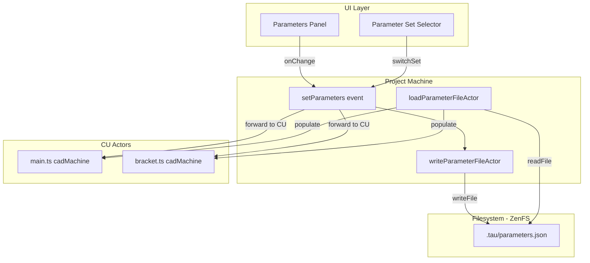
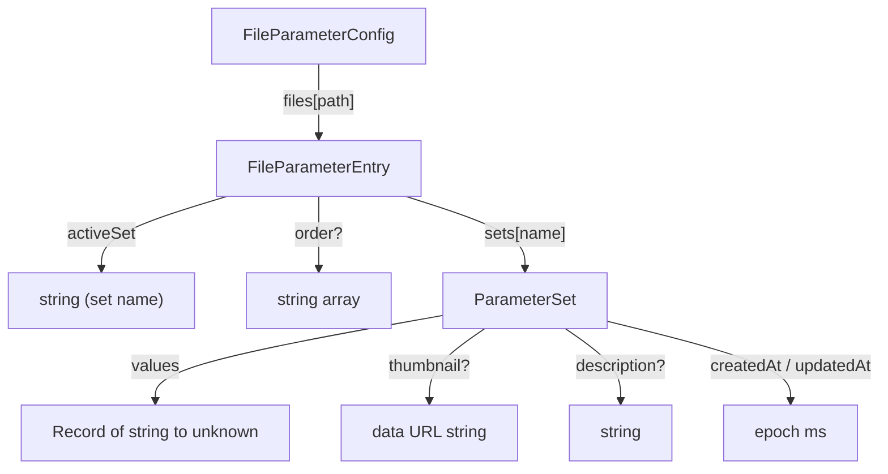

# Parameter Storage Architecture

Designing the data model and storage strategy for per-compilation-unit parameters with named parameter sets, aligned with Tau's filesystem-first vision.

## Executive Summary

Tau currently stores a single flat `Record<string, unknown>` for the main compilation unit inside the IndexedDB project document. This model cannot support multiple compilation units, named parameter sets (presets), or filesystem-based persistence. We propose a `.tau/parameters.json` file per project that stores per-file parameter configurations with named sets, enabling preset switching analogous to OpenSCAD's Parameter Customizer. The data structure is designed to accommodate future features including parameter thumbnails, expressions, sweeps, assembly cascading, and cross-CU linking.

## Table of Contents

- [Problem Statement](#problem-statement)
- [Methodology](#methodology)
- [Findings](#findings)
- [Recommended Data Structure](#recommended-data-structure)
- [Future Feature Catalog](#future-feature-catalog)
- [Trade-offs](#trade-offs)
- [Migration Strategy](#migration-strategy)
- [Diagrams](#diagrams)
- [References](#references)

## Problem Statement

Three gaps trigger this investigation:

1. **Single-CU limitation** -- `project.assets.mechanical.parameters` stores one `Record<string, unknown>`. When a project has multiple compilation units (e.g., `main.ts`, `bracket.ts`), only the main CU's parameter overrides are persisted. Secondary CU parameters are ephemeral (lost on reload).

2. **No parameter sets** -- Users design variants of the same model (e.g., a rounded-bottom glass vs. a flat-bottom glass) but must manually re-enter parameter values to switch between them. OpenSCAD solves this with named "parameter sets" in a JSON sidecar file. Tau has no equivalent.

3. **Non-filesystem storage** -- Parameters live in an IndexedDB `projects` object store as part of the serialized `Project` document. This conflicts with the vision policy's "files are the interface" principle: parameters are not versionable, diffable, or agent-accessible as files.

## Methodology

Analysis of:

- Current parameter storage: `libs/types/src/types/project.types.ts` (`Asset.parameters`), `apps/ui/app/db/indexeddb-storage.ts` (`IndexedDbStorageProvider`), `apps/ui/app/machines/project.machine.ts` (`setParametersInContext`)
- Per-CU parameter flow: `apps/ui/app/machines/cad.machine.ts` (`CadContext.parameters`, `setParameters` event), `apps/ui/app/routes/projects_.$id/chat-parameters.tsx`
- OpenSCAD customizer format: `parameterSets` JSON structure, schema export proposal ([openscad/openscad#4457](https://github.com/openscad/openscad/issues/4457))
- Tau policies: `docs/policy/vision-policy.md` (files as interface), `docs/policy/filesystem-policy.md` (ZenFS storage patterns)

## Findings

### Finding 1: Current storage is single-CU, non-filesystem

The `Asset` type defines parameters as a flat record:

```typescript
type Asset = {
  main: string;
  parameters: Record<string, unknown>;
};
```

This record lives on `project.assets.mechanical` and is persisted via `IndexedDbStorageProvider.updateProject()`, which calls `store.put(updatedProject)` on the IndexedDB `projects` store. The entire `Project` object is serialized as a single document.

The project machine's `setParametersInContext` action updates `draft.project.assets.mechanical.parameters` and forwards the event only to the main compilation unit (`context.compilationUnits.get(context.mainEntryFile)`). Secondary CUs receive parameters at creation time via `initializeModel` but are never updated afterward.

### Finding 2: Each CU already maintains independent parameter state

Each compilation unit's `cadMachine` stores its own `parameters`, `defaultParameters`, and `jsonSchema` in context:

```typescript
type CadContext = {
  parameters: Record<string, unknown>;
  defaultParameters: Record<string, unknown>;
  jsonSchema?: JSONSchema7;
  // ...
};
```

The `setParameters` event is handled in all cadMachine states (idle, rendering, error), updating context and forwarding to the kernel worker. The infrastructure for per-CU parameter dispatch exists; only the persistence and UI layers are missing.

### Finding 3: OpenSCAD parameter sets are a proven UX pattern

OpenSCAD's Parameter Customizer stores named parameter sets in a JSON sidecar file:

```json
{
  "parameterSets": {
    "RoundedGlass": {
      "Height": "140",
      "Base_Radius": "80",
      "Fillet_Base": "true"
    },
    "FlatGlass": {
      "Height": "85",
      "Base_Radius": "45",
      "Fillet_Base": "false"
    }
  },
  "fileFormatVersion": "1"
}
```

Key limitations of OpenSCAD's format that Tau should improve on:

| Limitation          | OpenSCAD behavior                                  | Tau opportunity                                          |
| ------------------- | -------------------------------------------------- | -------------------------------------------------------- |
| Values are strings  | All values serialized as strings, losing type info | Store native JSON types (number, boolean, array)         |
| No metadata         | No timestamps, descriptions, or thumbnails         | Rich metadata per set                                    |
| No per-file scoping | One sidecar per `.scad` file                       | Single file covers all CUs in a project                  |
| No schema in sets   | Schema only in source code comments                | Schema extracted at runtime, stored separately if needed |
| Flat namespace      | No grouping or tagging of sets                     | Tags and ordering support                                |

### Finding 4: Filesystem storage aligns with vision policy

The vision policy states: "Files are the interface. Every engineering artifact -- geometry, circuits, firmware, test specs, requirements -- is represented as code. Code is versionable, diffable, reviewable, and agent-accessible."

Parameters stored in IndexedDB violate this principle. A `.tau/parameters.json` file in the project filesystem would be:

- **Versionable** -- tracked by git, diffable across commits
- **Agent-accessible** -- AI agents can read/write parameter sets via the filesystem bridge
- **Exportable** -- users can share parameter configurations by sharing a file
- **Inspectable** -- human-readable JSON, viewable in the editor

The `.tau/` directory already serves as the project metadata namespace (transcripts, skills, cache). Parameters are a natural fit.

### Finding 5: Feature landscape for parametric CAD configurators

Analysis of parametric CAD tools (OpenSCAD, FreeCAD Spreadsheet, Grasshopper, SolidWorks Design Tables, Onshape Configurations) reveals a common feature set:

| Feature               | OpenSCAD        | FreeCAD           | Grasshopper      | SolidWorks      | Onshape           | Priority for Tau |
| --------------------- | --------------- | ----------------- | ---------------- | --------------- | ----------------- | ---------------- |
| Named parameter sets  | Yes             | Via spreadsheet   | No               | Design Tables   | Configurations    | P0 (core)        |
| Per-file scoping      | Yes (sidecar)   | Global            | N/A              | Per-part        | Per-part          | P0 (multi-CU)    |
| Thumbnail preview     | No              | No                | No               | Yes             | Yes               | P1 (UX)          |
| Description/notes     | No              | Cell comments     | No               | Column headers  | Description field | P1 (UX)          |
| Active set indicator  | Yes             | Active row        | N/A              | Active config   | Active config     | P0 (core)        |
| Parameter expressions | No              | Yes (formulas)    | Yes (components) | Yes (equations) | No                | P2 (future)      |
| Cross-file linking    | No              | Yes (spreadsheet) | Yes (wires)      | Yes (equations) | Yes (variables)   | P2 (future)      |
| Parameter sweep       | No              | No                | Yes (sliders)    | No              | No                | P2 (future)      |
| Import/export sets    | Limited         | No                | No               | Excel import    | No                | P1 (sharing)     |
| Set ordering          | Insertion order | Row order         | N/A              | Row order       | Drag order        | P1 (UX)          |

## Recommended Data Structure

### Schema: `FileParameterConfig`

```typescript
type FileParameterConfig = {
  /** Schema version for forward compatibility. */
  version: 1;

  /** Per-file parameter configurations, keyed by file path relative to project root. */
  files: Record<string, FileParameterEntry>;
};

type FileParameterEntry = {
  /** The currently active parameter set name (key into `sets`). */
  activeSet: string;

  /** Display order of set names. Absent sets appear after ordered ones. */
  order?: string[];

  /** Named parameter sets. */
  sets: Record<string, ParameterSet>;
};

type ParameterSet = {
  /** Human-readable display name. */
  name: string;

  /** Optional description or notes. */
  description?: string;

  /** Creation timestamp (epoch ms). */
  createdAt: number;

  /** Last modified timestamp (epoch ms). */
  updatedAt: number;

  /** Optional thumbnail data URL for visual identification. */
  thumbnail?: string;

  /** Parameter value overrides from defaults. Native JSON types preserved. */
  values: Record<string, unknown>;
};
```

### Example: `.tau/parameters.json`

```json
{
  "version": 1,
  "files": {
    "main.ts": {
      "activeSet": "rounded-bottom",
      "order": ["rounded-bottom", "flat-bottom"],
      "sets": {
        "rounded-bottom": {
          "name": "Rounded Bottom",
          "description": "Drinking glass with a spherical base curve",
          "createdAt": 1711548000000,
          "updatedAt": 1711548000000,
          "thumbnail": null,
          "values": {
            "Height": 140,
            "Top Radius": 45,
            "Base Radius": 80,
            "Wall Thickness": 1,
            "Fillet Rim": true,
            "Rim Fillet Radius": 1,
            "Fillet Base": true,
            "Base Fillet Radius": 40
          }
        },
        "flat-bottom": {
          "name": "Flat Bottom",
          "description": "Straight-sided glass with no base fillet",
          "createdAt": 1711548000000,
          "updatedAt": 1711548000000,
          "thumbnail": null,
          "values": {
            "Height": 85,
            "Top Radius": 55,
            "Base Radius": 45,
            "Wall Thickness": 1,
            "Fillet Rim": true,
            "Rim Fillet Radius": 1,
            "Fillet Base": false,
            "Base Fillet Radius": 40
          }
        }
      }
    },
    "bracket.ts": {
      "activeSet": "default",
      "sets": {
        "default": {
          "name": "Default",
          "createdAt": 1711548000000,
          "updatedAt": 1711548000000,
          "values": {}
        },
        "heavy-duty": {
          "name": "Heavy Duty",
          "description": "Thicker walls and larger bolt holes",
          "createdAt": 1711549000000,
          "updatedAt": 1711549000000,
          "values": {
            "Bp Thickness": 24,
            "Side Hole Y": 50,
            "Rib Thickness": 22
          }
        }
      }
    }
  }
}
```

### Design Rationale

| Decision                       | Rationale                                                                              | Alternative considered                                                  |
| ------------------------------ | -------------------------------------------------------------------------------------- | ----------------------------------------------------------------------- |
| Single file per project        | Atomic reads/writes, simple implementation, small payload (parameter values only)      | Per-CU sidecar files (better git diffs, but more filesystem complexity) |
| `version` field                | Forward compatibility for schema evolution                                             | Unversioned (breaks on format changes)                                  |
| `values` stores overrides only | Matches existing behavior where `mergedData = { ...defaultParameters, ...parameters }` | Store full parameter snapshots (redundant, drifts from code defaults)   |
| Native JSON types              | Preserves number/boolean/array semantics without parsing                               | String-only like OpenSCAD (loses type information)                      |
| `order` array                  | Decouples display order from insertion order in `sets` record                          | Array of sets instead of record (loses O(1) lookup by name)             |
| `thumbnail` as data URL        | Self-contained, no external file references                                            | Separate thumbnail files (more complexity, broken references)           |
| Timestamps as epoch ms         | Consistent with `Project.createdAt`/`updatedAt`, timezone-free                         | ISO strings (more readable, but parsing overhead)                       |

## Future Feature Catalog

The proposed data structure accommodates these future features without breaking changes:

### P1: Thumbnail auto-capture

When saving or switching parameter sets, capture the current viewport as a thumbnail. Store as a small data URL (e.g., 128x128 JPEG). Enables visual browsing of parameter sets.

Implementation: call the existing screenshot machinery on set save, resize to thumbnail dimensions, store in `ParameterSet.thumbnail`.

### P1: Import/export parameter sets

Export individual sets or the entire `.tau/parameters.json` as shareable files. Import sets from other projects or from OpenSCAD-format JSON files.

The JSON format is inherently portable. An import adapter would translate OpenSCAD's string-valued `parameterSets` to Tau's typed `values`.

### P2: Parameter expressions

Express one parameter as a function of another (e.g., `wall_thickness = height * 0.02`). Requires an `expressions` field on `ParameterSet`:

```typescript
type ParameterSet = {
  // ... existing fields ...
  expressions?: Record<string, string>;
};
```

Expressions would be evaluated at runtime, with `values` serving as the explicit overrides and `expressions` as computed derivations.

### P2: Assembly parameter cascading

An assembly file's parameter set could include overrides for sub-component parameters. Requires a `fileOverrides` field:

```typescript
type ParameterSet = {
  // ... existing fields ...
  fileOverrides?: Record<string, Record<string, unknown>>;
};
```

This enables top-level assembly parameters to cascade down to sub-files without modifying their individual parameter sets.

### P2: Parameter sweeps

Define parameter ranges for design exploration or animation. Could be a separate `.tau/sweeps.json` file that references parameter sets and defines sweep dimensions:

```json
{
  "sweeps": {
    "height-study": {
      "file": "main.ts",
      "baseSet": "rounded-bottom",
      "dimensions": [{ "parameter": "Height", "from": 80, "to": 200, "steps": 10 }]
    }
  }
}
```

### P2: Parameter locking

Mark specific parameters as non-editable within a set. Useful when exploring variations with some dimensions fixed:

```typescript
type ParameterSet = {
  // ... existing fields ...
  locked?: string[];
};
```

### P3: Cross-CU parameter linking

Link parameters across compilation units (e.g., `assembly.bolt_diameter` drives `bracket.hole_diameter`). Requires a project-level linking registry:

```typescript
type FileParameterConfig = {
  // ... existing fields ...
  links?: Array<{
    source: { file: string; parameter: string };
    target: { file: string; parameter: string };
    transform?: string;
  }>;
};
```

### P3: Parameter history

Track parameter changes over time for undo/redo. Since `.tau/parameters.json` lives in the filesystem, git already provides coarse-grained history. Fine-grained undo could be implemented as runtime state (undo stack in the parameter machine) without schema changes.

### P3: Parameter tags and filtering

Add tags to parameter sets for organization in projects with many presets:

```typescript
type ParameterSet = {
  // ... existing fields ...
  tags?: string[];
};
```

## Trade-offs

### Storage location: `.tau/parameters.json` vs IndexedDB project document

| Dimension            | `.tau/parameters.json` (filesystem)        | IndexedDB project document (current)  |
| -------------------- | ------------------------------------------ | ------------------------------------- |
| Vision alignment     | Strong -- "files are the interface"        | Weak -- opaque binary store           |
| Git versioning       | Automatic -- tracked as a file             | Not possible                          |
| Agent accessibility  | Direct -- read/write via filesystem bridge | Indirect -- requires project API      |
| Atomic persistence   | Single `writeFile` call                    | Part of larger `updateProject` call   |
| Read performance     | File read (~10ms via ZenFS)                | Part of project load (already loaded) |
| Offline resilience   | Same as all ZenFS files                    | Same                                  |
| Migration complexity | Requires read/write path changes           | None (status quo)                     |

Recommendation: adopt `.tau/parameters.json` for new per-CU and parameter-set features. Maintain backward-compatible read from `project.assets.mechanical.parameters` during migration.

### Single file vs per-CU sidecar files

| Dimension         | Single `.tau/parameters.json`       | Per-CU `.tau/parameters/{file}.json`   |
| ----------------- | ----------------------------------- | -------------------------------------- |
| Atomic operations | Single read/write for all CUs       | Must coordinate across files           |
| Git diff clarity  | One file changes per parameter edit | Smaller, more focused diffs            |
| Implementation    | Simpler -- one read, one parse      | More complex -- glob + merge           |
| Scalability       | Fine for typical projects (<20 CUs) | Better for large assemblies (100+ CUs) |

Recommendation: start with single file. Migrate to per-CU if projects regularly exceed 20 compilation units.

## Migration Strategy

### Phase 1: Read `.tau/parameters.json` on project load

On project load, check for `.tau/parameters.json`. If present, parse and populate each CU's parameters from the active set. If absent, fall back to `project.assets.mechanical.parameters` (current behavior).

### Phase 2: Write to `.tau/parameters.json` on parameter change

When parameters change, write to `.tau/parameters.json` and sync the main file's active set values back to `project.assets.mechanical.parameters` for backward compatibility.

### Phase 3: Auto-create on first parameter edit

For projects without `.tau/parameters.json`, auto-create it on the first parameter edit, migrating existing `project.assets.mechanical.parameters` into a "Default" set for the main file.

### Phase 4: Deprecate project-level parameter storage

Once all projects have migrated, remove the write path to `project.assets.mechanical.parameters`. Keep read-only fallback for old projects.

## Diagrams

### Parameter read/write flow (target state)



### Data model hierarchy



## References

- Vision policy: `docs/policy/vision-policy.md` -- "files are the interface" principle
- Filesystem policy: `docs/policy/filesystem-policy.md` -- ZenFS storage patterns, `.tau/` namespace
- Filesystem architecture: `docs/research/filesystem-architecture.md` -- worker topology, parameter cache paths
- OpenSCAD customizer schema export: [openscad/openscad#4457](https://github.com/openscad/openscad/issues/4457)
- OpenSCAD customizer dataset import/export: [openscad/openscad#3137](https://github.com/openscad/openscad/issues/3137)
- Current parameter types: `libs/types/src/types/project.types.ts` (`Asset`)
- Current parameter persistence: `apps/ui/app/db/indexeddb-storage.ts` (`IndexedDbStorageProvider`)
- CAD machine parameter context: `apps/ui/app/machines/cad.machine.ts` (`CadContext`)
- Project machine parameter forwarding: `apps/ui/app/machines/project.machine.ts` (`setParametersInContext`)
