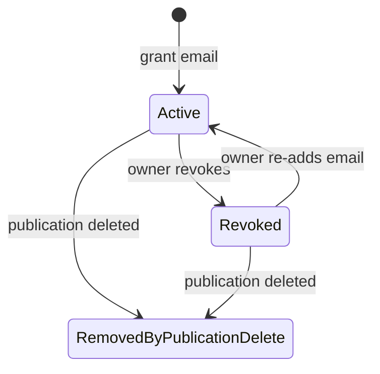
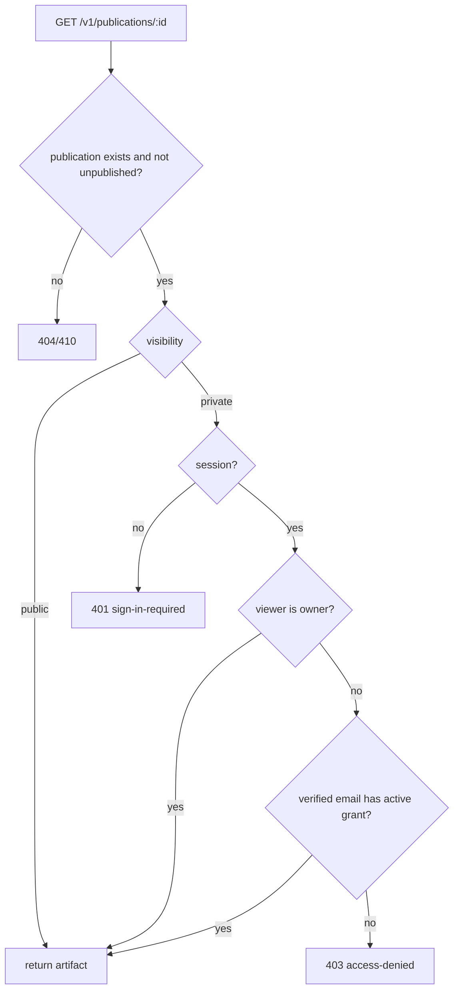
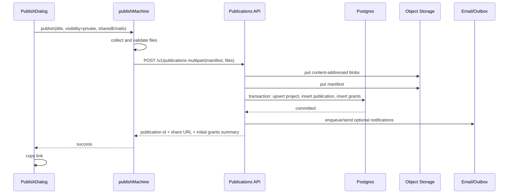
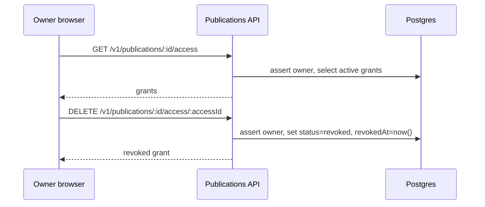

# Publication Sharing and Access Patterns

Investigate how Tau should model publication sharing for state-in-time CAD artifacts, with special focus on private publications shared to specific emails, recipient listing, revocation, and the unauthenticated private-link opener flow.

## Executive Summary

The eigenquestion is: **is a Tau publication a mutable shared project, a link gate over the current project, or an immutable state-in-time artifact with mutable access policy?** The evidence points strongly to the third model. The published CAD artifact should be immutable and atomically completed, while visibility, recipient grants, revocation, notification, and "current/latest" pointers are mutable policy around that artifact.

Tau is close to the right architecture already: `publication` stores an immutable manifest pointer and `publication_access` stores exact-email grants. The missing piece is not a new permissions framework; it is making access state first-class in the publish contract and owner UI, while tightening API semantics and private caching. The recommended pattern is: **publish creates a completed publication plus initial access grants in one coherent workflow; later management uses owner-only list/add/revoke APIs over the grant table.**

## Problem Statement

The UI now allows a private publication to be shared with specific emails, but owners cannot later see who has access or revoke access. The current flow also treats invite creation as a post-publish UI side effect instead of part of the publication/access transaction. That raises product and architecture questions:

1. What is the correct model for publishing a CAD state in time?
2. Should private sharing mutate the artifact, mutate a policy envelope, or both?
3. Should access be modeled by user id, email, link token, group, or project membership?
4. Which APIs are needed for listing, adding, revoking, and reactivating access?
5. How should private links behave for logged-out users who need to sign in and return?
6. What privacy/cache boundaries are required once a public URL can serve per-user private content?

## Methodology

1. Reviewed Tau's publication persistence and API implementation:
   - `apps/api/app/database/schema.ts`
   - `apps/api/app/api/publications/publications.dto.ts`
   - `apps/api/app/api/publications/publications.service.ts`
   - `apps/api/app/api/publications/publications.controller.ts`
2. Reviewed Tau's frontend publish and viewer surfaces:
   - `apps/ui/app/components/publish/publish-dialog.tsx`
   - `apps/ui/app/machines/publish.machine.ts`
   - `apps/ui/app/routes/v.$id/route.tsx`
   - `apps/ui/app/routes/v.$id/parsed-publication.ts`
   - `apps/ui/app/routes/v.$id/publication-topbar.tsx`
3. Re-read existing Tau sharing research:
   - `docs/research/sharing-architecture.md`
   - `docs/research/publication-viewer-layout-blueprint.md`
   - `docs/research/publication-blob-403-bucket-path-missing.md`
4. Surveyed production patterns from Google Drive, Figma, Notion, Onshape, Netlify, Vercel, and GitHub Releases, prioritizing primary documentation.

## Eigenquestion

### The wrong question

"How do we add revoke buttons to the current email textarea?"

That question is too local. It assumes the current UI-side invite effect is basically sound and merely lacks a management view.

### The real question

**What kind of object is being shared when a Tau user publishes?**

There are three plausible answers:

| Model                                                | Meaning                                                        | Consequence                                                                                            |
| ---------------------------------------------------- | -------------------------------------------------------------- | ------------------------------------------------------------------------------------------------------ |
| Mutable shared project                               | The link points at a live working tree                         | Access belongs on `project`; viewer must track current files; revocation affects ongoing collaboration |
| Link gate over current project                       | The link is stable but reads whatever the project currently is | "Copy link" is a project alias; recipients can see future changes without explicit republish           |
| Immutable state-in-time artifact with mutable policy | The link points at a completed publication manifest            | Access grants can change without changing geometry/source; republish creates a new artifact            |

Tau's published CAD viewer, content-addressed blobs, manifest document, runtime pin, and fork-from-publication behavior all point to the third answer. Publication is closer to a CAD version, deploy, or release than to a live collaborative document.

### Answer

Tau should define:

> A `Publication` is an immutable, addressable artifact representing a complete project state at publish time. Its access policy is mutable and owned by the publication owner.

That means:

- Files, entrypoint, parameters, runtime pin, kernels, title at publish, and created-at timestamp are artifact state.
- Visibility, email grants, revoked status, invite notification state, and "latest publication for project" are policy or routing state.
- Revoking access never rewrites the manifest.
- Adding a recipient never creates a new publication.
- Republishing creates a new publication id unless we intentionally introduce a separate mutable alias such as `/p/:projectId/latest`.

## External Patterns

### Pattern 1: Publish artifacts are atomic and immutable

Netlify's deploy model is the cleanest web precedent. Netlify describes atomic deploys as serving the new version only after all assets and configuration are ready, avoiding partially deployed states. It also describes immutable deploys as artifacts that do not change; future deploys create new instances, and each immutable deploy can receive a unique address.

Tau already follows this shape partly:

- Files are uploaded as content-addressed blobs.
- The publication manifest lists sha256 references.
- The publication row points at a manifest key.

The gap is that initial access grants are not created as part of the same coherent publish workflow.

Source: [Netlify deploy overview](https://docs.netlify.com/deploy/deploy-overview/), [Netlify atomic and immutable deploys](https://www.netlify.com/blog/2021/02/23/terminology-explained-atomic-and-immutable-deploys/).

### Pattern 2: Unique artifact URLs coexist with mutable "latest/live" pointers

Vercel generates a unique URL for each deployment and specifically calls out commit URLs as useful for sharing a specific point-in-time version. Netlify versions all deploys and lets owners publish a previous atomic deploy as the live version without creating a new deploy.

Tau should keep `/v/:publicationId` as the immutable artifact URL. If Tau later wants a "current project publication" link, that should be a separate alias/pointer, not a mutation of the publication artifact.

Source: [Vercel generated deployment URLs](https://vercel.com/docs/deployments/generated-urls), [Netlify manage deploys](https://docs.netlify.com/deploy/manage-deploys/manage-deploys-overview/).

### Pattern 3: CAD versioning separates immutable versions from editable workspaces

Onshape's versioning model is especially relevant because Tau publishes CAD source and geometry, not only static web assets. Onshape defines a version as a named saved document state. Versions are immutable and separate from workspaces; users can open or branch a version to create a new workspace.

Tau's publication/fork model should mirror that:

- Publication: read-only state in time.
- Fork/remix: create a new editable project/workspace from the publication.
- Republish: create a new publication from the current editable project.

Source: [Onshape Versions and History](https://cad.onshape.com/help/Content/Document/versions_and_history.htm?Highlight=version).

### Pattern 4: Access management lists explicit recipients and allows removal

Google Drive, Notion, and Figma all expose recipient management as part of the share surface. The pattern is not just "copy a link"; it is:

- Invite specific people.
- Assign a permission level.
- See who has access.
- Remove or change access later.
- Manage broader link/general access separately from explicit recipients.

Notion's share menu explicitly combines invite, "who has access", copy link, and publish-to-web management. It also documents removing individuals from a share menu. Google Drive documents entering recipient emails and controlling whether people can view, comment, or edit. Figma distinguishes link sharing, invitations, and embeds.

Tau's private publication UI should follow this split:

- Visibility: `private` or `public`.
- Explicit recipients: exact email grants.
- Recipient list: active grants with revoke controls.
- Public link: no recipient list required because anyone with link can view.

Source: [Google Drive share files](https://support.google.com/drive/answer/2494822?hl=en), [Notion sharing and permissions](https://www.notion.com/en-gb/help/sharing-and-permissions), [Figma sharing and permissions](https://help.figma.com/hc/en-us/articles/1500007609322-Guide-to-sharing-and-permissions).

### Pattern 5: Private embeds/viewers enforce the underlying sharing settings

Figma's embed documentation is a direct precedent for Tau's private publication viewer: embedded files and prototypes respect file sharing settings, and private content prompts login before rendering.

Tau should apply the same rule to `/v/:id` and future embeds:

- Do not fetch/render files until the viewer is authorized.
- Logged-out private viewers see a sign-in-required opener.
- After sign-in, redirect back to the publication URL.
- Logged-in unauthorized viewers see access denied and can ask the owner out of band.
- Embeds must respect the same publication access policy as the full viewer.

Source: [Figma embed security and access](https://developers.figma.com/docs/embeds/security-access/).

### Pattern 6: Immutable release artifacts should be complete before publishing

GitHub's immutable releases guidance recommends creating a draft, attaching all assets, then publishing so the immutable release has all assets in place. For Tau, the equivalent is: collect files, store blobs, write manifest, create publication row, create initial grants, then return/copy the link. The owner should not receive a successful private share URL before initial intended recipients are durably authorized.

Source: [GitHub immutable releases](https://docs.github.com/en/code-security/concepts/supply-chain-security/immutable-releases).

## Current Tau Architecture

### What is already correct

#### 1. Publication is already a first-class artifact

`publication` has a text id, project/owner references, visibility, manifest key, runtime pin, kernels, entry file, title, description, fork/view counts, timestamps, and soft-unpublish state.

Evidence: `apps/api/app/database/schema.ts:40-75`.

This is the right base. The publication row is not a live project; it is an addressable artifact record.

#### 2. File storage is already content-addressed

`publishFromUpload` stores each file as a sha256 blob with immutable cache headers, then writes a manifest mapping relative paths to `sha256:<digest>` references.

Evidence: `apps/api/app/api/publications/publications.service.ts:174-213`.

This matches atomic/immutable publication practice.

#### 3. Access grants are already separate from artifact state

`publication_access` stores publication id, owner id, recipient email, status, created/revoked timestamps, and a unique `(publication_id, recipient_email)` constraint.

Evidence: `apps/api/app/database/schema.ts:77-100`.

This is the correct model for email-based private publication grants. It lets an owner share with someone before they have an account and lets the same grant become usable after account creation.

#### 4. Viewer authorization already checks owner and active email grants

Private viewer access allows the owner, then checks the logged-in viewer's verified email against active publication access.

Evidence: `apps/api/app/api/publications/publications.service.ts:309-332`.

That is the correct core authorization rule for email grants.

#### 5. Owner-only list/add/revoke APIs already exist

The controller exposes:

- `GET /v1/publications/:id/access`
- `POST /v1/publications/:id/access`
- `DELETE /v1/publications/:id/access/:accessId`

Evidence: `apps/api/app/api/publications/publications.controller.ts:65-95`.

This is enough for an MVP management UI.

### What is not correct yet

#### Gap 1: Initial shared emails are not in the publish contract

`publishManifestSchema` includes project id, project name, entry file, visibility, title, description, and parameters. It does not include shared emails.

Evidence: `apps/api/app/api/publications/publications.dto.ts:4-12`.

On the client, `ClientPublishManifest` also lacks shared emails.

Evidence: `apps/ui/app/machines/publish.machine.ts:35-43`.

Instead, the publish dialog watches `publicationId` and posts one invite request per email after publication succeeds.

Evidence: `apps/ui/app/components/publish/publish-dialog.tsx:206-248`.

This violates the publication pattern we want. From the owner's point of view, "Publish private and share with these people" is one action. Today it is publish success plus a best-effort post-publish side effect.

#### Gap 2: Copy-link success races ahead of grant success

The publish dialog copies and toasts the share URL when `shareUrl` appears.

Evidence: `apps/ui/app/components/publish/publish-dialog.tsx:171-204`.

The invite effect runs independently afterward. A user can paste the link to a teammate while the teammate has not actually been granted access, or after a grant failure.

#### Gap 3: There is no owner access management surface

Backend list/add/revoke exists, but the published viewer topbar only exposes the wordmark and fork action.

Evidence: `apps/ui/app/routes/v.$id/publication-topbar.tsx`.

The owner needs a "Manage access" entry point on the published artifact because the artifact id is the thing being shared.

#### Gap 4: The parsed publication projection lacks `ownerId`

The API DTO includes `ownerId`, but the UI parser currently keeps owner snapshot, counts, and createdAt without retaining ownerId.

Evidence: `apps/api/app/api/publications/publications.dto.ts:67-88`, `apps/ui/app/routes/v.$id/parsed-publication.ts:13-23`.

Without `ownerId` or an API-supplied `viewerRole`, the UI cannot reliably show an owner-only management button.

#### Gap 5: `GET /access` returns revoked grants with active grants

`listAccessGrants` selects all grants for a publication and sorts by created time. It does not filter to `status = active`.

Evidence: `apps/api/app/api/publications/publications.service.ts:418-427`.

For "who can view this now", revoked grants should not appear in the primary list. Revoked history can be added later as an audit mode.

#### Gap 6: Email validation normalizes after validation

`invitePublicationAccessSchema` uses `z.email().transform((value) => value.trim().toLowerCase())`.

Evidence: `apps/api/app/api/publications/publications.dto.ts:129-132`.

Because validation happens before the transform, whitespace around an otherwise valid email can fail. Use trim/lowercase before email validation.

#### Gap 7: Invite email notification is coupled to grant creation

`inviteAccess` always calls `emailService.sendPublicationInvite` after creating/reactivating a grant.

Evidence: `apps/api/app/api/publications/publications.service.ts:466-473`.

That may be fine, but it should be a product decision exposed in naming/API shape. "Grant access" and "send notification" are not the same action. The feature requested by the UI is access control; notifications are optional behavior.

#### Gap 8: Private publication loader uses long CDN-backed route headers

The `/v/:id` loader creates `cdnBackedSsrRouteHeaders(cacheTag.publicationViewer, 'long')` for successful responses.

Evidence: `apps/ui/app/routes/v.$id/route.tsx:116-124`.

That is unsafe for private publications and for per-user authorization outcomes. Private publication responses and lock responses should be `private, no-store`.

## Target Model

### Concepts

| Concept                | Mutable?            | Stored where                                  | Notes                                                          |
| ---------------------- | ------------------- | --------------------------------------------- | -------------------------------------------------------------- |
| Publication artifact   | No                  | `publication` row plus manifest/blob storage  | Files, entry file, parameters, runtime pin, kernels, createdAt |
| Visibility             | Yes                 | `publication.visibility`                      | `private` or `public`; could change without new artifact       |
| Explicit email grant   | Yes                 | `publication_access`                          | Active/revoked exact email access                              |
| Notification           | Yes/event           | email outbox or service call                  | Optional side effect, not the authorization primitive          |
| Current/latest pointer | Yes                 | `project.currentPublicationId` or alias table | Separate from immutable `/v/:publicationId`                    |
| Fork/remix             | New mutable project | `project.forkedFrom` / future project state   | Branch from publication, like CAD version to workspace         |

### Access states



Soft revocation is the right default. It preserves auditability and makes reactivation idempotent.

### Viewer authorization flow



This is already close to the current service implementation. The UI needs to keep the original URL through sign-in and the route headers need to respect privacy.

## Recommended API Shape

### Publish with initial grants

Add optional `sharedEmails` to the publish manifest:

```ts
type PublishManifest = {
  projectId: string;
  projectName: string;
  entryFile: string;
  visibility: 'private' | 'public';
  title: string;
  description?: string;
  parameters?: Record<string, unknown>;
  sharedEmails?: string[];
  notifyRecipients?: boolean;
};
```

Rules:

- `sharedEmails` is only meaningful when `visibility === 'private'`.
- Normalize emails server-side with trim + lowercase before validation.
- Dedupe server-side.
- Enforce a reasonable max, for example 50 recipients per publication for MVP.
- Creating the publication row and initial grants should happen in the same database transaction.
- Notification, if enabled, should happen after commit or through an outbox so email failure does not roll back access.

The key distinction: **access grants should be durable before the publish operation reports success**, but email notification delivery should not be required for publication success.

### Manage access after publish

Keep the existing endpoints, but refine semantics:

```http
GET /v1/publications/:id/access
POST /v1/publications/:id/access
DELETE /v1/publications/:id/access/:accessId
```

Recommended behavior:

- `GET` returns active grants by default.
- Optional later: `GET ?includeRevoked=true` for audit/history.
- `POST` creates or reactivates an exact-email grant.
- `DELETE` soft-revokes a grant.
- Mutations remain owner-only.
- `POST` should be idempotent for already-active grants and should not resend notification unless explicitly requested.

### Optional bulk API

A bulk replacement endpoint is not required for MVP, but it is a useful future primitive:

```http
PUT /v1/publications/:id/access
```

With body:

```json
{
  "activeEmails": ["a@example.com", "b@example.com"],
  "notifyNewRecipients": false
}
```

This would be useful for a multi-select management dialog, but add/revoke APIs are enough for the first owner UI.

### Viewer role

Add one of:

```ts
viewerRole: 'anonymous' | 'owner' | 'grantee' | 'public';
```

or preserve `ownerId` in `ParsedPublication` and compare against session client-side.

The API-enforced security remains in the backend either way. The viewer role exists only to drive UI affordances such as "Manage access".

Preferred: return `viewerRole` from `GET /v1/publications/:id`, because it lets the server summarize the auth result without making every frontend consumer repeat role logic.

## Recommended UI Shape

### Publish dialog

The private mode section should collect recipients before publish and validate them before upload:

- Use chips/token input or a textarea with parsed recipient preview.
- Show invalid emails inline.
- Dedupe before submit.
- Button can remain "Copy Link", but success should mean:
  - publication exists,
  - initial grants exist,
  - link was copied or copy failed with recoverable error.

The dialog should no longer fire a post-publish invite effect.

### Published viewer owner controls

The primary management surface should live on `/v/:publicationId`, not only in the editor's Share button. The publication id is the unambiguous access target.

Owner-only topbar action:

- Button: icon-only or compact "Share" / "Manage access".
- Dialog title: "Manage access".
- Show visibility status.
- For private:
  - active recipient list,
  - add email,
  - revoke per recipient,
  - copy link.
- For public:
  - public link copy,
  - explanation-free status text,
  - optional "Make private" only when visibility mutation is supported.

### Recipient row fields

MVP:

- recipient email
- grant created date
- revoke button

Later:

- matching user avatar/name if an account exists for that verified email
- last viewed date
- notification state
- invited by

Do not make user id required for grants. Email-first grants are the right product primitive because a recipient may not have a Tau account yet.

### Logged-out private opener

The current private lock screen pattern is correct in spirit:

- "This design is private"
- Sign in / create account
- After auth, redirect back to `/v/:publicationId`

Requirements:

- Preserve the full return path and query string through auth.
- Do not render or fetch blobs before authorization.
- If the newly signed-in account's verified email matches an active grant, render the publication.
- If not, show access denied and "Ask the owner to share with you."

## Recommended Data Flow

### Initial private publish



### Later revoke



## Recommendations

| #   | Action                                                                                                                                      | Priority | Effort | Impact |
| --- | ------------------------------------------------------------------------------------------------------------------------------------------- | -------- | ------ | ------ |
| R1  | Treat publications as immutable artifacts with mutable access policy. Document this as the product/architecture rule.                       | P0       | S      | High   |
| R2  | Add `sharedEmails?: string[]` to the publish manifest and publish machine. Create initial private grants as part of the publish workflow.   | P0       | M      | High   |
| R3  | Remove the post-publish invite `useEffect` from `PublishDialog`; publish success should not race with grant creation.                       | P0       | S      | High   |
| R4  | Add owner-only `PublicationAccessDialog` on `/v/:id` with list/add/revoke/copy-link flows.                                                  | P0       | M      | High   |
| R5  | Preserve or expose viewer ownership state, preferably as `viewerRole`, so the UI can show management affordances only to owners.            | P0       | S      | High   |
| R6  | Change `GET /access` to return active grants by default; defer revoked history unless an audit UI is introduced.                            | P1       | S      | Medium |
| R7  | Decouple authorization grant creation from email notification. Add explicit notification semantics or an outbox before relying on email.    | P1       | M      | Medium |
| R8  | Fix email normalization so trim/lowercase happens before email validation; add dedupe and recipient cap.                                    | P0       | S      | High   |
| R9  | Use `private, no-store` for private viewer responses and all private lock/error responses. Keep long CDN headers only for public artifacts. | P0       | S      | High   |
| R10 | Add API and UI tests for owner listing, adding, revoking, reactivating, unauthorized mutation, and private viewer grant checks.             | P0       | M      | High   |
| R11 | Later, introduce a mutable "latest/current publication" alias if product wants one. Keep `/v/:publicationId` immutable.                     | P2       | M      | Medium |
| R12 | Later, enrich access list recipients with matched user profile data by email, without changing grants to require user ids.                  | P3       | M      | Low    |

## Implementation Status

Implemented R1-R10 in the publication stack:

- R1: The publication model is now treated in code as an immutable artifact with mutable access policy: the artifact URL remains `/v/:publicationId`, while explicit recipient grants live in `publication_access` and can be managed independently after publish.
- R2/R3/R8: `sharedEmails` and `notifyRecipients` are part of the publish manifest, normalized and deduped server-side, capped at 50 recipients, rejected for public publications, and persisted as initial private grants inside the publish workflow instead of a post-publish UI side effect.
- R4/R5/R6/R7: `GET /v1/publications/:id` returns `viewerRole`; owner-only viewer controls now open a `PublicationAccessDialog` that lists active grants, adds/reactivates exact-email grants, revokes grants, and copies the publication link. Notification is explicit and best-effort rather than coupled to grant authorization.
- R9: Private publication loader responses and lock responses use `Cache-Control: private, no-store`; public publication responses remain on the CDN-backed cache path.
- R10: Targeted API/UI coverage now includes DTO validation, publish-with-grants, owner role projection, active access list semantics, add/revoke HTTP routes, shared-email publish UI validation, tag-entry behavior, owner-only access controls, access-dialog list/add/revoke flows, route cache headers, and parsed `viewerRole`.

Deferred intentionally:

- R11: Mutable "latest/current publication" alias remains future work.
- R12: Recipient profile enrichment by matched verified email remains future work.

## Trade-offs

### Email grants vs user-id grants

| Option         | Pros                                                                                  | Cons                                                     | Verdict                 |
| -------------- | ------------------------------------------------------------------------------------- | -------------------------------------------------------- | ----------------------- |
| Email grants   | Works before signup; matches Google/Notion/Figma invite UX; simple owner mental model | Requires verified email check; email changes need policy | Recommended             |
| User-id grants | Strong identity binding; no email-change ambiguity                                    | Cannot share before signup; awkward invite flow          | Not for MVP             |
| Link tokens    | Easy anonymous access; no account required                                            | Harder revocation semantics; forwardable; weaker privacy | Keep out of private MVP |
| Passwords      | Familiar for lightweight embeds                                                       | Shared secret, poor audit, no recipient list             | Defer or avoid          |
| Groups/orgs    | Scales team use                                                                       | Needs org/team model first                               | Future enterprise layer |

### Mutable visibility on immutable publication

Changing a publication from private to public does not mutate the artifact; it mutates the policy envelope. This is acceptable.

Changing title/description is more ambiguous. Existing Tau stores title/description on the publication row. For now, treat them as artifact metadata captured at publish time. If product later wants editable descriptions, distinguish `publishedTitle` from mutable display metadata.

### Sending emails

Access grant creation should be reliable and transactional. Email is notification, not authorization. The safest implementation is:

1. Commit publication and grants.
2. Enqueue notification jobs for new recipients if requested.
3. Show access success even if notification delivery is pending.

If no outbox exists yet, sending best-effort after commit is acceptable, but UI copy should say access was granted, not "invite email sent", unless the mail call succeeded.

## Implementation Plan

### Phase 1: Correct the model and backend contract

1. Add `sharedEmails` to `publishManifestSchema`.
2. Add server-side email list schema:
   - trim
   - lowercase
   - email validation
   - dedupe
   - max count
3. In `publishFromUpload`, create initial `publication_access` rows inside the existing DB transaction when `visibility === 'private'`.
4. Return optional `access` summary in `PublishResponse`, or keep response minimal and let UI fetch access after success.
5. Refine `GET /access` to active grants by default.
6. Make `POST /access` idempotent and notification-explicit.
7. Add tests for DTO parsing, publish-with-grants, invite/reactivate, revoke, and viewer access.

### Phase 2: Correct the publish UI

1. Add `sharedEmails` to `PublishDraft`, publish event, `ClientPublishManifest`, and upload actor.
2. Replace post-publish invite effect with pre-submit parsing/validation.
3. Ensure "Copy Link" success waits for API success with grants already persisted.
4. Adjust private visibility label from "only you" to "only you and people you share with."
5. Add UI tests for valid/invalid/deduped recipients.

### Phase 3: Add access management UI

1. Add `viewerRole` to the publication view response, or preserve `ownerId` in the parsed publication.
2. Add an owner-only manage access action to `PublicationTopbar`.
3. Build `PublicationAccessDialog` with:
   - load active grants,
   - add email,
   - revoke grant,
   - copy link,
   - empty state.
4. Reuse existing button/toast/copy patterns; avoid a parallel share component with different behavior.
5. Add UI tests for list/add/revoke and owner-only rendering.

### Phase 4: Private-route correctness

1. Use `private, no-store` for private publication route responses.
2. Ensure 401/403 lock responses are not CDN-cacheable.
3. Preserve return URL through sign-in and account creation.
4. Verify no blob URLs are fetched before authorization.
5. Add route-level tests for public cache headers, private cache headers, and lock response headers.

## API Sketch

### DTOs

```ts
const normalizedEmailSchema = z.string().trim().toLowerCase().pipe(z.email());

const sharedEmailsSchema = z
  .array(normalizedEmailSchema)
  .max(50)
  .transform((emails) => [...new Set(emails)]);

export const publishManifestSchema = z.object({
  projectId: z.string().min(1),
  projectName: z.string().min(1),
  entryFile: z.string().min(1),
  visibility: z.enum(['private', 'public']),
  title: z.string().min(1),
  description: z.string().optional(),
  parameters: z.record(z.string(), z.unknown()).optional(),
  sharedEmails: sharedEmailsSchema.optional(),
  notifyRecipients: z.boolean().optional(),
});
```

### Transaction sketch

```ts
await db.transaction(async (tx) => {
  await upsertProject(tx);
  await insertPublication(tx);
  await updateCurrentPublicationPointer(tx);

  if (manifest.visibility === 'private') {
    await upsertPublicationAccessGrants(tx, {
      publicationId,
      ownerId,
      recipientEmails: manifest.sharedEmails ?? [],
    });
  }
});
```

## Open Questions

| Question                                                          | Recommended default                                                                                                                                     |
| ----------------------------------------------------------------- | ------------------------------------------------------------------------------------------------------------------------------------------------------- |
| Can private publications be changed to public later?              | Yes, as policy mutation; no new artifact.                                                                                                               |
| Can public publications be changed to private later?              | Yes, but owner should understand existing recipients/public crawlers may have cached metadata.                                                          |
| Should email notification be automatic?                           | No for architecture; product may default it on, but API should distinguish notification from grant.                                                     |
| Should grants require verified email?                             | Yes for access. Unverified accounts should be prompted to verify before viewing.                                                                        |
| Should owners see revoked history?                                | Defer. Active access list first; audit history later.                                                                                                   |
| Should revocation invalidate currently open sessions immediately? | MVP can enforce on next loader/API fetch. Realtime revocation can come later.                                                                           |
| Should grants attach to project or publication?                   | Publication for MVP. Project-level sharing is a different collaboration feature.                                                                        |
| Should "latest publication" inherit previous access grants?       | Yes if product treats republish as updating a shared artifact. Copy active grants from current publication when republishing, unless user changes them. |

## References

- [Google Drive: Share files](https://support.google.com/drive/answer/2494822?hl=en)
- [Figma: Guide to sharing and permissions](https://help.figma.com/hc/en-us/articles/1500007609322-Guide-to-sharing-and-permissions)
- [Figma embeds: Security and access](https://developers.figma.com/docs/embeds/security-access/)
- [Notion: Sharing and permissions](https://www.notion.com/en-gb/help/sharing-and-permissions)
- [Onshape: Versions and History](https://cad.onshape.com/help/Content/Document/versions_and_history.htm?Highlight=version)
- [Netlify: Deploy overview](https://docs.netlify.com/deploy/deploy-overview/)
- [Netlify: Manage deploys](https://docs.netlify.com/deploy/manage-deploys/manage-deploys-overview/)
- [Netlify: Atomic and immutable deploys](https://www.netlify.com/blog/2021/02/23/terminology-explained-atomic-and-immutable-deploys/)
- [Vercel: Generated deployment URLs](https://vercel.com/docs/deployments/generated-urls)
- [GitHub Docs: Immutable releases](https://docs.github.com/en/code-security/concepts/supply-chain-security/immutable-releases)
