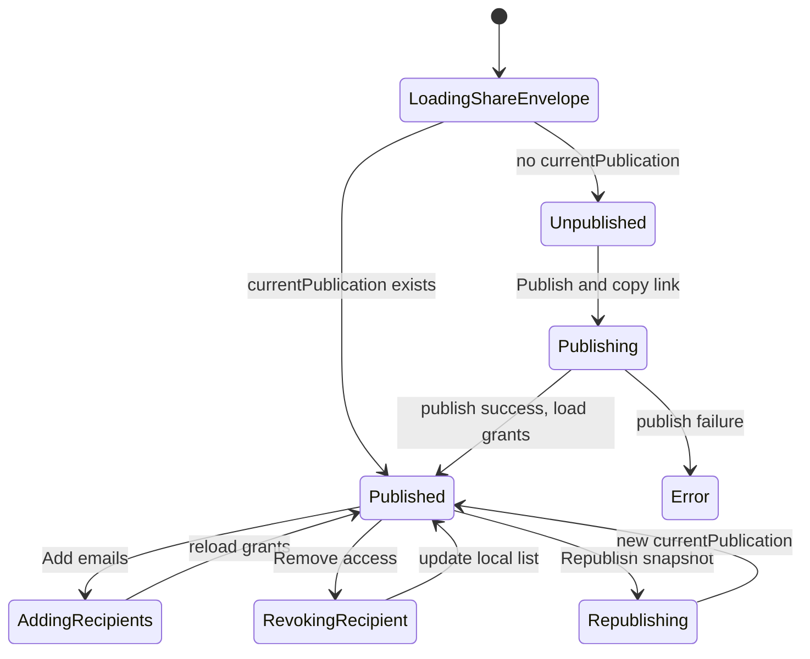

# Publication Sharing Dialog UX Patterns

Investigate best-in-class sharing UI patterns and recommend how Tau should let owners publish, copy links, list recipients, add recipients, and revoke access without leaving the chat editor.

## Executive Summary

The standard UX pattern across Google Drive, Notion, Figma, Miro, Box, and Onshape is not "publish here, manage access somewhere else." The common pattern is a **source-context Share dialog** opened from the object being edited or listed. That dialog combines recipient entry, link access, people-with-access, role/status controls, copy link, notification options, and removal/revocation.

Tau should keep `/v/:publicationId` as an immutable artifact viewer, but the primary sharing control should live in the editor's `Share` dialog. The editor share dialog should resolve the project's current/latest publication, show its access list, and allow add/revoke/copy-link in place. If no publication exists, the same dialog starts in a publish form; after publishing succeeds, it should transition into manage-access state for the newly created publication instead of asking the owner to visit `/v/:id`.

## Problem Statement

Tau currently collects initial private recipients in the chat editor publish dialog, but the revoke/list UI lives on the published viewer page. This creates a non-standard and cumbersome owner workflow:

1. Owner opens editor.
2. Owner clicks Share.
3. Owner publishes or copies link.
4. To see or revoke recipients, owner must open the published `/v/:publicationId` page.
5. Owner must leave the source context to find access controls on the viewer.

This breaks the expectation established by common collaboration products: owners expect the same **Share** button near the editable object to be the place where they can manage access later.

## Methodology

Reviewed primary product documentation and Tau source code:

External pattern review:

- Google Drive sharing and general access docs.
- Notion sharing and publishing menu docs.
- Figma sharing and remove/adjust access docs.
- Miro board sharing and sharing settings docs.
- Box collaborator management docs.
- Onshape document sharing docs, used as the CAD-specific comparison point.

Tau implementation review:

- `apps/ui/app/routes/projects_.$id/project-share-action.tsx`
- `apps/ui/app/components/publish/project-share-dialog.tsx`
- `apps/ui/app/components/publish/publication-access-panel.tsx`
- `apps/api/app/api/publications/publications.controller.ts`
- `apps/api/app/api/publications/publications.service.ts`
- `docs/research/publication-sharing-access-patterns.md`

## Findings

### Finding 1: Best-in-class products anchor access management in the source-context Share dialog

The strongest shared pattern is that a user opens **Share** from the object they are already working with. That same dialog supports initial sharing and later management.

| Product      | Entry point                                          | What the same share surface does                                                                                                     | Evidence                                                                                                                                                          |
| ------------ | ---------------------------------------------------- | ------------------------------------------------------------------------------------------------------------------------------------ | ----------------------------------------------------------------------------------------------------------------------------------------------------------------- |
| Google Drive | Open file/list row → Share                           | Enter recipients, choose Viewer/Commenter/Editor, optionally notify, configure "General access", copy link, email people with access | Google Drive docs describe opening Share from the file, entering recipients, choosing a role, optional notification, configuring general access, and copying link |
| Notion       | Page top bar → Share                                 | Invite someone, see/change who has access, copy page link, open Publish tab for web publishing                                       | Notion docs state the Share menu lets users invite, see/change access, copy link, and open Publish                                                                |
| Figma        | File/prototype → Share                               | Direct invitation, link sharing, permission adjustment/removal                                                                       | Figma docs describe sharing by link or invitation, and separate remove/adjust access controls for file/project permissions                                        |
| Miro         | Board top-right → Share                              | Invite by email, set link access, open Sharing settings, list people with access, change role, remove collaborators                  | Miro docs explicitly route sharing settings through the Share button and show removal from that share window                                                      |
| Box          | File/folder/sidebar → Sharing / Manage Collaborators | View collaborators, change roles, remove collaborators, manage expiration                                                            | Box docs route collaborator management from the file/folder context and sidebar                                                                                   |
| Onshape      | Document → Share dialog                              | Link sharing, listed users, permission editing, remove with x, public access control                                                 | Onshape docs show link sharing and listed-user management inside the Share dialog                                                                                 |

Analysis: Users do not distinguish "the place I create the link" from "the place I revoke access." They treat both as operations on the same share envelope. Tau's current split makes sense architecturally, but it violates this UX expectation.

### Finding 2: "People with access" is a core section, not a separate destination

Best-in-class dialogs include a visible or expandable list of current access holders:

- Notion says the Share menu lets users "see and change who has access."
- Miro sharing settings list people with access via email and allow role changes/removal.
- Onshape has a "Listed users" area where permissions appear next to each email, with controls to edit or remove.
- Box has collaborator management with search/filter, role modification, and removal.

Recommendation implication: Tau's editor Share dialog should include a **People with access** section when a current publication exists. It should not hide access state behind "open published page."

### Finding 3: Public/link access and explicit recipients are usually managed side by side

Common products separate, but co-locate:

| Access axis         | Common UI label                                    | Tau equivalent                          |
| ------------------- | -------------------------------------------------- | --------------------------------------- |
| Explicit recipients | People with access / Invite people / Collaborators | `publication_access` exact-email grants |
| General access      | Restricted / Anyone with link / Anyone on web      | `publication.visibility` private/public |
| Link action         | Copy link / Copy board link / Copy to clipboard    | `/v/:publicationId` share URL           |
| Role                | Viewer / Commenter / Editor / View-only            | MVP has view-only grants                |
| Notify              | Send notification / optional message               | `notifyRecipients`                      |
| Removal             | Remove / x / No access / revoke public link        | soft-revoke `publication_access`        |

Tau currently has the primitives, but not the co-located surface.

### Finding 4: Publishing to web is often a tab or state inside the same Share menu

Notion explicitly places "Publish" as a tab available from the Share menu, while still keeping invite, who-has-access, and copy-link in that sharing frame. Google also distinguishes publishing from file sharing, but exposes sharing from within the file and calls out that published files still require a link plus access choices for collaborative use.

Recommendation implication: Tau can preserve "Publish project" as the first-time action, but after a publication exists the same top-right **Share** button should stop feeling like a one-shot publish form. It should become a share manager with a "Published link" section and a "Republish snapshot" affordance.

### Finding 5: CAD precedent favors in-document sharing, not viewer-only management

Onshape is the closest product precedent because it is CAD-oriented and has document-specific permissions. Its model is clear:

- Open a document's Share dialog.
- Copy a document-specific link.
- See listed users/teams/companies.
- Change permissions beside each entry.
- Remove with a control in the same dialog.
- Revoke link/public access in the same sharing dialog.

Tau publications are immutable snapshots rather than live Onshape documents, but the UX expectation is still source-context management. The source editor is where owners think "this is my design." The published viewer is where recipients consume it.

### Finding 6: Tau's current architecture can support the standard pattern, but needs one missing query/API shape

Current useful primitives:

- `project.currentPublicationId` exists in the backend persistence model.
- Publish returns the created publication id and share URL.
- `GET /v1/publications/:id/access` lists active grants.
- `POST /v1/publications/:id/access` adds/reactivates grants.
- `DELETE /v1/publications/:id/access/:accessId` revokes grants.
- `GET /v1/publications/:id` returns `viewerRole`.

Missing or awkward primitives for editor-based sharing:

- The editor UI does not have a clean "current publication summary for this project" API.
- The pre-implementation editor Share action only opened a publish-only modal; it did not know whether the project already had a current publication.
- The pre-implementation publish modal had local publish-machine state but did not fetch/manage persisted access for an existing publication.
- The pre-implementation access-management UI was tied to `ParsedPublication` from the viewer route, not a reusable publication access model for the editor.

This is not a paradigm failure. It is a missing **source-context share envelope** abstraction.

### Finding 7: The primary object in the UI should be "shared link for this project snapshot"

The architecture research correctly defined a publication as an immutable state-in-time artifact with mutable access policy. The UX layer needs one more concept:

> The editor Share dialog manages the project's current published snapshot and its mutable access policy.

That gives users the normal mental model:

- "Share" opens the current share state.
- If nothing is published, "Share" starts the publish flow.
- If something is published, "Share" shows the link and who can open it.
- If the project changed after publishing, "Share" shows "Published snapshot is out of date" and offers Republish.
- Revoking access does not require entering recipient mode or published-viewer mode.

### Finding 8: The viewer manage-access affordance should remain secondary

Keeping owner controls on `/v/:publicationId` is still useful:

- Owners who arrive via the published link can manage access there.
- It validates `viewerRole` and API authorization.
- It mirrors common products where viewers/editors sometimes also have a share button in the consumption surface.

But it should not be the only path. The editor is the primary owner workflow.

## Recommended UX Model

### Share Dialog: single entry point from editor

Top-right `Share` button in the chat editor should open a **ProjectShareDialog** with three states:

| State             | Trigger                                                                 | Primary content                                                               |
| ----------------- | ----------------------------------------------------------------------- | ----------------------------------------------------------------------------- |
| Unpublished       | No current publication exists                                           | Publish form: title, description, visibility, recipients, publish/copy        |
| Published current | Current publication exists and project has no known unpublished changes | Copy link, visibility, people with access, add/revoke, optional republish     |
| Published stale   | Current publication exists and project has changed since publication    | Same as published current, plus "Republish to update shared snapshot" callout |

The dialog should not force navigation to `/v/:id`.

### Dialog layout recommendation

```text
Share

[Published link]        Private
https://tau.new/v/pub_...
[Copy link]

Access
( ) Private: only invited emails can open while signed in
( ) Public: anyone with the link can view

People with access
[ teammate@example.com, reviewer@example.com ]  [Add]

Owner
Rifont                                      Owner
teammate@example.com                       View  [⋯ / Remove]
reviewer@example.com                       View  [⋯ / Remove]

[Republish snapshot] [Done]
```

For first publish, the top section becomes:

```text
Share

Title
Description

Access
(*) Private
( ) Public

People to invite
[ teammate@example.com, reviewer@example.com ]

[Publish and copy link]
```

After `Publish and copy link` succeeds, the same modal should transition to the published/manage state with the link copied and the recipient list loaded.

### Rename and frame the action

Recommended labels:

| Current label                         | Recommended label                                                | Why                                                                |
| ------------------------------------- | ---------------------------------------------------------------- | ------------------------------------------------------------------ |
| Publish project                       | Share                                                            | The user clicked Share; publishing is an implementation step       |
| Copy Link                             | Publish and copy link when unpublished; Copy link when published | Clarifies first-time action vs repeat copy                         |
| Share with specific emails (optional) | People with access                                               | Matches common product language                                    |
| Public / Private                      | General access: Private / Public link                            | Separates broad access from direct recipients                      |
| Viewer-page owner management          | Remove from MVP                                                  | Owner access management belongs in the source-context Share dialog |

### Recipient controls

MVP rows:

- Email.
- Role label: `View`.
- Overflow menu or icon button with `Remove access`.

Future rows:

- Avatar/name if matched to a verified account.
- Last opened.
- Pending invite/notification state.
- Expiration.

Recommendation: use an overflow menu for row actions if adding more than revoke; use a visible trash/remove button only if the row is simple and the dialog is obviously an access-management surface.

### Visibility controls

For Tau R1:

- Preserve current create-time visibility options.
- Show current visibility in the dialog.
- If mutation from private to public/public to private is not yet supported, do not show a fully interactive radio group for existing publications. Show read-only visibility plus a "Change visibility" disabled/deferred affordance or a later mutation task.

For R2:

- Add `PATCH /v1/publications/:id/access-policy` or `PATCH /v1/publications/:id` for owner-only visibility changes.
- Then the same dialog can update general access directly.

### Publish snapshot status

Because Tau publishes immutable artifacts, the editor Share dialog should say which snapshot is currently shared:

| Case                          | UI copy                                                                                  |
| ----------------------------- | ---------------------------------------------------------------------------------------- |
| No publication                | "Create a shared snapshot of this project."                                              |
| Current publication exists    | "Shared snapshot created {relative time}."                                               |
| Project changed since publish | "Your project has unpublished changes. People with this link see the previous snapshot." |

This avoids the common confusion that a shared link always reflects live editor state.

## Recommended Architecture

### Add a source-context share envelope API

Add an API that gives the editor everything needed to render the standard share dialog:

```http
GET /v1/projects/:projectId/share
```

Response:

```ts
type ProjectShareEnvelope = {
  project: {
    id: string;
    name: string;
    description?: string;
  };
  currentPublication: null | {
    id: string;
    title: string;
    description?: string;
    visibility: 'private' | 'public';
    createdAt: string;
    urls: {
      share: string;
    };
    access: {
      grants: Array<{
        id: string;
        recipientEmail: string;
        status: 'active';
        createdAt: string;
      }>;
    };
  };
  snapshot: {
    state: 'unpublished' | 'published-current' | 'published-stale';
    lastPublishedAt?: string;
  };
};
```

Why a project-scoped endpoint:

- The editor naturally knows `projectId`, not necessarily `publicationId`.
- It avoids duplicating "find current publication, then fetch access grants" in the client.
- It gives the API a place to compute stale/current status.
- It keeps `/v/:publicationId` immutable and recipient-oriented.

### Reuse access mutations

Continue using publication-scoped mutations for grants:

```http
POST /v1/publications/:publicationId/access
DELETE /v1/publications/:publicationId/access/:accessId
```

The project share dialog can call these once `currentPublication` is known.

### Refactor UI components around a shared access panel

Recommended component split:

```text
ProjectShareAction
  ProjectShareDialog
    ProjectShareUnpublishedForm
    ProjectSharePublishedPanel
      PublicationLinkSection
      PublicationAccessPolicySection
      PublicationPeopleWithAccess
        PublicationEmailTagsField
        PublicationAccessGrantRow
```

Then both editor and viewer can reuse:

```text
PublicationPeopleWithAccess
PublicationEmailTagsField
PublicationAccessGrantRow
PublicationLinkSection
```

The published viewer should not carry owner access-management chrome in the MVP; the reusable access panel belongs in the editor Share dialog.

### State machine integration

Recommended editor flow:



## Recommendations

| #   | Action                                                                                                                                             | Priority | Effort | Impact |
| --- | -------------------------------------------------------------------------------------------------------------------------------------------------- | -------- | ------ | ------ |
| R1  | Replace the editor's publish-only modal with a source-context `ProjectShareDialog` opened by the existing Share button.                            | P0       | M      | High   |
| R2  | Add `GET /v1/projects/:projectId/share` to return current publication, share URL, visibility, access grants, and snapshot freshness.               | P0       | M      | High   |
| R3  | After first publish, transition the same dialog into manage-access state instead of requiring navigation to `/v/:id`.                              | P0       | S      | High   |
| R4  | Move the "People with access" list/add/revoke UI into the editor share dialog as the primary owner workflow.                                       | P0       | M      | High   |
| R5  | Remove viewer-page owner share/manage controls; published viewer pages are recipient consumption surfaces only.                                    | P1       | S      | Medium |
| R6  | Rename first-time CTA to "Publish and copy link"; use "Copy link" only once a current publication already exists.                                  | P1       | S      | Medium |
| R7  | Show immutable snapshot status in the editor share dialog: unpublished, shared snapshot created, or project has unpublished changes.               | P1       | M      | High   |
| R8  | Defer visibility mutation UI until a real owner-only visibility update API exists; avoid fake editable radios for existing publications.           | P1       | S      | Medium |
| R9  | Add tests for reopening Share after publish, listing grants in editor, revoking without visiting `/v/:id`, and first-publish-to-manage transition. | P0       | M      | High   |
| R10 | Document this as the publication sharing UX rule once implemented: access management belongs in the source-context Share dialog.                   | P2       | S      | Medium |

## Trade-offs

### Editor share dialog vs viewer manage dialog

| Option                         | Pros                                                                                  | Cons                                                                   | Verdict                          |
| ------------------------------ | ------------------------------------------------------------------------------------- | ---------------------------------------------------------------------- | -------------------------------- |
| Viewer-only management         | Reuses publication id context; simple auth role check                                 | Cumbersome; non-standard; makes owners leave editor; hard to discover  | Not sufficient                   |
| Editor-only management         | Matches owner workflow; one place to publish/manage; avoids redundant viewer controls | Owners return to source context for changes                            | Recommended                      |
| Both, separate implementations | Fast to add                                                                           | Drift and inconsistent behavior likely                                 | Avoid                            |
| Both, shared panel component   | Direct viewer convenience                                                             | Still splits the owner workflow after the source-context dialog exists | Defer unless evidence demands it |

### Project-scoped share envelope vs client-side orchestration

| Option                                           | Pros                                                                          | Cons                                                                                          | Verdict           |
| ------------------------------------------------ | ----------------------------------------------------------------------------- | --------------------------------------------------------------------------------------------- | ----------------- |
| Client fetches project, publication, then access | No new API                                                                    | More round trips; spreads current-publication logic into UI                                   | Avoid for main UX |
| Project share envelope API                       | Single source-context query; easy dialog state; server computes current/stale | New endpoint                                                                                  | Recommended       |
| Reuse `/v1/publications/:id` only                | Already exists                                                                | Editor may not know id; viewer response carries manifest/blob URLs not needed for share modal | Keep for viewer   |

## Implementation Roadmap

### Phase 1: Unify the share dialog surface

1. Create `ProjectShareDialog`.
2. Move first-time publish form into `ProjectShareUnpublishedForm`.
3. Extract the access list/add/revoke behavior into reusable editor-owned components.
4. Change `ProjectShareAction` to open `ProjectShareDialog`.

### Phase 2: Add share envelope data

1. Add `GET /v1/projects/:projectId/share`.
2. Return current publication summary and active grants when `currentPublicationId` exists.
3. Add snapshot freshness signal.
4. Add API tests for owner-only access, no-publication state, current-publication state, and active grants.

### Phase 3: Improve post-publish behavior

1. On publish success, keep the dialog open.
2. Copy the link.
3. Load the new current publication access envelope.
4. Show People with access and revoke controls immediately.

### Phase 4: Remove redundant viewer controls

1. Remove the `/v/:id` owner Share button.
2. Delete the viewer-only access dialog.
3. Keep the published viewer focused on view/remix consumption.

## Implementation Status

Implemented R1-R10 in the source-context sharing pass:

- R1/R3/R6/R7/R8: the editor Share button opens `ProjectShareDialog`, first publish uses `Publish and copy link`, post-publish stays in the same dialog, existing publications show `Copy link`, read-only visibility, and current/stale snapshot copy.
- R2/R4/R9: the publications API now exposes `GET /v1/projects/:projectId/share`, returning an owner-checked share envelope with the current publication and active grants; API coverage includes missing project mirrors, unpublished pointers, forbidden projects, and active grant projection.
- R4/R9: `PublicationAccessPanel` owns People with access, add-email, and revoke flows from the editor dialog, reusing the email tag selector component and covered by UI tests.
- R5: the `/v/:id` viewer Share/manage access button and viewer-specific access dialog were removed; the viewer remains a consumption surface with Remix.
- R10: this document now records the implemented owner workflow and the revised viewer-page removal decision.

## References

- Google Drive: [Share files from Google Drive](https://support.google.com/drive/answer/2494822/?hl=en)
- Notion: [Sharing and permissions](https://www.notion.com/en-gb/help/sharing-and-permissions)
- Figma: [Share files and prototypes](https://help.figma.com/hc/en-us/articles/360040531773-Share-files-and-prototypes)
- Figma: [Remove or adjust access](https://help.figma.com/hc/en-us/articles/360040530793-Remove-or-adjust-access)
- Miro: [Sharing boards and inviting collaborators](https://help.miro.com/hc/en-us/articles/360017730813-Sharing-boards-and-inviting-collaborators)
- Miro: [Board access rights](https://help.miro.com/hc/en-us/articles/360017572194-Board-access-rights)
- Box: [Managing Collaborators](https://support.box.com/hc/en-us/articles/360044196273-Managing-Collaborators)
- Onshape: [Share Documents](https://cad.onshape.com/help/Content/Collaboration/share_documents.htm?Highlight=share+document)
