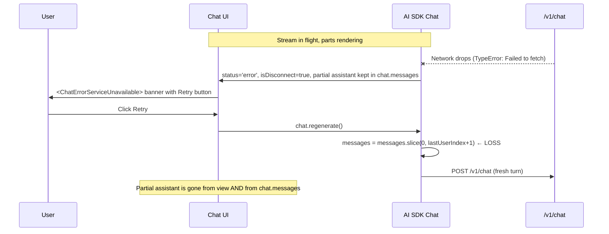

# Resumable Chat Streams After Network Failure

How Tau, Claude Code, and Codex behave when the chat SSE stream dies mid-turn, why Tau's "Retry" button currently destroys all visible progress, and the architectural options for fixing it without conflating with legitimate per-message regenerate.

## Executive Summary

When a chat stream disconnects mid-turn (e.g. Wi-Fi drops while tools are running), Tau renders a `network error` banner with a `Retry` button that calls `chat.regenerate()`. AI SDK's `regenerate()` slices off the trailing assistant message before re-issuing the request, which is correct for the per-message "Try again" use case but is the smoking gun behind the "I lost all my work" UX bug — every part the user just watched stream in (thinking blocks, web searches, file edits, kernel checks) disappears in one click. Claude Code (CLI) avoids the problem by retrying transparently inside `withRetry` with no user-visible button at all; Codex (CLI/TUI) does the same and additionally surfaces a `Reconnecting... N/M` status indicator while the retry runs. The recommended fix is twofold: (R1) make the network-error retry path a _continuation_ rather than a regenerate so the visible assistant message is preserved, and (R2) add transparent transport-level auto-retry with a reconnecting indicator so the banner only ever appears after the auto-retry budget is exhausted. A future R3 adopts AI SDK's built-in `resumeStream()` + `resumable-stream` + Redis pattern for true mid-flight stream resumption (page-reload tolerant).

## Table of Contents

- [Problem Statement](#problem-statement)
- [Methodology](#methodology)
- [Findings](#findings)
- [Comparison Matrix](#comparison-matrix)
- [Recommendations](#recommendations)
- [Trade-offs](#trade-offs)
- [Diagrams](#diagrams)
- [Code Examples](#code-examples)
- [References](#references)

## Problem Statement

Reproducer transcript: `chat_L0kuTN6HwMlk7mVNGWxKq.jsonl` (29 assistant/tool parts streamed across ~5 minutes before a `Failed to fetch` network error landed). The chat covered:

- 1 user message
- 14 thinking blocks (one >9 KB chunk)
- 3 `web_search` tool calls
- 1 `edit_tests` tool call
- 5 `edit_file` tool calls
- 4 `get_kernel_result` tool calls

After the stream broke, the user saw a small `> network error` banner with a `Retry` button. Clicking `Retry` collapsed the entire assistant message and the conversation reverted to the user's original message in isolation (img1: the small empty composer with a single user-message-and-network-error pair). All visible progress — including the file edits the LLM had already shipped to IndexedDB — disappeared from the chat history. The user reasonably concluded everything was lost.

The expected behavior: prior parts stay in place, streaming resumes from the disconnect point (or at minimum the next logical step after the partial assistant), and the user is never given a button whose only effect is "throw your work away."

Critically, the per-message `Try again` action shown in img2 (under the message hover footer) must keep its current semantics — that is a deliberate "regenerate this turn from scratch with a fresh model choice" affordance and is unambiguously what the user wants. Only the network-error banner's `Retry` is the bug.

## Methodology

1. Read the transcript at `~/Downloads/chat_L0kuTN6HwMlk7mVNGWxKq.jsonl` and matched it against the screenshots.
2. Traced the `Retry` button: `apps/ui/app/routes/projects_.$id/chat-error-service-unavailable.tsx` → `useChatActions().regenerate()` → `apps/ui/app/services/chat-session-store.ts` `dispatchRequest('regenerate')` → `chat.regenerate()` in `node_modules/.pnpm/ai@6.0.175/.../ai/src/ui/chat.ts`.
3. Inspected AI SDK v6's `Chat.makeRequest` to confirm what happens to in-memory `chat.messages` and persisted state on a `TypeError: Failed to fetch` mid-stream.
4. Read Claude Code's `repos/claude-code/src/services/api/withRetry.ts` and `QueryEngine.ts` to capture the transparent-retry pattern.
5. Read Codex's `repos/codex/codex-rs/core/src/codex.rs` (`run_turn`, stream-retry loop) and `client.rs` (websocket reconnect with `previous_response_id`) plus the TUI tests for the `Reconnecting... N/M` status indicator.
6. Read AI SDK's documented `resume` + `consumeSseStream` + `resumable-stream` flow in `node_modules/.../ai/docs/04-ai-sdk-ui/03-chatbot-resume-streams.mdx` and the corresponding `Chat.resumeStream` implementation.

## Findings

### Finding 1: The smoking gun — `Retry` calls `regenerate()` which deletes the trailing assistant message

`apps/ui/app/routes/projects_.$id/chat-error-service-unavailable.tsx` is the network-error banner:

```13:39:apps/ui/app/routes/projects_.$id/chat-error-service-unavailable.tsx
  const { regenerate } = useChatActions();

  return (
    <div className={cn('flex flex-col gap-2 rounded-md border border-warning/20 bg-warning/10 p-3 text-sm', className)}>
      <div className='flex items-center gap-2'>
        <WifiOff className='size-4 shrink-0 text-warning' />
        <p className='font-medium text-foreground'>Unable to reach Tau</p>
      </div>
      <p className='text-xs text-muted-foreground'>
        We couldn&apos;t connect to the Tau service. This could be due to a network issue or the service may be
        temporarily unavailable. Please check your connection and try again.
      </p>
      <div className='flex justify-end'>
        <Button
          variant='outline'
          size='sm'
          onClick={() => {
            regenerate();
          }}
```

`regenerate()` ultimately invokes AI SDK's `Chat.regenerate`, which unconditionally slices `messages` before re-issuing the request:

```430:455:node_modules/.pnpm/ai@6.0.175_zod@4.3.6/node_modules/ai/src/ui/chat.ts
  regenerate = async ({
    messageId,
    ...options
  }: {
    messageId?: string;
  } & ChatRequestOptions = {}): Promise<void> => {
    const messageIndex =
      messageId == null
        ? this.state.messages.length - 1
        : this.state.messages.findIndex(message => message.id === messageId);

    if (messageIndex === -1) {
      throw new Error(`message ${messageId} not found`);
    }

    // set the messages to the message before the assistant message
    this.state.messages = this.state.messages.slice(
      0,
      // if the message is a user message, we need to include it in the request:
      this.messages[messageIndex].role === 'assistant'
        ? messageIndex
        : messageIndex + 1,
    );

    await this.makeRequest({
      trigger: 'regenerate-message',
```

So the same code path that powers the per-message `Try again` (img2) also fires when the user clicks the network-error `Retry` (img1). Both legitimately slice off the partial assistant — but for the network-error case the user did not opt in to losing it.

The generic `<ChatError>` (`apps/ui/app/routes/projects_.$id/chat-error.tsx`) has the same `regenerate()` wiring, so the bug is shared across every error category that surfaces a `Retry` button (auth, credits, rate-limit, server, generic).

### Finding 2: AI SDK v6 keeps the partial assistant message in `chat.messages` on disconnect

`Chat.makeRequest` writes streaming deltas to `state.messages` continuously via `runUpdateMessageJob`, and only sets `status: 'error'` (without unwinding) when the underlying fetch throws:

```701:773:node_modules/.pnpm/ai@6.0.175_zod@4.3.6/node_modules/ai/src/ui/chat.ts
              const replaceLastMessage =
                activeResponse.state.message.id === this.lastMessage?.id;

              if (replaceLastMessage) {
                this.state.replaceMessage(
                  this.state.messages.length - 1,
                  activeResponse.state.message,
                );
              } else {
                this.state.pushMessage(activeResponse.state.message);
              }
            },
          }),
        );
      ...
    } catch (err) {
      // Ignore abort errors as they are expected.
      if (isAbort || (err as any).name === 'AbortError') {
        isAbort = true;
        this.setStatus({ status: 'ready' });
        return null;
      }

      isError = true;

      // Network errors such as disconnected, timeout, etc.
      if (
        err instanceof TypeError &&
        (err.message.toLowerCase().includes('fetch') ||
          err.message.toLowerCase().includes('network'))
      ) {
        isDisconnect = true;
      }
```

Two consequences:

1. The **partial assistant message survives** in `chat.messages` after the disconnect — it is only the `regenerate()` call inside `Retry` that destroys it.
2. AI SDK already classifies the failure as `isDisconnect: true` separately from `isError`. We can route on this discriminator without sniffing strings ourselves.

### Finding 3: Claude Code retries network failures transparently — no Retry button exists

`repos/claude-code/src/services/api/withRetry.ts` wraps every Anthropic SDK call in an exponential-backoff retry loop with a default budget of 10 attempts. `APIConnectionError` (the SDK's wrapper around fetch/network errors) is unconditionally retried:

```752:756:repos/claude-code/src/services/api/withRetry.ts
  if (error instanceof APIConnectionError) {
    return true
  }
```

Stale-keep-alive sockets (`ECONNRESET`/`EPIPE`) get an extra recovery step that disables HTTP keep-alive before reconnecting. While the retry loop runs, Claude Code emits `system / api_retry` messages with `attempt`, `retry_delay_ms`, and the categorized error so the TUI can surface progress without ever asking the user to do anything:

```946:951:repos/claude-code/src/QueryEngine.ts
              subtype: 'api_retry' as const,
              attempt: message.retryAttempt,
              ...
              retry_delay_ms: message.retryInMs,
              ...
              error: categorizeRetryableAPIError(message.error),
```

The unattended-retry mode (`CLAUDE_CODE_UNATTENDED_RETRY=true`) chunks long sleeps into 30-second heartbeats so a hung network does not look frozen. **There is no user-clickable Retry button in Claude Code's chat UI.** The `withRetry` wrapper succeeds or escalates to a typed `CannotRetryError` (which the UI then renders as a hard failure with details), but the user is never asked to confirm a retry that would discard work.

### Finding 4: Codex shows `Reconnecting... N/M` inline and reuses the same conversation

Codex's `run_turn` stream-retry loop uses a per-provider `stream_max_retries` budget (default 10):

```5548:5597:repos/codex/codex-rs/core/src/codex.rs
        // Use the configured provider-specific stream retry budget.
        let max_retries = turn_context.provider.stream_max_retries();
        ...
        if retries < max_retries {
            retries += 1;
            let delay = match &err {
                CodexErr::Stream(_, requested_delay) => {
                    requested_delay.unwrap_or_else(|| backoff(retries))
                }
                _ => backoff(retries),
            };
            warn!(
                "stream disconnected - retrying sampling request ({retries}/{max_retries} in {delay:?})...",
            );
            ...
            if report_error {
                sess.notify_stream_error(
                    &turn_context,
                    format!("Reconnecting... {retries}/{max_retries}"),
                    err,
                )
                .await;
            }
            tokio::time::sleep(delay).await;
        } else {
            return Err(err);
        }
```

The TUI surfaces this as a status-indicator update, never as a history cell:

```7886:7903:repos/codex/codex-rs/tui/src/chatwidget/tests.rs
async fn stream_error_updates_status_indicator() {
    ...
    let msg = "Reconnecting... 2/5";
    ...
        msg: EventMsg::StreamError(StreamErrorEvent {
    ...
        "expected no history cell for StreamError event"
```

Codex additionally exploits the OpenAI Responses API's `previous_response_id` so a websocket reconnect can resume on the same response context rather than starting from scratch:

```16:25:repos/codex/codex-rs/core/src/client.rs
//! WebSocket prewarm is a v2-only `response.create` with `generate=false`; it waits for completion
//! so the next request can reuse the same connection and `previous_response_id`.
//!
//! Turn execution performs prewarm as a best-effort step before the first stream request so the
//! subsequent request can reuse the same connection.
//!
//! ## Retry-Budget Tradeoff
//!
//! V2 request prewarm is treated as the first websocket connection attempt for a turn. If it
//! fails, normal stream retry/fallback logic handles recovery on the same turn. V1 prewarm
//! remains connection-only.
```

The user-facing pattern: prior visible output stays on screen, a thin "Reconnecting…" indicator appears in the status bar, and either the stream picks back up or it escalates to a hard error after the budget is exhausted. **No Retry button.**

### Finding 5: AI SDK ships a `resumeStream()` API + `resumable-stream` + Redis pattern

AI SDK v6 exposes `chat.resumeStream()` for true mid-flight stream resumption: the client issues a `GET /api/chat/[id]/stream`, the server consults a Redis-backed buffer (via the `resumable-stream` npm package), and replays the in-flight UIMessageStream from where the client dropped off:

```462:466:node_modules/.pnpm/ai@6.0.175_zod@4.3.6/node_modules/ai/src/ui/chat.ts
  /**
   * Attempt to resume an ongoing streaming response.
   */
  resumeStream = async (options: ChatRequestOptions = {}): Promise<void> => {
    await this.makeRequest({ trigger: 'resume-stream', ...options });
  };
```

```610:645:node_modules/.pnpm/ai@6.0.175_zod@4.3.6/node_modules/ai/src/ui/chat.ts
  private async makeRequest({
    trigger,
    metadata,
    headers,
    body,
    messageId,
  }: {
    trigger: 'submit-message' | 'resume-stream' | 'regenerate-message';
    messageId?: string;
  } & ChatRequestOptions) {
    // For resume-stream, check if there's an active stream before
    // changing status. This avoids a brief flash of 'submitted' status
    // when there is no stream to resume (e.g. on page load).
    let resumeStream: ReadableStream<UIMessageChunk> | undefined;
    if (trigger === 'resume-stream') {
      try {
        const reconnect = await this.transport.reconnectToStream({
          chatId: this.id,
          ...
        });
        if (reconnect == null) {
          return; // no active stream found, so we do not resume
        }
        resumeStream = reconnect;
```

Server side is a pair of route handlers: `POST /api/chat` calls `result.toUIMessageStreamResponse({ consumeSseStream })` to publish the UIMessageStream to Redis, and `GET /api/chat/[id]/stream` serves the buffered tail via `streamContext.resumeExistingStream(activeStreamId)`. The `activeStreamId` is stored on the chat row alongside the messages so multiple clients can attach to the same stream.

Limitation called out in the AI SDK docs: stream resumption is **incompatible with abort** because closing the tab triggers an `AbortController.abort()` that breaks the resumption mechanism. We would have to choose `resume: true` _or_ keep the existing stop button — not both.

### Finding 6: Tau already pairs interrupted tool calls — continuation requests are safe

Per `docs/policy/interrupted-tool-call-contract.md` and `apps/api/app/api/chat/middleware/message-content-sanitizer.middleware.ts`, the API already pairs every dangling `tool_use` block in the conversation history with a synthetic `tool_result` before forwarding to the model provider. This means a continuation request that includes a partial assistant message (with mid-tool-call truncation) will not blow up at the provider boundary — the sanitizer middleware already covers that edge.

The follow-up `interrupt-recovery.middleware.ts` (recently added per `docs/research/agent-interrupt-durability-comparison.md`) further injects a `<system-reminder>` so the LLM verifies state before retrying mutating tools, which is exactly the right behavior when continuing a previously-interrupted turn.

### Finding 7: Tau already persists partial assistant messages at milestone granularity

Per `docs/research/parallel-tool-call-incremental-persistence.md` and `apps/ui/app/services/chat-session-store.ts` (`countPersistMilestones`), every completed tool-output, completed text segment, and completed reasoning block triggers a debounced 100 ms write of the full message array to IndexedDB. So the partial assistant from the broken turn is durably stored before the network error is even shown — a page reload restores it intact. The destruction is purely a runtime side-effect of the `regenerate()` call inside the `Retry` button.

## Comparison Matrix

| Capability                                          | Tau (today)                                                                             | Tau (proposed)                                    | Claude Code                            | Codex                                                  |
| --------------------------------------------------- | --------------------------------------------------------------------------------------- | ------------------------------------------------- | -------------------------------------- | ------------------------------------------------------ |
| Transparent auto-retry on network error             | Yes — `requestLifecycle.retrying` substate, 5 attempts, exponential backoff with jitter | Yes (R2)                                          | Yes — `withRetry`, default 10 attempts | Yes — `stream_max_retries`, default 10                 |
| User-clickable Retry button on network error        | Yes — non-destructive (calls `continueChat()`)                                          | No (or non-destructive)                           | None                                   | None                                                   |
| In-flight reconnect indicator                       | Yes — `ChatMessagePlanning` renders `Reconnecting... N/M` during the retry substate     | Yes (R2) — toast/inline status                    | `system / api_retry` event in TUI      | `Reconnecting... N/M` status indicator                 |
| Partial assistant preserved across retry            | Yes everywhere — auto-retry + manual `Retry` both go through `{ kind: 'continue' }`     | Yes everywhere (R1)                               | Yes — CLI output already printed       | Yes — TUI output already printed                       |
| Mid-flight stream resume (server still running)     | No                                                                                      | Optional R3 — `resumable-stream` + Redis          | N/A — single-process CLI               | Yes via `previous_response_id` on websocket reconnect  |
| Continuation request after irrecoverable disconnect | Yes — `{ kind: 'continue' }` via `chat.makeRequest({ trigger: 'submit-message' })` shim | Yes (R1) — submit-message with full prior context | Implicit — retry replays full request  | Implicit — retry replays full request, can append-only |
| Partial assistant durable to page reload            | Yes — milestone-based IndexedDB writes                                                  | Yes (unchanged)                                   | N/A                                    | N/A                                                    |
| Dangling tool-use sanitization before re-issue      | Yes — `messageContentSanitizerMiddleware`                                               | Yes (unchanged)                                   | Yes — Anthropic SDK                    | Yes — Responses API                                    |

## Recommendations

| #   | Action                                                                                                                                                                                                                  | Priority | Effort | Impact                                                         | Status          |
| --- | ----------------------------------------------------------------------------------------------------------------------------------------------------------------------------------------------------------------------- | -------- | ------ | -------------------------------------------------------------- | --------------- |
| R1  | Replace `regenerate()` in network-error banners with a non-destructive continuation path that preserves the partial assistant in `chat.messages`. Keep per-message `Try again` (img2) calling `regenerate()` unchanged. | P0       | Low    | High — eliminates the "lost all my work" UX bug                | **IMPLEMENTED** |
| R2  | Add transport-level transparent auto-retry with a `Reconnecting... N/M` status indicator (Codex pattern). Banner only appears after the budget is exhausted.                                                            | P0       | Medium | High — most network blips never reach the user                 | **IMPLEMENTED** |
| R3  | Adopt AI SDK's `resumeStream()` + `resumable-stream` + Redis (we already run Redis for Socket.IO scaling) so true mid-flight stream resume works across page reloads on the same response.                              | P1       | High   | Medium — covers the long-running-turn-during-page-reload case  | Deferred        |
| R4  | Surface `isDisconnect` from AI SDK's `onFinish` into the persistence machine so the persisted error category cleanly distinguishes "stream broke" from "model returned 4xx/5xx".                                        | P1       | Low    | Low — drives correct routing in R1/R2/R3                       | **IMPLEMENTED** |
| R5  | Document the new contract in `docs/policy/` once R1+R2 stabilise: `Retry` on a transient/transport error must never slice the trailing assistant; only the per-message `Try again` may.                                 | P2       | Low    | Medium — prevents regression as new error categories are added | Pending         |

### R1 in detail: continuation, not regeneration

**Status: IMPLEMENTED.** What we built:

- `apps/ui/app/hooks/chat-persistence.machine.ts` — extended the `ChatRequest` union with `{ kind: 'continue' }`; the existing `requestLifecycle.idle.startRequest -> invoking` path is reused, so no machine restructuring was needed beyond R2's retry substate.
- `apps/ui/app/services/chat-session-store.ts` — added the `case 'continue'` to `dispatchRequest` that calls `chat.makeRequest({ trigger: 'submit-message' })` via a typed `ChatMakeRequestShim` cast (the method is `private` in AI SDK's TS source but public at runtime).
- `apps/ui/app/services/chat-session-store.contract.test.ts` — new contract test that asserts `Chat.prototype.makeRequest` exists and accepts `{ trigger: 'submit-message' }`. Fails loudly if AI SDK ever removes the private method on a version bump.
- `apps/ui/app/hooks/use-chat.tsx` — added `useChatActions().continueChat()` mirroring `regenerate()`'s shape; emits `{ type: 'startRequest', request: { kind: 'continue' } }`.
- `apps/ui/app/routes/projects_.$id/chat-error-service-unavailable.tsx` — `Retry` button now calls `continueChat()` instead of `regenerate()`.
- `apps/ui/app/routes/projects_.$id/chat-error.tsx` — generic `renderGenericError()` Retry button discriminates on `parsedError.category`: `network | server | overloaded` route to `continueChat()`; `auth | credits | rateLimit | toolError | generic` keep `regenerate()` (those errors invalidate the request, not just the connection).
- Per-message `Try again` is intentionally untouched.

Original sketch (preserved for context):

The minimal-risk implementation routes the network-error banner to a new `chatPersistenceMachine` request kind. Today's `ChatRequest` union (`apps/ui/app/hooks/chat-persistence.machine.ts`) is:

```32:36:apps/ui/app/hooks/chat-persistence.machine.ts
export type ChatRequest =
  | { kind: 'send'; message: MyUIMessage }
  | { kind: 'regenerate' }
  | { kind: 'edit'; messageId: string; content: string; model: string; imageUrls?: string[] }
  | { kind: 'retry'; messageId: string; modelId?: string };
```

Add `{ kind: 'continue' }` and wire `dispatchRequest` in `chat-session-store.ts` to call `chat.makeRequest({ trigger: 'submit-message' })` against the existing `chat.messages` array (no slice). The agent receives the full conversation history including the partial assistant; `messageContentSanitizerMiddleware` pairs any dangling tool_use; `interrupt-recovery.middleware` injects the system reminder; the LLM continues from where it left off.

For the per-message `Try again` (img2), keep dispatching `{ kind: 'regenerate' }` as today — that flow correctly slices.

### R2 in detail: where the auto-retry lives

**Status: IMPLEMENTED.** What we built:

- `apps/ui/app/utils/backoff.utils.ts` — extracted `getRetryDelay(attempt)` helper with 500 ms base, 2× exponential growth, 32 s cap, and 0–25% jitter (mirrors Claude Code's `withRetry`). Unit tests in `apps/ui/app/utils/backoff.utils.test.ts` cover the curve, jitter bounds, attempt clamping, and option overrides.
- `apps/ui/app/hooks/chat-persistence.machine.ts`:
  - Extended `ChatPersistenceMachineContext` with `retryAttempt: number` and `retryMaxAttempts: number` (default budget 5).
  - Extended `requestFinished` event with `isDisconnect: boolean` and turned `requestLifecycle.invoking.on.requestFinished` into a guarded transition list: `isDisconnect && hasBudget` → `retrying`; other `isError` → `idle` preserving `persistedError`; success/abort → `idle` clearing error and resetting `retryAttempt`.
  - Added `requestLifecycle.retrying` substate: entry assigns `retryAttempt + 1`; `after: { streamRetryDelay: ... emit dispatchRequest { kind: 'continue' } }`; `on.startRequest`/`on.stopRequest` cancel the timer and reset `retryAttempt`.
  - `delays.streamRetryDelay` calls `getRetryDelay(context.retryAttempt)`.
- `apps/ui/app/hooks/use-chat.tsx` — exposed `useChatRetrySnapshot()` selector returning `{ retryAttempt, retryMaxAttempts }` so UI components don't reach into the persistence actor directly.
- `apps/ui/app/routes/projects_.$id/chat-message-planning.tsx` — reads the retry snapshot. When `retryAttempt > 0`, renders the existing `ChatToolCard variant='minimal'` with `verb='Reconnecting'`, `description='${attempt}/${max}...'`, and a `WifiOff` icon. The render gate is relaxed so the indicator stays visible during `chat.status === 'error'` while the auto-retry loop is between attempts.

The Retry button in the banner stays as a manual override after budget exhaustion, but its `onClick` now also dispatches `{ kind: 'continue' }` (R1) — never `regenerate()`.

Original analysis (preserved for context):

Two layers are candidates:

- **Inside the chat transport** (`apps/ui/app/services/chat-session-store.ts`'s `sharedChatTransport`). Wrap `DefaultChatTransport.sendMessages` to catch `TypeError: Failed to fetch` and re-issue with exponential backoff. Cleanest because it stays under AI SDK's `Chat` and inherits `chat.messages` continuity.
- **Inside the persistence machine's `requestLifecycle`**. Add a `retrying` substate that transitions on a typed `streamDisconnected` event, sleeps with backoff, and re-dispatches a `continue` request (per R1). More observable, more testable, and surfaces the indicator naturally via XState selectors.

The Codex implementation lives below the UI for a reason — backoff/jitter/cap math doesn't change per surface. For Tau the persistence-machine layer fits the existing patterns better and lets us emit a `Reconnecting... N/M` event the chat-history footer can render without a toast.

The `Retry` button stays in the banner as a _manual override_ once the budget is exhausted, but its `onClick` becomes the same continuation dispatch as R1 — never `regenerate()`.

### R4 in detail: isDisconnect plumbing

**Status: IMPLEMENTED.** What we built:

- `apps/ui/app/services/chat-session-store.ts` — destructured `isDisconnect` from AI SDK's `onFinish` event and forwarded it to `persistenceActorRef.send({ type: 'requestFinished', messages, isAbort, isError, isDisconnect })`. AI SDK already classifies `TypeError: Failed to fetch` as `isDisconnect: true` separately from `isError`, so the discriminator is exact and we no longer have to sniff error message strings (`apps/ui/app/utils/error.utils.ts` `isNetworkError` is retained as a fallback for `onError`, which fires before `onFinish`).
- `apps/ui/app/hooks/chat-persistence.machine.ts` — `ChatPersistenceMachineEvents.requestFinished` now carries `isDisconnect: boolean`, threaded through the guarded `requestLifecycle.invoking` transitions described under R2. This is the gate that lets the auto-retry loop fire only on transport breaks, not on 4xx/5xx provider errors.

### R3 in detail: when to invest in resumable-stream

R1+R2 cover the common transient-network case (Wi-Fi dropouts, mobile handoffs, brief proxy hiccups). R3 only matters when:

- a turn is so long the user navigates away and back (or reloads), and
- they want to see _the in-flight tokens of the same response_, not a continuation that may diverge.

Given Tau's milestone persistence (Finding 7), a reload restores the partial assistant durably — so the marginal value of true stream resumption is "show the next 10–20 seconds of tokens that the agent emitted while the page was reloading." Useful but not essential. We already run Redis (Socket.IO adapter), so the infra is there; the cost is the abort-incompatibility caveat (Finding 5) and a non-trivial `chat.controller.ts` refactor to wire `consumeSseStream` and a new `GET /v1/chat/:id/stream` route.

Defer R3 until R1+R2 land and we have telemetry to size how often users actually reload during a long turn.

## Trade-offs

| Approach                                   | Pros                                                     | Cons                                                                                                                      |
| ------------------------------------------ | -------------------------------------------------------- | ------------------------------------------------------------------------------------------------------------------------- |
| **Current Tau (`Retry` = `regenerate`)**   | Simple, one code path                                    | Destroys all visible progress — primary UX bug                                                                            |
| **R1 only (continue, no auto-retry)**      | One small change, removes the destructive footgun        | User still sees the banner on every transient blip; LLM may emit slightly different continuation than would have streamed |
| **R2 only (auto-retry, banner unchanged)** | Banner only shows on hard failures                       | Manual `Retry` still destroys progress on the rare hard failure                                                           |
| **R1 + R2**                                | Most blips invisible; manual override is non-destructive | Requires both transport-level work and a new `ChatRequest` kind                                                           |
| **R3 (resumable-stream + Redis)**          | True mid-flight resume, page-reload tolerant             | Abort-incompatible; requires server route + Redis schema; deferred until usage proves it out                              |

Continuation vs replay (R1 vs Codex/Claude-Code style replay):

- **Replay** (re-issue the same request from scratch) gives the LLM a fresh deterministic start; the user sees the partial assistant get _replaced_ by a new assistant message. Cleaner final transcript but visually disruptive in a chat UI where mounted components have local state (collapsibles, scroll positions, etc.).
- **Continuation** (send the partial assistant as conversation context and ask the model to keep going) preserves the rendered DOM completely, but the new tokens may be inconsistent with the partial assistant if the model hallucinates a different "intent" mid-thought.

For Tau's chat UI surface (rich tool cards, multi-pane viewer, in-place file edits already shipped) continuation is strictly better than replay. CLI tools don't face this trade-off because their "rendered DOM" is just printed text — replaying simply prints more.

## Diagrams

Today's destructive Retry path:



Proposed flow with R1 + R2:

```mermaid
sequenceDiagram
  participant U as User
  participant UI as Chat UI
  participant PM as ChatPersistenceMachine
  participant SDK as AI SDK Chat
  participant API as /v1/chat
  Note over UI,SDK: Stream in flight
  API--xSDK: Network drops
  SDK->>PM: requestFinished { isDisconnect: true }
  PM->>PM: enter retrying substate, backoff(attempt)
  PM->>UI: emit StreamReconnecting { attempt, max }
  UI->>U: thin "Reconnecting... 2/5" status indicator (no banner yet)
  PM->>SDK: dispatch { kind: 'continue' }  ← preserves messages
  SDK->>API: POST /v1/chat with full prior context (incl. partial assistant)
  Note over API: messageContentSanitizerMiddleware pairs dangling tool_use
  Note over API: interrupt-recovery.middleware injects <system-reminder>
  API->>SDK: stream resumes, new parts append to existing assistant turn
  Note over UI: All prior parts still visible; new parts stream in below
  alt budget exhausted
    PM->>UI: emit StreamRetryExhausted
    UI->>U: <ChatErrorServiceUnavailable> banner; Retry button now also dispatches { kind: 'continue' }
  end
```

## Code Examples

### A. Today's destructive call site (the bug)

```13:35:apps/ui/app/routes/projects_.$id/chat-error-service-unavailable.tsx
  const { regenerate } = useChatActions();
  ...
        <Button
          variant='outline'
          size='sm'
          onClick={() => {
            regenerate();
          }}
        >
          <RefreshCcw className='size-3.5' />
          Retry
        </Button>
```

### B. Sketch of R1 — non-destructive continuation

```typescript
// apps/ui/app/hooks/chat-persistence.machine.ts (additions only)
export type ChatRequest =
  | { kind: 'send'; message: MyUIMessage }
  | { kind: 'regenerate' }
  | { kind: 'continue' } // NEW
  | { kind: 'edit'; messageId: string; content: string; model: string; imageUrls?: string[] }
  | { kind: 'retry'; messageId: string; modelId?: string };
```

```typescript
// apps/ui/app/services/chat-session-store.ts (dispatchRequest cases)
case 'continue': {
  // Do NOT slice chat.messages. The partial assistant from the broken turn
  // stays as context; messageContentSanitizerMiddleware pairs any dangling
  // tool_use, and interrupt-recovery.middleware injects the system reminder.
  void chat.makeRequest({ trigger: 'submit-message' });
  return;
}
```

```typescript
// apps/ui/app/routes/projects_.$id/chat-error-service-unavailable.tsx (banner fix)
const { continueChat } = useChatActions();    // new action that emits { kind: 'continue' }
...
onClick={() => { continueChat(); }}
```

### C. Codex's reconnect indicator (target UX)

```rust
// repos/codex/codex-rs/core/src/codex.rs
sess.notify_stream_error(
  &turn_context,
  format!("Reconnecting... {retries}/{max_retries}"),
  err,
).await;
```

```rust
// repos/codex/codex-rs/tui/src/chatwidget/tests.rs (asserts no history cell)
let msg = "Reconnecting... 2/5";
...
"expected no history cell for StreamError event"
```

### D. AI SDK resumable-stream pattern (R3)

```ts
// docs/04-ai-sdk-ui/03-chatbot-resume-streams.mdx (server)
return result.toUIMessageStreamResponse({
  originalMessages: messages,
  generateMessageId: generateId,
  onFinish: ({ messages }) => {
    saveChat({ id, messages, activeStreamId: null });
  },
  async consumeSseStream({ stream }) {
    const streamId = generateId();
    const streamContext = createResumableStreamContext({ waitUntil: after });
    await streamContext.createNewResumableStream(streamId, () => stream);
    saveChat({ id, activeStreamId: streamId });
  },
});
```

## References

- `repos/claude-code/src/services/api/withRetry.ts` — transparent retry loop with `APIConnectionError` always retried, `ECONNRESET`/`EPIPE` keep-alive recovery, and persistent-mode chunked sleeps.
- `repos/claude-code/src/QueryEngine.ts` — `system / api_retry` events surface attempts to the TUI without blocking on user input.
- `repos/codex/codex-rs/core/src/codex.rs` — `run_turn` stream-retry loop with `stream_max_retries` budget and `notify_stream_error("Reconnecting... N/M")`.
- `repos/codex/codex-rs/core/src/client.rs` — `previous_response_id` reuse on websocket reconnect inside the same turn.
- `repos/codex/codex-rs/tui/src/chatwidget/tests.rs` — assertion that StreamError updates the status indicator only, never a history cell.
- `node_modules/.pnpm/ai@6.0.175/.../ai/src/ui/chat.ts` — `regenerate` (slices), `resumeStream`, `makeRequest` triggers (`submit-message` / `resume-stream` / `regenerate-message`), and disconnect classification (`isDisconnect`).
- `node_modules/.pnpm/ai@6.0.175/.../ai/docs/04-ai-sdk-ui/03-chatbot-resume-streams.mdx` — `resumable-stream` + Redis pattern, abort incompatibility caveat.
- `apps/ui/app/routes/projects_.$id/chat-error.tsx` — generic banner that also calls `regenerate()` for every error category.
- `apps/ui/app/routes/projects_.$id/chat-error-service-unavailable.tsx` — the network-specific banner from img1.
- `apps/ui/app/hooks/chat-persistence.machine.ts` — `ChatRequest` union and `requestLifecycle` parallel state where the new `continue` kind and `retrying` substate would land.
- `apps/ui/app/services/chat-session-store.ts` — `dispatchRequest` switch and `~registerMessagesCallback` milestone persistence.
- Related: `docs/research/agent-interrupt-durability-comparison.md` (the `interrupt-recovery.middleware.ts` that already injects the system reminder for cross-turn interruptions).
- Related: `docs/research/parallel-tool-call-incremental-persistence.md` (the milestone-driven persistence that already makes partial assistant turns durable to page reload).
- Related: `docs/policy/interrupted-tool-call-contract.md` (the dangling-tool-use pairing contract that lets continuation requests cross the provider boundary safely).
