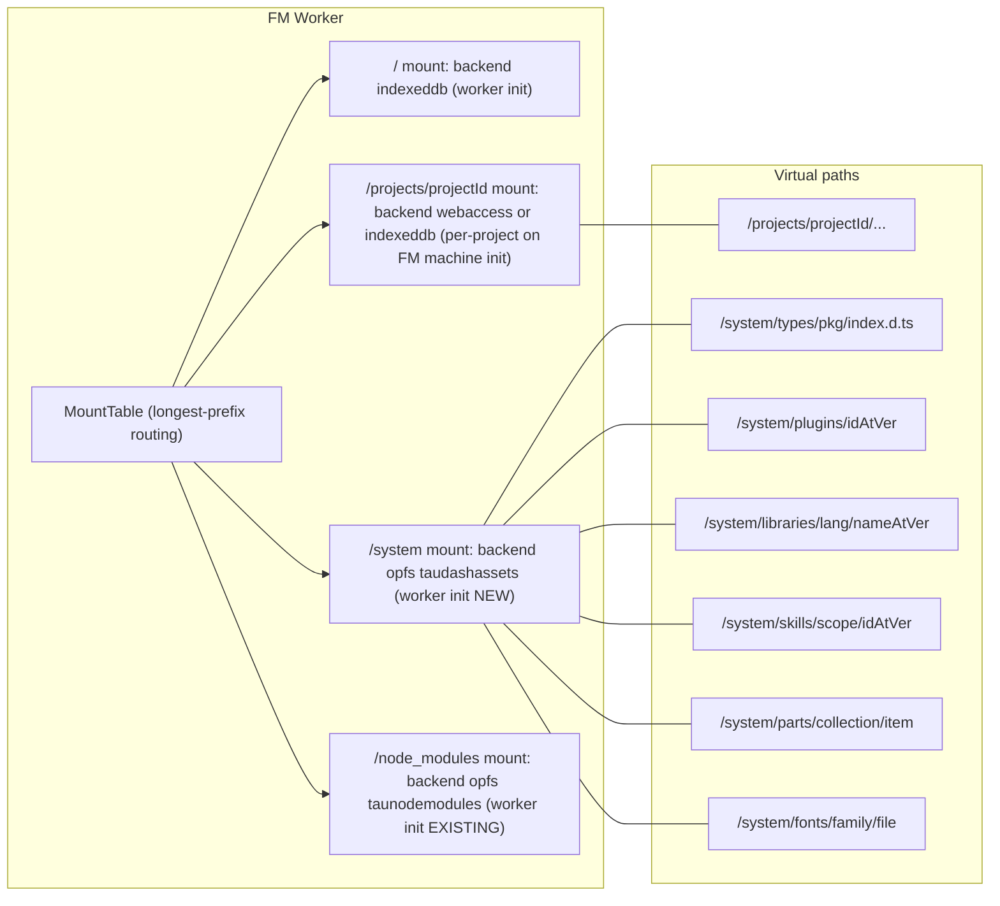
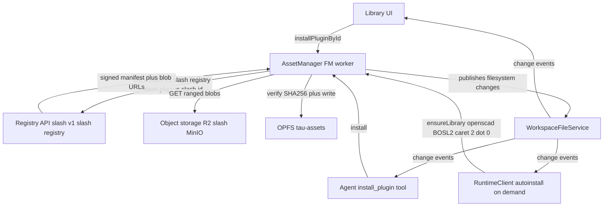
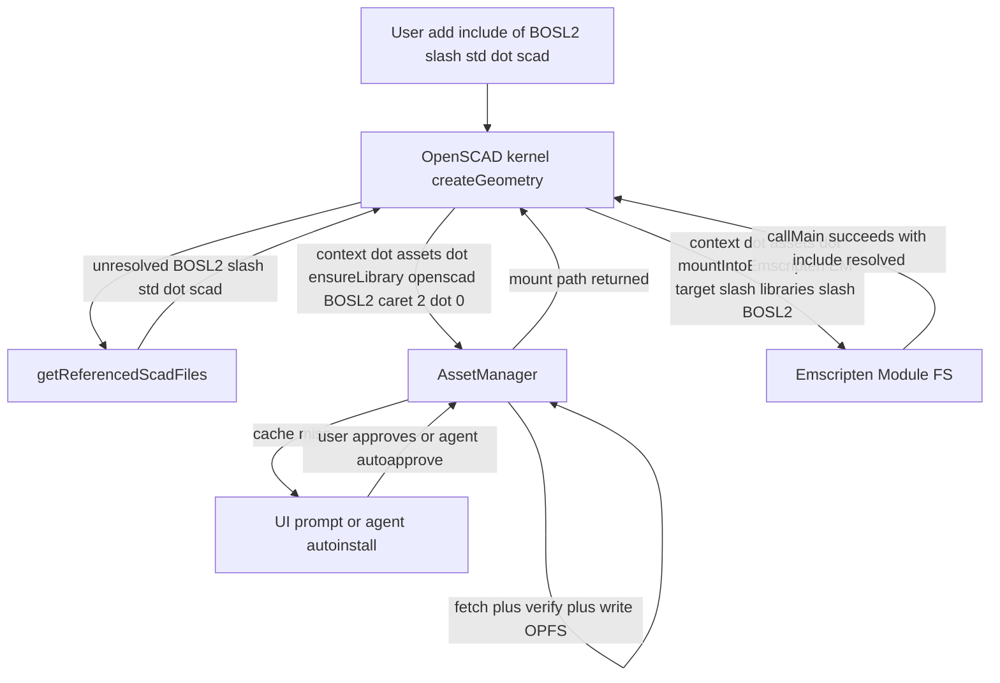
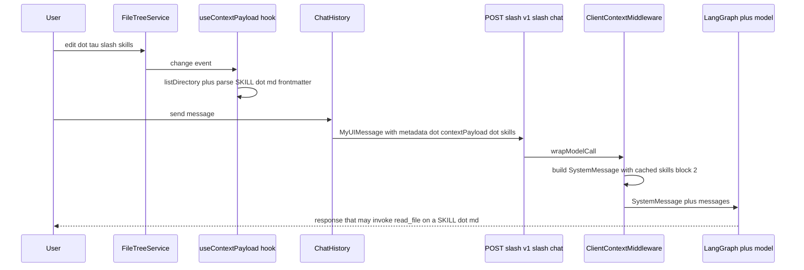
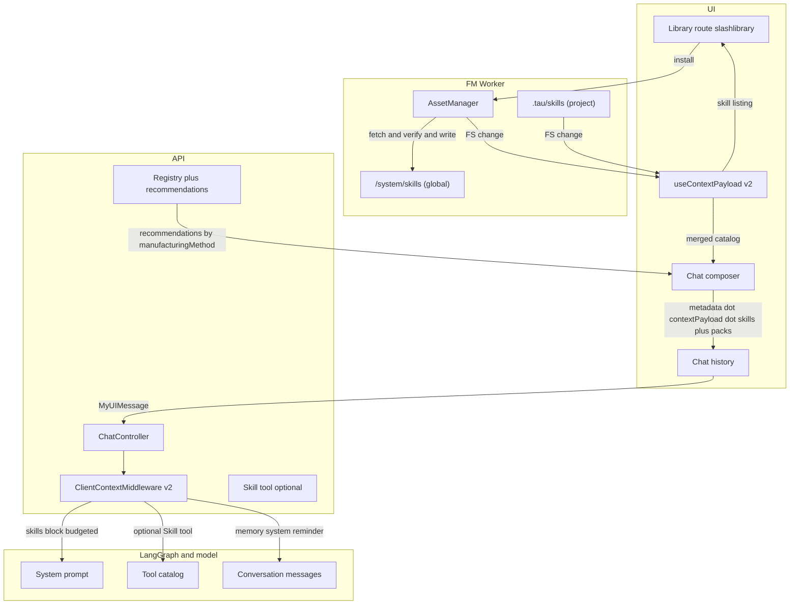

# Tau Library Architecture: Runtime Assets, Plugins, Language Libraries, and Agent Skills

How Tau loads kernels, middleware, transcoders, bundlers, language libraries (BOSL2, MCAD, fonts, curated parts), and agent skills (CAD domain knowledge for Machining, Woodworking, Sheet Metal, Robotics, Furniture, etc.) from a unified asset namespace that the runtime, editor, chat agent, and CLI can all consume — and how users install custom plugins, libraries, and skills through a new Library route.

## Executive Summary

The immediate trigger was a UX bug: bundled `node_modules/*.d.ts` packages render as flat files in the editor tree until a Cmd+Click forces them to materialise. The quick fix (eagerly populate the bundled-types mount before the FM worker reports ready) is necessary but not sufficient. Walking the call stack revealed four deeper architectural smells that block the Vision Policy phases:

1. The bundled-types mount is the only "library"-style mount we have. There is no general namespace for OpenSCAD libraries (BOSL2, MCAD), KCL stdlib parts, fonts, curated parts catalogs, or — crucially for the chat agent — encoded CAD domain knowledge. Adding a fifth kernel today still requires ad-hoc `new URL(..., import.meta.url)` plumbing and a `kernel-worker.constants.ts` edit.
2. The plugin graph is hard-coded in [`kernel-worker.constants.ts`](apps/ui/app/constants/kernel-worker.constants.ts) on the editor side and in [`packages/runtime/src/plugins/presets.ts`](packages/runtime/src/plugins/presets.ts) on the CLI side, **and the two disagree** (web includes OpenSCAD, `presets.all()` does not). There is no first-class registry, no version resolution, no integrity check, no lazy activation by file pattern beyond the editor's own extension probe.
3. Kernel authors get a `KernelRuntime` with `filesystem`, `logger`, `bundler`, `tracer`, `execute`, and `fileContentCache` — but nothing that abstracts asset/URL resolution. Every kernel reaches for `new URL('asset.wasm', import.meta.url).href` directly. The OpenSCAD kernel can only see files the project FS contains; it has no concept of "platform library".
4. Tau already has a working in-project chat-agent skills primitive ([`useContextPayload`](apps/ui/app/hooks/use-context-payload.ts) discovers `.tau/skills/<name>/SKILL.md`; [`createClientContextMiddleware`](apps/api/app/api/chat/middleware/client-context.middleware.ts) injects the catalog as a cache-friendly system-prompt block with progressive-disclosure copy), but it is **per-project only**. There is no way to install a shared "Machining" or "Woodworking" skill pack, no cross-project skills, no curated/community/first-party tiering, no skill registry, no UI to browse or install, and no link to the existing `manufacturingMethod` / `engineeringDiscipline` user-message metadata that should drive skill recommendations.

The eigenquestion: **what is the canonical filesystem URI namespace, lifecycle, runtime API, and chat-agent context-injection contract through which every Tau consumer (editor tree, agent tools, kernel WASM modules, chat agent on the API, CLI, Monaco LSP) reads platform-managed code, language libraries, fonts, user-installed plugins, and encoded CAD domain knowledge, regardless of how the bytes arrived?**

This blueprint proposes a single answer: a virtual `/system/...` tree (`/system/types`, `/system/libraries/<lang>/<pkg>@<ver>`, `/system/plugins/<id>@<ver>`, `/system/skills/<scope>/<id>@<ver>`, `/system/parts/...`, `/system/fonts/...`) backed by the OPFS-backed `tau-assets` store, populated by a worker-resident `AssetManager` from a manifest the API publishes. A new `/library` route is the user-facing console that browses, installs, updates, and uninstalls bundles of any `kind`. Kernels read it through a new `context.assets` API. The chat agent receives it through an extended `ContextPayload.skills` (per-project skills + globally installed skill packs unified by the existing client-context middleware, with optional `engineeringDiscipline`/`manufacturingMethod`-aware filtering). The agent reads everything else through the same FS as project files. The CLI mirrors the same protocol against `node_modules` of the consuming app, no UI required.

Skills get five specific upgrades: (a) global `/system/skills/` mount in addition to per-project `.tau/skills/`, (b) a `kind: 'skill'` plus `kind: 'skill-pack'` in the manifest contract so a "CAD Machining" pack ships dozens of cross-referenced skills atomically, (c) registry distribution and the Library route's "Skill Packs" tab, (d) a Claude-Code-inspired catalog-budget + progressive-disclosure prompt-injection upgrade so installing 100 skills doesn't blow the prompt cache, and (e) `manufacturingMethod` / `engineeringDiscipline` driven recommendations and one-click install from the chat composer.

## Implementation Status (2026-05-21 update)

Eight days after the blueprint landed, the `packages/filesystem` and `packages/fs-client` packages absorbed a much larger refactor than the blueprint anticipated. The architectural direction is unchanged, but several Phase-0 / Phase-1 items have already shipped (or are easier to ship than the blueprint described) and one section is now obsolete.

| Blueprint item                                                                                                | Status               | Evidence                                                                                                                                                                                                                                                                                                                                                                                                                                                                                                                                                                                                                                                                                                                                                                                                                                                      |
| ------------------------------------------------------------------------------------------------------------- | -------------------- | ------------------------------------------------------------------------------------------------------------------------------------------------------------------------------------------------------------------------------------------------------------------------------------------------------------------------------------------------------------------------------------------------------------------------------------------------------------------------------------------------------------------------------------------------------------------------------------------------------------------------------------------------------------------------------------------------------------------------------------------------------------------------------------------------------------------------------------------------------------- |
| **R1 — eager `populateBundledTypesMount`, remove postMessage handshake, remove lazy bundled-types tree hook** | ✅ **SHIPPED**       | Commit `3fa3ca63c` (May 13, hours after the blueprint). `apps/ui/app/hooks/use-bundled-types-tree.ts` deleted; `populateBundledTypesMount` runs inside FM worker init **before** `workerReady` posts (lines 165-171 of `apps/ui/app/machines/file-manager.worker.ts`); `isPathFolder` no longer special-cases `bundledPaths`.                                                                                                                                                                                                                                                                                                                                                                                                                                                                                                                                 |
| **Stress Point A** (cmd+click symptom)                                                                        | ✅ **RESOLVED**      | Symptom is gone; the worker-init reorder fix landed exactly as the Phase-0 plan described. Section retained for historical context but the bug no longer exists.                                                                                                                                                                                                                                                                                                                                                                                                                                                                                                                                                                                                                                                                                              |
| **T0 tier of Finding 1** (eager bundled-types population)                                                     | ✅ **SHIPPED**       | Same commit. The race that the blueprint called out is closed by moving the populate inside worker init.                                                                                                                                                                                                                                                                                                                                                                                                                                                                                                                                                                                                                                                                                                                                                      |
| **Layer split** (Layer 2 mount routing + watch backbone vs Layer 3a workspace orchestrator)                   | ✅ **SHIPPED**       | `WorkspaceFileService` (Layer 3a) now composes `FileSystemService` (Layer 2) via `createFileSystemService`. Public `fileSystem` getter exposes the narrow backbone for kernel-host consumers that don't need workspace orchestration. The blueprint assumed these were one class.                                                                                                                                                                                                                                                                                                                                                                                                                                                                                                                                                                             |
| **Discriminated `MountConfig` with explicit `workspaceId` for webaccess**                                     | ✅ **SHIPPED (NEW)** | Commit `eb131e2ed` (May 20) — _not in the original blueprint_. `MountConfig = { backend: 'webaccess'; directoryHandle; workspaceId } \| { backend: 'indexeddb' \| 'opfs' \| 'memory' }`. Ambient `setDirectoryHandle` state is gone; mount calls are atomic.                                                                                                                                                                                                                                                                                                                                                                                                                                                                                                                                                                                                  |
| **Multi-workspace architecture with explicit per-project bindings**                                           | ✅ **SHIPPED (NEW)** | Same commit. `ProjectFileSystemConfig` (IDB store) holds the durable project ↔ workspace binding; `wsp_*` ids are the canonical workspace identity; recovery flow via `bindProjectToWorkspace` on `useFileManager`. _This is the substrate the Library route now plugs into, not a separate concern._                                                                                                                                                                                                                                                                                                                                                                                                                                                                                                                                                         |
| **`fs-client` package extracted** (was: "the FM proxy")                                                       | ✅ **SHIPPED (NEW)** | Commit `f96462665` and follow-ups. The blueprint described "the FM proxy" as a single surface; it is now two facades — `client: FileSystemClient` (typed generic RPC) and `workspace: WorkspaceFacade` (mount/unmount/invalidateStandaloneProvider). The `context.assets` and AssetManager designs in this doc must address both.                                                                                                                                                                                                                                                                                                                                                                                                                                                                                                                             |
| **Reusable primitives inventory** (Finding 5)                                                                 | ⚠️ **EXPANDED**      | The list in Finding 5 was correct but incomplete. The current toolbox now includes `SharedPool`/`SharedMemoryArena` (zero-copy IPC), `InMemoryFileTree` (O(1) stat/readdir for large repos), `ResourceWriteQueue` (per-parent-dir write serialisation), `ThrottledWorker` (chunked event delivery), `BoundedFileCache` (memory-bounded content cache with backpressure), `WorkspacePathResolver` (escape-validating with built-in global `/node_modules` carveout), `PathSubscriberRegistry`, `RefreshGenerationGuard`, `@taucad/events` `Topic<E>` (composed by `ChangeEventBus`, `WorkerChangeChannel`, `WatchRegistry`, `FileContentService`, `FileTreeService`, and `RuntimeClient.on`), and the `FileTreeService`/`FileContentService` cached facade pair. AssetManager and the Library route should compose these primitives rather than recreate them. |
| **ZenFS removed**                                                                                             | ✅ **SHIPPED (NEW)** | Commit `feeb302ad`. Native browser providers only: `DirectIdbProvider`, `FileSystemAccessProvider`, `MemoryProvider`, OPFS via `FileSystemAccessProvider` on `navigator.storage.getDirectory()`. The plugin manifest's "no ZenFS adapter" simplification was implicit; now explicit.                                                                                                                                                                                                                                                                                                                                                                                                                                                                                                                                                                          |
| **Phase 0 (cmd+click fix + worker init reorder)**                                                             | ✅ **COMPLETE**      | Both halves shipped. Phase 1 (R2-R3) is the next on-deck item.                                                                                                                                                                                                                                                                                                                                                                                                                                                                                                                                                                                                                                                                                                                                                                                                |
| **Phase 1 — `/system` namespace + AssetManager scaffolding**                                                  | ⏳ **NOT STARTED**   | The substrate (`MountTable`, `ProviderRegistry`, `WorkspaceFileService.mount(prefix, config)`) is in place and waiting; adding `/system` is the trivial one-line mirror of `createNodeModulesMount` in `file-manager.worker.ts`. The harder work is the `AssetManager` itself, which has not started.                                                                                                                                                                                                                                                                                                                                                                                                                                                                                                                                                         |
| **`useContextPayload` skill discovery path**                                                                  | ⚠️ **REVISED**       | Goes through the new `FileTreeService.listDirectory('.tau/skills')` (multi-tier cached, async, workspace-scoped through `WorkspacePathResolver`); the absolute-path framing in Finding 7 / Section "Today" is stale.                                                                                                                                                                                                                                                                                                                                                                                                                                                                                                                                                                                                                                          |

The rest of the blueprint (R2-R19, Phases 1-5, every Open Question) remains the source of truth. Subsequent sections are updated inline with `✅ SHIPPED` / `⚠️ REVISED` / `📌 NEW` markers where the May-13 framing no longer matches HEAD.

## Table of Contents

- [Problem Statement](#problem-statement)
- [Methodology](#methodology)
- [Eigenquestions](#eigenquestions)
- [Findings](#findings)
- [Target Architecture](#target-architecture)
- [The Library Route](#the-library-route)
- [The `context.assets` Runtime API](#the-contextassets-runtime-api)
- [OpenSCAD Lazy Library Mount (BOSL2 Path)](#openscad-lazy-library-mount-bosl2-path)
- [Agent Skills End-to-End](#agent-skills-end-to-end)
- [Recommendations](#recommendations)
- [Phased Roadmap](#phased-roadmap)
- [Trade-offs](#trade-offs)
- [Open Questions](#open-questions)
- [References](#references)

## Problem Statement

Three concrete stress points motivate this blueprint.

### Stress point A: bundled-types tree (the user-visible bug)

**Status**: ✅ **RESOLVED** in commit `3fa3ca63c` (May 13, 2026). Section retained for historical context.

Original framing: `apps/ui/app/hooks/use-bundled-types-tree.ts` only seeded `bundledPaths` with the literal segment `'node_modules'`. Children were loaded by `proxy.readdir` only when the user expanded a row. Because `isPathFolder` decided folder-vs-file by scanning `bundledPaths` for descendants, every package rendered as a file (with the wrong extension-based icon) until the user manually expanded or Cmd+Clicked. The full chain is dissected in [`docs/research/cmd-click-and-node-modules-mount.md`](docs/research/cmd-click-and-node-modules-mount.md).

Fix shipped: `use-bundled-types-tree.ts` was deleted entirely; `populateBundledTypesMount(fileService, buildBundledTypesPayload())` now runs synchronously inside `apps/ui/app/machines/file-manager.worker.ts` before `workerReady` posts (lines 165-171). `isPathFolder` no longer needs the `bundledPaths` parameter. Steady-state cost is byte-equality-idempotent across reloads as the blueprint predicted.

The deeper question the bug raised — **how do we generalise so the next ten things under `/node_modules/` (or a sibling tree) do not each invent their own lazy hook?** — is still unanswered, and is what the rest of this blueprint addresses via the `/system` namespace + `AssetManager`.

### Stress point B: kernels and libraries cannot be installed at runtime

The Vision Policy commits to a pluggable platform that ultimately spans MCAD, ECAD, firmware, simulation, and an "app store"-style Tau Plugins surface. Today every plugin is a compile-time import in [`apps/ui/app/constants/kernel-worker.constants.ts`](apps/ui/app/constants/kernel-worker.constants.ts) lines 1-29:

```1:29:apps/ui/app/constants/kernel-worker.constants.ts
import { replicad, opencascade, zoo, jscad, manifold, tau } from '@taucad/runtime/kernels';
import { openscad } from '@taucad/openscad';
import { parameterCache, geometryCache, gltfCoordinateTransform, gltfEdgeDetection } from '@taucad/runtime/middleware';
import { esbuild } from '@taucad/runtime/bundler';
import { converterTranscoder } from '@taucad/runtime/transcoder';
...
export const defaultKernels = [
  openscad(),
  zoo({ baseUrl: `${ENV.TAU_WEBSOCKET_URL}/v1/kernels/zoo` }),
  replicad({ withBrepEdges: true }),
  opencascade(),
  manifold(),
  jscad(),
  tau(),
];
```

[`presets.all()`](packages/runtime/src/plugins/presets.ts) lines 51-58 omits OpenSCAD entirely, so the headless CLI cannot render `.scad` even though the editor can. Adding a community kernel requires (a) shipping a fork of the editor, or (b) a brand-new architectural lane.

### Stress point C: OpenSCAD libraries (BOSL2, MCAD, parts) cannot be added without a kernel rewrite

[`kernels/openscad/src/openscad.kernel.ts`](kernels/openscad/src/openscad.kernel.ts) populates the Emscripten MEMFS via `mountFileSystem` (lines 226-274) by walking the project graph from `use`/`include` regex matches and `FS.writeFile`-ing each referenced file. There is no MCAD, no BOSL2, no `OPENSCADPATH`, no `FS.mount`, no `FS.createLazyFile`, and no extension hook in `defineKernel` for "platform library". A user that wants `include <BOSL2/std.scad>` must first hand-copy thousands of `.scad` files into their project tree.

This is the blocking bug behind every "I want to use \<X\> CAD library on Tau" request and the prerequisite for any agentic workflow that says "use a part from the curated library".

### Stress point D: Agent Skills exist per-project but cannot be shared, distributed, or curated by domain

[`apps/ui/app/hooks/use-context-payload.ts`](apps/ui/app/hooks/use-context-payload.ts) discovers `.tau/skills/<name>/SKILL.md` directories and parses YAML frontmatter (`name`, `description`) into a [`SkillMetadata`](libs/chat/src/schemas/context-payload.schema.ts) array. The UI attaches it to user-message metadata as `ContextPayload.skills`; the API's [`createClientContextMiddleware`](apps/api/app/api/chat/middleware/client-context.middleware.ts) injects a `Skills System` block into the system prompt with progressive-disclosure copy ("Read the skill file when the task matches"). The architecture is sound and is already shipping.

What is missing for the Vision Policy:

1. **No global / cross-project skills.** Every project starts empty. A user who has built up a "CNC Machining" workflow has to re-create it in every new project, or copy `.tau/skills/` directories by hand.
2. **No registry.** No way for Tau to publish a curated "Machining" / "Woodworking" / "Sheet Metal" / "Robotics" / "Furniture" / "Linkages" skill pack that ships dozens of cross-referenced skills (e.g. tool selection, feeds and speeds, fixture design, dimensioning conventions for that domain).
3. **No installation UX.** The Library route does not exist; the only way to add a skill today is `mkdir .tau/skills/foo && nano SKILL.md` inside the project file tree.
4. **No three-tier trust model** (first-party / curated / community / user) — Claude Code's reverse-engineered architecture (`SKILL.md` + `loadedFrom: 'mcp'` skip-shell, `SAFE_SKILL_PROPERTIES` allowlist, per-skill permission prompt — see [`docs/research/claude-code-skill-injection-techniques.md`](docs/research/claude-code-skill-injection-techniques.md)) shows what the permission story has to look like once non-author skills run.
5. **No prompt-budget protection.** The current `formatSkillsList` interpolates every skill name + description into one cache-stable system block. With a project's `.tau/skills/` it works (a handful of skills); install 100 globally and the prompt blows past the 1% catalog budget Claude Code enforces in [`prompt.ts`](https://github.com/raw_link_in_research/agent-skill-patterns).
6. **No `manufacturingMethod`/`engineeringDiscipline` integration.** The user-message metadata schema already carries [`manufacturingMethod`](libs/types/src/constants/manufacturing.constants.ts) (`threedPrinting`, `cncMachining`, `woodworking`, `laserCutting`, `waterjetCutting`, `lathe`, `drilling`, `boring`, `tapping`, `threading`, `punching`, `shearing`) and `engineeringDiscipline`, but the chat composer does not yet recommend or filter skills against them.

The composite consequence: domain knowledge that should be a $0 install for the right project today requires the user to author it from scratch every time, and we have no architectural path that scales to "share your CNC Machining workflow" without a redesign.

## Methodology

1. Re-read the post-blueprint stack: `defineKernel` / `defineMiddleware` / `defineTranscoder` / `defineBundler` / `defineRuntimeTransport` (`packages/runtime/src/types/runtime-*.types.ts`, `packages/runtime/src/transport/define-runtime-transport.ts`, `packages/runtime/src/plugins/`).
2. Mapped consumer-side wiring (`apps/ui/app/constants/kernel-worker.constants.ts`, `apps/ui/app/machines/file-manager.{worker,machine}.ts`, `packages/runtime/src/node.ts`, `packages/cli/src/commands/export.ts`).
3. Inspected the OpenSCAD kernel (`kernels/openscad/src/{openscad.kernel.ts,openscad.plugin.ts,copy-files-from-to.cjson}`) to inventory current asset wiring.
4. Reviewed the existing `MountTable` ([`packages/filesystem/src/mount-table.ts`](packages/filesystem/src/mount-table.ts)), `WorkspaceFileService`, and the `tau-node-modules` OPFS mount in [`apps/ui/app/machines/file-manager.worker.ts`](apps/ui/app/machines/file-manager.worker.ts).
5. Cross-referenced the publications storage stack ([`apps/api/app/storage/object-storage.service.ts`](apps/api/app/storage/object-storage.service.ts), [`apps/api/app/api/publications/publications.service.ts`](apps/api/app/api/publications/publications.service.ts)) to understand reusable primitives (content-addressable blobs, presigned URLs, manifests).
6. Pulled upstream Emscripten FS docs (`createLazyFile`, `WORKERFS`, `IDBFS`, `--preload-file`) and the OpenSCAD Playground prior art (`repos/openscad-playground/.../openscad-worker.ts`, `libs-config.json`).
7. Replayed the cmd+click symptom in the editor against the actual code paths in `chat-editor-file-tree.tsx` to verify the original lazy-listing bug is the same architectural family as the broader "no shared asset namespace" problem.
8. Reverse-engineered Claude Code's Agent Skills system end-to-end against the local mirror at [`repos/claude-code/`](repos/claude-code) — `src/skills/{loadSkillsDir.ts,bundledSkills.ts,mcpSkillBuilders.ts,bundled/skillify.ts}`, `src/tools/SkillTool/{SkillTool.ts,prompt.ts,constants.ts}`, `src/utils/skills/skillChangeDetector.ts`, `src/utils/plugins/{schemas.ts,walkPluginMarkdown.ts,loadPluginAgents.ts}`, `src/utils/attachments.ts` (the `skill_listing` system-reminder), `src/components/skills/SkillsMenu.tsx`, `src/utils/hooks/skillImprovement.ts`, `src/utils/telemetry/skillLoadedEvent.ts`. Cross-referenced with prior Tau research [`agent-skill-patterns.md`](docs/research/agent-skill-patterns.md), [`agent-skill-patterns-v2.md`](docs/research/agent-skill-patterns-v2.md), [`claude-code-skill-injection-techniques.md`](docs/research/claude-code-skill-injection-techniques.md), and [`claude-code-architecture-mining.md`](docs/research/claude-code-architecture-mining.md).
9. Mapped Tau's existing in-project skills primitive: [`apps/ui/app/hooks/use-context-payload.ts`](apps/ui/app/hooks/use-context-payload.ts), [`libs/chat/src/schemas/context-payload.schema.ts`](libs/chat/src/schemas/context-payload.schema.ts), [`apps/api/app/api/chat/middleware/client-context.middleware.ts`](apps/api/app/api/chat/middleware/client-context.middleware.ts). Confirmed the existing `manufacturingMethod` / `engineeringDiscipline` user-metadata fields ([`libs/types/src/constants/manufacturing.constants.ts`](libs/types/src/constants/manufacturing.constants.ts)) that should drive skill-pack recommendations.
10. **2026-05-21 audit pass**: walked `git log --since="2026-05-13"` for `packages/filesystem` and `packages/fs-client`, reviewed the multi-workspace refactor (`eb131e2ed`), the lazy bundled-types removal (`3fa3ca63c`), the `fs-client` package extraction (`f96462665`), the ZenFS removal (`feeb302ad`), and the `MountConfig` discriminated-union introduction. Confirmed the current shape of `MountTable.mount(prefix, provider, config)`, `WorkspaceFileService.mount/unmount(prefix, config)`, the split `client`/`workspace`/scoped-facade surface on `useFileManager`, and the `WorkspacePathResolver.isAbsoluteGlobalNodeModules` carve-out pattern. Cross-checked every blueprint file reference against HEAD to mark shipped items and flag stale framings.

## Eigenquestions

These are the questions whose answers fix the ten symptoms. We list them up front so subsequent sections can be read as "answers to E1-E8".

| #   | Question                                                                                                                                                                                                           | Affects                                                      |
| --- | ------------------------------------------------------------------------------------------------------------------------------------------------------------------------------------------------------------------ | ------------------------------------------------------------ |
| E1  | **What is the canonical virtual filesystem namespace** for everything that is not a project file (types, plugins, language libraries, fonts, parts, fixtures, skills)?                                             | Editor tree, agent tools, runtime, CLI, chat agent           |
| E2  | **Where does each asset class live across cold start, warm start, and offline?** OPFS? IDB? In-memory? Service worker? CDN? `node_modules` of the consuming app?                                                   | Boot performance, offline use, CLI parity                    |
| E3  | **Who owns "install" and "uninstall"?** The Library UI? The runtime client? The FM worker? The API? A combination?                                                                                                 | Lifecycle, race conditions, source of truth                  |
| E4  | **What is a Tau Plugin/Library/Skill bundle's manifest contract?** What declares kind, version, integrity, runtime compat, lazy-activation triggers, mount layout, skill catalog metadata?                         | Distribution, security, agent affordances                    |
| E5  | **What asset-loading API do `defineKernel` / `defineMiddleware` / `defineTranscoder` / `defineBundler` authors get?** Should `context.assets` exist?                                                               | Plugin DX, OpenSCAD BOSL2 path, eliminating ad-hoc `new URL` |
| E6  | **How does an Emscripten kernel (OpenSCAD, future Python, future ngspice) consume the namespace?** WORKERFS? FS.writeFile? IDBFS+syncfs? Per-render or persistent?                                                 | OpenSCAD BOSL2, future kernels                               |
| E7  | **How do we keep the CLI / Node consumer at parity** with the browser without OPFS / Library UI / FM worker?                                                                                                       | Headless export, CI, third-party SDK consumers               |
| E8  | **How do we balance trust** between curated first-party plugins, vetted third-party plugins, and arbitrary user-installed code?                                                                                    | Security model, signing, sandbox boundaries                  |
| E9  | **How does the chat agent discover, select, and execute skills?** Is each skill its own LangChain tool, one shared `Skill` tool, or just a system-prompt catalog with progressive-disclosure copy?                 | Prompt cache, tool cardinality, agent reasoning quality      |
| E10 | **How do globally-installed skill packs and per-project `.tau/skills/` skills coexist?** Override semantics, name collisions, version pinning per project.                                                         | Determinism, reproducibility, project-portability            |
| E11 | **What gates a domain skill pack from blowing the prompt cache?** A character/token budget; auto-truncation policy; per-discipline filtering by `manufacturingMethod` / `engineeringDiscipline` user-metadata.     | Token cost, latency, prompt-cache effectiveness              |
| E12 | **How do we plumb skill discovery → install → usage telemetry through the API → UI loop?** Recommendation surface in the chat composer, "you might want X" toast, post-use feedback for skill-improvement signals. | Discoverability, learning loop, feedback for curation        |

## Findings

### Finding 1: Bootstrap eagerness — the right answer is tiered, not boolean

The original "should we eagerly populate `node_modules` on every FM worker startup?" question is the wrong frame. The right frame is **per-asset-class lifecycle**, with three tiers:

| Tier   | Class                                               | Size                            | When to populate                                                                | Cost per startup              |
| ------ | --------------------------------------------------- | ------------------------------- | ------------------------------------------------------------------------------- | ----------------------------- |
| **T0** | TS/JS bundled types (`/system/types/`)              | ~few MB total                   | **In FM worker init, before `workerReady`**                                     | <50ms (idempotent OPFS write) |
| **T1** | Built-in plugins (kernels/middleware/transcoders)   | 0 bytes (already in app bundle) | **Compile-time import map** + manifest mirrored into `/system/plugins/builtin/` | 0ms (just a JSON write)       |
| **T2** | User-installed plugins / language libraries / parts | 1-50MB each                     | **Lazy on first request**, persisted in OPFS                                    | 0ms warm; one-time install    |

**T0 must be eager** ✅ **SHIPPED**. The Monaco TS worker's `_extraLibs` and the editor file tree both depend on bundled types being present at first paint. `populateBundledTypesMount` runs synchronously inside the FM worker init (`apps/ui/app/machines/file-manager.worker.ts` lines 165-171) before `workerReady` posts, and is byte-equality-idempotent (lines 74-82 of [`packages/filesystem/src/bundled-types-mount.ts`](packages/filesystem/src/bundled-types-mount.ts)), so the steady-state cost is one OPFS read per file plus a comparison — well under 50ms in practice. The previous postMessage handshake (`tau:populate-bundled-types`) has been removed.

**T1 is metadata-only**. The bytes already ship in the app bundle (worker URLs resolved by Vite). Making T1 visible in the same `/system/plugins/` tree as T2 only requires writing a small JSON record per built-in plugin, so the agent and Library UI can list them uniformly.

**T2 is opt-in** and never blocks startup. Installation persists to OPFS so subsequent loads see the bundle as already-mounted.

The race the blueprint flagged (fire-and-forget `populateBundledTypesMount` via postMessage racing against `treeService.listDirectory('/node_modules')` from the main thread) was eliminated by the same commit: there is no longer a postMessage round-trip; the populate awaits before `workerReady` posts, so every subsequent RPC sees the populated tree.

### Finding 2: There is no asset-URI resolver in the runtime context

Every kernel today reaches for `new URL('asset', import.meta.url).href` at module evaluation time:

- Replicad: `replicad-opencascadejs` WASM + Geist fonts in `replicad.kernel.ts`.
- OpenCascade: `opencascade_full.wasm` in `opencascade.kernel.ts`.
- Manifold: `manifold.wasm` in `init-manifold.ts`.
- Zoo: KCL WASM in `kcl-utils.ts`.
- OpenSCAD: Geist TTFs in `openscad.kernel.ts` lines 36-37.

This pattern is fine for tree-shakable in-bundle assets but it locks the asset to "wherever Vite emitted that chunk for this build". A user-installed plugin cannot participate. The same plugin cannot be CDN-versioned or content-addressable. The CLI cannot mirror the URL into a `node_modules` lookup without forking the kernel.

[`KernelRuntime`](packages/runtime/src/types/runtime-kernel.types.ts) (lines 157-173) gives kernel authors `filesystem`, `logger`, `fileContentCache`, `bundler`, `tracer`, `execute` — but nothing for "give me a URL or bytes for `tau:asset/<scope>/<id>@<ver>/path`". That gap is the API-shaped hole this blueprint fills (E5).

### Finding 3: The static plugin graph forks across consumers

[`presets.all()`](packages/runtime/src/plugins/presets.ts) lines 51-58 returns:

```typescript
{ kernels: [zoo(), replicad(), opencascade(), manifold(), jscad(), tau()], ... }
```

[`apps/ui/app/constants/kernel-worker.constants.ts`](apps/ui/app/constants/kernel-worker.constants.ts) lines 21-29 returns:

```typescript
[openscad(), zoo({...}), replicad({...}), opencascade(), manifold(), jscad(), tau()]
```

The two diverge by intent (CLI is npm-published `@taucad/*` only, web pulls in the GPL-isolated `@taucad/openscad`) but the divergence is unstructured: there is no "platform manifest" that says "OpenSCAD is available on web only because of license" or "Zoo requires a network endpoint". Adding any new kernel forces edits in two places and silently degrades CLI behaviour if the author forgets the second edit.

E3 (who owns install) starts here: the platform should publish one manifest of available plugins and per-environment availability flags; both consumers read from it.

### Finding 4: OpenSCAD has no library plane at all

[`kernels/openscad/src/openscad.kernel.ts`](kernels/openscad/src/openscad.kernel.ts) lines 226-274 (`mountFileSystem`) only mirrors files from the project FS into a fresh per-render Emscripten MEMFS. The kernel never sees MCAD, BOSL2, or any of the desktop OpenSCAD `OPENSCADPATH` libraries. There is no `FS.mount`, no `FS.createLazyFile`, no IDBFS persistence. A `use <BOSL2/std.scad>` resolves to ENOENT at the WASM level and the render fails.

Upstream `openscad-playground` solves this with a `libs-config.json` manifest, build-time zip downloads, and `BrowserFS.EmscriptenFS` + `FS.mount(..., '/libraries')` (`repos/openscad-playground/src/runner/openscad-worker.ts` lines 47-65). The Tau equivalent must work for **any** future Emscripten-backed kernel (Python, ngspice, KiCad, Wokwi), not just OpenSCAD — and must fit the per-render WASM lifecycle (lines 7-11 of `openscad.kernel.ts`: "A fresh WASM instance is created per-render because the OpenSCAD WASM build does not support multiple `callMain()` invocations").

The right shape is: persistent OPFS-backed library cache; per-render the kernel calls `context.assets.mountIntoEmscripten(emscriptenModule, '/libraries/BOSL2', { source: 'tau:libraries/openscad/BOSL2@2.0.731' })` and the asset manager either copies bytes from OPFS into MEMFS or wires a WORKERFS mount over a cached `Blob`.

### Finding 5: The reusable primitives already exist (don't reinvent)

⚠️ **EXPANDED 2026-05-21**: The substrate has grown materially since the blueprint landed. The full toolbox now includes:

**Filesystem substrate** (`packages/filesystem`)

- **`MountTable`** ([`packages/filesystem/src/mount-table.ts`](packages/filesystem/src/mount-table.ts)) does longest-prefix routing across providers. `MountConfig` is now a discriminated union (`backend: 'webaccess' | 'indexeddb' | 'opfs' | 'memory'`); webaccess mounts carry an explicit `directoryHandle` AND stable `workspaceId`. `WorkspaceFileService.mount(prefix, config)` is async (resolves a provider via `ProviderRegistry`) and `WorkspaceFileService.unmount(prefix)` is synchronous (the service owns provider disposal). Adding `/system` is the trivial one-line mirror of the existing `createNodeModulesMount` helper in `apps/ui/app/machines/file-manager.worker.ts`.
- **Native backend providers** (`packages/filesystem/src/backend/`) — `DirectIdbProvider`, `FileSystemAccessProvider`, `MemoryProvider`. ZenFS was removed (commit `feeb302ad`). OPFS access goes through `FileSystemAccessProvider` constructed over `navigator.storage.getDirectory()`.
- **`ProviderRegistry`** is now a pure factory (no active backend state, no provider cache; the cache moved to `WorkspaceFileService` keyed by `(backend, workspaceId)`). Has `createMountProvider(scope)` for mount-routed dispatch and `createStandaloneProvider(scope)` for scope-bag reads.
- **Layer 2 / Layer 3a split**: `FileSystemService` (Layer 2) owns mount-table routing + the watch backbone; `WorkspaceFileService` (Layer 3a) composes that with workspace-only concerns (in-memory file index, cross-tab coordination, shared-memory file pool, multi-backend provider creation, zip/copy directory helpers). Kernel hosts can drop down to the Layer 2 surface via `fileService.fileSystem`.
- **`InMemoryFileTree`** — O(1) stat / readdir for large repos. Critical for instant `list_dir('/system/...')` after install.
- **`ResourceWriteQueue`** — per-parent-dir write serialisation (VS Code pattern). Avoids interleaved AssetManager writes corrupting OPFS.
- **`ThrottledWorker`** — chunked event delivery (100 events / chunk, 200ms delay, 10k buffer) between `EventCoalescer` and the message port. Required during bulk installs so the UI doesn't receive a single 50k-event storm.
- **`BoundedFileCache`** — memory-bounded content cache with explicit backpressure (`set()` returns `boolean`, never silently drops).
- **`SharedPool` / `SharedMemoryArena`** ([`packages/memory`](packages/memory)) — zero-copy content sharing across threads via SharedArrayBuffer. The FM worker allocates a `filePool` SAB and posts it to the worker; reader threads (kernel workers, runtime client) read cached bytes without IPC.
- **`@taucad/events` `Topic<E>`** — the zero-dependency pub/sub primitive every FS and runtime fan-out composes. `ChangeEventBus`, `WorkerChangeChannel`, `WatchRegistry`, `PathSubscriberRegistry`, `FileContentService`, `FileTreeService`, and `RuntimeClient.on` are thin composers over `Topic<E>`; do not hand-roll handler Sets.
- **`FileSystemObserverBridge`** — wraps the native `FileSystemObserver` API where available; falls back to polling.

**Client facades** (`packages/fs-client`)

- **`FileSystemClient`** — typed generic RPC surface for the worker (`readFile`/`writeFile`/`mkdir`/`readdir`/`stat`/`mount`/`unmount`/`readShallowDirectory`/`invalidateStandaloneProvider`/`watch`). Mount routing is by absolute path; backend selection is owned by the mount registration, never the call. The "every method takes a `scope` discriminator" pattern was rejected in favour of split facades (`client` vs scoped facades).
- **`FileContentService`** — main-thread cached read/write facade with origin-aware change handling (`handleWorkerFileChanged` invalidates the cache on external writes; in-flight writes are suppression-tagged to avoid self-echo loops).
- **`FileTreeService`** — main-thread tree authority (`listDirectory`, `listDirectorySync`, `getEntry`, `searchFiles`, `readDirectoryEntriesWithStats`). Owns the `Map<path, FileEntry>` tree, debounced refresh, polling on visibility transitions, and `_observerBridge` integration.
- **`WorkspacePathResolver`** — escape-validating path resolver with built-in carve-out for global namespaces. Today it special-cases `/node_modules`; the same `isAbsoluteGlobalNodeModules` pattern (lines 71-76 of `workspace-path-resolver.ts`) is the precedent for a new `isAbsoluteGlobalSystemPath` that exempts `/system/...` from workspace-scope checks.
- **`WorkspaceScopeViolationError` / `WorkspacePathEscapeError`** — typed errors that gate workspace-scoped facade writes; cross-workspace writes must go through the unscoped `client.writeFiles` (worker namespace, no resolver). This already enforces the blueprint's Q9 "system tree is read-only to plugins" rule for free.

**API substrate**

- **Object storage** ([`apps/api/app/storage/object-storage.service.ts`](apps/api/app/storage/object-storage.service.ts)) supports content-addressable blobs, presigned GET/PUT, byte-range reads, immutable cache headers — exactly the surface a plugin/library registry needs.
- **Manifest pattern** (publications service stores `publications/<id>/manifest.json` with `path -> sha256:...` records) is the same shape a `library@version/manifest.json` would take.

**Runtime / plugin substrate**

- **Plugin descriptor** (`KernelPlugin` / `MiddlewarePlugin` / etc.) already separates `id`/`moduleUrl`/extensions from the kernel implementation, so the worker dynamic-imports `moduleUrl` (`packages/runtime/src/framework/kernel-runtime-worker.ts` lines 294-301). Pointing `moduleUrl` at a `tau:asset/...` URI rather than a Vite chunk is the only missing piece.

The blueprint is largely about **gluing** these primitives, not building new ones. The May-20 multi-workspace + discriminated-`MountConfig` refactor made several of the "future glue" calls much smaller — see Finding 9.

### Finding 6: Agent reachability is free if we get the namespace right

The agent's `read_file`, `list_dir`, and `grep` tools route through the same FM proxy as the editor. As long as `/system/...` is just another mount, every existing tool works on it without code changes. A user installs BOSL2; the agent immediately has `list_dir('/system/libraries/openscad/BOSL2@2.0.731')` and can `read_file('/system/libraries/openscad/BOSL2@2.0.731/std.scad')` to ground its prompt.

This is the architectural payoff of treating libraries as filesystem rather than as opaque runtime state.

### Finding 7: Tau already has a working agent-skills primitive — distribute it, don't rewrite it

The end-to-end skill flow already exists and works (validated 2026-05-21):

- **Discovery (UI)** — [`useContextPayload`](apps/ui/app/hooks/use-context-payload.ts) calls `treeService.listDirectory('.tau/skills')` (workspace-relative through `FileTreeService`'s multi-tier cached, async API) and produces `<skillName>/SKILL.md` paths, then reads each to extract YAML frontmatter via `parseSkillFrontmatter`. The hook gates on `treeService` being defined (waits for FM `ready`) and re-runs on FM change events.
- **Transport** — `ContextPayload.skills: SkillMetadata[]` ([`libs/chat/src/schemas/context-payload.schema.ts`](libs/chat/src/schemas/context-payload.schema.ts)) attaches to `MyUIMessage.metadata.contextPayload`. Sent over the SSE chat stream with the user message.
- **Injection (API)** — [`createClientContextMiddleware`](apps/api/app/api/chat/middleware/client-context.middleware.ts) lines 143-176 inserts the formatted skills section as a NEW system-prompt content block ("Block 2") with `cache_control: { type: 'ephemeral' }`, between the static and dynamic prompt blocks. This is the right cache placement: the skill catalog rarely changes within a session, so it joins the cached prefix; only the per-request dynamic block invalidates.
- **Progressive disclosure** — the prompt body (lines 9-28) tells the model "you know they exist, only read the SKILL.md when needed via `read_file`". This sidesteps the catalog-blow-up problem at low skill counts. With 5-10 skills it works; at 50-100 it does not (every prompt carries the full catalog).
- **Memory** — `.tau/AGENTS.md` rides as a `HumanMessage` with `<system-reminder>` tags (lines 179-189) — split-channel injection so per-request memory mutations do not invalidate the system-prompt cache.

⚠️ **REVISED 2026-05-21**: the original framing implied skills were discovered with absolute paths through "the FM proxy". They are not — they are workspace-relative through `treeService`. This matters for the dual-source extension (see Finding 9 point 4): the project source stays on `treeService.listDirectory('.tau/skills')`, but the global `/system/skills/` source must go through `client.readShallowDirectory('/system/skills')` (worker namespace, cross-workspace), because the scoped `treeService` would refuse a path outside the project root.

What this primitive does NOT do today, all of which the Library architecture must add:

| Gap              | Today                              | Target                                                                                                        |
| ---------------- | ---------------------------------- | ------------------------------------------------------------------------------------------------------------- |
| Source diversity | `.tau/skills/` only                | `.tau/skills/` (project) + `/system/skills/<scope>/<id>@<ver>/` (global) + bundled first-party + MCP-imported |
| Distribution     | hand-authored                      | registry-distributed bundles, semver-pinned, content-addressable, signed                                      |
| Curated packs    | one skill at a time                | "Machining" pack ships dozens of cross-referenced skills atomically                                           |
| Catalog budget   | full description list interpolated | budget-bounded list + path-glob and discipline-based filtering                                                |
| Tool wiring      | indirect via `read_file`           | optional explicit `Skill` tool for cleaner tool calls and structured analytics                                |
| UI surface       | none — files only                  | `/library?kind=skill` browse + install, per-project Skills tab, chat-composer recommendation toast            |
| Recommendations  | none                               | drive off `manufacturingMethod` / `engineeringDiscipline` user-message metadata                               |
| Telemetry        | none                               | `tengu_skill_loaded`-style events for usage and feedback (Claude Code precedent)                              |

The architectural commitment: **do not rewrite the existing primitive — extend it**. The middleware that injects skills today should accept skills from any combination of sources; the Library route is what installs them; the registry is what publishes them; the pack format is what bundles them.

### Finding 8: Claude Code's skill architecture is the closest mature precedent and converges with our needs

The reverse-engineering against [`repos/claude-code/`](repos/claude-code) reveals four patterns directly applicable to Tau:

1. **Single `Skill` tool over per-skill tool registration.** [`SkillTool.ts`](repos/claude-code/src/tools/SkillTool/SkillTool.ts) lines 291-326 defines one input schema (`{skill: string, args?: string}`) for ALL skills, regardless of count. The model selects a skill by name. This keeps the LLM's tool catalog stable as the skill count grows, avoids per-skill schema churn, and centralises permission checks. Tau's progressive-disclosure middleware approximates the same separation today (catalog in prompt, body via `read_file`); a future explicit tool gives us structured analytics and a cleaner permission boundary without disrupting the existing flow.
2. **Budgeted `skill_listing` attachment.** Claude Code injects the catalog as a system-reminder attachment, not as part of the cached system prompt. The list is character-bounded (~1% of the context window), per-entry description capped, and bundled skills are prioritised when truncation is needed. Tau's current `formatSkillsList` interpolates everything; once we ship Library-installed skills the same budget guard is required.
3. **`SAFE_SKILL_PROPERTIES` allowlist + per-skill permission prompt.** [`SkillTool.ts`](repos/claude-code/src/tools/SkillTool/SkillTool.ts) lines 880-932 enumerates the safe surface (markdown body, frontmatter keys, getter callbacks) and any other property forces a `Use skill "<name>"?` prompt. MCP-loaded skills additionally **never run inline shell-in-markdown** ([`loadSkillsDir.ts`](repos/claude-code/src/skills/loadSkillsDir.ts) lines 360-378). Tau's three-tier trust model (first-party / curated / community) maps onto this directly.
4. **Skill change detection + cache invalidation.** [`skillChangeDetector.ts`](repos/claude-code/src/utils/skills/skillChangeDetector.ts) watches skill dirs with chokidar (depth 2), debounces, runs config-change hooks, then `clearSkillCaches()` + `clearCommandsCache()` + `resetSentSkillNames()`. Tau's FM worker already broadcasts FS change events through the same channel every consumer subscribes to, so the equivalent ergonomics drop into our existing system at no architectural cost — `useContextPayload` already re-runs on `treeService` changes; we add a debounced re-emit after `/system/skills/...` writes.

Two patterns to deliberately NOT copy:

- **Inline shell-in-markdown for local skills.** Even Claude Code disables this for MCP skills. Tau is browser-first and our chat agent does not own a sandboxed shell; we keep skills as **declarative markdown only** at v1.
- **Skill-improvement post-sampling rewrites.** [`skillImprovement.ts`](repos/claude-code/src/utils/hooks/skillImprovement.ts) auto-edits `.claude/skills/<name>/SKILL.md` after every 5 user messages when feature-gated. Useful, but it is a Phase-5 polish item, not a load-bearing primitive — keep it on the open-questions list.

### Finding 9: 📌 NEW — Multi-workspace bindings reshape where `/system/...` sits and how AssetManager talks to clients

The May-20 multi-workspace refactor (commit `eb131e2ed`) changed three things the original blueprint did not account for.

**1. Project mounts are now per-project paths, not the root mount.** The FM worker mounts `/` on IndexedDB at startup; each project then mounts itself at `/projects/<projectId>` with `preservePath: true` via `proxy.mount(projectPrefix, { backend, ... })`. Webaccess (user-picked folder) bindings additionally carry `directoryHandle` + stable `workspaceId`:

```typescript
await proxy.mount(`/projects/${projectId}`, {
  backend: 'webaccess',
  directoryHandle: entry.handle,
  workspaceId: entry.workspace.workspaceId,
  preservePath: true,
});
```

The `/system/...` namespace is **deliberately not per-project**. It sits as a sibling to `/projects/<id>` and `/node_modules`, mounted once in worker init on OPFS-backed `tau-assets/` (analogous to today's `/node_modules` mount on `tau-node-modules/`). Cross-project skill packs, language libraries, and plugins are shared across every project the user opens in the same origin.

**2. `useFileManager` exposes split facades; `context.assets` and the agent skill catalog must address both.** The blueprint described "the FM proxy" as a single surface; today it is:

- `client: FileSystemClientFacade` — typed generic RPC for cache-free reads/writes and cross-workspace operations. Routes through the worker mount table by absolute path prefix. The right channel for AssetManager → `/system/...` writes and for the runtime worker's `context.assets.fetchBytes(/system/plugins/...)` reads.
- `workspace: WorkspaceFacade { mount, unmount, invalidateStandaloneProvider }` — workspace lifecycle. The right channel for `WorkspaceFacade.mount('/system', { backend: 'opfs' })` if we ever want to remount or migrate the system tree (e.g. moving from OPFS to FS Access at user request).
- Scoped per-method facades (`writeFile`, `readFile`, `moveFile`, etc.) — workspace-relative paths through `WorkspacePathResolver`. **Plugins and the runtime worker must NOT use these for `/system/...` paths** — `WorkspacePathResolver.toWorkspaceRelativeKey` would throw `WorkspaceScopeViolationError` because `/system/...` lies outside any project root.

The blueprint's `context.assets.fetchBytes` therefore routes through `client`, not the scoped facades. This is a stronger guarantee than the blueprint's Q9 ("system tree stays read-only to plugins") — the workspace-scope facades enforce it at compile-time via the discriminated `WorkspaceScopeViolationError` boundary.

**3. `WorkspacePathResolver` has a built-in precedent for global non-workspace mounts.** Lines 71-76 of [`packages/fs-client/src/workspace-path-resolver.ts`](packages/fs-client/src/workspace-path-resolver.ts) carve out `/node_modules` so the bundled-types tree resolves correctly across every project:

```typescript
function isAbsoluteGlobalNodeModules(absoluteNorm: string): boolean {
  return (
    absoluteNorm === `/${bundledTypesWorkspaceRootSegment}` ||
    absoluteNorm.startsWith(`/${bundledTypesWorkspaceRootSegment}/`)
  );
}
```

The right move: generalise this to a small registry of global prefixes (`/node_modules`, `/system`) so future `/system/skills/...` reads in `useContextPayload` and per-file Monaco `cmd+click` jumps work without per-call branching. Either:

- (a) Inline as `isAbsoluteGlobalPath(path)` with a const list of prefixes (`['/node_modules', '/system']`), OR
- (b) Plumb global prefixes as a constructor option on `WorkspacePathResolver` so the resolver is configurable per-host (browser UI carries `/node_modules + /system`, CLI carries different prefixes).

Option (a) is simpler and aligns with how the blueprint treats the namespace as architectural (not configurable). Pick (a) for v1; revisit if a third global namespace ever appears.

**4. `useContextPayload` already goes through `FileTreeService.listDirectory('.tau/skills')`** — the workspace-scoped path. The dual-source extension (R12) becomes:

```typescript
const [projectListing, systemListing] = await Promise.all([
  treeService.listDirectory('.tau/skills').catch(() => []),
  client.readShallowDirectory('/system/skills'), // worker-namespace, cross-project
]);
```

…and the merge layer reconciles by `(scope, id)` rather than just `name`. The skill-metadata shape needs a `scope: 'project' | 'system'` discriminator (or full absolute path) so the system-prompt instructions can tell the model which `read_file` path to use.

**5. Workspace identity (`wsp_*` ids) is a precedent the plugin registry should mirror.** Plugins / skill packs / libraries get **content-addressable identity** (`<scope>/<id>@<version>` + per-file SHA256), not workspace identity. They do not need `wsp_*` IDs because they are not user-pickable folders. But the `workspaceId` model — atomic explicit identity in the mount call, no ambient state, persistent IDB row as the source of truth — is exactly the right shape for the `.tau/library-lock.json` and `.tau/skills-lock.json` files (Q6, Q21): a small per-project IDB row recording `{pluginId: {version, sha256, installedAt, lastUsedAt}}` so re-installs are deterministic and GC has the inputs it needs.

## Target Architecture

### The unified `/system/` namespace

⚠️ **REVISED 2026-05-21**: The diagram now reflects per-project mounts at `/projects/<id>` (not the root mount) and the discriminated `MountConfig` shape.



Path conventions:

- `/` — root IDB mount registered in worker init (`apps/ui/app/machines/file-manager.worker.ts` line 152). Catches paths that fall through every more-specific mount.
- `/projects/<projectId>/...` — user project files. Mounted **per-project** by the FM machine's `initializeServicesActor` with the discriminated `MountConfig` corresponding to the project's `ProjectFileSystemConfig` row (indexeddb or webaccess + workspaceId + directoryHandle). `preservePath: true` so absolute paths flow through unchanged.
- `/projects/<projectId>/.tau/skills/<name>/SKILL.md` — per-project skills (existing primitive; preserved unchanged).
- `/node_modules/<pkg>/...` — bundled TS/JS types. Mounted in worker init on OPFS (`tau-node-modules`); existing today.
- `/system/types/<pkg>/{index.d.ts,package.json}` — TS/JS bundled types (replaces today's `/node_modules/<pkg>/...` over time; we keep `/node_modules` as a transitional alias re-routed into `/system/types/`).
- `/system/plugins/<pluginId>@<version>/{plugin.json,kernel.js,worker.js,wasm/*}` — Tau Plugins (kernels, middleware, transcoders, bundlers, transports, languages).
- `/system/libraries/<lang>/<name>@<version>/...` — language libraries (BOSL2, MCAD, KCL stdlib add-ons, Python wheels, etc.).
- `/system/skills/<scope>/<id>@<version>/SKILL.md` — globally-installed agent skills (single skill bundles).
- `/system/skills/<scope>/<packId>@<version>/{pack.json,skills/*/SKILL.md,assets/*}` — installed skill packs (e.g. `@taucad/cad-machining-pack`).
- `/system/parts/<collection>/...` — curated parts catalogs (3D models, BREP, glTF) for agentic CAD assembly.
- `/system/fonts/<family>/<style>.<ext>` — shared font assets.

The actual mount call lives next to the existing `createNodeModulesMount` helper (lines 109-127 of `file-manager.worker.ts`):

```typescript
async function createSystemMount(): Promise<void> {
  if (!('storage' in navigator) || !('getDirectory' in navigator.storage)) {
    console.debug('[FM-Worker] OPFS not available, /system falls through to root mount');
    return;
  }
  const opfsRoot = await navigator.storage.getDirectory();
  const systemHandle = await opfsRoot.getDirectoryHandle('tau-assets', { create: true });
  const systemProvider = new FileSystemAccessProvider(systemHandle);
  mountTable.mount('/system', systemProvider, { backend: 'opfs' });
  console.debug('[FM-Worker] /system mounted on OPFS');
}
```

The same tree is exposed read-only through the editor file tree (under a collapsed "System" group), through every agent tool (workspace-scope-aware: `/system/...` reads route through `client`, not the scoped per-method facades; see Finding 9), and through the runtime worker's `KernelFileSystem`. Writes are mediated by the `AssetManager` (next section). Skills are dual-sourced: per-project `.tau/skills/` keeps its current primitive AND `useContextPayload` is extended to additionally `client.readShallowDirectory('/system/skills/')` and merge by `(scope, id)` — see Finding 9 point 4 and Q21.

### The `AssetManager` (FM-worker resident)



Responsibilities:

- **Resolve** a manifest URI (`tau:plugin/openscad-bosl2@^2.0`) to a concrete pinned version against the registry.
- **Fetch** blobs (with byte-range + parallelism), **verify** SHA256, **write** to OPFS under the canonical `/system/...` path.
- **Idempotent**: a re-install of the same `id@version` is a manifest re-validate + per-file SHA compare; missing blobs are re-fetched (mirrors `populateBundledTypesMount`'s byte-equality-idempotent contract).
- **Garbage collect** unused versions on a schedule (LRU on last-access timestamp, never collect anything pinned by the active project).
- **Emit FS change events** so subscribers (UI tree, runtime client cache invalidation, agent tools) update in lockstep — free by construction because the AssetManager writes through `WorkspaceFileService` and the existing `ChangeEventBus` → `WorkerChangeChannel` → `FileTreeService` / `FileContentService` / `PathSubscriberRegistry` pipeline fans out to every consumer.

The AssetManager sits in the FM worker, peer to the `WorkspaceFileService`, rather than on the main thread because:

- (a) OPFS access is already the FM worker's domain (`FileSystemAccessProvider` over `navigator.storage.getDirectory()`);
- (b) write events flow through the same `WorkspaceFileService` change pipeline every other consumer subscribes to;
- (c) registry HTTP fetches and SHA256 verification stay off the UI thread;
- (d) **bulk-install throttling is free**: route the AssetManager's writes through `ThrottledWorker` (already used by the watch backbone — 100 events / chunk, 200ms delay) so installing a 100-skill pack does not flood the UI with a single event storm;
- (e) **per-parent-dir write serialisation is free**: the existing `ResourceWriteQueue` (VS Code pattern) gives us collision-safe parallel writes across different sub-paths of the same plugin bundle.

Implementation glue:

- The AssetManager exposes its surface through the same `exposeFileSystem`-style transport the FM proxy uses, so `useFileManager` gets a third facade (`assets: AssetManagerFacade`) alongside `client` and `workspace`. Cross-workspace operations route through `client` (worker namespace), never through the scoped per-method facades (`writeFile`/`readFile`/etc.) — those would throw `WorkspaceScopeViolationError` on `/system/...` paths.
- The runtime worker's `context.assets` API (next section) routes its `fetchBytes(/system/...)` / `resolveUrl` / `ensureLibrary` calls through the same `FileSystemClient` channel the kernel uses for project files; the AssetManager listens on a separate request channel for `install` / `uninstall` / `ensureLibrary` (the runtime can request an install if a kernel reports an unresolved import, identical to the BOSL2 path below).
- For zero-IPC reads of frequently-touched assets (e.g. WASM blobs that may be re-evaluated per render), the AssetManager populates the shared `SharedPool` file pool (`fileService.setFilePool(filePool)` already wires this) so reader threads (kernel workers, runtime client) read bytes without IPC.

### The plugin manifest contract

`tau-plugin.json` (single file at the root of a plugin/library bundle):

```jsonc
{
  "schema": "https://tau.new/schema/plugin/v1",
  "id": "openscad-bosl2",
  "scope": "@belfryscad",
  "version": "2.0.731",
  "kind": "library",
  "language": "openscad",
  "displayName": "BOSL2 - The Belfry OpenSCAD Library v2",
  "description": "...",
  "license": "BSD-2-Clause",
  "homepage": "https://github.com/BelfrySCAD/BOSL2",
  "compat": {
    "tauRuntime": "^1.0.0",
    "openscad": "^2024.0.0",
  },
  "activation": {
    "openscadIncludes": ["BOSL2/", "bosl2/"],
  },
  "mount": {
    "type": "library",
    "path": "/system/libraries/openscad/BOSL2@2.0.731",
  },
  "files": [
    { "path": "std.scad", "sha256": "...", "size": 12834 },
    { "path": "shapes3d.scad", "sha256": "...", "size": 56123 },
  ],
  "totalBytes": 14_000_000,
  "signature": { "alg": "ed25519", "publicKey": "...", "value": "..." },
}
```

`kind` discriminates the rest of the manifest:

| `kind`       | Extra fields                                                                                                                                                                                              | Mount target                                          |
| ------------ | --------------------------------------------------------------------------------------------------------------------------------------------------------------------------------------------------------- | ----------------------------------------------------- |
| `library`    | `language`, `activation.openscadIncludes`/`pythonImports`/`kclModules`                                                                                                                                    | `/system/libraries/<lang>/<id>@<ver>`                 |
| `kernel`     | `extensions`, `detectImport`, `runtime.entry`, `runtime.workerEntry`, `wasm`                                                                                                                              | `/system/plugins/<id>@<ver>` (plus moduleUrl pointer) |
| `middleware` | `placement`, `runtime.entry`                                                                                                                                                                              | `/system/plugins/<id>@<ver>`                          |
| `transcoder` | `edges`, `runtime.entry`                                                                                                                                                                                  | `/system/plugins/<id>@<ver>`                          |
| `bundler`    | `extensions`, `runtime.entry`                                                                                                                                                                             | `/system/plugins/<id>@<ver>`                          |
| `skill`      | `displayName`, `whenToUse`, `domain` (`engineeringDiscipline` enum), `manufacturingMethod` (enum), `keywords`, `paths` (file-glob activation), `preferredKernel`, `body` (path to SKILL.md inside bundle) | `/system/skills/<scope>/<id>@<ver>`                   |
| `skill-pack` | `displayName`, `domain`, `manufacturingMethod`, `skills` (list of `{id, path, whenToUse, paths}`), `assets` (shared cheatsheets / lookup tables / SVG diagrams), `recommendedKernels`, `taxonomyTags`     | `/system/skills/<scope>/<packId>@<ver>`               |
| `parts`      | `formats`, `previewImage`, `metadataSchema`                                                                                                                                                               | `/system/parts/<collection>`                          |
| `font`       | `family`, `style`, `format`                                                                                                                                                                               | `/system/fonts/<family>/<style>.<ext>`                |

`activation` triggers tell the AssetManager when to auto-install a transitively required library (e.g. project file says `include <BOSL2/std.scad>`; the OpenSCAD kernel emits a `requireLibrary` request on the unresolved import; AssetManager looks up activation triggers in the registry and offers a one-click install in the UI / auto-installs in agent mode).

Note that we keep this strictly declarative — no JS in the manifest. Code lives in the bundle's `runtime.entry`, which is loaded only by the runtime worker after activation. The Library UI, the registry, and the agent never execute plugin JS.

### The registry

`apps/api/app/api/registry/` (new module) exposes:

- `GET /v1/registry/plugins?kind=library&language=openscad&q=bosl` — search.
- `GET /v1/registry/plugins/:id` — versions + latest manifest.
- `GET /v1/registry/plugins/:id/:version/manifest.json` — pinned manifest with signed blob URLs (presigned R2 GETs, 24h TTL).
- `GET /v1/registry/featured` — curated home-page list for the Library UI.
- `POST /v1/registry/plugins` (auth required, partner-only at v1) — publish a new version, validates manifest, uploads blobs to R2.

Storage backed by [`ObjectStorageService`](apps/api/app/storage/object-storage.service.ts) (already supports content-addressable keys, byte-range reads, immutable cache headers) and a small Postgres table for manifest indices. Publications and the registry can share the bucket — they distribute different manifest shapes against the same blob store, mirroring the publications pattern.

For the v1 cut we only ship first-party bundles: the registry is curated and the publisher API is internal. This sidesteps the trust questions in E8 until we have time to design signing/sandboxing properly.

### The `defineKernel` context extension

```typescript
export type KernelRuntime = {
  filesystem: KernelFileSystem;
  logger: RuntimeLogger;
  fileContentCache: ReadonlyMap<string, Uint8Array | string>;
  bundler: KernelBundler;
  tracer: RuntimeSpanTracer;
  execute(code: string): Promise<ExecuteResult>;

  // NEW
  assets: KernelAssetApi;
};

export type KernelAssetApi = {
  /** Resolve a `tau:asset/...` specifier or a registered plugin asset to a fetchable URL. */
  resolveUrl(specifier: AssetSpecifier): Promise<URL>;
  /** Read bytes (cached in OPFS via AssetManager). */
  fetchBytes(specifier: AssetSpecifier): Promise<Uint8Array>;
  /** Ensure a library is installed (idempotent); returns its mount path. */
  ensureLibrary(scope: string, name: string, semver: string): Promise<string>;
  /** Stream a directory tree from the system namespace (read-only). */
  listLibrary(mountPath: string): Promise<FileStatEntry[]>;
  /** For Emscripten kernels: copy / mount a library subtree into a Module's FS. */
  mountIntoEmscripten(
    module: EmscriptenModule,
    targetPath: string,
    spec: { libraryMountPath: string; mode: 'copy' | 'workerfs' | 'lazyfile' },
  ): Promise<void>;
};

export type AssetSpecifier =
  | { kind: 'tauAsset'; uri: string } // 'tau:asset/system/libraries/openscad/BOSL2@2.0.731/std.scad'
  | { kind: 'plugin'; pluginId: string; relativePath: string }
  | { kind: 'library'; language: string; name: string; semver: string; relativePath?: string };
```

The same surface is added to `MiddlewareRuntime`, `TranscoderRuntime`, and `BundlerRuntime` (currently only the kernel one has the most surface — middleware needs at minimum `resolveUrl` so future middleware can ship its own assets, and transcoders need it for transcoder-bundled lookup tables).

This API is implemented once in the runtime worker by routing through the AssetManager via the FM bridge (the same `MessagePort` already used by `KernelFileSystem`). No kernel author writes `new URL(..., import.meta.url)` again. CLI implementation routes the same calls into the consuming app's `node_modules` (E7).

### CLI / Node parity

⚠️ **REVISED 2026-05-21**: now leans on the extracted `packages/fs-client` package.

`createNodeClient` ([`packages/runtime/src/node.ts`](packages/runtime/src/node.ts) lines 46-57) gets a Node-flavoured `AssetManager` whose backing store is the consuming app's `node_modules/@taucad/<plugin-id>/`. Plugins distributed via npm work zero-config:

```bash
npm install @taucad/runtime @taucad/openscad @taucad/library-bosl2
```

`createNodeClient` discovers the installed plugins by walking `node_modules/@taucad/library-*` and `@taucad/plugin-*`, reading their `tau-plugin.json`, and registering them with the runtime. The `context.assets` API in Node falls through to `fs.readFile(node_modules/@taucad/<id>/<path>)`.

The natural CLI abstraction is now `FileSystemClient` (`packages/fs-client/src/file-system-client.ts`) — the same typed RPC surface the browser worker exposes. The Node implementation is a thin adapter:

```typescript
const nodeClient: FileSystemClient = {
  readFile: (path, options) => fsp.readFile(toNodePath(path), options),
  writeFile: (path, data) => fsp.writeFile(toNodePath(path), data),
  readShallowDirectory: async (path) => /* fsp.readdir + Promise.all(stat) */,
  mount: () => Promise.resolve(), // no-op in Node (no MountTable; paths are passthrough)
  unmount: () => {},
  invalidateStandaloneProvider: () => {},
  // ...
};
```

`toNodePath` is the Node analogue of `WorkspacePathResolver`: `/system/plugins/foo@1.0/...` maps to `<cwd>/node_modules/@taucad-plugin/foo/...`; `/projects/<id>/...` maps to the CLI's working directory or an explicit `--project-root`. The runtime worker code paths that consume `context.assets` are unchanged because they only depend on the `FileSystemClient` interface, not the browser-specific FM machine.

The same plugin bundle works in browser (downloaded via Library UI from registry) and Node (npm install). This is the same dual-distribution story as Vite plugins or ESLint plugins — npm for the dev/CLI, registry+UI for non-dev users — backed by a single manifest contract.

## The Library Route

A new top-level route `apps/ui/app/routes/library/` (and `library_.$id/` for the per-plugin page). Sits alongside `/projects/...`, `/docs/...`, `/community`. Distinct from the existing `apps/ui/app/routes/projects_.library/` which is the user's project list.

### Route layout

| Path                                      | Purpose                                                                                            |
| ----------------------------------------- | -------------------------------------------------------------------------------------------------- |
| `/library`                                | Featured + categories + search across all kinds                                                    |
| `/library?kind=kernel`                    | Browse one kind                                                                                    |
| `/library?kind=library&language=openscad` | Browse libraries for one language                                                                  |
| `/library?kind=skill`                     | Browse single skills (`Generate STEP-AP242 export header`, `Detect non-watertight meshes`, etc.)   |
| `/library?kind=skill-pack`                | Browse curated CAD-domain skill packs                                                              |
| `/library?domain=cnc-machining`           | Filter every kind by manufacturing method / engineering discipline                                 |
| `/library/:scope/:id`                     | Plugin/library/skill detail page (versions, install, README, license, included items, screenshots) |
| `/library/installed`                      | Manage installed bundles, see disk usage, uninstall, pin versions                                  |
| `/library/featured/parts-of-the-week`     | Curated landing pages                                                                              |

### UX patterns

- "Install" button calls `assetManager.install(pluginId, semver)` via the FM proxy. Shows a progress bar (bytes / total). Persists across reload (OPFS).
- Each installed bundle exposes "Open in editor" (jumps to the file tree under `/system/...`), "Pin version", "Update available".
- A "Library Pre-cache" toggle on `/library/installed` bulk-installs all featured first-party bundles for offline use; this is the user-facing answer to "pre-download all built-in kernels/middleware/bundlers/transcoders".
- For agent integration: the agent has an `install_plugin(id, semver)` tool that calls the same AssetManager API. Default UX: agent asks the user to confirm before installing (UI toast + Approve/Deny). For trusted scopes (`@taucad/*`) we may auto-approve.

### Built-in plugin visibility

Built-in kernels/middleware/transcoders/bundlers (the ones in [`kernel-worker.constants.ts`](apps/ui/app/constants/kernel-worker.constants.ts) and `presets.all()`) appear in the Library UI alongside installable bundles, marked "Built-in - cannot uninstall". They register a `tau-plugin.json` in `/system/plugins/builtin/<id>/` at startup so the UI lists them through the same query as installed bundles. This unifies the surface: every plugin a user can possibly use is browsable, regardless of how it got there.

## The `context.assets` Runtime API

Already sketched in Finding 5. Two notes for plan-stage clarity:

1. **Backwards compatibility for in-tree kernels**: existing `new URL('asset.wasm', import.meta.url)` lines stay until the kernel migrates. We do not break them. Each kernel migrates to `context.assets.resolveUrl({ kind: 'plugin', pluginId: 'replicad', relativePath: 'wasm/replicad_single.wasm' })` opportunistically. Replicad is the easiest first migration because the WASM is already a single file.
2. **No silent fallbacks**: `context.assets.ensureLibrary('openscad', 'BOSL2', '^2.0')` either resolves or throws `LibraryNotInstalledError` with a structured `installPromptToken` the kernel can echo back to the runtime as an `unresolvedImport` — the FM AssetManager then offers a one-click install. We deliberately do not auto-install without user/agent approval.

## OpenSCAD Lazy Library Mount (BOSL2 Path)

This section closes the OpenSCAD-specific request and exercises every other piece of the architecture as a forcing function.

### Today

[`kernels/openscad/src/openscad.kernel.ts`](kernels/openscad/src/openscad.kernel.ts) `mountFileSystem` writes only the project files reachable from `use`/`include`. `include <BOSL2/std.scad>` hits `KernelFileSystem.readFile('/projects/<id>/BOSL2/std.scad')` and ENOENTs.

### Target



Implementation details:

- `getReferencedScadFiles` is split into two passes: (1) project-graph closure (today's behaviour); (2) **library-prefix detection** that maps known prefixes (`BOSL2/`, `MCAD/`, `BOSL/`, etc., per registry activation manifest) to library installs. Pass 2 returns either a resolved mount path or an `unresolvedLibrary` record.
- For each unresolved library, the kernel calls `context.assets.ensureLibrary(...)`. The kernel does NOT block the render on unresolved libraries beyond a configurable timeout — instead it surfaces a `KernelIssue` of severity `'library-required'` with a structured token that the UI / agent picks up. This keeps the per-render loop responsive even when a fresh project triggers a 14MB BOSL2 download.
- After install, `mountIntoEmscripten(module, '/libraries/BOSL2', { libraryMountPath: '/system/libraries/openscad/BOSL2@2.0.731', mode: 'copy' })` walks the OPFS subtree and `FS.writeFile`s into MEMFS at the matching prefix. We start with `mode: 'copy'` because BOSL2 is small and the fresh-WASM-per-render cycle makes WORKERFS persistence less valuable.
- `OPENSCADPATH`-style search is approximated by **mounting libraries at well-known prefixes inside MEMFS** (`/libraries/BOSL2/...`) AND prepending them to the OpenSCAD include search path via the `--openscad-library-search-path` argv flag (verify whether `openscad-wasm-prebuilt` honours this; if not, `mountIntoEmscripten` writes the library subtree at `/` so `include <BOSL2/std.scad>` resolves naturally — consistent with how the project's own `use <lib/file.scad>` works today).
- We rip out the `geistRegularUrl`/`geistBoldUrl` `new URL` pattern and replace with `context.assets.fetchBytes({ kind: 'plugin', pluginId: 'fonts-geist', relativePath: 'Geist-Regular.ttf' })`. Geist becomes a built-in font plugin under `/system/fonts/Geist/`.

### Test hook

`kernels/openscad/src/__tests__/openscad-bosl2.integration.test.ts` (new) drives:

1. Spin up an in-process AssetManager test double that serves a fixture BOSL2 zip (cut down to `std.scad` + 2 dependencies).
2. Author a `.scad` file with `include <BOSL2/std.scad>; cuboid([10,10,10]);`.
3. Assert: `createGeometry` triggers `ensureLibrary`, fetches the fixture, mounts into MEMFS, and produces a valid mesh on first `callMain`.
4. Re-run: assert no fetch (OPFS warm path) and the same mesh.

Same harness validates a "user-installed parts" library: a fixture parts collection mounted at `/system/parts/test-parts`, an OpenSCAD file `include <test-parts/screw_m4.scad>; screw_m4();`, end-to-end render plus an agent `read_file('/system/parts/test-parts/screw_m4.scad')` round-trip.

## Agent Skills End-to-End

This section completes the API → UI client connection for skills, layering on top of the asset/library architecture above. The goal is that a user clicks "Install" on `@taucad/cad-machining-pack` in the Library route, the chat agent immediately knows about every skill in the pack on the next message (with no editor reload), and during the conversation the agent uses tool selection metadata (`manufacturingMethod: 'cncMachining'`) to deepen its activation reasoning.

### Today (the parts already shipping)



Concrete file references:

- Discovery hook: [`apps/ui/app/hooks/use-context-payload.ts`](apps/ui/app/hooks/use-context-payload.ts).
- Schema: [`libs/chat/src/schemas/context-payload.schema.ts`](libs/chat/src/schemas/context-payload.schema.ts) (`skillMetadataSchema`, `contextPayloadSchema`).
- API middleware: [`apps/api/app/api/chat/middleware/client-context.middleware.ts`](apps/api/app/api/chat/middleware/client-context.middleware.ts) (`createClientContextMiddleware`, `formatSkillsPrompt`, the cache-control placement of the skills block).
- Chat composer wiring: [`apps/ui/app/routes/projects_.$id/chat-history.tsx`](apps/ui/app/routes/projects_.$id/chat-history.tsx) (`createMessage` → `metadata.contextPayload`, currently a `useChatSnapshot` companion).

### Target architecture



Key changes from today, none of which break the existing primitive:

1. **Dual-source discovery**. `useContextPayload` keeps `treeService.listDirectory('.tau/skills')` for the project source AND adds a second `client.readShallowDirectory('/system/skills')` traversal for the global source (worker namespace, cross-workspace — see Finding 9 point 4 for why this can't use `treeService`). It walks one level deeper for skill packs (`/system/skills/<scope>/<packId>@<ver>/skills/...`), tags each result with a `scope: 'project' | 'system'` discriminator, and merges results. Project skills shadow global on `(scope, id)` collision; the SkillMetadata wire schema gains an explicit `scope` field so the system-prompt formatter can tell the model which `read_file` path resolves each skill (project paths are workspace-relative; system paths are absolute under `/system/skills/...`).
2. **Catalog budget + path-glob + discipline filter**. `formatSkillsList` becomes budget-aware (cap total chars to ~1% context window per the Claude Code precedent). Skills with a `paths` glob are only included when at least one open editor file matches; skills with a `domain` field that conflicts with the active `manufacturingMethod` / `engineeringDiscipline` (already on the user-message metadata) are omitted from the per-message catalog. Always-on skills (no filters) come first; budget-eviction prefers domain-filtered first.
3. **Optional explicit `Skill` tool**. Add `tools.invoke_skill` ([`apps/api/app/api/tools/tools/tool-invoke-skill.ts`](apps/api/app/api/tools/tools/tool-invoke-skill.ts), new) with input `{skill: string, args?: string}`. Handler returns the SKILL.md body verbatim plus a structured `{commandName, allowedTools, model?, status: 'inline'}` envelope mirroring [`SkillTool.outputSchema`](repos/claude-code/src/tools/SkillTool/SkillTool.ts) lines 295-326. The middleware-injected catalog already references this tool by name, so the model can call `invoke_skill` for cleaner UX (one tool call instead of `read_file` + interpret), or keep using `read_file` if the path is in scope. We ship both — progressive disclosure stays the default; the explicit tool is opt-in by sophistication.
4. **Recommendation surface in the chat composer**. The chat textarea reads the active project's `manufacturingMethod` (already present in `metadata.manufacturingMethod`) and queries `GET /v1/registry/recommend?domain=<manufacturingMethod>&kind=skill-pack`. If recommendations exist and none of them are installed, surface a small inline "Install Machining skills?" affordance under the composer (mirroring [`apps/ui/app/components/copy-button.tsx`](apps/ui/app/components/copy-button.tsx) tick-on-success styling, dismissable for the session).
5. **Telemetry loop**. Mirror [`tengu_skill_loaded`](repos/claude-code/src/utils/telemetry/skillLoadedEvent.ts), `tengu_skill_tool_invocation`, `tengu_skill_improvement_detected`. Emit through the existing OTEL stack ([`apps/api/app/telemetry/`](apps/api/app/telemetry/)) so per-skill usage and recommendation acceptance flow into Grafana for curation feedback.

### CAD domain skill packs (the "what" we ship at v1)

The Vision Policy phases imply at least these starter packs. Each ships as `kind: 'skill-pack'` under `@taucad/cad-<domain>-pack`:

| Pack                    | Discipline / method                           | Example included skills                                                                                                                                                            |
| ----------------------- | --------------------------------------------- | ---------------------------------------------------------------------------------------------------------------------------------------------------------------------------------- |
| `cad-machining-pack`    | `cncMachining`                                | tool-selection-by-material, feeds-and-speeds-cheatsheet, fixture-design-checklist, draft-angle-and-undercut-detector, dimensioning-conventions-cnc, tolerance-stack-up             |
| `cad-woodworking-pack`  | `woodworking`                                 | joinery-selector (mortise-and-tenon vs box-joint vs pocket-screw), grain-direction-rules, kerf-allowance-and-saw-blades, lumber-yield-optimisation, finish-sandinggrit-progression |
| `cad-sheet-metal-pack`  | `laserCutting`, `waterjetCutting`, `punching` | bend-allowance-K-factor, minimum-flange-length, hem-and-rolled-edge-conventions, tab-and-slot-for-self-fixturing, kerf-compensation-by-process                                     |
| `cad-3d-printing-pack`  | `threedPrinting`                              | overhang-rules-FDM, support-strategy-by-geometry, layer-direction-strength, infill-pattern-tradeoffs, post-processing-checklist                                                    |
| `cad-lathe-pack`        | `lathe`                                       | turning-fundamentals, dovetail-and-thread-cutting, chuck-vs-collet, taper-attachment-conventions                                                                                   |
| `cad-robotics-pack`     | `engineeringDiscipline: robotics`             | linkage-design (4-bar, 6-bar, scotch-yoke), gear-train-selector, bearing-and-shaft-fits, kinematic-mount-pattern, payload-balance-and-mass-properties                              |
| `cad-furniture-pack`    | (general)                                     | ergonomic-clearances, knock-down-fasteners, cabinet-construction-32mm-system, dust-collection-and-routing                                                                          |
| `cad-architecture-pack` | (general)                                     | dimensioning-AEC, parametric-massing-rules-of-thumb, IFC-export-conventions                                                                                                        |
| `cad-step-export-pack`  | (general — agent-only)                        | how-to-write-clean-STEP-AP242, when-to-export-mesh-vs-BREP, color-and-pbr-handling-step                                                                                            |

Each pack also bundles an `assets/` directory with cheatsheets (PNG / SVG / markdown reference tables) the agent can `read_file` when the skill calls for visual reasoning, plus optional `parts/` (e.g. the Robotics pack ships a starter set of bearings, gears, and shaft couplings as `kind: 'parts'`-style sub-bundles co-located in the same install).

We deliberately do not ship these all at v1. Phase 3 ships **two** packs end-to-end (`cad-machining-pack` and `cad-3d-printing-pack`) as proofs of the registry + middleware + recommendation flow; the rest follow as content work, not engineering work.

### Permissions and trust tiers

Mirroring Claude Code's `SAFE_SKILL_PROPERTIES` allowlist, Tau's three tiers:

| Tier             | Source                                                 | Default behaviour                                                                                        |
| ---------------- | ------------------------------------------------------ | -------------------------------------------------------------------------------------------------------- |
| **Project**      | `.tau/skills/` in the user's own project FS            | Auto-allowed; the user wrote it                                                                          |
| **First-party**  | `@taucad/*` scope, signed by Tau's release key         | Auto-allowed; pinned in the registry; cannot be impersonated                                             |
| **Third-party**  | Other registry-published bundles (Phase 5+)            | Per-install confirmation; per-pack scope shown in install dialog; `allowedTools` enforced; no shell exec |
| **MCP-imported** | Future MCP servers that expose skills (`server:skill`) | Same as third-party plus: NEVER permitted to declare `allowedTools` (MCP can only ship pure markdown)    |

Skill manifests must NOT contain executable code at v1. Skills are markdown plus metadata only; `allowedTools` lists tool names whose use the skill's instructions assume — and during the agent's execution of a skill, the agent's tool-permission middleware reads those allowances to skip the per-tool confirmation prompt for tools the skill explicitly relies on (mirroring Claude Code's `contextModifier` injection of `alwaysAllowRules.command`). This subset is intentionally narrow at v1 to keep the trust surface small.

### The agent loop (concrete dataflow)

Using "User asks the agent to mill a bracket" as a worked example:

1. User selects `manufacturingMethod: 'cncMachining'` in the chat composer's tool-mode picker (existing UI).
2. UI's `useContextPayload` reports installed skills: 7 from `.tau/skills/` (this project's custom workflow), 12 from `@taucad/cad-machining-pack@1.4.0`, 5 from `@taucad/cad-step-export-pack@2.0.0` (always-on, regardless of method).
3. UI's chat composer queries `GET /v1/registry/recommend?domain=cncMachining` once per session; if `@taucad/cad-machining-pack` were not installed, surface the inline install prompt.
4. User sends "Make a 6061 aluminium bracket, 100×60×3mm, with M4 mounting holes on a 50mm grid".
5. UI sends `MyUIMessage` with `metadata.contextPayload.skills` (24 entries), `metadata.contextPayload.skillPacks` (3 entries with manifest hashes), and `metadata.manufacturingMethod: 'cncMachining'`.
6. API's `extractRequestConfig` reads metadata; `ClientContextMiddleware v2` filters: drops 3 skills tagged `domain: 'woodworking'` from the user's project (no manufacturing-method match), formats the remaining 21 into the budgeted skills block, attaches with `cache_control: ephemeral`. Block 2 stays cache-stable across the conversation.
7. The injected catalog references `feeds-and-speeds-cheatsheet`, `dimensioning-conventions-cnc`, `tool-selection-by-material`, `step-ap242-clean-export`, etc.
8. The model recognises the relevance, calls `invoke_skill('feeds-and-speeds-cheatsheet')` (or `read_file('/system/skills/@taucad/cad-machining-pack@1.4.0/skills/feeds-and-speeds-cheatsheet/SKILL.md')` if explicit `Skill` tool is not yet shipped — both work).
9. The skill body is appended as a tool result; the model continues with the actual generation and exports STEP-AP242 using the export-pack skill.
10. Telemetry logs which skills loaded, whether the user accepted the result, and whether the recommendation toast was clicked.

Two crucial latency notes:

- **Catalog injection is a SystemMessage cache hit** for all subsequent turns of the conversation (block 2 placement is unchanged from today); the only per-request cost is the dynamic block.
- **Skill body fetch is FS-local** (OPFS read) once installed; no HTTP round-trip, no API call. The agent's `read_file` tool RPCs back to the FM worker which serves from OPFS in <5ms warm.

### Storage and lifecycle

| Concern                | Today                                                  | Target                                                                                                 |
| ---------------------- | ------------------------------------------------------ | ------------------------------------------------------------------------------------------------------ |
| Per-project skills     | `/projects/<id>/.tau/skills/<name>/SKILL.md`           | Unchanged                                                                                              |
| Global skills          | (none)                                                 | `/system/skills/<scope>/<id>@<ver>/...` via AssetManager                                               |
| Skill packs            | (none)                                                 | `/system/skills/<scope>/<packId>@<ver>/skills/...`                                                     |
| Discovery              | `useContextPayload` over `.tau/skills/` only           | Both sources merged; project shadows global on collision                                               |
| Hot reload             | FS change → `useContextPayload` re-runs → next message | Unchanged for project; AssetManager emits FS change for `/system/skills/...` so the same path triggers |
| Pin / lock per project | (none)                                                 | `.tau/skills-lock.json` records `{packId: {version, sha256}}` so re-installs are deterministic         |
| Uninstall              | `rm -rf .tau/skills/foo`                               | Library route → "Uninstall" → AssetManager removes the OPFS subtree, emits change events               |
| CLI parity             | n/a (CLI does not use skills)                          | `npm install @taucad/cad-machining-pack` and Node `createNodeClient` discovers via `node_modules/`     |

## Recommendations

| #        | Action                                                                                                                                                                                                                                                                                                                                                                                                          | Priority | Effort | Impact      |
| -------- | --------------------------------------------------------------------------------------------------------------------------------------------------------------------------------------------------------------------------------------------------------------------------------------------------------------------------------------------------------------------------------------------------------------- | -------- | ------ | ----------- |
| **R1**   | ✅ **SHIPPED** (`3fa3ca63c`, 2026-05-13) — Eager `populateBundledTypesMount` inside FM worker init; lazy `use-bundled-types-tree.ts` hook deleted; `tau:populate-bundled-types` postMessage protocol removed. Phase 0 closed.                                                                                                                                                                                   | P0       | S      | High        |
| **R2**   | Carve `/system/...` namespace, mount on OPFS-backed `tau-assets` provider via the existing `createNodeModulesMount`-style helper in `file-manager.worker.ts`. Use `{ backend: 'opfs' }` discriminated `MountConfig`. Keep `/node_modules/...` as alias that re-routes into `/system/types/...`. The May-20 `MountConfig` refactor made this a 5-line addition.                                                  | P0       | S      | High        |
| **R3**   | Build the FM-worker-resident `AssetManager` (resolve, fetch, verify, install, GC) layered as a Layer 3a peer of `WorkspaceFileService`. Reuse `ResourceWriteQueue` for parallel writes, `ThrottledWorker` for bulk-install event throttling, and the existing `ChangeEventBus` for fan-out — no new change-event infrastructure. Ship with in-process test-double.                                              | P0       | L      | High        |
| **R4**   | Define `tau-plugin.json` schema + `KernelAssetApi` (`context.assets.{resolveUrl,fetchBytes,ensureLibrary,mountIntoEmscripten}`). Route `fetchBytes` / `resolveUrl` reads through the worker-namespace `FileSystemClient` (cross-workspace), never through scoped per-method facades.                                                                                                                            | P0       | M      | High        |
| **R5**   | Stand up the registry API (`apps/api/app/api/registry/`) on top of `ObjectStorageService` and a small Postgres table.                                                                                                                                                                                                                                                                                           | P1       | L      | High        |
| **R6**   | Port OpenSCAD kernel to use `context.assets`; ship a `@taucad/library-bosl2` first-party bundle; integration test (BOSL2 + parts library + agent read).                                                                                                                                                                                                                                                         | P1       | L      | High        |
| **R7**   | Ship the `/library` route (browse, install, manage, pre-cache toggle) plus the agent `install_plugin` tool with user-confirmation UX.                                                                                                                                                                                                                                                                           | P1       | L      | Medium-High |
| **R8**   | Mirror `/system/plugins/builtin/<id>/tau-plugin.json` for every built-in plugin so the Library UI lists them uniformly with installed plugins.                                                                                                                                                                                                                                                                  | P1       | S      | Medium      |
| **R9**   | Migrate Replicad / OpenCascade / Manifold / Zoo / KCL / Geist asset URLs to `context.assets.resolveUrl`, retiring the ad-hoc `new URL(..., import.meta.url)` pattern.                                                                                                                                                                                                                                           | P2       | M      | Medium      |
| **R10**  | Unify `presets.all()` and `kernel-worker.constants.ts` against a single `availablePlugins` manifest with per-environment availability flags.                                                                                                                                                                                                                                                                    | P2       | M      | Medium      |
| **R11**  | CLI parity: `createNodeClient` discovers installed `@taucad/plugin-*` and `@taucad/library-*` packages from `node_modules`, registers them via the same manifest contract. Implement as a Node adapter satisfying the `FileSystemClient` interface from `packages/fs-client` so kernel `context.assets` code paths stay identical browser ↔ Node.                                                               | P2       | M      | Medium      |
| **R11a** | 📌 **NEW** — Generalise `WorkspacePathResolver`'s `isAbsoluteGlobalNodeModules` carve-out into a const list of global non-workspace prefixes (`['/node_modules', '/system']`) so the resolver doesn't throw `WorkspacePathEscapeError` for legitimate `/system/...` reads, and Monaco cmd+click into installed plugin / library sources works without per-call branching.                                       | P0       | XS     | High        |
| **R11b** | 📌 **NEW** — Expose AssetManager as a third facade on `useFileManager` (`assets: AssetManagerFacade { install, uninstall, ensureLibrary, listInstalled, pin, gc }`), peer to `client` and `workspace`. Documents the workspace-scope boundary: AssetManager writes are cross-workspace and route through `client`, never through the scoped per-method facades that would throw `WorkspaceScopeViolationError`. | P1       | S      | High        |
| **R11c** | 📌 **NEW** — Extend `SkillMetadata` (`libs/chat/src/schemas/context-payload.schema.ts`) with an explicit `scope: 'project' \| 'system'` discriminator and an absolute-path field for system-scoped skills, so the API's `formatSkillsList` can emit the correct `read_file` path for each skill regardless of source. Backwards-compatible default (`scope: 'project'`) for the existing primitive.             | P1       | XS     | High        |
| **R12**  | Extend `useContextPayload` to dual-source (`treeService.listDirectory('.tau/skills')` for project + `client.readShallowDirectory('/system/skills')` for global), add merge / shadow rules keyed on `(scope, id)`, lock-file (`.tau/skills-lock.json`). Requires R11a + R11c first.                                                                                                                              | P1       | M      | High        |
| **R13**  | Add catalog-budget + path-glob + `manufacturingMethod` / `engineeringDiscipline` filtering to [`createClientContextMiddleware`](apps/api/app/api/chat/middleware/client-context.middleware.ts) so installed skill packs do not blow the prompt cache.                                                                                                                                                           | P1       | M      | High        |
| **R14**  | Ship two first-party skill packs end-to-end (`@taucad/cad-machining-pack`, `@taucad/cad-3d-printing-pack`) as the registry's first artefacts; wire `/library?kind=skill-pack` browse + install.                                                                                                                                                                                                                 | P1       | L      | High        |
| **R15**  | Add the in-composer "Install \<domain\> skills?" recommendation surface driven by `manufacturingMethod` / `engineeringDiscipline`; mirror copy-button success animation pattern.                                                                                                                                                                                                                                | P2       | S      | Medium      |
| **R16**  | Optional explicit `tools.invoke_skill` LangChain tool with structured envelope (mirror Claude Code [`SkillTool.outputSchema`](repos/claude-code/src/tools/SkillTool/SkillTool.ts) lines 295-326); both progressive-disclosure and explicit-tool work simultaneously.                                                                                                                                            | P2       | M      | Medium      |
| **R17**  | Skill telemetry: emit `skill.loaded`, `skill.invoked`, `skill.recommended.shown`, `skill.recommended.accepted` through OTEL into Grafana for curation feedback.                                                                                                                                                                                                                                                 | P2       | S      | Medium      |
| **R18**  | Phase 2 (deferred): third-party publisher API + signed manifests + `kind: 'kernel'` sandbox boundaries; third-party skill trust tier with per-install confirmation.                                                                                                                                                                                                                                             | P3       | XL     | Strategic   |
| **R19**  | Phase 5 polish (deferred): skill-improvement post-sampling rewrites following the Claude Code precedent. Surveys, blueprint-defined feedback loops back into the user's project skills only (never registry-published bundles).                                                                                                                                                                                 | P3       | M      | Medium      |

### Sequencing

R1 ✅ shipped (Phase 0 complete). R2-R4 are the core architectural primitives — implementable in parallel; R11a (path-resolver carve-out) is a pre-req for any UI code that wants to read `/system/...` and should land alongside R2. R5-R7 are the user-visible cut. R8-R10 are cleanup/unification. R11 + R11b are parity / facade plumbing. R11c (`SkillMetadata.scope` discriminator) is a pre-req for R12. R12-R14 layer skills on top of the same primitives without disrupting the existing in-project skills primitive. R15-R17 tighten the chat-agent UX and observability loop. R18-R19 are v2 horizon items (see Open Questions Q12-Q15, Q20-Q26).

## Phased Roadmap

**Phase 0 - cmd+click fix and worker init reorder** ✅ **COMPLETE** (`3fa3ca63c`, 2026-05-13)

- R1 landed. `treeService.listDirectory('/node_modules')` returns synchronously after FM ready; the postMessage handshake is gone.

**Phase 1 - System namespace + AssetManager scaffolding** (1-2 weeks)

- R2 + R3 + R11a + R11b. No registry yet; `AssetManager.install` accepts in-process payloads only (so the equivalent of `populateBundledTypesMount` for `/system/...` can be exercised by unit tests, and the `useFileManager.assets` facade gets wired before any caller depends on it). The `MountConfig` discriminated union from the May-20 refactor makes R2 a five-line addition next to `createNodeModulesMount`.

**Phase 2 - Manifest + asset API** (2 weeks)

- R4. New code paths use `context.assets`; old code keeps working.

**Phase 3 - First-party registry + Library route + BOSL2** (3-4 weeks)

- R5 + R6 + R7 in parallel. End state: a user can open the Library page, install BOSL2, write `include <BOSL2/std.scad>` in the editor, render successfully, and the agent can `read_file('/system/libraries/openscad/BOSL2@2.0.731/std.scad')`.

**Phase 4 - Built-in plugins migrated + CLI parity** (2-3 weeks)

- R8 + R9 + R10 + R11. `kernel-worker.constants.ts` shrinks to "register the AssetManager and the in-bundle built-in plugins"; `presets.all()` reads from the same manifest.

**Phase 4b - Agent Skills end-to-end** (2 weeks, can run in parallel with Phase 4)

- R11c (`SkillMetadata.scope` discriminator) + R12 + R13 + R14. End state: a user opens `/library?kind=skill-pack`, installs `@taucad/cad-machining-pack`, the next chat message sees the 12 new skills in its budgeted catalog block (each tagged `scope: 'system'` with absolute path), and the agent calls them via `read_file('/system/skills/@taucad/cad-machining-pack@1.4.0/skills/...')` (or `invoke_skill` after R16). Per-project `.tau/skills/` keeps working unchanged (`scope: 'project'`, workspace-relative paths).

**Phase 4c - Recommendation surface + telemetry** (1 week)

- R15 + R16 + R17. The chat composer shows a single inline "Install Machining skills?" pill driven by the existing `manufacturingMethod` metadata; the optional `invoke_skill` tool ships behind a feature flag for measurement.

**Phase 5 - Third-party publishing + sandboxing + skill-improvement loop** (deferred, see Q12-Q15, Q23-Q26)

## Trade-offs

### One unified namespace vs per-kind subpaths

| Dimension                   | One namespace (`/system/...`)         | Multiple roots (`/types/`, `/libraries/`, `/plugins/`) |
| --------------------------- | ------------------------------------- | ------------------------------------------------------ |
| Mount table complexity      | One mount, sub-paths by convention    | One mount per kind                                     |
| Agent reachability          | One `list_dir('/system')` reveals all | Agent must know each root                              |
| OPFS layout                 | Single `tau-assets/` directory        | Multiple OPFS dirs                                     |
| Future kinds (parts, fonts) | Add a sub-path; no MountTable change  | Add another mount                                      |
| Backwards compat            | `/node_modules/...` becomes alias     | `/node_modules/...` stays a separate mount             |

We pick one namespace. The convention is enforced by manifest `mount.path` validation in the registry, not by code paths.

### OPFS `copy` vs `WORKERFS` for Emscripten libraries

| Dimension                  | Copy bytes into MEMFS        | Mount as WORKERFS                                  |
| -------------------------- | ---------------------------- | -------------------------------------------------- |
| First-render latency       | Higher (writeFile per file)  | Lower (zero-copy `Blob` mount)                     |
| Fresh-WASM-per-render cost | Repeated (we copy each time) | Mount object can be re-used if we cache the `Blob` |
| Compatibility              | Works everywhere             | WORKERFS is read-only and worker-only              |
| Implementation effort      | Trivial                      | Needs blob-cache plumbing                          |
| Behaviour with `mmap`      | Works                        | Some Emscripten paths don't `mmap` cleanly         |

We start with `copy`. Move to `WORKERFS` only if BOSL2 mount latency proves user-visible.

### First-party-only registry vs open marketplace at v1

| Dimension          | First-party only (v1)      | Open publish at v1                     |
| ------------------ | -------------------------- | -------------------------------------- |
| Trust surface      | Zero (we audit everything) | Need signing / sandboxing / moderation |
| User reach         | Limited to what we publish | Community velocity                     |
| Engineering work   | Modest                     | Large (auth, abuse, sandbox, billing)  |
| Aligns with Vision | Phase-1 minimum viable     | Phase-3 ambition                       |

We pick first-party only at v1 (Phase 3). Q12-Q15 are explicit about the open-marketplace gap.

### Skills: progressive disclosure vs explicit `Skill` tool

| Dimension                 | Progressive disclosure (`read_file` SKILL.md)                | Explicit `invoke_skill` tool (Claude-Code-style)                            |
| ------------------------- | ------------------------------------------------------------ | --------------------------------------------------------------------------- |
| Today's flow              | Already shipping; minimal disruption                         | New tool, new schemas, new UI part renderer                                 |
| Tool catalog cardinality  | Stable (no per-skill tools)                                  | Stable (one tool, dynamic by name)                                          |
| Permission boundary       | Generic `read_file` confirmation                             | Per-skill confirmation with name + scope ("Use skill foo?")                 |
| Analytics                 | Indirect (must infer from `read_file` traffic)               | Direct (`skill.invoked` with name + scope)                                  |
| Allowed-tools enforcement | Manual (model has to honour the catalog instructions)        | Automatic (middleware injects `alwaysAllowRules` per Claude Code precedent) |
| MCP-skill compatibility   | Works (markdown is markdown)                                 | Cleanest (MCP skills register against the same input schema)                |
| Token cost                | Slightly higher (read_file path + result envelope per skill) | Slightly lower (compact tool envelope)                                      |

We ship both (R16 + Q20). Progressive disclosure remains the default and the only required path; the explicit tool is layered on top for power users and observability. This avoids the trap of forcing the model to abandon a working pattern, while giving us the cleaner permission/analytics envelope where it matters.

### Skills storage: per-project only vs dual-source (project + global)

| Dimension                     | Per-project only (today)                           | Dual-source (target)                                            |
| ----------------------------- | -------------------------------------------------- | --------------------------------------------------------------- |
| Reproducibility               | Perfect (project carries its own skills)           | Good (lock-file pins versions per project)                      |
| Cross-project portability     | None (copy/paste required)                         | High (install once, available across projects)                  |
| Disk usage                    | Skills duplicated per project                      | Skills deduped under `/system/skills/`                          |
| First-fork experience         | Empty unless author copied skills into the project | Auto-suggested install of recommended packs by fork manifest    |
| Project-locked customisations | Always project-local                               | Project skills shadow global, customisations stay project-local |

We pick dual-source. Per-project remains the canonical authoring surface (low-friction, in the project), global handles the cross-project library; the lock file (`.tau/skills-lock.json`) prevents drift.

## Open Questions

Track these as the Library blueprint evolves. Each requires a follow-up decision before the relevant phase.

### Bootstrap and lifecycle

- **Q1** — Should `/system/types/` deprecate `/node_modules/` or alias it forever? VS Code-style virtual `node_modules/` is what the TS resolver expects. **Tentative**: keep `/node_modules` as an alias mount (re-routes to `/system/types/` provider) for as long as Monaco/TS need it.
- **Q2** — How do we GC unused versions? LRU on last-access? Per-project pin set? User-controlled retention? **Tentative**: per-project pin set + LRU on the rest, never auto-collect anything younger than 30 days.
- **Q3** — When the user is offline, `ensureLibrary` against an uninstalled bundle should fail-soft. What is the UX? Toast offering retry? Static fallback to the most recent compatible version we have? **Tentative**: emit `KernelIssue` that the editor shows with "Install when online" CTA.

### Manifest and packaging

- **Q4** — Do we ship Tau Plugins as zips, ESM tarballs, or content-addressable file trees (one blob per file)? **Tentative**: per-file blobs (mirrors publications, gives free dedup across versions, supports byte-range / partial install).
- **Q5** — Do we support nested plugin dependencies (`my-bosl2-helpers` requires `BOSL2`)? **Tentative**: yes via `compat.requires: ['@belfryscad/openscad-bosl2@^2.0']`; AssetManager resolves the closure before install.
- **Q6** — Versioning: pure semver, or include integrity hashes in resolution? **Tentative**: semver for selection, SHA256 pin for download verification, lockfile per project (`/.tau/library-lock.json`).

### Runtime API

- **Q7** — Should `context.assets.ensureLibrary` block the kernel render or return a `pending` state? **Tentative**: never block; emit `KernelIssue` of severity `library-required` with structured token; UI surfaces install prompt.
- **Q8** — Do middleware get `context.assets` or only kernels? **Tentative**: yes, all `defineX` runtimes — there are real use cases (a font-substitution middleware, a unit-conversion middleware that bundles tables).
- **Q9** — Should `context.assets` expose write APIs to the system tree (e.g. for an OpenSCAD kernel that wants to cache derived AST)? **Tentative**: no — system tree stays read-only to plugins; per-render derived caches live under `/projects/<id>/.tau/cache/`. The May-20 multi-workspace refactor enforces this for free: scoped per-method facades (`writeFile`/`moveFile`/etc.) throw `WorkspaceScopeViolationError` on paths outside the project root, so a plugin attempting `/system/...` writes through the scoped surface fails synchronously at compile-time-typed runtime. The escape hatch is `client.writeFile` (worker namespace, no resolver) which the AssetManager owns; plugins do not get a reference to it.
- **Q9a** — 📌 **NEW** — Should `WorkspacePathResolver` carry the list of global non-workspace prefixes as a constructor option (`globalPrefixes: readonly string[]`) so the same resolver class can serve browser hosts (`/node_modules + /system`), CLI hosts (different prefix set), and future MCP-server hosts, or should the list be a module-level constant baked into the package? **Tentative**: constant for v1 (one less knob; matches today's `/node_modules` hard-coding). Promote to constructor option only if a non-browser host appears that needs a different set.
- **Q9b** — 📌 **NEW** — Does the AssetManager facade on `useFileManager` (R11b) need its own change-event subscription pipe, or is the existing `WorkerChangeChannel` → `FileTreeService.handleWorkerFileChanged` + `FileContentService.handleWorkerFileChanged` fan-out sufficient for UI to react to installs? **Tentative**: existing pipe is sufficient — installs are filesystem writes, and the channel already handles them. The AssetManager only needs to expose install-progress events (`onInstallProgress(handler)`) for the Library UI's progress bar; for "I see new files" the existing pipeline reacts automatically.

### OpenSCAD specifics

- **Q10** — Does `openscad-wasm-prebuilt` honour `OPENSCADPATH` / `--openscad-library-search-path`? Need an empirical test before deciding between (a) mounting libraries at well-known MEMFS paths and (b) extending search path via argv. **Tentative**: empirical test in Phase 3 R6.
- **Q11** — How do we handle the "fresh WASM per render" cost for libraries? Per-render copy of 14MB BOSL2 is expensive. Options: (a) keep the single instance hot per kernel worker for the project session and accept the upstream limitation we documented in `openscad.kernel.ts:7-11`; (b) lazy-mount via WORKERFS so MEMFS allocation is constant. **Tentative**: defer until perf measurement post-R6.

### Trust, signing, third-party

- **Q12** — Plugin signing scheme: ed25519, sigstore, or none at v1? **Tentative**: none at v1 (first-party only); ed25519 with on-publish key rotation at v2.
- **Q13** — Sandbox boundaries for `kind: 'kernel'` plugins. Today every kernel runs with full worker permissions (FS read, network, WASM). Third-party kernels need a tighter capability model. **Tentative**: defer sandbox to v2; v1 publish-API is partner-only.
- **Q14** — Third-party publish API: rate limits, abuse, takedowns? **Tentative**: defer to v2 with full Trust & Safety design.
- **Q15** — Pricing / payment for premium plugins? Outside the scope of this blueprint.

### Routing and UX

- **Q16** — Library route under `/library` (top-level) or `/projects_/library` (project-scoped)? Existing `apps/ui/app/routes/projects_.library/` is the project list. **Tentative**: top-level `/library` to match the Vision Policy "platform" framing; rename `projects_.library` to `projects_.list` to avoid confusion.
- **Q17** — Should the Library UI be a route or a settings tab? **Tentative**: route — installs are project-independent, so a tab inside settings would feel cramped and would not surface the curated content well.
- **Q18** — How does the agent surface "I would like to install plugin X" to the user without breaking flow? **Tentative**: inline approval card in the chat stream (mirrors the `web_search` tool approval pattern).

### CLI parity

- **Q19** — Do CLI plugins need the registry at all, or is `npm install @taucad/plugin-*` always sufficient? **Tentative**: npm only at v1; the registry exists to serve the browser. Phase-5 may add a `taucad library install` CLI command that mirrors the registry into `node_modules`.

### Agent skills

- **Q20** — Should explicit `tools.invoke_skill` ship at v1, or is progressive disclosure (`read_file` of `SKILL.md`) enough? **Tentative**: ship both. Progressive disclosure is the default (matches today, no change for in-project skills); `invoke_skill` is opt-in once the registry is live and we have at least 30+ skills installed in a typical project — beyond which the tool-call cleanliness materially improves analytics. Concretely, `invoke_skill` sits behind a per-user feature flag during Phase 4b, becomes default-on in Phase 4c.
- **Q21** — Project skills shadow global on `name` collision, but what about version conflicts when two installed packs ship a same-named skill? **Tentative**: scope-prefixed in the catalog when ambiguous (`@taucad/cad-machining-pack:feeds-and-speeds-cheatsheet` vs `@community/foo:feeds-and-speeds-cheatsheet`); model can pick by full `id`. The single-version winner is determined by pack install order (most recent install wins), explicit per-project pin via `.tau/skills-lock.json` overrides.
- **Q22** — Catalog budget defaults: % of context window? Hard cap? **Tentative**: dynamic — for models with ≥200K context, cap at 1% (~2K chars); for models below, cap at 0.5%. `paths`-glob and discipline filters apply first; everything always-on truncates by description length.
- **Q23** — Should we adopt Claude Code's skill-improvement post-sampling loop ([`skillImprovement.ts`](repos/claude-code/src/utils/hooks/skillImprovement.ts))? It auto-edits SKILL.md after every 5 user messages when feature-gated. **Tentative**: Phase 5 only, and only ever for **project-local** `.tau/skills/`, never for registry-installed bundles (those are read-only). Surface as the existing `apps/api/app/api/chat/middleware/agent-safeguards.middleware.ts`-style guidance pattern, not as silent file rewrites.
- **Q24** — MCP-imported skills (Claude Code precedent: `server:skill` namespace, no shell exec): do we expose Tau's MCP integration to skill-import? **Tentative**: yes, but Phase 5+. The same hard rule from Claude Code applies — MCP skills are markdown-only, never declare `allowedTools`, never permitted to write `paths` or `domain` filters that would silently widen access.
- **Q25** — `engineeringDiscipline` is currently a freeform string on the metadata schema; we should constrain it to a closed enum (e.g. `mechanical`, `electrical`, `firmware`, `simulation`, `robotics`, `civil`, `architecture`) so registry filters work cleanly. **Tentative**: introduce the enum in Phase 4b alongside R13, with a migration path that maps existing freeform values into the closest enum case.
- **Q26** — Skill discovery in the editor file tree: should `/system/skills/...` show up in the project tree under a "System / Skills" group, or only under the Library route? Showing it in the tree means the agent's `read_file` paths surface when users browse; hiding it keeps the project tree clean. **Tentative**: show it under a collapsed "System" group (off by default, toggle in editor settings), so power users can `cmd+click` into installed skill bodies but most users see only their project files.
- **Q27** — Should the chat composer's "Install \<domain\> skills?" pill be model-agnostic or only surfaced for capable models? **Tentative**: model-agnostic; the recommendation is about content, not model capability. Suppression rules: dismissed-this-session, already-installed, and never-show-for-this-project.
- **Q28** — Skill telemetry naming: align with Claude Code's `tengu_skill_*` prefix or use Tau's `skill.*` OTEL namespace? **Tentative**: Tau-native `skill.*` (`skill.loaded`, `skill.invoked`, `skill.recommended.shown`, `skill.recommended.accepted`, `skill.uninstalled`) — Claude Code's prefix is internal to their telemetry pipeline, not an external standard.
- **Q29** — Skills-in-publications: when a user publishes a project (existing publications service), do installed skill packs get embedded in the publication so a forker has the same agent context? **Tentative**: include only the `.tau/skills-lock.json` pack list (not the bundle bytes — those are dedup-fetched by the forker's AssetManager). This keeps publications small and lets the forker decide whether to install the recommended packs.

## References

- [Vision Policy](docs/policy/vision-policy.md) - the five-pillar long-term framing.
- [Cmd+Click Regression and node_modules Mount Unification](docs/research/cmd-click-and-node-modules-mount.md) - the original investigation that surfaced this whole architecture.
- [Scalable Language Contribution FS Architecture](docs/research/scalable-language-contribution-fs-architecture.md) - the language/LSP-side counterpart; this blueprint shares its tier-2 sync FS substrate.
- [Monaco Filesystem Integration Blueprint](docs/research/monaco-filesystem-integration-blueprint.md) - the Phase 3-5 design that the system namespace plugs into.
- [Sharing Architecture](docs/research/sharing-architecture.md) - publications precedent for content-addressable manifests + R2.
- [License Strategy MIT vs GPL](docs/research/license-strategy-mit-vs-gpl.md) - GPL-isolation pattern for OpenSCAD that informs how third-party kernels should declare licenses.
- [Claude Code Architecture Mining](docs/research/claude-code-architecture-mining.md) - macro-architecture precedent.
- [Agent Skill Patterns](docs/research/agent-skill-patterns.md) and [Agent Skill Patterns v2](docs/research/agent-skill-patterns-v2.md) - earlier Tau investigations into skill-encoded domain knowledge.
- [Claude Code Skill Injection Techniques](docs/research/claude-code-skill-injection-techniques.md) - prompt-injection precedent for the dual-channel (system block + user-channel `<system-reminder>`) approach.
- [Context Engineering Policy](docs/policy/context-engineering-policy.md) - the prompt-budgeting and positive-instruction conventions skill catalogs must follow.
- Emscripten FS docs: <https://emscripten.org/docs/api_reference/Filesystem-API.html>, <https://emscripten.org/docs/porting/files/Synchronous-Virtual-XHR-Backed-File-System-Usage.html>.
- OpenSCAD Playground prior art: `repos/openscad-playground/src/runner/openscad-worker.ts`, <https://raw.githubusercontent.com/openscad/openscad-playground/main/libs-config.json>.
- BOSL2: <https://github.com/BelfrySCAD/BOSL2> (BSD-2-Clause).
- VS Code extension lifecycle (analogue for activation events / asset path resolution): <https://code.visualstudio.com/api>.
