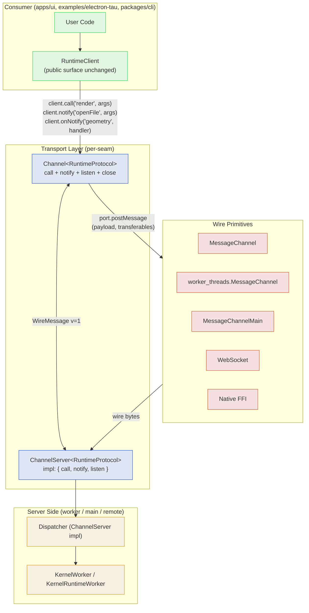
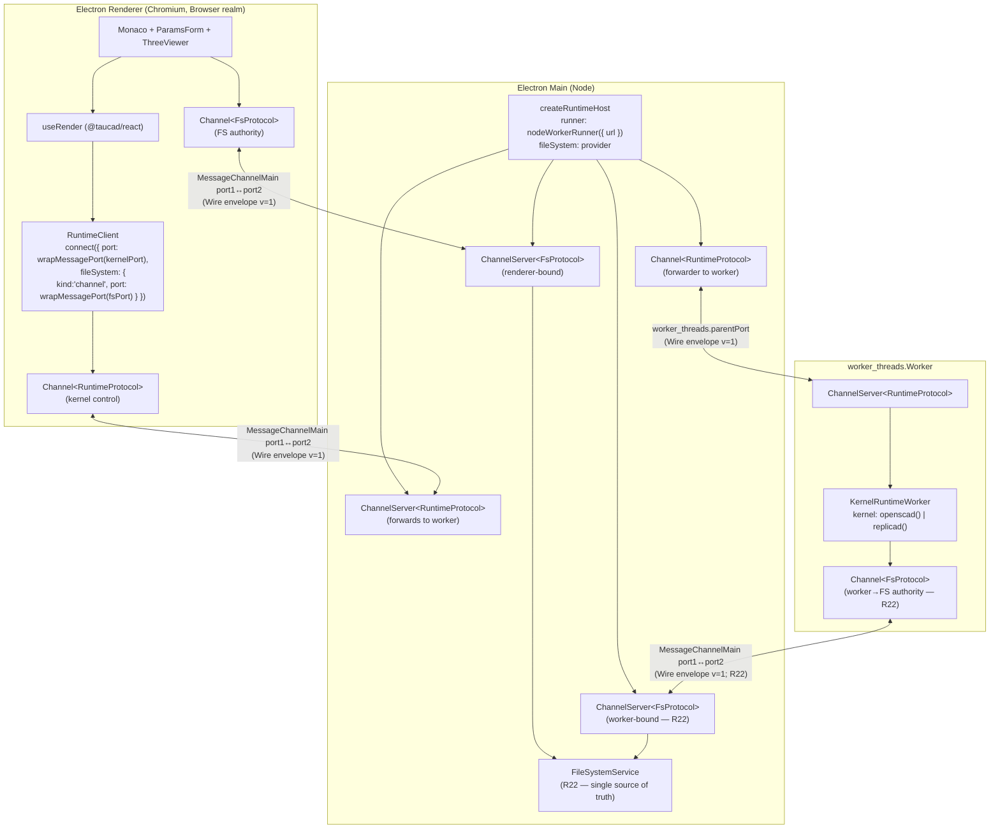

# Runtime Channel Blueprint v5 (Hybrid Primitive + Electron PoC Target)

Holistic review of Channel requirements across every transport Tau will host on (in-process, browser worker, Electron `MessagePortMain`, Node `worker_threads`, WebSocket, native FFI). Surveys existing standards, identifies the eigenquestion, ratifies a single typed hybrid primitive, and pins the Electron PoC target architecture so the gap-recovery plan can land an end-to-end PoC without re-litigating the Channel shape.

## Executive Summary

Every relevant prior art — JSON-RPC 2.0, LSP (vscode-jsonrpc), VS Code's internal `rpcProtocol.ts`, WAMP, RSocket, Comlink, tRPC, birpc, kkrpc — converges on the same fundamental shape: **a single bidirectional channel that carries correlated requests, uncorrelated notifications, and (via convention or primitive) server-pushed streams**. The recurring industry verdict is that the three logical interaction modes are not separate primitives — they are one hybrid primitive's three operating modes.

The closest direct precedent is not LSP — it is **VS Code's extension-host `rpcProtocol.ts`**, which faces the identical constraint Tau does (transferable binary buffers over a JSON-shaped envelope) and resolves it with `RequestMixedArgs` / `ReplyOKJSONWithBuffers`: a JSON envelope that references binary attachments as out-of-band slots in the same `postMessage` call. `kkrpc` (2024) productised the same pattern as `transferSlots: TransferSlot[]`. Tau's existing `WithTransferables<T>` walker is functionally identical and was already on the right track.

The remaining design choice is whether to (i) adopt JSON-RPC 2.0 / LSP's wire format wholesale, (ii) adopt their _semantics_ on a postMessage-native compact envelope, or (iii) invent something bespoke. This v5 blueprint ratifies **option (ii)** — keep `@taucad/rpc`'s compact `{v:1, k:..., i?:...}` envelope, add a notification kind, parameterize `Channel<P>` by a typed `RpcProtocol` contract, and document the equivalence with VS Code's `rpcProtocol.ts`, `kkrpc`, and LSP so the protocol is legible to anyone who knows those precedents.

Ten concrete additions land:

1. **Add `notify` / `onNotify` primitives** (wire kind `k:'nt'`) to `@taucad/rpc.Channel`. Reason: every prior art with notification-heavy workloads has them; LSP / JSON-RPC / kkrpc / birpc all have them. VS Code's internal `IChannel` skips them — defensible only because their internal IPC is notification-light.
2. **Parameterize `Channel<P>` and `ChannelServer<P>`** by a typed `RpcProtocol` contract (`{ calls, clientNotifications, serverNotifications, listens }`). End-to-end type safety, no `unknown` over the wire.
3. **Adopt the sidecar transferable pattern explicitly** — formalise `WithTransferables<T>` as the wire-spec sidecar (VS Code `RequestMixedArgs` / kkrpc `transferSlots` precedent). Document the exact semantics for cross-language consumers.
4. **Redesign the wire envelope around 2-character family-prefixed kinds** (Finding 8 + [Wire Format Specification](#wire-format-specification)) — `r*` RPC, `s*` stream, `l*` lifecycle, `f*` flow, `n*` notify. Reserve flow-control kinds (`fa` ack, `fw` window) in v1 **now**, even unused, so adding flow control is non-breaking. `postMessage` provides zero native backpressure; the slot must exist today. All breaking changes free since nothing is shipped.
5. **Pin the v5 Electron PoC** as three dedicated `MessageChannel` seams (renderer↔main kernel control, renderer↔main FS authority, main↔worker kernel runtime) — each one a typed `Channel<P>`, each transport-agnostic at the type level so a future WebSocket transport drops in without API churn.
6. **Tighten the `RuntimeProtocol` surface** to two `calls` (`initialize`, `export`) and a single bidirectional notify stream covering every other interaction. The legacy `exported` response folds into the `export` call's resolved promise; the legacy `render` call is deleted (production drives renders via the autonomous `openFile` notify + `geometryComputed` notify correlation, mirroring LSP's `didOpen`+diagnostics shape); per-call `onParametersResolved`/`onProgress` callbacks on `KernelWorker.render(...)` are removed so every autonomous event has exactly one emission source. `requestId` baggage is purged from all notify args — correlation lives in the channel envelope, not the payload. The complete inventory ships as the [RuntimeProtocol Message Inventory](#runtimeprotocol-message-inventory) table below — exactly **18 notify entries** (8 client→worker commands + 10 worker→client autonomous events).
7. **Capability-tiered `Port<T>` adapters** (Finding 15). Each adapter declares which best-in-class fast paths the underlying primitive supports — `sab` (SharedArrayBuffer slots survive the boundary), `signalSlot` (an Atomics-polled abort byte is reachable from the producer realm), `transfer` (the second `postMessage` argument hoists `Transferable[]` zero-copy), `pool` (a long-lived `SharedPool` is mountable for large-payload delivery). The `Channel` layer reads the capability set off the `Port` and routes each delivery decision through three explicit tiers: **pool → transfer → copy** (geometry, export bytes), **SAB-poll → wire-`rc`/`notify('abort')` → no-op** (cancellation). Implementations that cannot offer a fast path **omit the capability**; the layer transparently degrades. Capability sets are exchanged in the `lh` (hello) handshake's `d` payload so both peers commit to the lowest common envelope — best-in-class on supportive transports (browser worker, in-process), graceful copy on lossy boundaries (Electron renderer↔main no-SAB, WebSocket).
8. **Single FS authority is the same architectural pattern in the UI app and the Electron PoC** (Finding 16). One process hosts the canonical `RuntimeFileSystemBase`; both renderer (editor file ops) and runtime worker (kernel `stage-and-render`, dependency watch graph) connect via dedicated `Channel<FsProtocol>` pairs. UI app: SharedWorker hosts FS, UI main thread + runtime worker each open a port. Electron: main process hosts FS, renderer + worker_threads each open a `MessageChannelMain` pair. The protocol is the same; only the host realm differs. This eliminates the dual-FS divergence (worker-local memoryFS vs renderer-only authority) that today's PoC carries.
9. **`RuntimeClient` connection lifecycle collapses to `connect({ port, fileSystem, filePool })`** (Finding 17). The eager `RuntimeClientOptions.transport` field disappears alongside the `RuntimeTransport` deletions; the kernel port joins the existing async-arrival resources (`fileSystem`, `filePool`) on the lazy `connect()` step. `RuntimeClient` construction becomes a pure metadata operation, mirroring `pg.Client`/`WebSocket`/`IDBDatabase.open` industry precedent — the I/O lifecycle commits at `await client.connect(...)`, which awaits `lh`, intersects capabilities, and resolves the `client.capabilities` accessor. Capability negotiation has nowhere else to live; in-process consumers retain a one-line convenience because `connect()` constructs the default Worker port when `port` is omitted.
10. **`RuntimeClient.on(name, handler)` registry stays** (Finding 18). The earlier plan's churn to per-event helpers (`onParametersResolved(...)`, `onProgress(...)`, …) is dropped: the existing overloaded `on()` registry already gives full param-type inference, supports exhaustive `for (const ev of events) client.on(ev, …)` enumeration, matches `EventTarget.addEventListener` / Node `EventEmitter` ergonomics, and maps 1:1 to `Channel.onNotify(name, handler)` with zero adapter glue. The per-method shape regresses exhaustiveness coverage (consumers silently miss new events) for no compensating benefit. The internal `RuntimeWorkerClient` exposes a matching `on(name, handler)` shape so the layer translation is identity.

The implication for the gap-recovery plan ([`runtime_transport_gap_recovery_e73b301a`](file:///Users/rifont/.cursor/plans/runtime_transport_gap_recovery_e73b301a.plan.md)) is that Sub-step 2c+2d collapses from "migrate the bespoke correlator onto Channel + repurpose `runtime-channel.ts` as a type bridge" to "migrate onto `Channel<RuntimeProtocol>` and delete `runtime-channel.ts`+`runtime-event-source.ts`+`event-bus.ts`+`dispatcher-queue.ts` outright" — the typed protocol contract subsumes all four files.

A separate non-PoC track also lands: **fix `packages/rpc/src/multiplex.ts`** (drop JSON-string chunker, propagate transferables) so the primitive is correct for any future single-restrictive-boundary case (e.g., one transferable port through a sandboxed iframe, or one multiplexed WebSocket). The existing implementation gap (~50 LoC fix) does not block the PoC because Tau's multi-counterparty topology motivates dedicated channels regardless.

## Table of Contents

- [Problem Statement](#problem-statement)
- [Methodology](#methodology)
- [Findings](#findings) — 18 findings spanning hybrid primitive shape, LSP/VS Code/kkrpc precedents, JSON-RPC 2.0 wholesale rejection, two-RPC-layer model, cross-language readiness, CBOR upgrade path, backpressure reservations, the autonomous-notify model for worker→client events, capability-tiered Port adapters, single FS authority parity across UI app + Electron, lazy `connect({ port })` lifecycle alignment with industry precedent, and the `on(name)` registry's exhaustiveness-checking property
- [Eigenquestion](#eigenquestion)
- [Decision Matrix](#decision-matrix)
- [Recommendations](#recommendations) — R1–R25 covering primitive additions, type parameterisation, deletions, PoC topology, init handshake, backpressure reservations, tracing, a non-PoC multiplex fix track, the `RuntimeProtocol` surface tightening, capability-tiered Port adapters, single FS authority across realms, per-`rgen` client-side render timeouts, lazy `connect({ port })` as the sole connection lifecycle, and the `on(name)` registry preserved against churn
- [Target Architecture (v5)](#target-architecture-v5)
  - [RuntimeProtocol Message Inventory](#runtimeprotocol-message-inventory) — the complete request/response, fire-and-forget command, and autonomous event matrix
- [Electron PoC Topology](#electron-poc-topology)
- [Code Examples](#code-examples)
- [Trade-offs](#trade-offs)
- [Wire Format Specification](#wire-format-specification) — normative spec: field abbreviations, kind codes (family-prefixed `r*`/`n*`/`s*`/`l*`/`f*`), frame schemas, versioning rules, CBOR mapping
- [References](#references)

## Problem Statement

The runtime worker protocol exhibits three interaction modes: explicit RPC (`initialize`, `render`, `export`), client-to-server notifications (`openFile`, `updateParameters`, `setOptions`, `fileChanged`, `cleanup`, `abort`), and server-to-client notifications/streams (`geometry`, `progress`, `parameters`, `state`, `log`, `telemetry`, `kernelChange`, `capabilities`, `error`).

The v3 blueprint treated these as one transport with two layers (`Channel` + `EventSource`). The v4 blueprint kept that split. The hybrid-protocol architecture research ([this file](./runtime-channel-hybrid-protocol-architecture.md)) revisited the split and ratified Option I: **augment `@taucad/rpc.Channel` with notification primitives, delete `RuntimeChannel`/`RuntimeEventSource`/`event-bus.ts`/`dispatcher-queue.ts`**. That decision was made without a holistic survey of existing web standards.

Two questions remain unanswered:

1. **Are we reinventing the wheel?** JSON-RPC 2.0 has been the LSP base protocol for a decade. WAMP standardised RPC + PubSub on WebSocket. RSocket layered reactive streams over WebSocket/TCP. Should we adopt one of these wholesale rather than evolving `@taucad/rpc`?
2. **Is the hybrid the right shape, or should we split into separate primitives?** A "transport" (request/response + correlation) plus an "event stream" (broadcast pub/sub) plus a "stream channel" (bounded async iterables) feels architecturally cleaner — but every battle-tested system in this space chose hybrid. Why?

The Channel decision affects every transport seam Tau ships (browser worker, Electron renderer↔main, Electron main↔worker, Node worker, WebSocket, native FFI) and is upstream of the gap-recovery plan, so we resolve it before any of those seams light up.

## Methodology

1. **Re-read all prior research and planning** — v1-v4 blueprints, the hybrid-protocol architecture doc, both gap-recovery plans, the runtime-topology architecture doc, the library-api/vision policies.
2. **Web survey of nine precedents** — JSON-RPC 2.0, LSP (vscode-jsonrpc), RSocket, WAMP, Comlink, tRPC, birpc, kkrpc, MessagePack-RPC. For each: primitives offered, transport assumptions, type-safety story, streaming model, transferable / binary handling, adoption / status.
3. **Map each precedent's primitives** onto Tau's three interaction modes (request, notification, stream).
4. **Cross-check transport assumptions** — postMessage (DOM), `MessagePortMain` (Electron renderer↔main), `worker_threads.MessagePort` (Node), WebSocket, IPC.
5. **Source-dive `repos/vscode`** — read `src/vs/base/parts/ipc/{common,electron-main,electron-renderer}/ipc.{ts,mp.ts}`, `src/vs/workbench/services/extensions/common/rpcProtocol.ts`, `src/vs/base/common/buffer.ts`, the preload bootstrap. Extract the binary-handling, multiplexing, and channel-establishment patterns that have shipped to ~30M users for years.
6. **Audit `packages/rpc/src/multiplex.ts`** — read every line of the existing multiplexer, identify the implementation gaps (JSON-string chunker, no transfer list propagation), assess whether the gaps are fundamental or fixable.
7. **Critically re-evaluate JSON-RPC 2.0 wholesale adoption** — read the spec, survey real-world JSON-RPC implementations that need binary, document why every one of them resorts to base64-string-in-JSON or out-of-band sidecars or custom extensions.
8. **Identify the eigenquestion** — the single decision that determines all downstream shape choices.
9. **Score options against vision policy** — runs anywhere, source-readable, contracts-first, tested at every boundary.
10. **Pin the Electron PoC topology** — concrete seams, typed protocols, transferable handling, no unanswered architectural questions.

## Findings

### Finding 1: Every battle-tested precedent uses one hybrid primitive, not three

The nine precedents we surveyed span twenty years and four transports (HTTP, TCP, WebSocket, postMessage). Every one of them ships a single primitive that supports request, notification, and (by primitive or convention) streaming.

| Precedent                                     | Request                  | Notification                 | Stream                                             | Binary / transferable handling                                                                   | Wire base                             | Transport assumptions                               | TS-first                                        | Status                                                |
| --------------------------------------------- | ------------------------ | ---------------------------- | -------------------------------------------------- | ------------------------------------------------------------------------------------------------ | ------------------------------------- | --------------------------------------------------- | ----------------------------------------------- | ----------------------------------------------------- |
| **JSON-RPC 2.0**                              | ✓ id-correlated          | ✓ no-id                      | ✗ (defer to layer above)                           | ✗ (base64 strings only)                                                                          | JSON                                  | message-oriented, ordered, reliable                 | No                                              | IETF informational; ubiquitous                        |
| **LSP (vscode-jsonrpc)**                      | ✓ `RequestType<P,R,E>`   | ✓ `NotificationType<P>`      | ✓ `$/progress` + `partialResultToken` (convention) | ✗ (textual JSON)                                                                                 | JSON-RPC 2.0 + Content-Length headers | bidirectional message stream                        | Yes (`NotificationType`/`RequestType` generics) | Microsoft; industry standard for editors              |
| **VS Code `rpcProtocol.ts`** (extension host) | ✓ correlated `id`        | ✓ no-id                      | ✓ via `RequestJSONArgsWithCancellation`            | ✓ **`RequestMixedArgs` — JSON envelope + sidecar `VSBuffer[]` slots**                            | Custom binary frame                   | `MessagePort` between renderer and extension host   | Yes (TS-only codebase)                          | Microsoft; ~30M users; primary IPC for VS Code        |
| **VS Code `IChannel`** (cross-process IPC)    | ✓ `call(name, arg)`      | ✗ (no `notify` primitive)    | ✓ `listen(name, arg): Event<T>`                    | ✓ `VSBuffer` round-trip; `MessagePort` accepts `Uint8Array` but does **not** use `transfer` list | Custom binary                         | UDS / TCP / Node IPC / `MessagePort`                | Yes (`IChannel<TContext>`)                      | Microsoft; primary cross-process IPC                  |
| **RSocket**                                   | ✓ `REQUEST_RESPONSE`     | ✓ `REQUEST_FNF`              | ✓ `REQUEST_STREAM` + `REQUEST_CHANNEL` (primitive) | ✓ binary frames                                                                                  | Binary frames                         | TCP / WebSocket / Aeron                             | No (impl-specific)                              | Reactive Foundation; backpressure first-class         |
| **WAMP**                                      | ✓ `CALL` (routed)        | ✓ `PUBLISH` (PubSub)         | ✓ Progressive Call Results (advanced profile)      | ✓ via MessagePack serialiser                                                                     | JSON / MessagePack                    | WebSocket (default), raw TCP                        | No                                              | IETF draft; router-based                              |
| **Comlink**                                   | ✓ Proxy `await`          | ✗ (proxy methods only)       | ✗ (no async-iterable bridging)                     | ✓ `Comlink.transfer(value, [transferables])`                                                     | postMessage + ES Proxy                | DOM `MessagePort`, `Worker`, `SharedWorker`, iframe | Partial (`Remote<T>`, best-effort)              | Google; ~1.1 kB; battle-tested                        |
| **tRPC**                                      | ✓ `.query` / `.mutation` | ✗ (no fire-and-forget)       | ✓ `.subscription` (SSE/WS)                         | ✗ (JSON / superjson)                                                                             | HTTP / SSE / WS                       | HTTP-first                                          | Yes (full inference)                            | Heavy framework, server-shaped                        |
| **birpc**                                     | ✓ bidirectional fns      | ✗ (every fn returns Promise) | ✗                                                  | ✗ (uses serializer plug; no transfer list)                                                       | Any messaging                         | postMessage / WebSocket                             | Yes (`createBirpc<Fns>`)                        | antfu; ~0.5 kB                                        |
| **kkrpc** (2024)                              | ✓ correlated `id`        | ✓ no-id                      | ✓ generator-style                                  | ✓ **`transferSlots: TransferSlot[]` sidecar — direct prior art for `WithTransferables<T>`**      | JSON envelope + sidecar               | postMessage / WebSocket / stdio / Tauri IPC         | Yes                                             | crossroads-rpc; small but explicit transferable model |

**Reading**: of the nine, **four** ship all three primitives natively (RSocket, LSP+conventions, kkrpc, VS Code `rpcProtocol`). **Three** ship request + notification (JSON-RPC, WAMP, vscode-jsonrpc with progress). **One** ships request + stream-only without notification (VS Code `IChannel` — defensible because their internal IPC is notification-light; they synthesise notifications via `listen` returning `Event<void>`). **Three** ship request only (Comlink, tRPC without subs, birpc).

The architectural pressure is overwhelmingly toward "one primitive, multiple modes". When a primitive is missing, downstream layers reinvent it (LSP layered partial results onto JSON-RPC 2.0 because the base protocol lacked streams; tRPC layered subscriptions onto HTTP because HTTP lacked them; VS Code IPC consumers fake notifications as void-returning calls).

**Crucial subfinding**: of the four precedents that handle transferable binary alongside JSON, **all four use a sidecar pattern** — not embedded base64. VS Code's `RequestMixedArgs` carries `VSBuffer[]` slots referenced by index inside the JSON envelope; kkrpc's `transferSlots` does the same; Comlink delegates entirely to userland via `Comlink.transfer()`; RSocket separates frame metadata and data. **Tau's `WithTransferables<T>` is the same pattern**, independently arrived at, and is now justified by direct prior art.

### Finding 2: LSP is the closest semantic match for Tau's protocol

LSP is itself shaped exactly like the Tau runtime protocol:

- **Bidirectional**: client and server both initiate requests and notifications.
- **Correlated requests + uncorrelated notifications**: same envelope shape, presence/absence of `id` discriminates.
- **Streaming via convention**: a request that ultimately returns `null`/empty result, paired with a stream of `$/progress` notifications correlated by an out-of-band token (`partialResultToken`, `workDoneToken`).
- **Cancellation as a notification**: `$/cancelRequest` is a notification (no response) that targets a request id.
- **Typed end-to-end**: `vscode-jsonrpc` exposes `RequestType<P, R, E>` and `NotificationType<P>` generics so call sites enforce param/result types.

The Tau runtime protocol mirrors all of these. `render` is a request returning hashed-geometry. `progress`/`parameters` are LSP-style streaming notifications correlated by `renderGeneration`. `abort` is exactly `$/cancelRequest`. `state`/`log`/`telemetry`/`kernelChange` are LSP-style window notifications. `openFile`/`updateParameters` are LSP-style "did-change" notifications.

**This isn't a coincidence — both are interactive, latency-sensitive, kernel/server-backed, single-tenant protocols.** Adopting LSP semantics aligns Tau with twenty years of editor-tooling precedent and gives every protocol question a concrete answer-by-analogy ("how does LSP handle X?").

### Finding 3: Adopting LSP's _wire format_ is over-fitting; adopting its _semantics_ (and VS Code's sidecar pattern) is correct

LSP's wire format is `Content-Length: N\r\n\r\n{...JSON...}` over a stream transport. JSON-RPC 2.0's frame is `{"jsonrpc":"2.0", "id", "method", "params"}`. Three reasons not to adopt either literal wire format:

1. **Content-Length headers are nonsensical over postMessage/structured-clone.** postMessage frames are already message-bounded; the Content-Length wrapper exists only because LSP runs over stdio/sockets. On `MessagePort` you'd be parsing JSON on each side just to wrap it back up.
2. **Transferables don't survive `JSON.stringify`.** A `Uint8Array` round-tripped through JSON becomes a base64-or-array-of-numbers; we lose the zero-copy transfer (~30 ms→0 ms savings on a 50 MB GLB). Both LSP and JSON-RPC 2.0 textual wire formats predate TypedArray transferables.
3. **The `"jsonrpc": "2.0"` literal is dead weight on every frame.** Tau's `v:1` integer field is one byte (`v`) plus one digit (`1`) post-structured-clone vs. eight characters (`jsonrpc`) plus three characters (`2.0`) per frame. At hundreds of progress notifications per render, the savings are non-trivial; more importantly, the lack of `jsonrpc:'2.0'` makes it explicit that we are _not_ claiming JSON-RPC 2.0 spec compliance — we are JSON-RPC-shaped, not JSON-RPC.

What we adopt is **LSP's semantic equivalence + VS Code's `rpcProtocol.ts` sidecar binary pattern**:

| Concept                                                         | Tau `@taucad/rpc` equivalent                                                                                                                    |
| --------------------------------------------------------------- | ----------------------------------------------------------------------------------------------------------------------------------------------- |
| LSP `RequestMessage { id, method, params }`                     | `WireRequest { v:1, k:'rq', i, n, a }`                                                                                                          |
| LSP `ResponseMessage { id, result \| error }`                   | `WireResponse { v:1, k:'rs', i, o:1\|0, d?, e? }`                                                                                               |
| LSP `NotificationMessage { method, params }`                    | **NEW**: `WireNotify { v:1, k:'nt', n, a }`                                                                                                     |
| LSP `$/progress` + `partialResultToken`                         | `WireStreamSubscribe`/`WireStreamNext`/`WireStreamComplete` (with `i` as the token); also expressible as a server-`notify` correlated by `rgen` |
| LSP `$/cancelRequest`                                           | **NEW**: `WireRequestCancel { v:1, k:'rc', i }` — wired cancellation; bound to client-side `AbortSignal`                                        |
| LSP `RequestType<P,R,E>` / `NotificationType<P>`                | `Channel<P>['call']<N>` / `Channel<P>['notify']<N>`                                                                                             |
| **VS Code `RequestMixedArgs { rawArgs, buffers: VSBuffer[] }`** | **`WithTransferables<T> = { value: T, transferables: Transferable[] }` walker**                                                                 |
| **VS Code `ReplyOKJSONWithBuffers`**                            | `WireResponse { v:1, k:'rs', i, o:1, d }` carrying transferables in `postMessage`'s second arg                                                  |
| **kkrpc `transferSlots: TransferSlot[]`**                       | Same sidecar pattern as `WithTransferables`; cross-cite as independent prior art                                                                |
| LSP / VS Code `Initialize` handshake                            | **NEW**: server emits `WireHello { v:1, k:'lh', o:1\|0, d? }` on connect (R14)                                                                  |
| LSP `exit` notification / VS Code `Disconnect`                  | `WireBye { v:1, k:'lb', r? }` for graceful channel shutdown                                                                                     |

Every LSP semantic is preserved; the wire encoding is structured-clone-native, ~30% smaller than JSON-RPC 2.0, and the binary-handling pattern is **the same one VS Code ships in production to ~30M users** for renderer↔extension-host RPC.

### Finding 4: Notification primitive is the missing piece, not a separate event bus

`@taucad/rpc` today has `call` (single-shot RPC) and `listen` (stream subscription) but no fire-and-forget notification primitive. Every notification today is implemented as either:

- A `call` whose return is `Promise<void>` (extra round-trip; unnecessary correlation slot allocation).
- A custom `WireListenPush` faked through `listen('events', {})` (wastes a stream channel; introduces backpressure semantics that don't apply).

Adding `notify` / `onNotify` is one new wire kind plus ~30 lines of code in `channel.ts`. The cost-benefit ratio is decisive:

| Property                        | Without notify                         | With notify       |
| ------------------------------- | -------------------------------------- | ----------------- |
| Frame count for `openFile(...)` | 2 (call + return)                      | 1 (notify only)   |
| Correlation map allocation      | yes (slot reserved, immediately freed) | no                |
| Wire overhead                   | `i` field + `k:'r'` echo               | none              |
| LSP precedent                   | violated                               | observed          |
| Conceptual clarity              | "fire-and-forget faked as void RPC"    | "fire-and-forget" |

There is no plausible reason to keep doing without it.

### Finding 5: A separate event-bus / DomainEventBus primitive is anti-pattern

The v3/v4 blueprints carved out `RuntimeEventSource` as a peer of `RuntimeChannel`. The hybrid-protocol research ratified deletion of `RuntimeEventSource`/`event-bus.ts`. This v5 review confirms that decision against vision policy:

| Vision-policy principle              | Verdict on a separate event-bus layer                                                                        |
| ------------------------------------ | ------------------------------------------------------------------------------------------------------------ |
| **"Source you can read end-to-end"** | Splitting one logical channel into two layers (channel + event-bus) doubles the surface a reader has to map. |
| **"Tested at every boundary"**       | Two layers means two conformance suites for what is effectively one wire contract.                           |
| **"Boring, deliberate primitives"**  | Channel+notify+listen on one transport is one primitive; channel+event-bus is two.                           |
| **"No re-exports across packages"**  | A bus that sits _between_ `@taucad/rpc` and consumers re-exports notification handlers.                      |
| **`library-api-policy.md` §22**      | Explicit antipattern: re-exports across package boundaries.                                                  |

The single hybrid `Channel<P>` with `call` + `notify` + `listen` cleanly maps onto every transport with no layered intermediate.

### Finding 6: Multiplexing one transport is a different axis — topology decides per case

A common confusion: people conflate "the channel carries multiple kinds of message" (request/notification/stream) with "the channel multiplexes multiple logical channels". They are independent.

| Axis                                                 | What it solves                                                                                                                                                      | Tau decision                                                                                                                                                                                        |
| ---------------------------------------------------- | ------------------------------------------------------------------------------------------------------------------------------------------------------------------- | --------------------------------------------------------------------------------------------------------------------------------------------------------------------------------------------------- |
| **Interaction modes** (request + notify + stream)    | Same transport carries multiple message-shape types.                                                                                                                | Adopt: `Channel<P>` with `call`/`notify`/`listen`.                                                                                                                                                  |
| **Multiplexing** (multiple sub-channels on one wire) | Independent backpressure, ordering, and lifecycle for parallel concerns (kernel control vs FS authority vs telemetry) when **only one physical pipe is available**. | Use only when topology forces a single pipe. Tau's PoC has three counterparties (renderer, main, worker) so dedicated `MessageChannel`s are correct _by topology_, not because multiplex is broken. |

**Topology, not implementation, decides.** The relevant precedents split cleanly:

| Precedent          | Topology                                            | Multiplex?                                                     | Why                                                                                                                      |
| ------------------ | --------------------------------------------------- | -------------------------------------------------------------- | ------------------------------------------------------------------------------------------------------------------------ |
| LSP                | client ↔ one language server                        | No                                                             | One counterparty, one connection                                                                                         |
| VS Code `IChannel` | renderer ↔ extension host (one peer)                | **Yes** — channels named in header on **single physical link** | One counterparty hosts dozens of services; multiplex amortises one MessagePort                                           |
| RSocket            | client ↔ server                                     | Yes (REQUEST_CHANNEL)                                          | Built around one socket                                                                                                  |
| Comlink            | one DOM context ↔ one Worker                        | No                                                             | One MessagePort per worker; spawn another worker for another concern                                                     |
| Tau v5 PoC         | renderer ↔ main ↔ worker (**three counterparties**) | **No**                                                         | Three peers; multiplexing on the renderer↔main pipe still wouldn't help because main↔worker is a different physical pair |

Tau follows the **Comlink / LSP** precedent for the PoC: one Channel per seam, multiple seams via dedicated `MessageChannel` pairs. VS Code's IPC multiplexer **is the right answer for a single-counterparty topology with many logical channels** (extensions registering a dozen+ services on one MessagePort) — the wrong answer for our three-counterparty topology, where multiplexing the renderer↔main link buys nothing because the main↔worker link is a separate physical pair anyway.

**A separate fact**: the existing `@taucad/rpc/multiplex.ts` implementation has known bugs — its JSON-string chunker corrupts `Uint8Array` payloads and its `postMessage(frame)` calls drop transferables (no `transfer` argument). These are ~50 LoC fixes (replace JSON-string chunker with structured-clone-native chunking; thread the `transferables` arg through `postInner`/`postFrame`). The fix is tracked as a non-PoC track because **even with the bug fixed, the v5 PoC topology motivates dedicated channels**. The multiplex layer is preserved as a primitive for future single-pipe scenarios (e.g., one WebSocket carrying both kernel control and telemetry, or one renderer↔one-iframe link carrying multiple logical channels).

If we ever land a single-counterparty topology that benefits from multiplexing, we add it as a separate `MultiplexedChannel<P>` wrapper without changing the base primitive — exactly VS Code's split between `IChannelClient` (what consumers use) and the underlying multiplexed `IPCClient` (what carries them).

### Finding 7: Transferables and SharedArrayBuffer constraints map differently per transport

The transport matrix at the wire-primitive level:

| Transport                                     | `Transferable[]`        | `SharedArrayBuffer`   | Structured clone       | MessagePort transfer | Notes                                    |
| --------------------------------------------- | ----------------------- | --------------------- | ---------------------- | -------------------- | ---------------------------------------- |
| Browser DOM `MessageChannel`                  | ✓                       | ✓ (COOP/COEP)         | ✓                      | ✓                    | full set                                 |
| Browser `Worker.postMessage`                  | ✓                       | ✓ (COOP/COEP)         | ✓                      | ✓                    | full set                                 |
| Browser `SharedWorker.port`                   | ✓                       | conditional           | ✓                      | ✓                    | full minus SAB across realms             |
| Node `worker_threads.MessageChannel`          | ✓                       | ✓                     | ✓                      | ✓                    | full set                                 |
| Electron renderer `MessageChannel`            | ✓                       | ✓                     | ✓                      | ✓                    | full set (within renderer)               |
| Electron `MessageChannelMain` (renderer↔main) | ✓ (incl. `MessagePort`) | ✗ (open issue #50291) | ✓                      | ✓                    | **SAB cannot cross renderer↔main today** |
| Electron `MessagePortMain` (main↔main)        | ✓                       | ✓                     | ✓ (Mojo serialiser)    | ✓                    | full set                                 |
| Node child_process IPC                        | ✗ (cross-process)       | ✗                     | partial (no Maps/Sets) | n/a                  | structured-clone-lite                    |
| WebSocket binary frames                       | ✗                       | ✗                     | n/a (manual codec)     | ✗                    | binary copy only; full encode/decode     |
| Native FFI (Tauri / N-API)                    | depends                 | depends               | impl-specific          | n/a                  | typically wire-command                   |

The `WithTransferables<T>` envelope already in `@taucad/rpc` (per gap-recovery plan Sub-step 2a) handles transferable hoisting where supported and degrades to copy semantics where not. The Channel API itself is transport-agnostic; transports declare their `Port` capabilities and the Channel walks payloads accordingly.

Implication: **the primitive choice does not depend on the transport.** A `Channel<P>` with `call`/`notify`/`listen` is correct for every row of the matrix; only the binary-payload handling changes.

### Finding 8: The wire format is unshipped — redesign kinds around 2-character family prefixes

The current `@taucad/rpc/wire.ts` uses arbitrary single-letter kind codes (`c`, `r`, `l`, `p`, `n`, `f`, `x`) with no organising principle. They were chosen for one-byte compactness and have not been published — `@taucad/rpc` is workspace-internal, the wire is structured-cloned over `MessagePort`, and no external consumer depends on the exact codes.

Auditing the existing kinds against the v5 needs surfaces five problems:

| Issue                               | Existing                                                    | Why it fails                                                                                                        | Proposed fix                                                                                             |
| ----------------------------------- | ----------------------------------------------------------- | ------------------------------------------------------------------------------------------------------------------- | -------------------------------------------------------------------------------------------------------- |
| Arbitrary letter assignment         | `c`/`r`/`l`/`p`/`n`/`f`/`x`                                 | No family clustering; reader has to memorise each independently                                                     | 2-char family-prefixed codes (`r*` RPC, `s*` stream, `l*` lifecycle, `f*` flow, `n*` notify)             |
| Notification clash                  | `n` already means "listen-end"; cannot use `n` for "notify" | Adding R1 forces a sub-optimal letter                                                                               | Free `n` family up: notify → `nt`, stream-end → `sc` (stream-complete)                                   |
| No consumer-initiated stream cancel | Stream has sub / push / end / fail but no `unsubscribe`     | Consumer can only abort via `AbortSignal` locally; server never sees the cancel and keeps producing                 | Add `su` (stream-unsubscribe) carrying stream id                                                         |
| No request cancel frame             | Cancellation is local-only via `AbortSignal`                | Server never sees pending-call cancellation; long-running renders cannot be cooperatively cancelled across the wire | Add `rc` (request-cancel) carrying request id (LSP `$/cancelRequest` precedent)                          |
| Field abbreviation inconsistency    | `em` (error message) is 2 chars; everything else is 1       | Wire format aesthetics; `em` is the only multi-char field name                                                      | Replace `em` with structured `e: { m, c?, s? }` (message/code/stack) — single-char field, richer payload |

Two-character family prefix codes cost ~1 extra byte per frame in JSON (negligible after structured-clone; trivial in CBOR where short strings cost 2 bytes either way). The benefit is decisive: every kind is **legible at a glance** in DevTools, **groups visually** by family, and **leaves 26 slots per family** for future extension without picking semantics-free letters.

The full redesigned wire format is specified in [Wire Format Specification](#wire-format-specification) at the end of this document. Highlights:

- **RPC family** (`r*`): `rq` request, `rs` response, `rc` request-cancel
- **Notification family** (`n*`): `nt` notify
- **Stream family** (`s*`): `ss` subscribe, `sn` next, `sc` complete, `se` error, `su` unsubscribe
- **Lifecycle family** (`l*`): `lh` hello (handshake), `lb` bye (graceful close)
- **Flow control family** (`f*`, reserved for v6): `fa` ack, `fw` window

The TypeScript types follow the same renaming: `WireCall` → `WireRequest`, `WireReturn` → `WireResponse`, `WireListenSub` → `WireStreamSubscribe`, etc. Since nothing is shipped, all breaking changes are free.

### Finding 9: JSON-RPC 2.0 wholesale adoption fails on transferables — every real-world implementation works around it

The JSON-RPC 2.0 spec ([§4](https://www.jsonrpc.org/specification)) constrains `params` to "Structured value that holds the parameter values to be used during the invocation of the method. This member MAY be omitted." The structure must be JSON. That word is fatal for binary: JSON has no native bytes type.

The web survey turned up four common workarounds, **all of them strictly worse than a sidecar pattern**:

| Workaround                                | Pros                                               | Cons                                                                                                                | Real-world example                                                                                              |
| ----------------------------------------- | -------------------------------------------------- | ------------------------------------------------------------------------------------------------------------------- | --------------------------------------------------------------------------------------------------------------- |
| **Base64-encode bytes inside `params`**   | Spec-compliant; works through any JSON-RPC tooling | ~33% size inflation; CPU cost on encode/decode; no zero-copy; defeats `Transferable[]`                              | Bitcoin Core RPC, Ethereum JSON-RPC `data` fields                                                               |
| **Multipart sidecar (out-of-band)**       | Preserves binary                                   | Not part of the spec; every consumer needs custom multipart handling                                                | OpenRPC `binary` extension proposals (never standardised)                                                       |
| **Custom `jsonrpc` extension fields**     | Cheap to add                                       | Loses spec-compliance; not legible to standard tooling; same as inventing your own protocol but with extra ceremony | Various IPC systems                                                                                             |
| **Switch to MessagePack-RPC or CBOR-RPC** | Native bytes; small frames                         | No longer JSON-RPC at the wire level; "JSON-RPC" becomes a misnomer                                                 | MessagePack-RPC (msgpack-rpc spec), Web3 JSON-RPC clients increasingly use raw bytes via WebSocket subprotocols |

The conclusion across all four is the same: **JSON-RPC 2.0 conformance is incompatible with zero-copy transferable binary**. Anyone in the JSON-RPC ecosystem who needs binary either lies (calls their custom protocol JSON-RPC), eats the base64 cost, or moves to a binary-native protocol.

**Tau's `WithTransferables<T>` walker is in the third category — but transparently.** We do not claim JSON-RPC 2.0 conformance (no `jsonrpc:"2.0"` field on the wire); we claim _JSON-RPC-shaped semantics_ (id-correlated request, no-id notification) plus a documented sidecar. This is the same engineering choice VS Code's `rpcProtocol.ts` made — they describe their wire as JSON-shaped but never claim JSON-RPC 2.0 conformance.

### Finding 10: VS Code's two-RPC-layer model directly validates Tau's

Source-diving `repos/vscode` revealed a structurally identical design to what Tau is converging on:

| Layer                                                     | VS Code                                                                                           | Tau v5                                                                                        | Notes                                                |
| --------------------------------------------------------- | ------------------------------------------------------------------------------------------------- | --------------------------------------------------------------------------------------------- | ---------------------------------------------------- |
| **Internal cross-process IPC** (high frequency, internal) | Custom binary `VSBuffer`-based protocol; multiplexes channels by name on one physical link        | `Channel<P>` over `MessagePort` with `WithTransferables<T>` sidecar                           | Both: hand-rolled, perf-tuned, **not** JSON-RPC      |
| **External integrations** (LSP, DAP, JS-debug)            | JSON-RPC 2.0 / LSP / DAP base protocol                                                            | (Future) — language servers, debug protocol consumers                                         | Both: standard wire for cross-language interop       |
| **Connection establishment**                              | UUID nonce + `window.postMessage` with `e.ports`; server emits `ResponseType.Initialize`          | `MessageChannelMain` from main; **proposed `WireReady` handshake (R14)**                      | Direct precedent for init handshake                  |
| **Cancellation**                                          | `CancellationToken` propagated as a request-scoped abort                                          | `AbortSignal` in call options; future `WireCancel` if we need cross-realm cancellation tokens | Functionally equivalent                              |
| **Binary buffers**                                        | `VSBuffer` Uint8Array wrapper; **`MessagePort` does NOT use `transfer` list** (accepts copy cost) | `WithTransferables<T>` walker hoists `Transferable[]` into the second `postMessage` argument  | **Tau is more aggressive than VS Code on zero-copy** |
| **Logging / tracing**                                     | `IRPCProtocolLogger` interface — every frame inspectable in dev                                   | **Proposed `RPC_TRACE=1` env logger (R16)**                                                   | Direct precedent                                     |
| **Notification primitive**                                | Absent in `IChannel`; faked as `listen(name): Event<void>` returning a single-shot event          | `notify` / `onNotify` (proposed R1)                                                           | Tau improves on VS Code here — explicit beats faked  |

Two facts stand out:

1. **VS Code does not use `transfer` lists over MessagePort despite handling binary buffers**. They accept the copy cost. This was a deliberate choice (per source comments in `src/vs/base/parts/ipc/electron-renderer/ipc.mp.ts`) to keep the protocol simple. Tau's choice to thread transferables aggressively is a **net win for our workload** (50 MB GLB at 60 FPS is ~3 GB/s of copy bandwidth otherwise).
2. **VS Code splits internal IPC and external interop across two RPC layers**. This is exactly the right architectural pattern: a fast custom internal protocol for hot paths, plus standard wires (JSON-RPC / LSP) at the edges. Tau will follow this split when we eventually add LSP-server or DAP-style integrations.

### Finding 11: Cross-language readiness comes from a spec doc + conformance fixtures, not from picking a "standard" wire

A reasonable concern: future Tau hosts/clients may be in non-JS languages (Rust via Tauri, Python kernel server, native Electron addon). Should the wire format be a "standard" so cross-language clients are easy?

The answer is **no — and this is empirically settled by both VS Code and the JSON-RPC ecosystem**:

- **VS Code's internal IPC is bespoke**, yet implementations exist in TypeScript, Rust (rust-analyzer talks to it via JSON-RPC at the _outer_ edge while VS Code uses internal custom binary inside), and various extension hosts. The spec is documented; the format is stable; cross-language ports happen.
- **JSON-RPC 2.0's "standard" status does not deliver cross-language ergonomics.** Real-world JSON-RPC libraries differ on cancellation, batching, error codes, and transport; cross-language interop still requires careful per-pair testing.

What actually delivers cross-language readiness:

| Requirement                | Tau v5 plan                                                                                                                                    | Why                                                                                              |
| -------------------------- | ---------------------------------------------------------------------------------------------------------------------------------------------- | ------------------------------------------------------------------------------------------------ |
| **Stable wire spec doc**   | Author `docs/architecture/rpc-wire-spec.md` documenting every `k:` kind, the `WithTransferables<T>` sidecar, and version evolution rules (R13) | A non-JS implementer should be able to write a Channel from the spec alone                       |
| **Conformance fixtures**   | Ship `packages/rpc/test/conformance/*.json` round-trip vectors (envelope-only, no transferables)                                               | Any new transport / language port can self-test against the same fixtures                        |
| **Schema-driven envelope** | Already have `WireMessage` discriminated union; add a JSON Schema mirror so non-TS consumers can codegen types                                 | One source of truth; no spec-doc drift                                                           |
| **CBOR fallback path**     | Keep envelope structure independent of JSON-vs-CBOR encoding (R12 update)                                                                      | Future binary-native consumers (Rust over WebSocket) can switch encoding without semantic change |

The wire format being "JSON-RPC-shaped" rather than "literally JSON-RPC 2.0" loses nothing of practical value for cross-language interop and gains transferable preservation, smaller frames, and one less layer of ceremony.

### Finding 12: CBOR (RFC 8949) is the right binary upgrade path for Tau

If/when we eventually need a binary wire (e.g., for a Rust client over WebSocket where structured-clone is unavailable, or for log-stream compression), the survey points to one specific format: **CBOR (RFC 8949)**.

| Format                                           | Native bytes? | Schema-free?        | Spec status                | Frame size vs JSON | Tooling                                   | Verdict                                        |
| ------------------------------------------------ | ------------- | ------------------- | -------------------------- | ------------------ | ----------------------------------------- | ---------------------------------------------- |
| **JSON**                                         | ✗             | ✓                   | Universal                  | baseline           | Universal                                 | Current default; keeps as primary              |
| **MessagePack**                                  | ✓             | ✓                   | de facto                   | ~30-40% smaller    | Good (every language)                     | Strong contender; lacks IETF backing           |
| **CBOR (RFC 8949)**                              | ✓             | ✓                   | **IETF Standards Track**   | ~30% smaller       | Good; mature in IoT/COSE/EDHOC ecosystems | **Recommended binary path**                    |
| **Protocol Buffers / Cap'n Proto / FlatBuffers** | ✓             | ✗ (schema required) | Standards (PB) / community | smaller still      | Heavy codegen                             | Wrong fit — schema-driven, not envelope-shaped |
| **Bincode / native binary**                      | ✓             | ✗                   | None                       | varies             | Minimal                                   | Cross-language porting cost too high           |

CBOR's match is exact:

- **IETF standards track** (RFC 8949) means stable and citable for spec docs.
- **Self-describing** (no schema needed) — the same `WireMessage` discriminated union encodes directly.
- **Tagged binary types** (RFC 8949 §3.4.5) preserve `Uint8Array` natively without an out-of-band sidecar — _we keep_ `WithTransferables<T>` for `MessagePort` zero-copy, but for transports without `Transferable` lists (WebSocket, FFI), CBOR's native byte type drops the sidecar to a no-op.
- **COSE / EDHOC** (the IETF security stack) shows CBOR scales to performance-critical embedded contexts.

The plan: **keep JSON as the default for postMessage** (structured clone is faster than CBOR encoding when the runtime would already structured-clone the value). **Add `cbor` codec selection at transport bootstrap** when WebSocket / FFI lands. The `WireMessage` union does not change.

### Finding 13: `postMessage` provides zero native backpressure — reserve wire kinds now

A subtle gap not previously called out: `MessagePort.postMessage` and `Worker.postMessage` have **no native backpressure**. A producer that emits 1000 progress notifications/sec into a port whose consumer drains at 10/sec will balloon the consumer's task queue until the realm OOMs or the ports get severed. This is a known pain point (`MessagePort` exposes no `bufferedAmount`-equivalent; only `WebSocket` does).

Tau's progress and telemetry streams are exactly this shape: a slow consumer (UI rendering at 60 FPS) faces a fast producer (kernel emitting per-tessellation-step progress).

The fix is application-level windowed flow control (similar to RSocket's `REQUEST_N` frames or HTTP/2 `WINDOW_UPDATE`):

- Consumer sends `WireWindow { v:1, k:'w', i, n: <slots> }` granting N slots to a stream id.
- Producer decrements local slot count on each `WireListenPush` / `WireNotify`-into-stream; when slots hit 0, blocks until a fresh `WireWindow`.
- Consumer optionally sends `WireAck { v:1, k:'a', i }` for at-least-once delivery checkpoints (rarely needed in-realm but useful for WebSocket).

We do **not** need to implement this for the v5 PoC — but we **do** need to **reserve the wire kinds in the v1 envelope now** so that adding flow control later does not break the wire format. Two single-character codes (`'a'`, `'w'`) cost nothing today and unblock the future.

### Finding 14: Worker→client events are autonomous notifies, not per-call results — collapsing them into call results breaks the reactive-render contract

The pre-Channel runtime had three overlapping mechanisms for delivering worker-side events to the client:

1. **Resolved promise on `worker.render(...)`** carrying `HashedGeometryResult` (the synchronous-feeling RPC return).
2. **Per-call callbacks** (`onParametersResolved`, `onProgress`) passed into `worker.render(...)`, fired during the call's lifetime.
3. **Top-level autonomous callbacks** on the `KernelWorker` instance (`worker.onParametersResolved`, `worker.onProgressUpdate`, `worker.onGeometryReady`), fired regardless of whether a render was triggered by an explicit `render(...)` call or by an autonomous filesystem watch event.

Mechanisms (2) and (3) emit the **same payloads**. The dual-emission was a v3-era workaround for the legacy `RuntimeChannel` not having a notification primitive — per-call callbacks let the client correlate progress events with a specific RPC. With `Channel<P>` carrying a real `notify` primitive (R1), the per-call callbacks are redundant.

The deeper architectural question is whether worker→client events should be **collapsed into RPC call results** or remain **autonomous notifies**. The architectural docs ([`runtime-topology.md`](../architecture/runtime-topology.md), [`apps/ui/content/docs/(runtime)/concepts/architecture.mdx`](<../../apps/ui/content/docs/(runtime)/concepts/architecture.mdx>)) settle this decisively: **autonomous notifies**, because the kernel worker is an **autonomous reactive render service**, not an RPC-shaped stateless function:

| Property                        | RPC-call-result model                                           | Autonomous-notify model (chosen)                                                                                                                                    |
| ------------------------------- | --------------------------------------------------------------- | ------------------------------------------------------------------------------------------------------------------------------------------------------------------- |
| **Render trigger**              | Only client-initiated via `channel.call('render', …)`           | Client `openFile` notify, autonomous filesystem watch events, `updateParameters` notify, `setOptions` notify, `fileChanged` notify, kernel-internal recovery        |
| **Parameters delivery**         | After geometry computes, packaged into the `render` call result | Emitted as soon as the bundler resolves them — typically **before** geometry computation completes — so the parameter UI populates without waiting for tessellation |
| **Progress streaming**          | Per-call `onProgress` callback bound to one RPC                 | Always-on stream from kernel state machine; UI consumers subscribe once at startup, every render's progress is delivered to the same handler                        |
| **Watch-driven re-render**      | Cannot deliver — no client-initiated RPC to attach a result to  | First-class — same `geometryComputed` notify that fires for `openFile`-driven renders                                                                               |
| **Superseded renders**          | Discarded silently or surfaced via a one-shot reject            | Surfaced as a `progress` notify with phase `'aborted'`; downstream geometry handlers gated on `rgen` ignore stale frames                                            |
| **Autonomous service contract** | Violated — every event must originate from a client RPC         | Honoured — worker is the source of truth for its own state machine                                                                                                  |

Collapsing `parametersResolved` into a hypothetical `render` call result would mean **every parameter UI update waits for tessellation**. For a user dragging a slider, the parameter value visible in the UI lags by the entire render time — user-facing latency goes from ~5ms to potentially 500ms+. The autonomous-notify model is not an aesthetic preference; it is the only model that satisfies the early-parameter, watch-driven, reactive contract.

What **does** collapse cleanly into call results: the `exported` notify (renamed away). Export is a discrete client-initiated request with one byte payload as the answer; `Channel.call('export', args)` returns `Promise<ExportResult>` and the response frame already correlates the answer to the request via `i`. There is no autonomous-export trigger. Keeping a separate `exported` notify after the chosen `Channel<P>` model is double-bookkeeping.

The `render` RPC call sits in an awkward middle. It exists in `RuntimeProtocol.calls` today but the production `RuntimeClient` does not use it — `RuntimeClient.openFile` posts an `openFile` notify and resolves its public-facing render promise off the next `geometry` event. The `render` call is reachable only by tests. The architectural blueprint explicitly removes `render` from the public client surface. Therefore, the most aligned tightening is to **remove `render` from `RuntimeProtocol.calls` entirely** and refactor render-correlation tests to use the production-style autonomous flow (post `openFile` notify; await the next `geometryComputed` notify keyed by `rgen`).

Two consequences for the protocol surface:

| Surface change                                                                        | Status                        | Rationale                                                                                                                                                                                                |
| ------------------------------------------------------------------------------------- | ----------------------------- | -------------------------------------------------------------------------------------------------------------------------------------------------------------------------------------------------------- |
| Remove `render` from `RuntimeProtocol.calls`                                          | breaking, in scope            | Production never uses it; tests mislead the surface                                                                                                                                                      |
| Remove `exported` notify                                                              | already done in current types | `Channel.call('export', args)` resolves with the byte payload; the channel envelope correlates without a separate notify                                                                                 |
| Remove per-call `onParametersResolved` / `onProgress` from `KernelWorker.render(...)` | breaking, in scope            | Single emission source via `worker.onParametersResolved` / `worker.onProgressUpdate`; redundant dual paths deleted                                                                                       |
| Remove `requestId` from all notify args                                               | already done                  | `Channel.notify` is fire-and-forget; correlation lives on the envelope, not in payloads. Worker→client streams correlate by `rgen` (render generation) where ordering across overlapping renders matters |

### Finding 15: Best-in-class fast paths must be declared as Port capabilities, not branched on per-callsite

The blueprint already names two best-in-class fast paths (Findings 7, 14): `SharedArrayBuffer` for cooperative abort signalling (Atomics-polled by the OC Proxy between every WASM call), and `SharedPool` for zero-copy geometry delivery on transports where SAB survives the boundary. A third — `Transferable[]` zero-copy — is universally available to `postMessage`-class transports.

Today these fast paths are **partially encoded and partially branched**. The runtime client writes to a known SAB slot via `transport.signalAbort('superseded')`; the dispatcher's `toTransportGeometry` consults a worker-local `geometryPool`; the channel's `WithTransferables<T>` walker hoists transferables on every `postMessage`. Each is a different branch in a different layer with no shared way of asking "can this transport carry SAB / a pool / transferables, or do I copy?"

The architectural pressure (cited explicitly in the Vision Policy clause "preserve all best-in-class paths where possible") is to **encode the capability set on the `Port<T>` adapter**. The transport that wraps a primitive declares what the primitive can do; the channel layer consults the declaration before each delivery decision and falls back through documented tiers. Implementations that cannot offer a tier **omit the capability** — they do not return `false` or simulate the fast path; they expose only what is real, and the channel selects the next tier transparently.

| Capability   | What it enables                                                                | Available on                                                                                                                                | Unavailable on                                                                                                                                                  | Tier when missing                                                                        |
| ------------ | ------------------------------------------------------------------------------ | ------------------------------------------------------------------------------------------------------------------------------------------- | --------------------------------------------------------------------------------------------------------------------------------------------------------------- | ---------------------------------------------------------------------------------------- |
| `sab`        | `SharedArrayBuffer` survives the boundary                                      | browser `MessageChannel`, `Worker.postMessage` (under COOP/COEP), Node `worker_threads.MessagePort`, Electron `MessagePortMain` (main↔main) | Electron `MessageChannelMain` (renderer↔main, [issue #50291](https://github.com/electron/electron/issues/50291)), Node child_process IPC, WebSocket, native FFI | wire-level abort via `nt`/`rc` frame; geometry delivery falls through to `transfer` tier |
| `signalSlot` | An Atomics-polled abort byte reachable from the producer realm                 | implies `sab`; worker realm must hold a `Uint8Array` view of the same SAB                                                                   | renderer↔main where SAB cannot cross                                                                                                                            | wire-level abort only; producer cannot pre-empt mid-WASM                                 |
| `transfer`   | Second `postMessage` argument hoists `Transferable[]` zero-copy                | every `MessagePort`-class transport                                                                                                         | Node child_process IPC, WebSocket binary frames, FFI                                                                                                            | full encode/decode (copy)                                                                |
| `pool`       | A long-lived `SharedPool` (SAB-backed) is mountable for large-payload delivery | implies `sab`; both peers hold shared views                                                                                                 | any boundary that breaks SAB                                                                                                                                    | inline delivery via `WithTransferables<T>` (transfer tier) or copy tier                  |

The `Channel<P>` consults capabilities at three decision points:

1. **Geometry / export delivery** (worker→client): `pool` → `transfer` → `copy`. Today's `toTransportGeometry` already does this; the change is making it consult declared `Port` capabilities instead of a worker-local `geometryPool` reference, so the same code path lights up identically on every transport that declares `pool: true`.
2. **Cooperative abort** (client→worker): `signalSlot` (Atomics.store + WASM-side poll) **plus** `nt`/`rc` (wire fallback) — they are not mutually exclusive. The fast path pre-empts mid-WASM at ~5µs latency; the wire path covers transports without SAB and is also the canonical "official" cancellation channel that a long-running export call resolves into. The client writes the SAB slot **and** sends the wire frame; the worker consumes whichever arrives first.
3. **Hello capability handshake** (`lh` payload): each side declares its capability set in `d`. Both peers commit to the **intersection** for the rest of the connection. The intersection is computed once at handshake; downstream code sees a single resolved capability set.

This formalisation has three concrete consequences:

- The `Port<T>` interface adds a readonly `capabilities: PortCapabilities` field. Today's `wrapMessagePort()` declares `{ transfer: true, sab: <COOP/COEP-detected>, signalSlot: false, pool: false }`; future `wrapMessagePortMain(port, { signalSlot })` for Electron main↔main can opt in.
- `RuntimeWorkerClient.incrementAbortGeneration()` retains the SAB write **and** sends `notify('abort')`, both unconditionally; the worker's WASM polling consumes SAB first and the wire path covers the no-SAB case.
- The geometry-cache middleware preserves its own copy of the buffer (so cache hits don't depend on transferred bytes); the channel walker sees an inline `Uint8Array` and either pools it (when `pool` capability is declared and a pool is mounted), transfers it (when `transfer` capability), or copies it (otherwise). The dispatcher's `toTransportGeometry` becomes a tiered helper that reads `port.capabilities` instead of branching on a worker-local pool ref.

This is the architectural pattern used by VS Code's `IPCClient` (transports declare what they support; the multiplexer routes accordingly), kkrpc's `transferSlots` (the consumer of a port chooses to use slots or not based on the port's nature), and HTTP/2 SETTINGS frames (peers exchange tier capabilities at handshake).

### Finding 16: Single FS authority — same pattern across UI app and Electron, owned by one host realm

The PoC's three-seam diagram shows a renderer↔main FS authority Channel but is silent on the worker. The current source-of-truth split is uncomfortable:

- **Worker realm** (kernel runtime) operates against a worker-local `RuntimeFileSystemBase` (today seeded with `fromMemoryFS` in the Electron PoC, with `apps/ui`'s SharedWorker FS in production).
- **Renderer realm** (editor + UI) operates against the FS authority bridge (in Electron PoC, today empty; in UI app, the same SharedWorker FS the worker uses).

In the UI app, both realms talk to the same SharedWorker FS — the kernel worker dependency-watch + parameter-file resolver and the editor file ops see the same writes. In the Electron PoC, they don't: a renderer save lands in main's authority but the worker's memoryFS doesn't see it; conversely a worker `stage-and-render` writes a file the renderer never observes.

The architectural fix is to **mirror the UI-app pattern in Electron**: one host realm owns the FS, both renderer and worker connect to it via dedicated `Channel<FsProtocol>` pairs.

| Topology                       | FS host                                                      | Renderer connection           | Worker connection                         | Notify channel for `fileChanged`             |
| ------------------------------ | ------------------------------------------------------------ | ----------------------------- | ----------------------------------------- | -------------------------------------------- |
| **UI app today**               | SharedWorker                                                 | `MessagePort` to SharedWorker | `MessagePort` to SharedWorker             | `fileChanged` notify off the same FS Channel |
| **Electron PoC, today**        | Main process (renderer-only) + worker memoryFS (worker-only) | `MessageChannelMain` to main  | (none — worker holds its own memoryFS)    | renderer subscribes; worker is blind         |
| **Electron PoC, target (R22)** | Main process                                                 | `MessageChannelMain` to main  | second `MessageChannelMain` to main       | both subscribe; identical to UI app shape    |
| **Future remote topology**     | server process                                               | WebSocket to server           | WebSocket to server (or relayed via main) | identical                                    |

The `Channel<FsProtocol>` shape is identical in every row. Only the **host realm** differs (SharedWorker vs main process vs server). This is the Comlink/LSP precedent applied to FS: one authoritative service, many port consumers.

Two consequences:

- The Electron PoC main process spawns **two** `MessageChannelMain` pairs for FS — one to the renderer, one to the worker — and constructs two `ChannelServer<FsProtocol>` instances backed by the same underlying provider. Notifies (`fileChanged`) fan out to all subscribed ports.
- The UI app's existing FS architecture (SharedWorker host, port-per-consumer) is the canonical pattern; the Electron PoC adopts it without divergence. Future FS code lives in one place (`packages/runtime/src/filesystem/` or `packages/filesystem/`); the host realm wraps it.

### Finding 17: `RuntimeClient` connection API collapses onto a single lazy `connect({ port, fileSystem, filePool })`

The current `RuntimeClient` exposes two distinct ways for the kernel transport to enter the client lifecycle:

- **Eager**: `new RuntimeClient({ transport, … })` — `RuntimeClientOptions.transport: RuntimeTransport` is set at construction. The internal `RuntimeWorkerClient` is wired immediately; subsequent `client.connect(...)` is the moment for `fileSystem` / `filePool` resources, not the kernel port.
- **Lazy**: `new RuntimeClient({ … }); await client.connect({ fileSystem, filePool })` — `transport` is omitted, the client lazily spawns a default Worker via `runtime-default-worker.ts`. The kernel port is implicit, the option `transport` is the only opt-in for an external port.

This split made sense while `RuntimeTransport` was a separate two-layer object (`channel + eventSource`) — it was the _value_ the consumer could construct in advance and hand over. After R4 (Phase 7) deletes `RuntimeTransport` outright and replaces it with a single `Channel<RuntimeProtocol>` driven by a `Port<unknown>` adapter, that motivation evaporates. We are left with two questions: does the kernel port belong with the eager metadata or the lazy I/O resources, and which industry precedent should the lifecycle align with?

| API shape                                                                       | Connection commit                     | `lh` handshake / capability negotiation                                                                                           | Default Worker convenience                                                                   | `RuntimeWorkerClient` complexity                  | Precedent                                                                                                                                       |
| ------------------------------------------------------------------------------- | ------------------------------------- | --------------------------------------------------------------------------------------------------------------------------------- | -------------------------------------------------------------------------------------------- | ------------------------------------------------- | ----------------------------------------------------------------------------------------------------------------------------------------------- |
| **Shape A** — keep `transport` eager + lazy `connect({ fileSystem, filePool })` | Two-step (eager wire, lazy resources) | Must run somewhere — either eagerly inside the constructor (forbidden: ctors don't await) or deferred into `connect()` regardless | Already lazy — default-worker URL resolves only when `transport` is absent                   | Two construction paths, two field-presence shapes | None — splits port from other I/O resources                                                                                                     |
| **Shape B** — drop `transport`; `connect({ port?, fileSystem, filePool })`      | Single-step async commit              | Runs once, inside `connect()`, after `await wrapMessagePort(port).postMessage('lh')`                                              | Preserved: when `port` is omitted, `connect()` constructs the default Worker port internally | One construction path, one I/O lifecycle          | `pg.Client.connect()`, `WebSocket` (open event), `IDBDatabase.open`, `MongoClient.connect()`, every database/network client in the JS ecosystem |
| **Shape C** — drop both, require eager `port` argument                          | Synchronous commit                    | Cannot run — must be awaited in `connect()` regardless                                                                            | Lost — every consumer must own port construction                                             | Two paths if any consumer wants laziness          | Java/Go-style synchronous open; mismatched with `MessagePort`'s async-by-design                                                                 |

Three architectural observations:

1. **Ports are I/O resources, not metadata.** Every other resource on `RuntimeClient` that requires bidirectional I/O — `fileSystem`, `filePool`, `transcoderSet` — is supplied at `connect()`. Ports follow the same shape; placing the kernel port at construction is the outlier.
2. **Capability negotiation needs an `await` site.** R21's `lh` handshake intersects `PortCapabilities` between client and worker; there is no synchronous moment in a constructor where this can complete. Whether `transport` is eager or not, the negotiation must run inside `connect()`. Shape A simply forces the constructor to record the port for later use, with no benefit.
3. **Industry alignment.** Every comparable system in the JS ecosystem treats connection as an explicit `await client.connect(...)` boundary that yields a "ready" object. Shape B aligns with `pg.Client.connect()`, `WebSocket` (open event), `IDBDatabase.open`, `MongoClient.connect()`. Shape A's "construct fully wired" pattern only fits when the I/O is synchronous (e.g., HTTP-fetch builders); ours is not.

The convenience that `transport`-eager preserved — "single-line client for the in-process default Worker case" — survives without it: when `connect()` is called with no `port`, the client constructs the default Worker port internally (today's `runtime-default-worker.ts` path). One-line consumers write `await new RuntimeClient(opts).connect({ fileSystem, filePool })`; the kernel port is still implicit. The eager `transport` option was never the only path to single-line ergonomics; it was a parallel one.

The conclusion is unambiguous: **drop `transport` entirely; the kernel port joins `fileSystem` and `filePool` on `connect()`**. This is the same direction `RuntimeTransport`'s deletion (R4) is already pushing — there is no reason to keep an option whose value type is being removed.

### Finding 18: The `client.on(name, handler)` registry is the right shape — the earlier plan's per-event-method migration is unjustified churn

A previous draft of the implementation plan called for replacing the existing `client.on('parametersResolved', handler)` registry with per-event helpers (`client.onParametersResolved(handler)`, `client.onProgress(handler)`, …). Re-evaluation against `library-api-policy.md` and the actual existing surface contradicts that plan.

The current `RuntimeClient.on()` is already an overloaded function — each event name has its own typed signature, so `client.on('progress', h)` infers `h: (phase: RenderPhase, detail?: …) => void` and `client.on('geometry', h)` infers `h: (result: HashedGeometryResult) => void`. There is no type-safety gap to close.

| Property                                                      | `client.on(name, handler)` (current)                                                                                                 | `client.onName(handler)` (proposed migration)                                                                   |
| ------------------------------------------------------------- | ------------------------------------------------------------------------------------------------------------------------------------ | --------------------------------------------------------------------------------------------------------------- |
| **Param-type inference**                                      | ✓ via overload set                                                                                                                   | ✓ direct                                                                                                        |
| **Exhaustiveness checks for new events**                      | ✓ — `for (const ev of events) client.on(ev, …)` is type-safe; adding an event without updating the consumer enum produces a TS error | ✗ — adding `onNewEvent(...)` is silently invisible to existing consumers; no compile-time pressure to handle it |
| **Mapping to `Channel.onNotify(name, h)`**                    | identity (`client.on(n, h) → channel.onNotify(n, h)`)                                                                                | adapter glue per event                                                                                          |
| **Surface footprint**                                         | one method, one entry in d.ts                                                                                                        | N methods, N entries                                                                                            |
| **Industry analogue**                                         | `EventTarget.addEventListener`, Node `EventEmitter.on`, `IDBDatabase.addEventListener`                                               | `WebSocket.onopen` / `WebSocket.onmessage` (legacy DOM 0 style)                                                 |
| **Vision-policy alignment** ("boring, deliberate primitives") | ✓ — one primitive                                                                                                                    | ✗ — N primitives for one concept                                                                                |

The exhaustiveness property is decisive. New runtime notifications get added (R3 already adds three; future kernels may add more). With `client.on(name)`, a consumer enumerating events catches every new addition at compile time — the keyof inference forces them to widen the handler. With `client.onX()`, the consumer continues to compile after `onNewEvent` lands and silently misses the event until runtime telemetry catches the omission. We have observed exactly this regression class in `RuntimeWorkerClient`'s historical per-event subscription code; the registry is what kept consumers honest.

The decision: **keep `client.on(name, handler)` verbatim**. `RuntimeWorkerClient` exposes a matching `on(name, handler)` so `RuntimeClient.on` translates 1:1 with no glue, and `useRender` continues consuming `client.on('parametersResolved' | 'progress' | 'geometry', …)` exactly as today. No migration work, no new tests, no churn — the existing shape is correct against vision policy.

## Eigenquestion

> **Given that we need request/response, fire-and-forget notification, and server-pushed event streams with zero-copy binary, across postMessage, MessagePortMain, worker_threads, WebSocket, and FFI — should we adopt an existing standard's wire format wholesale, adopt its semantics (and a battle-tested sidecar pattern) on a postMessage-native envelope, or invent something bespoke?**

This single question determines:

- Whether `@taucad/rpc` survives or gets replaced.
- Whether `WithTransferables<T>` is justified prior art (VS Code `RequestMixedArgs`, kkrpc `transferSlots`) or a Tau-specific invention.
- Whether the runtime protocol has 2 wire kinds (request+notify), 3 (request+notify+stream), 4 (the four RSocket modes), or N (with reservations for handshake / backpressure).
- Whether `RuntimeChannel`/`RuntimeEventSource`/`event-bus.ts`/`dispatcher-queue.ts` survive or get deleted.
- Whether the gap-recovery plan's Task 2c+2d is "migrate correlator onto Channel" or "delete four files".
- Whether typed protocols (`Channel<P>`) become the public surface or whether `Channel` stays unparameterised.
- Whether multiplexing belongs _in_ the Channel primitive (RSocket-style) or _above_ it (VS Code `IPCClient` over an underlying `IChannel`).

The corollary subquestions all collapse onto this one. Sub-question "is it hybrid or three primitives?" is answered by the nine-precedent survey — every battle-tested system is hybrid. Sub-question "is there an open standard we should adopt?" is answered by Findings 9–11 — JSON-RPC 2.0 wholesale fails on transferables, every binary-needing JSON-RPC consumer extends the spec, and cross-language readiness comes from a spec doc + conformance fixtures (R13) regardless of wire choice. Sub-question "what's the Electron PoC topology?" is answered by "three seams, each a typed `Channel<P>`, each over its own `MessageChannel` — Comlink/LSP pattern, not VS Code-`IPCClient`-multiplexed pattern, because we have three counterparties not one".

## Decision Matrix

Three options weighed against the eigenquestion:

| Option                                                                                                   | Wire format                                                                                                                                                                                             | Primitives                                                        | Type-safety                   | Streaming                                                          | Transferables                                                       | Effort                                                                                                                                   | Vision-policy alignment                                                                          | Verdict                                             |
| -------------------------------------------------------------------------------------------------------- | ------------------------------------------------------------------------------------------------------------------------------------------------------------------------------------------------------- | ----------------------------------------------------------------- | ----------------------------- | ------------------------------------------------------------------ | ------------------------------------------------------------------- | ---------------------------------------------------------------------------------------------------------------------------------------- | ------------------------------------------------------------------------------------------------ | --------------------------------------------------- |
| **(i) Adopt JSON-RPC 2.0 / LSP wire wholesale**                                                          | `Content-Length: N\r\n\r\n{"jsonrpc":"2.0",...}`                                                                                                                                                        | Request, Notification, $/progress (convention)                    | Yes (vscode-jsonrpc generics) | Yes (token convention)                                             | **No** (JSON kills binary)                                          | High (full rewrite of `@taucad/rpc`; ~3 weeks)                                                                                           | OK (open standard)                                                                               | **Rejected** — kills zero-copy binary transfer      |
| **(ii) Adopt LSP semantics + VS Code `RequestMixedArgs` sidecar on `@taucad/rpc` envelope (redesigned)** | `{v:1, k: 'rq'\|'rs'\|'rc'\|'nt'\|'ss'\|'sn'\|'sc'\|'se'\|'su'\|'lh'\|'lb'\|'fa'\|'fw', i?, n?, a?, d?, e?, o?, r?, s?}` (family-prefixed; see [Wire Format Specification](#wire-format-specification)) | call, notify, listen + cancel/unsubscribe + reserved flow control | Yes (`Channel<P>` generic)    | Yes (`listen` carries chunks; `notify` carries autonomous streams) | **Yes** (`WithTransferables<T>` walker — VS Code / kkrpc precedent) | Low (~3 days: redesign wire kinds; add `k:'nt'`/`'lh'`/`'rc'`/`'su'`; reserve `'fa'`/`'fw'`; generic over `RpcProtocol`; delete 4 files) | Strong (boring/deliberate; readable end-to-end; transferable; cross-language ready via spec doc) | **Adopt**                                           |
| **(iii) Bespoke with three separate primitives (Channel + EventBus + StreamPort)**                       | Three independent wire formats                                                                                                                                                                          | Per-primitive                                                     | Per-primitive                 | Per-primitive                                                      | Per-primitive                                                       | High (3 wire codecs, 3 conformance suites, 3 close-handshake protocols)                                                                  | Weak (violates "boring primitives", forces re-exports per `library-api-policy.md` §22)           | **Rejected** — three layers for one logical concern |

Option (ii) is a strict superset of (i)'s benefits at a fraction of the cost. It preserves zero-copy transfer (the dominant performance constraint for a CAD runtime), aligns semantically with the most successful precedent (LSP), keeps the wire envelope compact (postMessage cost matters), and lets us delete four files and one architectural layer.

## Recommendations

| #   | Action                                                                                                                                                                                                                                                                                                                                                                                                                                                                                                                                                                                                                                                                                                                                                                                                                                                                                                                                                                                | Priority | Effort                  | Impact                                                                                                                                 |
| --- | ------------------------------------------------------------------------------------------------------------------------------------------------------------------------------------------------------------------------------------------------------------------------------------------------------------------------------------------------------------------------------------------------------------------------------------------------------------------------------------------------------------------------------------------------------------------------------------------------------------------------------------------------------------------------------------------------------------------------------------------------------------------------------------------------------------------------------------------------------------------------------------------------------------------------------------------------------------------------------------- | -------- | ----------------------- | -------------------------------------------------------------------------------------------------------------------------------------- |
| R1  | Add `notify` + `onNotify` primitives to `@taucad/rpc.Channel` (wire kind `k:'i'`). Document JSON-RPC 2.0 / LSP equivalence in JSDoc.                                                                                                                                                                                                                                                                                                                                                                                                                                                                                                                                                                                                                                                                                                                                                                                                                                                  | P0       | Low (~4 h)              | Unlocks every notification call site; deletes a fake-RPC pattern                                                                       |
| R2  | Parameterise `Channel<P extends RpcProtocol>` and `ChannelServer<P>` by typed protocol contract. `RpcProtocol = { calls, clientNotifications, serverNotifications, listens }`. End-to-end inference; no `unknown` over the wire.                                                                                                                                                                                                                                                                                                                                                                                                                                                                                                                                                                                                                                                                                                                                                      | P0       | Medium (~1 day)         | Type-safe wire; gap-recovery plan Sub-step 2c pre-condition                                                                            |
| R3  | Define `RuntimeProtocol` in `packages/runtime/src/types/runtime-protocol.types.ts` as a fully-typed contract. Delete `RuntimeCommand`/`RuntimeResponse` discriminated-union types — the protocol becomes the type.                                                                                                                                                                                                                                                                                                                                                                                                                                                                                                                                                                                                                                                                                                                                                                    | P0       | Low (~3 h)              | Subsumes the gap-analysis Finding 5 (`@taucad/rpc` dead code)                                                                          |
| R4  | Delete `packages/runtime/src/transport/runtime-channel.ts`, `runtime-event-source.ts`, `event-bus.ts`, `dispatcher-queue.ts`. The typed `Channel<P>` + `ChannelServer<P>` subsume all four.                                                                                                                                                                                                                                                                                                                                                                                                                                                                                                                                                                                                                                                                                                                                                                                           | P0       | Low (~2 h)              | Removes 4 files, 1 architectural layer, 1 Maintenance burden                                                                           |
| R5  | Migrate `RuntimeWorkerClient` correlator onto `Channel<RuntimeProtocol>`. Replace `pendingInit`/`pendingRender`/`pendingExport` with typed `channel.call('initialize'\|'render'\|'export', args)`.                                                                                                                                                                                                                                                                                                                                                                                                                                                                                                                                                                                                                                                                                                                                                                                    | P0       | Medium (~1 day)         | Gap-recovery Sub-step 2c                                                                                                               |
| R6  | Migrate every "command" today carrying void return (`openFile`, `updateParameters`, `setOptions`, `fileChanged`, `cleanup`) to `channel.notify(...)`.                                                                                                                                                                                                                                                                                                                                                                                                                                                                                                                                                                                                                                                                                                                                                                                                                                 | P0       | Low (~4 h)              | Removes ceremonial RPC round-trips                                                                                                     |
| R7  | Migrate streaming events (`progress`, `state`, `geometry` autonomous, `parameters`, `log`, `telemetry`, `kernelChange`, `capabilities`, `error`) to `channel.onNotify(...)`. Materialisation (e.g., GLB byte-array → typed geometry result) becomes a `ChannelServer` middleware on the worker side.                                                                                                                                                                                                                                                                                                                                                                                                                                                                                                                                                                                                                                                                                  | P0       | Medium (~1 day)         | Replaces RuntimeEventSource layer with one onNotify per event                                                                          |
| R8  | Pin Electron PoC topology as three dedicated `MessageChannel` pairs (renderer↔main kernel control, renderer↔main FS authority, main↔worker kernel runtime). Each is a `Channel<P>` over its own port pair.                                                                                                                                                                                                                                                                                                                                                                                                                                                                                                                                                                                                                                                                                                                                                                            | P0       | n/a (design)            | Unblocks gap-recovery Tasks 5–8                                                                                                        |
| R9  | Add T0/T1/T2 conformance harness against `Channel<P>` (shape, ordering, correlation). Migrate v3/v4 conformance test scaffolding onto the Channel API.                                                                                                                                                                                                                                                                                                                                                                                                                                                                                                                                                                                                                                                                                                                                                                                                                                | P1       | Medium (~1 day)         | Conformance baseline survives transport substitution                                                                                   |
| R10 | Document the protocol mapping table (LSP concept ↔ Tau equivalent) in `apps/ui/content/docs/(runtime)/concepts/worker-model.mdx` so future contributors can cross-reference LSP.                                                                                                                                                                                                                                                                                                                                                                                                                                                                                                                                                                                                                                                                                                                                                                                                      | P1       | Low (~2 h)              | Lowers onboarding cost; satisfies vision-policy "source you can read"                                                                  |
| R11 | Use dedicated `MessageChannel` per seam for the PoC (v5 has 3 seams); preserve `@taucad/rpc/multiplex` as a primitive for future single-pipe topologies. Topology, not implementation, drives the choice.                                                                                                                                                                                                                                                                                                                                                                                                                                                                                                                                                                                                                                                                                                                                                                             | P2       | n/a (design)            | Removes the "multiplex is broken" framing; clarifies the actual reason                                                                 |
| R12 | Defer LSP `$/progress` and `$/cancelRequest` _exact_ method names; map onto our existing `signal: AbortSignal` (cancel) and `listen` (progress) APIs. Document the equivalence. Keep envelope encoding-agnostic so a CBOR codec can drop in later for non-postMessage transports.                                                                                                                                                                                                                                                                                                                                                                                                                                                                                                                                                                                                                                                                                                     | P2       | n/a (design)            | Keeps API ergonomic; future-proofs binary path                                                                                         |
| R13 | Author `docs/architecture/rpc-wire-spec.md` documenting every `k:` kind, the `WithTransferables<T>` sidecar (citing VS Code `RequestMixedArgs` and kkrpc `transferSlots`), version evolution rules, and conformance fixtures. Ship `packages/rpc/test/conformance/*.json` round-trip vectors.                                                                                                                                                                                                                                                                                                                                                                                                                                                                                                                                                                                                                                                                                         | P1       | Medium (~1 day)         | Cross-language readiness; non-JS hosts can implement from spec alone                                                                   |
| R14 | Add server-side connect handshake — `WireReady { v:1, k:'h', s:'ok' \| 'fail', em? }` emitted on dispatcher init. Client `await channel.ready` before first `call`. Mirrors VS Code `ResponseType.Initialize` and LSP `initialize`.                                                                                                                                                                                                                                                                                                                                                                                                                                                                                                                                                                                                                                                                                                                                                   | P1       | Low (~3 h)              | Eliminates first-message race; surfaces server fail early                                                                              |
| R15 | Reserve backpressure wire kinds now: `WireAck { k:'a', i }` and `WireWindow { k:'w', i, n }`. Do not implement flow control in v5; reservation is non-breaking and unblocks v6.                                                                                                                                                                                                                                                                                                                                                                                                                                                                                                                                                                                                                                                                                                                                                                                                       | P1       | Low (~30 min)           | Future flow control without wire-format break                                                                                          |
| R16 | Ship an `RPC_TRACE=1` env-gated frame logger (mirrors VS Code's `IRPCProtocolLogger`). Logs `[OUT] k:'c' n:'render' i:42` / `[IN ] k:'r' i:42 o:1`. Costs nothing when disabled.                                                                                                                                                                                                                                                                                                                                                                                                                                                                                                                                                                                                                                                                                                                                                                                                      | P2       | Low (~2 h)              | Debuggability across every seam; standard precedent                                                                                    |
| R17 | Fix `packages/rpc/src/multiplex.ts` on a separate non-PoC track: replace JSON-string chunker with structured-clone-native chunking; thread `transferables` through `postInner`/`postFrame`. ~50 LoC. Adds a `multiplex-conformance.test.ts` for binary round-trips.                                                                                                                                                                                                                                                                                                                                                                                                                                                                                                                                                                                                                                                                                                                   | P2       | Low (~half day)         | Multiplex primitive becomes correct for future single-pipe scenarios                                                                   |
| R18 | Remove `render` from `RuntimeProtocol.calls`. The production `RuntimeClient` drives renders via `openFile` notify + correlation on the next `geometryComputed` notify keyed by `rgen`. Refactor the dispatcher tests in `runtime-worker-dispatcher.test.ts` from `channel.call('render', …)` to the production-style `channel.notify('openFile', …)` + `channel.onNotify('geometryComputed', …)` flow. Aligns the typed surface with [`runtime-topology.md`](../architecture/runtime-topology.md).                                                                                                                                                                                                                                                                                                                                                                                                                                                                                    | P0       | Low (~3 h)              | Eliminates dead RPC; surface matches architecture blueprint                                                                            |
| R19 | Remove per-call `onParametersResolved` and `onProgress` callbacks from `KernelWorker.render(...)`. Single emission source via the top-level `worker.onParametersResolved`, `worker.onProgressUpdate`, and `worker.onGeometryReady` callbacks the dispatcher subscribes to once at startup. Delete the corresponding code paths in `runtime-worker-dispatcher.ts`.                                                                                                                                                                                                                                                                                                                                                                                                                                                                                                                                                                                                                     | P0       | Low (~2 h)              | One source of truth per autonomous event; mirrors VS Code event model                                                                  |
| R20 | Adopt the [RuntimeProtocol Message Inventory](#runtimeprotocol-message-inventory) below as the normative wire surface for the runtime. Every `RuntimeProtocol`-affecting change updates this table. The table is reproduced verbatim in `apps/ui/content/docs/(runtime)/concepts/architecture.mdx` so external consumers see the same matrix. The inventory totals **18 notify entries** (8 client→worker commands + 10 worker→client autonomous events); the runtime test suite asserts the count to catch silent divergence.                                                                                                                                                                                                                                                                                                                                                                                                                                                        | P1       | Low (~1 h)              | Single source of truth for runtime wire shape across docs and code                                                                     |
| R21 | **Capability-tiered `Port<T>` adapters** (Finding 15). Add a readonly `capabilities: PortCapabilities` field to the `Port<T>` interface declaring which best-in-class fast paths the underlying primitive supports (`sab`, `signalSlot`, `transfer`, `pool`). Each adapter (`wrapMessagePort`, `wrapWorkerThreadsPort`, `wrapMessagePortMain`, `wrapWebSocket`, `wrapHttp`) declares only the capabilities it can deliver — implementations omit capabilities they cannot support. The `Channel<P>` walker consults the declared set at three decision points: geometry/export delivery (`pool` → `transfer` → `copy`), cooperative abort (`signalSlot` + wire-`rc`, both unconditionally), and `lh` handshake capability negotiation (peers commit to the intersection). The dispatcher's `toTransportGeometry` becomes a tiered helper that reads `port.capabilities`; SAB-based abort fast-path is preserved alongside the wire-level `notify('abort')` / `rc` cancellation paths. | P0       | Medium (~1 day)         | Encodes "best-in-class fast paths preserved, fall back transparently" as the architectural contract; eliminates per-callsite branching |
| R22 | **Single FS authority across UI app + Electron** (Finding 16). One host realm owns `RuntimeFileSystemBase`; both renderer and worker connect via dedicated `Channel<FsProtocol>` pairs to the same authority. UI app: SharedWorker hosts FS, UI thread + runtime worker each open a port. Electron: main process hosts FS, renderer + worker_threads each open a `MessageChannelMain` pair. The Electron PoC main process spawns **two** `MessageChannelMain` pairs for FS (one renderer-bound, one worker-bound) and constructs two `ChannelServer<FsProtocol>` instances backed by the shared provider; `fileChanged` notifies fan out to every subscribed port. Eliminates the dual-FS divergence (worker memoryFS vs renderer authority).                                                                                                                                                                                                                                         | P0       | Medium (~1 day)         | Single source of truth for FS state; UI app and Electron share one architectural pattern                                               |
| R23 | **User-facing render timeouts as client-side per-`rgen` timers** (Finding 14 follow-up). With autonomous renders driven by the `openFile`/`updateParameters`/`fileChanged` notify family, the existing per-call `setRenderTimeout` semantics (armed when an RPC starts, cleared on resolve) no longer apply. Replace with a `RuntimeClient`-side per-`rgen` wall-clock timer: armed when a new `rgen` is observed (via `progress { phase:'bundling', rgen }` or the first event for a new id), cleared on `geometryComputed { rgen }` or `errorEvent { rgen }`. On expiry the client both writes the SAB abort slot (R21 fast path, when `signalSlot` capability) and sends `notify('abort', { reason:'timeout' })` plus a synthetic `errorEvent` to its own subscribers. Configured via `client.setRenderTimeout(seconds)` — public API surface unchanged for consumers. Default 30s, matches the existing default.                                                                  | P0       | Low (~3 h)              | Timeout semantics survive the autonomous-render contract; user-facing API stable                                                       |
| R24 | **Collapse `RuntimeClient` connection lifecycle onto `connect({ port?, fileSystem, filePool })`** (Finding 17). Delete the `RuntimeClientOptions.transport` field together with `RuntimeTransport` (R4); the kernel port joins `fileSystem` and `filePool` as a `connect()` argument. `connect()` becomes the sole async commit site: it constructs a default Worker port when `port` is omitted (preserving the in-process one-line consumer ergonomics), wraps the supplied port via `wrapMessagePort` / `wrapWorkerThreadsPort` / `wrapMessagePortMain` (Q3 drop-in adapters), runs the `lh` handshake to intersect `PortCapabilities` (R21), exposes the resolved capabilities on `client.capabilities`, and resolves once the worker is reachable. `RuntimeClient` construction becomes pure metadata. Aligns with `pg.Client.connect()`, `MongoClient.connect()`, `IDBDatabase.open`, `WebSocket` open-event semantics.                                                         | P0       | Low (~4 h)              | Single connection lifecycle; capability negotiation has its rightful await site; surface area shrinks one option                       |
| R25 | **Preserve `client.on(name, handler)` registry; cancel any per-event-method migration** (Finding 18). The existing overloaded `on()` already provides full per-event handler-type inference, supports exhaustiveness via `for (const ev of allEvents) client.on(ev, …)`, maps 1:1 onto `Channel.onNotify(name, h)` with zero adapter glue, and matches `EventTarget.addEventListener` / Node `EventEmitter` conventions. Migration to per-event helpers (`onParametersResolved` / `onProgress` / …) regresses exhaustiveness checking (new events become silent rather than compile-error) for no compensating benefit. `RuntimeWorkerClient` exposes a parallel `on(name, handler)` so the layer is identity-translation; consumers (`useRender`, benchmarks, electron renderer) keep the existing surface verbatim.                                                                                                                                                                 | P0       | None (cancel migration) | Avoids unjustified churn; preserves the exhaustiveness property `library-api-policy.md` favours                                        |

Recommendation cross-references to upstream documents:

- **R1, R2, R6, R7** ratify and extend [`runtime-channel-hybrid-protocol-architecture.md`](./runtime-channel-hybrid-protocol-architecture.md) Option I.
- **R3** subsumes [`runtime-transport-implementation-blueprint-v4.md`](./runtime-transport-implementation-blueprint-v4.md) requirement A-R5 (typed `RuntimeCapabilities`).
- **R4** subsumes A-R3, A-R8 (delete `RuntimeChannel`, `RuntimeEventSource`, `event-bus.ts`, `dispatcher-queue.ts`).
- **R5** is gap-recovery Sub-step 2c.
- **R8** replaces gap-recovery plan's "Target Architecture" mermaid diagram with the v5 typed three-seam topology below.
- **R11** reframes gap-recovery D4 — multiplex is not adopted because the PoC topology has three counterparties, not because the existing implementation has a JSON-chunker bug. R17 separately schedules the implementation fix.
- **R13, R14, R16** are direct adoptions from VS Code's `rpcProtocol.ts`, `IPCClient`, and `IRPCProtocolLogger` patterns.
- **R18, R19, R20** are the protocol-surface tightening that follows from Finding 14 — they remove the dual-emission paths that pre-Channel `RuntimeChannel` forced and align the typed surface with the autonomous-reactive-render contract documented in `runtime-topology.md`.
- **R21** ratifies Finding 15: it formalises the architectural contract that best-in-class fast paths (SAB, `Transferable[]`, `SharedPool`) live on `Port<T>` adapters as declared capabilities and that the channel layer routes through documented fallback tiers. This is the wire-level expression of the Vision Policy clause "preserve all best-in-class paths where possible".
- **R22** ratifies Finding 16: it lifts the UI-app FS architecture (single SharedWorker authority, port-per-consumer) into the Electron PoC verbatim. Two `MessageChannelMain` FS pairs in main, both connecting to the same `RuntimeFileSystemBase`, both fanned `fileChanged` notifies.
- **R23** is the autonomous-render-compatible replacement for the existing per-call `setRenderTimeout` plumbing. It moves the wall-clock timer to a client-side per-`rgen` schedule and folds the SAB fast path (R21) and wire-level abort (R18) into a single timeout-fires escalation.
- **R24** ratifies Finding 17: the `transport` eager option had no remaining justification once `RuntimeTransport` was being deleted (R4). Collapsing onto `connect({ port?, fileSystem, filePool })` produces one async commit site for every I/O resource, gives the `lh` capability negotiation (R21) its natural await point, and aligns with `pg.Client.connect` / `WebSocket` / `IDBDatabase.open` industry precedent. The default-Worker convenience is preserved by `connect()` constructing the port internally when `port` is omitted.
- **R25** ratifies Finding 18: an earlier draft of the implementation plan called for migrating `client.on('progress', …)` to per-event helpers `client.onProgress(...)`. Re-evaluation against the existing overloaded surface and `library-api-policy.md` showed the migration was a strict regression — the registry's exhaustiveness property is not replicable on per-method shape, and there is no type-safety, ergonomic, or alignment benefit. The migration is cancelled; the existing surface stands.

## Target Architecture (v5)

The v5 target collapses v4's two-layer transport (Channel + EventSource) into a single typed primitive over each transport seam.



### Layer responsibilities

| Layer                          | Owns                                                                                                                                          | Knows about                                                                                             | Does not know                     |
| ------------------------------ | --------------------------------------------------------------------------------------------------------------------------------------------- | ------------------------------------------------------------------------------------------------------- | --------------------------------- |
| **`RuntimeClient`**            | Public lifecycle, render outcome shape, capability surface                                                                                    | `Channel<RuntimeProtocol>` API                                                                          | Wire kinds, transport identity    |
| **`Channel<P>`**               | call/notify/listen/close API, correlation, timeouts, transferables walker                                                                     | `Port` (postMessage abstraction), `RpcProtocol<P>` types                                                | Domain semantics, materialisation |
| **`ChannelServer<P>`**         | Receive wire frames, dispatch to impl, emit responses/notifications/stream pushes, materialisation middleware                                 | `Port`, `RpcProtocol<P>`, server impl                                                                   | Client-side state                 |
| **`Port<T>`**                  | `postMessage(value, transfer?)`, `onMessage(handler)`, `close()`, **declared `capabilities` set (R21: `sab`/`signalSlot`/`transfer`/`pool`)** | Underlying wire (MessageChannel / WebSocket / IPC) and which best-in-class fast paths the wire supports | RPC semantics, payload domain     |
| **`Dispatcher`** (server side) | Routes `call` to handlers, drains `notify` to side-effects, drives `listen` async iterables                                                   | `ChannelServer` impl                                                                                    | Wire kinds                        |
| **`KernelWorker`**             | Render loop, geometry generation                                                                                                              | Dispatcher events, FS proxy                                                                             | Channel/transport identity        |

### Public Channel<P> surface

```typescript
// packages/rpc/src/channel.ts (post-R1+R2)

/**
 * Typed RPC protocol contract. Define one per seam.
 * Mirrors LSP's RequestType<P,R,E> and NotificationType<P> generics.
 *
 * `notifies` is a single bidirectional bag — both peers see the same union
 * for both `notify` (send) and `onNotify` (receive). Direction is enforced
 * by which side wires which name; the wire envelope is symmetric.
 *
 * @public
 */
export type RpcProtocol = {
  readonly calls: Readonly<Record<string, { args: unknown; result: unknown }>>;
  readonly notifies: Readonly<Record<string, { args: unknown }>>;
  readonly listens: Readonly<Record<string, { args: unknown; item: unknown }>>;
};

/** Helper for default-shape protocols. */
export type EmptyRpcProtocol = {
  calls: Record<never, never>;
  notifies: Record<never, never>;
  listens: Record<never, never>;
};

/**
 * Best-in-class fast paths a `Port<T>` adapter may declare. R21 — Finding 15.
 *
 * Each capability MAY be `true` only when the underlying primitive is known to
 * support it. Adapters that cannot offer a capability MUST omit it (or set
 * `false`) — the channel layer falls back to the next tier transparently.
 *
 * @public
 */
export type PortCapabilities = {
  /** `SharedArrayBuffer` survives the boundary. */
  readonly sab?: boolean;
  /** Atomics-polled abort byte reachable from the producer realm (implies `sab`). */
  readonly signalSlot?: boolean;
  /** Second `postMessage` argument hoists `Transferable[]` zero-copy. */
  readonly transfer?: boolean;
  /** A long-lived `SharedPool` is mountable for large-payload delivery (implies `sab`). */
  readonly pool?: boolean;
};

/**
 * Transport-agnostic wire port. Adapters declare `capabilities` to opt into
 * best-in-class fast paths; the channel layer routes deliveries through the
 * declared tiers (pool → transfer → copy for payload; signalSlot + wire for
 * cancellation).
 *
 * @public
 */
export type Port<T = unknown> = {
  readonly capabilities: PortCapabilities;
  postMessage(value: T, transfer?: readonly Transferable[]): void;
  onMessage(handler: (value: T) => void): () => void;
  close(): void;
};

/**
 * Bidirectional typed channel. One seam = one `Channel<P>`.
 *
 * Maps onto LSP's vscode-jsonrpc Connection: `call` ≡ `sendRequest`,
 * `notify` ≡ `sendNotification`, `onNotify` ≡ `onNotification`,
 * `listen` ≡ LSP partial-result token streaming.
 *
 * @public
 */
export type Channel<P extends RpcProtocol = EmptyRpcProtocol> = {
  readonly closed: Promise<void>;

  call<N extends keyof P['calls'] & string>(
    name: N,
    args: P['calls'][N]['args'],
    signal?: AbortSignal,
  ): Promise<P['calls'][N]['result']>;

  notify<N extends keyof P['notifies'] & string>(name: N, args: P['notifies'][N]['args']): void;

  onNotify<N extends keyof P['notifies'] & string>(
    name: N,
    handler: (payload: P['notifies'][N]['args']) => void,
  ): () => void;

  listen<E extends keyof P['listens'] & string>(
    event: E,
    args: P['listens'][E]['args'],
    signal?: AbortSignal,
  ): AsyncIterable<P['listens'][E]['item']>;

  close(reason?: string): void;
  onClose(handler: (info: { origin: 'local' | 'remote' | 'timeout' }) => void): () => void;
};

/**
 * Server-side handle. The `notifies` bag is the same single union both
 * peers share; whichever side calls `notify` is the sender, whichever
 * subscribes via `onNotify` is the receiver.
 *
 * @public
 */
export type ChannelServer<P extends RpcProtocol = EmptyRpcProtocol> = {
  notify<N extends keyof P['notifies'] & string>(name: N, args: P['notifies'][N]['args']): void;

  onNotify<N extends keyof P['notifies'] & string>(
    name: N,
    handler: (payload: P['notifies'][N]['args']) => void,
  ): () => void;

  close(reason?: string): void;
};
```

### RuntimeProtocol typed contract

```typescript
// packages/runtime/src/types/runtime-protocol.types.ts (post-R3 + post-R18 + post-R19)
import type { RpcProtocol, WithTransferables } from '@taucad/rpc';
import type {
  CapabilitiesManifest,
  HashedGeometryResultTransport,
  ExportGeometryResult,
  RuntimeOpenFileArgs,
  RuntimeStageAndRenderArgs,
  RuntimeInitializeArgs,
  RuntimeInitializeResult,
  RuntimeExportArgs,
  RuntimeProgressArgs,
  RuntimeStateChangedArgs,
  KernelIssue,
  LogEntry,
  TelemetryEntry,
  GetParametersResult,
  AbortReasonCode,
  MiddlewareRegistrations,
} from './runtime.types.js';

/**
 * Single hybrid wire for the runtime worker boundary.
 *
 * - `calls` — only client-initiated request/response RPCs survive: bootstrap and export.
 *   `render` is intentionally absent (R18); production drives renders via the autonomous
 *   `openFile` notify + `geometryComputed` notify correlation, mirroring LSP's
 *   `textDocument/didOpen` + `textDocument/publishDiagnostics` shape.
 * - `notifies` — bidirectional fire-and-forget. Client→worker entries are commands;
 *   worker→client entries are autonomous events emitted by the kernel state machine.
 *   The same `notify` primitive carries both directions; the channel envelope owns
 *   correlation so payloads carry no `requestId`.
 * - `listens` — reserved for future consumer-pulled streams (e.g. tail a log file).
 *   Currently empty; runtime streaming flows through `notifies` correlated by `rgen`.
 *
 * @public
 */
export type RuntimeProtocol = {
  calls: {
    initialize: { args: RuntimeInitializeArgs; result: RuntimeInitializeResult };
    export: {
      args: RuntimeExportArgs;
      result: WithTransferables<ExportGeometryResult>;
    };
  };
  notifies: {
    // ---- Client → worker (commands) ----
    openFile: { args: RuntimeOpenFileArgs };
    'stage-and-render': { args: RuntimeStageAndRenderArgs };
    updateParameters: { args: { parameters: Record<string, unknown> } };
    setOptions: { args: { options: Record<string, unknown> } };
    fileChanged: { args: { paths: readonly string[] } };
    configureMiddleware: { args: { entries: MiddlewareRegistrations } };
    abort: { args: { reason: AbortReasonCode } };
    cleanup: { args: null };

    // ---- Worker → client (autonomous events) ----
    parametersResolved: { args: { result: GetParametersResult } };
    geometryComputed: {
      args: WithTransferables<{
        result: HashedGeometryResultTransport;
        rgen: number;
      }>;
    };
    progress: { args: RuntimeProgressArgs };
    stateChanged: { args: RuntimeStateChangedArgs };
    errorEvent: { args: { issues: readonly KernelIssue[]; rgen?: number } };
    activeKernelChanged: { args: { kernelId: string | undefined } };
    capabilitiesUpdated: { args: { capabilities: CapabilitiesManifest } };
    log: { args: { entry: LogEntry } };
    logBatch: { args: { entries: readonly LogEntry[] } };
    telemetry: { args: { entries: readonly TelemetryEntry[] } };
  };
  listens: Record<never, never>;
};
```

Notes on the contract:

- **`notifies` is one bidirectional bag**, not two reciprocal slots (`clientNotifications` / `serverNotifications`). Both sides of a `Channel<RuntimeProtocol>` see the same union; direction is enforced by which side wires `notify` (sender) vs `onNotify` (receiver) for each name. This matches `vscode-jsonrpc`'s single `NotificationType` registry and keeps protocol-evolution diffs small (one entry per new event regardless of direction).
- **Streaming flows through `notifies`** correlated by `rgen` (render generation). This is LSP's `$/progress` + `partialResultToken` pattern. The `listens` slot is reserved for future _consumer-pulled_ streams (file watch, log tail) where the consumer wants explicit subscription lifecycle.
- **Transferables are sidecar-hoisted** on `export` results and `geometryComputed` notifies via `WithTransferables<T>`. Per Finding 7, the channel walker handles transferable hoisting where the underlying `Port` supports it and degrades to copy semantics where it does not (Node `child_process` IPC, WebSocket).

### RuntimeProtocol Message Inventory

The complete normative inventory of every wire-level interaction Tau's runtime supports. This table is the **source of truth** referenced by R20; both `packages/runtime/src/types/runtime-protocol.types.ts` and `apps/ui/content/docs/(runtime)/concepts/architecture.mdx` mirror it. Every column is required for every entry; "—" means not applicable.

Legend:

- **Direction**: `C→W` client→worker (renderer or main → kernel worker), `W→C` worker→client, `C↔W` either direction (lifecycle frames live at the channel layer, not in `RuntimeProtocol`)
- **Wire kind**: which `WireMessage` family this maps onto, per the [Wire Format Specification](#wire-format-specification)
- **Correlation**: how the recipient correlates the frame to a logical operation
- **Transferables**: whether the payload may carry zero-copy `Transferable[]` via `WithTransferables<T>`

#### Calls (request/response — `wire kind: rq`/`rs`)

| Name         | Direction | Args                                                                                                                  | Result                                                                                 | Correlation  | Transferables                                  | Cancellable           | Purpose                                                                                                                                                                                                                                                               |
| ------------ | --------- | --------------------------------------------------------------------------------------------------------------------- | -------------------------------------------------------------------------------------- | ------------ | ---------------------------------------------- | --------------------- | --------------------------------------------------------------------------------------------------------------------------------------------------------------------------------------------------------------------------------------------------------------------- |
| `initialize` | C→W       | `RuntimeInitializeArgs` (negotiated capabilities, kernel id, runtime version, transcoders, plugins, telemetry config) | `RuntimeInitializeResult` (resolved capabilities manifest, plugin metadata, kernel id) | envelope `i` | none                                           | no                    | One-shot bootstrap. Must complete before any notify is honoured. Emits `lh` (hello) implicitly via the channel layer; `initialize` is the first **runtime-level** call and seeds the resolved `CapabilitiesManifest` the client caches for the connection's lifetime. |
| `export`     | C→W       | `RuntimeExportArgs` (target format, options, source file ref, current parameters)                                     | `WithTransferables<ExportGeometryResult>` (byte payload + format metadata)             | envelope `i` | yes (export bytes hoisted as `Transferable[]`) | yes via `AbortSignal` | Discrete one-shot export of the current rendered geometry into a downstream format. The byte payload is detached from the worker on resolve. Only call form in `RuntimeProtocol`; mirrors LSP `workspace/executeCommand`.                                             |

#### Client→Worker Notifies (fire-and-forget commands — `wire kind: nt`)

| Name                  | Args                                                                                   | Idempotent?                    | Triggers a render?                            | Purpose                                                                                                                                                                                                                                                                                                                                                                                                                                                                                                                                                                                                                                                    |
| --------------------- | -------------------------------------------------------------------------------------- | ------------------------------ | --------------------------------------------- | ---------------------------------------------------------------------------------------------------------------------------------------------------------------------------------------------------------------------------------------------------------------------------------------------------------------------------------------------------------------------------------------------------------------------------------------------------------------------------------------------------------------------------------------------------------------------------------------------------------------------------------------------------------- |
| `openFile`            | `RuntimeOpenFileArgs` (path, parameters, options)                                      | replaces previous open file    | yes (autonomous, kernel-state-machine driven) | Open or replace the active geometry unit. The kernel begins resolving parameters, watching dependencies, and producing geometry without further client RPCs. Mirrors LSP `textDocument/didOpen`.                                                                                                                                                                                                                                                                                                                                                                                                                                                           |
| `stage-and-render`    | `RuntimeStageAndRenderArgs` (transient overlays for kernel + parameters before render) | replaces last staged set       | yes                                           | One-shot "render with these temporary overrides" command used by ephemeral preview surfaces (e.g. parameter slider drag preview). Does not persist as the active file.                                                                                                                                                                                                                                                                                                                                                                                                                                                                                     |
| `updateParameters`    | `{ parameters: Record<string, unknown> }`                                              | merges over current parameters | yes (debounced)                               | Apply a parameter delta to the active file. Triggers a re-render via the kernel's debounce window; the kernel emits `parametersResolved` first, then `geometryComputed`. Mirrors LSP `textDocument/didChange` for the parameter sub-document.                                                                                                                                                                                                                                                                                                                                                                                                              |
| `setOptions`          | `{ options: Record<string, unknown> }`                                                 | merges                         | yes if relevant options changed               | Apply render-options deltas (tessellation tolerances, transcoder selection, render timeout). Kernel decides whether the change invalidates cache; if so, re-renders autonomously.                                                                                                                                                                                                                                                                                                                                                                                                                                                                          |
| `fileChanged`         | `{ paths: readonly string[] }`                                                         | n/a                            | yes if any path is in the watch graph         | Filesystem authority informs the kernel that one or more watched paths changed externally. Equivalent in role to LSP `workspace/didChangeWatchedFiles`. The kernel re-resolves dependencies and renders if affected.                                                                                                                                                                                                                                                                                                                                                                                                                                       |
| `configureMiddleware` | `{ entries: MiddlewareRegistrations }`                                                 | replaces middleware stack      | no                                            | Reconfigure the worker-side middleware pipeline (parameter file resolver, geometry cache, log batching). Takes effect on the next render trigger.                                                                                                                                                                                                                                                                                                                                                                                                                                                                                                          |
| `abort`               | `{ reason: AbortReasonCode }`                                                          | drops in-flight work           | n/a                                           | Cooperative cancellation of any in-flight render or export. Maps onto `wire kind: rc` (request-cancel) for the matching `export` call when one is in flight; for autonomous renders, signals the kernel to mark the current `rgen` as superseded. **R21**: when the worker port declares `signalSlot`, the client also writes the SAB abort slot (Atomics.store) so the WASM-polling kernel pre-empts mid-call at ~5µs latency; the `nt`/`rc` wire frame is sent unconditionally as the canonical, transport-portable cancellation channel. The two paths are not mutually exclusive — they are the fast path and the official path of the same operation. |
| `cleanup`             | `null`                                                                                 | terminal                       | no                                            | Release WASM resources, close watchers, drain pools, and detach the worker from the active file. Last frame on the channel before `lb`.                                                                                                                                                                                                                                                                                                                                                                                                                                                                                                                    |

#### Worker→Client Notifies (autonomous events — `wire kind: nt`)

| Name                  | Args                                                                                         | Emission cadence                                                        | Correlation                     | Transferables                                                                                                                                                                                                                                                                                                                                                              | Purpose                                                                                                                                                                                                                                                                                                  |
| --------------------- | -------------------------------------------------------------------------------------------- | ----------------------------------------------------------------------- | ------------------------------- | -------------------------------------------------------------------------------------------------------------------------------------------------------------------------------------------------------------------------------------------------------------------------------------------------------------------------------------------------------------------------- | -------------------------------------------------------------------------------------------------------------------------------------------------------------------------------------------------------------------------------------------------------------------------------------------------------- |
| `parametersResolved`  | `{ result: GetParametersResult }`                                                            | once per render attempt, **before** geometry compute completes          | none (current file is implicit) | none                                                                                                                                                                                                                                                                                                                                                                       | The bundler has resolved the active file's parameter schema and defaults. Emitted as soon as the source compiles successfully; the parameter UI populates without waiting for tessellation. Single source of truth — emitted only via `worker.onParametersResolved`, never as a per-call callback (R19). |
| `geometryComputed`    | `WithTransferables<{ result: HashedGeometryResultTransport; rgen: number }>`                 | once per successful render                                              | by `rgen` (render generation)   | yes (mesh buffers, glTF bytes) — **delivered through R21 tiers**: `pool` (SAB-backed `SharedPool` slot) → `transfer` (`Transferable[]` zero-copy) → `copy` (full encode/decode). The walker consults `port.capabilities` and `cache.holdsBuffer` to decide; the geometry-cache middleware retains its own copy so transferred bytes never detach a cached entry mid-flight | The kernel finished tessellation and emits the encoded geometry. `rgen` is monotonic; downstream handlers gate on `rgen >= lastApplied` to ignore frames from superseded renders. Replaces the prior `geometry` notify name for clarity.                                                                 |
| `progress`            | `RuntimeProgressArgs` (`phase: RenderPhase`, `rgen: number`, optional `detail`)              | many per render (per phase transition)                                  | by `rgen`                       | none                                                                                                                                                                                                                                                                                                                                                                       | Render lifecycle progress (`bundling`, `parameters-resolved`, `tessellating`, `encoding`, `done`, `aborted`, `superseded`, `error`). Single source of truth — emitted only via `worker.onProgressUpdate`, never via per-call callback (R19).                                                             |
| `stateChanged`        | `RuntimeStateChangedArgs` (`state: 'idle' \| 'buffering' \| 'rendering'`, optional `detail`) | on state-machine transition                                             | none                            | none                                                                                                                                                                                                                                                                                                                                                                       | Worker state-machine transitions. UI consumers (e.g. the busy spinner in `cad-preview.machine.ts`) subscribe once and stay in sync regardless of which event triggered the render.                                                                                                                       |
| `errorEvent`          | `{ issues: readonly KernelIssue[]; rgen?: number }`                                          | per failed render attempt or per non-fatal kernel issue                 | optional `rgen`                 | none                                                                                                                                                                                                                                                                                                                                                                       | Kernel issues — compile errors, runtime exceptions, render timeouts, schema violations. `rgen` is present when the issue is render-scoped and absent for connection-scoped failures.                                                                                                                     |
| `activeKernelChanged` | `{ kernelId: string \| undefined }`                                                          | when kernel resolution changes (file extension switch, plugin hot-swap) | none                            | none                                                                                                                                                                                                                                                                                                                                                                       | The active kernel id rolled over (e.g. opening `.scad` after `.js`). UI updates kernel-aware surfaces (system prompt, capabilities, export route picker).                                                                                                                                                |
| `capabilitiesUpdated` | `{ capabilities: CapabilitiesManifest }`                                                     | when transcoders, formats, or kernel features change post-init          | none                            | none                                                                                                                                                                                                                                                                                                                                                                       | Resolved capabilities manifest delta. Mirrors LSP `client/registerCapability`/`unregisterCapability`.                                                                                                                                                                                                    |
| `log`                 | `{ entry: LogEntry }`                                                                        | per kernel log line                                                     | none                            | none                                                                                                                                                                                                                                                                                                                                                                       | One-line log emit. Default cadence; merged with `logBatch` by the throttler.                                                                                                                                                                                                                             |
| `logBatch`            | `{ entries: readonly LogEntry[] }`                                                           | when the kernel-side log throttler flushes a window                     | none                            | none                                                                                                                                                                                                                                                                                                                                                                       | Throttled multi-line log delivery. The kernel flushes either on N entries or M ms whichever first.                                                                                                                                                                                                       |
| `telemetry`           | `{ entries: readonly TelemetryEntry[] }`                                                     | per metric flush window                                                 | none                            | none                                                                                                                                                                                                                                                                                                                                                                       | OTEL metric ingest from worker realm. Forwarded by the dispatcher into the main-realm telemetry pipeline.                                                                                                                                                                                                |

#### Reserved namespace

Worker and client implementations MUST NOT define `RuntimeProtocol` notify names that begin with `_` (per the [Wire Format Specification](#wire-format-specification) "Reserved sentinel values"). Names beginning with `$/` are reserved for future LSP-style meta operations (cancellation tokens, partial-result tokens) when we need them.

#### Wire-kind reference for the inventory above

| Logical interaction                          | Wire kind sequence                      | Notes                                                                                      |
| -------------------------------------------- | --------------------------------------- | ------------------------------------------------------------------------------------------ |
| Call (e.g. `initialize`)                     | `rq` outbound → `rs` inbound            | `i` shared between request and response                                                    |
| Call cancellation                            | `rc` outbound for the matching `i`      | Cooperative; server may still emit `rs` shortly after                                      |
| Notify (either direction)                    | `nt` only                               | No reply, no correlation slot                                                              |
| Hello / bye (channel-level)                  | `lh` (from server) / `lb` (either side) | Below the `RuntimeProtocol` layer; emitted by `Channel`/`ChannelServer` not by domain code |
| Stream subscribe (reserved, none used today) | `ss` → multiple `sn` → `sc`/`se`        | Future consumer-pulled streams                                                             |
| Stream cancel (reserved)                     | `su` for the matching `i`               | Future                                                                                     |
| Flow control (reserved v6)                   | `fa` / `fw`                             | Reserved per R15; not implemented                                                          |

## Electron PoC Topology

Three typed seams, three dedicated `MessageChannel`/`MessageChannelMain` pairs. No multiplex. Each Channel is `Channel<P>` over its own port pair.



### Connection establishment sequence

```mermaid
sequenceDiagram
  participant R as Renderer
  participant P as Preload (contextBridge)
  participant M as Main
  participant W as Worker (worker_threads)

  R->>P: window.taucad.connectKernel()
  P->>M: ipcRenderer.postMessage('connect-kernel', null, [])
  M->>M: const k = new MessageChannelMain()           %% kernel control
  M->>M: const fr = new MessageChannelMain()          %% FS authority — renderer
  M->>M: const fw = new MessageChannelMain()          %% FS authority — worker (R22)
  M->>M: spawn Worker(getDefaultKernelWorkerUrl())
  M->>W: worker.postMessage({ type: 'init' }, [k.port1, fw.port1])
  W->>W: createChannelServer<RuntimeProtocol>({ port: parentPort, impl })
  W->>W: createChannelClient<FsProtocol>({ port: fw.port1 })  %% worker→FS authority
  M->>M: createChannelServer<FsProtocol>({ port: fw.port2, impl: fsService })  %% R22 — same provider
  M->>R: webContents.postMessage('kernel-port', null, [k.port2])
  M->>R: webContents.postMessage('fs-port', null, [fr.port1])
  M->>M: createChannelServer<FsProtocol>({ port: fr.port2, impl: fsService })  %% R22 — same provider, second port
  R->>R: client = new RuntimeClient({ ... })
  R->>R: client.connect({ port: wrapMessagePort(kernelPort), fileSystem: { kind:'channel', port: wrapMessagePort(fsPort) } })
  W-->>M: { k:'lh', o:1, d: { capabilities: { sab:true, signalSlot:true, transfer:true, pool:true } } } %% R21 worker capabilities
  M-->>R: { k:'lh', o:1, d: { capabilities: { sab:false, signalSlot:false, transfer:true, pool:false } } } %% R21 — Electron renderer↔main; SAB cannot cross
  Note over R,W: Capability intersection committed: { transfer:true } only (SAB+pool degrade to transfer; abort flows wire-only)
  R->>M: channel.call('initialize', { capabilities, ... })
  M->>W: parentPort.postMessage({ k:'rq', n:'initialize', i:'1', a:... })
  W-->>M: { k:'rs', i:'1', o:1, d: { capabilities } }
  M-->>R: { k:'rs', i:'1', o:1, d: { capabilities } }
  R->>R: armRenderTimeout(rgen=1, 30s)                %% R23 — per-rgen client-side timer
  R->>M: channel.notify('openFile', { file, parameters })
  M->>W: parentPort.postMessage({ k:'nt', n:'openFile', a:... })
  W-->>M: { k:'nt', n:'parametersResolved', a:{ result } } [autonomous, before geometry]
  M-->>R: { k:'nt', n:'parametersResolved', a:{ result } }
  W-->>M: { k:'nt', n:'progress', a:{ phase:'tessellating', rgen:1 } } [autonomous]
  M-->>R: { k:'nt', n:'progress', a:{ phase:'tessellating', rgen:1 } }
  W-->>M: { k:'nt', n:'geometryComputed', a:... } [autonomous; pool→transfer→copy per R21]
  M-->>R: { k:'nt', n:'geometryComputed', a:... } [transfer tier on this seam; pool degraded]
  R->>R: clearRenderTimeout(rgen=1)                   %% R23 — geometryComputed clears timer
```

### Why three seams, not one multiplexed channel

The PoC topology has **three counterparties** (renderer, main, worker). Multiplexing addresses _one wire carrying many logical channels for one peer_. We have three peers, each on its own physical link. This is the **Comlink / LSP / RSocket pattern**, not the **VS Code `IPCClient` pattern**.

| Decision                      | One multiplexed channel (VS Code `IPCClient` pattern)                                                                           | Three dedicated channels (Tau v5 PoC — Comlink/LSP pattern)                         |
| ----------------------------- | ------------------------------------------------------------------------------------------------------------------------------- | ----------------------------------------------------------------------------------- |
| **Topology fit**              | Right when one peer hosts many logical channels (extension host with N services)                                                | Right when N peers each host one Channel (renderer ↔ main ↔ worker)                 |
| **Wire format**               | One physical port; multiplexer wraps every frame in a sub-channel header                                                        | Three physical ports, each carries one Channel directly                             |
| **Binary integrity**          | Requires multiplex chunker to be transferable-safe; current `multiplex.ts` has known gaps fixed in R17                          | Native; `WithTransferables` walker hoists buffers per-port                          |
| **Backpressure isolation**    | Single physical port = single in-order message queue; head-of-line blocking on a slow logical channel back-pressures all others | Independent ports, independent task queues, no cross-channel HOL                    |
| **Lifecycle independence**    | Single port close kills all sub-channels                                                                                        | Each seam closes independently; FS bridge can recycle without dropping kernel state |
| **Code complexity**           | Multiplex layer + sub-channel management + per-sub-channel close handshake                                                      | Three lines: `createChannelClient(...)` ×3                                          |
| **Future remote (WebSocket)** | One socket carrying renderer↔main is plausible; main↔worker would still be a separate physical pair                             | Per-seam transport (WebSocket / MessagePort / FFI) freely chosen                    |

The dedicated-channel choice mirrors LSP (one connection per language server) and Comlink (one MessagePort per worker). It is also simpler at the wire level. Multiplexing returns as a v6 concern if/when a single-counterparty topology with many logical channels appears (e.g., a sandboxed iframe needing to host kernel + FS + telemetry on one MessagePort), at which point R17's fixed `multiplex.ts` is ready to compose underneath.

### File inventory for the v5 Electron PoC

| Surface                         | File                                                          | Action                                                                                                                                                                                                                                                                                                                                                                                                                      |
| ------------------------------- | ------------------------------------------------------------- | --------------------------------------------------------------------------------------------------------------------------------------------------------------------------------------------------------------------------------------------------------------------------------------------------------------------------------------------------------------------------------------------------------------------------- |
| **`@taucad/rpc`**               | `packages/rpc/src/wire.ts`                                    | **Full redesign** (Finding 8): rename existing kinds to family-prefixed 2-char codes (`rq`/`rs`/`ss`/`sn`/`sc`/`se`/`lb`); add `nt` (notify), `rc` (request-cancel), `su` (stream-unsubscribe), `lh` (hello/handshake); reserve `fa`/`fw` (flow control); replace `em` field with structured `e: WireError`                                                                                                                 |
|                                 | `packages/rpc/src/channel.ts`                                 | Generic `Channel<P>` / `ChannelServer<P>`; add `notify` / `onNotify`; emit/await `WireHello` handshake (R14); wire `WireRequestCancel` to `AbortSignal`; wire `WireStreamUnsubscribe` to consumer `AbortSignal` on `listen()`                                                                                                                                                                                               |
|                                 | `packages/rpc/src/index.ts`                                   | Export `RpcProtocol`, `EmptyRpcProtocol`, updated `Channel`/`ChannelServer`                                                                                                                                                                                                                                                                                                                                                 |
|                                 | `packages/rpc/src/trace.ts` (new)                             | `RPC_TRACE` env-gated frame logger (R16)                                                                                                                                                                                                                                                                                                                                                                                    |
|                                 | `packages/rpc/src/channel.test.ts`                            | Add `k:'i'` notify round-trip tests; add handshake tests                                                                                                                                                                                                                                                                                                                                                                    |
|                                 | `packages/rpc/src/channel-typed.test-d.ts` (new)              | Type-level tests for protocol inference                                                                                                                                                                                                                                                                                                                                                                                     |
|                                 | `packages/rpc/test/conformance/*.json` (new)                  | Round-trip vector fixtures (R13) — envelope-only, transferable-free                                                                                                                                                                                                                                                                                                                                                         |
| **`@taucad/runtime` types**     | `packages/runtime/src/types/runtime-protocol.types.ts`        | Replace `RuntimeCommand`/`RuntimeResponse` with `RuntimeProtocol`; keep `calls` to `{ initialize, export }` only (R18); collapse client/server notification slots into one `notifies` bag (R20)                                                                                                                                                                                                                             |
| **`@taucad/runtime` framework** | `packages/runtime/src/framework/runtime-worker-client.ts`     | `wrapMessagePort` + `createChannelClient<RuntimeProtocol>`; `await channel.ready` before first call; `RuntimeClient.openFile` posts `notify('openFile', …)` and resolves its public render promise off the next `geometryComputed` notify keyed by `rgen` (R18); preserve `on(name, handler)` registry — identity-translates onto `channel.onNotify(name, handler)` (R25)                                                   |
|                                 | `packages/runtime/src/framework/runtime-worker-dispatcher.ts` | `createChannelServer<RuntimeProtocol>({ calls, …})`; emit `WireHello` on connect; remove the `'render'` call branch (R18); subscribe each autonomous notify forwarder to a single top-level `worker.on*` callback (R19)                                                                                                                                                                                                     |
|                                 | `packages/runtime/src/kernels/*/kernel-worker.ts`             | Remove per-call `onParametersResolved` and `onProgress` parameters from `KernelWorker.render(...)`; rely on top-level `worker.onParametersResolved` / `worker.onProgressUpdate` callbacks (R19)                                                                                                                                                                                                                             |
|                                 | `packages/runtime/src/client/runtime-client.ts`               | Drop `RuntimeClientOptions.transport`; extend `ConnectOptions` with `port?: Port<unknown>`; `connect()` is the single async commit (constructs default Worker port when `port` omitted, wraps via `wrapMessagePort`/`wrapWorkerThreadsPort`/`wrapMessagePortMain`, runs `lh` handshake, intersects `PortCapabilities`, exposes `client.capabilities`); preserve overloaded `on(name, handler)` registry verbatim (R24, R25) |
|                                 | `packages/runtime/src/client/runtime-client.test.ts`          | Update existing transport-eager tests to lazy-`connect({ port })` style; add coverage for default-Worker fallback when `port` is omitted; assert capability intersection on `client.capabilities` after `await client.connect(...)` (R24)                                                                                                                                                                                   |
| **`@taucad/runtime` deletions** | `packages/runtime/src/transport/runtime-channel.ts`           | Delete                                                                                                                                                                                                                                                                                                                                                                                                                      |
|                                 | `packages/runtime/src/transport/runtime-event-source.ts`      | Delete                                                                                                                                                                                                                                                                                                                                                                                                                      |
|                                 | `packages/runtime/src/transport/event-bus.ts`                 | Delete                                                                                                                                                                                                                                                                                                                                                                                                                      |
|                                 | `packages/runtime/src/transport/dispatcher-queue.ts`          | Delete                                                                                                                                                                                                                                                                                                                                                                                                                      |
| **Electron PoC main**           | `examples/electron-tau/src/main/index.ts`                     | Spawn worker, create 3 MessageChannelMain, set up `ChannelServer<RuntimeProtocol>` and `ChannelServer<FsProtocol>`                                                                                                                                                                                                                                                                                                          |
|                                 | `examples/electron-tau/src/main/fs-bridge.ts`                 | `FsProtocol` impl wrapping `FileSystemService.asProvider()`                                                                                                                                                                                                                                                                                                                                                                 |
|                                 | `examples/electron-tau/src/preload/index.ts`                  | Forward port handles via `contextBridge`                                                                                                                                                                                                                                                                                                                                                                                    |
| **Electron PoC renderer**       | `examples/electron-tau/src/renderer/app.tsx`                  | `client.connect({ port: wrapMessagePort(kernelPort), fileSystem: { kind:'channel', port: wrapMessagePort(fsPort) } })`; React surface uses `useRender({ client })` once the client is connected. The `Port<unknown>` adapters are drop-in (`wrapMessagePort`, `wrapWorkerThreadsPort`, `wrapMessagePortMain`, …) and consumed identically across UI app + Electron + tests (Q3)                                             |
|                                 | `examples/electron-tau/src/renderer/three-viewer.tsx`         | new (gap-recovery Task 6)                                                                                                                                                                                                                                                                                                                                                                                                   |
| **Spec / docs (R13)**           | `docs/architecture/rpc-wire-spec.md` (new)                    | Wire format spec — every `k:` kind, `WithTransferables<T>` sidecar (cite VS Code `RequestMixedArgs`, kkrpc `transferSlots`), version evolution rules                                                                                                                                                                                                                                                                        |
| **Non-PoC track (R17)**         | `packages/rpc/src/multiplex.ts`                               | Replace JSON-string chunker; thread `transferables` through `postInner`/`postFrame`                                                                                                                                                                                                                                                                                                                                         |
|                                 | `packages/rpc/src/multiplex.test.ts`                          | Add binary round-trip + transferable assertions                                                                                                                                                                                                                                                                                                                                                                             |

## Code Examples

### Redesigned `wire.ts` (full v1 envelope)

```typescript
// packages/rpc/src/wire.ts (post-redesign)

export const wireVersion = 1;

/** Structured error payload — replaces existing 2-char `em` field. */
export type WireError = {
  readonly m: string; // human-readable message
  readonly c?: string | number; // optional machine-readable code
  readonly s?: string; // optional stack (dev-only)
};

// ============== RPC family (`r*`) ==============
export type WireRequest = {
  readonly v: 1;
  readonly k: 'rq';
  readonly i: string;
  readonly n: string;
  readonly a: unknown;
};
export type WireResponseOk = {
  readonly v: 1;
  readonly k: 'rs';
  readonly i: string;
  readonly o: 1;
  readonly d: unknown;
};
export type WireResponseError = {
  readonly v: 1;
  readonly k: 'rs';
  readonly i: string;
  readonly o: 0;
  readonly e: WireError;
};
export type WireResponse = WireResponseOk | WireResponseError;

/** R14 — wired cancellation; LSP `$/cancelRequest` precedent. */
export type WireRequestCancel = {
  readonly v: 1;
  readonly k: 'rc';
  readonly i: string;
  readonly e?: WireError;
};

// ============== Notification family (`n*`) ==============
/** R1 — fire-and-forget notification. */
export type WireNotify = {
  readonly v: 1;
  readonly k: 'nt';
  readonly n: string;
  readonly a: unknown;
};

// ============== Stream family (`s*`) ==============
export type WireStreamSubscribe = {
  readonly v: 1;
  readonly k: 'ss';
  readonly i: string;
  readonly n: string;
  readonly a: unknown;
};
export type WireStreamNext = {
  readonly v: 1;
  readonly k: 'sn';
  readonly i: string;
  readonly d: unknown;
};
export type WireStreamComplete = {
  readonly v: 1;
  readonly k: 'sc';
  readonly i: string;
};
export type WireStreamError = {
  readonly v: 1;
  readonly k: 'se';
  readonly i: string;
  readonly e: WireError;
};
/** NEW — consumer-initiated stream cancel (close gap in current design). */
export type WireStreamUnsubscribe = {
  readonly v: 1;
  readonly k: 'su';
  readonly i: string;
};

// ============== Lifecycle family (`l*`) ==============
/** R14 — server connect handshake. VS Code `ResponseType.Initialize` precedent. */
export type WireHelloOk = {
  readonly v: 1;
  readonly k: 'lh';
  readonly o: 1;
  readonly d?: unknown; // server info / capabilities
};
export type WireHelloError = {
  readonly v: 1;
  readonly k: 'lh';
  readonly o: 0;
  readonly e: WireError;
};
export type WireHello = WireHelloOk | WireHelloError;

/** Graceful channel close (replaces existing `WireClose`). */
export type WireBye = {
  readonly v: 1;
  readonly k: 'lb';
  readonly r?: string; // human-readable reason
};

// ============== Flow control family (`f*`, reserved for v6) ==============
/** R15 — reserved; not implemented in v5. Acknowledge frame(s) up to id. */
export type WireFlowAck = {
  readonly v: 1;
  readonly k: 'fa';
  readonly i: string;
};
/** R15 — reserved; grant N more frame slots for stream id. */
export type WireFlowWindow = {
  readonly v: 1;
  readonly k: 'fw';
  readonly i: string;
  readonly s: number;
};

// ============== Discriminated union ==============
export type WireMessage =
  | WireRequest
  | WireResponse
  | WireRequestCancel
  | WireNotify
  | WireStreamSubscribe
  | WireStreamNext
  | WireStreamComplete
  | WireStreamError
  | WireStreamUnsubscribe
  | WireHello
  | WireBye
  | WireFlowAck
  | WireFlowWindow;
```

```typescript
// packages/rpc/src/channel.ts (addition; abbreviated)
const channel: Channel<RuntimeProtocol> = {
  // ...existing call, listen, close...

  notify(name, args) {
    const transferables = extractTransferables(args);
    const value = unwrapTransferables(args);
    const frame: WireNotify = { v: 1, k: 'nt', n: name, a: value };
    port.postMessage(frame, transferables);
  },

  onNotify(name, handler) {
    notifyHandlers.set(name, [...(notifyHandlers.get(name) ?? []), handler]);
    return () => {
      const list = notifyHandlers.get(name);
      if (!list) return;
      const next = list.filter((h) => h !== handler);
      if (next.length === 0) notifyHandlers.delete(name);
      else notifyHandlers.set(name, next);
    };
  },
};

// In the inbound dispatch switch:
if (frame.k === 'nt') {
  const handlers = notifyHandlers.get(frame.n) ?? [];
  for (const h of handlers) h(frame.a);
}
```

### Type-safe call site

```typescript
import { createChannelClient } from '@taucad/rpc';
import type { RuntimeProtocol } from '#types/runtime-protocol.js';

const channel = createChannelClient<RuntimeProtocol>({
  port: wrapMessagePort(messagePort),
  sessionKey: 'kernel',
});

// Typed: result is RuntimeInitializeResult.
const init = await channel.call('initialize', {
  capabilities: clientCapabilities,
  kernelId: 'replicad',
  runtimeVersion,
});

// Typed: result is WithTransferables<ExportGeometryResult>.
const exported = await channel.call('export', {
  format: 'glb',
  options: { coordinateSystem: 'z-up' },
});

// Production render trigger is a NOTIFY, not a call (R18).
// Renders are driven autonomously by the kernel state machine.
channel.notify('openFile', {
  file: { path: '/main.scad', content: '...' },
  parameters: { length: 200 },
});

// channel.notify('rendr', ...);  // ❌ TS error: 'rendr' not assignable to known notify name
// channel.call('render', ...);    // ❌ TS error: 'render' not in calls — removed by R18

// Typed: payload carries `rgen` for correlation across overlapping renders.
const unsubscribeGeometry = channel.onNotify('geometryComputed', (payload) => {
  if (payload.rgen < lastApplied) return; // ignore superseded
  applyGeometry(payload.result);
  lastApplied = payload.rgen;
});

// Parameters arrive on a separate notify, BEFORE geometry computation completes.
const unsubscribeParameters = channel.onNotify('parametersResolved', (payload) => {
  parameterUI.populate(payload.result); // ~5ms after openFile, not 500ms after
});
```

### Server-side dispatcher

```typescript
// packages/runtime/src/framework/runtime-worker-dispatcher.ts (post-R5 + post-R18 + post-R19)
import { createChannelServer } from '@taucad/rpc';
import type { RuntimeProtocol } from '#types/runtime-protocol.js';

const handle = createChannelServer<RuntimeProtocol>({
  port: wrapMessagePort(parentPort),
  sessionKey: 'kernel',
  // Only two RPCs survive — initialize + export. Renders are autonomous (R18).
  calls: {
    initialize: async (args) => worker.initialize(args),
    export: async (args, signal) => worker.exportGeometry(args, signal),
  },
});

// Client→worker commands are notifies; the worker's autonomous reactive
// state machine handles every render trigger.
handle.onNotify('openFile', (args) => worker.openFile(args));
handle.onNotify('stage-and-render', (args) => worker.stageAndRender(args));
handle.onNotify('updateParameters', (args) => worker.updateParameters(args));
handle.onNotify('setOptions', (args) => worker.setOptions(args));
handle.onNotify('fileChanged', (args) => worker.fileChanged(args));
handle.onNotify('configureMiddleware', (args) => worker.configureMiddleware(args));
handle.onNotify('abort', (args) => worker.abort(args.reason));
handle.onNotify('cleanup', () => worker.cleanup());

// Worker→client autonomous events are forwarded from the kernel state machine.
// Each event has exactly ONE emission source — the top-level worker callback.
// No per-call callbacks remain on `worker.render(...)` (R19).
worker.onParametersResolved = (result) => handle.notify('parametersResolved', { result });
worker.onGeometryReady = (result, rgen) => handle.notify('geometryComputed', { result, rgen });
worker.onProgressUpdate = (phase, rgen, detail) => handle.notify('progress', { phase, rgen, detail });
worker.onStateChanged = (state, detail) => handle.notify('stateChanged', { state, detail });
worker.onError = (issues, rgen) => handle.notify('errorEvent', { issues, rgen });
worker.onActiveKernelChanged = (kernelId) => handle.notify('activeKernelChanged', { kernelId });
worker.onCapabilitiesUpdated = (capabilities) => handle.notify('capabilitiesUpdated', { capabilities });
worker.onLog = (entry) => handle.notify('log', { entry });
worker.onLogBatch = (entries) => handle.notify('logBatch', { entries });
worker.onTelemetry = (entries) => handle.notify('telemetry', { entries });
```

### `RuntimeClient` lifecycle (post R24, R25)

```typescript
// packages/runtime/src/client/runtime-client.ts (post-R24 + post-R25)
import { createChannelClient, type Port, type PortCapabilities } from '@taucad/rpc';
import { wrapMessagePort } from '@taucad/runtime/transport';
import type { RuntimeProtocol } from '#types/runtime-protocol.js';

export type RuntimeClientOptions<Kernels, Transcoders> = {
  readonly kernels: Kernels;
  readonly transcoders?: Transcoders;
  readonly middleware?: MiddlewareRegistrations;
};

export type ConnectOptions = {
  readonly port?: Port<unknown>;
  readonly fileSystem?: FileSystemConnection;
  readonly filePool?: SharedPool;
};

export class RuntimeClient<K, T> {
  #channel?: Channel<RuntimeProtocol>;
  #capabilities?: PortCapabilities;
  #handlers = new Map<string, Set<(args: unknown) => void>>();

  constructor(readonly options: RuntimeClientOptions<K, T>) {
    // Pure metadata — no I/O.
  }

  async connect({ port, fileSystem, filePool }: ConnectOptions = {}): Promise<this> {
    const resolvedPort = port ?? wrapMessagePort(this.#spawnDefaultWorkerPort());
    this.#channel = createChannelClient<RuntimeProtocol>({ port: resolvedPort });
    const hello = await this.#channel.ready;
    this.#capabilities = intersectCapabilities(resolvedPort.capabilities, hello.capabilities);

    for (const [name, handlers] of this.#handlers) {
      for (const h of handlers) this.#channel.onNotify(name, h);
    }

    await this.#channel.call('initialize', {
      capabilities: this.#capabilities,
      fileSystem,
      filePool,
    });
    return this;
  }

  get capabilities(): PortCapabilities {
    if (!this.#capabilities) {
      throw new Error('RuntimeClient.capabilities is only valid after connect()');
    }
    return this.#capabilities;
  }

  on(event: 'parametersResolved', handler: (result: GetParametersResult) => void): () => void;
  on(event: 'progress', handler: (phase: RenderPhase, detail?: Record<string, unknown>) => void): () => void;
  on(event: 'geometry', handler: (result: HashedGeometryResult) => void): () => void;
  on(event: 'state', handler: (state: WorkerState, detail?: string) => void): () => void;
  on(event: 'log', handler: (entry: LogEntry) => void): () => void;
  on(event: 'telemetry', handler: (entries: TelemetryEntry[]) => void): () => void;
  on(event: 'error', handler: (issues: KernelIssue[]) => void): () => void;
  on(event: 'capabilities', handler: (manifest: CapabilitiesManifest<K, T>) => void): () => void;
  on(event: 'activeKernelChanged', handler: (kernelId: CollectKernelIds<K> | undefined) => void): () => void;
  on(event: string, handler: (...args: unknown[]) => void): () => void {
    const set = this.#handlers.get(event) ?? new Set();
    set.add(handler);
    this.#handlers.set(event, set);
    return this.#channel ? this.#channel.onNotify(event, handler) : () => set.delete(handler);
  }
}

// Consumer (Electron renderer):
const client = new RuntimeClient({ kernels, transcoders });
await client.connect({
  port: wrapMessagePort(kernelPort),
  fileSystem: { kind: 'channel', port: wrapMessagePort(fsPort) },
});
console.log('negotiated capabilities:', client.capabilities); // { transfer: true } (renderer↔main; SAB degraded)

// `on(name)` registry preserved verbatim — exhaustive enumeration stays type-safe.
const events = ['progress', 'geometry', 'parametersResolved', 'state'] as const;
for (const ev of events) {
  client.on(ev, (...args) => console.debug(ev, args)); // adding a new event makes this `for` line a TS error until widened
}

// Consumer (in-process default Worker — single-line ergonomics preserved):
const inproc = await new RuntimeClient({ kernels }).connect({ fileSystem, filePool });
```

## Trade-offs

| Concern                       | Adopt JSON-RPC 2.0 / LSP wire wholesale                                                                 | **Adopt LSP semantics + VS Code sidecar on `@taucad/rpc` envelope (chosen)**                 | Bespoke 3-primitive layered                              |
| ----------------------------- | ------------------------------------------------------------------------------------------------------- | -------------------------------------------------------------------------------------------- | -------------------------------------------------------- |
| **Industry recognition**      | Maximum (literal frames debuggable in any JSON-RPC tool)                                                | High (semantic equivalence; mapping table cites VS Code `rpcProtocol`, kkrpc, LSP)           | Minimum                                                  |
| **Frame size**                | Largest (Content-Length header + `"jsonrpc":"2.0"` per frame)                                           | Smallest (single-letter keys; no header on postMessage)                                      | Variable                                                 |
| **Binary transfer**           | Loses zero-copy (JSON kills `TypedArray` transferables; spec §4 forbids non-JSON in `params`)           | Preserves zero-copy (`WithTransferables` walker — direct VS Code / kkrpc precedent)          | Preserves zero-copy                                      |
| **Cross-language readiness**  | Spec-recognised but in practice every binary-needing JSON-RPC consumer extends the spec or moves off it | Spec-doc + conformance fixtures (R13) deliver actual cross-language interop                  | Per-primitive specs needed                               |
| **Type safety**               | Strong (vscode-jsonrpc generics)                                                                        | Strong (`Channel<P>` + `RpcProtocol` contract)                                               | Strong but per-primitive                                 |
| **Init handshake**            | Built-in (LSP `initialize`)                                                                             | Added explicitly (`WireReady`, R14)                                                          | Per-primitive                                            |
| **Tracing / debug**           | Many tools                                                                                              | `RPC_TRACE=1` logger (R16, mirrors VS Code `IRPCProtocolLogger`)                             | Per-primitive                                            |
| **Backpressure**              | None in spec; LSP layered ad hoc                                                                        | Reserved (`WireAck` / `WireWindow`, R15); future flow control non-breaking                   | Per-primitive                                            |
| **Implementation effort**     | High (full rewrite + Content-Length parser per transport)                                               | Low (~3 days, additions to existing)                                                         | High (3 wire codecs, 3 conformance suites)               |
| **Vision-policy alignment**   | OK but penalises "boring primitives" with extra parser                                                  | Strong                                                                                       | Weak (forces re-exports per `library-api-policy.md` §22) |
| **Future remote (WebSocket)** | Native                                                                                                  | Native; CBOR codec swap available without semantic change (Finding 12)                       | Native                                                   |
| **Future native FFI**         | Awkward (Content-Length over FFI?)                                                                      | Native                                                                                       | Native                                                   |
| **Multiplex story**           | Layer above (one LSP server per connection)                                                             | Per-topology choice (Tau PoC: dedicated channels; future single-pipe: R17 fixed multiplexer) | Per-primitive (3× the work)                              |

## Wire Format Specification

This section is the **normative specification** for the v5 wire envelope. Every TypeScript type in `packages/rpc/src/wire.ts` and every cross-language port (R13) must conform to this section. Conformance fixtures live in `packages/rpc/test/conformance/*.json`.

### Design principles

1. **Compactness** — every frame carries the smallest possible payload. Field names are single characters (or 2 chars where ambiguous); kind codes are 2-char family-prefixed strings.
2. **Family clustering** — kind codes group related operations under a shared prefix letter so families are visible at a glance: `r*` RPC, `n*` notification, `s*` stream, `l*` lifecycle, `f*` flow control.
3. **Mnemonic** — every kind code's two letters spell its purpose (`rq` request, `rs` response, `nt` notify, `ss` stream-subscribe, `sn` stream-next, `sc` stream-complete, `lh` lifecycle-hello, `lb` lifecycle-bye, etc.).
4. **Forward versioning** — every frame begins with `v: 1`. Future v2 introduces incompatible shape changes via the version bump; same-version forward-compat extensions add new kinds (still v1) and let unknown kinds be dropped with a single warning log.
5. **Encoding-neutral** — the envelope shape is independent of JSON-vs-CBOR encoding (Finding 12). Move to CBOR for non-postMessage transports without semantic change.
6. **Sidecar transferables** — binary slots travel out-of-band via the second `postMessage` argument (or transport equivalent), referenced by index inside the JSON envelope using `WithTransferables<T>`. See [`runtime-channel-hybrid-protocol-architecture.md`](./runtime-channel-hybrid-protocol-architecture.md) for the walker contract.

### Field abbreviations

Every frame is an object with a subset of the following keys. Single-character keys are universal; multi-character keys are sub-objects.

| Field | Type               | Required on                                                | Meaning                                                                                                                                                                         |
| ----- | ------------------ | ---------------------------------------------------------- | ------------------------------------------------------------------------------------------------------------------------------------------------------------------------------- |
| `v`   | `1`                | every frame                                                | Wire format version.                                                                                                                                                            |
| `k`   | string (kind code) | every frame                                                | Discriminator — 2-char family-prefixed code. See [Kind codes](#kind-codes).                                                                                                     |
| `i`   | string             | `rq`, `rs`, `rc`, `ss`, `sn`, `sc`, `se`, `su`, `fa`, `fw` | Correlation id. Generated by the side that initiated the operation; echoed by the responder. Strings (not numbers) so consumers can use any id strategy without precision loss. |
| `n`   | string             | `rq`, `nt`, `ss`                                           | Method or event name (e.g., `'render'`, `'progress'`).                                                                                                                          |
| `a`   | unknown            | `rq`, `nt`, `ss`                                           | Args / params. JSON-cloneable; transferables travel via sidecar.                                                                                                                |
| `d`   | unknown            | `rs` (success), `sn`, `lh` (success, optional)             | Data — RPC result, stream chunk value, or hello info payload.                                                                                                                   |
| `e`   | `WireError`        | `rs` (error), `se`, `lh` (error), optionally `rc`          | Structured error. Replaces the previous 2-char `em` field with `{ m, c?, s? }` — message + optional code + optional stack.                                                      |
| `o`   | `0` \| `1`         | `rs`, `lh`                                                 | Ok discriminator. `1` = success (carries `d`), `0` = error (carries `e`).                                                                                                       |
| `r`   | string             | optionally `lb`                                            | Reason — human-readable explanation for graceful close.                                                                                                                         |
| `s`   | number             | `fw`                                                       | Slots — number of stream-frame slots being granted (flow window).                                                                                                               |

`WireError` is a sub-object: `{ m: string, c?: string \| number, s?: string }`. `m` is mandatory and human-readable; `c` is an optional machine-readable code (stable across versions); `s` is an optional stack trace (dev-only, stripped in prod by the channel).

### Kind codes

| Family        | Code | Name               | Direction                   | Required body fields | Optional body                                                  | Purpose                                                                                                                                                                                                                                                                                                                                                                                                                                               |
| ------------- | ---- | ------------------ | --------------------------- | -------------------- | -------------------------------------------------------------- | ----------------------------------------------------------------------------------------------------------------------------------------------------------------------------------------------------------------------------------------------------------------------------------------------------------------------------------------------------------------------------------------------------------------------------------------------------- |
| **RPC**       | `rq` | request            | C↔S (bidi)                  | `i`, `n`, `a`        | —                                                              | Correlated RPC call. Awaits a matching `rs` keyed by `i`.                                                                                                                                                                                                                                                                                                                                                                                             |
| **RPC**       | `rs` | response           | reply only                  | `i`, `o`             | `d` (when `o=1`), `e` (when `o=0`)                             | Reply to `rq`. Mutually exclusive `d` xor `e` driven by `o`.                                                                                                                                                                                                                                                                                                                                                                                          |
| **RPC**       | `rc` | request-cancel     | reverse of `rq`'s direction | `i`                  | `e` (cancellation reason)                                      | Cancels a pending `rq`. Server cooperatively aborts the in-flight call. LSP `$/cancelRequest` precedent.                                                                                                                                                                                                                                                                                                                                              |
| **Notify**    | `nt` | notify             | C↔S (bidi)                  | `n`, `a`             | —                                                              | Fire-and-forget, no correlation, no reply. Used for autonomous server events (`progress`, `geometry`, `state`, `log`, `telemetry`) and client-to-server commands without return (`openFile`, `updateParameters`, `setOptions`, `fileChanged`).                                                                                                                                                                                                        |
| **Stream**    | `ss` | stream-subscribe   | C→S                         | `i`, `n`, `a`        | —                                                              | Open a server-pushed stream. `i` is the stream id, used by `sn`/`sc`/`se`/`su`.                                                                                                                                                                                                                                                                                                                                                                       |
| **Stream**    | `sn` | stream-next        | S→C                         | `i`, `d`             | —                                                              | Stream chunk. Multiple `sn` frames per stream; ordering preserved by transport.                                                                                                                                                                                                                                                                                                                                                                       |
| **Stream**    | `sc` | stream-complete    | S→C                         | `i`                  | —                                                              | Stream finished cleanly. No further `sn` for this `i`.                                                                                                                                                                                                                                                                                                                                                                                                |
| **Stream**    | `se` | stream-error       | S→C                         | `i`, `e`             | —                                                              | Stream errored. Equivalent to `sc` semantically (terminal frame) but carries error payload.                                                                                                                                                                                                                                                                                                                                                           |
| **Stream**    | `su` | stream-unsubscribe | C→S                         | `i`                  | —                                                              | Consumer-initiated stream cancel. Producer should stop emitting `sn`; producer responds with `sc` once cleanup is done. NEW — closes a gap in the existing design.                                                                                                                                                                                                                                                                                    |
| **Lifecycle** | `lh` | lifecycle-hello    | S→C                         | `o`                  | `d` (server info / capabilities, when `o=1`), `e` (when `o=0`) | First frame on a new connection. Client awaits before issuing any `rq`/`nt`/`ss`. R14; VS Code `ResponseType.Initialize` precedent. **R21**: `d.capabilities: PortCapabilities` declares the server's best-in-class fast paths; the client publishes its own set on `initialize`'s `args.capabilities`; the channel layer commits to the **intersection** for the rest of the connection. Both peers see one resolved capability set after handshake. |
| **Lifecycle** | `lb` | lifecycle-bye      | C↔S (bidi)                  | —                    | `r` (reason)                                                   | Graceful channel close. Either side may send. After `lb`, no further frames are accepted. Replaces the existing single-letter `x` close kind.                                                                                                                                                                                                                                                                                                         |
| **Flow ctrl** | `fa` | flow-ack           | C↔S (bidi, **reserved**)    | `i`                  | —                                                              | Acknowledge frames up to id `i`. Reserved for v6 — not implemented in v5 but reserving the kind code prevents wire-format break later.                                                                                                                                                                                                                                                                                                                |
| **Flow ctrl** | `fw` | flow-window        | C↔S (bidi, **reserved**)    | `i`, `s`             | —                                                              | Grant `s` more stream frame slots for stream id `i`. Reserved for v6.                                                                                                                                                                                                                                                                                                                                                                                 |

### Frame schemas

Concise per-kind schemas, repeating the field set for at-a-glance reference:

```typescript
WireRequest        := { v:1, k:'rq', i, n, a }
WireResponseOk     := { v:1, k:'rs', i, o:1, d }
WireResponseError  := { v:1, k:'rs', i, o:0, e }
WireRequestCancel  := { v:1, k:'rc', i, e? }

WireNotify         := { v:1, k:'nt', n, a }

WireStreamSubscribe   := { v:1, k:'ss', i, n, a }
WireStreamNext        := { v:1, k:'sn', i, d }
WireStreamComplete    := { v:1, k:'sc', i }
WireStreamError       := { v:1, k:'se', i, e }
WireStreamUnsubscribe := { v:1, k:'su', i }

WireHelloOk        := { v:1, k:'lh', o:1, d? }
WireHelloError     := { v:1, k:'lh', o:0, e }
WireBye            := { v:1, k:'lb', r? }

WireFlowAck        := { v:1, k:'fa', i }       // RESERVED v6
WireFlowWindow     := { v:1, k:'fw', i, s }    // RESERVED v6
```

### Family-letter assignments and reserved namespace

| Letter | Family                           | Slots used                   | Free slots remaining |
| ------ | -------------------------------- | ---------------------------- | -------------------- |
| `r`    | RPC                              | `rq`, `rs`, `rc`             | 23                   |
| `n`    | Notify                           | `nt`                         | 25                   |
| `s`    | Stream                           | `ss`, `sn`, `sc`, `se`, `su` | 21                   |
| `l`    | Lifecycle                        | `lh`, `lb`                   | 24                   |
| `f`    | Flow control                     | `fa`, `fw`                   | 24                   |
| `m`    | Multiplex (reserved for v6, R17) | —                            | 26                   |
| `t`    | Telemetry envelope (reserved)    | —                            | 26                   |
| Other  | unallocated                      | —                            | full                 |

Adding a new kind to an existing family is a non-breaking v1 extension. Reusing a letter for a different family is forbidden.

### Versioning rules

| Change                                                      | Compatibility                    | Mechanism                                                                                                                                                                          |
| ----------------------------------------------------------- | -------------------------------- | ---------------------------------------------------------------------------------------------------------------------------------------------------------------------------------- |
| Add a new kind code in a free or partially-used family slot | v1 minor extension; non-breaking | Older readers log "unknown kind" and drop the frame. Producers MUST NOT rely on new kinds being honoured until peer hello (`lh`) confirms feature support via capabilities in `d`. |
| Add a new optional field to an existing kind                | v1 minor extension; non-breaking | Older readers ignore unknown keys (structured-clone preserves them but consumers don't read them).                                                                                 |
| Change a required field's type                              | breaking                         | Bump `v` to `2`. Maintain dual-version readers during transition.                                                                                                                  |
| Reuse / reassign an existing kind code                      | breaking                         | Forbidden — bump `v` instead.                                                                                                                                                      |

### Reserved sentinel values

| Reservation                                       | Purpose                                                                                                                                    |
| ------------------------------------------------- | ------------------------------------------------------------------------------------------------------------------------------------------ |
| `i` MUST be a string, never empty                 | Allows id strategies based on incrementing integers, UUIDs, ULIDs, or nanoids without consumer assumptions.                                |
| `n` MUST be a non-empty string with no whitespace | Method/event names follow `kebab-case` / `snake_case` convention; readers may assume valid identifier shape for logging.                   |
| `v: 0`                                            | Reserved sentinel — never emitted. Allows readers to distinguish "no version field at all" from "v0".                                      |
| `k` values starting with `_`                      | Reserved for transport-internal frames (e.g., transferable-sidecar metadata). Consumers MUST NOT define application kinds with `_` prefix. |

### CBOR mapping (Finding 12, R12)

When CBOR encoding is selected at transport bootstrap, the same envelope structure encodes directly:

| JSON                           | CBOR equivalent                                                                                                                                                   |
| ------------------------------ | ----------------------------------------------------------------------------------------------------------------------------------------------------------------- |
| `'rq'`, `'rs'`, etc. (strings) | CBOR text strings (major type 3)                                                                                                                                  |
| `1` (version)                  | CBOR unsigned integer (major type 0)                                                                                                                              |
| `0` / `1` (ok flag)            | CBOR unsigned integer (major type 0)                                                                                                                              |
| `'i'`, `'n'` (strings)         | CBOR text strings (major type 3)                                                                                                                                  |
| `a`, `d` (arbitrary)           | CBOR map / array / native types per RFC 8949                                                                                                                      |
| **Transferable bytes**         | CBOR byte string (major type 2) — drops the `WithTransferables<T>` sidecar to inline bytes when no `Transferable[]` second-argument exists (e.g., WebSocket, FFI) |

### Envelope frame size (informational)

Approximate post-clone JSON sizes for common v5 frames (excluding `a`/`d` payloads):

| Frame                                  | Approx prefix bytes |
| -------------------------------------- | ------------------- |
| `{v:1,k:'rq',i:'42',n:'render',a:...}` | ~32                 |
| `{v:1,k:'rs',i:'42',o:1,d:...}`        | ~24                 |
| `{v:1,k:'nt',n:'progress',a:...}`      | ~28                 |
| `{v:1,k:'sn',i:'7',d:...}`             | ~22                 |
| `{v:1,k:'lh',o:1,d:...}`               | ~22                 |
| `{v:1,k:'lb',r:'shutdown'}`            | ~24                 |

Compared to JSON-RPC 2.0 (`{"jsonrpc":"2.0","id":42,"method":"render","params":...}`, ~50 bytes prefix), the v5 envelope saves ~18 bytes per frame. At 1000 progress notifications per render, that's ~18 KB saved per render — non-decisive but measurable.

## References

### Internal predecessors

- Predecessor: [`runtime-channel-hybrid-protocol-architecture.md`](./runtime-channel-hybrid-protocol-architecture.md)
- Predecessor: [`runtime-transport-implementation-blueprint-v4.md`](./runtime-transport-implementation-blueprint-v4.md)
- Predecessor: [`runtime-transport-blueprint-v3.md`](./runtime-transport-blueprint-v3.md)
- Gap analysis: [`runtime-transport-implementation-gap-analysis.md`](./runtime-transport-implementation-gap-analysis.md)
- Architecture: [`runtime-topology.md`](../architecture/runtime-topology.md)
- Policy: [`library-api-policy.md`](../policy/library-api-policy.md)
- Policy: [`vision-policy.md`](../policy/vision-policy.md)

### External — Open standards

- [JSON-RPC 2.0 Specification](https://www.jsonrpc.org/specification) — declined wholesale (Finding 9); semantics adopted
- [LSP 3.17 base protocol — `$/progress`, `$/cancelRequest`, `partialResultToken`, `initialize` lifecycle](https://microsoft.github.io/language-server-protocol/specifications/lsp/3.17/specification/)
- [RFC 8949 — Concise Binary Object Representation (CBOR)](https://datatracker.ietf.org/doc/html/rfc8949) — earmarked for future binary path (Finding 12)
- [WAMP — Routed RPC + PubSub on WebSocket](https://wamp-proto.org/wamp_latest_ietf.html)
- [RSocket protocol — `REQUEST_FNF`, `REQUEST_STREAM`, `REQUEST_CHANNEL`, `REQUEST_N`](https://github.com/rsocket/rsocket/blob/master/Protocol.md)
- [MessagePack-RPC spec](https://github.com/msgpack-rpc/msgpack-rpc/blob/master/spec.md)

### External — Implementations referenced as direct prior art

- [`vscode-jsonrpc` — `RequestType<P,R,E>`, `NotificationType<P>`, `MessageConnection`](https://github.com/microsoft/vscode-languageserver-node/tree/main/jsonrpc)
- [VS Code `rpcProtocol.ts` — `RequestMixedArgs`, `ReplyOKJSONWithBuffers` sidecar pattern](https://github.com/microsoft/vscode/blob/main/src/vs/workbench/services/extensions/common/rpcProtocol.ts) — direct precedent for `WithTransferables<T>`
- [VS Code `IPCClient` / `IChannelClient` — channel-name multiplexing on single physical link](https://github.com/microsoft/vscode/blob/main/src/vs/base/parts/ipc/common/ipc.ts)
- [VS Code `ipc.mp.ts` — `MessagePort` IPC implementation; `Uint8Array` without `transfer` list](https://github.com/microsoft/vscode/blob/main/src/vs/base/parts/ipc/common/ipc.mp.ts)
- [VS Code `IRPCProtocolLogger`](https://github.com/microsoft/vscode/blob/main/src/vs/workbench/services/extensions/common/rpcProtocol.ts) — direct precedent for R16 `RPC_TRACE`
- [Comlink — `Comlink.transfer(value, [transferables])`](https://github.com/GoogleChrome/comlink)
- [tRPC `httpSubscriptionLink` — SSE-based subscriptions](https://trpc.io/docs/client/links/httpSubscriptionLink)
- [birpc — typed bidirectional RPC over MessageChannel/WebSocket](https://github.com/antfu-collective/birpc)
- [kkrpc — `transferSlots: TransferSlot[]` sidecar pattern](https://github.com/crossroads-rpc/kkrpc) — independent prior art for `WithTransferables<T>`

### External — Transports

- [Electron `MessageChannelMain` — main↔renderer port transfer](https://www.electronjs.org/docs/latest/tutorial/message-ports)
- [Electron PR #22404 — `MessagePorts in the main process`](https://github.com/electron/electron/pull/22404)
- [Electron issue #50291 — SAB across renderer↔main not supported](https://github.com/electron/electron/issues/50291)
- [HTTP/2 RFC 7540 §5.2 — Flow Control](https://datatracker.ietf.org/doc/html/rfc7540#section-5.2) — flow-control precedent referenced by R15

### Source

- `packages/rpc/src/{channel,wire,port,multiplex,withTransferables}.ts`
- `packages/runtime/src/types/runtime-protocol.types.ts` (post-R3)
- `packages/runtime/src/framework/{runtime-worker-client,runtime-worker-dispatcher,runtime-filesystem-bridge}.ts`
- `repos/vscode/src/vs/base/parts/ipc/{common,electron-main,electron-renderer}/ipc{,.mp}.ts`
- `repos/vscode/src/vs/workbench/services/extensions/common/rpcProtocol.ts`
- `repos/vscode/src/vs/base/common/buffer.ts` (`VSBuffer`)

### Plan

- [`runtime_transport_gap_recovery_e73b301a.plan.md`](file:///Users/rifont/.cursor/plans/runtime_transport_gap_recovery_e73b301a.plan.md) — this v5 blueprint feeds Sub-step 2c+2d and supersedes the "Target Architecture" diagram with the v5 three-seam topology above; reframes D4 (multiplex) per Finding 6 + R11 + R17
