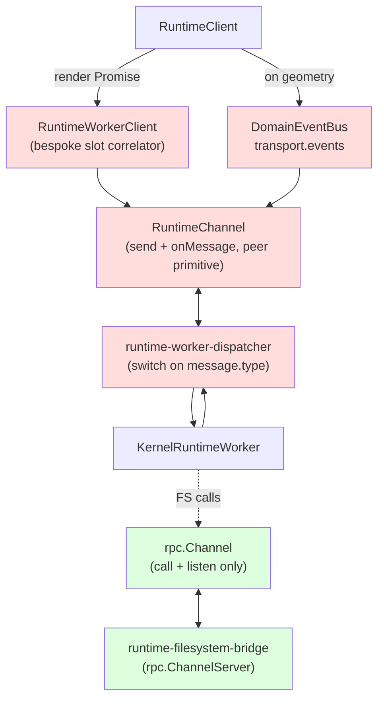
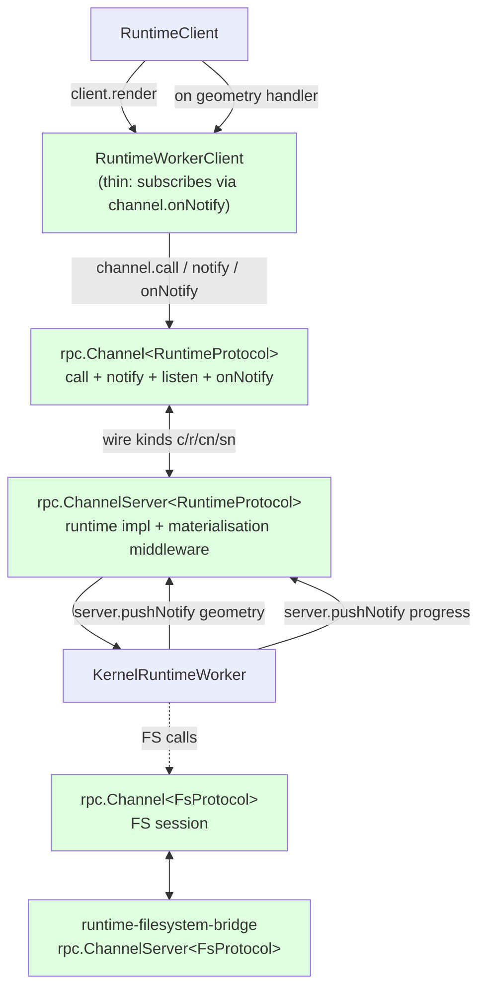

# Runtime Channel Hybrid Protocol Architecture

Step-back review of the runtime worker protocol shape — request/response, client-to-server notification, server-to-client autonomous event — and whether `@taucad/rpc.Channel` is the right primitive to host all three, or whether the architecture needs an additional primitive.

## Executive Summary

The runtime worker protocol is **not** a pure RPC protocol. It is the same shape as Microsoft's Language Server Protocol (LSP): a triad of typed `request`, client-to-server `notification`, and server-to-client autonomous `notification`. The current `@taucad/rpc.Channel` primitive only implements two of those three flows — `call` (request) and `listen` (client-pulled subscription). It has no notification primitive in either direction. Trying to map the runtime protocol onto `Channel.call` + `Channel.listen` forces every fire-and-forget command into a sham `Promise<void>` and every autonomous server event into a "subscription the client never asked for", which is the square-peg-round-hole tension surfaced during the gap-recovery work.

**The committed direction (Option I)**: promote `@taucad/rpc.Channel` from RPC primitive to LSP-style hybrid primitive by adding two methods — `notify(name, args)` (client→server one-way) and `onNotify(name, handler)` (server→client one-way) — alongside `call` and `listen`, and parametrise the type by a **typed protocol map** so call/notification names, argument types, and result types are statically checked end-to-end with **zero `unknown` on the wire** for consumers. The wire format already has the room (`k:'c'|'r'|'l'|'p'|'n'|'f'|'x'` becomes `… |'cn'|'sn'`).

Three corollary decisions ratified alongside Option I:

- **Direct imports, no aliases.** Transports expose `Channel<RuntimeProtocol>` directly. `RuntimeChannel` is deleted, not aliased.
- **Typed protocol contract.** `Channel<TProtocol>` and `ChannelServer<TProtocol>` are parametric on `{ calls, clientNotifications, serverNotifications, listens? }`. Every call name maps to typed `args`/`result`, every notification name maps to a typed payload, every listen name maps to a typed item. `Record<string, unknown>` payloads at the protocol boundary are forbidden.
- **No re-exports, no sibling adapter surface.** Per [`docs/policy/library-api-policy.md`](../policy/library-api-policy.md) and the lint rule `no-barrel-files`, the in-memory `RuntimeEventSource` / `DomainEventBus` adapter — which today thinly re-exposes wire events as a typed event bus — is deleted, not migrated. Consumers (`RuntimeClient`, `useRender`) subscribe directly via `channel.onNotify('geometry', handler)`. Any payload materialisation that previously lived between the wire and the bus moves into a `ChannelServer` middleware that runs on the worker side _before_ the wire frame is emitted, so consumers receive already-materialised typed payloads.

With those decisions, the runtime worker protocol fits cleanly: every command is one of `call` / `notify`, every server message is one of `onNotify` / `listen`, the bespoke per-channel slot correlator in `RuntimeWorkerClient` collapses, the parallel `transport.events` bus collapses, and the gap-analysis `R4` "adopt `@taucad/rpc` in `runtime-channel.ts` + `runtime-worker-dispatcher.ts`" becomes mechanically achievable.

## Table of Contents

- [Problem Statement](#problem-statement)
- [Methodology](#methodology)
- [Findings](#findings)
- [The Eigenquestion](#the-eigenquestion)
- [Options](#options)
- [Recommendations](#recommendations)
- [Trade-offs](#trade-offs)
- [Code Examples](#code-examples)
- [Diagrams](#diagrams)
- [References](#references)

## Problem Statement

The gap-recovery plan (`runtime_transport_gap_recovery_e73b301a.plan.md`) ratified Decision **D4 — add transferables support to the `@taucad/rpc` Channel layer** and Task 2 — adopt `@taucad/rpc` across `runtime-channel.ts`, `runtime-worker-dispatcher.ts`, and `runtime-filesystem-bridge.ts`. Sub-step 2a (transferables walker) and Sub-step 2b (FS bridge migration) landed cleanly; the FS bridge fits `Channel` because it is a clean RPC + broadcast pattern (file ops via `call`, watch events via `listen`).

Sub-step 2c — migrate `RuntimeWorkerClient`'s correlator onto `Channel.call` — surfaced a structural mismatch. The runtime protocol mixes:

1. **Request/response with explicit `requestId` correlation** — `initialize`, `render`, `export`. Client sends, worker matches the `requestId` on the response.
2. **Fire-and-forget commands without `requestId`** — `openFile`, `updateParameters`, `setOptions`, `stage-and-render`, `notifyFileChanged`/`fileChanged`, `abort`, `cleanup`, `configureMiddleware`. Client posts; worker schedules its autonomous render loop; no response is expected.
3. **Server-pushed events without prior subscription** — `progress`, `stateChanged`, `parametersResolved`, `activeKernelChanged`, `capabilitiesUpdated`, `log`, `logBatch`, `telemetry`. Worker emits autonomously based on internal state changes.
4. **Server-pushed events with dual semantics** — `geometryComputed` arrives BOTH as a correlated response to `render({ requestId })` AND as an autonomous push after the worker self-renders following `openFile`/`updateParameters`/watch events.

Mapping this onto `Channel.call` + `Channel.listen` requires:

- Forcing every notification into `call(name)` returning `Promise<void>` — callers must remember not to `await` it, or the worker must learn to send empty `r` (return) frames for every notification just to satisfy the correlator.
- Promoting every autonomous server event into a `listen('progress')`-style stream the client must subscribe to before any value can flow. There is no way for the worker to push an event the client never asked for.
- Special-casing `geometryComputed` so it can settle a `render` Promise AND fan out to subscribers.

This is the exact reasoning summarised in the user's prompt:

> The protocol mixes request/response patterns with autonomous state-driven events… The autonomous renders don't have request IDs to correlate against, so mapping it directly to a strict RPC Channel feels like forcing a square peg into a round hole.

The question this document answers: **what primitive set, given Tau's vision and the existing target architecture, models all three flows cleanly?**

## Methodology

1. Reviewed [`docs/policy/vision-policy.md`](../policy/vision-policy.md) — multi-kernel, multi-discipline, "everything is pluggable", AI-agent accessible. The wire layer must be agent-debuggable and consistent across transports.
2. Reviewed [`docs/architecture/runtime-topology.md`](../architecture/runtime-topology.md) — the autonomous reactive render service is explicitly modelled after **LSP** (the doc's own "Comparison to Prior Art" table cites LSP). Six commands in, seven event types out, one ordered event channel.
3. Reviewed [`docs/research/runtime-transport-implementation-blueprint-v4.md`](./runtime-transport-implementation-blueprint-v4.md) — Half A's `A-R3` ratifies **two sibling interfaces** on `RuntimeTransport`: `RuntimeChannel` (wire-level) + `RuntimeEventSource` (materialised domain events). The split is intentional: wire bytes vs typed in-memory events.
4. Reviewed [`docs/research/runtime-transport-implementation-gap-analysis.md`](./runtime-transport-implementation-gap-analysis.md) — Finding 5 (`@taucad/rpc` not adopted) and recommendation R4 ("adopt `@taucad/rpc` in `runtime-channel.ts`, `runtime-worker-dispatcher.ts`, `runtime-filesystem-bridge.ts`") set the explicit goal.
5. Read the actual wire-protocol type union ([`runtime-protocol.types.ts:164-246`](../../packages/runtime/src/types/runtime-protocol.types.ts)) and tabulated every command/response by correlation pattern.
6. Read `@taucad/rpc.Channel` ([`packages/rpc/src/channel.ts`](../../packages/rpc/src/channel.ts)) — verified the public surface is `call` / `listen` / `close` / `closed` / `onClose`. No notification primitive in either direction.
7. Read the rewritten FS bridge ([`packages/runtime/src/framework/runtime-filesystem-bridge.ts`](../../packages/runtime/src/framework/runtime-filesystem-bridge.ts)) — confirmed Sub-step 2b's adoption pattern: every file op is `call`, every watch event is `listen` with a server-side bounded `broadcastBuffer` to handle the "subscribed-after-emit" race.
8. Compared against LSP's primitive set (`request` / `notification` (bidirectional)) and JSON-RPC 2.0's notification rules (request without `id` → notification).

## Findings

### Finding 1: The runtime worker protocol is structurally LSP, not pure RPC

Tabulating every wire message in [`runtime-protocol.types.ts`](../../packages/runtime/src/types/runtime-protocol.types.ts):

| Wire type             | Direction       | Has `requestId`? | Pattern                                    |
| --------------------- | --------------- | ---------------- | ------------------------------------------ |
| `initialize`          | client → worker | yes              | request                                    |
| `render`              | client → worker | yes              | request                                    |
| `export`              | client → worker | yes              | request                                    |
| `openFile`            | client → worker | no               | client→server notification                 |
| `stage-and-render`    | client → worker | no               | client→server notification                 |
| `updateParameters`    | client → worker | no               | client→server notification                 |
| `setOptions`          | client → worker | no               | client→server notification                 |
| `abort`               | client → worker | no               | client→server notification                 |
| `fileChanged`         | client → worker | no               | client→server notification                 |
| `configureMiddleware` | client → worker | no               | client→server notification                 |
| `cleanup`             | client → worker | no               | client→server notification                 |
| `geometryComputed`    | worker → client | sometimes        | response **or** server→client notification |
| `parametersResolved`  | worker → client | yes              | response **or** server→client notification |
| `error`               | worker → client | yes              | response (error variant)                   |
| `progress`            | worker → client | no               | server→client notification                 |
| `stateChanged`        | worker → client | no               | server→client notification                 |
| `activeKernelChanged` | worker → client | no               | server→client notification                 |
| `capabilitiesUpdated` | worker → client | no               | server→client notification                 |
| `log` / `logBatch`    | worker → client | no               | server→client notification                 |
| `telemetry`           | worker → client | no               | server→client notification                 |

3 requests, 8 client-to-server notifications, 7 server-to-client notifications, 1 dual-role message (`geometryComputed`). This is exactly LSP's shape: request/response is the minority case, notification is the majority case.

The `runtime-topology.md` "Comparison to Prior Art" table makes the LSP comparison explicit:

> The runtime worker is essentially a "geometry server" following the same architectural pattern that powers every modern code editor.

### Finding 2: `@taucad/rpc.Channel` lacks the notification primitive in both directions

`@taucad/rpc.Channel`'s public surface ([`packages/rpc/src/channel.ts:58-75`](../../packages/rpc/src/channel.ts)):

```typescript
export type Channel = {
  call<R = unknown>(name: string, args?: unknown, signal?: AbortSignal): Promise<R>;
  listen<E = unknown>(event: string, args?: unknown, signal?: AbortSignal): AsyncIterable<E>;
  close(): void;
  readonly closed: Promise<void>;
  onClose(handler): () => void;
};
```

- `call` is request/response — every call allocates a `PendingCall` slot, sends `{k:'c', i:id, …}`, and resolves on `{k:'r', i:id, …}`.
- `listen` is client-initiated subscription — every listen sends `{k:'l', i:subId, …}`, and the server pushes `{k:'p', i:subId, …}` items until `{k:'n'}` (end) or `{k:'f'}` (fail).

There is no primitive for either:

- **Client-to-server notification** (`{k:'cn', n:'openFile', a:{file,parameters}}` — fire-and-forget, no return frame).
- **Server-to-client notification** (`{k:'sn', n:'progress', a:{phase,detail}}` — server emits without a client subscription).

Forcing notifications onto `call` requires the receiver to send empty `{k:'r', i:id}` frames just to drain the correlator (one wasted round-trip per notification). Forcing autonomous server events onto `listen` requires the client to pre-subscribe to every event family at connect time and track subscription IDs that never end.

### Finding 3: The blueprint v4 split (`RuntimeChannel` + `RuntimeEventSource`) is the _current_ workaround

Blueprint v4 `A-R3` deliberately splits the transport into two sibling interfaces:

- `RuntimeChannel` — wire bytes in/out. Today's surface is `send(message, attachments?)` + `onMessage(handler)` + `close`.
- `RuntimeEventSource` — typed materialised domain events (`geometry`, `state`, `progress`, `parameters`, `error`, `capabilities`, `kernelChange`, `log`, `telemetry`).

The transports (`in-process-transport.ts`, `worker-transport.ts`, `message-port-transport.ts`) bridge `RuntimeChannel` → `RuntimeEventSource` by:

1. Reading wire-format `RuntimeResponse` from the channel via `onmessage`.
2. Materialising via `materialiseRuntimeResponse` (resolving SAB pool entries to ArrayBuffers).
3. Emitting through `createDomainEventBus<DomainEvents>().emit(…)`.

This split _is the in-memory equivalent of a notification primitive_. It works, but it lives outside `@taucad/rpc` so:

- Conformance tiers T0/T1/T2 in `@taucad/rpc` only cover `call` + `listen`. `RuntimeChannel` has its own conformance harness ([`packages/runtime/src/transport/transport-conformance/`](../../packages/runtime/src/transport/transport-conformance/)).
- Two different wire envelopes coexist: rpc Channel emits `{v:1, k:'c'|'r'|'l'|…}`; `RuntimeChannel` emits the bare `RuntimeCommand`/`RuntimeResponse` discriminated unions (e.g. `{type:'render', requestId:…}`).
- The transferables walker (`WithTransferables`) lives in `@taucad/rpc` only; `RuntimeChannel`'s transports duplicate the logic via `attachments?.transferables`.
- The bespoke correlator in `RuntimeWorkerClient` (`pendingInit/pendingRender/pendingExport` slots) is a third correlator implementation — distinct from `@taucad/rpc`'s `callPending` Map and from `transport.events`'s subscriber set.

### Finding 4: The FS bridge fits `Channel` because it has no client→server notifications

The FS bridge surface is purely `readFile`/`writeFile`/`stat`/`readdir`/… (request/response) plus a `fileChanged` broadcast (server-pushed events delivered through `listen`-style pull). There is no fire-and-forget client→server command on the bridge — every operation has a meaningful return value (file bytes, stat result, success/failure of write).

The Sub-step 2b migration was clean precisely because the bridge protocol fits `Channel.call` + `Channel.listen` with zero notification flows. The runtime worker protocol is not so lucky.

### Finding 5: The dual-role `geometryComputed` is the most architecturally tense message

`geometryComputed` is the _only_ message in the protocol that is both:

- A correlated response to `render({ requestId })` — settles the explicit `client.render(…)` Promise.
- An autonomous server-pushed event — fires after the worker self-renders triggered by `openFile`, `updateParameters`, or a watch event.

The current `RuntimeWorkerClient` correlator handles this by holding a `pendingRender` slot and _also_ fanning out the materialised geometry through `transport.events.on('geometry', …)`. Every `geometryComputed` triggers both paths. This works but is duplicative.

LSP-style notification primitives clarify this: the autonomous push is `notify('geometry', payload)`, the explicit `render` returns `Promise<HashedGeometryResult>`. Subscribers attach via `onNotify('geometry', handler)`. The duality collapses into "the request/response API and the notification API both exist; they coexist without overlap because `render` is the request/response one, every other render is the notification one".

## The Eigenquestion

**Does `@taucad/rpc.Channel` need a notification primitive to host the runtime worker protocol, or should `RuntimeChannel` remain a peer wire primitive forever?**

This is the only decision that determines the overall direction. Every other plan question — whether to migrate `runtime-worker-dispatcher.ts`, whether to delete the bespoke correlator, whether the conformance harness can fold tier T1/T2 into rpc Channel's tests, whether the Electron transport reuses the FS bridge wire format for the runtime — collapses out of this one.

**Decision: Option I — augment `@taucad/rpc.Channel` with `notify` + `onNotify`, parametrise by typed protocol, delete `RuntimeChannel` and `RuntimeEventSource`.** Options II and III are documented below for traceability.

## Options

| #                  | Option                                                                                            | Wire format                                                                             | Correlator                                                                                     | Dispatcher implementation                                                                                                                                                                       | Future transport story                                                                                                                                 |
| ------------------ | ------------------------------------------------------------------------------------------------- | --------------------------------------------------------------------------------------- | ---------------------------------------------------------------------------------------------- | ----------------------------------------------------------------------------------------------------------------------------------------------------------------------------------------------- | ------------------------------------------------------------------------------------------------------------------------------------------------------ |
| **I** ✅ committed | Augment `@taucad/rpc.Channel` with typed `notify` + `onNotify`                                    | One unified format `{v:1, k:'c'\|'r'\|'l'\|'p'\|'n'\|'f'\|'x'\|'cn'\|'sn'}`             | One — built into augmented `Channel<TProtocol>`                                                | `runtime-worker-dispatcher.ts` becomes a `ChannelServer<RuntimeProtocol>` impl that routes `'c'` to request handlers, `'cn'` to notification handlers, autonomous events go via `server.notify` | All future transports (WebSocket, Electron renderer↔main, native FFI) inherit the same primitive, same conformance suite, same typed protocol contract |
| **II** rejected    | Keep `RuntimeChannel` as peer; only FS bridge uses `@taucad/rpc.Channel`                          | Two formats coexist                                                                     | Two correlators (rpc Channel for FS, bespoke `RuntimeWorkerClient` slots for runtime protocol) | `runtime-worker-dispatcher.ts` keeps its hand-rolled switch on `message.type`; `transport.events` keeps its DomainEventBus                                                                      | Electron + WebSocket transports re-implement the runtime correlator on top of `RuntimeChannel`; the FS bridge ships its own `Channel` server alongside |
| **III** rejected   | Hybrid: align `RuntimeChannel`'s wire envelope with `@taucad/rpc`'s but keep separate correlators | One envelope (`{v:1, k:…}`), two semantic protocols (Channel calls vs runtime commands) | Two correlators, but they share the wire-format walker and `WithTransferables` envelope        | `runtime-worker-dispatcher.ts` keeps its hand-rolled switch but the wire format is normalised                                                                                                   | Future transports get one wire format to handle but two protocol grammars to dispatch                                                                  |

### Option I — typed LSP-style `Channel<TProtocol>` (committed)

The `Channel` and `ChannelServer` types are parametric on a typed protocol map. There is no `unknown` payload on the consumer surface — every method is fully inferred from the protocol type.

```typescript
export type RpcProtocol = {
  calls: Record<string, { args: unknown; result: unknown }>;
  clientNotifications: Record<string, unknown>;
  serverNotifications: Record<string, unknown>;
  listens?: Record<string, { args?: unknown; item: unknown }>;
};

export type Channel<P extends RpcProtocol> = {
  call<N extends keyof P['calls'] & string>(
    name: N,
    args: P['calls'][N]['args'],
    signal?: AbortSignal,
  ): Promise<P['calls'][N]['result']>;

  notify<N extends keyof P['clientNotifications'] & string>(name: N, args: P['clientNotifications'][N]): void;

  onNotify<N extends keyof P['serverNotifications'] & string>(
    name: N,
    handler: (payload: P['serverNotifications'][N]) => void,
  ): Unsubscribe;

  listen<N extends keyof NonNullable<P['listens']> & string>(
    name: N,
    args: NonNullable<P['listens']>[N] extends { args: infer A } ? A : void,
    signal?: AbortSignal,
  ): AsyncIterable<NonNullable<P['listens']>[N]['item']>;

  close(): void;
  readonly closed: Promise<void>;
  onClose(handler: (info: CloseInfo) => void): Unsubscribe;
};

export type ChannelServer<P extends RpcProtocol> = {
  call: {
    [N in keyof P['calls']]: (
      ctx: CallContext,
      args: P['calls'][N]['args'],
      signal: AbortSignal,
    ) => Promise<P['calls'][N]['result']>;
  };

  notify: { [N in keyof P['clientNotifications']]: (ctx: CallContext, args: P['clientNotifications'][N]) => void };

  listen?: {
    [N in keyof NonNullable<P['listens']>]: (
      ctx: CallContext,
      args: NonNullable<P['listens']>[N] extends { args: infer A } ? A : void,
      signal: AbortSignal,
    ) => AsyncIterable<NonNullable<P['listens']>[N]['item']>;
  };

  // Server-side push surface — autonomously emit server→client notifications.
  pushNotify<N extends keyof P['serverNotifications'] & string>(name: N, args: P['serverNotifications'][N]): void;
};
```

Wire additions (kept envelope-compatible with existing `'c'|'r'|'l'|'p'|'n'|'f'|'x'`):

- `{v:1, k:'cn', n:string, a:unknown}` — client→server notification (no `i`, no return frame).
- `{v:1, k:'sn', n:string, a:unknown}` — server→client notification.

Both ride the existing `WithTransferables` walker. No `id` allocation, no `PendingCall` slot, no `listenSinks` entry — strictly cheaper than `call`/`listen`. The `n` (name) field is a wire-level `string`; type narrowing happens at the `Channel<P>` boundary on both sides via the typed protocol map.

### Option II — Peer primitive forever (rejected)

Keep `RuntimeChannel` exactly as it is today. Migrate only the FS bridge to `@taucad/rpc`. Accept that the runtime conformance harness and the rpc conformance harness are separate testbeds, the bespoke correlator stays in `RuntimeWorkerClient`, and the `transport.events` DomainEventBus continues to be the in-memory notification surface for materialised domain events.

Rejected because: it locks Tau into maintaining two wire formats, two correlators, two conformance harnesses indefinitely, and leaves the gap-analysis R4 only partially fulfilled.

### Option III — Wire envelope unification only (rejected)

Adopt the `{v:1, k:…}` envelope shape inside `RuntimeChannel.send` for diagnostic and conformance parity, but keep the runtime semantics on top: introduce `k:'cmd'` (runtime command) and `k:'evt'` (runtime event) discriminators alongside `@taucad/rpc`'s existing kinds. The wire walker (`WithTransferables`, sequence numbers, `ProtocolHeader`) is shared; the correlator is not.

Rejected because: it is a strict subset of Option I (Option I implies Option III but not vice versa) — half the work for half the benefit.

## Recommendations

| #   | Action                                                                                                                                                                                                                                                                                                                                                                                                                                                                                                                                                                                                                                                                                                                                                                                                                                                                                                                                                                                                                                                                                                    | Priority | Effort                      | Impact                                                                               |
| --- | --------------------------------------------------------------------------------------------------------------------------------------------------------------------------------------------------------------------------------------------------------------------------------------------------------------------------------------------------------------------------------------------------------------------------------------------------------------------------------------------------------------------------------------------------------------------------------------------------------------------------------------------------------------------------------------------------------------------------------------------------------------------------------------------------------------------------------------------------------------------------------------------------------------------------------------------------------------------------------------------------------------------------------------------------------------------------------------------------------- | -------- | --------------------------- | ------------------------------------------------------------------------------------ |
| R1  | Add `notify(name, args, transferables?)` and `onNotify(name, handler)` to `@taucad/rpc.Channel` and a `pushNotify` surface to `ChannelServer`. Introduce wire kinds `'cn'` (client→server notify) and `'sn'` (server→client notify). Reuse the existing `WithTransferables` walker. Tests assert: notify allocates no `PendingCall`/`listenSinks` entry, no return frame is sent, transferables hoist correctly, abort is a no-op (notifications cannot be aborted)                                                                                                                                                                                                                                                                                                                                                                                                                                                                                                                                                                                                                                       | P0       | S (~80 LOC + 12 test cases) | High — unblocks every other recommendation                                           |
| R2  | Parametrise `Channel<P extends RpcProtocol>` and `ChannelServer<P extends RpcProtocol>` by a typed protocol map `{ calls, clientNotifications, serverNotifications, listens? }`. Every method (`call`/`notify`/`onNotify`/`listen`) infers args/result/payload/item from `P` — `unknown` only appears when the protocol type itself uses `unknown`. Update `Channel`'s conformance docs: `call` is request/response, `notify` is fire-and-forget, `listen` is client-pulled stream, `onNotify` is server-pushed event. Add tier-1/tier-2 conformance assertions for both notification directions                                                                                                                                                                                                                                                                                                                                                                                                                                                                                                          | P0       | S                           | High — type safety is non-negotiable                                                 |
| R3  | **Delete `packages/runtime/src/transport/runtime-channel.ts` entirely.** Transports import `Channel` and `ChannelServer` directly from `@taucad/rpc` and parametrise by `RuntimeProtocol` (defined in `packages/runtime/src/types/runtime-protocol.types.ts`). No alias type, no wrapper, no re-export — direct imports per `library-api-policy.md`. RED on a `test-d` asserting `runtime-channel.ts` does not exist                                                                                                                                                                                                                                                                                                                                                                                                                                                                                                                                                                                                                                                                                      | P1       | M                           | High — eliminates a wire-primitive layer                                             |
| R4  | Reshape `RuntimeWorkerClient`: `initialize`/`render`/`export` use `channel.call`; `openFile`/`updateParameters`/`setOptions`/`abort`/`fileChanged`/`configureMiddleware`/`cleanup` use `channel.notify`; subscribe to `geometry`/`progress`/`state`/`parametersResolved`/`activeKernelChanged`/`log`/`telemetry`/`capabilitiesUpdated` via `channel.onNotify`. Delete the `pendingInit`/`pendingRender`/`pendingExport` slots                                                                                                                                                                                                                                                                                                                                                                                                                                                                                                                                                                                                                                                                             | P1       | L                           | High — closes gap-analysis F5, F8                                                    |
| R5  | Reshape `runtime-worker-dispatcher.ts`: instantiate `createChannelServer<RuntimeProtocol>({ port, impl: { call: { initialize, render, export }, notify: { openFile, updateParameters, … } } })`. The worker calls `server.pushNotify('geometry', materialised)` for autonomous events. Delete the hand-rolled `switch (message.type)` on `RuntimeCommand`                                                                                                                                                                                                                                                                                                                                                                                                                                                                                                                                                                                                                                                                                                                                                 | P1       | M                           | High                                                                                 |
| R6  | **Define `RuntimeProtocol` as a fully-typed contract in `packages/runtime/src/types/runtime-protocol.types.ts`.** `RuntimeCommand` is replaced by three discrete typed maps: `RuntimeProtocol['calls']` (3 entries: `initialize`, `render`, `export`, each with concrete `args` + `result` types), `RuntimeProtocol['clientNotifications']` (8 entries with concrete payload types — `OpenFileArgs`, `UpdateParametersArgs`, `AbortArgs`, etc.), `RuntimeProtocol['serverNotifications']` (8 entries with concrete payload types — `HashedGeometryResult`, `ProgressEvent`, `WorkerState`, `ParametersResolvedEvent`, `ActiveKernelChangedEvent`, `LogEvent`, `TelemetryEntry`, `CapabilitiesManifest`). **No `Record<string, unknown>` in any payload.** Existing `Record<string, unknown>` parameter shapes (`params`, `options`) keep their declared types but are wrapped in named arg interfaces (`RenderArgs`, `OpenFileArgs`) so the protocol surface itself is `unknown`-free. The `requestId` field disappears from payloads — it lives on the wire envelope's `i` field, owned by the rpc layer | P1       | L                           | High — type safety end-to-end                                                        |
| R7  | Update transport conformance suite: T0 covers wire shape including `'cn'`/`'sn'`; T1 ordering covers notifications; T2 correlation covers `call`. Fold the runtime transport conformance harness into the rpc Channel conformance harness — one suite, one set of tiers                                                                                                                                                                                                                                                                                                                                                                                                                                                                                                                                                                                                                                                                                                                                                                                                                                   | P2       | M                           | Medium                                                                               |
| R8  | **Delete `packages/runtime/src/transport/runtime-event-source.ts`, `event-bus.ts`, and the `events` field on `RuntimeTransport`.** Per `library-api-policy.md` and the `no-barrel-files` lint rule, the transport must not re-expose channel events through a sibling adapter surface. Consumers (`RuntimeClient`, `useRender`, `cad.machine.ts`) subscribe directly via `transport.channel.onNotify('geometry', handler)`. Payload materialisation (resolving SAB pool entries to ArrayBuffers, decoding shared-memory geometry) moves into a `ChannelServer` middleware on the worker side that runs _before_ `pushNotify` fires, so consumers receive already-materialised typed payloads. The `RuntimeTransport` interface collapses to `{ channel: Channel<RuntimeProtocol>; signalAbort?; configureMemory?; describe; close }`                                                                                                                                                                                                                                                                      | P1       | L                           | High — removes the duplicate event surface and its associated re-export anti-pattern |
| R9  | Delete `dispatcher-queue.ts`. Per-message-source ordering is already a property of `Channel<P>` (frames are processed in receive order; handlers spawned per `'c'` frame are inherently parallel only across distinct calls). For runtime semantics that require strict cross-call serialisation (e.g. `cleanup` must not overtake `render`), implement it as a `ChannelServer` middleware option `{ serialize: 'per-channel' }` inside `@taucad/rpc` — not as a transport-level decorator                                                                                                                                                                                                                                                                                                                                                                                                                                                                                                                                                                                                                | P2       | S                           | Low                                                                                  |

**Sequencing**: R1+R2 land first as a self-contained `@taucad/rpc` enhancement (Sub-step 2c-prime). R6 then defines the typed `RuntimeProtocol` (no code changes downstream yet — just the type module). R3+R4+R5+R8 land in one coherent commit (the runtime side cannot half-migrate — `transport.events` and `RuntimeChannel` must die together with the new `Channel<RuntimeProtocol>` adoption). R7 and R9 are cleanup once R3–R8 are green.

## Trade-offs

### Adding `notify` increases `@taucad/rpc` surface area — is it worth it?

| Aspect             | Argument for adding                                                                                    | Argument against                                                                        |
| ------------------ | ------------------------------------------------------------------------------------------------------ | --------------------------------------------------------------------------------------- |
| API simplicity     | 4 primitives is simpler than 2 primitives + a parallel DomainEventBus elsewhere                        | 2 primitives is simpler than 4                                                          |
| LSP precedent      | LSP, JSON-RPC 2.0, gRPC, every cross-process protocol designed since 2000 has a notification primitive | `@taucad/rpc` doesn't _have_ to follow LSP — it could stay a strict RPC primitive       |
| Wire-format growth | Two new kinds (`'cn'`, `'sn'`) — additive, non-breaking                                                | Any wire-format growth has long-tail compatibility cost                                 |
| Tau-internal scope | Tau owns `@taucad/rpc`; we are the only consumer; adding methods is risk-free                          | If `@taucad/rpc` is ever published independently, surface bloat hurts external adopters |

**Verdict**: adding notification primitives is the right move. Tau's `@taucad/rpc` exists _because_ the runtime worker protocol needed an RPC layer. Stopping at `call`+`listen` is a half-measure that forces every consumer (FS bridge today; runtime protocol tomorrow; future Electron renderer↔main control plane) to layer its own notification scheme on top.

### Per-channel command queue — committed: serialisation is a `ChannelServer` option

`@taucad/rpc.ChannelServer` already routes every wire frame through one `onWire` handler. Each `'c'` or `'l'` frame spawns its own `void async () => …` IIFE — they run concurrently from the JS event loop's perspective. The runtime worker's correctness depends on per-channel command serialisation (so a slow `render` doesn't let a `cleanup` overtake it).

The committed path (R9): **add a `serialize: 'per-channel' | 'parallel'` option to `createChannelServer`** so call/notify handlers can opt in to FIFO ordering. `runtime-worker-dispatcher.ts` deletes `dispatcher-queue.ts` and instantiates the server with `serialize: 'per-channel'`. The queue belongs at the protocol layer; it is not a transport-level concern.

### What about the `runtime-topology.md` "single ordered postMessage channel" invariant?

Topology line 122: "All worker → main events flow through a single ordered `postMessage` channel; SAB is reserved for the cooperative-abort signal channel and the geometry/file content pools only."

Both Option I and Option II preserve this — `Channel.notify` and `transport.events` both ride the same underlying port. The wire envelope (whether `{type:'progress',…}` or `{v:1,k:'sn',n:'progress',a:…}`) is a labelling difference, not an ordering one. The single-port invariant is unaffected.

## Code Examples

### The typed `RuntimeProtocol` contract (post-R6)

```typescript
// packages/runtime/src/types/runtime-protocol.types.ts

export type RenderArgs = {
  file: GeometryFile;
  params: RenderParams;
  options?: RenderOptions;
};

export type OpenFileArgs = {
  file: GeometryFile;
  parameters: RenderParams;
  options?: RenderOptions;
};

export type ProgressEvent = {
  phase: RenderPhase;
  percent?: number;
  detail?: ProgressDetail;
};

export type RuntimeProtocol = {
  calls: {
    initialize: { args: InitializeArgs; result: InitializeResult };
    render: { args: RenderArgs; result: HashedGeometryResult };
    export: { args: ExportArgs; result: ExportResult };
  };
  clientNotifications: {
    openFile: OpenFileArgs;
    'stage-and-render': StageAndRenderArgs;
    updateParameters: UpdateParametersArgs;
    setOptions: SetOptionsArgs;
    abort: AbortArgs;
    fileChanged: FileChangedArgs;
    configureMiddleware: ConfigureMiddlewareArgs;
    cleanup: void;
  };
  serverNotifications: {
    geometry: HashedGeometryResult;
    progress: ProgressEvent;
    state: WorkerState;
    parametersResolved: ParametersResolvedEvent;
    activeKernelChanged: ActiveKernelChangedEvent;
    capabilitiesUpdated: CapabilitiesManifest;
    log: LogEvent;
    telemetry: TelemetryEntry;
  };
  // No client-pulled streams in the runtime worker protocol.
  listens: Record<never, never>;
};
```

### Today's correlator (RuntimeWorkerClient, simplified)

```typescript
class RuntimeWorkerClient {
  private pendingInit?: { resolve, reject };
  private pendingRender?: { resolve, reject, generation };
  private pendingExport?: { resolve, reject };

  constructor(transport: RuntimeTransport, callbacks: { onGeometry, onProgress, onState, onParams, … }) {
    transport.onMessage(msg => this.routeResponse(msg));
    transport.events.on('geometry', callbacks.onGeometry);
    transport.events.on('progress', callbacks.onProgress);
    // … etc.
  }

  initialize(opts) {
    this.pendingInit = Promise.withResolvers();
    transport.send({ type: 'initialize', requestId: nextId(), …opts });
    return this.pendingInit.promise;
  }

  render(opts) {
    this.pendingRender = { …Promise.withResolvers(), generation: ++this.gen };
    transport.send({ type: 'render', requestId: nextId(), …opts });
    return this.pendingRender.promise;
  }

  openFile(opts) {
    transport.send({ type: 'openFile', …opts });
  }

  private routeResponse(msg: RuntimeResponse) {
    if (msg.type === 'geometryComputed' && msg.requestId === this.pendingRender?.requestId) {
      this.pendingRender.resolve(msg.result);
      // also fans out via transport.events.emit('geometry', materialised)
    }
    // … 12 more cases
  }
}
```

### Post-R3+R4+R6+R8 correlator (typed channel, no event bus, direct imports)

```typescript
import type { Channel } from '@taucad/rpc';
import type { RuntimeProtocol } from '#types/runtime-protocol.js';

type RuntimeClientCallbacks = {
  onGeometry: (g: HashedGeometryResult) => void;
  onProgress: (p: ProgressEvent) => void;
  onState: (s: WorkerState) => void;
  // …each handler is statically typed by RuntimeProtocol.serverNotifications
};

class RuntimeWorkerClient {
  constructor(
    private channel: Channel<RuntimeProtocol>,
    callbacks: RuntimeClientCallbacks,
  ) {
    channel.onNotify('geometry', callbacks.onGeometry);
    channel.onNotify('progress', callbacks.onProgress);
    channel.onNotify('state', callbacks.onState);
    // … one line per server notification, all statically typed
  }

  initialize(args: InitializeArgs): Promise<InitializeResult> {
    return this.channel.call('initialize', args);
  }

  render(args: RenderArgs): Promise<HashedGeometryResult> {
    return this.channel.call('render', args);
  }

  export(args: ExportArgs): Promise<ExportResult> {
    return this.channel.call('export', args);
  }

  openFile(args: OpenFileArgs): void {
    this.channel.notify('openFile', args);
  }

  updateParameters(args: UpdateParametersArgs): void {
    this.channel.notify('updateParameters', args);
  }

  abort(args: AbortArgs): void {
    this.channel.notify('abort', args);
  }
}
```

The bespoke correlator vanishes. Every line is one statically-typed wire primitive. There is no `transport.events`, no `unknown` payloads, no alias type — just `Channel<RuntimeProtocol>` imported directly from `@taucad/rpc`.

### Worker-side dispatcher post-R5

```typescript
import { createChannelServer } from '@taucad/rpc';
import type { ChannelServer } from '@taucad/rpc';
import type { RuntimeProtocol } from '#types/runtime-protocol.js';

const server: ChannelServer<RuntimeProtocol> = createChannelServer<RuntimeProtocol>({
  port: workerPort,
  sessionKey: 'runtime',
  impl: {
    call: {
      async initialize(ctx, args, signal) {
        return handleInitialize(args, signal);
      },
      async render(ctx, args, signal) {
        return handleRender(args, signal);
      },
      async export(ctx, args, signal) {
        return handleExport(args, signal);
      },
    },
    notify: {
      openFile(ctx, args) {
        handleOpenFile(args);
      },
      'stage-and-render'(ctx, args) {
        handleStageAndRender(args);
      },
      updateParameters(ctx, args) {
        handleUpdateParameters(args);
      },
      setOptions(ctx, args) {
        handleSetOptions(args);
      },
      abort(ctx, args) {
        handleAbort(args);
      },
      fileChanged(ctx, args) {
        handleFileChanged(args);
      },
      configureMiddleware(ctx, args) {
        handleConfigureMiddleware(args);
      },
      cleanup(ctx) {
        handleCleanup();
      },
    },
  },
});

// Worker autonomously pushes events — fully typed by RuntimeProtocol.serverNotifications:
server.pushNotify('geometry', materialisedGeometry);
server.pushNotify('progress', { phase: 'bundling', percent: 0.4 });
server.pushNotify('state', 'rendering');
```

### Materialisation as a server-side middleware (post-R8)

The wire-format → materialised-payload step that today lives between `RuntimeChannel` and `transport.events` moves to the worker side as a `ChannelServer` middleware applied to outbound `pushNotify`:

```typescript
const server = createChannelServer<RuntimeProtocol>({
  port: workerPort,
  middleware: {
    onPushNotify: (name, payload) => {
      // Resolve SAB pool entries → ArrayBuffer, decode shared geometry,
      // attach Transferables, etc. — runs once on the worker side
      // before the wire frame is emitted.
      if (name === 'geometry') return materialiseGeometry(payload);
      return payload;
    },
  },
  impl: {
    /* … */
  },
});
```

Consumers receive already-materialised typed payloads from `channel.onNotify('geometry', …)` — there is no client-side adapter, no `transport.events` re-export layer, no `DomainEventBus`.

## Diagrams

### Today's primitive layout (two parallel paths, three correlators)



Red boxes = bespoke runtime-only primitives. Green = `@taucad/rpc`. The two colours never intersect: today, the runtime protocol and the FS bridge protocol travel through entirely different correlators on entirely different wire formats.

### Target primitive layout (typed `Channel<RuntimeProtocol>`, no event bus, no aliases)



Compared to the "today" diagram: `RuntimeChannel` is gone, `DomainEventBus` is gone, `runtime-worker-dispatcher.ts`'s hand-rolled switch is gone. There is exactly one wire primitive and one correlator across the entire system. Both arrows from `Client` enter the same `Channel<RuntimeProtocol>` instance — the request path (`render`) and the autonomous-event path (`onNotify('geometry', …)`) share the typed contract.

### Wire kinds before and after notification primitives

| Kind   | Before | After   | Direction                      | Allocates correlator slot? |
| ------ | ------ | ------- | ------------------------------ | -------------------------- |
| `'c'`  | yes    | yes     | client→server call             | yes (PendingCall)          |
| `'r'`  | yes    | yes     | server→client return           | resolves PendingCall       |
| `'l'`  | yes    | yes     | client→server listen-subscribe | yes (listenSinks entry)    |
| `'p'`  | yes    | yes     | server→client listen-push      | drains listenSinks         |
| `'n'`  | yes    | yes     | server→client listen-end       | clears listenSinks         |
| `'f'`  | yes    | yes     | server→client listen-fail      | clears listenSinks         |
| `'x'`  | yes    | yes     | bidirectional close            | none                       |
| `'cn'` | —      | **new** | client→server notify           | none                       |
| `'sn'` | —      | **new** | server→client notify           | none                       |

## Appendix — Why `listen` is not a notification primitive

It is tempting to claim "`Channel.listen('progress', …)` already covers server→client notifications". It does not, for three reasons:

1. **Subscription latency**: `listen` requires a round-trip — client sends `{k:'l', i:subId}`, server begins iterating. Until the server receives the `'l'` frame, any `progress` events it would emit are dropped (the FS bridge mitigates this with a server-side `broadcastBuffer`, but that is a workaround, not a primitive).
2. **Subscription ID overhead**: every `listen` allocates a `subId`, server-side iterator state, abort wiring, and an `AsyncIterable` consumer. For `progress` events that fire 10× per render across 8 event families, this is meaningful per-message cost.
3. **Semantic mismatch**: `listen` says "I am pulling from a stream you control"; `onNotify` says "you push when you have news". The runtime worker's autonomous events are pushes, not pulls.

`listen` is the right primitive for **client-pulled streams** — file-watch events the client requested via `watch(path)`, log streams the client opted into, etc. It is the wrong primitive for **always-on server-pushed events** — `progress`, `state`, `geometry`, etc.

## References

- Vision: [`docs/policy/vision-policy.md`](../policy/vision-policy.md)
- Topology: [`docs/architecture/runtime-topology.md`](../architecture/runtime-topology.md)
- Blueprint: [`docs/research/runtime-transport-implementation-blueprint-v4.md`](./runtime-transport-implementation-blueprint-v4.md)
- Gap analysis: [`docs/research/runtime-transport-implementation-gap-analysis.md`](./runtime-transport-implementation-gap-analysis.md)
- Library API rules: [`docs/policy/library-api-policy.md`](../policy/library-api-policy.md)
- Protocol types: [`packages/runtime/src/types/runtime-protocol.types.ts`](../../packages/runtime/src/types/runtime-protocol.types.ts)
- rpc Channel impl: [`packages/rpc/src/channel.ts`](../../packages/rpc/src/channel.ts)
- FS bridge (post-2b): [`packages/runtime/src/framework/runtime-filesystem-bridge.ts`](../../packages/runtime/src/framework/runtime-filesystem-bridge.ts)
- LSP base protocol: [Microsoft Language Server Protocol — Notifications and Requests](https://microsoft.github.io/language-server-protocol/specifications/lsp/3.17/specification/#notificationMessage)
- JSON-RPC 2.0 notifications: [JSON-RPC 2.0 §4.1 Notification](https://www.jsonrpc.org/specification#notification)
