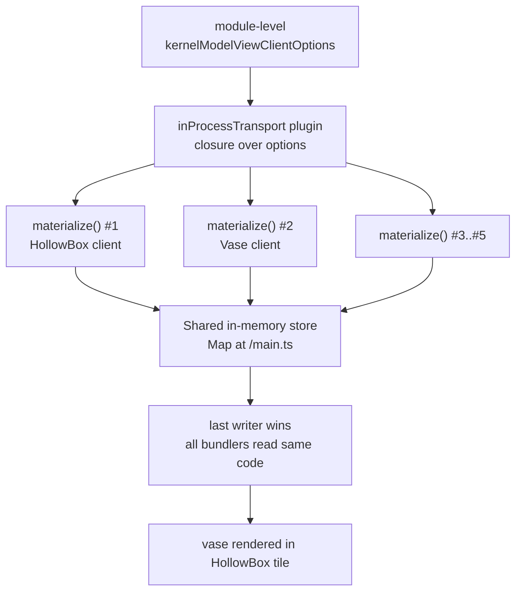
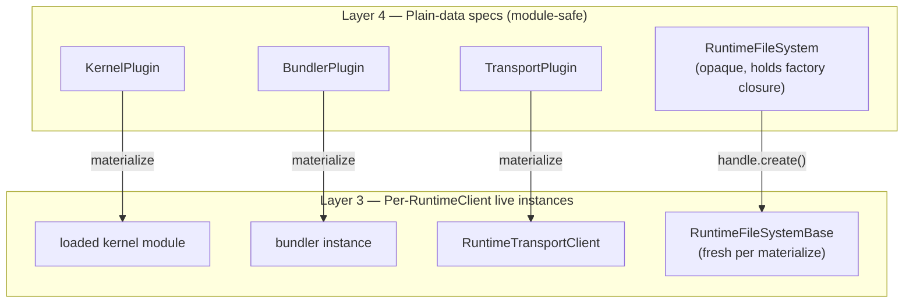
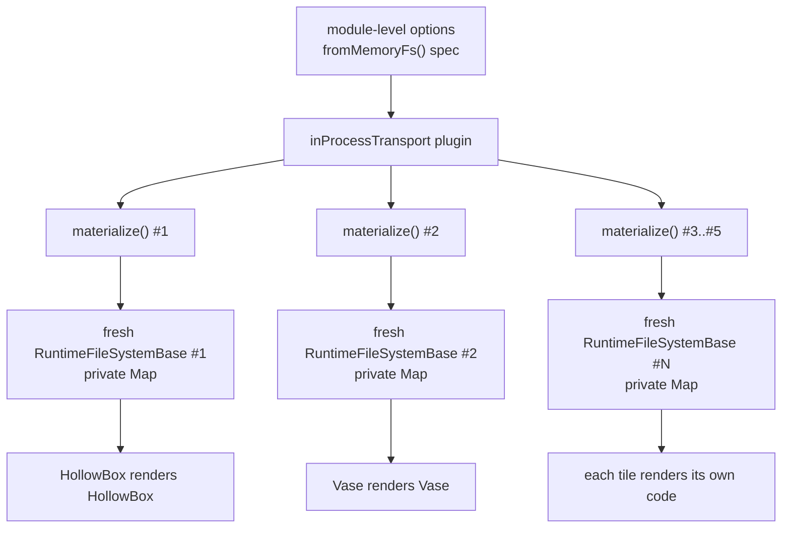

# Runtime Filesystem Spec/Instance Harmonisation

The v6 transport plane already migrated to a **callable spec + per-`RuntimeClient` materialisation** lifecycle. The filesystem plane stopped one step short — `fromMemoryFs(...)` still returns a stateful singleton whose closure-captured `Map` is shared by every transport materialisation built from the same options object. This is the smoking gun behind the docs Replicad-reference cross-contamination (image #1: vase mesh rendered in the Hollow Box tile). Mirroring the transport-layer spec/instance shape at the inline `RuntimeFileSystemHandle` eliminates the entire class of FS-aliasing bugs by construction, restores symmetry across the v6 plugin layer, and requires no consumer-facing API change.

## Executive Summary

The runtime's two cross-cutting plugin primitives — transports and filesystems — diverged on lifetime semantics. The transport-callable-plugin work (R1–R10 in [`runtime-transport-callable-plugin.md`](./runtime-transport-callable-plugin.md), all RESOLVED) split `TransportPlugin` (callable, plain data, safe to share across renders) from `RuntimeTransportClient` (live wire handle, single-use, owned 1:1 by `RuntimeClient.terminate()`). The filesystem plane skipped that split: `fromMemoryFs(seedFiles)` returns a `RuntimeFileSystem` whose internal handle is `{ kind: 'inline', fs: RuntimeFileSystemBase }` — and the `fs` is a single closure-captured `Map<string, ...>`. Two materialisations from the same opaque value alias the same store.

The harmonic fix is identical in shape to the one already shipped at the transport layer: convert the inline handle from a captured live instance to a **per-binding factory**. `RuntimeFileSystemHandle` becomes `{ kind: 'inline', create: () => RuntimeFileSystemBase }`; `extractInlineFileSystem(fs)` invokes `create()` per call site; each `inProcessClient` / web-worker / node-worker materialisation independently produces a fresh isolated `RuntimeFileSystemBase`. The fact that the runtime _already_ self-provisions `managedFileSystem ??= fromMemoryFs()` per client when no FS is supplied (per [`runtime-quickstart-dx-regression.md`](./runtime-quickstart-dx-regression.md) Finding 2) is the precedent — we are extending the same per-client-fresh-state semantics to the case where a consumer supplies the FS explicitly.

The change is contained inside `transport/_internal/`, requires zero consumer-facing API surface change (`fromMemoryFs(seed)` keeps its signature), and turns the docs preview component fix from a workaround at one call site into a structural impossibility for any present or future consumer.

## Table of Contents

1. [Problem Statement](#problem-statement)
2. [Methodology](#methodology)
3. [Findings](#findings)
4. [Eigenquestion Analysis](#eigenquestion-analysis)
5. [Target Architecture](#target-architecture)
6. [Recommendations](#recommendations)
7. [Trade-offs](#trade-offs)
8. [Code Examples](#code-examples)
9. [Diagrams](#diagrams)
10. [Migration Path](#migration-path)
11. [References](#references)

## Problem Statement

[`apps/ui/app/components/docs/kernel-model-view.tsx`](apps/ui/app/components/docs/kernel-model-view.tsx) constructs a single module-level `RuntimeClientOptions`:

```typescript
const kernelModelViewClientOptions = createRuntimeClientOptions({
  transport: inProcessTransport({ fileSystem: fromMemoryFs() }),
  kernels: [replicad()],
  bundlers: [esbuild()],
  middleware: [gltfCoordinateTransform()],
});
```

[`apps/ui/app/components/docs/replicad-reference.tsx`](apps/ui/app/components/docs/replicad-reference.tsx) renders five `<KernelModelView>` instances. Each calls `useRender({ clientOptions: kernelModelViewClientOptions, code: { 'main.ts': example.code } })`, which constructs five `RuntimeClient`s via `createRuntimeClient(clientOptions)`. Each client's `useRender` effect fires `client.openFile({ code: { 'main.ts': code }, file: 'main.ts' })`.

The transport-callable-plugin work guarantees five _independent_ wires — five `MessageChannel`s, five `KernelRuntimeWorker`s, five SAB pools. But the inline `RuntimeFileSystemHandle` extracted by `extractInlineFileSystem(options.fileSystem)` resolves to the same closure-captured `Map` from the single module-level `fromMemoryFs()` call. All five clients write to that single `Map` at key `'main.ts'`. Last writer wins; bundlers across the five workers all read whichever code was most recently written. Image #1 in the bug report shows the vase code's geometry rendered in the Hollow Box tile — the consequence is silent data corruption, not a crash.

The user-stated framing was "find the smoking gun and fix it with an architecturally correct approach that eliminates this entire class of issues". This document captures the harmonic direction that satisfies the second clause: not a defensive guard at one call site, but a structural shape change at the FS handle layer that mirrors the migration the transport layer already completed.

## Methodology

1. Read the bug-trigger components ([`replicad-reference.tsx`](apps/ui/app/components/docs/replicad-reference.tsx), [`kernel-model-view.tsx`](apps/ui/app/components/docs/kernel-model-view.tsx)) and traced execution into [`packages/react/src/hooks/use-render.ts`](packages/react/src/hooks/use-render.ts), [`packages/runtime/src/transport/in-process-client.ts`](packages/runtime/src/transport/in-process-client.ts), and [`packages/runtime/src/transport/_internal/from-memory-fs-handle.ts`](packages/runtime/src/transport/_internal/from-memory-fs-handle.ts).
2. Audited every relevant research doc under [`docs/research/`](docs/research/) for prior art on lifecycle, materialisation, and per-`RuntimeClient` ownership patterns. The most directly relevant set:
   - [`runtime-transport-callable-plugin.md`](./runtime-transport-callable-plugin.md) — the foundational spec/instance split for transports.
   - [`runtime-transport-authoring-simplification.md`](./runtime-transport-authoring-simplification.md) — the in-process passthrough composition.
   - [`runtime-transport-filesystem-topology.md`](./runtime-transport-filesystem-topology.md) — eigenquestion of FS supply seam; established `extractInlineFileSystem` as the public transport-author primitive.
   - [`runtime-quickstart-dx-regression.md`](./runtime-quickstart-dx-regression.md) Finding 2 — documents that `RuntimeClient.openFile` already does `managedFileSystem ??= fromMemoryFs()` per-client.
   - [`runtime-v6-cutover-residuals.md`](./runtime-v6-cutover-residuals.md) Findings 5–7 — confirms the inline handle is `@internal` and the only public surface is the opaque `fromX` factory; we have full freedom to reshape the internal handle.
   - [`runtime-filesystem-target-architecture.md`](./runtime-filesystem-target-architecture.md) Findings 1–10 — the long-term FS service-vs-provider direction; this work is consistent with that trajectory.
   - [`lazy-capabilities-manifest.md`](./lazy-capabilities-manifest.md) — establishes the architectural pattern of "construct at first-use rather than at module-load".
3. Cross-checked every workspace caller of `fromMemoryFs` / `fromNodeFs` / `fromFsLike` to size the migration footprint and verify no legitimate use case relies on shared mutable state across multiple `RuntimeClient`s.
4. Compared the transport-layer fix shape (R1–R10 of `runtime-transport-callable-plugin.md`) against the FS layer shape proposed here to confirm structural symmetry.

## Findings

### Finding 1: The transport plane already migrated; the FS plane is one step behind

Per [`runtime-transport-callable-plugin.md`](./runtime-transport-callable-plugin.md) §"Findings & Recommendations Cheat Sheet" rule 2:

> **Resource lifetime tracks `RuntimeClient` lifetime, 1:1.** Any time a higher-level factory feels compelled to wrap `terminate()` or attach a custom dispose hook, the underlying API has the wrong shape. Push the resource construction into the runtime.

That document closed three symptoms (StrictMode hangs, CLI hangs, `Object.assign` wrapper smells) by splitting `TransportPlugin` (plain data + `materialize()` closure) from `RuntimeTransportClient` (single-use live handle). The exact same pattern collision now surfaces one layer down: the inline `RuntimeFileSystemHandle` is a captured live `RuntimeFileSystemBase`, and module-level options share it across `materialize()` calls.

| Plane          | Captured at module load                                              | Materialised per `RuntimeClient`                | Status                                                                                                     |
| -------------- | -------------------------------------------------------------------- | ----------------------------------------------- | ---------------------------------------------------------------------------------------------------------- |
| Transport      | `TransportPlugin` (`{ id, describe, materialize }`)                  | `RuntimeTransportClient` (live wire)            | ✅ Migrated (callable-plugin doc)                                                                          |
| Kernel         | `KernelPlugin` (`{ id, materialize, ... }`)                          | Loaded kernel module (worker-side)              | ✅ Migrated                                                                                                |
| Bundler        | `BundlerPlugin`                                                      | Bundler instance (worker-side)                  | ✅ Migrated                                                                                                |
| Transcoder     | `TranscoderPlugin`                                                   | Transcoder instance                             | ✅ Migrated                                                                                                |
| **Filesystem** | **Opaque `RuntimeFileSystem` carrying live `RuntimeFileSystemBase`** | **(no separate concept — shares the live one)** | ❌ **Not migrated — the FS handle is `kind: 'inline', fs: Base` not `kind: 'inline', create: () => Base`** |

The asymmetry is the smoking gun. Every other plugin layer treats module-level options as plain-data specs that produce live state per-client; the FS layer alone treats module-level options as a live state container.

### Finding 2: The runtime already self-provisions per-client fresh memory FS — the bug is only when the consumer supplies one

[`runtime-quickstart-dx-regression.md`](./runtime-quickstart-dx-regression.md) Finding 2 documents the auto-connect contract on `RuntimeClient.openFile`/`export`:

```typescript
if (input.code) {
  managedFileSystem ??= fromMemoryFs();
  // ...
  const client = await ensureConnected({ fileSystem: managedFileSystem });
}
```

When the consumer omits `transport: inProcessTransport({ fileSystem })`, the runtime allocates a fresh `fromMemoryFs()` per `RuntimeClient`. Each client gets its own isolated store automatically. Cross-contamination is impossible in this path because the closure capture happens inside the per-client `RuntimeClient` body, not at module load.

The bug we are fixing surfaces only when the consumer **explicitly** wires `transport: inProcessTransport({ fileSystem: fromMemoryFs() })` in module-level options. The runtime takes the supplied opaque value as authoritative and re-binds the same inner `Map` to every client.

The architectural correction is to make the explicit-supply path obey the same per-client-fresh-state semantics the implicit-fallback path already has. Not adding a special case — removing one. `fromMemoryFs(...)` should _always_ produce per-client state, whether the consumer holds the value at module level (per the `useRender` JSDoc recommendation) or constructs it inline.

### Finding 3: The inline handle's shape is `@internal` — we have full headroom to reshape it

Per [`runtime-v6-cutover-residuals.md`](./runtime-v6-cutover-residuals.md) Finding 5 + R6:

> Mark `RuntimeFileSystemHandle` as `@internal`; mark `fromMemoryFs`/`fromFsLike`/`fromNodeFs` as `@internal` (or move to `_internal/from-X-fs-handle.ts`); ensure no public re-exports

The handle lives at [`packages/runtime/src/transport/_internal/runtime-filesystem-handle.ts`](packages/runtime/src/transport/_internal/runtime-filesystem-handle.ts) and is reachable only by transport authors via `@taucad/runtime/transport-internals` (per [`runtime-transport-filesystem-topology.md`](./runtime-transport-filesystem-topology.md) R2). Consumer-facing code never touches the handle shape — only the opaque `RuntimeFileSystem` brand is part of the public API. Reshaping the inline arm is a contained internal change with two known external surfaces:

1. `extractInlineFileSystem(fs)` — public via `@taucad/runtime/transport-internals` for transport authors.
2. The four `from-*-fs-handle.ts` files that produce the handle.

Both can be migrated in a single PR with mechanical updates and no impact on `apps/ui`, `packages/cli`, `apps/api`, or example apps.

### Finding 4: The discriminated channel arm already has correct lifetime semantics

`RuntimeFileSystemHandle`'s `channel` arm is `{ kind: 'channel', port: MessagePort, dispose?: () => void }`. The `port` is a transferable that crosses process boundaries via `postMessage`; once transferred, ownership moves to the receiver. There is no aliasing hazard because `MessagePort` itself is single-ownership by spec — a consumer cannot accidentally share a transferred port across two clients.

Only the `inline` arm exhibits the aliasing bug, and only because it captures a stateful object whose lifetime is decoupled from the wire. The asymmetry is fixed by giving the inline arm the same single-binding lifetime semantics the channel arm gets for free from the platform.

### Finding 5: `fromNodeFs` and `fromFsLike` are not affected, but the same shape change benefits them for consistency

`fromNodeFs(rootPath)` wraps Node's real disk — the underlying state is shared by definition (the disk). `fromFsLike(fs)` wraps a user-supplied object — sharing semantics are the user's responsibility. Neither has the cross-contamination hazard.

But uniformity wins: if the inline handle is `{ kind: 'inline', create: () => Base }`, then `fromNodeFs(rootPath).create()` returns a fresh wrapper around the same disk path each call, and `fromFsLike(fs).create()` returns a fresh wrapper around the same user object. Behaviour is unchanged for these factories; the shape is consistent across all three.

This is the same uniformity argument [`runtime-transport-callable-plugin.md`](./runtime-transport-callable-plugin.md) Finding 7 made for migrating eight call sites: "Mechanical migration. No new disposal logic at any site." We get spec/instance symmetry across all `fromX` factories for free.

### Finding 6: A defensive guard alternative exists but doesn't eliminate the class

A narrower fix would tag the inline handle on first `materialize()` and throw a typed `RuntimeFileSystemAlreadyBoundError` on second binding. This converts silent corruption into a loud error with a clear message ("each `RuntimeClient` needs its own `fromMemoryFs()` — wrap in `useMemo` or move construction inside the component").

Trade-off vs the spec/instance shape:

| Aspect                                   | Defensive guard                                         | Spec/instance shape (recommended) |
| ---------------------------------------- | ------------------------------------------------------- | --------------------------------- |
| Eliminates silent corruption             | ✅ (loud error)                                         | ✅ (impossible by construction)   |
| Requires consumer to react               | ✅ (must memoise per-instance)                          | ❌ (just works)                   |
| Aligns with transport plane              | ❌ (different shape)                                    | ✅ (mirrors `materialize()`)      |
| Honours v6 contract "specs are reusable" | ❌                                                      | ✅                                |
| Consumer-facing migration                | Yes — every shared module-level FS site needs `useMemo` | None                              |
| Internal LOC                             | ~30 (tag + throw + untag-on-close)                      | ~20 (factory closure)             |

The defensive guard converts one bug class into another (now consumers _must_ remember to memoise; forgetting is a runtime crash instead of silent corruption). The spec/instance shape eliminates both.

### Finding 7: The `RuntimeClient.openFile` `managedFileSystem` fallback is actually a precedent for this exact pattern

The runtime client body does `managedFileSystem ??= fromMemoryFs()` inside the per-client closure. Each `RuntimeClient` instance owns its own `managedFileSystem` field. This is structurally identical to what we want at the inline-handle layer: "first `materialize()` calls `handle.create()`; the result is owned by that client, not the spec". The spec/instance shape lifts the existing per-client-fresh pattern from one specific code path into the general inline-handle contract.

## Eigenquestion Analysis

The user-stated framing was "find the harmonic direction that should be taken to produce a cohesive design that eliminates the class of issues entirely". The single eigenquestion:

> **E1: At the v6 plugin layer, what is the lifetime contract for the value the consumer holds in module-level options?**

The transport-callable-plugin work answered this for transports: **the value is a spec (plain data + materialisation closure); each `RuntimeClient` materialises a fresh live instance**. The same answer applies to filesystems with no modification:

| Layer                          | Module-level value                     | Per-`RuntimeClient` materialisation              |
| ------------------------------ | -------------------------------------- | ------------------------------------------------ |
| `KernelPlugin`                 | spec (declarative metadata)            | loaded module instance                           |
| `BundlerPlugin`                | spec                                   | bundler instance                                 |
| `TranscoderPlugin`             | spec                                   | transcoder instance                              |
| `MiddlewarePlugin`             | spec                                   | middleware instance                              |
| `TransportPlugin`              | spec (`{ id, describe, materialize }`) | `RuntimeTransportClient`                         |
| `RuntimeFileSystem` (today)    | live `RuntimeFileSystemBase`           | (none — captured live ref shared across clients) |
| `RuntimeFileSystem` (proposed) | spec (factory closure)                 | fresh `RuntimeFileSystemBase` per client         |

Every other answer to E1 is structurally inconsistent with the v6 architecture. The proposed shape change is not new design — it is the existing v6 lifetime contract honoured at the one layer that broke it.

> **E2: Should the consumer-facing factory signature change?**

No. `fromMemoryFs(seedFiles?)` keeps its current shape. The shape change is entirely behind the opaque brand. This honours v6 §"library-api-policy.md §22 Antipattern 5" (no wire/internal facts on cross-layer types) and matches the transport-callable-plugin migration where consumer call sites stayed identical (`webWorkerTransport({...})` before and after).

> **E3: Should the `Symbol.dispose` lifecycle ceremony from [`disposable-api.md`](./disposable-api.md) apply here?**

No. `RuntimeClient.terminate()` already owns the materialised FS lifetime via the transport. Each client's materialised FS goes out of scope when the client is GC'd. The `Symbol.dispose` apparatus exists for embind-managed C++ handles whose disposal is non-default; in-memory `Map`s and Node `fs` wrappers have JS-default disposal semantics. Adding `using` ceremony here would be over-engineering.

> **E4: Should we backport the spec/instance shape to historical research docs?**

No. The transport-callable-plugin doc was written when only the transport layer needed it. This research doc is the FS-layer companion that completes the migration. Both are durable references; neither supersedes the other.

## Target Architecture

### Layered model (delta from v6)

```
┌────────────────────────────────────────────────────────────────────┐
│ Layer 4 — Plugin Layer (consumer-facing, plain-data specs)         │
│                                                                    │
│   transport: webWorkerTransport({ fileSystem: fromMemoryFs() })    │
│              ─────────────────                ────────────────     │
│              spec (callable plugin)           spec (factory)       │
│                                                                    │
│   Both safe to share across renders, persist in option bags,       │
│   pass through useMemo deps. NEITHER carries live state.           │
└────────────────────────────────────────────────────────────────────┘
                              │
                              ▼  RuntimeClient construction
┌────────────────────────────────────────────────────────────────────┐
│ Layer 3 — Per-RuntimeClient Materialisation (private)              │
│                                                                    │
│   transport.materialize() → RuntimeTransportClient (live wire)     │
│   handle.create()         → RuntimeFileSystemBase  (live store)    │
│                                                                    │
│   Both single-use, owned 1:1 by RuntimeClient.terminate().         │
│   Two RuntimeClients from one spec → two independent instances.    │
└────────────────────────────────────────────────────────────────────┘
```

### Inline handle shape change

Today:

```typescript
export type RuntimeFileSystemHandle =
  | { readonly kind: 'inline'; readonly fs: RuntimeFileSystemBase }
  | { readonly kind: 'channel'; readonly port: MessagePort; readonly dispose?: () => void };
```

Proposed:

```typescript
export type RuntimeFileSystemHandle =
  | { readonly kind: 'inline'; readonly create: () => RuntimeFileSystemBase }
  | { readonly kind: 'channel'; readonly port: MessagePort; readonly dispose?: () => void };
```

`extractInlineFileSystem(fs)` invokes `handle.create()` on each call. Transport materialisation paths (in-process, web-worker, node-worker) all consume `extractInlineFileSystem` once per `materialize()`, so each `RuntimeClient` gets a fresh `RuntimeFileSystemBase`.

### `fromMemoryFs` factory body

The seed files are captured in the spec closure; each `create()` builds a fresh state map seeded from them:

```typescript
export function _fromMemoryFsHandle(files?: Record<string, string>): RuntimeFileSystemHandle {
  const seedFiles = files ? { ...files } : undefined;
  return {
    kind: 'inline',
    create: () => buildMemoryFsBase(seedFiles),
  };
}

function buildMemoryFsBase(seedFiles: Record<string, string> | undefined): RuntimeFileSystemBase {
  const store = new Map<string, Uint8Array<ArrayBuffer> | string>();
  const directories = new Set<string>();
  if (seedFiles) {
    for (const [filePath, content] of Object.entries(seedFiles)) {
      store.set(filePath, content);
      // ...directory ancestors as today...
    }
  }
  directories.add('/');
  // ...returns the same RuntimeFileSystemBase shape today's _fromMemoryFsHandle returns,
  // capturing this fresh `store` and `directories` in its closure...
}
```

Each `RuntimeClient` calling `extractInlineFileSystem(fs)` gets its own `store` Map and `directories` Set. No aliasing.

### Per-factory matrix (target)

| Factory                  | Spec captures             | `create()` returns                           | State sharing across clients             |
| ------------------------ | ------------------------- | -------------------------------------------- | ---------------------------------------- |
| `fromMemoryFs(seed?)`    | seed files                | fresh `Map` + `Set`, seeded                  | None (each client isolated)              |
| `fromNodeFs(rootPath)`   | rootPath                  | fresh adapter wrapping Node `fs` at rootPath | Disk is shared (intentional)             |
| `fromFsLike(fs, root?)`  | user `fs` + root          | fresh adapter wrapping user `fs`             | User `fs` shared (user's responsibility) |
| `fromBrowserFs(handle)`  | user FileSystemHandle     | fresh adapter wrapping handle                | Handle shared (intentional)              |
| `fromChannelFs(channel)` | (channel arm — unchanged) | n/a                                          | n/a                                      |

## Recommendations

| #   | Action                                                                                                                                                                                                                                                                                                                                                                                                                                                                                                                   | Priority | Effort | Impact                                                                     |
| --- | ------------------------------------------------------------------------------------------------------------------------------------------------------------------------------------------------------------------------------------------------------------------------------------------------------------------------------------------------------------------------------------------------------------------------------------------------------------------------------------------------------------------------ | -------- | ------ | -------------------------------------------------------------------------- |
| R1  | Reshape `RuntimeFileSystemHandle` inline arm from `{ kind: 'inline', fs }` to `{ kind: 'inline', create: () => RuntimeFileSystemBase }` in [`packages/runtime/src/transport/_internal/runtime-filesystem-handle.ts`](packages/runtime/src/transport/_internal/runtime-filesystem-handle.ts).                                                                                                                                                                                                                             | P0       | S      | High — eliminates the class of FS-aliasing bugs by construction            |
| R2  | Update [`_fromMemoryFsHandle`](packages/runtime/src/transport/_internal/from-memory-fs-handle.ts) to capture seed files and return a `create()` factory that builds a fresh in-memory store per call. Internal helper `buildMemoryFsBase(seedFiles)` extracted for clarity.                                                                                                                                                                                                                                              | P0       | S      | High — fixes the bug at source                                             |
| R3  | Update `_fromNodeFsHandle` and `_fromFsLikeHandle` to expose the same `create()` shape; their `create()` returns a fresh adapter each call (underlying disk/object intentionally shared via the captured args). Mechanical mirror of R2 for shape uniformity.                                                                                                                                                                                                                                                            | P0       | S      | Med — uniform inline handle shape across factories                         |
| R4  | Update `extractInlineFileSystem(fs)` to call `handle.create()` once per invocation. Confirm all transport materialisation paths (`in-process-client.ts`, `web-worker-client.ts`, `node-worker-client.ts`) call `extractInlineFileSystem` exactly once per `materialize()`, so each `RuntimeClient` gets its own fresh base.                                                                                                                                                                                              | P0       | S      | High — pins the per-client invariant at the public extraction point        |
| R5  | Repair [`apps/ui/app/components/docs/kernel-model-view.tsx`](apps/ui/app/components/docs/kernel-model-view.tsx) — _no longer strictly needed for correctness after R1–R4_, but lift `clientOptions` into the component via `useMemo(..., [])` for clarity (each preview owns its own `KernelRuntimeWorker` + SAB pools regardless).                                                                                                                                                                                      | P1       | XS     | Med — explicit per-instance ownership at the docs reference site           |
| R6  | Add a unit test in [`packages/runtime/src/transport/_internal/extract-inline-filesystem.test.ts`](packages/runtime/src/transport/_internal/extract-inline-filesystem.test.ts): two `extractInlineFileSystem(opaque)` calls on the same `fromMemoryFs(seed)` value produce two distinct `RuntimeFileSystemBase` instances; mutations are isolated.                                                                                                                                                                        | P0       | S      | High — locks the per-binding-fresh contract                                |
| R7  | Add a transport-conformance test asserting two `inProcessClient` instances built from the same `inProcessTransport({ fileSystem: fromMemoryFs(...) })` plugin do not see each other's `openFile` writes. End-to-end coverage of the structural fix.                                                                                                                                                                                                                                                                      | P0       | S      | High — pins the cross-client isolation contract                            |
| R8  | Add a docs-component test for `<KernelModelView>` confirming sibling instances inside one `<SharedRendererProvider>` render their own code without cross-contamination — the original bug-trigger surface.                                                                                                                                                                                                                                                                                                               | P1       | S      | Med — regression coverage for the bug-report site                          |
| R9  | Update `fromMemoryFs(...)` JSDoc and the runtime docs ([`apps/ui/content/docs/(runtime)/api/filesystem.mdx`](apps/ui/content/docs/runtime/api/filesystem.mdx), [`apps/ui/content/docs/(runtime)/guides/filesystem-setup.mdx`](apps/ui/content/docs/runtime/guides/filesystem-setup.mdx)) to document the per-client-fresh-state contract: "Each `RuntimeClient` materialised from a single `fromMemoryFs(seed)` value gets its own private in-memory store seeded from `seed`. Mutations are not shared across clients." | P1       | XS     | Med — closes the documentation gap                                         |
| R10 | Add a forward-planning rule to [`docs/policy/library-api-policy.md`](docs/policy/library-api-policy.md): **"Plugin-layer values held in module-level options are plain-data specs, never live state. Each `RuntimeClient` materialises its own live state per binding."** Codifies the eigenquestion answer for future plugin-layer additions.                                                                                                                                                                           | P1       | XS     | Med — prevents the next "captured live state in module options" regression |

**Implementation order**: R1 + R2 + R3 + R4 + R6 + R7 land together in a single PR (they form one structural change). R5 + R8 + R9 + R10 land in a follow-up doc-and-tests PR.

## Trade-offs

| Concern                                          | Status quo                                                        | After R1–R10                                                                                            |
| ------------------------------------------------ | ----------------------------------------------------------------- | ------------------------------------------------------------------------------------------------------- |
| Module-level shared `fromMemoryFs()` correctness | Silent cross-contamination across N `RuntimeClient`s              | Each client gets isolated state (impossible to alias)                                                   |
| Consumer-facing API surface                      | `fromMemoryFs(seed)`                                              | `fromMemoryFs(seed)` (unchanged)                                                                        |
| Transport-author API surface                     | `extractInlineFileSystem(fs): RuntimeFileSystemBase \| undefined` | Same signature; semantics tighten ("each call returns a fresh base")                                    |
| Internal LOC                                     | —                                                                 | +~20 LOC across three `from-*-fs-handle.ts` files (factory closures); −~5 LOC removed                   |
| Disposable lifecycle ceremony                    | None needed (`RuntimeClient.terminate()` covers it)               | None needed (same)                                                                                      |
| Tests added                                      | —                                                                 | +3 tests (extract isolation, transport conformance, docs component)                                     |
| Symmetry with transport plane                    | Asymmetric (FS captures live, transport captures spec)            | Symmetric (both capture specs; both materialise per `RuntimeClient`)                                    |
| Backwards-compat for consumer call sites         | n/a                                                               | None broken — `fromX(...)` shape unchanged                                                              |
| Backwards-compat for transport authors           | `extractInlineFileSystem` returns the captured fs                 | Returns a fresh fs per call (mechanical migration: zero workspace call sites depend on shared mutation) |

The primary cost is internal — three `from-*-fs-handle.ts` files gain a factory closure layer. The primary saving is the elimination of an entire class of silent-corruption bugs whose first observed instance is the docs Replicad-reference issue.

## Code Examples

### Today (broken when shared across clients)

```typescript
// apps/ui/app/components/docs/kernel-model-view.tsx — current
const kernelModelViewClientOptions = createRuntimeClientOptions({
  transport: inProcessTransport({ fileSystem: fromMemoryFs() }),
  // ...
});

// Five <KernelModelView code={...} /> instances all reference the same options.
// Each useRender(...) → createRuntimeClient(options) → transport.materialize()
// → extractInlineFileSystem(options.fileSystem) → returns the SAME captured `fs`
// → all five workers share the same in-memory `Map<string, ...>`.
// → client.openFile({ code: { 'main.ts': code } }) on each races to overwrite
//   `'main.ts'` in the shared Map.
// → bundlers all bundle whichever code last won the race.
// → vase mesh appears in the Hollow Box tile (image #1).
```

### After R1–R4 (per-client-fresh by construction)

```typescript
// packages/runtime/src/transport/_internal/runtime-filesystem-handle.ts — proposed

export type RuntimeFileSystemHandle =
  | { readonly kind: 'inline'; readonly create: () => RuntimeFileSystemBase }
  | { readonly kind: 'channel'; readonly port: MessagePort; readonly dispose?: () => void };

export const extractInlineFileSystem = (fs: RuntimeFileSystem | undefined): RuntimeFileSystemBase | undefined => {
  if (!fs) {
    return undefined;
  }
  const handle = resolveRuntimeFileSystem(fs);
  if (handle.kind !== 'inline') {
    throw new TypeError(`extractInlineFileSystem: expected inline fs, received '${handle.kind}'`);
  }
  return handle.create(); // ← fresh instance per call
};
```

```typescript
// packages/runtime/src/transport/_internal/from-memory-fs-handle.ts — proposed

export function _fromMemoryFsHandle(files?: Record<string, string>): RuntimeFileSystemHandle {
  const seedFiles = files ? { ...files } : undefined;
  return {
    kind: 'inline',
    create: () => buildMemoryFsBase(seedFiles),
  };
}

function buildMemoryFsBase(seedFiles: Record<string, string> | undefined): RuntimeFileSystemBase {
  const store = new Map<string, Uint8Array<ArrayBuffer> | string>();
  const directories = new Set<string>();
  // (rest is the existing _fromMemoryFsHandle body — same encoder/decoder, same RuntimeFileSystemBase methods,
  // closing over THIS store + directories rather than module-shared ones)
  // ...
  return {
    /* RuntimeFileSystemBase impl */
  };
}
```

```typescript
// apps/ui/app/components/docs/kernel-model-view.tsx — after
// (no longer strictly required for correctness; R1–R4 makes module-level safe.
//  This refactor is recommended for explicit per-instance ownership clarity.)

export function KernelModelView({ code, className }: KernelModelViewProps): React.JSX.Element {
  const clientOptions = useMemo(
    () =>
      createRuntimeClientOptions({
        transport: inProcessTransport({ fileSystem: fromMemoryFs() }),
        kernels: [replicad()],
        bundlers: [esbuild()],
        middleware: [gltfCoordinateTransform()],
      }),
    [],
  );
  // ...
}
```

### Conformance test — locks the contract

```typescript
// packages/runtime/src/transport/_internal/extract-inline-filesystem.test.ts — new

describe('extractInlineFileSystem (per-binding-fresh contract)', () => {
  it('produces isolated RuntimeFileSystemBase instances seeded from the same fromMemoryFs() value', async () => {
    const opaque = fromMemoryFs({ '/seed.ts': 'export default 1;' });

    const fsA = extractInlineFileSystem(opaque)!;
    const fsB = extractInlineFileSystem(opaque)!;

    // Both seeded from the same files
    await expect(fsA.readFile('/seed.ts', 'utf8')).resolves.toBe('export default 1;');
    await expect(fsB.readFile('/seed.ts', 'utf8')).resolves.toBe('export default 1;');

    // Mutations on A are invisible to B
    await fsA.writeFile('/main.ts', 'A');
    await fsB.writeFile('/main.ts', 'B');
    await expect(fsA.readFile('/main.ts', 'utf8')).resolves.toBe('A');
    await expect(fsB.readFile('/main.ts', 'utf8')).resolves.toBe('B');
  });
});
```

## Diagrams

### Cross-contamination today (image #1 root cause)



### Spec/instance harmonisation across plugin layers



### After R1–R4 — isolated per-client state



## Migration Path

1. **Single PR — R1 + R2 + R3 + R4 + R6 + R7.** Reshape the inline handle, update the three `from-*-fs-handle.ts` files, update `extractInlineFileSystem`, add the two tests. No consumer-facing API change. No `apps/ui` / `packages/cli` / `apps/api` impact. Merge as one structural change.

2. **Follow-up PR — R5 + R8.** Lift `clientOptions` into `KernelModelView` via `useMemo(..., [])` for explicit per-instance ownership at the docs reference site, plus the regression component test. The bug is already structurally fixed by PR-1; this PR is for clarity and coverage at the original bug-trigger surface.

3. **Doc PR — R9 + R10.** Update `fromMemoryFs` JSDoc and the runtime docs to document per-client-fresh-state semantics. Add the forward-planning rule to `library-api-policy.md`.

No deprecation cycle needed — the only public surface change is a documentation tightening, the consumer-facing factory signatures are unchanged, and the transport-author `extractInlineFileSystem` semantics tighten in a way no current workspace caller depends on.

### Test coverage summary

| Test                                           | Lives in                                    | Asserts                                                                                                  |
| ---------------------------------------------- | ------------------------------------------- | -------------------------------------------------------------------------------------------------------- |
| `extract-inline-filesystem.test.ts` (new case) | `packages/runtime/src/transport/_internal/` | Two `extractInlineFileSystem(opaque)` calls return distinct `RuntimeFileSystemBase`; mutations isolated. |
| `multi-client-fs-isolation.test.ts` (new file) | `packages/runtime/src/transport/`           | Two `inProcessClient`s from one plugin do not see each other's `openFile` writes.                        |
| `kernel-model-view.test.tsx` (new file)        | `apps/ui/app/components/docs/`              | Two sibling `<KernelModelView>` instances render their own code; no cross-contamination.                 |

## References

- [`runtime-transport-callable-plugin.md`](./runtime-transport-callable-plugin.md) — the spec/instance migration this work mirrors at the FS layer.
- [`runtime-transport-authoring-simplification.md`](./runtime-transport-authoring-simplification.md) — `definePassthroughTransport` for in-process; same-isolate composition that exposes the inline-FS aliasing surface.
- [`runtime-transport-filesystem-topology.md`](./runtime-transport-filesystem-topology.md) — eigenquestion of FS supply seam; established `extractInlineFileSystem` as the public transport-author primitive (R2).
- [`runtime-quickstart-dx-regression.md`](./runtime-quickstart-dx-regression.md) — Finding 2 documents the existing `managedFileSystem ??= fromMemoryFs()` per-client auto-provisioning that this work generalises.
- [`runtime-v6-cutover-residuals.md`](./runtime-v6-cutover-residuals.md) — confirms the inline handle is `@internal` and the consumer-facing `fromX` factory is the only public surface.
- [`runtime-filesystem-target-architecture.md`](./runtime-filesystem-target-architecture.md) — long-term FS service/provider direction; this work is consistent with that trajectory.
- [`lazy-capabilities-manifest.md`](./lazy-capabilities-manifest.md) — establishes the architectural pattern of "construct at first-use rather than at module-load".
- [`docs/policy/library-api-policy.md`](../policy/library-api-policy.md) §22 Antipattern 5 — wire/internal facts must not appear on cross-layer public option types; the inline-handle shape change is internal-only.
- [`packages/runtime/src/transport/_internal/runtime-filesystem-handle.ts`](../../packages/runtime/src/transport/_internal/runtime-filesystem-handle.ts) — file whose `RuntimeFileSystemHandle` inline arm reshapes per R1.
- [`packages/runtime/src/transport/_internal/from-memory-fs-handle.ts`](../../packages/runtime/src/transport/_internal/from-memory-fs-handle.ts) — file whose `_fromMemoryFsHandle` body reshapes per R2.
- [`apps/ui/app/components/docs/kernel-model-view.tsx`](../../apps/ui/app/components/docs/kernel-model-view.tsx) — the docs preview component that surfaced the bug.

## Appendix — Relationship to other plugin-layer materialisation work

| Plugin layer                 | Spec/instance migration document                                                                   | Status           |
| ---------------------------- | -------------------------------------------------------------------------------------------------- | ---------------- |
| Transport                    | [`runtime-transport-callable-plugin.md`](./runtime-transport-callable-plugin.md)                   | RESOLVED         |
| In-process composition       | [`runtime-transport-authoring-simplification.md`](./runtime-transport-authoring-simplification.md) | RESOLVED         |
| FS supply seam               | [`runtime-transport-filesystem-topology.md`](./runtime-transport-filesystem-topology.md)           | RESOLVED (R1–R6) |
| Capabilities manifest        | [`lazy-capabilities-manifest.md`](./lazy-capabilities-manifest.md)                                 | DRAFT            |
| **Filesystem inline handle** | **This document**                                                                                  | **DRAFT**        |

Each row addresses a different aspect of the v6 "module-level options are plain-data specs, runtime materialises live instances per `RuntimeClient`" contract. This document closes the last identified gap in that contract.
