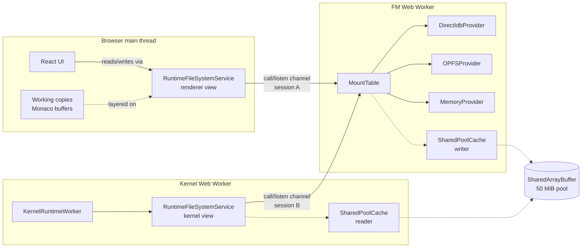
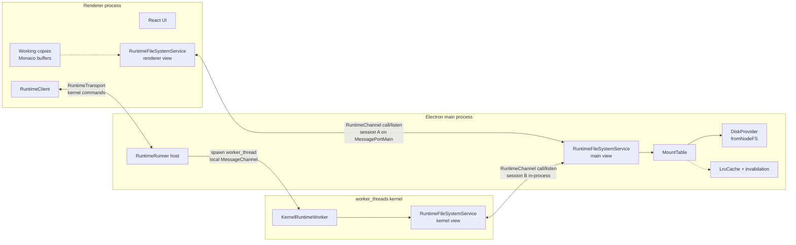
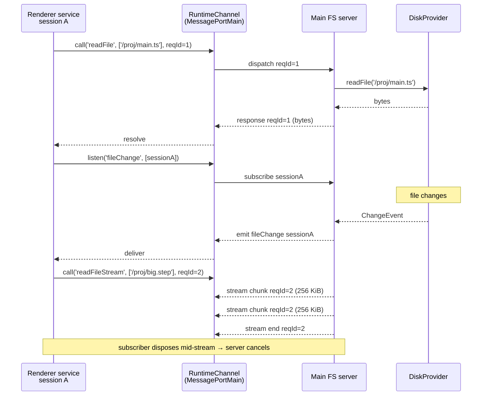

# Runtime Filesystem Target Architecture

A first-principles review of Tau's filesystem topology across browser (web worker), Electron (renderer + main + worker_threads), and headless (Node CLI/tests), framed around the eigenquestion _"who is the authoritative filesystem and how do consumers across processes/threads agree on that authority?"_. Distils the relevant patterns from VS Code (`repos/vscode`) and proposes a target architecture that keeps kernels location-agnostic while supporting every topology Tau's vision implies.

## Executive Summary

Tau today carries two parallel filesystem abstractions that have grown independently: `@taucad/filesystem` `FileService` + `IFileSystemProvider`-style providers (browser UI, FM worker), and `@taucad/runtime` `RuntimeFileSystemBase` (kernel-facing 11-primitive interface) plus the new `RuntimeFileSystemHandle` discriminated handle (`inline`/`channel`/`rpc`/`host`). The handle landed to solve the Electron IPC mismatch (`MessagePort` cannot cross a process boundary) but exposes three structural gaps: (1) the runtime has no consumer-facing **service** layer — only providers and a connect-time handle; (2) capability negotiation is implicit (every provider must implement all 11 primitives, only `watch` is optional); (3) renderer-side editor buffers (Monaco unsaved changes) have nowhere to live in the model. VS Code, the canonical Electron + IPC + multi-process filesystem reference, has solved exactly these problems with a **service/provider split** (`IFileService` multiplexes scheme-keyed `IFileSystemProvider`s), an explicit **capability bitfield** (`FileSystemProviderCapabilities`), a transport-agnostic **`IChannel`/`IServerChannel`** RPC layer (call + listen, rides any port/socket), per-session **event demultiplexing** for watch streams, and **working copies** (`ITextFileService` / `IWorkingCopy`) that decouple editor buffer state from disk persistence. The recommendation is to (a) reframe `RuntimeFileSystemHandle` as the **IPC seam** (it answers _"how does the kernel reach its FS?"_, not _"what FS does the consumer see?"_); (b) introduce a thin `RuntimeFileSystemService` that wraps `RuntimeFileSystemBase` providers, owns mount tables and capability flags, and shares a single bridge protocol with `@taucad/filesystem`; (c) lift the FS bridge from one-shot RPC to an `IChannel`-style call/listen layer with session demux so multiple consumers (renderer file tree + kernel + future helpers) share one cross-process port; (d) add a `RuntimeWorkingCopy` primitive so editor buffers stage above persistence; (e) document `SharedPool` as a **same-agent-cluster** optimisation only and replace it with per-process LRU + invalidation events on cross-process transports.

## Table of Contents

- [Problem Statement](#problem-statement)
- [Methodology](#methodology)
- [Eigenquestions](#eigenquestions)
- [Findings — Tau Today](#findings--tau-today)
- [Findings — VS Code Patterns](#findings--vs-code-patterns)
- [Target Architecture](#target-architecture)
- [Recommendations](#recommendations)
- [Trade-offs](#trade-offs)
- [Diagrams](#diagrams)
- [References](#references)
- [Appendix — Topology Inventory](#appendix--topology-inventory)

## Problem Statement

The Electron IPC POC (see `electron-ipc-gap-analysis.md`) surfaced a fundamental tension that the browser-only architecture concealed: a `MessagePort` is bound to a single V8 agent cluster, so the FS bridge that the browser app uses (renderer creates `MessageChannel`, transfers `port2` into the kernel worker) cannot be reproduced across an Electron renderer↔main boundary. The expedient fix — the `host` arm of `RuntimeFileSystemHandle`, where the kernel host owns its FS and bridges it locally — works, but it left three loose ends:

1. **DX gap**: `RuntimeClient.openFile({ code })` writes inline source through the renderer-side managed FS, which no longer exists when the FS is `host`-kind.
2. **Editor gap**: Monaco edits in the renderer cannot mutate the host's filesystem at all (no IPC for save).
3. **Observation gap**: Renderer file tree and watcher echoes have no path to the host's FS events.

Stepping back, these are symptoms of a deeper design omission: Tau has **no consumer-facing filesystem service** at the runtime layer, only a **provider** contract (`RuntimeFileSystemBase`) and a **wire** contract (`RuntimeFileSystemHandle`). The UI side has a service (`@taucad/filesystem` `FileService`) but the runtime side does not, so every cross-cutting concern — mount routing, capability negotiation, watch demux, large-payload streaming, working-copy staging — is reinvented per topology. Vision-policy phases 4–6 will multiply the topologies (ECAD kernel running in a forked subprocess, FEA solver in a worker_thread, remote GPU sandbox), so the design choice we make now decides whether each topology is bespoke or composes from primitives.

## Methodology

1. Read `RuntimeFileSystemBase`, `RuntimeFileSystem`, `RuntimeFileSystemHandle` definitions and every transport `configureMemory` arm in `packages/runtime/src/`.
2. Mapped `@taucad/filesystem` exports (`FileService`, `MountTable`, `ProviderRegistry`, `AbstractFileSystemProvider`, `EventCoalescer`, `ThrottledWorker`, `CrossTabCoordinator`, `InMemoryFileTree`, `ResourceWriteQueue`, `FileSystemObserverBridge`) and `@taucad/memory` (`SharedPool`, `SharedMemoryArena`).
3. Walked VS Code's filesystem stack in `repos/vscode` for the canonical Electron + IPC patterns: `IFileService` / `IFileSystemProvider`, `DiskFileSystemProviderClient` / `DiskFileSystemProviderChannel`, `IChannel` / `IServerChannel`, `FileSystemProviderCapabilities`, `IWorkingCopy` / `ITextFileService`, the watcher topology (parcel + node + universal), and the extension host's local disk fast-path.
4. Compared the two architectures along five axes: **service vs provider split**, **capability negotiation**, **bridge protocol**, **watch streaming**, **buffer/working-copy separation**.
5. Re-derived the target architecture from the eigenquestions, then validated each recommendation against the every topology in the appendix inventory.

## Eigenquestions

The single highest-leverage question for filesystem integration:

> **E1: Where does the authoritative filesystem live, and how do consumers across processes/threads agree on that authority?**

Three sub-questions follow once E1 is framed correctly:

| #   | Question                                                                                                | Why it matters                                                                                                                                                                |
| --- | ------------------------------------------------------------------------------------------------------- | ----------------------------------------------------------------------------------------------------------------------------------------------------------------------------- |
| E1a | Should the runtime carry its own FS abstraction at all, or consume `@taucad/filesystem` directly?       | Decides whether `RuntimeFileSystemBase` is the canonical provider contract or a duplicate that drifts.                                                                        |
| E1b | Is "filesystem authority" expressed by transport handle (today), URI scheme (VS Code), or both?         | Decides whether `connect({ fileSystem })` stays the only way to declare authority or graduates to a richer mount/scheme model that supports multiple FS roots simultaneously. |
| E1c | Where does the editor's working copy / unsaved buffer state live, and who's responsible for staging it? | Decides whether Monaco-in-Electron requires bespoke IPC or composes from runtime primitives.                                                                                  |

Secondary but tightly coupled:

| #   | Question                                                                                                                                              |
| --- | ----------------------------------------------------------------------------------------------------------------------------------------------------- |
| E1d | When the FS authority is on the other side of an IPC boundary, is the bridge call/response only or also stream + listen?                              |
| E1e | When the FS authority can be reached through a SharedArrayBuffer cache, who decides cache validity and invalidation?                                  |
| E1f | When multiple consumers (renderer file tree + kernel + future helper) want the same authoritative FS, do they share one bridge or each get their own? |

The body of this document answers E1 and its sub-questions in the [Target Architecture](#target-architecture) section.

## Findings — Tau Today

### Finding 1: Two parallel filesystem abstractions exist and do not share types

`@taucad/filesystem` exposes a rich service layer: `FileService` orchestrates `ProviderRegistry`-backed providers (`DirectIdbProvider`, `OPFSProvider`, `FileSystemAccessProvider`, `MemoryProvider`), routed through `MountTable`, with `WatchRegistry`, `ChangeEventBus`, `ResourceWriteQueue`, `DirectoryTreeCache`, `InMemoryFileTree`, `EventCoalescer`, `ThrottledWorker`, and `CrossTabCoordinator` providing the cross-cutting concerns (`packages/filesystem/src/index.ts:14-44`). `@taucad/runtime` exposes only `RuntimeFileSystemBase` (the 11 file/dir primitives plus optional `watch`) and the `RuntimeFileSystem` enhancement that adds four helpers (`packages/runtime/src/types/runtime-kernel.types.ts:66-184`). The two share no common interface; `apps/ui/app/machines/cad.machine.ts:197-201` adapts between them by passing `fromWorker(snapshot.context.worker)` — handing the kernel a `MessagePort` to the FM worker, which speaks `FileManagerProtocol` (`@taucad/filesystem`'s API) on the other end. The bridge proxy on the kernel side conforms it to `RuntimeFileSystemBase` shape.

### Finding 2: `RuntimeFileSystemHandle` is a connect-time IPC handle, not an FS abstraction

The discriminated union (`packages/runtime/src/filesystem/runtime-filesystem-handle.ts:50-54`) answers a single question: _how does the kernel reach its FS?_

- `inline` — caller hands over a `RuntimeFileSystemBase`; transport bridges it via `createBridgePort`.
- `channel` — caller already has a `Worker` running an FS server; transport forwards it via `createFileSystemBridge`.
- `rpc` — placeholder for a wire-RPC arm (B-R4 in blueprint v4); not implemented.
- `host` — kernel host owns its own FS; renderer asserts ownership transfer.

Each transport's `configureMemory` enforces which kinds it accepts: `createInProcessTransport` and `createWorkerTransport` accept `inline`+`channel`, reject `host`+`rpc`; `createMessagePortTransport` accepts only `host`. This naming and shape encodes _bridging strategy_, not _what filesystem the consumer sees_. The conflation surfaces every time someone needs the renderer to read or write — there is no `client.fs.readFile` for the renderer because the client doesn't have a service-level view of the FS.

### Finding 3: No capability negotiation; every provider implements all 11 primitives unconditionally

`RuntimeFileSystemBase` requires every provider to implement `readFile`, `writeFile`, `mkdir`, `readdir`, `unlink`, `rmdir`, `rename`, `stat`, `lstat`, `exists` — only `watch` is optional. There is no mechanism for a read-only provider, a streaming-only provider (large STEP files), an atomic-write provider, a trash-capable provider, or a provider that honours symlinks. Compare with VS Code's `FileSystemProviderCapabilities` bitfield (15+ flags including `Readonly`, `FileReadStream`, `FileFolderCopy`, `Trash`, `FileWriteUnlock`, `FileAtomicRead/Write/Delete`, `FileClone`, `FileRealpath`, `FileAppend`, `PathCaseSensitive`). Tau's "everyone implements everything" model works for Replicad-on-MemoryFS but breaks for read-only mounts (CDN-backed packages), large-file streams (3D file imports), and OS-specific atomic semantics (which Vision-policy Phase 2 simulation kernels will need for checkpoint files).

### Finding 4: One-shot RPC bridge; no streaming, no session demux, no listen

`createBridgePort` and `createBridgeProxy` (`packages/runtime/src/framework/runtime-filesystem-bridge.ts`) marshal each method call as a single `{ id, method, args }` message. The bridge supports `watch` via `onWatch`/`onUnwatch` callbacks but every other method is one-shot request/response. The bridge has no concept of:

- **Streaming** — a 50 MB STEP file `readFile` is one message; structured-clone copy crosses the boundary in full each time, no chunking, no back-pressure, no cancellation if the consumer unsubscribes.
- **Session demux** — only one consumer can hold a bridge proxy; if the renderer also wants to read files (file tree), it needs its own port pair.
- **Generic listen** — only `watch` events flow back; no general subscription primitive.

This is fine for the kernel-only use case but does not scale to "renderer file tree + kernel + future helper" simultaneously consuming the host FS in Electron.

### Finding 5: SharedPool is a same-agent-cluster optimisation; not portable to Electron

`@taucad/memory` `SharedPool` is built on a caller-supplied `SharedArrayBuffer` and uses `Atomics` for lock-free reader visibility (`packages/memory/src/shared-pool.ts:41-78`). The browser app allocates a 50 MiB pool in `file-manager.machine.ts:149-173`, posts it to the FM worker, and the kernel worker gets a reader-side `SharedPool` over the same SAB to short-circuit hot `readFile` paths inside `createBridgeProxy.readFile` (`runtime-filesystem-bridge.ts`). This is a real win — the kernel's bundle-then-execute loop hits `readFile` for every dependency on every render. **In Electron**, SAB cannot cross `MessageChannelMain`, so the renderer-side cache and the main-side cache are different agent clusters with no shared memory. The `createMessagePortTransport.configureMemory` correctly returns `{}` (no SAB fields) but Tau has no replacement strategy documented; the optimisation simply disappears in Electron.

### Finding 6: Renderer-side editor buffers have no model in the runtime

`RuntimeClient.openFile({ code })` is a critical DX shorthand that bypasses real persistence by writing inline source to a managed inline-kind FS the client owns. With `host`-kind FS this throws (`runtime-client.ts` invariant). More importantly, **even with the staging command fix** (R5 in `electron-ipc-gap-analysis.md`), there is no first-class concept of "this is unsaved editor content; the kernel should see it but disk shouldn't have it". VS Code solves this with `IWorkingCopy` and `ITextFileService` — Monaco's text model is a working copy, persistence is an explicit `save` that goes through `textFileService.write` then `IFileService` then the provider. Tau today conflates "editor buffer" with "file content" with "kernel input", which works only for the always-saved web-app loop where the FM worker is also the renderer's filesystem.

### Finding 7: Watch streams are not yet bridged to the renderer at all

The host-owned FS in Electron emits `ChangeEvent`s only into the local kernel-side bridge port. There is no second bridge for the renderer's file tree. VS Code uses per-session demux (`sessionId + requestId` from `DiskFileSystemProviderClient`) so one channel multiplexes many consumers' watch subscriptions; Tau has no equivalent.

### Finding 8: `RuntimeFileSystem` enhancements duplicate logic that should live in a service layer

The four helpers added by `createRuntimeFileSystem` (`readFiles`, `readdirContents`, `readdirStat`, `ensureDir`) wrap the 11 primitives with sensible defaults. They live in the **provider** layer today — every provider gets them. In a service/provider split, these are the **service**'s job, not the provider's; they are derived operations and the provider only needs to expose primitives.

### Finding 9: Mount routing exists in `@taucad/filesystem` but not in the runtime's view

`MountTable` (`packages/filesystem/src/mount-table.ts`) routes paths to providers by longest-prefix match. The kernel sees a single flat `RuntimeFileSystemBase` proxy that may secretly route to multiple backends — but the runtime cannot **express** a multi-mount FS in its own types. There is no way for `createRuntimeClient` to say "mount the project at `/project`, mount built-in stdlib at `/std`, mount in-memory inline code at `/inline`". Today this works because the FM worker handles routing; in headless/CLI usage it does not.

### Finding 10: `RuntimeFileSystemHandle` kinds and transport-arm acceptance form a narrow matrix

| Handle kind | `createInProcessTransport`               | `createWorkerTransport`                  | `createMessagePortTransport` |
| ----------- | ---------------------------------------- | ---------------------------------------- | ---------------------------- |
| `inline`    | ✅ bridges via `createBridgePort`        | ✅ bridges via `createBridgePort`        | ❌ rejects                   |
| `channel`   | ✅ forwards via `createFileSystemBridge` | ✅ forwards via `createFileSystemBridge` | ❌ rejects                   |
| `rpc`       | ❌ placeholder                           | ❌ placeholder                           | ❌ rejects                   |
| `host`      | ❌ rejects                               | ❌ rejects                               | ✅ via `hostKernelOnPort`    |

This is correct as far as it goes, but a richer model would let the **transport** declare its own authority and the **client** declare its consumer intent (read-only, full read-write, watch-only, etc.) independently.

## Findings — VS Code Patterns

### Finding 11: Service/provider split

`IFileService` is the workbench-facing API; storage backends register as `IFileSystemProvider` instances **per URI scheme** (`repos/vscode/src/vs/platform/files/common/files.ts:26-90`, `fileService.ts:50-88`). The service multiplexes by scheme, merges file-change events, owns watch routing, and exposes `hasCapability(resource, flag)` so callers branch on what's available. This is the canonical "thin service over many backends" pattern; it scales to dozens of backends (`file://`, `memfs:`, `vscode-userdata:`, `git:`, extension-contributed schemes) without the consumer knowing.

### Finding 12: Capability bitfield negotiation

`FileSystemProviderCapabilities` (15+ flags incl. `FileReadWrite`, `FileOpenReadWriteClose`, `FileReadStream`, `Readonly`, `Trash`, `FileAtomicRead/Write/Delete`, `FileWriteUnlock`, `FileClone`, `PathCaseSensitive`) is set on each provider; helpers like `hasReadWriteCapability(provider)` narrow the type before calling optional methods. Capabilities are dynamic (`onDidChangeCapabilities` event) so providers can flip e.g. read-only ↔ read-write at runtime.

### Finding 13: `IChannel` / `IServerChannel` is the transport-agnostic RPC layer

```typescript
interface IChannel {
  call<T>(command: string, arg?: any, cancellationToken?: CancellationToken): Promise<T>;
  listen<T>(event: string, arg?: any): Event<T>;
}
interface IServerChannel<TContext = string> {
  call<T>(ctx: TContext, command: string, arg?: any, cancellationToken?: CancellationToken): Promise<T>;
  listen<T>(ctx: TContext, event: string, arg?: any): Event<T>;
}
```

`ChannelServer` rides on `IMessagePassingProtocol` (`send(VSBuffer)` + `onMessage(VSBuffer)`), so the same RPC shape works over Node sockets, `MessagePort`/`MessagePortMain`, `ipcRenderer.invoke`, child-process pipes, and the extension host's RPC bus. Splitting `call` (request/response) from `listen` (event stream) lets watch and stream events flow without polluting the request channel.

### Finding 14: Disk provider client/server with chunked streams

`DiskFileSystemProviderClient` (renderer side) implements `IFileSystemProvider*` by calling `channel.call('readFile', ...)` for one-shot reads and `channel.listen('readFileStream', ...)` for chunked streams (`repos/vscode/src/vs/platform/files/common/diskFileSystemProviderClient.ts:19-99`). The server (`AbstractDiskFileSystemProviderChannel`) emits `VSBuffer` chunks until `'end'`, and **cancels server work via `CancellationToken` when no listeners remain** (`repos/vscode/src/vs/platform/files/node/diskFileSystemProviderServer.ts:103-136`). `FileService` uses a 256 KiB buffer to balance memory vs IPC round-trips.

### Finding 15: Per-session watch demultiplexing

The disk provider client generates a `sessionId` at construction and `watch()` calls produce a `requestId`; the server uses both to partition events back to the right client (`diskFileSystemProviderClient.ts:218-260`). This is the pattern that lets one `IChannel` serve many consumers' watch subscriptions concurrently.

### Finding 16: Throttled watch creation, child-process recursive watcher

For very large workspaces, VS Code throttles non-recursive watcher creation to 100 at a time with 100 ms gaps via `ThrottledWorker` (the same primitive Tau already has in `@taucad/filesystem`). Recursive watching is offloaded to a forked child process (`bootstrap-fork --type=fileWatcher`, `repos/vscode/src/vs/platform/files/node/watcher/watcherClient.ts:25-46`) because parcel-watcher / native event mapping is CPU-intensive.

### Finding 17: Extension host has a local disk fast-path

The Node extension host registers `DiskFileSystemProvider` **in-process** for `file://` so common ops (`stat`, `readdir`, `readFile`, `writeFile`) do not round-trip to the main process (`repos/vscode/src/vs/workbench/api/node/extHostDiskFileSystemProvider.ts:14-80`). Extension-contributed schemes proxy through `MainThreadFileSystem` → renderer → registered provider. **The pattern**: when a process owns local disk access, give it a local provider for speed; only proxy for schemes the process doesn't own.

### Finding 18: Working copies decouple buffer from disk

`IWorkingCopy` is "an abstract concept to unify handling of data that can be worked on" — it may or may not be backed by a file (`repos/vscode/src/vs/workbench/services/workingCopy/common/workingCopy.ts:116-130`). `ITextFileService` then layers text-specific concerns (encoding, etag/mtime conflict detection) over generic working copies. `TextFileEditorModel.doSave` calls `textFileService.write(resource, snapshot, { mtime, etag, encoding })` which goes through `IFileService` to the provider. **Persistence is explicit**; the buffer in Monaco is the source of truth until save.

### Finding 19: Process isolation > worker_threads for FS work

VS Code's main FS-related compute (parcel watcher, ripgrep search) runs in **forked child processes**, not Node `worker_threads`. The disk provider itself runs on the main process; only watcher and search workloads spawn subprocesses. Tau's worker_thread-for-kernel decision (Finding 11 in `electron-ipc-gap-analysis.md`) should be informed by this: VS Code reserves subprocesses for CPU-intensive isolation, not for "everything that's not the renderer".

## Target Architecture

The target architecture answers each eigenquestion explicitly and composes from primitives so every topology in the appendix wires up the same way.

### Answer to E1a — runtime owns the provider contract; UI shares the service contract

Keep `RuntimeFileSystemBase` as the **canonical provider contract** (the 11 primitives + optional `watch` + new optional capabilities/streaming). It is small, stable, and already implemented by every adapter (`fromMemoryFS`, `fromFsLike`, `fromNodeFS`, the FM-worker bridge proxy). Promote the **service** layer in `@taucad/filesystem` to be the canonical consumer view both UI and runtime consume — `FileService` (or a renamed shared abstraction) becomes the thing both layers depend on. The runtime adds a thin `RuntimeFileSystemService` if a smaller-surface variant is needed for headless contexts; otherwise consume `FileService` directly.

### Answer to E1b — handle is the IPC seam; mount/scheme is the consumer view

`RuntimeFileSystemHandle` stays exactly what it is: a discriminated union that answers _"how does the kernel reach its FS?"_ across the IPC boundary. **Separately**, the consumer view is a `MountTable` of `{ prefix: string; provider: RuntimeFileSystemBase; capabilities }` entries. The kernel today sees a single flat `RuntimeFileSystemBase`; in the target it sees a `RuntimeFileSystemService` that internally routes by prefix. Both express authority differently and that's fine — the handle is wire-shaped, the service is consumer-shaped.

### Answer to E1c — first-class working copies

Add `RuntimeWorkingCopy` to `@taucad/runtime`: a tiny shape `{ resource: string; getBuffer(): Uint8Array | string; isDirty: boolean; onDidChange: Event<void> }`. The renderer's Monaco buffers register as working copies; `RuntimeFileSystemService.readFile(path)` checks the working-copy registry first, falls back to the underlying provider. Save is explicit: `service.save(workingCopy)` writes through to the provider. This is exactly VS Code's `IWorkingCopy` + `ITextFileService` pattern, scoped to runtime needs (binary + text). Solves Findings 6/7 of `electron-ipc-gap-analysis.md` natively without bespoke staging IPC.

### Answer to E1d — bridge layer is `IChannel`-style call + listen

Replace the one-shot `createBridgePort` / `createBridgeProxy` with a generic call/listen channel (mirror VS Code's `IChannel`). The FS bridge protocol becomes: `call('readFile', [path, opts])`, `call('writeFile', [path, bytes])`, `listen('fileChange', [sessionId])`, `listen('readFileStream', [path, opts])` (chunks emitted until terminal). The same channel layer can host non-FS RPCs the runtime needs. Backwards-compatible: the existing bridge becomes an adapter on top.

### Answer to E1e — explicit cache plane separated from authority

Document `SharedPool` as a **same-agent-cluster** optimisation; introduce a `RuntimeFileCache` interface so each topology can pick its cache: `SharedPoolCache` for browser-worker (today's behaviour), `LruMapCache` for cross-process Electron + cache-invalidation events on `fileChange`. The cache is **the service's** concern, not the provider's; reads pass through cache → working copy → provider. Writes flush through cache invalidation to all subscribers.

### Answer to E1f — one bridge serves many consumers via session demux

Adopt VS Code's `sessionId + requestId` pattern for the FS bridge. One `MessagePortMain` pair per kernel host can carry both renderer-side service reads/writes/watches **and** kernel-side reads, with each consumer's events demuxed to the right subscriber. This removes the "second port pair" question (Q2 in `electron-ipc-gap-analysis.md`) by making single-port-multi-consumer the default.

### Layered model

| Layer                     | Responsibility                                                                                    | Today                                                 | Target                                                                                                                    |
| ------------------------- | ------------------------------------------------------------------------------------------------- | ----------------------------------------------------- | ------------------------------------------------------------------------------------------------------------------------- | -------------------------------- |
| **Authority** (provider)  | Expose the 11 primitives + capability bits over a backing store (disk, IDB, OPFS, memory, remote) | `RuntimeFileSystemBase`                               | `RuntimeFileSystemBase` + `capabilities: Set<Capability>` + optional `readFileStream`, `writeAtomic`, `clone`, `realpath` |
| **Mount + scheme**        | Route paths to providers; merge events; cache directory tree                                      | `MountTable` in `@taucad/filesystem` (UI only)        | Promote to runtime; `RuntimeFileSystemService` routes by prefix                                                           |
| **Service**               | Consumer-facing API; helpers (`readFiles`, `ensureDir`); capability-narrowed methods              | `RuntimeFileSystem` enhancement on the proxy          | `RuntimeFileSystemService` (separate from provider; consumed by renderer + kernel + helpers)                              |
| **Working copies**        | Editor buffer staging that layers above persistence                                               | none                                                  | `RuntimeWorkingCopy` registry inside the service                                                                          |
| **Cache**                 | Optional zero-copy shared pool or per-process LRU + invalidation                                  | `SharedPool` (in browser only)                        | `RuntimeFileCache` interface; `SharedPoolCache`                                                                           | `LruCache + invalidation events` |
| **Bridge** (IPC seam)     | `call` + `listen` over any port; session demux; chunked streams; cancellation                     | `createBridgePort` (one-shot RPC)                     | `createRuntimeChannel(port)` modelled on `IChannel`; FS server registers as one channel target                            |
| **Handle** (connect-time) | Declare to the transport which IPC topology applies                                               | `RuntimeFileSystemHandle` (`inline`/`channel`/`host`) | unchanged shape; `host` arm gains optional `mounts` hint for renderer breadcrumbs                                         |

### Process/thread topology recipes

| Topology                                                          | Authority                             | Service                                                                    | Bridge                                                                                       | Cache                                                           | Working copies                                       |
| ----------------------------------------------------------------- | ------------------------------------- | -------------------------------------------------------------------------- | -------------------------------------------------------------------------------------------- | --------------------------------------------------------------- | ---------------------------------------------------- |
| **Browser UI** (today)                                            | FM web worker                         | Renderer + kernel each get a service over the bridge proxy                 | `MessageChannel` (renderer↔FM, kernel↔FM)                                                    | `SharedPool` over allocated SAB                                 | Renderer-side, in-memory (Monaco buffers)            |
| **In-process Node CLI**                                           | Same process                          | Same process                                                               | none (direct service over inline provider)                                                   | `LruCache` (no SAB needed)                                      | n/a (no editor)                                      |
| **Electron renderer + main**                                      | Main process (`fromNodeFS`)           | Both renderer and main hold a service; renderer's reads go over the bridge | `MessagePortMain` running `RuntimeChannel`; one pair, session-demuxed                        | `LruCache` per process; invalidation via `listen('fileChange')` | Renderer-side; `service.save()` is explicit IPC      |
| **Electron main + worker_thread kernel**                          | Main process                          | Main holds service; kernel worker_thread gets a bridge proxy               | Local `MessageChannel` between main and worker_thread                                        | `SharedPool` (same Node agent cluster supports SAB)             | n/a in worker_thread; renderer talks to main only    |
| **Cross-window Electron** (multiple BrowserWindows)               | Single main service                   | Each renderer + the kernel have proxies                                    | One `MessagePortMain` pair per renderer; one local `MessageChannel` per kernel worker_thread | `LruCache` per process; main is single source of truth          | Per-renderer working copies; merged for kernels      |
| **Future: native binary kernel** (build123d in Python subprocess) | Whoever spawned subprocess (Tau host) | Tau host service; subprocess gets bridge over stdio                        | stdio framing of `RuntimeChannel`                                                            | `LruCache` only (no SAB across subprocess boundary)             | Same as Electron pattern                             |
| **Future: remote sandbox** (GPU-backed OCCT)                      | Remote service                        | Local service; remote holds replica or bridge proxy                        | WebSocket framing of `RuntimeChannel`                                                        | `LruCache` + ETags + range reads                                | Always-local working copies; explicit upload on save |

The target's value is that every column under "Bridge" is the same primitive (a `RuntimeChannel` over some port-like thing), every column under "Authority" is the same primitive (`RuntimeFileSystemBase`), and the topology variation lives entirely in **which process holds the authority** and **which transport hosts the channel**.

## Recommendations

| #   | Action                                                                                                                                                                                                                                                                             | Priority     | Effort  | Impact         | Findings     |
| --- | ---------------------------------------------------------------------------------------------------------------------------------------------------------------------------------------------------------------------------------------------------------------------------------- | ------------ | ------- | -------------- | ------------ | ------- | ---------------- | --------------------------------------------------------------------------------------------------------- | --- | --- | ---- | ------- |
| R1  | Extract `IChannel`-style `call` + `listen` primitive into `packages/runtime/src/transport/runtime-channel-rpc.ts`; rebuild FS bridge on top as `createFsServerChannel(provider)` + `createFsClient(channel, sessionId)`; preserve current `createBridgePort` API as a thin adapter | P0           | M       | High           | F4, F13, F14 |
| R2  | Add `capabilities: ReadonlySet<RuntimeFileSystemCapability>` to `RuntimeFileSystemBase` (`'readwrite'                                                                                                                                                                              | 'readstream' | 'watch' | 'atomic-write' | 'trash'      | 'clone' | 'case-sensitive' | 'readonly'`); add `hasCapability(provider, cap)` helpers; default existing providers to a sensible bitset | P0  | M   | High | F3, F12 |
| R3  | Introduce `RuntimeWorkingCopy` registry on a new `RuntimeFileSystemService`; renderer-side Monaco buffers register as working copies; `service.readFile()` checks working copies before provider; `service.save(copy)` is explicit                                                 | P0           | M       | High           | F6, F18      |
| R4  | Promote `@taucad/filesystem` `MountTable` shape into `@taucad/runtime` (or have runtime depend on it); `createRuntimeFileSystemService({ mounts })` accepts `[{ prefix, provider }]`; kernel always sees mounted view via the service                                              | P1           | M       | Medium         | F9, F11      |
| R5  | Adopt `sessionId + requestId` demux on the FS channel; one `MessagePortMain` pair carries multiple consumer sessions (renderer file tree + kernel + helpers); cancellation via per-session disposal                                                                                | P1           | M       | High           | F7, F15      |
| R6  | Add `readFileStream(path, opts)` and `writeFileStream(path, opts)` to the optional capability set; chunked streams over `listen('readFileStream', [sessionId, requestId])`; cancellation when subscriber disposes                                                                  | P1           | M       | Medium         | F4, F14      |
| R7  | Replace `SharedPool`-only assumption with `RuntimeFileCache` interface; `SharedPoolCache` (today's behaviour) for same-cluster topologies, `LruCache + invalidation` for cross-process; service consults cache before provider                                                     | P1           | L       | Medium         | F5           |
| R8  | Document capability matrix per process/thread topology in this doc and in `worker-model.mdx`; add "Topology recipes" section to runtime docs                                                                                                                                       | P2           | L       | Medium         | F10          |
| R9  | Move the four `RuntimeFileSystem` enhancement helpers (`readFiles`, `readdirContents`, `readdirStat`, `ensureDir`) from provider proxy into the service; providers stay minimal                                                                                                    | P2           | L       | Low            | F8           |
| R10 | Keep `RuntimeFileSystemHandle` shape unchanged but rename internally for clarity (`RuntimeFileSystemConnection` is more accurate; either works); add JSDoc explicitly stating "this is the IPC seam, not the FS abstraction"                                                       | P2           | L       | Low            | F2           |
| R11 | Provide `localDiskFastPath: boolean` flag in the runner spec (see runner research) so a worker_thread kernel that shares the host's process tree gets a direct local provider instead of a bridge — VS Code's extension-host fast path pattern                                     | P2           | M       | Medium         | F17          |

## Trade-offs

### Service/provider split now vs later

| Now (target architecture)                                                                        | Later (continue layering on `RuntimeFileSystemBase`)                             |
| ------------------------------------------------------------------------------------------------ | -------------------------------------------------------------------------------- |
| Forces ergonomic alignment with `@taucad/filesystem` immediately, before more topologies pile on | Each new topology (Electron, native, remote) writes its own ad-hoc service layer |
| Adds one type-system concept (`RuntimeFileSystemService`) that consumers learn                   | Consumers keep using the bridge proxy as if it were a service                    |
| Refactor cost: ~1 week to thread the new type through kernels + bundlers + middleware            | Zero refactor cost; growing tax on every new topology                            |

### Working copies as runtime primitive vs renderer concern

| Working copies in runtime                                                  | Working copies in renderer only                                                        |
| -------------------------------------------------------------------------- | -------------------------------------------------------------------------------------- |
| Monaco buffers compose with kernel reads naturally; no bespoke staging IPC | Each consumer reinvents staging (today's `code:` shorthand is one such reinvention)    |
| Adds a small interface to the runtime API surface                          | Keeps runtime smaller; pushes complexity to consumers                                  |
| The kernel sees the same model in browser + Electron + future native       | Browser keeps working (FM is already authoritative); Electron/native get bespoke shims |

### `IChannel`-style bridge vs current one-shot RPC

| `IChannel`-style                                                              | Current one-shot                                                                 |
| ----------------------------------------------------------------------------- | -------------------------------------------------------------------------------- |
| Native streaming + cancellation; matches VS Code, Comlink, tRPC patterns      | Smaller surface; one method per call is easier to reason about                   |
| Multi-session demux solves the "renderer + kernel sharing one bridge" problem | Today's per-consumer port pair scales linearly; not a problem until 3+ consumers |
| Strict superset; current bridge becomes an adapter                            | Refactor cost; need to migrate all bridge callers                                |

## Diagrams

### Browser UI topology (target)



### Electron topology (target)



### Bridge call/listen channel (target)



## References

- Tau gap: `docs/research/electron-ipc-gap-analysis.md`
- Tau prior: `docs/research/filesystem-gap-analysis.md`, `docs/research/shared-memory-geometry-pipeline.md`, `docs/research/runtime-cross-origin-isolation-distribution.md`
- Tau blueprint: `docs/research/runtime-transport-implementation-blueprint-v4.md`
- Tau policy: `docs/policy/vision-policy.md`, `docs/policy/library-api-policy.md`
- Tau source: `packages/runtime/src/filesystem/`, `packages/runtime/src/framework/runtime-filesystem-bridge.ts`, `packages/runtime/src/transport/{in-process,worker,message-port}-transport.ts`, `packages/runtime/src/transport/host-kernel-on-port.ts`
- Tau source: `packages/filesystem/src/{file-service,mount-table,provider-registry,event-coalescer,throttled-worker,cross-tab-coordinator}.ts`
- Tau source: `packages/memory/src/{shared-pool,shared-memory-arena}.ts`
- VS Code: `repos/vscode/src/vs/platform/files/common/{files,fileService,diskFileSystemProviderClient}.ts`
- VS Code: `repos/vscode/src/vs/platform/files/node/{diskFileSystemProvider,diskFileSystemProviderServer}.ts`
- VS Code: `repos/vscode/src/vs/base/parts/ipc/common/ipc.ts` (`IChannel`, `IServerChannel`, `ChannelServer`)
- VS Code: `repos/vscode/src/vs/workbench/services/textfile/common/{textfiles,textFileEditorModel}.ts`
- VS Code: `repos/vscode/src/vs/workbench/services/workingCopy/common/workingCopy.ts`
- VS Code: `repos/vscode/src/vs/workbench/api/node/extHostDiskFileSystemProvider.ts`

## Appendix — Topology Inventory

Every distinct filesystem topology Tau supports today or must support per Vision Policy phases:

| #   | Topology                                                   | Process(es)                                 | Authority lives in                            | FS reaches kernel via                                     | Cache primitive                                      | Status                                                                        |
| --- | ---------------------------------------------------------- | ------------------------------------------- | --------------------------------------------- | --------------------------------------------------------- | ---------------------------------------------------- | ----------------------------------------------------------------------------- |
| T1  | Browser UI (Tau today)                                     | Main + FM Worker + Kernel Worker            | FM Worker                                     | `MessageChannel` `createFileSystemBridge`                 | `SharedPool` over SAB                                | Shipped                                                                       |
| T2  | In-process Node CLI / tests                                | Single Node process                         | Same process (`fromNodeFS` or `fromMemoryFS`) | `createBridgePort` (in-process)                           | `LruCache` (no SAB needed)                           | Shipped                                                                       |
| T3  | Headless RPC (`@taucad/api` `headless-rpc-filesystem.ts`)  | Single Node process per request             | Per-request inline FS                         | direct (no bridge)                                        | none                                                 | Shipped                                                                       |
| T4  | Browser embedded (third-party host page)                   | Same as T1 with possibly missing SAB        | FM Worker                                     | `MessageChannel`                                          | `SharedPool` if cross-origin isolated; else fallback | Shipped (degraded without COEP)                                               |
| T5  | Electron renderer + main + kernel-on-main                  | Renderer + Main                             | Main (`fromNodeFS`)                           | `host` arm; `hostKernelOnPort` injects local bridge       | `LruCache` + invalidation                            | Validated end-to-end (`message-port-integration.test.ts`); not Electron-wired |
| T6  | Electron renderer + main + kernel-in-worker_thread         | Renderer + Main + WT                        | Main (`fromNodeFS`)                           | `host` arm; main bridges to WT via local `MessageChannel` | Possibly `SharedPool` (same Node cluster)            | Not yet implemented (R10 in gap analysis)                                     |
| T7  | Multi-window Electron                                      | N renderers + Main + N kernel WTs           | Main (single source of truth)                 | `host` arm per window                                     | `LruCache` per renderer; main authoritative          | Not yet implemented (Q5 in gap analysis)                                      |
| T8  | Future: native binary kernel (build123d Python subprocess) | Tau host + subprocess                       | Tau host                                      | `RuntimeChannel` over stdio framing                       | `LruCache` only                                      | Future (Vision Phase 1+)                                                      |
| T9  | Future: remote sandbox kernel (GPU-backed OCCT)            | Local + remote                              | Local hot-path; remote replica                | `RuntimeChannel` over WebSocket                           | `LruCache` + ETags + range reads                     | Future (Vision Phase 2+)                                                      |
| T10 | Future: collaborative session (multi-tenant)               | Each peer holds local; central holds master | Server                                        | `RuntimeChannel` over WebSocket; `streamId` per peer      | `LruCache` + CRDT state                              | Future (Vision Phase 6)                                                       |

The target architecture must support T1–T10 with the same primitives — this is the test the recommendations are designed to pass.
