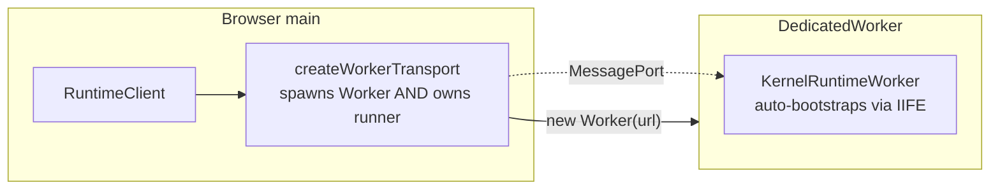
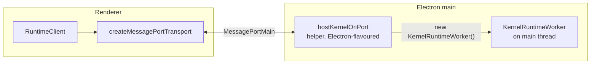
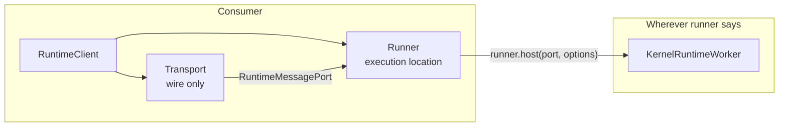
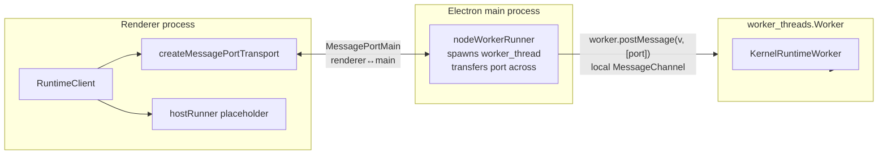
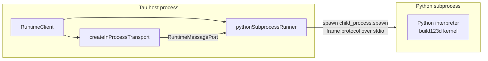

# Runtime Runner Primitive

A first-principles analysis of _where_ heavy CAD compute (createGeometry, exportGeometry, simulation, native solvers, remote GPU work) physically executes in the Tau runtime, framed around the eigenquestion _"who decides where heavy work runs, and how do consumers express that intent without the kernel knowing?"_. Argues for promoting `KernelRuntimeWorker` hosting from a transport-implicit detail into a first-class plugin-shaped primitive — a `RuntimeRunner` — distinct from kernels, bundlers, transports, and middleware.

## Executive Summary

In Tau today, the **transport** implicitly owns the execution location: `createInProcessTransport` instantiates `KernelRuntimeWorker` on the calling thread, `createWorkerTransport` instantiates one inside a `new Worker(workerUrl)` it spawns, and `hostKernelOnPort` lets the caller decide. This worked fine for the two browser topologies (in-process + DedicatedWorker) but broke down the moment Electron landed: in Electron the **transport endpoint** is the renderer, but the **kernel host** must run elsewhere (main process today, ideally a `worker_threads.Worker` to keep the main thread responsive). The two roles are now structurally distinct. Vision Policy phases 2–6 multiply the tension: an FEA solver wants to run in a forked native subprocess, a build123d kernel wants to run a Python interpreter, a remote OCCT sandbox wants to run on a GPU-equipped server, and a future federated-engineering scenario wants to run _across_ a sandbox graph. Forcing every consumer to write a bespoke transport for each combination is the wrong abstraction. The right abstraction is a `RuntimeRunner` plugin that owns _where_ `KernelRuntimeWorker` (or a non-JS analogue) runs, while the transport keeps owning _how the wire is shaped_. The runner is to "where compute runs" what the bundler is to "how source becomes executable" — a plugin-shaped seam, declared once at `createRuntimeClient` time, that consumers can swap without touching kernels or middleware. The default behaviour stays one-line — `createRuntimeClient(presets.all())` infers an in-process or web-worker runner from the transport — but explicit runner selection unlocks `nodeWorkerRunner({ url })`, `subprocessRunner({ command })`, `remoteRunner({ url })`, and arbitrary future hosts without changes to kernels, bundlers, transports, the client, or downstream consumers.

## Table of Contents

- [Problem Statement](#problem-statement)
- [Methodology](#methodology)
- [Eigenquestions](#eigenquestions)
- [Findings — Today's Implicit Runner](#findings--todays-implicit-runner)
- [Findings — Why Electron Breaks the Implicit Model](#findings--why-electron-breaks-the-implicit-model)
- [Findings — Future Topologies and Plugin Surface](#findings--future-topologies-and-plugin-surface)
- [Target Architecture](#target-architecture)
- [Recommendations](#recommendations)
- [Trade-offs](#trade-offs)
- [Diagrams](#diagrams)
- [References](#references)
- [Appendix — Runner Topology Catalogue](#appendix--runner-topology-catalogue)

## Problem Statement

The browser-only Tau topology has exactly two executable hosts: the page main thread (rare; in-process transport for tests) and a `DedicatedWorker` (default; the kernel runtime worker). Both are spawned by the **transport**: `createInProcessTransport()` builds `new KernelRuntimeWorker()` directly, `createWorkerTransport(url)` builds `new Worker(url)` and lets the IIFE in `kernel-runtime-worker.ts` self-bootstrap. The transport "is" the runner because the wire shape and the host shape happen to coincide.

Electron breaks this coincidence cleanly. The renderer holds the transport endpoint (the renderer-side `MessagePort`), but the kernel cannot run in the renderer (no Node, often no SAB, untrusted). The kernel must run somewhere on the main side. That "somewhere" can be: (a) the Electron main thread — works but blocks IPC under load (`electron-ipc-gap-analysis.md` Finding 11); (b) a `worker_threads.Worker` spawned from main — correct but requires the main thread to glue the renderer's `MessagePortMain` to the worker's local `MessageChannel`; (c) a forked subprocess — overkill for JS but correct for native kernels. The current `hostKernelOnPort` helper is the first crack at this separation, but it is documented as an Electron-specific helper rather than a general primitive.

Vision Policy phases 2–6 force this separation to be permanent. Phase 2 simulation kernels (FEAScript today; native solvers later) want subprocess isolation for memory + signals. Phase 4 ECAD kernels want to call out to ngspice / KiCad subprocesses. Phase 5 firmware kernels want to spawn QEMU / Wokwi simulators. The Vision goal of "any engineering tool plugs into the same runtime" cannot mean "any tool plus a custom transport" — it must mean "any tool plus an existing runner you compose with the same client".

This document argues that **`RuntimeRunner` is the missing primitive**, that it should be plugin-shaped to mirror `defineKernel`/`defineTranscoder`/`defineBundler`, and that the consumer surface stays a one-line `createRuntimeClient` config object. It also argues that **the bundler stays where it is** (a kernel-runtime concern, not a runner concern, for JS-based kernels) and that **kernel plugins remain location-agnostic** — they declare what they need from `KernelRuntime` and the runner provides it.

## Methodology

1. Enumerated every concrete way `KernelRuntimeWorker` is currently spawned across `packages/runtime/`, `packages/cli/`, `apps/ui/`, `apps/api/`, and `examples/electron-tau/`.
2. Read each transport's `configureMemory` and constructor to identify exactly which line decides the execution thread/process.
3. Walked `defineKernel`, `defineBundler`, `defineTranscoder` plugin shapes for symmetry — the existing plugin contract sets the bar for what `defineRunner` should look like.
4. Walked the kernel plugins (`replicad`, `opencascade`, `openscad`, `tau`, `zoo`) to confirm none of them assume a specific thread/process; all consume the abstract `KernelRuntime` provided by `KernelWorker.createRuntime()`.
5. Walked the bundler (`esbuild-core.ts`, `module-manager.ts`) and the dual `executeCode` path (`Blob` vs Node temp file in `execute-code-node.ts`) to confirm bundler concerns are also location-agnostic but JS-specific.
6. Read `host-kernel-on-port.ts` for the existing "explicit host" pattern that a runner primitive would generalise.
7. Cross-referenced every Vision Policy phase's compute style to derive the runner taxonomy (in-process, web worker, node worker, subprocess, remote, federated).

## Eigenquestions

The single highest-leverage question for execution-location architecture:

> **E2: Who decides where heavy CAD compute physically runs, and how do consumers express that intent without the kernel knowing?**

Three sub-questions follow:

| #   | Question                                                                                                                                     | Why it matters                                                                                                              |
| --- | -------------------------------------------------------------------------------------------------------------------------------------------- | --------------------------------------------------------------------------------------------------------------------------- |
| E2a | Is the runner a transport concern, a kernel concern, a bundler concern, or its own concern?                                                  | Decides the architectural ownership. Today it's transport-implicit; the question is whether to keep it there or extract it. |
| E2b | How do we accommodate future runners (worker_threads, native binary, remote GPU sandbox) without breaking the kernel author API?             | Decides whether kernel authors stay with one definition that runs everywhere, or have to write per-runner adapters.         |
| E2c | When a kernel cannot run in JS at all (Python build123d, native FEA solver), can a runner host it without changes to the rest of the system? | Decides whether non-JS kernels are first-class or a special case.                                                           |

Secondary but tightly coupled:

| #   | Question                                                                                                                                                   |
| --- | ---------------------------------------------------------------------------------------------------------------------------------------------------------- |
| E2d | When a runner is remote, who owns the bundler — local (bundle here, ship code) or remote (ship source, bundle there)?                                      |
| E2e | When a runner is process-isolated (subprocess), how does it receive its filesystem authority — same `RuntimeFileSystemHandle` protocol or runner-specific? |
| E2f | Can a single client use multiple runners simultaneously (e.g. JS kernel locally, Python kernel in subprocess) without protocol surgery?                    |

The body answers E2 and its sub-questions in the [Target Architecture](#target-architecture) section.

## Findings — Today's Implicit Runner

### Finding 1: `KernelRuntimeWorker` is the canonical "kernel runtime" host

`KernelRuntimeWorker` (multi-kernel subclass of `KernelWorker`) is the unit of execution. It owns the bundler facade, middleware onion, autonomous render loop, watch sets, capabilities manifest, and transcoder routing. Its public surface (`render`, `getParameters`, `exportGeometry`, `handleOpenFile`, `handleUpdateParameters`, `handleSetOptions`, `notifyFileChanged`, `configureMiddleware`, `cleanup`) is the same regardless of where it runs. Kernel plugins receive a `KernelRuntime` (filesystem, logger, bundler, execute) and have no view of "which thread am I on?" beyond `isNode()` checks for environment-specific code paths. **This is correct and the runner primitive must preserve it.**

### Finding 2: Transports today implicitly own the runner

Three concrete patterns:

| Transport                          | How `KernelRuntimeWorker` is created                                                                                            | Where it runs                                                                                                               |
| ---------------------------------- | ------------------------------------------------------------------------------------------------------------------------------- | --------------------------------------------------------------------------------------------------------------------------- |
| `createInProcessTransport()`       | `new KernelRuntimeWorker()` in the calling thread; `createWorkerDispatcher(worker, port)` over a `MessageChannel`               | Calling thread (Node CLI, in-process tests)                                                                                 |
| `createWorkerTransport(workerUrl)` | `new Worker(workerUrl, { type: 'module' })`; the IIFE in `kernel-runtime-worker.ts` auto-bootstraps `new KernelRuntimeWorker()` | Real DedicatedWorker (browser) or `worker_threads.Worker` (Node, indirectly)                                                |
| `createMessagePortTransport(port)` | Does **not** create a worker; renderer-side only                                                                                | n/a — caller must run `hostKernelOnPort(somePort, options)` on the host side, which calls `new KernelRuntimeWorker()` there |
| `hostKernelOnPort(port, options)`  | `new KernelRuntimeWorker()` in the calling thread (Electron main today, worker_thread eventually)                               | Wherever the host caller runs                                                                                               |

The "transport owns the worker" coupling is fine for the first two patterns because wire shape and host shape coincide. The Electron pattern explicitly **decouples** them via the `hostKernelOnPort` helper — but the helper sits in the transport directory and is documented as an Electron concern.

### Finding 3: Kernel plugins are already location-agnostic

`replicad.kernel.ts`, `opencascade/`, `openscad/`, `tau/`, `zoo/` all consume the abstract `KernelRuntime` (filesystem, logger, bundler, execute). None spawn workers, threads, or processes themselves. They use `import.meta.url` to resolve WASM paths (which works in any module context) and `await import(...)` for dynamic dependencies. The `isNode()` check in `executeCode` (`Blob` vs Node `import()`) lives **inside** the bundler, not the kernel. Kernel authors do not write "this is a worker kernel" or "this is a main-thread kernel" — they just write a `KernelDefinition`. **The runner primitive must preserve this property absolutely.**

### Finding 4: Bundlers are also location-agnostic but JS-specific

The esbuild bundler runs wherever its host runs (browser worker, Node CLI, Electron main, worker_thread). It branches between `esbuild-wasm` (browser) and native esbuild (Node) inside `initializeEsbuild()`, then between `Blob`-based dynamic import (browser) and temp-file `import()` (Node) inside `executeCode`. **The bundler is a JS-only concern**: it bundles JS source, executes it, and returns a value. A Python build123d kernel would not use esbuild; it would use a Python interpreter. So bundlers are a **per-runner-class** concern: JS runners share the JS bundler; native runners bring their own (or none).

### Finding 5: Middleware is location-agnostic and stays inside `KernelWorker`

Middleware (geometry-cache, parameter-cache, parameter-file-resolver) wraps `getParameters` / `createGeometry` / `exportGeometry` as an onion inside `KernelWorker`. None of them choose where compute happens; they short-circuit or augment work already scheduled on the worker. **No change needed for the runner primitive.**

### Finding 6: `getWorkerUrl()` hardcodes the worker entry path

`createRuntimeClient` defaults to `createWorkerTransport(getWorkerUrl())`, where `getWorkerUrl()` returns `new URL('../framework/kernel-runtime-worker.js', import.meta.url).href`. This is the third architectural seam where execution location is decided — and it is **inside the client**, not the transport. Today it's harmless because the only worker is `kernel-runtime-worker.js`. In a runner-aware world, the client should not know this URL; the runner should.

### Finding 7: CLI and tests use in-process transport without choice

`createNodeClient` (`packages/runtime/src/node.ts`) hardcodes `createInProcessTransport()`. This conflates "I'm in Node" with "kernel runs in this thread", which works for tests/CLI but precludes a Node consumer that wants to push compute to a `worker_threads.Worker` for responsiveness. A runner-aware Node client would offer `createNodeClient(projectPath, { runner: nodeWorkerRunner({ url }) })`.

## Findings — Why Electron Breaks the Implicit Model

### Finding 8: Renderer-side transport endpoint cannot host the kernel

The Electron renderer is a Chromium context: no Node, no `worker_threads`, no `fs`, no native bindings. The kernel must run elsewhere. The **renderer holds the transport endpoint** (the `MessagePort` that talks to the kernel host); the **main process or a worker_thread** runs the kernel. Today the only way to express this is to use `createMessagePortTransport(port)` in the renderer and `hostKernelOnPort(port, options)` on the host side — two paired calls in two processes. There is no single primitive that says "wire a renderer to a kernel hosted by X".

### Finding 9: Main-process kernel hosting blocks IPC

If `hostKernelOnPort` is called directly on the Electron main process, `KernelRuntimeWorker` runs on the main thread. Long OCCT renders block `BrowserWindow` IPC, menu events, and other windows. The clean fix is `worker_threads.Worker` spawned from main; `MessagePortMain.port2` can be transferred into the worker via `worker.postMessage(value, [port])` and the worker hosts the kernel. **This is a runner topology, not a transport topology**: the transport (the renderer-side `MessagePort`) doesn't change, only where the host code runs.

### Finding 10: Two distinct port hops, no clear ownership

The Electron + worker_thread topology has two port hops:

1. **Renderer ↔ Main** via `MessagePortMain` (the user-visible IPC).
2. **Main ↔ worker_thread** via Node `MessageChannel` (the runner-internal hop).

Today there is no name for the entity that owns hop 2. It's "code in main that calls `hostKernelOnPort`". A runner primitive named this entity: `nodeWorkerRunner({ url })` returns a host that, when given hop-1's `port`, internally constructs hop 2 and the worker_thread. The consumer never sees hop 2.

### Finding 11: `hostKernelOnPort` is the proto-runner

The existing helper already does the runner's job for the simplest case (kernel in calling thread). The shape:

```typescript
function hostKernelOnPort(
  port: RuntimeMessagePort,
  options: { fileSystem?: RuntimeFileSystemBase },
): { dispose: () => void };
```

is exactly what a runner needs to expose. The runner primitive generalises this: `runner.host(port, options)` delegates to whichever execution strategy the runner implements (in-process, worker_threads, subprocess, remote).

## Findings — Future Topologies and Plugin Surface

### Finding 12: Vision Policy phases imply ≥6 distinct runner topologies

| Vision phase                   | Compute style                                             | Runner needed                                         |
| ------------------------------ | --------------------------------------------------------- | ----------------------------------------------------- |
| Phase 1 (today)                | JS in browser/Node                                        | `webWorkerRunner`, `inProcessRunner`                  |
| Phase 1.5 (Electron POC)       | JS on Node main / worker_thread                           | `nodeWorkerRunner`                                    |
| Phase 2 (FEA solvers)          | Native subprocess (Calculix, OpenFOAM); maybe wasm32-wasi | `subprocessRunner`, possibly `wasiRunner`             |
| Phase 4 (ECAD)                 | KiCad / ngspice subprocess                                | `subprocessRunner`                                    |
| Phase 5 (firmware sim)         | QEMU / Wokwi container                                    | `subprocessRunner` or `containerRunner`               |
| Phase 6 (full system + remote) | GPU-equipped sandbox; federated                           | `remoteRunner` (WebSocket / HTTPS); `federatedRunner` |

A single plugin-shaped abstraction must cover all six. The existing plugin shapes (`defineKernel`, `defineBundler`, `defineTranscoder`) are the template.

### Finding 13: Native and remote kernels need their own bundler equivalents

A Python build123d kernel does not bundle TypeScript; it loads `.py` files, possibly via a Python source resolver. A native FEA kernel takes `.inp` input files and writes `.frd` results. A remote kernel ships source bytes upstream and reads them back. These are **runner-specific source/execution concerns** that the JS bundler cannot serve. The runner primitive must own (or delegate to) this concern. Concretely: `defineRunner` declares which `BundlerPlugin`s it accepts (or `null` if it brings its own). The client validates compatibility at `createRuntimeClient` time.

### Finding 14: Kernels declare runtime requirements; runners declare execution capabilities

To match kernels with runners declaratively, both sides need labels. The simplest workable scheme:

- Kernel declares a `runtime: 'js' | 'wasm' | 'python' | 'native' | 'remote'` (or richer set; one tag is enough for v1).
- Runner declares a `supports: Set<KernelRuntimeKind>` and `bundlers: BundlerPlugin[] | 'inherit'`.
- Client cross-checks at construction; rejects mismatched configs early with a clear error.

This is exactly the pattern `defineTranscoder` already uses for `edges: TranscoderEdge[]` (each edge declares from/to format, fidelity).

### Finding 15: Runners can multiplex many kernels

A single `nodeWorkerRunner` spawns one `KernelRuntimeWorker` that hosts every JS kernel registered with the client. A single `subprocessRunner({ command: 'python' })` could spawn one Python interpreter that hosts every Python kernel. The runner-to-kernel relationship is one-to-many; consumers don't think about it.

### Finding 16: Some runners need lifecycle hooks the bundler/transport don't have

A subprocess runner needs `start`/`stop`/`crash-detect`/`restart`. A remote runner needs `connect`/`reconnect`/`auth`. A federated runner needs consensus primitives. The runner plugin contract has to expose lifecycle hooks the existing plugin contracts don't. This is the price of admission for the abstraction; it's still finite.

## Target Architecture

### Answer to E2a — runner is its own primitive

The runner is a **first-class plugin** distinct from kernels, bundlers, transports, and middleware. It owns the **execution location** of `KernelRuntimeWorker` (or its non-JS equivalent). The transport keeps owning the **wire shape**. The two compose: a transport delivers a `RuntimeMessagePort`; the runner consumes that port and hosts the kernel runtime on the other end.

### Answer to E2b — kernels stay location-agnostic; runners declare which kernels they accept

Kernel authors keep writing `defineKernel(...)` without any runner annotation today. As the second runner class lands, kernels gain an optional `runtime` tag (`'js'` is the default and currently the only value). A runner declares `supports: Set<KernelRuntimeKind>`. The client validates at construction. **No kernel rewrite required for the migration**; existing kernels keep working with `runtime: 'js'`.

### Answer to E2c — non-JS kernels compose by bringing a non-JS runner

A future Python build123d kernel ships as a normal `KernelPlugin` with `runtime: 'python'`. The consumer pairs it with `pythonSubprocessRunner({ pythonPath })`. The runner is responsible for: spawning Python, framing the runtime protocol over stdio, mapping `KernelRuntime.filesystem` to a Python-native FS proxy, and routing each kernel call. The kernel author sees a Python-shaped `KernelDefinition` analogue (which is a separate research item; out of scope here). **The framework's contract** is just: each runner knows how to host kernels of its declared runtime kinds.

### Answer to E2d — runner owns bundling for non-JS, inherits JS bundler

A JS-runner receives `bundlers` from the client and uses the standard pipeline. A non-JS runner declares `bundlers: 'self'` and brings its own source-resolution / compilation strategy. A remote-JS-runner can choose either: bundle locally and ship code (smaller wire payload, server is dumb) or ship source and bundle remotely (lets the remote pick its own esbuild version). Both are valid; the runner author picks per-product.

### Answer to E2e — runner provides FS to its hosted kernel via the same handle protocol

The filesystem story is **completely orthogonal** to the runner story. A runner accepts `RuntimeFileSystemBase` (or a service per the filesystem target architecture) and provides it to the hosted `KernelRuntimeWorker` exactly the way `hostKernelOnPort` does today. For subprocess/remote runners, the runner internally forwards the FS bridge over its native IPC (stdio frames, WebSocket, etc.). **The kernel sees the same `KernelRuntime.filesystem`** in every topology.

### Answer to E2f — multiple runners per client is supported

`createRuntimeClient({ runners: [webWorkerRunner({ url }), pythonSubprocessRunner({ ... })] })`. The client routes each kernel call to the runner that supports its `runtime` tag. The transport is unchanged; the wire is unchanged; the dispatcher just gains a per-kernel routing step. For v1, single-runner is the only supported config; multi-runner is a forward-compatible shape.

### Layered model (with runner)

| Layer               | Role                                                                                                                      | Today                                    | Target                                                              |
| ------------------- | ------------------------------------------------------------------------------------------------------------------------- | ---------------------------------------- | ------------------------------------------------------------------- |
| **Consumer config** | `createRuntimeClient({ kernels, bundlers, transcoders, transport, runner?, fileSystem?, middleware })`                    | `runner` not in shape                    | `runner?` defaults to "infer from transport"                        |
| **Transport**       | Wire shape: `RuntimeChannel` + `RuntimeEventSource` + `configureMemory` + `signalAbort` + `describe` + `close`            | `RuntimeTransport`                       | Unchanged                                                           |
| **Runner**          | Execution location of `KernelRuntimeWorker` (or analogue); accepts `RuntimeMessagePort` from transport, hosts the runtime | Implicit (transport owns it)             | First-class `RuntimeRunner` plugin                                  |
| **Bundler**         | Source → executable; per-runner-class                                                                                     | `BundlerPlugin` (`esbuild`); JS-specific | Unchanged for JS runners; non-JS runners declare `bundlers: 'self'` |
| **Kernel**          | `KernelDefinition` (initialise / getParameters / createGeometry / exportGeometry)                                         | `defineKernel`                           | Adds optional `runtime: KernelRuntimeKind = 'js'`                   |
| **Transcoder**      | Format-to-format conversion                                                                                               | `defineTranscoder`                       | Unchanged                                                           |
| **Middleware**      | Onion around kernel calls                                                                                                 | `defineMiddleware`                       | Unchanged                                                           |

### Plugin shape (proposed v1)

```typescript
export type KernelRuntimeKind = 'js' | 'wasm' | 'python' | 'native' | 'remote';

export type RunnerHostHandle = {
  readonly id: string;
  dispose(): Promise<void>;
};

export type RunnerHostOptions = {
  readonly fileSystem?: RuntimeFileSystemBase;
  readonly memoryHandle?: InitializeMemoryHandle;
};

export type RuntimeRunner = {
  readonly id: string;
  readonly supports: ReadonlySet<KernelRuntimeKind>;
  readonly bundlers: BundlerPlugin[] | 'inherit' | 'self';
  host(port: RuntimeMessagePort, options: RunnerHostOptions): RunnerHostHandle;
};

export const defineRunner = <T extends RuntimeRunner>(runner: T): T => runner;
```

Concrete runners:

```typescript
export const inProcessRunner = (): RuntimeRunner =>
  defineRunner({
    id: 'in-process',
    supports: new Set(['js', 'wasm']),
    bundlers: 'inherit',
    host(port, options) {
      const worker = new KernelRuntimeWorker();
      const dispatch = createWorkerDispatcher(worker, port);
      return {
        id: 'in-process',
        dispose: async () => {
          dispatch.dispose();
          await worker.cleanup();
        },
      };
    },
  });

export const webWorkerRunner = (config: { url: string }): RuntimeRunner =>
  defineRunner({
    id: 'web-worker',
    supports: new Set(['js', 'wasm']),
    bundlers: 'inherit',
    host(port, options) {
      const worker = new Worker(config.url, { type: 'module' });
      // Hand the port to the spawned worker via postMessage with [port] transfer
      // Worker's IIFE bootstrap consumes it.
      worker.postMessage({ type: 'kernel-port' }, [port as unknown as Transferable]);
      return { id: 'web-worker', dispose: async () => worker.terminate() };
    },
  });

export const nodeWorkerRunner = (config: { url: string }): RuntimeRunner =>
  defineRunner({
    id: 'node-worker',
    supports: new Set(['js', 'wasm']),
    bundlers: 'inherit',
    host(port, options) {
      // Spawn worker_threads.Worker; transfer the MessagePortMain inside
      // worker.postMessage(value, [port]); the worker bootstraps a KernelRuntimeWorker on it.
      /* implementation */
      return {
        id: 'node-worker',
        dispose: async () => {
          /* terminate */
        },
      };
    },
  });
```

The current `hostKernelOnPort` helper becomes the in-tree implementation of `inProcessRunner` (renamed appropriately). `createMessagePortTransport`'s contract simplifies: it produces a port; what hosts that port is the runner's job.

### Default inference

Backwards-compatible default: when `runner` is omitted, `createRuntimeClient` infers:

- `transport` is `createWorkerTransport(url)` → `webWorkerRunner({ url })` (the URL was already provided to the transport; runner reads it from `transport.describe()`).
- `transport` is `createInProcessTransport()` → `inProcessRunner()`.
- `transport` is `createMessagePortTransport(port)` → **error**: cross-process transport requires explicit runner declaration. Today's `hostKernelOnPort` is the de-facto "runner caller" on the host side; the renderer-side client must declare which runner the host is using (`'host'` runner kind, parallel to `host`-arm of FS).

Actually, by symmetry with the `'host'`-arm of `RuntimeFileSystemHandle`, the cleanest answer is a `hostRunner()` placeholder on the renderer side that declares "the host is running its own runner". This keeps the cross-process renderer client config still one-line:

```typescript
createRuntimeClient({
  ...presets.all(),
  transport: createMessagePortTransport(port),
  runner: hostRunner(), // declarative: the kernel is hosted across the wire
});
```

### Consumer surface (target)

Quick start (browser default — unchanged):

```typescript
import { createRuntimeClient, presets } from '@taucad/runtime';
const client = createRuntimeClient(presets.all());
```

Quick start (Node CLI — unchanged):

```typescript
import { createNodeClient } from '@taucad/runtime/node';
const client = await createNodeClient('/path/to/project');
```

Electron renderer (target):

```typescript
import { createRuntimeClient, presets } from '@taucad/runtime';
import { createMessagePortTransport, hostRunner } from '@taucad/runtime/transport';
import { fromHost } from '@taucad/runtime/filesystem';

const port = await window.taucad.connectKernel();
const client = createRuntimeClient({
  ...presets.all(),
  transport: createMessagePortTransport(port),
  runner: hostRunner(),
  fileSystem: fromHost(),
});
```

Electron main (target):

```typescript
import { nodeWorkerRunner } from '@taucad/runtime/runner';
import { fromNodeFS } from '@taucad/runtime/filesystem/node';

const runner = nodeWorkerRunner({ url: kernelWorkerEntryUrl });
const { port1, port2 } = new MessageChannelMain();
const fsHandle = fromNodeFS(app.getPath('userData'));
runner.host(adaptElectronPort(port2), { fileSystem: fsHandle.fs });
mainWindow.webContents.postMessage('kernel-port', null, [port1]);
```

Future Python kernel (target):

```typescript
import { pythonSubprocessRunner } from '@taucad/runtime-python';
import { build123d } from '@taucad/build123d';

const client = await createNodeClient('/path/to/project', {
  kernels: [build123d()],
  runner: pythonSubprocessRunner({ pythonPath: '/usr/bin/python3' }),
});
```

The consumer learns one new concept (runner) and config stays a single object.

## Recommendations

| #   | Action                                                                                                                                                                                                                                                              | Priority                                                                                                                                                                               | Effort | Impact | Findings        |
| --- | ------------------------------------------------------------------------------------------------------------------------------------------------------------------------------------------------------------------------------------------------------------------- | -------------------------------------------------------------------------------------------------------------------------------------------------------------------------------------- | ------ | ------ | --------------- | --- |
| R1  | Define `RuntimeRunner` plugin contract (`defineRunner`, `KernelRuntimeKind`, `RunnerHostOptions`, `RunnerHostHandle`); add to `@taucad/runtime` types and barrel; document in `runtime-architecture-policy.md`                                                      | P0                                                                                                                                                                                     | M      | High   | F1, F11, F12    |
| R2  | Implement `inProcessRunner()` (extract from current `createInProcessTransport` host code), `webWorkerRunner({ url })` (extract from `createWorkerTransport`), `nodeWorkerRunner({ url })` (new — uses `worker_threads`), `hostRunner()` (renderer-side placeholder) | P0                                                                                                                                                                                     | M      | High   | F2, F8, F9, F10 |
| R3  | Refactor `createInProcessTransport` and `createWorkerTransport` to delegate kernel hosting to inferred runners; transports become wire-only; `getWorkerUrl()` migrates from client to `webWorkerRunner` config                                                      | P0                                                                                                                                                                                     | M      | High   | F2, F6          |
| R4  | Generalise `hostKernelOnPort` from "Electron main helper" to "the in-tree implementation that any runner uses to wire `RuntimeMessagePort` → `KernelRuntimeWorker`"; document `inProcessRunner` and `nodeWorkerRunner` as built on top                              | P0                                                                                                                                                                                     | L      | Medium | F11             |
| R5  | Add optional `runtime?: KernelRuntimeKind` to `KernelDefinition` (default `'js'`); add validation in `createRuntimeClient` to reject runner-kernel mismatches at construction                                                                                       | P1                                                                                                                                                                                     | L      | Medium | F14             |
| R6  | Use `nodeWorkerRunner` from day one in `examples/electron-tau/` rather than letting the kernel land on Electron main first (gap-analysis R10)                                                                                                                       | P1                                                                                                                                                                                     | M      | High   | F9              |
| R7  | Update `createNodeClient` to accept an optional `runner` parameter (default `inProcessRunner()`); document the `nodeWorkerRunner` recipe for CLI consumers who want responsiveness                                                                                  | P2                                                                                                                                                                                     | L      | Medium | F7              |
| R8  | Document the runner topology catalogue (this doc's appendix) in `worker-model.mdx`; replace transport-centric phrasing with runner-aware phrasing                                                                                                                   | P2                                                                                                                                                                                     | L      | Medium | F12             |
| R9  | Reserve plugin-shape extension points for future runners: `lifecycle: { start, stop, restart }`, `health: { check }`, `auth?: AuthConfig`. Land empty in v1 with `// reserved` JSDoc; populate per-runner when the first remote/subprocess runner ships             | P2                                                                                                                                                                                     | L      | Low    | F16             |
| R10 | Adopt the `'inherit'                                                                                                                                                                                                                                                | 'self'`bundler-ownership flag on`defineRunner`from v1 even though all current runners use`'inherit'`; this preserves the path for Python/native runners without breaking changes later | P3     | L      | Low             | F13 |
| R11 | Multi-runner-per-client (E2f) is **not** in v1 scope; client validates `runners.length === 1` until a real consumer needs it. Reserve the shape (`runner` accepts `RuntimeRunner                                                                                    | RuntimeRunner[]`); single-element arrays unwrap to single-runner behaviour                                                                                                             | P3     | L      | Low             | F15 |

## Trade-offs

### Runner as new primitive vs keeping it transport-implicit

| Runner as new primitive                                                                                                                                             | Transport-implicit (today)                                     |
| ------------------------------------------------------------------------------------------------------------------------------------------------------------------- | -------------------------------------------------------------- |
| One concept solves Electron, worker_threads, native, remote uniformly                                                                                               | Each new topology is a bespoke transport with hidden host code |
| Forces consumer to learn one new word ("runner")                                                                                                                    | Familiar surface; transport choice = runner choice             |
| Kernels gain a `runtime` tag (one optional field, default `'js'`)                                                                                                   | Kernels stay shape-identical                                   |
| Plugin-symmetric with `defineKernel`, `defineBundler`, `defineTranscoder`                                                                                           | Asymmetric: transport carries this concern silently            |
| Makes the cross-process renderer config **declarative** (`hostRunner()`) instead of **paired** (renderer transport + main `hostKernelOnPort` documented separately) | The Electron POC validated this works without the abstraction  |

### Single runner per client vs multi-runner-per-client (v1)

| Single runner                                                              | Multi-runner                                                                       |
| -------------------------------------------------------------------------- | ---------------------------------------------------------------------------------- | -------------------------- |
| Smallest possible v1 surface                                               | Native primitive for "JS kernel + Python kernel in one project" — long-term Vision |
| All current consumers use one runner; multi-runner waits for a real demand | Routing logic in the client (per-kernel runner lookup); larger blast radius        |
| Forward-compatible (accept `RuntimeRunner                                  | RuntimeRunner[]`)                                                                  | Pay the complexity tax now |

### Bundler ownership: client-level vs runner-level

| Client-owned bundlers (today)                             | Runner-owned bundlers (target)                                       |
| --------------------------------------------------------- | -------------------------------------------------------------------- | ------- |
| Simpler config: bundlers are global                       | Runners declare `'inherit'                                           | 'self'` |
| Breaks when a non-JS runner is added                      | Each runner-class chooses correctly (JS inherits, Python self-hosts) |
| Forces non-JS kernels into a single global bundler config | Native runner can ignore `bundlers` cleanly                          |

The right answer is the hybrid: client carries `bundlers` for backwards compat; runners with `bundlers: 'self'` ignore them.

### Kernel `runtime` tag now vs later

| Tag now                                                                    | Tag later                                                   |
| -------------------------------------------------------------------------- | ----------------------------------------------------------- |
| One optional field; all existing kernels default to `'js'`; zero migration | Forces a breaking change when the first non-JS kernel lands |
| Tag is small and easy to add/extend                                        | A v2 introduction needs deprecation cycles                  |

## Diagrams

### Today (Tau browser)



### Today (Tau Electron POC)



### Target (any topology)



### Target — Electron with `nodeWorkerRunner`



### Target — future Python subprocess runner



## References

- Tau gap: `docs/research/electron-ipc-gap-analysis.md`
- Tau blueprint: `docs/research/runtime-transport-implementation-blueprint-v4.md`
- Tau filesystem: `docs/research/runtime-filesystem-target-architecture.md`
- Tau policy: `docs/policy/vision-policy.md`, `docs/policy/library-api-policy.md`, `docs/policy/runtime-architecture-policy.md`
- Tau source: `packages/runtime/src/framework/{kernel-worker,kernel-runtime-worker,runtime-worker-dispatcher,runtime-message-adapter}.ts`
- Tau source: `packages/runtime/src/transport/{in-process,worker,message-port,host-kernel-on-port}.ts`
- Tau source: `packages/runtime/src/bundler/{esbuild-core,execute-code-node}.ts`
- Tau source: `packages/runtime/src/kernels/{replicad,opencascade,openscad,tau,zoo}/`
- Tau source: `packages/runtime/src/client/runtime-client.ts`, `packages/runtime/src/node.ts`
- Tau example: `apps/ui/content/docs/(runtime)/getting-started/quick-start.mdx`
- External: [Node `worker_threads.Worker.postMessage` with transferList](https://nodejs.org/api/worker_threads.html#workerpostmessagevalue-transferlist)
- External: [Electron `MessageChannelMain.port` transfer to worker_thread](https://www.electronjs.org/docs/latest/api/message-channel-main)

## Appendix — Runner Topology Catalogue

| #   | Runner                                   | Hosts where                                     | Kernel runtime kinds                     | Bundler ownership | Status                                                          |
| --- | ---------------------------------------- | ----------------------------------------------- | ---------------------------------------- | ----------------- | --------------------------------------------------------------- |
| RU1 | `inProcessRunner()`                      | Calling thread                                  | `'js'`, `'wasm'`                         | `inherit`         | Today (renamed from in-process transport host code)             |
| RU2 | `webWorkerRunner({ url })`               | Browser DedicatedWorker                         | `'js'`, `'wasm'`                         | `inherit`         | Today (renamed from worker transport host code)                 |
| RU3 | `nodeWorkerRunner({ url })`              | Node `worker_threads.Worker`                    | `'js'`, `'wasm'`                         | `inherit`         | New for Electron POC R10                                        |
| RU4 | `hostRunner()`                           | Renderer-side placeholder for `'host'` topology | n/a (declarative)                        | n/a               | New for Electron POC                                            |
| RU5 | `subprocessRunner({ command })`          | OS subprocess; framing protocol over stdio      | `'native'`                               | `'self'`          | Future (Phase 2 native solvers, Phase 4 ECAD, Phase 5 firmware) |
| RU6 | `pythonSubprocessRunner({ pythonPath })` | Python subprocess                               | `'python'`                               | `'self'`          | Future (build123d, OCP)                                         |
| RU7 | `wasiRunner({ wasmUrl })`                | wasm32-wasi sandbox                             | `'wasm'`                                 | `'self'`          | Future (sandboxed native compute in browser too)                |
| RU8 | `remoteRunner({ url, auth })`            | Remote process behind WebSocket / HTTPS         | `'js'`, `'wasm'`, `'native'`, `'remote'` | depends on remote | Future (Phase 6 remote GPU sandbox)                             |
| RU9 | `containerRunner({ image })`             | Local Docker / Podman container                 | `'native'`                               | `'self'`          | Future (Phase 5 firmware QEMU/Wokwi)                            |

The minimum viable runner set for Tau's near-term roadmap is **RU1–RU4**. RU5–RU9 are forward-compatible shapes; the framework's job is to make sure the v1 `defineRunner` contract supports them without rework.
