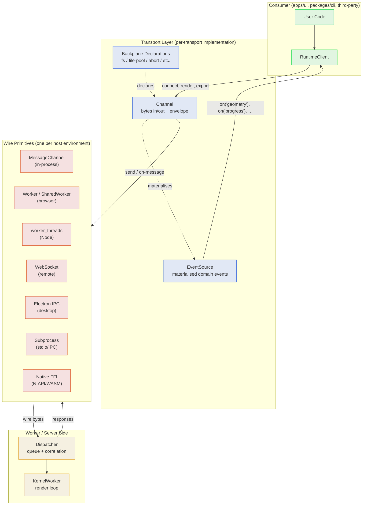
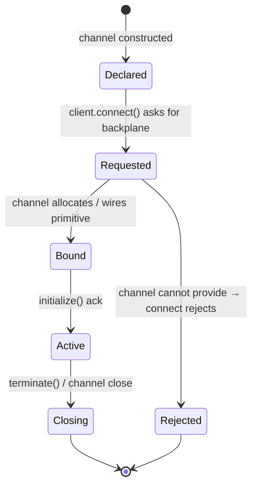
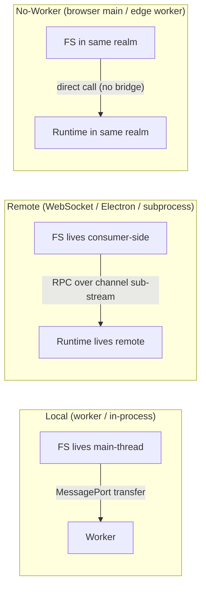
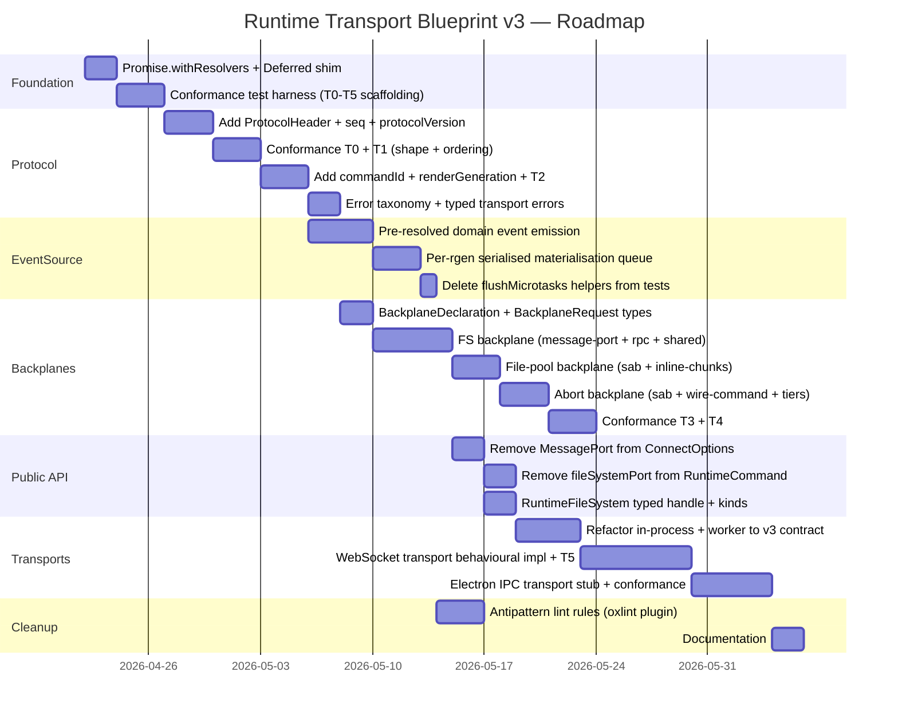

# Runtime Transport Blueprint v3 (Architecture Target)

Target architecture blueprint for a transport-agnostic Tau runtime. Synthesises v1 (eigenquestion + async smells) and v2 (adversarial protocol/topology gaps), adds an adversarial self-review of v2, defines the layered contract with mermaid diagrams, and surfaces open questions for design discussion.

## Executive Summary

v1 named the eigenquestion ("who owns wire→domain materialisation?") and recommended pre-resolved domain events. v2 raised the bar by showing that `MessagePort` couples the protocol — not just the public API — and that ordering, correlation, and backplane abstraction need explicit contracts.

This v3 blueprint:

- **Adversarially reviews v2** and reclassifies one finding (dispatcher concurrency) as overplayed, simplifies "negotiation" to "declaration", and downgrades the speculative `streamId`.
- **Reframes the layering** from v2's three layers into a cleaner **Channel + EventSource + Backplanes-as-channel-properties** model.
- **Specifies the protocol contract** end-to-end (commands, events, correlation, lifecycle, versioning, errors).
- **Defines a hosting model matrix** so "run anywhere" is concrete: which environments, which primitives, which backplanes are available.
- **Pins open questions** for discussion before implementation begins.

All Tier 1 (Q1–Q4) and Tier 2 (Q5–Q10) questions are now decided; Tier 3 (Q11–Q15) is deferred until WebSocket/Electron transport implementation begins. See the [Decisions](#decisions) section. The architecture sections that follow have been updated to reflect those choices.

## Table of Contents

- [Adversarial Self-Review of v2](#adversarial-self-review-of-v2)
- [New Holes Found in Own Planning](#new-holes-found-in-own-planning)
- [Target Architecture](#target-architecture)
- [Layered Contract](#layered-contract)
- [Protocol Specification](#protocol-specification)
- [Backplane Specification](#backplane-specification)
- [Hosting Model Matrix](#hosting-model-matrix)
- [Conformance Tiers](#conformance-tiers)
- [Decisions](#decisions)
- [Roadmap](#roadmap)
- [References](#references)

## Adversarial Self-Review of v2

### v2 findings re-evaluated

| v2 finding                                               | Verdict                 | Rationale                                                                                                                                                                                                                                       |
| -------------------------------------------------------- | ----------------------- | ----------------------------------------------------------------------------------------------------------------------------------------------------------------------------------------------------------------------------------------------- |
| F1 — `MessagePort` coupling at protocol layer            | **Valid, central**      | `RuntimeCommand.initialize.fileSystemPort?: MessagePort` confirmed in `runtime-protocol.types.ts`. Removing it from `ConnectOptions` alone is insufficient.                                                                                     |
| F2 — Single-flight slot correlation, not requestId-based | **Valid**               | Confirmed in `RuntimeWorkerClient.handleMessage`: switches on type, not requestId. Autonomous responses send blank `requestId`.                                                                                                                 |
| F3 — Async materialisation needs ordering                | **Valid**               | Confirmed via current client-side IIFE behaviour: `void (async () => { … emitGeometry(resolved); })()` already breaks "events fire in worker emit order" if microtask interleaving occurs.                                                      |
| F4 — Worker dispatcher concurrency under-specified       | **Overplayed**          | MessagePort dispatch IS serial up to first `await`; the only real risk is _async work_ interleaving. Today this is mitigated by single-flight slots + `renderGeneration`. Reframe as "explicit queue contract needed when adding multi-flight". |
| F5 — WebSocket transport is shape-stub only              | **Valid, low severity** | Documentation/release-comm concern more than architecture.                                                                                                                                                                                      |

### v2 architectural recommendations re-evaluated

| v2 recommendation                                          | Verdict                     | Adjustment                                                                                                                                                                                                        |
| ---------------------------------------------------------- | --------------------------- | ----------------------------------------------------------------------------------------------------------------------------------------------------------------------------------------------------------------- |
| Three-layer topology (Channel / Materializer / Backplanes) | **Refactor**                | Backplanes are not a peer layer — they are _channel properties_ declared by the transport. Collapse to two layers: `Channel` + `EventSource`, with `Backplanes` as channel metadata.                              |
| Backplane "negotiation"                                    | **Simplify to declaration** | True negotiation (handshake) adds complexity without current evidence of need. Each transport _declares_ which backplanes it supports; the runtime client _requests_ what it needs and fails fast if unsupported. |
| `commandId` + `renderGeneration` + `streamId`              | **Trim `streamId`**         | `commandId` and `renderGeneration` are well-justified; `streamId` is speculative — no consumer multiplexes geometry units across one transport today. Mark `streamId` as OQ.                                      |
| Replace `Transferable[]` with envelope                     | **Valid, expand**           | Envelope must define behaviour for transports that _cannot_ transfer (clone-only) and transports that need _binary frames_ (WebSocket). Add explicit fallback semantics.                                          |
| Behavioural conformance suite                              | **Valid, central**          | Move to a conformance-tier model (T0 shape, T1 ordering, T2 correlation, T3 abort parity, T4 backplanes).                                                                                                         |

### What v2 missed

These are not errors in v2; they are scope gaps that v3 closes.

1. **Filesystem topology inversion for remote transports.** Today FS lives on the main thread; worker proxies via MessagePort. For a remote runtime, FS still lives at the consumer (their repo), but the runtime is across a network — every FS read becomes a round-trip. The bridge must be RPC-shaped, not transfer-shaped.
2. **Stream multiplexing.** A single wire channel must carry: commands, events, FS RPC, log batches, telemetry, abort signals. Each needs independent backpressure and (potentially) independent ordering guarantees.
3. **Versioning & capability discovery.** No `protocolVersion` field exists today. Remote transports will face client/server skew. Need version negotiation and a `transport.capabilities` declaration distinct from `client.capabilities` (kernels).
4. **Liveness & lifecycle.** No heartbeat, no reconnect semantics, no graceful-vs-abrupt-close distinction. In-process transports don't need these; remote transports demand them.
5. **Message size limits & chunking.** WebSocket has practical frame limits; GLB payloads can exceed them. Need a chunking sub-protocol or streaming primitive.
6. **Hosting model matrix.** v2 listed WebSocket and Electron IPC as future targets but didn't enumerate the full surface (SharedWorker, subprocess, edge worker, no-worker browser, etc.).
7. **Error taxonomy across transports.** Transport-layer errors (disconnect, timeout, framing) vs runtime errors (kernel issue) vs domain errors (geometry failure) need a typed hierarchy.
8. **Render-loop ownership.** The kernel worker today owns an autonomous render loop. Where does this loop run when the runtime has no worker (browser main thread, edge worker)? Can it run when a remote runtime serves multiple clients?

## New Holes Found in Own Planning

Adversarial self-review uncovered the following holes in v1 + v2:

- **Cooperative abort semantics across transports.** SAB-based abort is ~1 ns per WASM call (`cooperative-abort.ts`). Wire-format abort is queue-based and only checked between operations. The latency gap is enormous (microseconds vs milliseconds-to-seconds) and may surprise consumers. v3 must classify this as a transport-tier capability.
- **Worker bootstrapping divergence.** `kernel-runtime-worker.ts` uses a top-level `void (async () => {…})()` IIFE for worker self-bootstrap, justified by Rolldown CJS constraints. This is structurally separate from the smells we're fixing in `runtime-client.ts` but uses identical syntax — worth calling out so the policy guidance doesn't accidentally claim 100% IIFE elimination is achievable. Some boundaries (worker entrypoints) legitimately need IIFE.
- **Backplane lifecycle.** When does a backplane bind/unbind? With `transport.close()`? With `connect()` replacement? With a kernel switch? Currently implicit; remote transports can't tolerate that.
- **Re-entrancy.** A domain event handler may call `client.openFile()`, which sends a new command. If the EventSource is mid-emit (serialised queue), does the new command queue or fire immediately? Today: fires immediately. Tomorrow with backplanes: needs explicit policy.
- **Auth/identity.** Local transports inherit the host process's identity. Remote transports need an authentication primitive — but the runtime client should not have to know. This belongs in the transport layer with a typed declaration.
- **Testing primitives.** v2 mentioned conformance, but v3 needs to enumerate the _test transport_ shapes (loopback, fake clock, packet-loss simulator) so behavioural conformance is achievable in CI without spinning real workers/servers.

## Target Architecture

The target architecture adopts a **two-layer transport model** with **backplanes as declared channel properties**, **explicit protocol versioning**, and a **conformance-tiered transport ecosystem**.

### Component diagram



### Layer responsibilities

| Layer                            | Owns                                                                                                           | Knows about                                             | Does not know                               |
| -------------------------------- | -------------------------------------------------------------------------------------------------------------- | ------------------------------------------------------- | ------------------------------------------- |
| **RuntimeClient**                | Lifecycle (connect/render/export/terminate), event subscription, capability querying                           | EventSource subscription, Channel send                  | Wire primitives, materialisation steps, SAB |
| **EventSource**                  | Domain event emission, ordering invariants, async materialisation queue                                        | Channel `onMessage`, materialisation logic              | Public API surface, kernel internals        |
| **Channel**                      | Wire bytes in/out, attachment envelope, backplane declarations, capabilities, lifecycle (open/close/heartbeat) | Wire primitive, transport tier                          | Domain events, kernel state                 |
| **Backplane** (channel property) | One side-channel concern (FS RPC, file pool, abort signal)                                                     | Its own primitive (MessagePort, RPC, SAB, wire command) | Other backplanes, channel internals         |
| **Dispatcher** (worker side)     | Command queue, correlation, response emission, FS bridge serving                                               | Channel API on the worker side                          | Consumer-side state                         |
| **KernelWorker**                 | Render loop, geometry generation, autonomous re-renders                                                        | Dispatcher events, FS proxy                             | Channel/transport identity                  |

## Layered Contract

### Public API (RuntimeClient)

```typescript
type RuntimeClient = {
  // Lifecycle (Q8/A — sync abrupt + async graceful)
  connect(options: ConnectOptions): Promise<void>;
  terminate(): void; // sync, abrupt
  shutdown(options?: { drain?: boolean }): Promise<void>; // async, graceful
  readonly lifecycleState: RuntimeLifecycleState;

  // Render / export (unchanged from today's discriminated outcomes)
  openFile(input): Promise<RenderOutcome>;
  updateParameters(params): Promise<RenderOutcome>;
  setOptions(opts): Promise<RenderOutcome>;
  export(format, input?): Promise<ExportResult>;

  // Subscriptions (sync handlers; payloads pre-materialised by the transport)
  on<E extends DomainEvent>(event: E, handler: DomainHandler<E>): Unsubscribe;

  // Capabilities — single rolled-up surface (Q5/C, Q10/B)
  readonly capabilities: RuntimeCapabilities;
};

type RuntimeCapabilities = {
  // Kernel-derived (existing today)
  readonly routes: readonly ExportRoute[];
  readonly kernels: readonly KernelCapability[];
  // ...existing kernel manifest fields

  // Transport-derived
  readonly autonomousRenderLoop: boolean; // Q5/C — false on no-worker hosting
  readonly transport: {
    readonly descriptor: TransportDescriptor;
    readonly protocolVersion: number; // Q6/A — monotonic integer
    readonly backplanes: {
      // Q10/B — declared vs bound
      readonly declared: readonly BackplaneDeclaration[];
      readonly bound: readonly BackplaneDeclaration[];
    };
  };
};

// Q1/A — typed handle, never a wire primitive
type RuntimeFileSystem =
  | { kind: 'inline'; fs: RuntimeFileSystemBase } // direct JS instance (in-process / no-worker)
  | { kind: 'channel'; channel: ChannelHandle } // wraps MessagePort / MessagePortMain (worker / Electron renderer)
  | { kind: 'rpc'; rpc: FsRpcHandle }; // remote (WebSocket / Electron-IPC / FFI)

type ConnectOptions = {
  fileSystem: RuntimeFileSystem;
  filePool?: FilePoolHandle; // opaque
};
```

### Channel contract

```typescript
type RuntimeChannel = {
  // Bidirectional bytes
  send(message: ProtocolMessage, attachments?: ChannelAttachments): void;
  onMessage(handler: (message: ProtocolMessage) => void): Unsubscribe;

  // Lifecycle
  open(): Promise<void>;
  close(reason?: 'graceful' | 'abrupt'): void;
  onClose(handler: (reason: CloseReason) => void): Unsubscribe;

  // Liveness (remote transports only — local transports return constant healthy)
  readonly health: ChannelHealth;
  onHealthChange(handler: (h: ChannelHealth) => void): Unsubscribe;

  // Declarations
  readonly capabilities: TransportCapabilities;
  readonly backplanes: ReadonlyArray<BackplaneDeclaration>;
  readonly descriptor: TransportDescriptor;
};

type ChannelAttachments = {
  transferables?: Transferable[]; // local transports
  binaries?: Uint8Array[]; // remote transports (WebSocket binary frames)
  ports?: BackplaneRef[]; // typed backplane references
};
```

### EventSource contract

```typescript
type RuntimeEventSource = {
  on<E extends DomainEvent>(event: E, handler: DomainHandler<E>): Unsubscribe;

  // Test/inspection-only — intentionally sparse
  readonly _internals?: { queueDepth: number; lastEmitTimestamp: number };
};

// Event taxonomy with ordering tiers
type DomainEvent =
  | 'state' // ordered-control
  | 'progress' // ordered-control
  | 'parameters' // ordered-control
  | 'geometry' // ordered-control (terminal for render)
  | 'export' // ordered-control (terminal for export)
  | 'error' // ordered-control (terminal)
  | 'capabilities' // ordered-control
  | 'kernelChange' // ordered-control
  | 'log' // observability (best-effort, batched)
  | 'telemetry' // observability (best-effort, batched)
  | 'health'; // observability (transport)
```

## Protocol Specification

### Message envelope

Every wire message carries a small typed header so downstream layers can correlate, version, and sequence without re-parsing payloads.

```typescript
type ProtocolHeader = {
  v: 1; // protocolVersion (literal, bumped on breaking change)
  cid?: string; // commandId — set on commands and matched on responses
  rgen?: number; // renderGeneration — set on autonomous render-loop events
  seq: number; // monotonic per-channel sequence number for ordering audits
};

type ProtocolMessage = ProtocolHeader & (RuntimeCommand | RuntimeResponse);
```

### Commands

Commands collapse the current ad-hoc set into a uniform shape. Every command has `cid`; autonomous-mutation commands (`openFile`, `updateParameters`, `setOptions`) keep their fire-and-forget semantics but become observable via the next render-loop event carrying a fresh `rgen`.

```typescript
type RuntimeCommand =
  | { type: 'initialize'; opts: InitOptions; backplanes: BackplaneRequest[]; protocolVersion: 1 }
  | { type: 'render'; file: GeometryFile; params: ParamMap; opts?: RenderOptions }
  | { type: 'openFile'; file: GeometryFile; params: ParamMap; opts?: RenderOptions }
  | { type: 'updateParameters'; params: ParamMap }
  | { type: 'setOptions'; opts: RenderOptions }
  | { type: 'export'; format: FileExtension; opts?: ExportOptions }
  | { type: 'fileChanged'; paths: string[] }
  | { type: 'abort'; reason: AbortReason }
  | { type: 'configureMiddleware'; entries: MiddlewareRegistrations }
  | { type: 'cleanup' }
  | { type: 'ping' }; // liveness
```

### Responses & events

```typescript
type RuntimeResponse =
  | { type: 'initialized'; capabilities: CapabilitiesManifest; transportCapabilities: TransportCapabilities }
  | { type: 'rendered'; result: HashedGeometryResultTransport } // command-response (matches cid)
  | { type: 'exported'; result: ExportGeometryResultTransport } // command-response (matches cid)
  | { type: 'state'; state: WorkerState; detail?: string } // ordered event
  | { type: 'progress'; phase: RenderPhase; detail?: object } // ordered event
  | { type: 'parameters'; result: GetParametersResult } // ordered event
  | { type: 'geometry'; result: HashedGeometryResultTransport } // autonomous event
  | { type: 'capabilities'; capabilities: CapabilitiesManifest }
  | { type: 'kernelChange'; kernelId?: string }
  | { type: 'log'; entries: LogEntry[] } // observability (batched)
  | { type: 'telemetry'; entries: TelemetryEntry[] } // observability
  | { type: 'error'; issues: KernelIssue[] }
  | { type: 'pong' }; // liveness
```

### Correlation

| Message family                                                                              | Correlation                                                                               |
| ------------------------------------------------------------------------------------------- | ----------------------------------------------------------------------------------------- |
| Initialize, render (explicit), export, ping                                                 | `cid` — sender allocates, receiver echoes                                                 |
| Autonomous events (`geometry`, `parameters`, `progress`, `state`, `error` from render loop) | `rgen` — render generation set by worker after `openFile`/`updateParameters`/`setOptions` |
| Observability (`log`, `telemetry`)                                                          | none required; sequence number `seq` for diagnostics only                                 |

### Ordering invariants

1. **Per-channel `seq` is monotonic.** Receiver may assert; gaps indicate transport corruption.
2. **Ordered-control events for one `rgen` arrive in worker emit order.** EventSource serialises async materialisation per-`rgen`.
3. **Ordered-control events for `rgen` N+1 may overtake observability events for `rgen` N.** Observability has lower priority.
4. **Terminal events (`geometry`, `error`) for an `rgen` are last for that `rgen`.** No further events bear the same `rgen` after a terminal.
5. **Cross-channel ordering is undefined.** Multiple channels (e.g., command vs FS-RPC) have independent sequences.

### Versioning

- `initialize.protocolVersion: 1` is sent by the client; worker `initialized` response echoes its `capabilities.transport.protocolVersion`. Mismatch → `TransportProtocolVersionError`. No silent down-shifting.
- Bumping the version is a breaking change to the wire protocol (Q6/A — monotonic integer). Local transports always travel together; remote transports must coordinate version pinning.

### Errors

```typescript
type RuntimeError =
  // Channel/transport
  | TransportClosedError
  | TransportCapabilityError
  | TransportProtocolVersionError
  | TransportTimeoutError
  | TransportFramingError
  // Backplane
  | BackplaneUnavailableError
  | BackplaneRpcError
  // Runtime
  | RuntimeNotConnectedError
  | RuntimeTerminatedError
  | RuntimeReconnectError
  | RenderTimeoutError;
// Kernel/domain (issues, not throws — already discriminated outcome shape)
```

## Backplane Specification

### Concept

A **backplane** is a typed side-channel concern that one or more transports may support. The runtime client requests backplanes by capability, the channel either provides them or rejects connect with `BackplaneUnavailableError`.

Backplanes are **declared by the channel**, **requested by the client**, and **bound at `connect()` time**. They are not negotiated dynamically.

### Backplane catalogue

```typescript
type BackplaneDeclaration =
  | { kind: 'filesystem'; bindings: ReadonlyArray<'message-port' | 'rpc' | 'shared-memory'> }
  | { kind: 'file-pool'; bindings: ReadonlyArray<'sab' | 'inline-chunks'> }
  | { kind: 'abort'; bindings: ReadonlyArray<'sab' | 'wire-command'>; latency: 'sub-microsecond' | 'queue-bound' }
  | { kind: 'log-stream'; bindings: ReadonlyArray<'inline' | 'sub-channel'> }
  | { kind: 'telemetry'; bindings: ReadonlyArray<'inline' | 'sub-channel' | 'opentelemetry'> };
```

### Binding lifecycle



### FS backplane: topology cases



The FS backplane abstraction must cover all three. The `'message-port'` binding is local-only; `'rpc'` is remote; `'shared-memory'` is an optimisation (file pool SAB) that some transports overlay.

### Abort backplane: latency tiers

| Binding        | Worst-case latency               | Mechanism                    |
| -------------- | -------------------------------- | ---------------------------- |
| `sab`          | sub-microsecond                  | `Atomics.load` per WASM call |
| `wire-command` | queue-bound (typically 1–100 ms) | Next message dispatch        |

Consumers are not expected to choose; the channel exposes `latency` so UI/timeout logic can adapt (e.g., a longer render-timeout on remote transports).

## Hosting Model Matrix

What it means to "run anywhere": each row is a deployment topology, each column a primitive availability.

| Hosting                         | Wire primitive                | SAB                 | Transferable        | FS backplane           | Abort tier             | Render loop             |
| ------------------------------- | ----------------------------- | ------------------- | ------------------- | ---------------------- | ---------------------- | ----------------------- |
| Browser main thread (no worker) | direct call                   | n/a                 | n/a                 | direct                 | sub-microsecond (sync) | shared with UI thread   |
| Browser DedicatedWorker         | `Worker` postMessage          | yes (COOP/COEP)     | yes                 | message-port           | sub-microsecond (SAB)  | dedicated               |
| Browser SharedWorker            | `SharedWorker` postMessage    | conditional         | yes                 | message-port           | sub-microsecond (SAB)  | shared across tabs      |
| Browser ServiceWorker           | `Client.postMessage`          | no                  | yes                 | message-port (limited) | wire-command           | dedicated, ephemeral    |
| Edge worker (Cloudflare/Deno)   | wire (HTTP/WS)                | no                  | no                  | rpc                    | wire-command           | per-request             |
| Node main thread (CLI)          | direct call                   | n/a                 | n/a                 | direct                 | sub-microsecond (sync) | shared                  |
| Node `worker_threads`           | `parentPort.postMessage`      | yes                 | yes                 | message-port           | sub-microsecond (SAB)  | dedicated               |
| Node child_process              | stdio / IPC                   | no                  | no (cross-process)  | rpc                    | wire-command           | dedicated               |
| Electron renderer               | `Worker` or `MessagePortMain` | yes (renderer-only) | yes                 | message-port           | sub-microsecond (SAB)  | dedicated               |
| Electron main process           | `MessagePortMain` / `ipcMain` | no (cross-process)  | yes (cross-process) | rpc / message-port     | wire-command           | dedicated               |
| Electron utility process        | `MessagePortMain`             | no                  | yes                 | rpc                    | wire-command           | dedicated               |
| Remote server (WebSocket)       | `WebSocket` frames            | no                  | no                  | rpc                    | wire-command           | dedicated, multi-tenant |
| Remote server (gRPC stream)     | bidirectional stream          | no                  | no                  | rpc                    | wire-command           | dedicated, multi-tenant |
| Native FFI (Tauri / N-API)      | callback / queue              | possible            | n/a                 | rpc                    | wire-command or sync   | depends                 |

The right column ("render loop") is intentionally a separate concern from the transport — exposed at `client.capabilities.autonomousRenderLoop` (see [Q5 decision](#q5-oq-7-decision-capability-gated-under-top-level-capabilities-c-refined)). No-worker rows report `autonomousRenderLoop: false`; consumers there drive the runtime via explicit `await client.render(input)` calls.

## Conformance Tiers

A transport is conformant at a tier when it passes all tests at that tier and below.

| Tier | Name         | Tests                                                                                                                          |
| ---- | ------------ | ------------------------------------------------------------------------------------------------------------------------------ |
| T0   | Shape        | Implements every method of `RuntimeChannel`; declarations parseable; descriptor present.                                       |
| T1   | Ordering     | Per-channel `seq` monotonic; ordered-control events for one `rgen` preserve worker emit order; terminal events truly terminal. |
| T2   | Correlation  | `cid` round-trips on commands; `rgen` matches across autonomous events.                                                        |
| T3   | Abort parity | Both abort latency tiers behave per spec; abort generation monotonic; no double-fire.                                          |
| T4   | Backplanes   | Each declared backplane binds, serves, and unbinds cleanly across `connect`/`terminate`.                                       |
| T5   | Liveness     | (Remote only) heartbeat + reconnect semantics behave per spec.                                                                 |

`createInProcessTransport` and `createWorkerTransport` should reach T4. `createWebSocketTransport` should reach T5.

## Decisions

All Tier 1 (Q1–Q4) and Tier 2 (Q5–Q10) questions are resolved as of 2026-04-22. Tier 3 (Q11–Q15) is deferred until WebSocket/Electron transport implementation begins. The architecture sections above have been updated to reflect these choices.

### Status

| ID          | Question                                                     | Decision                                                                                                                    | Status            |
| ----------- | ------------------------------------------------------------ | --------------------------------------------------------------------------------------------------------------------------- | ----------------- |
| Q1 (OQ-1)   | `RuntimeFileSystem` handle shape                             | A — Single discriminated union (`inline` / `channel` / `rpc`)                                                               | Resolved          |
| Q2 (OQ-12)  | Re-entrancy when an event handler calls back into the client | A — Fire immediately (today's behaviour)                                                                                    | Resolved          |
| Q3 (OQ-11)  | How tests await the transport instead of `flushMicrotasks`   | B — `pushResponse(...)` returns `Promise<void>` from the transport                                                          | Resolved          |
| Q4 (OQ-8)   | `Promise.withResolvers()` adoption                           | A — Use native directly                                                                                                     | Resolved          |
| Q5 (OQ-7)   | Render loop in no-worker hosting                             | C (refined) — Capability-gated, exposed at top-level `capabilities.autonomousRenderLoop`                                    | Resolved          |
| Q6 (OQ-9)   | Versioning scheme                                            | A — Monotonic integer (`v: 1`)                                                                                              | Resolved          |
| Q7 (OQ-14)  | Dispatcher queue                                             | B — Explicit per-channel command queue                                                                                      | Resolved          |
| Q8 (OQ-13)  | `terminate()` sync vs async                                  | A — Sync `terminate()` + separate `shutdown({ drain })`                                                                     | Resolved          |
| Q9 (OQ-3)   | Observability sub-channels                                   | B (phased) — Single channel for current browser-based iteration; sub-channel split as future iteration when WebSocket lands | Resolved (phased) |
| Q10 (OQ-10) | Backplane discovery                                          | B (refined) — Declared vs bound, exposed at `capabilities.transport.backplanes`                                             | Resolved          |
| Q11 (OQ-2)  | `streamId` for stream multiplexing                           | Deferred — re-evaluate if/when multi-tenant or collaborative scenarios land                                                 | Deferred          |
| Q12 (OQ-4)  | FS RPC chunking                                              | Deferred — pin during WebSocket transport implementation                                                                    | Deferred          |
| Q13 (OQ-5)  | Heartbeat / reconnect                                        | Deferred — pin during WebSocket transport implementation                                                                    | Deferred          |
| Q14 (OQ-6)  | Auth model for remote transports                             | Deferred — pin during WebSocket transport implementation                                                                    | Deferred          |
| Q15 (OQ-15) | In-flight outcomes on disconnect                             | Deferred — `RenderOutcome` shape already supports supersession; concrete behaviour pinned per remote transport              | Deferred          |

### Q1 (OQ-1) Decision: Single discriminated union (A)

`RuntimeFileSystem` is a discriminated union with three kinds:

- `{ kind: 'inline'; fs: RuntimeFileSystemBase }` — direct JS instance (in-process / no-worker).
- `{ kind: 'channel'; channel: ChannelHandle }` — wraps `MessagePort` / `MessagePortMain` (worker / Electron renderer).
- `{ kind: 'rpc'; rpc: FsRpcHandle }` — remote (WebSocket / Electron-IPC / FFI).

Each transport's `connect()` accepts only the kinds it can bind and rejects the rest with a typed `BackplaneUnavailableError`. The shape mirrors today's two-arm `fileSystem | port` form so migration is mechanical, uses the project's idiomatic discriminated-union pattern (matches `RenderOutcome`, `FileContentResult`, `defineKernel` plugin manifests), and is purely additive — adding a future binding (e.g., `kind: 'shared-memory-direct'` for a zero-copy FS) is non-breaking.

### Q2 (OQ-12) Decision: Fire immediately (A)

A `client.on('geometry', h)` handler that calls `client.openFile()` (or any other client method) sends the new command immediately, mid-emit. This matches today's behaviour, supports the dominant XState pattern in `apps/ui` ("on geometry settled, schedule the next file"), and avoids the deadlock surface that queueing introduces (`await client.openFile()` inside a handler would queue behind the handler awaiting it). The single-flight `pendingRender` slot already supersedes the in-flight outcome correctly via the discriminated `RenderOutcome` shape — no additional ordering machinery required.

### Q3 (OQ-11) Decision: Promise-returning intake (B)

The transport's `pushResponse(...)` (test-facing) and inbound message handler (production) return `Promise<void>` that resolves only after materialisation completes and the corresponding domain event has been emitted. Tests rewrite from `pushResponse(x); await flushMicrotasks(); expect(...)` to `await pushResponse(x); expect(...)`. The `flushMicrotasks` helpers in `runtime-client.test.ts` and `kernel-worker.test.ts` are deleted as confirmation that the v1 contract is repaired. An `_internals.flush()` escape hatch is **not** part of the surface unless a future test fixture genuinely cannot drive through `pushResponse`.

### Q4 (OQ-8) Decision: Use `Promise.withResolvers()` directly (A)

Workspace `engines.node >= 24.0.0` (root `package.json`) and every supported browser ship `Promise.withResolvers` natively (TC39 Stage 4, 2024). No re-export shim, no inline manual deferred — direct native use at every site that needs the Deferred pattern (currently `connect()`, the `pendingRender` slot, and the `pendingExports` slot inside `runtime-client.ts`). This eliminates the v1 `connect()` IIFE smell and removes the existing `oxlint-disable @typescript-eslint/promise-function-async` suppression.

### Q5 (OQ-7) Decision: Capability-gated under top-level `capabilities` (C, refined)

The autonomous render loop is exposed at `client.capabilities.autonomousRenderLoop: boolean` — top-level on the existing rolled-up `capabilities` surface, not under a separate `transportCapabilities` object. Worker hosting reports `true` (today's behaviour); no-worker hosting (browser main thread, edge worker, etc.) reports `false`, in which case `openFile`/`updateParameters`/`setOptions` are unsupported and consumers drive the runtime via explicit `await client.render(input)` calls.

**Clarifying note on rejected option B**: an earlier framing characterised the autonomous loop as "the runtime's parameter debouncer". That was inaccurate. Parameter-update debouncing is a UI-layer concern — handled by the UI's own debouncer (e.g., the slider/input components in `apps/ui`). The runtime's loop has its own debounce only as **defense-in-depth** against rogue/non-UI callers. The actual reason no-worker hosting cannot run the loop on the UI thread is the WASM render duration itself (100 ms–2 s per frame for non-trivial models) — that freeze is independent of debounce frequency, which is why running the loop on the main thread is unacceptable.

### Q6 (OQ-9) Decision: Monotonic integer (A)

`ProtocolHeader.v: 1` is a literal integer, bumped on any breaking wire change. Integer comparison is one CPU instruction; trivially serialisable in any wire format; trivially logged in every frame for forensic debugging. Semver (B) implies backward compatibility we don't owe and forces consumers to reason about minor/patch on a wire format. Capability negotiation alone (C) cannot describe its own evolution — it presupposes a stable envelope shape, which is what `v:` defines.

### Q7 (OQ-14) Decision: Explicit per-channel command queue (B)

The dispatcher serialises command processing per channel: command N+1's wire delivery is held until command N's handler Promise resolves. Cost is one `await` per command on a channel that already serialised wire delivery — typically zero or one microtask. Payoff is reproducible ordering tests at T2 conformance and elimination of "works on Node 24, breaks on Bun" event-loop scheduling bugs. Implementation is one `Promise<void>` field on the dispatcher.

### Q8 (OQ-13) Decision: Sync `terminate()` + separate `shutdown({ drain })` (A)

`terminate()` stays synchronous and fire-and-forget — matches today's call sites in `apps/ui`, `apps/cli`, and `runtime-worker-client.terminate()`, all of which run from React `useEffect` cleanup, signal handlers, and other non-await contexts. A new `await client.shutdown({ drain: true })` method handles graceful drain semantics (in-flight render, pending logs, unflushed telemetry) for callers that can await. Two methods, two intentions; no overloading.

### Q9 (OQ-3) Decision: Phased — single channel now, sub-channel split as future iteration (B target, A initial)

The architectural target is option B: same channel for local transports, separate sub-channel for observability on remote transports (where head-of-line blocking is real). For the **initial iteration** — which targets the existing browser-worker setup — we ship the simpler single-channel shape (option A behaviour). The sub-channel split is revisited as part of WebSocket transport implementation, when remote-transport backpressure becomes a real consumer concern. The protocol envelope's `v:` field gives us the freedom to evolve into B without breaking earlier consumers.

### Q10 (OQ-10) Decision: Declared vs bound under `capabilities.transport` (B, refined)

Backplane bindings are exposed at `client.capabilities.transport.backplanes.{declared, bound}` — under the same top-level `capabilities` surface as kernel info and `autonomousRenderLoop` (Q5/C). No separate top-level `transportCapabilities` property. Diagnostic overlays can show "supported but not used" by diffing the two arrays; conformance tests assert declared shape at T0 and bound behaviour at T4.

### Deferred (Q11–Q15)

Q11 (`streamId`), Q12 (FS RPC chunking), Q13 (heartbeat/reconnect), Q14 (auth model), and Q15 (in-flight outcomes on disconnect) are deferred until WebSocket or Electron transport implementation begins. The protocol envelope's `v:` versioning (Q6/A) lets us evolve into any of them without breaking earlier consumers, so deferral does not lock in a wrong shape — it just defers concrete decisions to the implementation context where they become real.

Decision criteria for when each deferred item becomes active:

- **Q11**: re-evaluate if/when collaborative editing or shared-server multi-tenant lands.
- **Q12, Q13, Q14**: pin during the WebSocket transport's first behavioural-conformance milestone (T5).
- **Q15**: pin during the same milestone; baseline expectation is that the existing `RenderOutcome` discriminated shape (`{ superseded: true } | { superseded: false; geometry }`) handles disconnect-as-supersession naturally.

## Roadmap

This is a sequenced, independently-shippable plan. Each step gates on its predecessor's tests passing.



## References

- Predecessor: [`runtime-async-event-contract.md`](./runtime-async-event-contract.md) (v1)
- Predecessor: [`runtime-async-event-contract-v2.md`](./runtime-async-event-contract-v2.md) (v2)
- Out-of-scope smells: [`runtime-smells-outside-async-transport-scope.md`](./runtime-smells-outside-async-transport-scope.md)
- Policy: [`library-api-policy.md`](../policy/library-api-policy.md)
- Source — protocol: `packages/runtime/src/types/runtime-protocol.types.ts`
- Source — client: `packages/runtime/src/client/runtime-client.ts`
- Source — worker bridge: `packages/runtime/src/framework/runtime-worker-client.ts`
- Source — dispatcher: `packages/runtime/src/framework/runtime-worker-dispatcher.ts`
- Source — transports: `packages/runtime/src/transport/{in-process,worker,websocket}-transport.ts`
- Source — message adapter: `packages/runtime/src/framework/runtime-message-adapter.ts`
- Source — FS bridge: `packages/runtime/src/framework/runtime-filesystem-bridge.ts`
- Source — cooperative abort: `packages/runtime/src/framework/cooperative-abort.ts`
- External: [`Promise.withResolvers()`](https://developer.mozilla.org/en-US/docs/Web/JavaScript/Reference/Global_Objects/Promise/withResolvers)
- External: [Electron `MessagePortMain`](https://www.electronjs.org/docs/latest/api/message-port-main)
