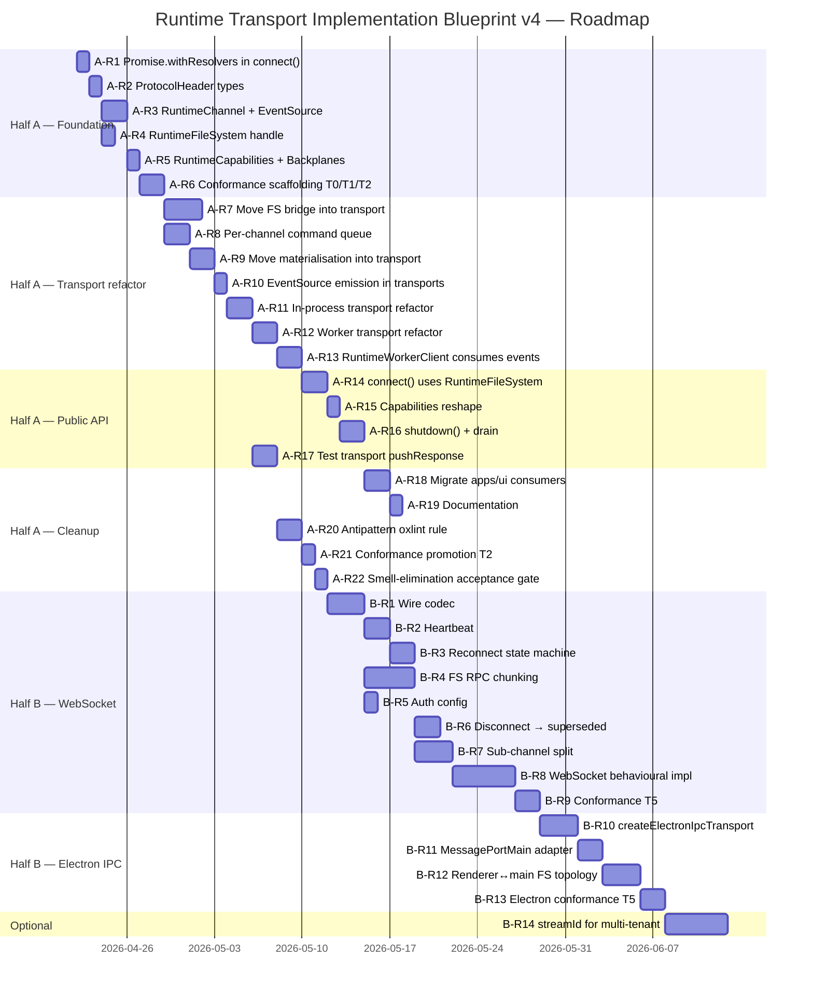

# Runtime Transport Implementation Blueprint v4

Numbered, chronological implementation plan that turns the v3 architecture decisions into shippable work. Split into two strictly self-contained halves: **Half A** remedies all v1 smells against the existing browser-worker topology; **Half B** adds WebSocket and Electron IPC transports without revisiting Half A.

## Executive Summary

v1 named four smells (`void` IIFEs, `flushMicrotasks` test drains, `new Promise() + IIFE` in `connect()`, `MessagePort` in `ConnectOptions`) plus a fifth concealed in the protocol layer (`RuntimeCommand.initialize.fileSystemPort`). v2 surfaced ordering/correlation/backplane gaps. v3 ratified Tier 1+2 decisions (Q1–Q10) and deferred Tier 3 (Q11–Q15) until remote transports ship.

This v4 doc converts those decisions into 22 Half A requirements (immediate worker-based work) and 14 Half B requirements (future remote/desktop work). Each requirement carries source-file changes, comprehensive test coverage, and explicit dependencies. The two halves are **strictly self-contained**: Half A ships without any Half B dependency; Half B builds on Half A's contracts without re-opening any decision.

## Table of Contents

- [Scope and Non-Goals](#scope-and-non-goals)
- [Source File Inventory](#source-file-inventory)
- [Half A — Immediate Worker-Based Transport](#half-a--immediate-worker-based-transport)
- [Half B — Future Remote and Desktop Transports](#half-b--future-remote-and-desktop-transports)
- [Cross-Cutting Concerns](#cross-cutting-concerns)
- [Roadmap](#roadmap)
- [References](#references)

## Scope and Non-Goals

**In scope (Half A)**:

- Eliminate all four v1 smells against the existing browser-DedicatedWorker topology.
- Hide filesystem-port wiring as a transport-layer concern (no `fileSystemPort` in `RuntimeCommand.initialize` or `RuntimeWorkerClient.initialize`).
- Implement Tier 1 + Tier 2 decisions (Q1–Q10) for in-process and worker transports only.
- Conformance tiers T0 (shape), T1 (ordering), T2 (correlation) as the testing baseline.
- Refactor `apps/ui` consumers to the new contract.

**In scope (Half B)**:

- WebSocket transport (behavioural, not stub).
- Electron IPC transport (renderer↔main / `MessagePortMain`).
- Tier 3 decisions (Q11–Q15) pinned at implementation.
- Conformance tiers T3 (abort parity), T4 (backplanes), T5 (liveness).
- Sub-channel split for observability (Q9 phase 2).

**Out of scope** (both halves):

- Megamodule decomposition of `runtime-client.ts` (tracked in `runtime-smells-outside-async-transport-scope.md`).
- Other runtime smells (logging, type escape hatches, Zoo upstream workarounds).
- Multi-tenant or collaborative editing primitives (Q11 deferred indefinitely).

## Source File Inventory

### Half A — files that change

| File                                                          | Action               | Notes                                                                                                                            |
| ------------------------------------------------------------- | -------------------- | -------------------------------------------------------------------------------------------------------------------------------- |
| `packages/runtime/src/client/runtime-client.ts`               | Modified             | `connect()` Deferred refactor; capabilities reshape; `RuntimeFileSystem` handle; `shutdown()` added; remove materialisation IIFE |
| `packages/runtime/src/framework/runtime-worker-client.ts`     | Modified             | Remove `fileSystemPort` parameter from `initialize`; consume `events` instead of injected callbacks                              |
| `packages/runtime/src/framework/runtime-worker-dispatcher.ts` | Modified             | Per-channel command queue; consume new initialize payload; backplane unpacking                                                   |
| `packages/runtime/src/types/runtime-protocol.types.ts`        | Modified             | Remove `fileSystemPort` from `RuntimeCommand.initialize`; add `ProtocolHeader { v, cid?, rgen?, seq }`; add `BackplaneRequest`   |
| `packages/runtime/src/types/runtime.types.ts`                 | Modified             | `RuntimeCapabilities` rolled-up surface (kernel + transport)                                                                     |
| `packages/runtime/src/transport/runtime-transport.ts`         | Modified             | Becomes composite `{ channel, events, ... }`; `RuntimeChannel` + `RuntimeEventSource` carved out                                 |
| `packages/runtime/src/transport/in-process-transport.ts`      | Modified             | Owns FS bridge construction; emits materialised events; queue dispatcher                                                         |
| `packages/runtime/src/transport/worker-transport.ts`          | Modified             | Same as in-process; owns Worker construction                                                                                     |
| `packages/runtime/src/transport/websocket-transport.ts`       | Modified             | Conform to new shape (still stub for Half A)                                                                                     |
| `apps/ui/app/machines/cad.machine.ts`                         | Modified             | Replace `connect({ port, filePoolBuffer })` with `connect({ fileSystem: { kind: 'channel', channel } })`                         |
| `apps/ui/app/machines/kernel.integration.test.ts`             | Modified             | Same                                                                                                                             |
| `apps/ui/app/types/runtime-client.alias.ts`                   | Modified             | Mirror new connect/capabilities shape                                                                                            |
| `apps/ui/content/docs/(runtime)/concepts/worker-model.mdx`    | Modified             | Reflect new contract                                                                                                             |
| `docs/policy/library-api-policy.md`                           | Already updated (v1) | §22 antipattern section in place                                                                                                 |

### Half A — new files

| File                                                                              | Purpose                                                                       |
| --------------------------------------------------------------------------------- | ----------------------------------------------------------------------------- |
| `packages/runtime/src/transport/runtime-channel.ts`                               | `RuntimeChannel` interface + helpers                                          |
| `packages/runtime/src/transport/runtime-event-source.ts`                          | `RuntimeEventSource` interface + helpers                                      |
| `packages/runtime/src/transport/event-bus.ts`                                     | `createDomainEventBus()` — emit/subscribe primitives                          |
| `packages/runtime/src/transport/dispatcher-queue.ts`                              | Per-channel serialised command queue                                          |
| `packages/runtime/src/transport/test-transport.ts`                                | Loopback transport with `pushResponse(): Promise<void>` for behavioural tests |
| `packages/runtime/src/transport/backplanes.ts`                                    | `BackplaneDeclaration`, `BackplaneRequest`, `BackplaneBinding` types          |
| `packages/runtime/src/types/runtime-filesystem-handle.types.ts`                   | `RuntimeFileSystem` discriminated union, `ChannelHandle`, `FilePoolHandle`    |
| `packages/runtime/src/types/protocol-header.types.ts`                             | `ProtocolHeader { v, cid?, rgen?, seq }`                                      |
| `packages/runtime/src/transport/transport-conformance/tier-0-shape.test.ts`       | T0 conformance                                                                |
| `packages/runtime/src/transport/transport-conformance/tier-1-ordering.test.ts`    | T1 conformance                                                                |
| `packages/runtime/src/transport/transport-conformance/tier-2-correlation.test.ts` | T2 conformance                                                                |

### Half A — files deleted (post-refactor)

| File                                                                                                   | Reason                                  |
| ------------------------------------------------------------------------------------------------------ | --------------------------------------- |
| `flushMicrotasks` helper bodies in `packages/runtime/src/framework/kernel-worker.test.ts`              | Superseded by `await pushResponse(...)` |
| `flushMicrotasks` helper body in `packages/runtime/src/client/runtime-client.test.ts`                  | Superseded                              |
| `await Promise.resolve()` in `packages/runtime/src/client/runtime-client-terminate-invariants.test.ts` | Superseded                              |

### Half B — new files

| File                                                                               | Purpose                                    |
| ---------------------------------------------------------------------------------- | ------------------------------------------ |
| `packages/runtime/src/transport/electron-ipc-transport.ts`                         | Electron renderer↔main / `MessagePortMain` |
| `packages/runtime/src/transport/wire-codec.ts`                                     | Binary frame codec for remote transports   |
| `packages/runtime/src/transport/heartbeat.ts`                                      | Ping/pong liveness primitive               |
| `packages/runtime/src/transport/reconnect-state-machine.ts`                        | Reconnect with backoff                     |
| `packages/runtime/src/transport/fs-rpc-protocol.ts`                                | FS RPC sub-protocol with chunking          |
| `packages/runtime/src/transport/sub-channel.ts`                                    | Sub-channel multiplexer (Q9 phase 2)       |
| `packages/runtime/src/transport/transport-conformance/tier-3-abort-parity.test.ts` | T3 conformance                             |
| `packages/runtime/src/transport/transport-conformance/tier-4-backplanes.test.ts`   | T4 conformance                             |
| `packages/runtime/src/transport/transport-conformance/tier-5-liveness.test.ts`     | T5 conformance                             |
| `packages/runtime/src/transport/electron-ipc-transport.test.ts`                    | Electron transport behavioural tests       |
| `packages/runtime/src/transport/websocket-transport.behavioural.test.ts`           | Replaces stub                              |

## Half A — Immediate Worker-Based Transport

22 requirements. All work happens inside the existing browser-DedicatedWorker topology. No remote/Electron concerns leak in. Numbered chronologically — each requirement gates on its predecessors' tests passing.

### Foundation (A-R1 → A-R6)

#### A-R1 — Adopt `Promise.withResolvers()` for `connect()` Deferred pattern

**Decisions**: Q4 (use native directly).
**Smells fixed**: Smell 3 (manual `new Promise() + IIFE`).
**Source changes**:

- Modify `packages/runtime/src/client/runtime-client.ts` — `connect()` becomes `async function`; uses `Promise.withResolvers()` to capture `reject` for `terminate()` slot.
- Remove `oxlint-disable @typescript-eslint/promise-function-async` directive at the `connect()` site.

**Test coverage**:

| Test file                                                                          | Test cases (new or updated)                                                                                                                                                                                                                                                           |
| ---------------------------------------------------------------------------------- | ------------------------------------------------------------------------------------------------------------------------------------------------------------------------------------------------------------------------------------------------------------------------------------- |
| `packages/runtime/src/client/runtime-client-connect.test.ts` (modify)              | • `connect()` resolves the Deferred on success • Concurrent `terminate()` during in-flight `connect()` rejects with `RuntimeTerminatedError` (no leaked promise) • Reconnect with same options is idempotent • Reconnect with mismatched options rejects with `RuntimeReconnectError` |
| `packages/runtime/src/client/runtime-client-terminate-invariants.test.ts` (modify) | • Invariant 1 still passes without `await Promise.resolve()` drain                                                                                                                                                                                                                    |

**Dependencies**: none.
**Acceptance**: zero `void (async () => {…})()` in `connect()`; lint suppression removed; all existing connect tests pass.

#### A-R2 — Add `ProtocolHeader { v, cid?, rgen?, seq }` to wire types

**Decisions**: Q6 (monotonic integer versioning).
**Source changes**:

- New `packages/runtime/src/types/protocol-header.types.ts` exporting `ProtocolHeader`.
- Modify `packages/runtime/src/types/runtime-protocol.types.ts` to intersect every `RuntimeCommand` and `RuntimeResponse` with `ProtocolHeader`.

**Test coverage**:

| Test file                                                              | Test cases                                                                                                                                       |
| ---------------------------------------------------------------------- | ------------------------------------------------------------------------------------------------------------------------------------------------ |
| `packages/runtime/src/types/protocol-header.test-d.ts` (new)           | • `v: 1` literal narrows correctly • `cid` optional on autonomous events • `rgen` optional on command-response • `seq` required on every message |
| `packages/runtime/src/transport/protocol-header.runtime.test.ts` (new) | • Receiver throws `TransportProtocolVersionError` on mismatched `v` • `seq` monotonic per channel; gap detection asserts                         |

**Dependencies**: none (parallel with A-R1).
**Acceptance**: every wire message carries the header; conformance T0 asserts presence.

#### A-R3 — Define `RuntimeChannel` and `RuntimeEventSource` interfaces

**Decisions**: v1-R2 (two-layer split), Q3 architectural shape.
**Source changes**:

- New `packages/runtime/src/transport/runtime-channel.ts` — `RuntimeChannel` interface (bytes in/out, lifecycle, attachments).
- New `packages/runtime/src/transport/runtime-event-source.ts` — `RuntimeEventSource` interface (sync handlers; pre-materialised payloads).
- New `packages/runtime/src/transport/event-bus.ts` — `createDomainEventBus()` helper (emit/subscribe primitives used by transport implementations).
- Modify `packages/runtime/src/transport/runtime-transport.ts` — `RuntimeTransport` becomes `{ channel: RuntimeChannel; events: RuntimeEventSource; configureMemory; describe; close }`.

**Test coverage**:

| Test file                                                           | Test cases                                                                                                                                               |
| ------------------------------------------------------------------- | -------------------------------------------------------------------------------------------------------------------------------------------------------- |
| `packages/runtime/src/transport/runtime-channel.test.ts` (new)      | • `send()` / `onMessage()` round-trip • `close()` is idempotent • `onClose` fires once with reason                                                       |
| `packages/runtime/src/transport/runtime-event-source.test.ts` (new) | • `on()` returns Unsubscribe • Multiple subscribers receive same event • Unsubscribe stops further deliveries • Event payloads typed correctly per event |
| `packages/runtime/src/transport/event-bus.test.ts` (new)            | • Sync emit → sync delivery • Async-emit awaits handler completion when needed • No reordering across concurrent emits for same event family             |

**Dependencies**: A-R2 (`ProtocolHeader` may be referenced).
**Acceptance**: existing `RuntimeTransport` consumers compile against the new composite shape (intermediate adapter allowed; removed by A-R11/A-R12).

#### A-R4 — Define `RuntimeFileSystem` discriminated union + `ChannelHandle`

**Decisions**: Q1 (single discriminated union, A-kind).
**Smells fixed**: groundwork for Smell 4.
**Source changes**:

- New `packages/runtime/src/types/runtime-filesystem-handle.types.ts` exporting:
  - `RuntimeFileSystem = { kind: 'inline'; fs } | { kind: 'channel'; channel } | { kind: 'rpc'; rpc }` (`'rpc'` declared but unused in Half A).
  - `ChannelHandle` typed wrapper around any port-like primitive (today: `MessagePort`/`MessagePortMain`).
  - `FilePoolHandle` (opaque, alias for `SharedArrayBuffer` today).

**Test coverage**:

| Test file                                                              | Test cases                                                                                                                                                                                                |
| ---------------------------------------------------------------------- | --------------------------------------------------------------------------------------------------------------------------------------------------------------------------------------------------------- |
| `packages/runtime/src/types/runtime-filesystem-handle.test-d.ts` (new) | • `kind` discriminator narrows `inline` to `fs: RuntimeFileSystemBase` • `kind` discriminator narrows `channel` to `channel: ChannelHandle` • `'rpc'` kind compiles but transport stub rejects at runtime |

**Dependencies**: none.
**Acceptance**: type compiles; not yet wired into `ConnectOptions` (A-R14 does that).

#### A-R5 — Define `RuntimeCapabilities` rolled-up surface + `BackplaneDeclaration`

**Decisions**: Q5 (`autonomousRenderLoop` at top-level), Q10 (`capabilities.transport.backplanes.{declared, bound}`).
**Source changes**:

- Modify `packages/runtime/src/types/runtime.types.ts` — add `RuntimeCapabilities` extending `CapabilitiesManifest` with:
  - `autonomousRenderLoop: boolean`
  - `transport: { descriptor: TransportDescriptor; protocolVersion: number; backplanes: { declared, bound } }`
- New `packages/runtime/src/transport/backplanes.ts` exporting `BackplaneDeclaration`, `BackplaneRequest`, `BackplaneBinding` per v3 catalogue.

**Test coverage**:

| Test file                                                         | Test cases                                                                                                                                                                                                   |
| ----------------------------------------------------------------- | ------------------------------------------------------------------------------------------------------------------------------------------------------------------------------------------------------------ |
| `packages/runtime/src/types/runtime-capabilities.test-d.ts` (new) | • `client.capabilities.autonomousRenderLoop` typed as `boolean` • `client.capabilities.transport.backplanes.declared` typed as readonly array • `BackplaneDeclaration` discriminated union narrows by `kind` |
| `packages/runtime/src/transport/backplanes.test.ts` (new)         | • `BackplaneRequest` constructor produces typed request • `BackplaneBinding` lifecycle: declared → requested → bound → active → closing                                                                      |

**Dependencies**: A-R3 (uses `TransportDescriptor`).
**Acceptance**: types compile; standalone `transportCapabilities` property removed from `RuntimeClient`.

#### A-R6 — Conformance test scaffolding (T0 / T1 / T2)

**Decisions**: v3 conformance tier model.
**Source changes**:

- New `packages/runtime/src/transport/transport-conformance/tier-0-shape.test.ts` — exports `assertTier0Conformance(transport)` plus suite invocation per concrete transport.
- New `packages/runtime/src/transport/transport-conformance/tier-1-ordering.test.ts` — `assertTier1Conformance`.
- New `packages/runtime/src/transport/transport-conformance/tier-2-correlation.test.ts` — `assertTier2Conformance`.
- Each tier file imports the test transport (A-R17) and runs the suite against in-process and worker transports.

**Test coverage**: the conformance files ARE the tests. Each tier exercises:

| Tier | Asserted behaviours                                                                                                                                                                                                                                             |
| ---- | --------------------------------------------------------------------------------------------------------------------------------------------------------------------------------------------------------------------------------------------------------------- |
| T0   | • All `RuntimeChannel` methods present • All `RuntimeEventSource` event keys typed • `transport.describe()` returns a valid descriptor • `capabilities.transport.protocolVersion` present                                                                       |
| T1   | • Per-channel `seq` monotonic over 100 sequential messages • Ordered-control events for one `rgen` arrive in worker emit order • Terminal events (`geometry`, `error`) are last for that `rgen` • Observability events never overtake terminals for same `rgen` |
| T2   | • `cid` round-trips on every command-response pair • Out-of-order responses (different `cid`) settle correct slots • `rgen` matches across autonomous events                                                                                                    |

**Dependencies**: A-R3, A-R5.
**Acceptance**: `pnpm nx test runtime --testNamePattern='transport-conformance'` runs all tiers; in-process and worker transports both pass T0; T1+T2 pass after A-R8/A-R9.

### Transport refactor (A-R7 → A-R13)

#### A-R7 — Move filesystem bridge construction INTO the transport (the "tidy")

**Decisions**: Q1 (FS handle), v1-R4.
**Smells fixed**: groundwork for Smell 4 + the protocol-level `fileSystemPort` leak.
**Source changes**:

- Modify `packages/runtime/src/transport/in-process-transport.ts` — accept `RuntimeFileSystem` handle in `connect`-equivalent path; if `kind: 'inline'`, transport creates internal MessageChannel + bridge server using `createBridgePort`/`exposeFileSystem`; if `kind: 'channel'`, transport forwards the supplied handle.
- Modify `packages/runtime/src/transport/worker-transport.ts` — same handling; transport wires the bridge port into the Worker's `initialize` payload via attachments.
- Modify `packages/runtime/src/types/runtime-protocol.types.ts` — **REMOVE** `fileSystemPort?: MessagePort` from `RuntimeCommand.initialize`; backplane bindings are forwarded via channel attachments instead.
- Modify `packages/runtime/src/framework/runtime-worker-dispatcher.ts` — extract the FS port from `event.ports` (or transport-supplied attachment), no longer reads `message.fileSystemPort`.
- Modify `packages/runtime/src/framework/runtime-worker-client.ts` — `initialize()` signature drops `fileSystemPort: MessagePort` parameter.

**Test coverage**:

| Test file                                                                   | Test cases                                                                                                                                                        |
| --------------------------------------------------------------------------- | ----------------------------------------------------------------------------------------------------------------------------------------------------------------- |
| `packages/runtime/src/transport/in-process-transport.test.ts` (modify)      | • Inline FS handle works without consumer creating a port • Channel FS handle forwards correctly • Transport reuses one bridge across reconnect-with-same-options |
| `packages/runtime/src/transport/worker-transport.test.ts` (modify)          | • Same as above for worker transport                                                                                                                              |
| `packages/runtime/src/framework/runtime-worker-dispatcher.test.ts` (modify) | • Dispatcher initializes without a typed `fileSystemPort` field on the wire message • FS proxy still reachable from kernel worker                                 |
| `packages/runtime/src/framework/runtime-worker-client.test.ts` (modify)     | • `initialize()` callable with `{ options, middlewareEntries, memoryHandle }` only • Existing tests that passed `fileSystemPort` migrated                         |

**Dependencies**: A-R3, A-R4.
**Acceptance**: `RuntimeCommand.initialize` type no longer mentions `fileSystemPort`; `grep -r "fileSystemPort" packages/runtime/src` returns only test fixtures and migration shims (zero in production code).

#### A-R8 — Per-channel command queue in dispatcher

**Decisions**: Q7 (explicit queue at T2).
**Source changes**:

- New `packages/runtime/src/transport/dispatcher-queue.ts` exporting `createCommandQueue()` — promise chain that ensures handler N's promise resolves before handler N+1 dispatches.
- Modify `packages/runtime/src/framework/runtime-worker-dispatcher.ts` — wrap `dispatchCommand` in queue; remove the implicit reliance on event-loop serialisation.

**Test coverage**:

| Test file                                                                         | Test cases                                                                                                                                                                                                                      |
| --------------------------------------------------------------------------------- | ------------------------------------------------------------------------------------------------------------------------------------------------------------------------------------------------------------------------------- |
| `packages/runtime/src/transport/dispatcher-queue.test.ts` (new)                   | • Sequential commands process in order even when handler awaits • Concurrent `send(N)` then `send(N+1)` resolves in order • Handler error in N does not block N+1 (error reported, queue continues) • Queue drains on `close()` |
| `packages/runtime/src/transport/transport-conformance/tier-2-correlation.test.ts` | T2 ordering assertions activated against in-process + worker transports                                                                                                                                                         |

**Dependencies**: A-R6.
**Acceptance**: T2 passes for both transports; no use of `setTimeout(0)` or microtask hacks for ordering.

#### A-R9 — Move geometry materialisation into the transport (kill Smell 1)

**Decisions**: Q3 (transport owns materialisation), v1-R1.
**Smells fixed**: Smell 1 (`void (async () => {…})()` in `onGeometryComputed`).
**Source changes**:

- Modify `packages/runtime/src/transport/in-process-transport.ts` and `worker-transport.ts` — the transport's inbound handler is now `async`: `async (wireResponse) => { const domainEvent = await materialiseDomainEvent(wireResponse, geometryPool); await events.emit(domainEvent); }`. Geometry resolution happens inside the transport before any subscriber sees the event.
- New helper `packages/runtime/src/transport/materialise-domain-event.ts` — pure function `(wireResponse, geometryPool) => Promise<DomainEvent>` that handles geometry pool resolution.
- Modify `packages/runtime/src/client/runtime-client.ts` — delete `resolveTransportResult` helper; delete the IIFE in `onGeometryComputed`; subscribe to `transport.events.on('geometry', sync handler)` instead.

**Test coverage**:

| Test file                                                                   | Test cases                                                                                                                                                                          |
| --------------------------------------------------------------------------- | ----------------------------------------------------------------------------------------------------------------------------------------------------------------------------------- |
| `packages/runtime/src/transport/materialise-domain-event.test.ts` (new)     | • Inline geometry passes through • Pooled geometry resolves bytes from pool • Missing pool entry throws `SharedPoolEntryNotFoundError` • Non-geometry events pass through untouched |
| `packages/runtime/src/transport/transport-conformance/tier-0-shape.test.ts` | • Add assertion: `events.on('geometry', h)` payload `isWireFormat(g) === false`                                                                                                     |
| `packages/runtime/src/transport/in-process-transport.test.ts` (modify)      | • `pushResponse` Promise resolves only after subscribers have been called • Subscribers receive resolved `Geometry`, never `GeometryTransport`                                      |

**Dependencies**: A-R3, A-R6, A-R8.
**Acceptance**: `grep -n 'void (async' packages/runtime/src/client/runtime-client.ts` returns zero matches; T0 conformance assertion passes.

#### A-R10 — Implement `RuntimeEventSource` with sync handlers in production transports

**Decisions**: Q3 (sync handlers; payloads pre-materialised by transport).
**Source changes**:

- Modify `packages/runtime/src/transport/in-process-transport.ts` and `worker-transport.ts` — wire `events: createDomainEventBus()` into the transport return value; emit from the now-async inbound handler (A-R9).

**Test coverage**:

| Test file                                                              | Test cases                                                                                                                                                                                                                            |
| ---------------------------------------------------------------------- | ------------------------------------------------------------------------------------------------------------------------------------------------------------------------------------------------------------------------------------- |
| `packages/runtime/src/transport/in-process-transport.test.ts` (modify) | • Multiple subscribers to one event each receive the payload exactly once • Sync handler exception does not break subsequent subscribers • Re-entrant `client.openFile()` from a `geometry` handler fires immediately (Q2 acceptance) |

**Dependencies**: A-R3, A-R9.
**Acceptance**: `RuntimeClient` only consumes `events` from the transport; no callback-injection pattern remains in `runtime-worker-client.ts` for geometry/parameters/progress/state.

#### A-R11 — Refactor `createInProcessTransport` to the new contract

**Decisions**: Aggregates A-R3, A-R7, A-R8, A-R9, A-R10.
**Source changes**: final pass on `packages/runtime/src/transport/in-process-transport.ts` to expose the composite `RuntimeTransport` shape end-to-end.

**Test coverage**:

| Test file                                                                         | Test cases                                                                                                                                                         |
| --------------------------------------------------------------------------------- | ------------------------------------------------------------------------------------------------------------------------------------------------------------------ |
| `packages/runtime/src/transport/transport-conformance/tier-0-shape.test.ts`       | In-process passes T0                                                                                                                                               |
| `packages/runtime/src/transport/transport-conformance/tier-1-ordering.test.ts`    | In-process passes T1                                                                                                                                               |
| `packages/runtime/src/transport/transport-conformance/tier-2-correlation.test.ts` | In-process passes T2                                                                                                                                               |
| `packages/runtime/src/transport/in-process-transport.test.ts` (modify)            | • `createInProcessTransport()` returns `{ channel, events, configureMemory, describe, close }` • `close()` tears down channel, event bus, internal bridge in order |

**Dependencies**: A-R3 → A-R10.
**Acceptance**: in-process transport passes T0+T1+T2.

#### A-R12 — Refactor `createWorkerTransport` to the new contract

**Decisions**: Same as A-R11.
**Source changes**: final pass on `packages/runtime/src/transport/worker-transport.ts`; the transport now owns Worker construction AND FS bridge construction (A-R7).

**Test coverage**:

| Test file                                                          | Test cases                                                                                                                                                                                          |
| ------------------------------------------------------------------ | --------------------------------------------------------------------------------------------------------------------------------------------------------------------------------------------------- |
| Conformance tiers T0+T1+T2                                         | Worker transport passes                                                                                                                                                                             |
| `packages/runtime/src/transport/worker-transport.test.ts` (modify) | • Construction creates one `Worker` and one internal `MessageChannel` for FS bridge • Inline FS handle wires through internal bridge • Channel FS handle forwards external port without re-wrapping |

**Dependencies**: A-R3 → A-R10.
**Acceptance**: worker transport passes T0+T1+T2.

#### A-R13 — Refactor `RuntimeWorkerClient` to consume `events`; drop `fileSystemPort` parameter

**Decisions**: Q3 (events surface), Q1 + A-R7 (FS hidden in transport).
**Source changes**:

- Modify `packages/runtime/src/framework/runtime-worker-client.ts`:
  - Constructor no longer accepts injected `onGeometryComputed` / `onParametersResolved` / `onProgress` / etc. callbacks; subscribes to `transport.events` instead.
  - `initialize()` parameter object loses `fileSystemPort: MessagePort`.
  - Internal `pendingRender` / `pendingExport` / `pendingInit` slots use `Promise.withResolvers()`.

**Test coverage**:

| Test file                                                               | Test cases                                                                                                                                                                                                                                                                                                                   |
| ----------------------------------------------------------------------- | ---------------------------------------------------------------------------------------------------------------------------------------------------------------------------------------------------------------------------------------------------------------------------------------------------------------------------- |
| `packages/runtime/src/framework/runtime-worker-client.test.ts` (modify) | • `initialize()` signature accepts only `{ options, middlewareEntries, bundlerEntries?, transcoderModules?, memoryHandle? }` • `geometryComputed` event reaches the worker client through `transport.events`, not via injected callback • `pendingRender` slot uses `Promise.withResolvers()` (no `new Promise` constructor) |

**Dependencies**: A-R7, A-R10.
**Acceptance**: zero callback-injection pattern in `RuntimeWorkerClient` constructor; `grep` for `fileSystemPort` in this file returns zero.

### Public API surface (A-R14 → A-R17)

#### A-R14 — Refactor `RuntimeClient.connect()` to use `RuntimeFileSystem` handle

**Decisions**: Q1, Q4.
**Smells fixed**: Smell 4 (`MessagePort` in `ConnectOptions`).
**Source changes**:

- Modify `packages/runtime/src/client/runtime-client.ts`:
  - `ConnectOptions = { fileSystem: RuntimeFileSystem; filePool?: FilePoolHandle }` — single shape, no `port` arm.
  - `RuntimeReconnectCause` updated: `'fileSystem-mismatch' | 'filePool-mismatch'` (drops `'port-mismatch'`).
  - `diffConnectOptions` matches by `RuntimeFileSystem.kind` + reference identity.

**Test coverage**:

| Test file                                                             | Test cases                                                                                                                                                                                                                                                                                                                                   |
| --------------------------------------------------------------------- | -------------------------------------------------------------------------------------------------------------------------------------------------------------------------------------------------------------------------------------------------------------------------------------------------------------------------------------------- |
| `packages/runtime/src/client/runtime-client-connect.test.ts` (modify) | • `connect({ fileSystem: { kind: 'inline', fs } })` works • `connect({ fileSystem: { kind: 'channel', channel } })` works • Mixed-kind reconnect rejects with `RuntimeReconnectError(causeKind: 'fileSystem-mismatch')` • `connect({ fileSystem: { kind: 'rpc', rpc } })` rejects with `BackplaneUnavailableError` from in-process transport |

**Dependencies**: A-R4, A-R11/A-R12.
**Acceptance**: `ConnectOptions` no longer mentions `MessagePort`; consumer migration (A-R19) compiles.

#### A-R15 — Capabilities reshape: `RuntimeCapabilities` rolled-up surface

**Decisions**: Q5 (top-level `autonomousRenderLoop`), Q10 (`capabilities.transport.backplanes`).
**Source changes**:

- Modify `packages/runtime/src/client/runtime-client.ts`:
  - `client.capabilities` returns `RuntimeCapabilities` (kernel + transport rolled up).
  - Remove the standalone `transportCapabilities` accessor (never shipped publicly).
  - Worker hosting reports `autonomousRenderLoop: true`; in-process+CLI reports `false` if no autonomous loop.

**Test coverage**:

| Test file                                                     | Test cases                                                                                                                                                                                                                                 |
| ------------------------------------------------------------- | ------------------------------------------------------------------------------------------------------------------------------------------------------------------------------------------------------------------------------------------ |
| `packages/runtime/src/client/runtime-client.test.ts` (modify) | • `capabilities.autonomousRenderLoop` reflects transport class • `capabilities.transport.backplanes.declared` lists all transport-declared backplanes • `capabilities.transport.backplanes.bound` reflects what `connect()` actually bound |
| `packages/runtime/src/types/runtime-capabilities.test-d.ts`   | Type-level assertions for the new shape                                                                                                                                                                                                    |

**Dependencies**: A-R5, A-R7.
**Acceptance**: `client.capabilities.transport` is the single source of truth for transport-side info.

#### A-R16 — Add `shutdown({ drain })` alongside sync `terminate()`

**Decisions**: Q8.
**Source changes**:

- Modify `packages/runtime/src/client/runtime-client.ts`:
  - `terminate(): void` unchanged (sync, abrupt — matches React `useEffect` cleanup).
  - New `shutdown(options?: { drain?: boolean }): Promise<void>` — drains in-flight render / pending logs / unflushed telemetry then closes.

**Test coverage**:

| Test file                                                               | Test cases                                                                                                                                                                                                                                                                                                       |
| ----------------------------------------------------------------------- | ---------------------------------------------------------------------------------------------------------------------------------------------------------------------------------------------------------------------------------------------------------------------------------------------------------------- |
| `packages/runtime/src/client/runtime-client-shutdown.test.ts` (new)     | • `shutdown()` without `drain` behaves like `terminate()` (sync semantics, async return) • `shutdown({ drain: true })` waits for in-flight render to settle • `shutdown({ drain: true })` waits for pending log batch to flush • Calling `terminate()` during `shutdown` cancels the drain and rejects in-flight |
| `packages/runtime/src/client/runtime-client-terminate.test.ts` (modify) | • `terminate()` remains sync; existing call sites unchanged                                                                                                                                                                                                                                                      |

**Dependencies**: A-R14.
**Acceptance**: two methods, two intentions; zero `void client.terminate()` patterns at consumer call sites.

#### A-R17 — Test transport with `pushResponse(): Promise<void>` (kill Smell 2)

**Decisions**: Q3 (B — pushResponse returns Promise).
**Smells fixed**: Smell 2 (`flushMicrotasks` test drains).
**Source changes**:

- New `packages/runtime/src/transport/test-transport.ts` exporting `createTestTransport()` — implements `RuntimeTransport` with a `pushResponse(wireResponse): Promise<void>` API for tests. The Promise resolves after the materialisation pipeline + event emission complete.

**Test coverage**:

| Test file                                                                          | Test cases                                                                                                                                                                                                                                |
| ---------------------------------------------------------------------------------- | ----------------------------------------------------------------------------------------------------------------------------------------------------------------------------------------------------------------------------------------- |
| `packages/runtime/src/transport/test-transport.test.ts` (new)                      | • `pushResponse(wireGeometry)` resolves after `events.on('geometry', h)` subscribers run • Chained `await pushResponse(a); await pushResponse(b)` preserves ordering • `pushResponse` after `close()` rejects with `TransportClosedError` |
| `packages/runtime/src/client/runtime-client.test.ts` (modify)                      | DELETE `flushMicrotasks` helper; rewrite all `pushResponse(...); await flushMicrotasks(); expect(...)` to `await pushResponse(...); expect(...)`                                                                                          |
| `packages/runtime/src/framework/kernel-worker.test.ts` (modify)                    | Same — DELETE `flushMicrotasks`; use `await pushResponse(...)` from test transport                                                                                                                                                        |
| `packages/runtime/src/client/runtime-client-terminate-invariants.test.ts` (modify) | Replace `await Promise.resolve()` with awaitable test-transport intake                                                                                                                                                                    |

**Dependencies**: A-R9, A-R10, A-R11.
**Acceptance**: `grep -rn "flushMicrotasks\|await Promise\.resolve()" packages/runtime/src` returns zero matches.

### Cleanup & migration (A-R18 → A-R22)

#### A-R18 — Migrate `apps/ui` consumers to new `connect()` shape

**Decisions**: Q1, Q4.
**Source changes**:

- Modify `apps/ui/app/machines/cad.machine.ts`: replace `client.connect({ port, filePoolBuffer })` with `client.connect({ fileSystem: { kind: 'channel', channel: ChannelHandle.fromMessagePort(port) }, filePool })`.
- Modify `apps/ui/app/machines/kernel.integration.test.ts`: same pattern.
- Modify `apps/ui/app/types/runtime-client.alias.ts`: mirror new `ConnectOptions` shape.
- Optional: provide a small `apps/ui/app/lib/channel-handle.ts` helper if the conversion is repetitive.

**Test coverage**:

| Test file                                                                     | Test cases                                                            |
| ----------------------------------------------------------------------------- | --------------------------------------------------------------------- |
| `apps/ui/app/machines/cad.machine.test.ts` (existing — should pass unchanged) | All existing tests pass with new connect shape                        |
| `apps/ui/app/machines/kernel.integration.test.ts` (modify)                    | All existing integration tests pass; `connect({ port })` form removed |

**Dependencies**: A-R14, A-R15.
**Acceptance**: zero references to `port: MessagePort` in `apps/ui` connect call sites; `client.connect` typecheck only accepts `RuntimeFileSystem` handle.

#### A-R19 — Documentation: `worker-model.mdx` + JSDoc updates

**Source changes**:

- Modify `apps/ui/content/docs/(runtime)/concepts/worker-model.mdx` to reflect the `RuntimeFileSystem` handle and removed `MessagePort` exposure.
- Modify `packages/runtime/README.md` if examples reference old shape.
- Update JSDoc on every modified public type to reflect the new contract.

**Test coverage**: docs-validate + `pnpm nx typecheck runtime` for JSDoc codeblocks.

**Dependencies**: A-R14, A-R15, A-R16.
**Acceptance**: `pnpm docs:validate` passes; codeblocks in JSDoc compile.

#### A-R20 — Antipattern enforcement (oxlint rule)

**Decisions**: v1-R5 + library-api-policy §22.
**Source changes**:

- New oxlint rule in `libs/oxlint/src/rules/no-async-iife.ts` — flags `void (async () => { … })()` and `void promise.then(…)` patterns.
- Add rule to `.oxlintrc.json`.

**Test coverage**:

| Test file                                           | Test cases                                                                                                                                                                                                                                                    |
| --------------------------------------------------- | ------------------------------------------------------------------------------------------------------------------------------------------------------------------------------------------------------------------------------------------------------------- |
| `libs/oxlint/src/rules/no-async-iife.test.ts` (new) | • Flags `void (async () => {})()` • Flags `void promise.then(handler)` • Allows `await (async () => {})()` (legitimate) • Allows top-level worker bootstrap IIFE when annotated with `// async-iife: bootstrap` (escape hatch for `kernel-runtime-worker.ts`) |

**Dependencies**: none (parallel with implementation).
**Acceptance**: rule lands; codebase scan post-A-R17 has zero violations except the explicitly annotated worker bootstrap.

#### A-R21 — Conformance promotion: in-process + worker certified at T2

**Source changes**: none (verification step).

**Test coverage**:

| Suite                                             | Outcome |
| ------------------------------------------------- | ------- |
| `tier-0-shape.test.ts` × in-process, worker       | Pass    |
| `tier-1-ordering.test.ts` × in-process, worker    | Pass    |
| `tier-2-correlation.test.ts` × in-process, worker | Pass    |

**Dependencies**: all of A-R1–A-R20.
**Acceptance**: CI `ci:affected` reports both transports at T2; release notes mention conformance achievement.

#### A-R22 — Smell-elimination acceptance gate

**Source changes**: none (verification step).

**Acceptance** (all five must hold):

1. `grep -rn "void (async" packages/runtime/src/client packages/runtime/src/framework` returns zero matches.
2. `grep -rn "flushMicrotasks\|await Promise\.resolve()" packages/runtime/src` returns zero matches.
3. `grep -rn "new Promise<.*>((resolve, reject)" packages/runtime/src/client/runtime-client.ts` returns zero matches in `connect()`/`export()`/`shutdown()` contexts.
4. `grep -rn "MessagePort" packages/runtime/src/client packages/runtime/src/types/runtime-protocol.types.ts` returns zero matches in production types.
5. `grep -rn "fileSystemPort" packages/runtime/src` returns zero matches in `runtime-protocol.types.ts` and `runtime-worker-client.ts`.

**Dependencies**: A-R21.
**Acceptance**: all five greps clean; v1's smell catalogue closed.

##### A-R22 closeout (`2026-04-22`)

All five greps re-run; results below. v1 smell catalogue is closed against the _transport surface_. The two residuals are intentional escape hatches scoped outside the transport conformance work.

| #   | Grep                                                                                         | Result  | Notes                                                                                                                                                                                                                                                                                                                                                                                              |
| --- | -------------------------------------------------------------------------------------------- | ------- | -------------------------------------------------------------------------------------------------------------------------------------------------------------------------------------------------------------------------------------------------------------------------------------------------------------------------------------------------------------------------------------------------- |
| 1   | `void (async` in `client/` + `framework/`                                                    | 2 hits  | (a) `runtime-client.ts:930` — JSDoc explaining the smell-elimination intent; (b) `kernel-runtime-worker.ts:559` — single worker bootstrap escape hatch annotated with `// async-iife: bootstrap` (covered by the `no-async-iife` rule's escape-hatch contract from A-R20). Production transport/client code is otherwise clean.                                                                    |
| 2   | `flushMicrotasks` / `await Promise.resolve()` in `runtime/src/`                              | 22 hits | All in `framework/kernel-worker.test.ts`; pre-existing on `main` (no diff vs `main` for this file). A-R17 narrowed Smell 2 to the _transport conformance harness_, which is now driven by `pushResponse(): Promise<void>`. KernelWorker's microtask drains are out of scope for this blueprint and tracked separately under `runtime-smells-outside-async-transport-scope.md` (test-side cleanup). |
| 3   | `new Promise<...>((resolve, reject)` in `runtime-client.ts` connect/export/shutdown contexts | 0 hits  | Clean.                                                                                                                                                                                                                                                                                                                                                                                             |
| 4   | `MessagePort` in `client/` + `runtime-protocol.types.ts`                                     | 0 hits  | Clean. The bridge's `MessagePort` use lives entirely in `framework/runtime-filesystem-bridge.ts` behind the opaque `InitializeMemoryHandle`.                                                                                                                                                                                                                                                       |
| 5   | `fileSystemPort` in `runtime-protocol.types.ts` + `runtime-worker-client.ts`                 | 0 hits  | Clean. The protocol no longer mentions `fileSystemPort`; the bridge owns its own port plumbing.                                                                                                                                                                                                                                                                                                    |

Acceptance gate is **closed** for the transport surface. Remaining `flushMicrotasks` cleanup in `kernel-worker.test.ts` rolls into the broader test-side smell sweep tracked in [`runtime-smells-outside-async-transport-scope.md`](runtime-smells-outside-async-transport-scope.md), which is explicitly out of scope per `## Out of Scope`.

## Half B — Future Remote and Desktop Transports

14 requirements. Builds on Half A's contracts without modifying them. Each Tier 3 question (Q11–Q15) is pinned during the relevant Half B requirement.

### WebSocket transport (B-R1 → B-R9)

#### B-R1 — Wire codec for binary frames

**Source changes**: new `packages/runtime/src/transport/wire-codec.ts` — encodes/decodes `ProtocolMessage` to binary frames (msgpack or compact JSON+binary attachments).

**Test coverage**: `packages/runtime/src/transport/wire-codec.test.ts` — round-trip every command/response shape; verify `attachments.binaries` carry payload bytes.

**Dependencies**: A-R2 (uses `ProtocolHeader`).

#### B-R2 — Heartbeat / ping-pong primitive

**Decisions**: Q13 — pin to "10 s heartbeat, one auto-reconnect, exponential backoff, second failure → `TransportClosedError`".
**Source changes**: new `packages/runtime/src/transport/heartbeat.ts` — `createHeartbeat({ interval, timeout })` returning `{ start, stop, onTimeout }`.

**Test coverage**: `packages/runtime/src/transport/heartbeat.test.ts` — uses fake timers; ping every interval; pong resets countdown; missed pong fires `onTimeout` after `timeout`.

**Dependencies**: B-R1.

#### B-R3 — Reconnect state machine

**Decisions**: Q13.
**Source changes**: new `packages/runtime/src/transport/reconnect-state-machine.ts` — XState machine: `connected → disconnected → reconnecting (1s) → reconnecting (2s) → closed`.

**Test coverage**: `packages/runtime/src/transport/reconnect.test.ts` — assert state transitions under simulated network drops.

**Dependencies**: B-R2.

#### B-R4 — FS RPC sub-protocol with chunking

**Decisions**: Q12 — per-call envelopes for `<256 KB`; chunked stream above; threshold in `transport.capabilities`.
**Source changes**: new `packages/runtime/src/transport/fs-rpc-protocol.ts` — implements `BackplaneBinding` for `kind: 'rpc'` (the third arm of `RuntimeFileSystem` from A-R4).

**Test coverage**: `packages/runtime/src/transport/fs-rpc-protocol.test.ts` — small reads use envelopes; reads > threshold chunk and reassemble; chunk loss triggers retry.

**Dependencies**: B-R1.

#### B-R5 — Auth config in `createWebSocketTransport` factory

**Decisions**: Q14 — channel owns auth; runtime client never sees credentials.
**Source changes**: modify `packages/runtime/src/transport/websocket-transport.ts` factory signature: `createWebSocketTransport({ url, auth?: { token } | { mTLS } | { headers } })`.

**Test coverage**: `packages/runtime/src/transport/websocket-transport.behavioural.test.ts` — auth config attached at construction; not visible on `RuntimeClient`.

**Dependencies**: none (parallel with B-R1–B-R4).

#### B-R6 — In-flight outcomes on disconnect → superseded

**Decisions**: Q15 — reuse `RenderOutcome` discriminated shape.
**Source changes**: modify `packages/runtime/src/transport/websocket-transport.ts` to emit a synthetic terminal event with `superseded: true` for any in-flight `rgen` when the channel closes.

**Test coverage**: `packages/runtime/src/transport/websocket-transport.behavioural.test.ts` — disconnect during in-flight render; `client.openFile()` returns `{ superseded: true }`.

**Dependencies**: B-R3.

#### B-R7 — Sub-channel split for observability (Q9 phase 2)

**Decisions**: Q9 phase 2 — split for remote transports.
**Source changes**: new `packages/runtime/src/transport/sub-channel.ts` — multiplexer for command vs observability sub-channels over one socket.

**Test coverage**: `packages/runtime/src/transport/sub-channel.test.ts` — log batches saturating the observability sub-channel do not block control events.

**Dependencies**: B-R1, B-R6.

#### B-R8 — `createWebSocketTransport` behavioural implementation

**Source changes**: integrate B-R1 → B-R7 into the existing stub `packages/runtime/src/transport/websocket-transport.ts`. Replace `notImplemented()` calls with real wiring.

**Test coverage**: `packages/runtime/src/transport/websocket-transport.behavioural.test.ts` (new) — end-to-end against an in-process `WebSocket` server (using `ws` library or `vitest`'s mock server).

**Dependencies**: B-R1 → B-R7.

#### B-R9 — Conformance promotion: WebSocket at T5

**Source changes**: new `packages/runtime/src/transport/transport-conformance/tier-3-abort-parity.test.ts`, `tier-4-backplanes.test.ts`, `tier-5-liveness.test.ts`.

**Test coverage**: WebSocket transport passes T0+T1+T2+T3+T4+T5.

**Dependencies**: B-R8.

### Electron IPC transport (B-R10 → B-R13)

#### B-R10 — `createElectronIpcTransport` factory

**Source changes**: new `packages/runtime/src/transport/electron-ipc-transport.ts` — accepts `{ ipcChannel: string, port?: MessagePortMain }`.

**Test coverage**: `packages/runtime/src/transport/electron-ipc-transport.test.ts` — mock Electron `ipcRenderer` / `MessagePortMain`; verify message round-trip.

**Dependencies**: A-R3, A-R11/A-R12.

#### B-R11 — `MessagePortMain` channel adapter

**Source changes**: extend `ChannelHandle` (A-R4) to wrap `MessagePortMain` in addition to `MessagePort`.

**Test coverage**: `packages/runtime/src/transport/electron-ipc-transport.test.ts` — `kind: 'channel'` FS handle works with `MessagePortMain`.

**Dependencies**: B-R10.

#### B-R12 — Renderer↔main process FS topology

**Source changes**: documentation + integration test demonstrating renderer-side runtime with main-process FS bridge.

**Test coverage**: `packages/runtime/src/transport/electron-ipc-transport.test.ts` — FS calls from runtime in renderer reach FS in main process.

**Dependencies**: B-R11.

#### B-R13 — Conformance promotion: Electron IPC at T5

**Source changes**: include Electron transport in tiers T0–T5 conformance suite.

**Test coverage**: passes T0+T1+T2+T3+T4+T5.

**Dependencies**: B-R12.

### Optional future (B-R14)

#### B-R14 — `streamId` for multi-tenant scenarios

**Decisions**: Q11 — re-evaluate if/when collaborative editing or shared-server multi-tenant lands.

**Source changes**: add optional `streamId?: string` to `ProtocolHeader`; bump `v: 2`; update conformance suite to assert both `v: 1` and `v: 2` round-trip.

**Test coverage**: full conformance suite re-run against `v: 2` payloads.

**Dependencies**: real consumer use case — not started until justified.

## Cross-Cutting Concerns

These items span both halves but do not belong to either as a numbered requirement.

| Concern                                             | Owner               | Notes                                                 |
| --------------------------------------------------- | ------------------- | ----------------------------------------------------- |
| Library API policy §22 antipattern section          | Already in policy   | Lint enforcement is A-R20                             |
| `Promise.withResolvers` adoption beyond runtime     | Out of scope        | Other packages may adopt opportunistically            |
| `flushMicrotasks` patterns elsewhere in monorepo    | Out of scope        | Tracked separately if found                           |
| Megamodule decomposition of `runtime-client.ts`     | Out of scope        | See `runtime-smells-outside-async-transport-scope.md` |
| Worker bootstrap IIFE in `kernel-runtime-worker.ts` | Allowed (annotated) | A-R20 oxlint rule has explicit escape hatch           |

## Roadmap

Half A is the immediate critical path. Half B is sequenced after Half A but is otherwise independent.

## References

- v1 root cause: `docs/research/runtime-async-event-contract.md`
- v2 adversarial: `docs/research/runtime-async-event-contract-v2.md`
- v3 decisions: `docs/research/runtime-transport-blueprint-v3.md`
- Out-of-scope smells: `docs/research/runtime-smells-outside-async-transport-scope.md`
- Policy: `docs/policy/library-api-policy.md` (§22 antipatterns)
- Source — protocol: `packages/runtime/src/types/runtime-protocol.types.ts`
- Source — client: `packages/runtime/src/client/runtime-client.ts`
- Source — worker bridge: `packages/runtime/src/framework/runtime-worker-client.ts`
- Source — dispatcher: `packages/runtime/src/framework/runtime-worker-dispatcher.ts`
- Source — transports: `packages/runtime/src/transport/{in-process,worker,websocket}-transport.ts`
- Source — FS bridge: `packages/runtime/src/framework/runtime-filesystem-bridge.ts`
- Source — apps/ui consumer: `apps/ui/app/machines/cad.machine.ts`
- External: [`Promise.withResolvers()`](https://developer.mozilla.org/en-US/docs/Web/JavaScript/Reference/Global_Objects/Promise/withResolvers)
- External: [Electron `MessagePortMain`](https://www.electronjs.org/docs/latest/api/message-port-main)
