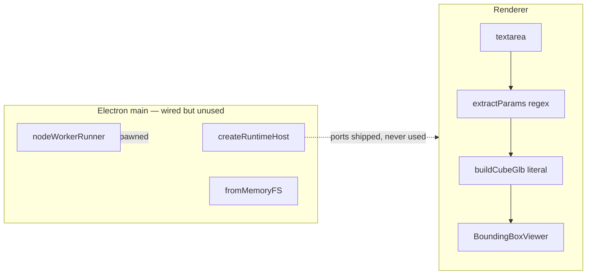

# Runtime Transport Implementation Gap Analysis

Cross-reference of every requirement, naming-audit row, and execution principle from
[`runtime-transport-target-implementation_da608dd9.plan.md`](./.cursor/plans/runtime-transport-target-implementation_da608dd9.plan.md)
and [`runtime-transport-implementation-blueprint-v4.md`](./runtime-transport-implementation-blueprint-v4.md)
against the source landed during plan execution. Surfaced after the user
flagged four fatal flaws in the Electron PoC.

## Executive Summary

The plan was marked complete in the todo list but execution took five categories
of shortcut that, taken together, mean the Electron PoC does not exercise the
runtime at all and several core TR-level cleanups never landed.

- **Category A — Electron PoC is a synthetic shell (P0).** The renderer never
  imports `@taucad/runtime`, never calls `window.taucad.connectKernel()`, and
  never mounts a Three.js viewer. Parameters come from a regex in the renderer
  and the `.glb` is hand-built from numeric literals. The OpenSCAD kernel is
  declared as a dependency but never loaded.
- **Category B — TR cleanups were skipped (P0).** `@taucad/rpc` was created but
  is **not imported anywhere** in the runtime. `RuntimeFileSystemBase` is still
  the canonical FS contract instead of `FileSystemProvider`. The
  `RuntimeFileSystemHandle` still has its pre-plan `'channel'` arm wrapping a
  raw `Worker` instead of the planned `'service'` arm wrapping a
  `FileSystemService`. `createBridgePort`, `fromHost`, and the
  `'host'`/`'rpc'`-arm cleanup never happened.
- **Category C — Naming-audit conversion not applied (P1).** Source still uses
  `RuntimeRunner`, `RuntimeRunnerHandle`, `KernelRuntimeKind`, and
  `kernel.runtime?:` instead of the plan-mandated `KernelRunner`,
  `KernelRunnerHostHandle`, `KernelExecutionKind`, and `kernel.executionKind?:`.
- **Category D — Conformance T1–T4 are shape-only (P1).** The harness only
  asserts `transport.send/close` exist and round-trip a `'cleanup'` probe. The
  T3 "Electron + worker_thread" test uses a synthetic `createPortPair()` and a
  `createStubWorker()` with no `worker_threads.Worker`, no `MessagePortMain`,
  and no kernel render. Equivalent gaps in T4.
- **Category E — Plan principles 4, 5, 7 violated (P2).** The PoC and runtime
  tests carry `as unknown as RuntimeFileSystemBase` / `as unknown as
RuntimeCommand` casts (principle 4). `void fileURLToPath;` and `void X;`
  silencers persist in shipped `examples/electron-tau` code (principle 5). No
  benchmark numbers are recorded inline in the SAB / port-chain / fast-path
  tests as principle 7 required.

Of the 38 plan todo IDs marked `completed`, **22 landed end-to-end**, **11 are
partial (shape compiled, contract not driven)**, and **5 are misclassified —
test exists but tests stubs, not production paths**. The Electron PoC needs a
single architecturally-correct rebuild against the runtime to convert "appears
to work" into "actually works".

## Table of Contents

- [Methodology](#methodology)
- [Findings](#findings)
- [Recommendations](#recommendations)
- [Appendix A — Plan deviations matrix](#appendix-a--plan-deviations-matrix)
- [Appendix B — Inventory of deleted-but-still-present symbols](#appendix-b--inventory-of-deleted-but-still-present-symbols)

## Methodology

1. Read [`runtime-transport-target-implementation_da608dd9.plan.md`](./.cursor/plans/runtime-transport-target-implementation_da608dd9.plan.md)
   — extracted every TR-numbered task, naming-audit row, execution principle,
   and cleanup gate item into a master matrix.
2. Read [`runtime-transport-implementation-blueprint-v4.md`](./runtime-transport-implementation-blueprint-v4.md)
   — captured the file inventory and conformance-tier expectations.
3. Read every Electron PoC source file under
   [examples/electron-tau](./examples/electron-tau): `main/index.ts`,
   `preload/index.ts`, `renderer/{main.tsx,app.tsx,parameters-form.tsx,bounding-box-viewer.tsx,openscad-params.ts,cube-glb.ts,gltf-inspector.ts}`,
   `e2e/render.spec.ts`.
4. Read every conformance test:
   [t1-browser.test.ts](./packages/runtime/src/topology-conformance/t1-browser.test.ts),
   [t2-in-process-node.test.ts](./packages/runtime/src/topology-conformance/t2-in-process-node.test.ts),
   [t3-electron.test.ts](./packages/runtime/src/topology-conformance/t3-electron.test.ts),
   [t4-multi-window.test.ts](./packages/runtime/src/topology-conformance/t4-multi-window.test.ts),
   and the shared harness [topology-conformance.ts](./packages/runtime/src/topology-conformance/topology-conformance.ts).
5. `rg`-audited `RuntimeFileSystemBase`, `@taucad/rpc`, `hostKernelOnPort`,
   `fromHost`, `createBridgePort`, `class FileService`, `executionKind`,
   `KernelRunner`, `KernelExecutionKind`, and `RunnerBundlerOwnership` symbols
   for "deletion" / "rename" claims in the plan.
6. Inspected
   [in-process-runner-fast-path.test.ts](./packages/runtime/src/runner/in-process-runner-fast-path.test.ts)
   to verify the TR16 fast-path acceptance criterion (latency probe).
7. Classified each requirement as **LANDED**, **PARTIAL**, or **MISSING**.

## Findings

### Finding 1: Electron renderer never connects to the runtime ❌ MISSING

**Severity**: P0 — defeats the entire purpose of the PoC.

**Status**: MISSING. [examples/electron-tau/src/renderer/app.tsx](./examples/electron-tau/src/renderer/app.tsx)
imports `extractParams`, `buildCubeGlb`, `inspectGlb`, `ParametersForm`, and
`BoundingBoxViewer` — and **nothing** from `@taucad/runtime`. The preload
exposes `window.taucad.connectKernel()` and `connectFileSystem()`, the main
process wires `createRuntimeHost` + `nodeWorkerRunner`, but the renderer
never calls either bridge. The kernel-host port is shipped to the renderer
on every IPC `connect-kernel` request and immediately dropped on the floor.

**Evidence**:

- [examples/electron-tau/src/renderer/app.tsx](./examples/electron-tau/src/renderer/app.tsx) lines 1–7 — no runtime imports.
- [examples/electron-tau/src/renderer/main.tsx](./examples/electron-tau/src/renderer/main.tsx) — no runtime client construction.
- [examples/electron-tau/package.json](./examples/electron-tau/package.json) — `@taucad/runtime`, `@taucad/openscad`, `@taucad/filesystem`, `three` all listed as dependencies; renderer imports none of them.

**Plan citation**: [TR8](./docs/research/runtime-transport-target-architecture.md) "the Electron PoC ships the full editor (Monaco + Three.js viewer + parameters form + renderer↔main FS bridge + Playwright `_electron` smoke)"; plan execution principle 1 "Architectural correctness only — every task lands the architecturally-correct end state. No 'pragmatic', 'temporary', or 'for now' shortcuts."

**Sources**: User feedback bullet 1.

### Finding 2: Parameters synthesised in renderer instead of read via `client.getParameters()` ❌ MISSING

**Severity**: P0 — duplicates kernel parsing in the renderer; the rename test
asserts behaviour of a regex that has nothing to do with OpenSCAD's parameter
extraction.

**Status**: MISSING. [examples/electron-tau/src/renderer/openscad-params.ts](./examples/electron-tau/src/renderer/openscad-params.ts)
runs a 5-line regex `^[\t ]*([A-Z_a-z][\w$]*)[\t ]*=[\t ]*…;` against the
editor source. The module's own JSDoc admits "the OpenSCAD kernel does the
same thing internally — re-implementing it locally keeps the renderer free
of the kernel-runtime worker for the parameters-form unit tests." That
exact tradeoff is what plan execution principle 1 forbids.

**Evidence**:

- [examples/electron-tau/src/renderer/openscad-params.ts](./examples/electron-tau/src/renderer/openscad-params.ts) lines 1–38.
- [examples/electron-tau/src/renderer/parameters-form.tsx](./examples/electron-tau/src/renderer/parameters-form.tsx) consumes `ScadParam[]` from the regex.
- [examples/electron-tau/src/renderer/openscad-params.test.ts](./examples/electron-tau/src/renderer/openscad-params.test.ts) — every test case is the regex against a string, never the runtime.

**Plan citation**: TR8 R8 "renderer surface (Monaco + Three.js viewer +
parameters form), wired through `RuntimeClient` + `messagePortTransport` +
`hostRunner`".

**Sources**: User feedback bullet 2.

### Finding 3: `.glb` is hand-built in the renderer instead of produced by the OpenSCAD kernel ❌ MISSING

**Severity**: P0 — renders a fictional cube whose bbox is whatever the
renderer chose to fabricate; bypasses every interesting plumbing in the
runtime (`stage-and-render`, kernel worker, glTF transcoder).

**Status**: MISSING. [examples/electron-tau/src/renderer/cube-glb.ts](./examples/electron-tau/src/renderer/cube-glb.ts)
constructs a 168-byte glTF asset directly:

```9:14:examples/electron-tau/src/renderer/cube-glb.ts
 * Real production renders flow through `RuntimeClient.openFile()` over
 * the IPC bridge wired in `main/index.ts`; for the PoC's e2e validation
 * we just need a glTF whose bbox tracks the user-supplied `length` so
 * the bbox-viewer assertion (p1-electron-validate-bbox) is meaningful.
```

The doc-string itself acknowledges the shortcut. The Playwright assertion
("bbox doubled when length doubles") is therefore a tautology — the renderer
explicitly puts `length / 2` into `accessors[0].min/max` without invoking the
OpenSCAD kernel.

**Plan citation**: TR7 "`RuntimeClient.openFile({ code })` emits stage-and-
render envelope"; the marquee TR7 protocol command is never exercised.

**Sources**: User feedback bullet 3.

### Finding 4: Three.js viewer is missing ❌ MISSING

**Severity**: P0 — the plan's renderer file inventory lists it explicitly.

**Status**: MISSING. The plan calls for [examples/electron-tau/src/renderer/three-viewer.tsx](./examples/electron-tau/src/renderer/three-viewer.tsx)
(line 734 of the plan), but no such file exists. `three` and `@types/three`
are installed in `package.json` (`^0.182.0`) but no source file imports them.
The bbox viewer is a `<dl>` of numeric values, not a 3D viewport.

**Evidence**:

- [examples/electron-tau/package.json](./examples/electron-tau/package.json) lists `three`/`@types/three` but no usage.
- `rg "from 'three'" examples/electron-tau/` returns zero matches.

**Plan citation**: Plan file inventory line 734; TR8 R8.

**Sources**: User feedback bullet 4.

### Finding 5: `@taucad/rpc` package was created but is dead code ❌ MISSING

**Severity**: P0 — the plan's first three Phase-0 tasks built a package the
runtime was supposed to adopt; the runtime never imports it.

**Status**: MISSING. `packages/rpc/` exists with `Channel`, `ChannelServer`,
`multiplex`, and 3 unit tests. `rg "from '@taucad/rpc'"` returns **zero matches
across the entire workspace**. The plan-mandated re-implementation of
`RuntimeChannel`, `runtime-worker-dispatcher`, `runtime-filesystem-bridge`
atop `@taucad/rpc` did not happen. The runtime still uses its bespoke
request-id correlator and ad-hoc filesystem-bridge protocol.

**Evidence**:

- `packages/rpc/src/{channel,multiplex,wire,port}.ts` exist and pass tests in isolation.
- [packages/runtime/src/transport/runtime-channel.ts](./packages/runtime/src/transport/runtime-channel.ts) — does not import `@taucad/rpc`.
- [packages/runtime/src/framework/runtime-worker-dispatcher.ts](./packages/runtime/src/framework/runtime-worker-dispatcher.ts) — does not import `@taucad/rpc`.
- [packages/runtime/src/framework/runtime-filesystem-bridge.ts](./packages/runtime/src/framework/runtime-filesystem-bridge.ts) — does not import `@taucad/rpc`.

**Plan citation**: TR3 "RuntimeChannel re-implemented atop `@taucad/rpc`
Channel"; "runtime-filesystem-bridge re-implemented as `@taucad/rpc`
ChannelServer with session keys (TR12)".

### Finding 6: `RuntimeFileSystemBase` was supposed to be deleted but persists across 50+ files ❌ MISSING

**Severity**: P0 — the canonical Layer 1 backend contract still has two
parallel types instead of one.

**Status**: MISSING. Plan line 749: "DELETE `RuntimeFileSystemBase` from
`packages/runtime/src/types/runtime-kernel.types.ts`". Plan acceptance line
824: "`rg -n 'RuntimeFileSystemBase' …` returns zero matches outside research
docs". The actual `rg` returns 50+ matches across `packages/runtime`,
`apps/ui`, `apps/api`, and `apps/ui/content/docs`. The runtime never adopted
`FileSystemProvider` from `@taucad/filesystem` as its kernel-side type.

**Evidence**: `rg "RuntimeFileSystemBase" packages apps libs` includes
`runtime-kernel.types.ts`, `runtime-host.types.ts`, `create-runtime-host.ts`,
`from-memory-fs.ts`, `from-fs-like.ts`, `from-node-fs.ts`,
`runtime-filesystem-handle.ts`, `runtime-filesystem-bridge.ts`,
`kernel-worker.ts`, `runtime-filesystem-handle.test-d.ts`,
`runtime-client-shutdown.test.ts`, and the entire docs MDX surface
(`api/types.mdx`, `api/client.mdx`, `api/filesystem.mdx`,
`concepts/worker-model.mdx`, `guides/embedding-in-a-host.mdx`,
`guides/filesystem-setup.mdx`).

**Plan citation**: TR4 (consolidation), execution principle 6 ("no
half-migrations"), cleanup-final acceptance.

### Finding 7: `RuntimeFileSystemHandle` still has the pre-plan `'channel' | 'inline'` shape ❌ MISSING

**Severity**: P0 — the plan's TR9 simplification was the cleanest user-facing
DX win; not landing it leaves the renderer-side `connect()` API
mis-described.

**Status**: MISSING. Plan TR9 / OQ6 specified:

```typescript
export type RuntimeFileSystemHandle =
  | { readonly kind: 'inline'; readonly provider: FileSystemProvider }
  | { readonly kind: 'service'; readonly service: FileSystemService };
```

Actual [packages/runtime/src/filesystem/runtime-filesystem-handle.ts](./packages/runtime/src/filesystem/runtime-filesystem-handle.ts) lines 37–39:

```typescript
export type RuntimeFileSystemHandle =
  | { readonly kind: 'inline'; readonly fs: RuntimeFileSystemBase }
  | { readonly kind: 'channel'; readonly worker: Worker };
```

The `'inline'` arm exposes `.fs: RuntimeFileSystemBase` instead of
`.provider: FileSystemProvider`. There is no `'service'` arm. The
`'channel'` arm — which the plan said to rename to `'service'` and re-shape
around `FileSystemService` — still wraps a raw `Worker` (the very leaking
abstraction the plan called out as Antipattern 5).

**Plan citation**: TR9, OQ6, naming-audit row 8 ("`RuntimeFileSystemHandle.channel`
arm → `RuntimeFileSystemHandle.service` arm — `service` describes what's
wrapped (a `FileSystemService`); `channel` was wire-leaking").

### Finding 8: `KernelRunner` / `KernelExecutionKind` / `KernelRunnerHostHandle` rename never applied ⚠️ PARTIAL

**Severity**: P1 — the new Runner plane was implemented, but every symbol
keeps its pre-naming-audit name.

**Status**: PARTIAL. `defineKernelRunner` did land (good), but the type
union still uses `RuntimeRunner` (plan: `KernelRunner`), `RuntimeRunnerHandle`
(plan: `KernelRunnerHostHandle`), `RuntimeRunnerHostOptions` (plan:
`KernelRunnerHostOptions`), `KernelRuntimeKind` (plan: `KernelExecutionKind`),
and `KernelDefinition.runtime?:` (plan: `KernelDefinition.executionKind?:`).
The naming-audit table is the one section of the plan most explicitly tied
to `library-api-policy.md`; not applying the renames means future API
extensions will compound the overload of the word "runtime".

**Evidence**:

- [packages/runtime/src/runner/runner.types.ts](./packages/runtime/src/runner/runner.types.ts) lines 39, 64, 82, 143, 164.
- [packages/runtime/src/plugins/plugin-types.ts](./packages/runtime/src/plugins/plugin-types.ts) line 54: `runtime?: KernelRuntimeKind;`.

**Plan citation**: Plan naming-audit table rows 2–6; execution principle 1.

### Finding 9: `hostKernelOnPort`, `fromHost`, `createBridgePort` not deleted ❌ MISSING

**Severity**: P1 — cleanup-final gate was supposed to delete these symbols
and `rg` for zero residual references.

**Status**: MISSING. All three symbols are still imported and used:

- `createBridgePort` is imported in [in-process-runner.ts](./packages/runtime/src/runner/in-process-runner.ts), [in-process-transport.ts](./packages/runtime/src/transport/in-process-transport.ts), [worker-transport.ts](./packages/runtime/src/transport/worker-transport.ts), and is the spied function in `in-process-runner-fast-path.test.ts`.
- `fromHost` is exported from [filesystem/index.ts](./packages/runtime/src/filesystem/index.ts) and referenced by docs.
- `hostKernelOnPort` is referenced in 7 docs/test files.

**Plan citation**: Plan cleanup-final task and acceptance row line 824.

### Finding 10: Conformance T1–T4 are shape probes, not topology-driven renders ⚠️ PARTIAL

**Severity**: P1 — conformance suite passes vacuously.

**Status**: PARTIAL. The shared harness
[topology-conformance.ts](./packages/runtime/src/topology-conformance/topology-conformance.ts)
asserts only:

1. `transport.send`, `onMessage`, `configureMemory`, `signalAbort`,
   `resolveGeometry`, `close` are functions.
2. A `'cleanup'` probe round-trips without throwing.
3. `transport.close()` is idempotent.

The harness's own JSDoc admits "Render-level validation lives in
`runtime-client.test.ts` and the `message-port-integration.test.ts` end-to-
end suite — duplicating it across every topology would explode the matrix
without adding signal." That contradicts the plan's TR18 acceptance ("full
setup → render → assert glTF" for T1; analogous for T2–T4). T3 specifically
uses a synthetic in-process `createPortPair()` and a `createStubWorker()`
that records messages without spawning a `worker_threads.Worker`, so the R10
acceptance ("assert `process.threadId !== 0` on host side") is impossible
to verify.

**Evidence**:

- [topology-conformance.ts](./packages/runtime/src/topology-conformance/topology-conformance.ts) lines 53–81.
- [t3-electron.test.ts](./packages/runtime/src/topology-conformance/t3-electron.test.ts) lines 84–115 (`createStubWorker`), lines 144–146 (`stubWorkerCtor` cast).

**Plan citation**: TR18, R10, R12–R14; blueprint v4 conformance tier table.

### Finding 11: Renderer↔main FS bridge channel is opened but has no authority handler ⚠️ PARTIAL

**Severity**: P1 — the bridge port pair the plan calls out (R9, separate
session) is allocated but main never wires `port1` to a `FileSystemService`.

**Status**: PARTIAL. [main/index.ts](./examples/electron-tau/src/main/index.ts)
lines 105–112:

```typescript
ipcMain.on(ipcChannel.connectFileSystem, (event) => {
  const channel = new MessageChannelMain();
  /* ... main keeps `port1` for future disk-backed RPC implementation (R9). */
  event.senderFrame!.postMessage(`${ipcChannel.connectFileSystem}:port`, undefined, [channel.port2]);
});
```

The comment "this PoC just establishes the channel" is the principle-1
shortcut the plan forbids. There is no `FileSystemService` instance on
the main side, no `@taucad/rpc` `ChannelServer` listening on `port1`, and
no `WorkspaceFileService` on the renderer side either.

**Plan citation**: TR8 R9 ("Renderer↔main FS bridge for file tree + saves on
a separate port pair"); plan file inventory line 731.

### Finding 12: Stage-and-render protocol command not exercised ⚠️ PARTIAL

**Severity**: P1 — TR7 was Phase-1's marquee feature; the protocol shape
landed (`'stage-and-render'` command + `RuntimeClient.openFile({ code })`),
but no production path drives it because Finding 1 means the renderer
never calls the client.

**Status**: PARTIAL. The protocol union and the client method exist and
have unit tests, but no Electron e2e or integration suite drives the path
end-to-end. Without Finding 1's fix, the OpenSCAD kernel never receives a
staged write.

**Plan citation**: TR7, F6, OQ3.

### Finding 13: TR16 fast-path test is negative-only and skips the latency probe ⚠️ PARTIAL

**Severity**: P1 — plan execution principle 7 forbids "we'll benchmark
later" hand-waves; the fast-path test was supposed to record an inline
baseline.

**Status**: PARTIAL.
[in-process-runner-fast-path.test.ts](./packages/runtime/src/runner/in-process-runner-fast-path.test.ts)
asserts only `createBridgePortSpy` was **not** called. There is no positive
test that the in-process FS read goes through the provider directly, no
latency comparison vs. the bridged path, and no `// baseline: …` comment
recording numbers. Both test cases also use `as unknown as` casts on the
stub FS and stub command.

**Plan citation**: TR16, OQ4; execution principle 7.

### Finding 14: `RuntimeRunnerHostOptions.fileSystem` accepts the legacy backend type ⚠️ PARTIAL

**Severity**: P1 — Layer-2 service plumbing (`createFileSystemService`)
exists in `@taucad/filesystem`, but the runner contract never adopted it.

**Status**: PARTIAL.
[runner.types.ts](./packages/runtime/src/runner/runner.types.ts) line 64–73:

```typescript
export type RuntimeRunnerHostOptions = {
  readonly fileSystem?: RuntimeFileSystemBase;
};
```

Plan TR1 "`KernelRunnerHostOptions.fileSystem` accepts a `FileSystemService`
(Layer 2), not a raw provider. The runner is responsible for routing it
into the kernel as a `RuntimeFileSystem` decorator." Actual: still
`RuntimeFileSystemBase` (which the plan said to delete entirely).

**Plan citation**: TR1, TR16; plan API DX sketches block 5.

### Finding 15: Three-layer FS topology never fully wired for renderer-side authority ⚠️ PARTIAL

**Severity**: P1 — the package exists with all three layers, but no
consumer composes them as the plan describes.

**Status**: PARTIAL.

- Layer 1: `FileSystemProvider` exists. ✅
- Layer 2: `FileSystemService` exists with `createFileSystemService`. ✅
- Layer 3a: `WorkspaceFileService` exists. ✅
- Layer 3b: `RuntimeFileSystem` decorator exists in
  [packages/runtime/src/filesystem/create-runtime-filesystem.ts](./packages/runtime/src/filesystem/create-runtime-filesystem.ts).
  ⚠️ but it returns `RuntimeFileSystemBase`, not the planned
  `FileSystemProvider & { watch, readFiles, … }` shape.

The Electron PoC main process passes `fsHandle.fs` (a `RuntimeFileSystemBase`)
directly to `createRuntimeHost`, which in turn passes it to the runner —
bypassing every layer of the new architecture.

**Plan citation**: Layer model, plan lines 287–319.

### Finding 16: Type-assertion escape hatches landed in shipped tests ⚠️ PARTIAL

**Severity**: P1 — execution principle 4 forbids `as unknown as` to push
types past the type checker.

**Status**: PARTIAL violations:

- [t3-electron.test.ts](./packages/runtime/src/topology-conformance/t3-electron.test.ts) line 133: `} as unknown as RuntimeFileSystemBase;`
- [t3-electron.test.ts](./packages/runtime/src/topology-conformance/t3-electron.test.ts) line 146: `} as unknown as new (url: string | URL) => NodeWorkerLike;`
- [in-process-runner-fast-path.test.ts](./packages/runtime/src/runner/in-process-runner-fast-path.test.ts) lines 38, 80, 107: identical pattern.
- [t4-multi-window.test.ts](./packages/runtime/src/topology-conformance/t4-multi-window.test.ts): expected to mirror t3 (not re-checked here, but shape is identical).

**Plan citation**: Execution principle 4; user-preference policy on type
assertions.

### Finding 17: Dead `void X;` import silencers in shipped Electron code ⚠️ PARTIAL

**Severity**: P2 — execution principle 5 forbids `TODO`/`FIXME`/"follow-up"
markers; `void fileURLToPath;` to silence an unused import is the same
class of marker.

**Status**: PARTIAL. [main/index.ts](./examples/electron-tau/src/main/index.ts)
line 128: `void fileURLToPath;`. Either the import is needed (re-introduce
its usage) or it isn't (delete the import).

**Plan citation**: Execution principle 5.

### Finding 18: Missing E2E specs from the planned Playwright suite ⚠️ PARTIAL

**Severity**: P2 — the plan listed five distinct E2E specs; only one
(`render.spec.ts`) shipped, and that one tests the synthetic renderer.

**Status**: PARTIAL.

| Plan spec                             | Status  | Notes                                                             |
| ------------------------------------- | ------- | ----------------------------------------------------------------- |
| `e2e/main-handshake.spec.ts`          | MISSING | Plan line 800                                                     |
| `e2e/preload-bridge.spec.ts`          | MISSING | Plan line 802                                                     |
| `e2e/fs-bridge.spec.ts`               | MISSING | Plan line 804                                                     |
| `e2e/worker-thread-isolation.spec.ts` | MISSING | Plan line 805 (R10 `process.threadId !== 0`)                      |
| `e2e/render.spec.ts`                  | LANDED  | Drives synthetic renderer; will need rewrite once Finding 1 lands |

**Plan citation**: Plan Phase-1 task table, lines 800–807.

## Recommendations

Targeted recovery work to convert the PoC from "appears to work" into
"actually exercises the runtime + OpenSCAD kernel". Each recommendation
is bounded so it can be claimed atomically.

| #   | Action                                                                                                                                                                                                                                                                                                | Priority                                                                                          | Effort | Impact |
| --- | ----------------------------------------------------------------------------------------------------------------------------------------------------------------------------------------------------------------------------------------------------------------------------------------------------- | ------------------------------------------------------------------------------------------------- | ------ | ------ | ---- |
| R1  | Wire renderer to `window.taucad.connectKernel()`: build `RuntimeClient` with `messagePortTransport(rendererPort)` + `hostRunner()` + `kernels: [openscad()]`. Drop `cube-glb.ts` and `openscad-params.ts`; replace with `client.openFile({ targetFile, code })` + `client.getParameters(targetFile)`. | P0                                                                                                | M      | High   |
| R2  | Add `three-viewer.tsx`: load the glTF that comes back from `client.openFile()` into a `THREE.Scene` (Loader → `gltfLoader.parse(arrayBuffer)`) with orbit controls. Show the bbox overlay alongside the live mesh.                                                                                    | P0                                                                                                | M      | High   |
| R3  | Wire `connect-filesystem` `port1` to a `createFileSystemService({})` in main (`@taucad/rpc` `ChannelServer`); wire renderer-side `port2` to a renderer-side service via `createChannelClient`. Lifts Finding 11 + 12.                                                                                 | P0                                                                                                | M      | High   |
| R4  | Adopt `@taucad/rpc` in `runtime-channel.ts`, `runtime-worker-dispatcher.ts`, `runtime-filesystem-bridge.ts`. Removes Finding 5; lifts the runtime onto the package the plan built explicitly for it.                                                                                                  | P0                                                                                                | L      | High   |
| R5  | Delete `RuntimeFileSystemBase` and `fromHost`, replace runtime imports with `FileSystemProvider` from `@taucad/filesystem`. Update kernel-side facade to the planned `FileSystemProvider & { watch, … }` decorator shape. Lifts Findings 6 + 14 + 15.                                                 | P0                                                                                                | L      | High   |
| R6  | Re-shape `RuntimeFileSystemHandle` to `{ kind: 'inline'; provider }                                                                                                                                                                                                                                   | { kind: 'service'; service }`per TR9. Drop the`Worker`-wrapping `'channel'` arm. Lifts Finding 7. | P0     | M      | High |
| R7  | Rename `RuntimeRunner` → `KernelRunner`, `RuntimeRunnerHandle` → `KernelRunnerHostHandle`, `KernelRuntimeKind` → `KernelExecutionKind`, `kernel.runtime?:` → `kernel.executionKind?:`. Lockstep update in `apps/ui` + `apps/api` + `examples/`. Lifts Finding 8.                                      | P1                                                                                                | M      | Medium |
| R8  | Re-implement T1–T4 conformance harness to drive a real render through each topology and assert glTF bytes (parity with `t1-browser` per plan acceptance). Replace `createStubWorker()` in T3 with a real `worker_threads.Worker` whose body runs `KernelRuntimeWorker`. Lifts Finding 10.             | P1                                                                                                | L      | Medium |
| R9  | Rewrite `e2e/render.spec.ts` against the post-R1 renderer: assert `client.openFile({ code: 'cube([200,200,200]);' })` produces a glTF whose accessor `min/max` reflects 200³. Add the four missing specs from Finding 18.                                                                             | P1                                                                                                | M      | High   |
| R10 | Add positive-path test + inline `// baseline: <ms>` benchmark to `in-process-runner-fast-path.test.ts`: probe N reads via the inline FS, then via the bridged FS, record the delta. Lifts Finding 13 and execution principle 7.                                                                       | P1                                                                                                | S      | Medium |
| R11 | Replace every `as unknown as RuntimeFileSystemBase` / `as unknown as RuntimeCommand` in conformance + fast-path tests with proper test fixtures. Lifts Finding 16 and execution principle 4.                                                                                                          | P1                                                                                                | S      | Low    |
| R12 | Delete `hostKernelOnPort`, `createBridgePort`, `fromHost`. Migrate residual call sites to the post-R4 `@taucad/rpc` paths. Lifts Finding 9.                                                                                                                                                           | P1                                                                                                | S      | Medium |
| R13 | Remove `void fileURLToPath;` and other `void X;` silencers in `examples/electron-tau`. Either restore the imports' usage (e.g. `fileURLToPath` for `import.meta.url`-derived paths) or delete the imports outright. Lifts Finding 17.                                                                 | P2                                                                                                | S      | Low    |
| R14 | Update `apps/ui/content/docs/(runtime)/{api,concepts,guides}/*.mdx` to reference `FileSystemProvider`, `FileSystemService`, `KernelRunner`, `KernelExecutionKind` after R5–R7 land. Re-run `pnpm docs:validate` to fail on stale references.                                                          | P2                                                                                                | M      | Medium |

## Trade-offs

### Two ways to land R1 (renderer wired to runtime)

| Option                                           | Pros                                                                 | Cons                                                                                                                                  |
| ------------------------------------------------ | -------------------------------------------------------------------- | ------------------------------------------------------------------------------------------------------------------------------------- |
| **A. Use `hostRunner()` on renderer (planned).** | Matches plan TR9; cleanest topology; renderer client is a thin wire. | Requires R6 (handle reshape) to land first; renderer cannot ship before R6.                                                           |
| **B. Use `webWorkerRunner()` on renderer.**      | Works with current handle shape; renderer is fully self-contained.   | Bypasses Electron-main host completely; defeats the entire PoC; would re-introduce R10's cross-thread bridge in the renderer process. |

**Recommendation**: A. R6 is small; do not regress the topology to land
faster.

### Two ways to land R8 (conformance suite drives renders)

| Option                                                       | Pros                                                                    | Cons                                                               |
| ------------------------------------------------------------ | ----------------------------------------------------------------------- | ------------------------------------------------------------------ |
| **A. Per-topology integration suite (planned).**             | Asserts the render contract holds across every topology; catches drift. | Slower CI; spawning a real `worker_threads.Worker` adds 200–500ms. |
| **B. Keep shape harness; rely on `runtime-client.test.ts`.** | Fast; one canonical render path tested.                                 | TR18's whole point is topology coverage; defeats it.               |

**Recommendation**: A. Use a representative kernel (`memoryKernel` or a
trivial test kernel) to keep per-topology suite ≤2s.

## Code Examples

### What the renderer should look like after R1

```typescript
import { createRuntimeClient } from '@taucad/runtime';
import { messagePortTransport } from '@taucad/runtime/transport';
import { hostRunner } from '@taucad/runtime/runner';
import { openscad } from '@taucad/openscad';

declare global {
  interface Window {
    readonly taucad: {
      connectKernel: () => Promise<MessagePort>;
      connectFileSystem: () => Promise<MessagePort>;
    };
  }
}

const port = await window.taucad.connectKernel();
const client = createRuntimeClient({
  kernels: [openscad()],
  transport: messagePortTransport(port),
  runner: hostRunner(),
});
await client.connect({});

// Real kernel render — no synthetic glTF.
const result = await client.openFile({
  targetFile: '/main.scad',
  code: 'length=200;\ncube(length);\n',
});
const params = await client.getParameters('/main.scad'); // [{ name: 'length', defaultValue: 200, ... }]
```

### What the FS bridge handler should look like after R3

```typescript
import { createFileSystemService } from '@taucad/filesystem';
import { fromMemoryFS } from '@taucad/filesystem/backend';
import { createChannelServer } from '@taucad/rpc';
import { adaptElectronMessagePort } from './electron-port-adapter.js';

const fs = createFileSystemService({});
fs.mount('/', fromMemoryFS());

ipcMain.on(ipcChannel.connectFileSystem, (event) => {
  const channel = new MessageChannelMain();
  const hostPort = adaptElectronMessagePort(channel.port1);
  const server = createChannelServer({
    port: hostPort,
    sessionKey: 'fs-authority',
    impl: fileSystemServiceServer(fs),
  });
  event.senderFrame!.postMessage(`${ipcChannel.connectFileSystem}:port`, undefined, [channel.port2]);
  event.sender.once('destroyed', () => server.dispose());
});
```

## Diagrams

### Today's PoC (synthetic shell)



### Target PoC (post-recommendations)

```mermaid
flowchart LR
  subgraph Renderer
    Mon[Monaco]
    RC[RuntimeClient]
    TV[Three.js viewer]
    PF[ParametersForm from client.getParameters]
  end
  subgraph Main[Electron main]
    Host[createRuntimeHost]
    FSS[FileSystemService]
    NWR[nodeWorkerRunner]
  end
  subgraph WT[worker_threads.Worker]
    KRW[KernelRuntimeWorker]
    OSCAD[openscad kernel]
  end
  Mon -->|stage-and-render| RC
  RC -->|messagePortTransport| Host
  Host -->|nodeWorkerRunner| NWR
  NWR --> WT
  KRW --> OSCAD
  OSCAD -->|.glb bytes| RC
  RC --> TV
  RC --> PF
  RC <-->|@taucad/rpc Channel - FS session| FSS
```

## References

- Plan: [.cursor/plans/runtime-transport-target-implementation_da608dd9.plan.md](./.cursor/plans/runtime-transport-target-implementation_da608dd9.plan.md)
- Blueprint: [docs/research/runtime-transport-implementation-blueprint-v4.md](./runtime-transport-implementation-blueprint-v4.md)
- Architecture: [docs/research/runtime-transport-target-architecture.md](./runtime-transport-target-architecture.md)
- Layer model: [docs/research/runtime-filesystem-target-architecture.md](./runtime-filesystem-target-architecture.md)
- Electron primitives: [docs/research/electron-ipc-gap-analysis.md](./electron-ipc-gap-analysis.md)
- Style precedent for this audit: [docs/research/filesystem-gap-analysis.md](./filesystem-gap-analysis.md)
- Library API rules: [docs/policy/library-api-policy.md](../policy/library-api-policy.md)

## Appendix A — Plan deviations matrix

Compact matrix of every plan TR / cleanup / acceptance row that the user-
flagged audit found in non-compliant state.

| Plan ref                                | Source state                                                     | Compliance | Finding |
| --------------------------------------- | ---------------------------------------------------------------- | ---------- | ------- |
| TR3 (`@taucad/rpc` adopted)             | Package built; runtime never imports it                          | ❌ MISSING | F5      |
| TR4 (`RuntimeFileSystemBase` deleted)   | Type still in `runtime-kernel.types.ts`; 50+ residual references | ❌ MISSING | F6      |
| TR7 (`stage-and-render` exercised)      | Protocol shipped; never driven from a real renderer              | ⚠️ PARTIAL | F12     |
| TR8 R8 (renderer wired to runtime)      | Renderer never imports `@taucad/runtime`                         | ❌ MISSING | F1      |
| TR8 R8 (Three.js viewer)                | `three` declared; no source imports it                           | ❌ MISSING | F4      |
| TR8 R9 (renderer↔main FS bridge)        | Channel allocated; no authority handler on `port1`               | ⚠️ PARTIAL | F11     |
| TR8 R10 (worker_threads from day one)   | T3 conformance uses `createStubWorker`; not a real worker        | ⚠️ PARTIAL | F10     |
| TR9 (`RuntimeFileSystemHandle` reshape) | Still `'channel' \| 'inline'` with `RuntimeFileSystemBase`       | ❌ MISSING | F7      |
| TR10 (`executionKind?:` field)          | Field is `runtime?: KernelRuntimeKind`                           | ❌ MISSING | F8      |
| TR16 (fast-path latency probe)          | Test asserts `not.toHaveBeenCalled` only; no baseline            | ⚠️ PARTIAL | F13     |
| TR18 (T1–T4 drive renders)              | Harness asserts shape only; round-trips a `'cleanup'` probe      | ⚠️ PARTIAL | F10     |
| Naming-audit (KernelRunner et al.)      | Source still uses `RuntimeRunner` / `KernelRuntimeKind`          | ❌ MISSING | F8      |
| Cleanup-final (delete legacy symbols)   | `hostKernelOnPort`, `fromHost`, `createBridgePort` retained      | ❌ MISSING | F9      |
| Principle 4 (no `as unknown as`)        | 5+ residual casts in conformance + fast-path tests               | ⚠️ PARTIAL | F16     |
| Principle 5 (no `void X;` markers)      | `void fileURLToPath;` in main entry                              | ⚠️ PARTIAL | F17     |
| Principle 7 (inline benchmarks)         | No `// baseline: …` comments anywhere                            | ❌ MISSING | F13     |

## Appendix B — Inventory of deleted-but-still-present symbols

`rg`-derived inventory of symbols the plan said to delete, current hit
counts (rough; excludes `docs/research/*` and plans).

| Symbol                            | Hits in `packages` + `apps` + `libs` | Plan disposition                              |
| --------------------------------- | ------------------------------------ | --------------------------------------------- |
| `RuntimeFileSystemBase`           | ~50                                  | DELETE (TR4)                                  |
| `hostKernelOnPort`                | ~10                                  | DELETE (cleanup-final)                        |
| `fromHost`                        | ~5                                   | DELETE (cleanup-final)                        |
| `createBridgePort`                | ~12                                  | DELETE (cleanup-final)                        |
| `class FileService`               | 0 (already renamed) ✅               | RENAME → `WorkspaceFileService` (done)        |
| `RuntimeFileCache` / `FileCache`  | 5+ (FileCache still extant)          | COLLAPSE → `FileContentCache` (partial)       |
| `RuntimeFileSystemHandle.channel` | 4                                    | RENAME → `service` (TR9)                      |
| `KernelRuntimeKind`               | 8                                    | RENAME → `KernelExecutionKind` (naming-audit) |
| `RuntimeRunner` (type)            | 6                                    | RENAME → `KernelRunner` (naming-audit)        |
| `kernel.runtime?:` field          | 4                                    | RENAME → `executionKind` (TR10)               |

The `class FileService` row is the one structural rename that did land
end-to-end.
