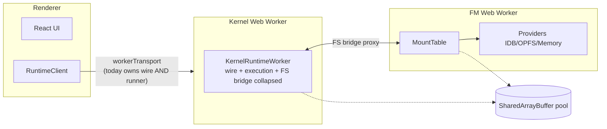
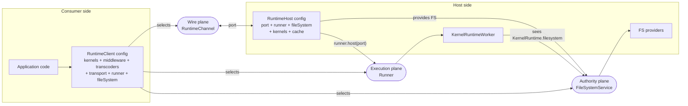
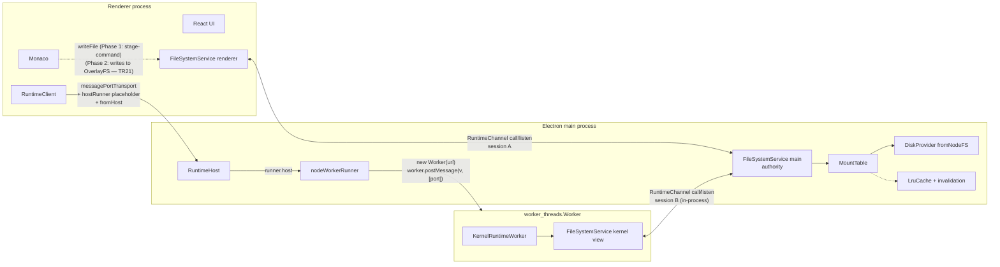
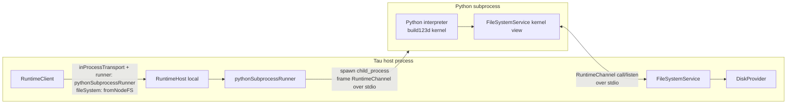
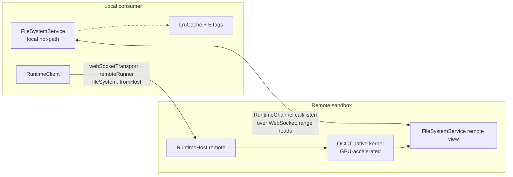

# Runtime Transport Target Architecture

Single forward-looking blueprint that knits the **Filesystem Target Architecture** ([`runtime-filesystem-target-architecture.md`](./runtime-filesystem-target-architecture.md)) and the **Runner Primitive** ([`runtime-runner-primitive.md`](./runtime-runner-primitive.md)) into one platform-agnostic, plugin-shaped runtime topology. Supersedes blueprint v4 once the runner + service layers land; v4 remains the in-flight reference for the Electron IPC POC.

## Executive Summary

Today's `RuntimeTransport` quietly does three jobs at once: it shapes the **wire** (`RuntimeChannel` + `RuntimeEventSource`), it picks the **execution location** of `KernelRuntimeWorker` (in-process vs DedicatedWorker), and it gatekeeps how a **filesystem authority** is bridged across that wire (via `RuntimeFileSystemHandle`). The browser-only era hid this conflation because all three jobs degenerated to the same answer (a worker URL). Electron broke the symmetry: the wire is `MessagePortMain`, the execution location is "main thread or worker_thread on the host side", and the FS authority is "wherever the host runs". The two research docs converge on the same fix from opposite directions: **factor the runtime config into orthogonal plugin-shaped primitives** — `Transport` (wire), `Runner` (execution location), `FileSystemService` (authority + cache; in-flight content layered via stage-command in Phase 1, composable overlay-FS in Phase 2), with `Kernel`/`Bundler`/`Transcoder`/`Middleware` composing on top. Every topology in Tau's vision (browser, embedded, Electron, headless, native subprocess kernel, remote GPU sandbox, federated multi-tenant) wires up by selecting one option per primitive — the framework guarantees they compose. Consumer surface stays one config object.

**r2 update (2026-04-25)**: All 15 originally-open questions are resolved (see [Resolved Decisions](#resolved-decisions)). Notable Phase 0 commitments: extract two new packages — `@taucad/rpc` (generic `IChannel` call+listen) and `@taucad/fs-core` (shared `FileSystemService` + `MountTable` + `FileSystemProvider`); fold the FS handle's `'host'`-arm into `hostRunner()` so cross-process renderer config drops one redundant field; symmetric channel close (control-message + timeout fallback); topology-level conformance suite (T1–T7) instead of a Cartesian transport×runner×fs matrix; binary-first content payloads; broadcast cache invalidate for v1 (ETags deferred to v2); roll forward with breaking changes (no codemods, no shims).

**r3 update (2026-04-25)**: Working-copy primitive replaced by a transport-level **stage-and-render command** (TR7) for Phase 1 — VS Code's `IWorkingCopy` carries workbench concerns (`SaveReason`, hot-exit backup, scratchpad capability, `typeId`) that Tau's autosave-by-default editor does not have UX for, so importing it would force a workbench abstraction the runtime does not need. The proper composable layer — an **overlay-FS primitive** (TR21) that subsumes `openFile({ code })`, AI streaming edits, multi-window draft isolation, and conflict detection by composing two `RuntimeFileSystemBase` instances — is reserved for Phase 2 once the Electron PoC has surfaced concrete editor-buffer requirements. Phase 1 ships ~50–100 LOC of stage-command path that retires cleanly when TR21 lands.

## Table of Contents

- [Problem Statement](#problem-statement)
- [Methodology](#methodology)
- [Eigenquestions in One Frame](#eigenquestions-in-one-frame)
- [Target Architecture](#target-architecture)
- [Layered Model](#layered-model)
- [Topology Recipes](#topology-recipes)
- [Diagrams](#diagrams)
- [Recommendations](#recommendations)
- [Roadmap](#roadmap)
- [Assumptions](#assumptions)
- [Resolved Decisions](#resolved-decisions)
- [References](#references)

## Problem Statement

The Electron IPC POC, validated end-to-end in `message-port-integration.test.ts`, proved that cross-process kernel hosting works — but only by introducing an `'host'` arm to `RuntimeFileSystemHandle` (filesystem) and a paired `hostKernelOnPort` helper (runner) that exists outside any plugin contract. The fix is correct in spirit but lives at the wrong abstraction level: the `'host'` arm is a special wire-time accommodation rather than a declared topology, and `hostKernelOnPort` is a transport-folder helper rather than a first-class primitive. Both research docs identified the same root cause from different angles:

- **Filesystem doc**: Tau has no consumer-facing **service** layer; `RuntimeFileSystemHandle` is the IPC seam (wire-shaped) but is being used as if it were the FS abstraction (consumer-shaped). VS Code's service/provider split (`IFileService` ↔ `IFileSystemProvider`) plus capability bitfields plus working copies plus `IChannel`-style RPC is the proven pattern.
- **Runner doc**: The transport implicitly owns "where the kernel runs". This worked when wire shape and host shape coincided (browser worker). Electron decouples them. Vision-policy phases 2–6 (native solvers, Python kernels, remote GPU sandboxes) decouple them permanently.

Both docs land on the same architectural move: **factor the conflated `Transport` into orthogonal primitives**. This blueprint takes that move from "two recommendations in two docs" to "one composable runtime config" and proves every topology Tau will ever need wires up the same way.

## Methodology

1. Started from the eigenquestions of both research docs (E1 — filesystem authority; E2 — execution location).
2. Cross-mapped each finding to identify shared root causes: every "transport-implicit" problem (runner doc) is also an "authority-implicit" problem (filesystem doc) viewed through a different lens.
3. Reconciled the layered models from both docs into a single primitive stack with crisp boundaries.
4. Verified each Tau topology (browser today, Electron POC, Electron target, headless, future native, future remote, future federated) wires from the same primitives.
5. Distilled the consumer surface to a single config object that defaults to today's behaviour and admits every topology with one extra plugin instance per change.
6. Listed all assumptions baked into the blueprint and the open questions that the implementation phases must answer.

## Eigenquestions in One Frame

Both research eigenquestions resolve to a single meta-question:

> **EM: How do we orthogonalise the runtime config so wire, execution, and authority compose freely without consumers learning new concepts for every topology?**

The two sub-eigenquestions:

| #   | Question                                                                                                                  | Resolved by                                                                                                                                           |
| --- | ------------------------------------------------------------------------------------------------------------------------- | ----------------------------------------------------------------------------------------------------------------------------------------------------- |
| E1  | Where does the authoritative filesystem live, and how do consumers across processes/threads agree on that authority?      | `FileSystemService` + `RuntimeChannel` bridge (filesystem doc); in-flight content layered via TR7 stage-command (Phase 1) → TR21 overlay-FS (Phase 2) |
| E2  | Who decides where heavy CAD compute physically runs, and how do consumers express that intent without the kernel knowing? | First-class `Runner` plugin distinct from `Transport` (runner doc)                                                                                    |

Composing the answers: **`Transport` carries the wire shape only. `Runner` decides execution location only. `FileSystemService` decides FS authority only. Each layer is a plugin shape; consumers compose by listing instances in `createRuntimeClient`.**

## Target Architecture

### Orthogonal primitives

The runtime config factors into **six plugin-shaped primitives**, each owning exactly one concern:

| Primitive               | Owns                                                                                                       | Examples (today / target)                                                                                                    |
| ----------------------- | ---------------------------------------------------------------------------------------------------------- | ---------------------------------------------------------------------------------------------------------------------------- |
| **`Transport`**         | Wire shape: `RuntimeChannel`, `RuntimeEventSource`, `signalAbort`, `configureMemory`, `describe`, `close`  | `inProcessTransport`, `workerTransport`, `messagePortTransport`, `webSocketTransport` (future)                               |
| **`Runner`**            | Execution location of `KernelRuntimeWorker` (or non-JS analogue)                                           | `inProcessRunner`, `webWorkerRunner`, `nodeWorkerRunner`, `hostRunner`, `subprocessRunner` (future), `remoteRunner` (future) |
| **`FileSystemService`** | FS authority, mount routing, capability negotiation, cache (overlay layering deferred to Phase 2 via TR21) | `runtimeFileSystemService({ provider })`, with `RuntimeFileSystemHandle` as IPC seam                                         |
| **`Kernel`**            | `initialise` / `getParameters` / `createGeometry` / `exportGeometry` for one CAD engine                    | `replicad`, `opencascade`, `openscad`, `tau`, `zoo`; future Python `build123d`                                               |
| **`Bundler`**           | Source → executable for a kernel runtime kind                                                              | `esbuildBundler` (JS); future `pythonBundler`, `nativeBundler`                                                               |
| **`Transcoder`**        | Format-to-format conversion (geometry, parameters)                                                         | `converterTranscoder`                                                                                                        |
| **`Middleware`**        | Cross-cutting onion around kernel calls                                                                    | `geometryCacheMiddleware`, `parameterCacheMiddleware`, `parameterFileResolverMiddleware`                                     |

Every concrete consumer config picks exactly one transport, one runner, one FS service, and N kernels/bundlers/transcoders/middleware. Defaults degenerate to today's browser config.

### Consumer surface (one config object)

Today's quick-start (`apps/ui/content/docs/(runtime)/getting-started/quick-start.mdx`) stays one line:

```typescript
const client = createRuntimeClient(presets.all());
```

Behind that preset, the target shape is:

```typescript
type RuntimeClientConfig = {
  kernels: KernelPlugin[];
  bundlers?: BundlerPlugin[]; // inferred from runner if omitted
  transcoders?: TranscoderPlugin[];
  middleware?: MiddlewarePlugin[];
  transport?: RuntimeTransport; // default: workerTransport(getDefaultWorkerUrl())
  runner?: RuntimeRunner; // inferred from transport if omitted
  fileSystem?: RuntimeFileSystemHandle | RuntimeFileSystemService;
  // handle = wire-time choice; service = full consumer view
  cache?: RuntimeFileCache; // inferred from runner topology if omitted
  // Phase 2 (TR21, deferred): overlay?: OverlayFileSystem  — composable in-flight layer
};
```

Consumer mental model: **"pick what's different from default"**. A browser app overrides nothing (today's behaviour). An Electron renderer overrides `transport` + `runner` + `fileSystem`. A Python kernel adds a `runner` and the kernel itself. A remote GPU adds a `transport` + `runner`.

### Symmetric host-side surface

Cross-process topologies have **two sides** (renderer + host). Today only the consumer (renderer) side has a `createRuntimeClient`; the host side is the `hostKernelOnPort` helper. The target makes the host side **also** a config object:

```typescript
type RuntimeHostConfig = {
  port: RuntimeMessagePort;            // the wire endpoint the runner serves
  runner: RuntimeRunner;               // which execution location actually hosts the kernel
  fileSystem: RuntimeFileSystemBase;   // the authority providers route through
  kernels?: KernelPlugin[];            // optional pre-registration; defaults to "whatever client requests"
  bundlers?: BundlerPlugin[];
  transcoders?: TranscoderPlugin[];
  middleware?: MiddlewarePlugin[];
  cache?: RuntimeFileCache;
};

createRuntimeHost(config): RuntimeHostHandle;
```

Symmetry: every concept on the consumer side has its mirror on the host side. The **wire** (`port`) is shared between them; the **runner** + **fileSystem** + **kernels/etc.** are the host's concern; the consumer just declares "the kernel lives across this wire" via `hostRunner()` + `fromHost()`.

### Wire vs execution vs authority — the three planes

```
                     ┌────────────────────────┐
                     │   Consumer process     │
                     │  RuntimeClient config  │
                     │  ─ kernels             │
                     │  ─ middleware          │
                     │  ─ transcoders         │
                     │  ─ transport           │── owns the wire
                     │  ─ runner   ───────────│── owns "where compute runs"
                     │  ─ fileSystem ─────────│── owns "which FS the kernel sees"
                     │  ─ cache               │
                     │  (─ overlay, Phase 2)  │
                     └────────────────────────┘
                                 │
                       wire (RuntimeChannel)
                                 │
                     ┌────────────────────────┐
                     │     Host process       │
                     │    RuntimeHost config  │── mirrors consumer for cross-process topologies
                     └────────────────────────┘
```

The three planes are independently composable. Browser today: all three planes collapse into "the kernel worker". Electron target: each plane has its own real implementation.

## Layered Model

Reconciled from both research docs:

| Layer                     | Owner               | Primitive                                          | Today                                               | Target                                                                                            |
| ------------------------- | ------------------- | -------------------------------------------------- | --------------------------------------------------- | ------------------------------------------------------------------------------------------------- |
| **Consumer config**       | Application         | `RuntimeClientConfig`                              | `presets.all()`                                     | Same shape; new optional fields                                                                   |
| **Wire**                  | Transport           | `RuntimeChannel`, `RuntimeEventSource`             | `RuntimeTransport`                                  | Unchanged shape; sheds "owns the worker" responsibility                                           |
| **Execution**             | Runner              | `RuntimeRunner.host(port, options)`                | Implicit (transport owns it)                        | First-class plugin                                                                                |
| **Bundler**               | Per-runner-class    | `BundlerPlugin`                                    | `esbuildBundler` (JS only)                          | Inherited by JS runners; `'self'` for non-JS                                                      |
| **Authority** (provider)  | FileSystem          | `RuntimeFileSystemBase` + `capabilities`           | 11 primitives + optional `watch`                    | + capability bitset + optional streaming                                                          |
| **Mount/scheme**          | FileSystem          | `MountTable`                                       | UI-side only                                        | Promoted into `RuntimeFileSystemService`                                                          |
| **Service**               | FileSystem          | `RuntimeFileSystemService`                         | none                                                | Wraps mounts + cache; in-flight content arrives via TR7 stage-command                             |
| **Overlay (deferred)**    | FileSystem          | `OverlayFileSystem` (`RuntimeFileSystemBase`)      | none                                                | **Phase 2 (TR21)**; composes over base FS to layer in-flight edits, AI streaming, draft isolation |
| **Cache**                 | FileSystem          | `RuntimeFileCache` interface                       | `SharedPool` (browser only)                         | `SharedPoolCache` (same-cluster) ‖ `LruCache + invalidation` (cross-process)                      |
| **Bridge (IPC seam)**     | FileSystem + Runner | `RuntimeChannel` (`call` + `listen`) over any port | One-shot `createBridgePort`                         | `IChannel`-style with session demux + chunked streams + cancellation                              |
| **Handle (connect-time)** | FileSystem          | `RuntimeFileSystemHandle`                          | `inline` ‖ `channel` ‖ `host` ‖ `rpc` (placeholder) | Unchanged shape; reserved for the IPC seam                                                        |
| **Kernel**                | Kernel              | `KernelDefinition`                                 | `defineKernel`                                      | + optional `runtime: KernelRuntimeKind = 'js'`                                                    |
| **Transcoder**            | Transcoder          | `TranscoderPlugin`                                 | `defineTranscoder`                                  | Unchanged                                                                                         |
| **Middleware**            | Middleware          | `MiddlewarePlugin`                                 | `defineMiddleware`                                  | Unchanged                                                                                         |

## Topology Recipes

Every topology resolves to a single config object on each side. Defaults shown in `// inferred` comments.

### T1 — Browser UI (Tau today)

```typescript
const client = createRuntimeClient({
  ...presets.all(),
  // transport: workerTransport(getDefaultWorkerUrl()),  // inferred
  // runner: webWorkerRunner({ url: getDefaultWorkerUrl() }),  // inferred
  // fileSystem: fromWorker(fmWorker),  // wired by app shell
  // cache: sharedPoolCache(filePoolBuffer),  // inferred from runner
});
```

### T2 — In-process Node CLI / tests

```typescript
const client = await createNodeClient('/path/to/project');
// equivalent to:
// transport: inProcessTransport(),
// runner: inProcessRunner(),
// fileSystem: fromNodeFS('/path/to/project'),
// cache: lruCache({ max: 1024 }),
```

### T3 — Electron renderer + main + worker_thread kernel

```typescript
// renderer
const port = await window.taucad.connectKernel();
const client = createRuntimeClient({
  ...presets.all(),
  transport: messagePortTransport(port),
  runner: hostRunner(),
  fileSystem: fromHost(),
});

// main
import { nodeWorkerRunner } from '@taucad/runtime/runner';
import { fromNodeFS } from '@taucad/runtime/filesystem/node';
const { port1, port2 } = new MessageChannelMain();
createRuntimeHost({
  port: adaptElectronPort(port2),
  runner: nodeWorkerRunner({ url: kernelWorkerEntryUrl }),
  fileSystem: fromNodeFS(app.getPath('userData')),
  kernels: [replicad(), openscad()],
  cache: lruCache({ max: 1024 }),
});
mainWindow.webContents.postMessage('kernel-port', null, [port1]);
```

### T4 — Multi-window Electron (single source of truth)

Same as T3 but main holds **one** `RuntimeFileSystemService` and **one** runner. Each window gets its own `MessagePortMain` pair into the shared host. Per-window draft isolation is achieved in Phase 1 by routing each window's stage-command writes through its own subdirectory mount; Phase 2 (TR21) replaces this with a per-window `OverlayFileSystem` instance over the shared base. The runner multiplexes via session demux on the channel.

### T5 — Future Python build123d kernel (subprocess)

```typescript
import { build123d } from '@taucad/build123d';
import { pythonSubprocessRunner } from '@taucad/runtime-python';

const client = await createNodeClient('/proj', {
  kernels: [build123d({ runtime: 'python' })],
  runner: pythonSubprocessRunner({ pythonPath: '/usr/bin/python3' }),
  // bundlers ignored — runner declares bundlers: 'self'
});
```

### T6 — Future remote GPU sandbox (OCCT native)

```typescript
const client = createRuntimeClient({
  ...presets.all(),
  kernels: [opencascadeRemote()], // declares runtime: 'remote'
  transport: webSocketTransport({ url: 'wss://sandbox.tau.dev/kernel' }),
  runner: remoteRunner({ auth: bearerToken }),
  fileSystem: fromHost(), // FS lives remotely; cache is local LRU + ETags
});
```

### T7 — Future federated multi-tenant

Same as T6 but `transport: federatedTransport({ peers })` and `fileSystem` resolves to a CRDT-backed service. Out of scope for v1; the primitive shape supports it without core changes.

## Diagrams

### Browser today (collapsed three planes)



### Target — three planes orthogonalised (any topology)



### Target — Tau Electron with worker_thread kernel



### Target — Future Python subprocess runner



### Target — Future remote GPU sandbox



## Recommendations

Numbered to match the two research docs' recs:

| #    | Action                                                                                                                                                                                                                                                                                                                                                                                                                                                                                                                                                                                                                                                                                 | Priority | Effort | Impact | Source                                        |
| ---- | -------------------------------------------------------------------------------------------------------------------------------------------------------------------------------------------------------------------------------------------------------------------------------------------------------------------------------------------------------------------------------------------------------------------------------------------------------------------------------------------------------------------------------------------------------------------------------------------------------------------------------------------------------------------------------------- | -------- | ------ | ------ | --------------------------------------------- |
| TR1  | Define and ship the `RuntimeRunner` plugin contract (`defineRunner`, `KernelRuntimeKind`); land `inProcessRunner`, `webWorkerRunner`, `nodeWorkerRunner`, `hostRunner`                                                                                                                                                                                                                                                                                                                                                                                                                                                                                                                 | P0       | M      | High   | Runner R1, R2                                 |
| TR2  | Refactor `inProcessTransport` and `workerTransport` to delegate kernel hosting to the inferred runner; transports become wire-only; ship `getDefaultKernelWorkerUrl()` helper in `@taucad/runtime/runner` (uses `new URL(..., import.meta.url)` so consumer bundlers can resolve the worker entry); consumers pass it explicitly to `webWorkerRunner({ url })`                                                                                                                                                                                                                                                                                                                         | P0       | M      | High   | Runner R3 + OQ8/C                             |
| TR3  | Extract `IChannel`-style call+listen RPC to a new package `@taucad/rpc` (use `create-package` skill) with session demux, chunked streams, cancellation; FS bridge re-implements on top; AI tool RPCs and future control planes consume the same primitive                                                                                                                                                                                                                                                                                                                                                                                                                              | P0       | M      | High   | FS R1, R5, R6 + OQ2/B                         |
| TR4  | Extract a new package `@taucad/fs-core` (use `create-package` skill) holding the shared `FileSystemService`, `MountTable`, and `FileSystemProvider` interface (renamed from `RuntimeFileSystemBase`); both `@taucad/runtime` and `@taucad/filesystem` depend on it; `@taucad/filesystem` keeps its UI providers (IDB/OPFS/FS Access) so headless runtime stays lean                                                                                                                                                                                                                                                                                                                    | P0       | M      | High   | FS R3, R4, R7, R9 + OQ1/C                     |
| TR5  | Add explicit `capabilities` bitset to `RuntimeFileSystemBase` (`'readwrite'`, `'readstream'`, `'watch'`, `'atomic-write'`, `'trash'`, `'clone'`, `'case-sensitive'`, `'readonly'`)                                                                                                                                                                                                                                                                                                                                                                                                                                                                                                     | P0       | M      | High   | FS R2                                         |
| TR6  | Define `createRuntimeHost(config)` mirror of `createRuntimeClient`; collapses today's `hostKernelOnPort` helper into the symmetric host-side surface                                                                                                                                                                                                                                                                                                                                                                                                                                                                                                                                   | P0       | M      | High   | Synthesis (this doc)                          |
| TR7  | Add a `stage-and-render` control command on the kernel transport (gap-analysis R5 / Approach A): `RuntimeClient.openFile({ code })` emits `{ stage: { path → Uint8Array } }` ahead of the render command; host writes the bytes to its `RuntimeFileSystemBase` before invoking the kernel. Removes the `managedFileSystem.kind === 'inline'` invariant (gap-analysis F6) and gives the renderer one production write path that works for any FS arm. Drops the proposed `RuntimeWorkingCopy` registry — VS Code's working-copy primitive carries workbench concerns (save reason, hot-exit backup, scratchpad capability, `typeId`) that Tau's autosave-by-default model does not need | P0       | S      | High   | gap-analysis R5/F6 + OQ3 + OQ13               |
| TR8  | Use `nodeWorkerRunner` from day one in `examples/electron-tau/`; main thread never hosts the kernel                                                                                                                                                                                                                                                                                                                                                                                                                                                                                                                                                                                    | P1       | M      | High   | Runner R6, gap-analysis R10                   |
| TR9  | Drop `RuntimeFileSystemHandle` `'rpc'` placeholder; fold `'host'`-arm semantics into `hostRunner()` so renderer config drops the redundant `fileSystem: fromHost()` declaration; handle shape becomes `'inline' \| 'channel'` for non-host topologies; cross-process is implied by `runner: hostRunner()`                                                                                                                                                                                                                                                                                                                                                                              | P1       | L      | Medium | FS R10 + OQ6/B                                |
| TR10 | Add `runtime?: KernelRuntimeKind = 'js'` to `KernelDefinition` as an open string union (`'js' \| 'wasm' \| 'python' \| 'native' \| 'remote' \| (string & {})`) so runner authors can extend without breaking changes; runners declare `supports`; client validates compatibility at construction                                                                                                                                                                                                                                                                                                                                                                                       | P1       | L      | Medium | Runner R5 + OQ15/C                            |
| TR11 | Replace `SharedPool`-only assumption with `RuntimeFileCache` interface; ship `SharedPoolCache` (same-cluster) and `LruCache` (cross-process); v1 uses **broadcast invalidate** over `listen('fileChange')`; ETag/mtime per entry deferred to v2 when first multi-renderer write contention surfaces                                                                                                                                                                                                                                                                                                                                                                                    | P1       | M      | Medium | FS R7 + OQ12/A                                |
| TR12 | Reserve plugin-shape extension points for future runners (`lifecycle`, `health`, `auth`); land empty in v1                                                                                                                                                                                                                                                                                                                                                                                                                                                                                                                                                                             | P2       | L      | Low    | Runner R9                                     |
| TR13 | Adopt the `'inherit' \| 'self'` bundler-ownership flag on `defineRunner` from v1; `'self'` runners ship a co-authored `BundlerPlugin` instance (e.g. `pythonBundler()` alongside `pythonSubprocessRunner()`) so the kernel composition pipeline stays uniform — only the bundler author changes                                                                                                                                                                                                                                                                                                                                                                                        | P2       | L      | Low    | Runner R10 + OQ7/C                            |
| TR14 | Document topology recipes (T1–T7) in `worker-model.mdx`; replace transport-centric phrasing with three-plane phrasing                                                                                                                                                                                                                                                                                                                                                                                                                                                                                                                                                                  | P2       | L      | Medium | FS R8 + Runner R8                             |
| TR15 | Multi-runner-per-client (E2f) is **not** in v1 scope; defer until the first concrete consumer config exists (likely Vision-policy phase 2 — Python FEA + JS Replicad in one project); client validates `runners.length === 1`; reserve the shape (`runner` accepts singleton or array) so the unlock is non-breaking                                                                                                                                                                                                                                                                                                                                                                   | P3       | L      | Low    | Runner R11 + OQ5/B                            |
| TR16 | Implicit local-disk fast-path: when the runner shares the host's V8 agent cluster and the provider supports primitive ops, runner registers the provider directly in-process instead of bridging through the channel; no consumer-facing flag (mirrors VS Code's extension-host pattern)                                                                                                                                                                                                                                                                                                                                                                                               | P3       | M      | Medium | FS R11 + OQ4/B                                |
| TR17 | Symmetric channel close: both ends emit a `'close'` control message; wire close (network drop, port-close) is the timeout fallback; each end disposes locally on either trigger (runner kills worker, service kills cache + listener subscriptions, transport kills port); no single-side ownership                                                                                                                                                                                                                                                                                                                                                                                    | P0       | M      | High   | OQ11/C                                        |
| TR18 | Topology-level conformance suite (T1–T7 from blueprint), each a full setup → kernel-render → assert; no Cartesian transport×runner×fs matrix (combinatorial blowup); tests are the user-visible contract                                                                                                                                                                                                                                                                                                                                                                                                                                                                               | P0       | M      | High   | OQ9/C                                         |
| TR19 | No backwards compatibility through Phase 0 — roll forward with breaking changes per AGENTS.md learned pref for unreleased internal APIs; in-tree consumers (`apps/ui`, `apps/api`, `packages/cli`, `examples/electron-tau`) update in lockstep with each TR; no codemods, no shims                                                                                                                                                                                                                                                                                                                                                                                                     | P0       | L      | Medium | OQ10/A                                        |
| TR20 | Federated topology (T7/T10) layers a federated transport (peer discovery + routing) **and** a federated FS service (CRDT content convergence); same wire ⊥ authority separation as the rest of the blueprint; mirrors Yjs network-providers vs doc-state separation; deferred to Phase 3                                                                                                                                                                                                                                                                                                                                                                                               | P3       | L      | Low    | OQ14/C                                        |
| TR21 | **Deferred to Phase 2**: Composable overlay-FS primitive (`overlay(base): OverlayFileSystem` implementing `RuntimeFileSystemBase`) replaces TR7's stage-command in a clean v2 swap. Subsumes `openFile({ code })` (overlay over empty memory base), AI streaming edits (write to overlay, accept = `flushTo`, reject = `revert`), Electron external-editor conflict detection (etag comparison on `flushTo`), multi-window draft isolation, and an opt-in "explicit Save" UX without forcing it. Composes for free with `MountTable`, capability bitset, and the existing FS bridge. Throwaway cost: ~50–100 LOC stage-command path retired in Phase 2. Not required for Electron PoC  | P2       | M      | Medium | Working-copy review (this doc, this revision) |

## Roadmap

Phased delivery aligned with the Electron POC's existing R-list (`electron-ipc-gap-analysis.md`):

### Phase 0 — Land the abstractions (P0 recs, ~2-3 weeks)

1. **Package extractions** (use `create-package` skill):
   - `@taucad/rpc` (TR3) — generic `IChannel`-style call+listen primitive.
   - `@taucad/fs-core` (TR4) — shared `FileSystemService`, `MountTable`, `FileSystemProvider`; both `@taucad/runtime` and `@taucad/filesystem` migrate to depend on it.
2. TR1, TR2: Runner plugin contract + factor today's transports; `getDefaultKernelWorkerUrl()` helper using `new URL(..., import.meta.url)`.
3. TR4, TR5: Service layer + capabilities (after `@taucad/fs-core` lands).
4. TR6: `createRuntimeHost` symmetric surface.
5. TR17: Symmetric channel close (control-message + timeout fallback).
6. TR18: Topology-level conformance suite (T1–T2 land in Phase 0; T3+ in Phase 1).
7. TR19: Lockstep update of in-tree consumers (`apps/ui`, `apps/api`, `packages/cli`, `examples/electron-tau`); no shims.

**Validation gates**:

- All existing runtime tests pass after the lockstep migration.
- `examples/electron-tau` POC re-wires through new primitives without behavioural change.
- T1 (browser today) + T2 (in-process Node) topology tests pass.

### Phase 1 — Electron POC completion (P1 recs, ~2 weeks)

1. TR8: Move POC kernel into `nodeWorkerRunner`.
2. TR7: Stage-and-render command on the kernel transport; `RuntimeClient.openFile({ code })` emits `{ stage: { path → Uint8Array } }` ahead of every render so the host writes through to its `RuntimeFileSystemBase` before invoking the kernel — closes gap-analysis F6/R5 with one production write path that works for any FS arm.
3. TR9: Drop `'rpc'` placeholder; fold `'host'`-arm into `hostRunner()`; renderer config drops `fileSystem: fromHost()`.
4. TR10: Optional `runtime` tag on `KernelDefinition` (open string union).
5. TR11: `RuntimeFileCache` interface + `LruCache` implementation; broadcast invalidate over `listen('fileChange')`.
6. TR18: T3–T7 topology tests land.
7. Playwright `_electron` smoke test (gap-analysis R11).

**Validation gates**:

- All `_electron` end-to-end tests pass; render round-trip verified.
- Conformance T3/T4/T5 tiers pass against `messagePortTransport` (gap-analysis R12–R14).
- Benchmark vs browser SAB path (gap-analysis R15).

### Phase 2 — Forward-compat hooks (P2 recs, ~1 week)

1. TR12: Reserved extension points for future runners (`lifecycle`, `health`, `auth`).
2. TR13: `'inherit' | 'self'` bundler-ownership flag; `'self'` runners ship a co-authored `BundlerPlugin`.
3. TR14: Topology recipes documented in `worker-model.mdx`.
4. TR16: Implicit local-disk fast-path (same-cluster runner registers provider directly).
5. TR21: Land `OverlayFileSystem` (`overlay(base): RuntimeFileSystemBase`) once Electron PoC has surfaced concrete editor-buffer requirements; retire TR7's stage-command path; AI streaming edits, multi-window draft isolation, and conflict detection compose for free over the same primitive.
6. Refresh `quick-start.mdx` with the three-plane mental model.

### Phase 3 — Native + remote + federated (driven by Vision-policy phases 2–6)

Per Vision-policy schedule:

1. `subprocessRunner` + first native solver kernel (FEAScript replacement / Calculix / OpenFOAM).
2. `pythonSubprocessRunner` + `build123d` kernel.
3. `webSocketTransport` + `remoteRunner` + first GPU sandbox kernel.
4. Multi-runner-per-client unlock (TR15) when the first consumer needs JS + Python in one project.
5. ETag/mtime cache invalidation upgrade (TR11 v2) when T7 multi-window write contention surfaces.
6. Federated transport + federated FS service (TR20) for T10 collaborative multi-tenant.

## Assumptions

Each assumption is a precondition for the blueprint; if any is false, revisit the corresponding decision.

| #   | Assumption                                                                                                                                                                                                                                                                        | Risk if false                                                                                                                                                        | Validation plan                                                                                                                                              |
| --- | --------------------------------------------------------------------------------------------------------------------------------------------------------------------------------------------------------------------------------------------------------------------------------- | -------------------------------------------------------------------------------------------------------------------------------------------------------------------- | ------------------------------------------------------------------------------------------------------------------------------------------------------------ |
| A1  | The plugin shapes `defineKernel` / `defineBundler` / `defineTranscoder` are stable enough that a parallel `defineRunner` will fit naturally                                                                                                                                       | Plugin contract churn during migration                                                                                                                               | Land `defineRunner` as an additive plugin; existing `defineX` shapes untouched                                                                               |
| A2  | `RuntimeChannel` (`call` + `listen` + cancellation) can ride every wire we'll need (MessagePort, MessagePortMain, WebSocket, stdio frames, Node socket)                                                                                                                           | Some wire requires a second protocol shape                                                                                                                           | Build the abstraction over `IMessagePassingProtocol` shape (VS Code-proven over all those wires)                                                             |
| A3  | `KernelRuntimeWorker`'s public surface (render/getParameters/exportGeometry/handleX) is location-agnostic and remains so when invoked from a `worker_thread` or subprocess                                                                                                        | A behavioural assumption ties the worker to a specific host (e.g. `import.meta.url` resolution semantics)                                                            | Conformance suite re-runs every kernel test against `inProcessRunner` + `webWorkerRunner` + `nodeWorkerRunner`                                               |
| A4  | The Electron PoC's editor-buffer requirements are met by a stage-and-render command in Phase 1; an overlay-FS primitive (TR21) is the right composable abstraction for Phase 2 once concrete needs surface (AI streaming edits, conflict detection, multi-window draft isolation) | PoC demands an explicit save/dirty UX before Phase 2 lands; or overlay-FS turns out to need cross-cutting capability negotiation that breaks `RuntimeFileSystemBase` | Approach A code path is intentionally narrow (~50–100 LOC); TR21 spike validates overlay composition over the capability bitset before committing to v2 swap |
| A5  | `SharedPool` will remain valuable inside same-Node-cluster topologies (Electron main + worker_thread); cross-process always falls back to LRU                                                                                                                                     | Node disables SAB across worker_threads                                                                                                                              | Validate `SharedPool` round-trip across `worker_threads.MessageChannel` in a benchmark before relying on it for nodeWorkerRunner                             |
| A6  | Vision-policy phases 2–6 (native solvers, Python kernels, remote GPU) compose with this blueprint without primitive surgery                                                                                                                                                       | Some future kernel breaks an assumption (e.g. needs bidirectional persistent streams the channel doesn't support)                                                    | Each Vision phase opens a feasibility spike before committing the runner; primitives are versioned                                                           |
| A7  | Electron's `MessageChannelMain` ↔ `worker_threads.Worker` `MessageChannel` chaining is reliable for IPC at production scale                                                                                                                                                       | Memory leaks, port-close races, structured-clone overhead hot path                                                                                                   | Phase 1 includes load testing the chain; per-port disposal coverage in conformance T5                                                                        |
| A8  | A single config object for both consumer (`createRuntimeClient`) and host (`createRuntimeHost`) is ergonomically equivalent to today's two-helper pattern                                                                                                                         | Consumers find the symmetric API confusing                                                                                                                           | Documented quick-start examples for every topology in `worker-model.mdx`                                                                                     |
| A9  | Capability bitsets are exhaustive enough for foreseeable backends; new capabilities can be added additively                                                                                                                                                                       | Capability set churn breaks consumers                                                                                                                                | Capabilities are a `Set<string>` keyed by stable strings; extensions are additive                                                                            |
| A10 | `RuntimeFileSystemHandle` 4-arm shape covers every IPC seam Tau will need                                                                                                                                                                                                         | A future topology requires a 5th arm (e.g. `peer` for federated)                                                                                                     | The `'host'` arm is already a precedent; new arms are additive                                                                                               |

## Resolved Decisions

All 15 originally-open questions resolved in r2 (2026-04-25). Each decision is encoded into the corresponding TR; the table below preserves the reasoning trail.

### Tier 1 — Hard blockers (resolved before any code lands)

| #    | Decision                                                                                                                                                                                                                                                                                                                                                         | Encoded in |
| ---- | ---------------------------------------------------------------------------------------------------------------------------------------------------------------------------------------------------------------------------------------------------------------------------------------------------------------------------------------------------------------- | ---------- |
| OQ1  | **C — Extract `@taucad/fs-core`** (use `create-package` skill). Holds shared `FileSystemService`, `MountTable`, `FileSystemProvider` interface. Both `@taucad/runtime` (headless-friendly) and `@taucad/filesystem` (UI providers: IDB/OPFS/FS Access) depend on it. Avoids runtime taking on UI deps; avoids duplication drift.                                 | TR4        |
| OQ2  | **B — Extract `@taucad/rpc`** (use `create-package` skill). Generic `IChannel`-style call+listen with session demux, chunked streams, cancellation. FS bridge re-implements on top; AI tool RPCs and future control planes consume the same primitive. Mirrors VS Code's `vs/base/parts/ipc` placement.                                                          | TR3        |
| OQ6  | **B — Fold `'host'`-arm into `hostRunner()`**. Renderer drops the redundant `fileSystem: fromHost()` declaration; `runner: hostRunner()` implies host-owned FS. Handle shape stays expressive (`'inline' \| 'channel'`) for non-host topologies. One less config field, no real lost expressiveness.                                                             | TR9        |
| OQ8  | **C — Helper `getDefaultKernelWorkerUrl()` in `@taucad/runtime/runner`**. Necessary anyway because the worker entry must be referenced via `new URL('./kernel-runtime-worker.js', import.meta.url)` for consumer bundlers (Vite/webpack/Rolldown) to discover and emit it. Helper stays a one-liner; consumers pass it explicitly to `webWorkerRunner({ url })`. | TR2        |
| OQ10 | **A — Roll forward with breaking changes**. Per AGENTS.md learned pref for unreleased internal APIs. In-tree consumers (`apps/ui`, `apps/api`, `packages/cli`, `examples/electron-tau`) update in lockstep with each TR. No codemods, no shims, no deprecation cycles.                                                                                           | TR19       |
| OQ11 | **C — Symmetric channel close**. Both ends emit a `'close'` control message; wire close (network drop, port-close) is the timeout fallback. Each end disposes locally — runner kills worker, service kills cache + listener subscriptions, transport kills port. Avoids one-side races; mirrors VS Code's `IChannel` dispose semantics.                          | TR17       |

### Tier 2 — Phase 0/1 design decisions (resolved)

| #    | Decision                                                                                                                                                                                                                                                                                                                                                                                                                                                                                                                                                                                                                                                                          | Encoded in      |
| ---- | --------------------------------------------------------------------------------------------------------------------------------------------------------------------------------------------------------------------------------------------------------------------------------------------------------------------------------------------------------------------------------------------------------------------------------------------------------------------------------------------------------------------------------------------------------------------------------------------------------------------------------------------------------------------------------- | --------------- |
| OQ3  | **B — Binary-first** (decision preserved, primitive replaced). The original `RuntimeWorkingCopy` registry was the wrong primitive for Tau — VS Code's `IWorkingCopy` carries workbench concerns (`SaveReason`, `IWorkingCopyBackup`, `WorkingCopyCapabilities.Untitled \| Scratchpad`, `typeId`) that Tau's autosave-by-default editor (`chat-editor-dockview.tsx` writes on every keystroke; `grep "isDirty\|markDirty" apps/ui` returns zero matches) does not have UX for. Phase 1 ships TR7's stage-command (Approach A) which is binary-first by construction (`Uint8Array` payload). Phase 2 ships TR21's overlay-FS primitive (also `Uint8Array`) as the clean replacement | TR7, TR21       |
| OQ7  | **C — `'self'` runners ship a co-authored `BundlerPlugin`**. Python runner package ships `pythonBundler()` alongside `pythonSubprocessRunner()`. Preserves single composition pipeline — only the bundler author changes. One mental model across kernel runtimes.                                                                                                                                                                                                                                                                                                                                                                                                                | TR13            |
| OQ9  | **C — Topology-level conformance suite (T1–T7)**. Each topology is a full setup → kernel-render → assert. No Cartesian `{transports} × {runners} × {fileSystems}` matrix (combinatorial blowup with future runners). Tests are the user-visible contract — if T3 (Electron + worker_thread) passes, the user has a working app.                                                                                                                                                                                                                                                                                                                                                   | TR18            |
| OQ13 | **B — Strict precedence preserved, mechanism deferred**. The principle (in-flight content trumps cache, cache trumps provider) is correct and survives the TR7 pivot. Phase 1's stage-command writes through to the provider before the kernel reads, so the precedence collapses to "provider is always current"; LRU cache eviction is therefore safe. Phase 2's TR21 overlay-FS reintroduces the layered chain (`overlay → cache → provider`) without a workbench registry                                                                                                                                                                                                     | TR7, TR11, TR21 |
| OQ15 | **C — Open string union**: `'js' \| 'wasm' \| 'python' \| 'native' \| 'remote' \| (string & {})`. Single tag suffices for v1 routing; open extension via `(string & {})` avoids breaking changes when phase-4 adds `'rust-wasm'` or phase-6 adds `'gpu-shader'`. Capability sets are over-engineering until two consumers demand them.                                                                                                                                                                                                                                                                                                                                            | TR10            |

### Tier 3 — Forward-compat / Vision-policy-driven (resolved direction; implementation deferred)

| #    | Decision                                                                                                                                                                                                                                                                                                                                | Encoded in |
| ---- | --------------------------------------------------------------------------------------------------------------------------------------------------------------------------------------------------------------------------------------------------------------------------------------------------------------------------------------- | ---------- |
| OQ4  | **B — Implicit local-disk fast-path**. Runner detects "same V8 agent cluster as the FS authority" and registers the provider directly in-process; no consumer-facing flag. Mirrors VS Code's extension-host pattern. Explicit flags get forgotten and the regression is silent.                                                         | TR16       |
| OQ5  | **B — Defer multi-runner**. Single-runner with reserved `RuntimeRunner \| RuntimeRunner[]` shape costs nothing today. Premature routing logic complicates the v1 debug story. Revisit when first concrete multi-runner consumer config exists (likely Vision-policy phase 2 — Python FEA + JS Replicad).                                | TR15       |
| OQ12 | **A for v1, B for v2 (deferred)**. Broadcast invalidate over `listen('fileChange')` is the simplest correct model; events already flow over the channel. ETag/mtime per entry promotes to v2 the moment T7 (multi-window Electron) introduces concurrent renderer writes against the same path. Vector clocks wait for T10 (federated). | TR11       |
| OQ14 | **C — Both, layered**. Federated transport handles peer discovery + routing; federated FS service handles content convergence (CRDT). Same wire ⊥ authority separation as the rest of the blueprint. Mirrors Yjs network-providers vs doc-state separation. Implementation deferred to Phase 3.                                         | TR20       |

## References

### Internal research and policy

- Filesystem target: `docs/research/runtime-filesystem-target-architecture.md`
- Runner primitive: `docs/research/runtime-runner-primitive.md`
- Predecessor: `docs/research/runtime-transport-implementation-blueprint-v4.md`
- Gap analysis: `docs/research/electron-ipc-gap-analysis.md`, `docs/research/filesystem-gap-analysis.md`
- Memory: `docs/research/shared-memory-geometry-pipeline.md`, `docs/research/runtime-cross-origin-isolation-distribution.md`
- Vision and policy: `docs/policy/vision-policy.md`, `docs/policy/library-api-policy.md`, `docs/policy/runtime-architecture-policy.md`

### Internal source

- `packages/runtime/src/transport/{in-process,worker,message-port,host-kernel-on-port}-transport.ts`
- `packages/runtime/src/framework/{kernel-worker,kernel-runtime-worker,runtime-worker-dispatcher,runtime-message-adapter,runtime-filesystem-bridge}.ts`
- `packages/runtime/src/filesystem/{runtime-filesystem-handle,index}.ts`
- `packages/runtime/src/types/runtime-kernel.types.ts`
- `packages/runtime/src/client/runtime-client.ts`
- `packages/runtime/src/node.ts`
- `packages/filesystem/src/{file-service,mount-table,provider-registry}.ts`
- `packages/memory/src/{shared-pool,shared-memory-arena}.ts`
- `apps/ui/app/machines/{file-manager,cad}.machine.ts`
- `apps/ui/content/docs/(runtime)/getting-started/quick-start.mdx`

### External

- VS Code: `repos/vscode/src/vs/platform/files/common/{files,fileService,diskFileSystemProviderClient}.ts`
- VS Code: `repos/vscode/src/vs/base/parts/ipc/common/ipc.ts` (`IChannel`, `IServerChannel`, `ChannelServer`)
- VS Code: `repos/vscode/src/vs/workbench/services/workingCopy/common/workingCopy.ts`
- Node: [`worker_threads.Worker.postMessage` with transferList](https://nodejs.org/api/worker_threads.html#workerpostmessagevalue-transferlist)
- Electron: [`MessageChannelMain`](https://www.electronjs.org/docs/latest/api/message-channel-main)
