> **Status update (2026-05-13)**: R1, R3, R5, R7 are implemented. `applyMatcapToClonedScene` returns `Set<Material>`; new `applyEdgeMaterialsToClonedScene` allocates fresh `Line2NodeMaterial` / `LineMaterial` per screenshot; `disposeCloneOwnedMaterials` iterates the explicit set. Policy `graphics-backend-policy.md` §10 + §11 codify the shallow-clone-implies-shallow-dispose and cross-renderer flag-set divergence invariants. Regression-guard tests (R2 + R6) live in `apps/ui/app/machines/screenshot-capability.utils.test.ts`. R4 (defense-in-depth `userData.__cloneOwned` tag) deferred — R1 + R2 + R5 + R6 already prevent the bug class.

# Screenshot–viewport shared-material state bleed

Investigation into two interlocking failure modes of the WebGPU screenshot pipeline: (1) the live viewport's `gltf-edges.ts` fat-line edges turn grainier than WebGL's _after_ a screenshot capture, despite being identical on initial load; and (2) the captured PNG output itself renders dramatically grainier under WebGPU than under WebGL on every capture. Both surface symptoms trace back to the same root cause — cross-renderer ownership violations in the screenshot pipeline — and the architecturally correct fix eliminates both at once.

## Executive Summary

The screenshot pipeline performs a shallow `scene.clone()`, applies matcap materials only to non-line meshes, then calls `disposeClonedSceneMaterials` to free the matcap allocations. That dispose pass walks every `child.isMesh === true` node and disposes `mesh.material` — but `LineSegments2 extends Mesh`, so `child.isMesh` matches the cloned LineSegments2 wrappers whose `Line2NodeMaterial` is **shared by reference with the live viewport scene**. This single ownership violation drives **two distinct symptoms**:

1. **Viewport-after-capture graininess** (F1–F5 below): Three's `RenderObject.onMaterialDispose` listener fires for every render object across every renderer using that material, so the viewport's pipeline + node-builder + bind-group state is purged. The next viewport interaction recompiles the shared `Line2NodeMaterial` against the viewport renderer's current state, producing edges with subtly different coverage characteristics than the initial build.

2. **Captured-output graininess** (F6–F9 below): Inside the screenshot render itself, the same shared `Line2NodeMaterial` instance is consumed by a fresh `screenshotRenderer` whose flag set differs structurally from the viewport's (`reversedDepthBuffer: false`, `logarithmicDepthBuffer: true`, no `RenderPipeline`/`PassNode` post-processing chain). The shared material's pre-built TSL graph and any cached node-builder state established by the viewport renderer cannot legally be reused by a renderer with a different sample-count contract — and Three's `useFrameBufferTarget` MSAA path for canvas-only rendering (the only path the screenshot exercises) has measurably weaker structural guarantees than the `PassNode` path the viewport uses, especially for `Line2NodeMaterial`'s discard-branch fragment shader.

The architecturally correct fix for **both** symptoms is the same: make material ownership explicit, and stop sharing pipeline-graph–establishing materials across renderer instances with divergent flag sets. `applyMatcapToClonedScene` must return the exact `Set<Material>` it allocated; `disposeClonedSceneMaterials` must iterate that set instead of inferring ownership from `isMesh`; and the screenshot path must construct its own fresh `Line2NodeMaterial` instances for fat-line edges (matching the matcap ownership pattern that already exists for surface meshes), so the screenshot renderer's pipeline cache is built from scratch against its own renderer state without inheriting the viewport's TSL graph as a fait accompli.

## Problem Statement

Two related but distinct user-reported symptoms — both showing crisp WebGL output and grainy WebGPU output, both after R1 from `webgpu-edge-line-crispness-gap.md` (`alphaToCoverage = false`) landed:

### Symptom A — Viewport-after-capture graininess

> WebGPU on the left and WebGL on the right — WebGPU still has noticeably grainier lines in the viewport renderer. Interestingly, the lines only went like this **after I took a screen capture in the editor then interacted slightly with the viewport**, indicating that maybe the screenshot capability renderer is interfering with the viewport renderer in some way. On initial load (without a screen capture) WebGPU and WebGL look identical.

This rules out static differences between the two backends. The viewport bug is **dynamic**, triggered by the screenshot path, and persists into subsequent viewport renders.

### Symptom B — Captured-output graininess

> Do these findings explain the continued graininess of lines in the in-editor screenshot capability? img1 shows webgpu, img2 is webgl — webgpu is so grainy that it's unusable right now. We need to find the canonical reason for graininess in the webgpu→screenshot path.

The two attached PNG captures are identical-camera renders of the same robot model. The WebGL capture has clean, MSAA-resolved edges across body panels, treads, antennas, screen bezels. The WebGPU capture renders the same geometry with severely aliased edges — small features (treads, control handles, antennas) appear binary-coverage, as if no MSAA was applied at the rasterizer level even though `antialias: true` is configured on the screenshot renderer. The chat-tool LLM cannot reliably identify part boundaries from the WebGPU captures, defeating the purpose of the screenshot capability.

Symptom B occurs on **every** capture, not just after one — so unlike Symptom A it is not gated on a prior screenshot run. Both symptoms must be eliminated.

### Invariants

- WebGPU viewport: `antialias: true` (samples=4), `reversedDepthBuffer: true`, `logarithmicDepthBuffer: false`, post-processing on (GTAO via `RenderPipeline` + `PassNode`).
- WebGPU screenshot: `antialias: true`, `reversedDepthBuffer: false`, `logarithmicDepthBuffer: true`, **no post-processing chain**, bare `screenshotRenderer.render(scene, camera)` followed by `canvas.toDataURL()`.
- WebGL viewport: `antialias: true`, `logarithmicDepthBuffer: true`, driver-level canvas MSAA.
- WebGL screenshot: `antialias: true`, `preserveDrawingBuffer: true`, driver-level canvas MSAA — `toDataURL` reads the MSAA-resolved canvas backbuffer directly.
- Both backends must coexist in the same browser tab without one corrupting the other.
- We are NOT willing to give up either renderer's specialised flags — they exist for good reason.
- Edge-line `Line2NodeMaterial` instances are constructed per-scene-load by `gltf-edges.ts` and held by `LineSegments2` wrappers attached to the live viewport scene tree.

## Methodology

1. Read the screenshot pipeline end-to-end: `screenshot-capability.machine.ts` → `captureScreenshots` → `applyMatcapToClonedScene` → `disposeClonedSceneMaterials`.
2. Identify every mutation the pipeline performs, tagging each as either _clone-local_ (safe) or _shared with viewport_ (unsafe).
3. Read the upstream Three.js dispose graph (`Material.dispose`, `RenderObject.onMaterialDispose`, `RenderObject.dispose`) to determine the blast radius of disposing a material that's still in use by another renderer.
4. Cross-check `LineSegments2`'s class hierarchy to confirm whether `mesh.isMesh === true` matches it.
5. Identify the architecturally correct fix that prevents the entire class of cross-renderer ownership violations, not just this one site.

## Findings

### F1: `disposeClonedSceneMaterials` disposes the SHARED edge material — smoking gun

`scene.clone()` is recursive in `Object3D` but **shallow on geometries and materials** (the `Object3D.copy` path reuses `source.material` and `source.geometry` references). After the clone, every `LineSegments2` in the cloned scene tree wraps a fresh Object3D but its `material` property still points at the same `Line2NodeMaterial` instance owned by the viewport scene.

`applyMatcapToClonedScene` (`apps/ui/app/components/geometry/graphics/three/materials/gltf-matcap.ts:121-125`) intentionally skips `LineSegments2`:

```113:125:apps/ui/app/components/geometry/graphics/three/materials/gltf-matcap.ts
export function applyMatcapToClonedScene(
  scene: Scene,
  matcapTexture: Texture,
  options?: ApplyMatcapToClonedSceneOptions,
): void {
  const tint = options?.tint ?? 1;
  const backend = options?.backend ?? 'webgl';

  scene.traverse((child) => {
    // Skip fat-line meshes (`LineSegments2`) — WebGL + WebGPU both use `.type === 'LineSegments2'`.
    if ('type' in child && child.type === 'LineSegments2') {
      return;
    }
```

…so the cloned LineSegments2 nodes still hold the viewport's `Line2NodeMaterial` reference at the point `disposeClonedSceneMaterials` runs:

```178:185:apps/ui/app/components/geometry/graphics/three/materials/gltf-matcap.ts
export function disposeClonedSceneMaterials(scene: Scene): void {
  scene.traverse((child) => {
    if ('isMesh' in child && child.isMesh) {
      const mesh = child as Mesh;
      disposeMaterials(mesh.material);
    }
  });
}
```

The check that previously rejected `LineSegments2` from matcap (`child.type === 'LineSegments2'`) is **absent** from the dispose pass. And `LineSegments2 extends Mesh` — confirmed at [`node_modules/three/examples/jsm/lines/LineSegments2.js:8`](node_modules/three/examples/jsm/lines/LineSegments2.js):

```javascript
import { Box3, InstancedInterleavedBuffer, InterleavedBufferAttribute, Line3, MathUtils, Matrix4, Mesh, ... } from 'three';
// ...
class LineSegments2 extends Mesh { /* ... */ }
```

…so `child.isMesh === true` matches the cloned LineSegments2, and `disposeMaterials(mesh.material)` calls `dispose()` directly on the viewport's `Line2NodeMaterial`.

This is a **clone-then-dispose-on-shared-resource** ownership violation, and it occurs every time a screenshot completes.

### F2: Three's RenderObject dispose chain purges viewport pipeline state

`Material.dispose()` dispatches a `'dispose'` event ([`Material.js:997`](node_modules/three/src/materials/Material.js)):

```javascript
this.dispatchEvent({ type: 'dispose' });
```

Every `RenderObject` registers an `onMaterialDispose` listener on the material it represents ([`RenderObject.js:307-329`](node_modules/three/src/renderers/common/RenderObject.js)):

```javascript
this.onMaterialDispose = () => {
  this.dispose();
};

// ...

this.material.addEventListener('dispose', this.onMaterialDispose);
```

When `RenderObject.dispose()` runs, it removes its event listeners and triggers `onDispose()`, which purges the cached pipeline state, node-builder state, and bind groups for that `(mesh, material, renderer)` tuple ([`RenderObject.js:904-911`](node_modules/three/src/renderers/common/RenderObject.js)):

```javascript
dispose() {
  this.material.removeEventListener('dispose', this.onMaterialDispose);
  this.geometry.removeEventListener('dispose', this.onGeometryDispose);
  this.onDispose();
}
```

**Critical**: a `Material` instance accumulates `'dispose'` listeners from EVERY `RenderObject` across EVERY renderer using that material. Disposing once fires the event for all of them — so the screenshot pipeline's call to `material.dispose()` purges the _viewport renderer's_ pipeline cache for the same material, not just the screenshot's.

### F3: Recompile reads renderer state at a different point in the lifecycle than initial build

After F2 evicts the viewport's pipeline state, the next viewport interaction triggers a full re-setup of the shared `Line2NodeMaterial`. That setup re-evaluates `renderer.currentSamples` — a getter, not a stored field ([`Renderer.js:2425-2460`](node_modules/three/src/renderers/common/Renderer.js)):

```javascript
get currentSamples() {
  let samples = this._samples;
  if (this._renderTarget !== null) {
    samples = this._renderTarget.samples;
  } else if (this.needsFrameBufferTarget) {
    samples = 0;
  }
  return samples;
}
```

When the **first-ever** viewport build happened, the post-processing render-pipeline target's sample count and `needsFrameBufferTarget` flag were in one configuration. When the **recompile** runs after a screenshot dispose, those values may differ — different post-processing pass active, different intermediate target bound, different `_renderTarget.samples`. The recompiled WGSL graph for `Line2NodeMaterial` may take a different branch of its endcap shader than the initial build did, even with `material.alphaToCoverage = false` (R1).

This is the proximate cause of the visible graininess: the shared material's recompile produces edges with different per-pixel coverage characteristics than its initial build, and that recompile is **only triggered** by the screenshot pipeline disposing it.

WebGL doesn't show the symptom because:

- Its fat-line `LineMaterial` uses GLSL chunk-based compilation rather than TSL graph rebuilds.
- The R1 `alphaToCoverage = false` default is the same on both compiles.
- The resolution uniform is reset per frame by `updateLineMaterialResolution` (`gltf-edges.ts`), so any stale resolution from the screenshot canvas dimensions gets overwritten.
- WebGL's program cache lives on the renderer, not as a per-material listener chain, so the screenshot's `forceContextLoss()` cleans up the screenshot's programs without touching the viewport's compiled program.

### F4: Other shared-state mutations in the screenshot path (no current bleed, but in the same risk class)

For completeness, every mutation the screenshot path makes was audited:

| Mutation                                                                           | Target                     | Class                                     | Currently safe?     |
| ---------------------------------------------------------------------------------- | -------------------------- | ----------------------------------------- | ------------------- |
| `screenshotScene.environment = null`                                               | clone-local Scene field    | clone-local                               | yes                 |
| `screenshotScene.environmentIntensity = 0`                                         | clone-local Scene field    | clone-local                               | yes                 |
| `helper.visible = false` then `= true` (section-view helpers)                      | cloned Object3D wrapper    | clone-local (Object3D.clone is recursive) | yes                 |
| `applyMatcapToClonedScene` assigns new matcap to `mesh.material`                   | cloned Mesh wrapper        | clone-local                               | yes                 |
| `applyMatcapToClonedScene` reads `mesh.material.color`/`opacity`/`clippingPlanes`  | shared original material   | read-only                                 | yes                 |
| `disposeClonedSceneMaterials` disposes new matcap materials                        | clone-owned                | clone-local                               | yes                 |
| **`disposeClonedSceneMaterials` disposes shared edge material on `LineSegments2`** | **shared**                 | **OWNERSHIP VIOLATION**                   | **NO — this is F1** |
| `screenshotRenderer.dispose()`                                                     | clone-owned renderer       | clone-local                               | yes                 |
| `screenshotRenderer.forceContextLoss()` (WebGL only)                               | clone-owned canvas/context | clone-local                               | yes                 |

Only F1 is an active bug, but the architecture has no structural guard against future contributors adding similar violations — the next one is invisibly close.

### F5: Why `child.type === 'LineSegments2'` (matcap) catches it but `child.isMesh` (dispose) doesn't

The matcap pass uses `child.type === 'LineSegments2'`, which is set by the `LineSegments2` constructor itself. The dispose pass uses `child.isMesh`, which is inherited from `Mesh`. The two checks have **different semantics**:

- `child.type === 'LineSegments2'` answers "is this object specifically a fat-line wrapper?".
- `child.isMesh === true` answers "is this object a mesh-like thing?" — and the answer for `LineSegments2` is "yes, by inheritance".

Both checks are technically correct for their original intent (matcap _should_ skip fat lines; dispose _should_ free mesh materials). The bug is that they imply opposite ownership models when applied to the same scene tree. The matcap step _creates_ clone-owned materials; the dispose step _infers_ clone ownership from inheritance — and that inference is wrong for `LineSegments2`.

The architectural lesson: ownership cannot be reliably inferred from instance shape. It must be **tracked at the point of allocation**.

---

## Symptom B — Captured-output graininess findings

Symptom B is a _separate_ failure mode of the same architectural sharing pattern. The captured PNG itself is grainy on every WebGPU capture, even before any viewport-corruption window opens. The findings below explain why a fresh `screenshotRenderer` configured with `antialias: true` produces visibly aliased fat-line edges in its own captured output, while the equivalent WebGL screenshot renderer produces crisp output at the same display resolution.

### F6: Captured-output graininess is fat-line–specific, not whole-frame

The user's two captures (WebGL crisp, WebGPU grainy) are identical-camera renders of the same scene. The crispness divergence is **localised to fat-line edges** (`LineSegments2` / `Line2NodeMaterial`):

- Yellow body panel edges (regular `Mesh` polygons rendered with the matcap material allocated by `applyMatcapToClonedScene`): clean, MSAA-resolved on both backends.
- Small features rendered with `Line2NodeMaterial` (treads, antennas, control handles, screen bezels): grainy on WebGPU only.

The matcap material is **allocated fresh per screenshot** by `applyMatcapToClonedScene` and is therefore unique to the screenshot renderer. The fat-line `Line2NodeMaterial` is **shared by reference** with the live viewport scene (F1's `LineSegments2`-skip path means the matcap pass leaves it untouched). The crispness divergence tracks ownership perfectly: clone-owned materials render crisply, shared-with-viewport materials render aliased.

That's the discriminator. It is the same shared-ownership pattern that drives Symptom A.

### F7: Three's `useFrameBufferTarget` MSAA path activates for both renderers, but they reach it through structurally different routes

Both the viewport renderer and the screenshot renderer have `outputColorSpace = SRGBColorSpace` (≠ `LinearSRGBColorSpace` working space), so `Renderer._getFrameBufferTarget()` ([`Renderer.js:1324`](node_modules/three/src/renderers/common/Renderer.js)) allocates an internal MSAA RenderTarget with `samples: this.samples = 4` for both:

```typescript
frameBufferTarget = new RenderTarget(width, height, {
  // ...
  samples: this.samples, // 4 when antialias: true
});
```

In `WebGPUTextureUtils.getTextureSampleData` ([`WebGPUUtils.js:93-119`](node_modules/three/src/renderers/webgpu/utils/WebGPUUtils.js)), `isMSAA = samples > 1 && texture.renderTarget !== null` is true for this target, so an MSAA texture is allocated and bound as the color attachment with the regular texture as the resolve target. The GPU's end-of-pass resolve writes the MSAA-resolved single-sample image into `frameBufferTarget.texture`, which `_renderOutput` then blits to the canvas with sRGB conversion.

So far identical. But the **viewport renderer's first compile of `Line2NodeMaterial`** does _not_ run through this path — the viewport drives rendering through `RenderPipeline.render()` ([`apps/ui/app/components/geometry/graphics/three/post-processing-webgpu.tsx:82-84`](apps/ui/app/components/geometry/graphics/three/post-processing-webgpu.tsx)), which delegates to `PassNode.render()` ([`PassNode.js:756`](node_modules/three/src/nodes/display/PassNode.js)):

```javascript
this.renderTarget.samples = this.options.samples === undefined ? renderer.samples : this.options.samples;
this.renderTarget.texture.type = renderer.getOutputBufferType();
```

PassNode allocates its own MSAA RenderTarget at `samples = 4` and `type = HalfFloatType` (16-bit float per channel, set on construction at [`PassNode.js:259`](node_modules/three/src/nodes/display/PassNode.js)). The viewport renderer first compiles the shared `Line2NodeMaterial` against PassNode's HalfFloat MSAA target.

When the screenshot renderer first encounters the **same shared material instance**, the material's TSL graph (`vertexNode`, `colorNode`, `outputNode`) is **already established** from the viewport's compile. NodeMaterial caches the built node graph on the material instance itself — `setup()` runs once per material lifetime (or whenever `needsUpdate` is set), not per renderer.

This means the screenshot renderer's WGSL pipeline for `Line2NodeMaterial` is built from a TSL graph that was finalised against the viewport renderer's flag set: `reversedDepthBuffer: true`, HalfFloat color attachment, PassNode-driven render context. The screenshot renderer's actual flag set diverges on every one of these axes:

| Axis                     | Viewport (TSL graph established here)             | Screenshot (consumes the established graph)   |
| ------------------------ | ------------------------------------------------- | --------------------------------------------- |
| `reversedDepthBuffer`    | `true`                                            | `false`                                       |
| `logarithmicDepthBuffer` | `false`                                           | `true`                                        |
| Color attachment type    | `HalfFloatType` (16-bit float)                    | `UnsignedByteType` (8-bit)                    |
| Render path              | `RenderPipeline` → `PassNode`                     | bare `_renderScene` → `_getFrameBufferTarget` |
| Output node owner        | `PassNode.outputNode = scenePass` with AO context | `_renderOutput` fullscreen quad               |
| Sample-count source      | PassNode's `renderTarget.samples`                 | frameBufferTarget's `samples`                 |

Tau's `Line2NodeMaterial` subclass ([`apps/ui/app/components/geometry/graphics/three/materials/line2.material.ts`](apps/ui/app/components/geometry/graphics/three/materials/line2.material.ts)) does override `setupDepth(builder)` to dispatch on `builder.renderer.reversedDepthBuffer`/`logarithmicDepthBuffer` per build, which is the canonical fix for the _depth encoding_ axis (Divergence 3 in that file's JSDoc). But `setupDepth` only runs when the _material's_ setup runs, and once the TSL graph is materialised by NodeMaterial.setup() the per-builder branches are baked into a single graph. Subsequent renderers reuse the graph — they do not re-invoke `setupDepth`. The screenshot renderer rebuilds the **WGSL pipeline** for the shared material, but it does so against a TSL graph whose depth-encoding decision was already made for the viewport's reversed-Z buffer, against a sample-count and color-format expectation matching PassNode's HalfFloat target, not the screenshot's UnsignedByte frameBufferTarget.

### F8: `Line2NodeMaterial` discard-branch fragment + 8-bit MSAA frameBufferTarget gives weaker-than-expected coverage

Even ignoring F7's TSL-graph-shared-across-flags problem, the bare `_renderScene` MSAA path that the screenshot uses has structural weaknesses for thin lines that the `PassNode` path doesn't:

- **8-bit linear color**. The frameBufferTarget for canvas-only rendering uses `_outputBufferType = UnsignedByteType` (8-bit per channel, default for `Renderer`). MSAA averages 4 samples in 8-bit linear space — for a thin black line on a white background, edge pixels resolve to 0/64/128/192/255 in 8-bit linear. That linear→sRGB conversion in `_renderOutput`'s output node maps these to roughly 0/124/177/216/255 in sRGB, which _would_ produce visually smooth edges — BUT only if the rasterizer actually generates 5-level coverage at line edges. In practice, with `Line2NodeMaterial`'s discard branch (R1's path: `useAlphaToCoverage = false`), the fragment shader runs once per covered pixel and writes the line color to whichever sample mask the rasterizer hands it. Coverage is determined entirely by triangle-vs-sample-point intersection, with no help from the fragment shader.

- **No `alphaToCoverage` smoothing fallback**. The smoothstep alpha branch (`useAlphaToCoverage && currentSamples > 0`) is precisely what gives WebGPU's default Line2 fat lines their robust coverage; R1 disabled it because it produced _different_ graininess (vendor-specific dithering on the alpha-to-coverage path) and because WebGL `LineMaterial` defaults to discard. With R1 active, the rasterizer's coverage decision is the only source of edge antialiasing.

- **Fat-line geometry is a thin extruded quad in screen space**. For a 1-CSS-pixel-wide line on a Retina canvas (`screenDPR = 2`), the line quad is approximately 2 physical pixels wide in clip space. With `samples = 4` per pixel in a regular grid pattern, a 2-pixel-wide quad oriented diagonally to the pixel grid intersects 0–4 sample points per edge pixel non-uniformly. Coverage transitions are not guaranteed to be evenly spaced. Combined with no shader-side smoothing, this produces visible jaggies at certain line angles even with MSAA-4 enabled at the rasterizer level.

The viewport's `RenderPipeline` path does not exhibit the same weakness in practice because PassNode renders to a **HalfFloat 16-bit MSAA target** and composites the result through additional passes (GTAO sampling, scene composition, output blit). Those downstream passes effectively operate as a temporal/spatial filter on the line edges, hiding the rasterizer's hard coverage transitions.

### F9: WebGL escapes both F7 and F8 because of fundamentally different MSAA semantics

WebGL is the control case. `WebGLRenderer({ antialias: true, preserveDrawingBuffer: true })` allocates the canvas's _default framebuffer_ as a multisampled buffer at the driver level (the browser/driver provides MSAA on the swap-chain backbuffer). The render targets the canvas directly — there is no internal `frameBufferTarget` indirection in the WebGL legacy path because `WebGLRenderer` is the monolithic legacy class, not the new `Renderer` base. `toDataURL` reads the resolved canvas backbuffer.

The shared `LineMaterial` (WebGL fat-line material) uses GLSL chunk-based compilation rather than TSL graph rebuilds, so cross-renderer compile-once semantics don't apply the same way. The `alphaToCoverage` default is the same (`false`) for both renderer instances. The `resolution` uniform is reset per frame by `updateLineMaterialResolution` so any stale resolution from the screenshot canvas dimensions is overwritten. And the program cache lives on the renderer, not as a per-material event-listener chain.

WebGL's legacy architecture is structurally insulated against both Symptom A (no shared-listener disposal cascade) and Symptom B (no shared-TSL-graph-baked-against-divergent-flags problem). That insulation is precisely what the new `Renderer` + WebGPU architecture trades away in exchange for its more flexible node-graph rendering model.

## Recommendations

R1–R4 address Symptom A (viewport-after-capture). R5–R7 additionally address Symptom B (captured-output graininess) by extending the ownership-explicit principle to cover the materials whose TSL graph is otherwise baked against the wrong renderer.

| #   | Action                                                                                                                                                                                                                                                                                                                                                                                                                                                                                                                                                                                                                                                                                                                                                                                        | Priority | Effort  | Impact                                        |
| --- | --------------------------------------------------------------------------------------------------------------------------------------------------------------------------------------------------------------------------------------------------------------------------------------------------------------------------------------------------------------------------------------------------------------------------------------------------------------------------------------------------------------------------------------------------------------------------------------------------------------------------------------------------------------------------------------------------------------------------------------------------------------------------------------------- | -------- | ------- | --------------------------------------------- |
| R1  | Make material ownership explicit: have `applyMatcapToClonedScene` return `Set<Material>` of materials it allocated, and have `disposeClonedSceneMaterials(materialsToDispose)` iterate that set instead of traversing the scene by `isMesh`. Eliminates the entire class of clone-then-dispose-on-shared-resource bugs at the API boundary.                                                                                                                                                                                                                                                                                                                                                                                                                                                   | P0       | Low     | High — fixes Symptom A                        |
| R2  | Add a regression-guard test that constructs a scene with a `LineSegments2` carrying a `Line2NodeMaterial` and a counted-disposal spy, runs `applyMatcapToClonedScene` + `disposeClonedSceneMaterials` against a clone, and asserts the shared edge material's `dispose()` was **not** called. Also assert the matcap materials it allocated _were_ disposed exactly once.                                                                                                                                                                                                                                                                                                                                                                                                                     | P0       | Low     | High — locks Symptom A contract once R1 lands |
| R3  | Document the "shallow clone implies shallow dispose" invariant in `docs/policy/graphics-backend-policy.md` so any future surface that clones live scenes (offscreen rendering, WebXR previews, exporter pipelines) inherits the same ownership rule.                                                                                                                                                                                                                                                                                                                                                                                                                                                                                                                                          | P1       | Trivial | Medium                                        |
| R4  | Optional defense in depth: have `applyMatcapToClonedScene` also tag each new material with `material.userData.__cloneOwned = true`, and have the dispose function refuse to dispose any material lacking that flag. Belt-and-braces against bugs in the explicit set tracking.                                                                                                                                                                                                                                                                                                                                                                                                                                                                                                                | P2       | Trivial | Low (R1+R2 already prevent the bug)           |
| R5  | **Allocate fresh `Line2NodeMaterial` instances in the screenshot path.** Extend `applyMatcapToClonedScene` (or add a sibling `applyEdgeMaterialsToClonedScene`) to walk `LineSegments2` nodes and replace each `material` reference with a freshly-constructed `Line2NodeMaterial` whose color/linewidth/alphaToCoverage match the source material. Add the new material to the same clone-owned `Set<Material>` returned by R1. The screenshot renderer compiles this fresh material against its own flag set (`reversedDepthBuffer: false`, `logarithmicDepthBuffer: true`, no PassNode) — the TSL graph is materialised once, by the screenshot renderer, with the correct `setupDepth` branch and no inherited assumptions about HalfFloat color attachments or PassNode-level smoothing. | P0       | Low     | High — fixes Symptom B                        |
| R6  | Add a regression-guard test for R5: render a scene through the viewport renderer (causing TSL graph materialisation against `reversedDepthBuffer: true`), then through the screenshot renderer, then assert the screenshot path's `Line2NodeMaterial` instances are **not** the same object identity as the viewport's. Also assert post-R5 captures' edge pixels at known feature locations have the expected coverage values within tolerance (snapshot-style assertion against a reference PNG, similar to how `apps/ui/app/components/geometry/graphics/three/utils/tsl-node-graph-snapshot.ts` snapshots TSL graphs).                                                                                                                                                                    | P0       | Medium  | High — locks Symptom B contract               |
| R7  | Document the "shared materials cannot survive cross-renderer flag-set divergence" invariant in `docs/policy/graphics-backend-policy.md`. The general rule: any material whose TSL graph branches on `renderer.reversedDepthBuffer`, `renderer.logarithmicDepthBuffer`, `renderer.samples`, or `renderer.outputColorSpace` is unsafe to share across renderer instances that disagree on those flags. Lists current examples (`Line2NodeMaterial` subclass with `setupDepth`/`setupHardwareClipping`, `infinite-grid-material` if added in future) so downstream contributors know which materials require the R5 fresh-allocation pattern.                                                                                                                                                    | P1       | Trivial | Medium                                        |

## Trade-offs

### For Symptom A (R1 family)

| Approach                                                               | Pros                                                                                                                                  | Cons                                                                                                                                                                            |
| ---------------------------------------------------------------------- | ------------------------------------------------------------------------------------------------------------------------------------- | ------------------------------------------------------------------------------------------------------------------------------------------------------------------------------- |
| **R1 (explicit ownership set)**                                        | Eliminates the bug class at the API boundary. Future-proof against new clone-owned resources (just add to the set). Self-documenting. | Requires call-site to thread the set through; minor refactor.                                                                                                                   |
| Quick patch: skip `LineSegments2` in `disposeClonedSceneMaterials`     | One-line change.                                                                                                                      | Doesn't fix the class — any new mesh subclass that's clone-skipped + `isMesh: true` will reintroduce the bug. Inheritance-based ownership inference is structurally fragile.    |
| Deep clone the scene (`SkeletonUtils.clone`-style with material clone) | Fully eliminates sharing.                                                                                                             | Allocates new GPU resources per screenshot — measurable cost, defeats the perf rationale for shallow clone. Also conflicts with shared-uniform patterns the viewport relies on. |
| Use `assignMaterialsForClone` + reference-counting                     | Robust but imposes ref-count discipline on every material allocation site.                                                            | Heavyweight for the surface area; R1 captures the same guarantee with a single set.                                                                                             |

R1 is preferred because it's the smallest possible change that eliminates the structural cause, not just the current symptom.

### For Symptom B (R5 family)

| Approach                                                                      | Pros                                                                                                                                                                                                                                                                 | Cons                                                                                                                                                                                                                                                                                                   |
| ----------------------------------------------------------------------------- | -------------------------------------------------------------------------------------------------------------------------------------------------------------------------------------------------------------------------------------------------------------------- | ------------------------------------------------------------------------------------------------------------------------------------------------------------------------------------------------------------------------------------------------------------------------------------------------------ |
| **R5 (allocate fresh `Line2NodeMaterial` for screenshot path)**               | Each renderer compiles its own pipeline against its own flag set. Reuses the matcap ownership pattern that already exists for surface meshes. Combines with R1 — both kinds of clone-owned materials (matcap + line) flow through the same explicit `Set<Material>`. | Tiny per-screenshot allocation overhead (one material per `LineSegments2` group, typically 1–10 instances). Negligible compared to scene-clone cost.                                                                                                                                                   |
| Configure the screenshot renderer with the **same** flags as the viewport     | Eliminates the divergence.                                                                                                                                                                                                                                           | Forces the screenshot to also use `reversedDepthBuffer: true`, which conflicts with the screenshot's no-post-processing path that the bare `_renderScene` MSAA pipeline expects. Cross-cutting flag changes have unknown blast radius — many subsystems read these flags. Higher risk than R5.         |
| Drive the screenshot through the viewport's `RenderPipeline`/`PassNode` chain | Most faithful reproduction.                                                                                                                                                                                                                                          | Requires the screenshot to clone the post-processing graph, which itself contains shared `EffectComposer`-style state. Defeats the purpose of having a separate, simpler screenshot renderer.                                                                                                          |
| Force `material.needsUpdate = true` before each screenshot                    | Cheap.                                                                                                                                                                                                                                                               | Doesn't help — `needsUpdate` re-runs the material's `setup()` against whichever renderer is currently rendering, but the next viewport render will then re-run it against the viewport renderer, causing both renderers to thrash. Same root cause: one material instance, two incompatible renderers. |
| Render the screenshot scene with `LineMaterial` (WebGL fat-line material)     | Proven crisp.                                                                                                                                                                                                                                                        | Cannot — `LineMaterial` is GLSL-only, the screenshot renderer is `WebGPURenderer`, no chunk-based GLSL compile path exists in the new `Renderer` base.                                                                                                                                                 |

R5 is preferred because it generalises the matcap pattern (which is already proven correct for surface meshes) to fat lines, with no architectural retreat from the rationale that the screenshot path uses different flags than the viewport.

## Code Examples

### Current `disposeClonedSceneMaterials` (vulnerable)

```178:185:apps/ui/app/components/geometry/graphics/three/materials/gltf-matcap.ts
export function disposeClonedSceneMaterials(scene: Scene): void {
  scene.traverse((child) => {
    if ('isMesh' in child && child.isMesh) {
      const mesh = child as Mesh;
      disposeMaterials(mesh.material);
    }
  });
}
```

### Proposed shape after R1

```typescript
// gltf-matcap.ts
export function applyMatcapToClonedScene(
  scene: Scene,
  matcapTexture: Texture,
  options?: ApplyMatcapToClonedSceneOptions,
): Set<Material> {
  const allocated = new Set<Material>();
  // ... existing traversal, but after `mesh.material = meshMatcap;`:
  //   allocated.add(meshMatcap);
  return allocated;
}

export function disposeCloneOwnedMaterials(materials: ReadonlySet<Material>): void {
  for (const material of materials) {
    material.dispose();
  }
}
```

### Call site in `screenshot-capability.machine.ts`

```typescript
const cloneOwnedMaterials = applyMatcapToClonedScene(screenshotScene, matcapTexture, {
  tint: 1,
  backend: screenshotMatcapBackend,
});

// ... render loop ...

disposeCloneOwnedMaterials(cloneOwnedMaterials);
```

The viewport's shared `Line2NodeMaterial` is never enumerated, never reachable through the dispose path, and the `'dispose'` event listener on the viewport's `RenderObject` never fires.

### Proposed shape after R5 (fresh edge materials per screenshot)

```typescript
// gltf-edges.ts — extend the existing factory module
export function applyEdgeMaterialsToClonedScene(scene: Scene, options: { backend: 'webgl' | 'webgpu' }): Set<Material> {
  const allocated = new Set<Material>();
  scene.traverse((child) => {
    if (child.type !== 'LineSegments2') return;
    const lineSegments = child as LineSegments2;
    const sourceMaterial = lineSegments.material as Line2NodeMaterial | LineMaterial;
    const fresh = options.backend === 'webgpu' ? createWebGpuGltfFatLineMaterial() : createWebGlGltfFatLineMaterial();
    fresh.color.copy(sourceMaterial.color);
    fresh.linewidth = sourceMaterial.linewidth;
    lineSegments.material = fresh;
    allocated.add(fresh);
  });
  return allocated;
}
```

```typescript
// screenshot-capability.machine.ts — call site combines R1 and R5
const matcapMaterials = applyMatcapToClonedScene(screenshotScene, matcapTexture, {
  tint: 1,
  backend: screenshotMatcapBackend,
});

const edgeMaterials = applyEdgeMaterialsToClonedScene(screenshotScene, {
  backend: screenshotMatcapBackend,
});

const cloneOwnedMaterials = new Set([...matcapMaterials, ...edgeMaterials]);

// ... render loop ...

disposeCloneOwnedMaterials(cloneOwnedMaterials);
```

After R5, the viewport's `Line2NodeMaterial` is reachable from the live scene tree only — never from the screenshot scene. The screenshot renderer's WGSL pipeline cache is built from scratch against its own renderer flags, so:

- Tau's `Line2NodeMaterial.setupDepth()` correctly picks the screenshot renderer's `viewZToPerspectiveDepth` branch (no reversed-Z), without inheriting the viewport's `viewZToReversedPerspectiveDepth` graph.
- Tau's `Line2NodeMaterial.setupHardwareClipping()` correctly disables hardware clipping for the screenshot renderer's flag set.
- The TSL graph's `colorNode` and `outputNode` are materialised against the screenshot renderer's output color space and tone mapping settings, with no PassNode-context assumptions.
- The dispose pass at the end frees only the screenshot's own freshly-allocated materials — the viewport's listeners on its own `Line2NodeMaterial` instance are never touched.

## Diagrams

### Current (broken) ownership flow

```mermaid
flowchart TD
    Viewport[Viewport scene] -->|owns| EdgeMat[Line2NodeMaterial<br/>shared by reference]
    Viewport -->|owns| MeshMat[Standard mesh material]

    Viewport -->|scene.clone&#40;&#41;| Clone[Cloned scene]
    Clone -. shares ref .-> EdgeMat
    Clone -. shares ref .-> MeshMat

    Clone -->|applyMatcapToClonedScene| MatcapMat[New matcap material<br/>clone-owned]
    Clone -. clone-replaces only mesh .-> MatcapMat
    Clone -. SKIPS LineSegments2 .-> EdgeMat

    Clone -->|disposeClonedSceneMaterials<br/>walks isMesh| DisposeChain[material.dispose&#40;&#41;]
    DisposeChain -->|safe| MatcapMat
    DisposeChain -->|UNSAFE - LineSegments2 isMesh=true| EdgeMat

    EdgeMat -->|fires 'dispose' event| ViewportRO[Viewport RenderObject<br/>onMaterialDispose]
    ViewportRO -->|RenderObject.dispose&#40;&#41;<br/>purges pipeline state| ViewportPipelineCleared[Viewport pipeline cleared]

    ViewportPipelineCleared -->|next render rebuilds| Recompile[Recompile against<br/>current renderer state]
    Recompile -->|may differ from first build| Grainy[Grainy edges]
```



### After R1 (explicit ownership) — fixes Symptom A

```mermaid
flowchart TD
    Viewport[Viewport scene] -->|owns| EdgeMat[Line2NodeMaterial<br/>shared by reference]
    Viewport -->|owns| MeshMat[Standard mesh material]

    Viewport -->|scene.clone&#40;&#41;| Clone[Cloned scene]
    Clone -. shares ref .-> EdgeMat
    Clone -. shares ref .-> MeshMat

    Clone -->|applyMatcapToClonedScene<br/>returns Set&lt;Material&gt;| MatcapSet[Set of clone-owned<br/>matcap materials]
    MatcapSet --> MatcapMat[New matcap material]

    MatcapSet -->|disposeCloneOwnedMaterials<br/>iterates explicit set| DisposeChain[material.dispose&#40;&#41;]
    DisposeChain --> MatcapMat

    EdgeMat -. unreachable .-> DisposeChain
    EdgeMat -->|listeners intact| ViewportRO[Viewport RenderObject<br/>untouched]
```



### After R1 + R5 (explicit ownership + fresh edge materials) — fixes both Symptoms A and B

```mermaid
flowchart TD
    Viewport[Viewport scene] -->|owns| EdgeMatV[Viewport Line2NodeMaterial]
    Viewport -->|owns| MeshMat[Standard mesh material]

    Viewport -->|scene.clone&#40;&#41;| Clone[Cloned scene]
    Clone -. shallow ref before R5 .-> EdgeMatV

    Clone -->|applyMatcapToClonedScene| MatcapSet[Set: matcap materials]
    Clone -->|applyEdgeMaterialsToClonedScene| EdgeSet[Set: fresh Line2NodeMaterial<br/>per LineSegments2]

    EdgeSet -->|replaces refs on clone| EdgeMatS[Screenshot Line2NodeMaterial<br/>fresh per capture]

    Clone -->|render via screenshotRenderer| ScreenshotPipeline[WGSL pipeline compiled<br/>against screenshot flags<br/>reversedDepthBuffer=false<br/>logarithmicDepthBuffer=true]
    EdgeMatS --> ScreenshotPipeline

    EdgeMatV -->|TSL graph established<br/>against viewport flags| ViewportPipeline[WGSL pipeline compiled<br/>against viewport flags<br/>reversedDepthBuffer=true<br/>logarithmicDepthBuffer=false]

    ScreenshotPipeline --> CrispCapture[Crisp captured PNG]
    ViewportPipeline --> CrispViewport[Crisp viewport]

    EdgeSet -->|disposeCloneOwnedMaterials| DisposeChain[material.dispose&#40;&#41;]
    MatcapSet --> DisposeChain
    DisposeChain -. only screenshot-owned .-> EdgeMatS
    EdgeMatV -. unreachable .-> DisposeChain
```



## References

### Symptom A (viewport-after-capture)

- [Material.dispose dispatchEvent](node_modules/three/src/materials/Material.js) — line 997
- [RenderObject.onMaterialDispose listener registration](node_modules/three/src/renderers/common/RenderObject.js) — lines 307–329, 904–911
- [Renderer.currentSamples getter](node_modules/three/src/renderers/common/Renderer.js) — lines 2425–2460
- [LineSegments2 extends Mesh](node_modules/three/examples/jsm/lines/LineSegments2.js) — line 8

### Symptom B (captured-output graininess)

- [Renderer.\_getFrameBufferTarget — internal MSAA target for canvas-only rendering](node_modules/three/src/renderers/common/Renderer.js) — lines 1310–1340
- [PassNode.render — viewport's MSAA target via RenderPipeline](node_modules/three/src/nodes/display/PassNode.js) — lines 740–800 (HalfFloat output buffer at line 259)
- [WebGPUTextureUtils.getTextureSampleData — MSAA sample-count derivation](node_modules/three/src/renderers/webgpu/utils/WebGPUUtils.js) — lines 93–119
- [WebGPUBackend canvas context configure — sampleCount: 1 swap chain](node_modules/three/src/renderers/webgpu/WebGPUBackend.js)
- [Tau's `Line2NodeMaterial` subclass with renderer-aware `setupDepth`](apps/ui/app/components/geometry/graphics/three/materials/line2.material.ts)

### Related research and policy

- Related: `docs/research/webgpu-edge-line-crispness-gap.md` (R1 disabled `alphaToCoverage` on the WebGPU fat-line material — eliminates the static crispness gap, but does not protect against the dynamic recompile triggered by this dispose chain).
- Related: `docs/research/webgpu-fat-line-renderer-aware-depth.md` (the in-tree `Line2NodeMaterial` subclass overrides `setupDepth` to dispatch depth encoding by renderer flags — recompiles must continue to pick the correct branch, which is another reason recompiles must not be unnecessarily triggered).
- Policy: `docs/policy/graphics-backend-policy.md` (R3 + R7 candidate targets for the new ownership and cross-renderer flag-set invariants).

### External / specification

- WebGPU spec — [Canvas configure](https://gpuweb.github.io/gpuweb/#dom-gpucanvasconfiguration-sampleCount) (canvas swap chain `sampleCount` is fixed; MSAA at the canvas requires application-side resolve through a multisampled render attachment).
- three.js issue tracker — multiple long-running threads on `WebGPURenderer` antialiasing parity for thin geometry, referencing the `frameBufferTarget` indirection vs. `PassNode` paths as structural sources of difference.
