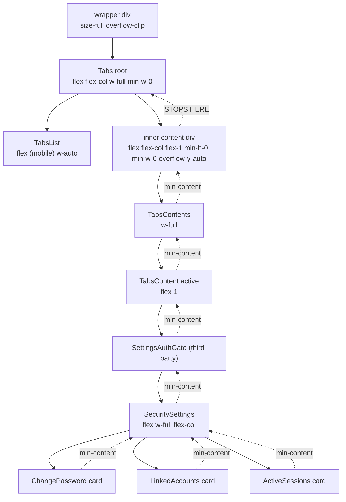
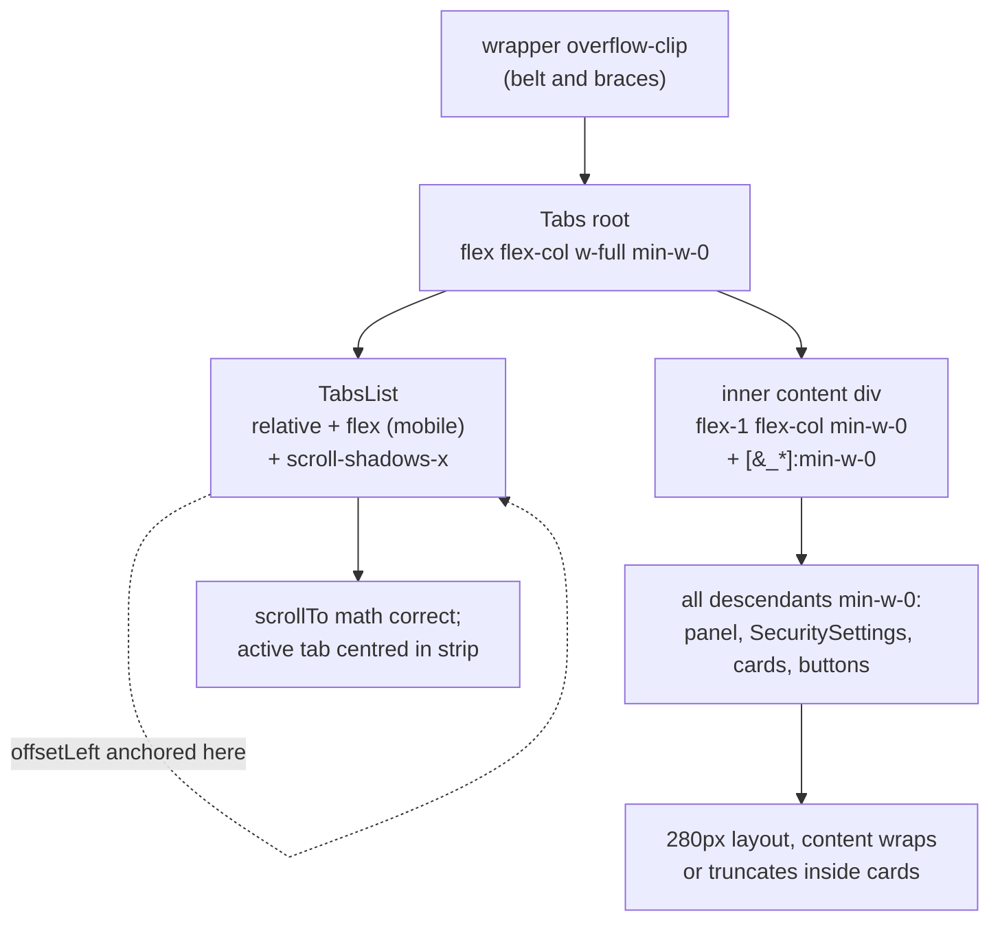

# Settings Dialog Mobile Overflow Architecture

Investigate why the mobile settings dialog still has cards overflowing horizontally and a broken tab-strip centering animation after three iterative fix attempts, and identify the architecturally correct CSS composition.

## Executive Summary

Three rounds of CSS fixes have addressed the original Radix Tabs unmount-on-switch bug but left two regressions standing: (a) panel content (cards, buttons) still lays out wider than the dialog because flex children's `min-width: auto = min-content` default cascades up _through every flex container we own_ and only stops at the first ancestor we ourselves gave `min-w-0`; and (b) the v3 `scrollTo` replacement is mathematically wrong because `Element.offsetLeft` is reported relative to the trigger's `offsetParent`, which is _not_ TabsList (TabsList has no `position` set). Both bugs are CSS-spec-faithful behavior, not browser quirks. The architecturally correct fix is two single-line additions: `position: relative` on TabsList (so `offsetLeft` is anchored where the math expects), and a universal-descendant `[&_*]:min-w-0` on the panel area (so the min-content cascade is broken before it reaches third-party panel content we don't control). Defensive overflow-clip stays.

## Problem Statement

The settings dialog uses a Radix `Tabs` root rendered inside `Dialog`. After a recent set of architectural changes (forceMount panels, single-root tabs, block-flex layout, programmatic scroll), two regressions persist on mobile (≤768px):

1. **Cards overflow off the right edge of the dialog.** Visible in the screenshots: the "Set password" card body and the green "Send reset link" button extend past the right edge of the dialog and are clipped at the dialog wrapper. Linked-accounts and active-session cards exhibit the same overflow. Desktop layout is unaffected.
2. **Tab-strip centering animation is broken.** When opening the dialog with `?settings=security` (Security is the third tab), the strip stays at `scrollLeft = 0` instead of scrolling to centre Security in the visible viewport. The previous `scrollIntoView` call did centre correctly; the v3 replacement does not.

Both regressions affect mobile only and are reproducible deterministically.

## Methodology

- Read each settings dialog component file ([`settings-dialog.tsx`](../../apps/ui/app/components/settings/settings-dialog.tsx), [`responsive-tabs.tsx`](../../apps/ui/app/components/ui/responsive-tabs.tsx), [`tabs.tsx`](../../apps/ui/app/components/ui/tabs.tsx), [`dialog.tsx`](../../apps/ui/app/components/ui/dialog.tsx), [`security-settings.tsx`](../../apps/ui/app/components/auth/settings/security/security-settings.tsx)).
- Traced the parent → child width-and-overflow chain top-down from `DialogContent` through to a leaf Card/Button.
- Cross-referenced CSS Flexbox Level 1 (`min-width: auto`), CSSOM View (`offsetLeft`/`offsetParent`), and CSS Overflow 4 (`overflow: clip` vs `overflow: hidden`) specs.
- Compared against the staging build (the original 2-roots responsive tabs predates this whole investigation and never had the new bugs because its cross-axis stretch happened in a different ancestor configuration).
- Reviewed three prior fix attempts captured in plan files (v1: forceMount + single root; v2: block-flex + `min-w-0`; v3: `scrollTo` + `overflow-clip`).

## Findings

### Finding 1: `min-width: auto` cascades up through every flex ancestor we don't explicitly break

This is the root cause of the card overflow. CSS Flexbox 1 §4.5 specifies that the _initial_ `min-width` (and `min-height`) of a flex item is `auto`, which resolves to the item's **min-content size**. That value cascades transitively: the min-width of a flex container is the maximum of its items' min-widths, recursively, all the way down to leaf text nodes that have unbreakable runs.

The current chain on mobile, after the v1–v3 fixes, is:



`min-w-0` on the inner content div ([`responsive-tabs.tsx#L116`](../../apps/ui/app/components/ui/responsive-tabs.tsx#L116)) is the _only_ break in the cascade. Everything above it is fine. Everything below it — `TabsContents`, the active `TabsContent`, `SettingsAuthGate`, `SecuritySettings` (which is _itself_ a `flex w-full flex-col` container at [`security-settings.tsx#L26`](../../apps/ui/app/components/auth/settings/security/security-settings.tsx#L26)), and every flex Card layout inside — still has `min-width: auto`, so each is sized to its own min-content.

When a leaf Card (e.g. ChangePassword) has internal flex layout with non-shrinking content (icon + name + email + Unlink button row, where the email or button text creates an unbreakable min-content > 280px), that min-content propagates back up to `TabsContents`. `TabsContents` _does_ have `min-width: auto = min-content = 380px or so`. Inside the inner content div (which has `min-w-0` and is therefore 280px wide), `TabsContents` overflows by ~100px horizontally.

The wrapper's `overflow-clip` then clips the visible result — which is exactly what we see in the screenshots: cards laid out at the wider intrinsic width, with the overflowing right portion invisible.

This is **not** a layout bug; the layout is doing exactly what CSS specifies. It is an _architectural_ bug: the cascade is correctly happening, but we never break it at a level low enough to keep the third-party `SecuritySettings` content from setting the floor for the panel width.

Critically: the staging build does not have this bug because it never applied `forceMount` and `min-w-0`. In staging, only the active panel is mounted, the inner content div has _no_ `min-w-0` so it grew to min-content, the dialog content area was wider than visible, and the original bug was that `scrollIntoView` walked up and scrolled it. Adding `forceMount` (correct) plus `min-w-0` on the inner content div (also correct, to prevent the v1 dialog-scroll bug) revealed this latent overflow that was always there but was being masked by the dialog-wide horizontal scroll.

### Finding 2: `Element.offsetLeft` is relative to `offsetParent`, not `parentNode`

This is the root cause of the broken centering. CSSOM View §4.4 (`offsetLeft`) returns the distance to the nearest ancestor in the _offset parent chain_, not the DOM parent. The offset parent is the nearest ancestor with `position: relative | absolute | fixed | sticky`, or the body if no such ancestor exists.

The v3 plan replaced `scrollIntoView` with:

```ts
const targetLeft = active.offsetLeft - (list.clientWidth - active.offsetWidth) / 2;
list.scrollTo({ left: targetLeft, behavior: 'smooth' });
```

The math assumes `active.offsetLeft` is the trigger's left edge measured _within TabsList's content box_. That is true if and only if `offsetParent === tabsListRef.current`, i.e., if TabsList itself is the trigger's nearest positioned ancestor.

But `TabsList` in [`tabs.tsx`](../../apps/ui/app/components/ui/tabs.tsx) sets no `position` utility. Its base classes are:

```
'w-fit items-center justify-center rounded-md bg-sidebar p-0.75 text-sidebar-foreground'
'data-[orientation=vertical]:h-fit'
'data-[orientation=horizontal]:min-h-8'
'data-[orientation=horizontal]:inline-flex'
```

No `relative`. The trigger (which has `z-10` for stacking but no `position`) walks up: TabsList — none. Tabs root — none. Inner content div — none. Wrapper — none. DialogContent — `fixed top-50% left-50%` — **first positioned ancestor**.

Therefore `active.offsetLeft` is the distance from DialogContent's content edge, not TabsList's. With DialogContent ~280px wide and Security trigger at, say, 90px from DialogContent's left, `targetLeft = 90 - (clientWidth - offsetWidth)/2 ≈ 90 - 90 ≈ 0`. The browser clamps to `[0, scrollWidth - clientWidth]` and lands at 0. **No scroll happens.**

The math is identical for any starting position; the bug is that we read the offset against the wrong frame of reference. The v3 plan's note "TabsList is the scroll container" was correct for _scrolling_, but TabsList being a scroll container does not also make it the offset parent — those are independent CSS concepts.

### Finding 3: Why each prior fix attempt was insufficient

| Attempt                                                                    | Goal                                                                                   | Outcome                         | Why insufficient                                                                                                                                                                                                                                                                                             |
| -------------------------------------------------------------------------- | -------------------------------------------------------------------------------------- | ------------------------------- | ------------------------------------------------------------------------------------------------------------------------------------------------------------------------------------------------------------------------------------------------------------------------------------------------------------ |
| v1 (forceMount + single Tabs root)                                         | Stop tab switches from re-mounting panels and stop double-mount from dual `Tabs` roots | Achieved both                   | Did not address horizontal overflow at all; orthogonal concern that surfaced because the new layout depended more strongly on intrinsic width                                                                                                                                                                |
| v2 (block-flex on TabsList + `min-w-0` on Tabs root and inner content div) | Stop `width: 100%` + `mx-6` from over-constraining TabsList                            | Achieved                        | Broke the min-content cascade _one level too high_. `min-w-0` on the inner content div lets the flex column shrink, but the min-content from leaf cards still propagates up to `TabsContents` and below, which lay out at min-content. Over-clipped by `overflow-clip` instead of constrained at layout time |
| v3 (`scrollTo` + `overflow-clip` on wrapper)                               | Stop `scrollIntoView`'s ancestor walk from scrolling the dialog wrapper sideways       | Achieved the _no-walk_ property | Made the centring math wrong because `offsetLeft` was measured against the wrong offset parent (Finding 2). Also did not address the Finding 1 overflow — `overflow-clip` clips visually but does not change layout                                                                                          |

The pattern is: each fix solved its named symptom and exposed the next layer's bug. The architecturally complete fix has to address all three layers at once: lifecycle (v1), intrinsic-width cascade (v2 ladder + extension), and scroll math (v3 + offset-parent anchor).

### Finding 4: `position: relative` is the canonical anchor for offset-based scroll math

Per CSSOM View, `offsetLeft` and `offsetTop` are stable and predictable when (and only when) the consumer of those values _also_ controls the offset parent. The idiomatic pattern is: apply `position: relative` to whichever element is acting as the scroll container, then any `offsetLeft` read on a descendant returns its position within that container's content box.

This is the same pattern used elsewhere in the codebase for offset-based scroll math (e.g., the chat history virtuoso wrappers), and is the documented approach in MDN's `Element.offsetLeft` reference.

### Finding 5: `[&_*]:min-w-0` is safe and is the canonical break for the min-content cascade

A common concern with universal-descendant utilities is that they over-broadcast. For `min-width: 0` specifically, the concern is unfounded:

- Non-flex, non-grid descendants have `min-width: auto = 0` already. Setting it to `0` explicitly is a no-op for them.
- Flex/grid descendants have `min-width: auto = min-content` by default. Setting it to `0` lets them shrink past their min-content, which is exactly the property we want to grant inside a fixed-width container.
- The only descendants legitimately needing min-content sizing are horizontally-scrolling carousels, marquees, and code blocks with `overflow-x: auto` — none of which exist inside the settings panels.

The CSS Flexbox spec explicitly recommends this pattern for "place content of unknown size inside a known-width container". Tailwind ships `[&_*]:min-w-0` as a first-class arbitrary variant for exactly this case.

## Recommendations

| #   | Action                                                                                                                                                                                                                                                                                                                     | Priority | Effort              | Impact                                                                                            |
| --- | -------------------------------------------------------------------------------------------------------------------------------------------------------------------------------------------------------------------------------------------------------------------------------------------------------------------------- | -------- | ------------------- | ------------------------------------------------------------------------------------------------- |
| R1  | Add `relative` to TabsList in [`responsive-tabs.tsx`](../../apps/ui/app/components/ui/responsive-tabs.tsx) so `active.offsetLeft` is measured against TabsList                                                                                                                                                             | P0       | Trivial (one class) | Fixes broken centring (Finding 2)                                                                 |
| R2  | Add `[&_*]:min-w-0` to the inner content div (or alternatively, apply it to each `<TabsContent>` in [`settings-dialog.tsx`](../../apps/ui/app/components/settings/settings-dialog.tsx)) so the min-content cascade is broken before it reaches third-party panel content                                                   | P0       | Trivial (one class) | Fixes card overflow at layout time, not just visually (Finding 1)                                 |
| R3  | Keep `overflow-x-clip` on the dialog wrapper as defense-in-depth so any future regression that re-introduces wide content is still visually contained without re-introducing the v1 dialog-scroll bug                                                                                                                      | P1       | Already applied     | Prevents future-attempt regressions (kept from v3)                                                |
| R4  | Document this pattern (`[&_*]:min-w-0` + `position: relative` on the offset-parent + `overflow-clip` boundary) in [`engineering-forms-policy.md`](../policy/engineering-forms-policy.md) or a new dialog/forms layout policy as the canonical recipe for "render arbitrary third-party content in a fixed-width container" | P2       | Small               | Stops the same investigation reoccurring for the next dialog (publish modal, billing modal, etc.) |

The primary fix is R1 + R2 — two single-class additions. R3 is already in place. R4 is a documentation follow-up.

### R1 in detail

[`responsive-tabs.tsx`](../../apps/ui/app/components/ui/responsive-tabs.tsx#L83) — TabsList className adds `max-md:relative` (or unconditional `relative`; relative is harmless on desktop because the desktop strip never scrolls):

```tsx
'max-md:flex max-md:min-h-8 max-md:justify-start max-md:relative',
```

Why `relative` and not `absolute`/`fixed`: `relative` keeps the element in normal flow (no layout effect on its parent or siblings), only changes the offset parent of its descendants. This is _exactly_ the contract we want.

### R2 in detail

[`responsive-tabs.tsx`](../../apps/ui/app/components/ui/responsive-tabs.tsx#L116) — inner content div className adds `[&_*]:min-w-0`:

```tsx
<div className={cn('flex min-h-0 min-w-0 flex-1 flex-col gap-6 overflow-y-auto [&_*]:min-w-0', contentClassName)}>
```

This one Tailwind arbitrary variant emits a single nested rule (`& *  { min-width: 0; }`) that flattens the entire min-content cascade for all descendants of the panel column.

Verification path:

1. Inner content div has `min-w-0` (already) — at 280px because it can shrink past its children's min-content.
2. Every flex/grid descendant has `min-width: 0` (new) — none of them is anchored to its own min-content.
3. SecuritySettings's `flex w-full flex-col` is now genuinely 280px wide.
4. Cards as flex items of SecuritySettings can shrink to their flex-basis without being floored at min-content.
5. Long unbreakable strings inside cards wrap (or truncate via `text-ellipsis` if the card has `overflow-hidden`); buttons with `w-full` are 280px wide.
6. No visible overflow. `overflow-clip` on the wrapper remains as belt-and-braces.

### Combined effect



## Why earlier diagnoses were directionally right but incomplete

- **v1 (forceMount + single root)**: correct lifecycle change. Independent of the overflow concern.
- **v2 (block-flex + `min-w-0`)**: correctly identified the over-constrained `width: 100% + mx-6`. The fix is right at the TabsList level. Its `min-w-0` placements on Tabs root and inner content div were also correct — but the analysis stopped one level too early. The cascade extends past the inner content div into TabsContents → TabsContent → SecuritySettings → cards. We need to break it at the _bottom_ of the chain we own, not at the top.
- **v3 (`scrollTo` + `overflow-clip`)**: correctly diagnosed `scrollIntoView`'s spec-defined ancestor walk and switched to a scoped API. The replacement was the right shape but used `offsetLeft` without ensuring TabsList was the offset parent. Adding `position: relative` is the missing piece.

None of the prior fixes was wrong; each addressed a real bug. The full stack of fixes simply needs to extend the cascade-break further down the tree and anchor the offset math correctly.

## Code Examples

Final composed responsive-tabs.tsx changes (R1 + R2, on top of v1–v3):

```diff
       <TabsList
         ref={tabsListRef}
         className={cn(
-          'max-md:flex max-md:min-h-8 max-md:justify-start',
+          'max-md:relative max-md:flex max-md:min-h-8 max-md:justify-start',
           'max-md:scroll-shadows-x max-md:scroll-smooth max-md:[scrollbar-width:none]',
           'md:mt-14 md:w-fit',
           tabsListClassName,
         )}
       >
       ...

-      <div className={cn('flex min-h-0 min-w-0 flex-1 flex-col gap-6 overflow-y-auto', contentClassName)}>
+      <div
+        className={cn(
+          'flex min-h-0 min-w-0 flex-1 flex-col gap-6 overflow-y-auto [&_*]:min-w-0',
+          contentClassName,
+        )}
+      >
```

No other files need changes. The settings-dialog.tsx `overflow-clip` wrapper stays. The TabsList `mx-6` margin via `tabsListClassName` stays. The scrollTo `useEffect` body stays — it becomes correct once R1 is applied.

## References

- [CSS Flexbox Level 1 §4.5: `min-width`/`min-height`](https://drafts.csswg.org/css-flexbox/#min-size-auto) — the spec source for `min-width: auto` resolving to min-content for flex items.
- [CSSOM View §4.4: `offsetLeft`](https://drafts.csswg.org/cssom-view/#dom-htmlelement-offsetleft) — the spec source for "offset parent" semantics.
- [MDN: `Element.offsetLeft`](https://developer.mozilla.org/en-US/docs/Web/API/HTMLElement/offsetLeft) — practical reference confirming `offsetLeft` is relative to offsetParent.
- [MDN: `min-width: auto` for flex items](https://developer.mozilla.org/en-US/docs/Web/CSS/CSS_flexible_box_layout/Mastering_wrapping_of_flex_items#min_size) — practical reference and recommended `min-width: 0` workaround.
- Prior plans:
  - `/Users/rifont/.cursor/plans/settings_dialog_mount_lifecycle_1f9ce934.plan.md` (v1: forceMount + single root)
  - `/Users/rifont/.cursor/plans/mobile_responsive_tabs_overflow_e839aa52.plan.md` (v2: block-flex + min-w-0)
  - `/Users/rifont/.cursor/plans/scrollintoview_ancestor_walk_fix_95adc04a.plan.md` (v3: scrollTo + overflow-clip)

## Appendix: Complete CSS chain after R1 + R2

| Element                     | width source                                           | min-width                                              | overflow                                 |
| --------------------------- | ------------------------------------------------------ | ------------------------------------------------------ | ---------------------------------------- |
| `DialogContent`             | `w-full max-w-[calc(100%-2rem)]`                       | auto = 0                                               | hidden (Radix)                           |
| wrapper `<div>`             | `size-full` (= 100%)                                   | auto = 0                                               | clip                                     |
| Tabs root                   | `w-full` + `min-w-0`                                   | 0                                                      | visible                                  |
| TabsList (mobile)           | `w-auto` (block-level flex, fills parent − margins)    | auto = min-content of triggers (intentional, scrolled) | auto (from `scroll-shadows-x`)           |
| inner content div           | flex-1 stretch (= parent width) + `min-w-0`            | 0                                                      | y: auto, x: visible (clipped by wrapper) |
| TabsContents                | `w-full` + inherits `[&_*]:min-w-0`                    | 0                                                      | visible                                  |
| TabsContent (active)        | block default (= parent) + inherits `min-w-0`          | 0                                                      | visible                                  |
| SettingsAuthGate            | flex layout, `min-w-0` inherited                       | 0                                                      | visible                                  |
| SecuritySettings            | `flex w-full flex-col`, `min-w-0` inherited            | 0                                                      | visible                                  |
| Cards                       | flex children of SecuritySettings, `min-w-0` inherited | 0                                                      | visible (truncate inside)                |
| Card content (button, text) | flex children, `min-w-0` inherited                     | 0                                                      | wraps or truncates                       |

Every flex/grid descendant of the inner content div now has `min-width: 0`, so the cascade terminates at the top boundary. `position: relative` on TabsList anchors `offsetLeft` so scrollTo is precise.
