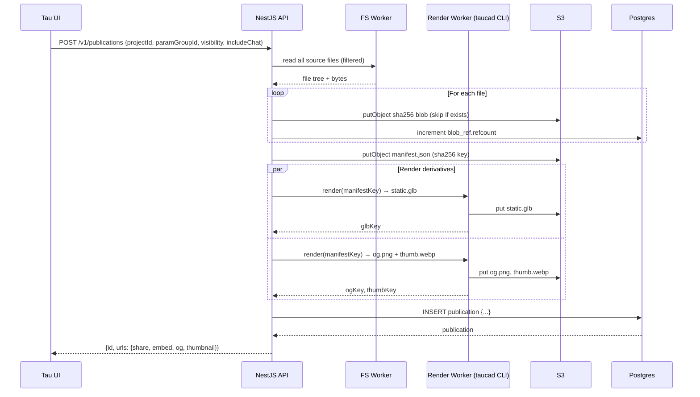
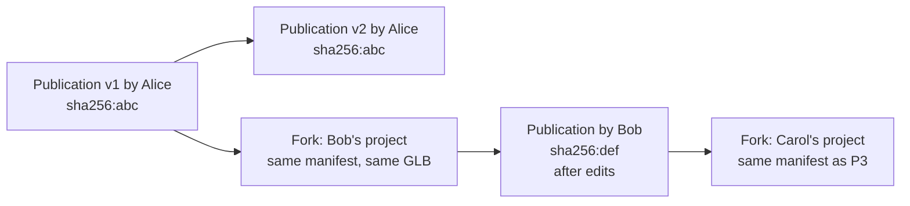

# Sharing & Publishing Architecture for Tau

Audit of every persistent surface that constitutes a Tau project, plus cross-platform research into how 14 modern code/CAD/design platforms architect publish/share/snapshot/embed/fork features, producing a prioritized roadmap for native model sharing in `tau.new`.

## Executive Summary

Tau today has **no server-side project persistence** — every "project" is a row in the user's local IndexedDB (`tau-db.projects`), every file is bytes in `tau-fs-direct` or OPFS, every chat lives in `tau-db.chats`. The Drizzle `project` table exists in `apps/api/app/database/schema.ts` but is a **dormant stub** (`serial` PK, no `owner_id`, no app code references it; the original migration even named it `build`). Sharing therefore requires more than an "add a snapshot table" feature — it is the moment the platform becomes server-stateful for project content for the first time.

Three findings dominate the recommendations:

1. **Sharing must not be coupled to project ownership.** A `Publication` (the immutable shared artifact) should be a first-class entity that is independent of whether the source project ever syncs to the server. This lets local-first projects on `indexeddb`/`opfs`/`webaccess` backends publish a frozen copy without forcing every project into server sync. It also avoids blocking sharing on a much larger "cloud sync" project.
2. **Cross-origin isolation is a performance optimization, not a hard requirement for embeds.** Per `docs/architecture/runtime-topology.md` § Graceful Degradation, the runtime already falls back from `SharedArrayBuffer`-backed transport to inline `postMessage` delivery when SAB is unavailable, and the file-bridge falls back to RPC. This means **kernels can run inside embeds even on third-party hosts that are not cross-origin isolated** — at reduced throughput (no SAB zero-copy, no WASM threads for OC-based kernels), but functionally complete. Every published model still needs a **pre-rendered GLB derivative** as a **first-paint optimization**: the static viewer renders instantly while the interactive kernel boots in the background, then hands off seamlessly. This matches Tau's existing transport-graceful-degradation pattern rather than the Autodesk/Shapr3D static-only model.
3. **Avoid the name "snapshot" for the new feature.** Tau already overloads "snapshot" in two places: `messageMetadataSchema.snapshot` (LLM editor-context bundle in `libs/chat`) and the LangGraph `PostgresSaver` checkpoints. Use **`Publication`** (immutable, shareable artifact) and **`Publish`** (the verb) to avoid confusion. This is more than aesthetics — type/name collisions in cross-cutting code (chat metadata vs. publication payloads) cause real bugs.

The recommended target is a **content-addressed publication model**: sha256-keyed file blobs in S3-compatible storage, a Postgres `publication` table holding manifest + visibility + GLB/OG derivatives + lineage, an O(1) "Fork" that copies the manifest pointer (copy-on-write at the blob layer on first divergent edit), 3-tier visibility (Private / Unlisted with unguessable token / Public), a dedicated `embed.tau.new` cross-origin-isolated origin that ships GLB-first (instant paint) with progressive upgrade to the interactive kernel (with or without SAB acceleration depending on host COI), and an opt-in "publish with chat thread" mode that addresses Bolt.new's #1 anti-pattern.

For object storage, the recommendation is **Cloudflare R2 in production** (zero egress, $0.015/GB-mo storage, native CDN via `cdn.tau.new`, conditional `If-None-Match: '*'` for atomic content-addressed dedup, 11-nines durability, SOC 2 Type II) and **MinIO in `infra/docker-compose.yml` for local dev** (highest S3 parity in the open-source ecosystem; pinned to a known-good 2025 release; `mc` sidecar bootstraps buckets/IAM/CORS on `pnpm infra:up`). Both speak the same S3 API surface and are exercised through a single `ObjectStorageService` abstraction in the API, so every code path that ships to production runs first against MinIO in `pnpm dev`. Cost projection at Year 3 (10 TB stored, 100 TB egress/mo): R2 ~$190/mo vs AWS S3+CloudFront ~$7,485/mo — **40× cheaper over 3 years** because public model embeds amplify reads-per-write by 100–10,000× and egress dominates the bill.

## Table of Contents

- [Problem Statement](#problem-statement)
- [Current State Audit](#current-state-audit)
- [Persistence Surface Mapping](#persistence-surface-mapping)
- [Methodology](#methodology)
- [Platform Findings](#platform-findings)
- [Cross-Cutting Themes](#cross-cutting-themes)
- [Recommendations for Tau](#recommendations-for-tau)
- [Object Storage: Local-Dev to Production](#object-storage-local-dev-to-production)
- [Phased Roadmap](#phased-roadmap)
- [Naming Conventions](#naming-conventions)
- [Open Questions](#open-questions)
- [Scope and Non-Goals](#scope-and-non-goals)
- [Trade-offs](#trade-offs)
- [Diagrams](#diagrams)
- [References](#references)

## Problem Statement

A user has a working Tau project — a parametric model with parameter groups, a chat thread that explored the design space, an open-tab layout, a custom viewer camera, and an exported GLB. They click **Share**. What should happen?

Today, nothing useful: the **Share** entry in `nav-projects.tsx` is an unwired dropdown, the `'publish'` mode in `chat-mode-selector.tsx` is commented out with the note _"Disabled until publishing is implemented"_, and the **Share** button in the project header (visible in the IDE between `Export` and `Search`) is a placeholder. There is no `/share` or `/p/{id}` route, no `publication` table, no embed origin, no OG image pipeline.

The platform-shape question is: what does **published model** mean for a parametric CAD project that uses arbitrary user code, multiple kernels, parameter groups, an AI conversation, and depends on cross-origin isolation to run? The product question is: which sharing primitives matter most, in what order, to a public-launch roadmap?

This document audits the existing persistence surface and surveys 14 comparable platforms to answer both.

## Current State Audit

### Smoking Guns

| #    | Finding                                                                                                                                                                                                                      | Evidence                                                                                                                                                  | Implication                                                                                                                                                                                                |
| ---- | ---------------------------------------------------------------------------------------------------------------------------------------------------------------------------------------------------------------------------- | --------------------------------------------------------------------------------------------------------------------------------------------------------- | ---------------------------------------------------------------------------------------------------------------------------------------------------------------------------------------------------------- |
| SG1  | **No server-side project ownership.** Drizzle `project` table is a stub: `serial` PK, no `owner_id`, no FK from any other table, no app code uses it. The first migration named it `build` (drift).                          | `apps/api/app/database/schema.ts:3-8`; `apps/api/app/database/migrations/0000_loving_ozymandias.sql:17-22`; no `apps/api/app/api/projects/` module exists | Sharing requires the **first** server-owned project entity in Tau. Schema must be designed greenfield, not migrated.                                                                                       |
| SG2  | **`Project.id` is currently a string nanoid in TypeScript but `serial` in Postgres.**                                                                                                                                        | `libs/types/src/types/project.types.ts:20` (`id: string`) vs. `schema.ts:4` (`serial`)                                                                    | Either drop the unused stub and re-create with text PK + nanoid, or accept the divergence. The stub should be removed.                                                                                     |
| SG3  | **`Project.author` is a display struct `{name, avatar}`, not a FK to `user.id`.**                                                                                                                                            | `libs/types/src/types/project.types.ts:23-26`                                                                                                             | Server-side ownership/permission checks need a real `owner_id text references user(id)` column.                                                                                                            |
| SG4  | **"Share Project" UI exists but is unwired.** Dropdown item in `nav-projects.tsx:61-68` with no `onClick`.                                                                                                                   | `apps/ui/app/components/sidebar/nav-projects.tsx`                                                                                                         | Pre-existing UI commitment — sharing is already on the UX surface.                                                                                                                                         |
| SG5  | **`'publish'` chat mode exists but is disabled.** `chat-mode-selector.tsx` defines mode `'publish'` with label _"Share and export models"_, but `route.tsx:51-52` comment says _"Disabled until publishing is implemented"_. | `apps/ui/app/components/chat/chat-mode-selector.tsx`; `apps/ui/app/routes/projects_.$id/route.tsx`                                                        | An AI-assisted publishing flow is part of the product vision. The model decides how/what to publish.                                                                                                       |
| SG6  | **`Project.forkedFrom?: string` already exists, populated by `duplicateProject`.**                                                                                                                                           | `libs/types/src/types/project.types.ts:31`; `apps/ui/app/hooks/object-store.worker.ts:125-158`; `apps/ui/app/hooks/use-project-manager.tsx:284-289`       | Local fork lineage exists; needs to be lifted to server when publication forking lands.                                                                                                                    |
| SG7  | **The word "snapshot" is already overloaded.** `messageMetadataSchema.snapshot` carries LLM editor context per message; `LangGraph PostgresSaver` writes "checkpoints" in the `langgraph` schema.                            | `libs/chat/src/schemas/metadata.schema.ts:25-44`; `apps/api/app/api/chat/checkpointer.service.ts:22-27`                                                   | Use **`Publication`** for the new feature. "Snapshot" is unsalvageable as a distinct concept name.                                                                                                         |
| SG8  | **Per-project filesystem backend selection.** A user can have project A on `indexeddb`, project B on a `webaccess`-mounted folder, project C in OPFS.                                                                        | `apps/ui/app/db/handle-store.ts:36-40, 206-214`; `libs/types/src/constants/filesystem.constants.ts:10`                                                    | Publishing must serialize file bytes irrespective of backend. The `webaccess` case is most interesting: user files live on disk; publish must read-and-upload, not require server sync of the live folder. |
| SG9  | **`EditorState` is large and project-specific.** Open files, dockview layouts (`SerializedDockview`), per-viewer-pane camera/graphics settings, panel sizes. Stored in `tau-db.editor` keyed by `projectId`.                 | `apps/ui/app/types/editor.types.ts:110-128`                                                                                                               | Decision: do **published views** include the saved camera/layout? Yes — it is a meaningful authored artifact (the author chose the framing).                                                               |
| SG10 | **Chat already has a `snapshot` field on every message.** Includes `fileTree`, `activeFile`, `openFiles`.                                                                                                                    | `libs/chat/src/schemas/metadata.schema.ts:25-44`                                                                                                          | Reusable model: a `Publication` can capture the same shape (and more) at publish time. Do not invent new schemas — extend the existing pattern.                                                            |
| SG11 | **Chat conversation persists only client-side.** No `chat` table in `schema.ts`. LangGraph checkpoints exist server-side in `langgraph` schema but are agent runtime state, not the user-visible message history.            | `apps/ui/app/db/indexeddb-storage.ts` (`chats` store); `schema.ts` (no `chat` table)                                                                      | "Publish with chat thread" requires uploading client chat state to the server at publish time. The server does not currently own chat history.                                                             |
| SG12 | **No object storage configured.** API has no S3 / R2 / GCS client, no `STORAGE_*` env vars, no upload service.                                                                                                               | grep over `apps/api/`                                                                                                                                     | Object storage is a foundational dep. Recommend Cloudflare R2 (S3-compatible, no egress fees, zero-config worker integration) — fits the Netlify/Fly stack.                                                |
| SG13 | **No `projects` Nest module.** API has `chat`, `models`, `kernels`, `tools`, `analysis`, `file-edit`, `code-completion`, `health`, `privacy`, `providers`, `telemetry`, `test-api`, `websocket` — but no `projects`.         | `apps/api/app/api/` listing                                                                                                                               | Greenfield NestJS module for `projects` and `publications` (or one combined `library` module).                                                                                                             |
| SG14 | **File pool is a 50 MiB SharedArrayBuffer in RAM, never persisted.**                                                                                                                                                         | `apps/ui/app/machines/file-manager.machine.ts:28-29, 149-163`                                                                                             | Not in scope for publication serialization (transient transport). Mention to avoid confusion.                                                                                                              |
| SG15 | **`module-manager.ts` `node_modules` cache is in the FS provider, shared across projects.**                                                                                                                                  | `apps/ui/app/lib/module-manager.ts:5-12`                                                                                                                  | Publications should NOT include `/node_modules/` paths; it is a derived cache, not project content. Filter at publish time.                                                                                |
| SG16 | **Cookies hold user-level preferences** (`cadKernel`, `chatModel`, `filesystemBackend`, `viewerEnvironment`, `converterOutputFormats`).                                                                                      | `apps/ui/app/constants/cookie.constants.ts:12-95`                                                                                                         | These are **user**-scoped, not **project**-scoped. Publications should not capture them.                                                                                                                   |

### Server-Side State Today

| Surface                                               | What it stores                     | Used by                                         |
| ----------------------------------------------------- | ---------------------------------- | ----------------------------------------------- |
| `public.user` (Better Auth)                           | Profile, email, AI-training opt-in | Auth                                            |
| `public.session`, `account`, `verification`, `apikey` | Auth machinery                     | Better Auth                                     |
| `public.project` (stub)                               | `id serial`, `name`, `description` | **Nothing** (dormant)                           |
| `langgraph.*` (PostgresSaver)                         | Agent checkpoints                  | `apps/api/app/api/chat/checkpointer.service.ts` |
| Redis                                                 | Socket.IO scaling adapter          | `RedisIoAdapter` (transport only)               |

### Client-Side State Today

| Surface                           | What it stores                                                                                                     |
| --------------------------------- | ------------------------------------------------------------------------------------------------------------------ |
| **IDB `tau-db.projects`**         | `Project` rows (the canonical project entity today)                                                                |
| **IDB `tau-db.chats`**            | `Chat` rows: `messages[]`, `draft`, `messageEdits`, `activeModel`, `activeKernel`, `resourceId` linking to project |
| **IDB `tau-db.editor`**           | `EditorState`: open tabs, active file, dockview layouts, panel sizes, per-pane camera/graphics                     |
| **IDB `tau-fs-direct.files`**     | Path → file bytes (when backend = `indexeddb`, the default)                                                        |
| **IDB `tau-fs-handles.handles`**  | `FileSystemDirectoryHandle` (for `webaccess` backend)                                                              |
| **IDB `tau-fs-handles.configs`**  | Per-`projectId` filesystem backend selection                                                                       |
| **OPFS**                          | File bytes (when backend = `opfs`)                                                                                 |
| **localStorage**                  | `tau:flags` (feature flags), `network-status`                                                                      |
| **Cookies (`tau-*`)**             | Theme hue/mode, `cadKernel`, `chatModel`, sidebar/layout, viewer environment, converter formats, cookie consent    |
| **Cookie `tau-theme` (httpOnly)** | Server-rendered theme                                                                                              |

## Persistence Surface Mapping

What goes into a Publication, what stays per-user, and what is intentionally re-derived on view:

| Persistence surface                                                                | Source                                      | In Publication?                                                                                                                                                                                  | Rationale                                                                                                                             |
| ---------------------------------------------------------------------------------- | ------------------------------------------- | ------------------------------------------------------------------------------------------------------------------------------------------------------------------------------------------------ | ------------------------------------------------------------------------------------------------------------------------------------- |
| `Project.{name,description,tags,thumbnail,createdAt,updatedAt}`                    | IDB `tau-db.projects`                       | **Yes**                                                                                                                                                                                          | Identity and metadata of the model.                                                                                                   |
| `Project.{author, forkedFrom, deletedAt, assets}`                                  | IDB `tau-db.projects`                       | Partial — `author` becomes server-resolved from `owner_id` at publish; `forkedFrom` becomes `parent_publication_id`; `deletedAt` is per-user soft delete (irrelevant); `assets` reified from FS. | Don't trust client-supplied author display data.                                                                                      |
| All file bytes under `/projects/${id}/`                                            | FS provider (any of 4 backends)             | **Yes**, sha256-keyed blobs                                                                                                                                                                      | The model itself.                                                                                                                     |
| `.tau/parameters/<entry>.json`                                                     | FS (subset of above)                        | **Yes**                                                                                                                                                                                          | Parameter groups + active group are model behavior.                                                                                   |
| `node_modules/` cache                                                              | FS (shared across projects)                 | **No**                                                                                                                                                                                           | Derived, large, project-agnostic.                                                                                                     |
| `.git/` (if present, `git.machine.ts` working tree)                                | FS (`/git/projects/${id}`)                  | **Optional**                                                                                                                                                                                     | If present, capture `HEAD`, branch name, recent commits. Skip object packs — too large.                                               |
| `Chat` rows for the project (`Chat.resourceId === projectId`)                      | IDB `tau-db.chats`                          | **Optional, opt-in at publish**                                                                                                                                                                  | "Publish with chat thread" is the v0.dev pattern. Off by default for IP / verbosity reasons.                                          |
| Chat message images (data URLs in `Chat.messages[].parts`)                         | embedded in IDB                             | **Yes if chat included**                                                                                                                                                                         | Re-blob to S3, replace with URLs.                                                                                                     |
| `EditorState.{viewerLayout, viewSettings}`                                         | IDB `tau-db.editor`                         | **Yes** — the saved framing/layout is authored                                                                                                                                                   | Reuses `SerializedDockview` and `GraphicsViewSettings` shapes.                                                                        |
| `EditorState.{openFiles, activeFilePath, panelState, editorLayout, focusedChatId}` | IDB `tau-db.editor`                         | **No** — view-time UI preference                                                                                                                                                                 | Each viewer of the publication sees their own open-tab layout.                                                                        |
| Pre-rendered GLB derivative                                                        | Server render at publish                    | **Yes** (derivative, S3-stored)                                                                                                                                                                  | First-paint accelerator on every host (COI or not); also seeds the OG render. Not a fallback path — kernel still boots after Stage 1. |
| Pre-rendered OG image (1200×630 PNG)                                               | Server render at publish                    | **Yes** (derivative, S3-stored)                                                                                                                                                                  | Required for social previews.                                                                                                         |
| Pre-rendered thumbnail (256×256 PNG/WebP)                                          | Server render at publish                    | **Yes** (derivative, S3-stored)                                                                                                                                                                  | Library/grid views.                                                                                                                   |
| Runtime version pin (e.g., `@taucad/runtime@~1.4.0`)                               | Server-resolved at publish                  | **Yes**                                                                                                                                                                                          | Reproducibility (see Theme H).                                                                                                        |
| Active kernel(s) used                                                              | Resolved from FS scan + `Chat.activeKernel` | **Yes**                                                                                                                                                                                          | Required to load the correct kernel at view time.                                                                                     |
| Cookies / user preferences                                                         | Per-user                                    | **No**                                                                                                                                                                                           | View-side rendering uses the viewer's preferences.                                                                                    |
| Feature flags / network-status                                                     | localStorage                                | **No**                                                                                                                                                                                           | Per-user.                                                                                                                             |
| LangGraph checkpoints                                                              | Postgres `langgraph` schema                 | **No**                                                                                                                                                                                           | Agent execution state is not user-facing artifact.                                                                                    |
| File pool SAB                                                                      | RAM only                                    | **No**                                                                                                                                                                                           | Transient transport.                                                                                                                  |

## Methodology

### Audit (Tau)

- Schema review of `apps/api/app/database/schema.ts` and migrations under `apps/api/app/database/migrations/`.
- Type review of `libs/types/src/types/project.types.ts`, `libs/types/src/types/cad.types.ts`, `apps/ui/app/types/editor.types.ts`, `libs/chat/src/types/chat.types.ts`, `libs/chat/src/schemas/metadata.schema.ts`.
- IndexedDB inventory via `apps/ui/app/db/indexeddb-storage.ts`, `apps/ui/app/db/handle-store.ts`, `packages/filesystem/src/providers/`.
- Existing UI surface: `nav-projects.tsx`, `chat-mode-selector.tsx`, `project-export-action.tsx`, `routes/projects_.$id/route.tsx`, `routes/projects_.$id_.preview/`.
- Grep for `share|publish|snapshot|fork` across `apps/`, `libs/`, `packages/`.

### Cross-platform Research

WebSearch + WebFetch against current docs, blogs, and engineering posts (2024–2026) for: CodeSandbox, StackBlitz, CodePen, Replit, GitHub Gist, Onshape, Shapr3D, Autodesk Platform Services / Forge Viewer, Figma, Observable, JupyterLite, RunKit, v0.dev, Lovable, Bolt.new. Each platform was assessed across: URL scheme, snapshot storage, fork cost, visibility tiers, embed API, version history, dependency pinning, permissions, social/discovery, anonymous access, and AI conversation handling.

## Platform Findings

### Finding 1: CodeSandbox — Firecracker microVM with userfaultfd CoW

**URL**: `codesandbox.io/p/sandbox/{slug}`; embed `/embed/{id}`.

Each sandbox is a Firecracker microVM. Hibernating it produces `snapshot.snap` (VM config) + `memory.snap` (full RAM) + a CoW disk image. Resume `mmap`s the memory file so the kernel page-faults pages in lazily — **0.5–2s warm resumes**, 5–20s disk-only, 20–60s cold-archive. P50 = 400 ms across 2.5M resumes/month.

Forking uses `cp --reflink=always` on `xfs` for disk CoW + `userfaultfd` over memory: parent's `memfd_create` memory is shared with child, child reads parent pages until it writes (write-protect trap copies the page first). **~2s to clone a running 8 GB VM.**

Memory pages are stored as 8 KiB lz4-compressed chunks with a `(page_offset → file_offset)` manifest; free-page reporting via virtio balloon marks unused pages `Uninitialized` (0 bytes on disk).

Visibility: Private / Unlisted / Public. Public sandboxes embed VM previews and bill the **owner** for runtime; "Templates" let public sharing avoid that bill. Anonymous viewers can run public sandboxes; only forks require auth.

Embed iframe at `/embed/{id}` with ~20 query params (`view`, `module`, `theme`, `runonclick`, `hidedevtools`, `hidenavigation`, `initialpath`, `editorsize`, `previewwindow`, …). `sandbox="allow-forms allow-modals allow-popups allow-presentation allow-same-origin allow-scripts"` + generous `allow=`.

### Finding 2: StackBlitz / WebContainers / Bolt.new — share project, not runtime URL

**URL**: `stackblitz.com/edit/{slug}`; embed via `?embed=1`.

WebContainer projects don't have a separate deployable URL — only the source is shareable. The running preview URL (`…--3111--d20a0a75.local-corp.webcontainer-api.io`) is per-session, requires `webcontainer/connect/*` HTML served **without** `COEP: require-corp` (uses `unsafe-none`), and cannot be opened standalone — Chrome storage partitioning forces the dance through the parent host.

Embed query params: `clickToLoad`, `embed`, `initialpath`, `showSidebar`, `startScript=build,serve`, `terminalHeight`, `view`. JS SDK + oEmbed for Medium/DEV.

**Bolt.new**: each generated project gets a `*.bolt.host` deployment URL. Free-tier is public-only. Critical anti-pattern: **AI conversation context does not persist into the share** — the recipient sees current code, not generation history.

### Finding 3: CodePen — most granular visibility tiers

**URL**: `codepen.io/{user}/pen/{slug}` (5-char) for public; toggling private changes the URL to `pen/{token}` (32-char hex).

Four tiers (most granular surveyed):

1. **Public** — discoverable, MIT default, hearts/comments/feed.
2. **Private (PRO)** — unguessable URL, no license, `noindex`, hidden from profile/search.
3. **Password-Protected (PRO)** — Private + password; 3 attempts then 30-min lockout. Embeds **404**.
4. **Collaborator-Only (PRO)** — Private + invite only; 404 for everyone else.

Embed: `codepen.io/embed/{user}/pen/{slug}` with `default-tab`, `editable`, `theme-id`, `height`, `prefill`. Password/collab-only pens are not embeddable.

### Finding 4: Replit — git underneath, Publish creates immutable cloud snapshot

Workspace is a real git working tree with a UI Git pane. Publish takes a **snapshot of files + dependencies** and ships to GCP single-tenant infra at `{slug}.replit.app`. Re-publish creates a new snapshot at the same URL. Filesystem writes in deployed snapshots are **not persisted** — runtime state must go to a database/object storage. "Projects" (the multi-Repl team feature) is **deprecating 2026-03-03**.

### Finding 5: GitHub Gist — literally git, Secret = unguessable

Every gist **is a git repository** with full history, diff, revert. Multiple files per gist; download as ZIP. Public vs Secret (unguessable URL, `noindex`, **not actually private** — anyone with the URL sees it). Once public, a gist can never become private. Embed: oldest pattern in the survey, `<script src=".js">` injects styled snippet.

### Finding 6: Onshape — workspace (mutable) vs version (immutable); public = fork-not-edit

**URL**: per-document opaque ID + `?w={ws}&v={ver}`.

Each document is a feature graph + parametric history; version = git-like immutable tag, workspace = git-like mutable branch. Public docs are visible to all Onshape users who can **view and "Make a copy"** (= fork) but cannot edit the original.

Two link types: **Workspace link** (recipient sees live updates) and **Version link** (immutable). Permissions are granular per-share — View, Comment, Edit, Copy, Export, Link, Delete (best-practice for external collab is to uncheck Copy + Export so IP cannot leave). Subset sharing via **Publications** (curated, version-referenced view-only packages).

### Finding 7: Shapr3D / Autodesk APS — share-via-published-version, no SAB in embed

**Shapr3D**: local-first → cloud sync. **Published Version** = shareable web link to a 3D preview (read-only, runs in `Webviewer`). Three role tiers (Viewer/Commenter/Editor). Three visibility tiers. AR built into the link.

**Autodesk APS / Forge Viewer**: A360/Fusion Team produces `https://{tenant}.autodesk360.com/shares/public/SH{token}?mode=embed`. Embed is a fully-featured viewer (section cuts, explode, measure, markup, layers). For custom-styled viewers, instantiate `Autodesk.Viewing.GuiViewer3D` with URN+token directly. **`MultiViewerFactory` shares textures/geometry/property-DB across multiple viewer instances** on one page.

**Both bypass cross-origin isolation** by pre-baking derivatives on the server — no parametric kernel runs in the embed.

### Finding 8: Figma — `embed.figma.com` subdomain, server-side perm check

**URL**: `figma.com/{type}/{file_key}/{slug}` — file_key canonical, slug decorative (changing the file name doesn't break the link).

Embed: `embed.figma.com/{type}/{file_key}?embed-host={your_product}` — `embed-host` is **mandatory** (analytics + abuse). Iframe respects file sharing settings server-side. Org admins can globally **require passwords**, **require expirations** (1h–31d), or disable public links. Per-file: "Viewers can copy, share, and export" toggle blocks duplicate-to-account, frame copy, asset export, download.

### Finding 9: Observable — fork is the universal verb; `@latest` / `@paused` aliases

`observablehq.com/@{user}/{slug}@{alias}`. Public viewers can edit temporarily (banner says so); Fork persists changes to a new notebook. **Pause live edits**: a public notebook can be paused at version N — members see latest, public sees v_N until owner clicks Republish. URL-addressable. Embeds at cell level via Embed dialog or Runtime API for inline JS/React.

### Finding 10: JupyterLite — fully static, IndexedDB user storage, `?load=URL`

`jupyter lite build` → `_output/`. Server contents shipped in `{site}/files/`, indexed via `{site}/api/contents/all.json`. User edits in browser **IndexedDB** (default driver, configurable). `jupyterlab-open-url-parameter` extension parses `?load=https://…/notebook.ipynb` → opens as unsaved notebook.

### Finding 11: RunKit — `packageTimestamp` for npm reproducibility

Every embed accepts `packageTimestamp` (UTC ms) — npm packages published _after_ this timestamp are unavailable. **Single timestamp transitively pins the entire npm registry view** — cleanest dependency-pinning model in the survey.

### Finding 12: v0.dev — chat is first-class, Duplicate preserves AI context

`v0.dev/chat/{slug}`. A Project is one cohesive app; many chats can contribute to it (sharing GitHub repo, env vars, deploy URL). 4 visibility tiers (Private/Team/Unlisted/Public) × 2 permissions (Can view / Can edit). Recommended workflow: **"View and Duplicate"** — share Can view, collaborator clicks Duplicate → personal copy of entire chat history including AI context. **Cleanest AI-conversation-snapshot pattern in the survey.** Public API: `v0.chats.fork(chatId)`.

### Finding 13: Lovable — Remix is the only sharing primitive

Three explicit primitives: **Publishing** (run app at URL, no editor access), **Sharing** (invite by email, full code), **Remix** (open public project, click Remix → independent copy under your account). No automatic remixability.

### Finding 14: Bolt.new — see Finding 2

Same anti-pattern: AI conversation context is lost on share. v0.dev's Duplicate primitive (Finding 12) is the right counter-pattern.

## Cross-Cutting Themes

### Theme A: Snapshot Storage Architecture

| Platform          | Storage                                         | Snapshot unit                 |
| ----------------- | ----------------------------------------------- | ----------------------------- |
| CodeSandbox       | xfs CoW disk + lz4-compressed memfd memory      | Firecracker VM                |
| StackBlitz / Bolt | Project tarball-ish                             | Project files                 |
| CodePen           | Postgres rows + S3-style asset CDN              | Pen                           |
| Replit            | Git working tree + GCP-isolated deploy snapshot | Snapshot on Publish           |
| Gist              | Git (literally)                                 | Commit                        |
| Onshape           | Proprietary feature-graph store                 | Workspace + Version           |
| Figma             | Multiplayer CRDT document store + asset CDN     | File                          |
| Observable        | Postgres + immutable revisions                  | Notebook revision             |
| JupyterLite       | Static files + browser IndexedDB                | `.ipynb` file                 |
| RunKit            | Postgres + npm proxy                            | Notebook + `packageTimestamp` |
| v0.dev            | Postgres chats + GitHub repo + Vercel deploy    | Chat + Version                |

**Pattern**: heavyweight VMs (CodeSandbox, Replit deploys) snapshot RAM+disk. Code-sharing platforms (gist, CodePen, JupyterLite, RunKit) snapshot a tiny artifact — just source files + a dependency pin. CAD-specific (Onshape, Shapr3D) hide storage but expose a 2-tier mutable-workspace + immutable-version model.

**2026 best-practice for source-only snapshots**: **content-addressed object storage with sha256 keys**. S3 native versioning gives immutable `versionId` per PUT but does not deduplicate across keys; layering a sha256→blob mapping on top (UltiHash-style or DIY in Postgres) gives gist-level efficiency without running a real git server. Compression: zstd dominates for text payloads. lz4 is right for memory pages, irrelevant for source.

### Theme B: Forking Cost

| Platform        | Fork cost           | Mechanism                             |
| --------------- | ------------------- | ------------------------------------- |
| CodeSandbox     | ~2s any size        | xfs reflink + userfaultfd             |
| StackBlitz/Bolt | O(file count)       | Tarball copy                          |
| CodePen         | O(1) DB row insert  | New row, new slug                     |
| Replit          | O(repo size)        | git clone                             |
| Gist            | O(1)                | git clone (server reference)          |
| Onshape         | O(workspace size)   | Server-side document copy             |
| Figma           | O(1) reference copy | CRDT tree clone                       |
| Observable      | O(notebook size)    | Notebook copy                         |
| RunKit          | O(notebook size)    | Notebook copy                         |
| v0.dev          | O(chat history)     | Chat duplicate (preserves AI context) |
| Lovable         | O(project size)     | Remix                                 |

**Pattern**: every winning fork is **either content-addressed (gist) or a pointer-only DB row (CodePen, Figma)**. For Tau, **forking = new publication row pointing at the same content-addressed manifest** — O(1) at fork time, copy-on-write at edit time.

### Theme C: Visibility Tiers

Every platform converged on the same 3–4 tiers:

| Tier            | Auth | Discoverable | Indexed   | URL form                    |
| --------------- | ---- | ------------ | --------- | --------------------------- |
| Private         | yes  | to members   | no        | normal slug, server-checked |
| Unlisted/Secret | no   | no           | `noindex` | unguessable token in URL    |
| Public          | no   | yes          | yes       | normal slug                 |

CodePen adds Password-Protected and Collaborator-Only on top. Figma uniquely supports **org-level password requirement** and **link expiration**. Onshape supports **per-share permission grids** (View/Comment/Copy/Export/Link/Delete as separate flags) — most granular surveyed.

### Theme D: URL Schemes

**Pattern**: public IDs are short slugs; private/unlisted IDs are long unguessable tokens. CodePen does this most explicitly — toggling private changes the URL slug to a 32-char hex string. Figma's `file_key` is short base62 (~10 chars) paired with a decorative slug that can change.

For Tau: public = 8–10-char nanoid slug; unlisted = same slug + 24-char nanoid token in URL path so URL-leak doesn't enable enumeration. Use `generatePrefixedId(idPrefix.publication)` and a new `idPrefix.publicationToken`.

### Theme E: Embed APIs

Every embed converges on **iframe + query-param customization**. Variation in:

- Whether a separate embed origin exists (CodeSandbox `/embed/`, Figma `embed.figma.com`, RunKit `embed.runkit.com`).
- Customization parameter count (CodeSandbox ~20, Figma ~10, StackBlitz ~10, CodePen ~8).
- oEmbed support for Medium/Reddit unfurl.

**Critical for Tau**: Figma's `embed.figma.com` subdomain pattern — separates embed UI from full-app UI, and **isolates COEP/COOP requirements** from marketing/docs that host third-party scripts (PostHog, etc.).

Required embed query params (cross-platform consensus):

- `view` (`split` / `editor` / `preview` / `viewer`)
- `mode` (`dev` / `viewer` / `interactive`)
- `theme` (`dark` / `light`)
- `entry` — file/geometry-unit to focus (analogue of CodeSandbox `module`, Figma `node-id`)
- `runonclick` (`0` / `1`) — defer kernel boot until user clicks
- `controls` (`0` / `1`) — show/hide pan/zoom/reset
- `embed-host` — caller identifier (Figma's pattern; mandatory)

### Theme F: Cross-Origin Isolation as a Performance Tier (Tau-specific)

**The fact** (web.dev, MDN, multiple emscripten-discuss threads): a parent page **cannot grant** `cross-origin-isolated` to an iframe child. The entire chain — top-level document, all parent frames, the embedded frame, all sub-resources — must independently serve `COOP: same-origin` + `COEP: require-corp`, and the iframe tag must include `allow="cross-origin-isolated"`. If the host page is not isolated, `self.crossOriginIsolated === false` → `SharedArrayBuffer` and (for OC-based kernels) WASM pthreads are unavailable.

**What Tau already does** (per `docs/architecture/runtime-topology.md` § Graceful Degradation):

> When `SharedArrayBuffer` is unavailable: (1) Geometry pool falls back to `inline` delivery via `postMessage` transfer; (2) File pool falls back to worker RPC. **No consumer code needs SAB awareness — the pool-or-fallback decision is encapsulated at the allocation boundary.**

This means the runtime is **already designed to operate with or without SAB**. Tau embeds therefore do not need to choose between "interactive kernel" and "static viewer" — they can ship **both**, layered:

| Tier                                                                                              | Host environment      | Capability                                                                                                                                                   |
| ------------------------------------------------------------------------------------------------- | --------------------- | ------------------------------------------------------------------------------------------------------------------------------------------------------------ |
| **Tier A — Tau-native COI host** (`tau.new`, `embed.tau.new` self-host, COI-enabled partner docs) | Cross-origin isolated | SAB zero-copy transport + WASM pthreads. Maximum throughput. Existing prod path.                                                                             |
| **Tier B — Non-COI third-party host** (Medium, Reddit, Notion, most blogs)                        | Not isolated          | `postMessage` inline transport + RPC file bridge. OC kernels run single-threaded; JSCAD/OpenSCAD/etc. unaffected. Interactive parameter editing still works. |
| **Tier C — First-paint instant render** (both Tier A and B)                                       | Any                   | Pre-rendered GLB displayed in `<model-viewer>` while the kernel boots in the background, then handed off when ready.                                         |

Practical effect: **embeds always render interactively** regardless of host COI status. The pre-rendered GLB derivative is a **first-paint accelerator**, not a fallback path — it eliminates the "blank box → spinner → 3D" sequence that hurts Lighthouse scores and perceived performance, and it remains useful even on Tier A hosts (instant paint while WASM warms up). This is closer to Next.js's static-then-hydrate pattern than to Autodesk/Shapr3D's static-only viewers.

**What Autodesk and Shapr3D do**: pre-translate the model to a Forge derivative or proprietary streaming format on the server; the embed is a WebGL viewer over pre-baked artifacts. **No SAB needed because no parametric kernel runs in the embed.** Tau intentionally diverges from this — running the kernel in the embed is the differentiating "tweak parameters live in a blog post" experience.

This is the most important Tau-specific positioning decision in the architecture and informs both the embed bootstrap (R5) and the GLB pre-render pipeline (R5+R9).

### Theme G: Atomic Publish Semantics

Every platform that supports rollback/version history uses **immutable snapshots at the Publish step**. Mutable working trees coexist with immutable published versions (Onshape's workspace/version split is the cleanest expression).

For Tau: a Publish event writes a manifest to `s3://tau-publications/<sha256>.json` (sha256-keyed file references) + Postgres records `(publication_id, project_id, parent_publication_id, created_at, visibility, owner_id, ...)`. Republishing creates a new row; the old one stays referenceable.

### Theme H: Dependency Pinning

| Platform         | Mechanism                                                    |
| ---------------- | ------------------------------------------------------------ |
| CodeSandbox      | Lockfile snapshotted with project                            |
| StackBlitz       | package.json + npm install at boot                           |
| CodePen          | Per-Pen package settings (CDN-resolved)                      |
| Replit           | nix-based deps + `repl.nix`                                  |
| Gist             | None (text-only)                                             |
| Onshape          | Self-contained document                                      |
| Observable       | Imports resolved at runtime, `@version` syntax               |
| JupyterLite      | Pyodide wheels baked at build                                |
| **RunKit**       | **`packageTimestamp` — single Unix ms pins entire npm view** |
| v0.dev / Lovable | `package.json`                                               |

**RunKit's model is uniquely elegant** but Tau's reality is closer to **Onshape (self-contained document)**: the publication includes user source, parameter JSON, and **kernel + runtime version metadata** (`@taucad/runtime@1.4.2`, `replicad@v8.56.1`).

Recommended pinning: publication stores **runtime semver range it was authored against** (e.g., `~1.4.0`). The viewer always resolves to the latest patch within that minor — patch-level kernel/security updates apply transparently, but a `2.0.0` breaking change does not silently drift the publication. For higher fidelity, store the exact resolved versions and the range; viewer can choose strict or relaxed. This balances reproducibility against critical updates.

### Theme I: SEO / OG Images

| Platform                     | OG image strategy                                           |
| ---------------------------- | ----------------------------------------------------------- |
| CodeSandbox                  | Static template + sandbox preview screenshot                |
| CodePen                      | Server-rendered iframe screenshot (Puppeteer)               |
| Observable                   | Notebook thumbnail (canvas/SVG cell rasterized server-side) |
| Figma                        | Frame thumbnail per file (server-rendered from CRDT)        |
| v0.dev / Lovable             | App screenshot                                              |
| Onshape / Shapr3D / Autodesk | Generic OG (no per-doc preview — B2B, not social-shared)    |

For Tau (consumer-facing CAD): two viable patterns:

1. **Pre-render at publish**: kernel produces 1200×630 PNG on the server using a headless renderer like **Frame3D** (`frame3d.dev` — open source, headless model-viewer + Puppeteer) or **GLB2PNG** (CDN-cached on-demand). ~1s cold render for typical CAD models.
2. **On-demand render** (lazy): URL like `og.tau.new/publication/{id}.png` triggers render only on first crawler hit, then CDN-cache. Better cold-start cost, worse first-crawler latency.

Recommend **pre-render at publish**. Tau already produces GLB at publish; render to 1200×630 PNG with neutral HDR, store in S3 alongside, serve as `og:image`.

### Theme J: Anonymous Publishing

| Platform         | Anonymous publish?                                   |
| ---------------- | ---------------------------------------------------- |
| CodeSandbox      | Yes (loses on browser close unless saved to account) |
| StackBlitz       | Yes (with limits, public-only)                       |
| CodePen          | No                                                   |
| Replit           | No                                                   |
| Gist             | No                                                   |
| Observable       | Read-only viewing                                    |
| v0.dev / Lovable | No                                                   |

**Recommendation for Tau**: anonymous _viewing_ (always); anonymous _forking_ with rate limits (5 forks/IP/day → cookie-bound to a session ID → upgrade prompt to save permanently); **anonymous publishing is a spam vector — require auth.** Better Auth's email-only signup is low-friction.

### Theme K: AI Conversation Preservation

The cleanest pattern is **v0.dev**: chat is first-class, Duplicate copies the entire chat history including AI context. Bolt.new is the anti-pattern: shares lose the conversation.

For Tau: **opt-in "publish with chat thread"**. Two modes: "share with chat" vs "share code only". Default off (chats often contain exploration noise users don't want public). When on, snapshot the chat thread (text + image refs uploaded as blobs) into the publication manifest.

## Recommendations for Tau

| #   | Action                                                                                                                                                                                                           | Priority | Effort | Impact              |
| --- | ---------------------------------------------------------------------------------------------------------------------------------------------------------------------------------------------------------------- | -------- | ------ | ------------------- |
| R1  | **Content-addressed publication storage**: sha256-keyed S3 blobs + Postgres `publication` table with manifest references                                                                                         | P0       | M      | High                |
| R2  | **3-tier visibility** (Private / Unlisted / Public) with unguessable URL token for Unlisted                                                                                                                      | P0       | S      | High                |
| R3  | **Drop dormant `project` stub, recreate as text-PK with `owner_id`**                                                                                                                                             | P0       | S      | High (foundational) |
| R4  | **`embed.tau.new` dedicated cross-origin-isolated origin** with `allow="cross-origin-isolated"` + COEP/COOP headers                                                                                              | P0       | M      | High                |
| R5  | **Pre-render GLB at publish** for instant first-paint; embed shows GLB immediately, then progressively upgrades to interactive kernel (works on any host, COI or not)                                            | P0       | M      | High                |
| R6  | **O(1) fork**: new publication row with same manifest pointer; copy-on-write on first divergent edit                                                                                                             | P0       | S      | High                |
| R7  | **Atomic publish event**: write blobs + manifest + GLB + OG → only then `INSERT` publication row; no partially-published state                                                                                   | P0       | S      | Med                 |
| R8  | **Add `publications`, `chats`, `chat_messages` tables.** Optional opt-in chat-thread publication (v0.dev pattern)                                                                                                | P1       | M      | Med                 |
| R9  | **Pre-render OG image** at publish via headless Frame3D-style render (1200×630 PNG, 1s cold) → S3                                                                                                                | P1       | M      | High                |
| R10 | **Pin `@taucad/runtime` minor at publish** (e.g., `~1.4.0`) — viewer always picks latest patch in that minor                                                                                                     | P1       | S      | Med                 |
| R11 | **Embed query-param surface**: `view`, `mode`, `entry`, `theme`, `runonclick`, `controls`, mandatory `embed-host` (Figma pattern)                                                                                | P1       | S      | Med                 |
| R12 | **oEmbed endpoint** at `/api/oembed` for Medium/Notion/Reddit unfurl                                                                                                                                             | P2       | S      | Low                 |
| R13 | **Anonymous viewing + rate-limited anonymous forking** (cookie/IP-bound); auth required to publish                                                                                                               | P2       | S      | Med                 |
| R14 | **`Publish` XState event** on project machine; immutable publication ID returned and surfaced in URL bar                                                                                                         | P0       | S      | High                |
| R15 | **Save/derive thumbnail at publish** (256×256 WebP) for library grid views                                                                                                                                       | P1       | S      | Med                 |
| R16 | **Server-resolved author** (FK to `user.id`); deprecate client-supplied `Project.author` for publications                                                                                                        | P0       | S      | High                |
| R17 | **Discovery surface**: `/library/public` paginated feed, `/library/trending` (by recent fork count), `/u/{user}/library` profile                                                                                 | P2       | M      | Med                 |
| R18 | **Permission grid** (View/Comment/Copy/Export/Fork as separate flags) — Onshape style                                                                                                                            | P3       | L      | Med                 |
| R19 | **Observable-style "Suggest changes"**: viewer can fork + open a "remix request" the original author can merge or reject                                                                                         | P3       | L      | Low                 |
| R20 | **Publish via AI chat tool** (`publish_model` tool) so the AI can offer/perform publication once the disabled `'publish'` chat mode is wired                                                                     | P2       | M      | Med                 |
| R21 | **Cleanup**: remove unused `Project.deletedAt`/`assets` fields if not in use; align `Project.id` types between TS and DB                                                                                         | P1       | S      | Low                 |
| R22 | **Embed analytics**: capture `embed-host` per request; per-publication "X embeds, Y views" panel for owner                                                                                                       | P2       | S      | Low                 |
| R23 | **Cloudflare R2 in production** for sha256-keyed blobs + GLB/OG derivatives; custom domain `cdn.tau.new` with Smart Tiered Cache and Image Resizing                                                              | P0       | S      | High                |
| R24 | **MinIO in `infra/docker-compose.yml`** for local-dev S3 parity; pinned `quay.io/minio/minio:RELEASE.2025-10-15…` + `mc` bootstrap sidecar so `pnpm infra:up` provisions buckets, IAM user, and CORS in one shot | P0       | S      | High                |
| R25 | **`ObjectStorageService` interface** in `apps/api/app/storage/` wrapping `@aws-sdk/client-s3`, env-driven endpoint, single config knob switches MinIO ↔ R2 ↔ Tigris ↔ S3 with no call-site changes               | P0       | S      | High                |
| R26 | **Content-addressed writes via `If-None-Match: '*'`** (412 = dedup hit, treat as success); never `HEAD`-then-`PUT`                                                                                               | P0       | S      | Med                 |
| R27 | **Lifecycle rule** for soft-delete: app moves unpublished blobs into `unpublished/<key>` prefix, R2 lifecycle deletes after 30 days; second rule cleans orphan multipart uploads at 7 days                       | P1       | S      | Med                 |
| R28 | **Sharded sha256 key prefix** (`blobs/<sha[:2]>/<sha[2:]>`) to avoid hot-directory listing penalties at scale; immutable `Cache-Control: public, max-age=31536000, immutable` on every content-addressed PUT     | P0       | S      | Med                 |

### R1 Detail — Storage Schema

```sql
CREATE TABLE publication (
  id                    TEXT PRIMARY KEY,                  -- nanoid, idPrefix.publication
  project_id            TEXT NOT NULL REFERENCES project(id) ON DELETE CASCADE,  -- every publication belongs to a project (Open Question 3)
  owner_id              TEXT NOT NULL REFERENCES "user"(id) ON DELETE CASCADE,   -- cascade-delete on user removal (Open Question 7)
  parent_publication_id TEXT REFERENCES publication(id),   -- fork lineage (Onshape "version-from-version")
  visibility            TEXT NOT NULL,                     -- 'private' | 'unlisted' | 'public'
  unlisted_token        TEXT,                              -- nullable; 24-char nanoid for unlisted
  manifest_key          TEXT NOT NULL,                     -- s3://tau-publications/<sha256>.json
  glb_key               TEXT,                              -- pre-rendered GLB derivative
  og_image_key          TEXT,                              -- 1200x630 PNG
  thumbnail_key         TEXT,                              -- 256x256 WebP
  runtime_pin           TEXT NOT NULL,                     -- '~1.4.0'
  kernels               TEXT[] NOT NULL,                   -- ['replicad', 'openscad']
  chat_thread_blob_key  TEXT,                              -- nullable; if user shared chat
  title                 TEXT NOT NULL,
  description           TEXT,
  tags                  TEXT[],
  fork_count            INTEGER NOT NULL DEFAULT 0,
  view_count            INTEGER NOT NULL DEFAULT 0,
  embed_count           INTEGER NOT NULL DEFAULT 0,
  created_at            TIMESTAMPTZ NOT NULL DEFAULT now(),
  unpublished_at        TIMESTAMPTZ                         -- soft delete; URL 410 Gone after this
);
CREATE INDEX ON publication (project_id, created_at DESC);
CREATE INDEX ON publication (owner_id, created_at DESC);
CREATE INDEX ON publication (visibility, created_at DESC) WHERE visibility = 'public' AND unpublished_at IS NULL;
CREATE INDEX ON publication (unlisted_token) WHERE unlisted_token IS NOT NULL;

CREATE TABLE blob_ref (
  -- refcount table for sha256 blobs; GC blobs with refcount = 0
  sha256       TEXT PRIMARY KEY,
  size_bytes   BIGINT NOT NULL,
  refcount     INTEGER NOT NULL DEFAULT 0,
  created_at   TIMESTAMPTZ NOT NULL DEFAULT now()
);
```

The manifest at `s3://tau-publications/<sha256>.json` is itself sha256-keyed (identical projects dedupe at the manifest level too):

```json
{
  "version": 1,
  "files": {
    "main.ts": "sha256:abc123...",
    ".tau/parameters/main.ts.json": "sha256:def456..."
  },
  "kernels": ["replicad"],
  "runtime": "@taucad/runtime@~1.4.0",
  "renderTimeout": 30,
  "viewSettings": { "viewerLayout": { ... }, "viewSettings": { ... } },
  "createdAt": "2026-04-23T12:00:00Z"
}
```

Each `sha256:*` resolves to `s3://tau-blobs/<sha256>` (zstd-compressed if text, raw if binary).

Forking: `INSERT INTO publication (..., manifest_key) VALUES (..., <same_manifest_key>)` — zero S3 ops. Edit-then-republish writes only changed file blobs.

### R3 Detail — Project Schema Reset

Drop the dormant stub and recreate:

```sql
DROP TABLE project;

CREATE TABLE project (
  id                       TEXT PRIMARY KEY,                      -- nanoid, idPrefix.project (matches TS type)
  owner_id                 TEXT NOT NULL REFERENCES "user"(id) ON DELETE CASCADE,  -- cascade-delete on user removal (Open Question 7)
  name                     TEXT NOT NULL,
  description              TEXT,
  origin                   TEXT NOT NULL DEFAULT 'cloud',         -- 'cloud' | 'local-mirror' | 'fork-only'
  forked_from              TEXT REFERENCES publication(id),       -- if originated from a forked publication
  current_publication_id   TEXT REFERENCES publication(id),       -- pointer to latest publish (Open Question 8); null until first publish
  created_at               TIMESTAMPTZ NOT NULL DEFAULT now(),
  updated_at               TIMESTAMPTZ NOT NULL DEFAULT now()
);
```

`origin` distinguishes:

- `'cloud'` — fully cloud-synced project (future feature; not in P0).
- `'local-mirror'` — server has a row only because the user published; client retains source of truth.
- `'fork-only'` — the project exists server-side only as a forked publication recipient (P1 forking).

`current_publication_id` is the pointer updated on every publish. The "Copy share link" UX always reads through this pointer to the latest publication's `/v/{id}` URL. Old publications remain reachable at their own `/v/{id}` (immutability guarantee for anyone who already shared the previous URL) until the owner explicitly unpublishes them. Note the `publication.project_id → project.id` and `project.current_publication_id → publication.id` cycle: handle the bootstrap on first publish by inserting the publication row first (with `project_id` already set), then `UPDATE project SET current_publication_id = ?` in the same transaction.

### R4–R5 Detail — Embed Origin Architecture

```
tau.new                            # main app, COOP/COEP enabled
  ├── /share/{id}                   # full editor view (logged-in)
  └── /v/{id}                       # public viewer (anonymous OK)

embed.tau.new                       # dedicated embed origin, COOP/COEP enabled
  ├── /embed/{id}                   # iframe-optimized UI (interactive kernel)
  └── /embed/{id}?mode=static       # forces GLB-only viewer (no kernel boot)

og.tau.new                          # OG image CDN
  └── /publication/{id}.png         # CDN-cached OG image
```

User-shipped iframe:

```html
<iframe
  src="https://embed.tau.new/embed/PUBLICATION_ID?view=split&runonclick=1"
  style="width:100%; height:600px; border:0; border-radius:8px"
  allow="cross-origin-isolated; fullscreen"
  loading="lazy"
></iframe>
```

The `allow="cross-origin-isolated"` token is harmless when the host page isn't isolated — the iframe simply doesn't gain COI capability and the runtime falls back to inline transport per `runtime-topology.md` § Graceful Degradation. Embed bootstrap (progressive enhancement, three-stage):

```typescript
// Stage 1: instant first-paint with the pre-rendered GLB (works on any host).
const viewer = await mountModelViewer({ src: publication.glbUrl, poster: publication.thumbnailUrl });

// Stage 2: boot the runtime in the background. Transport selects SAB or
// postMessage automatically based on self.crossOriginIsolated; no branching needed here.
const client = await createRuntimeClient({ kernels, sharedMemory: { geometry: { ... } } });
await client.connect({ port });
await client.openFile({ file: publication.entryFile, parameters: publication.defaultParameters });

// Stage 3: hand off from static GLB to interactive kernel once the first
// kernel render lands. UI for parameter sliders becomes live.
client.on('geometry', (result) => {
  viewer.replaceGeometry(result);
  enableParameterControls();
});

if (!self.crossOriginIsolated) {
  // Optional UX hint: surface a discreet "running in compatibility mode"
  // badge so users understand why parameter changes feel slower than on tau.new.
  showCompatibilityBadge();
}
```

This guarantees instant first-paint on every host, kernel-driven interactivity on every host, and SAB-accelerated performance on COI-enabled hosts. The pre-rendered GLB (R5) and OG image (R9) share the same render pass.

`?mode=static` is preserved as an explicit opt-out for cases where the embedder wants minimum payload (no kernel boot, ~100 KB total) — useful for image-heavy index pages, marketing carousels, or when the publication's interactive surface (no parameters, no animation) gains nothing from kernel-on.

### R6 Detail — O(1) Fork

```typescript
async fork(publicationId: string, owner: User): Promise<Publication> {
  const original = await db.query.publication.findFirst({
    where: eq(publication.id, publicationId),
  });
  if (!canFork(original, owner)) throw new ForbiddenException();

  const forkProjectId = generatePrefixedId(idPrefix.project);
  const forkPubId = generatePrefixedId(idPrefix.publication);

  return db.transaction(async (tx) => {
    await tx.insert(project).values({
      id: forkProjectId,
      ownerId: owner.id,
      name: `${original.title} (fork)`,
      origin: 'fork-only',
      forkedFrom: original.id,
    });
    await tx.update(publication)
      .set({ forkCount: sql`fork_count + 1` })
      .where(eq(publication.id, original.id));
    return tx.insert(publication).values({
      id: forkPubId,
      projectId: forkProjectId,
      ownerId: owner.id,
      parentPublicationId: original.id,
      visibility: 'private',
      manifestKey: original.manifestKey,        // same manifest, zero S3 work
      glbKey: original.glbKey,                  // same GLB until edited
      ogImageKey: original.ogImageKey,
      thumbnailKey: original.thumbnailKey,
      runtimePin: original.runtimePin,
      kernels: original.kernels,
      chatThreadBlobKey: null,                  // chat does NOT auto-fork
      title: original.title,
      description: original.description,
      tags: original.tags,
    }).returning();
  });
}
```

### R7 Detail — Publish Flow (NestJS API)

1. Receive publish event from UI: `{ projectId, parameterGroupId, visibility, includeChat, title, description, tags }`.
2. Resolve current source files from FS worker → upload changed blobs to `s3://tau-blobs/`. Filter out `node_modules/`, `.git/objects/`, `dist/`, `out-tsc/`.
3. Compute manifest sha256 → upload to `s3://tau-publications/<sha256>.json`.
4. Spawn headless kernel render via `@taucad/cli` in a worker pool → produces `static.glb`.
5. Render GLB → 1200×630 PNG via Frame3D self-hosted (Puppeteer + model-viewer) and 256×256 WebP thumbnail.
6. Upload `static.glb`, `og.png`, `thumb.webp` to S3.
7. Increment `blob_ref.refcount` for each referenced blob.
8. `INSERT publication` row → return `publication_id` to UI.

Steps 4–6 run in parallel where possible. End-to-end target: ~3–5s for typical models.

### R8 Detail — Chat Thread Publication

When `includeChat: true`:

1. Server fetches the active chat from the client (uploaded as a blob).
2. Walks `messages[].parts`; any image data URLs are extracted, sha256'd, uploaded to `s3://tau-blobs/`, and replaced with URL references.
3. Resulting chat JSON is uploaded as a single blob at `s3://tau-blobs/<sha256>` and referenced via `publication.chat_thread_blob_key`.
4. Viewer's `/share/{id}?chat=1` rehydrates the chat into a read-only `ChatHistory` pane.
5. Forking a publication does NOT auto-fork the chat (privacy). Forker must opt in to "fork with chat" — server checks `original.chat_thread_blob_key IS NOT NULL` and copies the reference.

This requires server-side chat persistence schema for the future cloud-chat feature. For P1, the chat is treated as an opaque blob — no chat tables yet, just blob storage.

## Object Storage: Local-Dev to Production

The publication model in R1 puts S3-compatible object storage on the critical path of every publish, view, fork, and embed. Two questions follow: which provider in production, and how do we make local development feel identical so bugs don't escape to staging?

This section captures the audit of S3-compatible candidates (both local-dev and cloud), the cost projection that drove the decision, the integration pattern, and the dev/prod parity contract.

### Why this matters

Object storage is the only piece of the sharing pipeline that is fundamentally a third-party hosted dependency. Every other moving part — Postgres, Redis, the runtime worker, the UI — already has a battle-tested local-dev story (Docker Compose, in-process). If S3 is the odd one out (e.g., "we'll just use real R2 in dev with a `dev-` prefix"), three things go wrong:

1. **OSS contributors and CI cannot run the full stack** without provisioning a Cloudflare account, breaking the "clone, `pnpm infra:up`, `pnpm dev`" promise that the rest of the repo upholds.
2. **Bugs in conditional-write semantics, multipart upload, or presigned URL signing escape to production** because nobody exercises those code paths in dev.
3. **Test runs accumulate orphan blobs** in the real R2 account or pollute a shared "dev" bucket, producing flaky tests and surprise bills.

The right answer is a single, env-driven `ObjectStorageService` abstraction backed by **MinIO in dev and Cloudflare R2 in production**, both speaking the same S3 API surface so the call-site code is provider-agnostic.

### Local-Dev Provider Comparison

| Candidate                                | License                                                                             | Image      | RAM idle | S3 parity                                 | Maintained                                                  | Cross-platform                                              | Verdict                                                          |
| ---------------------------------------- | ----------------------------------------------------------------------------------- | ---------- | -------- | ----------------------------------------- | ----------------------------------------------------------- | ----------------------------------------------------------- | ---------------------------------------------------------------- |
| **MinIO** (`quay.io/minio/minio`)        | AGPLv3                                                                              | ~55 MB     | ~150 MB  | ★★★★★                                     | maintenance-only since Feb 2026 (CVE fixes only)            | ✓                                                           | **PRIMARY**                                                      |
| **SeaweedFS** (`chrislusf/seaweedfs`)    | Apache 2.0                                                                          | ~30 MB     | ~80 MB   | ★★★★                                      | very active (weekly releases)                               | ✓                                                           | **ALTERNATIVE** if MinIO maintenance signal becomes unacceptable |
| LocalStack                               | Apache 2.0 (community), unified image with auth-token requirement since `2026.03.0` | ~1.5 GB    | ~800 MB  | ★★★★★                                     | active (now paid for non-trivial use)                       | ✓                                                           | over-spec'd; community S3 has no persistence                     |
| Garage (Rust)                            | AGPLv3                                                                              | ~30 MB     | ~50 MB   | ★★★                                       | active                                                      | needs `network_mode: host` (broken on macOS Docker Desktop) | rejected for cross-platform                                      |
| Cloudflare R2 (Miniflare/Wrangler local) | BSD/MIT                                                                             | N/A        | N/A      | Worker-bindings only, no HTTP S3 endpoint | active (issue #3687 still open since 2023)                  | Worker-only                                                 | not viable for NestJS                                            |
| Tigris local                             | source-available                                                                    | —          | —        | hosted-only (no Docker emulator in 2026)  | hosted                                                      | —                                                           | not a local option                                               |
| `s3rver` / `@20minutes/s3rver`           | MIT                                                                                 | in-process | ~50 MB   | ★★ (no policies, no IAM, no lifecycle)    | trickle-mode (last release Nov 2025, ~127 weekly downloads) | ✓                                                           | unit-test-only, not infra                                        |
| Native filesystem (no S3 API)            | N/A                                                                                 | —          | —        | none                                      | N/A                                                         | ✓                                                           | last-resort fallback; presigned URLs impossible                  |

**Decision: MinIO**, pinned to a known-good 2025 release (last CVE-patched before maintenance mode), with a `mc` sidecar bootstrap container.

Reasoning:

- **Highest S3 parity in the open-source ecosystem**: presigned URLs (V4 sig), multipart upload, CORS, bucket policies, IAM, conditional writes, lifecycle. Almost zero "works in dev, breaks in prod" risk.
- **AGPLv3 is irrelevant for dev usage**: AGPL only triggers when modifying MinIO and providing it as a network service to others, or when distributing a derivative. Running an unmodified `quay.io/minio/minio` image inside `infra/docker-compose.yml` for development creates **zero AGPL obligation** for Tau's source code. Production uses R2, completely sidestepping the question.
- **Maintenance-mode is acceptable for a pinned dev dep**: the S3 API is stable, we don't need new MinIO features, and the `IObjectStorageService` abstraction makes future swaps cheap. SeaweedFS is the staged fallback if maintenance materially decays.
- **Cross-platform**: works identically on macOS Docker Desktop, Linux, GitHub Actions runners. No host-networking dependency (unlike Garage).
- **Operational ergonomics**: web console at `:9001` for browsing buckets, mature `mc` CLI, the `MINIO_SERVER_URL` knob solves the cross-host presigned-URL gotcha cleanly, and every Node.js example in the wild uses MinIO.

### Local-Dev `docker-compose.yml` Snippet

Append to `infra/docker-compose.yml`:

```yaml
services:
  minio:
    image: quay.io/minio/minio:RELEASE.2025-10-15T17-29-55Z
    container_name: tau-minio
    command: server /data --console-address ":9001"
    environment:
      MINIO_ROOT_USER: ${MINIO_ROOT_USER:-tauminio}
      MINIO_ROOT_PASSWORD: ${MINIO_ROOT_PASSWORD:-tauminio-dev-secret}
      # Critical: presigned URLs are signed against Host. The browser hits
      # http://localhost:9000 from the host network; the API container
      # hits http://minio:9000 over Docker DNS. MINIO_SERVER_URL forces
      # signatures against the host-reachable URL so both work.
      MINIO_SERVER_URL: http://localhost:9000
      MINIO_BROWSER_REDIRECT_URL: http://localhost:9001
    ports:
      - '9000:9000' # S3 API
      - '9001:9001' # Web console
    volumes:
      - minio-data:/data
    healthcheck:
      test: ['CMD', 'mc', 'ready', 'local']
      interval: 5s
      timeout: 5s
      retries: 10
      start_period: 5s
    restart: unless-stopped

  minio-bootstrap:
    image: quay.io/minio/mc:RELEASE.2025-10-08T15-12-08Z
    container_name: tau-minio-bootstrap
    depends_on:
      minio:
        condition: service_healthy
    environment:
      MINIO_ROOT_USER: ${MINIO_ROOT_USER:-tauminio}
      MINIO_ROOT_PASSWORD: ${MINIO_ROOT_PASSWORD:-tauminio-dev-secret}
    entrypoint: >
      /bin/sh -c '
        set -eu;
        mc alias set local http://minio:9000 "$$MINIO_ROOT_USER" "$$MINIO_ROOT_PASSWORD";
        mc mb --ignore-existing local/tau-blobs;
        mc mb --ignore-existing local/tau-derivatives;
        mc mb --ignore-existing local/tau-og-images;
        mc anonymous set download local/tau-derivatives;
        mc anonymous set download local/tau-og-images;
        mc admin user add local tau-api tau-api-dev-secret || true;
        mc admin policy attach local readwrite --user tau-api || true;
        echo "MinIO bootstrap complete";
      '
    restart: 'no'

volumes:
  minio-data:
```

Notes on the bootstrap container:

- `condition: service_healthy` waits for the MinIO healthcheck to pass — no `sleep` hacks.
- `mc mb --ignore-existing` is idempotent across re-runs.
- The least-privilege `tau-api` user prevents the API from accidentally using root creds.
- `mc anonymous set download` makes derivatives/OG-images publicly readable, mirroring the prod pattern of CDN-fronted public assets.
- `restart: 'no'` so the bootstrap runs once per `docker compose up` and exits cleanly.

A separate CORS rule (allow `http://localhost:*` for `GET, HEAD` with `*` headers and `ETag, Content-Length` exposed) goes in the same bootstrap script if/when the UI starts performing direct browser GETs against MinIO.

### Local-Dev `.env` Block

Add to `apps/api/.env.example`:

```bash
# Object storage (MinIO via infra/docker-compose.yml in dev; R2 in production)
TAU_S3_ENDPOINT=http://localhost:9000
TAU_S3_REGION=us-east-1
TAU_S3_ACCESS_KEY_ID=tau-api
TAU_S3_SECRET_ACCESS_KEY=tau-api-dev-secret
TAU_S3_FORCE_PATH_STYLE=true

# Bucket names
TAU_S3_BUCKET_BLOBS=tau-blobs
TAU_S3_BUCKET_DERIVATIVES=tau-derivatives
TAU_S3_BUCKET_OG_IMAGES=tau-og-images

# Public base URL for direct browser GETs of public derivatives.
# In dev this is the MinIO endpoint; in prod this is https://cdn.tau.new.
TAU_S3_PUBLIC_BASE_URL=http://localhost:9000

# MinIO root creds (only used by the mc bootstrap container, never by the API)
MINIO_ROOT_USER=tauminio
MINIO_ROOT_PASSWORD=tauminio-dev-secret
```

The same variable names are used in production with different values (Fly secrets), so the application code never branches on environment.

### Production Provider Comparison

| Criterion                                   | **R2**                                                                                               | **Tigris**                                                                  | **AWS S3 + CloudFront**                 | **B2 + Cloudflare**                                         | **Wasabi**                                                                                             |
| ------------------------------------------- | ---------------------------------------------------------------------------------------------------- | --------------------------------------------------------------------------- | --------------------------------------- | ----------------------------------------------------------- | ------------------------------------------------------------------------------------------------------ |
| **Egress**                                  | $0/GB always                                                                                         | $0/GB always                                                                | $0.085–0.09/GB CF tiered                | $0/GB to Cloudflare via Bandwidth Alliance (3× free direct) | Free up to 1× storage AND ≤ 100 TB/month, then service-limit risk                                      |
| **Storage**                                 | $0.015/GB-mo                                                                                         | $0.02/GB-mo (Global)                                                        | $0.023/GB-mo                            | $0.006/GB-mo                                                | $0.007/GB-mo                                                                                           |
| **CDN integration**                         | native Cloudflare cache, custom domain, Image Resizing                                               | built-in global cache, Fly-routed `fly.storage.tigris.dev`                  | CloudFront separate product/billing     | bring-your-own Cloudflare (two vendors)                     | none bundled                                                                                           |
| **S3 API parity**                           | drop-in (no presigned POST, SSE-KMS, ACLs, Object Lock, tags)                                        | drop-in (full lifecycle, ACLs, multipart)                                   | reference impl                          | drop-in (minor checksum/header gotchas)                     | drop-in                                                                                                |
| **Region/latency**                          | auto-routed via 300+ Cloudflare PoPs                                                                 | 11 regions including SYD/GRU/JNB; `region: 'auto'`                          | 30+ regions, you pick one               | fewer regions (US-W/US-E/EU-Central)                        | 13 regions, no auto-routing                                                                            |
| **Fly.io co-location**                      | normal Fly egress to Cloudflare                                                                      | first-class Fly extension; same-org workloads see free intra-region traffic | normal Fly egress                       | none                                                        | none                                                                                                   |
| **Pricing transparency**                    | flat storage + $0 egress + simple Class A/B per-million; no hidden minimums                          | flat + per-1K request pricing (10× R2 once free tier exhausted)             | tiers everywhere; multi-page calculator | $6/TB + 3× free egress + Bandwidth Alliance asterisk        | 90-day min retention, 1 TB monthly minimum, 1× egress ratio cap, 100 TB absolute cap (3 hidden cliffs) |
| **Free tier**                               | permanent: 10 GB + 1 M Class A + 10 M Class B + $0 egress                                            | permanent: 5 GB + 10 K Class A + 100 K Class B (10× smaller)                | 12-month-only 5 GB + 100 GB egress      | permanent: 10 GB + 1 GB/day egress                          | 30-day trial only                                                                                      |
| **Conditional writes** (`If-None-Match: *`) | yes (added 2024); 412 PreconditionFailed                                                             | yes; consistency guarantees evaluation against latest state                 | yes (added Aug 2024)                    | yes via S3 API                                              | yes (less battle-tested)                                                                               |
| **Compliance**                              | SOC 2 Type II, ISO 27001/18/27701, GDPR, FedRAMP Moderate (Enterprise), PCI Level 1, EU jurisdiction | SOC 2 (smaller surface), GDPR via EUR multi-region; no FedRAMP              | every cert that exists                  | SOC 2 Type II, ISO 27001, HIPAA BAA                         | SOC 2 Type II, ISO 27001, HIPAA, GDPR                                                                  |

#### Cost Projection (USD/month)

Assumptions: storage held at month start; egress is monthly outbound to internet; ops are roughly proportional (Year 1: ~5 K writes / 1 M reads; Year 2: ~50 K / 50 M; Year 3: ~500 K / 500 M).

| Scenario                                    | **R2**      | **Tigris (Global)** | **B2 + Cloudflare**       | **AWS S3 + CloudFront** |
| ------------------------------------------- | ----------- | ------------------- | ------------------------- | ----------------------- |
| **Year 1** — 100 GB stored, 1 TB egress/mo  | ~$1.50      | ~$2.50              | ~$1                       | ~$88                    |
| **Year 2** — 1 TB stored, 10 TB egress/mo   | ~$20        | ~$30                | ~$26 (incl. CF Pro)       | ~$897                   |
| **Year 3** — 10 TB stored, 100 TB egress/mo | ~$190       | ~$255               | ~$262 (incl. CF Business) | ~$7,485                 |
| **3-year cumulative**                       | **~$2,540** | **~$3,440**         | **~$3,470**               | **~$101,500**           |

Egress economics define this workload — public model embeds amplify reads per write by 100–10,000×. R2's flat $0/GB egress is the single biggest cost lever at scale; Year-3 savings vs S3+CloudFront are ~$85K/year.

#### Decision: Cloudflare R2

Reasoning:

1. **Cheapest viable option overall** (~$2.5K vs B2+CF's ~$3.5K over 3 years), and B2+CF requires running two vendor relationships.
2. **CDN built-in and free** via custom-domain attachment — auto-onboards the bucket onto Cloudflare's 300+ PoP global cache. Already in our path because Netlify fronts the marketing site.
3. **Conditional `If-None-Match: '*'`** supported since 2024 — the canonical primitive for atomic content-addressed dedup. Single round-trip, correct under concurrency.
4. **Lifecycle rules cover Tau's soft-delete pattern** (prefix filter + 30-day age; 24h max processing latency; up to 1000 rules per bucket).
5. **Cloudflare Image Resizing** (`/cdn-cgi/image/width=1200,quality=85,format=auto/og/<sha>.png`) eliminates the need to pre-render multiple OG-image sizes — store one master at 2400×1260 PNG; serve sized + AVIF/WebP variants from edge cache.
6. **Compliance is enterprise-ready today**: SOC 2 Type II covers R2 explicitly; ISO 27001/27018/27701; EU jurisdiction available for GDPR data residency; FedRAMP available for Enterprise.
7. **AGPL-free path**: R2 is Cloudflare's proprietary service; we run unmodified. MinIO in dev creates no AGPL obligation either.

Why not Tigris despite the Fly.io co-location story:

- Tigris is ~30% more expensive in Year 1–2 and ~35% more in Year 3, primarily because per-request Class A pricing is higher and the free tier is 100× smaller (10K/month vs 1M/month).
- Tigris's killer feature (free Fly.io intra-region traffic) matters for **write-heavy or compute-heavy** workloads reading large blobs into Fly. Our workload is the opposite: writes are infrequent, most reads come from public CDN traffic, not from the API.
- Tigris is the right answer the day Tau adds a server-side runtime/AI pipeline that streams large source blobs into Fly workers. Keep it on the migration shortlist.

### Storage Abstraction (`ObjectStorageService`)

A single NestJS-injectable service in `apps/api/app/storage/object-storage.service.ts` wraps `@aws-sdk/client-s3`. All call sites depend on the interface, not the SDK; the implementation reads endpoint/region/credentials from env so the same code runs against MinIO, R2, Tigris, or S3 with no changes.

```typescript
export interface ObjectStorageService {
  putBlob(args: {
    key: string;
    body: Uint8Array | Readable;
    contentType: string;
    cacheControl?: string;
    ifNoneMatch?: '*' | string;
  }): Promise<{ etag: string; alreadyExisted: boolean }>;

  getBlob(args: {
    key: string;
    range?: { start: number; end: number };
  }): Promise<{ body: Readable; contentType: string; etag: string }>;

  headBlob(args: { key: string }): Promise<{
    contentType: string;
    size: number;
    etag: string;
  } | null>;

  deleteBlob(args: { key: string }): Promise<void>;

  presignGet(args: { key: string; expiresInSeconds: number }): Promise<string>;
  presignPut(args: { key: string; contentType: string; expiresInSeconds: number }): Promise<string>;

  publicUrl(args: { key: string }): string;
}
```

Underlying client construction:

```typescript
const client = new S3Client({
  region: env.TAU_S3_REGION, // 'us-east-1' (MinIO), 'auto' (R2/Tigris), real region (AWS)
  endpoint: env.TAU_S3_ENDPOINT, // http://localhost:9000 (MinIO), https://<acct>.r2.cloudflarestorage.com (R2)
  forcePathStyle: env.TAU_S3_FORCE_PATH_STYLE === 'true', // true for MinIO/R2; false for AWS
  credentials: {
    accessKeyId: env.TAU_S3_ACCESS_KEY_ID,
    secretAccessKey: env.TAU_S3_SECRET_ACCESS_KEY,
  },
});
```

Conventions baked into the service:

- **Always set `forcePathStyle: true`** when `endpoint` is non-AWS. Subdomain-style (`bucket.minio.local`) requires DNS games and breaks TLS validation.
- **Never include the bucket name in `endpoint`**. SDK v3's "force" path semantic prepends the bucket again, producing `…/my-bucket/my-bucket/key`.
- **Region must always be set** (SDK v3 throws otherwise). MinIO accepts any value; R2/Tigris want `auto`; AWS wants the real region.
- **Don't set `signatureVersion: 'v4'`** in SDK v3 — that was a v2 option, silently ignored. V4 is the only option in v3.
- **`publicUrl()` always returns the canonical CDN host** (`https://cdn.tau.new/...` in prod, `http://localhost:9000/...` in dev). Never expose `*.r2.cloudflarestorage.com` or `r2.dev` to end users — those are rate-limited and bypass CDN cache.

### Content-Addressed Key Conventions

```
blobs/<sha256[:2]>/<sha256[2:]>                           # CAD source blobs (sharded prefix avoids hot directories)
publications/<publication_id>/manifest.json               # JSON manifest (mutable per-publication)
publications/<publication_id>/derivatives/<entry>.glb     # pre-rendered GLB per geometry unit
publications/<publication_id>/og.png                      # 1200×630 OG image (or 2400×1260 master + Image Resizing)
publications/<publication_id>/thumb.webp                  # 256×256 library grid thumbnail
unpublished/<publication_id>/...                          # soft-deleted; lifecycle deletes after 30 days
```

The two-character sha256 prefix shard (`blobs/ab/cdef…`) prevents hot-directory penalties at scale (matches the standard pattern used by git, Docker registry, and IPFS).

### Atomic Content-Addressed Write Pattern

```typescript
try {
  await storage.putBlob({
    key: `blobs/${sha.slice(0, 2)}/${sha.slice(2)}`,
    body: bytes,
    contentType: 'application/octet-stream',
    cacheControl: 'public, max-age=31536000, immutable',
    ifNoneMatch: '*',
  });
  // 200 → wrote new blob; increment refcount in DB
} catch (error) {
  if (isPreconditionFailed(error)) {
    // 412 → blob already exists; this is a successful dedup hit, increment refcount only
  } else {
    throw error;
  }
}
```

**Never** use `HEAD` then `PUT` — the race window between them defeats the dedup guarantee under concurrent publishes from the same user (e.g., two browser tabs).

R2, Tigris, AWS S3 (since Aug 2024), and B2 all support `If-None-Match: '*'` per the S3 spec. MinIO has supported it for years. Same exception name (`PreconditionFailed`) and HTTP status (412) across all five — the abstraction does not need provider-specific branching.

### Dev/Prod Parity Contract

The pieces that **work identically** in MinIO and R2 (and therefore can be exercised end-to-end in `pnpm dev`):

| Behavior                                                        | MinIO             | R2                     | Notes                                                                                                      |
| --------------------------------------------------------------- | ----------------- | ---------------------- | ---------------------------------------------------------------------------------------------------------- |
| `PutObject` / `GetObject` / `DeleteObject` / `HeadObject`       | ✓                 | ✓                      | spec-compliant                                                                                             |
| `ListObjectsV2` with prefix + continuation token                | ✓                 | ✓                      | spec-compliant                                                                                             |
| Multipart upload (`init` / `uploadPart` / `complete` / `abort`) | ✓                 | ✓                      | use SDK's `@aws-sdk/lib-storage` `Upload` for blobs > 100 MB; most CAD blobs are < 50 KB and don't need it |
| Presigned PUT/GET URLs (V4 sig)                                 | ✓                 | ✓                      | always sign against the host the client will hit (`MINIO_SERVER_URL` knob in dev)                          |
| Conditional `If-None-Match: '*'` writes (412 dedup)             | ✓                 | ✓                      | core of the content-addressed pattern                                                                      |
| `Cache-Control: public, max-age=…, immutable`                   | ✓                 | ✓                      | preserved verbatim                                                                                         |
| CORS for browser GETs                                           | ✓ (`mc cors set`) | ✓ (R2 dashboard / API) | configure once per environment                                                                             |
| Strong read-after-write consistency                             | ✓ (single node)   | ✓ (global)             | matches modern S3 spec                                                                                     |

The pieces that **do not exist in MinIO** and therefore must be tested against staging R2:

| Cloudflare-only feature                         | Why it doesn't matter for dev                 | How to test                                    |
| ----------------------------------------------- | --------------------------------------------- | ---------------------------------------------- |
| Cloudflare CDN cache + `Smart Tiered Cache`     | dev traffic doesn't go through a CDN          | staging environment with `cdn.staging.tau.new` |
| Cloudflare Image Resizing (`cdn-cgi/image/...`) | OG images render fine without resizing in dev | staging-only                                   |
| Bandwidth Alliance / $0 egress                  | irrelevant for dev                            | N/A — billing concern only                     |
| Jurisdictional buckets (EU/FedRAMP)             | one-off provisioning                          | provision in prod, never in dev                |
| Workers + R2 bindings                           | we deliberately don't use these (lock-in)     | N/A                                            |

The pieces that **exist in R2 but not MinIO** and therefore are _not safe to rely on without a fallback path_:

- **Presigned `POST` (HTML form upload)** — R2 doesn't support it, so the SDK pattern `@aws-sdk/s3-presigned-post.createPresignedPost` will fail in prod. Use presigned `PUT` with `fetch()` for browser direct uploads.
- **`x-amz-meta-*` lifecycle filtering** — R2 lifecycle filters on prefix only; metadata-based filters are S3/MinIO-only. Encode lifecycle state in the key path (e.g. `unpublished/<key>`).
- **SSE-KMS, Object Lock, ACLs, object tagging** — none exist in R2. If a future enterprise customer needs WORM compliance, that triggers an S3 escalation, not a code path inside the abstraction.

The contract: **every code path that ships to production must work against MinIO in `pnpm dev`, full stop.** Staging fills the small gap of CDN/Image-Resizing behavior.

### R2-Specific Configuration & Gotchas

Production knobs to set explicitly:

| Knob                                | Recommended setting                                                                                                   | Rationale                                                                                                |
| ----------------------------------- | --------------------------------------------------------------------------------------------------------------------- | -------------------------------------------------------------------------------------------------------- |
| Jurisdiction                        | `default` for primary; create EU bucket on demand                                                                     | Once set, jurisdiction is immutable per bucket                                                           |
| Storage class                       | `Standard` for everything (Year 1–2)                                                                                  | IA savings ($0.01/GB) is offset by 5× higher Class B ops + retrieval fee + 30-day minimum                |
| Custom domain                       | `cdn.tau.new`                                                                                                         | Required for cache, WAF, Workers, Image Resizing — `r2.dev` is rate-limited and dev-only                 |
| Tiered Cache                        | **Smart Tiered Cache: ON**                                                                                            | Picks an upper-tier datacenter near R2 storage; reduces origin fetches                                   |
| Cache Rule                          | `cdn.tau.new/blobs/*` and `…/derivatives/*` → Cache Everything, Edge TTL 1 month; `…/manifest.json` → Edge TTL 1 hour | Content-addressed paths immutable; manifest mutable                                                      |
| Browser TTL                         | `Cache-Control: public, max-age=31536000, immutable` set on PUT                                                       | Lets browser/Cloudflare/intermediaries cache aggressively                                                |
| Public access via `r2.dev`          | **Disabled**                                                                                                          | Force all traffic through `cdn.tau.new` so cache, WAF, analytics apply                                   |
| Lifecycle: orphan multipart cleanup | `abortMultipartUploadsTransition: { maxAge: 7 days }`                                                                 | Default; prevents zombie multipart bills                                                                 |
| Lifecycle: soft-delete              | App moves objects to `unpublished/<key>` prefix; rule deletes after 30 days                                           | Lifecycle filters are prefix-only, not metadata-based                                                    |
| CORS                                | Allow `https://tau.new`, `https://*.tau.new`, staging origin; methods `GET, HEAD`; expose `ETag`                      | Browser GET on the CDN domain from a different origin                                                    |
| Spend alert                         | 3× expected baseline storage                                                                                          | $0 egress means the only runaway-cost surface is storage growth and Class A ops (e.g. a runaway crawler) |

Provider-specific gotchas to call out in code review and observability:

1. **No presigned POST.** Use presigned `PUT` + `fetch()` from the browser for direct uploads.
2. **`HEAD` requests show `cf-cache-status: DYNAMIC` even when cached.** Verify cache state with `GET`, not `HEAD`. Don't false-alarm dashboards.
3. **Custom-domain caching weakens the read-after-write story for mutable keys.** R2 itself is strongly consistent; the cache isn't. For mutable keys (`manifest.json`), use short TTL + `Cache-Tag` and call `purgeCache` after every write. Content-addressed keys are unaffected.
4. **Billing rounds up to the nearest GB-month and nearest million ops.** A 1.1 GB object costs 2 GB; 1,000,001 Class A ops cost 2 M. Negligible at our scale, document it.
5. **No SSE-KMS, no Object Lock, no tagging, no ACLs.** Plan around the gap; don't try to emulate them.
6. **Bandwidth Alliance is Cloudflare-internal policy.** R2's $0 egress is contractual; B2's free Cloudflare egress is a partner agreement that could be revoked. Picking R2 (not B2+CF) hardens against this risk.
7. **No presigned URLs on custom domains.** Presigned URLs only work with the `*.r2.cloudflarestorage.com` S3 endpoint, not `cdn.tau.new`. For private blobs that need temp access, use R2 Workers + signed Worker URLs, or proxy through the API for low-volume cases.
8. **Multipart parts must be identical size** (5 MiB minimum, except the last). Mixing SDK high-level multipart with hand-generated presigned UploadPart URLs silently produces `InvalidPart` at completion — pick one model per upload.
9. **Lifecycle filters are prefix-only.** No tag-based or metadata-based filters. Encode lifecycle state into the key prefix.
10. **R2 has no built-in event notifications today** (Queue Producer is GA but rough). Drive async pipelines (e.g. "regenerate OG image when manifest changes") from API write callbacks, not from R2 events.
11. **`r2.dev` is rate-limited.** Never use it in any client-facing code path, even temporarily. Set up `cdn.staging.tau.new` for the staging bucket.
12. **Free tier is per-account, not per-bucket.** Splitting blobs/derivatives/og into 3 buckets does not 3× the free tier; it just multiplies management overhead. One bucket with prefix-based logical partitioning is acceptable too — the multi-bucket choice in dev is purely for permission isolation (public-read on derivatives, private on blobs).

### Migration Optionality

Order of preference if R2 ever becomes the wrong answer:

1. **R2 → Tigris.** Same SDK, only `endpoint` and credentials change. Tigris ships **Shadow Buckets**: configure your existing R2 bucket as a "shadow" on a new Tigris bucket; Tigris transparently fetches+caches+rewrites on first read, with `--shadow-write-through` mirroring writes back. Zero downtime, zero migration egress fees.
2. **R2 → AWS S3 (regulatory escalation, e.g. FedRAMP High).** Cloudflare's **Super Slurper** is a native bulk migrator (free; you pay only the destination's normal ops). **Sippy** is the inverse (lazy on-demand copy). The SDK swap is a single env change. Painful only because of S3's ongoing egress cost.
3. **R2 → MinIO/AIStor self-hosted (cost lever at petabyte scale).** Only justified at scale we won't reach soon. `mc mirror` handles the data move; HA/repair operations become the dominant cost.

To preserve this optionality, the `ObjectStorageService` abstraction must avoid:

- R2 Workers bindings (use only the S3 API)
- R2-specific `cf-copy-destination-if-*` headers
- Cloudflare Image Resizing in non-redundant code paths (build a thin `ImageVariantService` so a fallback to a stored variant works)
- Provider-specific lifecycle syntax (stick to S3-spec rules — portable across R2/Tigris/S3)

## Phased Roadmap

A pragmatic ordering that ships value early, defers heavy lifts, and avoids blocking on a full cloud-sync project.

### Phase 0: Foundation (1–2 sprints)

Goal: minimum infrastructure so a logged-in user can publish a single immutable view-only link, and so the entire flow works end-to-end against the local Docker stack with zero cloud dependencies.

- [ ] **R24**: add `minio` + `minio-bootstrap` services to `infra/docker-compose.yml`; pin MinIO and `mc` to known-good 2025 release tags; verify `pnpm infra:up` provisions buckets, IAM user, CORS in one shot on macOS + Linux + GitHub Actions.
- [ ] **R23**: provision Cloudflare R2 production buckets (`tau-prod-blobs`, `tau-prod-derivatives`, `tau-prod-og-images`) + staging buckets; attach `cdn.tau.new` custom domain with Smart Tiered Cache and immutable cache rule; configure Image Resizing on the zone for `og/*`.
- [ ] **R25**: `apps/api/app/storage/object-storage.service.ts` — `ObjectStorageService` interface + `S3ObjectStorageService` impl wrapping `@aws-sdk/client-s3`; env-driven endpoint/region/credentials; same code runs against MinIO + R2 + Tigris + S3.
- [ ] **R26**: implement `putBlob` with `If-None-Match: '*'` and treat `PreconditionFailed` (412) as a successful dedup hit; **never** `HEAD`-then-`PUT`.
- [ ] **R28**: sha256 sharded prefix helper (`blobs/<sha[:2]>/<sha[2:]>`); standard `Cache-Control: public, max-age=31536000, immutable` on every content-addressed PUT.
- [ ] **R27**: lifecycle rules — orphan multipart cleanup at 7 days; `unpublished/<key>` prefix delete at 30 days. Configure once on R2 dashboard; document in `infra/r2-lifecycle.json` for traceability.
- [ ] `apps/api/app/api/storage/` Nest module: presigned PUT/GET endpoints, sha256 helper, blob refcount tracking via the `blob_ref` table.
- [ ] Wire `TAU_S3_*` env vars into `apps/api/app/config/environment.config.ts` (Zod schema); add to `apps/api/.env.example`; add Fly secrets for staging + prod.
- [ ] **R3**: drop dormant `project` stub, create new `project` + `publication` + `blob_ref` tables (Drizzle migration).
- [ ] **R16**: `owner_id` columns + Better Auth integration in NestJS guards.
- [ ] `idPrefix.project`, `idPrefix.publication`, `idPrefix.publicationToken` in `@taucad/types/constants`.
- [ ] Public `/v/{id}` route in `apps/ui/app/routes/v.$id/route.tsx` — read-only viewer using existing kernel + viewer machinery, hydrating from publication manifest.
- [ ] Storage integration tests run against MinIO in CI (`pnpm infra:up` in the GH Actions job) — covers presigned URL signing, multipart, conditional writes end-to-end without touching real R2.

### Phase 1: MVP Sharing (2–3 sprints)

Goal: end-to-end Publish → Share link → View.

- [ ] **R14**: `Publish` XState event on project machine; new `publishMachine` actor handling upload + manifest assembly + retry/cancel.
- [ ] `apps/ui/app/components/publish/publish-dialog.tsx` — title, description, tags, visibility picker, include-chat toggle.
- [ ] **R7**: server publish endpoint (atomic: uploads blobs → render GLB → render OG → INSERT row).
- [ ] **R5**: GLB pre-render via headless `@taucad/cli` worker pool. Reuse existing `RuntimeClient` + per-kernel `exportGeometry`.
- [ ] **R9**: OG image render via Frame3D self-hosted (or model-viewer + Puppeteer in-house).
- [ ] **R15**: thumbnail derivative (256×256 WebP, same render pass).
- [ ] **R2**: 3-tier visibility, unlisted token route guard.
- [ ] Wire **Share Project** dropdown in `nav-projects.tsx` and the header **Share** button to open the publish dialog.
- [ ] Basic publication list view: `/u/{user}/library` (own publications first, public-others later).

### Phase 2: Embed (1–2 sprints)

Goal: third-party embeds work everywhere — instant first-paint on every host, interactive kernel on every host, SAB acceleration when available.

- [ ] **R4**: `embed.tau.new` Netlify site (or path-based subdomain on existing Netlify), COOP/COEP headers, `apps/ui/app/routes/embed.$id/`.
- [ ] **R11**: full embed query-param surface, mandatory `embed-host`.
- [ ] **R5** progressive enhancement bootstrap: Stage 1 mounts `<model-viewer>` with the pre-rendered GLB; Stage 2 boots `RuntimeClient` in the background (transport selects SAB or `postMessage` automatically per `runtime-topology.md` § Graceful Degradation); Stage 3 hands off to interactive kernel on first geometry, enabling parameter sliders.
- [ ] Optional `?mode=static` opt-out for minimum-payload embeds (no kernel boot).
- [ ] Compatibility-mode badge on Tier B (non-COI) hosts so users understand reduced throughput.
- [ ] Embed snippet generator in publish dialog (HTML + Markdown + iframe code).
- [ ] **R12**: oEmbed endpoint for Medium/Notion/Reddit unfurl.
- [ ] **R22**: per-publication embed analytics counter, broken out by COI tier so we can measure Tier A vs Tier B traffic.

### Phase 3: Forking & Discovery (2 sprints)

Goal: users can fork others' models; public publications surface in a feed.

- [ ] **R6**: O(1) fork endpoint + `Fork` button in viewer.
- [ ] Fork lineage UI ("Forked from {original}" link, fork count badge).
- [ ] **R13**: anonymous viewing + rate-limited anonymous forking with cookie-bound session ID and upgrade prompt.
- [ ] **R17**: `/library/public` paginated feed, `/library/trending` (by recent fork/view counts), tag filters.
- [ ] Search by title/description/tags (Postgres `tsvector` is sufficient for v1).

### Phase 4: AI Integration (1–2 sprints)

Goal: enable the disabled `'publish'` chat mode end-to-end.

- [ ] **R20**: `publish_model` chat tool. The AI can offer to publish, draft a title/description, and execute publication on user confirmation.
- [ ] **R8**: optional chat-thread inclusion in publication (v0.dev model).
- [ ] Re-enable `'publish'` chat mode in `chat-mode-selector.tsx`.
- [ ] AI-assisted "Suggest improvements to your description" before publishing.

### Phase 5: Permissions & Collaboration (3+ sprints, deferred)

Goal: enterprise-grade controls and lightweight collaboration.

- [ ] **R18**: per-share permission grid (View/Comment/Copy/Export/Fork separate flags).
- [ ] Password-protected publications (CodePen tier 3).
- [ ] Link expiration (1h–31d, Figma pattern).
- [ ] Per-publication comment thread.
- [ ] **R19**: "Suggest changes" — viewer forks + opens a remix request the author can merge.
- [ ] Better Auth Organizations integration for team libraries.

### Phase 6: Versions & Analytics (deferred)

- [ ] Publication "Versions" view — see all publications belonging to one project, lineage graph.
- [ ] Owner analytics dashboard: views over time, fork conversion, embed hosts.
- [ ] Re-publish to same slug ("Update") vs new publication (snapshot semantics) — Onshape's workspace/version split applied to Tau.

## Naming Conventions

To resolve the "snapshot" overload (SG7) and align with established platform vocabulary:

| Concept                                        | Recommended name                                                            | Rejected alternatives                                                                                                                                                        |
| ---------------------------------------------- | --------------------------------------------------------------------------- | ---------------------------------------------------------------------------------------------------------------------------------------------------------------------------- |
| Immutable, shareable, versioned model artifact | **`Publication`** (noun), **`publish`** (verb)                              | `Snapshot` (collides with `messageMetadataSchema.snapshot` and LangGraph checkpoints), `Version` (Onshape term but ambiguous with `runtime_pin`), `Release` (implies semver) |
| The 24-char URL secret for unlisted            | `publicationToken`                                                          | `secret`, `accessToken` (collision with auth)                                                                                                                                |
| Forking a publication into a new project       | `fork` (verb), `forkedFrom` (existing field), `parentPublicationId` (DB FK) | `copy`, `duplicate`, `remix` (Lovable term, less standard)                                                                                                                   |
| The pre-rendered viewer-fallback GLB           | `glbDerivative` or `staticGlb`                                              | `preview` (overloaded with route name), `thumbnail` (taken by 256×256 image)                                                                                                 |
| "Save the chat with the publication" toggle    | `includeChat: boolean`                                                      | `withConversation`, `shareChat`                                                                                                                                              |

Use `Publication` consistently — in DB tables (`publication`), TS types (`Publication`), URL paths (`/v/{id}`, `/share/{id}`, `/embed/{id}`), event names (`publish`, `publishCompleted`), prefix IDs (`idPrefix.publication`). Reserve "snapshot" for its existing meaning (chat editor-context bundle).

## Open Questions

All Phase 0 questions are now resolved. Items marked ⏸️ **DEFERRED** are reopened in the relevant later phase.

1. **Object storage choice.** ✅ **RESOLVED** — production: Cloudflare R2 (decision matrix in [Object Storage: Local-Dev to Production](#object-storage-local-dev-to-production); +22 vs Tigris's +19 in the scoring); local-dev: MinIO via `infra/docker-compose.yml` with `mc` bootstrap sidecar; both behind a single `ObjectStorageService` abstraction so the call-site code is provider-agnostic. Tigris remains the documented migration path if Tau later adds a server-side compute pipeline that benefits from Fly.io co-location.
2. **Chat persistence: client-only forever, or migrate to server?** ⏸️ **DEFERRED** — revisit alongside cross-device chat sync (post-Phase 4). Phase 1 keeps the original recommendation: chat is treated as an opaque uploaded blob at publish; no server `chat` / `chat_message` tables yet. Decoupling avoids blocking publish on the larger chat-sync architecture.
3. **Should publications be `project_id`-bound or standalone?** ✅ **RESOLVED — project-bound.** Every publication belongs to a project; there is no "publish a one-off model without saving to a project" path. Schema implication: `publication.project_id` is `NOT NULL` and the `project` row is created (locally → server-synced) before publish. This simplifies fork ergonomics ("Edit your publication" always opens an existing project, never a synthetic one), enables the publication library view to group by source project, and aligns with R8's "always create new publication, update project pointer" decision below.
4. **Anonymous viewing of unlisted publications** — URL token authorization model. ✅ **RESOLVED — URL token alone authorizes** (matches Gist/CodePen Unlisted). No session cookie required. The publication page sets `<meta name="robots" content="noindex">` and `Referrer-Policy: no-referrer` to minimize URL leakage via crawler indexing or Referer headers.
5. **Render timeout / abuse limits** at publish time. ✅ **RESOLVED** — hard cap render at 60s, **max blob size 25 MiB per file** (raised from 5 MiB to accommodate STEP/IGES files and texture-heavy models), max manifest 200 files, max total bytes 50 MiB per publication. Larger projects must self-host or remain client-only. Implication: R2 multipart upload kicks in for individual blobs above 5 MiB (use SDK's `@aws-sdk/lib-storage` `Upload`); the 50 MiB total cap means a single publish never needs streaming concatenation server-side.
6. **License selection at publish time** (Onshape, CodePen, Replit all surface this). ⏸️ **DEFERRED** to Phase 2/3 alongside discovery. Phase 1 publishes carry no explicit license; copy in the publish dialog can default to a soft "All rights reserved unless you say otherwise" notice. When picked up, the implementation is a `license: TEXT` column on `publication` populated from a publish-dialog dropdown (likely set: `MIT`, `Apache-2.0`, `CC-BY-4.0`, `CC-BY-SA-4.0`, `CC0-1.0`, `All rights reserved`).
7. **GDPR / data deletion**: deleting a user. ✅ **RESOLVED — cascade-delete.** Deleting a user cascades to owned publications, blob references, and downstream derivatives (GLB, OG, thumbnail). The blob refcount drops; orphan blobs (`refcount = 0`) are GC'd by a scheduled job that issues `DeleteObject` against R2. The account-deletion confirmation modal lists "X published models will be permanently removed" so users understand the blast radius before confirming. Forks of those publications survive: the fork lineage chain breaks cleanly because each fork has its own `manifest_key` (R2 storage is unaffected since fork-time CoW already detached them).
8. **Re-publish UX**: does clicking Publish on an already-published project create a new publication or update the existing one? ✅ **RESOLVED — always create new + update project pointer.** Every publish writes a brand-new immutable publication row and bumps the project's `current_publication_id` pointer. Old publications remain at their URLs (preserves the immutability guarantee that anyone who shared `/v/{id}` continues to see the exact model they shared) unless the owner explicitly unpublishes via the publication library. Schema implication: `project` gains a `current_publication_id TEXT REFERENCES publication(id)` column, and the share UI ("Copy link") always copies the current pointer's `/v/{id}` URL, never a stable per-project alias. (A stable per-project alias is an obvious Phase 6 enhancement — see Onshape's "workspace vs version" pattern in Finding 6 — but is intentionally out of scope for v1.)
9. **Cross-origin isolation degraded mode (compatibility-mode badge + per-kernel debounce tuning).** ⏸️ **DEFERRED** — revisit after Phase 2 ships and we have real Tier B (non-COI) embed traffic to measure. Per Theme F, kernels still run without COI via inline transport; the user-visible difference is performance (slower parameter updates, no WASM threads for OC kernels). When the GLB derivative is also missing (render failed, race condition), the kernel-only path still works — the embed just loses Stage 1 first-paint and shows a spinner during kernel boot. Phase 2 ships without the badge or special debounce; we'll pull the trigger if real-world Tier B feedback indicates users are confused.
10. **Filesystem backend at publish time for `webaccess` projects**: when the user's project lives on a webaccess folder they have not opened in this tab, publish needs the user to grant access first. ⏸️ **DEFERRED** — fix if it surfaces as a real user-reported problem. Phase 1 publishes from the active filesystem state assumes the project is already mounted (which it is for any project the user just opened to click Publish). Edge case: re-publishing from a stale "current publication" pointer when the source project's webaccess handle has expired — handle by surfacing a clear error and a "Reopen folder" CTA at publish time when it actually breaks.
11. **AI training opt-in (`user.allowsAiTraining`) for public publications.** ⏸️ **DEFERRED** — Phase 1 does not gather published-model data for AI training, so there is nothing to gate. Revisit when (and if) we wire a training-data ingest pipeline; the opt-in semantics will be designed alongside that pipeline.
12. **`forkedFrom` chain depth limits.** ⏸️ **DEFERRED** — Phase 3 ships forking with no hard chain-depth cap. UI lineage rendering will be capped pragmatically (likely last 5 ancestors with a "see full lineage" affordance) when the forking UI is built; revisit only if extreme fork-of-fork chains create UX or query-cost issues at scale.

## Scope and Non-Goals

**In scope** for this research and the Phase 0–4 roadmap:

- Single-user authoring → publish → public/unlisted/private viewing.
- Embeds with COI auto-fallback.
- Forking with O(1) at fork time, copy-on-write at edit.
- Optional chat-thread snapshotting (v0.dev pattern).
- Pre-rendered GLB / OG / thumbnail derivatives.
- Discovery (public feed, trending, profile).
- AI-assisted publication via the existing `'publish'` chat mode.

**Out of scope** (deferred to future research / phases):

- Real-time multiplayer editing (Figma-style CRDT).
- Cloud project sync (live sync of `tau-fs-direct` to S3 outside of publish).
- Per-snapshot CRDT-style merge ("Suggest changes" flow is in Phase 5 but only at publication granularity, not live).
- Branching / multi-branch workspaces (Onshape-style).
- Versioned API for headless publications (`@taucad/cli publish ./project`) — easy add later.
- Monetization (paid templates, organization plans, paid-fork-share-tier).
- Cross-domain SSO for embed authoring (only viewing across domains).
- VR/AR sharing (Shapr3D-style) — defer until USDZ pipeline matures.
- Search at scale (ElasticSearch / Meilisearch) — Postgres `tsvector` is enough for v1.

## Trade-offs

### Content-addressed blobs vs S3 native versioning

| Aspect                    | sha256-keyed blobs (recommended) | S3-native versioning                     |
| ------------------------- | -------------------------------- | ---------------------------------------- |
| Dedup across forks        | Yes (free)                       | No (versions are per-key)                |
| Storage cost on republish | Only changed blobs               | Full new version of every changed object |
| Implementation cost       | Postgres manifest layer          | Zero (S3 native)                         |
| Backup/replication        | Standard S3                      | Standard S3 + version-aware              |
| Lifecycle complexity      | Custom GC for `refcount = 0`     | Native lifecycle rules                   |

Recommendation: **content-addressed**. Dedup wins compound as the platform grows (forks-of-forks, common starter templates) and Postgres-side GC is straightforward.

### GLB-first progressive enhancement vs static-only embeds

Some platforms (Onshape, Autodesk, Shapr3D) avoid running their kernel in embeds entirely by **only ever shipping derivatives** — no parametric editing in the embed. Tau could mirror this (static-only) but it would forfeit the "tweak parameters live in a blog post" experience that uniquely differentiates a parametric AI-CAD platform from PDM/PLM viewers.

Because the runtime already gracefully degrades from SAB to inline `postMessage` transport (`runtime-topology.md` § Graceful Degradation), there is no architectural reason to gate kernel-in-embed on cross-origin isolation. The trade-off becomes:

| Approach                                                 | Embed payload                   | First paint              | Interactive on third-party host? | Maintenance               |
| -------------------------------------------------------- | ------------------------------- | ------------------------ | -------------------------------- | ------------------------- |
| Static GLB only                                          | ~100 KB                         | Fast                     | No                               | Low                       |
| Kernel only                                              | ~5–10 MB WASM                   | Slow (after kernel boot) | Yes                              | Existing                  |
| **GLB-first + progressive kernel boot** (recommended R5) | ~100 KB initial + ~5–10 MB lazy | Instant                  | Yes                              | Existing + bootstrap glue |

Recommendation: **GLB-first progressive enhancement (R5)**. Pre-rendered GLB shows instantly on every host (Tier C of Theme F); kernel boots in the background; UI hands off to the interactive kernel once the first render lands. SAB acceleration kicks in transparently when the host is COI-enabled (Tier A); inline transport carries the embed when it isn't (Tier B). One bootstrap, three performance tiers, no consumer config.

### Anonymous publishing

CodeSandbox supports it; Replit/Gist/Figma/v0/Lovable do not. Anonymous publish is a spam/abuse magnet (NSFW, copyright, crypto miners) and needs aggressive moderation. Cost rarely justifies the conversion lift over a 30-second email signup.

Recommendation: **anonymous viewing + forking, auth-gated publishing**.

### Project entity: server-canonical vs client-canonical

Tau today is fully client-canonical (IndexedDB is the source of truth). Sharing forces server state. Two paths:

| Option                                                                                        | Pros                                                                                | Cons                                                                                                                          |
| --------------------------------------------------------------------------------------------- | ----------------------------------------------------------------------------------- | ----------------------------------------------------------------------------------------------------------------------------- |
| **A. Publication-only on server, project stays client-canonical** (recommended for Phase 0–4) | Minimal scope; doesn't block on a cloud-sync project; preserves local-first promise | Lose-your-machine = lose-your-projects; "edit your published model" requires re-pulling from publication into a local project |
| **B. Full cloud project sync** (deferred)                                                     | Cross-device, durability, foundation for collab                                     | Massive scope; requires sync conflict resolution; ties IndexedDB FS to API                                                    |

Recommendation: **A for now**. The server owns publications; the client owns projects; clicking "Edit your publication" creates a fresh local project from the publication manifest (effectively a self-fork).

### Chat-thread inclusion: opt-in vs opt-out

v0.dev makes chat persistence the default. Bolt.new excludes it entirely. Tau's chats often include exploration noise the user wouldn't share publicly.

Recommendation: **opt-in with a clear dialog** — default off, with a checkbox + preview of the chat that will be included. Future enhancement: AI-assisted chat redaction ("clean up this chat for sharing") before publish.

### Storage provider: R2 vs Tigris vs S3+CloudFront

| Aspect                                       | **R2** (recommended)                                                                       | Tigris                                            | AWS S3 + CloudFront                               |
| -------------------------------------------- | ------------------------------------------------------------------------------------------ | ------------------------------------------------- | ------------------------------------------------- |
| Year-3 cost (10 TB stored, 100 TB egress/mo) | ~$190/mo                                                                                   | ~$255/mo                                          | ~$7,485/mo                                        |
| 3-year cumulative                            | ~$2,540                                                                                    | ~$3,440                                           | ~$101,500                                         |
| Free egress                                  | unlimited                                                                                  | unlimited                                         | none (CloudFront tiered $0.06–0.085/GB)           |
| Fly.io co-location                           | normal Fly egress                                                                          | first-class extension, free intra-region traffic  | normal Fly egress                                 |
| CDN                                          | bundled (Cloudflare global)                                                                | bundled (transparent global cache)                | separate product, separate billing, manual config |
| Free tier                                    | 10 GB + 1 M Class A + 10 M Class B + $0 egress, permanent                                  | 5 GB + 10 K Class A + 100 K Class B (10× smaller) | 12-month-only 5 GB + 100 GB egress                |
| Conditional writes (`If-None-Match: *`)      | yes                                                                                        | yes                                               | yes (added Aug 2024)                              |
| Compliance breadth                           | SOC 2 Type II, ISO 27001/18/27701, GDPR, FedRAMP Moderate (Enterprise)                     | SOC 2, GDPR; no FedRAMP today                     | every cert that exists                            |
| Vendor lock-in via SDK                       | none (S3-spec)                                                                             | none (S3-spec)                                    | none (S3-spec)                                    |
| Migration optionality                        | Super Slurper (R2 → S3) and Sippy (S3 → R2); Tigris Shadow Buckets accept R2 transparently | Shadow Buckets to/from any S3 origin              | own bulk migration tooling required               |

Recommendation: **R2**. Egress economics dominate this workload — public model embeds amplify reads-per-write by 100–10,000×. R2's flat $0/GB egress is the single biggest cost lever at scale; Year-3 savings vs S3+CloudFront alone are ~$85K/year. Tigris is the documented escape hatch the day Tau adds a write-heavy or compute-heavy server-side pipeline that would benefit from Fly.io intra-region traffic; for a CDN-cached public-asset workload the higher per-request pricing and 10× smaller free tier make it the wrong primary choice today.

### Local-dev storage: MinIO vs SeaweedFS vs LocalStack vs filesystem-only

| Aspect                          | **MinIO** (recommended)                          | SeaweedFS                                     | LocalStack                                              | Filesystem-only       |
| ------------------------------- | ------------------------------------------------ | --------------------------------------------- | ------------------------------------------------------- | --------------------- |
| S3 API parity                   | ★★★★★ (closest to AWS S3)                        | ★★★★ (rare V4-sig edge cases lag MinIO ~6 mo) | ★★★★★                                                   | none                  |
| Image / RAM                     | 55 MB / 150 MB                                   | 30 MB / 80 MB                                 | 1.5 GB / 800 MB                                         | 0 / 0                 |
| License                         | AGPLv3 (irrelevant for unmodified dev usage)     | Apache 2.0                                    | Apache 2.0 community / paid auth-token from `2026.03.0` | N/A                   |
| Maintenance                     | maintenance-only since Feb 2026 (CVE fixes only) | very active (weekly releases)                 | active (paid for non-trivial use)                       | N/A                   |
| Cross-platform (macOS/Linux/CI) | ✓                                                | ✓                                             | ✓                                                       | ✓                     |
| Web console for debugging       | yes (`:9001`)                                    | minimal master console                        | dashboard requires auth token                           | none                  |
| Presigned URLs (V4 sig)         | ✓                                                | ✓                                             | ✓                                                       | impossible without S3 |
| Multipart upload                | ✓                                                | ✓                                             | ✓                                                       | manual impl required  |
| Lifecycle / soft-delete         | ✓                                                | ✓                                             | ✓                                                       | manual impl required  |
| Bootstrap story                 | `mc` sidecar (one-shot, idempotent)              | AWS CLI sidecar                               | AWS CLI sidecar                                         | trivial               |

Recommendation: **MinIO**. AGPL only triggers when modifying MinIO and providing it as a network service to others, or distributing a derivative — running an unmodified `quay.io/minio/minio` image in `infra/docker-compose.yml` for dev creates **zero AGPL obligation** for Tau's source code. Maintenance-mode is acceptable for a pinned dev dep because the S3 API is stable; pin a known-good 2025 release and revisit in 12 months. SeaweedFS is the documented fallback if upstream MinIO maintenance materially decays — same `IObjectStorageService` interface, only `TAU_S3_ENDPOINT` and port change. Filesystem-only is rejected because presigned URLs are impossible (the API would proxy every download/upload, defeating the architectural reason to use object storage).

## Diagrams

### Publish Flow



### Embed Progressive Enhancement Pipeline

```
              Embed loads on host page
                       │
                       ▼
       ┌──────────────────────────────────────┐
       │ Stage 1: <model-viewer> + GLB         │  ← instant first paint, any host
       │ (pre-rendered derivative, ~100 KB)    │
       └──────────────────────────────────────┘
                       │
                       │  background: createRuntimeClient + connect
                       ▼
       ┌──────────────────────────────────────┐
       │ Stage 2: kernel boots                 │
       │   - SAB transport if COI (Tier A)     │  ← seamless transport selection
       │   - inline postMessage if not (Tier B)│    via runtime graceful-degradation
       └──────────────────────────────────────┘
                       │
                       │  client.openFile resolves with first geometry
                       ▼
       ┌──────────────────────────────────────┐
       │ Stage 3: hand off to interactive      │
       │ kernel; enable parameter controls     │  ← always reaches interactive
       │ (?mode=static skips this stage)       │
       └──────────────────────────────────────┘
```

### Publication Lineage



A publication's `parent_publication_id` traces lineage even across owners. Fork-count is incremented on the parent at fork time. The shared `manifest_key` confirms zero-storage forks until divergence.

### Object Storage Topology (Dev vs Prod)

```mermaid
graph TB
  subgraph dev[Local Dev — pnpm infra:up + pnpm dev]
    UI_dev[UI<br/>vite :5173] -->|presigned PUT/GET<br/>http://localhost:9000| MinIO[MinIO<br/>S3 :9000<br/>console :9001]
    API_dev[NestJS API<br/>:4000] -->|S3 ops over Docker DNS<br/>http://minio:9000| MinIO
    Boot[mc bootstrap<br/>sidecar] -.->|once on up| MinIO
    MinIO --> Vol[(minio-data<br/>named volume)]
  end

  subgraph prod[Production — Fly.io API + Netlify UI]
    UI_prod[UI on Netlify<br/>tau.new] -->|GET via cache| CDN[Cloudflare CDN<br/>cdn.tau.new]
    CDN -->|origin pull on cache miss| R2[Cloudflare R2<br/>tau-prod-blobs<br/>tau-prod-derivatives<br/>tau-prod-og-images]
    API_prod[NestJS API on Fly<br/>api.tau.new] -->|S3 ops + presigned URLs<br/>https://*.r2.cloudflarestorage.com| R2
    Embed[Third-party embed<br/>blogs / Notion / Reddit] -->|GLB / OG via cache| CDN
  end

  ServiceCode[ObjectStorageService<br/>@aws-sdk/client-s3] -.->|same SDK,<br/>endpoint switched by env| MinIO
  ServiceCode -.->|same SDK,<br/>endpoint switched by env| R2
```

Same `aws-sdk/client-s3` calls in both columns; only `TAU_S3_ENDPOINT` and credentials differ. Buckets, keys, conditional writes, multipart, lifecycle prefixes, and `Cache-Control` headers are identical so dev exercises every code path that reaches production.

## References

CodeSandbox:

- [How we clone a running VM in 2 seconds](https://codesandbox.io/blog/how-we-clone-a-running-vm-in-2-seconds)
- [Cloning microVMs by sharing memory through userfaultfd](https://codesandbox.stream/blog/cloning-microvms-using-userfaultfd)
- [How we scale microVM infrastructure using low-latency memory decompression](https://codesandbox.io/blog/how-we-scale-our-microvm-infrastructure-using-low-latency-memory-decompression)
- [SDK Core Concepts](https://codesandbox.io/docs/sdk/core-concepts)
- [Embedding](https://codesandbox.io/docs/embedding)
- [User Permissions](https://codesandbox.io/docs/learn/teams/permissions)

StackBlitz / Bolt.new:

- [Embedding projects](https://developers.stackblitz.com/guides/integration/embedding)
- [Project configuration](https://developer.stackblitz.com/platform/webcontainers/project-config)
- [WebContainer API](https://developers.stackblitz.com/platform/api/webcontainer-api)
- [bolt.new GitHub](https://github.com/stackblitz/bolt.new/)
- [Bolt: Manage projects](https://support.bolt.new/building/using-bolt/projects-files)

CodePen:

- [Privacy & Collaboration](https://blog.codepen.io/docs/pens/privacy-sharing/)
- [Sharing](https://blog.codepen.io/docs/pens/sharing)
- [Embeds](https://blog.codepen.io/docs/embeds/)
- [Privacy feature page](https://codepen.io/features/privacy)

Replit:

- [About Deployments](https://docs.replit.com/cloud-services/deployments/about-deployments)
- [Publish your app quickstart](https://docs.replit.com/getting-started/quickstarts/publish)
- [Projects (deprecated 2026-03-03)](https://docs.replit.com/teams/projects/overview)
- [Git pane](https://docs.repl.it/core-concepts/workspace/version-control/git-interface)

GitHub Gist:

- [Creating gists](https://docs.github.com/get-started/writing-on-github/editing-and-sharing-content-with-gists/creating-gists)
- [Embedding specific revisions](https://webapps.stackexchange.com/questions/22792/embedding-a-specific-revision-of-a-gist-on-github-com-via-javascript)

Onshape:

- [Share Documents](https://cad.onshape.com/help/Content/Collaboration/share_documents.htm)
- [How to Share Your Onshape Documents](https://www.onshape.com/en/resource-center/tech-tips/how-to-share-your-onshape-documents)
- [Tech Tip: Share Your Document With a Link](https://www.onshape.com/en/resource-center/tech-tips/tech-tip-share-your-document-with-a-link)

Autodesk Platform Services / Forge Viewer:

- [Publicly share models in customized Viewer](https://aps.autodesk.com/blog/publicly-share-models-customized-viewer)
- [Sharing resources among multiple viewers](https://aps.autodesk.com/blog/sharing-resources-among-multiple-viewers)
- [Viewer SDK](https://aps.autodesk.com/viewer-sdk)

Shapr3D:

- [Online CAD viewer](https://www.shapr3d.com/product/online-cad-viewer)
- [Webviewer features](https://www.shapr3d.com/features/webviewer)
- [Team Collaboration help center](https://support.shapr3d.com/hc/en-us/articles/7874497767708-Team-Collaboration)

Figma:

- [Embed a Figma file](https://developers.figma.com/docs/embeds/embed-figma-file/)
- [Security and access for embeds](https://developers.figma.com/docs/embeds/security-access/)
- [Manage public link sharing](https://help.figma.com/hc/en-us/articles/5726756336791-Manage-public-link-sharing-and-open-sessions)
- [Restrict copying and sharing on files](https://help.figma.com/hc/en-us/articles/360040045574-Restrict-who-can-copy-and-share-files)

Observable:

- [Forking](https://observablehq.com/documentation/notebooks/forking)
- [Embeds](https://observablehq.com/documentation/embeds)
- [Pause live edits](https://observablehq.com/documentation/collaboration/pause-live-edits)
- [How saving works](https://observablehq.com/documentation/notebooks/saving)

JupyterLite:

- [Sharing a link to a file](https://jupyterlite.readthedocs.io/en/stable/howto/content/share.html)
- [Deploy on GitHub Pages](https://jupyterlite.readthedocs.io/en/latest/quickstart/deploy.html)
- [Adding content](https://jupyterlite.readthedocs.io/en/latest/howto/content/files.html)
- [`?load=URL` extension issue](https://github.com/jupyterlite/jupyterlite/issues/430)

RunKit:

- [Embed docs](https://runkit.com/docs/embed)
- [react-runkit](https://github.com/runkitdev/react-runkit)

v0.dev:

- [Sharing](https://v0.dev/docs/sharing)
- [Projects](https://v0.dev/docs/projects)
- [Fork Chat API](https://v0.app/docs/api/platform/reference/chats/fork)
- [Platform API overview](https://v0.dev/docs/v0-model-api)
- [Community: Fork chat preserving context](https://community.vercel.com/t/how-do-i-fork-a-chat-in-a-v0-project-without-losing-repo-environment-context/29240)

Lovable:

- [Sharing / Remix FAQ](https://lovable.dev/faq/team/sharing)
- [Cloning & Reuse FAQ](https://lovable.dev/faq/projects/cloning)
- [How do I copy (remix) a project?](https://lovable.dev/faq/projects/cloning/remix-project)

Cross-cutting:

- [Making your website cross-origin isolated using COOP and COEP](https://web.dev/articles/coop-coep)
- [A guide to enable cross-origin isolation](https://web.dev/articles/cross-origin-isolation-guide)
- [Why you need cross-origin isolated](https://web.dev/articles/why-coop-coep)
- [Stack Overflow: Embed a cross-origin-isolated iframe inside a normal page?](https://stackoverflow.com/questions/69322834/is-it-possible-to-embed-a-cross-origin-isolated-iframe-inside-a-normal-page/69363428)
- [Frame3D — render 3D models with an API](https://frame3d.dev/) and [yanexr/frame3d](https://github.com/yanexr/frame3d)
- [GLB2PNG e-commerce gallery](https://www.glb2png.com/blog/ecommerce_3d_gallery)
- [S3 versioning workflows](https://docs.aws.amazon.com/AmazonS3/latest/userguide/versioning-workflows.html)
- [UltiHash content-addressed dedup over S3](https://docs.ultihash.io/operations/set-up-object-versioning)
- [S3 SHA-256 checksums on existing objects](https://aws.amazon.com/blogs/storage/enabling-and-validating-additional-checksums-on-existing-objects-in-amazon-s3)
- [Cloudflare R2 — zero egress S3-compatible](https://developers.cloudflare.com/r2/)

Object storage (local-dev + production):

- [MinIO — high-performance S3-compatible object storage](https://min.io/docs/minio/linux/index.html)
- [MinIO Docker quickstart](https://min.io/docs/minio/container/index.html) and [`mc` (MinIO Client)](https://min.io/docs/minio/linux/reference/minio-mc.html)
- [MinIO Helm/compose patterns: bucket bootstrap discussion](https://github.com/minio/minio/issues/20854)
- [SeaweedFS — Apache 2.0 distributed object store with S3 gateway](https://github.com/seaweedfs/seaweedfs)
- [LocalStack 2026.03.0 unified image announcement](https://docs.localstack.cloud/getting-started/installation/)
- [Garage — Rust S3-compatible store](https://garagehq.deuxfleurs.fr/) (rejected for cross-platform: requires `network_mode: host`)
- [Cloudflare R2 — pricing and zero-egress model](https://developers.cloudflare.com/r2/pricing/)
- [Cloudflare R2 — conditional writes (`If-None-Match`, `If-Match`)](https://developers.cloudflare.com/r2/api/s3/api/) (added 2024)
- [Cloudflare R2 — Super Slurper bulk migration](https://developers.cloudflare.com/r2/data-migration/super-slurper/) and [Sippy lazy on-demand copy](https://developers.cloudflare.com/r2/data-migration/sippy/)
- [Cloudflare R2 — Smart Tiered Cache](https://developers.cloudflare.com/cache/how-to/tiered-cache/)
- [Cloudflare Image Resizing (`/cdn-cgi/image/...`)](https://developers.cloudflare.com/images/transform-images/)
- [Tigris — FoundationDB-backed S3 alternative; Fly.io extension](https://www.tigrisdata.com/docs/) and [Shadow Buckets](https://www.tigrisdata.com/docs/migration/shadow-bucket/)
- [Backblaze B2 — Bandwidth Alliance with Cloudflare](https://www.backblaze.com/blog/backblaze-b2-and-cloudflare-bandwidth-alliance/)
- [AWS SDK for JavaScript v3 — `S3Client` `endpoint` + `forcePathStyle` for S3-compatible alternatives](https://docs.aws.amazon.com/sdk-for-javascript/v3/developer-guide/welcome.html)
- [`@aws-sdk/lib-storage` — high-level multipart `Upload`](https://docs.aws.amazon.com/AWSJavaScriptSDK/v3/latest/Package/-aws-sdk-lib-storage/)
- [`@aws-sdk/s3-request-presigner` — V4 presigned URLs](https://docs.aws.amazon.com/AWSJavaScriptSDK/v3/latest/Package/-aws-sdk-s3-request-presigner/)

Internal:

- `docs/architecture/runtime-topology.md` — § Graceful Degradation (SAB → inline `postMessage`, file pool → RPC) is the foundation that makes Tier B (non-COI) embeds viable.
- `docs/research/staging-cors-coep-safari-rendering-audit.md`
- `docs/research/runtime-cross-origin-isolation-distribution.md`
- `docs/policy/storage-policy.md`
