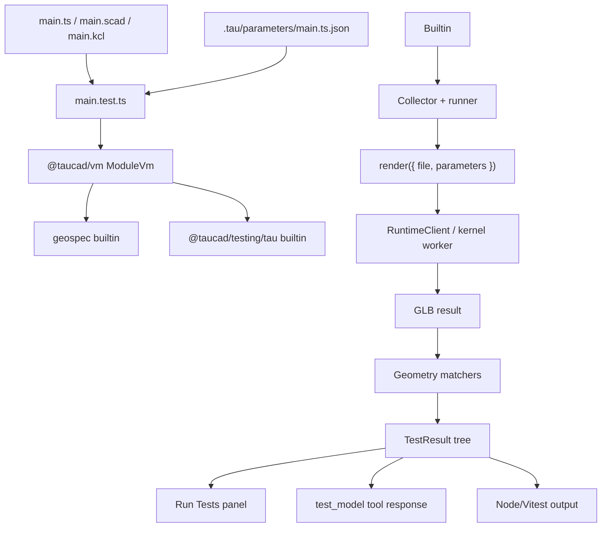

# Vitest-Style Parameter-Aware Geometry Testing Blueprint

Blueprint for replacing the current agent-only `test.json` geometry DSL with first-class ESM test modules powered by GeoSpec, while preserving the proven kernel-agnostic GLB analysis surface and making parameter changes testable by construction through the Tau adapter.

## Executive Summary

Tau already has the hard part of geometry testing: deterministic GLB analysis in `@taucad/testing`, structured spatial diagnostics, per-file `test.json` scoping, and browser RPCs that can fetch geometry for an explicit `targetFile`. The missing layer is a real test authoring and execution API. The current JSON shape cannot express "expected width equals `params.threadRootWidth + taperRunout`", cannot matrix-test saved parameter groups, and does not tell the CAD agent that UI-edited `.tau/parameters/<entry>.json` values are part of the model contract.

**2026-06-02 alignment:** this document's original package conclusion has been superseded by `docs/research/geospec-standalone-cad-testing-blueprint.md`. The standalone API lives in `geospec`; `@taucad/testing` remains the Tau adapter, compatibility facade, parameter render harness, and CAD-agent bridge. Tau runtime should continue producing geometry files/bytes such as GLB/glTF and later STEP; GeoSpec loads those files into its own `GeometrySubject`/evidence model. Older `GeometryArtifact` recommendations below are retained as historical context, not the current implementation contract.

The correct direction is to make geometry tests look and feel like Vitest:

```typescript
import { describe, expectGeo, it } from 'geospec';
import { parameterCases, renderTauModel } from '@taucad/testing/tau';
import { defaultParams } from './main';

describe.each(
  parameterCases(defaultParams, [
    ['default', {}],
    ['wide neck', { neckRadius: 7, threadTurns: 1.75 }],
  ]),
)('bottle threads: $name', ({ values }) => {
  it('keeps the thread runout connected and closed', async () => {
    const model = await renderTauModel({ file: './main.ts', parameters: values });

    await expectGeo(model).toBeWatertight();
    await expectGeo(model).toHaveConnectedComponents({ count: 1, tolerance: 1 });
    await expectGeo(model).toHaveBoundingBox({
      size: { z: values.height + values.neckHeight },
      tolerance: 0.5,
    });
  });
});
```

The target split is now two packages. `geospec` becomes the single source of truth for standalone geometry evidence, native analyzers, matchers, runners, and Node/browser execution. The root `geospec` import is the authoring surface (`describe`, `it`, `test`, hooks, `expectGeo`, and light factory/types). Domain and execution helpers live under subpaths such as `geospec/mesh`, `geospec/brep`, `geospec/step`, `geospec/runner`, and `geospec/config`. `@taucad/testing` imports GeoSpec and owns Tau-specific parameter modules, render helpers, legacy `test.json` migration, prompt examples, and chat-tool compatibility through `@taucad/testing/tau` and `@taucad/testing/migration`.

The CAD-agent prompt update should wait until the authoring API exists, then switch from JSON examples to parameter-aware test examples and add a dynamic `<parameters>` context block. Prompt copy alone cannot make the model know parameters changed; the request snapshot currently includes file tree, active file, and open files, but not parameter entries.

## Problem Statement

The user-provided exported chat showed a concrete failure mode:

1. The model read `main2.ts`, including `defaultParams` with thread-related values such as `neckRadius`, `threadHeight`, `threadPitch`, `threadTurns`, and thread profile widths.
2. The model read `test.json`, which contained static `watertight`, `connectedComponents`, and `boundingBox` requirements for `main2.ts`.
3. The model ran `test_model`; the bounding-box test failed with static expected dimensions that no longer matched the rendered geometry.
4. The agent reasoned about topology and profile construction, but it had no test API for saying "run these assertions with this parameter object" or "derive expected dimensions from the live parameters".

This is not a prompt wording bug. It is an authoring-model bug. The agent can only use the APIs we give it. `test.json` is good at static scalar requirements; it is structurally bad at parametric CAD.

### Current gaps

1. **Parameter changes are not in chat context.** `ChatSnapshot` contains `fileTree`, `activeFile`, and `openFiles`. It does not contain `.tau/parameters/<entry>.json` values or active parameter set names.
2. **`test.json` is parameter-blind.** Requirements store literal expected values. They cannot import `defaultParams`, saved parameter groups, or the active UI-edited parameter entry.
3. **Tests cannot run as normal developer tests.** The current execution path is the agent tool `test_model` through the API server, not a library API a developer can run with Vitest, CI, or a local Node process outside the Tau UI.
4. **The CAD agent sees a JSON DSL, not code-as-tests.** LLMs already know Vitest syntax. We are forcing them into a bespoke schema for a problem that wants executable assertions.
5. **The testing package is underused.** `@taucad/testing` owns analyzers, schemas, and prompt examples, but not the runner or authoring API. That fractures the testing story across API tools and UI RPCs.

## Methodology

- Read the `create-research` and `superplan` skills to shape this as a research artifact that can feed a later plan.
- Read `docs/policy/library-api-policy.md`, especially factory functions, `defineX`, flat options, max-3-params, subpath exports, lazy initialization, error design, and outcome-shaped async APIs.
- Read `docs/policy/testing-policy.md`, especially Geometry-Test Surface, observable assertions, and the runtime audit's recommendation to promote geometry validation as the default.
- Reviewed existing research: `browser-first-parameter-aware-testing.md`, `parameter-architecture-v2.md`, `multi-file-test-json-migration.md`, `mesh-continuity-test-semantics.md`, `spatial-test-feedback-architecture.md`, `runtime-test-suite-quality-audit.md`, and `cad-skill-vs-tau-cad-agent-fidelity.md`.
- Read current source for `@taucad/testing`, `GeometryAnalysisService`, `tool-test-model`, `tool-edit-tests`, `fetch_geometry` RPC schemas and handlers, `useChatSnapshot`, `injectSnapshotContext`, the parameter file loading path in `use-project.tsx`, and runtime esbuild bundling/execution.
- Verified current external Vitest docs for browser mode/provider constraints and matcher extension APIs.

## Current Architecture Findings

### Finding 1: The current code has already absorbed important prior research

`multi-file-test-json-migration.md` is implemented in the current source:

- `testFileSchema` is a `Record<sourcePath, { requirements: [...] }>` in `packages/testing/src/schemas.ts`.
- `test_model` iterates file entries, calls `fetch_geometry` with `targetFile`, and aggregates tagged results.
- `fetch_geometry` requires `targetFile` in `libs/chat/src/schemas/rpc.schema.ts`.
- `GeometryAnalysisService.runMeasurementTests` receives `targetFile` and returns `TestFailure` / `TestPass` rows tagged with it.
- `edit_tests` post-validates the edited JSON with `testFileSchema`.

That means the next migration does not need to invent per-file geometry testing. It needs to replace the authoring and execution layer while reusing the per-file concept.

### Finding 2: The older browser-first research is directionally right but stale

`browser-first-parameter-aware-testing.md` correctly identified the target: native `*.test.ts` files, Vitest-style syntax, custom geometry matchers, and a runner that works in the browser. It is stale in these details:

- It says `test.json` is a flat `{ requirements: [...] }` schema. Current code is already per-file.
- It says `fetch_geometry` has no `targetFile`. Current code requires one.
- It proposes a separate `@taucad/test-runtime` package. The current target is `geospec` as the standalone core plus `@taucad/testing` as the Tau adapter.
- It frames "browser-first" as the primary axis. The user now explicitly needs tests that can also run outside the Tau UI, so the architecture must be browser and Node from the start.

This blueprint should supersede the shape of that doc while preserving its key insight: code-as-tests is the right model for parameter-aware CAD.

### Finding 3: GeoSpec is the correct standalone base; `@taucad/testing` is the Tau base

`packages/testing` currently exports:

- `@taucad/testing`: Zod schemas, result types, prompt examples.
- `@taucad/testing/geometry`: `analyzeGlb`, `evaluateRequirement`, connected-components and watertight analysis.

It is already depended on by `apps/api` and `libs/chat`. The package does not depend on `@taucad/runtime` in production today, but it has a dev dependency for tests. That makes it the correct adapter and migration package, not the correct standalone algorithm package.

GeoSpec should own the pure geometry and runner subpaths:

- `geospec/mesh`, `geospec/brep`, and `geospec/step` stay dependency-light at import time and lazy-load WASM.
- Root `geospec` defines the standalone authoring API: `describe`, `it`, `test`, hooks, `expectGeo`, and light factories/types.
- `geospec/runner` defines Node/browser execution APIs.
- `@taucad/testing/tau` and `@taucad/testing/migration` provide Tau runtime, parameter, prompt, and legacy compatibility affordances.

This keeps public geometry testing reusable outside Tau while avoiding a third Tau-scoped runtime package.

The `geospec/step` subpath should follow the brepjs `StepStreamIO` prior art: feature-detect a native OCCT `ReadStream` wrapper first, preserve XDE/AP242 evidence through `STEPCAFControl_Reader::ReadStream`, and record when the runner had to fall back to Emscripten FS.

### Finding 4: `@taucad/vm` is now the shared ESM execution substrate

The reusable esbuild/VFS substrate has been extracted from `@taucad/runtime` into `@taucad/vm`. The root public VM surface is intentionally small:

- `createEsbuildModuleVm`
- `clearExecuteCache`
- `ModuleVm`, `EsbuildModuleVmOptions`, `DetectImportsResult`, `BundleResult`, `BuiltinModule`
- `VmFileSystem`, `VmIssue`, `VmExecuteResult`

Runtime-only and substrate-internal primitives (`EsbuildBundler`, `createVfsPlugin`, `ModuleManager`, and namespace constants) are not part of the root consumer API. `@taucad/runtime` reaches browser-safe substrate pieces through the explicit `@taucad/vm/internal` compatibility subpath while its public bundler plugin delegates through the high-level `ModuleVm` contract. The Node temp-file executor remains isolated behind `@taucad/vm/internal-node` so browser/client builds do not pull Node-only imports through the compatibility entry.

The VM substrate:

- Bundles TS/JS through VFS and CDN/builtin module resolution.
- Executes bundled ESM via `executeCode`, using Blob URLs in the browser and temp-file dynamic imports in Node.
- Supports builtin module registration.
- Auto-exports `main`, `defaultParams`, and `getParameterDefinitions` for entry files.

A geometry test runner reuses this substrate. Test modules are just another ESM entry type with builtins for `geospec` and `@taucad/testing/tau`. The initial `geospec` POC already registers a `geospec` builtin through `createEsbuildModuleVm`, executes a `*.test.ts` module, and returns collected `describe`/`it`/`expectGeo(...).toHaveBoundingBox(...)` assertions.

### Finding 5: Parameter files already exist per geometry unit but are invisible to the agent

`useProject` loads `.tau/parameters/<entry>.json` files into `parameterEntries`. It also writes a default parameter entry for the main file when missing.

But `useChatSnapshot` only forwards filesystem, active file, and open files. `snapshotSchema` has no parameter field. `injectSnapshotContext` therefore cannot produce a `<parameters>` block.

Prompt updates must include both:

1. Static guidance: parameters are first-class and tests should derive expectations from them.
2. Dynamic context: active/open geometry-unit parameter entries, active set name, saved set names, and the `.tau/parameters/<entry>.json` paths the agent can edit.

Without dynamic context, the model still has to guess whether parameter values changed since the source defaults were authored.

### Finding 6: Full Vitest browser mode is not the embedded runner

Current Vitest browser mode is excellent for application/component tests, but it is host-controlled. Official docs require a browser provider such as Playwright, WebdriverIO, or Preview, and the lifecycle assumes Vitest owns the browser page. Tau needs the opposite: an embedded runner inside Tau's worker/renderer environment, using Tau's project filesystem, current runtime, and geometry artifacts.

The reusable pieces are Vitest syntax, `expect.extend` conventions, matcher typings, and optionally `vitest` itself for Node/CI runs. The embedded Tau runner should be a small collector/runner, not full Vitest.

### Finding 7: The geometry matcher vocabulary should start with the three existing checks

`mesh-continuity-test-semantics.md` and `testing-policy.md` deliberately consolidate the agent-facing checks to:

- `boundingBox`: size and center.
- `connectedComponents`: spatial chunk count over GLB geometry.
- `watertight`: closed manifold.

The Vitest-style matcher API should not explode this surface immediately. The first release should wrap the exact proven analyzers:

- `toHaveBoundingBox(expected)`
- `toHaveConnectedComponents(expected, options?)`
- `toBeWatertight()`

Additional APIs can expose higher-fidelity measurements, but the initial matcher set should map one-to-one to the validated geometry vocabulary so the migration has semantic continuity.

### Finding 8: `repos/text-to-cad` shows the real target surface is much wider than mesh validity

The `repos` skill was used to inspect `repos/text-to-cad`, which is tracked in `repos.yaml` as `earthtojake/text-to-cad`. Its CAD skill and benchmarks provide a useful external vocabulary for what "CAD testing" must eventually mean.

The benchmark suite covers rectangular calibration blocks, circular flanges, L-brackets, stepped shafts, electronics enclosures, clevis brackets, radial-engine cylinders, centrifugal impellers, spiral staircases, and planetary gear stages. The expected checks go well beyond today's `boundingBox`, `connectedComponents`, and `watertight` surface:

- import success, solid/body count, and assembly/body separation
- exact bounding dimensions and placement
- hole count, through/blind classification, diameters, axes, centers, bolt-circle radius, and angular spacing
- chamfers and fillets, including negative checks such as "do not chamfer holes"
- coaxiality, parallel/perpendicular axes, orientation, symmetry, and placement on named planes
- open-top cavities, wall thickness, floor thickness, standoff height, and non-breakthrough blind holes
- ribs, bosses, lugs, lightening cutouts, blade count, blade curvature, helical progression, gear tooth counts, and internal/external teeth
- negative checks for floating parts, unfused plates, missing features, accidental decorative geometry, or wrong orientation

Its `skills/cad/scripts/common/step_scene.py` also exports topology-like evidence: occurrence transforms, shape kind, shape volume, shape area, center of mass, face surface type/area/normal/params, edge curve type/length/params, and adjacency relation buffers. Its `inspect` tool provides `refs`, `measure`, `mate`, `frame`, and `diff` operations over that evidence.

This is strong prior art for Tau, but Tau should not copy the Python/STEP-specific implementation shape directly. Tau needs a TypeScript-first runtime evidence model that can be emitted by every kernel at the highest fidelity it can support. Mesh checks remain metadata-free; B-rep/topology/mate checks explicitly require topology evidence.

### Finding 9: "3D testing" has distinct evidence realms

A comprehensive CAD testing API cannot pretend every assertion is a mesh assertion. The evidence realms should be explicit:

| Realm          | Evidence                                                                  | Example assertions                                                                                                       | Initial priority |
| -------------- | ------------------------------------------------------------------------- | ------------------------------------------------------------------------------------------------------------------------ | ---------------- |
| Mesh           | triangles, positions, normals, materials, scene graph                     | bounding box, connected components, watertight, degenerate triangles, winding, normals, self-intersection, mesh distance | P0               |
| Shape distance | sampled surfaces, acceleration structure, optional exact B-rep projection | mean/max Chamfer distance, Hausdorff distance, volume delta, regression/reference comparison                             | P0               |
| B-rep topology | solids, shells, faces, edges, vertices, adjacency, surface/curve params   | hole count, cylinder radius, plane groups, fillet/chamfer radius, topology diff                                          | P1               |
| Volumetric     | volume, surface area, center of mass, inertia, sections, containment      | volume, mass properties, wall thickness, overlap/interference, section area                                              | P1               |
| Assembly/frame | occurrences, transforms, named frames, mate targets                       | flush, centered, coaxial, clearance, contact, no interference, transform/frame equality                                  | P1               |
| Parametric     | defaults, active values, saved groups, parameter schema                   | matrix tests, monotonicity, constraints, fuzz/property tests                                                             | P0               |
| Manufacturing  | derived process rules over mesh/topology                                  | printability, minimum wall, overhangs, draft, undercuts, machining reach, sheet-metal bend rules                         | P2               |
| Semantic       | names, materials, colors, layers, stable selectors                        | named part exists, material/color correct, selector stability                                                            | P2               |

The public API should make these realms visible without making the author spell them every time. A simple `expectGeo(model).toHaveBoundingBox(...)` should work immediately; an advanced `expectGeo(model).toHaveCircularHole(...)` can declare an evidence requirement and fail as `unsupported` when the runtime artifact has only mesh data.

### Finding 10: GeoSpec supersedes the Tau Gauge nickname

The package/product name is **GeoSpec**. The previous **Tau Gauge** nickname is retired because the core library is intentionally standalone from Tau. `@taucad/testing` remains a Tau adapter over GeoSpec rather than the public product name.

Rejected older alternatives remain rejected:

- Tau Caliper: good for distances, weaker for assemblies, topology, and volumetric rules.
- Tau Metrology: accurate, but too formal for day-to-day test authoring.
- Tau Proof: appealing, but overclaims when tests are approximate or sampled.
- Tau Fixture: testing-adjacent, but collides with physical fixture language.

GeoSpec keeps the measurement/specification signal without implying the package is Tau-only.

### Eigenquestions

1. **What is the canonical object under test?**
   The current answer is GeoSpec's loader-created `GeometrySubject`, not a Tau runtime `GeometryArtifact`. Tau runtime emits geometry files/bytes; GeoSpec records source identity, parameter values, units, mesh evidence, capabilities, diagnostics, and provenance while loading those bytes.

2. **What should the Tau runtime emit, and what should testing compute?**
   The runtime should emit geometry files/bytes. GeoSpec should load evidence and compute standalone assertions from those bytes. `@taucad/testing` should provide Tau-specific rendering and parameter resolution before handing GLB/glTF or later STEP bytes to GeoSpec. Mesh-only assertions must remain pure geometry and must not rely on kernel metadata.

3. **How do tests stay kernel-agnostic when kernels provide uneven evidence?**
   Each matcher should declare required capabilities. Missing optional evidence produces a typed `unsupported` diagnostic, not a false pass, false fail, or thrown generic error. Test authors can opt into `requires(model, 'topology.faces')` when a test needs B-rep facts.

4. **What unit system should authors see?**
   Public matcher APIs should speak millimeters by default. Internally the artifact must preserve source units and glTF transforms so unit conversion bugs are testable instead of hidden.

5. **Is a test validating generated geometry or design intent?**
   Tests validate observable geometry, but expected values in parametric models should derive from parameters. Literal dimensions are fine for nonparametric specs; stale literal values in parametric tests are the failure mode this project is fixing.

6. **What does "Chamfer distance" mean?**
   In geometry processing, Chamfer distance means bidirectional average sampled distance between two shapes. In CAD, chamfer also means a bevel feature. The API must keep those names distinct: use `chamferDistance` for shape-distance metrics, and `edgeChamfer` or `featureChamfer` for bevel-feature checks.

## Expanded API Surface

The `packages/testing/TODO.md` backlog created alongside this blueprint is the living API checklist. The selected high-value additions are summarized here.

### P0 mesh and regression tests

These can be built from today's GLB evidence plus environment-neutral parsing:

- `toHaveBoundingBox({ min, max, size, center, tolerance })`
- `toHaveConnectedComponents(count, { tolerance })`
- `toBeWatertight()`
- `toHaveNoDegenerateTriangles({ areaTolerance })`
- `toHaveNoNonFiniteVertices()`
- `toHaveValidNormals({ tolerance })`
- `toHaveConsistentWinding()`
- `toHaveTriangleCount(countOrRange)`
- `toHaveSurfaceArea(value, { tolerance })`
- `toHaveClosedMeshVolume(value, { tolerance })`
- `toHaveChamferDistanceTo(reference, { mean, max, p95 })`
- `toHaveHausdorffDistanceTo(reference, { max })`
- `toMatchReferenceGeometry(reference, { metric, tolerance })`

Chamfer/Hausdorff distance needs a robust spatial acceleration structure and a sampling strategy that is deterministic, unit-aware, and tested against analytic fixtures.

### P1 topology and B-rep tests

These require runtime-emitted topology evidence:

- `toHaveSolidCount(count)`
- `toHaveFaceCount(countOrRange)`
- `toHaveEdgeCount(countOrRange)`
- `toHaveSurfaceTypes({ plane, cylinder, cone, sphere, torus, bspline })`
- `toHavePlane({ axis, coordinate, area, tolerance })`
- `toHaveCylinder({ radius, axis, center, tolerance })`
- `toHaveCircularHole({ diameter, axis, center, through, tolerance })`
- `toHaveHolePattern({ count, diameter, boltCircleDiameter, angularSpacing, tolerance })`
- `toHaveFillet({ radius, selector, tolerance })`
- `toHaveEdgeChamfer({ distance, selector, tolerance })`
- `toHaveWallThickness({ min, max, sampleCount, tolerance })`
- `toHaveNoUnexpectedTopologyChange(reference, options)`

These are the first APIs that make the `text-to-cad` benchmark suite meaningfully expressible as repeatable Tau tests.

### P1 assembly, mate, and volume tests

These require occurrence/frame/mass-property evidence:

- `toHaveOccurrenceCount(count)`
- `toHaveNamedOccurrence(name)`
- `toHaveFrame(selector, { origin, axes, tolerance })`
- `toHaveTransform(selector, matrixOrPose, { tolerance })`
- `toBeFlushWith(leftSelector, rightSelector, { axis, offset, tolerance })`
- `toBeCenteredWith(leftSelector, rightSelector, { axes, tolerance })`
- `toBeCoaxialWith(leftSelector, rightSelector, { tolerance })`
- `toBeParallelTo(leftSelector, rightSelector, { angularTolerance })`
- `toBePerpendicularTo(leftSelector, rightSelector, { angularTolerance })`
- `toHaveClearanceTo(selector, { min, max, tolerance })`
- `toHaveNoInterferenceWith(selector, { tolerance })`
- `toHaveContactWith(selector, { tolerance })`
- `toHaveVolume(value, { tolerance })`
- `toHaveCenterOfMass(point, { tolerance })`
- `toHaveInertiaTensor(tensor, { tolerance })`
- `toHaveSectionArea({ plane, expected, tolerance })`

`text-to-cad`'s `inspect mate` is read-only and returns a translation delta; Tau should preserve that design. Testing should report the correction, never mutate source placement.

### P2 manufacturing and semantic tests

These are valuable but should not block the first-class testing API:

- `toHaveSymmetry({ plane, tolerance })`
- `toHaveRadialPattern({ count, radius, angularSpacing, tolerance })`
- `toHaveHelicalPattern({ count, pitch, turns, tolerance })`
- `toHaveGearTeeth({ count, rootDiameter, outerDiameter, pitchDiameter, tolerance })`
- `toHaveBladeCurvature({ angle, tolerance })`
- `toHaveDraftAngle({ min, faces })`
- `toHaveNoUndercuts({ pullDirection })`
- `toBePrintable({ minWall, minClearance, maxOverhangAngle })`
- `toBeMachinable({ toolDiameter, reach, minInsideRadius })`
- `toMeetSheetMetalRules({ thickness, bendRadius, relief })`
- `toHaveMaterial(nameOrProperties)`
- `toHaveColor(selector, color)`
- `toHaveStableSelectors(reference)`

These should ship only after the evidence model and P0/P1 algorithms are heavily verified. This is a testing framework; a weak process rule is worse than no rule.

## Runtime Geometry Bytes Boundary

The current runtime contract is intentionally simpler than the original evidence-object proposal. Runtime integrations render or export geometry bytes/files, and GeoSpec loaders create the evidence object internally. The P0 flow is:

1. `@taucad/testing` resolves parameters and calls a renderer.
2. The renderer returns GLB/glTF bytes.
3. `geospec/mesh` loads the bytes into a `GeometrySubject` with mesh evidence, source/provenance metadata, capabilities, and diagnostics.
4. Matchers evaluate the `GeometrySubject`.

### Mesh evidence

Mesh evidence is mandatory for all renderable artifacts. It can be represented by GLB bytes plus parsed caches:

- triangle positions, indices, normals, and material/color groups
- scene and primitive names
- world-space AABB and optional oriented bounding box
- spatial index cache for distance and intersection tests
- raw GLB bytes for artifact capture and regression comparison

The current `analyzeGlb` should be split into:

- IO-neutral parse/analysis core
- Node entry using `NodeIO`
- browser entry using browser-safe glTF Transform IO
- shared deterministic result schema

### Topology evidence

Topology evidence is optional but should be first-class when available. The `text-to-cad` manifest suggests the minimum useful rows:

- occurrences: id, parent, name/sourceName, transform, bbox, child ranges
- shapes: id, occurrence id, kind, bbox, center, area, volume, face/edge ranges
- faces: id, shape id, surface type, area, center, normal, bbox, params, edge ranges
- edges: id, shape id, curve type, length, center, bbox, params, face/vertex ranges
- vertices: id, point, adjacent edges/faces
- relation buffers: face-edge, edge-face, edge-vertex, vertex-edge

Replicad/OpenCascade can provide much of this from OCCT. OpenSCAD/JSCAD/Manifold may initially provide only mesh evidence; their topology-dependent matchers should report `unsupported` unless a conversion path supplies equivalent evidence.

### Assembly and frame evidence

Assembly evidence should include:

- occurrence tree with stable ids and names
- local and world transforms
- part-local frames and named datum frames when kernels expose them
- material/color inheritance
- optional source-level mate annotations when authored in a kernel

The test API should consume this as read-only evidence. Source mutation belongs to the CAD authoring layer, not matchers.

## Node and Browser VM Strategy

The runner must work in Node and in the browser, but the browser does not have Node's `vm` module and Node's ESM `vm.SourceTextModule` path is still experimental/flag-gated. The practical architecture is a runner adapter layer:

| Adapter                 | Environment  | Use                                                                                                                | Priority |
| ----------------------- | ------------ | ------------------------------------------------------------------------------------------------------------------ | -------- |
| `native-node-worker`    | Node.js      | Runs bundled ESM test modules in `worker_threads`; supports timeouts and transferable buffers                      | P0       |
| `browser-module-worker` | Browser      | Runs bundled ESM test modules in a module Worker or Blob module Worker; talks to Tau runtime over message protocol | P0       |
| `browser-iframe`        | Browser      | Sandboxed iframe fallback for DOM/viewer-dependent tests                                                           | P1       |
| `quickjs-vm`            | Node/browser | Future pure-JS predicate sandbox for untrusted test expressions                                                    | P3       |

Tau should not depend on full Vitest browser mode inside the UI. Vitest browser mode is provider/page-lifecycle oriented; Tau needs an embedded runner inside its project/runtime environment. The reusable parts are Vitest syntax, matcher conventions, and real Vitest compatibility for external Node workflows.

### Runner design rules

- Bundle test modules through the Tau runtime VFS bundler so browser and Node resolve project files the same way.
- Register `geospec` and `@taucad/testing/tau` as builtin modules in embedded mode.
- Collect tests without executing assertions until the runner starts the task tree.
- Enforce per-test timeout, abort, and cleanup.
- Return a shared `GeometryTestRunResult` discriminated union to UI, agent tools, and CI.
- Keep the embedded syntax small: `describe`, `it/test`, hooks, `describe.each`, `it.each`, `expect`, async tests.
- Allow real Vitest to run the same test files in Node by exporting compatible matchers and setup helpers.

## Test-The-Tester Strategy

This project has no room for soft algorithms. Every matcher needs both positive and negative fixtures, edge cases, and cross-environment parity.

### P0 fixture suite

- synthetic closed tetrahedron/cube/sphere-approximation meshes
- open triangle, open triangle strip, non-manifold edge, bow-tie vertex
- duplicate triangles, zero-area triangles, inverted winding, NaN/Infinity vertices
- unwelded but touching triangles
- color-binned OpenSCAD-style unwelded meshes
- translated/scaled reference meshes for Chamfer and Hausdorff distances
- runtime-rendered Replicad fixtures: box, fused bodies, touching bodies, separated bodies, parameterized dimensions
- runtime-rendered OpenSCAD fixtures: same-color disjoint primitives, touching cubes, parameterized cubes

### P1 fixture suite

- OpenCascade/Replicad exact B-rep fixtures for plane, cylinder, sphere, torus, circle, line, volume, area, center of mass
- good/bad through holes, blind holes, bolt circles, coaxial cylinders, chamfers, and fillets
- good/bad mate fixtures for flush, center, coaxial, parallel, perpendicular, clearance, interference, and contact
- text-to-cad benchmark-derived fixtures for blocks, flanges, brackets, shafts, enclosures, clevises, impellers, helices, and gears

### Required verification properties

- Node and browser analyzers produce the same result JSON for the same GLB bytes.
- Unsupported evidence is reported as `unsupported`, never as pass or generic failure.
- Distance metrics satisfy identity, symmetry where applicable, known-translation, and convergence checks.
- Failure messages include actual, expected, tolerance, spatial location, selector/part name when available, and a concrete repair hint.
- Unit conversion bugs are caught with explicit meter/millimeter fixtures.
- Coordinate-system bugs are caught with y-up/z-up fixtures.

## Target Architecture

### Package shape

Public exports should follow `library-api-policy.md` subpath rules and audience boundaries:

| Subpath                     | Audience                              | Exports                                                                                                  |
| --------------------------- | ------------------------------------- | -------------------------------------------------------------------------------------------------------- |
| `geospec`                   | Standalone consumers and test authors | `createGeoSpec`, `describe`, `it`, `test`, hooks, `expectGeo`, light types, no eager WASM initialization |
| `geospec/mesh`              | Pure mesh consumers                   | `loadMesh`, `analyzeMesh`, mesh evidence and diagnostics                                                 |
| `geospec/brep`              | Exact-geometry consumers              | BRep evidence, validity, topology, exact measurements                                                    |
| `geospec/step`              | STEP/AP242 consumers                  | `loadStep`, native stream import, XDE/AP242 evidence, product structure, read-strategy provenance        |
| `geospec/runner`            | Node/browser execution                | `runGeoSpecTests`, VM adapters, reporter types                                                           |
| `geospec/config`            | Config authors                        | `defineGeoSpecConfig`, config schema/types                                                               |
| `@taucad/testing`           | Existing agent/API consumers          | schemas, result types, prompt examples, compatibility exports during migration                           |
| `@taucad/testing/tau`       | Tau test authors                      | `renderTauModel`, parameter cases/groups, virtual parameter imports                                      |
| `@taucad/testing/migration` | Migration tools                       | `convertTestJsonToTestModule`, report types, codemod helpers                                             |

The existing `@taucad/testing/geometry` subpath can remain as a compatibility facade while implementation moves into GeoSpec.

### Execution topology



### Authoring model

Test files are normal ESM files. They import source parameters when that is useful, and use runner helpers for saved parameter groups or non-TS kernels.

#### Pattern 1: Defaults derived from source

```typescript
import { describe, expectGeo, it } from 'geospec';
import { renderTauModel } from '@taucad/testing/tau';
import { defaultParams } from './main';

describe('main defaults', () => {
  it('matches the authored default envelope', async () => {
    const model = await renderTauModel({ file: './main.ts', parameters: defaultParams });

    await expectGeo(model).toHaveBoundingBox({
      size: {
        x: defaultParams.width,
        z: defaultParams.height,
      },
      tolerance: 0.5,
    });
    await expectGeo(model).toBeWatertight();
  });
});
```

#### Pattern 2: Parameter matrix

```typescript
import { describe, expectGeo, it } from 'geospec';
import { parameterCases, renderTauModel } from '@taucad/testing/tau';
import { defaultParams } from './main';

const cases = parameterCases(defaultParams, [
  ['default', {}],
  ['long thread', { threadTurns: 2.25 }],
  ['wide neck', { neckRadius: 7, threadHeight: 2 }],
]);

describe.each(cases)('thread runout ($name)', ({ values }) => {
  it('stays connected for this parameter set', async () => {
    const model = await renderTauModel({ file: './main.ts', parameters: values });

    await expectGeo(model).toHaveConnectedComponents({ count: 1, tolerance: 1 });
    await expectGeo(model).toBeWatertight();
  });
});
```

#### Pattern 3: Saved UI parameter groups

```typescript
import { describe, expectGeo, it } from 'geospec';
import { parameterGroups, renderTauModel } from '@taucad/testing/tau';

describe.each(await parameterGroups('./main.ts'))('main saved set: $name', ({ values }) => {
  it('renders a valid printable model', async () => {
    const model = await renderTauModel({ file: './main.ts', parameters: values });

    await expectGeo(model).toBeWatertight();
    await expectGeo(model).toHaveConnectedComponents({ count: 1, tolerance: 1 });
  });
});
```

#### Pattern 4: Non-TS kernels

OpenSCAD/KCL cannot import `defaultParams` as a TS object from source. They use runtime-extracted defaults and saved groups:

```typescript
import { describe, expectGeo, it } from 'geospec';
import { parameters, renderTauModel } from '@taucad/testing/tau';

const defaults = await parameters.defaults('./main.scad');

describe('OpenSCAD gear', () => {
  it('scales with tooth count', async () => {
    const values = { ...defaults, teeth: 32, module: 2 };
    const model = await renderTauModel({ file: './main.scad', parameters: values });

    await expectGeo(model).toHaveBoundingBox({
      size: { x: values.teeth * values.module },
      tolerance: 2,
    });
  });
});
```

### Parameter import and syntax sugar decision

Use virtual modules plus generated types, not a runtime-only custom tsconfig trick.

Recommended approach:

1. **Runtime resolution:** The test bundler registers builtin virtual modules:
   - `tau:parameters/<entry>` returns runtime defaults, active set, saved groups, and resolved values for that entry.
   - `tau:project` returns test context such as project root and active geometry unit.
2. **Type resolution:** The UI/Node runner writes generated declarations under `.tau/types/testing.d.ts` and points Monaco/Vitest at a generated `.tau/tsconfig.test.json`.
3. **Source-first inference:** For TS kernels, prefer explicit `export const defaultParams` and `import { defaultParams } from './main'` for best type inference. The runner helper still exists for source files that do not export parameters.
4. **No runtime dependency on tsconfig:** Esbuild VFS/builtin resolution is authoritative in the browser and Node runner. The generated tsconfig is for editor and external Vitest typechecking only.

Example generated declaration:

```typescript
declare module 'tau:parameters/main.ts' {
  export const activeSet: string;
  export const values: Record<string, unknown>;
  export const groups: Array<{ name: string; values: Record<string, unknown> }>;
}
```

Future enhancement for TS sources with exported `defaultParams`:

```typescript
declare module 'tau:parameters/main.ts' {
  import type { defaultParams } from '../../main';

  export const activeSet: string;
  export const values: typeof defaultParams;
  export const groups: Array<{ name: string; values: typeof defaultParams }>;
}
```

This gives the desired syntactic sugar without making `tsconfig` the execution mechanism.

## Public API Blueprint

### `geospec`

```typescript
export { describe, it, test, beforeAll, beforeEach, afterAll, afterEach };
export const expectGeo: (subject: GeometrySubject) => GeoSpecExpectation;
export const createGeoSpec: (options?: CreateGeoSpecOptions) => Promise<GeoSpec>;
```

The root import is intentionally the authoring surface. It remains lightweight: importing `geospec` registers the DSL and types, but does not instantiate OCCT/WASM until a matcher or loader needs native evidence.

### `@taucad/testing/tau`

```typescript
export type RenderTauModelOptions = {
  file: string;
  parameters?: Record<string, unknown>;
  options?: Record<string, unknown>;
};

export type RenderTauModelResult = {
  file: string;
  parameters: Record<string, unknown>;
  bytes: Uint8Array<ArrayBuffer>;
};

export const renderTauModel: (options: RenderTauModelOptions) => Promise<RenderTauModelResult>;

export type ParameterCase<T extends Record<string, unknown>> = {
  name: string;
  values: T;
};

export const parameterCases: <T extends Record<string, unknown>>(
  defaults: T,
  cases: Array<readonly [name: string, overrides: Partial<T>]>,
) => Array<ParameterCase<T>>;

export const parameterGroups: (file: string) => Promise<Array<ParameterCase<Record<string, unknown>>>>;

export const parameters: {
  defaults(file: string): Promise<Record<string, unknown>>;
  active(file: string): Promise<ParameterCase<Record<string, unknown>>>;
  groups(file: string): Promise<Array<ParameterCase<Record<string, unknown>>>>;
};
```

All public functions obey the max-3-params rule. `renderTauModel` takes one options object because file, parameters, and render options are one operation concern. `parameterCases` uses two params because there is one primary subject (`defaults`) and a list of overrides.

### Geometry matchers

```typescript
await expectGeo(model).toBeWatertight();
await expectGeo(model).toHaveConnectedComponents({ count: 1, tolerance: 1 });
await expectGeo(model).toHaveBoundingBox({
  size: { x: 50, z: 78 },
  center: { x: 0 },
  tolerance: 0.5,
});
```

Matcher types:

```typescript
export type BoundingBoxMatcherExpected = {
  size?: Partial<Record<'x' | 'y' | 'z', number>>;
  center?: Partial<Record<'x' | 'y' | 'z', number>>;
  tolerance?: number;
};

export type ConnectedComponentsMatcherOptions = {
  tolerance?: number;
};
```

Internally, Tau adapter matchers call GeoSpec analyzers and mirror the failure rendering from `evaluateRequirement`, including structured payloads from `spatial-test-feedback-architecture.md`.

### `geospec/config`

```typescript
import { defineGeoSpecConfig } from 'geospec/config';

export default defineGeoSpecConfig({
  files: ['**/*.test.ts'],
  projectRoot: '.',
  unit: 'mm',
});
```

Config type:

```typescript
export type GeoSpecConfig = {
  files?: string[];
  projectRoot?: string;
  unit?: UnitName;
  wasm?: GeoSpecWasmOptions;
};
```

Use `defineGeoSpecConfig`, not `createGeoSpecConfig`, because this is a configuration authoring contract like Vite's `defineConfig`.

### Initial GeoSpec Runner POC

The first package cut exposes the POC runner through `geospec/runner` while the root import stays reserved for authoring DSL, light factories, and core types:

```typescript
import { runGeoSpecModule } from 'geospec/runner';

const result = await runGeoSpecModule({
  filesystem,
  projectPath: '/project',
  entryPath: '/project/main.test.ts',
});
```

Authoring modules use the same root import:

```typescript
import { describe, expectGeo, it } from 'geospec';
import { makeBracket } from './main';

describe('bracket', () => {
  it('has expected bounds', () => {
    expectGeo(makeBracket()).toHaveBoundingBox([0, 0, 0], [40, 20, 8]);
  });
});
```

The immediate POC deliberately collects structured assertions only; it does not yet perform native mesh/BRep/STEP analysis. That keeps the VM and runner contract testable before geometry analyzers are wired in.

### Future `geospec/runner`

```typescript
import { nodeWorkerVm, runGeoSpecTests } from 'geospec/runner';
import config from '.geospec.config';

const result = await runGeoSpecTests({ config, vm: nodeWorkerVm() });

if (!result.success) {
  process.exitCode = 1;
}
```

Runner API:

```typescript
export type RunGeoSpecTestsOptions = {
  config: GeoSpecConfig;
  files?: string[];
  reporter?: GeoSpecReporter;
};

export const runGeoSpecTests: (options: RunGeoSpecTestsOptions) => Promise<GeoSpecRunResult>;
```

### `@taucad/testing/tau`

Tau-only authoring exports:

```typescript
export const renderTauModel: (options: RenderTauModelOptions) => Promise<Uint8Array<ArrayBuffer>>;
export const parameterCases: (cases: ParameterCaseInput[]) => ParameterCase[];
```

The adapter should use GeoSpec's Node/browser-safe loaders and analyzers. The current `analyzeGlb` uses `NodeIO`, so moving the algorithm behind GeoSpec's environment-neutral mesh evidence loader is the first technical migration.

### Result model

Use a discriminated union and stable IDs so UI, agent tools, and CI reporters share one format.

```typescript
export type GeometryTestTaskResult =
  | {
      type: 'pass';
      id: string;
      name: string;
      file: string;
      duration: number;
    }
  | {
      type: 'fail';
      id: string;
      name: string;
      file: string;
      duration: number;
      error: GeometryTestError;
      geometry?: TestFailurePayload;
    }
  | {
      type: 'skip';
      id: string;
      name: string;
      file: string;
      reason?: string;
    };

export type GeometryTestRunResult = {
  success: boolean;
  passed: number;
  failed: number;
  skipped: number;
  total: number;
  tasks: GeometryTestTaskResult[];
  artifacts?: Record<string, string>;
};
```

No optional interface methods: reporters receive a complete event set, even if they no-op.

## CAD Agent Prompt and Context Blueprint

### Static prompt migration

Replace the `test.json` TDD block with a Vitest-style test module block once the API exists.

Draft prompt fragment:

````text
<test_requirements>
Geometry tests are ESM test files (`*.test.ts`) using `geospec` for the
test DSL and `@taucad/testing/tau` for Tau render/parameter helpers.
Write tests before model changes. Parameters are first-class test inputs:
derive expected geometry from the parameter object instead of copying stale
literal values into assertions.

```typescript
import { describe, expectGeo, it } from 'geospec';
import { parameterCases, renderTauModel } from '@taucad/testing/tau';
import { defaultParams } from './main';

describe.each(parameterCases(defaultParams, [
  ['default', {}],
  ['wide', { width: 80 }],
]))('$name', ({ values }) => {
  it('matches its parameters', async () => {
    const model = await renderTauModel({ file: './main.ts', parameters: values });
    await expectGeo(model).toHaveBoundingBox({ size: { x: values.width }, tolerance: 0.5 });
    await expectGeo(model).toBeWatertight();
  });
});
```

Use saved parameter groups with `parameterGroups('./main.ts')` when the user has
edited parameters in the UI. Do not weaken assertions when parameters change;
derive the assertion from the same parameter case.
</test_requirements>
````

### Dynamic parameter context

Extend `snapshotSchema` and `injectSnapshotContext` with parameter summaries.

Example injected block:

```text
<parameters>
Parameter files live under .tau/parameters/<entry>.json. Edit those files when
the user asks to change saved parameter values.

Active parameter entries:
- main2.ts: activeSet=default, values={"width":50,"height":70,"neckRadius":5,"threadTurns":1.45}
  file=.tau/parameters/main2.ts.json
- lib/thread.ts: activeSet=default, values={"pitch":3.72,"runoutTurns":0.25}
  file=.tau/parameters/lib/thread.ts.json
</parameters>
```

Snapshot policy:

- Include active file and open files by default.
- Include all parameter file paths and active set names.
- Include full values for active/open files when compact enough.
- For large parameter maps, include a hash and top-level keys, and tell the agent to read the parameter file before editing.

This is the direct fix for "the model does not know parameters have changed".

## Migration Blueprint

### Final target

- `*.test.ts` is the canonical geometry test format.
- `test_model` runs ESM tests through the browser/runner path, not server-side `test.json` analysis.
- `edit_tests` edits ESM test modules or creates one beside the target source file.
- `test.json`, `testFileSchema`, and `GeometryAnalysisService` are deleted after migration.
- GeoSpec owns standalone matchers, analyzers, runner, and native geometry evidence.
- `@taucad/testing` owns Tau schemas, parameter helpers, runtime render helpers, prompt examples, and migration utilities.

### Initial migration path

1. Add `packages/geospec` and move environment-neutral mesh analysis there, preserving current `analyzeGlb` behavior through a compatibility facade.
2. Add GeoSpec matcher implementations that call the analyzers.
3. Add the root `geospec` authoring surface and `@taucad/testing/tau` helper surface, then prove the same test can run under real Vitest in Node for one Replicad fixture.
4. Add the GeoSpec embedded collector/runner and builtin module wiring for Tau runtime execution.
5. Add `geospec/runner` `runGeoSpecTests` and `defineGeoSpecConfig` so tests run outside the Tau UI.
6. Add parameter helper APIs and generated type/tsconfig support.
7. Add a browser RPC for `execute_geometry_tests`.
8. Change `test_model` to call the browser/runner RPC.
9. Change `edit_tests` and the CAD prompt to create `.test.ts` modules.
10. Codemod existing `test.json` fixtures and benchmark-generated requirements into `.test.ts`.
11. Delete legacy JSON schema/tooling after all call sites are migrated.

No long-term compatibility shim should remain. A temporary coexistence during implementation is acceptable only while the plan is in progress and tests are being migrated.

## API Inventory to Provide

### Authoring

- `describe`, `it`, `test`, hooks, `expect`.
- `render({ file, parameters, options })`.
- `parameterCases(defaults, cases)`.
- `parameterGroups(file)`.
- `parameters.defaults(file)`.
- `parameters.active(file)`.
- `parameters.groups(file)`.

### Matchers

- `toBeWatertight()`.
- `toHaveBoundingBox(expected)`.
- `toHaveConnectedComponents(expected, options?)`.
- `toMatchGeometrySnapshot(options?)` as a later stub, not initial required matcher.

### Runner and config

- `defineGeoSpecConfig(options)`.
- `createGeoSpec(options)`.
- `runGeoSpecTests(options)`.
- `runGeometryTestModule(options)` in `@taucad/testing` for Tau browser RPC compatibility.
- Reporter interface with `onRunStart`, `onTaskStart`, `onTaskResult`, `onRunComplete`.

### Migration

- `convertTestJsonToTestModule(options)`.
- `findLegacyTestJson(filesystem)`.
- `formatGeometryTestModule(model)` for deterministic codegen.

### Prompt/tool helpers

- `renderVitestCanonicalExample(fileExtension)`.
- `AVAILABLE_GEOMETRY_MATCHERS_COPY`.
- `formatParameterContext(snapshot)`.

## Recommendations

| #   | Action                                                                                                                                                                                                                   | Priority | Effort | Impact                                                                                                            |
| --- | ------------------------------------------------------------------------------------------------------------------------------------------------------------------------------------------------------------------------ | -------- | ------ | ----------------------------------------------------------------------------------------------------------------- |
| R1  | Move environment-neutral mesh analysis into `geospec/mesh`; keep `@taucad/testing` as the Tau compatibility caller.                                                                                                      | P0       | M      | Unblocks browser, Node, and non-Tau execution without duplicating algorithms.                                     |
| R2  | Add the root `geospec` authoring API (`describe`, `it`, hooks, `expectGeo`); add `@taucad/testing/tau` as the Tau-aware helper adapter.                                                                                  | P0       | M      | Establishes the first-class test DX while preserving the Tau parameter/render path.                               |
| R3  | Add a small GeoSpec Vitest-style collector/runner for embedded Tau execution; do not embed full Vitest browser mode.                                                                                                     | P0       | M      | Lets Tau UI and agent tools execute ESM tests.                                                                    |
| R4  | Add `geospec/runner` and `geospec/config` so the same tests run outside the Tau UI in CI/local Node.                                                                                                                     | P0       | M      | Satisfies offline and repeatable testing requirement.                                                             |
| R5  | Add parameter helpers plus virtual module and generated `.tau/tsconfig.test.json` support in `@taucad/testing`.                                                                                                          | P0       | M      | Fixes stale parameter knowledge and makes matrix tests idiomatic.                                                 |
| R6  | Extend `ChatSnapshot` and prompt injection with a compact `<parameters>` block.                                                                                                                                          | P0       | S      | Gives the CAD agent current parameter state and edit paths.                                                       |
| R7  | Add browser RPC `execute_geometry_tests` and convert `test_model` into a thin `@taucad/testing` wrapper over GeoSpec.                                                                                                    | P1       | M      | Aligns agent and user test paths.                                                                                 |
| R8  | Replace `edit_tests` JSON editing with `.test.ts` creation/editing, backed by canonical examples from `@taucad/testing` and GeoSpec.                                                                                     | P1       | M      | Moves the LLM onto code-as-tests.                                                                                 |
| R9  | Update `cad-agent.prompt.ts` to demonstrate parameter-aware ESM tests, including saved parameter groups.                                                                                                                 | P1       | S      | Teaches the model the new API at the right time.                                                                  |
| R10 | Build the `test.json` to `.test.ts` codemod and migrate benchmarks/fixtures.                                                                                                                                             | P1       | M      | Preserves existing coverage while moving formats.                                                                 |
| R11 | Retire `testFileSchema`, `GeometryAnalysisService`, and legacy JSON prompt/tool copy after migration, keeping only explicit compatibility where needed.                                                                  | P2       | S      | Removes the old authoring model from the primary path.                                                            |
| R12 | Add UI Run Tests panel and result tree using the shared runner result model.                                                                                                                                             | P2       | M      | Makes testing user-facing beyond the chat agent.                                                                  |
| R13 | Update `docs/policy/testing-policy.md` with parameter-aware geometry-test rules and literal-parameter anti-patterns.                                                                                                     | P2       | S      | Locks in the architectural lesson.                                                                                |
| R14 | Keep Tau runtime render/export paths file/bytes-based; make GeoSpec loaders create `GeometrySubject` evidence from GLB/glTF and later STEP bytes.                                                                        | P0       | M      | Preserves standalone GeoSpec boundaries without adding a Tau runtime evidence contract.                           |
| R15 | Add native GeoSpec mesh-quality and mesh-distance P0 analyzers: non-finite vertices, degenerate triangles, normals/winding, surface area, closed-mesh volume, Chamfer distance, and Hausdorff distance.                  | P0       | L      | Covers high-value regression and comparison tests without waiting for B-rep evidence.                             |
| R16 | Add GeoSpec Node/browser VM runner adapters using worker isolation; avoid primary reliance on Node `vm.SourceTextModule` or full Vitest browser mode.                                                                    | P0       | L      | Makes one test file execute in CI, local Node, and Tau UI.                                                        |
| R17 | Add topology and STEP/XDE evidence manifests inspired by `repos/text-to-cad` but TypeScript-first and kernel-agnostic. Use the brepjs-style native `ReadStream` wrapper for large STEP import before any MEMFS fallback. | P1       | L      | Unlocks holes, surfaces, fillets, chamfers, exact volume, selectors, topology diff, and large-file STEP testing.  |
| R18 | Add mate/frame/assembly evidence and read-only mate-delta matchers.                                                                                                                                                      | P1       | M      | Makes assemblies testable without turning matchers into source mutation tools.                                    |
| R19 | Build a text-to-cad-derived benchmark fixture suite with good/bad cases for blocks, flanges, brackets, shafts, enclosures, clevises, impellers, helices, and gears.                                                      | P1       | L      | Ensures the framework covers real CAD prompt complexity, not only toy boxes.                                      |
| R20 | Add manufacturing/process rule matchers after P0/P1 algorithms are proven.                                                                                                                                               | P2       | L      | Extends GeoSpec into printability, machining, draft, undercut, and sheet-metal checks without weakening the core. |

## Superplan Handoff Shape

A later `/superplan @docs/research/vitest-style-parameter-geometry-testing-blueprint.md` should create one or more todos per recommendation above. Suggested phase clustering:

### Phase 1: GeoSpec Mesh Core

R1, R15. Create `packages/geospec`, move IO-neutral mesh analysis into GeoSpec, and add Node/browser parity tests. `@taucad/testing` becomes a caller rather than the algorithm home.

### Phase 2: Author API And Matchers

R2. Add the root `geospec` authoring API, matcher implementations, matcher typings, and canonical examples. Add `@taucad/testing/tau` as the Tau-aware helper adapter.

### Phase 3: Runner

R3, R4, R16. Implement GeoSpec embedded collector/runner plus Node runner/config. Add fixtures that run the same test module in embedded-style, browser worker, and real Vitest/Node modes.

### Phase 4: Parameters

R5, R6. Implement parameter helpers in `@taucad/testing`, virtual modules, generated type/tsconfig support, and dynamic chat snapshot parameter injection.

### Phase 5: Agent and Browser Integration

R7, R8, R9. Add `execute_geometry_tests` RPC, convert `test_model`/`edit_tests` into adapter calls, and update `cad-agent.prompt.ts`.

### Phase 6: Migration and Deletion

R10, R11. Codemod existing JSON requirements, update benchmarks, then delete legacy JSON schema/server analysis paths.

### Phase 7: Product UI and Policy

R12, R13. Add a Run Tests panel and update testing policy/docs.

### Phase 8: Runtime Evidence and Advanced Geometry

R14, R17, R18. Define the runtime evidence model, emit topology/STEP/assembly/frame data where kernels can support it, and make advanced matchers capability-gated.

### Phase 9: Distance Metrics and Benchmark Corpus

R15, R19. Add robust mesh-distance algorithms, then port the `text-to-cad` benchmark vocabulary into GeoSpec good/bad fixtures and Tau adapter integration tests.

### Phase 10: Manufacturing Rules

R20. Add process-specific matchers only after the core mesh/topology/volume/mate algorithms have exhaustive positive, negative, and edge-case coverage.

Each phase needs its own tests and cleanup todo. The final verification should include:

- `pnpm nx test testing --watch=false`
- `pnpm nx typecheck testing`
- `pnpm nx lint testing`
- `pnpm nx test chat --watch=false`
- `pnpm nx test api --watch=false`
- `pnpm nx test ui --watch=false` for RPC/UI phases
- Zero greps for deleted legacy symbols after Phase 6: `testFileSchema`, `GeometryAnalysisService`, stale `test.json` prompt examples, and JSON-only `edit_tests` copy.

## Trade-offs

### Use GeoSpec plus Tau adapter vs only `@taucad/testing` subpaths

| Option                                                   | Pros                                                                                                                              | Cons                                                                    | Verdict     |
| -------------------------------------------------------- | --------------------------------------------------------------------------------------------------------------------------------- | ----------------------------------------------------------------------- | ----------- |
| `geospec` standalone core plus `@taucad/testing` adapter | Clean public boundary; reusable outside Tau; native OCCT/WASM analyzers stay independent; Tau still owns parameters/prompts/tools | Two package names to explain                                            | Recommended |
| Extend only `@taucad/testing`                            | Single namespace; existing prompt examples live there                                                                             | Pollutes standalone API with Tau runtime, chat, and project conventions | Reject      |
| New `@taucad/test-runtime`                               | Clean runner boundary                                                                                                             | Splits analysis/matchers/runner and is still Tau-scoped                 | Reject      |

### Full Vitest browser mode vs embedded collector

| Option                                  | Pros                                                                              | Cons                                                                | Verdict                     |
| --------------------------------------- | --------------------------------------------------------------------------------- | ------------------------------------------------------------------- | --------------------------- |
| Embedded collector + `expect` semantics | Works in Tau worker/browser; small; can virtualize project filesystem and runtime | We own runner surface                                               | Recommended                 |
| Full Vitest browser mode                | Familiar and feature-rich                                                         | Requires provider/page lifecycle; not an embedded Tau worker runner | Reject for UI, allow for CI |
| Only real Vitest outside UI             | Low custom code                                                                   | Does not run in Tau UI or agent browser RPC                         | Insufficient                |

### Virtual modules vs custom tsconfig only

| Option                                      | Pros                                                     | Cons                                                      | Verdict                  |
| ------------------------------------------- | -------------------------------------------------------- | --------------------------------------------------------- | ------------------------ |
| Virtual modules plus generated declarations | Runtime and type system align; works in browser and Node | More implementation work                                  | Recommended              |
| Custom tsconfig paths only                  | Easy for editor                                          | Does not execute in browser runtime; still needs resolver | Reject as sole mechanism |
| Require relative JSON imports               | Simple                                                   | Poor DX; weak typing; kernel-specific                     | Reject                   |

## Risks and Guardrails

1. **Runner drift from Vitest.** Keep the collector intentionally small. Support only the syntax we document. For full Vitest features, use real Vitest in Node.
2. **Bundle bloat.** Do not import full `vitest` into the browser runner. The embedded builtin should provide the author API and matchers directly.
3. **Runtime cycles.** Keep pure geometry analysis independent. Runner subpaths may depend on runtime; core analyzers should not.
4. **Parameter type inference.** Require explicit `export const defaultParams` for best TS inference in prompt examples. Fall back to runtime-extracted `Record<string, unknown>` for non-TS kernels.
5. **Prompt/cache churn.** Single-source examples in `@taucad/testing`, like the current `prompt-examples.ts`, so the prompt and tool descriptions cannot diverge.
6. **False confidence from visuals.** Keep geometry matchers deterministic. Screenshots remain complementary, not the primary oracle.

## References

- `docs/research/browser-first-parameter-aware-testing.md` - predecessor architecture and core parameter-aware test insight.
- `docs/research/parameter-architecture-v2.md` - per-CU parameter files and kernel-agnostic overlay.
- `docs/research/multi-file-test-json-migration.md` - per-file test scoping already implemented.
- `docs/research/mesh-continuity-test-semantics.md` - three-check geometry vocabulary and pure-GLB rule.
- `docs/research/spatial-test-feedback-architecture.md` - structured failure payloads and LLM-localisable diagnostics.
- `docs/research/runtime-test-suite-quality-audit.md` - geometry validation default-on and weak export-test findings.
- `docs/research/cad-skill-vs-tau-cad-agent-fidelity.md` - CAD workflow fidelity gap and parameter/mechanism contract.
- `docs/policy/library-api-policy.md` - public API shape, subpath exports, config helpers, and async outcome conventions.
- `docs/policy/testing-policy.md` - Vitest conventions and current geometry-test surface.
- `docs/researchgeospec-standalone-cad-testing-blueprint.md` - current standalone GeoSpec target architecture.
- `packages/testing/TODO.md` - GeoSpec and Tau adapter API backlog created from this blueprint update.
- `repos/text-to-cad/skills/cad/SKILL.md` - STEP-first CAD validation workflow.
- `repos/text-to-cad/skills/cad/references/inspection-and-validation.md` - refs, facts, planes, measure, mate, frame, and diff workflow.
- `repos/text-to-cad/benchmarks/*.md` - external CAD validation benchmark vocabulary.
- Vitest Browser Mode: <https://vitest.dev/guide/browser/>
- Vitest Browser Config: <https://vitest.dev/config/browser>
- Vitest Extending Matchers: <https://vitest.dev/guide/extending-matchers>
- Node.js VM documentation: <https://nodejs.org/api/vm.html>
- MDN Web Workers: <https://developer.mozilla.org/en-US/docs/Web/API/Web_Workers_API/Using_web_workers>
- MDN iframe sandbox documentation: <https://developer.mozilla.org/en-US/docs/Web/HTML/Reference/Elements/iframe>
- quickjs-emscripten: <https://github.com/justjake/quickjs-emscripten>
